# 第17节课 绘图3 转型图的绘制，趋势线1 - P1 - 古辰诗提 - BV1YjpEesE1V

欢迎大家来到从零开始量化系列课程，MC课程的第17节课，这节课给大家先画一下这个这个K棒，就是K线图。

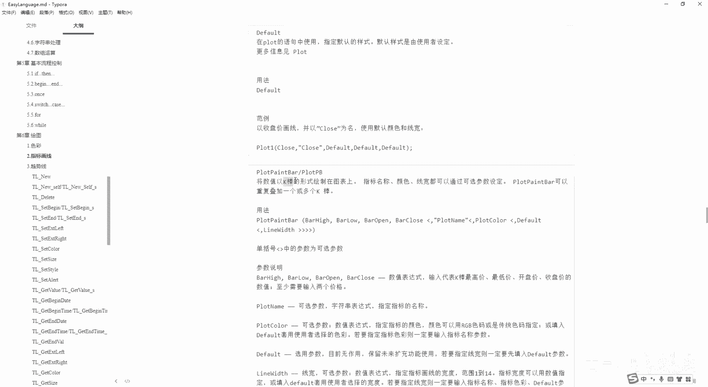

咱们上节课说了，给大家画一下专性图，专星图是什么意思呢。

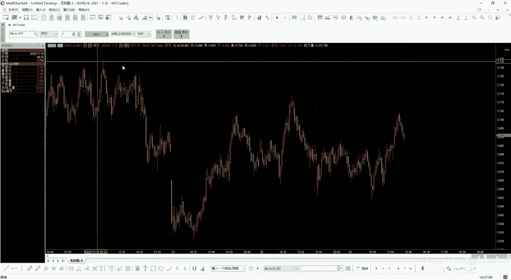

首先咱们怎么把它设置成专情图，就是点开设置商品，这它有一个设置是吧，以前都是这个样式啊什么的，这有个设置，这呢点开这个标准标准图，其实就是咱们的这个额蜡烛图，然后其他的咱们统称为异形图。

然后这里边有砖形图啊，然后它这里边有周期，有这个单位大小啊，有单位大小，包括你的组合方式啊，还有显示U08呀，显示主心啊，显示收盘价中断什么的。

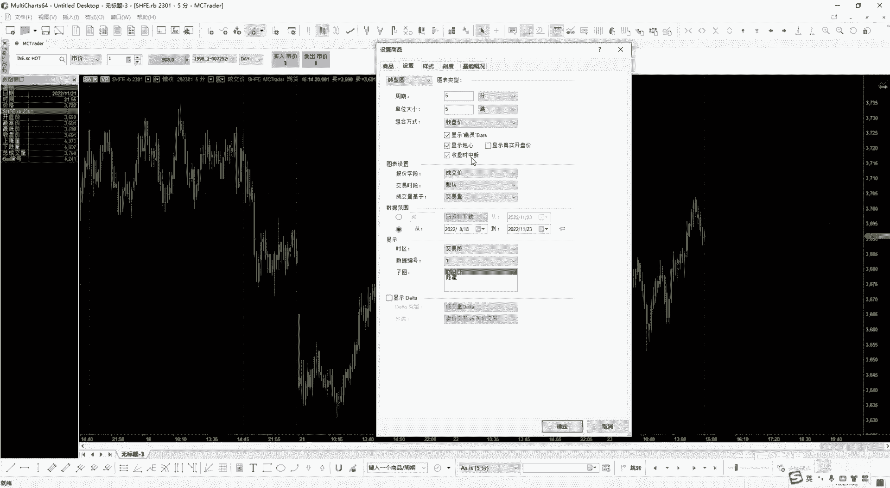

这个我给大家解释一下啊，就是咱也就是就是不看它这个显示的了，其实你最主要的他也是根据一个逻辑嘛，把这个图给画出来，就是咱们普通的这个K线图，它是通过一个横轴，一个纵轴，横轴其实是这个时间轴。

纵轴其实是它的一个他的这个高开低收，是一个价格轴是吧，专星图呢是抛开了什么呀，抛开了这个时间轴，比如说我一开始有一个价格啊，这个价格就是假设有一个价格啊，咱们别管是高开低收中哪个价格，这个可以。

你可以自己设，比如说tick里边的一个价格，比如说他就是100啊，提个里边来就是来了个价格，你设定好了他的砖块的高度，比如我高定高度设置成五，当它来比tick，它满足大于等于五的时候，他就画一块砖。

画一块砖，然后这一块砖的高度呢是五，当然他有可能比这个价格更高高价格更高，留着等着后边的tick再超过，达到了110的时候，他再画一块砖啊，比如说这个是110是吧，如果说你再来这个后边出现了一个价格。

变成105了，他这个横着的这块砖呢，它就不画了，他就直接是什么呢，就是说等你到100的时候，他在下面再画一块砖，到95的时候哎，下边再画一块砖，你要往上涨啊，这是95啊，你要是往上涨的话。

你必须得就是说涨到105，他再画一块砖啊，他是这样的一个逻辑啊，那个里边可能大家看到了，显示这个幽灵这个砖块是什么东西，就是我一下子比如说我今天收盘价格是100啊，就是上面这根线是100啊。

然后我一开盘的时候，我一下到130了，130，咱们按照正常的逻辑，他的下一根这个应该是这样是吧，上就是上面这是130，对不对啊，上面这是130，中间缺失的部分，你可以把它填充上，就是你可以给它填充。

把这个两块给它填上，那个叫幽灵砖，其实实际上并没有那个时间那个价格存在是吧，就是那个价格的时间并不存在，所以说叫幽灵砖啊，你如果捋捋清楚这个逻辑了，其实咱们就可以自己来进行。

这个这个这个这个砖形图的绘制了，对不对好。

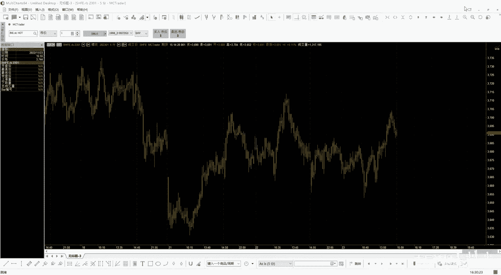

我新建一个清空一下啊，新建一个指标demo17，往下拉一下，A2，那我首先我得有这个就是高开低收吧，这个砖块的这个高开低收这个四个，因为你要画是通过这个plot那个呃paint bar是吧。

那个里边必须传的就是就是他是先传最高价，然后传最低价，然后传开盘收盘，其实专星图里边儿就是最高最低，就是其实用处不是特别大，对不对，但是你绘图的话，你必须得要就是最高最低，所以说它这个最高和最低。

应该是和这个开盘和收盘其中一个相等的是吧，最高价要么等于开盘，如果是是这个上涨的砖块的话，它就等于这个开盘价啊，上涨的砖块它最低价就等于开盘价，然后最高价就等于收盘价，下跌的砖块，它这个最低价呃。

就是等于它的这个收盘价，最高价就是等于它的这个开盘价，对不对，那么首先咱们input一个参数参数，比如说我这个他的这个锚定的，我起跳它的这个砖块的高度对吧，砖块是BRACK吧，break应该是这个啊。

嗨比如说我给它设成十，当然如果说有一些有一些品种，它一跳就是十个点一跳，你就你就不太适合了，你应该把它设的更大一些对吧，然后我这个变量里边我设置什么，肯定是这个hi哎。

就是b r i c k break high，然后零，然后BRICK布啊，Break low0，然后b r i c k break open。

然后b r i c k break clothes等于零对吧，我最起码得有这个四个吧，啊首先咱们先设这个四个呃，你首先第一个，如果说if can busee you，看板等于一的时候。

就是它最初始的时候，then我先把他的这个b r i c k break，这个应该是open给它设置，为什么呀，OPEN啊，对不对，把他的这个break open，把它设置成close，后边再来K线。

或者说再来这个他的就是咱们这个变量，就是这个这个数值，咱们再说对吧，我首先先给这个break open，先给设置上一个值，就是这个close好，那下面咱们分两个CONDICTION。

就是第一个connection就是上涨的就是up啊，第二个connection呢就是下跌的就是down，是吧，就是你这两个方式啊，肯定是一是什么，肯定是一它应该是等于是什么呢，你的这个当前的。

比如说我这边设一个price value吧，price value我先用close，当然你也可以用别的啊，我这个price p i c e price value。

我的这个序列值就是传递过来的这个值序列值，price value他应该是大于，因为是up嘛，就是往上去画砖是吧，画这个上涨砖应该是大于什么呀，大于就是我的这个哎就是什么呀。

就是open就是break open b i c k break open，加上这个咱们的这个break high，这个high是一样了是吧，break啊，break length吧。

E n g t h，break length应该是加上他的这个BRICK啊，break length g t h对吧，大于或者等于你才能画砖呢，对不对，好啊，这个都没问题啊。

同样的我用CONDICTION2来表示这个下跌肯定是二，他应该是什么啊，这个price value应该是小于等于啊，他的这个应该是减去一块砖的这个高度，什么意思，我第一根我先有了一个基准价。

就是这个open，就当它的这个这个这个这个专用图的开盘价，如果下一笔价格来了之后，如果说是大于等于我这块砖的高度，比如我大于等于它了，比如说这个价格是在这，我是不是可以就化砖了是吧。

我是不是就可以去画第一块砖了是吧，这是上涨砖嘛，如果说是小于它，我应该是画这个下跌砖，对不对，能理解这个意思吧，啊这个就是第一块的这个逻辑，那我已经有了这个价格之后哈，它价格传递过来之后。

那我就得给就是别的这个high low，还有close来进行赋值了对吧，所以说if肯定是一，then begin先写上是吧，然后这儿写一个end，我这里边首先就是说应该你应该是，就是说画上涨砖的时候。

咱们就以他的这个上涨吗，是往上走的这个砖块的时候，咱们应该以以他的这个最高价为这个基准，最低价就是它减去一个高度，对不对，然后他的这个开盘价肯定是它的最低价，然后他的收盘价就是它的最高价。

就是他的这个就是上面这个就是这根线，就是最高价嘛，是不是有了你的这个最高价，那是不是就是其他的另外三个就都有值了啊，就都有值了，能理解这个意思吧，所以说咱们要算的就是他的这个最高价是多少。

就是这个breaking hi应该是等于它应该等于什么呢，它应该等于就比如说啊，我这块砖原来是这样的啊，比如说他这是100，就是砖块的这个length是十，突然来了一个价格，比如说是113是吧。

那我的最高价是不是就应该等于113，先把三给减了，就是110是吧，最高价是等于110吧，但是如果说我这是100来了一个价格，突然来了一个价格是153，那我是不是应该画这个应该是从140开始。

然后到150给他画出来，对不对，应该是画这样一块砖是吧，那应该是怎么算呢，你就应该是153，应该哎就是说除以十取一个整数，用FLO，咱们之前学过用用用floor，然后再乘以一个它的这个砖块的高度对吧。

就是咱们这个break length乘上，是不是就等于它的最高价了，比如说你来了一个173，你看173除以十等于十七十七，再乘以一个BROKLINS，十就是等于170，就是它的最高价了吧，对不对。

一定要是floor啊，不能是那个ceiling，天花板，一定要是地板，是不是啊，当然你也可以取那个整数是吧，咱们就用这个flow就可以啊，好那你这个break high就应该是等于什么。

咱们刚才那个逻辑就应该是等于我的这个price value，然后除以一个这个break b i c k break length，除完它之后再乘以一个啊，不是应该是先是floor是吧。

前面f l o r flow，然后再乘以一个什么呀，再乘以一个brb r i c k break，是不是应该是这样，就把这个break high给定义出来了，那有了break high。

那你你break low就等于我这个b i c k break high，然后减去我的这个BICKBREAKLENGTH，是不是，然后我的这个b i c k break open。

就应该它的开盘价就等于break low吧，因为它是上涨砖，所以说它的开盘价，应该是跟他的这个最低价相等，然后break clothes就等于它的这个不啊，break high是不是它的这个最高价。

对吧，这四块砖是不是啊，不是这四个数是不是就有了，有了之后，然后我就可以plot paint bar，然后这个里边high就b i c k break hi h i g h。

然后它的low就是b r AC k l o w low，然后open就是BRICK这个open，然后收盘价就是b i c k close，是不是我就可以给它画出来了吧对吧，同样的这个逻辑。

咱们在这个第二个肯定是二这if condiction，2then begin，好同样的跟上一个end，首先你肯定是二，就是往下走的时候，这有块砖，你往下走，那是不是应该我这个价格啊。

比如说这个价格是100，我变成了啊85，比如这个就是我有一个价格是85，那我是不是应该我这个85我除以18。5，然后我取上天花板就是九对吧，就是那个ceiling，是不是，然后我取上这个九。

然后九乘以再乘以个十，就是90吧，这应该是画上90，对不对，然后这应该比他多一个就是100是吧，同样的，如果说我这有一个砖，二，它是100的话，我下一根我突然来了个35，比如说我来了个35这个价格。

那我是不是应该拿35÷13。5，我往上取取，这个天花板就是比它大的最小的整数，我应该取四，所以说它的最低价应该是40，然后它的最高价就变成50，应该这么来画，对不对啊，这个就把之前咱们学的就用上了吧。

所以说它的锚定应该是用break low等于什么呀，就是black law，应该是等于，等于这个应该是用price value，然后除以除以这个b i c k break length，除除完它之后。

你从前面应该加上ceiling，cee ceiling啊，然后再乘以一个BICKBREAKLENGTH，然后再封号是吧，它是不是就有了，然后有了break low。

那break high就等于b i c k low w，加上一个这个BICKBREAKLENGTH，然后break open就等于open，它因为是往下跌的，那它应该就等于break high是吧。

然后他的这个b r i c k black low啊，black clothes下划线就应该等于BACK，它的收盘价收应该等于它的最低价，对不对，然后这个时候plot一个八啊，plot这个paint吧。

然后这个里边同样的，把这个四个给它放进去是吧，同样的把四个放进去，你一定不要觉得这两个代码一样，你就把它们放到外边去写了啊，一起去写了，不是的，不是每一根K线都能满足这个条件的好。

这个时候咱们再捋一下这个逻辑，你看咱们都是用break open来做，就是说这个定义的，比如我执行一遍这个代码之后，我第一个看着bu等于一的时候，他break open等于close是吧。

然后我在外边我是不是应该加上什么呀，就是说if current bar，大于一，then begin是吧，我别让它执行两遍了，把整个的tab一下，然后这加一个end啊，大于一的时候。

我你去判断它的这个传递过来的这个价格，是不是比它这个大，比他这个价，因为这个break open已经有这个价格了吧，如果说比它大了，它是一根上涨K线。

那你的break open就复制成了他的这个最低价格，是不是，那如果说你下一格是一个下跌的，那会用这个break o，就是这个它的最低价来做一个对比，是不是完全符合咱们之前铝的这个逻辑。

来划线的这个逻辑，比如说这是第一根专线图，第二个专用图它往上涨了，那你标的的不这个open是不是就这个是吧，你用它来进行一个对比，比如说下跌了超过这个价格了，是不是可以从这就画一块砖是吧。

然后如果说比他还就是这个时候他这个不让open，就会变成他的这个最高价啊，他的这个最高价最高价最高价你再来看的时候，就是说你再来进行判定的时候，如果说他还是比它低，它是不是会画无数根这样的线出来。

如果说它价格一直这样横着的话，他会有重叠的，就是跟他就是平高平低的，会有很多根出来，这是不是就会有问题啊，捋一下这个逻辑，这个是不是就会有问题，如果说我进行一下编译，我把它给画出来啊。

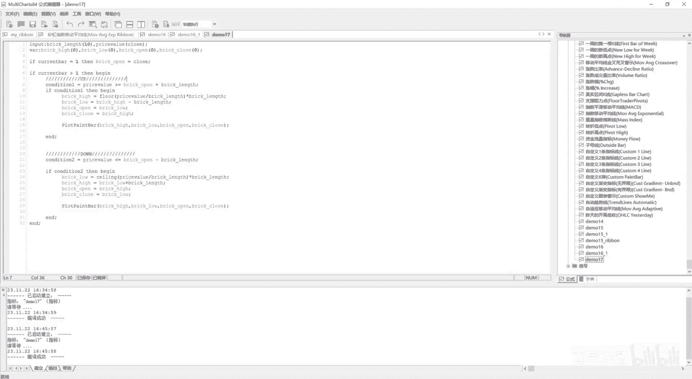

同样的用这个我插入一个，它是螺纹是吧。

插入一个指标，用demo17，然后high low tick是吧，属性在底部显示，然后刻度和上面相同。

这就跟咱们的逻辑不太一样了吧，我给它放大一些啊，你会发现咱们是不应该出现这种平角的，这种县的是不是平齐的，这样的线是不应该出现的是吧。

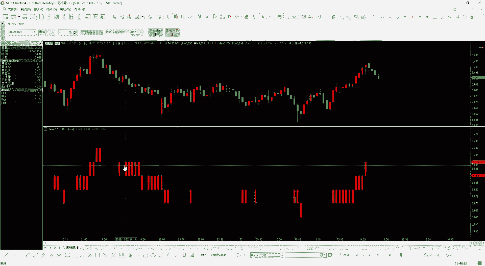

所以说你这个逻辑就不太一样了，所以说你从这应该是什么begin，然后这个等于等于close啊，我先加一个end啊。

然后应该是break b r i c k open open clothes等于close，就是我第一次赋值的时候，我把它都给赋上，然后这个high等于close，然后这个，啊漏，等于close啊。

我打开我把它都给附上，然后把这个然后下面再做基准的时候，应该是做什么基准的，就是我如果说上涨坝的话，我应该跟什么来比呢，就是上涨坝的话，就是说我应该是跟他这前一根K线，这个最高点来比是吧。

如果说是下跌罢的话，我应该跟它的最低点来比，对不对，所以说你这应该是break high，就是它的最高价来比，然后这个呢应该是BREAKLOW最低价来比，一开始写break open。

是给大家从第一根K线去捋这个逻辑是吧，他有开盘价呀什么的是吧。

然后你现在一画出来这个图发现有问题，那就是你的这个对比的方式有问题是吧。

啊当然可能自己去找的时候可能不会这么简单。

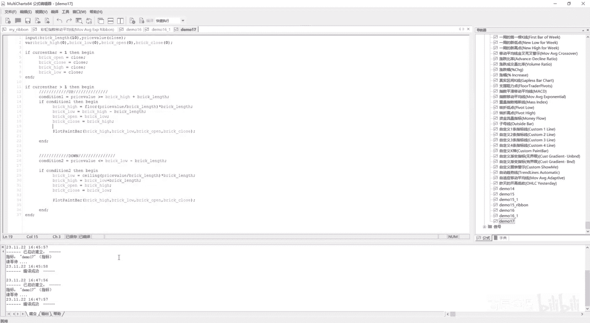

因为我是之我是之前写过的嘛是吧。

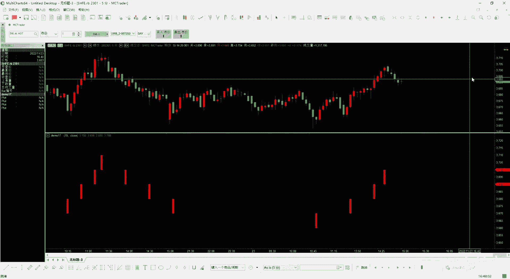

之前写过的啊，这个就是咱们的这个专心图了，诶。

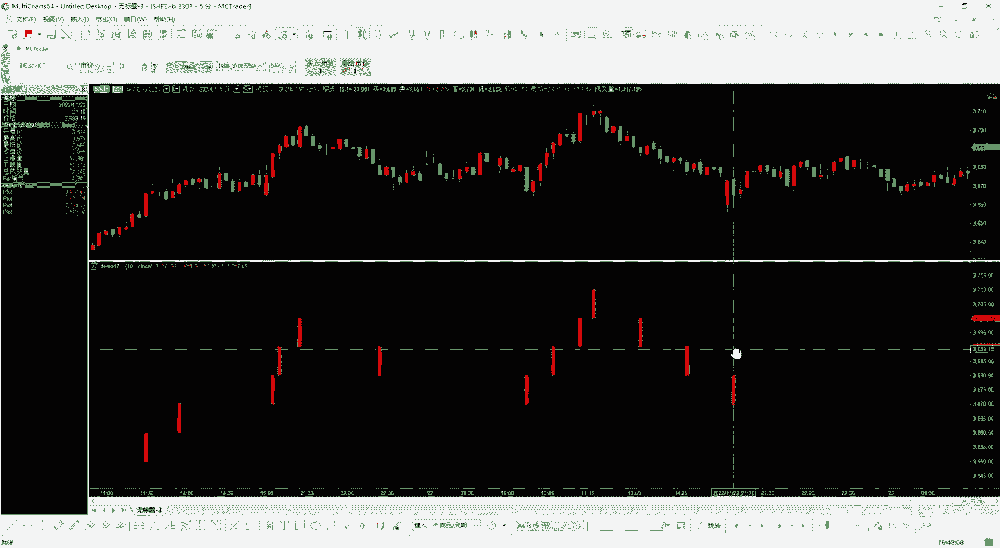

咱们发现它的这个颜色上涨的是红色，没有问题，你下跌了应该是变成绿色对吧啊。

这个时候咱们可以设一下设怎么设，咱们可以看一下他的这个啊，他的这个有这个名字，你必须得写的吧，写完名字你才能写这个颜色吧，所以说咱们从后边加上名字啊，就是说这个比如说up。

然后他的这个color read就是上涨的，我是用read，然后这个下跌的down，然后我是用green，然后进行一下编译好。

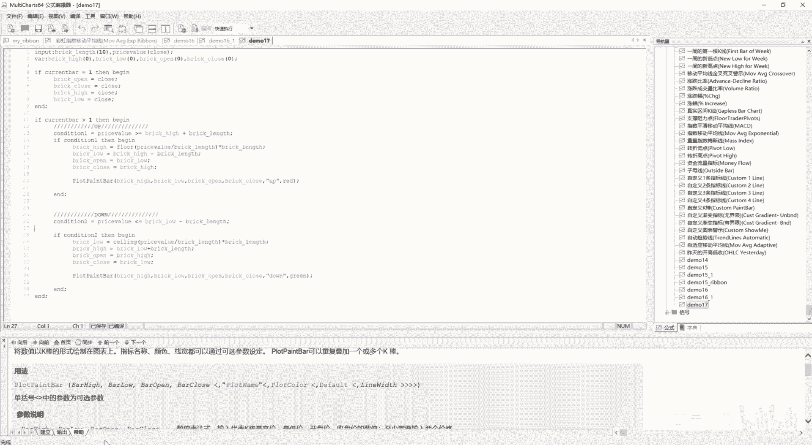

咱们再看一下是不是就变成绿色的了啊，而且他没有平起的是吧。

这个都是就是头跟尾都是连着的，你像这个肯定就是说有一根下就是下跌的。

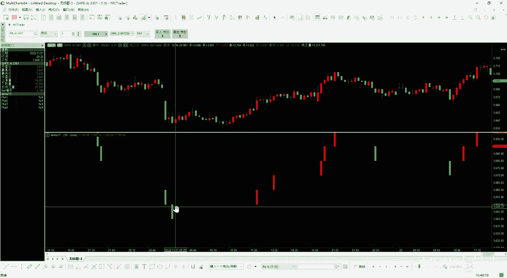

然后才有上涨的啊，这个就是这个就是咱们的专心图。

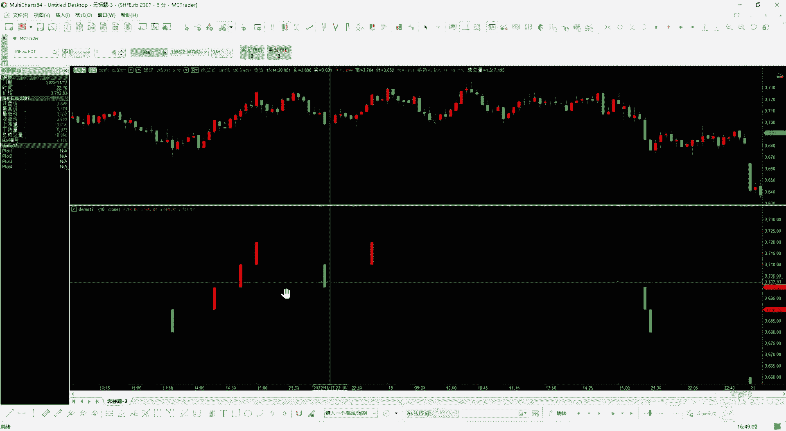

自己写的这个专星图啊。

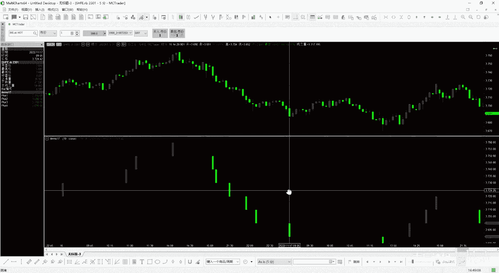

就是异形图，如果说你想要去使用这个异形图的话，你可以怎么做呀，就是我既然有这种有这些高开低收了，我是不是可以用四个数额，四个数组给他给存起来，存起来之后可以根据你的指标来进行计算是吧。

把这个每一次形成一块砖块，我都给他存一下，然后再进行你所需要的均线也好呀，或者一些其他指标的运算，是不是这样就可以了，对不对，这个还是希望大家自己去捋一捋逻辑，然后自己去画一画。

一开始肯定会觉得有一些绕，但是你既然想去往这方面走，你肯定得付出努力的，不可能那么轻轻松松的对吧，而且MC更加专注于逻辑，其实这是一件好事好，那咱们这个就说完了啊，那个画的专业图也给大家画了啊。

咱咱们接着往后走，第二个是这个NO plot，就是从图表上隐藏指定的指标啊，符合条件已经绘制了的指标，在K线结束之前，即使条件不再符合，仍然会继续保留在图表上咳。

NO plot能够用来隐藏不再符合条件的指标，这个我就不演示了啊，这下面有个这个演示的这个代码，就是从这儿你会发现啊，它plot pint bar就是后边是high和low，那就是就是这个高点和低点啊。

high和low，然后你会发现它NO plot1，No plot2，这个plot后边应该是plot number，就是你我用plot1和plot2pro3，我画出来线。

我用NO plot就把他这个隐藏了是吧，把第一条线隐藏吧，第二条隐藏，这这可能就是这个逻辑很容易理解，那这个我画的是这个砖块，就是我画的是这个K线图K线，那我就说怎么会有这个这个这个plot1。

plot2呢，其实在这个解释里边啊，其实就在这个里边，你看啊，这就是它这个plot paint bar就是high low open close，它就相当于等同于画了四个，就是1~4。

就是plus1plus2，Plus3，Plus4，Hello，Open close，分别给你画上了，就是它其实隐藏的，就是把plot1和plot2给你隐藏掉了，对吧啊，就是这个意思啊。

呃你可以做一下演示，你像这样的代码写出来之后，它本身画的就是一个high，一个low是吧嗯，就是就是如果说你满足hi小于，就是前一个就是最高价比前一个最高价低，然后他会画出这个图来，如果说不满足的话。

他会把这个隐藏掉，它就是不会再画了，好吧啊，就这个意思，这个没什么太多好说的，就是为特定的编号指定线宽。

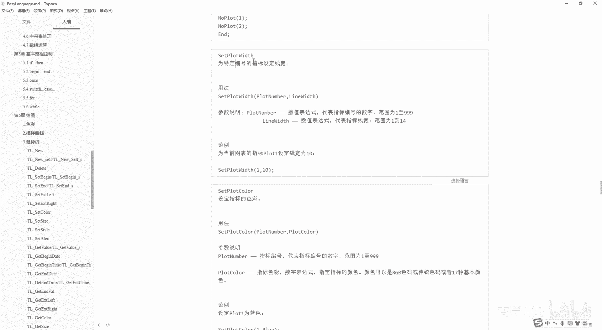

线宽都知道是什么意思吧，就是咱们在设定的时候设置这个指标。

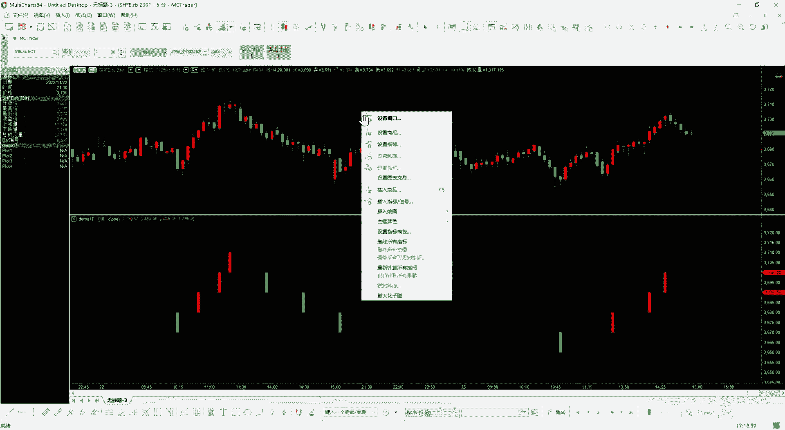

设置的时候，你这个线宽就是这个粗细嘛，样式是style，就是它这个线的这个样式啊。

这个没什么好掩饰的，也没什么好说的，这个set plot color就是设置指指定的色彩色彩，咱们之前就是单独讲过是吧，你后边儿要么是放这个直接关键字颜色，要么是换这个RGB颜色。

但是如果说你要放传统色，用数值来表示的话，你一定要把这个legency color value等true，用这个中括号给括上，就是说白了，就是把这个传统色的这个数值给打开，为什么要打开它呀，因为什么呀。

你这个RGB它也是数值数值是吧，而且他是从零到就是那个特别大的那个数，你这个如果说就是也是数值的话，它是它会冲突对吧啊，set it plot bg卡拉，这个仅用在市场扫描器窗口中啊，这个也给大家讲了。

就是他的这个背景色是吧，背景色也给大家讲了啊，这个也不说了，这个get background color就是取得图表背景色的色嘛，这个也没啥好说的。

这个get plot with就是取得指定指标的这个宽度啊，就是这个注意的就是这个plot number，咱们一再说他是这个你是用的plot1还是plus，二还是plus3啊。

然后你会发现一般是sit plot color，就是设置他的这个颜色，还有git pluka，就是获取它的颜色啊，它都会对应着的，这个都没什么好说的了，BG就是你理解为background。

就这个BACK就是background啊，就是背景啊，就这个background就是BG啊，看了好，咱们说一下趋势线，趋势线是用来判定行情方向的辅助线，趋势线可以是线段。

或者是向左右二端延伸出去的射线呃，在MC中每个趋势线都是独立的，物件也好，指标也好，就是这个就这么一个表述啊，我们可以利用人工费绘制，或者透过指标的脚本自动，就是说白了。

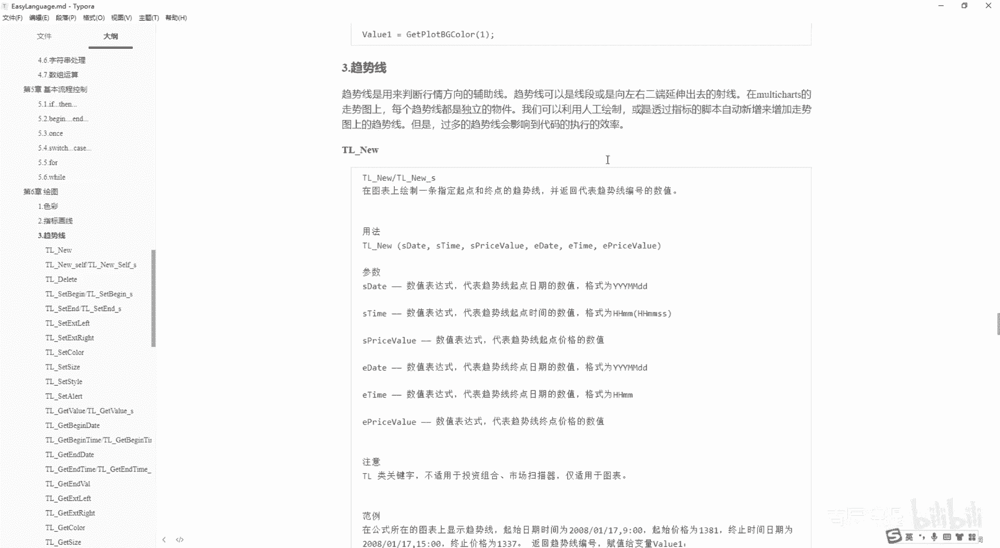

就是可以自己在上面去添这个趋势线，也可以通过代码来画。

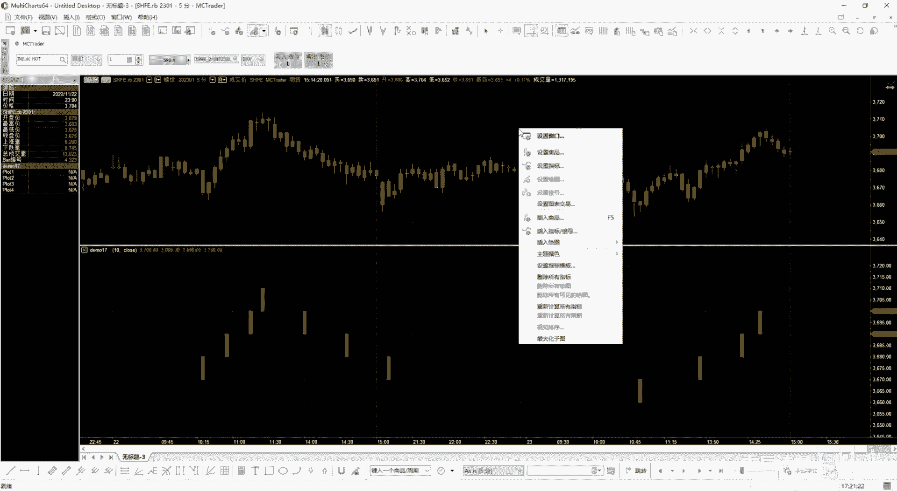

咱们先把这个先给关掉啊，好自己来画趋势线。

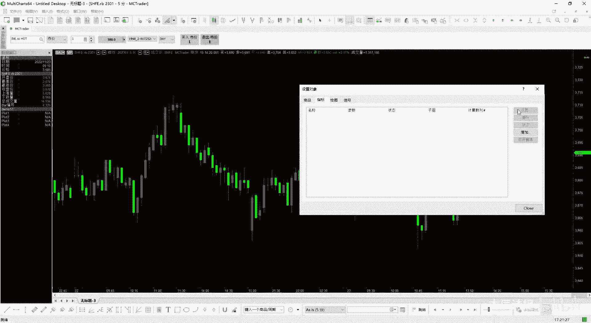

怎么画呢，右击然后插入绘图，这儿有这个时间线，趋势线唉，还有上上肩呃，上下箭头向上，箭头椭圆什么的啊，都有这趋势线，比如说我从这儿画一个哎，这画到这，哎他就是一个趋势线吧。

然后你还可以设置趋势线这个里边什么极值啊，定点呀，回归啊什么的啊，然后就是定什么这个K线上啊，这个其实这两个啊，这两个就是四个值嘛，就是决定了这一个趋势线，对不对是吧，就决就决定了这根趋势线吧。

一条趋势线你最起码确定两个点，那每一个点呢，他在咱们这个图表上是有X轴和Y轴的对吧，X轴是什么呀，X轴其实就是日期和时间吧，然后你从这你会发现MC的，其实设计师真是特别的好，就特别的巧妙。

他把这个X就是时间，它本身的时间就是数值，所以说你从这你只要确定好时间和日期，是不是就确定好了一个点的X轴，Y轴是什么呀，就是价格嘛对吧，你你再给他一个价格，是不是在一个平面上就确定了一个点。

另外一个点是不是也是这么个意思，所以说在咱们这个上面TL就是new这个划线。

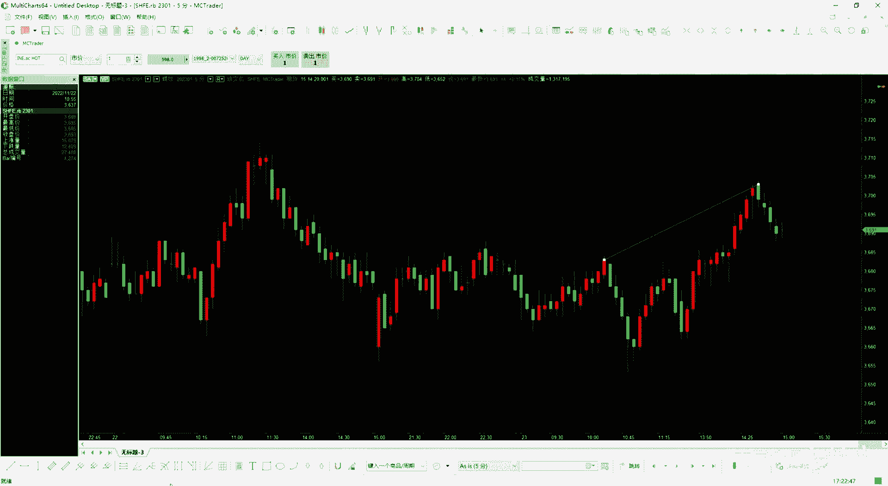

它就是什么呀，就是开始这个点的日期时间，然后还有价格，就是这个是X轴，这个是Y轴，是不是就是一个点对吧，然后结束点的日期时间还是价格，这个是第二个点吗。

它不就能画成了一条线了吗，对不对，好给大家做一下演示啊。

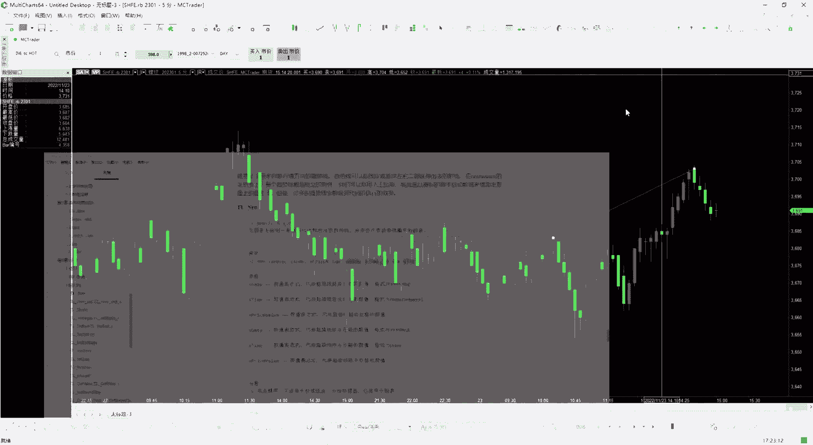

我先把这个线先给删掉，我从这儿新建一个吧，指标，哎DEM17杠一好TL6，这里边需要传入的日期。

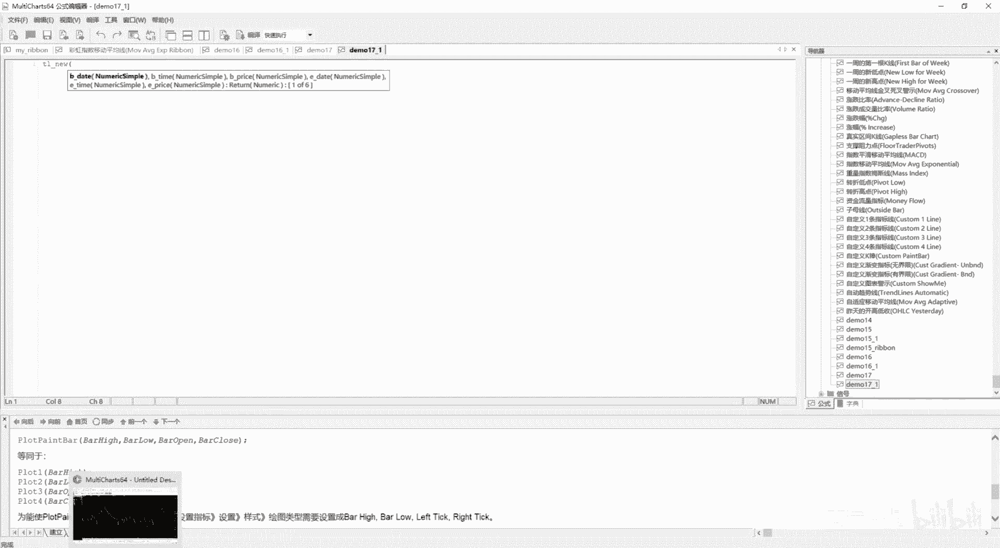

我把那一个缩小一下啊，咱们还是这是吧，额日期是22年，就是12211231221123啊，然后他的时间是10151015，然后它的价格价格是多少呢，3683，好第二个开始的时间是这个122123。

1221123是吧，然后他的这个时间啊，之前那个是日期1440，时间是1440，然后他的这个价格价格是37033703，是不是这样，他就可以去画成一条线了。

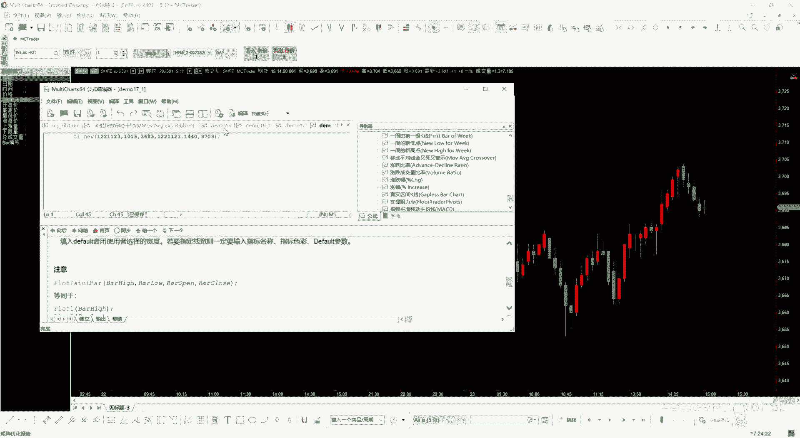

我进行下编译，然后这是十十七杠一啊，插入指标。

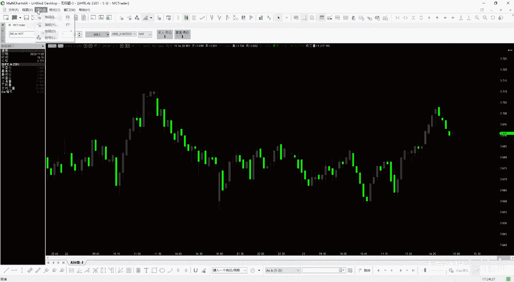

然后17杠一，然后样式在子图一显示刻度和商品相同。

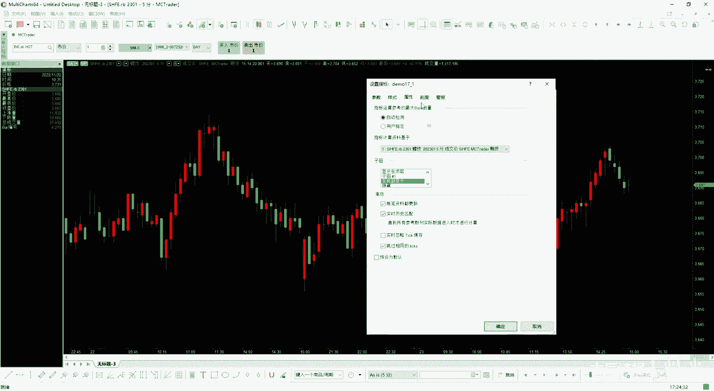

你会发现它就有一根这个线了，就是有一条这个线了吧，嗯其实很多人都会说，我画一条这个线干什么呀，他其实画一条这个线是为了向未来去延伸，对不对，我是不是可以把它延延伸到后边，向右去延伸，延伸怎么来写啊。

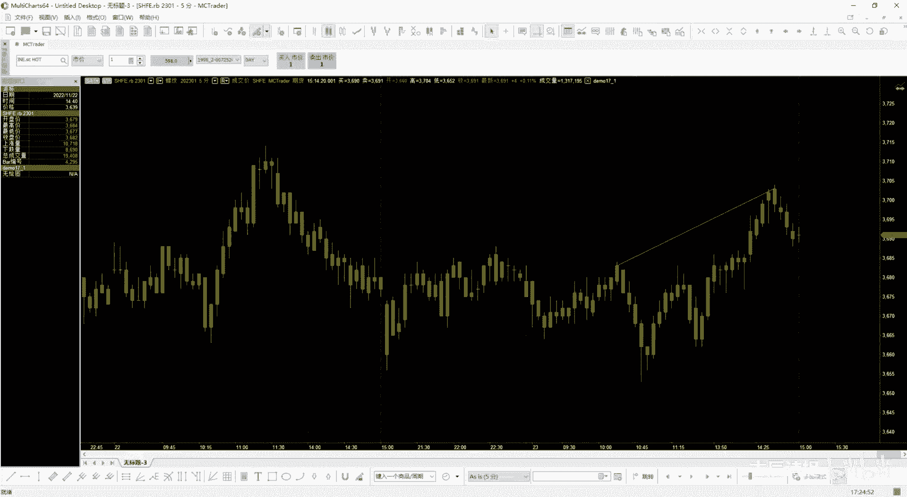

就是也是可以的啊，就是TL下划线set，然后EXT，然后向右就是right e x t right，然后TD就是til i d，同样它它也是有编号的，我用value1去接一下他的数值编号。

然后把这个id放到value1这来，然后布尔就是true，就是告诉他要向右延伸啊，这个时候我再进行一下编译，你会发现它就会向右来延伸，然后呢你还能从这去获取到这个值，就是咱们要进行就是信号的操作。

是不是你应该这条线画出来之后，我到我应该比如说我运行到这根K线了，我应该获取到他的这个值进行对比吗，如果突破了会怎么样是吧，或者碰到了会怎么样是吧，我就应该是碰到了，我应该就是做空是吧。

我确定我觉得他大概率会往下走是吧，是这样的一个逻辑吧，所以说你要去取得值的，你不取得值，你光画一个线有啥用啊，所以说你要取得值的，你取值应该是什么呀，肯定是get value嘛，是不是。

所以说你应该是什么，If last but on chat，就是最后一个啊，then begin好，它取值是什么呢，就是get就是t l get value是吧，这里边参数是什么呀。

id value1吧，传进去吧，date就是我当前这根K线的，就是这个last bar这根K线的date，然后time就是我当前的这个time，对不对，然后它返回一个值。

我把这个值呢设成value2等于这个，然后我print一下这个V62，是不是，然后一个end啊，然后进行一下编译，看一下输出啊，就是在在编译啊，他是一个值吧，3706。08，就是这儿看一下啊。

是不是3706基本上跟这个一样吧，所以说你就可以进行判定了吧，啊这个就是画趋势线，当然还有一些别的内容。

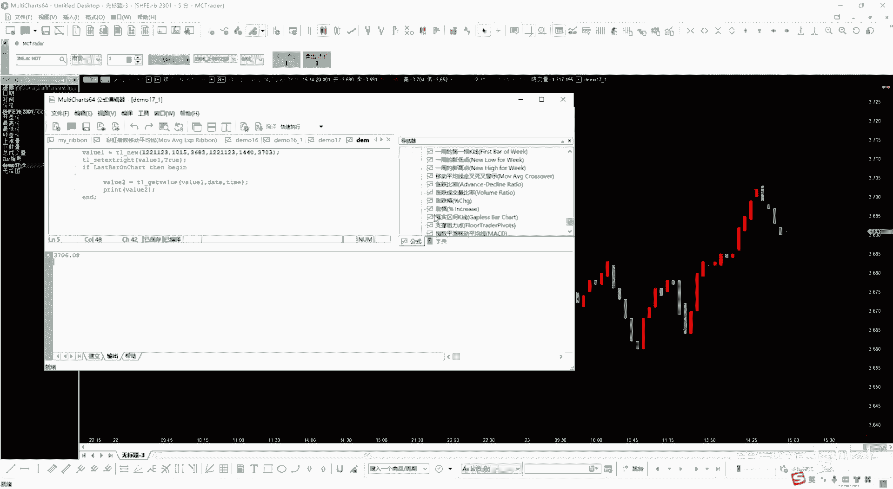