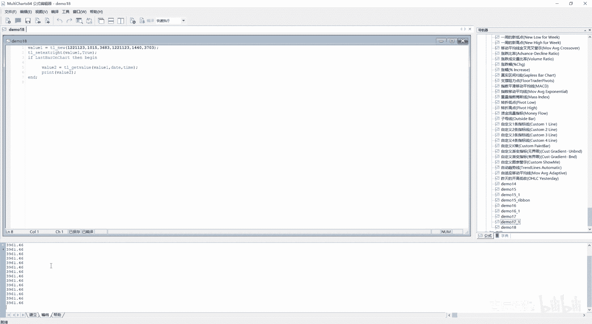
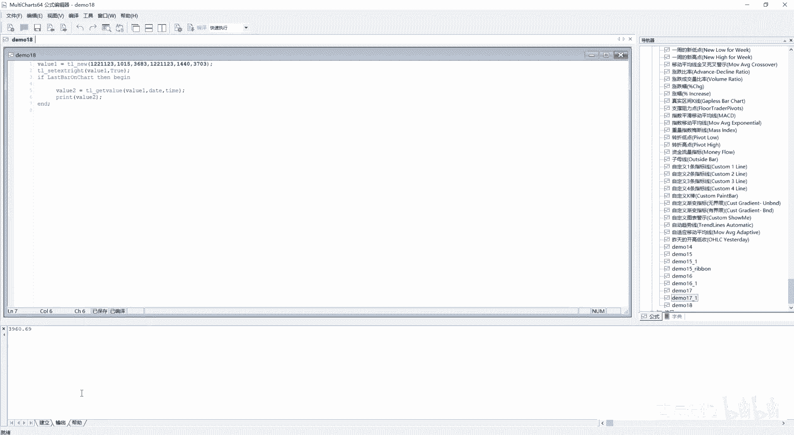
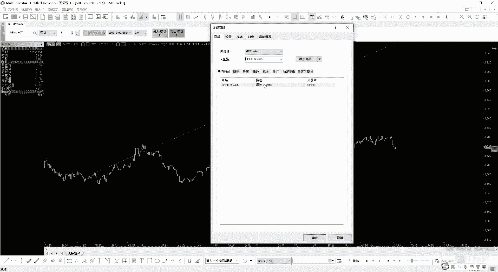
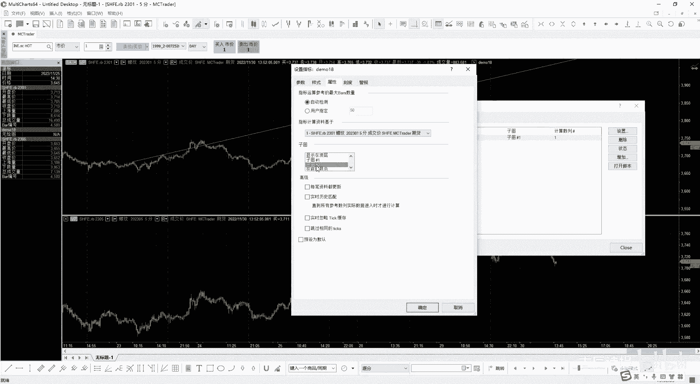
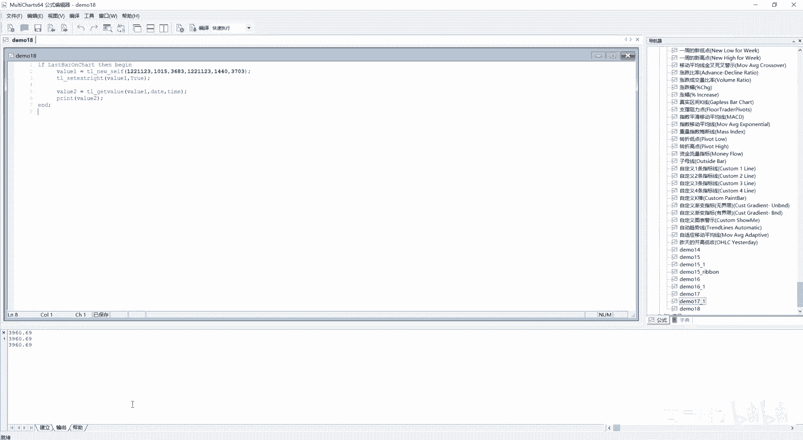
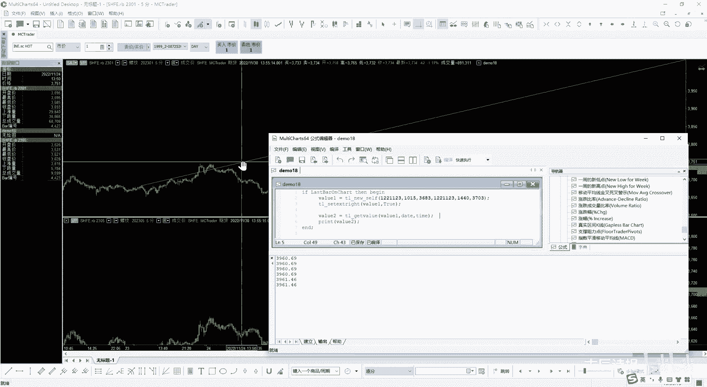
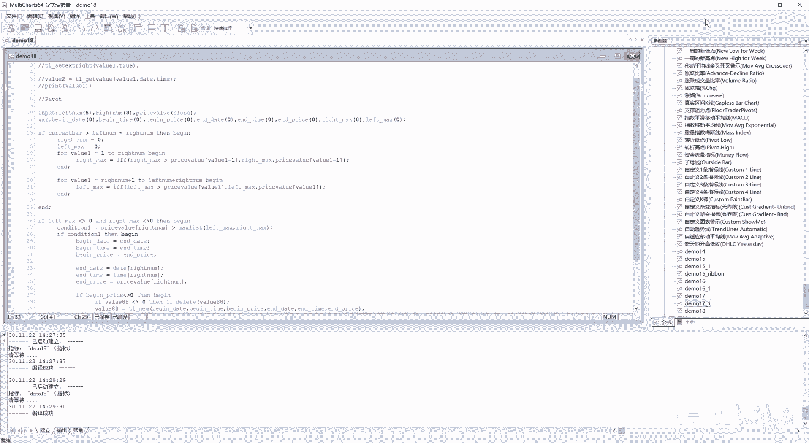

# 第18节课 绘图4 趋势线2 - P1 - 古辰诗提 - BV1VjpEesEjA

欢迎大家来到从零开始量化系列课程，MC课程的第18节课，上一节课咱们说到了画这个趋势线，画趋势线上一节课也给大家做了一个小的案例，就是这样直接你写入固定的起始时间，然后不是起始日期。

起始时间和你的这个起始价格和你的结束日期，结束时间和你的结束价格，然后在这个图表上你去画两条线啊，画一条线出来，确定两个点，然后画一条线，然后下面这个就是get value呢。

它是获取到你当前就是last bon chart，它的一个这个值，然后这个sit这个ex这个right就是向右去延展，当然它也可以去向左去延展，当然咱们在写策略的时候，向右向左一般都会向右是吧。

向左因为是历史上的嘛，嗯就是一般情况下都会向右啊，然后咱们嗯我先给他新建一个吧，好咱们把上一节课的这个给粘过来啊，给大家讲，好那这个就说完了，其实很简单，你别看它后边的参数很复杂。

不要看他后边的参数很复杂，其实很简单，然后这儿呢有一个s time，s time呢，它是HHMM一般是默认的嘛对吧，但是他这还会有一个这个这个tr6S，这个就不用多说了。

其实就是这个时间格式上它会多出秒对吧，这个很容易理解，下面有一个这个tl new self，这个是tr tr new，后边这个加了一个下划线self，它是代表什么意思呢，这个给大家演示一下啊。

同样的咱们还是用这个，就是咱们之前这节课给大家演示的，我再进行一下编译啊，然后呢我给加上图表啊，然后demo18设置一下刻度和上面相同属性，在这个子图一就是在这个图表一来显示，你会发现有这个线了，对吧。

嗯啊有这个线了，有有这个线呢，其实last but on chart，它也会额输出这个价格啊，你会发现3961。46，而且它不断的在更新，这个是咱们老早以前就说过的，他是什么呀。

就是每一笔tick它都会来更新这个数据。

如果说你不想让它每笔tick都来更新的话，就是设置这个指标，在这每笔资料都更新，这给他去掉。

它就不会每笔tick都更新了，清除一下它就不会有了吧，只有你在进行编译的时候，我编译一下啊，它才会有。

或者说是你这根K线走完了之后，它才会有新的这个输出，就是更新这个图表好，这个时候呢我给它插入一个商品，就是一个数据二商品，然后我给它插入，比如说2305吧，2305好。

为了插入进来，我想让这个趋势线啊在2305上来显示，那想让趋势线在2305上来显示，这个时候趋势线其实是在上面来显示的对吧，我想让它显示到2305，你这个时候呢我设置指标，我从这点击一下设置。

我给它显示到子图二。

咱们可以看一下它的，它能不能在子图二显示啊，它是显示不了的，这个时候呢如果说你把它改成下划线self，进行一下编译，你会发现啊，它是显示在子图二的啊，它是显示在子图二的是吧，这个。

这个tr new self它的意思其实是什么，就是你如果说想指定这个趋势线，在别的数据里边，就是说当然你用在主图上也是可以的啊，如果说你想用在别的图上去显示的话，就是它的附属图或者它的子图去显示的话。

你用tr6是不行的，你必须得用tr new self，然后从刚才咱们这个设置的这个就是指标，这来进行给它设置啊，你显示在子图几就可以了啊，其实这个就是这个意思，就是他为什么加self，你你就这么理解下。

就是其实这个self在Python里边用的非常非常的多，是在类里边去用的，其实就是我给他指到那个图，这个图呢就代表本体是吧，就在这个图上来显示啊，就是self，你就这么去理解它就可以了啊，好吧。

这个就是他的就是这个self啊，和这个没有self的区别，另外这个self还会有个下划线S，其实还是这个时间格式的问题，另外一个咱们再捋一下，咱们这个代码这个逻辑啊。

其实你会发现其实这个代码逻辑是不太好的啊，是不太好的，你看啊，我value1，我的就是我是写在了这对吧，这其实它就开始划线了，然后这呢是向右进行延展。

然后我这写了一个if last but on chart，这是什么意思，就是如果说当前K线是当前这个图表的，最后一根K线，然后我就开始划线，其实前面在执行那么多K线的时候，一根一根来执行的时候。

前面有好多嘛来执行的时候，它都会执行上面的代码，只不过是有的画的出来，有的画不出来对吧，当执行到因为它是一根一根的来走的嘛，就是一根K线，一根K线的去便利，当执行到能画的时候，他才会去画的啊。

当执行到能画的时候，他才会去画的，所以说其实这个你会造成这个代码资源的浪费，你完全可以给它写在下面是吧，你完全可以给他写，写在下面啊。

然后这个时候我进行一下编译啊，这个它就会会快一点，比如说我在设置指标，我把它设置到子图一的时候，你会发现它会很快，刚才的时候你会发现我在给它设置的时候，或者重新加载这个代码的时候，它会很慢。

那是因为就是你在执行的时候，他得去便利，就是它会很慢，他也会执行这个去画图，只不过有的画的出来，有的画不出来啊，它会很慢，但是你到这时候呢，它就能够很快的给你画出来。

这就是代码逻辑顺序的问题，好吧，因为你的代码想去执行的话，你必须得加载到图片上，一加载图片一加载这个图表上的话，它就代表它不止一次的去执行，它会执行很多遍，有一根K线它就会执行一根K线呃，执行一遍。

当然你得把前面的这个参考八给去掉啊，你一定要捋清楚这个逻辑，好吧好，下一个是tear delete，就是从图表中删除指定id号的趋势线，首先你得知道这个id号啊，id号其实就是这个tr new。

它会有返回值的，这个返回值呢就是它的这个数值的编号，咱们可以看一下这个代码，咱们可以输出一下这个Y61啊，这个Y61就是它的这个划线的返回值嘛，咱们进行一下编译，你会发现它是一啊，它是一。

我再给你验证一下，之前咱们把它放到外边，它的这个画的是个什，就是他的这个编号啊，你会发现就是你在里边跟在外边，它的这个它执行的效率是完全不一样，你会发现在外边它的编号就变成4700了。

在里边呢它就会变成一，为什么呀，因为这个上面代码它是反复的，其实是给你去画了，他有的没有画出来，因为没有这个时间，没有这个日期对吧，有这个时间没有这个日期啊，然后他就给你画了，但是他没画出来。

所以说它会执行效率会偏慢，所以说你像这样的代码，你一定要记住，就是它是放在里边儿，这样能更大限度的减少它的这个消耗，你会发现它会是一对吧啊，它会是一，所以说这一点你一定要记清楚了，咱们在写代码的时候。

如果说用到这个t l new去划线的时候，你肯定是你去做回测的时候，你得从一开始去划线对吧，然后后边去判定它有没有超过，那个就是说它的这个趋势线的这个价格，哎如果上穿了我就怎么样。

下穿了我会怎我会怎么样，如果说你不控制它的话，它这里边线会画很多很多，比如说我先把这个指标，我先给它状态性的关一下，然后我把这个图表二给它删掉啊，这是商品给它删除好，这个时候我再重新改一下这个代码。

我再重新改一下这个代码，我不是if last bon chart了，我直接把它给关掉，然后我也先不让它去往外去延展啊，先不让它往外去延延展，咱们就去画这个线段。

然后咱们print一下这个value in，你会发现啊，他会画很多很多，当然这个你得给它设成变量啊，你得给它设成变量，比如说我从这要怎么来划线呢，划线咱们一般都是高低点嘛对吧，我把这个。

我把这个给调过来啊，就是高低点高低点怎么去划线，比如说我发现了两个，就是两个高点啊，两个高点，然后我来这样去画一条线对吧，所以说你得确定两个高点，它的值，两个高点它的值，你确定了它的这个值时间和日期。

然后你是不是就可以划线，然后后边就可以进行判定了，对不对是吧，后边就可以进行判定了吗，那这个代码你怎么去写呢，在这个咱们MC里边，其实又有去找这个高点的这个方法，就是PIVOT就是跟它相关的呢。

也会有很多代码，比如这个high vs就是找高点啊，然后HIVS8就是找到高点的那根拔线啊，就是就是基本上都是以这个拍PIVOT，开头的，但是你会发现啊，他找到的他是什么呀，就是说是这个返回枢轴点。

枢轴点其实就是高低点啊，的值和出现输和出现这个书轴的之间，柱状线数量，你会发现它不是咱们要又要要的，因为咱们要时间日期啊，还有就是这个价格对吧，价格好获取，就是这个时间和日期咱们是需要的。

那咱们要这个时间和日期，然后就是你你用这个的话，它是获取不到的对吧，或者说是跟咱们就是说，就是想要的东西不太一样，所以说咱们得自己写啊，如何去自己来写，咱们之前也学过数组，也学过变量，也学过这个呃参数。

那肯定就是可以能写出来的对吧，他无非就是什么呀，就是说去判定一下，我给他，我给他画个图啊，用那个什么的话呃，不太方便用那个它自带的这个啊，我就用个刷子吧，好比如说这个几根线，我现在就找这个高低点啊。

咱们就拿找高点来举例子吧，比如说我当我的K线我执行到，先把它删掉，执行到这儿的时候，这的时候啊，就因为它是每一根K线执执行一遍代码嘛，当我的代码执行到这根K线的时候，然后我来进行一下这个判定。

我判定我的这根K线或者执行到下一根的时候，就是高点，我定义的高点是什么呢，就是我听的是收盘价啊，收盘价高点它是什么呢，就是就是前后边两根它的收盘价都比这根低，然后他前面三根收盘价也比它低。

我就把它定义成一根就是一个高点，或者说是就是这个一个枢轴啊，或者枢纽啊都可以，就是你要去找这样的点，如果说我执行到这的话，我应该怎么去判定啊，就是我当前的收盘价，和我这个前面这一根的收盘价比上。

就是在前面的这个收盘价要低，然后他这根收盘价呢，和他前面的三根收盘价去比呢要高是吧，它就是定义成一个枢纽，然后我就可以找这个他的这个时间，然后去记录它的这个价格，还有日期对吧，能理解这个意思吧。

所以说我首先VA2，我VR我他需要什么啊，begin date是吧，begin date好，我给它设置成一个零，然后，呃time给它设置成一个零，然后begin price我还是给它设置成一个零。

为什么咱们要写这个，因为首先咱们要知道这个点啊，这个delete应该怎么去用，另外一个你要知道，咱们在进行做这个回测的时候，不可能说写这个固定的这个时间和日期的，这是不可能的，用也是用的很少是吧。

咱们更多的是用变量来给它复制，让他自己来画，对不对，所以说你必然要满足它划线所需要的，这个六个参数啊，然后end的呃data，然后end time，然后end price，好我先设置这么几个变量。

然后我来进行判定是吧，如果说if，当然我我再设我再设定一下什么呢，就是我左边有几个，右边有几个，就这个就是我是定义这个左边有几个呀，还是就是左边是三个呢，还是五个呢，还是右边是有几个呢，就是这个刷子啊。

这个线这个高点咱们就拿高点举例子啊，高点你会写了，低点你肯定会写，那它的左边是有多少个，右边有多少个，你最好是把它写成一个参数对吧，我可以调吗，input好left，比如说我左边我给它定五个。

然后这个write number，Right number，我右边我给它定义成三个啊，就是左边我放五个，右边我放三个，然后你一定是什么呀，当我可以进行判定的时候，我一定是能获取到前面。

比如我左边是五个啊，右边是是三个，我肯定得有几根K线呀是吧，五个加三个是八个，八个加一个，因为你这个高点你还得有呢，那是九根K线对吧，所以说if f8或者就是current bb。

current bug啊，大于这个left number加上right，right i就挺number是吧，then begin啊，一定是大于它才开始计算，当然了。

你如果说你考虑到就是说我有参考棒也可以，但是这样的话，咱们最大限度地不受这个参考罢，呃来end就是来干扰对吧，咱不受这个参考班来干扰呃，因为如果说你在调的时候，比如我参考八的射程。

当然一般射程50就够了是吧，当然如果说你前面放30，后边放30，那个你才认为它是一个高点的，那你这个参考吧就不够了，你还得去调，我用这种方法就免得你去去调整参考罢了，可能前面的参考霸就是一些K线。

因为curry bar是从这个参考吧，之后的第一根来算的嘛，可能过了参考B你还得过这个，我就是说算的这个基根那才行是吧，嗯好这个时候你来写，你应该怎么去写呢，咱们还是看这个啊，我如果说到了这一根。

那我应该去便利前几个，前三个，这是赋予呃，就是这是偏移一个，这是偏移两个，我来就是其实偏移什么呀，0~2对吧，就是我当前我不写这个中括号，和这个中括号里边填零是一样的，我就可以来先找一个我右边的最大值。

如果说我这个往前偏移的三个，这个大于右边的最大值，它不就满足这个条件了吗，对不对好，那我就先写一个啊，右边的最大值white max等于零啊，如果说循环嘛，for什么呀，比如value1等于零。

Two right number，right number减一是吧，零到它减一嘛是吧，或者你写成一到right number也可以啊，也可以，Begin，然后我先写上一个end是吧，这样看好看一些。

然后我应该是什么呀，就是说这个right max应该是等于什么呀，right max等于咱们之前用过一个IFF，是不是给大家讲过吧，IFF就是你省得你去写这个就是if判断了。

直接用IFF这个里边是什么呀，首先第一个它是一个就是判判定，如果说是成立的话，就返回第二个参数，不成立就返回第三个参数，是不是，这个时候我进行一个判定啊，判定如果说right。

write max它老是没有这个代码提示啊，就是如果right max大于close c l o NC close，然后往value1偏移嘛是吧，当它是一的时候，它就是零，就是不偏移，当它是二的时候。

它就往左偏移一格，当它是三的时候，它就往左偏移两格是吧，我先找出这个三个的最大值，然后再找出这个几个的最大值，先找出先找出右边的最大值，对不对，好咳，如果是大于它的话。

我就是这个write max我就等于什么呀，就是还是write max嘛对吧，如果说它小于等于它就是right max，小于等于就是close这个这个偏移值了，我就让它等于这个就是它的这个就这个值是吧。

你捋一下这个逻辑啊，就是IFF如果说write max大于它了啊，我就让这个right max就是等于right max就是不变，如果说是小于它了，小于等于这个这个这个这个就close了。

然后我就让它等于close啊，这是write max是吧，好我找到了write max，然后就说还是我在找我，其就是左边的这个偏移啊，就是左边的这个最高值，左边的最高值，左边的最高值应该怎么去找呀。

你想想这个就是当前你做设定的，如果说它是最高点的话，那这个应该是第四个，第五个，第六个，第七个，第八个，那你应该怎么去便利啊，你是不是应该是from value等于什么呀，就是四就是3+1啊。

two然后就是说这个三加，因为它左边是五个是吧，五吧它就是八吧，对不对啊，八嘛就是45678嘛，45678就是31two，3+5啊，那这个是不是又好写了，就是for value1等于应该是什么呀。

wr number加1to这个left，Number，然后加上这个write number对吧，begin这个不这个啊，这个对这个不用begin，循环里边不用begin啊，你再捋一捋啊。

就是说right number就是说是五啊，就是是是三，然后三进来是四是吧，4Q上就是到less number加right number就是八，就是4~8嘛，就是包含四和八，是不是这边不就是4~8吗。

就是它的偏移量嘛，对不对啊，Then begin，你这个left max l e啊，这边没没定义这个参数，left max定义一个零，好然后l e f t left max等于IFF。

这个应该是l e f t left max大于CCLOS可close，然后这个用value1就可以了吧，你不用value1-1了吧是吧，因为上面都全定义好了，咱们之前一开始用的时候是应该是零。

to right number简易，只不过我简易放到这来了是吧，这个就直接用value1就可以了啊，然后你这边是用这个left，比如e f t left max。

然后close它的这个value1偏移量啊，偏移量，然后括号对吧，就是你这个left max应该等于这个，就是左边它的最高值啊，左边最高值，然后你就可以进行什么呀。

就是condition1肯定是一等于什么呀，就是clothes c l o s close，大于就是这个right max，当然不是当前的close啊，你得往左偏移。

就是这个right number是吧，往左偏移嘛，就是偏移三根是吧，就是这根吧啊，就是right number。

你得偏移大于write max and就是close c s close这个right number，然后大于这个left max对吧，就这个时候它才能满足，就是这个G大于左边啊，又大于右边。

它才算是最高点吧对吧，当然这个代码你可以写成什么呀，就是直接大于，因为既大于左边，又大于右边，你就是大于它们俩最大值嘛，就是大于max，括号里边写上这个left max，还有这个right max是吧。

这个max list是咱们之前学过的是吧，这个是肯定TION1，如果满足肯定升一的话，他就应该去划线对吧，但是从这呢你还有个注意点啊，注意点就是一开始的时候。

这个right max和left max都是零，但是如果说你不断的去进行，就是一遍一遍代码执行过来之后，因为它超过这个current bar的这个编号，超过这个你设定的这个两个参数的时候。

它就每一根K线它都会便利对吧，你这个时候呢，你write max呢就是会随着就是不断的赋值而变大，你不给它归零的话，它会出问题的，对不对，如果说我一开始这个K线，一开始这个一直是往上走的。

你right max肯定是不断的往上去移动，然后你又往下走了，你right max就在比较的时候，你就没有这个right max了是吧，也也不是没有，它会一直维持在一个高位上。

然后其实你从这也形成了高点，从这形成了高点，但是它始终大于不了这个，所以说它会出问题的，所以说你一定在这么去进行便利的时候之前，一定要把这个right max一定要等于零，给它赋一个值。

然后把这个left max也等于零给他写上啊，给他写上这两个你千万不要忘记了，然后这边有个肯定是一啊，就是他的这个偏移量大于left max和right max，当然你从这你也得给它标注上，为什么呀。

你不能是left max和right max为零的时候呀，你为零了，那还有啥好比的对吧，你可以把它写到这个里边，当然我觉得没有这个必要啊，你应该是什么。

if这个left l e f t left max不等于零，And，right max不等于零对吧，Then begin，这样比较清晰一些，就是connection，一是等于这个啊。

我再写上一个N的是吧，然后如果说有了肯定省一了，If condiction1，Then begin，我在在这个里边写上一个，开始去画图啊，呃不是开始去画图，就是开始去赋值嘛，啊开始去赋值，就是开始赋值。

你应该是什么呀，就是说我把这个start就是这个begin date和begin time，还有begin price给它赋上值啊，begin date我应该是等于什么呀，close啊。

不是应该是date，它往左偏移什么呀，Right number，IGT啊，少了一个right down，往左偏移这个数吧，就是我找到这一根K线，然后它的这个偏移量，然后我把date也偏移吧。

因为date它也是一个序一个序列型函数啊对吧，然后begin这个这个price啊，这time等于time，然后write i gt number是吧，嗯偏移，然后这个begin price。

等于咱们就用收盘价吧，当然你也可以把它设置成一个参数啊，right number写项，然后这个应该是等于我把它的这个，开始给它赋上值了啊，开始给它附上值了，咱们再捋捋这个逻辑啊，其实，我的先给删掉。

其实比如说前面是，五根，这个是五根，然后右边是三根，这个是不偏移，是偏一零，这个是偏一，这个是二是吧，这个是三，这个是四啊，567啊，12345678，这个是第八个是吧，我找到它的这个偏移量就可以了。

对不对，然后呢，如果说你后边再有这个，就是说这个搞点了，你后边这个应该是什么呀，后边这个就是新的，这个应该是end是吧，然后我前面这个应该是begin吧，对不对，应该是begin吧。

其实是应该我先把end给附上值，就是begin是在end的后边的，虽然它叫begin，但是它的有值应该是在end的后边的，对不对对吧，所以说我把这改成什么样，就是说复制一下啊，好我应该把它改成end。

end date和end time，然后这个begin time就是end price，但是我begin怎么复制呢，begin怎么赋值，你想一想begin赋值，我是不是应该把它改成之前的这个end的呢。

就是我往前走的时候，这个一开始比如说我第一次复制，我给它复制end，然后begin呢还没有值呢是吧，所以说begin还都是零，这个时候你不应该去划线对吧，然后当我再往后，我再找到了一个高点之后。

我这个变成end了，然后这个之前这个end，我是不是应该让它就是变成begin，就是就是变成了开始点对吧，所以说我把之前的这个end全都赋值给我，这个begin就可以了吧。

所以说你这个begin应该是等于什么呀，应该是等于end的date，然后这个begin time应该是in the碳，然后begin price应该是等于end price，enterprise是吧。

然后你你就可以进行划线了吧，你这几个参数都有了吗，但是你有这个几个参数你得注意了，我end the date和end time，就是还有enterprise，我不能为零，如果说啊不是N的。

应该是我begin date，Begin time，Begin price，它们不能为零，它们一旦为零了，就是你线就画不出来了对吧，如果说他们不为零的话，代表着这个end date肯定是不为零的。

就是结束的这个点肯定又就有了，因为是先有end的，然后再有begin的嘛，对不对啊，这个你一定要捋清楚这个关系啊，所以说if end price就是当我有end price的时候，Then。

就是因为这个我判断一个就可以了，你没必要把这个就是都判断上，应该是begin price啊，因为他们初始值是零嘛，初始值是零，然后有了这个begin price，其实它就变就是赋值了之后。

你begin time和begin date肯定是有了，然后你end date in time enterprise也肯定是有了，因为begin是从energy来获取值的是吧，这个时候你就可以换线了吧。

T r new，然后这个里边放入，然后begin date，然后begin time啊，begin price后边的应该是end date，然后end time and price吧是吧。

这个时候你就可以画图了，然后我可以把它这个值我复制成一个value啊，Y688吧，等于就是它的返回值，我复制的就是它的编号嘛，我复制成Y688是吧，我复制成value88。

这个时候你看你划线就可以画了啊，我这个时候我先不给它做延长了啊，然后我可以输出一下这个Y688，看他能画多少条线是吧，好我进行下编译，看看有没有问题啊，26行十三二十六啊，这边不等于零是吧。

好我再进行一下变一，四十四十end，Begin end，这边是少了一个分号，怎么还有问题啊，哎begin price，begin price不等于零，写，写惯了写Python写惯了好。

这个时候就编译成功了是吧，我把它加载到我的这个插入指标，这个是不是有指标设置指标，它的状态是关闭的是吧，我给他打开这个状态，你会发现画出来了吧，它是一个一个线段给画出来的吧，是吧啊。

这是一个一个线段给画出来了，如果说你在这个上面给它设置延长线，比如说我把它的延长线打开，你会发现它有多少个290条线段，我把它的延长线给打开啊，就是延长线，咱们上面是怎么打开的。

就是用t r sat是吧，这个呃t l sit e x right样向后延伸，第一个是它的这个编号，比如说value88啊，然后bl就是true嘛，就是给它设置为可以延伸，这个时候我再进行一次编译。

你会发现它会变得这个图会变得很乱很乱，所以说你就需要挨个的给它把这个给删掉对吧，你要挨个的把它这个删掉，就是如果说你前面已经有了这个Y688了啊，If，if value88不等于零。

因为如果说Y688等于零，说明他还没有换呢是吧，then我tl delete，然后这个里边是这个id嘛，我就把value88给它给删掉是吧，给它给删掉，然后这个时候进行下编译，你会发现都是一了。

然后他最后去画这个线的应该就是最后了对吧，就这两根并起来，它会画一条线，这样就会显得不那么乱，而且你在就是进行回测的时候也好，回测画图的时候也方便是吧，不然你刚才那个画的全是延展线，全是延展线。

你也看不清楚，对不对，这个就是TL这个delete它的这个作用，你一定要及时把它给删了，没用的你就删了，随着这个行情的推进，你要把没用的给他删了，对吧啊，然后这个呢也给大家演示了一下如何去画图。

其实如果说你拿这个来做策略图，画出来了，图画出来了是吧，这个时候你就可以去获取它的这个就是这个value，然后你就可以进行判定进行判定，然后你就可以进行买卖操作，你就可以去写一个策略了，用这个by呃。

cell short cover是吧，还有这个buto cover你就可以去写了，这个你可以去演示一下，因为咱们没有讲到信号的，所以说咱们先不写这个真正的去做这个策略，然后只是给大家画图啊。

然后你一定要自己写一下啊，要把这个逻辑给捋一下，就begin和这个end的，它这个值是怎么去负的，包括咱们画这个图，你怎么去偏移，你一定要想清楚了啊，不然容易会出问题，然后如果说你觉得不太对啊。

或者图画的不太对，你可以自己去进行一下输出，然后去进行一下排错是吧，比如说你像我最后一根这个我给它拉大一点，然后拉拉拉上一点，它是这么来画的高点，你说它是哪个是高点呀，这个是高点吗，它是两根线段。

哪个是高点呀，感觉他是有问题的对吧，再看看它高点应该是这个是一个高点，你可以看一下它左边是不是满足五根，右边是不是满足三根，然后这个是高点是吧，大一点啊，拉大一点，就是肯定是这个值是高点。

那这个值是高点，它左边满足五根了吗，满足了右边满足三根了吗，刚好满足三根，对不对，其实是你K线走到这儿的时候，你才把这个线给画出来的啊，然后你就可以进行去进行判定，对不对啊，可以去进行判定，当然了。

你也可以把它这个收盘价，因为我们用的是这个收盘价嘛，就是说这个price来赋值的时候，是用的这个clothes，你可以给它单独设一个，比如price value，啊这个price value啊。

Price value，然后我默认是收盘价啊，然后我把这个他的这个clothes，我改成这个price value，啊把它改成price value进行下编译。

P i c price value price，啊PRICE这边少了一个E是吧，PRICE是吧，我把它改成，我换一个别的价格，我去换一个别的价格，当然前面比较的时候，你也得把这个close给它改掉啊。

给它重新，就是你在进行比较的时候，你就也不能用close了，你只能用price value是吧，好啊，这个，Price value，还有close吗，没有了吧，好然后看下编译，其实你画图还是一样的。

这个时候呢你就可以设置指标，比如说我把这个参数close给它改成hi，点击一下确定啊，你会发现就是他这个图画的又不一样了啊，这边是不是有问题啊，啊这边左边是几根啊，有问题。

这个图这个问题应该是close没有替换，完全是吧，再这边还有close啊，还有还有close吗，找一下CTRL加CLOSCTRL加H啊啊还有吗，没有了是吧，现在就是一个close了，好我进行下编译啊。

这个画图就没问题了是吧，两个高点嘛啊这个就是设置是吧，你可以把它改成八三是吧，前面应该是有八根，后边有三根是吧，这个就是画图，包括你去写这个他的指标，其实也算是策略的一种嘛。

然后后边你就可以进行判定，如果说我的价格没有超过这个价格，当然你画这个的时候，你已经到这来了，这儿是吧，它得有三根嘛，三根这儿这儿了，你这个时候如果说一般是怎么着，我等着它碰到这根线，我去做空是吧。

或者超过这根线多长。