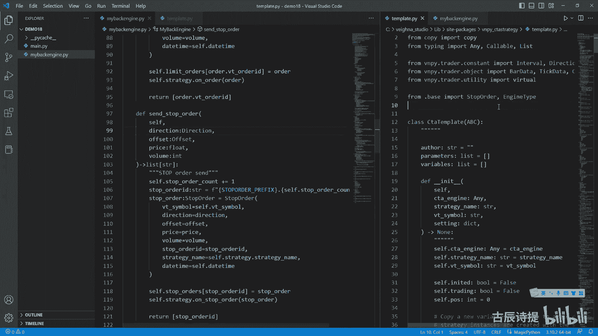
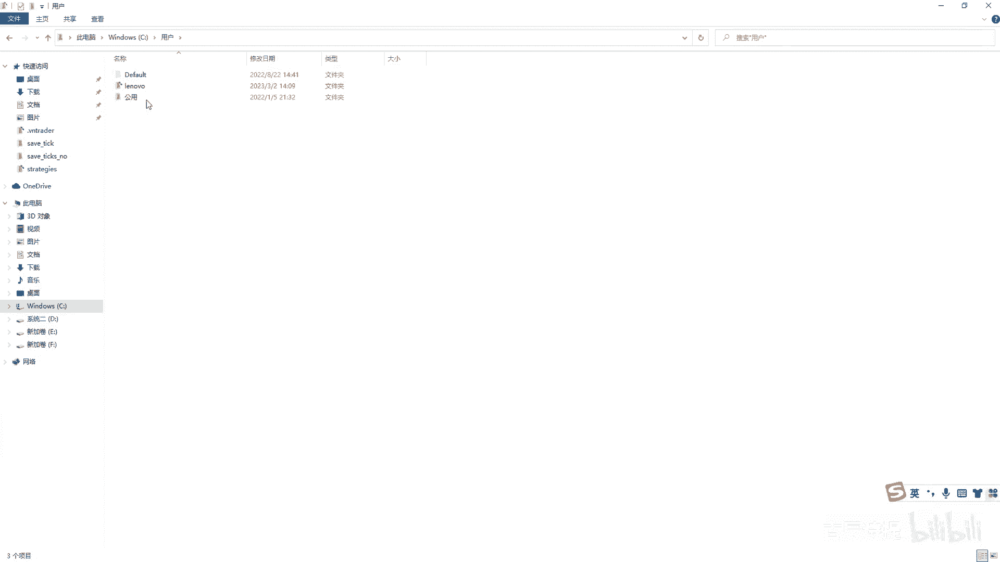
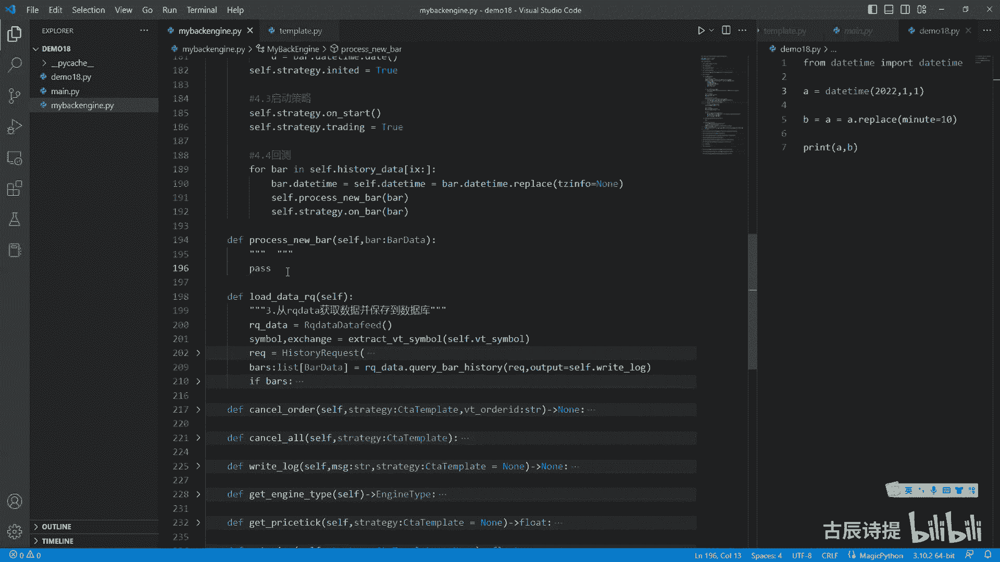

# 第18节课 CtaBackEngine的实现(3) - P1 - 古辰诗提 - BV1gJ4m1p7F3

欢迎大家来到从零开始量化系列课程，VMPI课程的第18节课，我把17节课的就是这个给复制了一份，然后我把他名字改了。

然后咱们再打开上一节课，咱们写到了这个就是初始化了，初始化其实就已经完成了，是不是初始化就已经完成了，那初始化完成之后，我是不是就应该把他的我把这个给删了啊。

把print就应该把他的这个training给打开了，初始化完成了，后边就没什么需要去做的了，是不是没什么需要去做的了吧，所以说这个你放哪儿都行，你放这也行，你放这也行啊，好下面4。3就是启动策略。

启动策略其实就是要把cf点strange点on start，on start调一下，其实on start里边并没有做什么事，当然你可以，你也可以在启动的时候让他做一些什么事，就是根据你的需求来嘛。

然后把cf点strange training这个对象，然后给它复制成而true是吧，true其实这个training主要是控制什么呀，其实主要是控制委托的发送吧，就是在这儿在你回测的时候。

或者在你初始化的时候，你这委托是不能往这个就是下层去发送的，你只可以去改变你的这个变量的数据，然后当这个training等于true的时候，它就可以去进行发送了吧，是不是你像他这个委托发送的时候。

咱们在c t template里边go to definition啊，在city template里边，这SORDER，这，in order der啊，就是SORDER都会到这吗，到这之后它会有个判定。

If self training，是不是啊，你把它self training变为了true，他就可以去发送委托了，对不对啊，可以去发送委托了，那可以去发送委托，下一步才是真正的回撤是吧。

那下一步的回测应该是怎么去做呀，还是循环吧，For，Bar in self history data，然后这个里边后边应该是ix，比上最后是不是啊，然后就是self strange点翁霸去调用这个吧。

然后把把给他，这个是不是就呃就是去调用这个欧巴了是吧，挨个的去调用这个欧巴，然后调用欧巴之后，他是不是就会产生委托，是不是就会产生委托，就会cle order，满足条件就会cle order了吧。

那咱们啊现在就开始讲这个SORDER，那SORDER第一步过来应该是做什么事情啊，应该是规范价格吧，虽然咱们在演示策略里边，就是那个demo里边。

那个里边咱们的价格都用那个八线的那个close price，那个没有问题，但是如果说你想止盈止损，加上这个固定止盈止损的话，你那个价格可能是均线，可能是你计呃，可能是你计算出来的一个值。

那这个时候你得规范它的价格吧，价格怎么规范呀，price啊，p r i c e price应该是等于什么呀，应该是有一个方法，round two在这个utility里边啊。

round two是用它来规范方法啊，规范啊规范它的价格吧，这个有兴趣的可以去研究一下啊，他就是这个其实还是相处，然后你想一取整其实是往下取整的啊，其实是往下取取整的。

就是说这个时候他就把这个价格规范成了，就是比如说你焦炭应该是0。5，比如说你是三三的话，比如说你是点八六，他会给你规范成点五啊，就是这个意思好吧，这个是round two，你得知道它是啊做什么用的。

那在咱们这就price等于round to，嗯PRICE好，把这个price给他去规范一下，然后下面就去判定它是去发什么委托吧，委托的判定，委托方式，的判定好，if咱们用这个stop吧。

If not stop，就如果说不是发送的stop done，那就是发送的LIMA，是不是，那应该是cs limit order或者SLIMIT啊，就是slimit order吧。

Slimit order，咱们从这定义一个df slimit order，cf你要接收哪些参数啊，你要接收哪些参数，你的这个你在回测里边，你这个strange就不用了吧。

因为整个引擎都是为一个策略去服务的，你第二个是得有吧，direction是得有吧，然后后边的OCITY也得有吧，OSU啊，然后后面的这个price肯定得有。

F l o price fl o v t blood，后边vomit有吧，他应该是int类型的volume，后边这个stop lock net就不需要了吧，就是其实你应该就是说考虑就是说什么呀。

lock锁仓，但是咱们这儿先不考虑这个啊，后边咱们再讲如何去拓展的时候，咱们再给大家去衍生一下，在这个呃维纳自带的这个回测的这个里边，他也没有这个logo这一说啊，也没有logo。

在这个就是没有lock这一说，就是你lock是true还是false，没有用，按说应该是你得添上对吧，所以说你在回撤的时候，你锁仓是没有用的啊，是没有是没有任何作用的，好吧好，Slime order。

我先pass一下吧，同样的我把这个再复制一份，我应该是sa stop order吧，Send stop order，这就是这些也得有吧，啊咱们下面写一个这个说明啊。

这个啊limit order send，以前我老是觉得就是为什么很多的说明，写这个英文的啊，stop order s中文的不好吗，是不是，但是好多好像用中文说不太明白啊，好去发送。

咱们得考虑它没它有没有返回值，它有没有返回值，是有返回值的吧，就是你在咱们再看这个，咱们的这个就是template里边，我还是向右拆分一下吧，等会啊。

template里边go to definition，向右拆分一下，就是在这SORDER，在SORDER这啊，这啊不是这啊，过度电平线，然后在这它是有返回值，它是有返回值的啊，它是一个返回值。

是一个list啊，这个list咱们也反复说过，为什么是list，记住了，它是v t order is啊，Video id，咱们一会儿说啊，什么是VIDEOD好，那它是有返回值的。

返回值是一个list list，而且这里面是什么呀，这个SSTR类型的吧，是不是STR类型的啊，啊包括这个它也是有返回值的，它也是一个list，是STR类型的，所以你从这应该是return啊。

就是直接ITU，直接返回它，因为它是有返回值的是吧，然后else，Return self send stop order，应该是这样写吧是吧，一个是limit order，一个是stop order啊。

然后这个limit order发过来之后，咱们应该去做什么呢，咱们是不是应该让它生成这个order data呀，就这个order应该等于咱们给它规范一个类型啊，它是一个order data。

导入一下这个数据，把它往这边也打开一个order data，bar data data在哪呢，呃object这应该是order data啊，同时还要stop order data。

Stop order data，咱们是从哪导入啊，from VN p i c t a strange their base里边是吧，然后啊这上面有了啊，上面有了，我就不从这。

这应该是stop order啊，这好导入进来之后，order应该等于order data这个里边，然后他有个gateway name，那gateway name基本上都要去使用的，咱们就在这呢。

cf点gateway，Gateway name，它主要是做什么用啊，也是一个标识的作用，也是个标识的作用，所以说有时候给你不要觉得他烦，好像哪都有GV内，因为如果说你是多个接口。

比如说你底层不光是这个CP，你还有一些别的接口，这个gateway name就显得很重要了，Get william，比如我在这写着my back，然后就直接写他就行。

然后这个首先第一个是gateway name，等于cf点gateway name好，第二个simple simple，simple应该是等于我还是得进行一下拆分，是拆分。

咱们刚才咱们之前写的这个来写一下吧，这个simple exchange等于这个cf点vt simple，然后就可以等于simple了，然后下面这个change等于X减减X减减好。

再往下这个type就是啊，不是应该是old d o d是没有的吧，order i d应该等于什么呀，这是没有的吧，ORD咱们应该自己去创一个吧，是不是order i d它是一个STR类型的。

它应该等于什么呀，啊F这里边应该是limit点一个number吧，所以说咱们在前面得加上这个cf点limit order count，它是一个int类型计数器嘛，那咱们从这儿应该是先到这儿来了。

咱们就先cf点limit oraccount加等于一是吧，然后你还需要一个前缀，前缀呢，咱们从这定义一下，就是limit order prefix吧，等于大写的u MIT limit啊。

从这你就可以把这个limit order prefix，然后点就是这个再放一个，就是这个C点，Limit order count，这个它出来的就是类似于啊limit点一厘米点二，是不是啊。

然后这O的ID我就等于O的ID吧，好咱们再看下一个type type已经有了，是order type limit，咱们就不用写了，然后direction就等于direction。

下一个offset等于offset吧，好在下一个price等于price吧，啊price等于price，咱们从这儿没有传参，是不是没有传参，咱们得把这个一会再给它添上吧，price等于price之后。

然后volume v o l u volume等于volume，volume等于volume，然后traded呃，就是这个委托已经成交了几笔，这个咱们先不用去写的。

然后studio submitting没问题，这有个the time daytime，咱们是得有的吧，啊daytime咱们是得有的吧，daytime应该等于什么呀，对他们不能等于now吧。

就是等于现在吧，他应该跟着这个你在便利的时候就是run back test，就是run back的时候，在便利的时候，他这应该实时更新这个the time吧。

所以说咱们从这应该是定义一个cf点daytime，它是optional，这个daytime类型等于先等于一个NN值啊，然后在你去便利的时候，就是在run back，这呃你在这上面时间咱们也给写上吧是吧。

就是你在便利的时候就是cf点the time，等于它是bar点点time，这你需要注意一点啊，就是你从数据库里面取出来的数据啊，包括你从米框数据里边下下来的数据，它是有时区的，女方数据它有时区信息。

那肯定保存到数据库里面，就有时区信息，咱们这儿呢不要时觉信息，咱们就place一下，把这个t z info等于一个NN值给它啊，包括在这就是在下面这for buying bus啊，咱们也写上啊。

这个时候你的这个bar它就没有这个tz info，就是时区信息了，不然会很麻烦是吧，咱们因为不是做的别的品种，咱们是做一些国内的一些品种，所以说就不需要了，那这的daytime咱们就等于这个DTIME。

是不是就可以了呀，好咱们前面把这个参数给补上好吧，需要传的参数，Limit order，第一个direction，direction等于direction吧啊。

然后第二个参数offset等于offset啊，第三个参数price等于price啊，第四个参数volume等于volume好，同样的在这也需要send stop order，传的是一样的吧。

然后direction等于direction of sat等于offset，给它复制一下吧，啊是不是这样就可以了，是不是啊，好那这个order创建好了之后，咱们需要做什么呀。

咱们是不是需要保存到本地等待触发呀，对不对啊，需要保存到本地等待出发，所以说咱们这应该写上cf点limit orders，它是一个dict类型，然后里面存放着的key是STR，咱们用VTLAD。

然后这个value咱们使用这个呃order data是吧，Order data，然后它等于一个空字典啊，然后从这儿呢我就可以给它添加进去，就是cf点limit orders。

然后key是用这个order i d啊，但是你看这是用这个咱们刚才说的，用VTO的ID，所以说你应该是order点VTO的id啊，等于这个order这个VTOID是什么东西啊。

咱们可以看一下他这个BTOID，它只是加上了一个什么呀，把这个self点get为name，点cf点O的id，这个post in it是这个data class，它里边呃单独给设置的就是post。

就是之前嘛unit就是在你初始化之前，只要是在你把这些数值都给赋值上了，然后它就会自动生成这样的对象，就是这么个意思，好吧好，这个给填上了之后，咱们是不是得回调一下这个策略呀。

就是因为我这算是委托成功了，对不对，我这算是委托成功了嘛，然后等待触发嘛啊你可以从这回调，你也可以等到成交的时候再再回调，其实都可以啊，但是按照就是说呃，因为咱们尽量跟这个实盘呃，就是贴近实盘。

实盘是把这个limit order发到底层之后，它就会进行回调，咱们可以看一下啊，就是SORDER就是from VP i c t a strange engine import啊。

这个t engine啊，咱们可以看一下这个t engine就是实盘是什么样的，他这里边SORDER呢啊看一下啊，咱们只是说slimit order，Slimit order。

然后send the server order，然后到sserver order，这他就找到了这个my engine，点SORDER，My engine，Sorder。

咱们得去那gateway里边去去找是吧，好就是CTP啊，点get away，Import c t p gateway，咱们在gateway里边再看一下他的这个SORDER，好。

这个SORDER还是到TDAPI里边去，Send order，你看这个它order send完了之后，他会这个so getaway on order，把这个order放到这个那个engine里面去。

然后让就是说这个你的策略去接收到啊，就是那个CTA引擎去接收到，所以说咱们从这可以给它调用一下啊，s t r a t strange点工order，然后把这个order传给他啊，是不是到这就你发送委托。

然后委托就在这个在你这个引擎里边，等待去触发了，对不对，同样的啊，这个stop order也是类似的，但是这你千万别忘了，你是要有返回值的，return一个返回值应该是列表，然后里边放上什么呀。

就是说这个order o r order，点VTOD是不是使用是返回的，是VTVTOID吧，好那咱们再处理一下这个stop order，stop order是同样的。

你在这肯定得有这个sp stop order，Count，这类型等于零啊，然后C点stop orders，它也是这个dict类型啊，然后这里边key是STR，然后value是stop order是吧。

stop order啊，然后等于一个空的字典啊，咱们前面还得有一个stop，复制一下吧，Ctrl v s t o p stop order jp stop，是不是啊。

那咱们跟这个sa stop order，其实跟这个上面是类似的是吧，首先你第一步要做的就是什么呀，cf点stop order count加等于一吧啊，然后stop order id。

stop order id应该是等于他这个这啊这，标注一下STR类型啊，然后把这个改成stop，把这个也改成stop，是不是，然后那个vt simple，咱们先等会儿给他拆。

因为在这个stop order里边他不用拆啊，Stop order，stop order类型等于stop order，然后这里边咱们看看啊。

首先第一个就是which it simple等于cf点vit simple，你看这个是which it simple，那个order是simple和这个什么呀，和这个exchange是吧。

Direction，然后offset等于offset下面的这个price等于price，在下面的volume等于volume，在下面这个stop order id等于stop all的id。

然后这个还有个strange name，Strange name，Strange name，咱们就等于self点strange t2a t strange，第二他有这个strange name。

Strange name，其实这个strange name还是咱们给他传递进去的，是吧，还是给他传递进去的，其实应该是在实盘里边儿，它应该是什么呀，他应该是就是你在初始化的时候。

它会读取那个咱们的那个在C盘下面，那个the ministrator下面那个点will try的里边，那个stretch setting里面有strange name，对吧啊。

这个string name这里边是有的啊，是有这个string name的，只不过咱们刚才传的时候把，就是上一节课传的时候是把什么呀，把这个类名给他传过去了，按说不应该，这么传啊。

应该是传一个独一无二的啊，但是他回测指回测一个品种是吧，就是一个合约，所以说这个就显得不是那么重要了啊，后面同样的还有这个daytime，the time等于C点the time啊，后面这个lock呀。

包括这个NT咱们就不需要了，然后这个VTOID啊，这个VTOD这是干什么的呢，这个一会儿咱们说一下啊，这个studio先把studio说了，这个是专门的就是stop order的，它的这个studio。

它的这个studio呢，跟呃通常就是那个order那个studio是不一样的，stop order studio它有三个，就是这个里边有三个元素，一个是就是waiting，就是等待触发。

第二个是trip，然后还有个NO trip，就是触发了和未触发啊，然后但是那个正常的那个order data，那个studio呢它有好几种，它有这个提交中，然后部分成交啊，那个全部成交。

还有这个没有成交啊，有好几种你可以去看一下好吧，你可以去看一下，然后至于这个VTOID啊，VTOID啊，咱们可以看一下，Gogo to definition，他这VTOID你会发现它是一个field。

它是一个list，因为你的这个stop单在这个实盘中啊，它会把它转变为什么呀，就是limit limit单有可能被拆分是吧，咱们之前反复在说有可能被拆分，所以说这是放那个拆分完了之后转成limit单。

他的这个VTOID的啊，它的它是放VTOD，因为它拆分可能会被拆分成两个呃，也有可能会拆分成更多是吧，是存放这个的，在这儿呢咱们就不需要往里面去填了啊，就不需要往里面去填了。

然后咱们把这个self点stop orders，然后这个key咱们就用stop order，就用这个stop order id就行啊，因为它没有这个stop v t o d啊，你看他没有啊，他没有。

咱们就用p id呃，呃这个stop order id等于这个stop order，然后咱们还是需要去回调一下的，是吧，Strange strange，第2on stop order。

然后把这个啊stop order给它放进去，另外呢千万不要忘了它是有返回值的一个列表，然后里边放stop order id，是不是这个是不是就统一了对吧，这个就统一了吧，啊这个时候呢咱们可以演示一下。

然后它究竟能不能发出委托出来好吧，如果发出委托出来的话，呃当然了，他因为没有持仓，所以说是发不了停止单，因为咱们那个策略里边只有啊。

就是看一下啊，用户NOVA strangers。

然后app stem，然后这个策略里边儿咱们发发委托的时候，就说这个by是限价单，然后平仓才是用停止单的，所以说它它这个因为你没有持仓，你发不了这个停止单吗，啊你你发不了这个停止的，所以说只能发现甲单。

咱们看一下有没有这个限价单啊，如果有限价单的话，咱们输出一下好吧，Print order，Print order，然后咱们从这man，按道理他应该是能发出这个嗯，先下单的是吧，如果能发出限价单。

那就说明问题不太大是吧，那个停止单咱们就没法去测了，呃等待它可以触发的时候，咱们再去进行测啊啊这有问题了，round two Missing一个argument，在round two。

这它是需要一个就是argument的，就是C点price tag，Price ta price tag，咱们还没有呢，对不对，咱们还没有呢啊，咱们没有的话，是不是在csat pr的时候。

咱们应该给他放上，就是在这应该你有这个啊这个price ta plastic，然后它是一个float类型的，然后默认我是不是等于一是吧，大部分都是一吧，大部分都是一。

然后我这cf点price tap等于多少啊，等于plastic吧，price tag啊，这个price tag给它连起来，写在前面，咱们加上一个这个save price stic。

它是一个float类型，默认它等于一啊，然后你从这可以重新给它设是吧，然后咱们再这个round two的时候，就是SORDER的时候，把他的这个啊这个应该是self provistic，是不是好好。

然后咱们再进行一下运行，看看有没有问题啊，这个因为它从这个数据库里面获取数据，它是有时间的，你看这个就出来了吧，啊出来了，那就说明大致上到目前为止就是没有问题，那后边咱们要讲的。

就应该是他的这个委托的触发了，对不对，委托触发他肯定得通过霸线来进行触发吧，对不对，所以说咱们必须得写一个什么呀，就是process bar啊，process bar写哪呢。

CTRLK然后CTRL零一下啊，咱们把它send order ordq，咱们就写在run back下面吧，啊run下面df process process new bar吧，就是当有一根K线来了。

咱们就去检查一下是吧，去检查一下它是不是能触发，好啊，啊里边就先不写东西了，那首先咱们要考虑的process new bar，咱们应该是从哪给他传这个霸线呀，咱们应该是在这个run back这里边传吧。

run back里边传，你在这个初始初始化的时候呃，有必要去传吗，你从这有必要吗，其实没有必要是吧，也因为这个时候你肯定没有委托，那你有委托肯定是出问题了，是不是，那就是从正式回测这传。

那正式回测这传它有一个问题啊，就是这个你传递过来的，这个你是在这个欧巴前面还是在欧霸后面传，你是写到它下面就是cf点process new b就这么写，还是把它放到这个上面来写啊，把它放到上面来写。

这个是应该考虑的问题吧，你捋一下逻辑啊，就是我这里边有等待触发的这个就是合约，我是不是先去检查能不能触发，然后再去让它合成K线，是不是这么个逻辑，如果说你已经合成了K线，然后委托单发送了。

你再去检查你是不是就是一个前置了，就是一个未来的一个，就是就是你可能用用这个别的啊，这个别的平台你可能知道就是未来函数，这对回测会有很大的影响的，就是未来函数就是等于是你预知未来了。

按说就是委托发送出去，它发送其实是呃从咱们策略逻辑上来说，是你K线这根K线你所需要的，比如说30分钟K线合成之后，然后你去发送委托单，然后下一根K线来再调用到你这个之前。

我是不是应该就是先让他去审核一下，看看能不能触发，是不是从那个实盘里边来说，你30分钟K线合成了，然后发送委托，是不是在这个过程中，在tick里边就有可能会成交，是不是。

所以说他肯定就是说在撮合成交的时候，肯定是在这个你这个下一根K线来之前的对吧，所以说你要在这个上面去给他去发，同时呢你这个呃，你要把这个这个这个这个bar的这个DTIME，再给他去replace一下。

所以说我这呢就是呃应该是C点B点，the time应该等于是吧，这样连着等，就是啊不是4。8啊，就是八点DTIME应该给他更新一下，等于一下，因为你这个replace。

它并没有在他这个本身啊去进行这个替换，这是什么意思，这个演示一下啊，demo这个是18节课了是吧，点PY呃，就是说我这个time from the town import deta。

就是A等于daytime，比如说2022年1月1号，然后呢我A点replace啊，这个呃这个minute是吧，minute等于十啊，这个时候呢我print一个A，啊我不写一个A他是不是还是这个他没改。

是不是啊，他没改，你必须得是什么呀，就是说A等于啊，这个时候你再print a是不是就可以了是吧啊，连灯也是可以的啊，你B等于是吧，然后你这print a然后再print一个B啊，就是两个都是一样的吗。

是不是啊，就这么个意思啊，所以说他应该是放在他的这个上面来process，这个new bar好，那下面咱们就开始讲这个逻辑，这个逻辑是非常重要的，一定大家要理清楚，你从这个逻辑上你既能知道。

就是说这个整个的回测逻辑是什么，因为这是很重要的一块触发嘛，然后另外你也能知道。

