# 第19节课 绘图5 趋势线3 文字1 - P1 - 古辰诗提 - BV1RU4revEPb

欢迎大家来到从零开始量化系列课程，MC课程的第19课，上一节课咱们讲到了这个delete，也给大家演示了如何去画这个趋势线，绘画其实很简单，就是咱们这个呃用这个tr6，或者用tr new self对吧。

就是你是把这个六个参数，为什么会有这个六个参数，你一定要知道每三个参数它就是一个端点，两个端点来确定一条线，然后再让它向左或者向右去延展，然后再做你的策略绘画一定要会删。

不然的话你这个图上会显得特别的乱，呃咱们从这个代码演示里边，咱们其实可以很清晰的知道MC它的特点呃，其实它设计很巧妙的地方，比如把这个时时间设成了一个数值类型的。

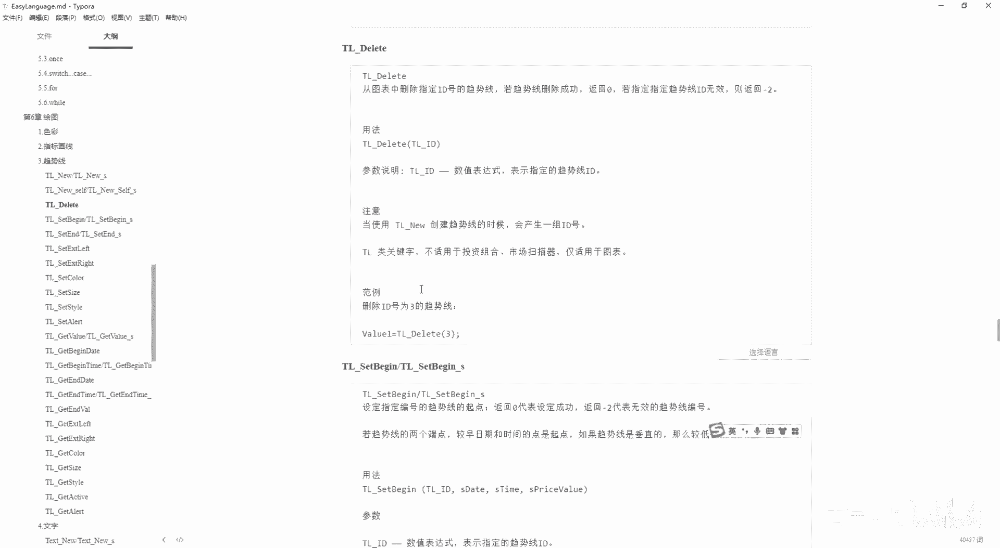

你用数值呃，再加上价格，你可以在这个以上二维图表上去确定一个点位，对吧，就是这样去很容易的去确定，很方便。

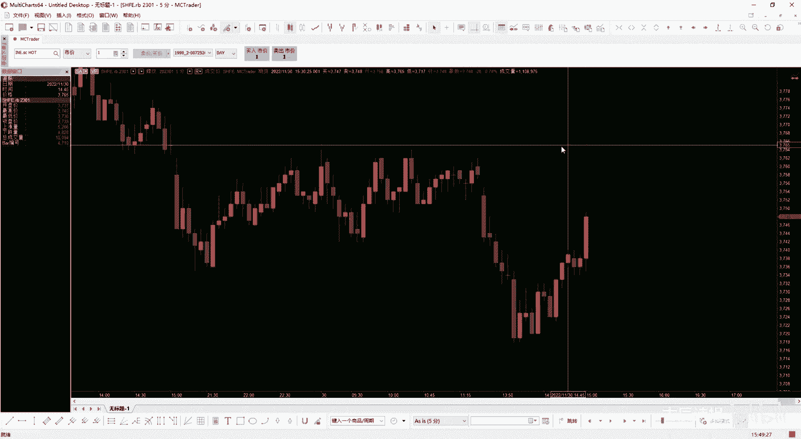

另外一个呢，它能最大限度的把你的精力都集中在什么上面，就是在这个你的策略的逻辑上面，而不是说啊过多的放在语法上面，其实它的语法是很简单的，相比于其他的语言来说，尤其是比如像C加加。

你不需要把很大一部分或者，绝大部分的精力放在这个代码的这个语法上面，你学C加加也好，学Python也好，你很大的一部分精力都会在上面，另外你开展平台，你还需要去获取数据是吧。

然后你还得确定数据是不是准确，有没有准确性呃，咱们一般都通常会认为，比如像米框，它的数据数据就会很准确，因为什么呀，这是他提供给你的，你是花了钱的，但是如果说你自己去获取了数据。

就包括我在哔哩哔上去分享的数据啊，在群里边去分享的，很多老板们就问我说这个数据准不准确，其实我完全是从我的这个数据服务商那，把数据给拉出来，然后分享给大家的大家，这进群我也没说卖给大家数据。

我并没有卖这个数据啊，我只是把数据分享给大家，让大家去做这个回测，但是很多人就会有这个疑虑，你的数据准不准确是吧，但是其实这个数据都有可能不准确啊，再就是很多时候，咱们嗯就是就比如说这个咱们这个期货。

它还有出现过晚上就是晚一小时开盘的呢对吧，就是出错肯定难免啊，就是多与少的问题，就算是你从服务商那去买的数据，也不见得就是完全的百分之百的准确啊，它可能就是信任度会更高一点是吧。

所以说MC有它自己的优势啊，你千万不要认为学了Python就是开源的牛啊，就是这个三方平台的就啊就不好，其实不是那么回事，只要是你有好的策略能够挣钱，我觉得就是最好的，相比较于给MC的那点手续费。

如果说你能挣的钱，肯定就是说这点手续费不算什么对吧好，那咱们就接着往下说啊，快速的把后边的这些再给大家讲一下，这些关键字，其实前面讲了那么多的关键字，后边的这个关键字就会变得越来越简单。

因为你一看这个set color就是来设置颜色的对吧，你这个一一看这个set size，就是来设置这个宽度的啊，在这儿呢它有这个两个，一个是tl sit begin。

还有tl sit begin s e，加上这个下划线S，你第一反应就是说肯定这个参数里边，它是有这个时间的啊，而且这个时间呢S就是下划线S和没有下划线，S的区别。

就是你给的这个time是time还是times s是吧，你带不带秒数啊，这个会涉及到你是用什么样的周期来做这，个来画图啊，就是set it begin，其实就是设置这个他的这个初始的这个，这个端点啊。

设置它初始的端点呃，一定要注意啊，它是在已有的这个趋势线，然后去设置，而不是说你没有趋势线，我去给你设置一个，他一定第一个参数是TRID，就是你趋势线的编号，你有趋势线编号。

就说明你这个趋势线已经存在了，对吧啊，当然咱们这个就是说上一节课写的这个代码，你完全可以当我已经画出第一条线的时候，后边现在有变化的时候，在满足肯定TION1的时候。

我去重新设置它的这个呃begin和end就可以了啊，你可以换一种方式来写，大家可以去改一下也是可以的，呃有begin肯定是有in的，就是两个端点嘛，这个我就不再多说了，下面这个t l sit ex呃。

其实就是往左延伸和向右延伸，这个咱们也演示过了它的这个参数啊，第一个就是趋势线编号还是趋势线编号嘛，第二个呢就是true或false，就是你是添加还是删除啊，就是向左延伸或者向右延伸。

这个true就是添加嘛，false就是删除嘛，这个也没什么太多好说的呃，这个塞卡拉这个咱们专门有一节，讲了这个色彩对吧，讲了这个色彩讲了很多，他有17种颜色已经给你设定好了的。

如果说你想使使用这个颜色的，对应的0~16的这个编号，你一定要把那个legend c color value那个给打开，用那个中括号给括上啊，这一点也是啊，反复跟大家说来着。

所以说你从这在用这个set color的时候，你一定要注意，就说你如果说想用传统色码的话，你要用这个你要有这个代码啊，要把它打开，但是一般也不会去使用啊，嗯你可以直接用RGB。

或者用你这个它17种内置的颜色啊，都17种了，我觉得就够了啊，这个set size呢其实就设定宽度，这个也没什么太多好说的，它的宽度呢你就注意一下他的这个范围就好了，就是0~6。

还有一个这些所有的这个set开头的，一定是你已有的趋势线，而不是说你还没有趋势线啊，因为有它都有这个TRID对吧，好这个cs style呢就是设置这个线的样式是吧，有这个点的，有这个嗯。

就是这个不一样的样式嘛，一般都是咱们用这个这个可以给大家演示一下，因为之前像c color什么的，其实都是一样的是吧，Demo19，我还是把这个给粘过来啊，好我从这儿就是我先给你编译一下啊。

不然的话它老是出不来这个颜色啊，T a r set style，你首先肯定是这个IDID，咱们用V688来接的啊，后边这个样式，比如说我是这个四，它应该是这种一个点。

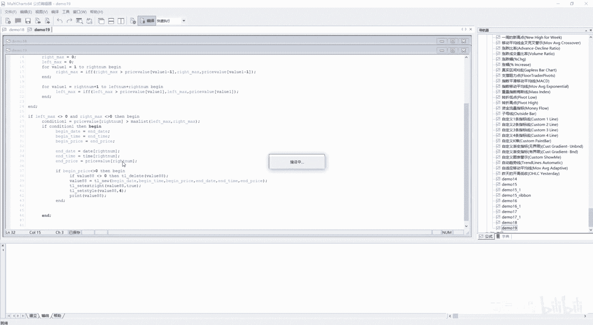

就是一个线段那样的啊，我把这个插入我的这个指标19，然后设置和商品相同属性在子图一。

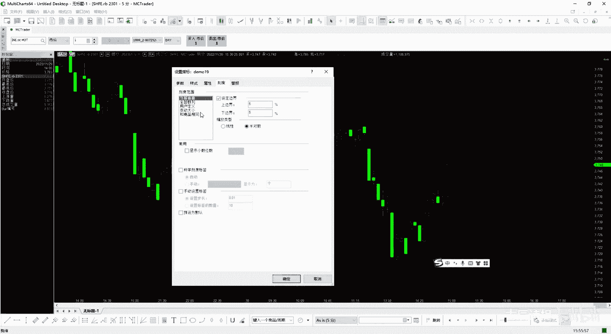

然后确定是吧，它这个线的这个样式就变了嘛对吧。

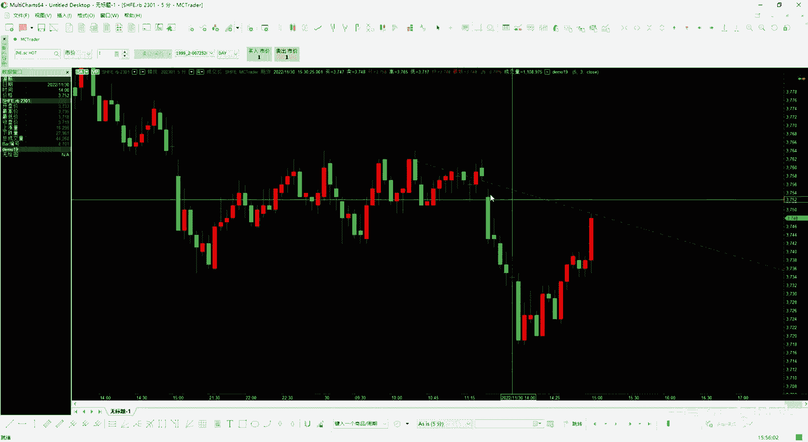

性宽九五就不给大家演示了啊，下一个呢是设置这个警报啊，这个叫警报警报，咱们后边会有单独的一小节给大家讲警报，这个箭头讲完了，讲这个警示啊，也可以是警示呃，这个现在就不给大家讲了。

他其实你可以在你图上来设的。

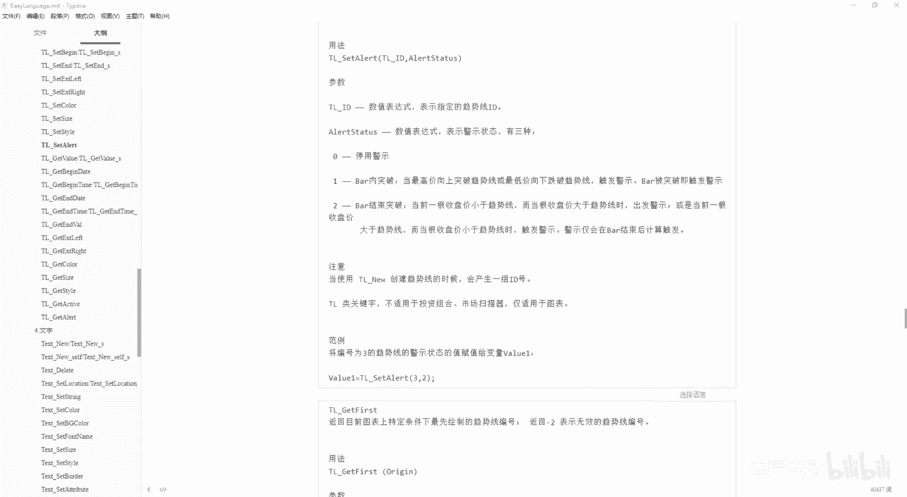

就是设置这个指标，然后进行设置，然后这儿有个警报嗯，一点开就启用警报，警报是嗯，像这个它默认的这个声音是，就是盯这个WAV是什么声音啊，其实就是什么呀，我把这个比如说我把参数改一下啊，改成open。

大家仔细听啊，你看就其实就是这个声儿，就是很普通的一个声音，当然这个警报它既可以给你发出声音，然后还可以给你发出这个弹窗啊，也可以给你发一个电子邮件，这是可以自己来设的啊，然后呢他警报的这个检查条件呢。

也可以把每一笔提款或者每个人挖一次，或者每个bu的收盘时啊，这个后边咱们会跟大家详细的去说。

在这儿就不做过多的介绍了，好吧，其实就是呃他这有就是零，就是它这个后边有参数啊，第一个也是这个ID，就是你的这个趋势线的编号，第二个呢它的就是它的这个警示状态，第零呢就是停用，就是不警示啊。

一呢就是半内突破，当坝内的时候，比如说你这个最高价向上突破趋势线，或者最低价向下突破趋势线的时候，它会发出警报嗯，然后第二个就是把杰出的突破，它也是如果说你的收盘价啊，就是说嗯就是就是上穿了这个趋势线。

或者下破趋势线，它会给你发出警报啊，其实就是这么个意思好吧，相信大家也很容易去理解啊，呃这个下一个是tr get first，这是什么意思呢，就是返回目前图表上特定条件下，最先绘制的趋势线编号啊。

返回二表示无效的趋势线编号，这是什么意思，就是你看他的这个后边这个词参数啊，它有几个1~71，就是目前公式所绘制的这个趋势线，二是呃非目前公式所绘制的趋势线，或者手动绘制的趋势线。

就是不是当前公式绘制的，就是也可能是别的公式绘制的是吧。

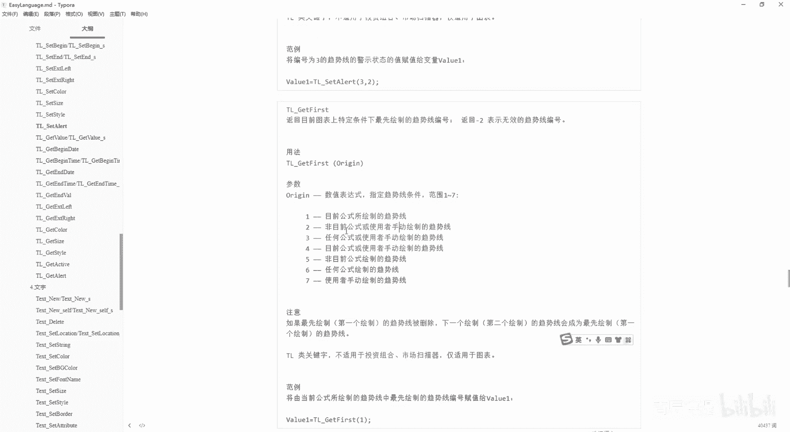

这是什么意思啊，其实也很也很容易理解，你像这个趋势线，其实就是这个指标来绘制的趋势线。

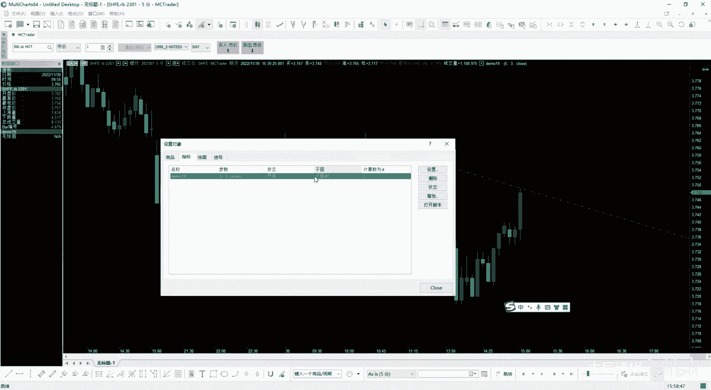

那如果说我从这加一条趋势线，我插入一个绘图，就是我自己画一个趋势线是吧，就是从这儿哎到这，然后咱们之前也讲过这个是吧，我可以设置这个趋势线，设置绘图嘛，这个然后，哎哪个是我呀。

我把这两个都删了吧啊这俩就都被删了是吧，然后我设置一下指标，然后状态啊我再打开，我再给它画上，然后我再插入一个绘图啊，然后我再插入一个绘图，插入绘图，然后趋势线啊，我从这儿点到这儿啊。

然后呢我设置这个绘图，当然第一个是代表的是这个哎，就是里边儿有一个是这条线是吧，有一个呢是这条线，然后应该是这个是这条线，然后我设置一下，我设置它的这个啊，就第一个线是是这个线啊，那就第二个啊。

然后我设置一下它的这个样式也可以设置啊，是吧，也设成这样粗细，你可以就是那个THESIZE嘛，然后扩扩展就是向右延伸或者向左延伸嘛，对吧啊，然后它也可以设置警报啊是吧，然后他这个自由式极值定点回归。

你像极值，就代表着，你必须是就是最大值或者最小值连起来的，而不是说你想就是这种自由式的这种嗯，就是说去划线嗯是不行的啊，就是它有这种四种方式，有有兴趣的可以研究一下。

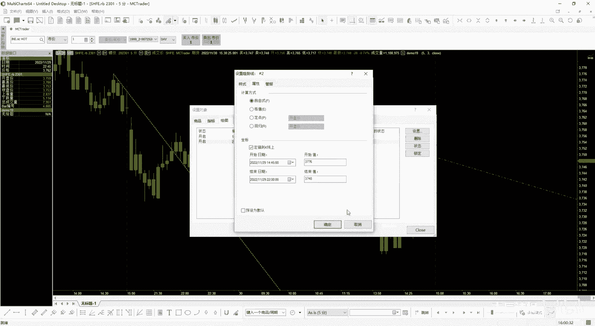

你这个时候其实图上是有两条线的对吧，是有两条线的。

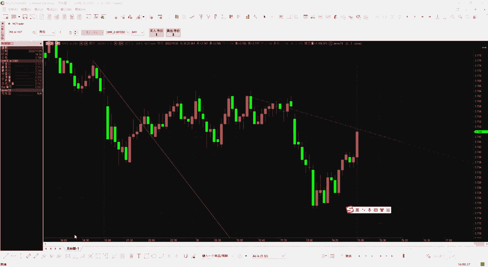

然后根据它来，比如说我用这个get first，后边加一个参数二，就是目前公式或使用手动绘制的趋势线，咱们可以看一下啊，那么这个代码比如说我从这个t l get first，然后这个里边这个type。

比如说二就是不是咱们这个代码绘制的嗯，或者说是手动绘制的那个趋势线，我给它复制成value77吧，等于这个，然后我从下面输出一个什么呀，比如说我Y688，我是这个当前就是指标cl local来绘制的。

这个编号是吧，然后我再输出一个什么呢，输输出一个，我把它这个输入法切错了啊，我再输出一个，比如说空格，然后这个手动绘制hand的吧，hand的手动绘制的就是这个，它的这个编号就是value77啊。

然后我进行一下编译，然后输出你会发现呃就是这个指标绘制的，它编号是1hand绘制的，它的编号是二对吧，hand的绘制的这个编号会二，其实它这个编号跟你什么是一样的，跟你这个绘图吗，编号嘛对吧，为什么。

其实你想想，为什么它手动绘制的会给您放成是二，然后你这个呃代码绘制的给你方程是一呢，其实他从一开始老早的时候，就是因为你这个绘制是从这根K线绘绘制的嘛，你你往前翻，就是说前面从一开始的时候。

我也就是说我这个指标也开始绘制了，只不过我绘制完了，我给删了，对不对，然后一直绘制到这儿的时候你才有的，然后其实在这儿他肯定也绘制了啊，当然不不一定是在这啊，这不一定能满足条件。

就是说肯定就是说前面有绘制的啊，只不过是到这儿的时候他给删掉了啊，所以说他给他就是就是就是编号为一，你像这个t r get first，就是你后边是二，参数是二，它就是就是非目前公式或者手动绘制的啊。

就是不是当前公式绘制，也可能是别的公式绘制的啊，或者说如果手动绘制的，咱们是满足后者嘛，手动绘制的，当然你也可以用七，就是说使使用者手动绘制的趋势线对吧，就是就是二和七是不一样的啊。

就是它有可能是别的公式来绘制的趋势线，但是这个七是代表的是手动公式绘制的趋势线，好吧，你像这个呃任何公式绘制的趋势线，如果是六的话，你这个get first它应该是多少啊，就是这个value77。

咱们可以编一下，看一下，你会发现都是一了，对不对，都是一了吧，因为它首先绘制的就是这个，咱们这个指标绘制的嘛，对不对啊，这个是不太好理解的，你会感觉他会很拗口。

其实它表示的意思就是去获取get first吧，就是呃你这个就是根据他的这个参数的描述，获取到的，你这个或趋势线的这个ID啊，跟next就是返回图表上特定条件下，在指定编号趋势线后绘制的趋势线编号。

其实你想get first day也好，get next day也好，就跟咱们之前说的，你如果不删除的话，你得去找他的这个编号，一个接着一个的往下找是吧。

所以说就会用到这个get first和get left啊，这个是应该是适用场景，但是推荐大家还是去就是该删的删，该删的删，你别把这个图表上画的乱七八糟的对吧，嗯啊这个就不讲了啊。

大家有兴趣的话可以去自己去研究一下，其实我是没怎么用到，因为这个里边涉及到你手动绘制的和你这个呃，不就是就是当前这个指标绘制的，以及其他指标绘制的这么一个综合的啊，他后边的参数额也有1~7是吧啊。

自自己有兴趣的话试一下哈，下一个是这个get value和这个get values，这get value咱们之前演示过，就是获取当前K线对应着的，这个趋势线编号的值啊。

你这个get value s肯定就是这个time，就是下划线S了啊，这个就是更主要的是他的这个延伸线延伸线啊，你一定要用延伸线啊，你千万不要把这个呃就是两个这个线，就是你像这个两个端点已经画出来了。

然后你来便利，你还从这，比如我从这我线已经画出来了，你还从这我开仓，我开空仓，那肯定是涉及到未来函数了，你就是说就是比如说你先把图全部给画呃，全部给画到这个图表上了，然后你再来做一个策略。

然后找这个就是它的这个绘图的编号，然后你在去写策略，那就有很大的问题啊，而且你这个两个端点实操，它就是说这个是啊，这个端点是手动画的，你这两个端点你这条线出来的时候，你这两个端点已经确定了。

而且你这个是在什么时候画的，是就是说你到这儿啊，你到这儿的时候，这根K线走结束了，你才画出来的，因为你到这你才能确定它的这个高点，它才是高点啊，对吧，它才是高点，你不能从这你就确定它就是高点了。

你还比如说我还在这呢，你能确定它是高点吗，它有可能下一根线它又上去了呢，它就不是高点了，对不对啊，这一点你要注意，它一定是滞后的，高点肯定是滞后的，这得看你右边形成这个K线，你需要形成几天啊。

就是你要形成几根啊，这个是get就是前面讲了sit嘛，这个是get就是获取它的开始的日期啊，这个也不说了啊，就是开始的时间和这个开始的时间加上秒，然后获取结呃，结束的日期啊，结束的时间是吧。

然后后边的参数肯定就是这个ID，就是这个趋势线的编号啊，就是你获取这个get in the value，就是它的趋势线中终点的价格啊，这个也没啥好说的，就是然后这个是get是不是向左去延伸啊。

如果说向左延伸了的话，它就返回true，如果没有延伸就返回false，包括这个是否向右延伸对吧，然后去获取它的颜色，当然你这个也可以给它设置个渐，变色什么的都可以，你可以自己去尝试。

还记得那个渐变色的这个代码了啊，就是一定要多写啊，get size就是获取它的这个宽度，get style就是获取它的这个样式吗，它返回的是数值啊，如果是二的话，是表示无效的趋势线编号。

这个get active就是返回当前图表上最新的趋势线，ID就是最新的趋势线i id，你像这个嗯，咱们可以从这儿来获取一个这个他的这个get active，Y699等于T2gate active。

这个有参数吗，没有参数吧啊，Get active come on，没有参数好，然后从这儿写一个active，value这个九九是不是用过呀，咱们用六五吧，还是六你写代码的时候，你不要像我这样去写啊。

因为我给大家做演示，就是我就随便写了，你一定最好是都设成这个变量，而且变量也得见名之意，这样的话你这个代码以后再读的话，就很容易去读了，你像他这个是active的是一，就说明其实就是最后就是它还在。

就是说最后的一根趋势线啊，最新的趋势线嘛就是最后一个第二根啊，就是你画的最后一个，或者你的这个这个就是这个指标，它划的最后一个啊，这个get就是看是否有这个警报状态啊，它是返回了一个警报状态啊。

这个也也不说了，好吧，下面咱们说一下这个文字，这个文字就是咱们之前给大家讲过，如何在这个图表上显示出我想要显示的字啊，这个我先把这个设置指标，我先把它状态先先关一下，然后把这个绘图设置绘图。

把这个绘图给删掉啊，啊咱们虽然可以利用这个pluck指令画图，在这个画面上去显示文字，但是只能显示在状态列啊，我们也可以直接在图表上标注文字，记录和显示一些重要信息，另外我我认为这个文字啊。

就是最就是它最好的地方是在于什么呢，这个文字啊，它是可以用在这个呃咱们的信号上面，就是比如说我新建一个信号，新建新建信号啊，Demo19，然后我从这儿我写TL哎，我不知道他这个应该是text吧。

就是text new啊，txt text new这个后边你需要这个时间是吧，就是我就写这个什么时间啊，就就这个date吧，然后它这个time我就写time，然后price就写close。

然后他的这个text我就写呃T吧，然后还有吗，就是没有了，你像这个我编译的话，我是可以通过的，看见没有，但是我如果里边有个plot的话，plot我比如说我就画clothes，你是编译是通不过的。

所以说它能够在咱们的信号信号里边去使用它，这个我觉得是最方便的地方啊，好咱们看一下这个，其实你学完之前的这个TL就是趋势线，你再学这个text就很容易了是吧，它肯定是需要你的budate button。

还有这个就是price value和你需要的这个显示的内容，你你会发现前面三个啊就是一个点，对不对啊，一个点就是在这个图表上，我确定了8date和time，我就确定了横坐标，然后我确定了这个price。

我就确定了纵坐标，然后就可以从这去显示你的文字了，比如说给大家做演示，我还是在这个a plot上面新建一个指标吧，demo是九少划点一吧，好我if last bar on chart。

然后then begin对吧，end的，然后我从上面写什么呢，text然后用but就是这个date我就用date啊，然后time我就用time，然后price我就用hi，好然后我进行唉。

后边儿我还没说写啥呢，是吧好，我写一个last，然后我进行下编译。

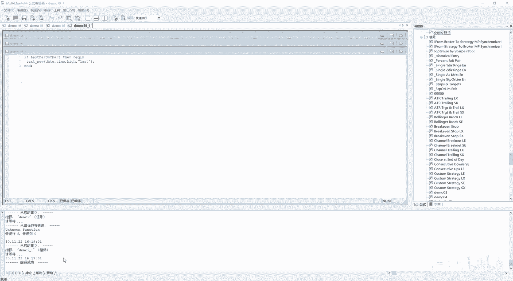

然后我插入一个指标，把这个九杠一啊样式子图一刻度和上面相同。

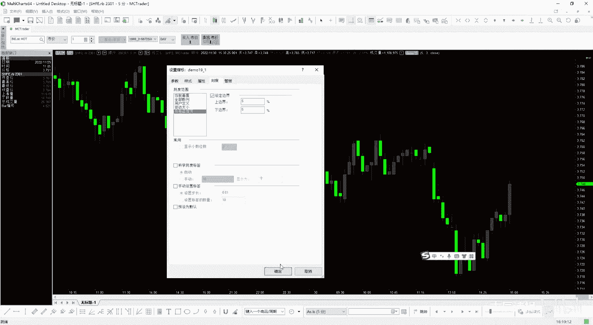

你会发现它就有了是吧，last啊，你像这个他的这个最后一根K线，然后他的这个最后一根K线的日期和时间，就是它的横坐标，然后他的这个嗯就是说它这个价格。

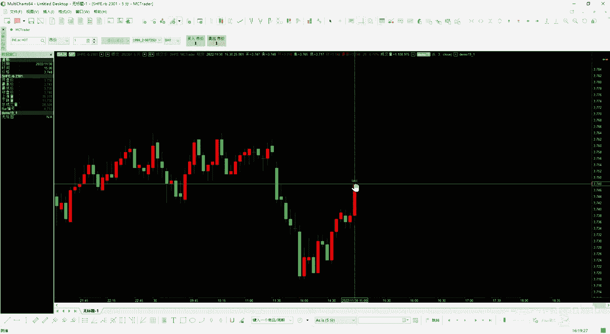

那high就是它的纵坐标对吧，你就往上去写就可以了，其实跟TL很类似，当然他后边还有些别的这个啊参数啊，就是就是关键字吧，那就是说这个cf，其实跟那个TL的cf是比较类似的，我就不讲了。

包括他这个下划线S啊，就是包括这也有个下划线S其实就是这个8time，就就就就这个八碳嘛，but time就是说你如果说用new s的话，你一定要记住后边time，你要写上S啊。

这个time m s也是有的是吧，你进你进行编译是没有问题的，如果说你前面用S，你这没用S的话，咱们可以试一下啊，看看编译能不能通过它，好像编译也能通过对吧啊，但是它好像显示不出来了，就啊显示不出来了。

如果说你把它啊改成TIMS，然后进行一下编译，它会显示啊，所以说这个就是它的区别，就是你要知道，如果说你用的是text6S，你一定要写这个time的时候，你一定要写成time下划线S啊。

这个是text delete，同样的，其实这个也很重要，为什么说它很重要呢，就是你要会写，而且你要会删是吧，你不能说整个的这个图表上写的全是就是那些，就是说每一个上面都有那样就乱了是吧。

就是说你真正在实盘的时候，你只需要关注最新K线他的一个状态就可以了，对吧好，咱们再往下说，这个我就先就是不演示了啊，TT就是tt delete后边这个text seat location。

这个set location是什么意思，就是调整指定编号文本的显示位置，那既然调整它的location，那肯定会涉及到这个横纵坐标，还有它的这个你的这个text这个id编号是吧。

这个其实跟TL的逻辑是一模一样，你看它的后边参数，第一个就是这个ID就是你的这个text的这个呃，它的这个编号，然后后边就是8daytime，这个就是横坐标嘛，price value就是纵坐标。

对不对啊，price value就是纵坐标，从这个我就先不给大家演示啊，后边会给大家做做一个案例，或者说是咱们经常会用到的，就是呃就是可能用的会比较多的，那样一个案例啊。

呃这个是text seter string，就是什么意思，就是你给它重新设置一下的，这个它的这个字符串，比如说我我接一下啊，我接一下他的这个Y61等于这是个编号。

然后我TL啊不是应该是text sejin是吧，然后他肯定第一个肯定是这个id value1嘛，然后后边的内容我就是new哎，是吧，text我设置一下，然后它也是有返回值的，也是numeric。

同样的应该是二，就是无效，然后如果说你设置成功了，就返回零是吧，我进行一下编译，你这个时候你从上面显示的就是new了啊，显示就是new了，就是重新设置一下它的这个字符串内容。

这个text set color就是返回这个文本颜色嗯，这color同样的第一个肯定是这个id啊，第二个就color，比如说我把它设置成呃yellow，yellow是吧，直接用这个关键字。

它就会显示成黄色的，这个也很简单，后边就是这个se b g color，就是设定文本的背景颜色，设定文本文本的背景颜色是什么意思，就是把那一块它的背景涂成一个颜色。

text sat b g就代表background，就是b AC k g r o u n d background就是背景啊，他这用BG可以呃，就是简写了，然后同样的写value1。

然后后边的这个背景色咱们用white吧，啊进行一下编译，这他的这个背景色就变成白色的了，里边字是黄色的是吧啊，就这个意思也很也很也特别容易理解，这个test set point name。

就设设定指定编号文本的字体类型啊，返回二为无效，我们编号就是这设置你的这个字体类型嘛，字体类型就是嗯，你可以查一下这个你的这个字体类型啊，就是其实怎么查呢，就是你设置这个什么呀。

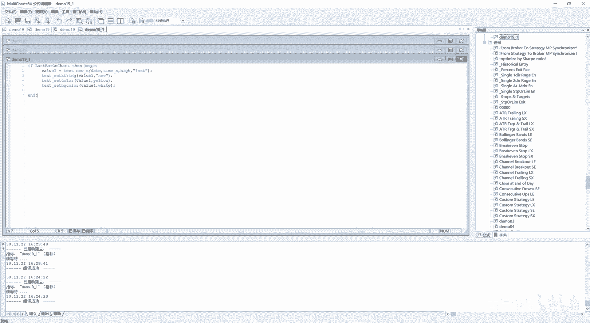

就是说这个呃。

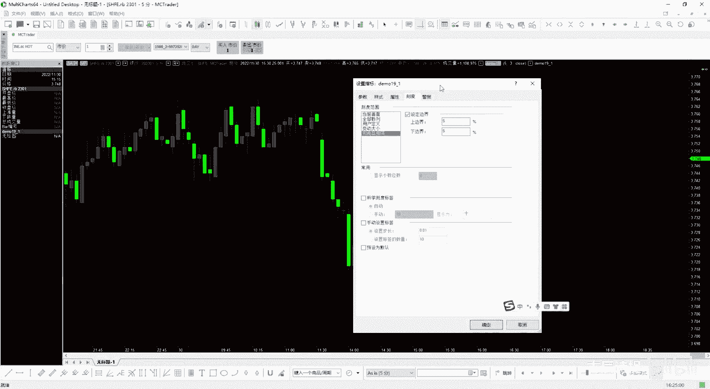

设置文本，你看这儿有个设置文本的啊，因为它是文本嘛，可以设置文本，然后你可以从这这个字体嘛，你可以挑一挑，然后包括你设置的一些东西啊，其实都在这个里边都可以的。

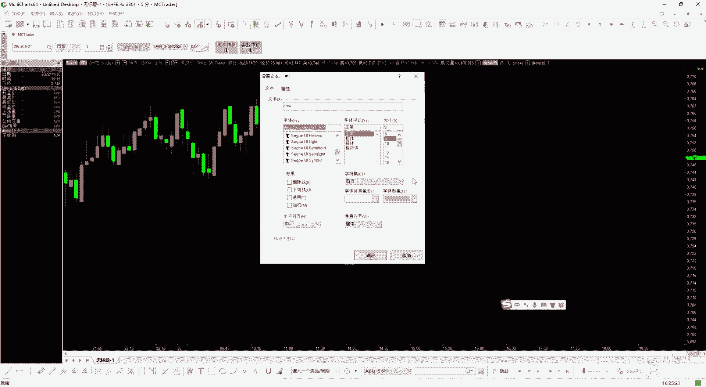

比如我把它颜色设置成啊绿色是吧，就变成绿绿色了，如果说你要把它的字体改了，你也不知道字体是在哪，应该是我查一查啊，可以从你这个电脑上去获取的字体，就是你在这个搜这个什么。

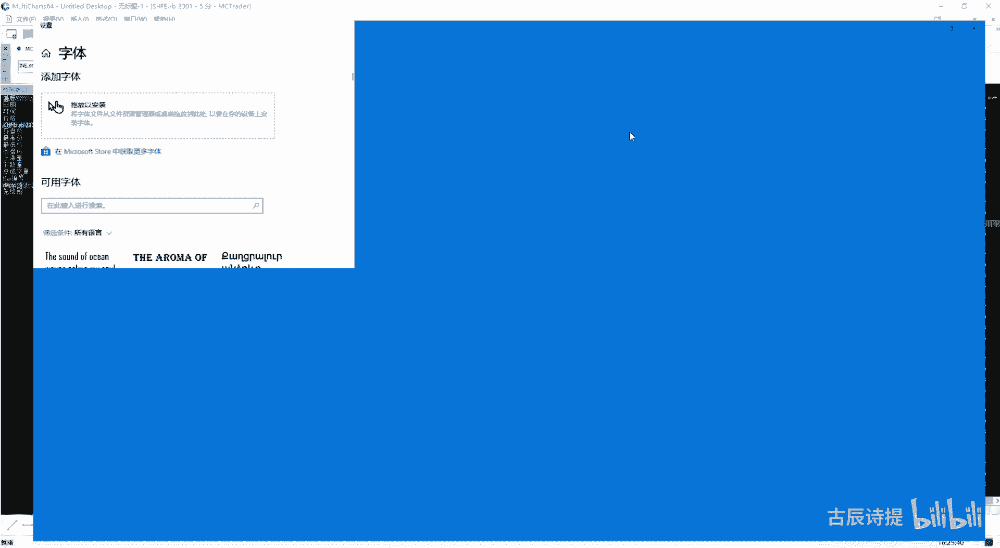

就是那个放大镜，这然后搜字体，然后你这是有字体的，比如说我挑一种字体，挑一种这个这个这叫什么c central啊，我复制不了CNTAURCENTAUR是吧，然后text set这个front。

front一般是字体的意思啊，然后这个还是value1，然后后边的这个front name，咱们刚才那个是叫什么来着，就是这个CNTAURCNTAUR啊，这个一定是就是字符串类型的啊。

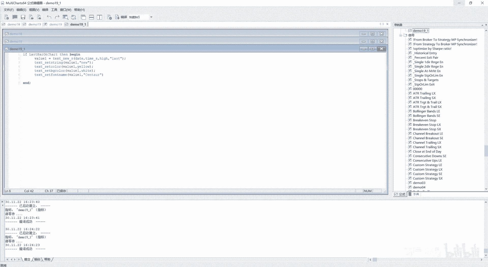

这个里边一定是棒的，是字符串类型的，然后咱们进行下编译呃。

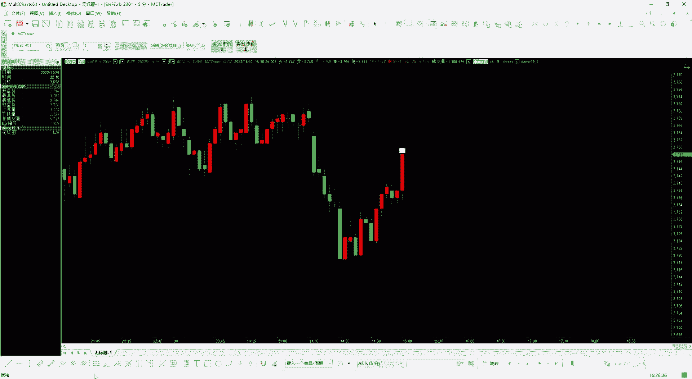

这个我把它颜色再重新设一下吧，别yellow read吧。

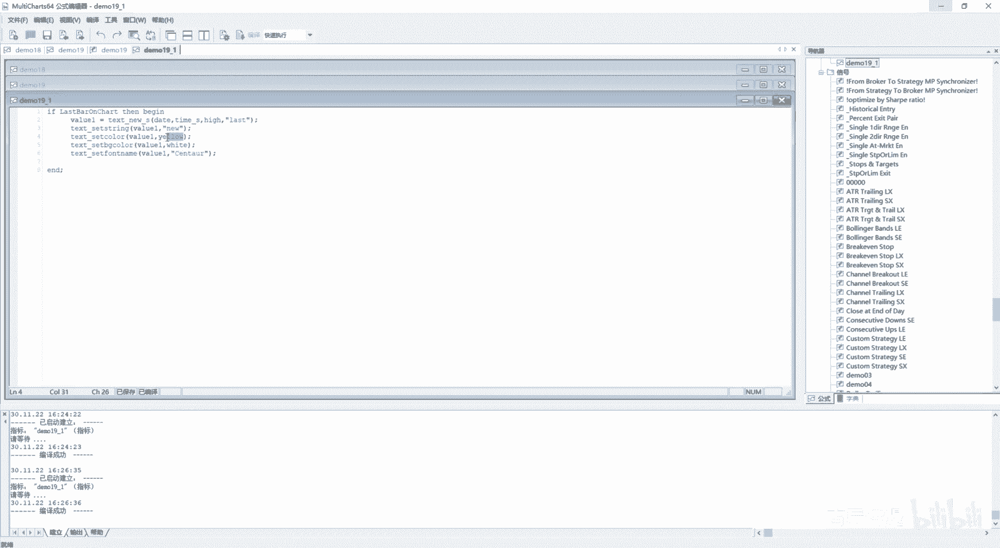

看不清是吧，你看你看他的字是不是不一样了，对不对，它的字不一样了啊。

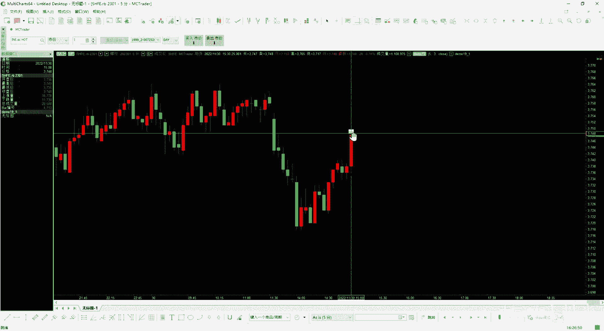

我放大一下看，啊他的字不一样了，如果说我没有这行代码。

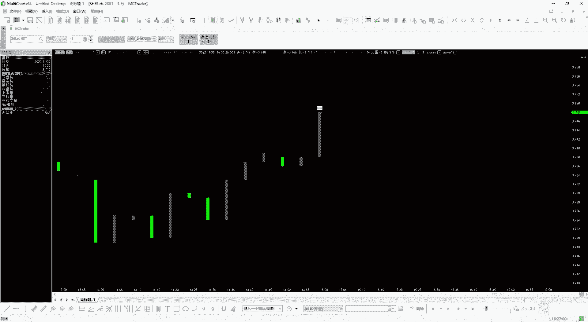

哎我把这个我没有这行代码，它的字体是不一样的啊。

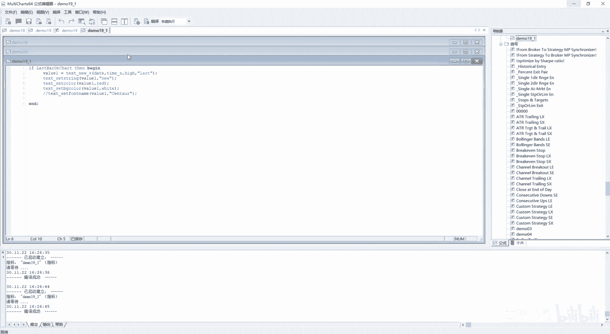

你看这个会显得很清晰是吧。

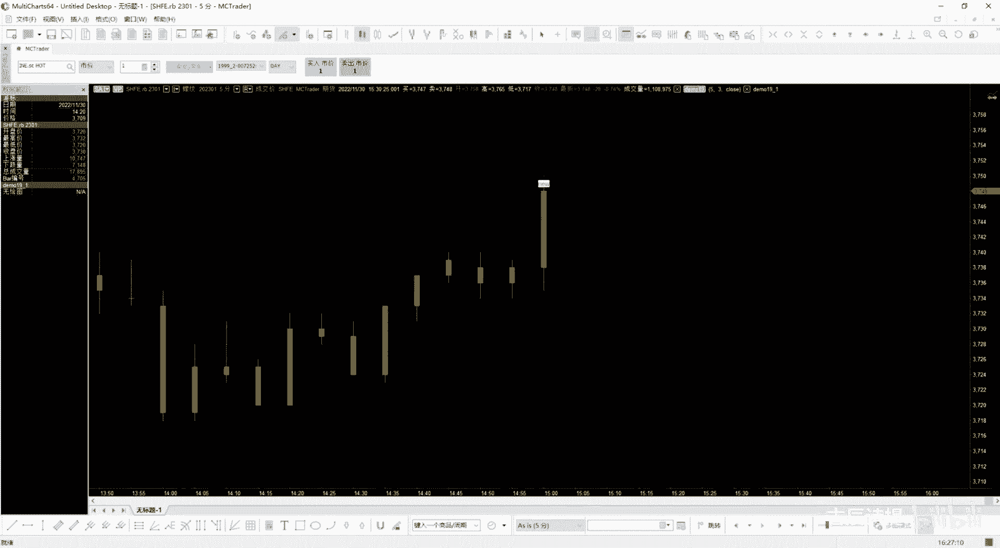

我也把这个打开，当然它是改变字体了，它的字体会显示的很模糊啊。

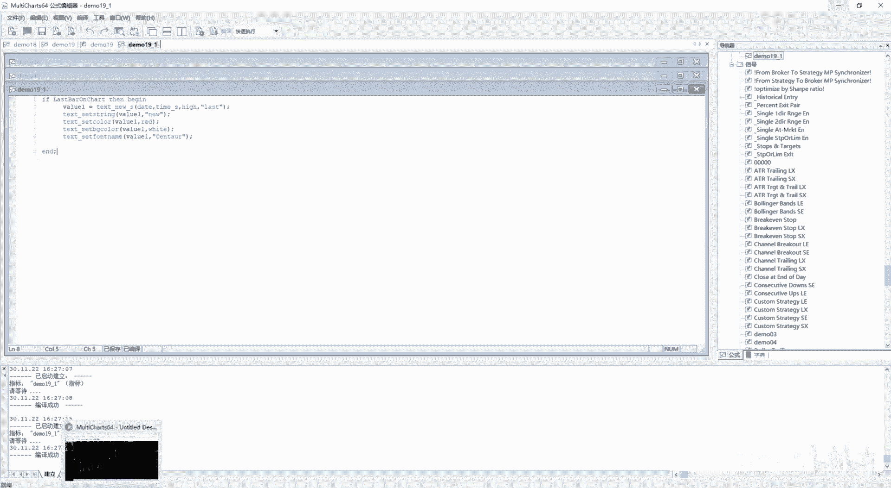

就不一样了是吧啊，其实就是这么个意思，设置字体，然后字体的话你不知道什么字体，你可以右击设置文本。

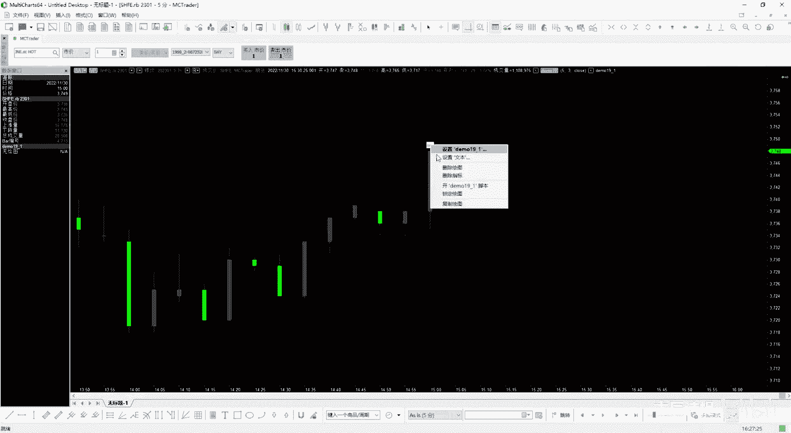

你或者说是设置绘图啊，这是个文本，然后你进行设置，其实咱们做的背景颜色呀什么的，都可以从这去调整的。

只不过那个是代码，这个是一个界面式的，就是UI的这个更加容易一些。

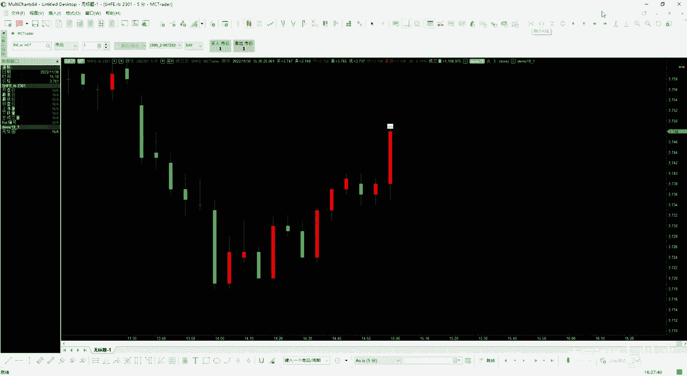

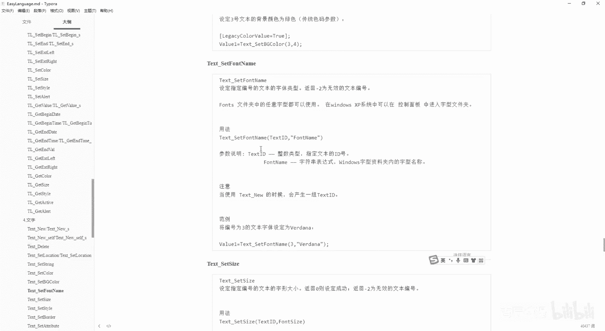