# 第1节课 EventEngine - P1 - 古辰诗提 - BV1A1421D7z6

欢迎大家来到从零开始量化系列课程，VIP课程，这一系列课呢，主要给大家深入的讲解一下，VNPY这里边的一些源代码。

首先肯定是就是安装VPY，其实这个大家应该已经很熟悉了，包括在我的就是第一节课，第一堂课里面也讲了很多，以前叫VNPY，现在叫维纳，这个维纳其实是那公司的名字啊，咱们直接输入维维纳。

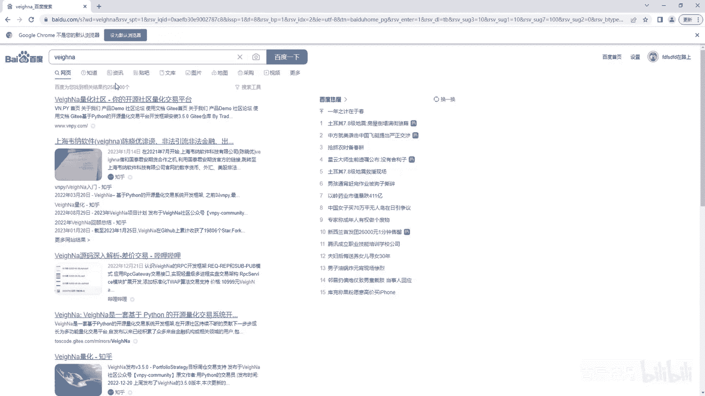

然后点击这儿，然后点击进行安装，这个我就不多说了，包括一些配置啊，如果说你还有问题的，你可以看我第一套课程，当然那套课程呢这个还叫VPY呢，而且当时是二点几版本，另外你这个系统啊。

你这个系统最好是win10系统呃，别的系统可能会有一些问题，包括win7，包括OS嗯，就是你最好是用win10的系统，然后咱们演示呢也是在win10系统上去演示的，另外你在安装的时候。

你最好把这个360给推掉，把360给推掉，如果说出现了一些问题，你可以去官网上去查一下，有一些问题，但是一般情况下win10的我装了这么多呃，一般不会出现问题好吧，装好之后呢。

呃咱们可以用两种两种打开方式，第一种打开方式呢当然就是双击它就可以了，当然你在就是说打开之前，你需要去他那个论坛上去注册一个，你的这个用户名和密码啊，然后第一种方式是双双击打开。

第二种方式呢你可以去搜这个咱们的这个power shell，Power shell，在win10里边他是这个蓝框框，就是power share，当然你也可以用那个黑框框，用那个黑框框就是这个MCD啊。

这个也是可以的，但是呢它其实是它的一个升级版，所以说你用它就可以了好吧，从这儿呢咱们以前都是输入什么呀，Python gm the station是吧，但是经过升级之后啊。

他直接可以截取输入维纳就可以启动了。

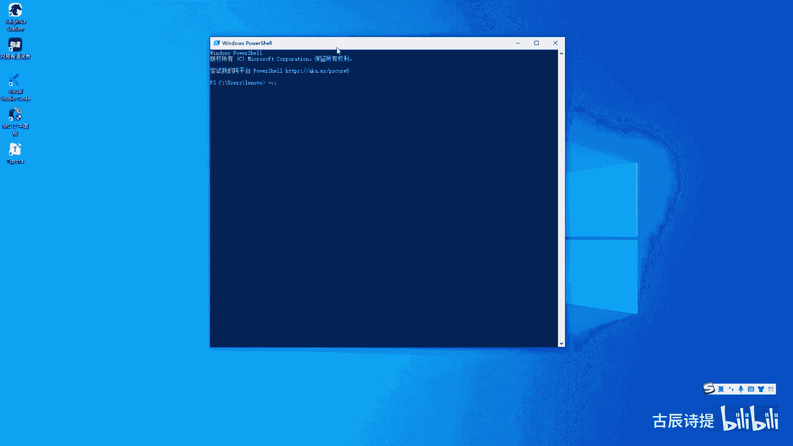

当然不建议以这种方式来启动。

为什么呢，因为以前咱们用这种方式来启动的时候，都是为了做什么，都是为了咱们在代码里边可能写了这个print啊，就是这个p r r a n t print，就是咱们需要输出一些内容的时候。

咱们会用print进行输出，print进行输出呢，那个时候是没有界面去承接的，然后它就会输出到这个咱们这个呃，终端里边来啊，所以说你需要查看，比如说你的tick有没有接收到啊，你的委托有没有发出去啊。

来在做研究的时候可能会用到这个power share，但是经过升级之后呢，你就没必要再这样去打开了，因为它所有的输出内容啊，都会在我双击打开它一下啊。

都会在这个界面里边，就是在这给你进行输出，它进行了一个重定向，进行了一个重定向重定向啊，这个呢，呃，我这儿呢给大家写了一个简单的一个小案例啊，就这个重定向，咱们用这个code去打开一下。

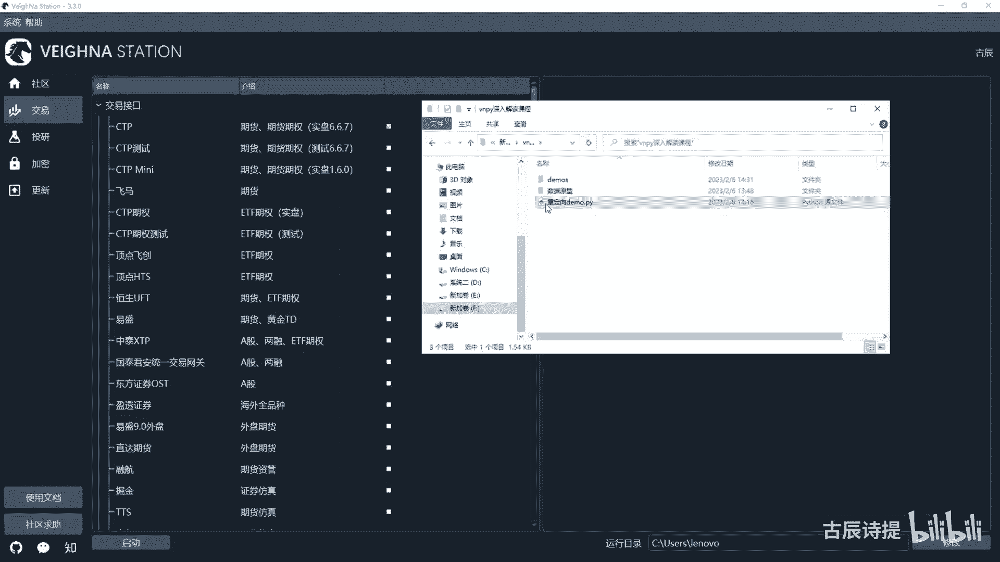

因为这已经是写好了，花不了多长时间，可能有一些老板的就是从这个旧版本过来的，会有一些疑问，重定向是个什么东西，其实重定向很简单啊，这边呢我写了一个界面，就是my visit，就是一个界面。

然后这个呢my s t t out，就是一个重定向的内容啊，我先给大家看一下这个界面，我先把这个线程给注释掉，运行一下，好会有这么一个界面出来，其实很简单，就是给大家做演示嘛。

然后从这个里边呢会给大家输出一些内容，输出一些内容输出什么内容呢，就是这个数字的，就是用print，然后现在数字是什么，就是给它往上去增嘛，自增一，这个很简单吧，啊咱们可以把它运行一下，看一下。

好在这你会发现它你用print输出，以前都是输出在这个终端上面的，现在你给它进行了一个重定量之后，它会输出到咱们的这个界面里边来，逻辑就是这样的，至于怎么做的呢，给大家简单说一下，这是个界面。

就不多说了呃，如果说有兴趣的话，咱们后边慢慢的会有这个界面的课，但是这个也需要耗费巨大的精力和时间的，一般你如果做量化的，不建议你就是说过多的去学这些，因为你会发现你越跑越偏了，然后这个重定向呢。

其实就是你看这个system，SYS是Python基础里边的一个类，这个类呢是系统system，它有一个s t d out，如果说你对C语言和C加加有一定的了解，或者你听过一些课。

其实最开始进行输出的时候，你需要需要引入一个头文件叫std IO，对吧嗯，就是那个图文件，其实STDII是代表in的意思，就是往里输入out代表输出的意思，其实呢我是把他的这个一个标准的输出。

STSTD就是standard就是标准的输出，然后给他重定向了啊，cf是代表我这个类实例化之后的本身吧是吧，这些都是Python基础啊，你必须得对Python有一定的基础知识，如果说没有的话。

可以上这个cc talk，然后去看我的课，那个课是收费的，也可以进群好吧，然后重定向了一下，然后当你有print进行输出的时候，它会调用这个F就是这个right right呢，当然经过一些处理。

如果说这个有内容，然后它会到这个里边来，然后这个呢是一个信号，就是signal，然后给你传递到这个cf点bug，就是我写的这个呃这个界面上去，然后就实现了，其实呢维纳这个也是进行重定向啊。

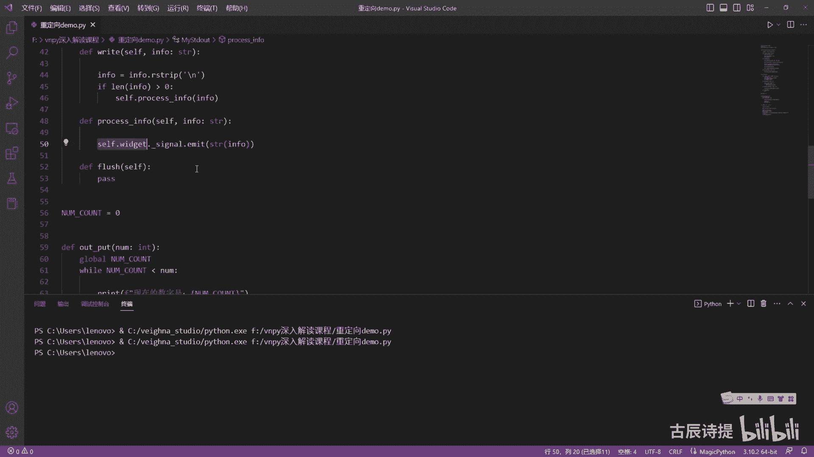

这个很简单。

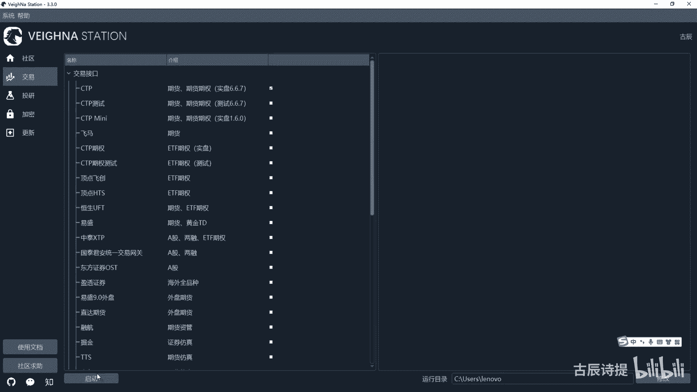

如果有兴趣的话，可以去研究一下这个代码，好吧啊。

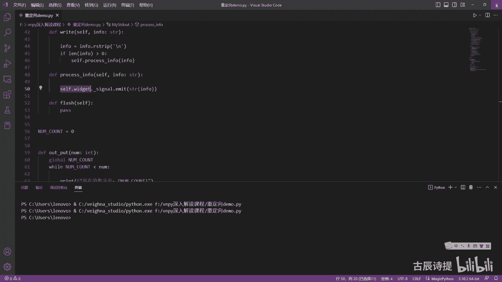

这就是为什么咱们之前用那个CMD或者power share，在那个上面去进行启动，但是呢咱们现在一般启动是这么来启动。

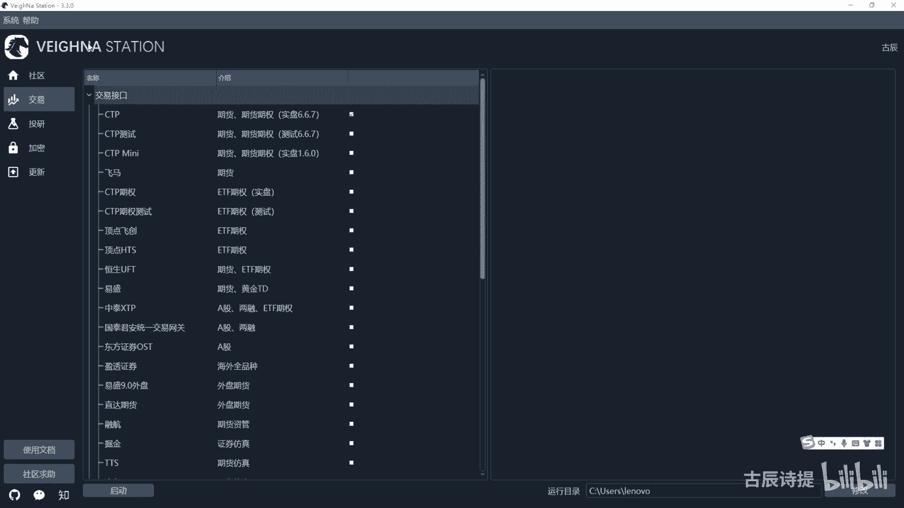

这个里边呢呃你像社区啊。

投研呀，加密啊，更新啊，咱们就不说了，主要是讲交易嘛，咱们这这系列的课主要是讲源码好吧，主要是讲源码，这个里边呢有两个啊，一个是交易接口，一个是应用模块，交易接口呢，咱们还是以CDP为这个模板。

给给大家去讲一下这个接口它是如何实现的，当然里面涉及到一些就是底层的C加加的那个，咱们不讲，只是给大家捋一下流程，就是你的数据是怎么来的对吧，当然这个数据我指的是实时数据，实时数据啊。

你的实时数据是通过这个接口过来，那他又是怎么过来的，从哪块过来的，以前咱们只是讲到这个接口，但是没有去解读过这个代码啊，从这儿呢咱们就是从就是这系列课咱们会讲，而且是一开始就会给大家讲这个CD的接口。

接口呢，咱们就以这个为就是讲解的内容，后边这些呢第一个是我没用过其他的，但是我看了一下其他代码，其实底层都是用C加加去实现的，好吧，这是一个交易接口应用模块，是咱们主要讲的内容，这个里边儿这几块。

当然最主要的还是这个t strange和city btester，就是自动交易模块和回测模块，这是最主要的去讲的呃，也是咱们如果说能够掌握这两个模块，其其实其他的模块呢，你也能够自己去给它去改善呀。

或者说你重新的去编写呀，啊这两个模块是最重要的，你像这个CTA自动交易模块，你首先你肯定得知道数据是怎么来的，实时数据肯定是从这个就是底层模，就是接口接进来的，然后后续的。

其实后续的这一大块内容都是Python进行处理的嘛，其实说白了就是对这个数据进行处理整合，然后再放到你的这个策略里面去，然后在策略里的你的那个欧霸里边，然后你有你的逻辑反馈给给服务器的呢。

就是你的委托是吧，或者你的撤单啊这样的一些内容，第二个呢这个回测模块呢，你的这个数据来源就不是说是你的这个啊，这个CDP你就是什么呀，你的比如说阿q data，或者说你买了天晴数据这个三方数据的服务商。

这数据会过来，或者说你本地存储的这个dB啊，就是database，就是你的数据库里面存储的数据给它导入进来，然后进行用Python进行数据的处理对吧，是这个多进程算还是单进程算是吧，是遗传还是穷举。

然后给你输出一个回测结果啊，这个两块如果说你能弄明白的话，那其实整个别的一些包括这个行情记录啊，啊就是事前风险呀，你就能很容易去看清楚了啊，很容易去看明白了，当然不管是你的这个自动交易模块还是呃。

回测模块里边有一个比较重要的，就是一开始就会给大家讲的，也包括以前也给大家讲过，就是这个invent引擎，就是imminent engine，就是事件引擎，数据来了。

它都会统一的放到这个limit engine里边，它就相当于一个传送带啊，就是整个咱们这个维纳这个系统，或者这个平台里边，invent engine他是无处不在的，它是无处不在的，包括咱们自己。

比如想摘出来，我不想用这么大，一就是一个大块的一个系统，我只想做CTA这种交易是吧，我回测咱们之前讲过MC的课程，我回测用MC去回测啊，然后我再在这个Python里边，然后进行实盘交易。

就是你什么都可以撇掉，但是这个m engine也是撇不掉的，因为它是一个整个的数据流的一个传递，它就相当于是发动机啊，它就相当于是发动机会给你，就是说整个的数据，不管你是界面的显示，还是我K键的合成。

还是一些其他的，都是通过这个invent engine来传递的，所以说咱们首要要讲的还是invent engine，后边立马会给大家讲的就是这个自动交易模块，其实自动交易模块相对于CTA回测模块。

自动交易模块还是相对好理解一些的啊，相对好理解一些的，当然如果说你研究的不是那么深，比如说你像CCTA回测里边，像这个遗传算法呀，包括你这个涉及到一些算法方面呢，咱们不会过多的去讲这两块。

咱们肯定会就是大幅篇章会讲这两块，我相信大部分人的问题都是在这个两块上面，下面这个呢就是说会给大家去讲，但是有一部分是讲不到的，比如说像这个期权波动，波动率交易这一块不会给大家讲，因为在量化交易里边。

我并没有就是说用量化去做过这个期权波动啊，我没有做过，所以说为了避免给大家产生误误会，或者说有些地方我讲，我怕我讲错了，所以这块就不讲了，呃这个实时K线图表模块也不给大家讲了。

因为讲这个呢你需要这个PYSPYSI的六，或者是这个PYQT5的很多的基础知识，这个以后有机会的话，会给大家单另一个界面模块，会会给大家讲这个啊，但是在咱们这个课里边儿，咱们就就不讲这一块儿了。

呃这个RPC会讲，但是呢RPC其实大部分内容，在我的这个免费课程里边已经给大家讲过，大家可以去看一下，尤其是在实用方面，其实已经讲得比较详细了，excel这个RTD啊不会给大家去讲。

因为这里面涉及到一个模块，就是excel处理这块模块呢，它需要有一个就是收费的一个包啊，就是收费的一个模块嗯，这个模块你开通起来也比较复杂，也比较复杂，它是国外的一个公司在做这个维护的。

还需要绑定什么信用卡什么的，比较费劲，所以说这块呢咱们也不讲了，其实excel里边你只需要知道，就是说其实你把数据保存成这个点CSV，它就可以用excel打开啊。

而且在这个pd就是pandas pandas里边呃，直接有two csv，直接可以保存和读取，其实咱们一开始使用的时候，能用到这俩就可以了啊，这个啊不会可以去给大家讲，主要是里边有一个收费的模块。

也嗯也不太好弄，然后这个历史数据管理模块和时清呃，实盘行情记录模块其实相对比较简单，你如果说能把这两个模块就是听得差不多，其实这俩呢就是咱们会带一下，这里边最重要的是一个数据库。

但是呢因为咱们毕竟是有维纳这个平台的源码，其实很多东西呀你可以拿来直接去用，他已经把，比如说像这个SL跟SL有关的数据库，它已经给整合好了，包括这个MONGODB，他也给你嗯，就是做好了。

其实你可以直接去用就可以，如果说你想去研究数据库这一块的话，如果后边就是课程嗯，有机会的话会给大家去讲，其实这里边东西也很多，你不管哪一块拿出来都值得去好嗯，好好的去研究，都需要花费巨大的精力。

其实对于咱们来说，只需要会用就行对吧，这个事前风险管理模块呃，也会给大家提一下啊，web服务器模块呢不会给大家去讲，因为这里面涉及到其实你就是这个web界面，web界面呢这里面也涉及到HTML啊。

就是这个东西它是一个前端的内容，前端的内容不嗯，这个也是一个跟PYS6啊，或者PYQT5啊，它有一些相似的地方，但是呢这个你如果说要去学的话，也会比较耗费精力呃。

Python里边其实是有专门针对这个web服务器的，这个模块的，像flask f l a s k，这是S啊，包括这个DJANGOAJA哎，就是讲狗这个我后边这个怎么拼忘了啊。

其实这个在这个B站上有很多免费的课程，都会讲到这两块，一个是flask，一个是DJANGO，它就是一个是这个你像DIJANGO，它是就是这个模块比较大，它是一个重型的项目啊，会比较重要。

像flask就比较简洁一些，但是插件非常的丰富，有兴趣的可以去看看布莱克和这个迪迦狗呃，如果说你能把这个CTA自动交易模块，和CTA回测研究模块给做给琢磨清楚了，你完全可以就是把它嵌到这个。

flask或者DJUNGLE里面，那去自己去完成，这个web服务器模块的这个搭建啊，所以说这个就不讲了呃，PAPERCLIENT本地交易模块和投资组合管理模块，会给大家讲一下源码好吧。

当然最核心的还是这俩，最核心的还是质量好，就是这个呢是一个简单的介绍，以及咱们这个课程的介绍，通常情况下呢你选定了交易接口，你肯定得选定一个啊，这个测试接口，除非是在测试的时候，别的时候不要去点啊。

就是然后你点上这个CDP啊，然后这个这呢呃把你需要的去点上，点上之后呢，点击启动这边就有输出的这个啊文字栏，这呢就是它的各个模块，它的一个图形化的这么一个东西啊，图形化的这么一个东西呃。

这个就给大家看一下啊，就给大家看一下最基础的，比如说啊我连接CDP啊，然后策略啊什么的我就不讲了，因为在我的免费的第一套课里边，在B站上已经讲了很多了，我就不给大家讲了，咱们直接去奔着源码去看好吧。

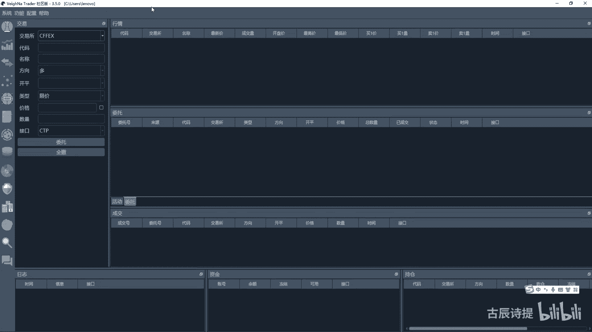

奔着源码去看好，我先把它给给最小化了，然后咱们在这里边呢，这个demo咱们用这个code打开它。

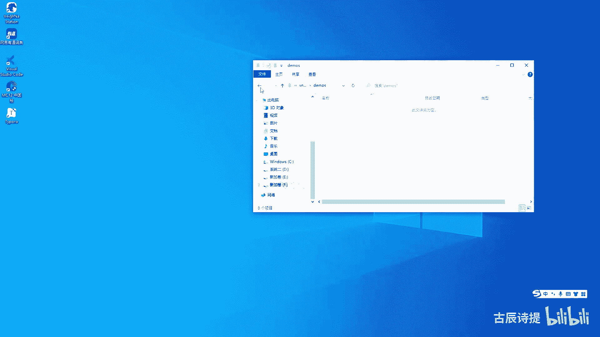

另外还要说的一个是点是什么呢，就是当你安装好了之后啊，你这会有这个维纳斯studio源码呢，都在这个lib lib这个library图书馆的意思，这里面资料很多。

然后在lip里边有个site package啊，site package在这里边存放了所有的。

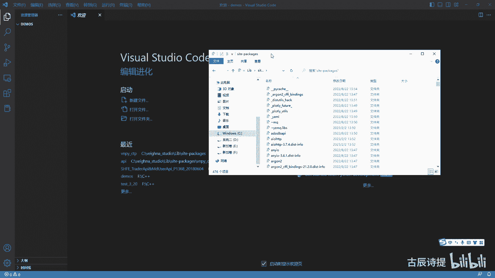

就是跟这些模块有关的这个源码，而且这些源码的文件夹呢，都是以VMPY开头的，你看这个里边啊，不你看这个里边就是你像MIT engine啊什么的，都是在这里边是吧啊，WPY啊，这个里面是chart。

这是一个就是呃怎么说呢，就是一些就是一个那像event是在这个里边的，像这个tread是在这个里面的啊，咱们经常用到的像TIK啊，这个data bar data都是在这个object里边对吧。

你得知道它在哪啊，然后VNPY下划线就这些呢，基本上要么是接口，要么是模是这个它的这个应用模块，你像这个ALGO是不是很熟，它其实就是那个算法模块呃。

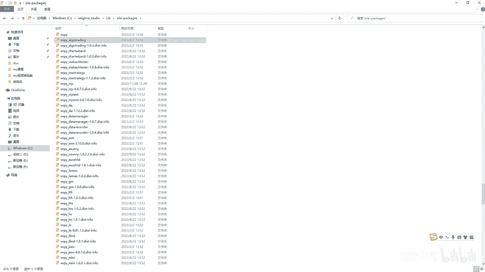

在哪，我这啊啊这ALGO它就是算法模块吗，包括你这个RPC啊什么的，这里边都有。

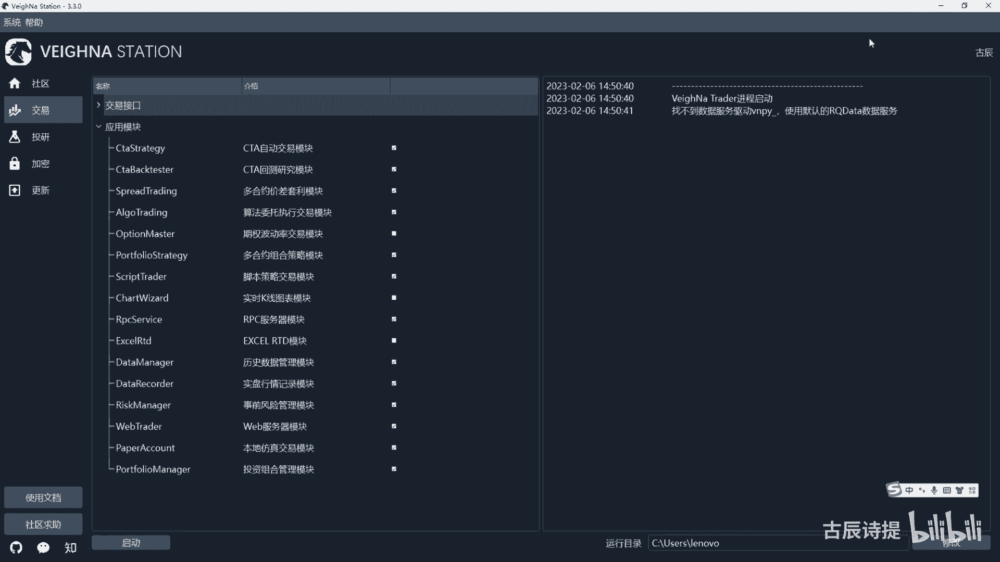

包括D这个manager，你看这个是data manager对吧，就在这儿呢，所以说你想看源码，一定要记住这个路径，它是在site packages里边啊，Schpackages。

包括咱们像装的就是一些模块，就是PYSI的六啊，都都是在这个里边啊，像PY，啊那这是吧。

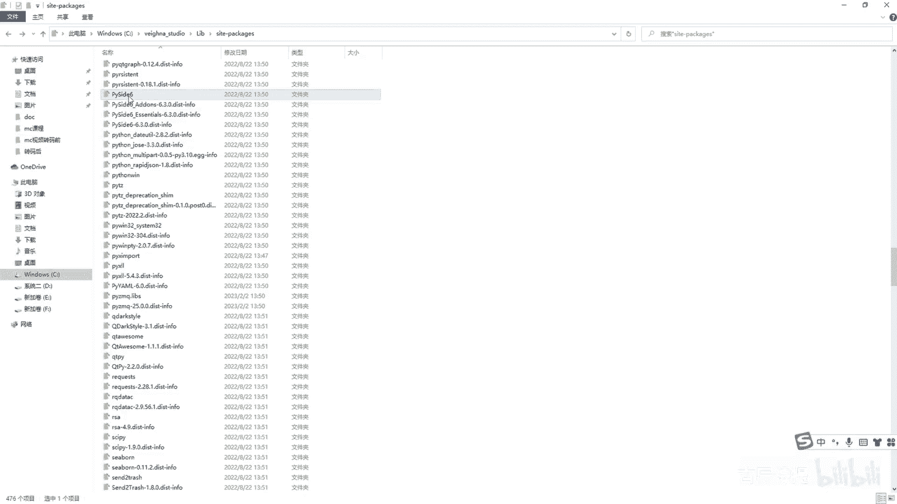

你去尤其是咱们呃比如说应用到的一些，我先新建一个demo，零一点PY啊，嗯我先print一个啊，我什么也不输出吧，我就先运行一下，你从这儿，比如你很多时候p i pip install。

比如说我一个啊py qt5是吧，你pip install这个应该会用吧，就是你去下载一些包的时候，文件的时候你一般都用这个PIP嘛，你下载好了之后啊。

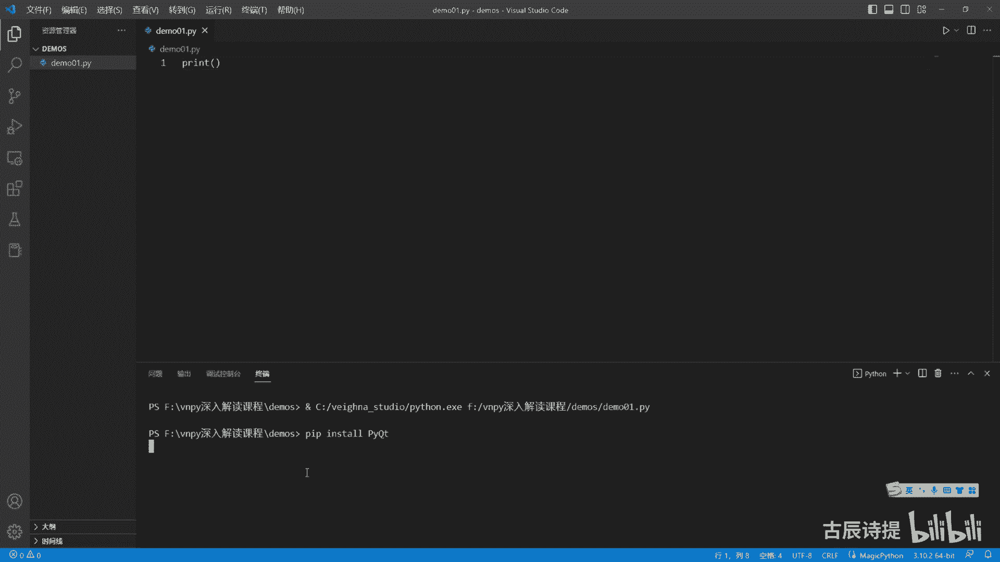

你下载好了之后啊，它通常都是放在了这个site packages里面，包括你卸载了一些，你再回来找，其实是从这里边把它给卸载掉了啊，这个都是Python的基础知识，一定要知道这些好吧，不谈有多熟。

但是一定要知道你。

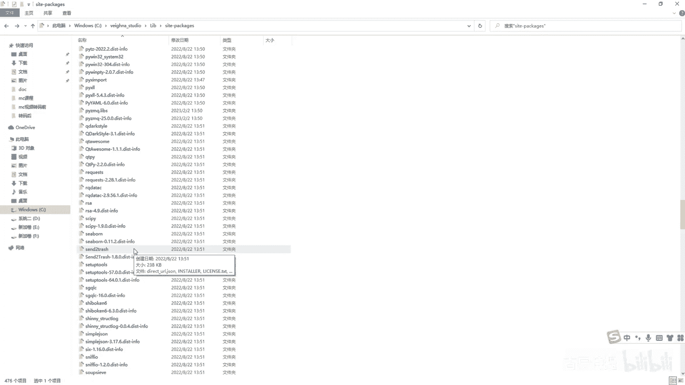

你得知道源码从哪找是吧啊。

好那咱们就是新建了一个demo，零一咱们说了，首先要讲的就是这个image engine，这个image engine在哪呢，就是VN py from VN py。

点limit import limit engine，这个还记得吗，那个VNPY，那个文件夹里边就有一个invent吧，然后当时咱们看的那个engine就在这个里边吧。

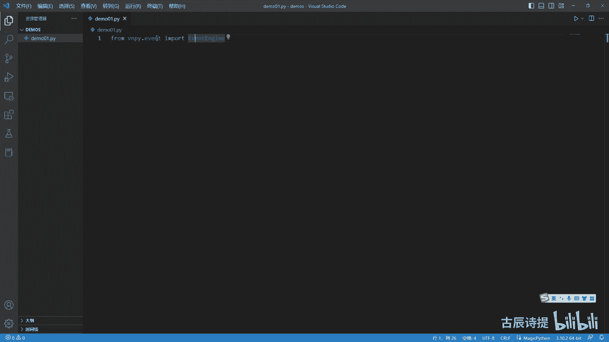

对吧啊，这个VNPY，然后MIT是吧，这个N键就在这里边吧，所以说一定要知道它在哪。

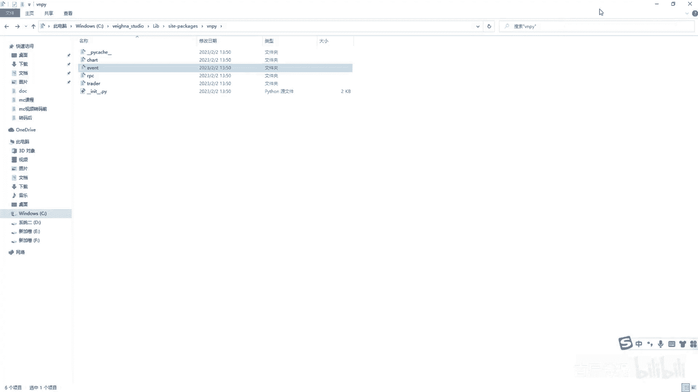

你知道它在哪之后呢，咱们其实可以先看一下源码，就是在这儿转到定义，这呢它其实是一个包，这个包里边有MIT和MIT engine呃，这个它是在这个下关下，关于ITALY吧。

咱们就是说这个也是Python基础，你如果说你单独这个PY文件，你可以作为一个model，就是一个模块来进行导入，但是如果说你几个文件在一起的，你要把它放在一个文件夹里边，然后这个文件夹。

如果说你想把它当成一个包来导入进来的话，你必须得有相关相关mt点PY这个文件，然后在这里边呢，通常会去把它的子文件里边重要的内容，然后当成这个作为这个模块，先导入这个下划线位INIT里边。

然后你就可以直接从外部包括这个limit engine，包括这个MIT就可以直接进行导入了对吧，这也是基础好，咱们可以看一下这个image engine。

这个invent engine里边这个PY文件里边呢，首先它定义了一个EMT啊，这个咱们一会再说，然后这是MN键，如果说你单纯的去看这些代码啊，你会发现嗯比较复杂啊，或者说是代码少。

但是它究竟来做什么用的呢是吧，它这里边呢其实是两个线程，一个是self three的，一个是self deteer，这个两个线程分别是做什么的呢，呃咱们看一眼这个之后呢。

咱们就是说从这咱们自己来写一下啊，比如说我定义一个limit engine，我这为了区分开来，我这加了一个下划线，我这里边需要实现的内容呢有这么几块，第一个就是数据的分发。

这个数据分发你想一想就是它不光是一种数据，咱们能想象到的，比如说这个tick数据对吧，比如说这个order数据，比如说这个try的数据，你都需要去进行这个分发。

包括这个position p o s i t I/O n是吧，这个position data以及这个里边它原本里面是不带的，count data等等等等，这些数据你都需要去进行分发。

当然这些数据可能会被界面去使用，比如像tick data。

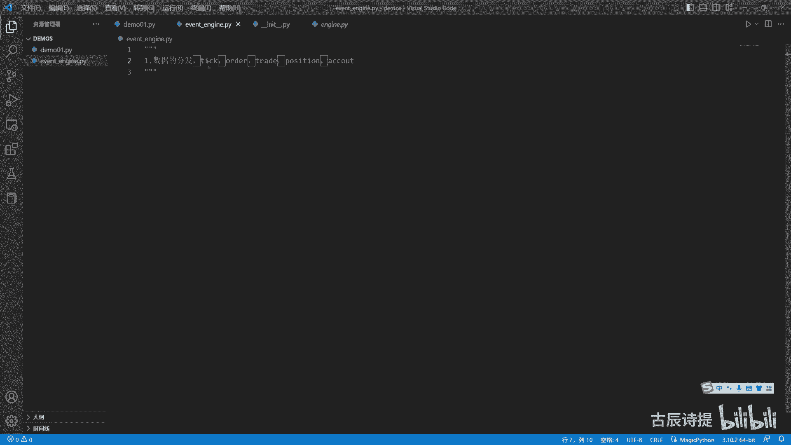

像order data，其实他们都需要去，你如果说用这个界面进行交易的话。

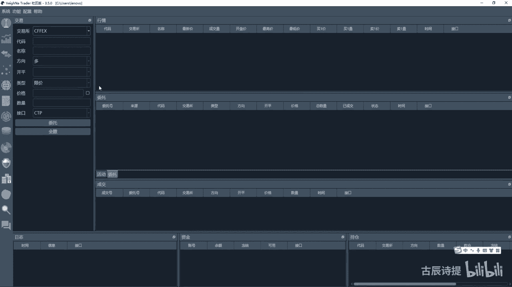

他肯定想从这儿是吧，它需要被界面去使用，同时呢你像这样这个贼大，还需要比如说给你的这个策略里边去使用是吧，你像这样都具备这些属性，所以说使用方它不一定是一个，然后呢。

传输方呢通常是咱们那个gateway进行传输过来，所以说你从这儿呢就需要给他建立一个通道，什么通道呢，比如说我建立这样一个通道，这个通道我把数据放到这里面去，然后呢我这边取数据，取出来的数据呢。

再分别给这个需要使用的模块来进行使用，首先咱们得考虑，你这个东西应该是一个队列类型吧，他绝对不是占啊，这些都是基础知识，占是先进后出，队列是先进先出，你得按顺序嘛对吧，先进先出，然后当他有数据的时候。

然后你分给分给他们，但是你这个数据是不是得有标识，得有标识，那我这个数据是什么数据，是不是得有标识，所以说你这个数据包，你不能是干巴巴的一个数据，比如说一个列呃，一个字典，一个列表，这样你没法去识别。

我最好呢是把它打包成一个数据包，然后放到我这个里边去，这样我在使用的时候，就可以分门别类的去进行使用，比如说我这边是tick的哎，我需要用到tick，是这些模块，我需要用到order的，唉。

是这些模块对吧，那这些模块的使用，这些模块是不是需要去注册，我给他注册到这个里边，比如说我tick这个里边，然后当有tick来的时候，我就进行调用，当有order来的时候，我就进行就是这个调用对吧。

好new这样的逻辑之后呢，其实就很好理解了，首先我的这个队列就是这个Python基础里面的，From qu u e q，QUEUE是吧。

好然后我先定义一个lake class EV e n t e mengine，然后这边是卖，我把它写到前面吧，My int engine，然后冒号我不需要继承任何的对吧，或者直接继承object。

这就省略了啊，DF杠杠INIT好，我先写一个pass啊，好首先写一个我队列，我是不是得需要seq u e u e，我直接新建一个队列QEOE是吧，这个里边max size我也不给他去进行设定啊，然后好。

我肯定你往里边去放东西，我得需要put吧，对不对，那put咱们之前说了，你往里面放东西，那我这个东西比如说它是一个东西啊，比如说这个message啊，或者或者不管是什么东西吧，然后我给它放进去。

就cf点QUEUE，然后点put，然后把这个item啊，我把这个message或者这个内容给它放进去，然后我还需要取对吧，Df gate，然后self，然后我就给它取出来，C点QUEUE点git。

然后去取内容，这些是基础知识啊，然后block我是不是进行阻塞好，我给它阻塞一下true啊，我就是去取东西的时候，我等着是吧，然后等多长时间呢，Time out，比如我等一秒钟。

如果说啊等到这个一秒钟没有取到的话，我是不是就可以给他报一个错t y try啊，然后我呃try呃，except是吧，E x c e p d except，然后这个错误如果说没取到，他会报一个什么错误。

是一个空的错误是吧，空的错误就是这个empty好，我把这个e m p t empty啊，如果说我取到的是一个空的，那我不管啊，我接着让他取，是不是这需要一个循环反复的去取，比如while true。

他是不是就会反复的去取，如果是空的话，它就略过，然后我再去等一秒钟是吧，这是不是就是我get，就是不断的往外去取东西是吧，当然这个东西我取出来的这个data等于，然后这个data我再去进行处理。

比如说我这写一个我这个data，处理PROCECES啊，process data吧，然后这个cf a然后把这个data放进来，然后我再去啊，我先pass一下去process这个data。

所以说我就直接可以去调用cf点process data，然后把这个data给它放进来，这个逻辑能理解吧，这边呢是一个循环，是一个死循环，那这样是不是不太好，如果说我用它的时候啊，我可以直接去用。

然后如果说我不想用它了，是不是我在这可以设一个，比如s AC t i v e active，它是不是活跃的，我一开始我给他写个不火就是否啊，然后我这呢wire self active，然后就进行循环。

如果说我有一个把它给关掉了啊，比如说我定义一个CD f c f d r df stop cf，我就把它这个self active等于false是吧，当然你也可以加一个判断，这怎么判断。

就是if cf点active，如果说它是true的话，我就让它变成false是吧，但是从这你就得知道这个是一个循环，你循环一直在做的话，其实最好给它单另一个线程，对不对，单另一个线程好。

现成的类是什么呢，From three import，对吧，From three import three，然后我这可以写一个四点，three等于thread t h r e e d thread。

然后这个呢就是把这个线程它的这个target等于，我就cf点git是吧，然后里边的参数我就不写参数，然后我再定义一个啊df start，就是他开始是不是，然后就是C点啊。

three的t h r e e d star开始就让它跑起来，或者说我怕重复的话，我就写一个run都可以啊，这个都可以写个start都可以是吧，然后如果说你这个线程跑起来，我要去关闭它的时候。

然后这变成了self active等于force，我是不是得把它这个cf点这个thread我给它给关掉，关掉，其实就是一个john john给它插入到前面去啊，john然后它运行一遍。

然后它变成false了，它不就关了吗是吧，这个应该能理解吧，这些都是一些很基础的好，那么咱们说到这了之后，这个message咱们之前说过，讲过他必须你这个世界你得标识，那标识我怎么标识呢，那很简单啊。

我就class一个event，是吧，class一个event，然后它这里边有什么东西呢，有什么东西呢，它只有什么呀，比如说我DEF下完下完in it，它只有一个c type是吧，它是一个STR类型的啊。

好这个是你需要传进来的，就是这个tab s t r类型字符串，我标识一下它是个什么东西是吧，我等于type，你还有一个具体的cf点，MIT这个M就是你是什么类型的，是字符串类型的还是DETAM类型的。

你不知道，所以说你可以把它标识为上面，你标识为STR，下边你应该用什么AI来标识一下吧，然后它是一个event，这个event any来进行标识一下。

它等于event这个any咱们from typing，导入一下，import一个AE是吧啊，这个时候你把它每一个数据来，我都给它封装成一个这样的invent，然后我给它放到这个里边。

所以说我就可以把它改成invent，对不对，然后put a link封装一下，啊这个这个不需要改啊，然后后面我get a block time out，然后这个其实就是一个event对吧。

可以进行标识一下，然后我process data也把它改成invent，然后我process data呃，我process data的时候，然后就把它改成event，然后我具体的里边是什么东西。

我就可以什么呀，data我就等于invent，点data或者就是invent是吧啊，当然咱们这个数据咱们用data来表示啊，咱们这把这个data改成E吧好吧，然后这data shift点data，对吧。

这样是不是就比较符合逻辑了，那我光传递我这个数据来了之后，我给谁来使用呢，给谁使用呢，这你就需要给一个接口，就是我注册这个事件啊，我把这个我的这个具体怎么用的，这个一般都是用这个函数嘛或者方法嘛。

就是DF定义的这个来进行使用嘛对吧，所以说我就可以给他一个注册的口子，就是i g i s t r register，然后self哎呀，小写的self，然后后边他肯定是一个方法，function是吧。

function它是一个COLLAB，诶不是这个COLLAB啊，这CORB向右拆分一下，Function，它是一个就是可回调的是吧，可回调的，就是我把这个方法作为一个对象注册进来。

然后呢每回有数据的时候，我都让他去调用我那个方法不就可以了吗，咱们之前就是在这个Python基础里边，就是在我的这个Python基础课里边给大家讲过，其实这是一个什么呀。

把方法就是说你单独的把这个put，作为一个对象进行传递也是可以的吧对吧，所以说你注册的时候，REGIST诶，我把这个方法注册进来，它是一个可回调的，是不是，那进来之后我给它放到哪呢。

好我这可以给他写一个啊，cf点FUNC就是存放的地方啊，比如说就是放个死啊，然后呃W吧，等于你说它存放进来之后，我是不是要么用列表给它放着，要么用一个，因为它这个是有标识的对吧，就是有标识的。

那我是不是可以用个字典，我给它分门别类的放到这个里边儿去啊，这个字典比如说这里边存放的是什么呢，写一下啊，从这儿写一下，比如这个字典里面存放的，比如说我这是tick哎，这个里边后边比如我用一个列表。

比如说我放个一放个二是吧，我给它放进去不就可以了吗，对吧，我这前面是字符串，后边是一个列表，是不是，所以说我register的时候，我注册的时候就把它分门别类的哎，就这么来放。

所以说我这一定是需要一个它的这个类型的，我是接触过一个什么样的数据是吧，Type，STR啊，Type s t r，所以说你注册的时候就可以把它怎么放呢，你去看一下if啊，就是说这个tap。

就是cf点funk w，我直接啊就是cf点FW，然后我去调用这个tab是吧，这个取出来的是一个列表吧，然后点什么呀，就是说我这个function啊，就是我把它给添加进来啊，当然你还去进行一下判断。

这个就是我之前有没有注册过啊是吧，我之前有没有注册过，就是if f u NC啊，not in cf点FUNCSW这个tap里边，对吧，或者说就是你简单一点怎么说呢，就是这个它是一个列表吧。

LST等于cf点FUNCW，然后把这个tap t IP给放进来是吧，然后如果说哎一说这个function not in，这个LST没有在这里边，然后呢我用这个LSTAP我把它填进去对吧。

如果说在里边我就不用去写了，我就不用去添加了对吧，如果说AF咱们就不用else了，这样看得清楚一些，Type not in shift f u n c w，如果说这个没有在里边哎。

比如说我这个order没有，我现在要注册一个order进去，我是不是应该什么呀，就是说LST哎等于一个list，然后呢我这个list Lt里边end啊，append这个FUNC对吧。

然后我cf点这个FUNCW，然后把它添加到这个字典里边去对吧，他的key就是用我这个tap来表示是吧，T o p，然后等于这个LST这个逻辑能搞明白吧，啊这边我给他标识一下LIST，这就有代码提示了。

这个就是一个注册的过程是吧，但是这个过程呢咱们看得明白，但是有一些繁琐，是不是咱们还得新建一个列表，然后选片的什么的，然后所以说在这个里边的from collection。

serial collections import一个default dict啊，这个default dict，default是一个默认默认就是default dict，咱们可以用一个。

demo01杠点PY啊，这个from collection，import一个default deep，咱平时在写代码的时候，比如说A它等于一个字典是吧，然后这个字典里边，咱们根据那个咱们代码的需求啊。

比如说A点就是A唉，这下完这个方括号里边我取一个，比如说tick这个里边它是个空空的这个字典，我用这个来取的时候，它会报错吧对吧，但是如果说我这A等于default dict。

然后呢这里边我写了一个什么呢list啊，然后我A在取的时候诶，他没有的话，你看你会发现它不会报错，反而呢我print一个A这个里边儿，请看你会发现啊，或者我直接print一个A。

A我直接print一个诶，咱们会发现你看它default dict，里边它有一个看啊，tick是吧，他如果找不着这个key的话，它就会会给这个key创建一个空的list。

这个就叫default dict，你有这个咱们写这个的时候，是不是就更加方便了，我就省得我还要创建空列表，对吧啊，所以说我从这我写上一个什么呢，这个等于一个default dict。

然后这里边呢是一个list，这样是不是就很方便了，那这个再来写的时候怎么来写呢，就是说如果说我的这个type在这个里边，然后呢啊就是我直接这个self点放个W，然后这个这个里面写上tap，然后点end。

你看这个它就有提示了对吧，它就提示了吧，append我把这个funk啊放到这里边，然后当然你还得进行一下判断啊，and就是判断在这吧。

一说这个f u NC not in c f d f u NC w type，就是看他在不在里边，如果说你反复添加的话，你到时候再去调用的时候，你是不是会调用两遍，这样就会有问题是吧，这样写不就可以了吗。

如果说我这个type类型呃，在这个里边，然后呢我这个function没有在这个里边，然后我就这个列表里边就添加进去，它对吧，然后elf如果说我没有哎，这个我这个里边没有这个tap，然后我就直接什么呢。

我就直接什么呀，就是说cf点我调用一下就可以了吗，function w点I这个tab，这样是不是它就会自己创建一个空的这个列表，然后点append，对不对，然后我就往后边去添加这个FUNC好。

那咱们看一下这个engine里边这个像啊，我的就这么看吧，他这里边你看有一个default dict，可能不是大家能特别理解，你看这个它的这个是不是跟咱写的是一样的，对吧。

只不过他加了一个默认的是N同样的逻辑，就是把它给打包起来，这个事件那就是你需要的这个什么，就是这个事件给它打包起来，这个咱们先不看啊，这个先不看。

你会发现他在register这register这他是怎么写的，就是这个handle list等于self handless这个type，他先去找这个handle list，如果说有的话。

他就找到了这个list了，如果没有的话，因为我默认是default list，就是那个default dict，它会给你创建一个空的列表对吧，然后再进行一下判断。

如果说这个handler handler其实就是function是吧，就是你的这个传过来的这个函数是吧，如果说没有在这里边或者append跟咱们在这写的，咱们自己的这个逻辑是不是一样的。

只不过他这个逻辑更加的简洁，对不对，他的逻辑是什么，就是说没有这么就是没有这些铺，就是这些其实都是给大家铺垫的，它就LST等于啊，就是我cf点就是这个W后边我找这个type哎，TYP是吧。

如果说有它就返回一个list，如果说没有的话，它是不是就会返回一个空列表啊对吧，标识一下啊，空列表啊，然后再进行判断，If f u n c，Are not in u s t。

然后我这个LST点append，我就给它添加进去了，把这个FUNC对不对是吧，这个是不是就跟这个是不是，就跟咱们这个engine里边是一样的，只不过你可能在看的时候，这个handler哎呀好麻烦是吧。

你再回头看他这个就是说这个handal type，你看他写了一个COLLAB，COLLAB是等于什么呢，Colorful event，还有N啊，其实它是一个类型标识啊。

它其实就是一个可回调的这么一个方法，好吧啊，可回调的方法啊。

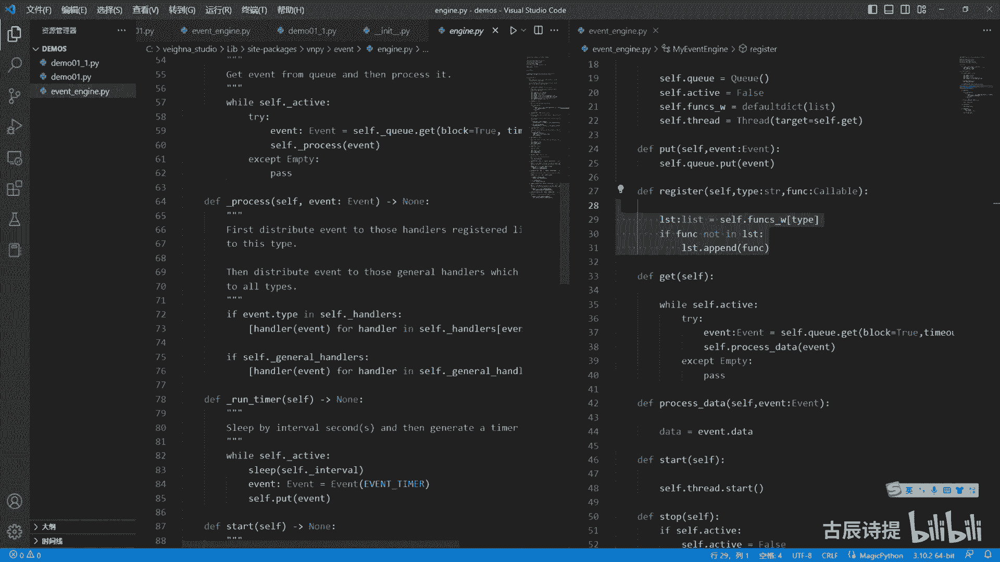