# 第1节课 MC软件介绍 - P1 - 古辰诗提 - BV1iH4y1G7Sk

欢迎大家来到从零开始量化系列课程，MC课程，这个课程呢，咱们主要讲一下量化里面用到的这个三方平台，为什么需要讲一个三方平台呢，因为你在开始接触量化的时候，尤其是开始接触计算机语言的时候。

如果说你是程序员出生，或者说你有程序员呃，这个语言的这个基础，你可以直接，比如说用咱们一直在讲的维纳平台啊，或者一些其他的这种开源平台，但是如果说你没有这个编程基础，你来开始接触量化的话。

你会发现这个过程会很漫长，反而一些三方平台，比如说像咱们熟知的tb包括文华文化，它分文化六，文华酒吧，文化六呢它是这个卖语言，语言会更加简洁一些，但是呢他的很多的，你的想法可能不太能实现的了。

到文华酒呢，他的语言就更加的丰富了，类似于C加加或者就是C加加语言，它里边给你集成了很多的这个内置的方法和函，数以及指标，你会发现从你学一门这个三方平台，这样的语言的话，你更你能够更快速的去进行量化。

简单来说，就是你可以很快地写出一个自己的策略，当然这个策略逻辑不能太复杂，这样的话你就会有一直去学习下去的动力，不会去，因为比如说你要学这个三方平台，维纳这样的平台，你可能学一年你才能有所。

就是说能写出一些策略来，而且我指的是就是用零散时间，而不是说你专注的去学啊，你专注的去学，可能三个月你就可以了对吧，所以呢就是说学一个三方平台，还是很有很有必要的，另外呢一个三方平台。

它还能跟你的这个开源平台做一个对比，就是比如说你同时挂着两个平台的这个策略，你可以对比起来，也就是说是在哪个位置开仓，为什么就是这个平台在在这个位置没有开仓，可以做一个对比，总而言之呢。

就是说三方平台呢有三方平台的好处，开源平台有开源平台的好处，三方平台不用你去解决，像数据的问题，包括一些里边逻辑的问题，就是大部分逻辑的问题不用你去解决，人家都已经给你封装好了，告诉你怎么用。

你就去怎么用就可以，但是开源平台呢，你可能就是要面临的问题会更加的多，甚至于这个你的开源框架能不能用在OS上，或者是用在windows上的，你这个都要注意去区分啊，所以呢就是区别还是很多的。

但是如果说你学了一门三方语言，就是三方平台的这样的语言，对于你去学开源平台，哪怕是C加加语言的，或者java语言的，或者Python语言的，会更加的容易，因为计算机语言的这个基础，无非就是流程控制和。

这个就是你里边的循环对吧，以及就是整个逻辑上的一些问题，你如果说能学会一个三方平台，对于你去学别的技，就是真正的可以就是说你去做一个软件出来，或者做一个app出来的这样一个语言的话，会更加的容易。

里边都是相通的，最核心最内在的东西其实是相通的，好吧，咱们介绍的是MC这个平台，首先声明我不是MC的，就是工作人员，我也就是没有和MC有任何的协议，我只是从开始学的时候，我学的MC。

后来也用过一段时间的tb，但是肯定是有先入优势的嘛，我个人认为MC还是比较强大的，尤其是在以前的时候，当然这个软件一样的确实很强大啊，但是可能在中国的用户不是那么极其的多，没有占领。

就是绝对的市场占领地位，所以说现在的话可能他收费的内容会多一些，但是我仍然认为这个平台是一个非常好的平台，他的语言也非常容易的入手，他的语言呢叫easy language。

也可以叫power language，啊这个语言基本上你能应用的场景，也就是在MC这个平台上，我到目前，我没有看到他别的地方的这个应用场景，当然就是你学不可能白学，就是里边的逻辑。

第一个它是很容易的去介入，第二个呢就是说你学完之后，他会对你学Python也好，去去或者去学这个C加加也好，会有很大的帮助，核心基本上都是一样的，首先咱们先介绍一下这个咱们这个平台啊。

平台不会做过多的介绍，更多的咱们是学这个编程对吧，但是平台的熟悉还是很重要的啊，首先第一个就是你得下载它，下载呢其实很简单，就是你在百度里边去搜这个，这个multi charts。

multi呢比如说咱们如果说有过Python的基础，叫multi process，就是多进程，multi开头的这个英语单词，都是代表多个多个的意思，然后chat代表是图表的意思。

然后charts是复数嘛，mountain charts就是代表的就是说多图表，他呢你可以很简单的从这就能看到，它是由俄罗斯公司开发的，就是这个IT在俄罗斯这其实是很厉害的，尤其是他们这个算法嘛。

呃其实MC他这个图表集成做的特别的好，包括它的算法也做的比较优秀，我用过tb，我个人感觉就是MC能实现的，会比tb就是要强一些，当然各自有各自的就是优势啊，MC不太适合咱们平常在做交易的时候，一种观感。

它更适合西方的TB呢，更加适合就是咱们的，就是这个观感没有优劣之分，只不过是你先适应了哪个，你就会觉得哪个更顺手啊，他也可以做高频的，但是不太推荐你用这个做高频，因为毕竟程序嘛它是一个三方平台。

三方平台肯定会有界面的，一旦有了界面之后，会对于你这个速度会有一定的拖累，你要知道，就是你这个展示的这个给你的这个界面，其实也是程序的一种，当你需要比如说我没有见面去跑一段程序，跟你有界面跑一段程序。

不管是从逻辑啊，还是从这个对于计算机的消耗都是不一样的，有界面，只不过是让计算机跟人的交互更加的方便，真正的计算机的底层还是二进制的存储嘛，就是零和一，就是这是最底层的东西。

所以说你要对这个先有一定的概念，你不要认为就是你像我从百度这一搜，他就能搜出东西出来，就是特别智能式的，其实不是的，其实他是给你设定好了这样的一个界面，然后你从这输一个什么东西。

他会给你从数据库里面去搜去搜索，或者用他的这个计算机的智能算法，给你推荐出来的，包括根据他的广告什么呀，给你推荐出来的，就是说这种就是一个个的条目，你对这个一定要有理解，你所做的你在计算机这。

你所做的每一个动作都是别人给你设计好了的，只要他有回应，都是别人给你设计好了的，所以说一般一个你像这样的一个，搜索软件的开发是需要很多人共同去来完成的，因为它每一个点你每点击一下。

或者你每每输入一个单词，它的反馈是什么，它都得做到，就是说就是给你把就是整个的显示怎么显示，都给你全部给规划好了，好吧好，点进去之后呢，你点立即下载就可以了，我这已经下载好了，我就不点了啊。

你点立即下载就好了，立即下架完了之后呢，你需要从这个会员这，你去进行这个就是登录一下，或者说你注册一下，直接就用手机号注册就可以了，然后他会给你发这个就是那个他的这个验证码，然后你写一个这个密码。

然后就可以了。

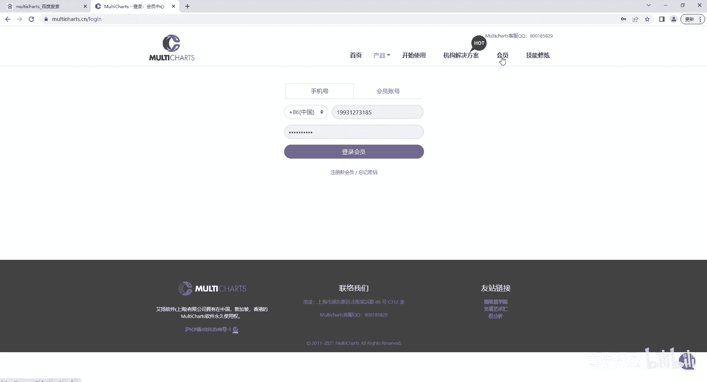

会员你可以就是进入他这个我登录一下啊。

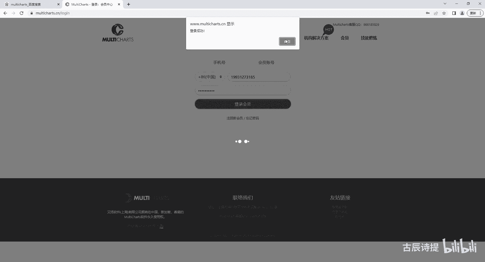

你可以从就是进入他这看一眼，就是这儿呢有个注册名和注册码是比较重要的，因为就是软件在你第一次登录的时候，它会让你填写注册名和注册码，你只需要从这点一下查看，然后复制粘贴过去就就可以了。

他不光是这个用户名和密码，它还需要注册名和注册码，一台电脑就是一个账户，只能登录一台电脑，如果说你想同时登录两台电脑的话，是需要额外去付费的，除非你把另外一台一台电脑的这个MC给关闭掉。

他这里边给你做了一些很详细的介绍，哪些是收费的呀什么的，就是你可以去仔细去看一下啊，另外呢就是如果说你用了它还可以，你想开通正式，就是说正式用它这个来挂实盘的话，你需要从他这个内盘合作期货商这去挑选。

这个就是开户的这个期货公司，另外如果说你想做外盘的话，他这也有外盘的这个期货合就是合作商，所以说你一定要注意这些，同时呢他这个软件是可以做股票的，其实基本上都可以，包括期权，股票以及期货嗯，还有外汇。

它这个软件应该是都可以的啊，应该是都可以的，还是很强大的好吧，下载呢就直接安装就可以了，它下载下来呢会是一个我看啊，在软件里边会是一个压缩包，就是MCCN这个你直接双击它，然后直接双击这个就可以了。

它会就是点E文件，直接安装就可以了，安装就是傻瓜式的安装，我就不演示了，特别简单，就直接点击下一步，下一步下一步就行啊，另外你在这个立即下载的时候，你会看到啊。

就是说它是mount charts12软件版，你就直接下，你电脑是32位的，你就下32位，64位的就下64位呃，然后这边有一个V12商品合约的设定档啊，这个呢你是不需要去下载的。

如果说你的电脑里边装有MC，然后有一段时间没有用了，你再想用的时候，你需要下载一个这个商品合约设定档，它是干什么用的，可以给大家做一下简单的介绍啊，咱们知道就是期货，就是期货。

他的这个品种或者说股票有新股上市的时候，他肯定是得在你这个软件的这个本地，这是有标注的，比如说我过了一段时间，现现在你的这个螺纹是2301是吧，是主力合约，或者说2401它还没有上市呢。

过了一段时间之后，2401上市了，上市了，你必须得去向，比如说我申请数据的时候，我必须得在跟这个服务端进行交互的时候，你得告诉他，我需要RB2401的这个合约数据，对不对，但是你本地都没有这个合约。

就是说这个标记你怎么去申请呢啊，所以说你需要就是说在你的这个本地的这个，软件设定里边，把这个合约给填进去，这其实就是它的这个商品合约设定档，因为过一段时间它就会更新新的合约嘛。

你需要把这个东西给更新进去，你更新进去，它才能实现跟这个服务服务端的交互啊，他就是来干这个的，所以说如果说有一段时间没有使用的话，你需要去下载这个商品合约设定档，然后去呃载入它。

然后它这儿呢也有操作手册和这个语法字典嗯，你可以下载下来看一下，其实这个语法字典呢咱们也会讲一部分，讲一部分，主要是讲这个咱们经常用到的一些，它是如何去使用的，好吧，其实更多的就是说你知道这个平台。

它的一些运行的逻辑，包括它如何去就是真正的跑起来的，去如何实现的，那到后边这个语法字典，只不过是你知道与不知道的问题，就是你可能在实现一个功能的时候，比如说我想获取我在5分钟K线。

我从5分钟K线上去进行交易，我想获取日线的，比如说前一日的这个收盘价，你可能你不知道，就是说有这种捷径的代码，你会写的会比较复杂，但是如果说你知道有这样捷径的代码，或者有一个简单的函数能获取到。

会比较方便，区别就在这并不是说不能实现，好吧好，你安装完成之后，它会让你填写这个就是这个注册名和注册码，就直接填一下就可以了，呃填写完了之后呢。

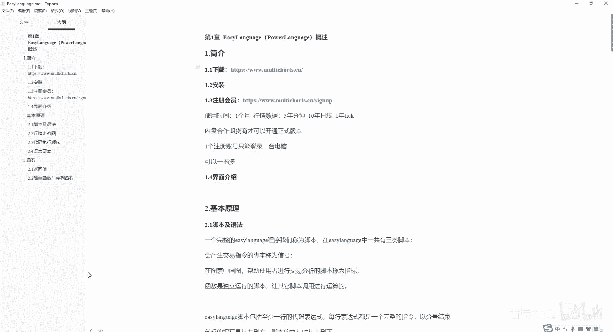

你会在桌面上会出现这个MC12中国版双击，然后进行登录，一定记住用手机号进行登录，用手机号登录，输入你的手机号和你设置的那个密码就可以了，好吧，登录进去之后呢，它会有这样的，这个是他的其实是主界面。

这个里边你可以把它理解为是各种app，咱们经常会用到的呢，第一个是交易总管，交易总管里边会显示你的所有的，你在这个平台上所挂着的账户的持仓信息，资金一些基本情况以及他的挂撤单的情况啊。

咱们可以点击给大家看一下啊。

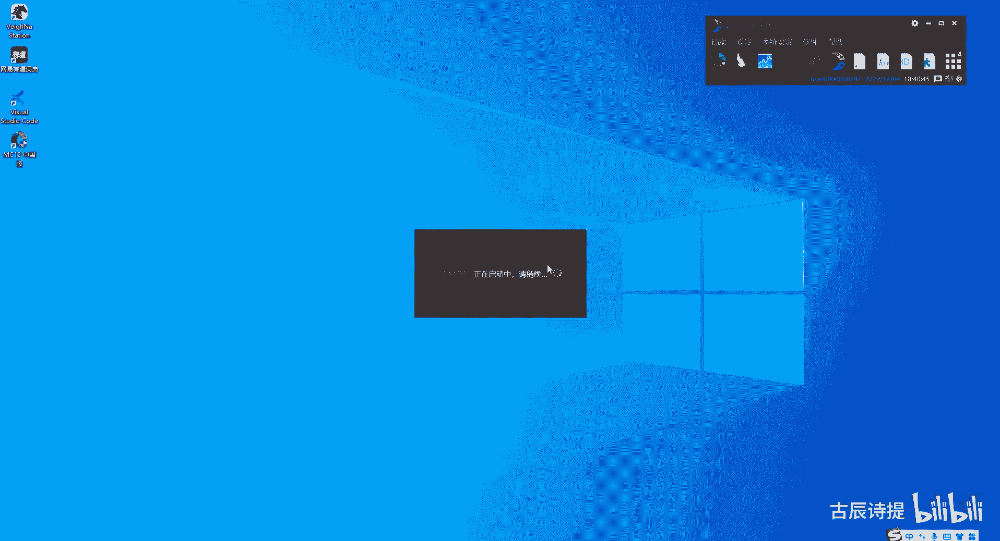

这个就是他的这个交易总管资金持仓，包括组合持仓，平仓明细，包括所有委托单，委托单，挂单，成交记录，撤单都在这个里边，这有个洗假起价，你可以理解为就是说你发送的委托，比如说我发送的不是及时成交的。

我需要等待的那种委托呃，就是在等待就是价格满足哈，就是然后他才转成别的这个委托方式，发送到这个服务器服务端上去啊，这个叫喜价哈，好咱们把它给关闭掉。

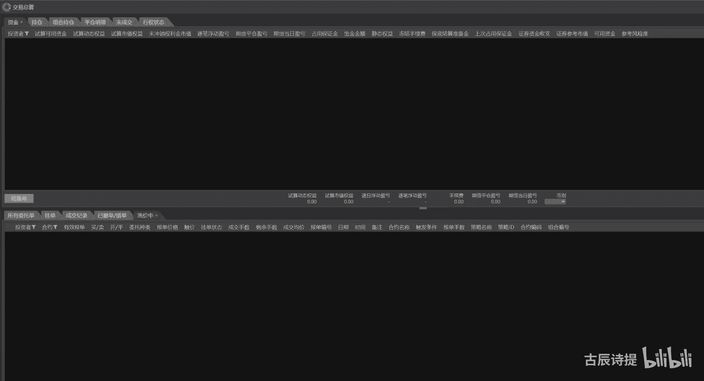

第二个呢是超闪，超闪是什么东西呢，超闪就是就是用这个什么的用来下单用的，咱们可以看一眼，就是这会有很多的这个就是说当开盘的时候，你选定一个商品名称或者代码的时候，他这会有几张报价。

然后可以就是更加快速的去操作，这就是超闪报价总管呢咱们可以呃，这个可能在股票里边应用的比较多，我这个就不详细介绍了，这个历史数据下载器呢基本上在这没有用啊，呃资金转账咱们一般也不在这上面操作。

咱们可能用文华呀，用就是就是别的一些咱们经常用的一些，就是说看盘的软件去操作，当然它也可以实现资金转账啊，这个是经常用到的mounted charts，这个当你打开进入的时候。

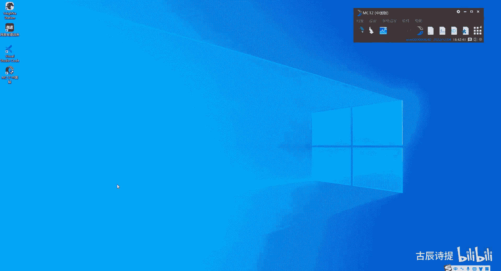

它会给你弹出一个这样的窗口，这个里边显示的就是各种各样的图表，它给你就是说展示的包括四路空间呀什么的，包括沪深300啊，呃会展示的会比较复杂，当然就是说这个都是一些指标。

你不要把它就是想象的特别特别复杂，好像这么多线什么的，你把它就是说可以全部给删掉，删除所有指标啊，其实这些就是一些指标，它这儿还有个这个东西，可以在商品里边能量能概况给它给关掉啊，不要想的特别复杂。

就是一些指标，只不过他给你在图上用图给你画出来了，好像感觉特别高大上似的，其实没有啊，不要想的特别的复杂好吧，包括这边他也会有一些，就是说比如说条件下单呀什么的啊，出场策略啊什么的。

呃你如果真正的自己就是主观交易的话，你没必要用这个软件是吧，因为他就是说在在这个设置方面更强，更加就是符合西方人的一些操作习惯，当然你用它如果用习惯了，它也是很方便的啊，它也是很方便的。

这个是咱们经常会用到的，因为从这里边也可以加载咱们的策略呃，站在咱们的策略可以从直直接从图呃，从这个呃图上把咱们的这个策略指标给画出来，包括进出场的信号啊，什么都会给画出来，你从这上面能去看我的策略。

是不是哪儿写错了呀，哪应该进场的对吧，他没有进场是为什么或者哪儿进场了嗯，他应该是没有进场的，这是为什么，有一些简单的操作，你还是得会的啊，你像比如说这个咱们的这个，你直接这么去拉的话，你是拉不动他的。

你必须得在这儿有个背景拖动，你才能拖动它啊，你才能拖拖动它，你如果用滚轮的话，它是左右滑动，你如果说想把它缩放，或者说给它，就是说撑开的话，你需要点上面这个啊，就是这样的，这个就是把它缩放。

这个是撑开啊，这是上下的啊，这是上下的好吧，然后呢，这个里边儿它有很多的这个可以点击的按钮啊，包括打印啊什么的都是有的，其实没什么太多，这个你看一下就可以了，打开关闭是吧，保存包括打印也是可以的。

视图里边其实都是在这些给，就是在他这个菜单栏，这都是有的啊，一些东西插入插入是咱们经常会用到的，比如说你想插入一个商品，我不想看这个IF，我想看，螺纹是吧螺纹，然后你可以设置它的这个周期啊。

它的时间比如说我从我别太长了啊，2021年吧啊，然后我就用日线一日，这个里边都有它的这个周期etc，包括合约啊什么的都有啊，我就用一日的，就是经常用样式，不就是可以用蜡烛图是吧。

咱们经常用要用到的就是刻度啊，啊这些都是可以的，你只要是一点击它，它就有了啊，当然我这个是加载的图，加载到图表二上去了，我并没有加载的图表一，我把这个给删掉啊，把这个，啊当然我就是我可以先把它关掉。

然后我在文件新建一个图表窗口。

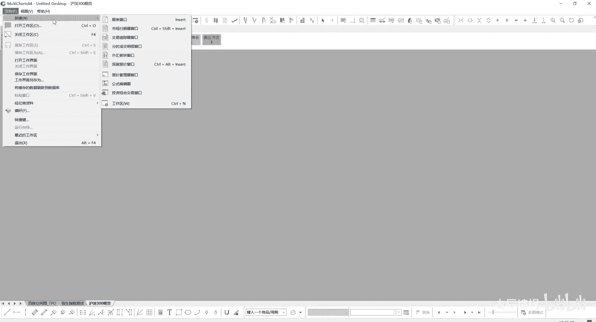

刚才是在那个图表窗口里边，加载到这个图表里边去了。

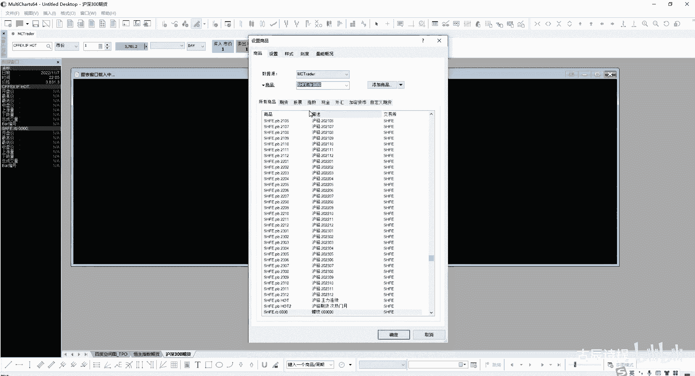

然后我现在在把它给导入进来，这个时候就是一个螺纹的了，他是0000，它应该是一个指数型的啊指数，然后我把他这个指标给全部给删掉，刚才那个操作咱们后边会讲，就是它可以加载多个周期在一个图表上嗯。

就是你只要去加载就可以了，包括写代码的时候，你也可以用图表二的一些指标，然后在你的主图表上进行一些操作好吧，这边呢包括保存当前工作区，就是你把这个你当你当前，比如说我开了多少个图是吧，我都给它保存下来。

然后我下次再打开的时候，我就可以直接把这个工作区给打开来，好，这是创建一个新的图表窗口，市场扫描器窗口啊，交易追踪器窗口啊，就是这个你可以自己去琢磨一下啊，包括一个新的报价管理器啊。

一个新的公式编辑器啊，包括一些新增投资组合啊，就是这个投资组合咱们会经常用到的，包括这个打开一个新的公式编辑器，就是写代码的地方，这个报价管理器跟咱们一开始给大家讲的，这个什么呀。

就是说就是这个东西是一样的，报价管理器里边就是所有的它能获取到的数据，都会在这里边做一个设定，就是咱们之前讲过的那个合约设定档下载导入，就是导入了，这个就是就是这个里边就是报价管理器，这个里边啊。

他是来保保存你的这个数据设置的，因为你数据必须得设置啊，你这个F和这个一般的大宗商品，它开盘时间，包括它的这个晚上有没有夜，有没有夜盘，这些数据都不一样，包括你的股票啊，期货啊，就是这些他的时间呀。

交易时段啊什么的都都不太一样，对吧啊，然后这呢是一些嗯，这个是插入商品啊，包括插入指标信号啊，这个咱们以后再说，奢侈商品就是挑选商品嘛，这边有一些图啊，包括这个蜡烛图，这个是K线啊，这个是收盘线。

比如说我点个收盘线，它就只有收盘线，K线就是这样的，但是咱们一般都习惯于用这个，用这个蜡烛图对吧，咱们习惯引入蜡烛图，包括他还有一些比较新颖的就是土式啊，包括新架线，你看它是这个样子的。

其实咱们学完之后，咱们可以自己去写星加天星假期，然后把它从这个图表里边给画出来都是可以的，包括这个这个叫专星图，不知道大家有没有听过，他是把这个时间的概念给抛掉了。

就是他直接就是说只讲求就是说空间的概念啊，就是，它是什么意思啊，就是说一块砖就代表了就是几个点的价差啊，一块砖就代表了几个点价差，我不管你这个花了多长时时间，比如说我一块砖代表五个点的价差。

满足五个点了，我就砌一块砖，如果说往下满足五个点了，我再砌一块砖，当然你从这你得往下满足十个点啊，他是把这个时间的，这个就是因素给它给去掉了啊，这个我们以前也仔细的琢磨过他这个专线图。

包括你自己画也能画出来这个专心图，当你就是学会这些代码的时候啊，当然后面还有很多什么卡级图了。

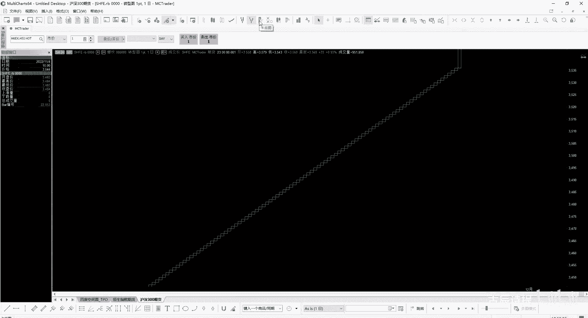

什么就是潮图，就是我这个有兴趣的话可以自己去研究研究，好吧啊，经常会用到的就是这些就是操作，包括就是这还有个往下拉，就是你得有这个拖动吗，啊好吧，这是一个界面的一个简单的介绍。

其实里面的东西还是比较多的，你如果说想去用这个的话，你这个界面你是得好好熟悉的啊，在这个插入这一块就是商品指标，绘图和信号，是以后咱们写代码的这几个必备的要素，你要写代码，你必须得有数据，数据是什么。

其实就是商品嘛对吧，我零一合约还是我股票是哪一只股票，当然是商品指标，就是我可以从这个图上把线画出来的，比如你MACD啊，包括这个你的这个均线指标是吧，绘图就是去画图啊，信号就是产生交易信号。

就是说呃开买卖还是买平卖平啊，这是信号的意思，好吧啊，这个以后会经常用到这个几个啊，就是插入别的呃，你可以去了解一下究竟它是怎么如何去使用的，好吧嗯，好这个他的这个界面的这个介绍呢，咱们就主界面介绍。

咱们就讲这么多，后边这个公式编辑器，咱们可以打开看一下，公式编辑器打开是这么个东西。

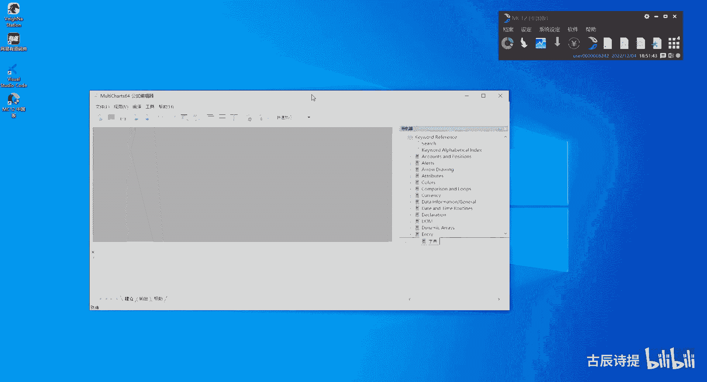

就是你如果要写代码的话，你就是从这里去写，当然你首先得新建一个，新建一个，咱们一般是新建信号啊，函数指标信号一般是新建信号，指标呢一般是画图用的，它这里边不能写，就是说买卖就是开仓平仓的这些内容。

信号是可以，就是说去买卖开仓平仓函数是什么呢，就比如说我写一个经常用到的一个模块函数，就是就是一个代码块，这个代码块里边是实现什么功能呢，就是比如说我的，就是所有的平仓策略都是什么呀。

我一下下100首单子，然后我这100首单子呢，我在一分钟之内我下完，然后大概呃一分钟之内下完，他是六，他是60秒嘛，然后你是100首，就是基本上就是六秒钟下十首单子啊，我就是在六秒钟里边下十首单子。

我就是这个六六秒，我前五秒我都下一首，然后最后一秒我下五首，这样六秒钟不是下了十首单子吗，一分钟不就下了60首吗，这个你可以通过什么呀，就是用函数把它拆解开来，就是我什么时间。

比如说我什么时间发送的委托啊，然后你把它调用这个函数，然后呢我就是说再返回出来，然后就给你时间点了，把时间节点都给你反馈出来了，包括每个时间节点该发送的手术，然后你就在信号这个代码块里边直接写上。

就说我什么时间发就可以了，这个函数其实就是一个代码块的封装，而且这个代码块是咱们经常会用到的，一个代码块啊，这是函数的意思，指标是用来画图的，信号是用来发送委托单子的，好吧，就是这三个的区别。

咱们先了先了解一下啊，你点击确认，比如说我起个名字，起个名字我就先起000吧，它就会有这样的一个编辑器啊，你从你从这儿可以去进行写代码，同时你这个000也会在右边这个导航器里边，去显示出来啊。

这个里边也有信号指标和函数啊，函数咱们就不用说了啊，他这里边肯定你得计算average是吧，就是均线嘛，average a可能跟average有些不一样的，光average它就会有好多个啊。

包括这个average true range，其实就是ATR吗，对吧啊，这是函数函数，但是它不会画图的，真正画图是在这个里边用这个指标来画图啊，指标来画图。

它这move average online就是一条均线，你可以打开它，它其实来调用的就是什么呀，就是average fc，你会发现是吧，它主函数其实就是average fc，然后V20。

然后它这里边主要来实现画图的功能的好吧，你这个函数，你像这个函数，主要是在这个函数里面去实现的啊，然后信号它这里边也有很多啊。

就是就是你看moverage move average to lie class，就是两条均线交叉嘛是吧，两条均线交叉的策略嘛，你可以把信号理解为咱们平常所说的策略啊。

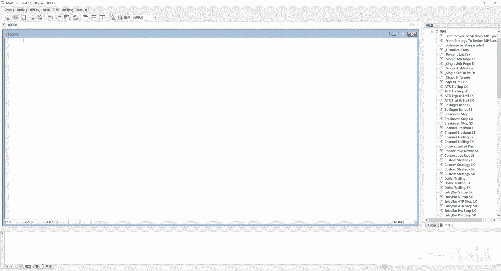

量化策略好吧，这个是他的这个公式编辑器这个3D优化图啊，这个咱们就跟大家说了，它就是3D优化图，它没什么太多的，就是可以说的，就是当你一个策略，比如说我去优化它了，就是说通过这个这个多进程来优化它。

比如说我这个有两条均线的这样的一个策略，然后这个呃优化出来之后啊，他的这个你可以让它形成一个3D优化图表，然后给你看一看，就是说他的这个呃你的均线，比如说随着这个你的均线就是这个变化。

它的这个整个的收益率，包括最大的这个回撤的变化是什么样的，你可以用3D图来看啊，然后这个呢是投资组合交易，就是多策略多合约进行统一交易的时候，你可以用这个投资啊，组合交易，包括你在回车的时候。

你也可以用它，比如说我想测一下我这个策略，在我这些选定的品种，它的表现怎么样，就用这个东西啊，咱们可以打开看一下，稍微等一下啊，我先设置一下。

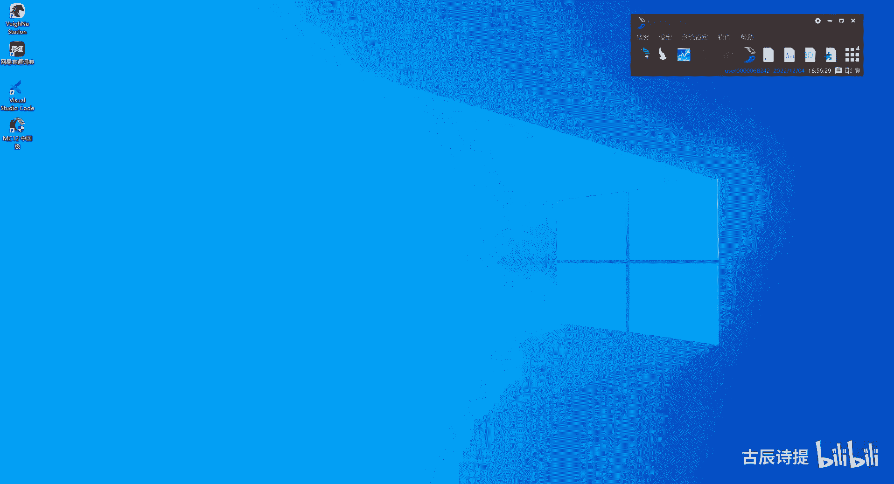

哎呀把他拉过来啊，出现的就是这个从这来添加策略的啊，strange就是策略的意思，意思嘛，你从这可以复制策略是吧啊，然后复复制策略，然后这里边可以添加商品，然后可以添加信号，信号其实就是你的策略嘛。

商品就是你所需要跑的这个品种嘛是吧，这边还有一些设置啊，这个以后咱们会讲的一点一点给大家讲好吧。

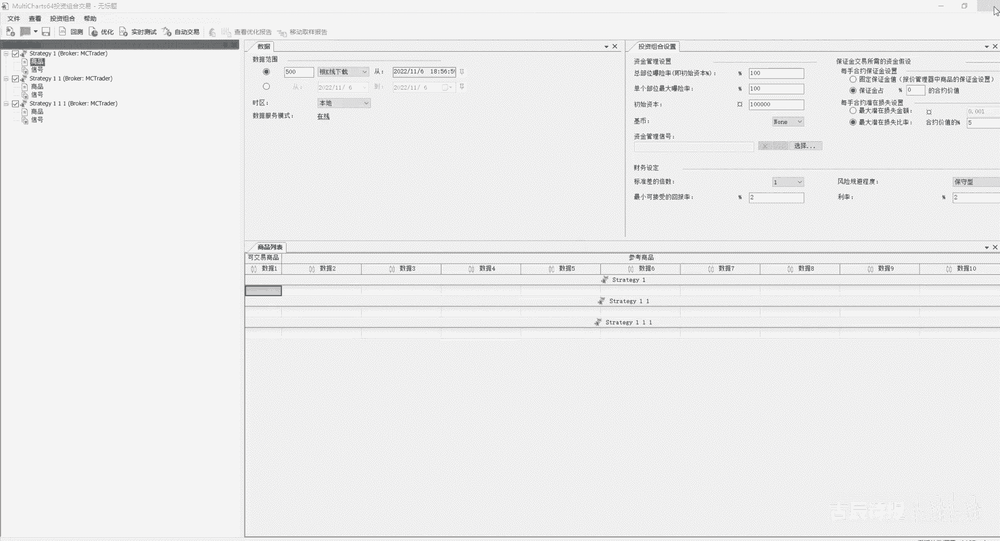

我就不保存它了，好第一节课的介绍呢基本上就是这么多，最主要会用到的呢就是这个交易总管，如果说你需要去用它进行交易的话，超闪可能也会用到，然后这个图表这是最常见的这个使用的啊，报价管理器。

当你数据出现一些问题的时候，需要用到报价管理器，公式编辑器是咱们写代码的地方，投资投资组合交易是咱们在回撤多策略，多合约的时候，进行回测以及挂石盘的时候会用上它呃。

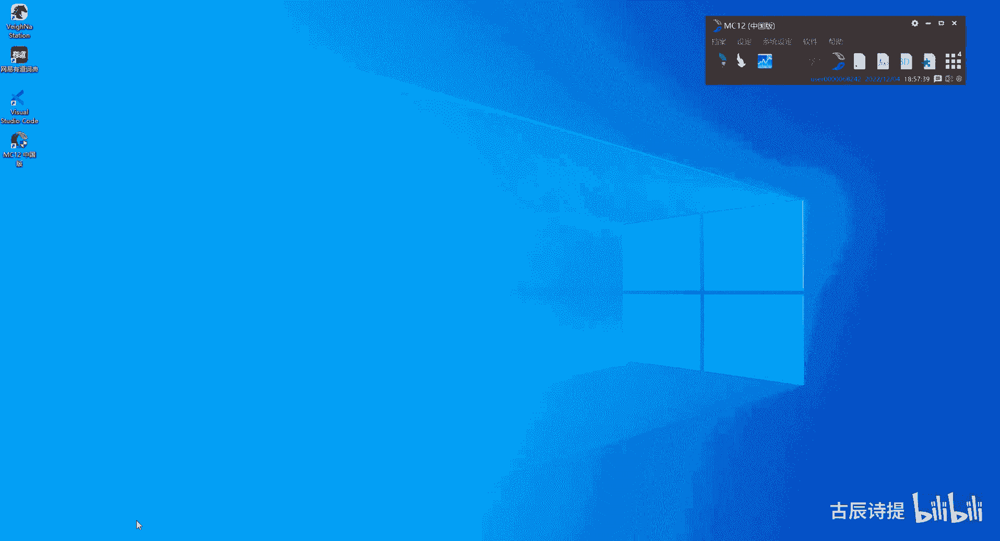