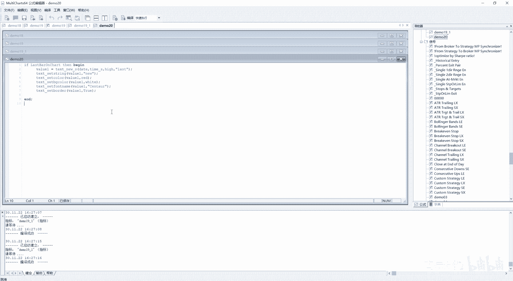
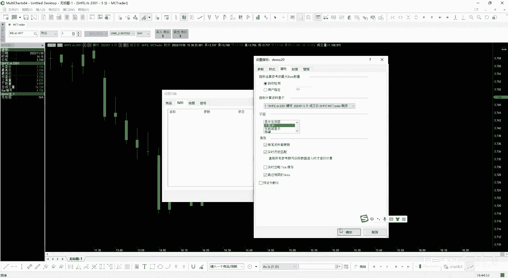
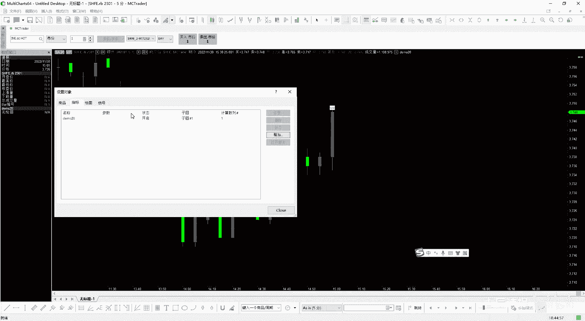
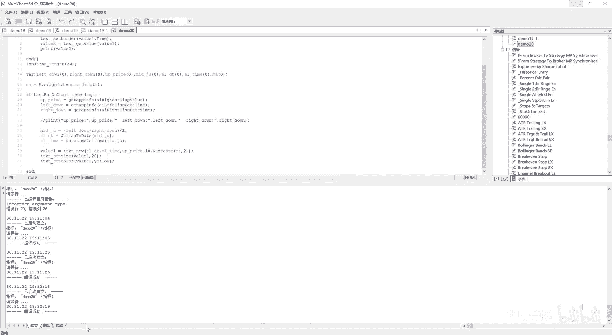
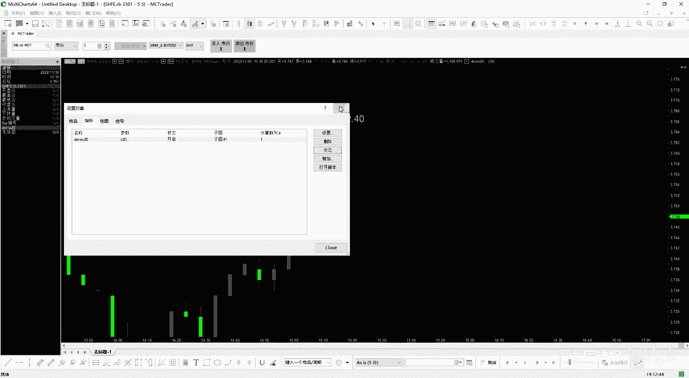
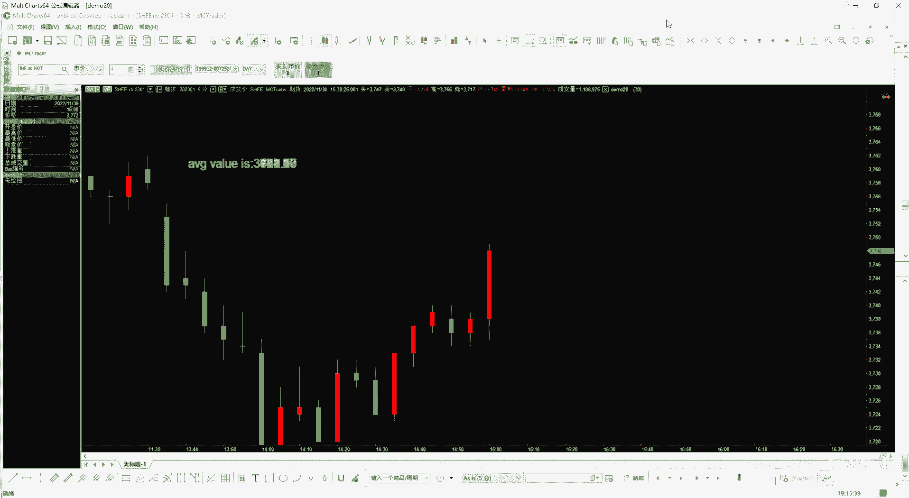
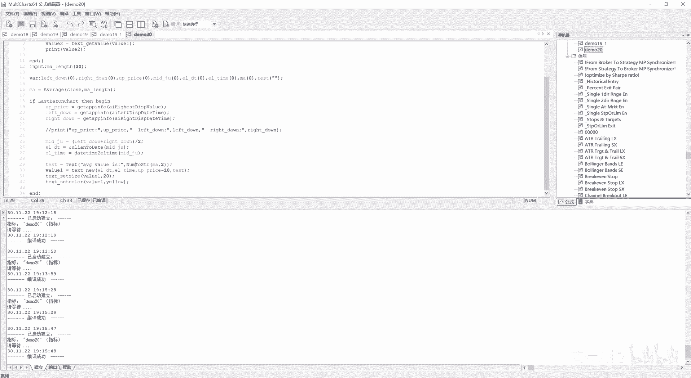
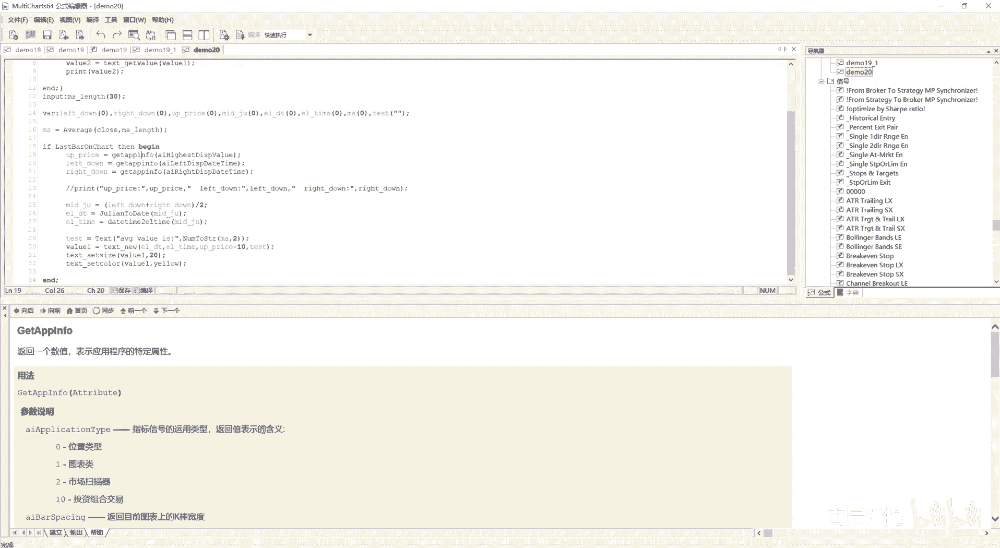

# 第20节课 绘图6 文字2 - P1 - 古辰诗提 - BV15U4reiE6W

欢迎大家来到从零开始量化系列课程，MC课程的第20节课，上一节课咱们讲到了这个set point，point只是字体的意思，以后学了Python，尤其是学了这个界面，因为界面它就会涉及到字体嘛。

嗯这point会用的特别的多啊，下一个是set size，就是设置指定编号文本的字体大小不，这个不是字形大小啊，应该是字体大小，啊同样的返回零是设置成功，返回二是无效的，这个还是一样的。

后边先放这个就是你这个test这个id，然后再放你这个fn size，然后这个fn size呢就是一般你不要设的太大啊，不要设的太大，然后后边是text set style一样的。

就是设计设置这个文本的就是K线，就是和K线的对齐方式呃，有这个左侧对齐，右侧对齐，还有中央对齐的啊，这个，它有一个横向，一个纵向，H1般是代表横向的啊，你个你就记住H是横向的，V是纵向的。

你就记住横就是H开头的啊，这个在以后你如果学Python的话呃，你也会知道这个一般这个用用的也会比较多啊，就是在这个这个布局上就是会用到，这个也不讲了，这个对齐其实五官没有什么太大的作用。

然后text set board border，它是边框的意思，边框的意思，然后你这个边框就是你增不增加边框，这个可以给大家看一下，就是咱们这个20节课了，新建一个。

嗯就是在这个text seat board b o r啊，border是吧，然后后边这个是value1value1，然后true就是设置的是有这个边框。

然后进行一下编译啊，编译没问题，然后设置绘图，然后先把它删掉，然后指标啊先把这个两个删掉，然后再增加一个指标20，然后当前画面和本和商品相同，字图一点击确定。

你会发现它就有边框了，而且边框是红色的。

嗯当然你也可以直接从他这儿设，就是设置文本，然后这就是呃，包括刚才说的这个对齐都是可以的，呃这个加框啊，透明下划线删除线都可以啊，好这是边框，然后这个sit attribute。

就是加外框加粗斜体删除线，下划线就是设置属性嘛，attribute就是ATTR就是属性的意思，就是你可以加粗斜体加外框加删除线，加下划线，删除线是指这个中间的那个线啊。

就是比如说我这个是text TES t文本加上路线，是这样的啊，是这样的一个形式啊，这个就不说了啊，get active跟那个是一样的，就是最新的文本id号嗯，就跟那个最新的这个趋势线是一个意思。

同样的这也有get first和get next啊，也是一样的，意思也是一样的意思啊，这就不多说了，get date获取这个日期吗，然后就get time。

get time s和get time dt前面就是T2的时候，应该也是有DT的，但是当时没讲，就是DT嗯，就是咱们之前如果学的这个时间那块，你学的比较通透的话，DT一般是表示的这个掳掠日啊。

就是掳掠日，DT就是咱们可以看一下get呃这个test time d t，第一咱们看一下，就是，啊不是掳掠日啊，对对对，就是掳掠日就是日期时间为掳掠日格式的，从1900年开始，他是掳掠日的。

就是获取掳掠日的这个时间啊，日日期和时间就是小数是时间嘛，然后整数是日期啊，这个就就不多说了，然后test get value，就是获取指定文本编号所对应文字的垂直价格，他这个你说你获取的这个垂直价格。

它是什么价格呀，咱们可以看一下啊，就是get value，test get value好，Text get to value value1，然后这个呃后边就没有参数了，然后获取到的值呢。

咱们复制到value2等于，然后print一个value2，然后进行一下编译，我把这这段画一下啊，咱们可以看一下输出，清除一下，然后再进行编译一下，3749，咱们可以看一下它的。

看左边它的这个开盘价3738，然后收盘价是3748，最高价是3749啊，这是它的最高价是3749，因为咱们在这设的就是high，对不对，如果说我把它设成close，咱们看一下啊，进行一下编译。

有发现它是3748啊，37483748，它的收盘价是3748，所以说你设置的你从这设置的它是什么值，它获取的这个get value它就是什么值啊，如果说你是low的话，就是如改成L。

这个L也是表示low啊，大写也好，小写也好，就是它都是表示low啊，你看它是3735，3735对应着的就是这个最低价呃，哎这啊这是3735，所以说你设置的什么值，它就会返回是什么值好吧。

这是get value，然后test get string，就是获取它的这个呃，就是你的文字内容跟前面那个set us，卷子是对应着的是吧，然后get color是获取颜色。

同样的你要就是呃就是把这个传统色的色码赋，就是给它赋值的话，就是呃，或者说你获取到这个传统色的这个色码的话，你也需要把这个就是这个什么给他传过去啊，把这个legency color value。

然后等于true给它打开啊，好这个就不多说了啊，这个是get bg car b g咱们一直在说是background，就是获取background car了。

然后test get for t front name，就是获取这个字体的名字，这个也不多说了，get size就是指定文本编号的字形大小就是获取嘛，然后get h style，这是什么呀。

获取指定文本编号的水平H你就记住这横，然后它的水平对齐方式啊，一是右侧对齐，二是中央对齐，零是左侧对齐啊，然后get v style v是H是横V就是竖是吧，就是它的垂直对齐的对齐方式。

然后这个get border，就是返回他的这个有没有这个边框，它是返回一个布尔值或者叫一个逻辑值，就是返回true或者false是吧，然后get attribute就是返回一个呃逻辑值。

就是其实咱们之前设置的，就是说这个SATTRIBUTE的时候，它对应着有好几个，那它对应的同样的，前面第一个这个它的这个参数，就是这个你的这个test i d，然后后边这个就是你对应着的它有没有外框啊。

有没有加粗啊，有没有斜体啊，有没有删除啊，就是它返回的还是一个布尔值啊，它这儿写的是逻辑值，就是和布尔值是一样的，到这儿呢其实这个text就说的差不多了，说的差不多，但是呢从这需要给大家引入一个什么啊。

需要给大家引入一下，我用大括号把它给括上来，就是咱们之前给大家讲过，就是你在用文本的时候，其实是可以在这去，就是写你想需要写的内容的，对不对，然后把字体设的很大，这样的话你能够随时看到啊。

你可以随时看到，那这个如何去写呢，其实你学了这么多NEIN，你也应该知道了，无非就是什么呀，我获取当前价格啊，不是我获取当前这个你想写的位置，你如果说写想写到正中间的话，你是不是应该获取这个啊屏幕的。

它的这个一个中间线是对吧，然后对应的时间和日期，然后呃你如果说想获取这个上面的话，就是就是横轴，你有获取的方式就是获取这个屏幕的图表的，对不对，然后你这个纵轴你要往上靠的话，你是不是应该获取最上面。

然后进行一个加减呀，或者什么减一点对吧，减一点这个它的这个大小什么的，对不对，这个时候呢，你就其实你是需要这个图形界面的一些，基本信息的，那这些东西从哪获取呢，给大家引入一个就是它的叫呃。

Get it app info，这个是什么意思呢，我把它粘，就是就是粘过来一下，这个会比较多，Get a p p info，从这儿啊这边插入哎，你如果说想从这你就说往下拉一行的话，就是按住CTRL。

然后那个回车就可以了啊，这插入这个代码块，就是用这个诶，怎么就复制了一个这个呀，用这个什么会稍微有些尴尬，就是因为就是用咱们这个就是编译器啊，复制一下，复制过来就用这个TAPA。

就是用这个easy language会有些尴尬，为什么呢，因为这其实是可以就是标明，这就是这是这个语言的，但是这里边没有easy lemity，所以说它这个色彩就少一些。

如果说你强硬的把它写成C加加的话，呃它显示的倒是有几个，就是可能会显示的这个蓝色，但是咱们这个语言它又不是纯粹的呃，也不是C加加语言嘛，所以说它这个颜色显示的就相对少一点。

好这个get a p p info，咱们先看一下啊，返回一个数值，表示这个应用程序的特定属性属性啊，其实就是比如长宽高啊，长宽高是吧，它的这个大小以及它的这个背景色什么的。

这个后边呢叫attribute，就是后面这个参数attribute，然后参数说明就是指就是指标信号的运用类型，返回值表示的含义就是零，就是位置类型一图表类型，二是让扫描器啊，十是投资组合。

咱们一般是在这个图表里边去用对吧，在图表里边去用啊，然后AI bus spensing，SPENSING一般是这个空格的意思哈，它是什么意思，就是返回呃，目前图表上K棒的宽度AI就是calculate。

就是CACL一般是表示计算的嘛，然后就是这个reason，就是返回重新计算的原因呃，就是get info返回初始化计算的原因，其实你从这可能比较难以理解啊，它是什么意思呢，就比如说咱们在学指标的时候。

你会知道你如果不设，就是让这个参考吧，他自己去检测的话，它会就是重新计算嘛，就是重新去计算，那这个计算原因就是参考罢不足，它需要重新去计算啊，这个就是返回就是初始化计算的原因。

它会重新从头开始来进行计算，后边呢如果说你学了越来越深入了，其实后边还有就是说包括鼠标点击，也可以从代码上去输出一些内容的，就是比如说咱们一般输出都是，咱们从这写这个print，然后它一点一点的去便利。

这个就是咱们图表上的这个一根K线，然后输出咱们想需要的东西，其实你也可以从这个里边写上，就是这个把这个点击打开，然后它就会你点击图表上的一个嗯划线，它就会运行一遍，这个代码也是可以的。

但是我用的不是特别多啊，当然这些咱们都不用去关注的，咱咱们要关注的是后边这个是什么呢，这个返回目前图表价格刻度的最大值，然后返回目前图表架度价格刻度的最小值，诶，有了这个俩，你就会发现。

就是我是不是就能找到它的刻度的最大值了，还有刻度的最小值了，如果说你想显示在中间的话，那是不是就可以就是加上除以二，如果说你想显示在1/3的位置，是不是就可以了，对不对。

你想咱们要给大家讲的就是这两个比较重要的，就是返回图表刻度轴的最大值，返回目前图表价格刻度的最小值啊，这是价格刻度啊，然后下面还有俩，你会发现返回目前图表时间刻度的最左方，K棒的掳掠日。

然后这个是返回目前图表时间刻度，最右方K棒的这个鲁瑞日，有这个四个，咱们是不是就可以去在图表上，就是想在任何位置啊，就是咱们想画什么，咱们是不是就可以画什么，当然下面还有什么呀。

就是呃返回目前图表设定右边空白边界宽度，就是右边就是这边空白的这个宽度，当然你在实盘的时候，你随着行情的发展，它会一点一点的就是往这挪嘛，当然他可能也会整个的这样挪啊，所以说咱们一般都会显示在。

比如说就是这样显示，然后把这个咱们需要显示的位置放在上面是吧，这样是对于咱们来说是最合理的，所以说你要的其实最主要就是这个刻度，然后和最上面的刻度，最上面的刻度你可以减一部分，比如减个50啊。

或者减个100哦，这个得根据你的这个呃标度啊，就是说可以根据你的这个右标的这个刻度，价格刻度来设定，所以说你从这你就可以，在这个图表上画出你想画的内容啊，这叫get app info info呢。

它是这个information app，其实就是这个app嘛，咱们用啊，咱们用的这个app是吧啊，所以说这咱们可以给大家进行一下演示好，咱们把这个先给删掉，咱们先VA2，就是你的这个横轴和这个纵轴。

咱们要计算出这两个值，所以说咱们先定义一个left l e f t left，就是这个left down吧，DOWN就是左下就这边的这个刻度啊，或或者你就是起个别的名字就可以啊，这个我设置为零是吧。

然后write down，然后我设置为零，然后你还可以设置什么呢，就是它的这个最上面的这个刻度，就是这个咱们就up吧，Up price，是吧，然后咱们用这个get a p p info好，后边这个参数。

你要的这个参数，咱们可以就是价格刻度的最大值，就这个嘛，I hased disp value，其实它这个就是AI就是你的这个界面嘛，high est就是最高的啊，就是DISS就是display。

就是显示的value就是值嘛是吧，然后我给它放到这个里边来，我用个value值过来接一下啊，就是咱们用这个变量来接一下，就是用UPRICE等于好。

下面就是left down l e t left down等于g a BP info，这个就是获取最左边你时间刻度的也是AI left，这个display daytime，但是你记住啊，他是掳掠日啊。

他是掳掠日，然后write，write down等于g app info，应该是AI什么呀，应该是right吧，I h t right，然后DISS啊，这个date，time吧，应该是这个吧是吧。

咱们看看对不对啊，应该是write diss是吧，就是这个，但是我好像是拼的不对啊，还是怎么的，Ai write，第四应该是少了个P是吧，这样就对了，好，咱们可以输出一下，看看对不对。

就是up price，Price，然后这个left，price啊，Left down，这个我应该是从这空两格这样看的清楚一点，然后这个是left down，同样的空两个应该是write down。

right的是吧，你从这你写的时候啊，你最好不要就是说把它挨个的去进行一个输出，咱们就用，就是在就是最后一根K线的时候就可以是吧，if last but on chart then哎begin。

然后从这儿添一个end，把整个的向右tap一下，这样进行的编译，咱们看一下这个值是不是对，up price就是3785。92，看一下啊，是是不是3785。92是吧，3785。92啊，3785。92。

这是它的UPRISE，然后left是这个，当然这是掳掠日的啊，这个咱们可能就分不清了啊，这个咱们就可能分不清了，那获取它怎么来用，那说明这没问题是吧，获取的怎么来用，咱们要获取中间的位置啊。

中间的位置中间的位置我就mid呃JULY吧，Mid july，然后零，然后中间的位置是什么呀，应该是mid july，等于这两个相加嘛，就是left down加上right down，然后除以二是吧。

就是mid july进行编译啊，这是没有问题的，就是你的纸放在中间，就整个图表的这个中间，但是你这个是JULY呀，我需要把它转换成我的这个EL，这个EL这个DT是吧，E l d t。

所以说你就需要把它转化为这个EL，这个DT就是转换成这个时间嘛，转换成时间，就是你要给它转换成这个真正的就是date time，因为你到时候画图的时候，你得用到这个date呀和time啊。

因为text就是text new里边需要你这个data和time，对不对，所以说你需要进行一下转化转化，这个是咱们之前学过的内容啊，这个咱们就要把它分开，ear date和year time啊。

year time e r time好，也给他写一个类，year date是多少啊，year date应该是等于这个有有个什么july to date，是不是咱们看一下july to date是什么。

将指定的rage转换为E2日期，返回就是返回入列日期吧，返回入列日期啊，就是把不是就是返回，就是说就是这个咱们这个EL就是这个日期，你像他这个都是返回的这个日期嘛是吧。

所以说你直接用这个july to date，然后把这个mid july给它放进去，然后e l time应该是等于什么呀，是不是有一个date time to tap是吧，这个是干嘛的。

就是将指定入列日格式日期呃的时间，转换为对应的e l time的这个时间，你后边可以放这个就是整个给它放进去，它其实只转换小数点这一部分对吧，这是之前学过的啊，mid出来对不对，然后进行一下编译。

ELDT应该是啊，这个没有定义对好，这样就可以了吧，它的横轴就有了，那纵轴呢纵轴咱们就直接用这个UPRICE，你减去个100啊，或者说你减去个100跳啊都可以啊，这个就看你了。

然后这个时候我就可以写这个，他的这个就是你想写的内容了吗，就是text new啊，Text new，然后这个里边然后8date8date我用什么呀，就是用这个ELDT啊。

然后呃8time咱们就用e er time，然后price咱们就用这个up price，减去比如说减去50啊，减50，然后test就是你需要输出的内容，就是你需要显示的内容，那我显示内容。

比如说我写一个这个呃均线啊，就这写一个ma吧，美令我这儿再写一个input input，比如说我这个ma gt length，这写30用30根吧，好然后我这个ma等于average，Average。

这里边形容上这个clothes，这个是m a n g t h length啊，然后我就把它这个ma给它给输出出来是吧，MA给它给输出出来，这样是不是就可以了是吧啊，你看这有问题啊。

就是说你这个ma是数字，你必须得是一个text是吧，text这个数字转字符串怎么转，咱们以前说过这个text，你看这个东西它是可以转的吧，就是把你里边的内容，你像这个date它其实也是数值是吧。

你用这个text可以进行转，但是有一个更简单的就是什么呀，就是这个number two s t r，是不是这个还能就是直接给你，就是后边第一个参数是你需要转的数值，第二个参数就是你需要保留的小数位啊。

这个也是之前学过的，这咱们可以给它写上number two strain，然后这个里边第一个参数是，你需要就是往里写的，就是说这个MA然后后边是小数位数，比如说我保留两位小数，好建立就是编译成功了吧。

好咱们在图上看一下，它会显示到这啊，是不是不是减了有减的有点多了是吧，它减的这个值有点多了，我减去减去个十就可以了吧，减去一个10-10吧，好再进行下编译好，它又显示到这了，那这个字写的比较小怎么办啊。

字显示的比较小怎么办，那我就设置一下嘛，把这个用一个Y61接一下，Y61等于，然后这个text sit这个size，那size z诶，那sii z e say size，这个里边是设置你的大小。

然后这个写成value1，然后后边的size，比如说我写成一个20啊，然后text set it color，我我把它的颜色value1，然后显示什么EROE5W，这样显得就是说更突出一些。

是不是就这样就会显得很清楚啊，而且它会随着你往这边走，因为你往这边走的时候，你实盘的时候，你这K线往这走的时候，你这个整个的这个画面会跟着往这边走，它刷新的时候，它并不会说一直停留在这，又一直停留在这。

你你像如果说我拉到这来，然后我把这个设置指标，我状态诶，我再打开。

你会发现它又到中间来了，它会随着刷新，它会不断的去移动，所以说这样就会很方便对吧，如果可能有些老板们会说，你光显示这个字，他是吧不太方便，那你可以用什么呀，就是说用test呀，比如说我这要显示的内容。

比如说这个啊text，然后这个里边用上这个字符串啊来表示，然后我这个text TES t等于什么呢，Text，然后这个里边你看这个text是怎么用的，就是你去转换嘛对吧，你去转换嘛，这个里边不能写中文。

但是英这个英文还是可以写的，ma is是吧，或者说AVG均线的value is，然后来个冒号，然后后边你再添个什么呀，就是说这个呃number two strength。

N u m n u m number two string，然后把这个ma然后这个二然后放进去，这样不就可以了吗，然后把这个test放到这后边来啊，TEST放到后边来，然后我再进行一下编译。

建立没有问题吧，这个时候咱们再来显示，你看average value is，所以说你可以把你所有的参数啊，把你所有的参数都全部就是就是写到这，这样的话你会看的很清晰，随着这个它的价格的跳动。

你这会特别的清楚，包括这个均线距离，你的这个当前这个值的这个差值，都可以从这显示，这样会很清晰，对不对啊，这个其实我个人认为是你这个在用text，你可以灵活多变，你要配合这个什么呀。

叫get app info，info其实是代表了information，就是它的一个信息内容，然后你获取你当前画面的这些信息内容，当然它还有很多其他的东西啊，在这就不介绍了。

希望大家把这个代码呢好好敲一敲，一定要记住，这里边要跟着这个删除去用，因为我这个始终是if last by unchat，当然这么用也可以，因为你始终你跟着行情走，你正在动的肯定是最后一根K线是吧。

它会刷新，这样也可以，但是呢如果说你想去有别的需求的话，你一定要用delete，不然他全是画的，这些就是在上面会有很多会不断的重叠，会不断的重叠，会重叠的特别多，好吧，就像如果说给大家做个演示啊。

我把这个，我把这个给去除掉之后，我再进行下编译，编译肯定是没有问题。

但是你看全部给重叠上了，它其实里边有很多的这个，一层一层的往上都给叠上了，你后边就看不清了，所以说你一定要记住。

就是说呃会把它显示出来，其实并不难，但是你一定要记住，要把它删了，会删啊，才是一一个完整的这么一个过程。

完整的一个就这么一个不呃，不管你怎么拉，只要是你这个界面有更新的时候，有更新的时候，你再重新设置指标。

就是状态关一下，再开一下，它都会显示在中间，这就说明当你有更新的时候，你随时随地，因为这个指标它可以随时更新嘛，就是你tick来了之后，他会立马就更新，他立马就更新之后，它会不断的去给你同时刷新。

所以说你不要担心啊，你随着这个界面的移动，它就没了，虽然因为现在不是开盘的时间，他这个tick不更新，所以说他不主动更新，我才手动的去更新它，但是真正的有tick之后，它会进行自主更新的好吧。

它会进行自主更新的，这一点一定要放心啊，大家有兴趣的话可以多去尝试，你像这样的代码写出来，你才能够把这个MC它的这个作用发挥到最高，其实并不说我写个策略啊，然后就万事大吉了。

你要把一个这个三方平台研究的很明白的话，其实里边有很多很多东西需要你琢磨的，虽然我说的简单，但是我也是去反复研究，琢磨了很长时间，看了很多东西的呃，如果一开始这有些听不懂的话，也没关系。

你慢慢的去照着去写，就知道是怎么回事了，你慢慢的你去看这个他的这个注解，你也知道它大概是个什么意思了，好吧。

