# 第20节课 CtaBackEngine回测结果实现(1) - P1 - 古辰诗提 - BV1mm411m77L

欢迎大家来到从零开始量化系列课程，VPY课程的第20节课，上一节课咱们已经把这个回测的最主要部分，就是那个撮合那块已经写完了，那这个时候咱们就应该进行测试了，是不是进行测试了，测试呢应该怎么去写呢。

我把的这个上上一期的内容都全粘过来了，而且我在这添了一个pd啊，还有这个columns，就是我需要把我的成交全部就是保存下来，然后以这种可见形式给大家看一下，然后再结合维纳的回测，然后进行一个对比。

如果说完全一模一样，肯定就没有什么问题是吧，如果有问题，咱们就去进行查找，那这一步怎么做呢，就是在这回测完了之后，咱们是不是应该去获取到那个咱们那个点trade，我向右拆分一下啊。

在这儿就是把这个trans啊，就是它是保存在这的嘛，我全给它获取出来啊，这个就是trans啊，它是一个dict是吧，dict里边是STR类型和这个trade data类型啊。

你就应该等于这个back点锤子吧，是不是，那我再去把它怎么去保存下来，这儿啊，我是通过这个pandas，它有一个二维表，就是那个DBM，然后可以直接去保存成这个CSV格式，那咱们就直接去写了，怎么写啊。

按照逻辑来啊，怎么写，我应该去便利这个tread吧，是不是for tread in list，咱们一般情况下在便利的时候，最好是前面都加个list，防止如果说你后边需要对它的这个，字典的大小做更改。

这个是上节课咱们提过的是吧，然后values values一定要加上括号好，怎么去改呢，呃就是咱们就再遍历一下for key哈，咱们要找到这些元素，就是放在了这儿的这columns里边。

因为咱们最后是需要这些数据，是不是for key in啊，For key in lums，然后呢去这个trade里面去获取，获取用什么呀，get AD t r吧，然后对象是triad吧。

TRADETRADE啊，对象是这个try的吧，T r a d e t r a d e，那TD是个try的，然后呢获取什么，这个name就是这个key吧，如果说获取不到，他后面还有个default。

default呢，咱们就给它写成零吧，是不是，那这个value是不是就有了它的这个value值，是不是就有了，是不是，但这个value值你要注意一下啊，咱们这个try data里边。

它这个里边不仅仅你像string，是可以直接获取出来的，你像这个exchange它返回的肯定是一个类对象，而且是一个枚举类型，所以说咱们得获取到这个间接里边这个值是吧，它是呃哪个交易所是SHE啊。

还是CFFEX啊，所以说这呢你去获取的时候，枚举类型就是exchange点点value是不是就能获取了，所以说你得进行一下判定1t in啊，这个里边exchange是需要做就是点value这工作的是吧。

包括这个direction还有什么呀，还有这个offset是不是如果是在这个里边的话，我value是不是得重新进行一下赋值，就是这个点value点value value点value啊，能理解这个意思吧。

就是value点value啊，然后呢value点value有了之后呢，咱们是不是应该给它放到这一个字典里边去，所以说在这呢我要给他一个字典，DIC在这个点ACT啊，等于一个空空的字典，空的字典。

那这呢就是就是啊DC这个key等于这个value了，对不对啊，key等于value了，然后这个获取完了之后呢，咱们就把它保存在咱们的DF2维表里边，那DF2维表里边咱们肯定得去创建，是不是得去创建。

那就是说这个DF啊等于pd点data from，然后只要给他把这个column，就是这个呃列的这个名称啊，给他写一下，它是一个列表的格式放进去就可以了，然后从这就是DF点啊。

这个lock lock不要用i lock啊，得用lock l这个DF其实就是这是行的索引啊，就是点lock，这是行的索引，这是数值嘛，然后就等于这个dict它是能直接进行转换的。

然后最后呢我给它保存在DFD4啊，这个to csv啊，然后给它起个名字叫trade data啊，点CSV呃，咱们用一下encoding，encoding呢优先杠把我试了一下呃。

你用excel去打开它会是乱码，所以说咱们这就用GPKGBK出来的，它不会是乱码啊，不会是乱码，当然你用这个这个来打开，就是UTF杠八，你用这个来打开的话，它是没有问题的。

但是没有那个excel看的清楚啊，这个时候呢咱们去运行一下，去运行一下，看看有没有问题嗯，运行的时候你会发现，这没有跟维纳斯的那种提示是吧，一会儿咱们给填上，其实大部分时间都花费在了什么呀。

数据获取上面啊，就是从数据库里边来导入数据，好咱们看看它他这个数据啊啊从这就看不了了，因为这是UCF杠八的啊，当然你也可以把它这个就是改一下，我就不改了，我就直接在这啊。

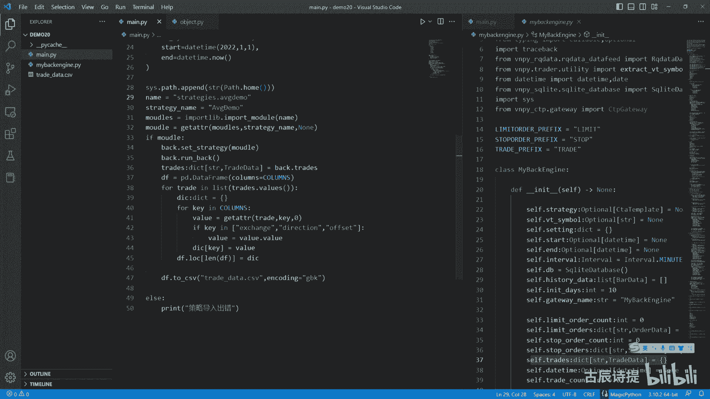

在20里边用这个try data来进行一下打开啊，来静压打开是吧，这个就变成多和开屏了，不然的话它是一个什么，就是offset点lg或者direction点这个long on。

offset点close open啊，这个就不太那个是吧，呃不是很直观，这一看啊是有问题的是吧，怎么可能多开，然后拼拼拼拼拼，然后volume是1124啊，一直到特别大，一看就是个累计的是吧。

所以说这是有问题的，有问题呢，我上一节课写完之后没有立即回回测。

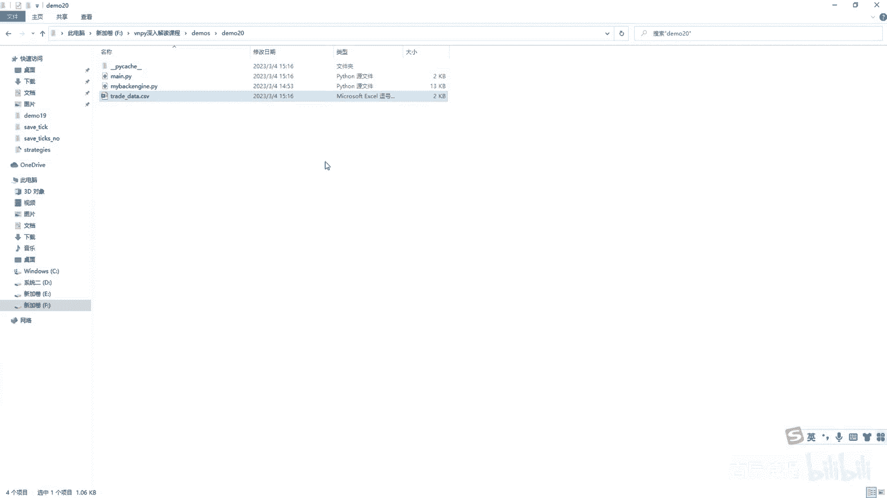

我也是怕有问题啊，因为毕竟是手写代码，出错是难免的，后来我也找了好长时间，因为这个错特别不明显，所以说在写代码的时候，其实一个人还是比较枯燥的，问题出在哪，就出在这儿，就他是个布尔值。

但是呢你这是个逗号，你逗号呢它会就给你返回一个元组是吧，就会返回一个元组，你返回一个元组之后呢，就是它都会默认是多单成交了，因为你在这判定的时候，就是if lenco，不论close它。

元组里边虽然存放的是force和true，但是呢他就认为你里边不是空的，就变成了true，然后不会往上呃，不断往上的去叠加啊，所以说问题就出在这个逗号这儿啊，也是找了好长时间嗯。

就是一个不经意间的这个就这么一个错误，就会很麻烦啊，很麻烦，这个时候我把这删了啊，咱们再进行一次啊生成，那这个时候呢咱们可以添加上那个什么呢，就是跟维纳式的，它有那种井号是吧，就是百分之多少。

百分之多少，那个井号从哪添加呢，肯定是从这个run back，这run back在哪呢啊，run back哈，就是这肯定是从这来进行这个添加，就是回测啊，这来进行添加，怎么添加呢，其实很简单是吧。

我只需要就是说呃10%，20%这样的我也不单独设置建成了，这样会很麻烦是吧，就是我就是他走了10%，我就输出一个，走了10%我就输出一个啊，这个是最简单的，主要是在我在使用的时候，我知道他在跑就可以了。

对不对好，那怎么来写呢，就是很简单啊，就是说首先我肯定得有个偷偷tot total number是吧，total number等于四啊，l cf点history data。

然后它是从这个ISKIX开始的是吧，咱们一样从X开始啊，然后呢我肯定得有个计数器count count，它是int类型的啊，先等于零啊，先等于零，然后每一次走一根K线呢，我就count啊，加等于一是吧。

每次走一个K线，我都count加等于我跟谁来对比呢，我肯定是跟这个total count来对比，是不是，所以说用count啊除以这个偷偷number，它除出来肯定是一个小于一的小数吧。

是不是我给它整体的乘以一个十啊，如果说乘以个十，它有可能还是零点几，还一点几什么的，我再给它取个整，是不是就变成整数了，是不是啊，就变成整整数了，我给它赋值到哪哪上面呢。

就是process pro CES s r process process呢它也是个整数是吧，它也是等于零的啊，先是等于零的好，我给它复制到process上面啊。

process等于这个process等于它，那呢就是我肯定得有个对比吧，我什么时候进行输出，所以说我需要一个last process啊，last process或者process last啊。

它也是一个整数，也先等于零啊，我在这最后给它复制一个啊，process last等于process哎，这样是不是它就可以进行，就是如果说从一变成二了，其实就是从10%变成20%了，是不是他这就会有变化。

对不对，有变化之后呢，我进行一下判定啊，if process它不等于process last，如果它不等于这个last的话，就是从一变成二了，或者从零变成一了。

我这个时候我就点C点right log就写上，写上什么呢，咱们要那个进度条是吧，进度条就是这个井号，然后咱们可以乘以啊。

一个process process可以用井号乘以一个process乘以一个process，就是如果说你process是一了，它就输出一个是十了，他就输入十个，然后呢你后边是不是还得加上一个。

就是说就是百分之多少是吧，我就是百分之啊，比如说就是process p CES，然后后面加一个零是吧，因为它只是乘以零了嘛，是不是啊，就是不是就是这个process0是吧，然后我这加一个F。

从这儿呢你要注意一下，这个red log里边呢接收的是两个参数，虽然后一个参数是浪值了，你如果用逗号给它切分开的话，它容易把这个后边这个给放到strange，这个里面了，所以说呢你不能用逗号，要用加号。

就是把它变为一个整体，变为一个参数，是不是就可以了对吧，这个逻辑很简单吧，是不是你只需要一个有那种井号输出的那种呃，显示就可以了，是不是好，那咱们再进行一下运行好运行一下，有了吧。

十二十三十五十六十七式，当然不太好看不太好看，你可以给他加一个空格是吧，加俩空格是不是就可以了啊，那咱们看这个trade trade data。

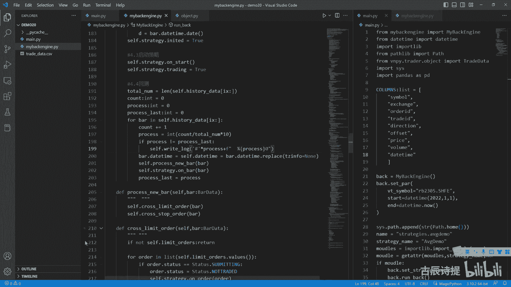

好这个trader data呢，我把这个我在之前测的时候上一节课，不知道大家还有没有记得啊，就是这个stop单它也会转成limit单是吧，然后呢就是说呃应该添加的是limit，但是我当时为了检查的时候。

我又把它改成stop了，你想它是一三少了一个limit2是吧，其实这个limit2应该是这个stop1转成了limit2，然后咱们先看看这个数量啊，是56是吧，56+0应该是57吧。

好那咱们再用维纳来进行下回测，因为他们策略用的是一样的，只不过这个engine呢用的是这个，一个是自己写的，一个是维纳本身带的里边数据，都是从数据库里面出来的，所以说如果说是一样的话。

那就是应该是就是说这个呃，撮合的那那部分代码应该是没有问题的啊，就是成交这块是没有问题的，就是我这个已经给加载好了，因为它启动比较慢，咱们看一下成交记录，成交记录你会发现它编号。

这个成交号是从一开始的是吧，他最后是到57吧啊是到57。

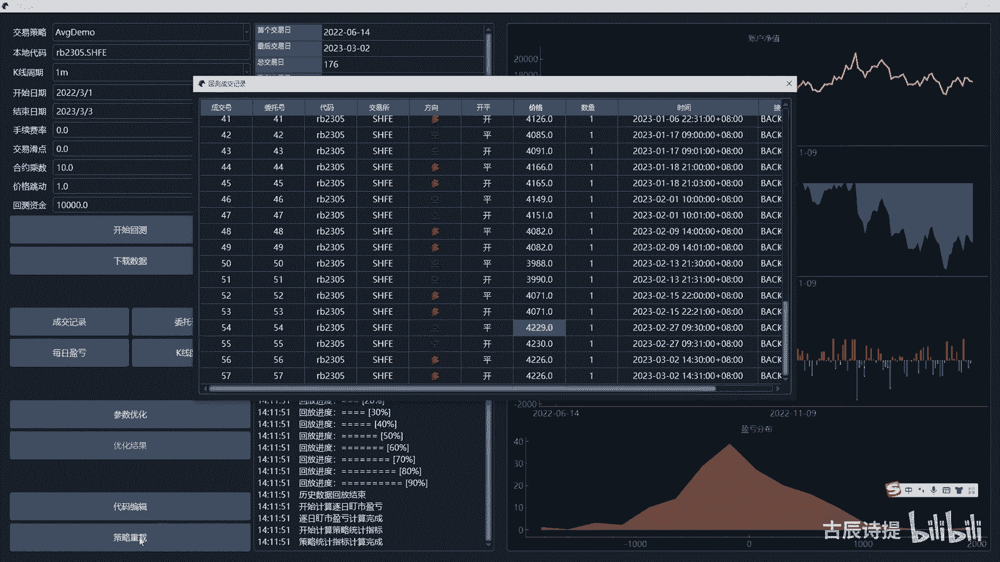

然后咱们这个呢从零开始到56没有问题吧。

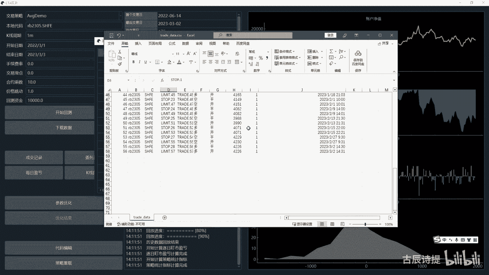

咱们可以看一下他最后一笔交易啊，最后一笔交易426是426吧是吧，然后时间是3月2号14：31分啊，3月2号14：31分呃，呃那就应该是没有什么问题了，是不是第一笔是14：30啊，14：30。

然后第二笔是九点是吧，九点6月24号，7月4号，6月24号，7月4号，从这儿呢就说明你的撮合和尾那就一样了，其实并没有那么复杂，最关键的是你要把这个思路给捋清楚了啊，在这呢需要跟大家说一下的是什么呢。

你仔细观察这个成交啊，不管是看他的啊。

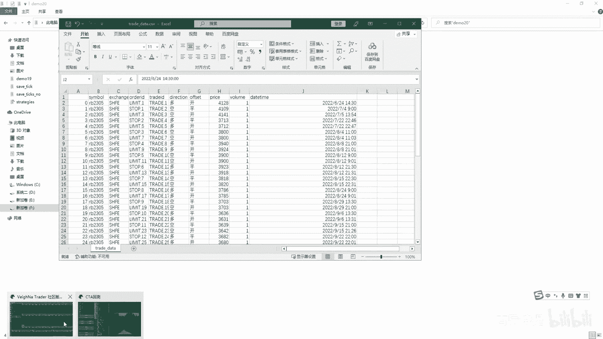

还是看自己写的这个他的这个成交记录啊，你会发现啊，你会发现一个什么问题呢，就是它成交有很多看啊，就是在这多平是吧，先平仓是七月22号22。46分，然后多开就变成47分，是不是这个呢，咱们先不看啊。

从这多评九点多开9。01分，你看啊，这也是是吧，空瓶九点空开9。01分，你从咱们那个写的那个template，那个就是a v g template那个策略里面来说啊，按照逻辑上来说。

就是他会一直持有仓位是吧，要么持有多单，要么持有空单，切换的时候是立即立刻给切换的，就是空单平了多单就开进去了，但是这会差一分钟，但是实际上在跑的过程中，如果实盘的话，它应该是什么呀，在一根K线里边。

如果说价格满足条件的话，它就应该是拼完之后立马就开了是吧，但是为什么这是九点和9。01呢，你捋一下这个逻辑啊，在满足了就是这个K线合成了这根K线，合成完了，比如说是在就是说他这个之前啊，就是最后一根。

比如说是14：59分这根K线，因为它是前置的嘛，它代表的是14。59分，到15：00分是吧，这根K线来了之后满足条件了啊，就是它合成了那个30分钟K线，30分钟K线呢满足条件了，满足条件之后呢。

下一根K线也就是09：00分的这根K线，是不是应该先平仓是吧，然后再开仓，但是在回测里边啊，你想想他是这发送委托吧，对不对，委托发送出呃，在这个合成之后发送了委托，委托发送在9。00分。

这根K线是不是去撮合撮合没有问题，成交了，成交了他才会去回调那个on triad，是不是on triad，等到他再去发送一个委托，是在09：00分发的，是不是他必然会在09：01分去进行撮合，等待成交。

是不是，所以说这就造成了啊，他在09：00分平仓，然后09：01分它才成交，所以说就有这样的差异了，是不是，这就是回测和实盘的区别，咱们发散一下，如果说你想改变这种，就是说我评在9。01分。

如果条件满足的话，我还是在09：01分开啊，不是也平，我是在9。00分，如果这个K线的这个价格满足的话，我开是不是还是在09：00分开，你如果说想这样去改变的话，你就不仅仅说是在代码里边有所改变了。

你必然是得在这个框架里面进行更改，比如说啊我现在能想到的是什么呢，就是说你可以把它这个发送委托的方式呢，以一个以一个什么结果为导向，什么叫结果为导向，就是说我只需要设定，比如说我满足一个什么条件。

我比如说是sit pose啊，从这cat pose就是改变仓位啊，或者change pose，你起个名字啊，这这就是一个函数方法啊，然后这儿呢你这就是第一个，肯定是这个你的这个post target。

就是我想达到什么样的持仓，比如说我想达到一手持仓，你这就写个一，然后后边呢就是用的这个价格委托的方式啊，价格委托的方式，比如说使用stop done啊，或者用limit d啊，这个都可以啊，都可以。

这个你就得进行更改了是吧，你set post，比如说我仓位就要达到一啊，然后你再去进行转换，如果说诶我反手了，我要把它这个pose变成一，那从一变成一，必然要发两个委托单，第一个是平仓委托。

第二个是开仓委托，这两个委托单是不是就可以一起发到这个，咱们那个呃btesting engine里面去是吧，它就可以达到同时去进行触发吧，对不对，它是不是就可以达到同时进行触发，但是这个里边还是有问题。

同时进行触发，一个开一个屏，那按照逻辑来说，应该是平在前，开在后，这两个委托他就有一个先后顺序，是不是，而且是有关联度的，是不是你在委托这个old data里边，你还要加上一些变量来嘱咐他们。

就是说就是给他们做一个代码的提示，比如说我平的时候啊，我平仓的时候我先平再开，所以说我开是有前置条件的，比如说在order里边还有个REFLU那个对象啊，或者那个变量。

你把它REFLUENCE关联到我平仓的这个委托，就是你在撮合的时候是不是优先撮合平仓的，平仓的撮合完了再去撮合开仓的，是不是，所以说那个REFLUENCE就不能随便写了，你是不是REFLUENCE。

后边也得加上枚举值，比如说他啊这个是代表什么，比如说这个啊connection啊，是是代表关联啊，然后那个是代表什么，是不是你得有这些对象，有这些变量啊，对吧，这样的话你才能实现这种一致性啊。

后边咱们就先按照维纳的这个逻辑来讲，首先你得了解维纳的，然后你才能知道为什么，然后才能在这个基础上去进行更改啊，如果后面有机会的话，再给大家去演示这样的代码啊，好拓展呢就到这儿啊，拓展就到这。

因为给你讲太多了，可能也就是很难去吸收，首先把维纳这个平台问题原因找出来，为什么会出现这种情况，那是因为就是你的逻辑在这儿呢，先去评评完之后再发委托，你是在九点这个时间点就是几点发的。

九点这个委托成交是前一根K线，也就是14：59分那根K线发的委托对吧，14：59分发的委托，九点成交，九点成交，在这个成交中他又发了个委托，因为你调用了那个on tread on trade。

又进行发送委托，但是它发送出来得等到09：01分才能撮合，对吧啊，这个就是它出现这样问题的原因所在啊，另外还要说一下的是什么，这个里边只要你有一笔交易，他就算一笔交易，其实应该是开屏算一笔，对不对。

开屏算一笔，所以说我有57笔交易，他呢就是有一笔还没有平仓的，另外56笔应该是除以二，应该是28次交易啊，然后是57B还是在持有过程中。

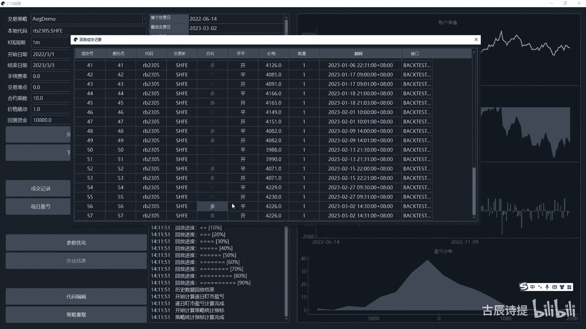

是不是好吧好，那这个呢就是检测完了。

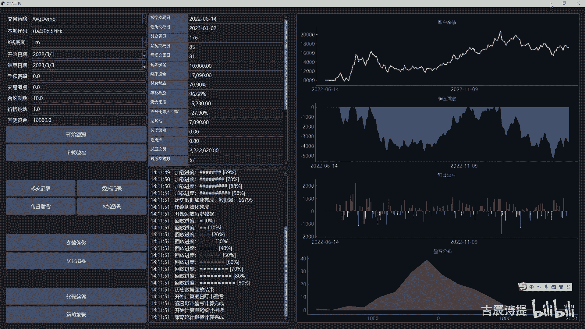

那那说明撮合没问题，撮合没问题，但是咱们这个代码还没写完呢，如果说咱们在C盘下面，就是找到咱们那个策略啊，在这个呃卷介子里边。

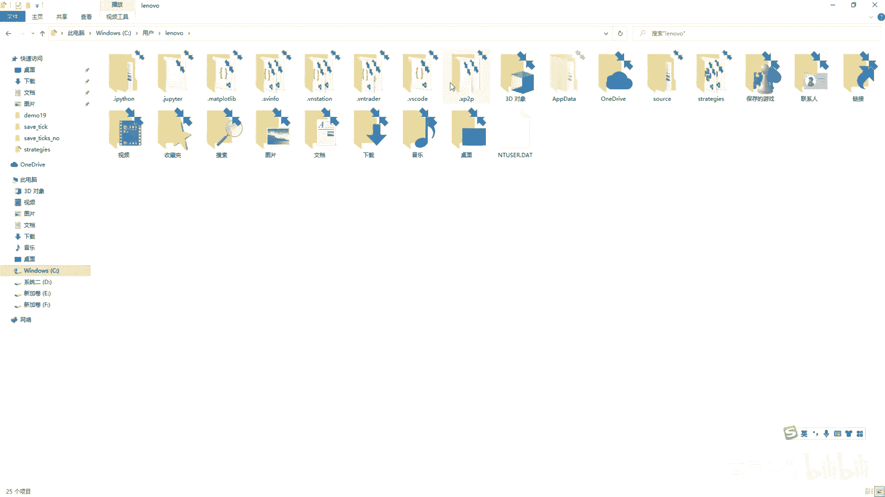

然后找到这个fg demo这个EPIDEMO，咱们当时在写的时候没有加什么呀，就是cf点cancel or。

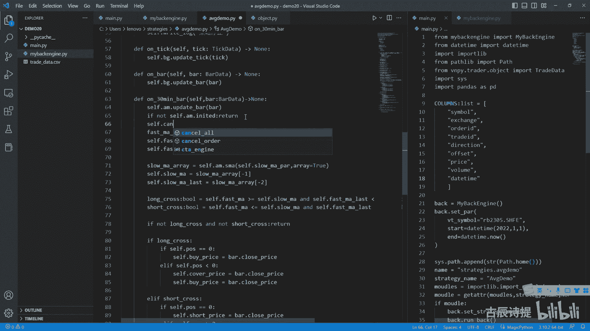

如果加上self cancel，咱们再看一下这个回测，这咱们策略重载一下，然后再进行回测，开始回测啊，啊是啊。

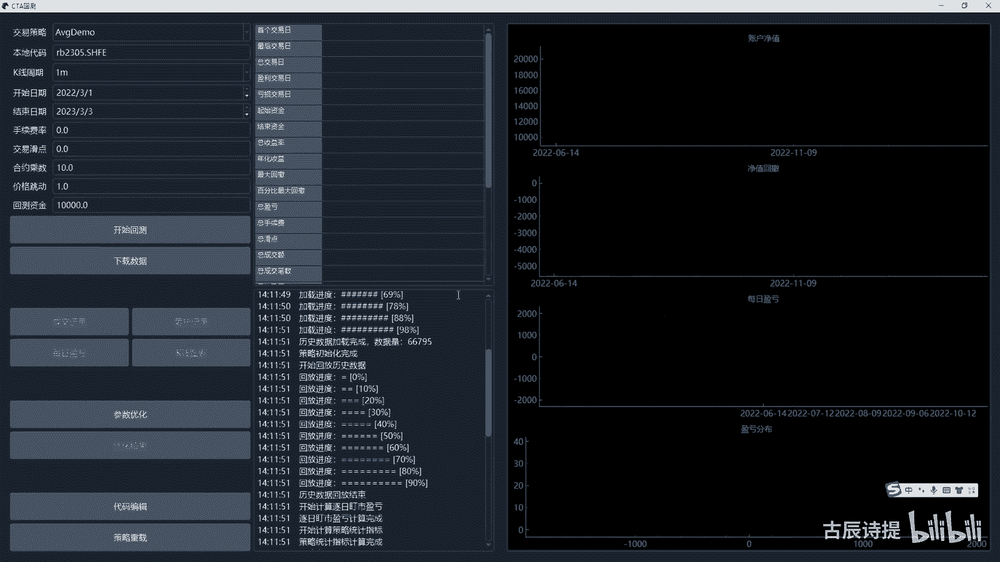

就出来了是吧，然后在咱们看这个成交记录，你会发现它成了53笔了啊，他成了53笔了，那就说明他这个order里边其实是有这个撤销的，比如咱们看一下这个委托记录啊，委托记录拉大一点，你看是有撤销了的吧。

是有撤销了对吧啊。

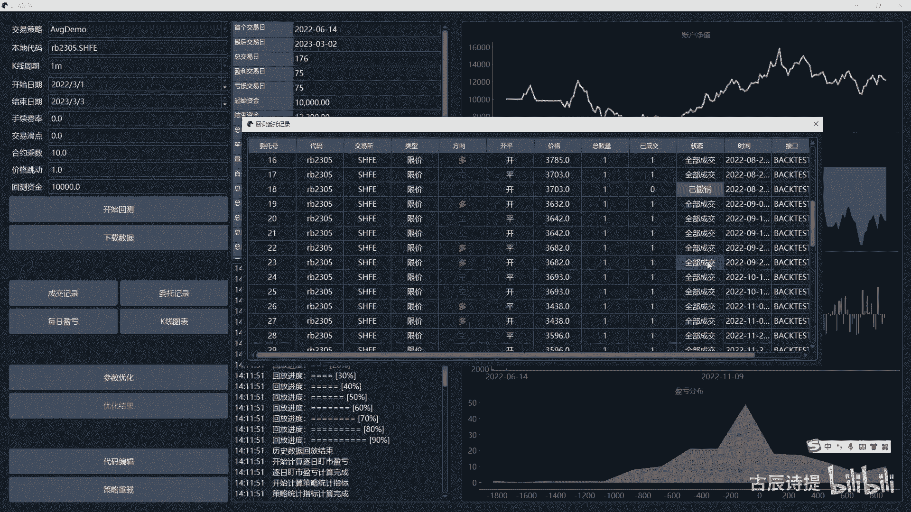

所以说咱们还是得给他把撤销委托这一部分，去给他去完成啊，撤销委托这一部分其实就相对很容易了是吧，就是cancel orders这块嘛，首先撤销单个委托，撤销单个委托证呢，呃咱们在写代码。

你可以看我之前第一套课，它有这种精细的控制委托单啊，在那呢你可以去看一下，就什么时候会用到cancel order啊，在这我就不多讲了，Cancel order。

它是通过什么strange和和这个VTOID，其实这个strange咱们不怎么去用到它，对不对，不怎么去用到它，因为在回在这个回测里边嘛，这个BT2的ID啊，就是就是为什么咱们当时在关联的时候。

要关联成video的id，因为这撤单的时候，他也是用VTOLID来撤的啊，怎么撤，其实就是在这个两个呃两个字字典里面，把这个对应着的VTIDE给删掉就可以了，对不对，那首先咱们进行一下判定啊。

if这个VTO的D点start为咱们的，如果说他是停止单，就是呃这个stop这个prefix，它如果是停止单的话，是不是说明它就是停止单的委托，是不是啊。

所以说我cf点cancel c c cancel stop order啊，把这个呃VTO大AD啊传递给他是吧，传递给他，当然啦，就是说如果说你想就是说跟这个引擎，就是实拍引擎保持一致的话。

咱们把strange再给它传递过去啊，再给它传递过去好，咱们去来实现一下DF啊，这个cancel stop oled cancer stop aud，这前面加一个cf，你一定要记得加上啊。

然后这个这个strange是c t a template，然后VTO大D是STRSTR类型，然后这个cancel stop word，就是其实就是一这个v t o d in cf。

点stop orders啊，或者加上点kiss都可以是吧，因为这个是他的这个key啊，如果说在里边的话，就self点啊，就是说这个stop orders第2pop这个V调大，这又用到点pop了吧。

所以说这你最好是加一个list，是不是啊，加一个list，因为啊啊这这个不是便利啊，这个不是便利，加不加list的都没事啊，这不是便利啊，然后呢你把它就是撤销了之后，你是不是得得告诉这个策略一下啊。

得告诉策略一下吧，所以说pop它是有返回值的吧，啊它是它会返回一个stop order吧，所以说我stop order在这接一下，是不是啊，然后他是一个stop order类型吧，从这接一下。

接出来之后呢，我把这个stop order stop order点这个studio，我是不是应该等于这个stop order studio点呃，CANCELLED是不是，然后呢。

我把这个self点strange来进行一下调用是吧，公stop order，然后把这个or stop order放进去啊，这个能理解吧，没有什么问题吧，这个得调用的吧。

同样的这个cancel limit order，这个else就是cf点cancer，这个limit order是吧，cance you are limit order的。

同样的s t r a t e strange，然后把这个VTODAD放进去，然后咱们再去实现一下这个cancel limit order啊，D f cancel empord，同样的。

首先你要把C写进去，然后strange它是这个c t a template类型，VTOAD它是这个SSTR类型，第二类型好，然后一样的判定是吧。

if这个VTO大d in slimit orders或者orders，kiss啊，KEY是吧，kiss如果说他在里边的话，就是stop order啊，这个order它是一个order data啊。

就应该等于这个cf点limit orders pop啊，你看它返回的是一个older data吧，pop这个呃VTODAD是吧，然后把这个order点状态，studies等于这个是叫就是studies。

点CANCELLED吧，Cancelled，然后在C点strange啊，点on order，然后把这个order给它进行一下调用啊，然后咱们得看一下啊，就是他这个是不是在这个CTA引擎里边。

它是不是有返回值啊，他是不是有返回值，因为这咱们没有进行，你看他是没有返回值是吧，那咱们之前标注过是吧，那他是没有返回值啊，如果说这个你这个OID不在这个里边，咱们是不是可以从这就是ELS啊。

就是cf点right log，这个message应该是写什么呀，就是说这个F啊，这个VTO的AD呃，撤单，撤单不成功，撤单不成功，没有G委托对吧，是不是可以写一下啊，同样的也放在这儿吧。

啊放在这是不是就是不是这样就可以了是吧，那cancel or呢，cancel or是不是我把它整个全部给撤了吗，是不是啊，把它整个全部给撤了，好整个全部给撤了，是应该怎么撤呀，就是for。

For key in list，四点limit orders，点key啊，kiss是吧，然后这个key它其实就是这个v t order i d吧，是不是VTOLID吧。

然后呢sf点cancel limit order，然后把这个strange给他传过去，Strange，然后把这个VT2大D给他放过去，是不是就挨个去测这个呃，这个限价单去了是吧。

然后再for f one啊，Four vt order id in list，四点stop orders kids，然后cf点cancel order，Cancel stop order。

把这个strange，给它放进去，然后把这个VTODAD也给他放过去，是不是这样就可以了啊，是不是就可以了，是不是啊，这个呢就是整个的一个撤单的一个逻辑，那咱们再进行下回测啊，看看撤单写完之后。

是不是跟这个咱们伟大的那个上面，是不是一模一样。

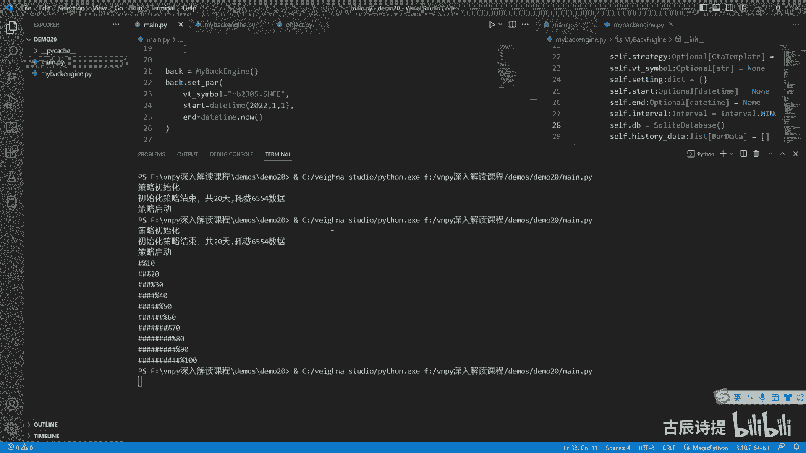

好完成了吧，完成之后咱们打开啊，打开这个F盘，在demo里边咱们是20克是吧，这个揣在data里面。

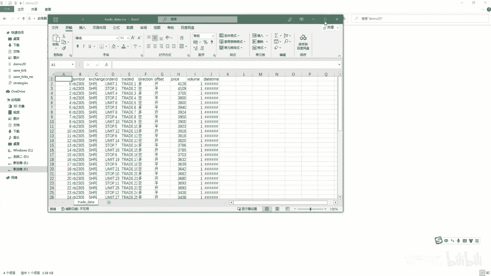

首先看数量是不是变成52了，52+0吗，就是五就是53嘛，在维纳里边他是不是成交记录也是五，也是53笔啊，他是从一开始的是吧。

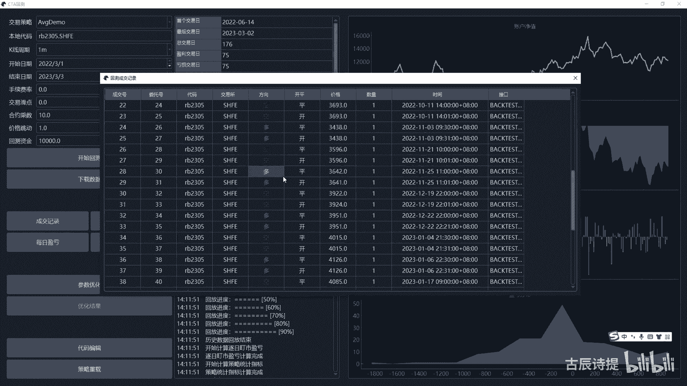

这个我就不做对比了啊，应该没有什么问题，下面咱们就应该去计算结果了吧，就是计算一些指标什么的，这个呢咱们新建一个就是calculate s t吧，就是那个统计的意思是吧，那个叫statistic是吧。

好定义一个类，my c a l calculate s t吧，这么写就行，in it一个很多人认为这个东西很难啊，其实你这个trader data都有了，其实这个这个交易的计算就是结果的计算。

就变得相对就简单了啊，就变得相对就简单了，比如说咱们先定义一个get result吧，就是咱们要知道咱们想要什么呃，咱们想要什么，比如说我从这儿写一下啊，咱们想要的，比如说第一个就是总资金。

总经理肯定是想要的吧，但这个里面有个问题，含不含浮动盈亏，比如我含这个浮动盈亏，就是你在持仓的时候啊，就是你在持仓的时候，他的这个盈亏我也算在这个里边，那它就等于什么呀，就是初始资金吗，然后加上净利润。

净利润，净利润，然后再加上浮动盈亏，是不是就可以了，对不对好，那这个的话我是不是得有一个初始资金，Sc a p i t l capital in it，等于我默认等于1万吧。

我那个什么提示我就先不写了啊，那这个初始资金那是不是还得有个净利润，净利润net profit啊，我就等于零是吧，还有一个浮动盈亏，比如trading就是在交易中的这个盈亏啊，profit是不是啊。

这这个净利润它是不含不含浮动盈亏，不含浮动盈亏对吧啊，不含浮动盈亏好，那第二个你想要什么呀，就是盈亏比，盈亏比这个我个人认为它是比较重要的啊，盈盈盈亏比不能太小，另外呢就是胜率呃也不能太低。

当然如果说你胜率高，盈亏比低也不太合适，胜率在40%左右，盈亏比在一比三左右，算是一个还可以的策略是吧，所以说你这个盈亏比是得有的吧，那盈亏比我怎么算呀，就是总体的盈利除以一个什么呀，就是一个总的亏损。

是不是，那你是不是得首先你得有盈亏比cf点，比如说我win lows profit rate啊，等于零是吧，然后这个里边cf点偷偷，比如说这个win perfect，等于零，然后cf点TOT偷偷lo。

profit等于零啊，这个是这个是总的亏损，亏损的我都算到这啊，盈利的我都算到这两个一除不就有了吗，啊，对不对好，那第三个是需要什么呀，盈亏比胜率啊，胜率那胜率它是等于什么呀，它是它是不是。

就等于这个你的这个额盈利的交易次数，除以总的交易次数，是不是这样的，那你盈利的交易次数，比如cf点win count，等于零，然后你总的交易次数就total count等于零吧，两个一除不就有了吗。

所以说你这还得有一个什么呀，就是说呃cf点win rate等于零，是不是这个就有了是吧，那还需要什么呢，就是咱们就是给大家演示啊，并不是说把它都写完了，其实这个你可以自己去去根据你的需求去定啊。

比如说我第四个我还需要这个呃持仓占比，持仓占比我看我不能就是说爆仓是吧，比如我超过60%了，就应该警示了，或者说我持仓占比不能高，那持仓占比的话，你是不是得需要保证金比率啊，保证金啊，保正经比率啊。

那这肯定是得有一个参数的吧，就是cf点持仓占比，咱们用什么呀，用这个pose呃rate吧，pose rate啊，标注一下，一会忘了持仓占比，然后保证金比率啊，就是cf点pose，保证金比率的话。

咱们用什么来表示呢，保证金比率，那咱们就用一个pose呃，right value吧，好吧，等于比如说我默认保证比率是十啊，或者就是0。1是吧，保证金比喻啊，这个里边如果说你还需要比如说手续费。

啊手续费你肯定得有手续费率吧，手续费率吧，那你肯定得有一个cf点手续费commission啊，等于这个是总手续费啊，等于零，标注一下总的手续费，然后手续费率cf点commission rate。

比如说呃默认是万一是吧，0。001手续费率，呃华电是你还需要花电，嗯晚点华点，那你是不是得有每次交易的这个，华点的这个多少，是不是你肯定得有这个，比如说cf点SLIP我就用这个吧。

啊这个比如说我默认每次划一个点，那你cf点s l IP total说吧，你是不是得你是不是又得计算对吧，那这个里边你计算这些东西，必不可少的是什么呀，必不可少的是不是你需要他的这个cf点size啊。

默认等于十，这个self点size它是个什么东西啊，self size是不是这个一个点代表的价值是吧，因为你算算这个持仓占比啊，包括手续费啊什么的，包括华点，包括华点，它亏损的这个金额你是不是都得算呀。

对不对啊，所以说有了这个size就可以就是很好的去计算了，我们就给大家演示一下，就就算这么多了，就是不弄得太复杂啊，就是有更多需求，你可以自己来写，这个里边肯定少不到，就少不了一个cs pr。

就是这个设置参数，因为很多东西你得自己来设置吗，是不是，比如说我写这个，你这个里边的这个呃初始资金啊，Capital init，C a p i t a l capital init。

它是呃这个float类型问题，比如说你这个下面的这个，呃这个保证金比率是吧，pose rate啊，Value float，我默认别的，比如说就是0。1啊，保证金就是每次交易需要缴纳。

就是保证金是10%是吧，然后后边还有什么呀，手续费率啊，就是c m m i s s commission rate啊，就是也是float，我默认等于0。0000001，然后我啊。

当然你一开始可以把它全部归为零是吧，我就一开始我就不计算了，只不过我给它放到这个里边，你要是想计算的话，你可以把它放里边，是不是包括这个华点啊，SARIP啊，华点它也是float类型的啊，不是等于零啊。

就是这个时候你可以在下面进行赋值，cf点SLFCD啊，这个没写self什么，啊啊capital init就等于capital in it，然后C点这个，pose是吧，这个应该是post rate啊。

cept post rate就等于这个pose rate value啊，把这写上啊，Rate value，这是写了个pose rate，value VN l e啊，Pov value。

还有个smission rate，等于com commission rate，然后sec IP啊，这个是华点哇，这个是赋值，那你下面要做的第一步肯定是得什么呀。

就是你得ADD triad或者process trade都可以啊，就是有成交了，你得通知他吧，它来进行就是一些数值的计算是吧，他肯定是一个TD，这边需要一个tra data trade data。

我从这我进行一下导入，from VP y trade object import import这个bar data，还有这个trader data，bar data肯定也是得要的嘛是吧。

from v m p y点trade deconstant，import这个呃，呃这个offset还有这个direction也肯定得要的啊，Import pandas pdf。

pandas as pd啊，这个也是得要的吧啊好咱们就先这么多，每一次这个成交来了之后，咱们可以首先第一个能计算出来的是什么呀，其实第一个就可以计算出来，它的这个手续费率吧，就是这个手这个手续费吧。

手续费是什么呀，应该是先用呃，turn over就是成交额，先计算出成交额，也就try点volume乘以trade点price p r c e是吧，然后再乘以啊，cf点size。

这个self size是不是你在赋值的时候，你也得往里填呀，是不是啊，self size啊，这个是应该是size size e它是一个float类型的啊，比如说它默认等于十啊。

这个capital in it，它也是默认等于10万啊，然后我这写一下这个cf点，size等于size，就是你在用维纳的时候，你也得自己去在界面上去给它赋值，对不对。

那你的手续费力就是shift their commission，加等于就是turn over，加等于TURN啊，turn over乘以这个sd commission rate是吧，当然这个就是你得看。

就是说这个他的手续费是单边还是双边的啊，手续费我这边计算肯定是双边的，你如果是单边计算的话，你就他开仓的时候，你进行一下判定，开开仓的时候你就计算一下，不开平仓的时候，你就可以不计算了。

或者你在平仓的时候去计算，这个就看你自己的需求了好吧。

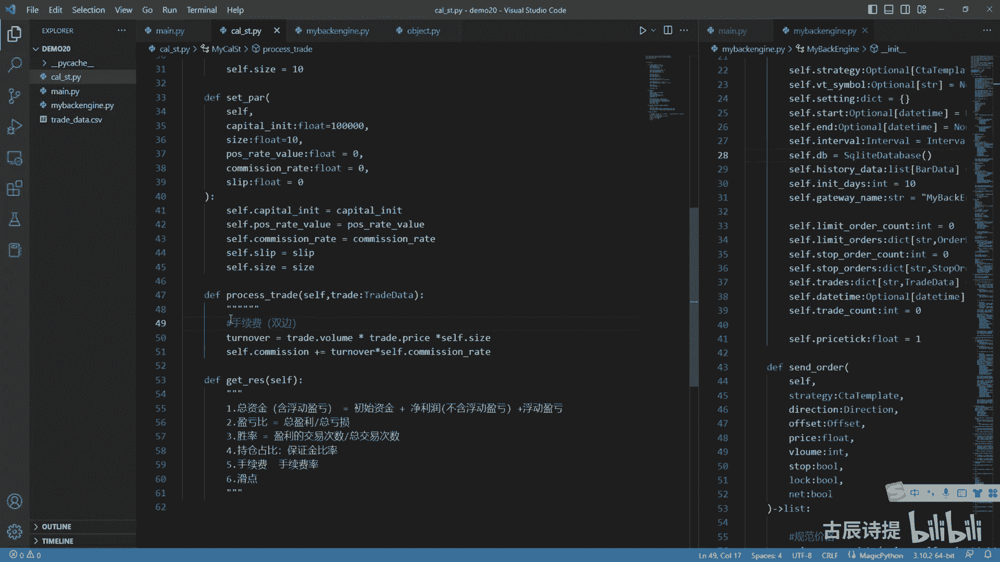