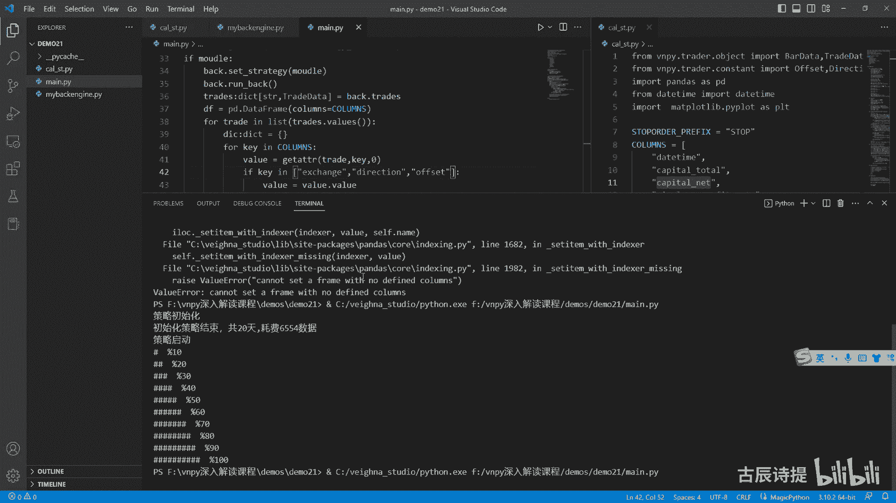
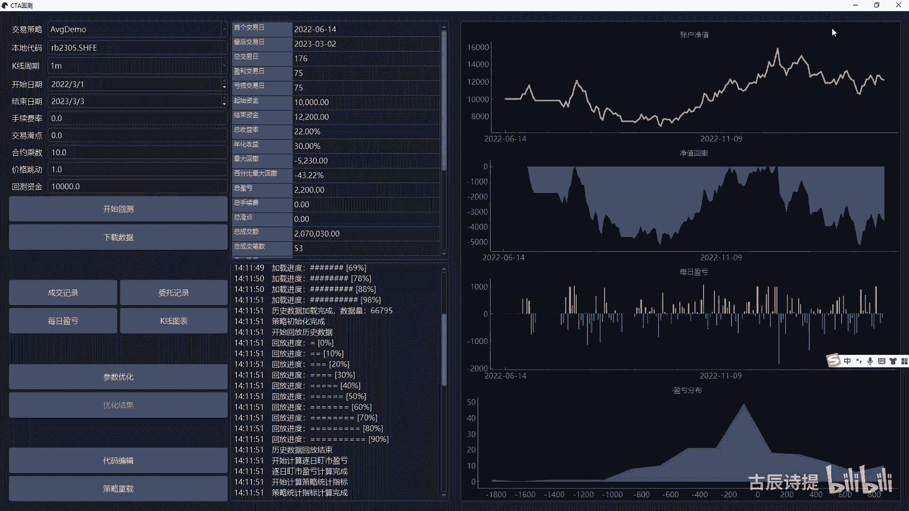
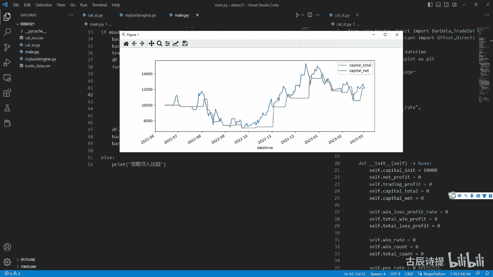
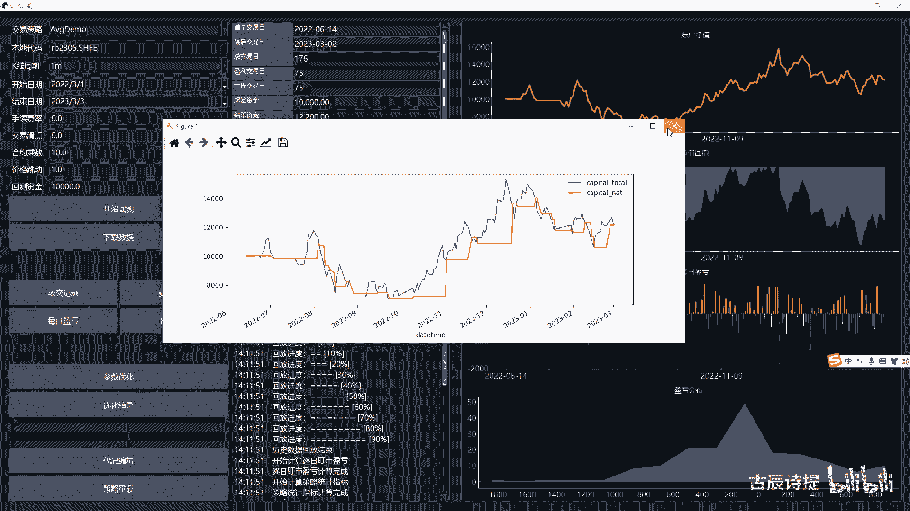
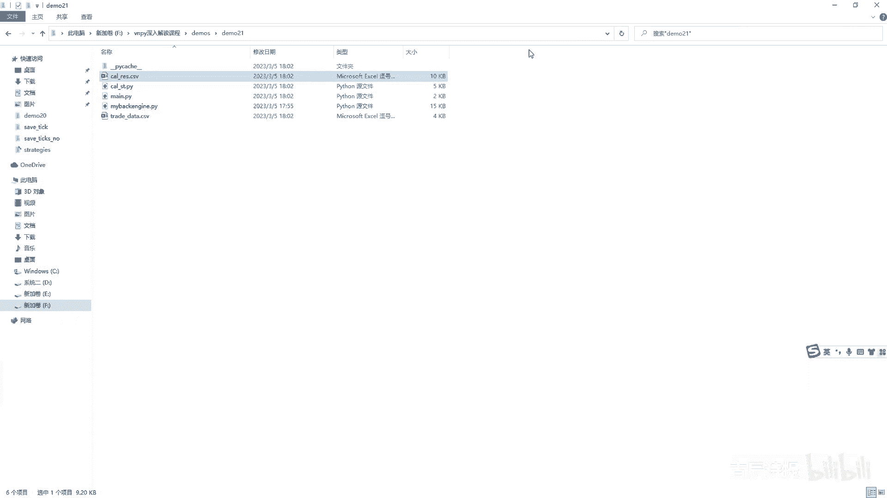
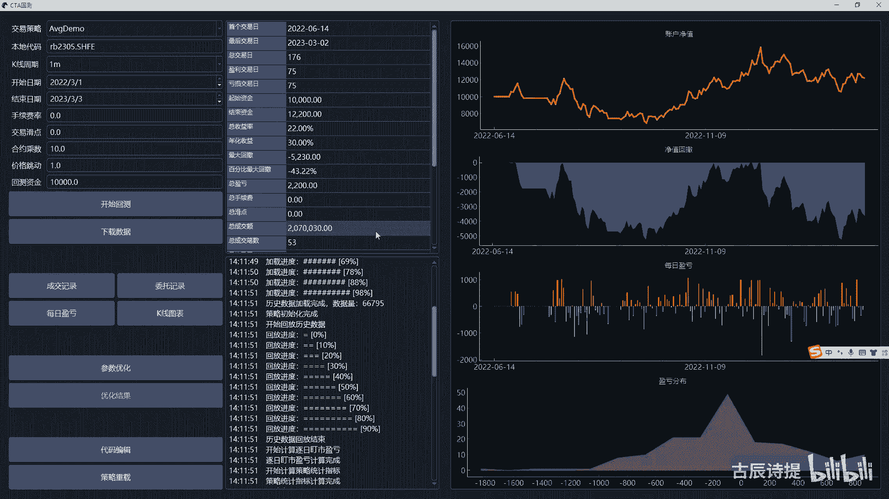
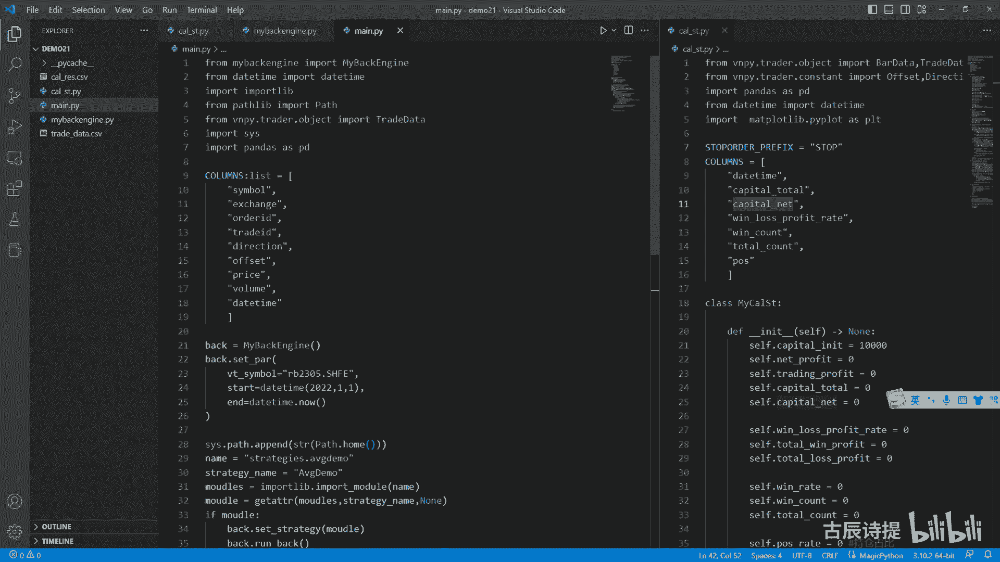

# 第21节课 CtaBackEngine回测结果实现(2) - P1 - 古辰诗提 - BV1qt421w7Gy

欢迎大家来到从零开始量化系列课程，VMPI课程的第21节课，上一节课咱们说到了这个计算结果，计算结果呢说到了这个你有try来产生的时候，他首先计算的这个是手续费，那你第二个可以计算的是什么呀。

这个里边咱们要计算总资金，比如说计算这个额净利润还是浮动盈亏，你肯定得需要这个它的持仓吧，就是cf点pose是吧，就是cf点POS，你肯定得是需得是需要的吧，那我是不是就可以调整它的持仓了是吧。

调整持仓啊，持仓调整持仓应该就很容易了，self pose等于SPOSE加上trade，点volume，if这个tried direction等于direction点long是吧。

else就应该cf点pose减去这个tread点volume，是不是这个就是调整持仓嘛，那调整持仓，你是不是在计算它的这个浮动盈亏的时候，你肯定得需要它的平均持仓成本啊，就是比如说我开了一手。

我再开了一手，我得计算它的平均持仓成本，对不对，那平均持仓成本怎么来计算呢，好我这再加上一个cf点avg啊，price啊，等于零平均持仓成本，有了之后，你就可以去进去计算它的这个浮动盈亏了吧，是吧。

就是你只需要把爸再传过来，然后用收盘价进行一个比较，那就是这个呃平均持仓成本怎么来计算呢，咱们在这儿啊，平均持仓成本是不是，我计算平均持仓成本的时候，只有在他开仓的时候才进行计算的。

他平仓的时候他不需要吧，对不对，所以说你应该判定一副呃TRAD啊，try的点，这个offset it等于offset点open，它是开仓的时候他才去进行计算。

那这个cf点a v g price应该是等于什么呀，应该是等于它原本的持仓吧，abs cf点pose乘以这个这个cf点avg price，然后加上啊。

加上这个tread点price乘以这个trade点VU，因为这个try这个try的点volume肯定是正值吧，但是你原本的这个持仓有可能是负值，我在这计算的时候，我不应该出现负值，是不是我把这个加起来。

我再除以一个就是这个abs cf点pose，然后再加上trade volume，是不是就是我的，就是说这个持仓调整是在它下边啊，为什么要我要放在它这个上面，因为我得计算这个平均持仓成本。

当然这个计算出来也有它不好的地方，就是说比如说你有，你再开一手是3400，然后再开一手是3500，然后你平的时候呢，你不一定都是一起平，你可能在比如说3700平一手，3800平一手。

那这个就是你3700平的，你就不知道你3700究竟是应该呃挣了多少钱，按正常的逻辑来说，你应该是平了3300的这一手是吧，你应该是挣了400个点，就是挣了4000块钱吧，是不是。

但如果说你只是计算平均持仓成本，你这么一计算的话，是不是就变成了平均持仓成本，就变成3400了啊，呃当然你可以去自己去写，用一个列表把它保存在这个里边，当你有有持仓的时候。

把你每一笔交易都放在这个里边是吧，然后呢有平仓的时候，你再一笔一笔的去把它给删除掉，当你持仓为零的时候，这个里边就为空都可以，这个根据你自己的需求，这个没有说固定式的东西啊，没有固定式的东西。

那咱们在这演示呢就不弄那么复杂了，我就去计算一个平均的这个持仓成本啊，如果说你只有说一手开一手平的话，你想啊，如果说他没有持没有持仓的话，这个setter pos pos是零了吧，对不对。

然后这边四点pose也是零，然后就等于说前面这一段没有，就是这个try their price乘以TRAVOLUME，然后除以trade volume，是不是就是try to their price。

是吧啊，这个是来计算平均持仓成本的，主要是为了怕就是说有有有这个增减仓啊，平均持仓成本有了我的浮动盈亏，是不是就有了呀，我浮动盈亏应该是process bb process bar。

然后cf然后把bar给他传过来啊，bar data给他传过来，然后我是不是cf点浮动盈亏是training profit，应该是等于八点close price，然后减去啊这个cf点avg price。

然后整个的乘以一个cf点pose啊，乘以一个四点pose，然后再乘以一个cf点size啊，是不是这样的，就是我就是说我这个K线的收盘啊，这个K线的收盘收盘价，减去它的这个平均持仓价格。

比如我平均持仓成本是4000，我的收盘价是5000，然后5000-4000，一千一千，然后乘以十，是不是就挣了1万块钱，但如果说你持有的是就是空一手，这个时候我5000-4000。

他是不是就是亏了1000个点就变成-1000了，对吧是吧，这是training profit，是不是有了trading profit呃，就是你这个总资金现在就缺一个净利润是吧。

净利润就是不含浮动盈亏的净利润，净利润你怎么去算呀，净利润是不是你应该可算AE这个try的点，off seat等于等于office seat点close，就是当它就是去平仓的时候。

我是不是就应该去计算净利润了，比如说我我profit，等于就是你用就是你的这个就是try点price减去，就是说这个cf点avg price，然后再乘以一个trade vu trade volume。

然后再乘以一个这个size啊，cf点size，咱们来看一下这个对不对啊，当你不知道就是对与错的时候，你就去给他举例子是吧，比如说我是持有多单的时候啊，我持有多单，持有多单，我要平仓的时候。

记住我要平仓的时候，其实就是空方向啊，就是这个你trade的就是它的方向是空是吧，然后我的平均持仓成本是3000，然后我现在价格是4000，然后4000-3000，然后挣了1000块钱。

1000块钱呢乘以一个你的volume，就一手乘以十就挣了1万块钱，就说明啊你在平多仓的时候，这种计算方式是对的，是不是好，那我就是在平，多层也就是我的方向是空的时候。

try的点这个direction等于等于direction，点short吧，能理解这个意思吗，就是当我去平多仓的时候，你这么来计算是没有问题的是吧，但是如果说我凭空仓的时候。

比如我空仓的持仓平均成本是4000，然后呢我现在是3000块钱，然后我把它给平了，那你用trade price3000-4000是1000块钱，1000块钱乘以这个volume。

但这个try volume只有正数，那是不是这种计算方式就不对了，是不是，所以说你得从这就是air if出点，这个direction等于等于direction点long这个浪，因为平仓啊。

这个浪是代表着凭空仓，是不是，那profit就等于应该是用cf点a v g price减去，然后乘以出点volume，乘以这个self size吧，是不是啊。

这个profit就有了吧啊这profit就有了啊，就是你的这一次的这个交易过来，我如他如果是平仓的话，我就可以把他的profit给计算出来了，那profit有了。

是不是我这个cf点就是这个净利润就有了呀，就是nt profit是吧，加等于perfect，另外if perfect啊，它是大于零的，说明这笔是盈利的，那C点win count是不是可以加等于一啊。

然后cf点这个偷偷啊，win profit可以四个加等于这个profit就可以更新，你的总的就是说盈利了是吧，然后else我把就是说如果说平进平出的，这个算到亏损里边，因为你平静平出，你得有手续费啊。

实际上是吧，你也是亏钱的，shift这个loss它没有loss啊，没有loss，这个就是这个一个这个对象，我就把这个小偷偷lost profit就加等于啊profit。

然后在它这个整个的这个trade里边，如果是平仓啊，平仓交易的话，平仓交易我就是cf点total count，就是加等于一是吧，这个在平仓的时候，我把它算算做一笔交易啊，算做一笔交易，开平算一笔。

因为你开没法取去给他，就说去计算是吧，就是说在平仓的时候，我偷偷看我加等于，当然这种方式也有它的不好的地方，就是你这个按说你如果中间有这个增减仓的话，这样是很不科学的，这样会造成比如说我出现了一波行情。

然后呢我在下面的时候我加仓加仓加仓，然后呢到上面的时候我平仓平仓平仓啊，这个后边有比如说N个平仓，你其实就是N比交易，对不对，你其实是想算一次交易，就是从持仓为零到持仓为零。

然后这个过程中挣了多少钱是吧，这次是挣了多少钱，你想这么计算的话，你就可以用什么呀，就是说去控制，就是这个cf点pose就是等于零的时候来进行控制，它就是说从零，然后到下一个零就是它这个中间的变化。

比如说总的盈利，你就可以全部给它累积到这个里边去是吧，这个是看你去怎么去考量，在这我就直接就就这么简单的去进行啊，这么一个加减了啊，就是写的不复杂好，下面就是说这个总资金啊，我应该是在下面进行更新是吧。

就是cf点这个capital有总资金这个变量吗，咱们看一下啊，我把它向右拆分一下，Training profile，没有总资金这个变量吧，cf加cp capital total吧，等于先等于零啊。

这个我总资金是不是就是cf点capital total，就可以等于这个初始资金，cf点capital in it，然后加上这个净利润，就是cf点二这个net profit。

然后加上四点trending profit，是不是就可以了，但是这个里边你还得把这个什么呀，手续费和这个华点给减掉，是不是，那我应该减掉cf点，手续费就是commission啊，Commission。

然后再减掉，应该是cf点这个4sleep total是吧，Sleep total，那我这个commission我计算了，那华电我怎么来计算呢，华电咱们先捋一下这个逻辑啊。

滑点是不是在stop单的时候你才能有滑点，另一单你不能有滑点是吧，因为limit单你在实际成交的时候，它也不可能又滑点啊，所以说华点咱们就在这看，就是if tread第2VTOID这个就显出来了吧。

当时给你们看的时候，演示的时候，这个VTOID我是用那个就是在stop order那啊，这就是这个close stop order。

这啊stop order go to definition stop order，这咱们最后去进行，就是说这个就是这个try啊，try就就这个try data，然后这个OLLID给你们演示的时候。

是用这个上面这个O的OLEDID来进行演示的，但是后来我又把它改成了stop o d啊，你改成这个它是有好处的，你从这就能看出来，他这个是用就是说这个stop that还是这个limit。

就是在最顶层的时候是有哪个，就是说委托发过来的，当然按道理说，你应该把这个放到这个BTESTING里面，但是其实放在这呃也无所谓，就看你自己了啊，Start with。

他如果说以这个咱们的这个stop开头的，我把这个给粘过去啊，我不能从这导入，因为我最终我是得在这个btesting engine里面导入，这个累的，我如果再从这儿去导入它的话，容易出问题啊，容易出问题。

就是它会循环导入是吧，我就把它，那我就把它放到这儿就行，然后如果说start with stop perfect啊，这个时候呢，我是不是就可以改他的这个trade price了，就是if这个trad点。

这个direction等于direction点lg，就是如果是多的话啊，就是它是开多层的话，那我这个trader price就应该等于这个trade price减去，减去什么呀，应该是cf点SLIP吧。

是吧啊，AIFTRA点direction等于等于direction点shirt，如果说是空单的话，我是不是这个tread their price，应该等于try的点price减啊。

加上这个cf点SLIP是不是啊，另外的话你这个sl s l IP total，是不是可以加等于cf点，SLIP乘以一个cf点size啊，S2点size就是我直接把这个size给加给放进去了。

它其实并不是华点，而是因为华点造成的这个资金损失，是不是，然后C点这个s l IP sleep total啊，也加等于这个cf点啊，当然这两个都一样了是吧，两个都一样，咱们就给它放外边就可以了吧。

这个啊好放在这是不是就可以了，这个你这个就是整个的这个华电，是不是也计算出来了啊，华电是不是也计算出来了，这应该是再减去一个cf点，偷偷吧啊，我给他从这儿吧，是不是就可以了啊。

这个capital total就是说总的资金也有了，然后呢这边呢第二个呢是盈亏，盈亏比，就是总盈利加总亏损，咱们这个呃这两个数值是不是有了呀，那我就直接可以去进行计算了吧，就是cf点呃。

win loss这个rate应该是等于，然后C点win呃，这个total wind profit，然后除以一个四点，偷偷lost perfect，但是这你注意了，一旦涉及到除法了，你得去进行判定一下。

后边不能为零是吧，if cf点偷偷这个total lose perfect else0，如果说有了这个total loss profit，就是当你有这个亏损的时候，你才能去进行计算的，如果没有亏损的话。

是不是计算的没有意义是吧，如果第一笔是挣钱的话，你不这么写是容易出问题的是吧，好胜率胜率四点win count啊，sawin rate吧，有这个吧，swin rate应该是等于什么呀。

就是啊盈利的交易次数就是四点win啊，等于cf点win count除以一个cf点，偷偷看我呀，这也得去进行一下判断，因为可能前几天他没有这个交易是吧，你不能除以零啊，Self total count。

零啊，ELS0是吧，这个win rate也有了这个持仓占比，持仓占比这个就好算了吧，就是你每回在process bar，这我就是这个cf点啊，pose right就是持持仓占比等于等于什么呀。

就是应该是四点pose，然后乘以一个cf点，这个用这个8close price吧，再乘以一个self size吧，然后再乘以一个，就是说这个咱们的这个cf点，就是它的这个保证金比率啊。

保证金比率咱们是用什么来表示的，保证金比率就是post rate value是吧，cf点pose rate value，然后除以一个总的资金，就是cf点这个capital total。

是不是这个就是呃你的这个持仓占比嘛，就是用你的这个持持仓量，当然这个持仓啊咱们得A啊，得ABS一下是吧，得用绝对值，而不能用这个，如果你是负值的话，它就不对了是吧，持仓乘以你的这个收就是八的收盘价。

乘以它的这个size，然后再乘以占比，再除以一个capital total，当然这个算的不准确，因为他的这个实际上的这个持仓占比，应该是什么呀，用你的收盘价来算的，每天更新一回啊。

但是咱们就按照这种方式来去进行计啊，去进行计算啊，好psi手续费和手续费率啊，手续费是不是就计算了，就是在这个第一个计算的就是手续费嘛是吧，就是cf点commission，然后华点华点也有了吧。

就是咱们这个cf点sleep coast是对吧，小点sleep coast啊，Total sleep total，那这些是不是都给计算出来了啊，都给计算出来了之后呃，咱们是不是就可以给它输出出来。

我输出这我就不写了啊，我输出这我就不写了，就这个我就不写了，你可以把它输出出来是吧，输出来就是这个都计算出来了，但是你是最终你是需要很直观的，去画个线出来的，划线需要什么呀，划线需要横轴。

横轴就是时间和日期啊，是不是时间和日期，那你这就得有cf点day time吧，先等一个NN值啊，subject time吧，我给他标注一下这个数据类型吧，the time啊。

咱们还导入下得导入下这个包啊，date tab import deta好，你这个C点d time应该是怎么去更新啊，就是在这个process process bar是吧，就是cf点啊。

这time等于八点the time吧，啊你最终需要把这个数据按照什么呀，按照天你像维纳是按照天来进行更新的吧，呃按照天来进行更新，但是其实吧这个也不是特别严谨是吧，你按说你是需要你按天更新。

是晚上12点还是下午三点，你是按交易日更新，还是按正常的这个日日期进行更新啊，这个也不是特别的严谨，呃，你像咱们这就给大家演示一下，就到下午三点去进行更新，你更新你最后得形成一个二维表格是吧。

我cf点df pd点啊，data frame我就应该等于啊data frame呃，pd加data frame，然后这个columns就应该等于一个columns，这个我写一下啊。

我这写一下这个columns，server u m n s column等于一个这个，Poems，我写好了第一个daytime，然后capital capital total。

然后capital nt capital nt呢我是后来添加的，我再给他添一个啊，就是cf点capital a cf点capital nt就是不含浮动盈亏的啊，这样的一个敬礼啊，Capitate。

那这个CAPITATE其实就很简单了，就是咱们在这在capital total，这就是直接把它复制啊，就是CTRLC哎呦啊，Ctrl c，然后CTRLV，然后capital net他应该等于什么呀。

就是不加上这个敬礼吧，就是这个就是啊不加上这个浮动盈亏吧是吧，就是这个吧好啊，是不是就可以了啊，然后呢就是我创建好了这个二维表之后，我是不是得添加呀，这个添加就涉及到了时间节点问题啊，时间节点问题。

咱们这儿呢简单演示，咱们就用这个下午三点嘛是吧，一副八点daytime，点our等于14and8点DETA点minute等于等于什么，等于59是吧，当然这个你可以单独写一个方法。

就是去自自由定义它的这个切割时间，我这儿给大家演示，我就用14：59分啊，然后有了这个14：59分之后，然后我就可以for key in columns，这个大家都应该很熟了啊。

然后去gd t r get AD t r，在我这个类资金里面去找吧，然后找这个key啊，就这么去找的话，你要确保这个里边就是你的这些呃，里边的这个值要跟下面你命名的，是得一模一样的啊，不然它是找不着的。

不然他是找不着的，然后如果找不着的话，就给它赋值为零是吧，然后这个value给它复制一个value等于这个啊，这个里边呢有一个这个daytime，这个daytime呢是包含时间的。

所以说咱们要把这个时间给它去除掉，if key啊，等于等于这个DETA，那这个value就应该等于value点replace吧，这个our等于零，然后n u t minute等于零，是不是就可以了。

当然你也可以就是说这是没有提示的是吧，你也可以就是怎么着啊，你可以用什么呀，Is instance，然后这个里边这个object就是这个value啊。

然后这个value如果是这个that time这个类型里边的，你就可以value等于value点就place了是吧啊，都可以啊，然后呢你在前面呢你创建一个字典，这个DIC啊，等于这个啊一个空字典。

然后从这就是DC等于这个value了吧是吧，然后你再把它添加进这个cf点DF这个里边去，也就是点local l c，然后LC点DF然后就等于这个DIC了吧，就等于这个字典了吧，是吧啊，等于这个字典之后。

你最终是不是就可以把这个给输给输出出来了，然后咱们在这个啊manager啊，manager咱们可以去进行，也也也和他相类似的这种trade data，咱们可以再生成一个这个CSV文件的格式是吧。

当然在这之前呢，你需要去在咱们这个engine里边去给它导入一下啊，from这个c a l s t import my sert，然后在初始化这我给它cf点呃CALIES吧。

等于my c a l s t，然后这个里边不用传参，但是呢在你的这个CPR，这就是你设置参数，这我是不是应该给他也设置一下，就是cf点calculate r e s，然后这个呃点SPAR。

那这个里边他要的就是capital in it，Capital in it，等于我就直接写了啊，比如说我就写1万啊，然后size size等于咱们这没有这个size是吧，我就啊你在传的时候传入的时候。

比如说我从这儿啊写一个size，这个float float float，然后它默认等于十吧啊，然后这个size我就给它传进去size，然后下一个是这个post rate value。

就是持仓的这个什么呀，就是这个保这个保证金占比是吧，保证金占比哎呀，咱们默认给他一个0。1吧，看博人占比，然后commission这个咱们就先给他写成零啊，然后后边我就不填了，这个参数我就不传递了。

我就赋值这俩，因为后边都有这个默认值是吧，好那这个弄好了之后，是不是你就应该有这个交易的时候，应该给它传递过去，也就是这个交易应该是，咱们在保存到这个trans的时候。

咱们是不是应该给他传一个这个try的，也就是cf点啊，see you take a result点process td，把这个trade给他鼓放过去啊，同样的是还有一个是吧。

在这我是不是也应该给的CP点calculator r e s，然后把这个点process tread，把这个tread给他放过去啊，另外还有一个process bar是吧。

咱们是process new b，咱们有process new bb，在process new bu，这咱们给他把这个calculate result，点process bar给他传递过去。

把把线给它传递过去，是不是就可以了是吧，这个时候就整个的就完成了吧，完成了后边其实还有一个划线啊，还有划线，咱们先把这个数据先保存出来，能保存出来，划线其实就不难了，我先把这个删了啊，我先把这个扇删了。

咱们再保存的话，咱们是不是可以直接在外部去给它去进行保存，就是这个man这啊去给他去进行保存，你最终回测完了之后，他的这个DF应该是back，第二呃，这个CALIES点DF是吧，点to csv。

然后这个里边是呃，这个calculate i e s点CSV是吧，好咱们运行一下看看有没有什么问题啊，其实你也可以在初始化的时候给它加上，就是说这个咱们的那个就是井号啊，咱们看看这有问有个问题。

这的问题咱们看一下啊，是不是这咱们没有去给它进行定义啊是吧，这columns啊，这个记得写好，咱们再进行一下，看看还有什么问题，好应该是没什么问题了，咱们可以看一下这个trade data啊。

当然这个trade data啊，我保存成了这个GPK格式的啊，咱们就看这个吧，啊这个基本上是十四十五十六号是吧，一直往后走的，然后这个有交易的时候，它就开始出现变化了吧，一个capital total。

一个capital net是吧，你想在这儿的时候，他还没有这个就是完成一笔交易呢，所以说就是这个当他完成一笔交易之后，他就是就有了是吧，包括后边的这个呃total count，看看最后吧。

就是一共是26笔交易，然后剩的是11笔，然后盈亏比是1。23，这个盈亏比这有点问题啊，盈亏比这有负号，那就说明咱们在计算的时候，就是没有给它加绝对值。

盈亏比咱们是哪个cf点盈亏比盈亏比就是win rate，盈亏比啊，应该是total，这个是吧，wing lows啊，这个应该是这个咱们CTRLCCTRLH找一下，看看他在计算的时候没有加绝对值啊。

这个咱们给它加一个绝对值是不是就好了呀，对吧，加一个绝对值就没问题了，我就不重新跑了，我就不重新跑了，那最后一步啊，剩了最后一步，剩最后一步是画图，画图，这个其实就很简单了。

因为这个这个pandas data frame，这个里边它自带画图的功能，比如plot我定义一个self，让我画图呢，比如说我画两个，一个是这个横轴，是这个daytime，然后这个折线图吧。

一个是capital total，一个是capital nt，就是一个呃总资金包含呃这个浮动盈亏的，然后一个不包含浮动盈亏的，多花在一起是不是就可以了啊，我先导导入一下包啊。

from melip点py plot，就是直接ORT吧，import啊S啊，PP2T吧，P2T给他弄一个简写啊，在这呢咱们定义一个就是啊啊啊TFP哈，它等于这个pd点DFM。

然后这个里边columns等于一个空的啊，然后呢我DFP他的这个the time等于C点，DF这个the time，然后我DFP啊，这个里边，看一下啊，咱们要的是这个capital total是吧。

我就这个capital total，等于CDDF啊，这个CPTOTO诶，两个号啊，那么还需要一个DFP这个capital net，我粘过来，captain net等于cf点DF。

就是这个一定不要写错了啊，这个单词不要拼错了啊，这个就是我把本身这个DF的daytime，capital todo和CNT全部给摘过来了，然后呢KEITP我给它设置一下sit index吧。

就是重新设置一下索引，然后给它设置成这个DET啊，这然后drop就是原本的索引，我给它丢掉true，然后in place，就是是不是在在这个二维表里边去修改啊，我也给它改成求，就是直接在本。

就是这个DFP这个本身的这个，表格里面去进行修改了，然后就DFP点plot就去画了，画了你需要去显示一下，就是这个PRT点数就可以了啊，这个你可以自己去看一下这个pandas的这个，这个教程。

或者你直接百度一下怎么画图啊，最终呢我在这儿我就是back点cl点plot，我去进行一下调用是吧，然后我把这两个可以先进行删掉删掉delete一下啊，好来最后进行一次运行，看看它和咱们的这个维纳上面。

这个画的这个图啊，这个还是之前这个图我一直没删啊，一直没删。

咱们看一下有什么区别啊，这个是不是有些什么问题，咱们检查一下啊，一直他出不来，这个图出来了啊，刚才是画了，他没有直接出来，咱们可以看一下这个图。

可以直接这么去进行一下对比，你会发现线都差不多是吧，这个capital total就是含有这个经历的，这个看这个是类似的吧，啊，然后下面这个就是就是不含这个浮动，崩溃的时候，你看就是从这里可以看出来。

应该是这个咱们这个维纳应该是用的这个，因为它是用这个日，就是每天的这个情况吧，应该是含有浮动盈亏的啊，那这个画图基本上就到这了，整个的回测的流程啊，基本上也就到这了，咱们可以最终看一下他的这个结果。

看挣了多少钱和这个究竟是不是一样的，就是这个开课result只能多元，就是最终的话他是挣了多少钱，还有没有持仓是吧，最终是有持仓的，还有一手多单，3月2号的时候，然后是挣了1万2190。

1万2190啊啊不是，应该是挣了2190是吧，2190。

然后咱们可以看一下，这是挣了2200，结束之呃，结束资金是2200，差了十块钱，这个我就不去找了啊，应该是里边哪有什么东西给耽搁了啊。

好吧，基本上是一致的，那后边呢咱们就应该去讲这个就是穷举，还有这个遗传算法的这个回测了，整体的这个多进程回测，那个呢就是说遗传算法我就不讲了，主要是讲一下这个穷举，因为遗传算法。

它涉及到了这个算法的一些东西啊，就是没法去深入去讲穷举，还是相对容易去理解一些好吧。

