# 第22节课 print输出及代码自检 - P1 - 古辰诗提 - BV1UatYeME9A

欢迎大家来到从零开始量化系列课程，MC课程的第22节课之前呢，咱们把这个呃指标给讲完了，这个指标里边的代码，希望大家去好好的去写一写，因为指标你如果写的很顺畅，你理解里边的更新的情况的话。

你后边儿信号其实你就只需要关键字就可以了，就会去写了啊，为什么把这个信号放到最后讲，就怕大家一上来就开始自己去写，很多东西你都不知道，然后写出现问题了，你觉得没有问题，尤其是它的脚本运行机制。

如果说你不了解的话，出现问题了，肯定会出现一些亏损，尤其是你去很莽撞的去挂实盘是吧，在讲最后的这个信号之前呢，需要讲一下这个printer，这个输出和代码错误检索，如果你呃做过其他的这个程序代码的话。

你肯定会知道这个debug，或者平常咱们都听过这个debug呃，有一个笑话就是说你不是在写bug，就是在去写bug的路上，其实这个bug啊，你一定要了解它就是bug，不一定指语法错误，不一定指语法错误。

语法错误只是bug中的一种，你写习惯之后，当你就是说这个MC就是easy lam解，因为它本身语法简单嘛，你写习惯之后，你会发现语法错误后边再出现的几呃，几率就很低了，更多的呢是逻辑错误。

逻辑错误就是这个逻辑错误，在语法上体现不出来，它编译也能编译过去呃，如果说你单纯的去看这个指标图，就是看这个指标。

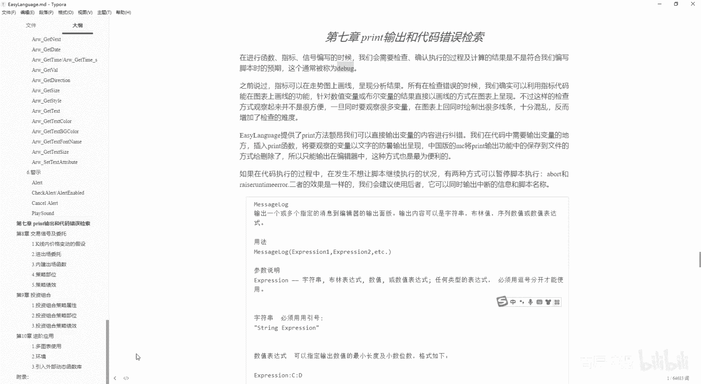

看这个画图的话，因为图是个感性的嘛，它并不能就是说让你很直观的，把数据给你显示出来，有些时候出现一个bug，它可能就是一个呃很小的差异，就比如说均线均线值的差异。

它可能就差这么几个点，你光看图，你除非是两个图进行对比，不然的话你是对比不出来的是吧，这个时候你最好是把中间的关键的，这个环节给输出出来，然后呢去进行一个比较，然后找到问题的所在。

这个就是去自纠错误或者叫做debug，这个是必须得学会的，不然你后边写代码会变得很麻烦，因为你不知道如何去检查错误，尤其是自己写的代码，自己去检查，有一些地方你就很很自然的就略过去了，你会认为他没有错。

所以说一个bug纠缠你两三天，都是一个很正常的情况，就包括咱们之前写的代码，如果说你自己去尝试去写的话，你也会发现，比如说咱们之前说的那个彩虹线，你去看它源码的时候。

你你这个就是你一天能把这个源码给捋清楚，就很不错了，尤其是刚接触这个代码的时候，我捋的时候也很费劲，尤其是它里边的一些内在逻辑，当你去写代码，去写逻辑的时候，其实比你看别人的逻辑要简单得多得多。

尤其是我之前也买过一些其他的，就是那时候刚开始学，就是MC的这个策略逻辑，去看他们的逻辑是很费劲很费劲的，但是你如果能看懂别人的逻辑，就说明你的这个代码功底也就可以了，你再自己去实现出来。

其实并不是很难的好吧，一定要去自己去写，然后学会自己纠错，你像这样的错误，有些错误会出现的很隐蔽，就比如说咱们如果说用一个数组，咱们之前学过数组嘛，去存储一些变量，去存储一些变量，然后去算它的均值。

像这个average，他有这个额外，你想去看一下他这个RY就是里边有PRICY，就是把你的数组传进去对吧，来把你的数组传进去，然后后边填个size，比如说我从这定义一个数组。

all right就是close a AR，然后定义一个，比如十嗯啊，然后零当你注意到我要计算的是，比如说十根线的，它的这个均线呃，你用它来写，但是你又想到它的索引是从零开始的，然后你写了个九。

就是从0~9对吧啊，从0~9就是十个嘛，然后你把close arrive这个名字写写过来了，写过来之后呢，然后你写了个九啊，然后编译肯定是没有问题，你用个变量再去接一下，比如说我Y61接一下啊。

然后再进行下面的操作，编译肯定是没有问题的，但是你看清楚了，就是他这个size，所有基于数组的引用都是从元素一开始的，那就这个零其实是不算的，他这个就是算了1~9的这个均值对吧。

这个有可能会忽略你像这样的bug，你靠看图，你可能知道这个问题的存在，因为你跟这个图画图这么一比较，你会发现不对，这个图不对，那问题出在哪了呢，你可能很容易就忽略你这个酒对吧，这个也是一个bug啊。

这个时候你就需要去输出啊，你就需要去输出去计算，然后去看哪一步出了问题啊，这就是检索的一个重要性，咱们之前呢都一直用print，其实咱们没有深入的去研究过这个print是吧，在跟print一样的呢。

还有个message log，就是这个你像这样的语句的代码，其实你如果以后接着去学Python，然后再往后再学这个C加加，你像这样的是很是经常会用到的，比如message log其实就是信息的日志。

它和print用法基本上是一样的，message log一样的从里边输出啊，咱们看一下它的这个里边输出的内容啊，就是就是可以一直用逗号往后一直去放，包括咱们这个之前也演示过是吧。

他这个current time这个五零就是什么意思啊，就是五就是代表你一共是输出五个字符是吧，然后零的话就是小数点保留呃，零是吧啊，它默认是保留两个字符是吧，默认是保留两个字符的。

这儿这个字符你一定要知道啊，并不是说我把这个字符给省略呃，或者是四舍五入了，并不是就是输出的时候他给四舍五入了，而并不是说它本身被四舍五入了，这个是个什么意思呢，比如说我value1，我等于比如说1。

32126啊，然后我啊message log，我里边输出的是value1是吧，然后我输出几个字符呢，比如说我输出四个字符，然后呢我小数点保留几位呢，我保留两位吧，这个然后进行一下编译，呃从这插入信号。

22，Close，咱们看一下输出，你会发现它是输出的是四个字符吧，因为这个小数点也算嘛，然后他是保留的是两位吧是吧，小数点保留两位，但是并不是说你value1变成了1。23。

如果说咱们再输出一个MESSA级message log，然后这value1，然后比上比如说我输出六个字符，然后我小数点保留几几位呢，保留四位，编译一下是吧，他也一样，就是1。2312就给输出了。

它并不是这个value1被四舍五入了，而是在你输出的时候，他给你规定了一个格式，这个print也是一样的，这个message log呢和print它的功能没有print强大，但是在咱们中国版的这个。

这两个也几乎可以做等号，咱们再看一下这个这个print print，它其实最大的功能啊，一个是正常的跟message log的功能似的，可以进行对外输出，另外呢它其实是可以保存到文件里边的。

你看print file，这个就是将它保存到这个C盘下面啊，咱们来演示一下这个代码，但是在中国版啊，这个代码就是这个是写不出来的啊，你也可以理解为他是被阉割了，被阉割了，为什么要阉割。

就是这个往外输出呢，我觉得你可以去想象啊，因为你输出你把所有的数据给输出到一个，尤其是这个历史数据，提个数据输出到一个这个文件里边，然后你再写代码去读取这个文件，其实你就获取到数据了嘛，对吧好这个编译。

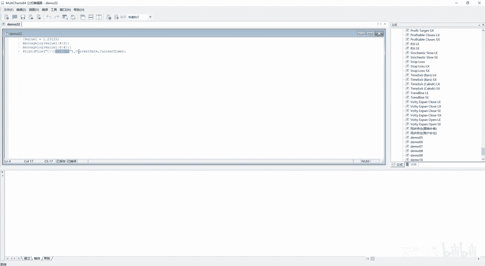

然后这也运行完了嘛，这是开启的状态。

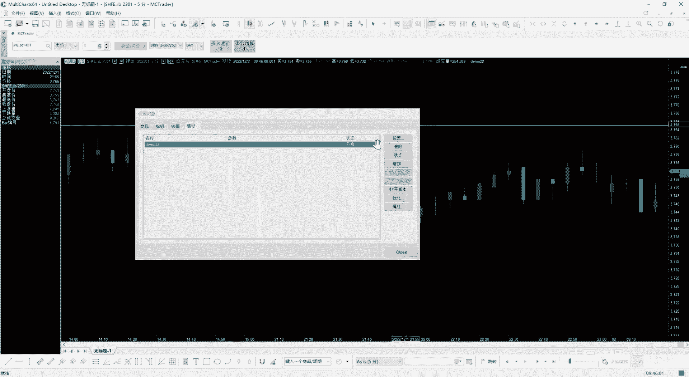

然后咱们去C盘下面去找一找嗯，你会发现没有啊，你会发现没有，这个你想是啊，21年的啊，没有它是输出不出来的。

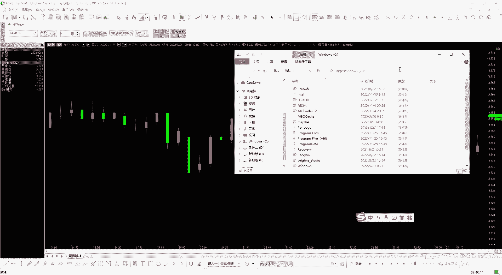

就是所以说从这，你基本上可以把print看成和这个message log是一样的，一样的，他别的还有什么呢，这输出到默认打印机，这个你可以试一下，你可以试一下，这个我没有做过这个操作，但是嗯你试一下吧。

好好吧，但是更多的这个print是做这个纠错用的，然后你一定要习惯这种冒号冒号啊，你一定要知道它其实就是就是这个print里边，然后给他规定了输出的这个格式啊，这个咱们之前讲过嘛，再给大家再演示一下吧。

这个print输出的格式，就是比如说我还是这个value1，然后我输出的，这个如果说我输出四位，然后加上小数点，其实整数和小数点就是两位了，然后这个我保留两位小数是正好的，但是如果说我只保留一位呢。

咱们看一下啊，只保留一位的话，他前面会用这个空格给你去去这个替代啊，这前面是有个空格的，咱们如果不那个什么，咱们可以输出一下这个value1看一下，就是他的对其创载是不一样的啊，我发现这是1。23。

它默认的前面是有几个空格的，但是你像这个咱们是保留的就是一个空格，这个1。2嘛啊，它默认的格式是不一样的啊，他这个输出正常的是前面应该是四个空格，就是一个tab键，然后但是你这给它规定好了之后啊。

他这个会给你默认是保留一个空格，如果说你输出十位啊，然后你还保留这个一个字符的话，呃一个小数位的话啊，你看它就会比它要留的要多对吧，你像咱们每回啊，这就是需要清除这个，其实咱们可以写个什么代码呢。

就是你在做测试的时候，咱们之前不是学过vans吗，vans这里边呢有个clear，就是debug，或者说是这个clear这个print log都可以啊，用哪个都可以。

你可以在每次一执行的时候就clear print log，就是把之前的给清除掉，比如说这有输出了是吧，然后我给他改变一下，然后还是保留四位啊，然后有一位空格，然后我并没有去清除它。

你看他自己给清除了是吧，自己给清除了啊，这个就是vs这个clear print log，就是输出的log是日志的意思，你也可以就是clear这个那个叫什么来着，就是debug都可以啊，都可以。

这个是VANCED的，它的这个运运用之前咱们都学过啊，print其实你需要注意的就是这些就是冒号，然后它可以无限的往后去续啊，另外呢还有一个是什么呢，就是如果说我你像这个我是写成两个了，就是它会换行啊。

他会换行，如果说我把它写到一起，想让它换行怎么来写，比如说我这因为它可以无限往后续嘛是吧，我做对比的时候，我想让它你要这样给输出出来的话，是是吧，是这样的，中间这个空格就只有一个空格嗯，就只有一个空格。

如果说你想要让它换行的话，你在一个print里边你怎么做呀，他有个叫new line，New line，这个时候它会自己去new line，就表示换行的意思啊是吧，它就自己来换行了啊。

这个new line是可以配合print或者message log去使用的，呃这个，这个就没什么太多好说的了，好吧，这个输出输入就是发送到这个默认打印机，你自己试一下吧，我就不给大家演示了。

下面这个clear debug和clear print log，咱们也提到了，然后这边有个about和这个rise runtime error，呃。

咱们先说这个rise runtime error这个错误啊，其实在C加加里边或者Python里边你会经常遇到的，就是当程序执行就是很多的错误都会来显示，这个rise呢其实是抛出的意意思。

error是错误，然后这个是表示的错误类型，wrong time啊，就是这个是表示的错误类型，在这个MC里边它有什么作用呢，嗯就是它可以就是当你比如说你发现这个代码，就是在运行过程中有不对的地方了。

你可以让它终止运行，而不是你手动来停，它主动会停，然后给抛出一个，就是弹出一个对话框，然后会伴随着那个叮那一声，就是它会自己来终止运行啊，这个怎么来写，比如说我if f，我这个是写着玩啊。

close大于open，就是我的收盘价大于开盘价了，than run呃，就是这个rise，I i see rest runtime error，然后这个括号里边可以写上元音，当然只能是英文的啊。

就是这个close大于open，然后把这个原因给它写上啊，然后你进行一下编译，然后就有了吧，我可以截图给大家看一下啊，然后我打开画图，就是他会这个是我刚才截屏的，他会指标错误啊，然后demo22。

当然我这个是信号了，他就是直接用指标就给代替了，然后是在哪个合约上啊，然后这边有我写的就是close大于open，它会自己把这个程序给中断掉，然后给你一个提示啊，这个就是它的作用，你说它能用在哪呢。

其实用的地方挺多的，比如说我这个代码，就是咱们这个代码是可以加密的，就是可以不给人看的，比如说我这个代码我给了就是加密了，然后不给别人看，然后那个他想去运行，我这里边又设置了什么呢，账户啊是吧。

是不是我那个账户，当然这个后边咱们会给大家说这个获取，如何去获取账户，账户名和我设置就是在代码内，就是设定的账户名不一样，然后我就让它运行不起来，抛出一个异常，或者说当我出现一些极端情况的时候。

比如我是日内的策略，我去抛出一个异异常，就是这个Rest runtime error，就可以中断你的这个代码运行，咱们也看，也可以看一下他的这个解释啊，就是会中断公式的执行嘛，啊弹出这个警示的这个讯息。

就是你往后写填了什么，它就会弹出这个会带着，但是会告诉你是哪个指标，在什么合约上还是比较清楚的，然后另外还有个这个about about呢，和它的用法基本上是一致的，但是唯一的区别就是。

它没有后边这个提示信息啊，就是我把它复制一下，然后同样的我用about，About about，它后边是没有参数的，他后边是没有参数的，所以说它是提供不了，就是具体的这个原因的。

这个时候我再进行一下编译，它会也会诶。

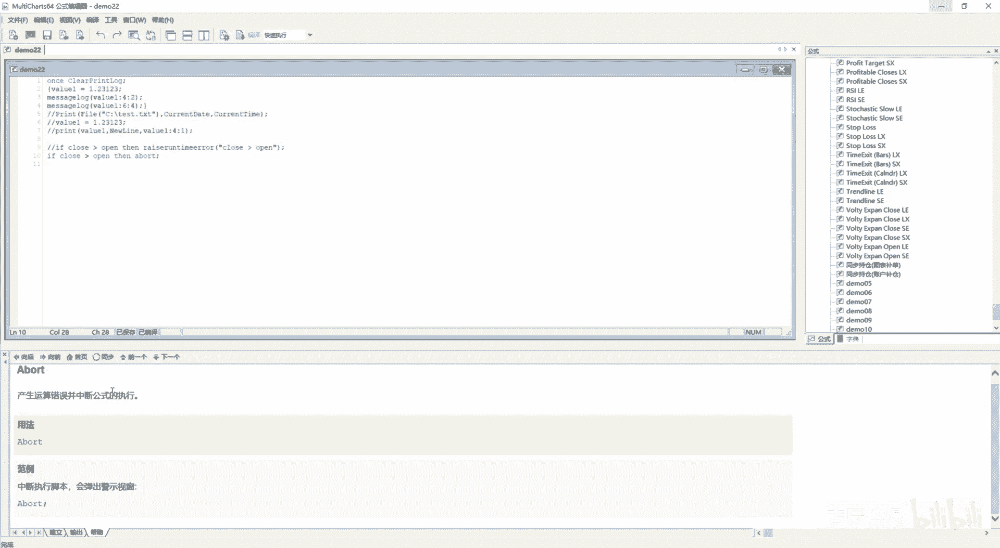

好这儿，因为它出问题之后。

它会自动的把它给关闭掉，然后我把他状态再开启，然后一样的啊。

叮一声，然后我再截个图，然后画图嗯。

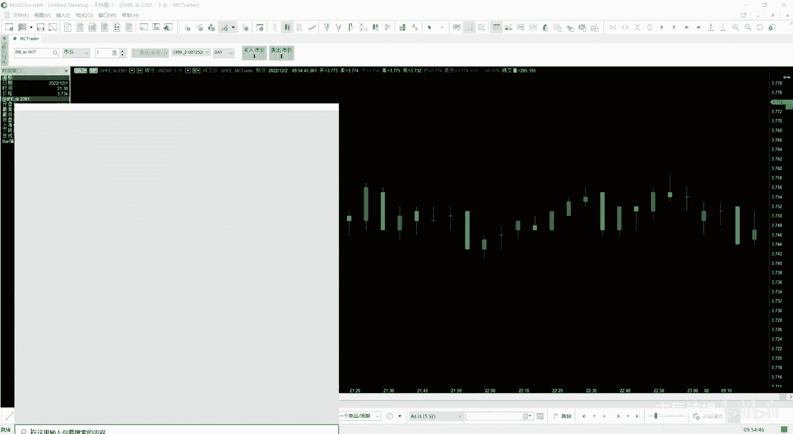

粘贴一下，你会发现它的这个同样的有是哪个指标，包括他是在哪个商品上面的，哎，怎么还是这个close大于open呢。

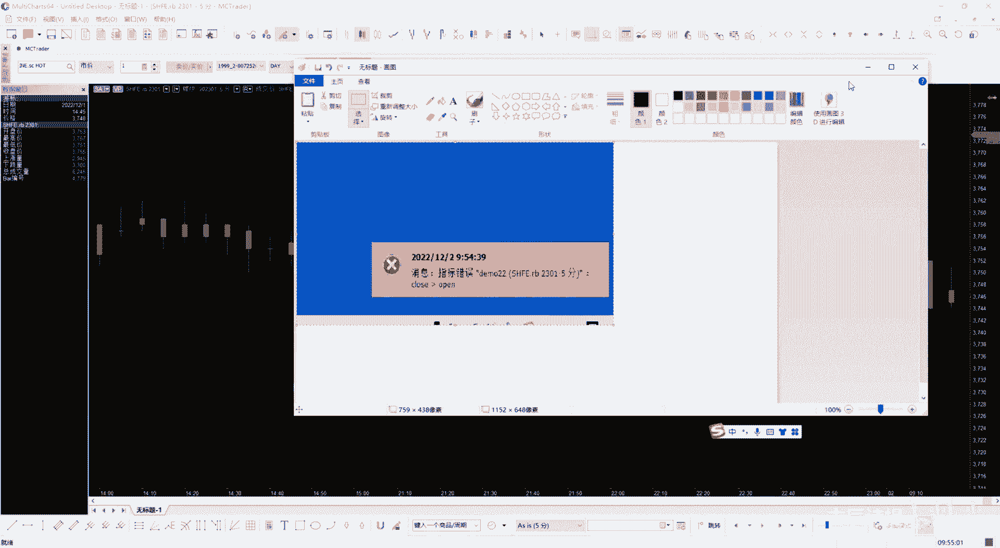

我是那没写对吗，about close大于open，Then about，我把它then boif close大于open，If open a close，小于open吧，好我进行一下编译。

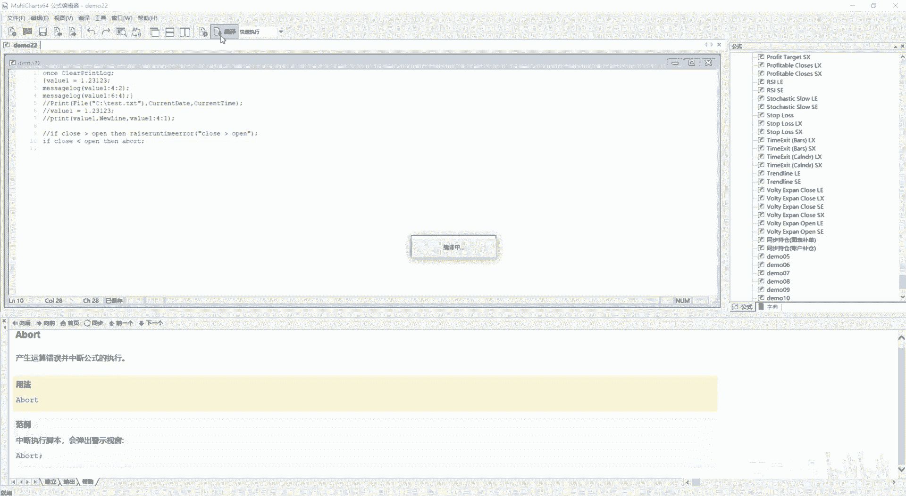

然后我再进行一下运行，设置信号状态好。

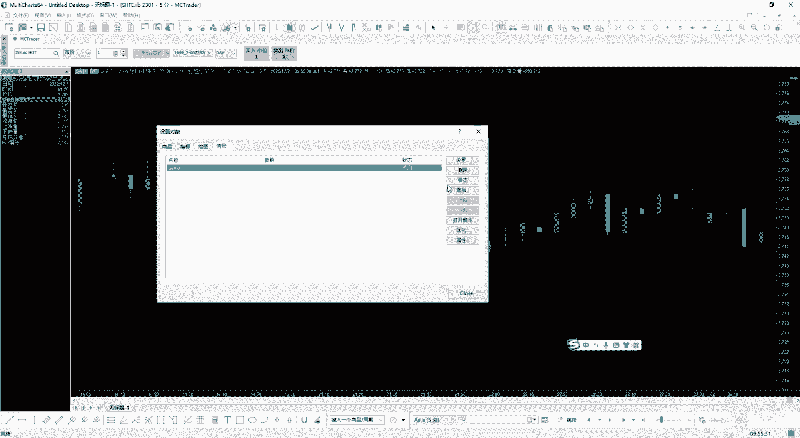

啊它还是这个显示的是close大于open。

close大于open，它这个你看它显示还是显示close大于open，我后边并没有写什么，我觉得他是之前的这个什么。

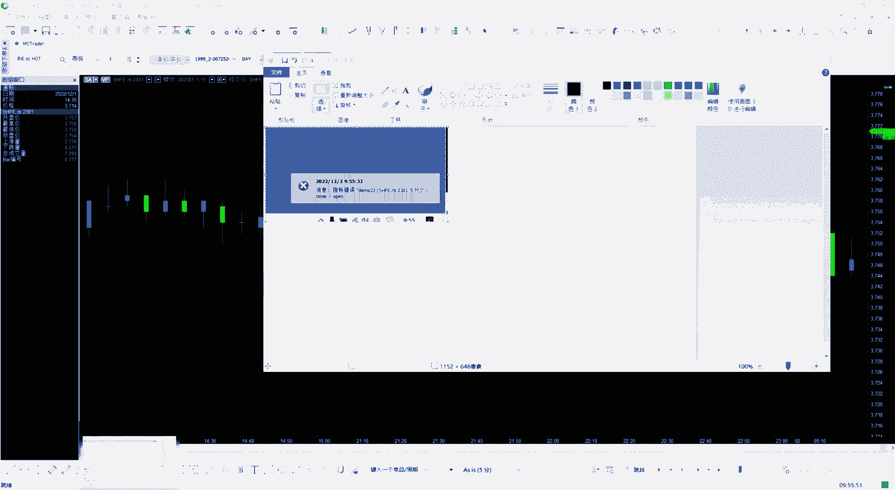

就是在运行的时候一直读取，我之前的这个就是Rest run time error了吧。

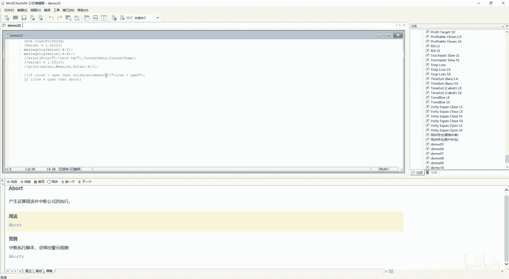

我我给它重新设置一个，先把它删了。

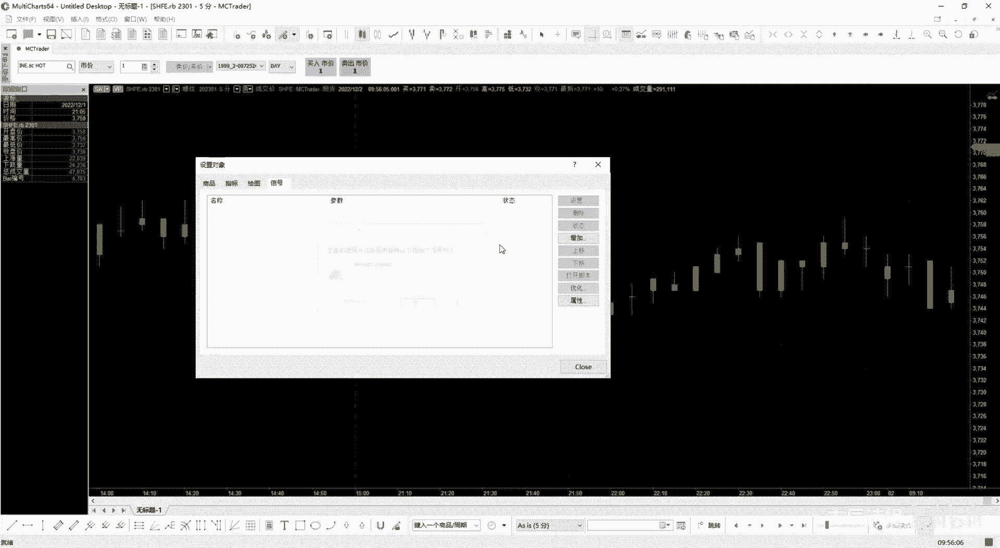

然后我重新设置一个商品二比000吧。

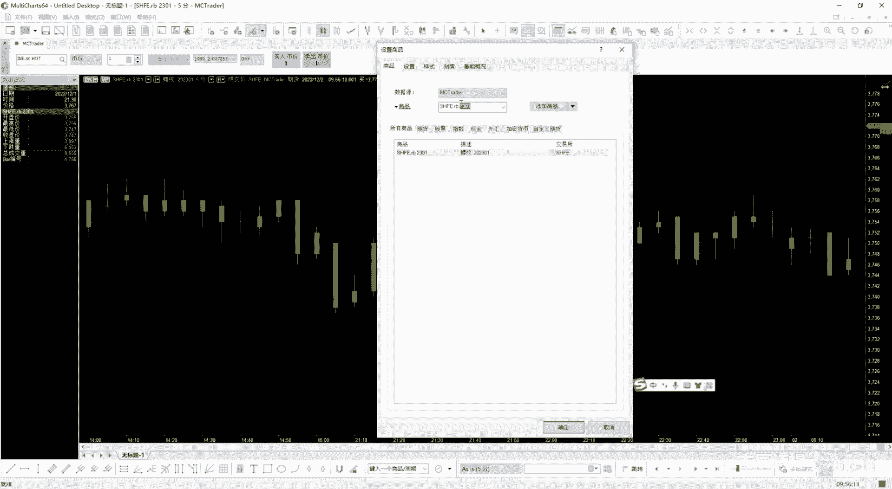

然后我再给它。

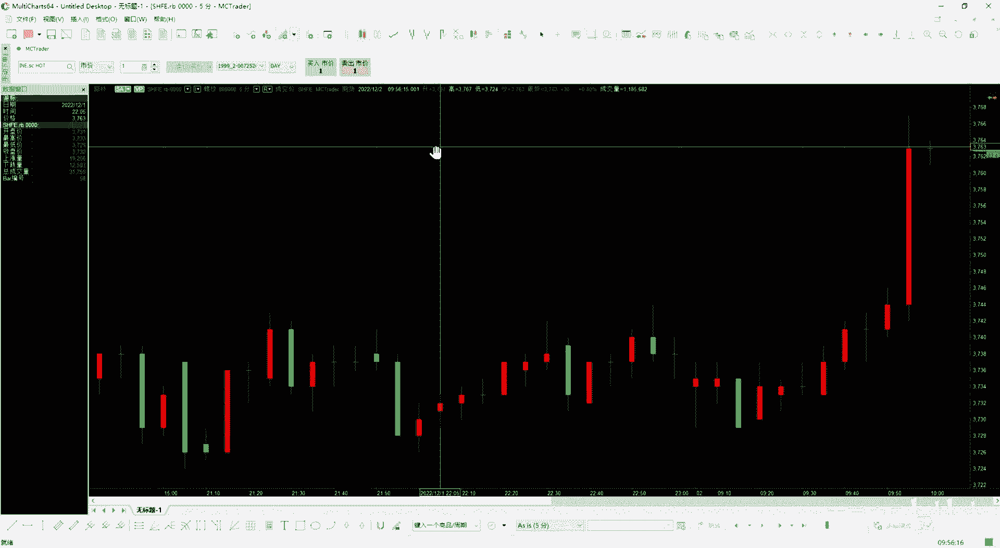

插入信号，Demon22。

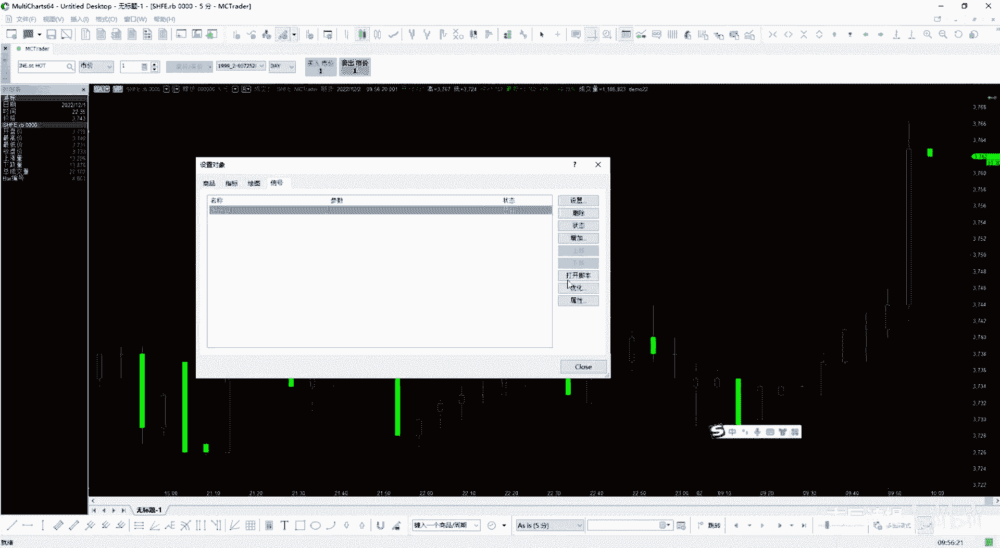

开启close。

他还是close打游en，他这个用about，你看他这个就出现问题了，就是它显示的不对，他还是RB2301杠5分钟。

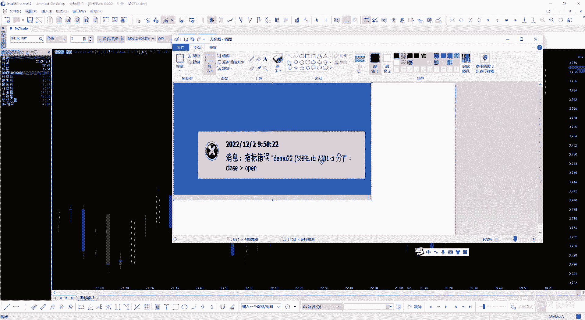

但是我这个已经是000了啊。

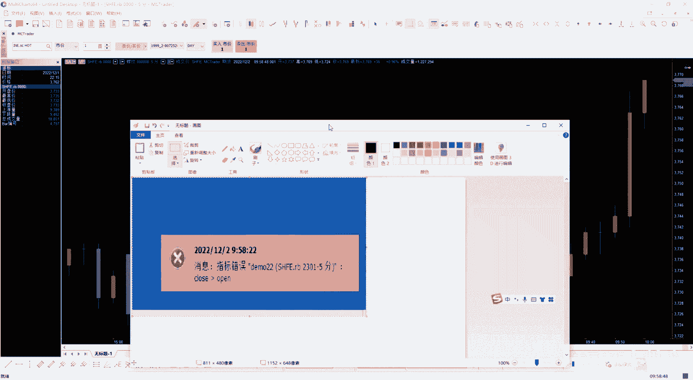

所以说这个bot它获取的还是我之前写的，这个就是这个代码对吧，之前写的，我刚才又试又试了试，就是把他这个删了，应该是需要重启一下。

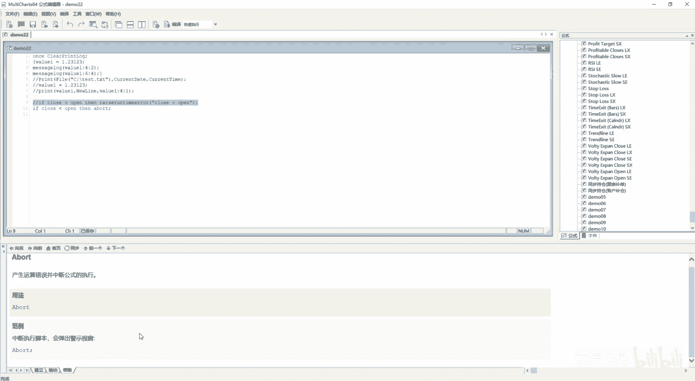

或者说是呃，就是他应该这个缓存里边存了。

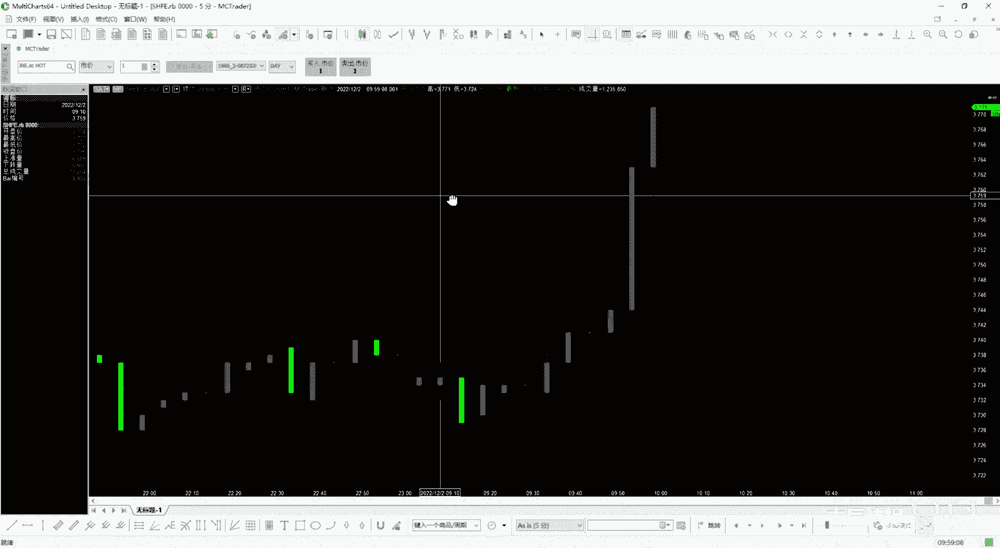

你之前的这个问题的情况，所以说他就直，他就直接就是说获取了这个你的这个错误内容，但是他是有问题的呃，我之前就是自己在测的时候，他这应该是一个叫呃unknown error，就是不知道是什么原因的错误。

不知道是什么原因，错误，可能是在它这个内存里边存了，我之前的这个错误，然后他就自动去调取他这个错误了啊，所以说这个about呢，呃虽然能起到这个中断运行它的这个作用，而且还能给你提示。

但是它这个提示可能会有问题，所以说你谨慎的去用它啊，一般都建议用这个Rest run time error啊，Rest rtime error，但是如果说我这个时候我用这个。

Rest rtime error的话，我给它改个名字，啊我就是就是，呃用这样行吗，也不太好，我就用直接还是两个小于两个大于。

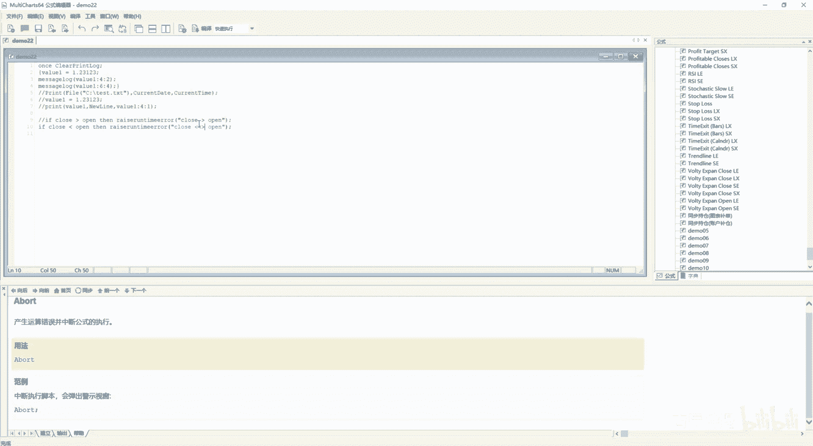

这样我再进行一下编译啊，然后我设置一下信号状态。

S啊。

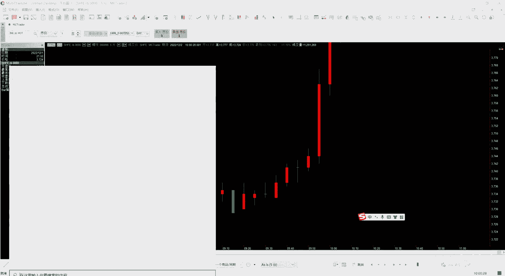

然后我再用画图这样过来，你会发现它就变了对吧。

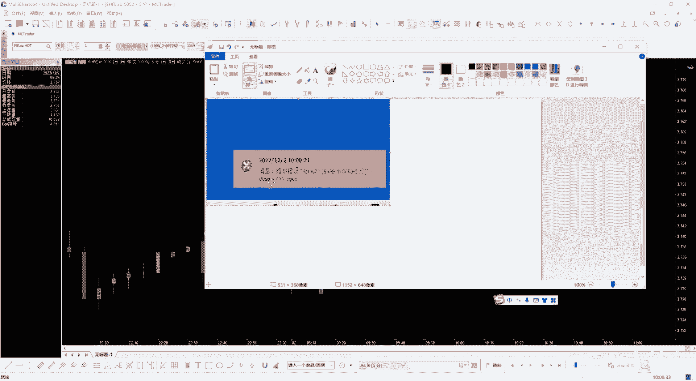

但是你用这个about就容易出问题啊。

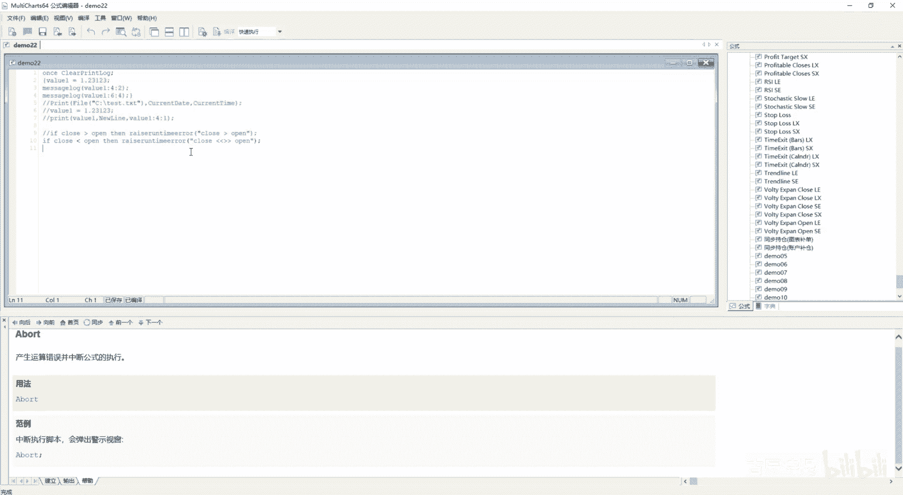

容易出问题。