# 第22节课 在同一根K线中实现反手开仓 - P1 - 古辰诗提 - BV1FJ4m1p7yg

欢迎大家来到从零开始量化系列课程，VMPI课程的第22节课，上一节课咱们最后说了，这如何去把这个数据汇总起来，得到咱们想要的东西，你再回头看那个VNPY里边的，它是通过每天呃这个开盘和最后的收盘。

然后来判定，就是它的这个，比如说这个一共有多少个盈利的交易日啊，有多少个亏损的交易日啊，来这么统计的，这个其实就是思路的不一样了，你可以根据自己的需求和，或者说根据你自己的习惯。

或者说是根据你自己看中的，一些指标去进行计算，这些你都能够去完成，很多老板们说这个我想做一些模块的变化，做模块的变化之前，你得知道这些模块的内容是什么，我相信啊。

如果说你从一开始从invent engine一直到现在，你能自己写出这个my btesting的话，呃，这个VNPY里边很多的东西，你都能自己能看明白了，其实并不复杂，只要你一步一步的去把它拆解开来。

然后根据你的思路再去把它合并上，并不复杂啊，比如说咱们如果就是咱们之前一直提出来。

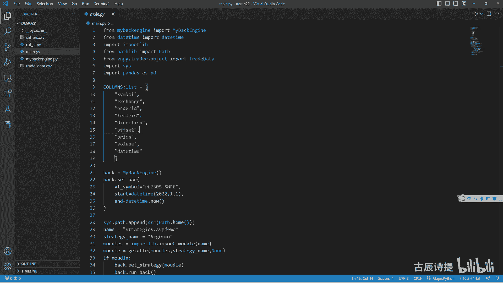

这个问题，就是在成交记录这一块。

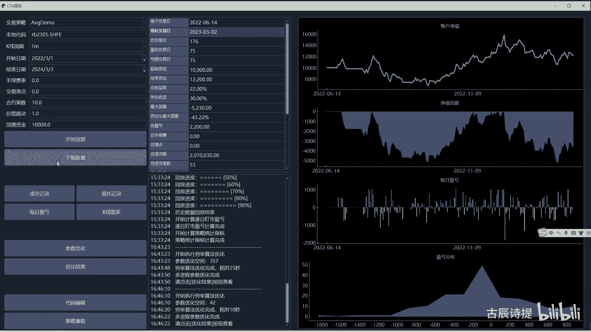

他的这个开仓总是会在9。9。01分。

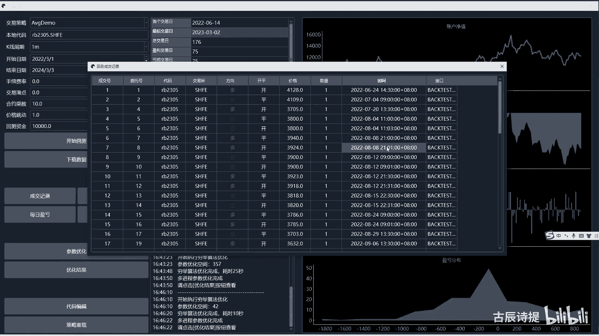

这个反手是不对的啊，但是呢你把它写在一起，先SL后by或者先这个sell后，这个呃short就是它也会出现问题。

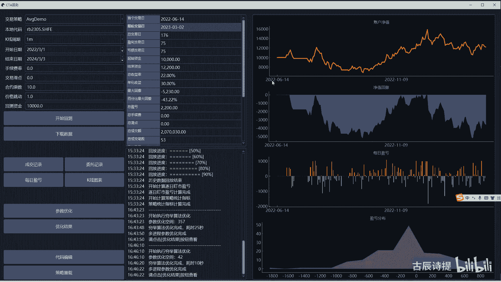

跟咱们的这个实际成交就不一样了对吧，那这个问题怎么解决呢，其实也相对很容易是吧，但是这个呢咱们需要改很多的东西，比如说我从这我新建一个mu mu，你需要改什么东西呢，首先咱们这个呃从最顶层来说。

咱们这个策略是不是得改，另外呢你策略改的时候，你得知道你的逻辑是什么，其实我只需要把这个委托单，进行一下标识就可以了，标识它就是说他的这个有一个逻辑顺序呃，当然这个你想把它写完善了，你还得自己去考量呃。

我就就就是简单来写啊，就是怎么说，比如说我一个委托单发出发出去了，比如说我先评多单是吧，这个委托单它会有一个VT的id啊，这是一个列表是吧，那我把这个列表呢添加到我下一个，因为我拼多单，我要开空仓嘛。

我就是要short嘛，就是给给这个小区的委托单加一个标记，这个标记你可以随便起个名字，就是它前面的委托单是这个微调的啊，是这个委托代，你得等到他这个委托单成交之后，你再去来测试。

你的这个就是就是这个shirt的委托单，这样就有个先后顺序了嘛，当然只是针对那个策略啊，你要写完善了的话，你还得自己去写，那根据这个逻辑，是不是咱们就可以去改变一些东西。

就是比如说在这个c t a template里边呃，就是说咱们是不是需要把它改一下啊，From v m p y b m p y ccta strange their template。

import c t a啊，Template，我从这儿呢我新建一个template，建PLATTEMPDPY，咱们不改变它这个底层的，就是说维纳它自带的东西啊，诶CTRLC一下啊。

我在这个template里边，我给它放进去，然后我就把这个原本的这个template给关掉啊，给关掉，然后这个里边呢我往右拆分一下，然后去改变它的一些东西，比如说这个导包点。

bases stop order呃，这个engine type咱们应该是去VMPY下划线CCTA，我都删了啊，c t a strange呃，点贝斯吧，没有这个下划线啊，就这个点base导入它就行了。

后边还有什么吗，后面就没有了吧，这个c t a single和这个咱们先不要啊，因为用不上好，我先把它给删掉，那咱们需要改变的，就是在他这个发生委托的时候，就是by c就是c cover是吧。

比如说因为在回测的时候，咱们这个net是用不到的，那我就把它改了吧，我这个net呢呃这个我就把它改成这个啊，SRSR就是一个关联啊，然后呢比如写一个太平。

这边是一个optional好TOPTIONALSTR，我就不用列表了啊，我就用这个直接用这个VT2大D啊，用VTL大D，因为咱们在回车的时候，其实反过来的都是一都是一个这个VTR的id嘛。

你如果说是limit单的话，它会返回来这个limit12345是吧，如果说你是stop，但它会返回来呃，这个stop12345，那咱们就把它全改成，就是说只是一个STR或者是一个NN值。

这个optional是代表NN，或者说你这里边放的这个值，然后到SORDER这我就把它改成CR，然后SL是一样的，我把这个复制一份，cl这咱们也把它改掉，然后co2short也是。

C2很多时候你得勇敢的去改，不不你不要怕出错，不要觉得就是改了能怎么样，就是改了，咱们再就是你复制一份改了，大不了我就把它给作废掉嘛是吧，我这个return呢就是我不旅程这个列表了，我是旅程一个浪值。

然后我这个V调大D呢，我就把它标识一下，返回V调大D，然后把这个CORR给他放过去啊，然后这边我也写上啊，把COR给他放过去，然后这个是不是其实在这个c t template。

就是在这个template里面，咱们就改完了。

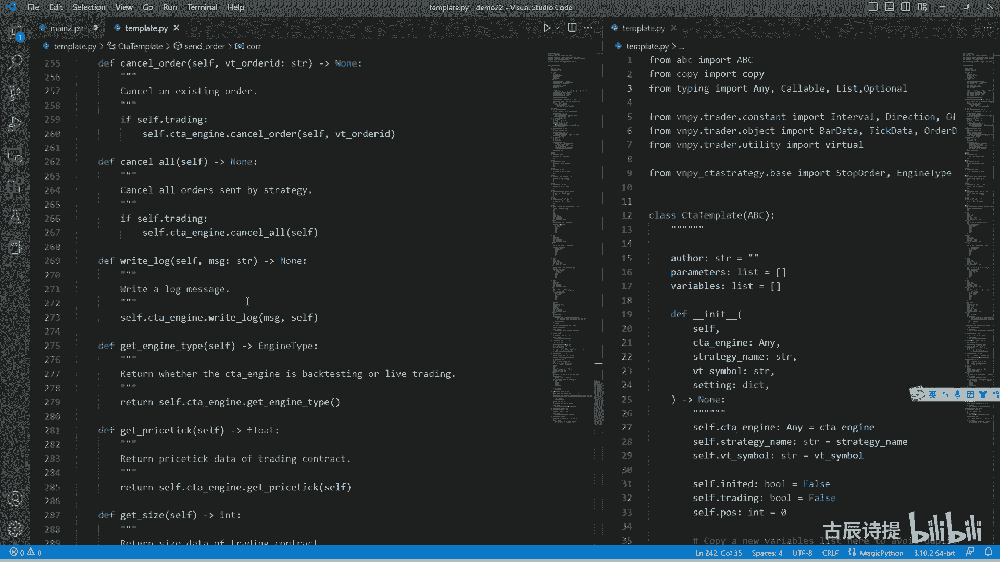

那他们类的改完之后，咱们就需要改一下那个策略，策略是在咱们这个C盘下面，用户的MINISTRATOR，然后那个strangers这个里边是吧。

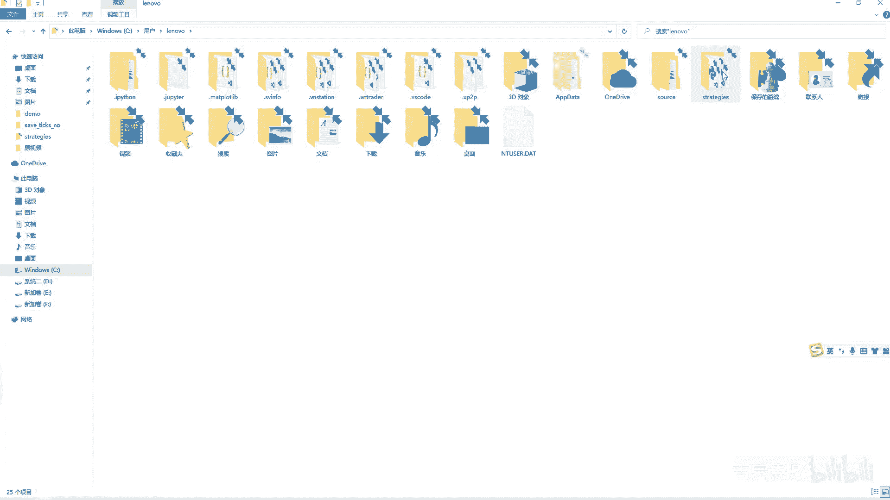

我把它复制一份给粘过来啊，这个a b g demo好。

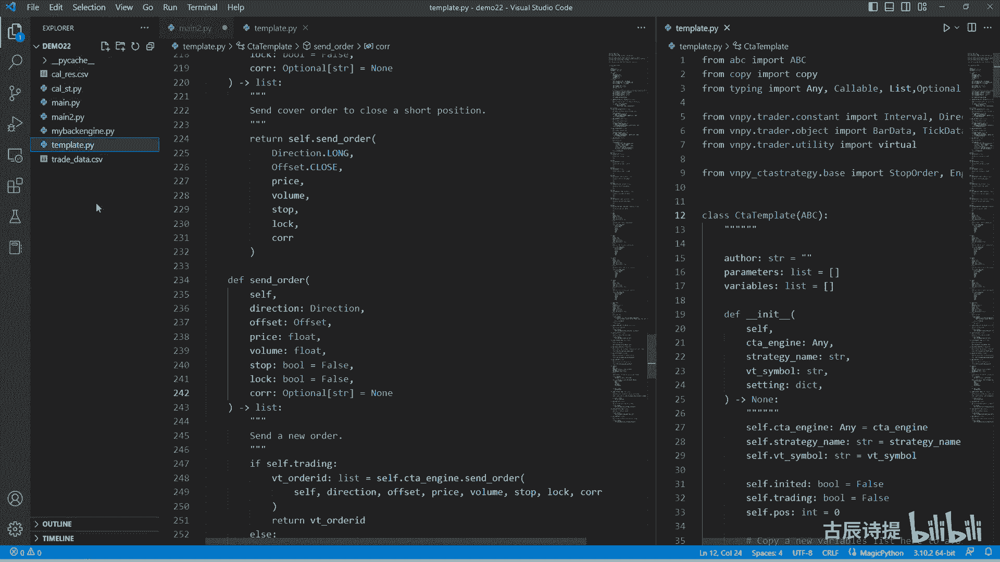

诶转不过来啊。

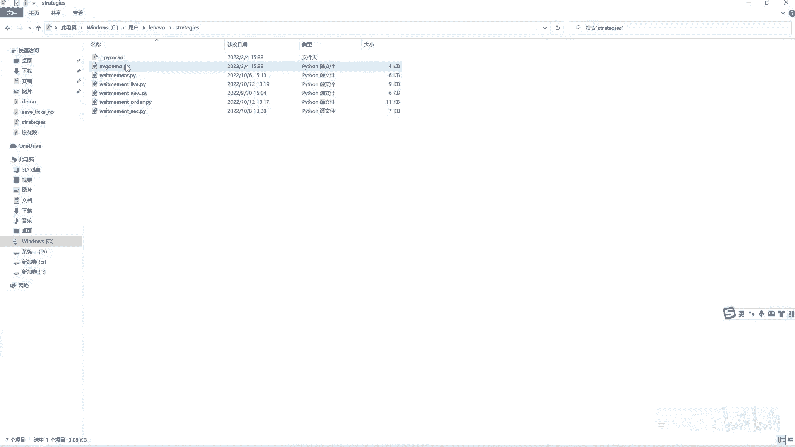

我打开吧，Ctrl a ctrl c，然后我新建一个呃ABGMPY把它给粘过来，给粘过来，然后我把这个demo给关掉，然后这个里边你首先要改的第一个是什么呀，就是这个c t template。

我就是从template里面直接导入就行了，我就不用去那个底层，我就导入的是我这个tablet，那他在就是说去发送委托的时候，我就可以这么写是吧，我这on trade就直接就pass掉啊。

然后前面的这个这个我也不需要了，那在这只要是啊就是可以的话，我就拜拜这个八点close price，然后这个self fixed size啊，用这个限价单，然后这边呢是如果小于零的话。

就直接cover cover，然后这里边呢是八点close price，然后呢就是说abs cf点pose，最后咱们用这个停滞单啊，用停滞单，然后这边呢它有一个VTO的ID，去过来接收一下啊。

这个是个STR类型的，接收到了之后呢，如果说啊咱们加一起就是加一个判定啊，if v t o的ADVTADO的AD，然后咱们就cf点by啊，一样的，我把这个给粘过来，然后把这个CORCR给它复制成这个。

VTO的id，是不是就可以了，就这个委托单它多了一个CR就是它的一个关联，就是标注了是我，我是得在这个VTOID后边我才能去进行，就是说撮合能理解这个意思吗，当然你可以把它做严谨一点。

你可以在object里边给它新建一个，就是说这个数啊，数据类别，数据类型，就比如说啊你这个数据类型里面，比如CORR这个数据类型里边。

你有一个这个这个c o r type type t v IP type，呃，这个里边呢你可以呢呃呃给他规定几个枚举值，比如说是NN值啊，NN值就是说没有啊是吧，它默认一般都是N值。

如果说呃比如说你呃规定一个only，only是什么意思呢，你可以就是说呃咱们可能有时候会碰到啊，就是说你你在发委托的时候，一个是就是说是你的这个技术指标的出场啊，比如说他是在一个价格。

比如说363066，然后呢是你的一个固定的止止损，比如说他是在3056啊，这两个挨着相对近一点呃，同时一根K线呢同时满足了这个价格，你就可能去发出两个委托单来，那是不是我就可以把这两个委托单同时标注。

就是有一个only值，就是但凡我有一个委托成交了，那另外一个委托呃，就是就是就可以去撤去撤掉了，就是我标注它是功力值的话，就是说其他的委托就去直接会给撤掉，是不是这样的逻辑也是可以的是吧，包括你可以啊。

back是吧，就是就是他是在就是说呃，其他的一些这个委托单之后的，包括front f r o n t啊，他是在其他的一些委呃一些委托单之前的，他对着的这个其他的委托单，比如说我这写一个那个VTOID啊。

V t o i d，然后它是一个就是fir的类型，然后默认它是个list是吧，然后这个里边你可以给它去进行添加，它所有的对比都是相较于下面的一个列表，不管是在就是only，也是相对于下面一个一个列表。

只要是我这个委托成交了，里边列表的所有的委托都得全部给撤销掉，是不是包括这个back，比如说我在这个委托之后啊，委托之后就是这列表为空的时候，我才能进行撮合，包括front啊。

我在这个呃就是所有的委托列表之前是吧，我成交了后边的这些列表才能进行撮合，是不是这样就可以啊，这样的整个的逻辑是不是就通畅了是吧，你可以自己去尝试着去写啊，当然里边需要反复的改。

你那个就是my back engine，因为这里面涉及到很多逻辑上的问题，我讲这个呢就是我写的再多，那也是我写的，你必须得自己能写出来，这些，你才能就是随心所欲地去完成，你自己想要的回撤，是不是啊。

那咱们就给大家做一个最简单的演示，我从这儿拜了啊，我添加一个关联，默认的是在这个video i d之后的啊，默认是在它之后的好，我改一下下面设置啊，这个八点close price。

然后cf点fixed size也是用这个停滞单，然后这个sale sale呢也是啊，就是啊八点close price，然后volume是abs cf点pose是吧，abs cf点pose。

然后用这个停止单啊，用停止单，然后它会返回未来一个VTOID，我的id等于啊，然后如果说一位调到id啊，1VTO的id就可以啊，C sht，然后这个里边我把这个上面给它粘过去，但是你别忘了。

他需要一个CORRR等于这个VTO的id啊，然后把这个新的order self给它给删掉，就就不需要了啊，就不需要了，这样的话代码就变得简洁了，对吧啊，代码就变得简洁了。

然后他通过这个template sorder，然后发到了咱们这个底层，底层其实就是咱们写的这个my btesting engine是吧，然后你所需要改的就是SORDER这一块，Sorder。

你这接收到的是不是这个啊，就是A啊，不是已经不是了是吧，C o r r，然后它是一个optional，里边是一个STR类型的啊，是不是发到这啊，发到这儿咱们看一下啊，发到这儿咱们看一下。

首先是price进行，就是这个run to一下是吧，然后委托方式的一个判定，那咱们是不是从这儿呢，可以给它添加一个就是if c o22啊，如果说有这个co2的话，我先别让他去这个撮合呢啊，你不从这儿呃。

咱们从下面也行啊，从这个具体的这个里边去进行操作也行，也可以的啊，也可以的，从里面进行操作，比如说咱们先到了这个slimit order，但是我必须得把CR给传过去啊，COR给传过去，COR给传过去啊。

CR等于CR好，CR等于CR必须把它给传过去，那咱们到到这个slimit order，这，我把这个这个给他给加过来啊，给他给加过来，其实这很简单是吧，就是创建一个order data，那我添加的时候呢。

呃你像这个limit order，是每次这个新的这个八线来了之后，它就会进行撮合，那我如果说他没有啊，if not server就是它没有关联度的话，我就直接让它添加进去了，如果说有关联度的话。

else那我就新建一个啊，我从这我新建一个，就是这个cf点c o r r orders啊，它是一个addict，Addict，里边它有什么呢，有什么呢，就是key肯定是STR类型的。

但这个value呢它可能是order data，也有可能是什么呀，也有可能是这个stop order是吧，就是我把它放在一个里面，是不是它有可能是O的data，有可能是是这个stop order啊。

Stop order，然后我等于一个addict，但是你从这儿呢，因为它有可能是order data，有可能是这个stop order，它提示类型里面呢它会有一个叫union啊。

union咱们在前面给他写一个union，就是它有可能是order data，有可能是stop order data啊，好然后呢如果说它有关联性的，我先把它添加进我的这个COR这个orders。

这个里边怎么添加，用什么添加呢，咱们就用COR，也就是它关联的那个VTODAD啊，直接等于这个这个order是吧，直接等于这个order啊，直接等于这个order，这是limit order。

是不是就是如果说没有COR没有关联性，就直接可以去进行撮合了，如果有关联性，因为我这个是默认后置是吧，就是得在这个CORR这个委托他成交之后，我才能就是成交我这个order了，所以说我再去呃。

就是撮合的时候，我看看这个order是不是和COR一样，如果说是是COR一样，然后他被撮合了，是不是我就可以撮合他，就是说这个下面的这个order了对吧，其实不复杂吧。

是不是好sa stop order，咱们也是一样的，这边呢你要传入一个SR啊，然后在最后的这个添加这添加，这咱们需要去给它呃进行判定一下，If not you are，如果说没有这个CORR的话。

他直接可以去进行撮合了，如果说有这个COR的话，我cf点cr orders，然后这个CR我就等于这个stop word啊，stop order你记住了啊，你这个C点c o r orders。

这个里边它有可能是stop order，有可能是这个呃这个普通的这个limit old是吧，好，那下一步咱们就应该去看，就是呃就是就是去进行撮合了吧是吧，撮合是在是在下面吧，撮合啊。

就是class limit order和class stop order class列啊，咱们先看这个啊，class limit是不是这个class limit order。

他到最后就是在再把这个什么给pop掉的，就是前面你不用去管它是吧，它正常的进行撮合就可以了，正常的进行撮合，你最后是不是得需要一个判断一，这个因为它是limit order order，点VTO的id。

因cf点they are orders kids，什么意思，就是如果说你这个委托是在我这个CORR，orders这个kiss这个里边啊，是在我这个sr orders这个kiss这个里边。

我是不是就应该去让他后边的，就是他这个value这个委托，去进行撮合和成交了是吧，那我从这我单独写一个啊，就是，c o r o order吧，然后呢我需要传入。

是不是这个VT大D我得传v t order i d，我得我得给他传过来呀是吧，后面还需要传什么，咱们暂时不知道呢啊，一会儿咱们写的时候咱们再说是吧，那我就直接可以啊。

cf点cos这个CR这个order了，然后把这个order点VTO的AD给他传过去，就是你有这个判定，那就说明我这个cf点COR这个orders，这个kids里面肯定是有这个order点微调大D的。

是不是，那我首先是把这个order先给找出来，是不是这个order，比如说order我不知道他是stop down还是limit，我先写个NO or NO啊，等于这个cf点这个COORDERS点pop。

然后把这个key就是VT的啊，给它放进去，这个是什么意思，即从这里边把它给删除了，然后我又获取到了这个order，但是它有可能是limit order，也有可能是stop order，对不对。

那如果说是limit order或者是stop order，咱们再如何进行处理呢，是不是咱们可以怎么做呀，就是if啊，这个order NO它如果是is instance，知道这个吧，它是属于哪个类啊。

它是属于哪个类，如果说这个order NO它是属于这个order data，那就说明他是一个LIMA维多大，是不是如果它是属于这个里边的话啊，就是这个is instance，大家应该会经常用到的啊。

一个object后边是是这个class或者top啊，就是你要么是个类，你要么是个元组啊，这个里边放元组，里面也可以放这个多个这个呃类啊，嗯这个会经常用到的啊，Is instance。

如果他是这个order data，那说明他是这个LIMITORY脱单，是不是，那我是不是可以set limit orders，然后用这个order NO点这个VTOID，然后等于这个order NO。

然后我给他放到这个呃limit orders这个里边，然后呢我再让他去cf点cos这个limit order，这个当然得把把线给传过去，所以说我后面得接受一个半线啊，把线bar d，然后我在传的时候。

我把这个伴儿给它给传过去啊，然后我把这个伴给它过去，能理解这个意思吗，就是我在让他去close一下这个limit order，因为你本身在这里边撮合的那个limit order，已经被pop掉了。

然后呢，我又把我的这个后置的这个order给他放进去了，然后他再撮合一下，原本因为这俩八仙是一样的吗，是不是你你像这个八仙，就是就是当时撮合这的这个拔线，然后我再给他返回，再给他，让他去执行一遍啊。

这个逻辑逻辑很简单啊，只不过是少写了一部分代码是吧，同样的，那我就是AEF就是is instance这个order NO啊，这个stop order stop order。

然后cf点stop orders，这个order NO点VTOID啊，不是VTOLID了啊，是这个stop o d，因为VTOLD里边是存放着的，咱们之前反复在说是存放着的。

这个stop的转成limit order，然后limit order呃，它生成的这个O这个AUD啊，然后把这个OD，存放到这个stop的这个VTD里边啊，你从这你得用这个stop id啊。

等于这个order NO，然后shift再process一下这个stop order，再重新让他去执行一遍，是不是啊，这个逻辑捋一捋啊，那咱们这个stop order，这是不是后边还得给他去去进行一下。

这个什么呀，就是cf点啊，if这个stop order，我往下面写一下啊，if stop order啊，点这个CORRCOR哈啊，这个CR咱们没有在这个它的这个数据类型里面，去进行添加对吧，就是在这个。

进行添加，想差了啊，就是if stop order，点这个stop order id，COR这个orders kids对吧，然后那个cf点cos啊，这个这个c o r r order。

然后把这个stop order点stop order id给他，然后把这个把线给他，是不是就可以了，从这儿呢咱们得说一下这个返回值啊，返回值就是你return的是limit order。

return的是stop order，咱们再返回的时候，就返回一个单独的一个STR就可以了啊，Send stop order，这样的话咱们方便操作，你要是说返回一个列，返回一个列表的话。

可能会更麻烦一些，这更多的给大家是做这个演示啊，是做这个演示，那这样是不是就可以了，对不对，这样是不是就可以是可以了，只不过只只不过是我跟他相关联的这个委托，我再重新再去再去执行一遍。

那个当时发现的这个撮合就可以了，对不对啊，那这个时候我是不是就可以去进行一下啊，回测的演示了，我把这个man Ctrl c Ctrl c，然后我把它放到这个man2里边来啊，面二里边来。

那我这个里边导包，我这个就是就是这个我的这个策略，我这个IP g demo，我是不是就可以直接从这就是进行导入了呀，from avg demo import这个avg demo是不是就可以啊。

是不是就可以了，然后呢我把这个改一下，我这我就不需要去进行，就是导包了吧啊就不需要去进行导包了，我这个model也也不用了吧，是不是我就从这儿这样，然后我把这个this strange。

就把这个a b g demo给它给传进去，是不是就可以了啊，因为它里边传的是一个SPCLASS，对啊，然后我再去回测一下，我把这个保存一下，这个尤其是这个try data啊，这个结果呢咱们就把它给可以。

直接哎呀，我也给它重命名一下吧，rename一下，然后就是一这个我也rename一下呃，小火线一，咱们看一下啊，它有没有什么问题，好去执行一下这个代码，啊好有了吧。

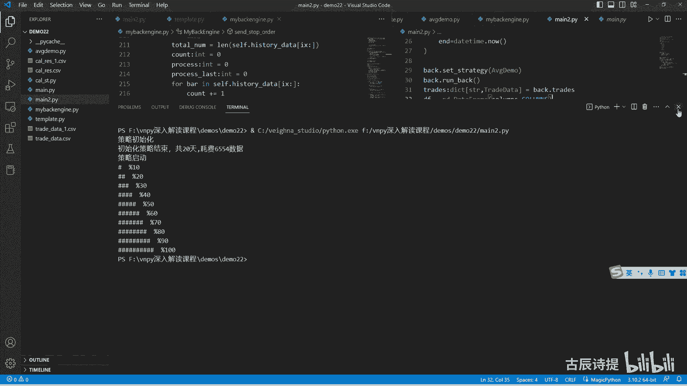

那咱们这个时候呢打开这个try data啊，就是在这个深入解读课程这个demo里面demo22，然后他这个是我刚生成出来的这个trad啊，咱们先看一下，对不对啊，他有没有什么问题啊，54笔啊。

加上前面一笔是55比，它跟咱们之前回测的他这个穿着D1，它数据有增加了吧，是不是数是不是数据又又增加了啊，这个之前的这个try的data1，它是应该是53比是吧。

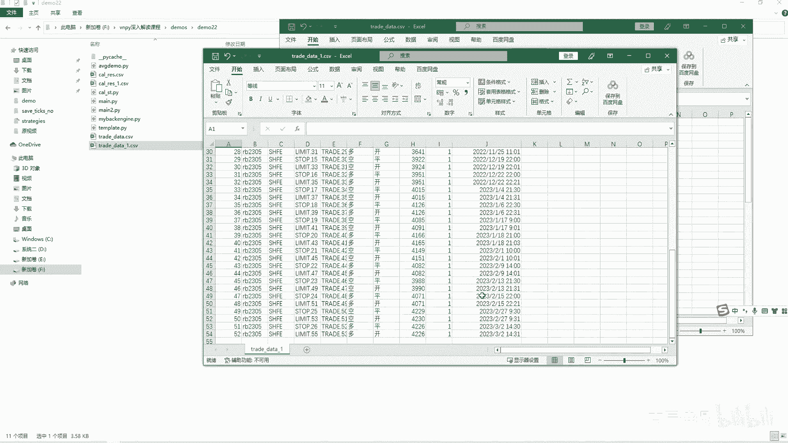

是不是和这个上面是一样的，这儿的这个成交记录它也是53比。

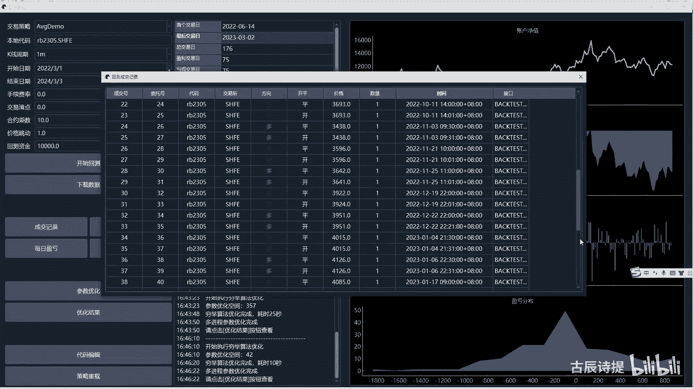

那我就拿着这个，因为两个excel不是特别好看啊，我就直接拿新生成的这个，我来跟这个就是维纳这做一下对比啊。

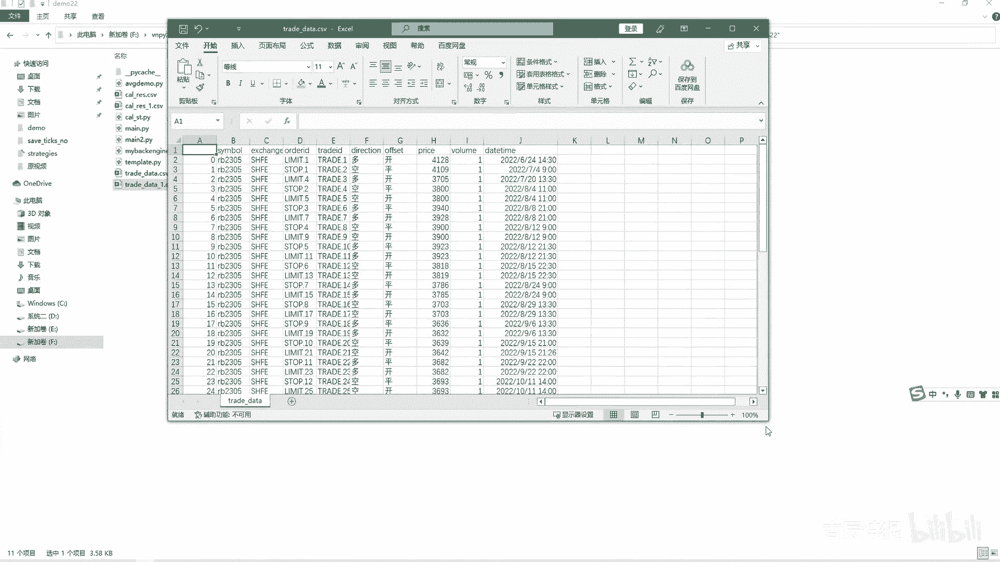

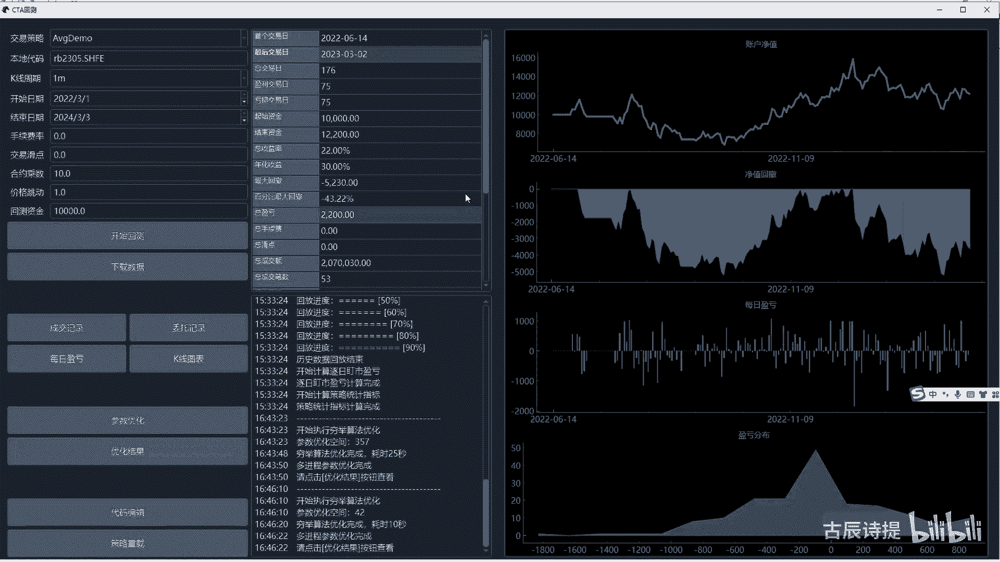

成交记录，然后我把这个打开，咱们可以看一下啊，咱们可以看一下啊，你会发现他第一笔交易是这个啊，这个6月24号吧，这是第一笔交易吧，6月24号对的吧，然后呢第二笔交易是九点对了吧，第三笔交易是13。

10呃，30也对的吧，第四笔交易是11点，然后你看啊这个11点这个也变成11点了，但是这是11点，这是11。03，这个是因为什么，因为咱们发送的委托是这就是开仓的，委托是发的是限价单的对吧。

发的限价单可能在11点，这他没有进行撮合，因为它是11。11呃，零一才发出去的，可能0102他没有符合的价位，然后就到零三成交了，但是你看这11点是不是就成交了，然后这是9。9。01。

然后这是两个九点吧，啊是吧，是两个九点吧，然后这也呃也是九点，也是9。01啊，这也是两个九点吧，这也是两个九点吧，这就跟咱们就是之前说的这个，为什么一个是九点，一个是9。01，就把这个问题给解决了吧。

但是啊虽然就是他只差了一分钟，但是你往后看他能差出一两笔交易来啊，它能差出一两笔交易来，另外它的这个结果啊，结果咱们可以看一下结果，咱们可以看一下，直接这个IS1。

他咱们算出它最后的这个结果是12190，是挣了2190，然后咱们这个这个上面呢是挣了2200是吧，是差不多的，然后呢咱们再看一下这个IES啊，看一下他最后是挣了多少钱呢，他最后挣的是2670，有差异吧。

2200和2670，虽然只差了400多块钱，但是对于你整个的这个收益率来说，是不是就差很多了，是吧啊，这你只有把它弄明白了，你才能就是说更准确的让他去和你的回撤去呃，就是让实盘和回测去贴合。

很多老板问为什么实盘和回测不一样，这个问题很宽泛，没法去去给你去解答，这个问题，是因为你本身啊，这个你的这个回测的逻辑里边就有瑕疵，就有瑕疵，你根本就没有钻进去去研究它，那肯定跟实盘是有差异的啊。

肯定是跟实盘是有差异的，另外啊就是你把这些都弄会了之后，你自己是不是想怎么处理，就能够怎么处理了，包括就是咱们之前我不知道大家在实盘的时候，有没有这个问题，就是就就是什么呀，就是咱们用维纳啊。

你会发现它的这个行情，就是它的这个成交呢是切片的，什么叫切片啊，片是这么写是吧，什么叫切片，就是它只有就是说把它打开之后，从他这个比如说我是从呃5月份打开的啊，比如从5月份打开的。

他从5月份开始进行计算，就是当然他前面的历史数据的计算，根本就不纳入什么呀，就是不纳入，就是说这个整个的这个会就是实盘的逻辑里边，但是有的时候咱们会想，尽可能的让回撤去贴近实盘呃。

有一些就是你得踩这个节奏的，就比如说AT的策略一就是AT的策略啊，你进去之后他可能一根儿呃，就是说比如说这个TR满足你的需求了，你就进场了，你进场之后呢，可能下面再出现一根这样的，你就不会出场。

你就会一直拿着，可能满足条件之后呢，你才会出场，但是呢你什么时间节点静，那就很有讲究了，是不是比如说你在这个中间去打开你这个维维，那你可能就从这儿进，然后你整个整个的出场进场。

就完全和回测它是两码事儿了，我不知道你们有没有这样的这个策略，再比如说三均线，比如说顺向排列，这样的顺向排列，他这样的他可能会在很多时候他会出现这种，但是你什么时候进场和你什么时候出场。

如果说你这个节奏踏不准的话，他就是整个和回撤就是两码事，因为你进场点位不一样，你平仓点位就不一样，是不是因为你进场的点位不一样，然后你平仓的这个点位就不一样，然后你下一次进场又不一样，如果说你中间还有。

比如说我盈利了5%，我就歇啊五天，那这个更不一样了是吧，什么时候写，什么时间就跟你回测就是两码事，就是很多时候你可能在想，我怎么样让回测和实盘是做的一模一样。

那你完全就可以用这个BTESTING这个engine，你在啊你在你的这个c t a template里边，你就加上，比如说我再加上一个cf点什么呀。

就是说这个pose back就是我pose back的这个回测，prospect的这个回撤，然后你在这个里边再加上，比如说我self by price啊，我SP点surprise啊。

就是标记一下你的进场，就是说在回测中的进场价格，是不是在回测中的进场价格，然后你再就是说拉取历史数据的时候，你整个的就是根据你的需要，你把整个的历史数据，当然我不是指的那个八八什么8889。

那个就是他是这个合约的历史数据，全部给拉过来，从一开始就开始，然后去更新你的这个self点pose back啊，如果说你的这个C点pose back，从你当前进场还是有持仓的，我在开仓的时候。

我就等着他先平仓，然后他在他有持仓了，同时你cf点pose也等于零的时候，我再开，我在进场，是不是这个节奏就答对了，对不对啊，就这个你得自己去想办法，不可能给你写的，就说符合每个人的要求。

每个人的要求和每个人要求都不一样啊，每个人要求和每个人要求都不一样，就看你策略是什么样子了，好吧，这就是简单的给大家提一下，另外你把这些前面的内容全部给吃透之后，你在看别的啊。

你在看别的维纳的很多的东西，你会发现那个就是理解他的逻辑的问题了，就已经很简单了，而且逻辑也很也很好理解，你会发现维纳并没有想到，你就是就是没有你想的那么复杂是吧，好啊，咱们再往下再讲一点。

咱们之前要说讲这个呃，那个叫就是说这个穷举的那个回测，穷举回测其实逻辑很简单是吧，就是其实就是什么呀，就是你用多进程，多进程咱们都知道啊，在Python它不能完全使用多线程的。

就是呃其实你使用多线程的时候，它还是一呃一个核心在跑啊，就是一个CPU在跑，他用不到其他的CPU，你想使用就是更合理的使用电脑的，这个性能的话，你就需要使用多进程，而且这个也是属于是计算密集型的。

它就很不适合使用，就是多线程，多线程的场景是什么呀，就是IO密集型的IO就是in out，就是写入写写出密集型的嘛，需要等待的，让这个咱们是计算笔记的，你就需要用多进程来进行哈，就是说这个穷举的回测。

那就是说呃这里边涉及到一个基础知识啊，就是你对多进程有有多少了解啊，这个我写一下啊，多m u LT i mt processes，这个多进程需要有一个呃，提前的内容跟大家讲一下。

就是比如说我一般咱们以前是import，这个就是这个multi processing啊，咱们现在一般都是什么呀，就是from concurrent future，一般都用这个类啊，Futures。

然后import，然后这个啊process这个poor是用这个啊，是用这个的，这个呢，其实它只需要你创建一个poor就可以了啊，当然咱们就是先创建一个方法，比如说我读这个task jsk啊，Task。

然后呢我这里边我做一个什么呃，就是任务呢就是比如说我是s l e p sleep呃，from time import sp sleep啊，我sleep一个呃。

比如说它就是一个number number number number，它是一个int类型的吧，然后我print一个，比如说这个正在运行啊，这个number放到这个里边。

然后前面加一个F给它做一个标记啊，我sleep一个number除以呃十吧，就是别睡的时间太长了是吧，然后呢我再去创建一个多进程，在这在这儿啊，你使用多进程的时候，一般不是一般啊，你必须得有这个什么。

就是去演示它的时候，你必须得有这个啊，不然他会报错的，不然它会报错的，至于原因我就不细讲了，首先创创建一个线啊，进程池，也就是这个坡这个东西，然后里边呢有一个max workers，就是最大。

就是其实就是同时运行的最最大线程数量，这个线程数量啊，咱们一般是用什么呀，就是咱们import一个OS，最合理的线程数数量是，就是你的就是你有多少CPU，你就用多少个线程，不是用多少个进程是吧。

这是最合理的，你进程创建的多了也不见得是好事啊，那这个如何去获取这个CPU，就是用OS点CPU count它这么一个方法，它能直接获取到这个CPU数量是12啊，我这个是12个CPU。

所以说你就可以把它给呃，我把这个删了啊，然后把它给解出来，直接等于OS点呃，这个CPU count哎，CPU啊，CPU count是不是就可以了，然后你再去做的时候就是P啊，poor点就是submit。

我去申请一个线程，然后他做的这个内容呢就是这个task task，然后后边是传这个参数，它是带星号的，带星号就不用你传元组和字典了，你就挨个的把参数给放进去就可以，比如说我这我做一个循环。

因为咱们是多线程嘛，for i in range呃，比如说这个for i in就是in range吧，In range，比如说我十吧，我就创建十个线程，我就破点submit task。

然后这里边把I给放进去啊，把爱给放进去，然后这个里边你最后pull点shut down等于true，就是这个主进程，是不是等着所有进程都执行完了啊，我我让他等着，就是这个主进程啊。

让所有你创建的紫禁城都执行完了之后，程序执行完毕啊，别除以十了，除以五吧，这样还能显出来点是吧，然后这个时候其实你就实现了一个多进程嘛，是吧，零正在运行一样是吧，程序执行完毕啊，就是0~9嘛。

然后但是呢它有一些其他的这种啊方式，比如说我这不写啊，我这啊这个正在运行，那运行结束了，我从哪写呢，我可以，当然你可以直接在在下面去写是吧，但是呢它也有一个就是就是说他可以呢。

FU等于一个这个FU是个什么类型，就是接它的这个返回值啊，接它的这个返回值的啊，接的接的接他这个返回值，这个它也是个类型，咱们from，然后import view这个啊future它是一个这么个类型。

这个类型呢你可以给他FU点，就是啊ADD down quebec是什么意思呢，就是当它这个进程执行完了之后啊，他会去调用一个方法，这个方法比如说我定义一个DF，一个down哈，这个down。

然后呢这个里边呢它会接收一个就是对象，其实就把这个是FU给接收过去啊，其实就把这个FU给接收过去，然后呢我从这print一个啊，比如说我这有个返回值乘一个number，把这个返回值给他啊，返回值给他呢。

这个它是一个FUT2类型啊，它它其实就是那个FU啊，就是这个东西啊，然后呢你可以接一下他这个返回值啊，我就把它写成FU，让我从这IES等于FU点啊，这个result就接到了他这个返回值，我再写一个字啊。

运行结束，就是这个应该是IES了是吧，IES了，然后运行结束，把然后把这个当给它放进去，就是这个方法什么意思，就是说我需要创建十个进程啊，然后每个进程里边执行执行的这个方法呢，就是这个task。

这个task呢，然后传参呢我把I给它传进去了啊，也就是这个number给它传进去，然后他每一个做完之后呢，每一个进程做完之后，他都会回调一下这个函数啊，然后去来做，就是把返回值也给它，整个的给它。

就是放进去，其实就是把这个FU给它放进去啊，就是这么个逻辑，咱们来运行一下是吧，运营结束了吧，啊你理解这个你想进行多进程的这个回测，是不是就很简单了，这个task咱们就就把它整个的。

就是你那个就是说咱们写的这个man，是不是把这个整个man全部给它放到这个里边去，就这个task我做的这一个是不是就是回测一个，就是说这个呃就是回测一个就是这个sitting，就是说你的这个变量是吧。

因为我没有给他调整嘛，就是你你给他传sitting，咱们都传了一个空值嘛是吧，就是空的字典嘛，我是不是可以把所有的sitting，全部给编辑出来之后，然后这一个是不是就做了一次这个回测穷举嘛。

就是把每个每个参数都给它，就是说去放进里边，就是去挨个的去给它跑回测嘛，是不是，然后他回测完了之后，他肯定得有返回值啊，它的返回值就是它的这个结果呀是吧，我是不是可以把这个结果放到这个。

down里面来做啊，然后最后做一个统计，是不是，然后挑出最好的一个策略，对吧啊，你就按照这个逻辑是吧，这个很简单，咱们很好能理解，但是你把它放到这个里边，就是把task变成整个的这个回撤。

然后把down变成整个的这个结果的一个挑选，那这个就看你这个代码的功底怎么样了，或者说你能不能给写出来了，其实并不复杂，是不是你只要给它整合一下。

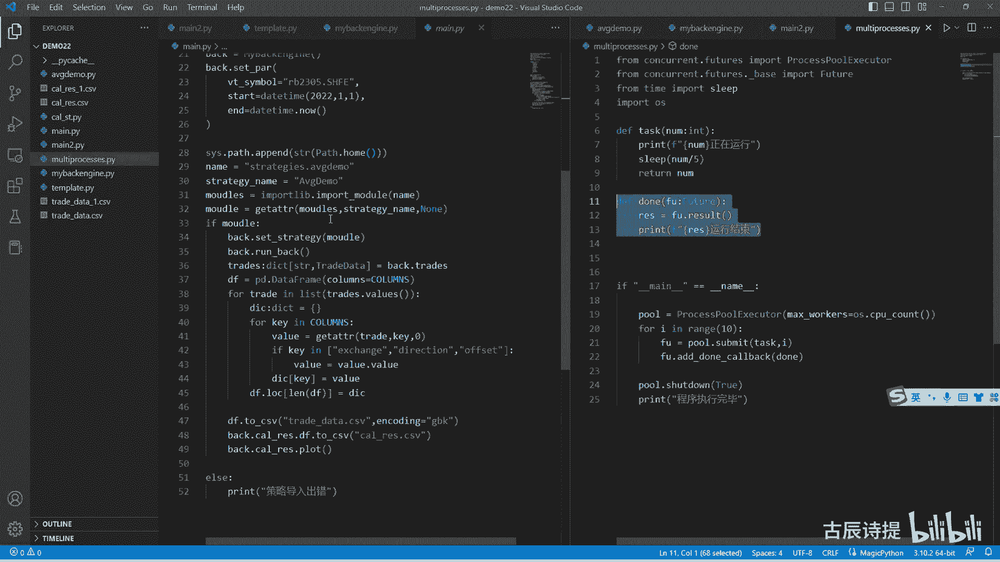