# 第23节课 多进程穷举回测的实现 - P1 - 古辰诗提 - BV1cJ4m1p7yx

欢迎大家来到从零开始量化系列课程，VNPY课程的第23节课，上节课咱们讲到了多进程，这些都是基础知识啊，就是你要是学这个代码编程的话，这一块你肯定得是学的嗯，那咱们下一步就如何把这个。

咱们所做的这些工作给它，放到这个多进程里边去是吧，咱们向右拆分一下吧，从这咱们打开多进程，首先咱们得知道他执行的任务是什么，就这个task这个任务是什么，这个任务的话，咱们是不是其实就不用去画图。

不用去to csv，然后可以把这些东西全部给它删掉了啊，全部给删掉了，包括这个trees，咱们也不需要了，只需要它run back是吧，然后这个当然这个column也不需要了，其实咱们做的工作。

整个回测的工作就是第一步实例化，第二步设置参数，第三步设置这个策略，然后最后一步就是进行回测就可以了是吧，你最终的这个结果，它是不是都保存在了咱们这个类里边的，你说的就是这些参数里边。

或者这个C这个DF这个里边是吧，那你最终对比的那肯定是一般都是什么呀，净利润啊或者最大回撤什么，当然这里面没有写最大回撤啊，净利润啊什么的，就是你来对比这个是吧，肯定是里边就这个里边的某一个值好。

那咱们先说这个任务，这个任务其实是不是就可以直接从这DF啊，一个，然后来做这个是不是就可以了，就这么去做就可以了是吧，然后就是你得需要一个返回结果吧，啊你得需要return就是返回值吧。

因为在咱们这个呃多进程里边，你是需要返回值的，然后把整个的返回值，全部放到咱们的某个列表里面，然后再去进行排序，是不是啊，那就是说这个return值，那就你推一个什么呀。

你是不是应该把这个他的这个返回值，给他返回出来，那咱们就简单来写的话，咱们就返回一个，比如这个value，就是或或者说是你这个target t a l g e t target value。

就是你最后的目标值等于这个back啊，点这个IE这个结果，比如说这个里边的点nt profit，或者说是这个capital呃，total是吧，咱们用这个，然后你最终的返回值。

你是不是就应该把这个target啊，TARGT诶，t a RGE t target value啊，这个应该是空一个是吧，给他返回出来就可以了是吧，但是啊你这个返回值你不光是返回这个呀，你是不是得返回呃。

就是说它这个参数究竟用的是什么对吧，那好咱们说到参数了，咱们是不是得先应该来获取这个参数啊，s e t t settings get settings获取参数。

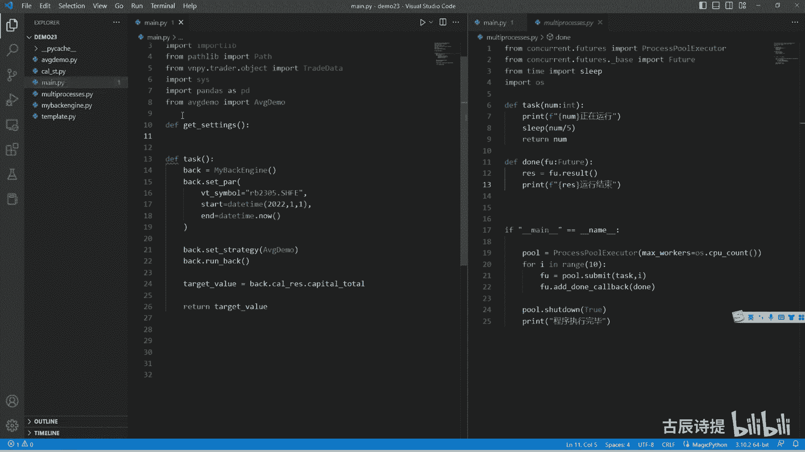

咱们在维纳上面是怎么来获取的呀，这个就是这个CTA回测就有个参数优化。

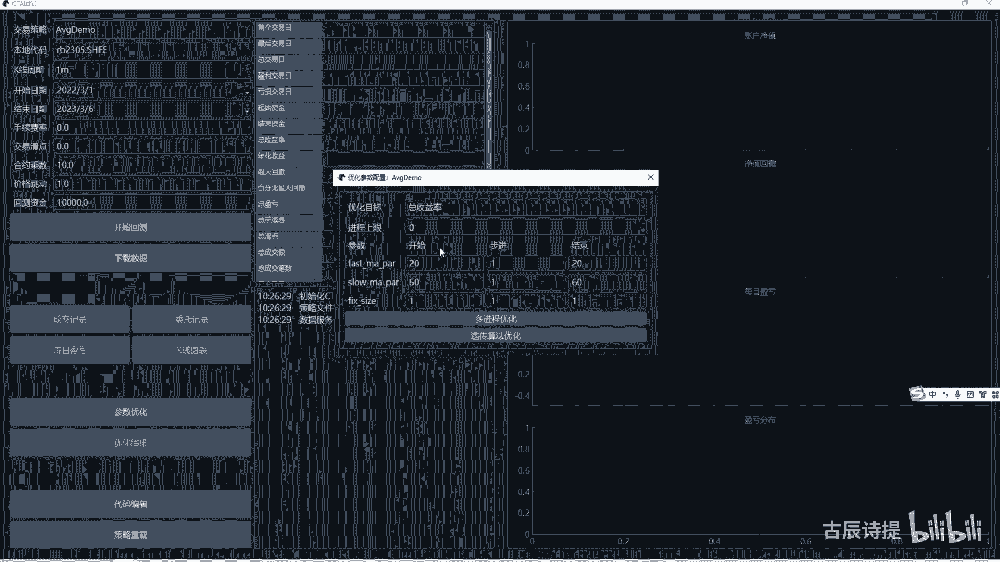

就是从这儿来开始设，是不是，那咱们从这就是说设的话是不是用循环呀，for啊，比如fast m a p r in这个range吧，比如从10~40，然后步长是五，就是从11直到35吧，40是取不到的话。

你如果想取到40，你应该写到41，是不是啊，你光是这个什么你是取不到的，你光是到40，它包左不包右是一样的，它取不到40是不是，然后你同样还得有for uslow m pr in range。

比如我慢速均线是从50~100，然后步长的话是十，你如果想取到100的话，你是不是这应该写101，写101，然后呢你这是不是应该有个DICTOR，就是这个dict temper等于。

然后这个里边你应该写上什么呀，就是说这个呃fast a p r，Fama p a r，这个你得确保和这个app demo里边，这个是一样的是吧，然后等于这个冒号就是fast mp r。

然后把这个slow m a p r应该是slow ma p l吧，这俩是保持一致就可以了，因为你到时候再设置参数的时候，在那个t template updating，那是通过这个名字来获取的吧。

那我把它保存在哪呢，我是不是可以把它保存在setting list，等于一个列表，是不是就可以了，然后它是一个呃list类型，然后里面存放的是DICTOR，对不对，然后我挨个的去给它添加进去。

是不是就行，就是setting list append，然后把这个呃呃DICTIMBER给他，然后咱们称一个这个sitting list，是不是就能获取到了啊，咱们可以去运行一下啊，就是一。

先获取这个settings是吧，SETTTINGS等于这个gate settings，然后咱们print一下这个链settings，咱们看一下，对不对啊。

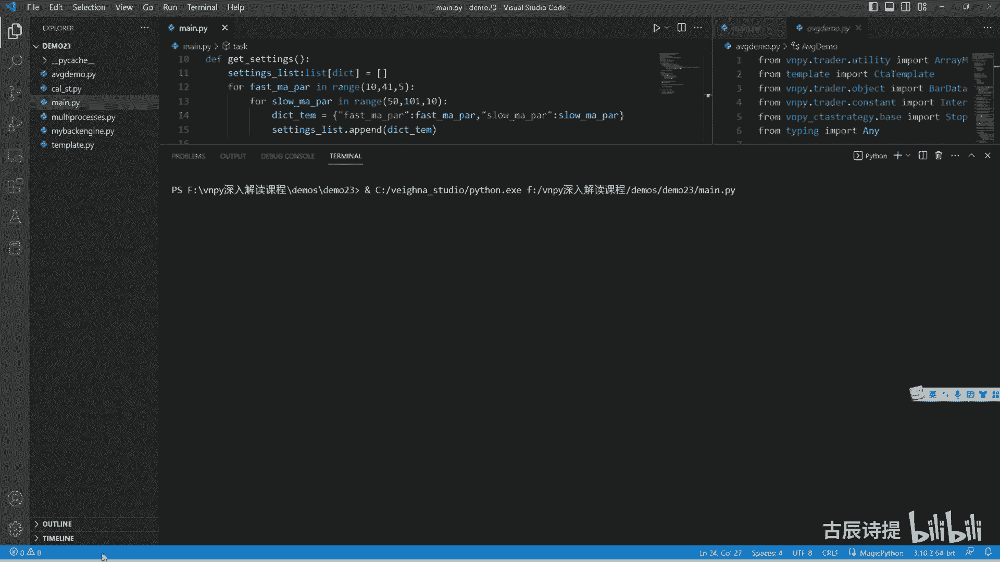

42个，然后咱们看一下这个这个里边参数优化，从步进是5~40，然后这是从50步径为10~100多进程，参数优化，你看是42个吧，好那这个没问题。

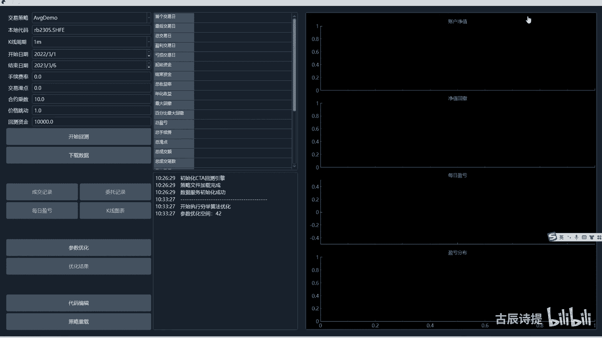

那咱们就应该做这个任务了吧，task咱们刚才讲到了，其实就这么几步，然后最后我把这个target value给返回回来，但是你从这里边你是不是得自己来进行赋值啊，是不是。

那是不是我应该把它变成我这里边的参数，就说你应该把这个very simple给它放进来吧，啊它是一个STR类型，应该给它放进来吧，然后把这个start，然后它是一个DTIME类型，应该也给他放进来吧。

包括这个end的啊，它也是一个time类型，你应该给他来放进来吧，对不对，给他放进来之后啊，你这里边必不可少的是你得传setting啊，因为咱们sitting之前都是这个pr，都是默认一个空的。

对不对啊，那包括这个里边size，Plastic interval，还有sitting是不是都得有啊，好咱们给他写进去啊，size就是这个呃，应该是float是吧，然后这个size有了PREST。

Float，包括还有一个什么呀，还有一个sat pia interval，I m t e r v a l interval，它是一个VR类型，导入一下啊，from v m p y点。

Tread constant，import interval吧，好它是一个interval类型，然后他最后还有个什么呀，还有一个这个CPR应该还有个sitting是吧。

S e t e t t i n g sitting，它是一个dict类型，这些你都得传吧，包括咱们这个你最终设置的这个结果。

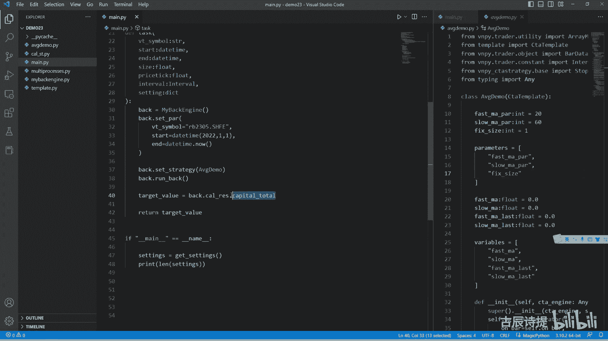

你看在这儿啊，它这个结果是不是咱们参数优化的时候。

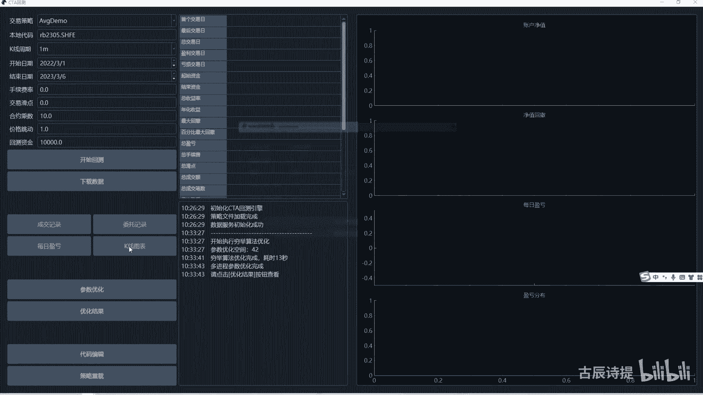

这个结果是不是可以选的呀，那你要实现可以选，那是不是这样，你也得去进行传参是吧，你也得进行传参吧，比如说我这传一个t a r g d target name，STR类型的，那我在这儿来获取的时候。

我这个tt value就不能这么来获取了吧，我应该是GATTR，然后这个里边object应该是back点这个result，然后这个里边来获取它的这个什么呀，就是说这个tt name是吧。

Tr tt name，然后如果没有的话，就返回值为零，然后我最终把这个就是说这个tt value，返回去的同时，我还得是不是把这个setting也得返回回去啊，我得告诉他我是哪个参数跑出来的是吧。

那我从这我就这个very simple，我是不是就可以等于very simple，然后start等于start，然后end等于end，啊然后后边这个size等于size吧。

然后这个price等于price，然后interval等于interval，还有一个sitting等于sitting吧，S e t t i n g，是不是这样就算是一个比较完整的了，是不是。

然后我在这里边我需要去进行传参的话，比如说我把这个呃多进程的这个模块导进来，From concurrent futures，import这个process，这个啊我这建一个poor。

这个你跑多进程的时候，你一定要有这个，不然会报错的，然后max workers是不是等于这个咱们获取一下，Import os，获取一下这个CPU的个数是吧，OS点CPU count好。

然后poor点submit，然后这个里边应该把这个function给它传进去吧，function我给他传这个task，那后边这个参数是不是有点多呀，是不是参数有点多吧，那参数有点多。

当然你也可以挨个去写，那这个挨个去写是不是有点麻烦，是不是有点麻烦，那我应该怎么去做呀，就是当然我也是，就是顺着这个伟大的思路往下走啊，维纳里边它的解它的解决方式是什么呢，我写一个demo啊。

不知道大家在学基础的时候，知不知道这么个东西，就是from function tools，Import party，就是偏函数，比如说我定义F1个ADD new，这个是A它是一个int类型。

B是一个int类型，然后or return a加B，然后呢我这个funk a我等于什么呢，Party sha，然后给它里边把这个at new放进去，这个方法给它放进去。

然后呢ARGUS我要传一个100啊，这个时候我再去调用这个放开ADD的时候，我只需要传入个B就可以了，比如我传入个十，然后我进行一下print，就是啊我听一下print，然后他是不是就可以出来110啊。

这个呢就是偏函数，就是把里边的这个参数先给它赋上值啊，先给它赋上值，那我这是不是就可以写一个偏函数啊，我也可以写在上面啊，这个偏函数比如说我DEF啊，WARP吧，WRAP还是ARP啊，这个应该是RAP。

这个是这个咱们在这个维纳里边，他用的这种写法啊，Task t s k，然后这个里边呢我需要给它传入的，就是固定的一些东西，比如说这个wait simple，呃wait simple。

然后就等于这个v simple啊，不是等于STR，我就给它粘过来啊，就是固定的啊，就是这几个sitting和target name，是不是你得自己来复制啊，我是不是就把这几个给你传过来就行是吧。

给你传过来之后呢，你首先我得传入的是一个function fn c function，它是一个COLORABLE类型吧，导入一下啊，From typing，Import colab。

他这个COLLAB类型啊，然后呢我给他再导入一下啊，from function tools啊，partial啊，然后我给他就是这个FNCFUNC6吧，等于这个party是第一个给他传播的是什么。

应该是这个function吧啊function，然后呢把它这个wait simple给它放进去嗯，这么来写啊，好BASIMPLE给它放进去时候把start给他放进去啊，然后把这个end给他放进去。

然后把size给他放进去，然后把price tag给它放进去，再把interval给他放进去，按顺序给他放过去，是不是这个，然后我再把这个return FNC new，它是不是就实现了一个偏函数啊。

你后边再传参的时候，你只要你只需要传setting和tag name就可以了，对不对，你只要去传这个sitting和tec name就可以了吧，那我在这我funk啊，我funk应该是等于什么呀。

应该是等于这个啊，W r a p a w r a p task，然后这个里边我function，我给它传入的就是这个这个吧，task吧，TASK吧，然后第二个就是这个vt simple。

我给它传入的是这个2B2，305。2SHFE吧，然后这个这个start我给他传入一个DTIME，二零221月1号吧，后边end time就等于did time点now。

然后这个size我就给他传输个十啊，然后price1啊，interval给它传入这个interval，第2minute是吧，它就是一个偏函数了吧，对不对啊，它也是个函数啊，它是个型的，他是你。

你也可以把这给返回一个COLLAB类型的啊，他可以去进行回调的，那这个时候我poor poor点submit，那这个里边这个function我就可以写成funk了吧，然后后边需要传入的就是两个参数吧。

一个是sitting，一个是这个target name吧，其实target name也可以放到这个里边吧，就是整个的给它全部给传进去，是不是，那我从这我就呃呃不再多写了啊。

因为就是说我就给他传两个参数吧，就是funk传进去了之后，sitting sit呃，这个sitting哪来的，咱们已经有SETINGS了是吧，咱们应该是for sitting in，去便利。

然后poor点submit，然后把这个city s e t t i n g给它传进去，然后还有个target name，Target name，我就给他写一个这个tt name。

t a RGE t target name等于什么呀，比如说我等于一个，咱们在这个里边就是capital total吧，啊一般都用这个啊，Tab todo，然后它是不是有返回值啊。

返回值咱们用FU来接一下是吧，然后FU点addle back，然后比如说我写一个down，我从这我再定一个down d f d o n e啊，然后这里边接收的是一个FU，它是一个FU，FUTURE吧。

我导入一下啊，从这from concurrent futures，点下划线base import f u t i e f u t u r e，然后我这个结果。

这个IES应该是等于这个FU点result吧，那我这个有这个结果，这个结果你是一个sitting一个target，他返回出来就是个元组元组，我这可以标识一下，它返回出来是个TP，是个元组。

那我把这个元组放哪呢，我是不是可以从这写一个列表啊，i e s list u s t等于一个列表啊，然后我把这个都放在这个IESUST点，append这个RES都给它放进去，是不是就可以了呀。

然后最终你是需要一个排序吗，是不是排序怎么排序，排序其实就是这个IE就是一副IES哎，咱们就不进行判呃，不进行判定了啊，就是假设它里边都有啊，是不是有个s so这里边呃最主要的是这个reverse。

reverse是咱们应该给它改成顺序还是反序啊，咱们应该反序吧，就是从从大到小吧，True t r u e，然后里面有个key key应该等于什么呀，key咱们是用这个就是这个元组里边。

就是它返回来的是一个元组嘛，第一个是sitting，第二个是tt value，应该是这个元组，它的这个就是呃第二个元素，也就是取值为一的那个，就是下标为一的那个元素吧。

那咱们是不是key应该等于是什么呀，咱们用一个lambda x，这个X就是代表的，就是说是这个它的这个整体的这个元素，就是tuber嘛，Tuber，那我是不是取它第几个元素啊，应该是第一个元素。

就是第二个元素下标为一一的那个吧，用作为它的这个key吧，就是排序的这个依据吧，是不是，然后咱们再print一个，比如说我i e s list呃，我挨个去输出来吧。

For r e s in r e s list，比如说我输出前十个比上包左不包右，我比上十是不是从零到第九个元素啊，是不是，然后我print这个IE是不是这样，就把整个的这个结果给输入出来了，是不是好。

咱们看一下啊，有没有什么问题好吧，有没有什么问题，这呢就是说这个是一个，你在赋值的时候方便一些，你不用去给它写到这个submit里边，很多很多写很多很多是吧，好咱们去进行一下运行啊，看一下有了。

但是会报错啊，你会发现它会报错，但是这个输出的肯定是多个进程，它的进程嘛是吧，你看啊这会报错就是connection already opened，它是什么意思呢。

它的错误其实是在这个你是在调取数据的时候，就是这个咱们在这个麦back engine，这就是咱们这个SUGLIED，就是这个sue database，这个里边每一回他都是得自己去连接是吧，自己去连接。

然后因为这是初始化的时候，你从这都是挨个初始化了嘛是吧，你解决这个问题呢，其实方式有很多，就是这涉及到什么呀，就是一个数据库被多个进程去使用啊，那其实你这个数据库你只需要保证，在我这个整个的项目这里边。

只需要打开一个数据库就可以了，其实方式有很多，比如说你建一个线程池啊，不是你建一个，就是说进程池，然后就是让这个dB就是它建一个连接池啊，不是进程池建一个连接池，让多个去连接。

再或者说你这个dB我就给他限制一下，他只只是一个做一个什么呀，就是说单例模式，就是这个我从这我就直接改一下啊，就是这个比如说我写一下这个，单例模式啊，就是单例模式是什么意思呢。

我可以在demo里面给大家演示一下啊，比如说我定义了一个class c l a s s啊，然后DF刚刚in it，他这里边传参呢，我就传成这个name吧，S t r，然后cf点name等于name啊。

就这么一个类，你P1等于，比如person，然后这里边小红好，我P2等于这个person小明，是不是我print这个P1，我不print它的这个name了，我print p2，这两个是不一样的。

两个object是吧，你看它两个内存地址它是不一样的，一个3201200是吧，但是呢我现在我给他规定一下啊，就是这个DF刚刚new就是在这个刚刚new里边，我就是因为咱们在新建。

就是在实例化一个类的时候，他第一步走的是这个刚刚六，是不是啊，刚刚new里边可能去接一些参数啊，星啊ARGS或者说是这个啊星星啊，这个KKKWDS啊，然后它这里边其实是做了一个什么动作呢。

其实就是就是这个CLS啊，就是呃s u p super第二杠杠6N1W啊，杠杠六，然后把这个CLS给它放进去，然后他这个super里边呢它是什么呀。

person就是然后cl s它是return这么个玩意儿啊，你记住就行了，记住就行了是吧，就是它是没有问题的，然后如果说是就是单例模式呢，只有一个实例，就是你这个实例化两个不行，我只能是实例化一个啊。

我从这儿呢，我在它的类属性里边，比如说我NINSTANCE啊啊instance吧，写的可能不可能不对啊，比如说等于NN值啊，然后呢if我我我就进行一下判定啊。

if not就是cs点下划线这个instance，如果说没有这个instance呢，我就这个CLS点instance，就等于啊这个super我给他去进行一个实例化啊，我只给它实例化一个是吧。

然后如果说有的话，我就直接return啊，这个cl s点杠instance，这个时候呢咱们再print这个P1和P2，咱们可以看一下，你会发现这两个是在同一个地方啊是吧，他的这个内存地址是一个地方吧。

cs一下啊，它的内存地址是一个地方吧，这个时候呢咱们在print他们下这个name啊，再print他们下这个name，是不是两个都是小明了呀，它是后赋值的嘛，它会进行初始化啊，重新进行初初始化。

但是这个实力还是这个本身，就是说P1，这个实力只不过是给它重新进行复制了，这个就是一个单例模式，那如果说我把这个单例模式啊，我整个的给它粘过来C啊，然后我这。

然后我这把person呢改成这个SUPERLIGHT这个database啊，出来database是不是它只会创建一个实例，然后呢我这儿呢我就不让他去进行连接了啊，因为它会执行这个初始化的啊。

反复执行这个初始化，它会反复连接，它也会报错，这个时候呢我再去跑这个策略啊，我不不是跑这个策略，我再去跑这个多进程，咱们在刚才在跑这个多进程的时候发现啊，他这个print非常的乱。

那我就不想让它进行print了啊，我不想让它进行print，因为很乱嘛是吧，那这个应该怎么去进行操作呢，是不是应该在back这就是在这个task这个back，这我把他的这个什么呀。

这个back点right log等于我在这再写一个啊，DEFRITE吧，Red log，我这里边我接受，我也不知道接收什么数据类型，我就是ARGS是吧，星星啊，K w d s，我不管他进入什么类型。

我就直接写一个pass，就不让他去进行输啊，输出了，然后这写一个right log，是不是他就不会去进行输出了，因为你在back里边，你所有的你想这里边我输，我输出这个就是我so print。

除了一个这个就是一个这个吧是吧，所以说为什么说咱们在写代码的时候，你在输出东西的时候，你一定要单独用一个方法给它去输出，你不要用print啊，另外呢你单独用方法输出之后。

比如我想把这个log放到日志里边，这样的话你也方便去处理是吧，整个的把这个red log我重新指向个一个什么地方，你像这我又重新指向了，把back点right log重新指向了这个right log。

它是不是就不会去进行输出了，是不是这个很重要的啊，你一定要你一定要知道这方法还能这么去使用，因为什么呀，你在后边咱们再去看，比如说你模拟交易的时候呃，这个这个维纳里边还有个paper pap呀。

pepper那个什么什么什么，它是一个模拟交易，模拟交易呢，你只需要把这个CTA引擎里边的去SORDER，就是只要不把它去发送到底层，是不是就可以了，我给它单独建一个，就是说我这个模拟的这个类。

我让他把这个接口直接指向到我模拟的这个类，就不会造成实际的成交了，你看这个就很方便对吧啊，这个你一定要知道啊，好这个时候呢咱们再去进行一下运行好吧，看看他会不会报错啊，刚才回测了一下。

没有结果倒是不会报错了，但是他没有结果不会报错，是因为咱们刚才把这个super lie，这改成了这个单例模式，当然了，这个其实最简单的方法呢还是还是什么呀，就是说我我把它再给它归还回来啊。

最简单的方式呢还是把它改成啊，这个单例模式我先放在这儿啊，啊这个最简单的方式呢，其实还是用这个在my back engineer直接去这个呃，这个在from VN p y点点database。

import这个gate database，然后就用它来去获取，为什么他写的，咱们看一下这个database这个代码它是什么呀，GLOBA这个database，就是这个是一个作用域的问题是吧。

如果说这个database有值就return database，其实跟咱们那个单例模式是不是一样的道理啊，就是这个database只会去找一次，如果说找着了的话，他会把这个database直接给返回去。

是吧啊，这也是一种解决方案，但是我希望你知道他为什么会这样啊，然后刚才呢我也检查了一下，他为什么没结果呢，是因为啊在这儿做完之后，咱们主进程就直接往下走了，在直接往下走的过程中呢。

这个i e s list里面还是空值的，所以说它就没有值了，你从这主进程一定得等着这些紫禁城做完了，你再去往下走啊，这个紫禁城做完你应该怎么去等他呀，就是咱们在写这个demo的时候。

就是啊processing，这个时候咱们得用这个por shut down啊，等true得等它走结束了啊，等这些结果都出来了之后，我再去进行这个排序，是不是就可以了，好这个时候呢我再去运行一下啊。

再去运行一下啊，这个结果已经出来了，这等的时间还是比较长的，你会发现就是说最好的是四十七十20220，就是它最终的这个值啊，四十九十19370啊，15期是100啊。

100是不是这个都是从高到低往下排的呀。

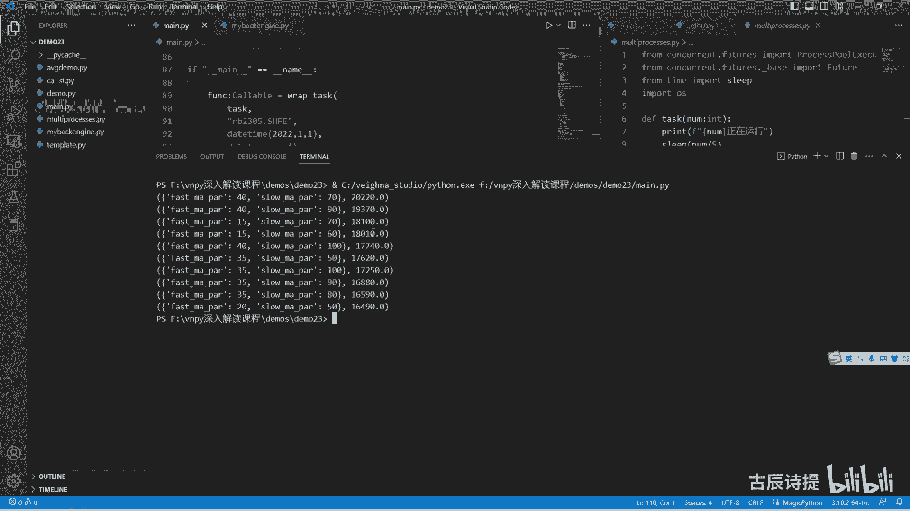

咱们之前用这个来回测的时候，咱们可以看一下它的这个优化结果，你会发现它最好的是三十五九十。

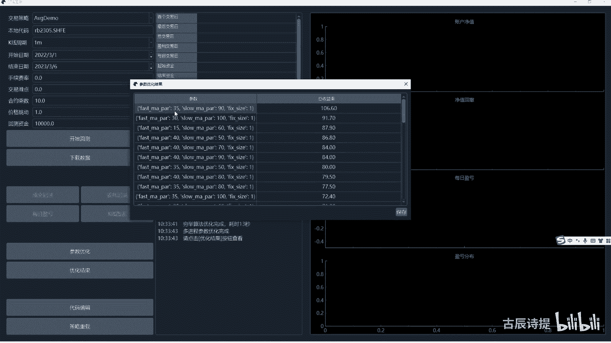

然后三十一百，这就是有区别了，是吧，三十五九十啊，三十五九十，三十五九十，在这呢三十五九十，然后我这个最大盈利是大概1万220，他的这个呢呃，收益率是100 106。6%，其实差不多是吧，差不多啊。

而且前几个包括40开头的，你看四十五十七十是吧，都在前列的，为什么有区别啊，因为还记得吗，我这个back test engine是有了这个check呃，不是check啊。

是cos c o r这个代码了是吧，肯定是有一定的区别啊，但是我觉得我这个更科学啊，我觉得我这个更科学，当然这是针对于期货的啊，但是在回撤的时候呢，你会感觉很单调，因为把这边给赋值了之后。

就是把这个right就是这个log log，这给复制了之后，他就没有输出了，就是心里边就没他呃，我刚才是给暂停了，因为他回回测是有时间长度的，咱们可以给它输出一个总耗时多长时间。

这个呢你就需要一个计时器，计时器呢，它在这个他们那里边是有一个，很简单的一个计时器的啊，这个就这个咱们在执行代码的时候呢，可以从这儿啊，可以从这儿就是写一个start start。

等于这个P2count一下，就是这个时候他就给你记个十了啊，然后呢到这儿呢我再用个end，就整个给它全包进去了啊，只能给它包进去了，end等于什么呢，就是还等于这个再记个十啊。

然后我最终print一个就是供即用时啊，多少秒，这个计算出来的是秒啊，然后我点format，然后这个N减去start就可以计算出时间了，但是你光有时间还是很枯燥，因为中间他一直没有输出是吧。

给大家引进一个类，这个类呢挺有意思，就是而且很方便，当然也是这个尾那里边它里边放着的啊，它是一个什么呢，from t q d m啊，import一个TQDM，这个类是干什么用的呢。

我from time import一个c e p sleep for i in range，比如说十，我sleep一个SLEEP，sleep一个0。3秒啊，这个代码很简单吧。

我从这儿啊给它加上一个TQDM，你会发现它会有什么东西啊，你会发现是三十四十，看就有这个进度条了吧，啊当然你后边你也可以给它加一个total，就是一个参数啊，total等于十。

因为它有十个数嘛啊一样的也可以去进行运行，也可以去进行运行，咱们怎么把咱们这个代码，因为他现在没有，就是说这个也没有输出了，需要一个进度条，是不是需要一个进度条，那这个进度条咱们应该怎么去做呢。

啊这个呢就涉及到一个叫上下文的管理啊，上下文的管理，我从这我新建一个吧，INM02吧，点PY，我把这个man Ctrl a Ctrl c，然后CTRLV粘过来，我把这个呢。

就是说这个这执行的这块呢全部给删掉啊，全部给删掉，然后我做什么呢，用with吧，with啊，为什么呢，POC这个里边，然后max workers。

workers等于OS点CPU count as这个poor啊，我还是用poor来表示啊，poor点map map叫批量申请，那个submit是单个申请，map呢是批量申请。

同样的里边这个function也传进去，然后这个参数是什么呢，就是里边需要传的这个呃，这个去批量申请的这个ITERABLE呢，应该是SETINGS是吧，settings应该给他放进去。

但是这个里边这个function它是需要传，还有一个叫target name，还记得吗，就是在这是需要传一个target name的这儿呢，咱们把tt name放到。

就是说这个这来就是你在初始化它的时候，咱们把这个tech name也给它放进去，这样的话就是new map就很便利了吧，就是一个方法匹配多个这个多套参数嘛是吧，他这后边map后边你看啊。

它是一个ITERABLE，就是呃迭代器啊，不是这是它不是迭代器，是一个可迭代对象，iterator是迭代器，所以说咱们要把这个参数给它放到这个里边去，那这个里边咱们应该从哪去放呢。

就是在这个就是你最终你是得有这个target name的吧，target name他这个在咱们一开始来做这个task soul，这是不是有一个text name是吧，好，我把它为了明显一点啊。

我把它放到前面去啊，比如说我放这个name逗号pc name，那这个你包装这个task的时候，我是不是这也需要传入一个TECHNAME，CTRLV一下，是不是这个target name。

我进行party的时候，我第一个放的就是这个target name是吧，好那我进行这个参数吧，这个方法去进行，给它运行的时候就是到这了是吧，我第一个传的是不是在task之下。

我就应该传这个target name，tko name是什么呀，就是咱们这个capital total是吧，好给它放进去啊，capital total放进去啊，把这个TITALTODO放进去。

这个type a to do放进去之后，同样的啊，他是有返回值的，这个map，你看啊，它是一个iterator，它是一个迭代器，返回来的是一个迭代器，迭代器和可迭代对象算是比较绕的东西，呃。

这个去学一学啊，都是Python基础里边的好，我把它接收过来，比如说我用IT去接收它啊，它是一个ITERABLE，我就不我就不保持啊，我就不标识它了啊，他是个iterate啊，它是一个呃迭代器。

迭代器是什么呀，就是一个容器，然后呢它可以把东西都实现能取出来，这个功能for循环里后边跟着的都是迭代器是吧，迭代对象就是它是一个容器啊，是一个容器，但是它可能不能自己有这个功能。

就是可能自己没有这个把东西取出来，这个功能啊，然后接收到之后，这个就是接收到这个这个这个这个迭代器啊，里边的结果是什么呀，肯定是这个future这个类型是不是，然后呢，我要把里边的内容给输出来。

里边最终存储的是这个setting和这个target value对吧，是这个sitting和target value吧，那咱们把它取出来是怎么取出来啊，其实你就是直接i s result。

UST等于给它list一个，这个IT是不是就哎IT是不是就可以了呀，因为它是一个迭代器，它可以用这个刚刚nest去取是吧啊，不是那是生成器啊，它可以就是去挨个的去便利它，那我直接一个list。

它是不是就出来了，是不是就出来了，包括在这啊，咱们这个range range，你如果说单纯的去输出一个range10，咱们看一下啊，他是range10吧。

但是如果说我给他加一个u s t list list，range是它是不是都出来了啊，那就说明range这个啊，它本身它是一个生成器生成器，我直接给他list一下，然后呢。

我再把这个i e s list讲salt进行一个排序，排序怎么排呢，还是这个reverse等于true是吧，就是让它反序着去排，然后这个key很关键，key应该等于什么呀。

应该等于LEMAN的这个X应该是取X的参数是，这就是那个元素是第二个元素吧，就是取一吧，这这得看你的这个返回值啊，这个target value啊，是不是啊，应该是这么来取它给进行一个排序，排序完了之后。

然后在咱们就是说啊这个i is for i s in，I e s list，比如说我就看它的前十个啊，print这个IES好，这个时候咱们运行一下，运行一下，看看有什么问题，时间可能等的长一点啊。

哎interval啊，问题出在这儿，没有加逗号啊，这少了个逗号好，咱们再去运行一下啊，再去运行一下，主要是数据的读取，其实它跑并不会费太长的时间，你把这个所有的代码给拆分出来。

你会发现它其实并没有那么复杂，涉及到的都是一些Python相对嗯比较基础啊，或者说是在基础内容里边，都会学到的一些东西啊，结束了啊，结果也出来了，但是他并没有有那个那个那个那个进度条是吧。

因为我这没有写那个进度条，所以说咱们把这个进度条给他写上，把进度条给他写上，怎么写啊，就是先导入，嗯应该是在曼联二里面导入，From tq dm import t q t m，然后呢我把它这个一整个啊。

就是这个东西一整个给它扩上，然后前面加上TQDMTODM，因为它是map嘛，然后告诉他这个TOTO等于什么呀，等于是这个呃lb settings吧，就是这个settings的长度就是它整个的总长度。

一个setting对应一个返回值吗，是不是好，再进行一下运行，看看他有没有那个智能表，有了吧，0%啊，一共得花费将近40秒的时间啊，将近40秒的时间嗯。

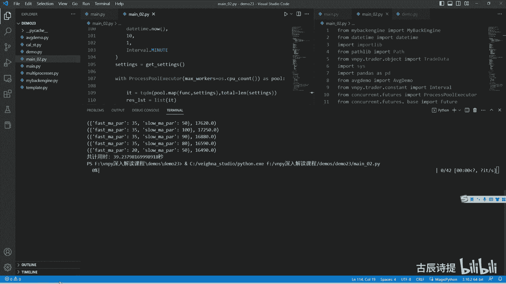

咱们看这个里边他花费了多长时间，耗时十十三秒，42个。

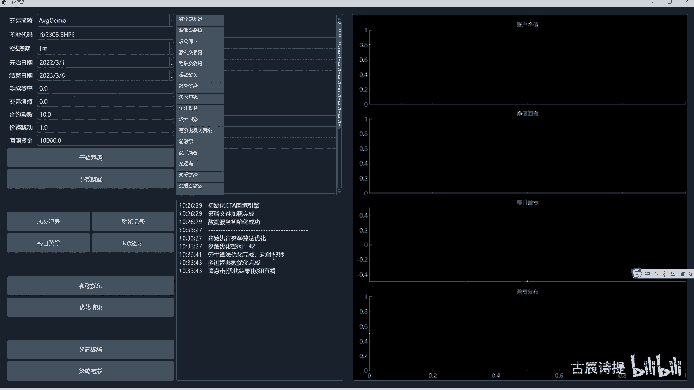

就是这个还是比较快的是吧，当然了，咱们写的这个代码啊，就是里边肯定有很多，也不是有很多吧，可能有一些不是很完善的地方，你再去进行一些修改啊，填充啊啊包括有了这个多进程单策略，单品种的优化。

其实你再琢磨琢磨，就是说单策略多啊，不是这个单策略多合约，他这个回测应该怎么写，单策略多合约是不是就涉及到了，就是说就是你的这个数据挨个儿往里去放啊，对吧，你也可以用多进程吧，然后把结果给反馈出来。

最后组拼成一个总表吧，是不是，然后呢你再反过来说这个呃多合约，然后就是不是这个多策略，单合约就是有很多个策略，然后单个合约，你你这个可能同时接收到这个order就会比较多，是不是，那你在咱们这个呃。

在my back engine，这你是不是就你看他这个wait simple，包括这个每一次的这个咱们在调用的时候，这个strange就是你像这个strange是吧，包括strange name嘛。

是不是就很有作用了，就是因为它得起到唯一标识嘛，其实这个就不难了是吧，那你后边应该是什么呀，再往哪方面去写呢，就是多策略多合约是不是，然后多策略多合约有了之后，就是你写完之后，是不是就应该往什么地方本。

就是多策略多合约的这个穷举优化上去本是吧，另外你还得考虑多策略多合约，那这个多合约里边是不是还得拆，你不能用8899吧，就是其实这个区别挺大的，虽然咱们这个你想这个回测和咱们这个用my back。

那用my back engine回测，虽然只是差了那么一分钟，撮合是不是就差了好几百块钱是吧，那你就是说用这个呃，连续这个主力合约和你单个这个合约，掐那个主力的那个时间点去回测，是不是差异也会特别大。

什么意思啊，就是说嗯很多这个连续合约，是不是这么一段一段给凑起来的呀，就算他经过这个上下的就是平权了，就是说前付权后复权拉平了之后，其实跟你实际上的，比如说这么一条一条的还是有区别的话，还是有区别的吧。

你实你实际上的那一条一条的，可能就是说你从什么时候开仓，就是说你可以设置一个策略，就是说设置它主力合约的时时间，然后前面满足条件了，到了主力合约时间允许了之后再进行开仓是吧。

然后这么一个一个的就是往下走，跟你这个一整个数据联系起来的，这个交易肯定是有区别的，而且这个区别还不小，你像这样的回测方式啊，你想把它做成这样的回测方式，你可以看我那个B站上。

就是那个就是那个把这个数据怎么处理的，如何进行回测的，就是那个课啊，那个上面说了，如何去并表啊，如何去把它给设置，把时间给设置上了，它的主力合约是从什么时候开始，什么时候结束的，其实逻辑很简单呀。

无非就是我在我的策略里面设置一个时间，开始时间，结束时间是吧，这个开始时间和结束时间，就是这个合约成为主力的时间啊，那这个时候我是不是就可以参，参照原本的这个合约的这个数据进行回测了啊。

这个里边其实我要往后写的东西非常非常多，为什么非得给大家仔细的去讲一遍，这个CTA回测的这个代码，因为这些都是基础，是不是这些都是基础，有了这些基础，你才能会对你的这个量化的这个框架做更改。

然后去满足你自己的需求啊，这个呢就是回测的结果用了42秒钟，当然这个42秒钟包括了这个，我在这儿就是包括这个数据获取的时间啊。

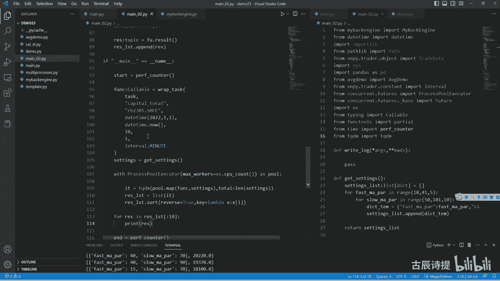