# 第24节课 veighna平台回测引擎介绍(1) - P1 - 古辰诗提 - BV1Am411m7bS

欢迎大家来到从零开始量化系列课程，VIPI课程的第24节课，前面几节课咱们给帮助大家手动敲了一些代码，也就是这个c t a b testing的，通过手动敲，你会发现其实并没有咱们想象的那么复杂是吧。

如果说咱们单纯的看这个就是CTRLCCTRLJ一下，看这个维纳它自带的这些代码，你会发现很多啊，里边包括导入的包呀什么的，很多可能不太看得明白，但是如果说你有你自己的逻辑。

你再来看这个就会变得很简洁明了，是不是好，先说一下为什么他会把这个back testing放在这，我个人认为它有两个考量，第一个考量呢是告诉你，就是说这个回测的引擎适用于CCTA，Btester。

就是CTA策略，如果说你是高频策略啊，或者一些其他的策略里边有一些其他的操作，是不适合在这里边进行回测的，比如说你有询价，就是FAKFK呃，这样的就是委托模式，你是从这儿你是进行回测不了的。

那个得通过实盘，或者请通过一些模拟交易去进行检测，这个只是用历史数据来回测是吧啊，第二个考量呢呃是这个什么呀，就是他在这会它放在这儿，它可以更方便的去导入一些模块。

比如说这个bass它可以直接通过点bass哈，就是这个里边直接可以去呃，把这些专门为CTA啊，这个strange，就是CTA策略定制的一些模块给导入进去，包括这个策略，包括这个template是吧啊。

这个c t a btesting engine，就是咱们之前写的最核心的部分，它还有个CCTABTESTER啊，那个BTE那个engine那个一会咱们再看，他其实就是给他加了一个外包装。

以及和这个界面的就是关联，更加的方便一些啊，那咱们就具体的看一下，它的逻辑大部分跟咱们写的是不一样的，但是它这里边涉及到了一个UI，当然不是这个UI啊，这个是实盘模块的UI。

是在这个ccta btester engine啊，那个里边的那个UI界面关，就是关联到这样的一个UI界面，所以说他得考虑到这个界面里边的一些情况，首先咱们看一下它的这个初始化类的初始化。

它这里边有两个类啊，一个是baptist engine，一个是daily result，Daily result result，它是根据天就是每天来做这个呃权益的汇总，或者说是一些指标的汇总。

然后这下面还有一些方法，咱们后边说啊，咱们先看第一个最核心的就是btesting engine，也就是跟咱们之前就是写的最主要的一块，他这里边呢其实就是一些简单的赋值是吧，这个里边很熟悉。

capital就是初始资本金啊，这样写也是可以的啊，这样写也是可以的，Python是认的，就是这样方便读起来方便，但是对于咱们来说，好像呃不是认为千是为整数的，咱们认为万是为整数的是吧。

好啊这有个annual day，就是他写了一个一般一年有240个交易日，这是一般情况下，然后这里有个model，因为它这里边兼顾了，就是霸线数据和这个TIK线数据的一个回测，所以说他写的比较全。

其实如果说你从一开始就是从第一节课，咱们讲这个代码，一直到现在，如果说你是跟着敲过来的，我相信啊，就是Python你会往上涨一大截，就是因为它本身它是一个熟练工，它并不是多难。

只不过是你知道与不知道的问题，以及熟练与不熟练的问题是吧，你像这样的就应该看着很容易，就应该没有什么疑问了啊，包括这个啊，就是这个就应该没有什么疑问了好吧，它这里边跟咱们写的呢有一部分区别。

比如说你像这个stop order这一块，咱们只有两个，一个是stop or order count，就是计数器，然后这有个stop orders是吧，他这里有个小点。

Active stop orders，它是做什么用的呢，其实这的active stop orders呢，就相当于咱们的那个stop orders呃，他如果说里边被那个就是被触发了之后啊。

咱们在那就直接给删了，他会给他放到这个stop orders这个里边，因为最终最后在这个界面里边。

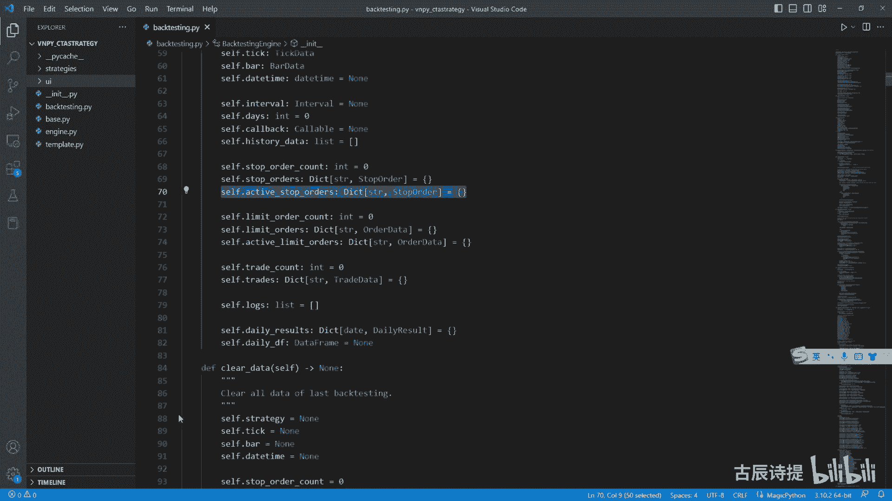

他需要去展现这个成交记录对吧，虽然这个里边都是展现的，都是先下单吧，啊不是这个委委托记录啊。

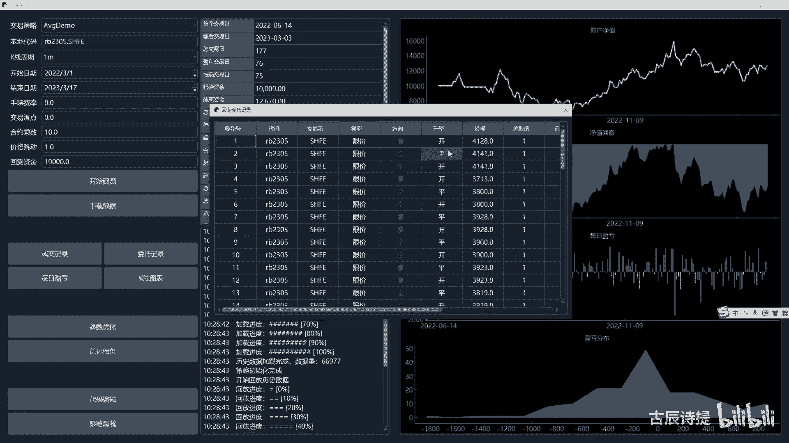

你看他是它都是限价单，但是这个这个停止单，它最终也会转成现价单是吧，它是需要去进行展示的，所以说它把它给保存了下来，咱们那没有保存，直接给删掉了啊，啊包括这个limit order。

它有个active limit orders哈，这个在代码里边也是它不会直接把它删掉，它会从这个active limit orders给它pop出来之后，放到这个limit orders这个里边来。

只是做一个存储啊，这个log是日志日志信息，然后这个daily results和这个daily df，咱们以后看到这个DF一般都是表示这个data，这个data frame这个数据类型的啊。

这个pandas和NPY建议大家去好好去看一下啊，后面有机会给大家出这种模块的课，你像这个logo这个log模块呢，咱们也不多讲了，可能会在后面给大家提一下，简单的提一下好吧。

这个他这两个是为了做这个最终的指标计算，然后给做的两个这个呃属性啊，一会儿咱们看到了再说，咱们CTRLKCTRL零一下，然后这样打开INIT里边就没什么好说的，然后他这第二个这个方法。

这个是clear data，这个里边其实就是把呃你的一些字典啊，进行一个clear，包括strange啊，都给它复复制成NN值呃。

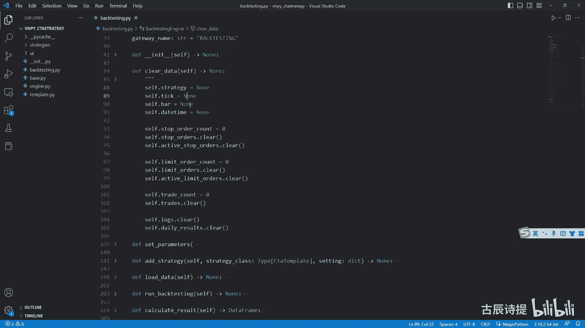

这个是做什么用的呢，比如说咱们在回测的时候，咱们需要回测一个其他的策略啊，包括这个咱们都会改是吧，这个时候因为它程序整个是运行着的。

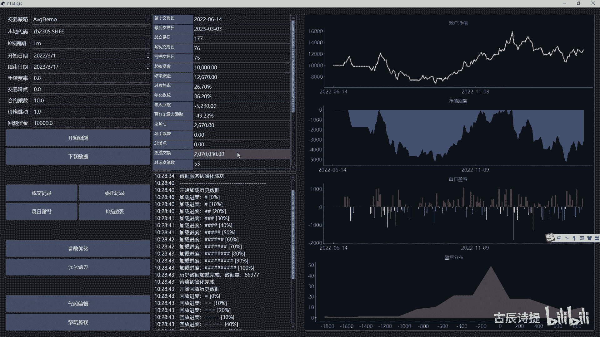

咱们之前回测的时候，每一次程序运行完了之后。

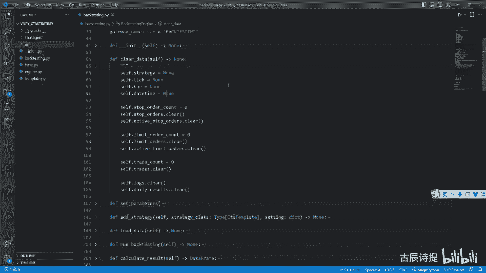

这个里边的数据信息就会被删掉，但是在这个界面里边儿啊，它会不会一直保存在这，会一直停止在这啊，会一直停止在这，所以说你就要进行一个手动的删除呃，界面呢咱们后边也会出一期课，因为呃我能很理解大家的心情啊。

其实如果说你是做这个量化的，而且是后边慢慢去学的，你很希望通过这种见面的方式能够让别人看到，或者你团队看到，因为你写代码只能你看得懂，别人看不懂是吧，很多时候没有共同语言，慢慢的你就变背什么呀。

就是说好好像你就成了一个程序员了，你最终你是想写成这样的一个界面，让大家都可以去使用，但是界面呢会比较麻烦，你像这个咱们这个呃维纳里边，他是用这个PYS6，以前是用PYQD5，他都是在这个C加加QT啊。

这个基础上去进行搭，去进行这个搭建的，呃其实就是你界面的话，你可以把它理解为，它本身就是一个程序在运行啊，它可能咱们看着它是不动的是吧，但是它实际上呢，就是说是以每秒多少次的频率去进行刷新的。

它是一个县城，在不在不断的去运行，包括你像这个我把鼠标放放进去，它这个亮了啊，然后离开它就暗了，这个都需要你一点点去写的，所以说不难，但是很麻烦啊，比较复杂一些，包括它产生一些图像啊什么的。

都会比较麻烦一些啊。

啊这个就不多说了啊，这个是clear data，是为了把一部分的数据给删除掉，然后这个CPR咱们就不说了啊，CPR这里边你看这个这个是华电的意思吗，这个plastic是最小的这个波动值是吧。

这个咱们之前都讲过了，当然这里面也有一些，比如这个risk free和annual days，这个放进去，它嗯，肯定是为了最终计算这个指标来进行计算的啊，就是呃你像咱们写的那个很简单。

你可以把里边添一些更多的，比如说你有最大回撤呀，比如说你这个单笔最大回撤呀是吧，这个逻辑清晰了之后，其实代码反而不是那么复杂了，因为你从这里边，你也涉及不到一些很高深的算法，比如说递归呀什么的啊。

涉及不到这些东西，只是一些加减乘除是吧，只要是你把思路捋清楚了，我相信是很容易去写的啊，而且你需要什么东西，谁也就是别人是不知道的，没法给你写一个很完整的东西出来是吧，我我喜欢看的和你喜欢看的。

可能你喜欢看夏普比率，可能我对这个1。71点兴趣都没有，我就想看它最大回呃，最大回撤是多少，或者说是在某一年啊，就是它不太好的，这个一直都是在震荡中，他的回撤是多少，我喜欢看这个是吧，或者我喜欢看一亏。

比喜欢看胜率啊，就是都不太一样，所以说需要你自己去进行调整，我相信如果说你能把我之前写的那个代码，复述出来，或者自己能写出来，哪怕是磕磕绊绊的给写出来之后呃，你在对一些模块进行调整的时候会很方便嗯。

如果说你从一开始到现在，就是代码都自个儿能写出来了，也能够理解了，其实维纳这个平台里边，绝大部分的这个源码都能看懂了，因为它都是基于这个event，就是事件驱动来进行处理的，然后进行方法调用的啊。

好吧好，然后这个at strange没有什么好讲的，然后这个load data咱们说一下，这个跟咱们写的有些不太一样，咱们写的那属于是相对比较简单的简洁的啊。

这个load data呢它这里边有个加载进度。

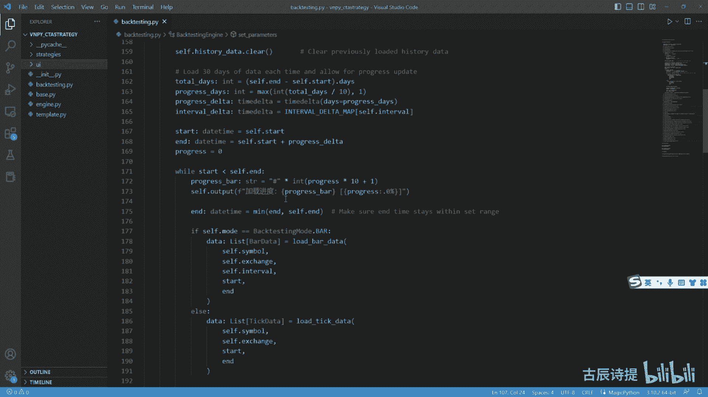

就是来输出这个东西啊，加载进度啊，就是加载历史数据用的。

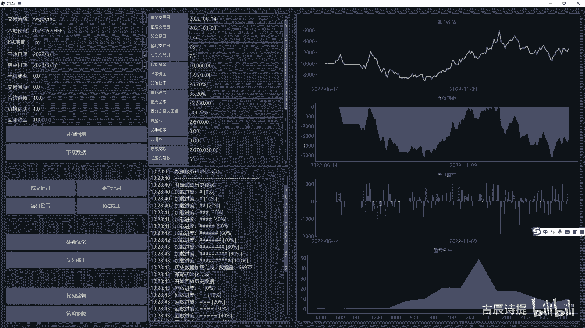

加载历史数据是干什么呀，其实就是下载数据，然后放到这个self historal data里边，就是这个啊sad story data里边是吧，其实就是从这个数据库里面去下载数据。

咱们那儿呢就是直接用那个就是就是一除，然后给它去进行输出，这呢它是给进行了一下优化，怎么优化的啊，咱们看一下，首先呢它是output，然后加载历史数据，这个output是什么呀。

咱们向右拆分一下right，这就把这个先收了，这个output呢它也是单独的写了一个方法，其实就是print这个有什么作用，咱们在之前写的时候你也看出来了，就是在你进行BF就是穷举回呃。

就是穷举的这个回撤的时候啊，就是优化的时候你会输入出来的内容会比较乱，这个时候呢你把这个output就是重新指定为空啊，或者什么的，它就会更加的好一些啊，更加的好一些，所以说你以后在写代码的时候。

我除了你刚开始写的时候，你可以用print，后面最好就是你别就是用少用print，最后形成一个比如说程序的时候，你最好是用那个log data，就是日志来进行输出和显示啊，这样的话会很方便。

包括你就是在把它做一些改变的时候，你可以直接把output啊，就是写成一个别的指向一个别的方法，这样的话调用起来，整个的处理起来会很方便是吧，好好后边呢就是它这呢就进行一下过滤，如果说你没有这个N的值。

就是你没有就是结束值的话，他会给你复制成这个点，Now，从这咱们可以看出来，就是在界面里边，你这个呃结结束日期。

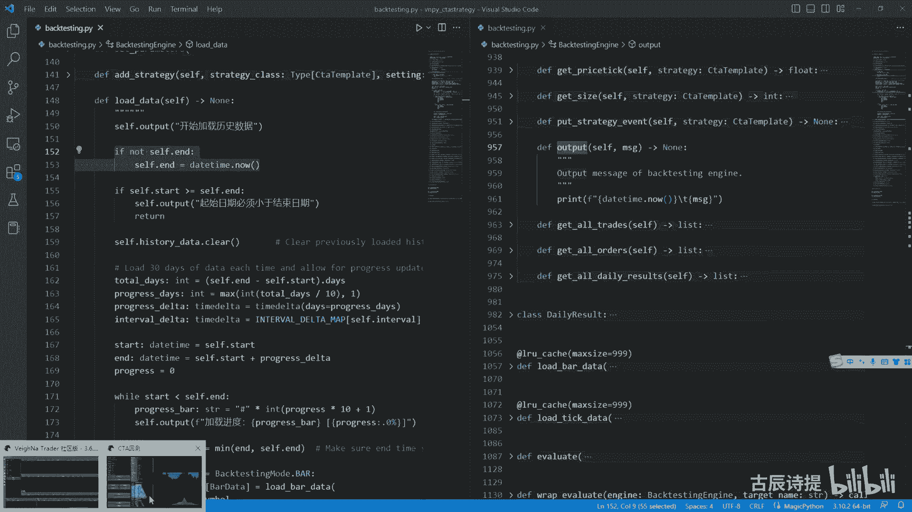

它你是可以不写的，对吧啊。

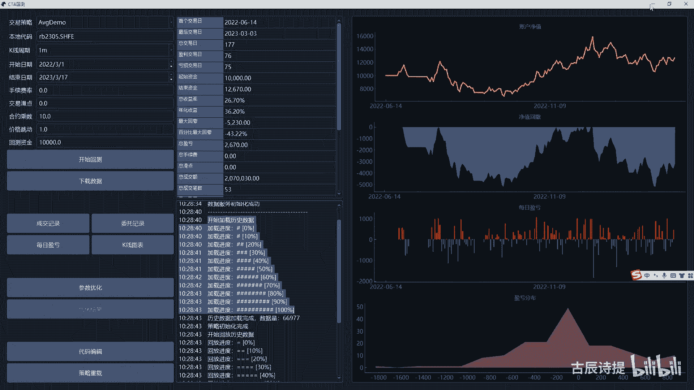

然后呢这个呃如果说开始时间大于了结束时间，他就进行下过滤，然后进行这个historic data进行一下清空啊，好这是需要注意一下的，这个total days它等于什么呀，end减去shift dud。

就是你的这个结束时间减去你的开始时间，然后取一个日期啊，总共的这个时间数，他这个呢比如说我就是这个就是这个total days啊，比如说我取一个259，一共是259天啊，记住是259天。

不是259个交易日啊，因为它是按这个开始时间和结束时间，来进行处理的是吧，是259天啊，你记住这个啊，这个是259啊，不是259，就是总共的是259啊，是259啊，这个TODO是259，对对对。

这个progress days呢咱们可以看一下啊，他int total days就是259十二十五。9，然后取一个int就是25对吧啊，他这个max和一进行对比嘛，就是25。

这个progress days是25，然后progress delete就是这个这个咱们就是他们delete，其实经常看见是在做时间进行加减的时候，呃的一个就是说类是吧，因为时间它是60分钟啊。

24小时你不能直接进行用数值进行加加减，你必须得把它用这个TEDELETE，你向左加就是不是你向左偏移，你就加号向啊，向左偏移用减号就是向右偏移，用加号是吧，然后这个里边days。

然后还有个progress this progress days是多少，是25吧，是25吧，其实这个也就是25，他只不过给封装成了一个TEDELETE是吧，为后边加减做一个准备，你看到这个。

肯定是为后边时间加减做一个准备嘛是吧，然后interval delta，它这里边是一个类啊，是在这个贝斯那个里边，他这个类里边这个你取出来之后啊，它是一个就是也是一个time delete类型。

然后它是一天啊，就是偏移一天好吧，你记住它是一好好，这边有个start和end和self，start和send是不一样的啊，是不一样的，它是一个单独的呃，就是在这个方法里面定义的一个变量是吧。

然后这个start呢一开始是等于C加start吧，啊这个没有问题，end呢它是等于什么呀，self start加上progress delete啊，比如说我这个259天，我是从2020年1月1号到后边。

我就写一个2021年的3月1号啊，就是啊，也不是就是2021年的，2020年的12月份吧，嗯因为它只有259天吗，好他这个sd start加上progress delete，其实就是往后加了25天嘛。

就比如说2021年的26号，是不是啊，就是他第一段啊，这个这个start和end的赋值是1月1号，到到这个1月26号，它就是加了，其实就是259分成了十份，里边加上一份，是不是。

然后这有个progress等于零啊，咱们一块看它这个progress是干什么用的，这有个循环是while start小于send，这个start是这个2021年1月1号吧。

然后send是这个2020年12月份，就是它最终的结束时间，是不是他这个一开始是肯定是符合条件的吧，然后progress bar它是一个什么呀，它是一个字符串类型的井号乘以。

就是你在输出比如100个井号的时候，你可以直接乘100，它就不用，你都得画上是吧，然后int progress乘以十乘以了个十零，它目前是零嘛，0×10是零吧，然后加上一它其实只有一个井号，是不是。

然后加载进度，然后就把这个就是一个井号放进去了，然后progress，然后它是零嘛啊，这个东西啊是Python技术里面的，它其实是可以在里面设置，你这个progress呢。

它是一个带有小数的一个数据类型啊，就是一个浮点的一个数据类型，它会把这个取一位小数，看见没点0。0是取一位小数，这个是Python基础里边的，如果你Python基础不太好。

可以听一下我的那个Python基础课好吧，这个就就不说了啊，然后end and看啊，end等于什么，meaning就是取消这个end和send，这个end是什么呀，这个in呢是咱们2021年2月。

不是2020年的，就是这个1月2呃，2020年的1月26号吧，然后和这个2020年的年尾曲，那肯定是2020年的1月26号吧，是吧好，这是in的啊，取了一下这个小为什么要取小啊，咱们后边说，然后呢。

if model就是不过他是这个B线，就是K线类型的，它load bload b后边说note8，它其实就是去数据库里面下载数据，咱们就以这个霸线为这个演示啊，这个tiger是一样的，我就把它删了啊。

然后咱们再往下拉一拉，下载下来这个数据你看着啊，它是什么呀，start和end这个start是什么呀，是开始日期，然后end是这个start加了一个25天嘛是吧，他是下了一段数据吧。

是不是是不是下了一段数据，然后self htal data extend extend是什么，列表和列表的这个合并吧，你可以把它理解为这个列表是主列表，然后这个列表是要添加进去的列表。

他不会把整个列表都全放放进去，它会把里边元素全部取出来，然后放到这个列表里边，对不对，这个也这个是extend吧，好然后这个progress progress就是刚才取值是零吧。

然后加等于它是个累计值啊，Progress days，这个progress days咱们上面看的是25吧，25除以two two days是259吧，25÷259，就是约等于0。1吧，但是它会等于0。

09几吧，是不是是不是等于0。09几啊，然后呢取一个最小值就是mean，然后你这个progress就是最小取一，那是不是它就变成一了，对不对，它就变成一了吧。

这个这个progress它这个最小它是取到一吧，是不是它就不会取0。1，然后它会取成一啊，这个25÷259，应该是0。1是吧啊，他取了一个progress，应该是取了啊，刚才说不对啊。

这个因为你这个progress是这个零点不到0。1，是0。09，比如说0。099吧，应该是取0。099吧，是不是为什么它要控制它，它不能取到这个E往上的，因为你的进度最终是会变成什么呀，百分之百吗。

你不跟他们变成120%吧，对不对好，这是取一个就是说较小值小于一的值啊，然后这个start等于N加上interval delete，这个interval delete你还记得吗。

interval delete是一的意思吧，是一吧，就这样嘛，Intervdelete，Interval delta，咱们可以看一下啊，Go to definition。

然后这是time delta dae吧啊这是daily是吧啊，这个是daily吧啊这个是一啊，这个self interval，这个safer interval咱们可以看一下啊，它是。

int served interval是这个interval，interval是在这赋值的啊，是在这赋值的，这个一般咱们都是用分钟吧，都是用分钟级别的啊，分钟级别的它也是取一啊。

它也是取一个minute，它都是一在咱们这个回测，这它是什么呀，end加上一个interval，delete是什么意思呢，就是你一开始这个这个start和end，这个数值都都是下载完了的吧，它是什么呀。

就是咱们一开始说的就是从你的开始日期，然后后边是加上25天，然后他这个时候呢给他做一下更新，加上了一个，比如说你是一分钟周期的啊，他就会加了一个一分钟吧，其实就是不算你这个这个end结束的那个时刻吧。

它是加了一个一吧，就是往后偏了一个一分钟，是不是，然后呢这个N加等于这个progress dva，这个end呢又加上了一个25天吧，是不是它其实就是不包含前面最后一根K线。

然后接着往后跑25天这个时间的这个日期，然后再去进行下载，是不是能理解这个意思，这个意思吧，其实它是分成了十份，但是最终会下载11份，因为什么呀，你259，你25次，你25天下载的是十次吧，对不对。

下载十次，但是你再到这来这个start，比如说我到了255啊，到了250天那个时间节点了，你250还是小于这个259啊，所以说他还得去往后再推移，也就是这个end再往后再推移25天。

但是呢你退役的时候呢，它就会做一个对比，也就是说这个用那个就是咱们刚才看到的，就是取这个小是吧，这吧取这个小吧，就是and和这个cf点end，然后当你已经超过C点end的时候。

它是不是就变成了这个end，就变成了这个最终的结束时间，对不对啊，就变成了最终的结束时间，然后会把最后九天的数据给你下载下来，这个就是分段下载有什么好处呢，就是减少下载时呃，也不是说减少下载时间啊。

就是你是它是一段一段的去下载，如果说你一次性比如下tick下载的太多了，可能会你会感觉它它不走，是不是啊，另外一个呢他也会也是为了配合这个output啊，也是配了也是为了配合这个output。

还有什么好处呢，就是这个load data和load tick，这个上面加了一个这个LRU啊，这不是L啊，LRU这个后边呢是缓存的意思，它这个作用是什么呢，啊是什么，咱们给大家去进行一下演示吧。

从这我新建一个demo，24点PY，它是哪个里面的，他是这个fn function tools里边的是吧，from function tools import l r u啊，这个咱们怎么去演示它呢。

咱们定义一个DEF，比如说an啊，比如说我这里边是A它是一个int类型，然后B它是一个int类型，然后我return一个A加BA加B好，咱们中间呢print一个print一个就是呃。

比如说A然后他这个值呢是这个它加上它是吧，然后F1下啊，然后这里边放上一个A，然后这里边放上一个B好，然后我再进行输出的时候，我print一个这个，比如说add10是啊，然后我在比如说我输出四回。

就让它加四回，这个很容易吧，它是每一次他都会进入这个函数，然后然后进行调用，对不对，然后输出一个20吧，是不是，如果说这个时候呢，我直接从这加上一个装饰器，就是LRU啊，这个里边max size。

比如说我先等于999啊，咱们先先不解释啊，咱们这个时候再看一下它这个结果看一下啊，你你会发现它只是进入了一次这个代码，然后后边就把给你把20全部给输入出来了，它其实是什么意思啊，就是咱们这个进程里边。

或者电脑里边都有缓存啊，就是这个缓存缓存的这个，它的读写速度是很快的，读写速度是很快的，它缓存是一个区域，然后你这个加了这个装饰器之后呢，它会把你这个这个方法就是function这个ADD。

然后包括后边的这个参数给它放在这个里边，放在这个里边干什么呢，下次如果说你调是一模一样的，它就会直接给你，就是返回它存储的这个值，它只计算一遍啊，它只计算一遍，这后面max size是什么意思啊。

它就是最多存放多少个这样的数据类型啊，多少个这样的参数，比如说啊我举个例子，比如说我这我就存放一，我就放一个，你运行的时候呢，他也没有问题，他也会给你挨个输出，但是如果说我后边我这改成20啊。

然后呢我这儿呢我也改成20，什么意思呢，我就先用10+10，然后我后边呢用20+10，然后再用再用20+10好，这个时候咱们来运行一下，看一下，你会发现他每次都进去对吧，因为什么呢。

我把上面给清空一下啊，cs下好，我再进行一下这个运行，因为什么呢，就是我第一次我把这个放在了缓存里边是吧，包括它的结果都放在了缓存里边，但是第二次你调的不一样了，你这个函数名是一样的。

但是你的参数不一样了，变成20了啊，然后他又进行了一次计算，然后呢又把这个整个的放到了缓存里边，然后第三次呢你又掉了10+10了，然后这个时候呢它里边又没有了，因为它里面存放的是这个20+10。

是不是啊，所以说他每回都会去掉，但是如果说你这里边放二，放二它就会进去两次，然后把这个一个10+10，一个20+10存放进去，然后后边你在调用的时候，它就可以直接给你返回出来了吧。

啊它就这么一个作用好吧，其实讲明白了之后，你会发现也很容易他这用这个装饰啊，不管是8data和这个tick data，它有什么好处啊，就是你在界面进行回测的时候。

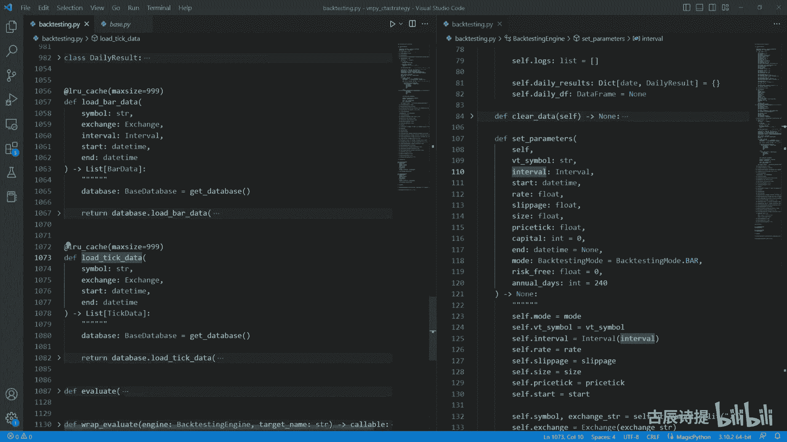

比如说我再想回测一遍，或者我这个代码我稍微改一下，我再想回回测一遍，我这个历史数据，我是不是就其实就不用去进行加载了，直接可以在缓存里面去读了吧，对不对啊，它的作用就是这个为了加快速度好吧。

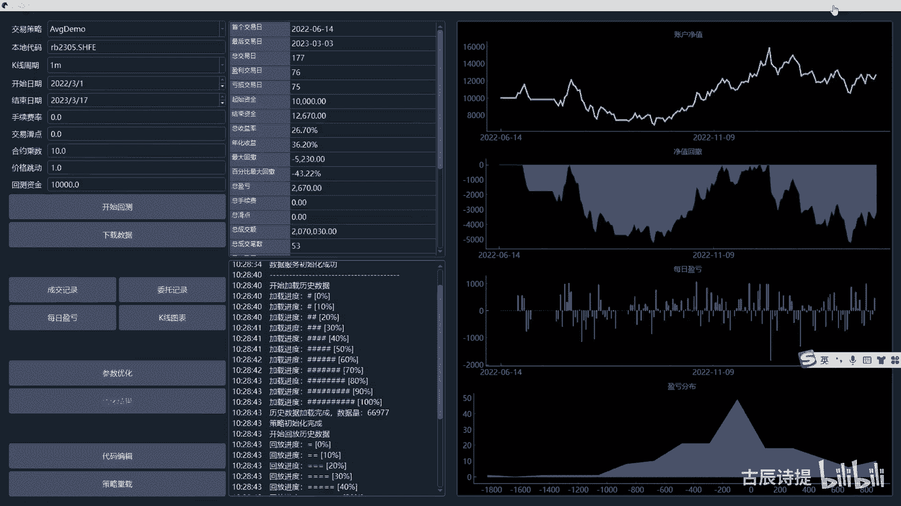

这个其实也很也很容易理解啊，只不过你不知道是不是你不知道啊，好这个就没什么好说的了，其实跟咱们那个咱们那个是简写版，这个它只不过是分段下载，而且并存放在了缓存里边。

呃你在后边如果说是一样的历史数据的时候，他就不用再进行加载了，对吧，好咱们这个load data看完之后，咱们看这个run back testing，其实这个里边就一样了。

他分了一个这个bar和这个tick啊，new bar new tick其实就是去挨个的去便利是吧，你看这个for i data in immate，就是枚举是吧，他这个前面啊这个前面还有个break。

其实它是在进行初始化啊，初始化的操作，你看use the first days of historical data for in italizing，就是这个初始化这个策略，你像这个days。

咱们可以看一下它这个逻辑啊，你看啊这个开始遍历的时候，你看它会计算这个DISCT啊，DESCT加等于一，他就是来看这个坝县啊，这个data的这个data其实是里边的这个bar data，那个数据类型嘛。

它的这个time点day啊，如果说有这个啊，如果说cf点day time，其实就是你每次来的时候，他都会把这个就是整个的这个类里边，这个这个self这个daytime更新成这个八点daytime嘛。

如果说有SDTIME，然后呢data点这个daytime day，就是这个是日期和日期不一样了，就day com加一，就是往后过了一天嘛对吧，往后过了一天，当你第一个来的时候。

他没有cf点D他们的时候他不会来进行判断，但是当你有self tom的时候，就是你已经之前是有这个B线了时候，他来判定他是不是过了一天，然后过了一天他就对com加一啊。

如果DESCT大于等于shift days，咱们看一下shift days它是做什么用的啊，SED其实它就是在load bar，你看SED等于days跟咱们那是一样的吧，就是把这个你初始化用的时间。

就是在你这个c t template，然后在那个OINIT那个里边，load bar后面加了一个days啊，就是呃用十天的，或者用20天的这个时间来进行初始化，他这就给它赋值，然后又是用在了这。

如果说已经大于它了，哎我就break我就停止了，就是初始化完成了，你看下面这个self distrunit等于true了吧，是不是，然后呢又调用了这个on start，然后training等于true。

就到这就是初始化完成了啊，初始化完成了，但这呢你要记住一下这个IX，这个IX你会发现从这根本就没有记录，而且它上面进行一下标识，给你写了一下这个IX等于它是一个int类型，等于零，它后边呢它再进行便利。

实际上是可以去发送委托了，对不对，它的便利呢，你像这个btesting data实际上有委托的这个日期啊，这个他的这个开始的时间，开始的这个八线是哪儿呢，就是这个IX加呃，就是往后走了吧是吧。

包左不包右吗，因为咱们在这这个到了这个ix，这就break了吧，这个ix其实是没有进行call back，是不是啊，就是这个IX再往后一直到最后，然后去进行遍历，然后其实就是调那个CT呃。

咱们那个那个strange里边这个欧欧霸嘛，就是对吧，欧巴啊，这个function，你看这这function，如果说你是霸县的这个模式的话，它是new bar嘛，如果说你是这个tick模式的话。

它是new tick嘛是吧，其实就是去去调用这个new啊，不啊，不是还没调到欧巴的啊，是到这个cf点，new bar里边和new tick里边，那new b和new tick里边。

他肯定是会掉这个strange，这个里边它的这个欧巴是吧，你看这个strange on bar吧是吧，只不过他前面先先做了个什么呀，就是这个class limit就是撮合限价单，撮合停止单。

然后呢把这个self bar，就是整体的这个类里边，这个self点bar复制成了这个，然后self time，然后复制成了这个，是不是跟咱写的是一样的，对不对啊，刚才写的是一样的吧。

啊这个也没什么好讲的了，是吧啊啊这个下面呢它也是把它分成了，就是一块一块的去进行回测，其实跟上面是一样的道理啊，呃你可以去分析一下这个代码range，然后就是total size，就是一共是多少是吧。

然后就是每一步是多少，其实跟上面的是一样的道理，就是跟咱们刚才讲的那块就是有这个progress，就是加载这个什么的是一样的啊，加载数据的是一样的，只不过他这个是用的是等于号啊。

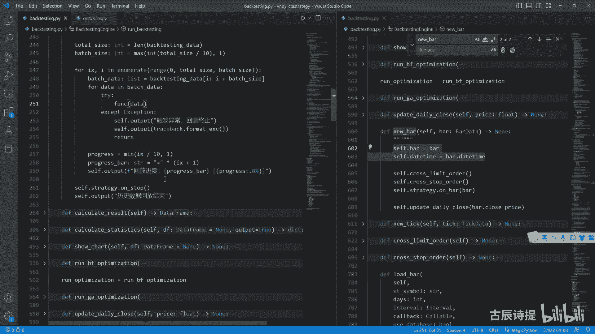

咱们就是出来之后，我们看这是等于号上面这个是井号是吧。

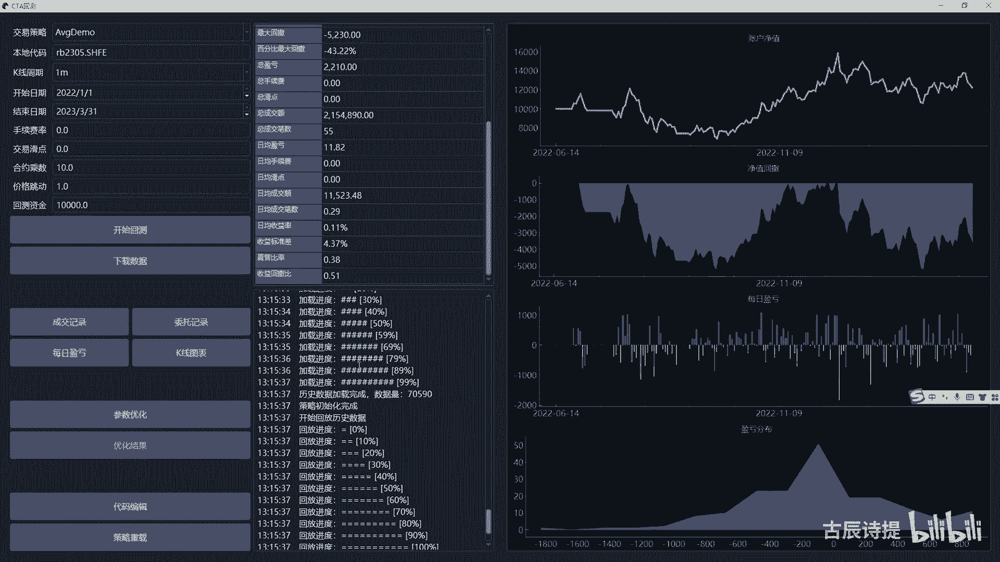

这个就不多讲了啊，你可以捋一下这个逻辑，这个ruby testing其实是最核心的一块嘛，就说完了，下面这一步就应该是calculate result，Calculate the result。

他肯定避免不了，咱们得说就是在这个最后呃，不是最后在它下面有个daily result，这个在维纳上面，它是通过每天来计算的，咱们自己写的，那个是自己划分了一个时间节点对吧，自己划分的那个时间节点。

咱们写的时候是给他定到下午三点嗯，但是呢有些品种不一样伟大，他为了适应更多的品种，它就就是用按天来直接这么来划分的，其实道理是一样的，咱们可以细致的捋一下这个daily result，它的这个逻辑。

首先INIT这呃这个就是附一些值，包括trans啊，包括这个turn over，turn over是成交额嘛，成算成交额的目的，其实更主要的是算他的这个华点嗯，它有多少华电是吧，以及呃持仓比例。

当然这个里边它好像有持仓比例吗，呃你可以自己看一下，像这个CHINGPLPL就是这个呃利润，然后training pl是在就是丁氏福音，就是交易中的这个利润，然后holding pl是这个已经交易完了。

他的这个利润，然后偷偷PL其实就这两个相加吗，在他这个calculate pl里边，你像这个todo pl是这个trading pl，加上这个holding pl是吧，然后这个net pl是净利。

其实就是把你的本金，以及你的这个呃交易的手续费啊，华点啊都给减掉，其实是一样的逻辑，看似好像挺复杂的，其实你如果说把前面那个吃透了，我相信你能理解这些东西，at tread呢它是添加跟咱们写的不一样的。

它是什么呀，咱们那个是把它整体的都放在一起，他这个是每一天都创建了一个daily result，咱们可以看一下啊，在这他这有一个self点，updelete clothes是吧。

Update close，其实就是其实就是它上面的这个类啊，不是这个方法，你看到D就是他每根拔线都会把这个八点close price，给它传递过去嘛，同时每一根霸线它都会把这个self fbar。

cf bar是整体的这个类里边这个把线，然后等于这个bar是吧，其实这个这个price跟这个cf点八点，这个close price是一样的，然后这D呢就等于cf点time date。

就是通过这个时间获取了他的这个日期，然后下面这一块你看啊，daily result就是它是optional，Optional，咱们之前说过，就是要么是daily result，要么是NN值是吧。

它后边是cf点daily results，这是个字典啊，GDD是日期啊，如果说能获取到的话，就是呃就是把这个value值给获取出来，如果没有的话是浪值，如果说有的话。

他就把这个得result点close price进行一下更新啊，daily result点close price进行一下更新啊，然后如果说是没有的话，他就用这个日期作为key。

然后daily result去实例化一个，把这个D和price的传进去，什么意思呢，比如说当前这根K线是比如是21号啊，最后一根K线咱们不说是几点啊，就是最后一根K线，下一根K线就是22号的K线。

然后过来之后，如果说是他没有，你想之前肯定21号的创建了，但是它会更新把这个close price更新到这个price里边，就是它作为就是这个日期的最后一根K线，然后下一根K线是22号的了。

22号他会给实例化一个daily result，然后把这个date和这个price给它传进去是吧，就是这么个道理，你说它准确吗，这看你需求是什么嗯，你说如果说针对期货来说的话，因为期货有夜盘。

你不能单纯的按照就是晚上12点到一点，就是就这么去切换嗯，但是如果说你对别的品种可能也不太一样，所以说这只能是一个什么呀，就是说适用范围很广，但是呢如果说你想针对某一个品种，你还是需要做一些调整的。

另外咱们看一下它这个daily result里边的这个逻辑啊，哎这个at tread咱们就不用说了，它其实就是每天把每天的交易信息都放到这个，cp trees这个里边来。

最主要的是这个calculate pl，就是计算尽力啊，就是因为你有精力之后，你才能算出其他的指标嘛是吧，所以说你看从他这个名字，你就能知道它的最核心的是计算他的净利润啊，别的你需要自己去更改是吧。

首先第一个一夫PRINCLOSE，你像是有这个prayer，就是代表前一个，如果有前一个的这个这个close，然后这个PRINCLOSE，就复制成了这个这个PRINCLOSE，这个PRINGOS。

在他这个咱们要说的就是说这个calculate result，这个里边，你看这是calculate pl吧是吧，你看它是便利，就是这个daily results，这个values。

这个values都是这个呃，就是这个类吧，就是这个daily result这个类，然后呢他会把PRINCLOSE等于这个daily result点close price。

他就会给这个pro去进行赋值是吧，他这儿呢因为你总归是有第一根，就是第一填的这个result，所以说它会不会有PRCLOSE，他如果说没有PRCLOSE的话，就是这个cf点PRECOS等于一。

所以第一天呢它的pro是21是吧啊，这就是起始的时候他给赋一下值，后边的都很正常的，可以去进去去进行，就是说计算了啊，然后他这呢有self start pos等于start pose。

然后C点pose等于等于start pose，就是一开始的时候啊，就是每天的第一根K线，它会把这个它的这个开始的持仓更新一下啊，这是计算cfa holding pl就是持仓的利润，其实这个是有争议的啊。

在我看来是有争议的，你可以想一想这个逻辑，你从这把这个holding pl给计算出来了，那如果这一天里边才有交易呢是吧，如果说有多次脚印呢，所以它只是按照你的这个你看start pos。

然后用self close price，Close price，咱们说了是当天的最后一根K线，它的这个收盘价格，然后pro是前一天的最后K线的这个收盘价格啊。

他这个时候就把shift p l给给计算出来了，后边只有在todo pl这才进行一个计算，就是就是加上嘛后边没有对它进行更新，所以说你像这个肯定会产生差异的，这就是为什么还记不记得。

咱们之前用维纳来测的时候，和咱们实际上跑出来的那个回测它是有差异的，虽然成交这个委托是一样的，就是成交量和委托量，就是整个的成交数目和委托数目是一样的，但是最终的这个结果是有一定的差异的。

差异可能就差异在这，当然咱们那个计算出来的啊，呃当时可能就是说呃，也不是最后就是在下午三点以后，晚上八点之前，可能有一部分的那个，就是夜盘的那个最后一根K线，就是说这个咱就是咱们也没有计算进去。

所以说才造成了差异，你像这就我个人认为它很明显是有一些偏颇的，当然了，可能也是考虑到这个里边有各种各样的情况，你要去进行计算的话，可能会更加的乱，这样的话虽然有差异。

但是因为这个cf点hold holding pl，加到这个todo pl里边，他每次都是单独的去加的是吧，其实最重要的就是这个trading pl，就是当你成交了之后，它来进行这个这一笔成交的。

它的这个盈利，这个是最关键的，你持仓的这个利润其实每一天都是在更新的，对不对啊，这个是shift training count，它是一个附了一个值。

然后for tread except the trees，就是去便利嘛，如果说你是愣的话，就是trade their volume，就是一个正直，如果说是shirt的话。

try their volume就是个负值是吧，然后把in the post给它计算出来，然后turn over，就是计算一下它的成交的这个成交额。

然后呢training pl就是啊post change，就是你的就是改变了你成交了多少，然后乘以close price减去这个trial price，再乘以一个这个size，其实这计算的很简洁。

但是你如果说想更准确更精准的话，你需要去分门别类的，因为它只是从cf点cosplay减去C点这个呃trade price，包括这里边就是加减仓啊什么的，其实你都需要考虑进去的，你可以考量一下啊。

它这个准确性，所以说不要去迷信任何的平台啊，就是你得知道回测和这个实际上的这个什么呀，这个交易是有很大的差异的，这就为什么说大家回测出来的，很多策略都是很挣钱，但是一跑十盘都拉稀。

因为回测它毕竟是回测始终，它是一个数据的处理，反而并不是说呃跟这个实盘一样，它会有模有这个撮合呀是吧，包括一些集团情况的表现啊，这的计算其实符合逻辑，但是你如果想让它更准确的话，你需要自己去考量。

包括它的咱们之前写的啊均价开仓啊，对吧嗯，就这个这个这个呃就是这个凭证的价格，是不是啊，他啊当然它这呢是通过这个什么呀，就是说用每天的这个这个self clothes，来进行计算啊。

用这个self加clothes来来进行计算的好，然后这个是cf点呃，这个是华点嘛，就是用TRAVOLUME乘以size，然后再乘以一个呃，就是划点的这个比例啊，VLO乘以size。

比如说我划每次划一个点，然后呢就是这个VLO，比如三首就是就是三个点乘以，比如说十块钱一个点，就是30块钱，从这里可以看出来它是一个双向滑点是吧，双向滑点只要你有成交，他就有华点啊。

TOVER是你的成交额，commission是你的这个手续费，这个瑞啊，这个rate它是手续费率啊，就是TVER乘一个手续费率一般都是万一嘛是吧，然后这头呃这个todo pl和NPL这个模块。

你可以自己去做一下更改，当然了，你用它这个最主最主要的，其实咱们是看他的这个什么呀，Trading pl，Trading pl，当然了，很多的很多的这个你想看到一些指标，从这你是看不到的。

比如说胜率是吧。

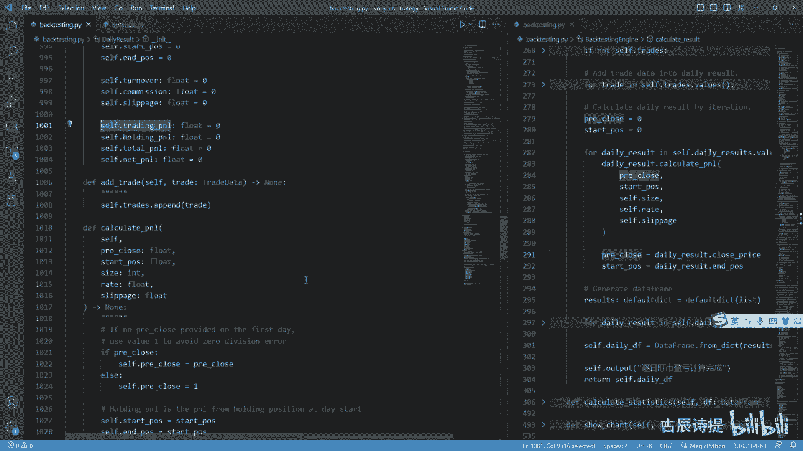

这里边它能给你显示出来的是什么呀，是它的这个呃就是呃就是按日期来的，盈利的交易日和亏损的交易日。

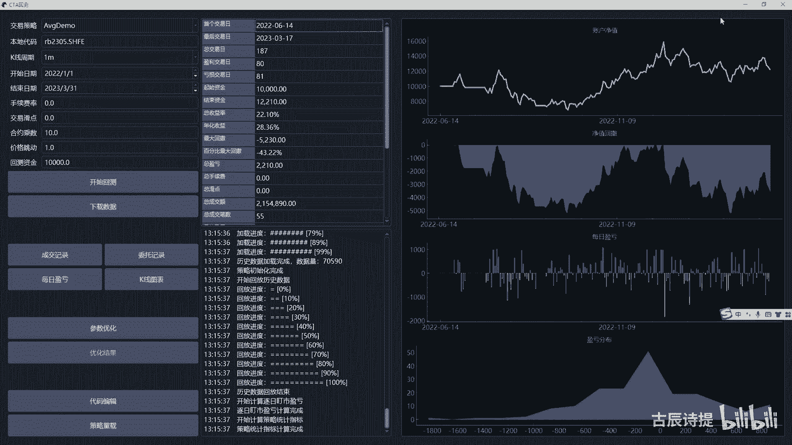

按这个就是计算方式的不一样，你可以包括比如说我每一笔委托，最大的盈利和最大的这个亏损啊，单笔最大亏损，单笔最大盈利，这个单笔还是单次，这个也涉及到如果说你有增减仓的话，是从啊持仓为零到最后持持仓为零。

中间的最大盈利，最大亏损还是每笔，就是比如说我一次呃成交一笔，然后我有就是三次，就是就是从持仓为一到持仓为三，然后最后又变成从持仓为三变成持仓为零是吧，就是从0~3再到3~0，这算一次。

还是就是说你每瓶一首算一次，这个都需要你自己去捋这个逻辑，咱们之前也一直在讲，如果说你想这么来算的话，比如说对应着的这一首，你就对应着这，你就需要单独的把它存放在这个呃列表，或者字或者字典里边去。

然后后边有平仓了，你得挨个去消，是不是把逻辑捋清楚了，代码就能写清楚好吧，这个是计算它的这个就是result，就是计算结果，计算结果他最后生成什么呀，就是这个daily df，就是这个二维表。

一般有这个DF结尾的都是这个data from data from，然后它from dict result，然后sit index date，这是什么意思啊，就是他这个就是通过什么呀。

就是from dict嘛，全是从字典里边，你像他这个字典全是就是这个result这个key，然后end这个value这个字肯定是字，字典里边含字典是吧，然后呢就是肯定是这个以这个什么key key。

肯定是这个他的这个什么呀，这个date嘛，因为本身这个daily result，它的这个就是它的就是在这个self点，这个daily results里边，它的这个key值就是这个呃date嘛，是不是啊。

就是这个把它全部变成字典，然后再从字典里边去生成这个data frame，然后把它的这个索引值变为date，什么叫索引值啊，就是你这个二维表吗啊，这是一行一行一行的，就是你的这个索引值。

第一行就是通过这一行能够找到对应的这个啊，通过这个行首能找到这个对应的行，这这个就是索引值，同样你有列索引是吧，列名啊好。

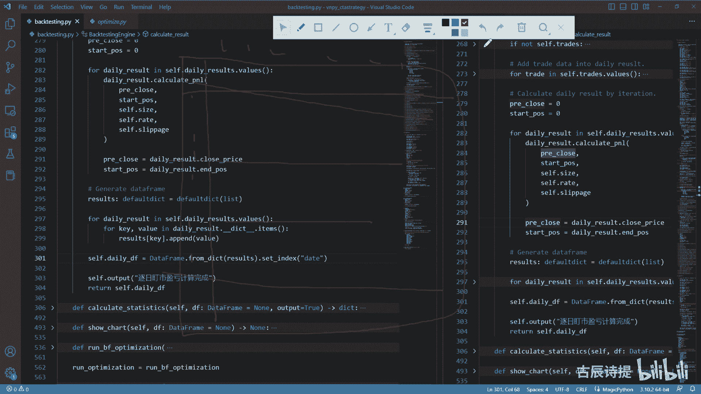

那这节课呢咱们就先到这。