# 第24节课 交易信号及委托2 - P1 - 古辰诗提 - BV1LetXeBEcW

欢迎大家来到从零开始量化系列课程，MC课程的第24节课，这节课咱们接着讲，这个经常与委托上一节课说了，他的这个语法是什么呢，首先你要确定你的动作是买开还是迈开，还是买平还是卖平，确定你动作之后呢。

后边加上手术，这个手术可以省略它有四个词，Share，shares contract和contracts4个关键字，然后这个手术可以省略，如果省略的话，他会去你这个策略属性里边去找。

你设定的就是那个一般都是一手啊，然后后边跟什么呢，是跟next bar还是跟this bar，其实就是你的这个位置，this呃，this bar呢是和这个today是一样的意思。

但是咱们现在都通常都用this b呃，this bar后边只能是跟clothes，如果说你跟别的就是open high呃，它会报错，编译就编译不过去，当然这也很符合逻辑，为什么呢。

就是你这个用this8，它其实已经是未来函数了对吧，如果说你还能指定高低点，那不就更未来了吗，呃我如果说就是说我指定低点，我就买，我就买这个买开仓，那我肯定会挣钱是吧，我下一根我就平掉。

如果可以这么去写的话，那妥妥的就是纯未来函数啊，然后用next bar呢，呃就是this bar后边只能跟clothes，然后也不用去跟这个委托类型，然后next把后边你是跟一个价格。

你可以用at来后边写上这个价格，at clothes也好，at open也好，at high也好，或者at一个具体的价格也好，他这个是当前K线的，就是尤其是高开低收，这个四个是当前K线的这个价格。

这个千万不要理解错了，呃啊这个价格后边呢是跟就是跟着的，是你这个委托类型，现价还是这个呃，停损单就是stop单还是市价呃，上一节课说了。

这个this bar就是咱们说的是this bat clothes是吧，这个呢编译的时候不会报错，但是建议大家还是用on clothes，On close，因为这个在英语里边好理解一些。

on close其实就指的是在那个时候去买进啊，指的是在那个时候at一般后边是跟一个价格，On close，你可以把它理解为是在收盘那个时候去买啊，呃是这个意思好吧，然后我上一节课没具体给大家演示。

就是说用this bar和这个用next把它的区别，这节课先给大家演示一下，Fast ma，咱们还是用咱们这最简单的一个策略啊，Throma，好然后fast a等于average clone。

只要close10吧，十啊，然后slow m a等于，Range close，然后30，if fast m close over是吧，cross over这个close你可以再研究一下，咱们之前说过。

如果说你连起来写的话，和分开来写，他的这个方式不一样，连起来写它是一个函数是吧，你可能必须得加上括号，然后分开写呢就是更加符合，好像咱们这个阅读这个之前没有说啊，这个比如说两条线交叉。

它肯定会有这种就是等于的，这个时候那等于是放在前面呢，还是放在后边呢，这个你可以去研究一下啊，去研究一下，因为咱们之前说过，比如说你像K线啊，这个就这个是K线，咱们只算这个收盘价的话。

收盘价你这个穿插就上穿，它是一个动态的，对不对，它是一个动态的吧，你你这样传，或者你这样传，他得判定你前一根的收盘价和后一根的收盘价，跟你这个线来比是吧，那你这个两根均线上穿它也是这样的啊。

你比的话大于小于肯定没有问题，就是你得知道哪边会加上这个等于号啊，就是你如果有兴趣的话，可以去研究一下crossover slow，a z by next吧，market啊，我就不用at了啊。

If fast may close under slow，And main then sell short，Nest 8k market。

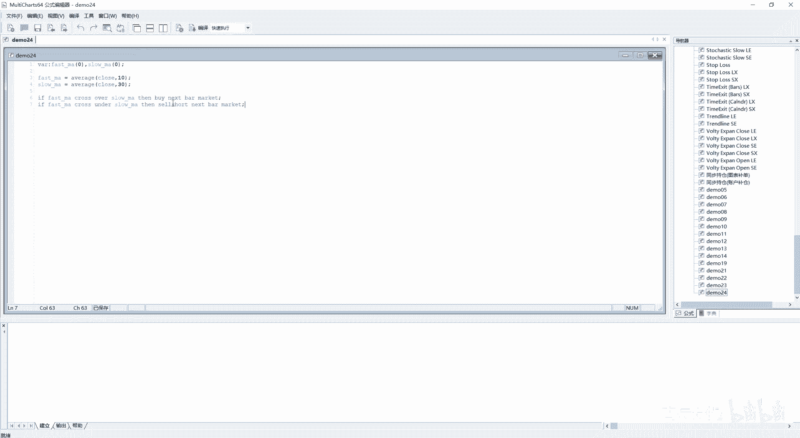

好，进行一下编译，编译没有问题，然后从这插入信号，24，确定close啊。

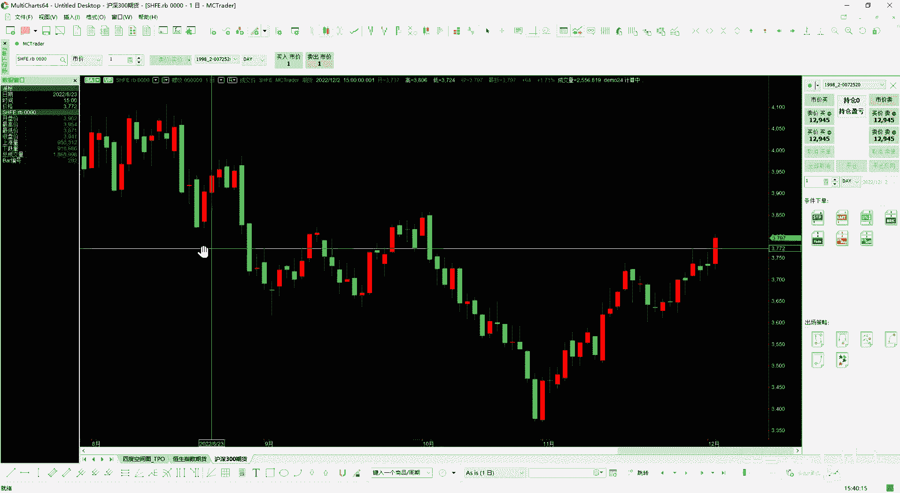

它就有了策略绩效报告，咱们看一下，这是亏了1万6180，这是日线的是吧。

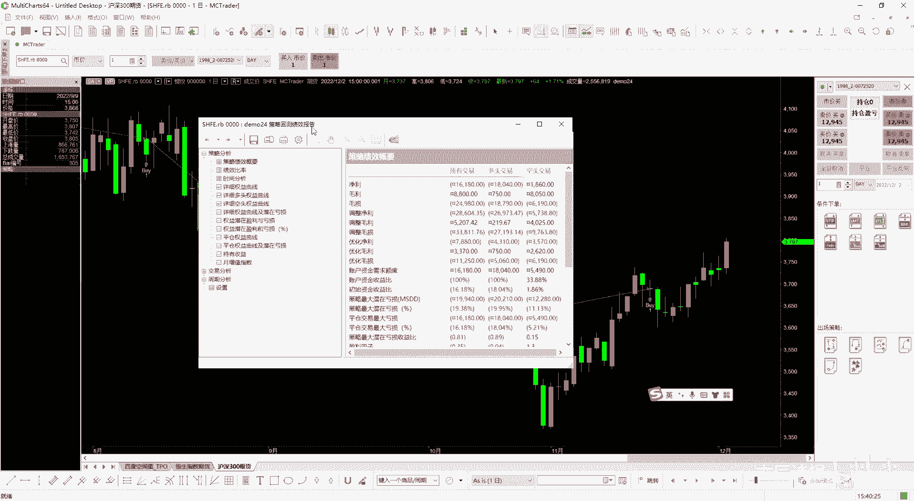

1万6180，记住这个啊，1万6180，This bar by next bar market by this bar，Clothes shell short，this8close是吧。

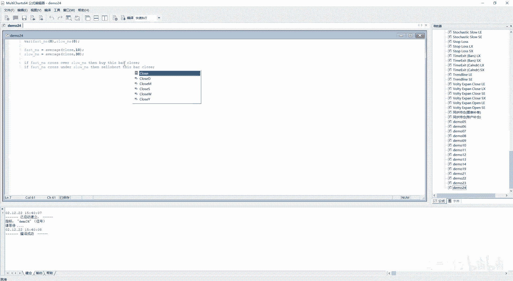

哎好咱们再来看一下1万6150。

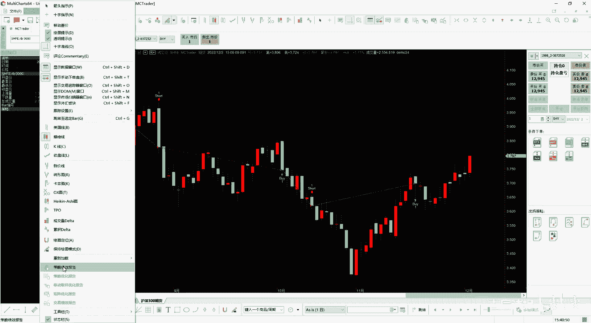

这差异还是挺大的吧，是不是一般啊。

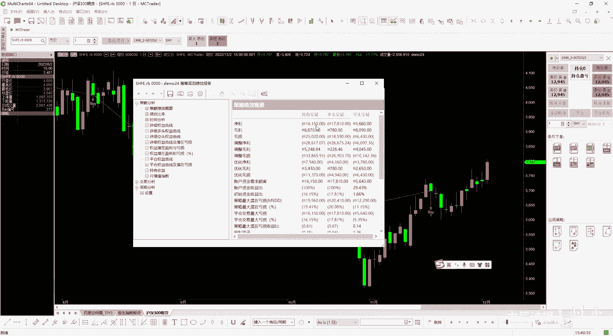

通常情况下，大部分时候他都会优化你的这个策略，会让你策略干就是看起来更好，就是this bat就是this bar clothes on clothes，所以说少用这个啊，少用这个，他会欺骗你，好吧。

这个是首先给大家做的是个演示啊，下面呢给大家讲这个重点就是这个委托单类型，咱们这个MC里边能给提供三种委托单，一个是limit弹，就是限价单，然后一个是stop单，就是停止单，停损单都可以啊。

stop单，还有一个呢叫market，这个是市价单啊，首先咱们来说这个试驾单，试驾单呢他是追求立即成交，它通常情况下啊不知道MC的底层是怎么做的，通常情况下都是把这个价格。

就是当然你后边也没也没给他价格，他就直接用涨跌停价去发出去，如果说这个没有在涨跌停板上，它确保是能成交的，大家应该都了解过，就是交易所的这种这个撮合机制，就是他是呃时间优先和价格优先是吧。

时间优先和价格优先，当然这个价格会更加凌驾于这个时间之上，就是如果说出相同的价格，比如说我出5000买，你出5000买，先到先得，就是你把这个委托发送给这个就是这个交易所，他去撮合的时候先到先得。

但是我出5001，我就能跨过你提前交易，这就是时间有限啊，然后如果说价格是相等的话，呃就是就是时间有限，如果价格不相等的话，价格是谁越有优势，谁越有限是吧，这样的一个撮合机制。

它会给它转成涨跌停价去发送，但是涨跌停价发送，你千万不要理解为我，比如说我目前价格是5000，他的这个涨停价是6000，然后我用6000去发送，它会以6000成交，这跟咱们正常理解的去大街上去买菜呃。

你五块钱的菜，我十块钱给你，那肯定就是这个商家肯定会特别高兴，也很愿意跟你达成这笔成交，但是交易所撮合他不是这样的，交易所撮合它是一个三方机构嘛，就这个是交易所，然后这个是买家，然后那边是卖家对吧。

然后然后这么就是他来撮合撮合，他就有这个撮合的机制，撮合机制呢你们可以百度搜一下，它是三个价格，取中间值，取中间值啊，它这个三个价格呢应该是上一笔交易的成交价，上一笔交易的成交价。

以及当前交易的这个买价和卖价啊，三者取中间值来进行撮合的啊，他应该是这样的一个撮合机制啊，其实具体的里边有空就是会有很多的东西，大概就是这么个情况，所以说不会说跟你是想象的似的，然后你给了六。

就是你发了6000块钱，你就以6000成交，绝对不是这样的，好吧，呃market呢其实就是转成这个涨跌定价，应该是这样的，因为看不到底层代码，转成涨跌均价，追求立即成交，然后第二个呢是这个limit单。

limit单呢，就是一般交易所的底层都会接受这个列名单，叫现价单，这个有些交易所啊，比如中国的三大交易所或者五大交易所，他们肯定是都接收限价单的，另外他接受委托的类型可能还有些区别。

有的是接受只接受限价单，有的是接受限价单和市价单啊，有的可能就是说只接受限价单，但是肯定是接受限价单的，线下单的意思是什么呢，其实在我这个哔哩哔哩，包括第一道课，包括后面的课程都反复跟大家讲。

这个逻辑其实不难理解，就是中国采取的，你看似他有四个，就是说这个动作就是买开买平，卖开卖平，其实你会发现它归根结底是买卖对吧，是买卖国外呢它会有这种进仓的模式，net就是只有买和卖这种两种操作。

你买十首你就变成十首，我卖20首，你再卖出20首，你就还有十首，但是中国呢你必须得指定，我是买平还是买开是吧，买开没有什么问题，你买多少就是多少，你买平的话，如果说你的这个买评量超过你的持仓量。

他是成交不了的，要么是给你报错，要么是给你把这个已有的给平掉，然后剩下的再给你个提示，就是你的这个平呃，平仓量超过持呃，超过这个持仓量，这个呢是我觉得对于咱们量化来说，是有很大的好处的，为什么。

如果说你代码写的不够，那么或者是刚开始写挂实盘，或者不是特别认真，或者说是自己写的代码自己没检查到是吧，你本身有五手持仓，可能在某个很偶然的条件下，你评了十首，你平了十首，不会跟这个净藏式的。

我又变成了空五首，不会他要么是报错，要么是先给你把五首评了是吧，然后再给你报个错啊，一般情况下都会给你直接报错啊，所以这样对于咱们来说其实有好处呃，有好处是对咱们的一种保护嘛，所以你理解这个呢。

你再来理解这个限价单就很好理解了，因为你买开也好，买平也好，然后你卖开也好，卖平也好，它归根结底是买和卖嘛对吧，是买和卖，你如果说买个东西买5000，就是你花5000块钱买限价单是什么意思。

最终的撮合结果买的买东西，你想啊买的越便宜越好，对不对是吧，所以说你最终的撮合结果会小于等于5000啊，然后你卖东西当然是卖的越贵越好，越贵对你越有利嘛是吧，他最终的撮合结果是会大于等于5000啊。

这个就是现价单，现价单呃，你会发现，其实你理解一下交易所为什么都接受限价单，因为这这个这样最终撮合出来的，你不会有意见，对不对，如果说他接受这个试驾单，他给你去划点，给你划个一二十点。

这个你到时候再有意见对吧，我是这么理解的啊，停止单呢就完全和它相反，就是买是大于等于这个价格，然后再触发，你记住，交易所一般啊一般是没有这个停止单这一说的，一般是没有停止单这一说的。

交易所是是它是什么呀，就是说一般只接收限价单，或者最多再加个试价单，停止单是咱们自己去定义的，停止单它其实就是什么呢，比如说我买了，我花5000块钱买了一手罗文，当他这个价格跌到4800以下的时候。

我就把它给平掉，咱们或者叫止损或者叫停损是吧，跌到4800停掉，我其实就可以，我有这个仓位之后，我就可以挂上这个委托，当它这个价格低于4800的时候，我就平仓，你想想以这样的一个逻辑。

你如果要用现价单的话啊，你如果是现价单去挂这个委托的话，你会有什么问题，限价单买的越便宜越好呀，你挂一个4800，是吧，你挂一个4800，就是你挂出去了之后，你得一直去等着，一直去等着。

然后呢你一般都是这么理解是吧，等着等着它到4800的时候，它就会平，但是你要知道你挂的这个委托单是什么呀，对吧，你又是挂了一个现价单卖屏，因为你持有多单，然后你要平仓挂4800卖平。

卖平是卖的就是价格越高越好，所以说你当前这个价格是5000，你开进去了，然后他刚往下走，比如说变成4999了，然后呢你挂的4800，你一看就是你要卖的是4800，我现在都4999了。

我不比你这个更优更有优势吗，立马就成交了对吧，能理解过来吗，你这个是要卖平，你是往外卖东西，你是卖的越贵越好是吧，他就立马就成交了，所以说你从这儿你是不能挂限价单的，你应该挂个什么呀，你应该挂个停止单。

停止单刚好跟他相反啊，刚好跟他相反，但是呢其实你也不能说完全跟它相反，就是大概意思当是跟它相反，停止单是什么意思呢，就是他其实不是发到交易所去撮合的，他是保持在你本地，你本机上面，你本机上面。

然后等着哎，我把这个价格等着4800，等什么时候，tick一比1B传过来之后，发现比这个4800小于等于这个四，这个4800了，这个时候你转成限价单嗯，应该是转成涨跌停价啊，因为底层咱们也看不见。

也不知道他是以什么价格就是好诶，应该是涨跌定价，因为在实盘的时候，你会看到他这个委托，然后给发出去，给发出去之后，他会立即成交，但是成交这个价格是比4800有优势呢，还是有劣势呢，这个谁也不好说。

因为你当时的价格，比如说我就冲了一下4800，然后又反弹上去了，你是什么呀，就是刚好碰了一下4800块钱，碰了一下4800块钱呢，然后你就以这个价格转成了市价单就发出去了，发出去之后他可能又拉上去了。

那可能会在较高的价格成交，但是大部分都会在较低的价格啊，都会有滑点的，所以说从这你可以看出来，就是说其实你像这种限价单，你是不能用在止损上面的的啊，你是不能用在止损上面的，你只能用在止盈上面对吧是吧。

你止盈如果发个5100块钱，我要卖的话，我要卖得越高越好，他撮合的时候是越高越好吗，我要大于等于这个5000亿才行啊，可能会比较绕，但是归根结底你得知道什么呢，就是限价单就是对你本身有优势。

然后这个停止单呢是跟它相反，就是理解上是相反，但是他们底层是完全是两回事啊，至于你用什么样的委托，这个得你自己去做决策，得你自己去做决定啊，另外从这还要再强调一点，就是对于这个撮合的一个理解。

你千万不要把撮合理解为，就是每一笔tick给你发过来的成交量啊，还是它的持仓量啊，还是成交价格呀，买就是买一价，卖二价，就是你不要理解为是什么呢，就是它它的一个动态的东西，什么意思呢，就是这个撮合机制。

其实你可以把它理解为什么呀，就像一条小溪一样，小溪一样就这样去流过去是吧，里边都是水，它是每隔500ms，就是一秒两比tick嘛，每隔500ms呢，他给你拍个照片，然后发给你。

然后过了500ms再给你拍个照片发给你，它是一种状态，知道吗，它是一种状态，这个之前咱们也讲过，反复的强调过，中间有可能它会出现各种各样的极端情况啊，比如说它成交特别的激烈或者极端行情一出现。

它这个中间里边可能就会出现了，很大的一个价差啊，这个你一定要知道，所以说咱们在说的那个撮合机制的时候，并不是说上一笔tick去撮合，而是他上一次成交，你想想在这500ms里边，它可能成交1000笔。

它是上一次成交这个撮合价格明白吗，好了，如果说还想了解更细，其实我哔哩哔哩上那个课在讲委托的时候，有专门讲过这个东西，我在这就不再过多讲了，你一定要理解这个啊，这个很重要，跟你写代码息息相关。

你也发现了，如果说你逻辑不对，你代码怎么写都不对啊，这个就是你像很多，比如说客户一改需求，比如程序员就崩溃了，为什么，因为他他的逻辑，都是按照你原本的这个需求来设定的，你突然改了个需求。

其实就是需求不一样，它得重新设定逻辑，所以说他好的代码都是白写了的，可能有些人认为啊，我去让他给我写个软件，然后你我今天这个需求我想了想，我还要再添一个需求，添一个需求还好说，你知道吗。

最害怕的是改一个需求，你需求改了，可能之前写的都全白费啊，这个一定要理解清楚了，理解清楚了，咱们才好往后边讲，可能之前讲的大家可能就有些乱，就是那什么情况下用这个就是这个呃限价单呢。

什么情况下用这个停止单呢啊就是有点懵，你记住了，其实这个限价单也好，停止单也好，它是跟你前面行情是挂钩的，你不能不看你前面行行情来挂这个委托，这样的话是会出问题的对吧，你不看前面行情，你不考虑前面行情。

那你怎么挂委托呀，啊你去买卖也好，买也好，你挂的这个价格，如果说你不看前面行情，你没法挂，所以说你得对比前面行情的MC呢，我觉得比较贴心的地方是给你简化了这个问题，他怎么简化的呢。

就是如果说你理解不了停止单呀，什么限价单也好呀，其实他有个更好的理解方方式是什么呢，By next bar，就是at，Close or higher，或者or loler。

就是我用当前的收盘价或者比它更高的价格，我来买，我来买，这个就相当于什么呀，就是我买的劣势嘛，其实就相当于就是那个那个stop单嘛，如果说你要比他一般，咱们都是low了是吧。

比他更低的价格就是更好的进场位置嘛，这个就相当于limit嘛对吧，然后你这个sr short next b，next吧，at用close的话，比如说我用higher or higher啊。

H用higher，就是我用这个就是我平仓的时候用当前收盘价，或者说比它价格更高，我平仓我持有多单呢，我比它价格更高来平仓，这个是不是就是现价单是吧，或者我or low ler，是不是就是停止单。

我平仓的时候我比它的价格更低，是不是就是平指单对吧，这个能理解吧，啊就是用OHIO和这个all lola这样能减少很多，就你对于涨跌停价啊，不是你对于这个止盈止损价格的迷惘迷茫啊。

就是呃不是止盈止损价格，是对于这种就是限价还是停损呃，比较迷茫啊，当然你也可以直接用market market是纯试驾单，而这个是它的涨跌停价啊，你看这个by or lola。

买或者比它更低的价格就是现价吗，buy or higher就是比它更高的价格，那不就是停就是停就是停止吗，停止单嘛是吧，sell我卖我卖的越贵越好，卖的越贵，就跟咱们刚才说的是限价单码卖的越便宜。

那不就亏了嘛，就是停止打嘛，Ser shot，它本质sell shirt，本质上它还是sell对吧，你看sell在前面呢，他还是卖出去啊，只不过我有多惨，我把它卖出去，你看是它其实和cl是一样的。

buto cover它本质还是by呀，对不对啊，本质还是by，然后or lola哈，就是跟这个by它是一样的意思，好吧啊，这个一定要理解啊，下面这个是这个三种写法，咱们之前也讲过。

This bon close，还没enclose，当然这个可以省略啊，在底层编译的时候也不会把关键字编译进去，所以说你用on还是用at啊都可以，但是用on的话，可能在语法上更容易理解一些。

是在那个时刻去卖，而不是在那个价格啊，next bat open at open啊，这个at market是可以的，如果说你next bat open单独这么来写，你编译也能编译过去。

他这个at open他是什么意思呢，是在开盘的时候去买at open limit，你能编译过去吗，你也能编译过去，它是什么意思呢，就是at open，就是这个limit用用这个当前K线的开盘价格。

用这个limit单去发送啊，这个你一定要理要理解清楚了啊，这个at open和at open limit它其实是两回事，其实是两回事啊，你后边的委托单，委托单类型前面肯定是价格。

但是你单纯的next b at open或者next把open，其实就是在就是说下一个呃，下一根K线开盘的时候，其实你m a r k e t market，就是你可以这么来理解啊。

就是at open用这个market，当然你不能一起用啊，这个编译会有问题的，其实就是在开盘的时候，我就是买进啊，买进好吧，你你不能说，比如at open，你觉得at open行，然后我at high。

它会出问题的啊，at high会出问题的，所以说这个open和你理解的这个哦，那个就是它的这个最高价格，最低价格呃，它是有区别的，它是什么意思，就是我在就是下一根K线，Next bat open。

就是下一根K线开盘的时候，我买进啊，理解清楚好，最后一个是at market啊，at market你想这个说的很清楚啊，就是流动性不是很强的时候，就是会面临比较大的这个滑点风险。

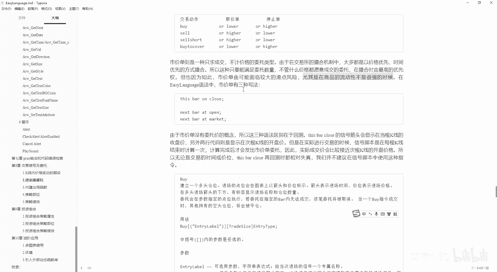

这个也能解释咱们之前讲过的。

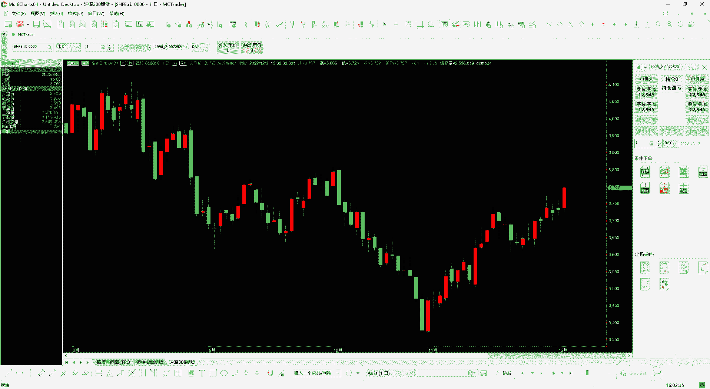

就是说这个设置信号里边属性，你看啊，你如果说使用精细资料的话，它会忽略相同价格的TX。

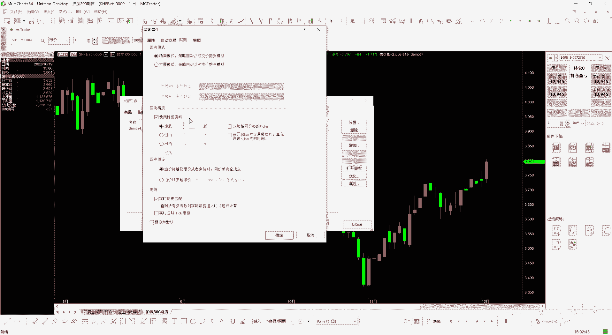

为什么会有很多相同价格的TX啊，这个就是咱们刚才讲的水流，就是如果说你里边交易很平反很多，你可能每一次拍的照片都不一样是吧，但是如果说交易很清淡，交易特别的清淡，就挂着一手买单5001卖单5000。

老是撮合不了是吧，他们还都是用的限价单，老是撮合不了，那怎么办，就是他每一次给你拍的都是一样的东西啊，它的上一笔成交价，他上一笔成交价可能是在几分钟前了啊。

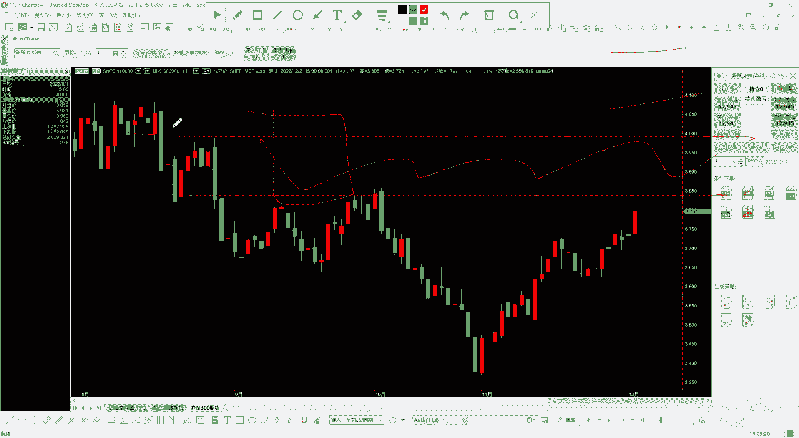

啊是这么个意思好吧，然后下面的就是你看这也写了，This spk close，就是在回测的时候啊，在回测时都相对失正，我们并不建议在信号脚本中使用这种指令啊。

另外这个bushort sell cover它是可以取名字的，就是咱们可以看一下啊，它by，哎呀哎呀嘶，哎呀这个百坑啊，他给弄这来了，哎呀，还是放这来吧，啊怎么还放不进去了呢，哎呀关了吧。

这个后边呢是可以取名字的，取名字是什么意思。

就是咱们这个策略设置信号啊，他错误了是吧。

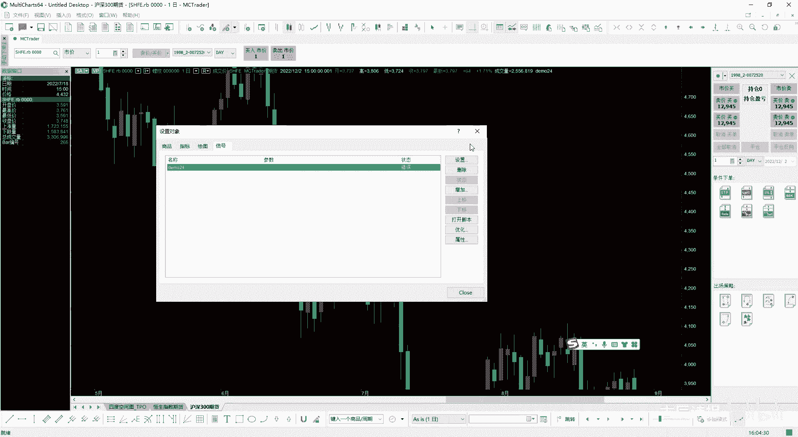

给他，Next bat market，Next part market。

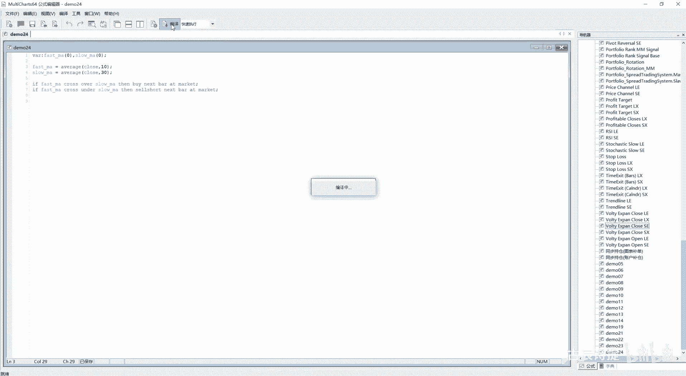

你想他这个他这就写了个by是吧。

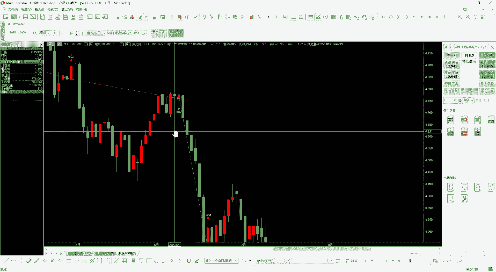

然后呢咱们看这个策略绩效报告的时候。

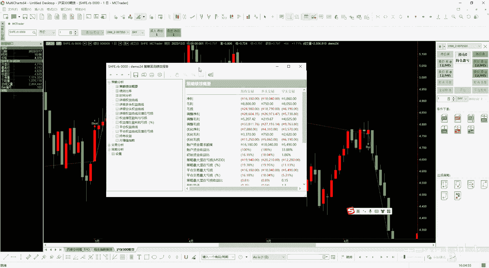

他有个什么呀，就是说这个交易列表就是每一笔交易，它的这个交啊交易列表，这个里边你像类型都是有的信号。

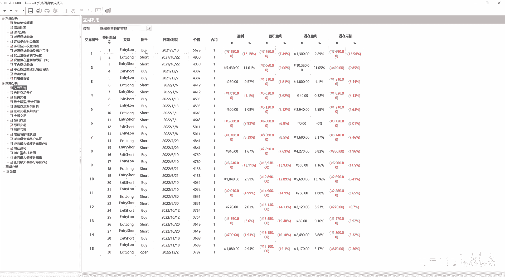

但是如果说嗯就是比如说你是多就是多次进场，就是分批进场的话，你需要给它起名字，因为后边是有用的，你平仓的时候，你评哪个，你凭哪个仓位也可以去指定的。

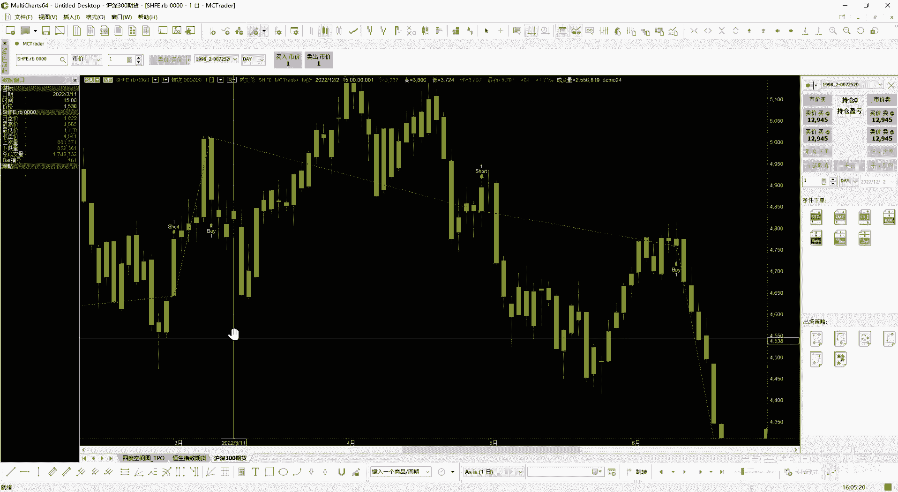

这个时候呢你可以把它取一个名字ZBY，比如这个括号里边写上什么名字呢，by one啊，然后sell short，然后这里边写上啊，就是这个sale shut one啊。

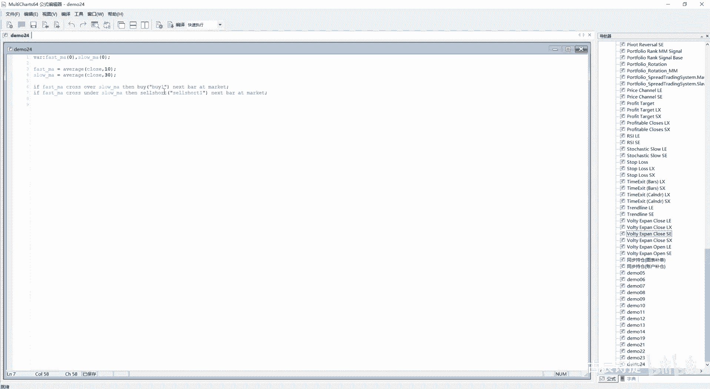

然后进行一下编译，然后咱们可以看见了啊，他就变成了shell short one啊，sa short one了是吧。

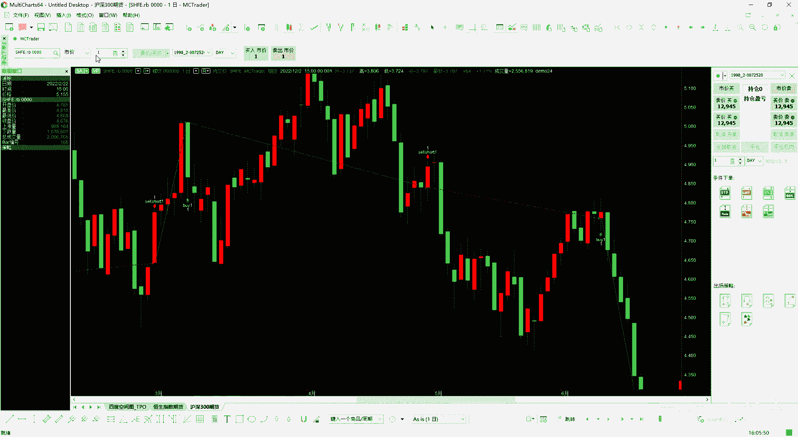

然后咱们看看视图，就是记这个绩效报告里边，他这有个信号就写着bia one，sir sht one了吧对吧，刚才是没有的啊，刚才是没有的，你如果再给它取个别的名字，比如说，啊变异，你看是吧。

这是可以取名的，这有什么用，如果说你分批进场的话，后边想评哪个仓位，你可以通过这个标识去找到那个仓位，然后把那个仓位给平掉好吧，这个呢这节课呢可能更更多的是讲的这个理论。

但是你一定要理解清楚这个委托类型，然后你自己再试一下，就是说你这个代码写的时候，我当时开始学这个的时候，就是next bar，This bar，还有today，然后以及这个委托类型把我困扰了很长时间。

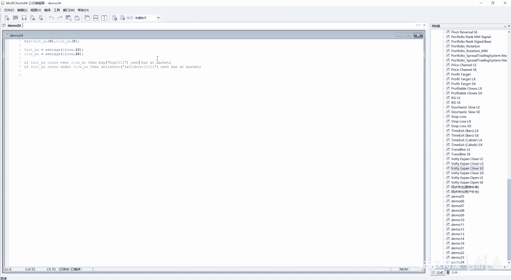