# 第25节课 veighna平台回测引擎介绍(2) - P1 - 古辰诗提 - BV1S142197SR

好欢迎大家来到从零开始量化系列课程，BMPY课程的第25节课，上一节课咱们说到了这个calculate sult啊，这是计算结果，然后呢，最后呢，他就是把这个统计指标给咱们给出来是吧。

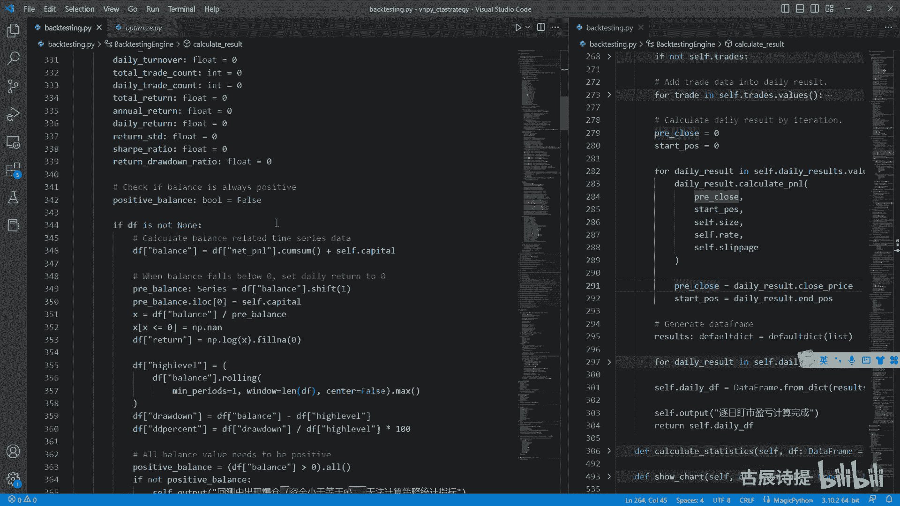

以前不知道大家以前有没有用过，他会把这个统计指标都全输入到这啊。

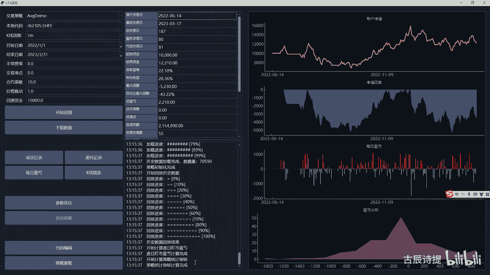

但是这呢它给限制了，因为这有个output，就是你输出来的时候就是让不让输出是吧，它后边有这个判定，if output才输出呢是吧，最终看你是如何去进行调用的，好好其实这个就是根据你的统计指标。

也就是这个二维表来计算它的，整个的这个呃统计指标啊，包括就是你的这个整个的，就是说一共是亏损了多少天呀，盈利了多少天啊，最大的回撤呀什么的啊，都是从这里面来进行计算的，这个没法往细里讲。

因为更多的是这个data frame和NPD包啊，包括这个serious它的一个计算啊，serious计算，你看这个shift是表示偏移的意思啊，偏移我就简单的说一下啊，其实你们可以看看。

就是就是这一类的教程，如果后面有机会的话，会给大家专门的就是说咱们在量化里边用，就是用的比较多的，这个内裤，会给大家就是单独出一个系列的刻板好，包括这个i lock还是lock。

就是你也可以没有I也没有问题，但是也有I和没有I它的区别是什么啊，你看这个balance就是代表这个NPL啊，就是com sum1看这就是统计，就是把它总和加起来，再加上一个capital。

就是本金加上总的啊，这个利润对吧，然后呢这个后边你像这个FIONA，其实就是把这个NN值啊，NN值NAN啊，在这个pandas和当派里边空值的话就是NAN，然后把这个空值填成零啊，是这么个意思。

后边你看SAM就是求和的意思嘛，是吧啊，求和的意思啊，这个COM和这个SUM这个啊，这个是累计求和累计求和，这个是整体求和，累计求和是什么意思啊，就是比如说1234累计求和，这是一，这是三是吧，这是六。

这是十，这个叫累计求和，sum就是就是直接把这一列求和了，就是net pl给求和了，然后commission就是你的这个手续费啊，手续费，然后华点是吧，然后称over就是你的成交额。

try coun就是你的成交次数啊，啊因为它是按照每天嘛，每天就是他得把这些天都全汇总起来是吧，然后命是求平均值，然后乘以100，就是它的这个daily return就是每天的最大回撤是吧。

然后求平均值，然后乘以100，然后这个啊不是最大回撤，就是daily return，就是啊平均每天的回车吧，应该是这个啊，你可以捋一下这个STD是求这个标准差啊，求求标准差。

后边这个咱们就没什么好说的了啊，啊这有个np inf和负囊排列，这是什么意思，就是如果说你在计算的时候出现了一些问题，比如说出现了极值，极大值，就跟咱们以前讲过的这个什么呀。

SOS第二这个呃那个叫float info info，然后点max是吧，这个应该是大写的啊，点max是一样的，出现了这种极大值极小值，他就会把它复制为零。

然后none two number就是把这个空值转为这个value值啊，这个就不说了啊，你可以好好看一看这个这个data frame和这个NPD，以及serious，你要做量化，这个是必备的啊。

这个是必备的，就算你不是精通，你也得会用是吧，因为咱们很多东西比如说我保存在本地，我都是通过D就是这个data frame，或者这个pandas来进行保存的啊，然后下面呢就是这个show chart。

就是显示图表，显示图表，这个咱们之前直接用DF去，就是这个data frame去画图嗯，画出来之后需要用这个浏览器来打开。

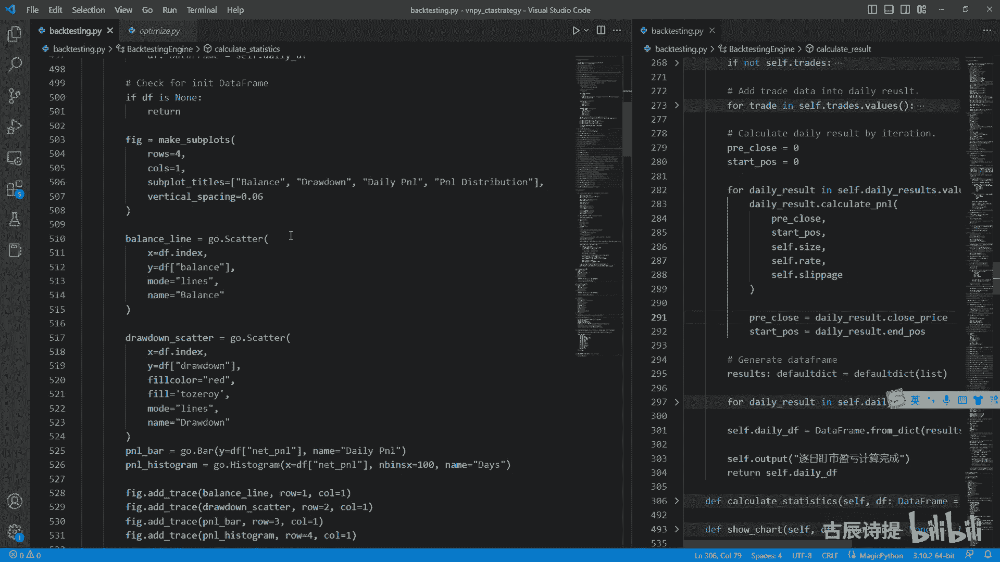

这个呢，直接可以显示在这个咱们的这个图形界面上啊。

这个我也没法去多讲，你就知道呃，画图你要用这用这个东西来画，因为如果讲的深了的话，你得把这个类里边都说清楚是吧，类里边都说清楚，这我就不说了啊，他其实就是画图，其实有些图你可以直接通过这个什么来画呃。

通过这个就是咱们的DPLOT，但是这它必须得要求画四个图嘛。

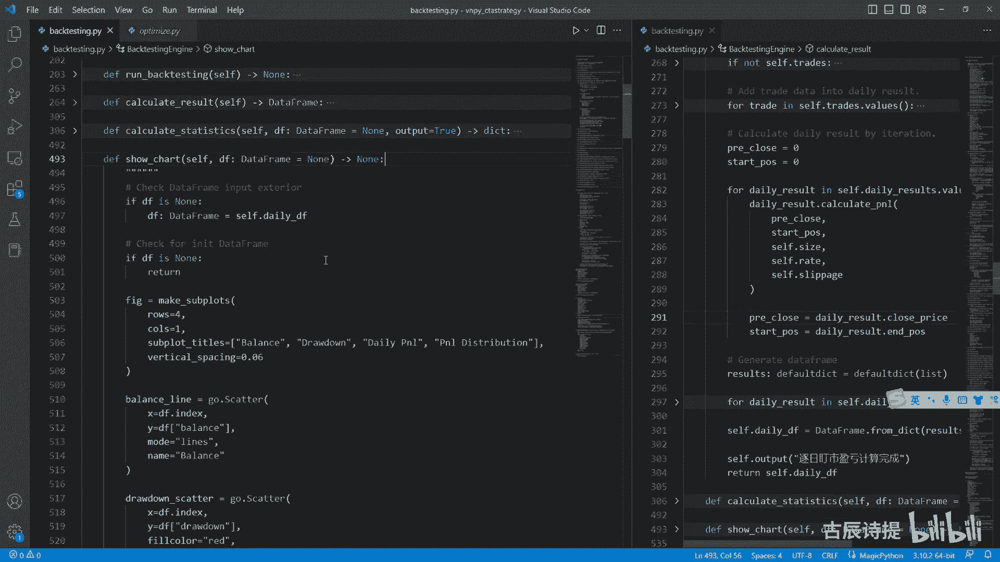

三个还是四个四个图啊，四个图，所以说他这你就得有画板，首先你得有画板吧。

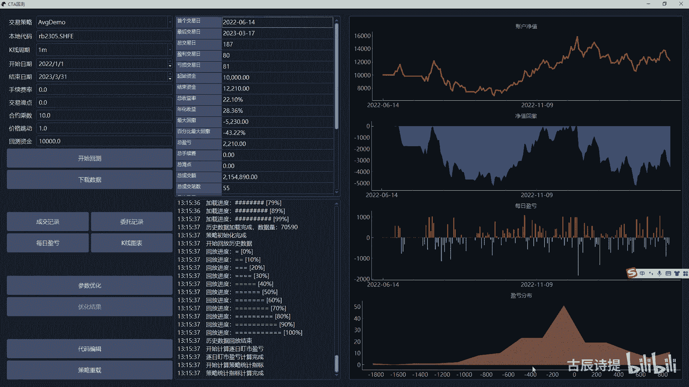

然后你画的时候还得给它分区域，所以说就这个你去看看这个类就可以了啊，当然我个人认为没有这个必要，没有这个必要，等你真正的做了图形界面的时候，你再考虑这些。

其实现在用最简单的就用这个data frame去画，需要什么你就画什么是吧，好下面呢就说这个，咱们呃就是在之前咱们自己写，最后讲的这个呃这个这个策略的优化，策略优化在这呢，它是run BF。

就是这个单词我不太会读啊，BF是代表穷举的意思，然后GA是代表遗传的意思，咱们还是只讲这个呃穷举，因为这个里边遗传它涉及到真正的算法，算法，这个也是一门单门，也也是一门单独的学问啊。

就是你需要自己去琢磨啊，包括深度学习啊什么的啊，你像这个里面导入这个类，这个里边有这个deep啊，有吗，这个里边有吗，还是在啊，可能在别的地方它有这个就是专门的模块，就是来做这个就是算法的啊。

这个咱们没法往里边讲，因为很多东西你可能都不太清楚是吧，但是呢你看这个穷举，咱们很容易去理解，无非就是把所有的，就是咱们的这个参数全部给放进去，然后去进行回测，最后根据你所选定的text name。

然后挑出他那个值，然后进行对比排序，是不是这个咱们写过，那咱们运用咱们之前的这个逻辑，然后再配合上他，咱们来看一下啊，你回测的按钮肯定是点这个吧是吧。

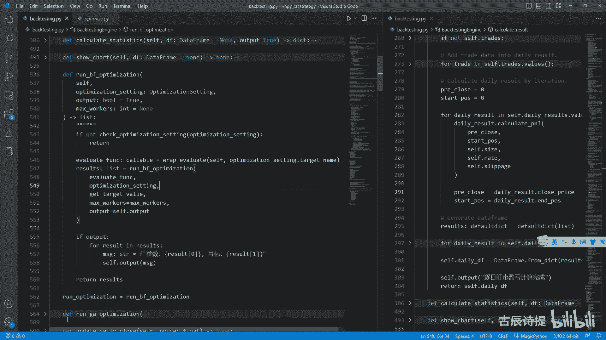

点这个参数优化，参数优化会出来这些东西，你首先你得设置你的SETINGS，其实就是你的这个参数吗，是不是你的参数的设置。

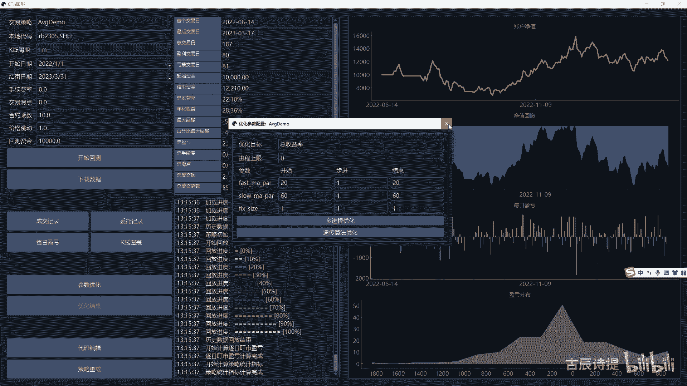

他在这个维纳里边是通过哪个，就是这个setting来设置的，它是一个类，你像这里边写写的这些中文你就能看，就是看清楚啊，你看参数优化起点必须小于终点是吧，参数优化步径必须大于零。

这个你看到的这种就是说写的这个东西。

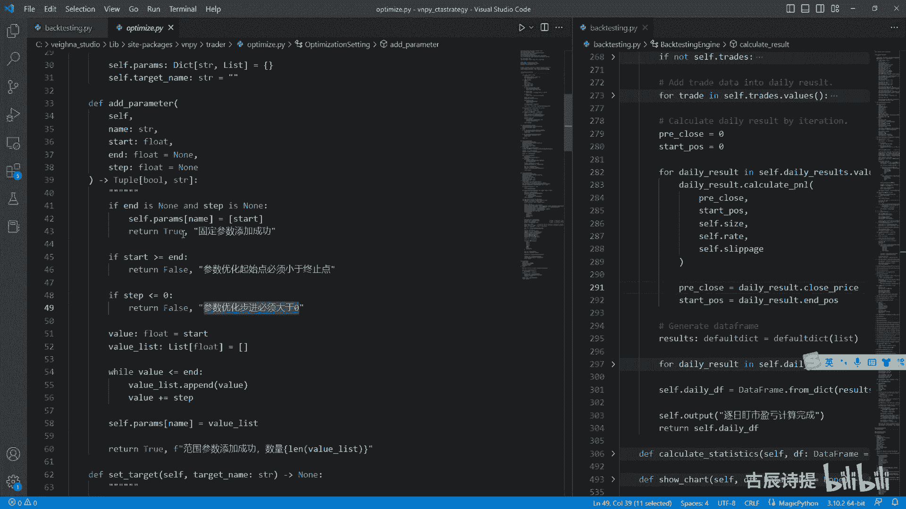

你就知道他是肯定是来呃设置这个东西的。

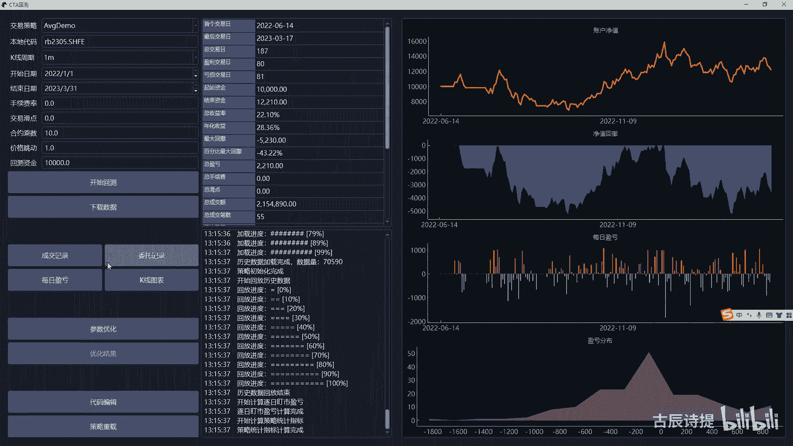

就是你在参数优化的时候这样来设置的，包括这个tt name是不是，然后呢，你看这是c target嘛是吧，他当然有个默认的target，然后这个generator setting肯定是最终来获取你的。

Settings，就是你返回的是settings嘛，对吧啊，这个就它是它是一个类啊，它会被封装成一个类，封装成这个类呃，你想output就是是不是往外输出是吧，然后max workers就是咱们说过。

就是说在你做这个什么时候做这个多进程呃，优化的时候，你肯定得告他就是开启多少个进程，你想它这是等于N值，它为什么会等于none啊，咱们可以去看一下，他主要的呢是来做这个run BF。

这个啊就是这个在做这个之前呢，他在这儿已经封装好了，什么呢，就是这个evaluate function，其实就相当于咱们就是说需要跑这个进程，单进程里边执行的那些东西，就是把那个做成偏函数，还记得吗。

咱们可以看一下啊，他用的是这个w a p evaluate，咱们这个整个的这个PY文件里边呃，后边还有还有三个，一个是evaluate，一个是w a r a p evaluate。

还有一个是get target value呃，还没有讲是吧，这个evaluate咱们可以先看一下啊，evaluate它是做什么的呢，你看这个里边咱们先不看这个呃参数，咱们先看这个里边。

你看engine它是实例化了一个btesting engine，就是回测引擎，然后engine点CCPR就是参数设定吧，然后添加策略，然后下载数据，然后跑回车，然后计算结果，然后最终把这个指标给你。

就是说计算出来calculate这个东西是吧，然后output等于false，就是不进行输出，然后target value啊，就等于这个这个通过text name。

然后在这个指标里边去获取这个target value，然后返回三个数，返回三就是一个元组，一个元组里边有三个object，是不是跟咱那个就是在单进程回测里边，是一样的是吧。

你首先你得把这个整体的全部包装成一个方法，对不对，包装成一个方法，那这个方法里边，肯定就是说你整个回测的一个流程，然后呢咱们之前返回的是两个值是吧，一个是sitting，一个是这个txt value。

但是这呢它是返回的是三个，还有个这个呃，就是说指标是不是是不是都一样的，是吧啊，你像这个就是整体的一个单进程的一个，回测的逻辑，然后呢WRAP其实WRAP，如果说你Python基础学得不错的话。

在这个装饰器那一块，就是比较绕的那个装饰器那一块，肯定见过这个单词，它其实就是包装的意思嘛，一般那个里边的那个就是那个，肯定是WRAP作为这个函数名的，然后外边那个叫那个decorate作为函数名。

是不是啊，然后他你看party就是这个偏函数嘛，偏函数里边evaluate，evaluate给它传进来的是什么呀，evaluate function吧，是不是啊，不是啊，不是这个啊。

这个evaluate就是上面这个是不是啊，给它封装，然后后边首先填的就是这个target name，target name是吧，挨个往下填，一直填到这个model是吧，就是把setting留下来。

在最后做那个map，就是这个por map那去进行匹配是吧，你看一直是导model，只不过这呢咱们之前填的时候都啊，strange class是哪个，然后wait simple是哪个，都给给他指定清楚。

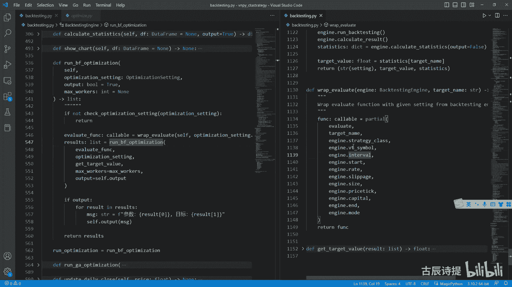

但是在这他为了跟这个界面做这个交互，因为你是把这个界面打开的时候，你肯定是已经实例化了一个引擎了，就是那个btesting engine了，然后你从这填的时候，其实就已经去赋值了，是不是啊。

你你从这儿不填的话，你参数优化也优化不了。

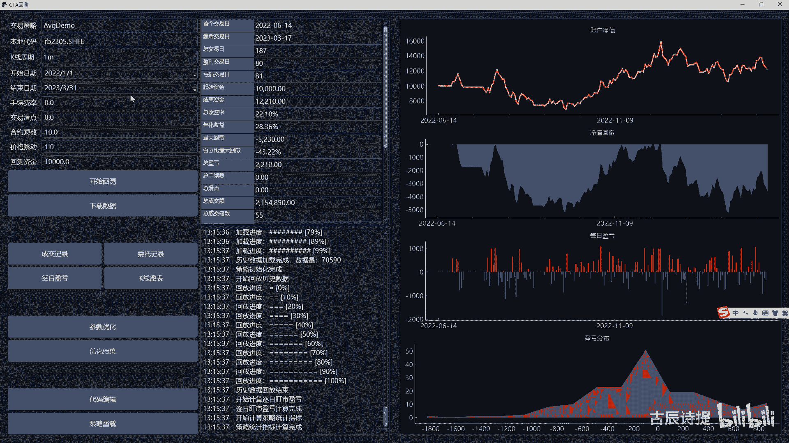

所以说你第一步肯定是填这填这的话，那肯定你本身的那个引擎里边，已经有了这些参数了，那把这些参数全部复制到这个string class with a simple，是不是就没问题了。

然后他返回一个function是吧，其实就是留了一个参数，就是这个sitting啊，就是这个sitting，然后做后边的这个匹配用，是不是啊，你想这就说完了，还有一个这个gtt value。

咱们后边说好吧，然后这个run BF就是这个在哪呢，它是单独给写在了，就是说这个trade点这个optimize这个里边，然后咱们可以看一下啊，run BF这个run BF这个嗯。

就是这个方法里边主要是做什么接收的参数，第一个你想value function就是这个嘛，其实就是包装好了的那个EVO，这个就是它的一个标识啊，不要觉得它多复杂，它就是可回调这个方法。

然后这个里边参数是dict，返回值是dict啊，这个括号里面是参数啊，参数是dict，返回值是dict，然后第二个是这个sitting，就是这个咱们刚才看的那个类，它是个类啊，它不是个结果啊，它是个类。

然后key function key function是什么东西啊，它传的是GTTV6吧，就是这个最后一个方法是吧，咱们一会讲啊，max workers还是等于NN。

它传过来的这个max workers它还是等于NN是吧，这个为什么会等于N啊，咱们可以看一下，这个就是这个类这个类这个多进程的这个类，你会发现啊，如果说if max workers is n。

然后cf点max workers等于OS点CPU count，是不是跟那个一样啊，只不过他这写了个什么O1，它最终只会是什么呀，是前面这个吧，这个咱们可以给大家做一下演示啊，这个咱们应该是25节课了啊。

是25节课了，新建一个，新建一个demo，25，好就是很少，咱们去用是吧，A等于0O1，你A应该是等于什么呀，A应该是等于什么，A应该是等于一吧，Print print a，是一吧啊，前面这个为否。

那它就等于后边这个，因为它是赋值嘛，前面为否，它就会执行后边这个，如果说你是and的话，他应该认为什么它等于零吧，就是把把这个前面这个返回回去，其实这个也是Python基础啊。

虽然这个and和or咱们用的会非常多，一般在那个布尔里边去用是吧，就是一般在if后面加这个条件判断，但是其实这个if and，它是就是他的这个逻辑是什么呀，就是就是and两边它是逻辑。

就是两边如果是and第一个为否的话，它就不往后去执行了啊，他的它就会就是它的执行顺序啊，and的话它会第一个为否的话，它就会不就是它不会往后去执行啊，如果第一个为真的话，他才会去往后执行。

or的话呢就是第一个如果为真的话，他就不往后执行了，然后第一个如果为假的话，它还会往后执行，所以说A它就是你想哦，他返回的是1and的，返回的是零啊，这个你要去理解一下，其实这是很少这么去用啊。

很少这么去用好吧，所以说这个之前好像看过一篇文章，就是这个and和or和这个什么什么有什么区别啊，就是你要从本质上当然也没这个必要，所以说他这个返回来了。

这个你OS点只要是能获取到这个CPU count，它肯定是等于前面这个啊，肯定是等于前面这个，所以说咱们从这儿，它其实就是你这个那个OS点这个CPU count，然后最后这个output呢。

你想他这写的是默认的是这个print，但是他在这呢是这个output是吧，output它还是print嘛，当然在最终的那个什么呀，就是说输出的时候，他肯定是输出到界面里边去。

肯定是把这个就是output，又重新指向了一个地方啊，又重新指向了一个地方，好吧，这个你要会使用这些啊，就是你像这种作为函数名，这个后边用的会特别多，比如说咱们可能这节课。

可能下节课会看到那个OMS引擎，就大量的都使用了这种方式很方便，包括那个PEACCOUNT，就是本地的模拟的那个引擎也是这么去用的啊，好然后它下面首先去获取这个settings吧。

就是这个建筑的SETINGS，它的回值是SETINGS，咱们刚才看了是吧，是通过这个类，然后实例化之后进行返回值，咱们在自己写的，那咱们直接用循环去获取的吧，它list里面是dict吧是吧。

然后呢他说他输出两句话，一个是开始执行了，第二个是就是说总共的他的这个长度啊，0sitting啊，然后start你看这个咱们讲过吧，就是计时器嘛，然后最后他会输出一个用int键start。

然后耗费了多少秒，这个会去经常会用到的啊，如果说你想去计时的话，你就简单的就是说把中间需要去执行的函数，放在中间就可以了，然后两边都加一个static int好，咱们看一下，你看with是吧。

然后这个里边max workers，然后这它有个p context啊，这个是什么呀，这个啊其实是涉及到一个这个就是多进程，多进程，它里边传的这个参数啊，就这个SPAWN其实是代表的是什么呀。

就是说以这种windows的方式，就是在windows里面去运行这个多进程，如果你有一些这个编程基础的话，你应该知道就是说在就是windows和OS系统里面，创建这个进程是不一样的。

这个windows啊，不是那个OS里边，一般就是直接fork一个就可以了，fork如果说这填的是fork的话，是代表的是使用的是OS系统，这个SPAWN是代表的是适用的，就是windows系统啊。

所以说这写了这个SPW呃，S p a w n，其实这个它的本质里边有哪些区别啊，这个怎么说呢，就是了解一下，就是他可能就是在你就是复制的时候，有一些就是就是比如说我这个是主进程啊。

我要把里面一部分的资源，复制到这个紫禁城里边去，紫禁城，比如这是进程一，然后这是进城二，他复制的时候是不一样的，就是你windows复制，你可能得得通过传参，通过传参。

但是呢你OS复制可能有些东西你不需要传，他会能自己过去啊，这是底层的操作系统的这个差异，这个SPAWN是代表的是windows系统啊，这个S这个东西咱们写的时候是as poor是吧，作为一个进程池。

然后it啊，你看这是一个可怜的对象，然后TQDM，然后告诉他这个total就是这个LSITTING是吧，然后map把这个function。

这个value function就是那个被包装的evaluate嘛，然后SETINGS去进行匹配，然后results等于你看list了一下是吧，它出来的它是一个什么呀，它是一个呃，它是一个生成器是吧。

它是一个生成器啊，啊不是它是一个可迭代对象啊，它并不是一个生成器，它是一个可迭代对象啊，然后你list这一下，然后它就变成了一个列表，然后这进行排序，然后用反序就是true嘛，把最大的放前面。

把这段放前面，然后key啊，这用到了这个key function，Key function，咱们可以看一下啊，key function传过来的是gtacked value。

Gtt value return result1，咱们刚才在看这个就是它的这个返回值的时候，也就是这个evaluate在最后这是吧，这个evaluate它的返回值是什么呀，三个吧，咱们之前说了。

就是说咱们返回的是两个字的，是三个，第一个就是这个sitting啊，用这个SSTR类型返回回来的是个setting，然后第二个是target value，第三个是这个什么，你像他这个你到这了。

Get target value，它是不是取的是你的第二个元素，下标为一的元素，因为它是个元组，是不是取的这个tt value是吧，他就是他其实就是做了这么一个工作啊。

取了中间那个text value啊，去了中间这个tt value是吧，其实排序就通过中间那个text value的，从大从最大往最小去排啊是吧，这个是你排序的对象，这个result它是个list。

然后这个里边排序的关键字就是这个呃，返回的这个result1，也就是你需要那个tt name的那个值，Tt value，它从大往小去进行排序是吧，那这不就说完了吗，啊这就说完了，就没什么。

就是特别复杂的吧，只要你把前面的都吃透了，就是这我觉得应该听得很轻松，而且也没有你想象的那么复杂，对不对，也没有想象的复杂，你看这个是啊，deep在这呢这涉及到一些算法，这个我就不讲了。

有兴趣的可以自己去翻一翻，我觉得你把这些给理解透了啊，你自己去搭建一个就是回车的框架，完全没有任何问题，另外如果说你想自己去做一些别的更改，我觉得也没有问题啊，也没有问题好。

那就是说这个BTESTING，咱们再看一下它后边还有什么东西啊，后边还有什么东西啊，咱们讲到了这个run run，这是run BF g a，咱们就不讲了啊，然后update date。

Update daily clothes，讲了new bar，讲了new tic就不讲了，close limit order啊，这个里边咱们着重看一个上节课说的，他这个差异啊。

啊这啊你不要把它认为太复杂了，因为它得匹配这个B的这个K线，还有匹配这个tick，所以说他把这个都给写成就是这样的形式了，其实你把它拆分开，就是拆分下来这个long。

你可以看一下他的这个order price大于long close price，你想long close price是什么，就是八点low price是吧啊，八点low吧是吧。

这八点low其实就是order press，就是委托的价格，是不是啊，大于等于你的这个当前K线的最低价，这个咱们之前逻逻辑都讲过是吧，你你只要这么去看一下就行就可以了啊，跟咱们那个是一样的。

跟咱们写的那个是一样的，呃，在这呢就是说就是上节课咱们说过，就是这个active limit order，你像他一旦委托成交之后，他会把它pop掉，从这个active这个limit orders呃。

就是去把它给pop掉，但是呢他还会在什么地方啊，他还会在一个地方把它就是放进，就是说这个也不是放进嘛，他可能一开始就给他放进去，这个cf点limit orders这里边去了，咱们可以看一下啊。

这个CCTRLV啊，这个limit orders，这就是在你SORDER的时候，你看他这个cf orders里面就放了，同时呢这个active limit orders也放进去。

但是在你撮合撮合成功之后啊，撮合成功之后，他只是在active这个limit orders把它给删掉了，所以说你这个cf点这个limit orders里边是存放的，所有的这个限价单。

然后active呢是活跃的，这个限价单活跃的现象单定义是什么呀，其实是在这个order data里面是有的吧，就是呃你比如说正在申请啊，然后还没有成交呀，然后部分成交啊，它是活跃的，你被拒单被撤销。

然后完全成交，那就是不活跃的了对吧，就不用等待去触发了嘛，是吧啊，这个就是一开始说的，就是跟咱们写的那有一定的区别的地方，别的就是基本上是一样的，你可以去看一看啊，逻辑都是一样的。

只不过他把有些东西给封装起来了啊，load吧就不说了啊，已经说了，load ti也说了啊，LOTTIC里边根本就没有什么东西是吧啊，LOTU里边就根本SORDER啊，Sa stop order。

这没什么好说的，Slimit order，包括cancel order都是一样的啊，cancel stop order都是一样的，然后还有CSOL啊，啊这有个right log message。

Logs end，就是把这个message全放到这个logo这个里边，这个就是日志输出，但是这个里边基本上都是用了output啊，什么的是吧，然后C那一面就不讲了，他其实这个更多的是为了跟那个CCTA。

这个t engine去进行匹配的啊，包括这个啊，你看都是pass engine type price是吧，get size这个put the strange invent，都是pass它。

这个是主要是你再把这个作为引擎，就是BTESTING作为引擎，放到了这个咱们的这个c t template里边，就是你回调的时候，你得能回调的这些方法，不然的话他会报错的是吧，Output。

然后get all trees，就是这个获取所有的这个交易嘛，然后or orders，Or daily results，其实就是这些东西没有什么啊，更加复杂的了，跟咱们写的不一样了。

就是有一些他可能相对绕一些，他是为了，然后咱们就在这个界面上能够更好的去看是吧，这呢有个这个东西啊，这个是一个类的一个方法，这个你想它在整个的这个有CNHCTRLV，它在整个的这个就是PY文件里边。

只有这么一个啊，这个我没仔细去看啊，这个我理解为他就是给这个什么呀，给这个方面界面去调用的啊，它就是给界面去调用的好吧，那这个tastic engine呢咱们就讲完了啊。

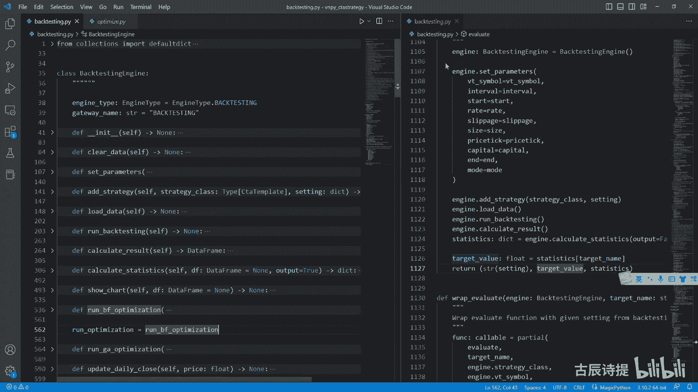

我相信已经讲的很透彻了，咱们敲了一遍，然后又给又给大家去讲了一遍是吧，但是这个BTESTING啊，engine讲完了，咱们再来看一下这个btester engine。

这个咱们必须得看一下的这个就是这个BTESTER。

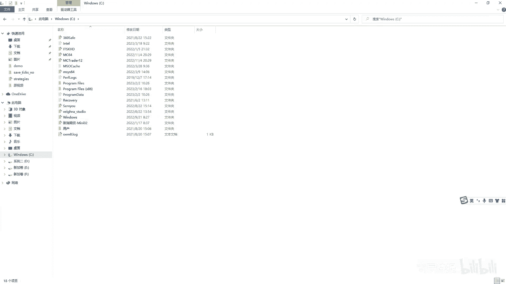

它里边除了UI界面，只有这一个音节啊，只有这一个engine，然后咱们可以看一下这里边的这个逻辑啊，在INIT里边，他已经去把这个defeat和和这个database，一起去获取出来了。

这个获取啊我觉得设计的特别巧妙，你像咱们在多进程优化的时候，咱们能看出来单纯的你去实例化它容易出问题，对吧啊，你从这儿就是确保了它是一个单例模式，而且代码很简单啊，他这有个three的是一个线程。

它这个是做什么用的啊，就是你在回测的时候，你得用这个别的别的线程去进行回测，因为咱们之前应该说过吧，界面它本身就是个线程，如果说你不是多线程的话，它会卡死的啊，它会卡死的。

那这个里面init engine就是初始化引擎嘛，它其实就是把这个引擎进行实例化，然后里边loaded strange class就是加载策略，你看这个就是跟咱们的这个T引擎是一样的了。

Load jenny class，然后后边是load string class from flora是吧，然后load stry class from model是吧。

然后这有个reload strength class，就是当你的这个比如说你又放了一个策略进去，就是又放了个点VR啊，点PI文件进去之后，你需要去reload一下。

其实再重新去执行一遍这个load jk class，这个三个方法就是reload，就是重新加载嘛，这个很简单啊啊这个就想到了很多，比如说我重新加载一个什么东西，其实就是重新执行一遍这个代码哈。

重新执行一遍代码嗯，int engine下面这个就是初始化里的这个data feed，就是初始化里的RQ数据服务嘛，啊或者一些其他的这个三方数据啊，这个服务商，但是维纳里边匹配的就是这个RQ是吧。

这个也没什么好说的，咱们在写代码的时候也反复在写，然后RELOG就是日日输出嘛，这个日日输出给它放到了这个engine里边，就是进行传输啊，它也会传到这个界面里边去，后边讲界面，如果有机会讲界面的话。

会给大家仔细去介绍这个BMPY里边，这个界面啊，然后再给大家写新的界面，或者更加好一些的界面，然后这个get the strength class name，就是获取所有的这类的类名是吧。

然后run back testing，run back testing啊，这就是其实最主要的就是这个bantastic engine。

然后back test engine cal data就是清空这个数据啊，然后就是如果然后去C去CPR参数设置，然后添加策略，然后下载这个数据啊，他这用这个呃，就是说try except。

它是为了防止你在跑的时候出现问题了，就是你的代码里边有错误啊，这他会告诉你哪有错，这个trans back在Python基础里面也讲过啊，就是它是一个格式化的输出啊，就是格式化的输出。

这个format这个excel是变成了字符串，一般用的是print e x e是吧啊，其实逻辑都是一样的是吧，然后calculate result，calculate stats啊，Static。

当然这它在跑这个的时候啊，他单独的去用了一个线程去跑跑啊，在哪呢，就是这个sb three，啊这还有这个啊，这个是整个的啊，咱们下面再说，再说这个这个思维的啊，这个是整个的跑，这个就是回撤是吧。

你看这start back testing就是开始进行回测。

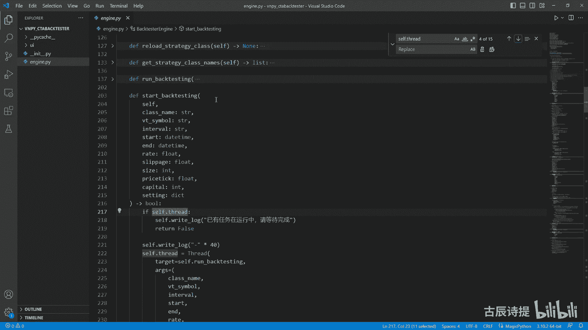

他应该是跟这个就是这个开始回测这个按钮，绑定着的。

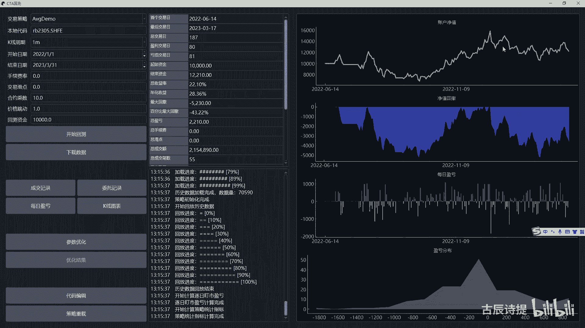

就是一旦点击这个开始回测，它其实执行的就是这个study bc testing这个方法，然后呢就是self three的，如果说这个线程还存在的话，它就已有任务运行中，请等待完成是吧，如果说是没有的话。

他会画一排就是40个这样的短横线。

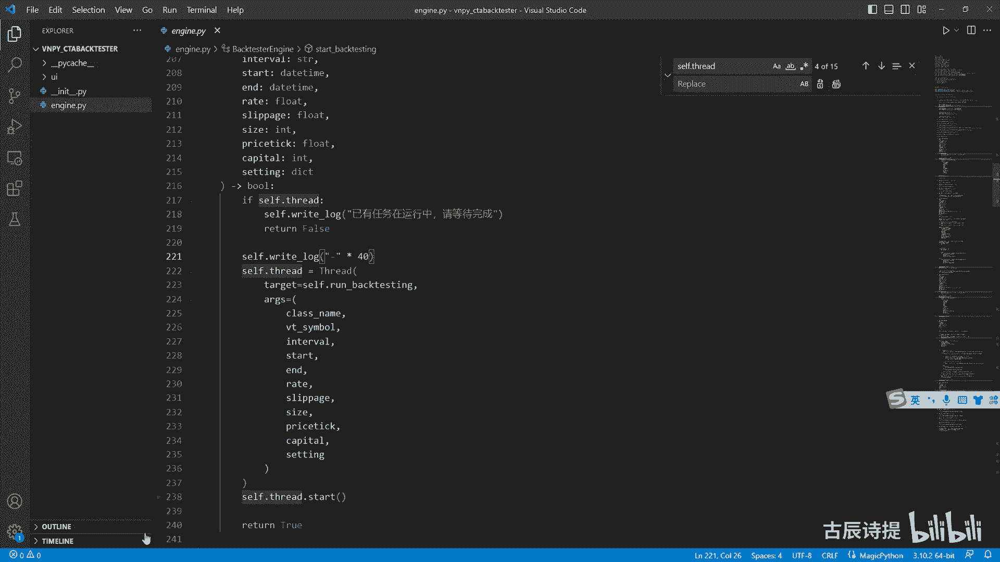

咱们看看这有没有啊，40个这样的短横线，有的吧，这是吧，好多短横线嘛对吧。

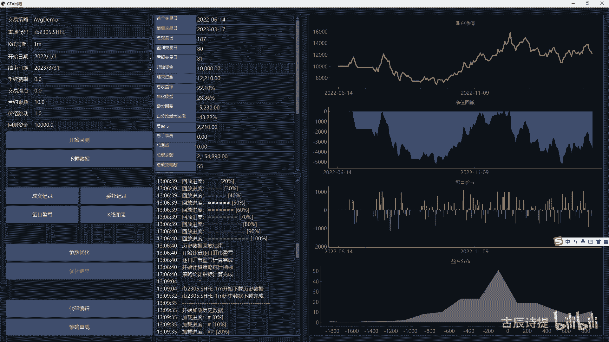

有40个，然后呢他就self thread等于一个thread，这是一个重新开了一个县城，然后他的target就是这个run bc testing，就是咱们刚才说的这个run btesting是吧。

就是单独的线程来跑它，如果说你不用单独的线程。

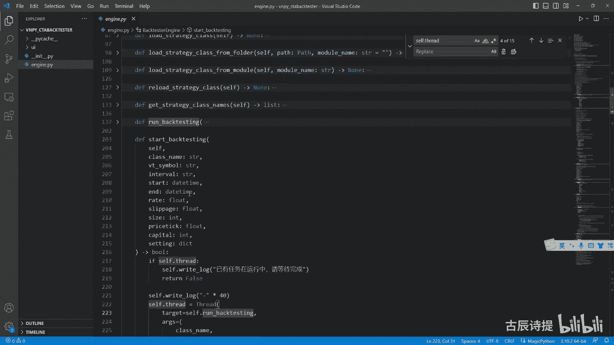

你直接去跑的话，这个界面会卡死的，因为界面本身是一个线程。

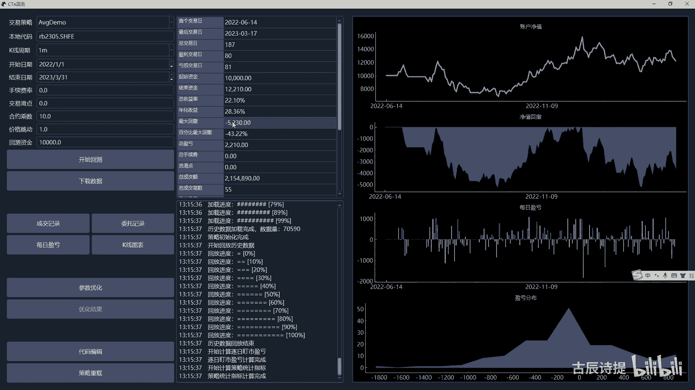

然后你又跑，这就是你的逻辑的线程，它会卡死的啊，这个这个在界面里边正因为有了这个呃问题啊，所以说你写很复杂的界面的时候，他会很麻烦，就是你得考虑到也不是很麻烦嘛，他会就是你得绕一个圈。

你得考虑到他这个嗯就是不能被卡死，你得用这个多线程，始终得用多线程的方式来进行运行啊，然后serial start就是启动线程嘛，然后return true是吧，这个就没什么了啊，然后只获取你的结果啊。

然后这个获取你的指标，然后获取你的这个结果的这个value啊，然后获取这个啊，就是默默认的这个类的这个参数，就是你的这个class，就是你的这个策策略类里面，默认的这个参数是吧。

get class pm嘛，这个就是run optimization，这个其实是跟就是你在回测的时候。

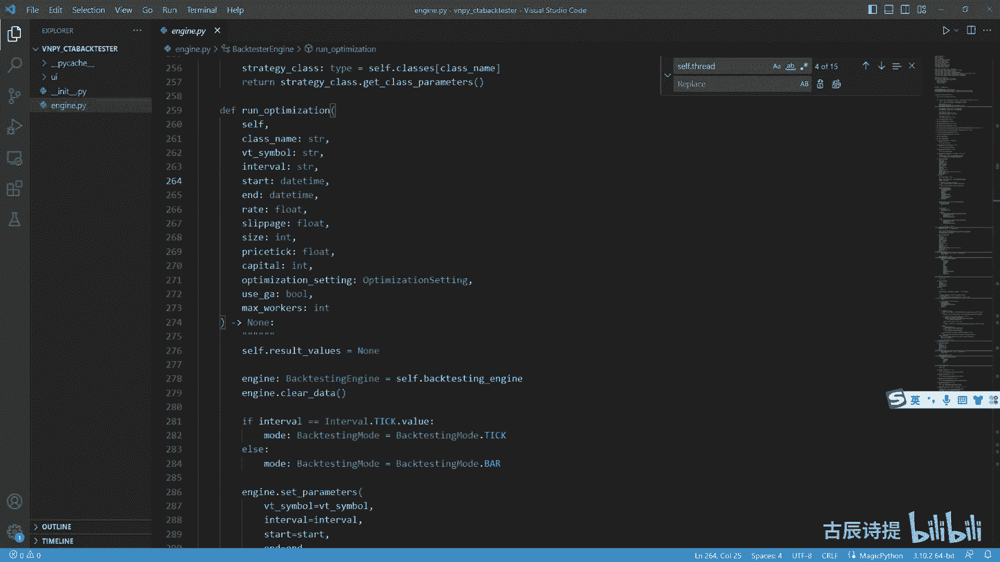

就是说你要进行这个参数优化，跟这个肯定是绑定在一起的啊，然后你选多进程优化啊。

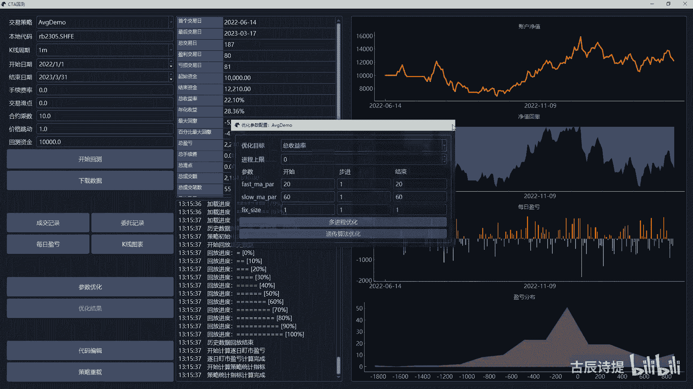

然后就是因为他这没有指定多多进程，还是这个不是还没有指定穷举，还是这个就是遗传嘛，他肯定是跟这个按钮给绑定着的，就是说参数优化，参数优化的第一步是什么呀，肯定就是就是确定你的这个什么吗。

C啊这个sitting嘛，是不是啊，给他把这个sitting然后传进来啊，然后就是说初始化引擎，然后clear data，然后CPIS是吧，然后呢如果说你用GA的话，就是run ga。

如如果说是你是不是的话，就run BF这个engine，Run bf，是不是就是咱们那个btesting engine里边那个方法呀，是吧是啊，然后这个里边再去调用到。

就是说这个run BF在那个VNPY点trade，里边的那个是吧，就是optimize，这其实真正的执行是在这儿呢对吧，是在这呢它是绕了一个圈，就是当你点击的时候啊，就是啊它会从这儿啊。

去运行BTESTING里边这个run BF啊，然后再通过这个，然后去运行这个optimize，这个里边的这个run BF timization是吧，然后把这个把这个SD啊，这个这个这个线程变成NN。

因为你去执行的时候，他也是单独的用这个思维来进行控制的吧，应该是这样的啊，应该是这样的哎这里边没有，不是这个还跟上面那个一样，他在就是说开始这个start这个optimization的时候。

它是来运行这个方法的啊，这个run up，咱们啊这个run并不是说跟这个绑定的啊，刚才给你说错了，是这个start是跟这个按钮去进行绑定的啊，然后点击之后呢，如果说有这个线程了。

他会告诉你任务已经运行中，等待完成，如果没有的话，他会担起一个线程，然后run就是来执行这个代码，就是执行这个代码是吧，执行这个代码其实它的逻辑是什么呀，就是说整个的它的这个整体的。

就是当你在运行这个的时候，start optimization的时候，它是什么呀，就是你本身这个界面和你的这个，就是你已经启动了的这些，就是你在这个界面里面，目前启动的时候，它是一个进程。

它是一个主进程，然后呢他在里边又创建了一个子线程，就是单独的一个线程，就是T然后呢用线程来控制你的这个多进程啊，用线程来控制你的这个多进程的开启，它其实是这么个逻辑好吧，因为你当你有界面的时候。

你在进行其他操作的时候，尤其是会耗时耗费时间的话，他肯定会进行卡顿，所以说但凡你在里边执行一些比较嗯，有一定时间的这么一个方法的时候，你必须得用这个多线程来进来去进行执行哈，然后他去下去启动这个线程啊。

这个target就是run optimization，其实这个start的意思就是让这个代码去运行好，下面这个是run download，就是下载历史数据吗，下载历史数据。

它是就是就是当你点击这儿的时候，就是下载数据，就是下载历史数据，它是嗯start dowload，它同样的也是给包装成了一个方法，然后那个按钮联系的是他这个start download，还是用单线程。

就是用多线程来进行执行的吧，就又创建了一个新线程，然后来去下载数据啊，这个里边啊也没什么好说的，就是去数据库里面去下载数据嘛，咱们在写代码的时候，已经写了很多类似的这种数据的下载啊，什么的是吧。

别的就是一些基础信息的获获取了，就是你所有的这个trans是吧，你所有的这个orders，然后DLTD，其实这个啊他还是返回的是self debtesting engine。

还是去那个btesting engine里面去找是吧啊，那到这儿呢，咱们这个整体的这个baptistic engine，咱们就讲完了呃，baptisting ending讲完之后呢。

其实你可以自己去尝试改很多的模块了，别的包括一些像RPC啊，包括很多其他的模块，其实都在这个基础上，它是由事件引擎来驱动的，你这些都吃透了，那些代码就很好去理解和就是说去看了好吧。

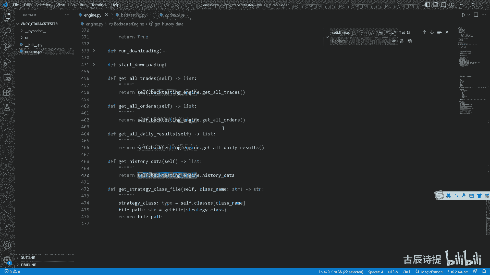