# 第26节课 MainEngine介绍 - P1 - 古辰诗提 - BV1xC411H7xJ

欢迎大家来到从零开始量化系列课程，VMPI课程的第26节课，上一节课前几节课吧，给大家详细的介绍了一下这个会测，你会发现其实只要是你去研究，你离搭建自己的框架其实就不远了。

所以说希望你们还是去好好的把代码去，再看一看，再自己再敲一敲，只有先理解了维纳这个平台里边他自己的代码，然后你才能根据你的需求去做一些改变是吧，那这节课呢咱们再看一下这个这个my engine这一块。

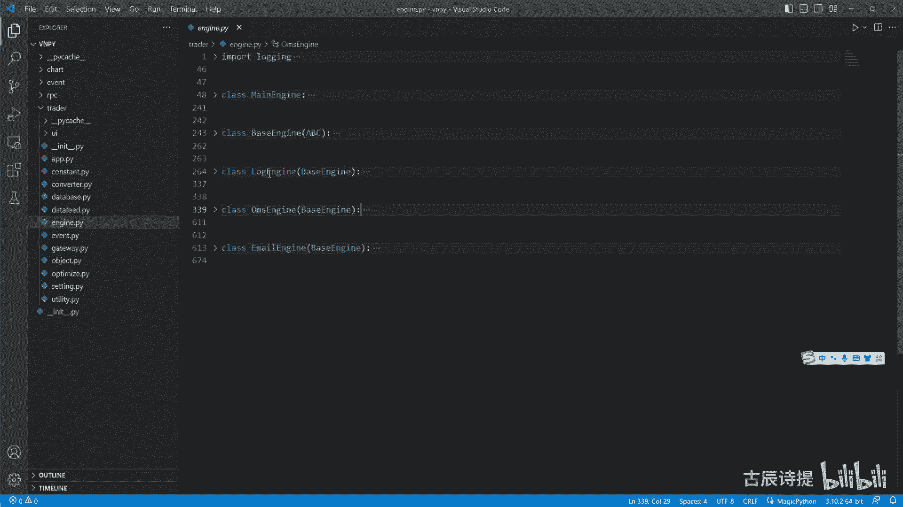

也就是在咱们这个VNPY，就这个最核心的这个模块里边啊，最核心的这个VMPY这个模块里边。

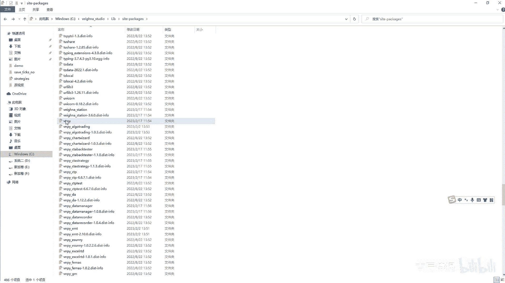

就是它这个里边的这个引擎啊，这个engine这个里边呢算是就是比较综合性的，你像这个main engine，包括这个OMS的这个engine哈，Log engine，还有best engine。

咱们挨个说一下啊，首先呢咱们就是挑就是简单的来说，你像这个email engine哦，我就不讲了，这个有兴趣的话，因为这涉及到一个模块了嘛，就是邮件的模块呃，你可以自己去研究一下，如果想用的话。

在B站上就是第一套免费的课上，最后一节课也讲到这个email连接，其实你只需要把一些东西给给他去填写好了，就是从哪儿发到哪儿是吧，然后就是你给他填写好了之后啊，他就可以去这个发送的。

包括在你邮件上的一些设置是吧，呃打开某些设置，这个我就不讲了啊，然后呢，这个呃，就是他们这个下面这三个都是继承自这个best engine，这个里边没东西，一个close，一个INIT。

只不过是把my engine engine，还有engine name给传进来，别的就没有了，他只是做了一个简单的封装，然后这个logo engine呢，它涉及的模块就是这个日志模块。

日志模块还是很重要的，如果说你以后想自己去搭建一个框架的话，这个日志引擎是肯定是不可少的，日引擎给大家简单的说一下啊，它有哪些好处，日引擎呢就是它可以实现啊，就叫统一的日志的管理，这个是什么意思呢。

就是在这个日志引擎里边，比如说咱们用print去输出一些东西的时候，你像单纯的print，你输入出来，就是说你存就是你是不是需要去存储是吧，因为你有些时候日志是需要回滚的啊，或者说你需要去查看的。

比如说你这个整个的程序跑着出现了哪些问题，但是呢在这个过程中呢，有哪些日志是需要记录的，是需要去看的，或者有一些比如说出现了bug，或者出现了一些，就是说终止程序运行或者线程运行的一些问题。

他是不是这个日志的等级也不一样啊，就这个level1V1level就等级也不一样，比如说呃有一些日志只是告诉你，咱们之前讲过的，比如说这个时间进行调整了是吧，把这个这个时间进行调整了。

他可能他的这个等级啊，也就是一个十是吧，就是可以给你发，也可以给你不发，不是那么特别的重要啊，就是说给你发，其实就是告诉你我做了这个动作，但是如果说你发送委托了，就是说委托发送出去了。

然后就是说有成交了，那这个成交比如说这个挺重要的，我要知道是吧，比如说我设定一个20，然后呢比如说这个委托由于某种原因，他没有成交，是你在策略之内没有想到的，他可能就是说出现了一些bug。

但这种bug呢不影响程序的运行，是不是，就比如说你的这个呃，就是发送的委托的这个委托量，超过了你的持仓量，那这个你像这样的信息，你是不是得知道哪出问题了，它是不是就是说等级会越来越高。

或者说你到就是说这个，比如说出现了一个很严重的bug，就是说这个导致你的程序的终止，或者现成的终止，那是不是这样的，就是很重要的，你可以把等级再往上去翻一翻，那你再去做，比如说我哪些日志我需要输出。

哪些日志我需要保存，是不是得分类管理，对不对啊，那Python里边呢就给提供了一个这样很方便的一个，这个呃就是模块，就是login模块啊，这个login模块你可以去看一下。

我觉得个人认为就是这个login模块啊，呃你要讲的话，它里边有很多的东西，我个人认为你也没必要花巨量的时间在这上面，其实这个维纳平台给你已经弄好了，这个啊login模块了。

就是这个log模块日志输出模块，简单的说一下啊，这个是从这个你的SETINGS里边，就是说在你的这个，这就是说在点VPI那个设置里边，当然这个setting是在这个下面这个sitting啊。

这个下面sitting他会去这个v t setting里边去找，去这个v t sitting，也就是在咱们这个点VPY下面，这个v t setting里边是吧，里面有很多的设置。

你像他这有log active啊，true啊，就是说明是呃，就是说你是不是要就是启用这个log，这个这个log模块，然后这个level是critical，其实这个啊你可以看一下。

Go to definition，它就是50，它是最高的，你看他这个error就是出现错误是40，warning是30，info是20，bug是十，NOC是零，其实它就是一些等级。

就是咱们刚才说的等级的一个设定好吧，有些时候你日志输入不出来，或者说你需要呃那个right log输入的时候，输入不输就是输出不出来，这是不是没有调整，你可以把它调整到最低是吧。

就是把它调整到debug啊，但是一般情况下就是info就可以了啊，一般情况下info就可以了，就这是一个就是说这个设置等级的，就是哪些日志会往就是需要往外去输出和保存，然后这个呃这个是终端的意思。

需不需要在终端上输出，true是需要的，false是不需要的，然后fire就是需不需要保存日志。

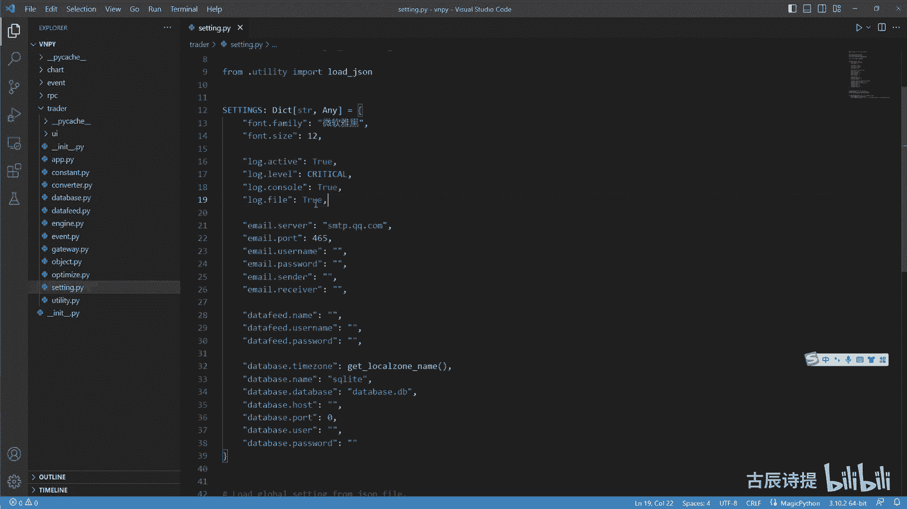

这个日志它保存也是在咱们的这个C盘下面的，就是这个用户administrator，或者the noa下面的这个点，win trader这里边有个CP啊，啊不不不不不是这里边有个log。

你看这就是VT哪天是吧。

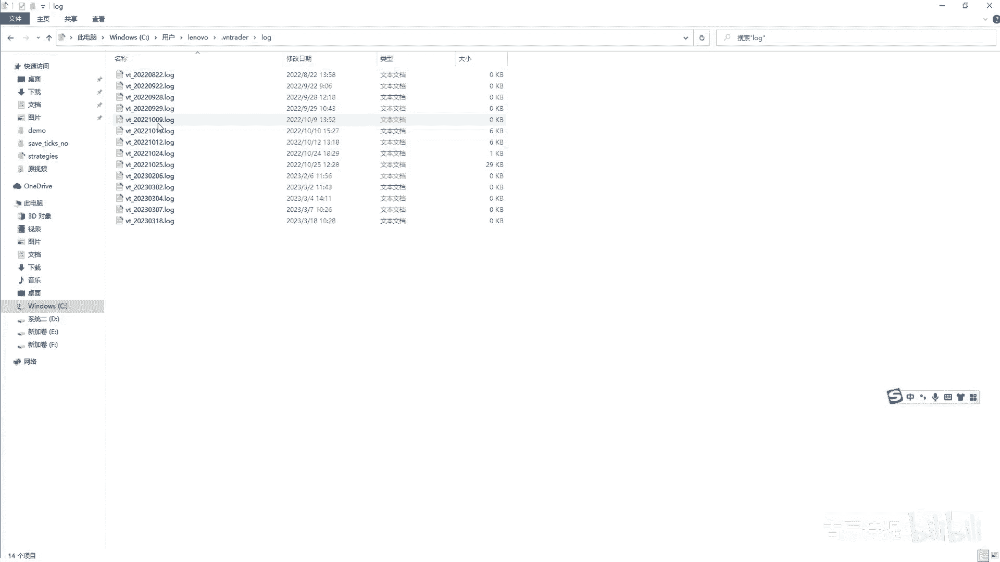

就是它需不需要保存在哪，你如果设置成true就保存，如果设置成false，它就不会给你保存，就是这么个逻辑好吧，咱们再再找那个engine，你像他这设置的是啊。

这个这个cp their level是整个的，你这个日志模块的总的这个level啊，你想这个log level就是从里面去读取嘛是吧，然后这是获取get log，它其实呢是什么呢。

就是跟那个default dict有点像，就是说你去获取一个logo，就是维纳的这个日志啊，那就是他就是底层啊，它是用工厂模式去实现的，简单的提一下啊，工厂模式去试去实现的，你需要去先获取一个。

如果没有的话，他会给你创建一个啊，然后给它设置你的这个clever啊，然后这个是他日志的输出格式，你看前面有这个time就是你的呃时间啊，liver name就是你的这个等级。

然后再加上后边你的这个消息。

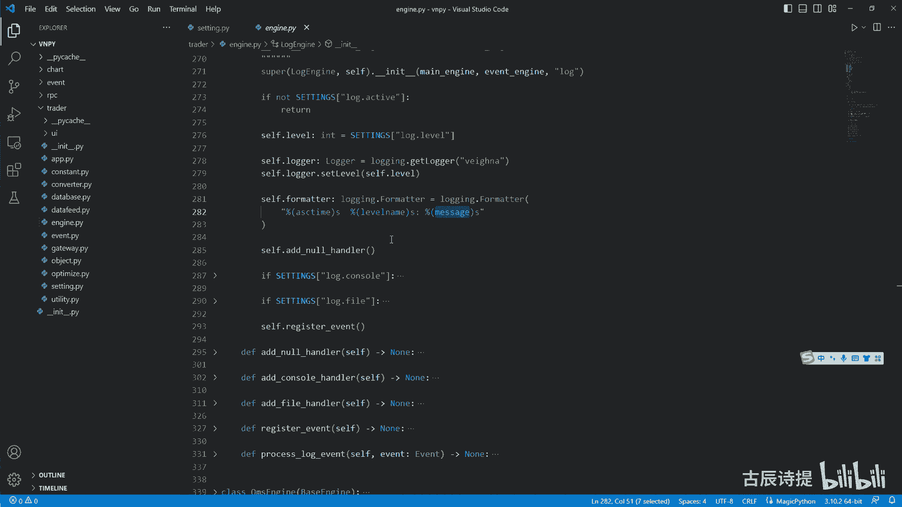

你像咱们在这这个logo里边，咱们可以打开一个看一下啊，诶就是啥也没说出啊，啥也没写，就是他的输出的这个日志啊。

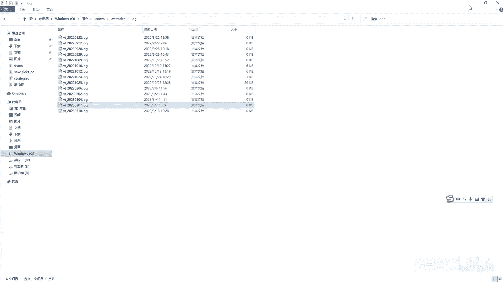

是严格按照就是你的这个给他这个FORMATTER，就是给他设定的格式来进行输出的啊，来进行输出的，下面呢这个呢这三个呢是ADD这个handler，其实是处理这个。

你像这个handler handler就是手的意思，就是来处理这个呃这个这个日志的哎，对诺诺就是在C在C语言或者C加加里边有，它是个空的意思，这个呃你怎么去理解它呢，比较抽象一些，比较抽象一些。

他其实你必须得得去添加它的，因为它会避免一些错误的出现，这个是首先要添加的啊，首先要添加的，这就是这个我就不多解释，你可以百度啊，你可以去查一下，然后呢你想如果说终端输出的话。

就添加一个终端输出的处理模块，然后如果说是你是就是文件输出的话，你是添加一个文件输出的模块，文件输出模块，你想他这个at nor，它这里边其实就是nor handler，就是这个里边就是添加了一个。

就是这样的一个输出方式，但是呢它其实是哪也不输出啊，你如果没有这俩的话，这俩都是false，就是哪也不输出啊，哪也不输出呃，这个跟他的这个构造的模式有关系啊，这是必须得添加的。

然后at console就是在这个终端上输出，终端上输出呢，就是它其实是通过这个at at handle，就是就是就是这个东西给他添加进去，然后它这sat level还是就是它的这个等级呢。

和咱们这个等级是一样的，就是整个的C点level是一样的，包括这个at file，如果说你想要在这个日志啊，就是在这个文件里面保存下来的，那个输出的这个等级比我高一等级，你可以单独的进行设置啊。

单独的进行设置，你像他这儿就写了一个，就是从你是从哪儿，就是说保存这个日志，你看它就说名字，这个是就是获取当时的日期嘛，然后名字以这样的方式，然后前面加上VT，然后点log是吧，然后再通过这种get呃。

这这个是获取文件夹的路径啊，然后就找到这个log，如果说你没有的话，他会自己去创建的啊，你看如果说这个获取文件夹的路径，如果说你没有的话，它会make dr，就是创建文件夹嘛啊创建文件夹呃。

就是这就是为什么你就一打开的时候，它会自己创，就是创建一个文件夹，然后会自己把这个名字给写进去，然后这就是这个就是它的这个文件路径嘛，啊文件路径，然后下面你像这这个都是统一的是吧，设置它的等级。

设置它的格式，然后把它添加进去啊，把它添加进去，其实你像这个诺这就没有设置，因为这个没有输出啊，是吧啊，呃你如果自己去用的话，你就按照他这个模式给它粘就行啊，粘就行。

就是Python里边包括其他代码里边很多的这个，你要是去记各种各样的类，各种各样的方法什么的，肯定是记不住的啊，你就是你就学会去用就行了，你你知道他是怎么回事就可以了，他这里边就是说唯一给咱们做的呢。

就是一个什么呀，就是说register就是把这个logo就是注册进去，然后注册进去之后呢，通过这个process log MIT来进行处理，来进行处理呢，它其实就是把这个需要调log。

然后log包括log level和log message都放进去，然后就实现了，同时在这个终端输出和你在这个这个fire，就是你的文件保存就同时去实现了，这个就是这个整个的这个logo engine。

它的一个模块的作用，其实这个东西很重要的啊，但是咱们只要会用就行了，很多时候如果说你想对应的就是把它写的，就是说更加完善一些，它有一些设置啊，你得单独建一个，就是就是文件来进行对它设置。

包括里边的liver啊，包括就是说你的这个一些，就是说其他就是包括这个format进行设置，你需要单独建文件进行设置的好吧，有兴趣的话呃，你可以去自己去研究一下，如果说后面有机会的话。

再给大家讲这个各个模块好吧，然后这个my engine和这个o m s engine，是咱们着重要讲的，这个my engine里面做的事情呢，它其实呢就是虽然都实现了这些方法。

但是呢他很大一部分就是很大一块的功能，全部给了这个o m s engine啊，就是这个o m s engine统一管理统一管理引擎，咱们可以先看一下这个这个my engine它的初始化啊。

你想因为engine其实是你my engine启动的时候啊，初始化的时候你可以给他传engine，你也可以不给他传，但是通常情况下咱们都给他传，咱们把image engine放在外边，因为很多其他的方。

就是其他的地方还是需要用到这个in engine是吧，当然你也可以把这个MENGINE放到里边，通过my engine来进行整个的一个处理啊，来进行整个的一个处理，它这里边同时兼顾了。

我把它理解为叫上下游，上游是什么呀，上游就是你的这个gateways，比如像咱们这个c TP gateway，就是接口接口的模块啊，这个cf engines呢就是它的这个呃算是中游吧。

你比如说这个ccta engine或者btesting engine啊，或者说是你其他的一些，包括这个log engine o m s engine都在这个里边，这个APP呢是什么意思呢。

咱们再打开那个就是维纳咱们那个平台的时候，这边它显示的回测呀，CTA呀，什么包括PEACCOUNT啊啊包括一些呃，比如excel处理啊，就是你可以把它把这种东西理解为是APP啊。

APP其其实里面封装的是什么呀，就是N键，还有a p p name，还有什么就是去进行这一类的封装。

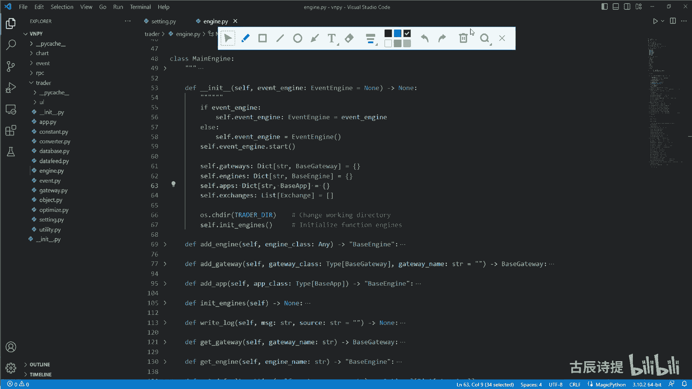

咱们可以打开一个看一下啊，啊在这个C盘用户LV，然后还不是这个里边啊，在这个这个里边lib site packages是吧，Set packages，比如说咱们找到这个VMPY。

它的这个PAPERCUT吧，找一下啊，POPQ啊，Pip count，咱们打开它哎，就是咱们用那个什么打开一下啊，用code打开它一下。

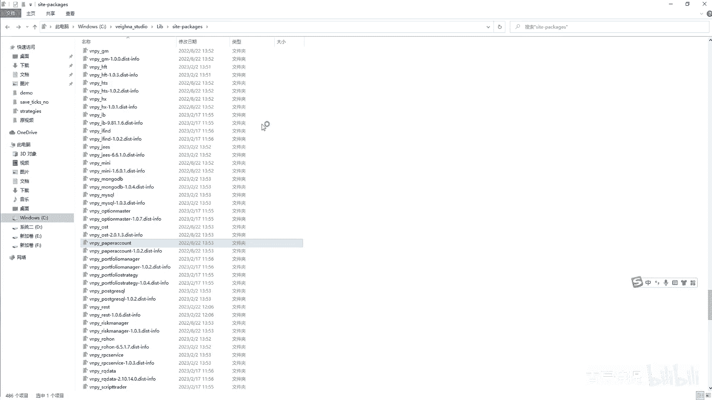

好打开之后啊，咱们看看这个是它的引擎是吧，咱们在这个in it这继承自best a p p，然后这是什么paper，count a p p里面封装了什么app name a p model是吧。

就是你的模块在哪嘛是吧，就是你的pass就是你的路径啊，name就是模拟交易，包括engine，就是这个engine class，就是piper engine，其实就是这个engine嘛是吧啊。

包括这个呃，which name就是它的对应的界面的名字啊，对应的界面的名字，包括ico name就是它对应着的就是图标，咱们打开维纳的时候，是不是每个上面都有图标啊，就是图标的这个路径。

你看它是什么呀，ui pep点就是ICO，其实就是其实就是这个嘛对吧啊，其实就是呃，其实就是这个它都是在这个INIT文件里面，去进行封装的啊，就是他的这个，就是APPAPPS在这里边用的呢不多啊。

它其实是最主要的，还是在界面上去显示你加载了哪些模块，这个exchanges就是就是交易所嘛对吧，OS点乘DR咱们前面讲过这个try的DR，就是那个呃跟这个pass掉，就是home。

就是这个C盘下面的MINISTRATOR，那个下面的是吧，它给它转过来，就是说更多的是为了路径的方便啊，就是OS点站D，这个咱们可以给大家再做一下演示啊。

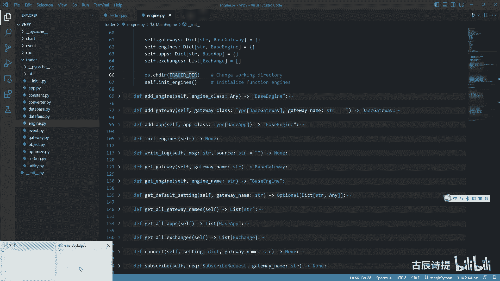

在这个F盘啊，这是咱们是第26节课是吧啊，把它整体的打开一下吧。

咱们新建一个啊，26点PY就是咱们import一个OS，然后再from past lib，import一个path，咱们先print一下这个path点home，咱们之前也讲过。

为什么会有home这个东西，就是因为在这个LINUX啊，或者一些就是以前用的，就是这个这个这个开发经常用到的一些呃，这个操作系统上，因为开发一般就是尤其是一些大型程序的开发。

很少在这个windows上面去开发啊，很多的都在像呃那个什么森OS上面去进行开发，更加的稳定，它里边有个根，就是根目录或者加目录啊，在这个windows上，它的这个加目录呢就是C盘。

users这个lever或者the major啊，这个里边如果说那你想比如说我先说，我先输出一个pass，我点CWD吧，CWD是啥是什么呀，它输出的是这个demons啊，说的是这个demons是吧。

demo就是这个文件夹里边，然后如果说我OS点CHR称DR，给他转成到这个pass点home，然后我再print一个这个pass点CWD，咱们看一下啊，你就会发现他给到了这个，就是这个家目录里边去了啊。

就是pass点CWD啊。

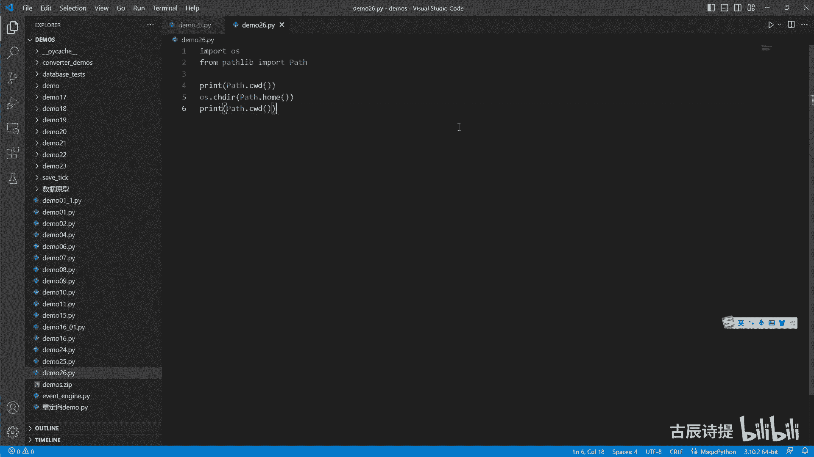

这样对你的这个路径的一些处理，会更加方便一些是吧啊，这个其实没有太多的。

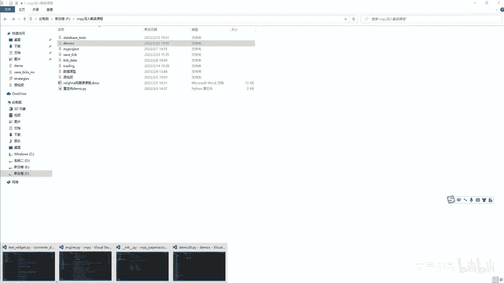

就是说这个要说的，而且之前也讲过，它下面一步做的是in it engines，就是初始化引擎，这个里边引擎呢是at engine log engine，O m s engine。

email email engine这个at engine里面做什么呢，其实就是把它们实例化，你看engine engine class就是把log engine进去之后，括号是不是就是就是实例化。

然后把cf给它传进去，cf就是这个main engine本身吧，然后再把这个呃image engine给它传进去是吧，然后把它放到这个engines这个字典里边去，再把这个engine给他返回出去。

当然这没接，他，就是把log engine o m s engine和email engine进行了这个实例化，其实就是进行了这么一个操作啊，其实就是进行这么一个操作，他主动操作的呢就这么多。

你像后边at gateway，其实就是把你的这个呃，就是这个get away的这个类，比如说咱们这个CD p gateway，你把CD p gateway这个类给它放进去。

然后他会主动的给你进行实实例化，你想这就这个gateway class，然后进行实例化，然后把event ending和gateway name给它传进去是吧，然后他会给他放到哪儿呢。

就是这个这个gateways里边啊，然后get with里边方便后边的去查找，从这你就能知道啊，这个gv name其实挺重要的，咱们可能在做这个单个接口的时候，就gateway name显得可有可。

但是如果说你想就你想一下，如果说底层有多个接口的话，其实这个gateway name显得很重要，因为你后边比如说咱们SORDER，这你首先你得去找这个gateway。

通过gateway name去找到这个gateway，然后再去send order对吧，所以说呢这里边就要求啊，你的这个就是说这个你的gateway，需要做一些统一的接口处理啊。

比如说你这个SORDER是不是必须得有，你，不然的话你从这里边你找到这个gateway，gateway里边没有sin order，它它它就会报错了，对不对，他就会报错，所以说你像一些呃就是说接口啊。

它还是得统一的进行处理的，咱们之前反复在想继承自ABC，然后呢它这里边用这个ABC，用这个abstract method进行装饰的，必须得去实现是吧，你想connect clothes，包括申请啊。

SORDER都是实现，这就是统一了接口是吧，这就说明啊，你这个框架是可以同时接入多个gateway，然后同时接入多个engines是吧啊，会很方便好吧，当然咱们用的时候很少来用。

这这就是为什么咱们之前在写代码的时候，可以脱离出这个manager，把这个manager给脱离出去，因为咱们就是单个接口是吧，然后就是说你就是说呃单个引擎，然后这个引擎就是说就是比如说你CTB啊。

不是你这个CTA引擎，但是呢你需要把这个log按键单独摘出来，log engine单独摘出来，就是说很多时候，你可以选择去实例化一个logo文件，但是有些时候你会实例化一个main engine。

然后把里边这个log engine去获取出来，就是去get engine是吧，get engine你本身你在实例化这个my engine的时候，它本身就已经有了这个log engine了。

因为在image engine他已经有了这个log n g了，然后你去get engine，然后通过这个名字去给他给获取过来是吧，这个在咱们那个举例子的时候啊，包括这个无界面去跑的时候。

它就是采用这种方式来进行操作的啊，采用这种方式来进行操作的是吧。

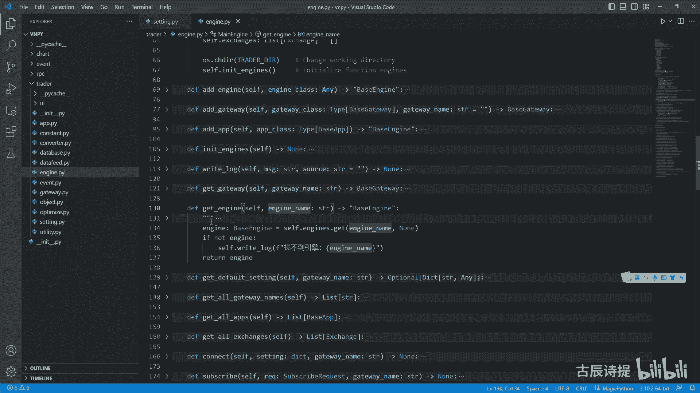

嗯我打开了一个这个get it嗯，就是相当于咱们国内的这个GITHUB，然后这个里边它有个这个啊，就是这个演示的一个是吧，就是里边是NO you i，你看它这里边进行处理的是什么呀。

会把这个用这个my engine来艾特给，然后这个c t a engine就有了吧，然后去这个里边去获取的就是app啊，把这个APP1添加进去，然后这个c t engine就有了。

你一定要理解这个逻辑啊，然后main engine right log是吧，然后这个log engine呢直接是main engine，点get engine，你看通过这个logo吧是吧。

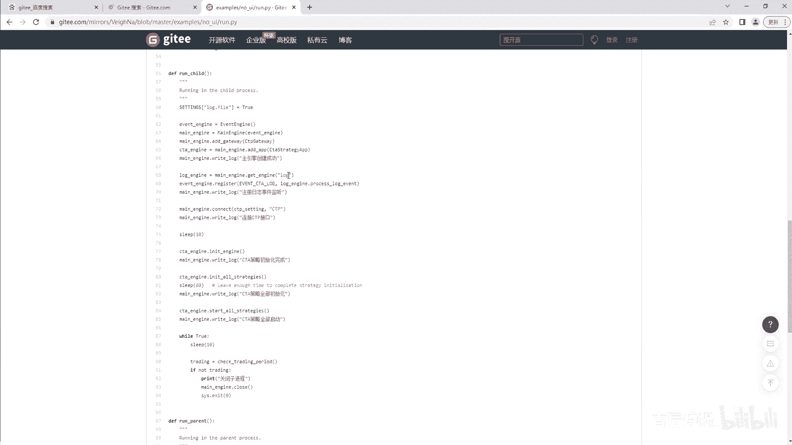

他就是通过这种方式来进行获取的，所以说这个manager是一个统，其实它就是一个统一的管理引擎里边，具体不实现逻辑，只是一个粘合剂啊，只是一个粘合剂，你你包括这个light log。

还是就是说把这个就是日志，放到这个invent engine里面去，通过这个log作为标识，然后去让这个log engine里边去获取它，然后再进行处理是吧，它不不去做具体的这个业务的逻辑。

它只是去什么呀，就是说把就说你engines和gateway，你的这个底层啊和上层进行一个连接啊，后边的其实就没什么好讲的了啊，给他呃，这个是获取所有的这个给这个gateway names是吧。

获取这个这个DEVOICING，他其实还是去找这个gateway，然后去获取这个默认的设置啊，然后这个后面还有什么呀，Get all exchanges，get all app啊。

这个connect连接它还是通过gateway去去连接嘛，就是这个subscribe它也是通过gateway去去订阅是吧，sorder cancel order啊，这个呃就是说这个是询价啊。

这个包括咱们之前说过FAKFK，咱们从这就不去去讲它了，这个跟期权呃有些相关的是吧，就是这个而且你从咱们的这个CTP底层里边，或者从一些底层里边，他并没有去实现它啊，并没有去实现它呃。

但是呢其实是在更底层的地方其实是实现了的。

咱们可以给他看一下啊，在这个还是在咱们这个维纳斯studio里边，包括lip啊，然后side packages在这个VMPY，这个你一定要熟啊，你一定要知道你写这你写这些代码是吧。

你的这个他的这个东西在哪。

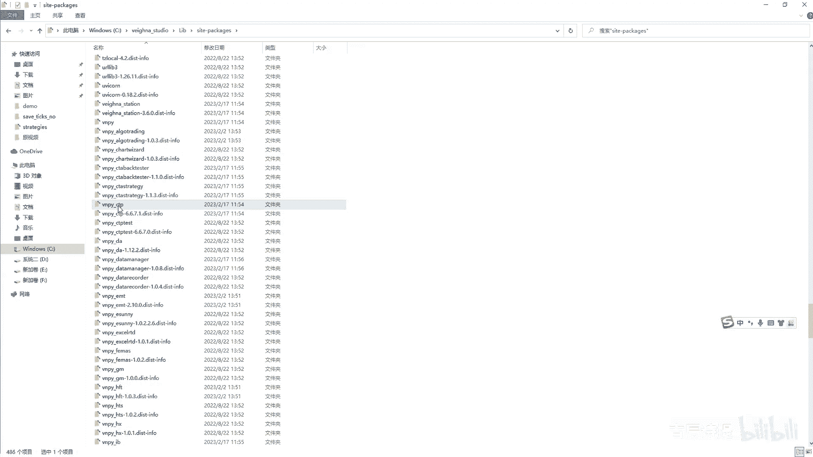

包括你导包导入的东西在哪，你像咱们这里边去搜这个，你像咱们这个engines，就是这个新的，就这么读啊，我给他复制一下啊，复制一下，你看这个if getaway，然后去send这个东西。

但是呢咱们去这个cp gateway里边呢，你看它并没有是吧，并没有去实现的，包括一些其他的这个接口里边呃，就是说我看了几个也没有去实现它，但是呢它在更底层它其实是实现了的啊，更底层其实是实现了的。

就像你去发这样的呃，询价的要求，你像咱们在这个CTP，这咱们是这个SORDERSORDER是吧，然后它底层是去做做这个东西，就是去调用这个方法吧，是不是，那我把这个方法改成我这个这个QU，QUOT吧。

应该是这个，然后我把它放到底层里边去找一下是吧，就是在咱们这个，他肯定是在这个TD这个里边啊，咱们去来找一下，你会发现是有的，而且呢在咱们说了，就是他通过这个py bin的这个。

11这个模块来连接的时候，它其实是有的，对不对，是有的啊，你想知道它是个什么东西，你可以去查一下是吧，就是这个呃这个insert，咱们可以在他的这个呃include这个这个里边。

这个t d try的这个API里面去查一下，你看啊，这个当然是咱们调整一下它的这个GBK，就是编码格式啊，你看这是报价录入请求是吧啊，报价录入请求，你可以去自己去看它这里边究竟是有哪些东西。

然后再通过这个里边它的这个STRUCT，就是他的这个结构体啊，咱们去他的这个，你看这structure里边，就相当于咱们在这个Python里边的这种数据类型，集中的数据类型。

就像这个用那个at data class去包装的那个啊，类似的这种数据类型啊，你看这个里边有有编号啊什么什么的啊，你可以自己去研究是吧，在咱们这儿这儿呢，咱们就不讲它了，就把它给啊过滤掉了。

它跟这个order挺像啊，但是它跟是期权，它有些时候期货里边也应该也可以去询价吧，这个呢就不多说了，然后包括这个query history，它还是通过这个gateway，可能有些老板们会有疑问。

为什么在这get way，就是你底层的接口会去获取历史数据呢，他有些金融产品啊，它是可以给你提供历史数据的啊，但是这个我也不知道是哪些金融产品，会提供历史数据啊，但是因为我主要做期货。

期货是不给提供历史数据的啊，这是close，就是会挨个的去关闭啊，会把引擎都关闭掉，然后直接gateway挨个的去关闭掉啊，这个就是这个main engine，但是呢你会发现它里边有些东西。

就是它是没有去实现的啊，没有去实现它没有实现的东西呢，它其实就放在了这个OMS引擎里边，在哪呢，就在这个at function，at function里边，你想GTA啊。

就是你my engine如果调用了这个get tick，它会自动去接入到这个om引擎里边，这个get这个包括get order，Get tried，就是获取一些东西的时候啊，get account是吧。

Get autics，get all orders啊，什么都是放在这个里面的啊，都是放在这个里边的，所以说你有时候去看的时候，你可能发现从底层，比如说这个c t a engine里边去。

他去调my engine的一些东西的时候，从这儿没有，它其实是全部接入到这来了，因为你实例化MENGINE的时候，你已经有o m s engine了吧，是A对吧，当你去调用这种方法。

通过manager的时候，他直接就调用了这个OMSN，你里边一些东西，这个里边大部分都是获取些东西，另外这个里边最重要的一件事是做什么的呢，转换啊，转换转换就是这个转换呃，就是咱们一直这个里边。

其实大部分内容咱们都讲过了，包括这个这个这个奥特麦子是吧，都讲过了，但是这里边咱们一直有个东西没讲，就是这个这个东西没讲，它是一个转换器，转换器咱们之前提到过是什么呀，它比如说你的这个呃最简单的啊。

比如说我上期所螺纹钢，我发送委托，比如我平仓close，我平仓五手，方向是long是吧，说明是空瓶嘛是吧，long方向long就是说说明是买入平仓，那肯定是你持有空单嘛，但是呢你close这个委托呢。

你发到这个底层，他是不接收的，上期所和上期能源，它必须得指定，你是平均还是凭着就是平均仓还是平仄仓，这是必须得指定的，但是其他的交易所呢，你发close过去，它是默认的，就是说他会接受他是优先。

就是凭老仓，就是先进先出那种模式，就是先先有的这个持仓他会优先给评出去，但是在这个上期所这你必须得指定出来啊，那你就需要进行转换，我平仓的时候我平五手，那我这个我持仓我持有空仓吗。

那这个空仓里面是五首都是金仓，那我就需要把那个offset这个close变成offset，clothes today是吧，那你就需要把它变为close，Yesterday，所以说在这个OSITY里边。

就是说这个咱们在这个呃constant，就是它定义的这个constant，这个里边咱们找这个啊，这个offset你想咱们通常用的是什么呀，开屏吧，open和close。

但是它实际上呢它后边还有两个平均和平足，其实这个是专门给上汽能源和这个，上期所准备的，它后边得需要去进行转换的啊，得需要去进行转换的，你像这些转换呢其实就是在OMS引擎里边呃，去实现了它的更新转换啊。

就是你像这就是在这个里边，它转换它并没有去呃去实现它，它转换是在比如咱们看这个CTA引擎啊，呃咱们还需要打开一个CCTA引擎。

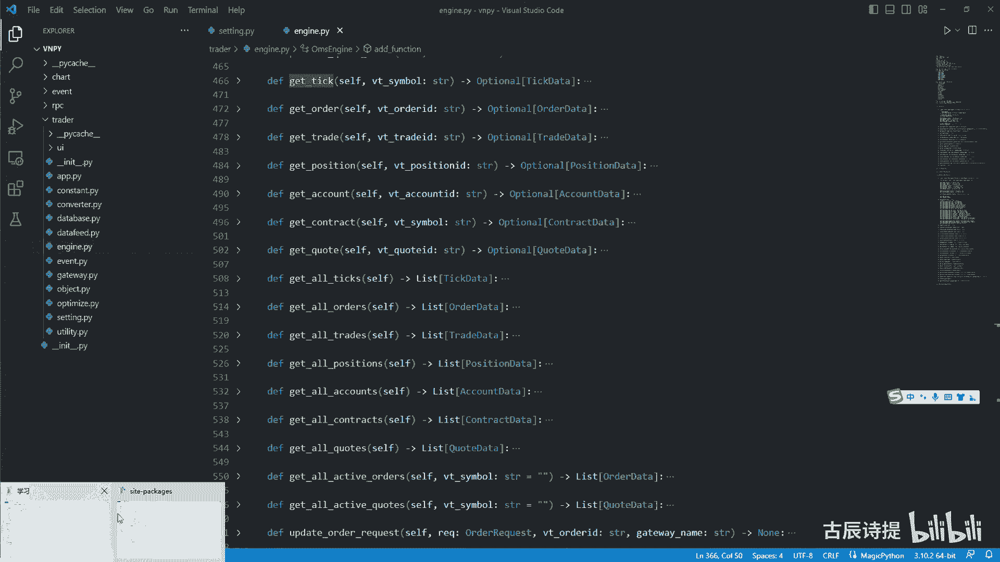

C t a strange，通过code打开一下。

这个engine里边咱们就是说你像slimit order，最终会咱们之前讲过，最终你发送委托是slimit order是吧，就是会发送到诶这个go to definition，怎么过不去呢。

啊这有点CSOL是到这个CSOL吧，你停止单也好啊，你这个限价单也好，你最终你得到这个这个CSOL的吧，他发过来的就是说这就是这些，就是说你的这个请求它其实是个order request。

就是一个委托请求，是不是你像他这它是通过cf点main engine，点comment order request commit，你从这你就能就是说从这个代码，从这个方法的名字你就能判定出来啊。

转换order request，就是把你的委托请求转换成对应的，你的这个呃请求的这个list是吧，这就是就是转换，你像在my engine里边。

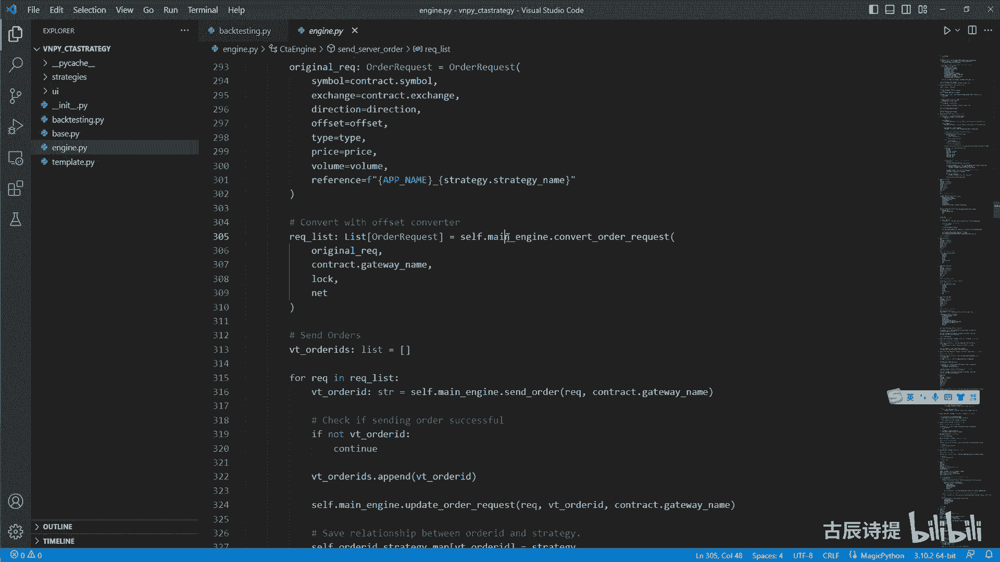

它其实并没有啊，在my engine里边其实并没有，但是它是放在了OMS这个引擎里边啊。

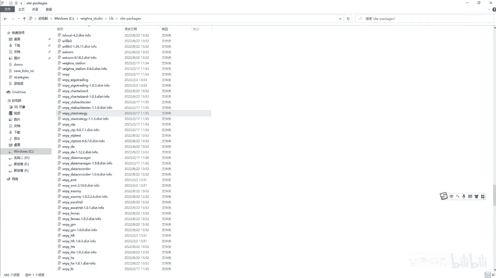

来去实现的啊，在这儿呢它其实就是这个通过什么呀，就是update order request，update order啊，不是这个是content order request这里边来去进行转换的。

他最终呢它其实是这个，咱们如果说只有一个转换器的话，比如说咱就是一一个接口，肯定是对应一个转换器是吧，如果你多个接口得去对应多个转换器，你像它这个是只有呃，他是为了匹配多个接口啊。

然后他去进行呃做的这样代码的这个逻辑，其实它最终是什么呀，comment就是comment，orderly quest啊，他先去找这个就是转换器啊，如果说找不着的话，直接就把这个IEQ。

然后外边加了个列表给你返回去了，如果找着了，然后就进行转换，然后再给你返回这个这个iq list好吧，这是转换器是从这儿来做的，咱们后边就要详细来讲这个转换器，其实讲明白了转换器啊。

就是你对这个期货的底层逻辑啊，你就有很深的一个了解好吧，后面咱们会着重去讲好，别的，其实也没什么了，他这个get autics就是进行先就是获取，你像这个cf点TX，它是做做什么用的啊。

你像这有个cf点TX是吧，咱们并没有去讲，咱们看一下这个搜一下CTRLH，然后把这个cf tx首先是在这个定义者，它里边呢是STR和data啊，就是里边肯定是用这个。

要么是simple或者which it simple，然后存储的这个data是吧，然后process to invent，你想啊它是self ftk tick点啊。

very simple就是通过very simple作为key，然后tick作为value，然后把它存放在里边，而且一旦有T过来，它会进行更新吧对吧，就是如果说你交易了十呃，十个合约在跑的。

他这个CTICS其实存放着，最近的合约的这个tick啊，最近的这不这个每一个合约最近的一笔tick啊，你可以就是说去获取到的，其实是通过这个my engine，你是可以获取到的吧。

就是我哪个合约最近的一笔TIK啊，这个咱们之前没讲到这个，只不过是它把它存储在了这啊，包括这个呃order MIT，它这呢也会给存储这个order啊，你看update order。

它其实最终的目的是什么呀，更新就是这个转换器里面update order啊，然后就是说包括这个tread，你看它还是update trade position，update position啊。

包括account，这个里边是就因为这个涉及不到转换是吧，你看他所有的都是为了给这个多个，你想这也是有可以进行多账户来进行处理的啊，多账户来进行处理的啊，包括这个contract啊。

contract呢他这也是呃，就是说这个啊给他什么呀，就是说创建了这个offset，就是就是这个转换器嘛啊，就是他会为每一个gateway，你想如果说contract这gateway name。

那没有在这个转换器的这个字典里边，他就会给他创建一个转换器是吧啊，包括这个也是啊，就是说当然这个没有去用转换器来进行处理了，给亲爱的，这就是一个就是一些功能的获取啊，包括一些对象的获取。

其实没有什么好说的啊，没有什么好说的，那整个呢这个main engine咱们就算讲完了，里边其实更多的他作为一个什么呀，就是作为一个统一的管理引擎，就是里边把你的接口啊，引擎啊。

包括你的这个呃一些你有你用到的交易所呀，都存放在里面，包括一些对象的获取，比如说那个包括你的order啊，这里边都进行存放了，方便去进行什么，就是说你的上层的，比如说我的这个各种引擎里边的调用。

接口的调用，其实这里边就是提供了接口好吧，那这个呢咱们就说完了啊，说啊说完了说完了之后呢，你从这儿啊，你会发现，就是说咱们刚才反复提到的这个转换器，Addorder addate，这个tread。

咱们说一下这个转换器的逻辑在这几个，最后，那这个转换器它主要的功能是什么呀，咱们捋一下啊，这个转换器主要的功能是什么呀，其实就是你为了发送往底层发送委托是吧，往底层去发送委托，符合底层的这个要求是吧。

同时呢不断的去更新，你实际上的就是实际的品种的这个持仓也好，委托也好，就是说呃这个on trade就是这个update trade，咱们能理解就是更新这个triad就是交易信息。

因为你这个里边呃这个转换器里边肯定存储了，就是说你这个品种不是你这个合约，他持有的仓位是吧，肯定得准确吧，是不是update trade能理解up after the position，就是持仓。

也能理解，咱们之前在讲这个image engine的时候，咱们说过每隔两秒还是三秒，他会交替的去获取这个position data是吧，还有这个account data，他会交替的去进行获取这两个数据。

那这个account data咱们能理解，其实就是获取你的这个资金嘛，就是账户信息吗，那为什么要不断的去获取这个position data呢，因为你得不断的纠正，你的这个实际的持仓是多少。

是不是你得不断的去进行纠正吧，比如说你实际的持仓你计算的是十首，但是呢你这个在服务器里边它是把手，那肯定你得把它调整成把手吧，对不对啊，这个能理解吧，update这个position能理解。

update trade呢就是你每次在交易之后呢，他会这个转换期里边会去进行更新，为什么会去更新它，因为你毕竟啊，你毕竟就是你就是前一个准确的这个position，和后一个准确的position。

中间是有几秒钟的，如果在这个中间发生了三四笔交易，那你得确保你持仓的准确性，这样你才能准确的去转换你的这个委托，对不对啊，你比如你上你上厕所的，你一开始是第一次获取的持仓是五首，是不是。

然后后边获取的持仓是十首，中间我开屏开屏有个几次，那你得确保准确性，然后你才去你才能进行转换呀，是不是啊，这个update trade你也能理解，那update order是为什么呢。

为什么要update order，这个委托为什么要进行更新，这个里边就涉及到一个底层的一个逻辑，就是什么呢，当你去往服务器去发送一笔委托的时候，开仓没问题，就是你去开仓呃。

就是这个就是这个交易所啊会冻结你的资金，冻结你的资金，就是你开仓它会冻结你的资金，你确保你得有这么多钱，对不对，但是呢这个咱们就不需要去考虑了，平仓的话它会冻结你的仓位啊，平仓会动机你的仓位。

比如说我发送了一个委托，这个委托就是平五手多单，你现在持有十手多单，你这个五手多单，如果说发到底层之后，需要平台的话，如果说你再发送一个委托，说你要平时守多单，你就平不了十首。

或者说如果直接发送发送到底层的话，底层根本就不接收，他会告诉你就是平仓量超过持仓量，因为你被冻结着呢，是被另外一个委托冻结着呢，你当前这个委托过来，其实可以用的这个仓位只有五首啊。

所以说在这个转换器里边也得控制住，这个就是说必须得时时刻刻的，就是把它做到准确了对吧，你冻结了几首，他这就要给他冻结住，不然的话你往底层发送是会出问题的，所以说转换器最主要的作用呢。

就是把符合要求的委托发送到底层，好吧。

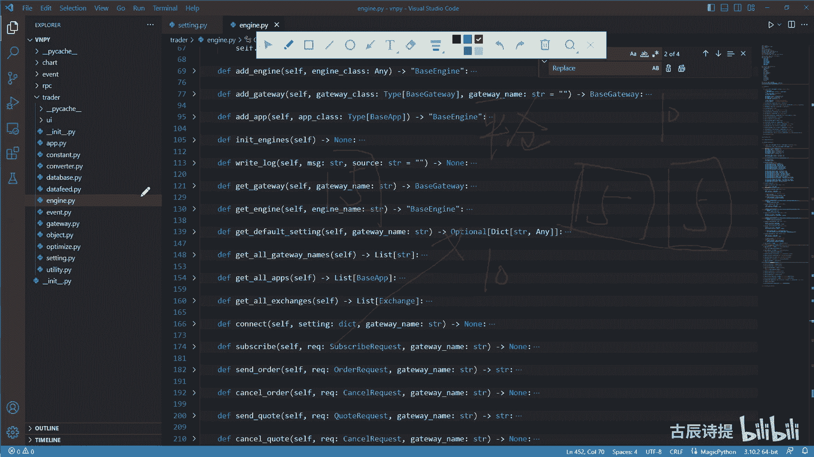