# 第26节课 交易信号及委托4 - P1 - 古辰诗提 - BV1avsDeJEBb

欢迎大家来到从零开始量化系列课程，MC课程的第26节课，这节课呢给大家讲这个内建出场函数，在具体讲这个之前呢，先给大家做一个演示，这个演示是什么呢，先定义两个变量，第一个变量呢是A额变A了。

VVA20吧，VR1里边放一个零呃，放一个零，然后呢我VA20等于VA201，然后VA21等于VA211，然后print一下VA20冒号，VA20空格，然后VAR1冒号，然后VAR1，这个很容易理解吧。

就是每执行一次的时候，我为我V201，v a 21+1，然后把它进行一下这个输出，我从这儿呢我加上一个什么呢，加上一个ones，然后clear这个bug也好，或者clear那个log也好，都可以啊。

好我再进行一下编译，我把它添加进我的这个。

插入型号。

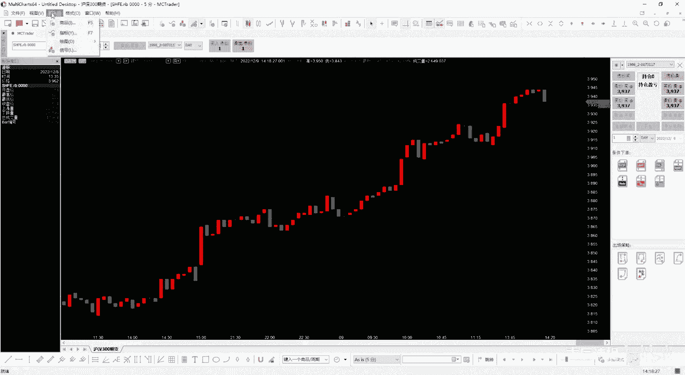

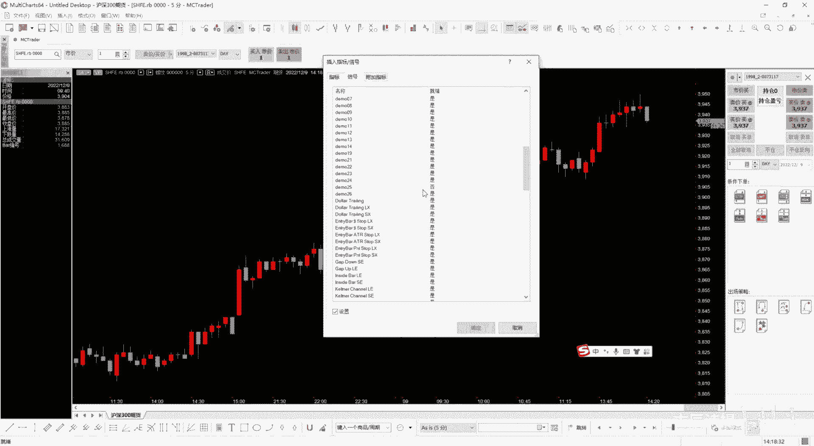

close好，咱们看一下它的输出，你会发现这两个数是一样的对吧，这两个数是一样的话，都是1666啊，好好，那我给他改变一下，我给它改变一个什么呢。

我从这儿加上intro bar presist v a20，我这样来定义，然后我再进行一下编译，你会发现这俩还是一样的是吧，咱们之前说过这个intro bar persist。

你得根据这个跟着这个叫intro bar order generation，去联合去用，把它改成true好，我再进行一下编译，你会发现是不是就不一样了，这边啊他还一直在输出，因为现在是这个在这个开盘时。

开盘时间段之内啊，你会发现这个V20，它是每一个tick都是在更新的对吧，但是V21呢他是一直都是1667。

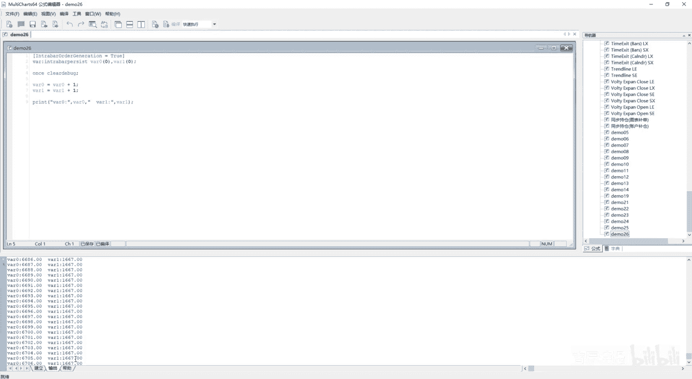

除非等着这个咱们的周期是在5分钟上面的。

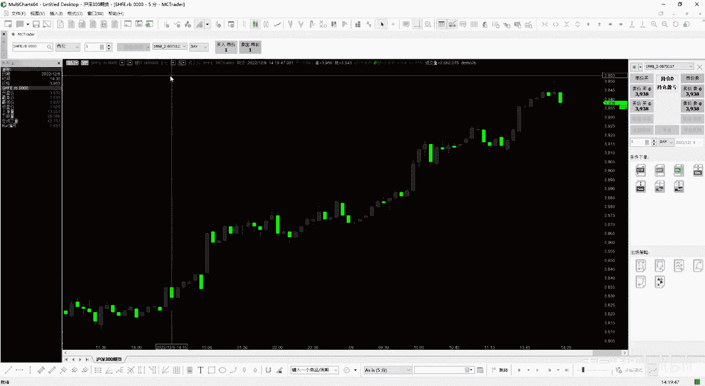

5分钟走完了之后，他才会去更新一个呃，这个就是咱们之前一直在说的，就是你这个intro bar persist，你定义的这个变量，你配合着这个intro border generation把它打开之后。

你这个N呃，这个V20就是你用这个INTROBARPRESIST，定义的这个变量，会每一个tick更新一下，你从这儿你还会发现一个什么点呢，就是你像这个是once死啊，CLEO这个就是这个debug。

就是他只执行一遍，如果说我把它清除了之后，我把它关了，只额不是啊，我从这我写上，C l e e a r clear bug，我不用忘词，咱们来看一下啊，我再进行一下编译。

你会发现它是随着这个来更新的是吧，你会发现啊，这个里边没有变化的，其实只有VR，就是这就是这几行代码里边没有去变化的，只有只有这个VR1，其实别的都执行了，只有VR1，你不能说他没有执行。

只不过是V21，它没有进行保存，但是V20他这个加一是执行了的，但是同样的这个print和这个clear debug，它也是执行了的啊。

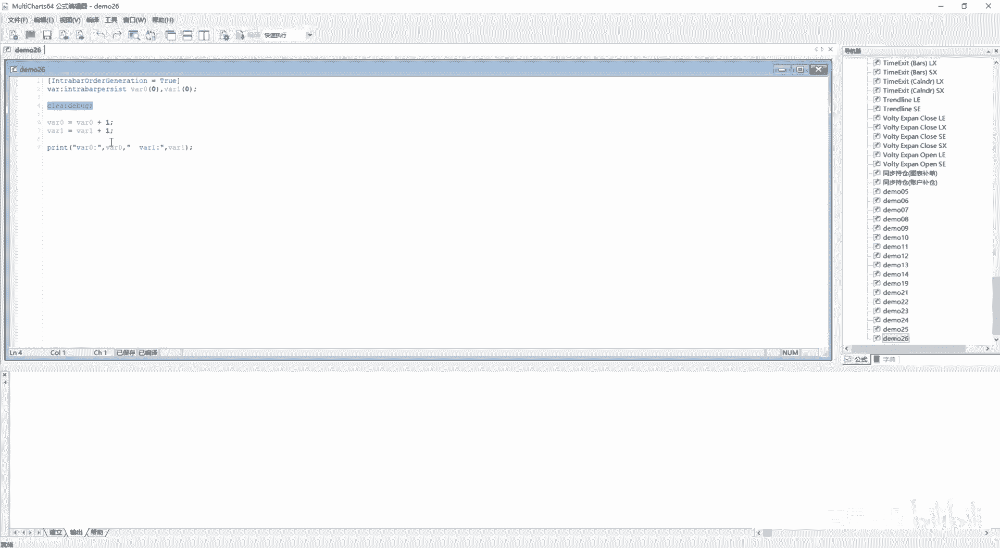

咱们先把这个先状态先关一下啊。

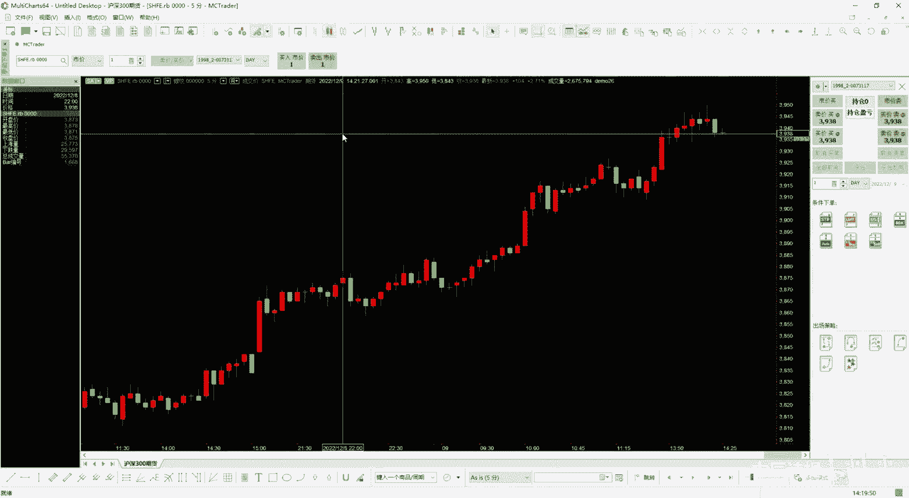

从这儿咱们可以总结出什么呢，就是当你把这个intro bar order generation给打开的时候，如果说你下面有什么by呀，或者sell shirt呀，或者平仓呀。

by to cover这一类的这个操作的时候，它也会不断的就是根据你每笔tick来进行处理，然后来进行操作，能理解我这意思吗，只有说这个VR1，他没有用这个intro bar persist定义。

它不会去更新，但是其余的代码其实它都是执行的，也就是说每一笔即可来，他都会执行一遍，只不过V21它没有用in into8persist定义，然后他就一直停留在了，就是他的这个就是那个节点上啊。

另外你还要去注意的啊，你还要去注意的，我同样的，我把这ones可能吧，咱们再输出一下什么呢，就是说这个VA20，pray啊，空两格啊，V20PPRE就是咱们可以看一下这个VA20，它的前一个是什么。

输出一下咱们V20它的前一个数啊，它是什么，好吧好，咱们进行变一下。

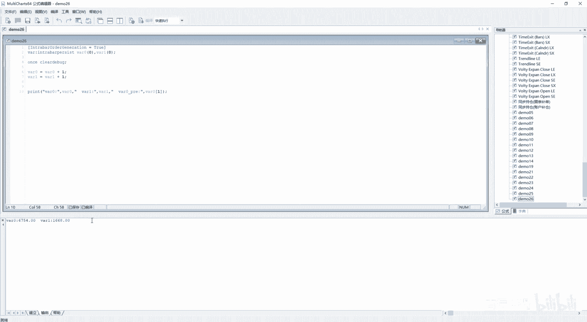

啊我得把把这个打开是吧。

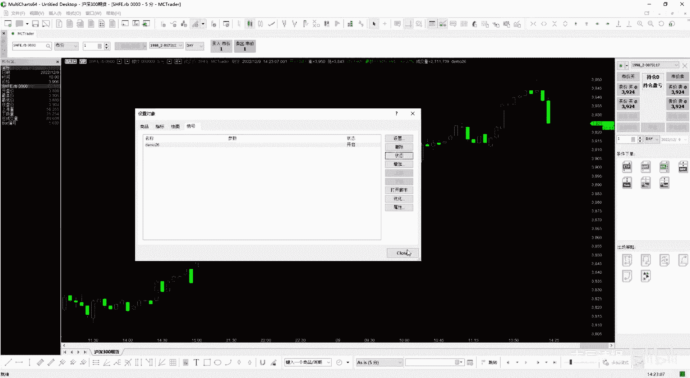

你会发现啊，你会发现咱们挑一个看，你会发现咱们从这来看啊，你会发现，虽然他这个6698996700，一直在往前跑对吧，但是V20pray一直停留在了6668，他一直停留在了6668，发现没有。

他一直停留在了6668啊，包括如果说我这在pr一个clothes啊，然后再输出一个close pray，就是前一个这个收盘价，好然后我进行一下编译，嗯啊这个是少了个括号，哪有问题啊，这好听一下编译。

咱们再看一下输出，你会发现其实这个clothes啊，他就是说会根据你这个tick，你看他会有变化的，但是你的close pre它始终是3938。

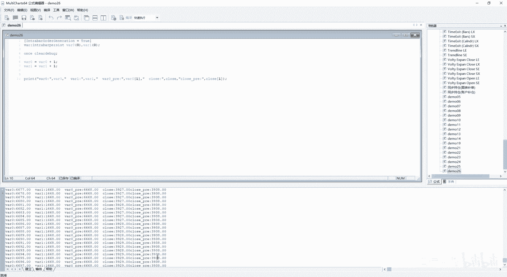

3938是哪一根啊，是这根吧，咱们看左边收盘价3938对吧，所以说就是你的这个不管当前，因为你这根K线没走完的时候，你在坝内，你那个clothes始终是当前的这个价格。

你像392639271直在这波动呢。

你看他这个一直是额3929是吧。

一直在这波动啊，这个输输出的太多了啊。

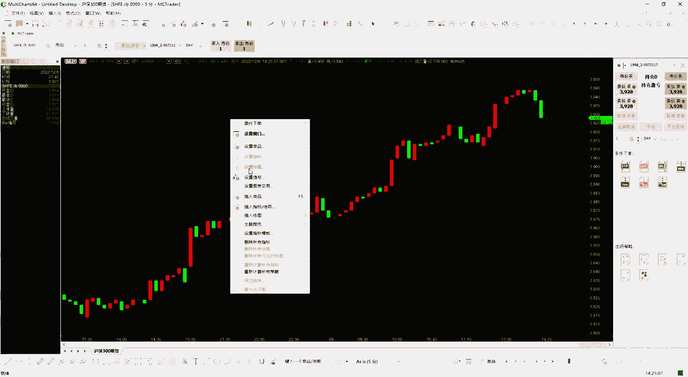

把他状态关一下，嗯是吧，他一直在波动，但是他的前一个close，它始终获取的是它前一根K线的这个收盘价啊。

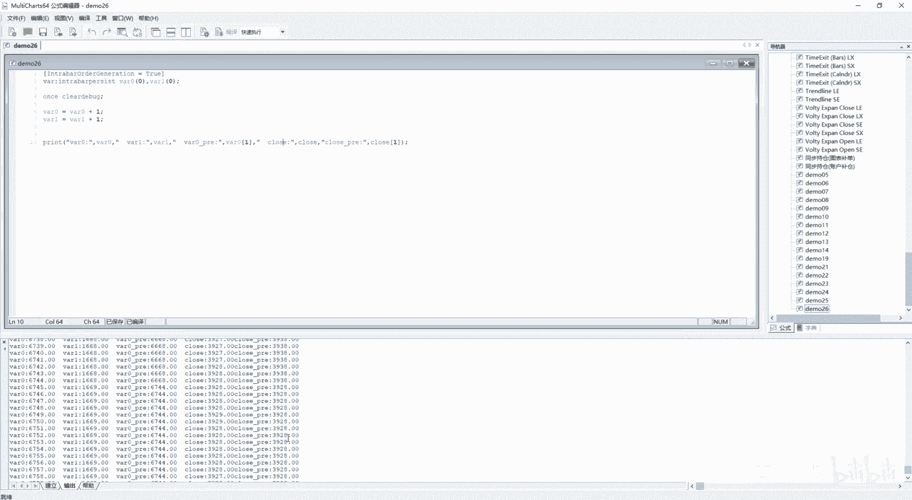

就是当然这根已经走完了，其实当时是获取了这根3938对吧。

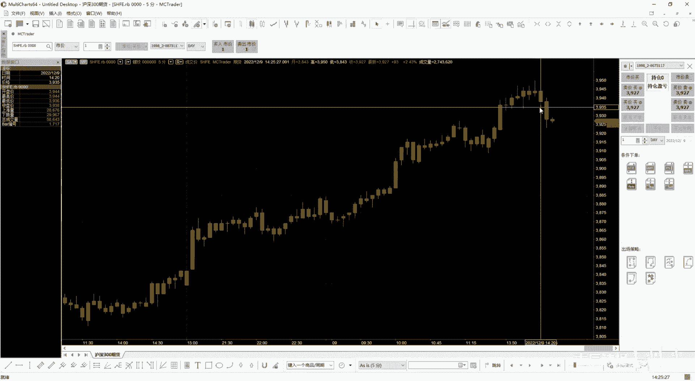

你一定要记住这个，所以说你不要想当然的就是包括这个V20，你他获取的前一个，你可能认为他是比如说6753，他前一个是6752，不是的，你想他始终停滞在了，你像这个呃6744，你像这是呃6668对吧。

6668啊，你再往前你看就是说他会停一段时间，他其实获取的是什么呀。

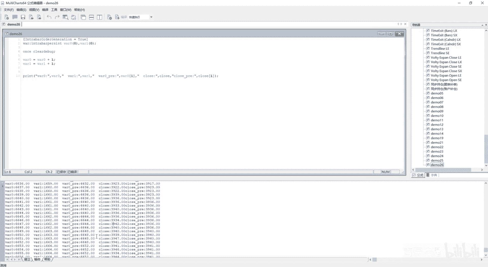

就是跟你前一根K线绑定的，它的这个变量值啊，就是跟你前一根K线绑定的变量值。

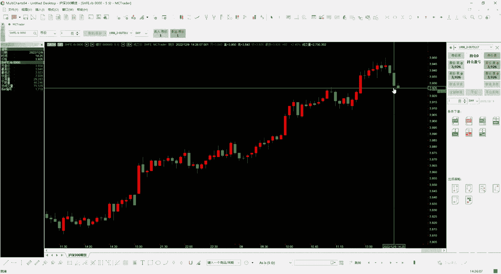

你的这个偏移量其实不能不能说理解的。

我我往前去找一个，他其实是根据你的图表向左偏一个，他在这个的时候啊，他在这个的时候，他的这个收盘价是多少。

开盘价是多少，他是这么来获取的啊，你从这一点上你就可以知知道了，如果说你想获取当前，比如说十比tick的clothes，你必须得把它存储在数组里边去，你通过这样的方式是获取不到的对吧，是获取不到的。

另外你如果说把这个打开了，然后你从这里边因为信号嘛你肯定有开平仓，如果说你有开平仓，你一定要注意前面加上market position来进行控制。

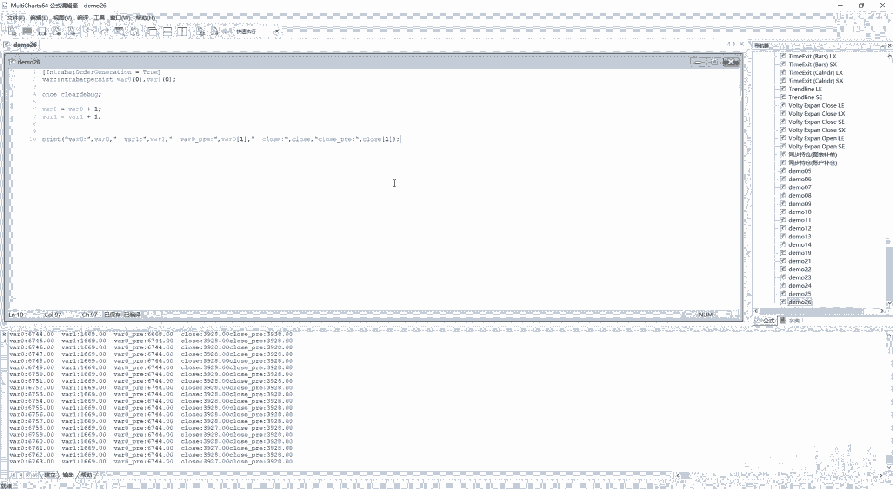

不然的话会出问题，当然了，就是说他的问题也不会出的很大。

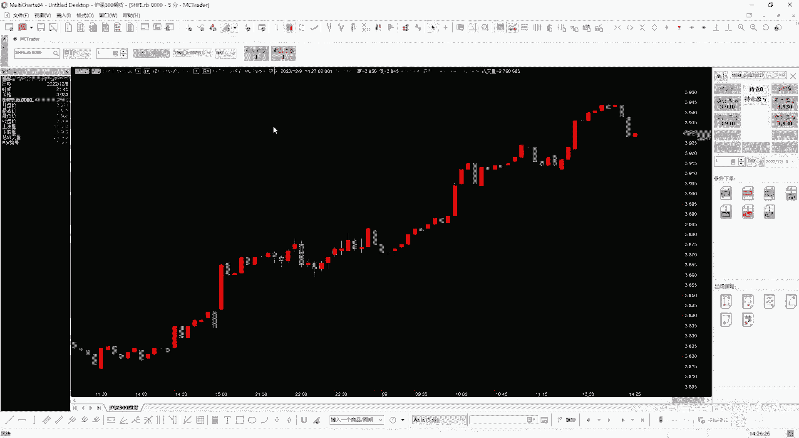

因为什么呀，咱们从这是控制着呢，就是在这个啊，属性者最多允许多少笔与目前仓位同向进场，如果说你不点它，它其实就是最多允许一笔通向进场，开了他就不会再开了，你如果说你想比如说我满足条件之后，我就往里开。

你可以从这来设置啊。

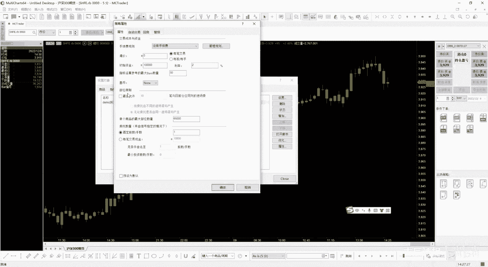

当然推荐呢还是用这个什么呀，用market position就是和current就是shares来控制，就是market position，就这个嘛就是如果说你持有多仓，它返回是一空仓，返回是一。

没有持仓是返回的是零，然后你乘以一个current这个shells或者contracts啊，都可以乘以一个它，它是返回的，是你不管是持有多仓还是空仓，它返回的是多少手数，肯定是个正值啊，要么是呃零对吧。

然后它乘以它不就是这个是符号，然后这个是数量吗，你可以给它单独定义一个，比如说我的这个呃mp啊啊MP等于它是吧，MP等于它，其实呢你也可以完全把它写到一个，咱们的这个函数里边去，比如说我新建一个函数啊。

新新建一个函数，然后它是一个数值类型的，比如说我的名称叫MMP啊，就是其实就是market position嘛，然后我这个mp啊，NP等于是吧，就是CTRLV这样，是不是就可以了啊。

是不是就是不是就可以了，然后我再去调用的时候，就是我我在这是不是就直接可以调用啊，MP对不对啊，就可以直接调用mp了吧啊，就是这个你一定要知道，最好是建议用这样的方式去控制你的仓位。

另外你还得考虑到什么呀，撮合是需要时间的，你委托给发出去之后，它是需要时间去撮合的，比如说因为在tick里边它很快嘛，它很快就是说你发出去几笔之后，他还得撮合，所以说market position。

他可能那么控制的不是特别的准确啊，什么意思，就是我当前我查看了一下，我mp比如说我小于零呢，然后我下面我去怎么怎么样，然后我就去发委托，下一笔tick来了，这一笔委托还没成交呢。

然后我这mp还没有变化呢对吧，但是委托发出去了啊，就是这么个意思好这个说完了之后，咱们再来说这个内建初上函数，大家就可以很容易去理解它了，内建出场函数呢它是叫sit类的指令，因为他都是sit这个开头的。

它有六个sit exit on clothes，从这个名字上你就可能判断出来就是我出涨了，出场，在收盘的时候，这个呢是一般是用在回测里边，咱们这个之前一直在讲过，就跟this b on close。

是的就是他是先有鸡还是先有蛋的问题，这个在回测里边可以使用，但是呢你在实盘里边不用额，不要去这么用，他会每天在下午呃三点或者说是3。1刻，根据你合约的他的这个每天的收盘的时间。

然后这个损益二平出场就是sit break，这个应该是一个啊损益二品，就是当你从这个挣钱到不挣钱的时候，就是他会出场，就是平进平出，这个是固定金额折返出场，这是什么意思呢，就是比如说我挣了100块钱了。

我在亏亏50块钱之后，然后我就出场啊，就是固定比例就是我挣了100块钱，我亏25%之后，我出场就是25%，是指是指那100块钱的25%啊，然后停利出场，就是当我盈利达到多少钱的时候我平仓。

然后这个是set stop loss，它是一个他是一个什么呢，他是一个就是写在前面的啊，写在前面的这个咱们先等会看，咱们先看他的一个解释，这个呃咱们刚才解释过了，就是exit on clothes。

就是在这个平仓的时候使用交易，不建议使用此函数啊，只可用回额，只可回测使用，为什么只可回测，因为这个其实涉及到未来函数了是吧，然后这个set stop position。

这个咱们就是set a stop position，你要使用这个，比如set a stop loss，就是我亏损了多少啊，这个之前说的这个set stop loss就是停损出场啊。

就是说他是一个停立一个停损嘛，刚才解释错了啊，就是一个停损，就是你想用set stop loss或者set stop呃，什么就是说这个percent就是set percent。

什么training什么的，你前面必须得加什么呀，就是说这个set stop position，或者说set stop contract，这两个是什么区别呢，就是一个是所有的持仓啊，就是仓位合并计算。

就是总损失达到多少的时候啊，然后他会进行出厂，就是不管你是分批进的还是同一批进的，就是总体的来说，然后set stop contractor呢就是分开来计算，或者set stop就是share。

就是分开来单独一笔一笔的来计算，这个一般都得写到前面，你得标明清楚了，是整体的还是就是单个的仓位，这个says stop loss，就是损失达到指定金额的时候是吧，比如说是十块钱还是多少。

然后set break even，就是从指定的最大获利，拉回至损益两平点的时候嗯，就是当最大获利达到50块钱之后，然后再不挣钱了，然后再就是平角所有仓位啊，就是后边跟的是这个。

就是你的这个就是盈利的金额，就是但是你出来之后他不会盈利的，他是损益两平啊，然后这边呢他会有pt t，就是PT是什么意思呢，包括这个咱们看看啊，training有pt t吗啊这边也有是吧。

pt t有这个PT是什么意思呢，PT啊，就是就是他的获利不是金额啊，不是金额，而是什么呢，而是跳数，就是说我获利跳数就是我获利了多少，跳这个大家还记得吗，跳数怎么来计算呀。

是不是就是拿那个就是说这个e point，这个是代表的是什么呀，e point它是代表的是，就是你的那个价格的精度是吧，然后乘以这个mini move是不是mini move。

mini move就是你最小的波动值，但是如果说比如说你像IFIC，它是零点几的波动，比如说0。2的波动，它返回也是二，所以说你必须得乘以这个1point，它是它的价格精度啊。

这个还记得吗啊这个咱们之咱们之前讲过啊，就是算了，我不找了，有有兴趣的可以往前翻一翻，就是获利多少，跳好吧，就是后边只要有PPT的，就指的是就是他的这个呃，后边的这个参数是指的多少跳啊。

然后这个profit target这也很好理解，就是达到了最大盈利达到多少，然后我就平仓，然后set dollar training，就是当从仓位进场扣最大利润，拉回到指定金额之后啊，就是平啊。

部分仓位或所有仓位就是是凭部分还是平，所有得看什么呀，得看你前面是set stop position还是cs sob share是吧，或者csop contract。

set set stop contract和sat stop share是一样的，对吧啊，就是他后边是就是落指定的金额为50元，而仓位出现最大获利金额是120，一旦回吐，就是剩下的70元会平掉。

一旦获利回吐，剩下70块钱他会平仓啊，就是当整体仓位最大获利回吐50块钱之后，产生，平仓所有仓位的委托，这个其实就是一个移动止呃，跟踪止损啊，就是也也可以说是跟踪跟踪止盈吧，是吧啊。

也可以说是跟踪止盈啊，然后后边这个嗯，这个SER你像这个是百分比的意思吗，从指定的最大获利拉回特定的百分比后呃，就是评部分仓位，或者说平掉所有仓位，你看他的演示，他有两个参数。

就是当个别仓位获利达到五块钱，拉回25%嗯，就是产生就是平仓，就是进就是进场的委托，就是呃，第一个是这个你的就是说获利金额达到多少，然后后边是回吐多少，这个回土是指的这个获利金额啊，PT是一样的。

就是获利跳数啊啊这个就是这个几个，如果说你能理解这个的话，其实这个就很容易理解了，他其实就是什么呢，不管你有没有开那个intro bar older generation，你如果设置这个了。

他就是可以完全的，就是说在tick里边去进行触发啊，它可以在tick里边去进行触发，有优点，当然也有不好的地方，你想优点是什么呢。

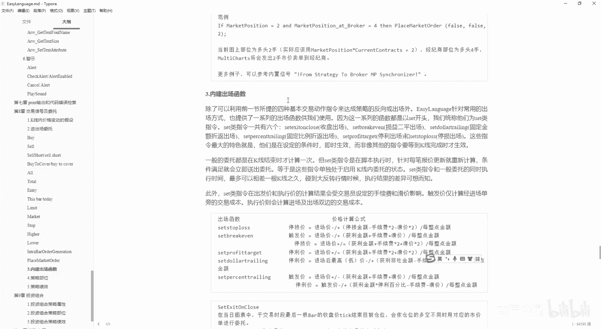

其实就比如说拿这个行情来说，如果说比如说它的止损的话，比如是在这，他可以在就是说这根走一半，走到这的时候，他就可以平出去了，对不对，走到这的时候他就可以平出去了对吧，如果说你用条件单出场。

等这等这一根走完了，你会多亏损一部分，当然不好的地方是什么呢，比如说我的止损在这啊，我的止损在这儿，如果说你用就是用SITALY函数的话，你从这就评出去了，但是如果说你用条件单出场的话，这是评不出去的。

你用收盘价的话，这是评不出去的，然后他又拉上去了对吧，有好处也有不好的地方。

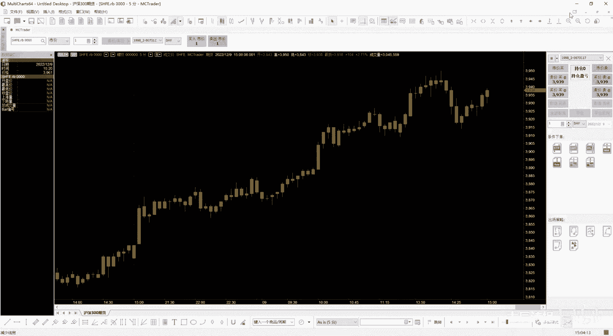

但是它我觉得最大的优点是什么呢，它能简化你的这个代码量啊，简化你的代码量，然后这儿呢有一个价格计算公式啊，就是这里边涉及到了一个手续费和划价。

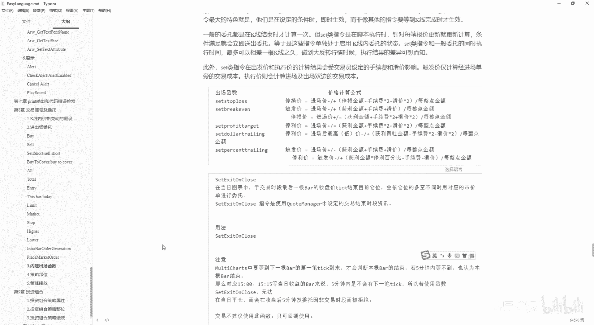

手续费和划价呢是可以在这个信号这属性，然后这儿有个属性这去设置的划架，然后你可以设，就是比如说我划就是十十块钱是吧，然后还是划多少，这个你自己来设，然后这儿呢手续费呢，你可以设成交金额的万分之一呃。

当然在回测里边你设置些东西啊，它只是去给你进行一个加减，就是每一笔成交的时候，它是双向的啊，双向的，如果说你进厂了，他会给你剪一个滑架，就是把你的滑架给剪出去，然后如果说你出厂了。

他又会给你减一个滑架啊，这个华价他会给你，当然是每笔交易的啊，如果说你给它设成每首的话，就是你比如我一下开十首，我每一首都有这个画架，但是你如果每笔交易的话，它就会有一个画架啊，这个是可以设置的。

然后如果说你用这个。

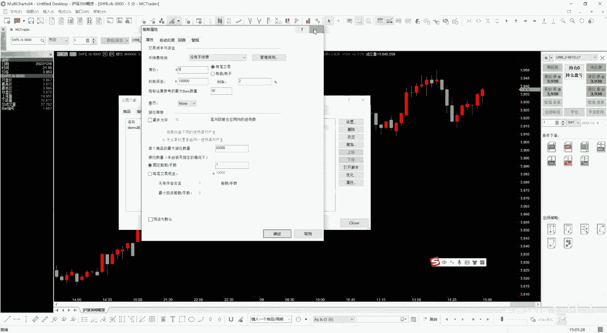

sit类函数来进行计算的话，你想想如果说我只赢，我把这个什么拉过来啊，如果说我止盈是100块钱，我肯定得把我的滑架，然后就是我得算进去啊，我不能说我再减掉一个划价，比如说我划了十块钱。

然后手续费是十块钱，然后我就剩80块钱了，所以说你的触发价肯定是就是100块钱，然后再加上十块钱，然后再加上十块钱，然后除以它，比如说呃螺纹是十十吨每首对吧，你你你这样才对呢对吧。

所以说它得需要12个点嘛，对不对，那你不能说我就挣了100块钱，然后我把这个划价再减去手，就是再减去手续费，然后就达不到我这个钱了啊，他其实就是这么个意思啊，你可以去看一下这个它的这个计算。

但是我觉得没必要那么去纠结好吧，这个呢其实内容就这么多，更多的呢你会去使用它，然后从这呢给大家做一个演示吧，咱们是demo，二十六一，从这儿呢，我写个策略啊，写个策略，写个什么呢，if服。

clothes大于highest highest，然后这个后边放上clothes，就是，然后LN比如说我如果说创了呃，20日20根K线的新高收盘价啊，然后我就开多仓，如果说我创了就是在有持仓的。

有多仓的时候，我又创了10日新低，我就平多仓啊，然后如果说我创了二世日新低，然后我就呃开空仓，然后如果说持有空仓的时候，我创了10日新高，我就凭这个空仓啊，从这儿呢这儿写个20对吗，应该是不对的对吧。

因为你这个highest clothes，20是包含了当前的这根对不对，包含当前这个你当前的这个收盘价不可能大于，Hist close，这个20的，因为什么，因为你本身这个close就在里边呢。

你最多是两个相等，对不对，所以说你不能这么来写，当然如果说你写大于等于，这也不对，如果说同时中间有这个，就比如说这创了个新高，然后我这儿又创了个新高，就是两个价格是一样的，其实他不算创新高呀。

它顶多是跟前面这个持平对吧，这样就跟你的初衷违背了，所以说应该怎么写呢，应该是什么呀，我把它往回硕一个，就是回调一个，然后这儿写19对吧，就是我大于前面的19根的收盘价，然后他的一个最高价。

那不就行了吗，是吧啊，这个逻辑你要捋清楚了啊，你要捋清楚了，还有这个咱们这个好像是咱们一直在讲的，就是这个就是这么写，然后从这我写一个一啊，从这我写一个一，这样跟我这个从里边写一个一有区别吗。

其实从这儿来写来看啊，它是没有区别的，但是我建议你还是这么来写，这样逻辑更加的通畅啊，你写在外边，在这个策略里边，它是没有区别的，但是有些时候啊它会出问题好吧。

then and market position等于零，next吧，at open吧，if market position哎，Market，Pos market，position大于零。

and clothes小于HEST，什么呀，就是说后边close中括号一，然后这写个九吧对吧九吧，then c o o shares next bat open if close小于啊。

这应该是小于low list是吧，if close小于low list，Close1，这也同样写成19，当然你自己写可以把这个设成这个变量啊，And，mr t market position等于零。

Then sell short，next bat open是吧，If market position，应该是小于0and close大于highest clothes这一，然后这写个九吧。

Send by to cover all shares，next to b at open啊。

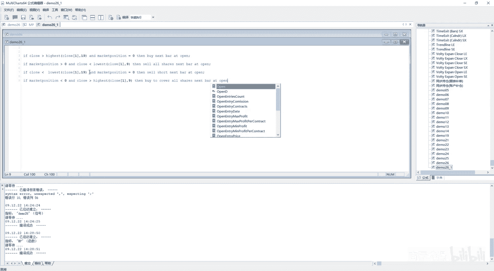

然后我进行一下编译好，然后我给它加载到这个信号里边去。

我把它删了啊。

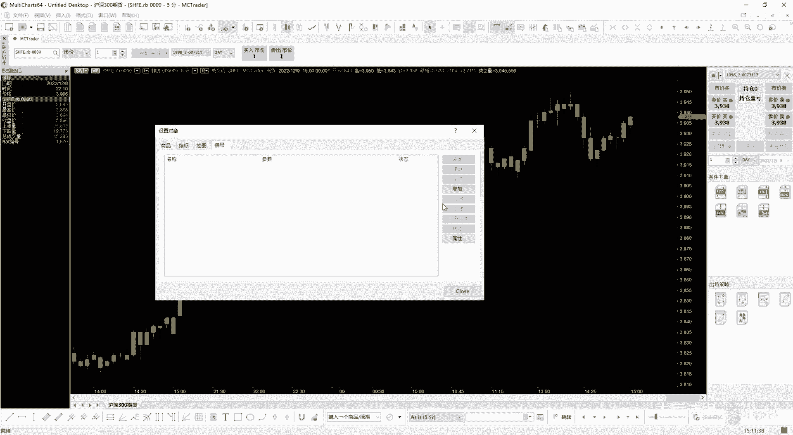

增加六杠1close。

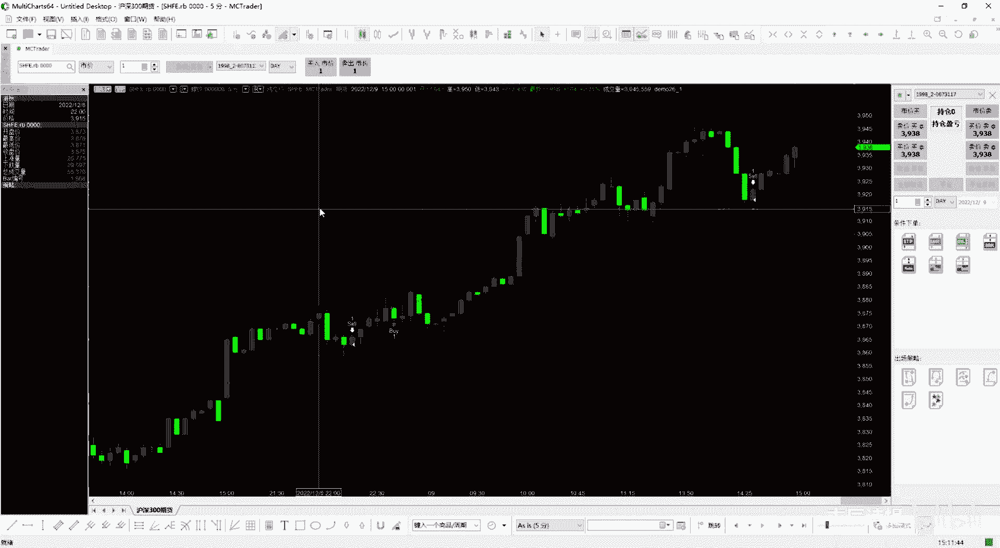

咱们看一下策略绩效报告啊，看了一下他的这个啊，先看看啊，这还是挣钱的是吧，还是挣还是挣钱的，虽然挣的不多，但是这个也就是30日了啊，30日的啊，这个是总体交易分析，37。5，40。8还其实还可以了啊。

然后他的这个单笔盈利是吧，然后额盈亏比一点就是平均下来二吧啊，其实还是可以的啊，然后咱们要看的是什么呢，就是看他的这个呃总体交易分析啊，不是交易列表啊，交易列表，你像这是它的整个的一共有有多少笔交易啊。

一共有72笔交易是吧，72笔交易呃，咱们看看他的这个就是这个你想已付华价。

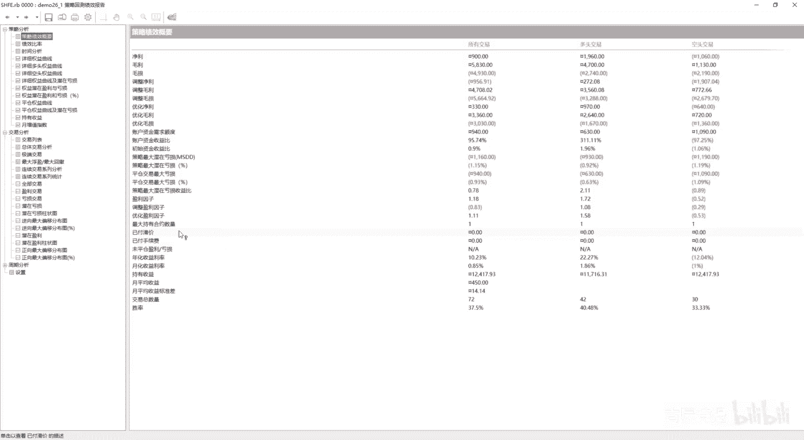

这你想已付手续费费，这是没有的是吧，如果说我给他从这设置信号这属性。

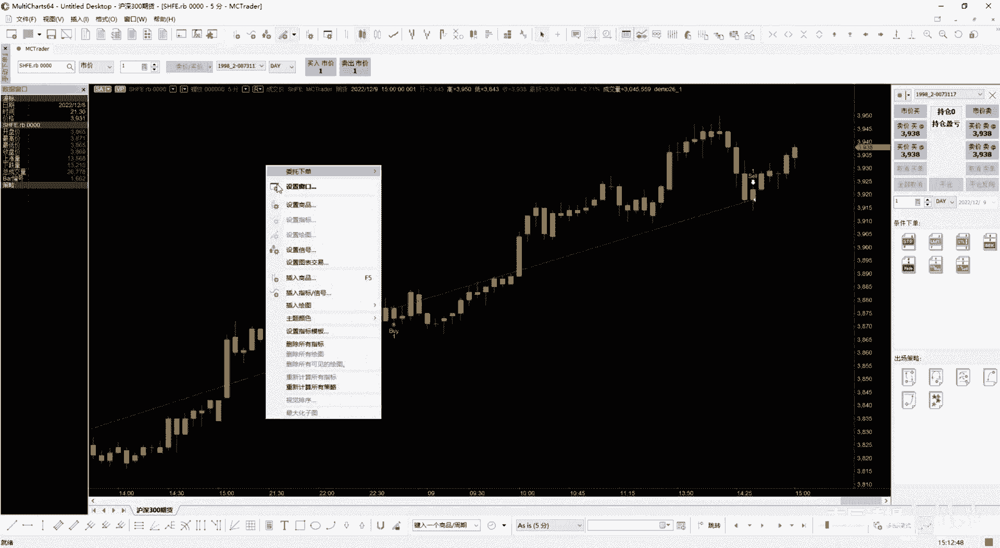

这我给他把这个给设置上，比如说我滑架是一。

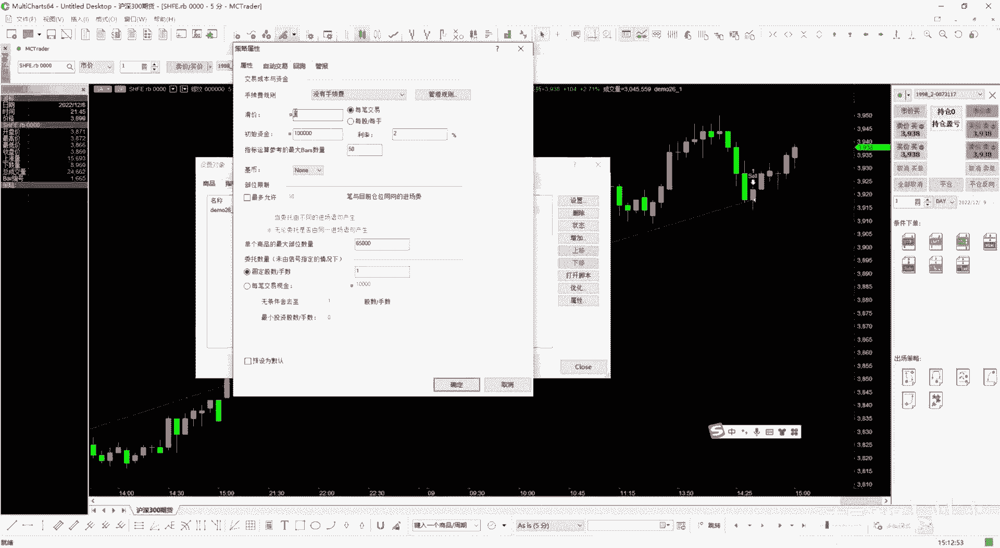

手续费是万分之1close。

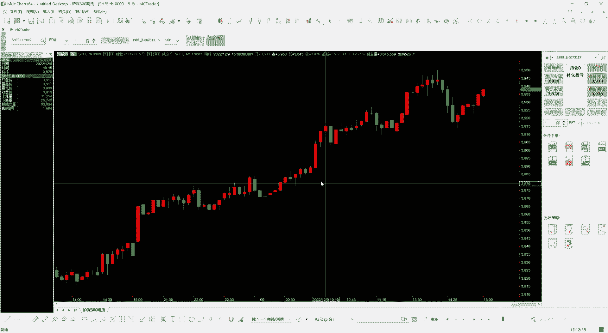

然后咱们再看一下他的这个策略绩效报告。

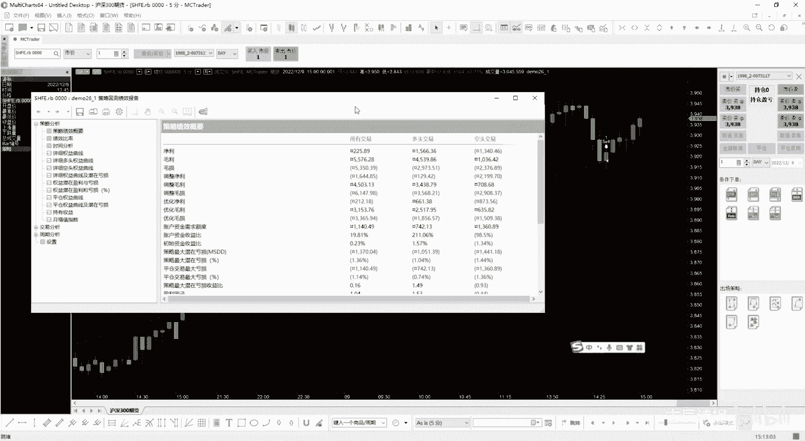

你会发现他的这个已付划价144，144，然后已付手续费530，这个144是是什么呀，其实就是他的你想交易了72笔，然后他是144次进一次，净算一次出算一次对吧啊，净算一次出算一次，这个你得知道。

另外呢如果说你把它设置成了这个什么呀，就是说呃写或者写next bat，我在开仓的时候吧，at close limit啊，我在开仓的时候，At close limit，你这个时候啊。

你会看见他的这个滑架，呃总体嗯，一副划价你看成72了吧，就是其实在回测里边，你现价单和这个你的别的委托区别，就在于它没有划价啊，这个滑架是怎么设的，其实就是你自个儿设的啊，其实就是你自个儿设的啊。

这一点你要知道一下。

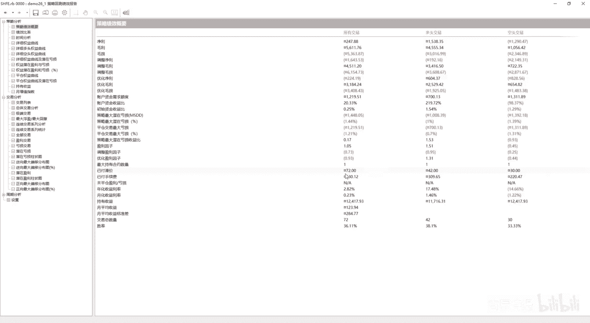

就是你限价单在回测里边，跟这个就是说这个别的就是方式的。

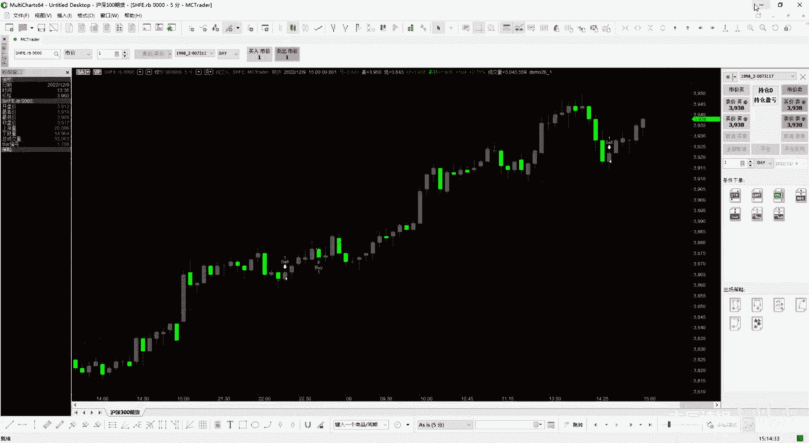

发委托他的区别，回测的时候区别就是没有划价。

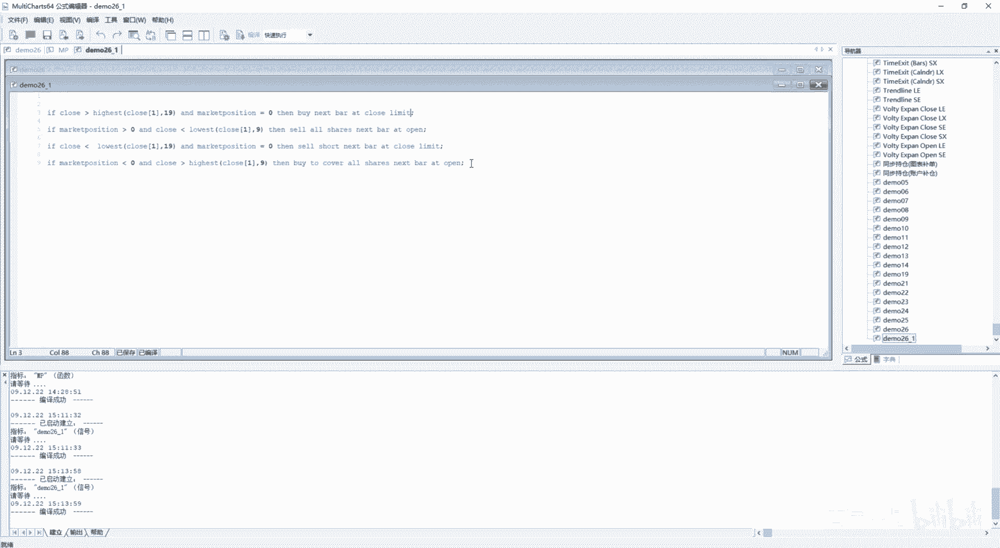