# 第27节课 转换器的实现(1) - P1 - 古辰诗提 - BV13z42167AG

欢迎大家来到从零开始量化系列课程，VPY课程的第27节课，首先呢先说一下这一系列课，肯定30节课是玩不了的，大概在40节课或者往上吧，应该是这样，前面大部分的这个课程内容。

都放在了这个这个city engine和city gateway，以及就是这里边的一些配件，里边一些组件里边，如果说这些你都能听明白，其实其他的内容啊大部分都是类似的，都是通过这种事件驱动的类型。

其实里边可能有一些需要单独拎出来讲一讲的，咱们到时候再说，可能后边的就会快一些好吧，前几节课呢给大家就是把这个CTABTESTING，给大家整个的给捋了一遍，在里边呢有一个点没有讲到，也就是上一节课的。

最后跟大家提了一下这个转换器，转换器它是做什么的呢，其实用语言单独的讲呢会比较枯燥一些，为了这个呢，我专门给大家写了一个界面程序，就是给大家演示一下，如何就是这个转换器的功能与作用，就看一下啊。

这个就是界面很简单啊，就是就是这个界面。

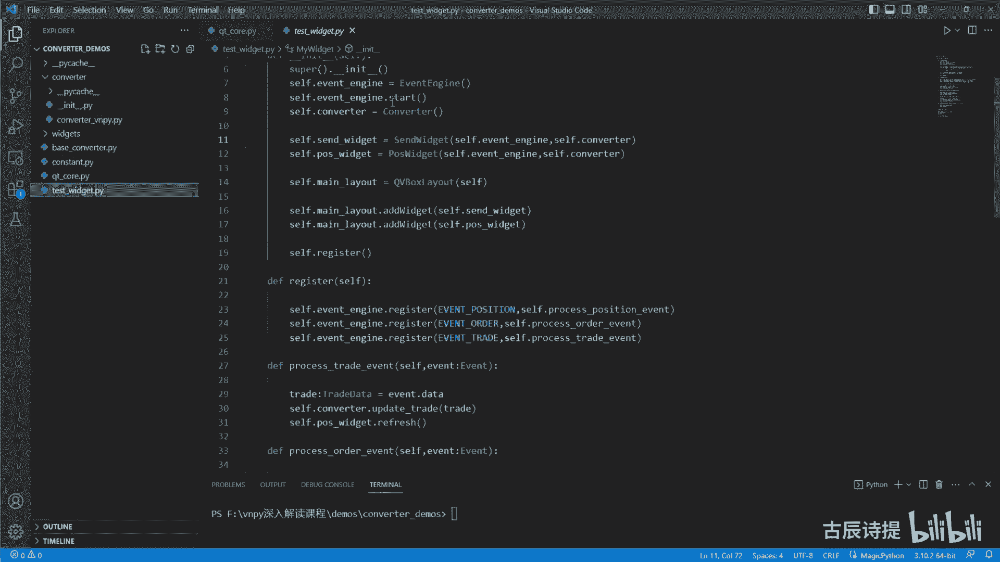

这个界面呢咱们运行一下，先给大家直观的感受一下，这个转换器的作用是什么。

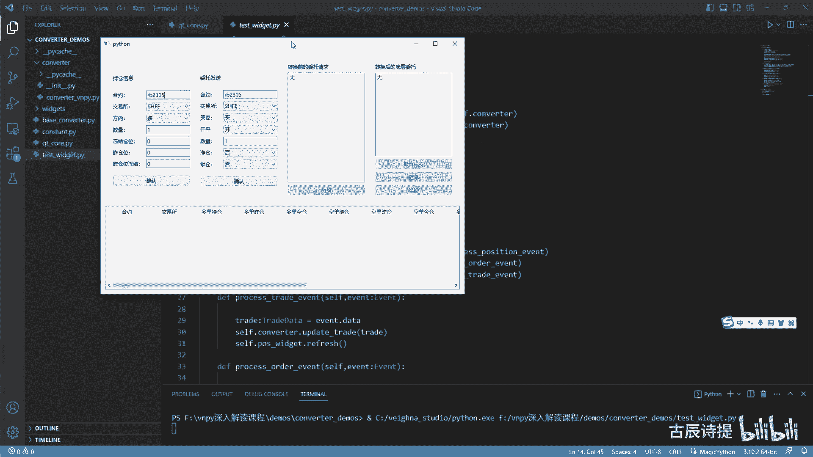

好下面这个呢是一些持仓的就是信息，但这里面分成了多单持仓，多单左仓和多单精仓，空单持仓，空单左仓空单，经常这儿呢还有多单冻结以及多单卓仓冻结，多单经仓冻结，空仓冻结，空仓动座舱冻结和空仓空单精仓冻结。

这个呢咱们后边详细给大家介绍呃，给大家演示一下啊，首先肯定就是咱们在连接服务器的时候，他会给你发这个空中contract，就是合约的信息，合约信息发完了之后呢，如果你策略有持仓的话。

他肯定会给你发这个持仓信息，持仓信息咱们应该也很熟了，就是那个position data，好咱们点击确认一下，这个时候呢，我放一个持仓信息到咱们的这个程序里边来，它就会在这儿有所显示。

持仓信息给给放一个，比如说我持有多单一手确认一下，这呢就会显示多单一手，我这呢数量是一，但是左仓位是零，那就是说明是经常是吧，没有空单，如果说你既想有多单，也也想有空单的话，比如说我还想空单再来一手。

比如我持有一手多单和一手空单，这个时候呢你再确认一下，这个时候就会变成空单，持仓一手空单经常一手，这个就是咱们之前上节课讲的update position。

就是转换器接收这个update position它的更新内容，这呢需要注意一点，他发过来的这个position data，它是就是分成，就是持有多单和持有空单分开发的，并不是说一个合约里边。

他会把空单信息和多单信息都给你发过来，这一点是需要注意的。

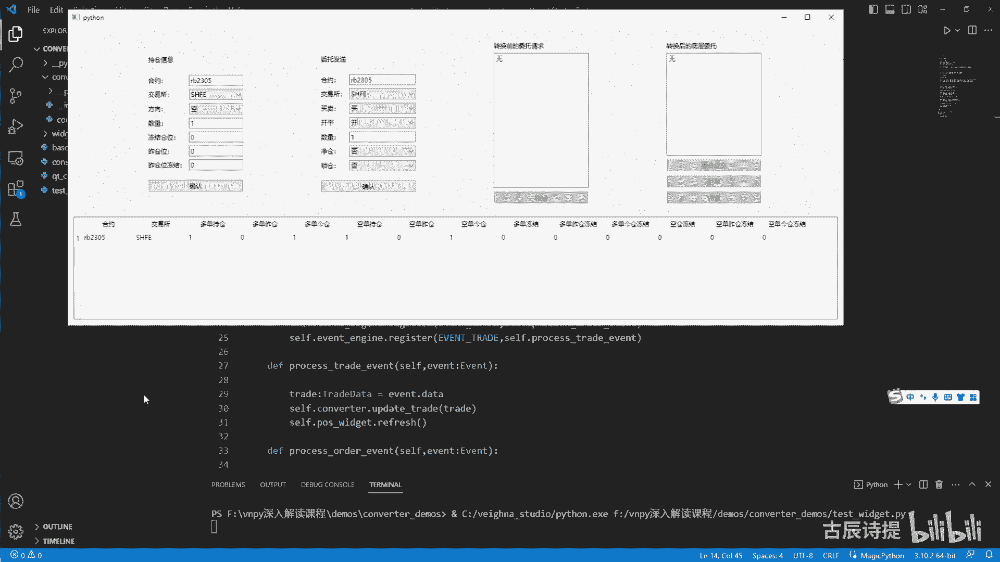

咱们也可以去看一下这个呃CTP的这个底层，也就是这个position data这一块好，你可以看到啊，他这个position data，其实和这个咱们之前看到的这个deep market。

就是它的这个TIK数据其实是一样的，他会给你发这个呃字典类型的数据过来，我呢这呢也录制好了，也是直接把这个字典数据给输入出来的，就是类似于这样的这个里边有哪些内容呢，你可以根据咱们之前给大家说过。

你如何去查看是吧，就是通过这个一层层的去找一下，在这给大家说一个，就是之前可能没提到的啊，就是不要就是不要有误区，就是你的这个CDP就是这个get away，咱们说了里边有TDPI和这个MDAPI是吧。

TDAPI和MDAPI它继承自哪啊，他继承自哪啊，它并不是说继承自，就是说这个这个直接继承自这个，C语言的程序啊，它是继承自什么呀，这个VNCTVNCTPMD和VNCDPTD。

这个VNCDPMD和VNCDPT底在哪，是在这呢是吧，VNCTPMD和VNCTPTD，它其实是继承的这个PYD文件里边的这个类，本质上它是什么呢，其实就是这个C与C加加的这个程序啊。

它会生成这个就是通过py bin11，然后生成这个两个PYD文件，然后你的这个Python程序，再去通过这个PYD文件去继承，他是这么个逻辑好，它并不是说直接去继承这个上面的。

只不过这俩PYD文件是通过这个上面的，VNCTP去生成的啊，怎么生成，其实很多也有这个教程，你可以去看一下啊，这就不深究了，给给大家说一下，这个就是他的这个如何去继承呢。

他Python是无法直接继承C语言的，它必须得通过这个生成PYD文件，来进行继承啊，我说我说的是PY，用这个PY81这个模块啊，好咱们看一下这个position data啊。

在这儿就是说咱们可以看一下它这里边，instrument id就是你的这个合约，也就是simple是吧，这个BD啊，包括这些都是你的这个账号信息，和你的这个期货服务商是吧。

你看这position direction，direction是什么意思，就是多空嘛，他这指定了一个方向，就是三，这个三代表什么呀，咱们可以看一下啊。

这个position direction是在这吧是吧，它在形成这个position data的时候，是通过data，这个data是原本传过来的这个字典数据吧，也就是这个整体的这个数据里边。

去找到这个position direction，也就是这个position direction，是不是这个position direction啊，这个数据是什么呢，它通过这个字典来转换，它肯定是个字典。

因为它有中括号去里边去取值了，是不是，那这个字典是什么呢，咱们可以看一下这个字典，它是一个dict啊，里边是STR和direction，这个STR和direction是怎么来的呢。

他这有一个字典生成器是吧，是通过这个呃，是通过这个字典来进行生成的啊，是通过这个字典来进行生成的，咱们可以看一下这个你像这个就是浪，是后边有一个这个这个这个常量shirt，有一个这个常量啊。

有一个这个常量，然后这两个常量分别是什么呢，咱们可以看一下这是零是不是，然后呢这个是一，但是他并没有三，因为咱们从这儿给发过来的，它是三是吧，那三是什么呢，三这里边这个字典暂时没有。

但是这呢他又给他新添了一个，你想这个是什么pd浪，它是等于浪是吧，咱们看一下它是几啊，它是二，那下面这个是不是就是3p d short是三，这是三吧，是吧啊，你从这你能看到它这里边。

这个字典里边其实是有这四个key啊，你从他这个代码里边，那你就是就是这个名称里面，你可以看到这是by，这是sell，这是LONGSHOT，可能代表的意思不太一样，这是买这这是啊平多单啊。

这这是代表的是有多仓和这个有空仓是吧，所以说这个三其实就代表着持有空仓嘛。

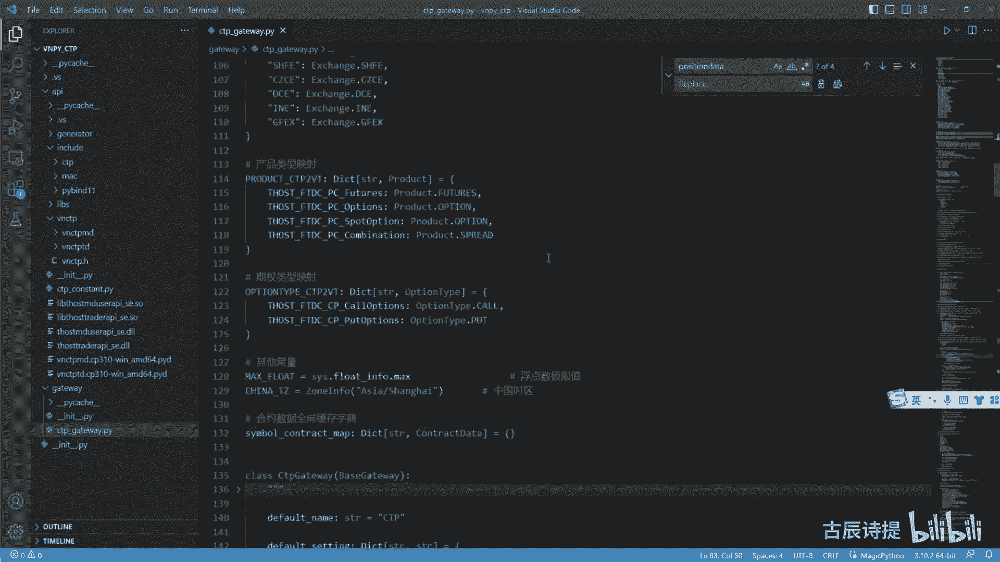

是不是持有空仓，你看他这后边啊，它有这个y deposition，也就是座舱六首，然后position就是总共的仓位六首，那就说明我这个六手的仓位是之前开的，是不是不是在当前交易日开的。

它这里面又有long frozen和shirt frozen，这个long frozen和short frozen虽然都有，但是你像他这个其实这个三代表的是空胆。

所以说你这个long frozen其实肯定是为零是吧，这个shut frozen，如果说你有限价单发送在服务器的话，它会告诉你冻结了多少首，这是没有，对不对啊，这就是他的这个整个的这个数据类型啊。

包括它里边position profit，就是你当前的持仓的这个盈利啊，还有就是training day啊等等等等一些数据信息，其实还是数据的一个传递是吧，所以说你从这你就应该知道啊。

他position是分为一个合约，如果说你双面都有持仓的话，他会给你发两次过来，就跟咱们刚才演示的这个是一样的，所以说你的转换器，首先要承接的一个功能是什么，update position是吧。

Update position，update position就能准确的知道服务器，你的现在的这个合约它的一个具体的情况啊，这是Upset position，好，后边呢看这个委托发送是不是很熟悉合约。

交易所开屏开屏是什么，就买卖是什么呀，就是其实就是多空嘛，就是那个direction开屏就是OFFSEAT，就是那个open clothes是吧，Offset open offset。

Offset clothes，但是其实offset它还有什么呀。

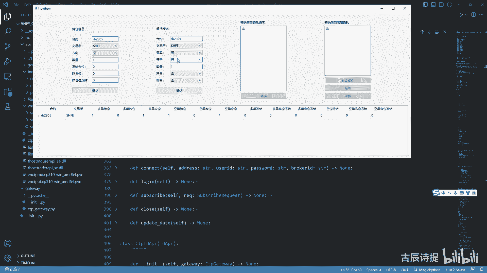

他还有平津和平仄呢对吧，还有平静和平衡呢，咱们可以看一下这个offset offset or，咱们得在啊看看有没有啊，这个offset of je，他不光是只有开屏啊，它还有平均还有平仄呢。

平精和平仄是专门给上期所来准备的啊。

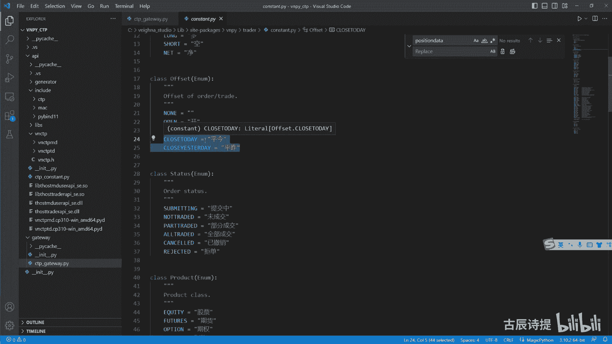

给上汽所来准备的，它其实这个转换器主要的针对的你像上期所，它是需要进行转换的，比如说我再进行就是这个更新一下啊，啊我先不更新，我先就是说买平一手啊，买平手后边进仓和锁仓，咱们先不说了。

这里边也不体现价格啊，我先买瓶一呃，一首我现在是多单，持仓是一手是吧，我买瓶一首，我点击一下确认，它就会在就是你发过去，发到咱们这个CT引擎里边，它就会给你变成一个order request。

就是一个呃就是委托的申请，委托申请呢，我转换啊，这是最关键的一步，是通过咱们转换器来转换的，之前在那个上上一节课，讲那个my engine里边那个那个转换是什么。

那个方式来着是convent order request是吧，是convent order request，就是你在往服务器底层去发送委托的时候，它会通过那个方法。

就是convent order request去给你进行转换，其实就是这一步点击一下转换啊，他就直接我这模拟就直接发到底层了啊，这是一个limit单，咱们可以看一下他的这个详情，看多就变成平均了吧。

它并不是平仓吧，它转换成了平均了吧，是不是啊，平均了好，我先给他拒单，我把他这个更新一下，比如说我让他持有多仓啊两首，然后呢冻结仓呃，这个座舱呢有一手，我给它进行一下更新，这个时候多单是有两首。

多单佐仓有一手多单经常有一手，我现在呢买瓶两手，这个时候你要给上期所进行转换吧，你要给他指定，就是说必须得是呃平精一手平左一手，对不对，好我确认我进行一下转换，平仓量超过持仓量，平仓量超过了持仓量啊。

因为我买平买是代表多的方向，我买瓶只有我有空单的时候，我才能进行买瓶呢是吧，所以说如果说我要评多单的话，我应该是卖平啊，这个你要捋清楚啊，买卖其实代表的那个direction就是long short。

我平仓是close，如果说是你买平，就是这个long shot，就是你的方向是多方向，其实就是凭空仓啊，我卖屏才是拼多层的，我卖屏两首，我点击确认好，点击一下转换，你会发现它会转换成两个委托单。

一个咱们看一下啊，叫平精一首，是不是凭经一首吧啊，然后呢另外一个详情就是说呃平仄一首是吧，平仄吧，这个就是它基础的功能，就是最起码得给这个上期所结合，这个上新能源进行转换啊。

这个时候呢我可以给他进行撮合啊，点击撮合A1成交，成交的话，他就品出去了，一手了，就把这个呃，就是这个多就是经常给拼出去了是吧，多单多单经常经常给拼出去了，这个是呃平左。

你看这个时候它会有有这个多单冻结，就是你这个委托在服务器里边，而是被冻结住啊，是被冻结住的，这个时候呢我再进行一个呃撮合成交，冻结就变成零了，然后多单也没有了是吧。

这是他给上期所和上期能源做了一个转换啊，给上期所和上汽能源做啊，做了一个转换，如果说你什么都不采啊，这进仓也没有，锁仓也没有，这时候比如说我还想卖平两手，我还想买瓶两手，这个时候你是没有持仓的吧。

多单是没有持仓的吧，多单没有持仓，我想卖平两手，我去进行转换的时候，你看平仓量会超过持仓量，这就说明有问题的对吧，那这个时候呢，如果说就是我想就是说，因为你可能在实际的这个操作过程中。

你会有比如说三四个策略跑一个合约，那就是说你实际上真正的持仓可能是为零，但是也有可能是什么呀，就是说我策略一它持有多无手，策略二持有空无首，然后这个时候呢，那这个时候你如果说单纯的你不进行任何的。

这个采取这个进藏模式或者锁仓模式，你是评不出去的是吧，你实际的持仓多仓是零，多仓是零，因为你空仓持入手，多仓持物手，那不就就是说整个就是没有持仓吗，是不是没有持仓的话，你这个时候你如果是想去平仓。

你想它会出问题了啊，它平不过去，但是呢我把这个进仓改成市进仓，这个它是用什么这个单词啊，就是nt net，大家有印象吗，咱们在c t template的时候，一个是锁仓，一个是lock是吧，一个是进藏。

一个是NT，咱们当时忽略掉了这两个就是参数，你在by short self cover的时候，后边是有俩这参数的，咱们并没有过多的去讲啊，如果说你采取进仓模式的话，这个时候你卖平是凭这个空档啊。

是平多单吧，拼多单，但是你没有多单，这个时候我进行一下转换，它会就转换成了这个限价单，咱们看一下啊，它变成了什么呀，空开两手啊，就变成了空开两手，这个时候你撮合成交啊，我可以先撮合一手。

他空弹又又加了一手，然后我再撮合一手，他空单就变成了三首啊，这个呢就是进仓的模式，其实进仓模式最主要的是用在这个多合策略，还有多合约或者单合约里边呢，它是可以什么呀，就是说你的策略里面的持仓。

比如说你S1持仓是五，S2持仓是五，你实际持仓当然你也可以是呃多单五手，空单副手，但是咱们在那个咱们的策略的模板里边，它只有一个cf点pose，它并不会很直观的给你显示出你有多无售，空无数。

如果说你想不不用转换器的情况下，也不考虑你的保证金，是不是被多占用了的情况下，你需要做更改什么呀，就是把你的这个CT就是那个template里边，把save点pose，你最起码你改成long pose。

还有这个shirt pose，你得有直观的显示，对不对啊，但是维纳采取的方案就是什么呢，给你就说是不是采用进仓模式，采用进仓模式呢，它就会就是给你去进行转换，如果说你现在实际的持仓为零。

然后你要卖平两一个策略，要卖平两手的话，他就会给你转成什么呀，就是把平改成开方向是一致的，把平改成K，所以说啊，你像这个咱们这个converter这个里边好comment。

这个里边它为什么叫offset enter，就是comment是转换的意思吗，offset是什么呀，其实就是开屏转换，他做的最多的转换是什么呀。

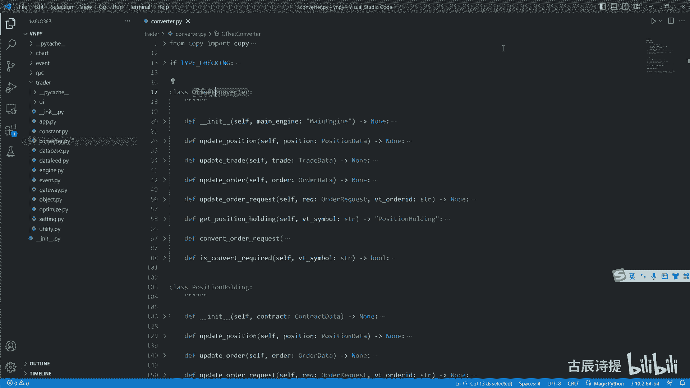

是把这个offset就是就是这个开和平，把平仓变为开仓，把开仓变为平仓，如果说这个时候我有多单两首，比如这个呃多单佐仓，一手空单我变成零售吧，左仓位我也是零啊，确认我只有多单两首，那我如果说想进行。

比如说呃买瓶买瓶，三手买瓶是什么呀，就是说我要去进行这个呃空仓的平仓是吧，方向我是把它买进来嘛是吧，我点一下确认，然后我再进行一下转换啊，你开仓的时候它是没有冻结的，就是说因为他给你转换成了。

虽然它你发送的时候是平仓，但是我采取了进仓模式，他会给你转成开仓，开仓是没有这个什么的，是没有这个嗯，就是这个什么多单冻结空单冻结它，实际上它会冻结你的资金，冻结你的一部分资金，我再错过成交啊。

我可以直接给它搓成了，这个时候就多单持有五首了吧，啊多单持有五只有五首了吧，这儿呢你要注意一下啊，这个冻结冻结，比如说我再发送一个委托我卖平啊，麦屏三手确认哦，给它发出去啊，进行一下转换。

这个时候呢他就是一个啊平均是吧，空平精空平精这个三首它会冻结住这个三首，如果说这个时候我再卖平三首好转换，你会发现啊，他你无缘无故的多了三个是吧，就是你本身这个是啊，平均三首，后边这三个是什么呀。

好像好，咱们首先看第一个平精一首，因为你是上其所，我平精一首卓啊，多单经仓是四手，多单座舱是一手，我现在有三手被占着了，我现在还有一手的多单，就是经常可以去使用，我先平均一首，然后呢在呃平仄一手。

因为我佐仓还有一手是吧，我再平左一手，最后呢再把这个呃平仓变为开仓啊，空开一手是吧，空开一首，这个就是你冻结住之后啊，它会产生的问题，因为你这笔就是比如说这个委托我一直没成交。

比如说我后边的委托我都成交了啊，这个是一手是吧，成交了撮合成交好，都成交了，成交完了之后，如果说你这个还没成交的话，你就会变成什么呀，就是多单持有三首，然后持有一手空单。

因为你这个三手被这个委托给锁定了啊，所以说你在你知道这个逻辑之后啊，你在你真正的写策略的时候，什么时候用限价单，限价单用了会出现什么情况，比如说你一个策略里边同时发出来了三四个，这个委托，有止盈的。

有止损的啊，也有这个条件单，有可能出现很偶然的情况，比如说四，比如说其中有两个在同一根K线里面去成交了，或者说其中有一个成交之后，你会发现它给你反着开仓了，为什么会出现这样的问题啊，就是因为它这个呃。

就是整个的这个它的这个撮合机制啊，他的这个就是以及服务器里边的一些，比如会被冻结啊是吧，或者说你没有用进藏模式啊，然后会出现这种叫平仓量超过这个开仓量啊，如果说你没有采用这个进藏模式的话。

比如说我把它改成否，我现在持有三手多单，但这个三手多单都被冻结着呢，都被冻结着呢，我这个时候我卖平三手转换，平仓量超过持仓量了吧，啊这个就是很直观的给你展现了，就是说这个转换器的作用。

其实咱们归纳起来它有这么几点，第一点啊，就是说它是最起码给上期所和上期能源进行，平均和平足的指令转换，如果说你直接用close的话，它是不行的，这一点需要说一下啊，别的交易所呢它是优先评老仓。

就是采用先进先出的这个模式，在这个如果计算机语言来呃里边来说，它叫队列的模式，就是先进先出，如果说你今天要拼一手的话，又是拼左的啊，这个你不用去指定，你直接用这close就行了。

但是呢你close直接发送给这个上期所和上期能源，他是不接受的，它必须你得指定它是平均还是拼错，也就是close to a day和close yesterday。

这个就是它的第一个呃作用也是必须得有的，就是对上汽能源和上期所的一个转换，第二个作用是什么呢，第二个作用啊，就是当你就是说，如果说是多个策略来跑一个合约的时候，可能啊你考虑到了。

就是说我不想让他就是说多占手续费，或者说为了配合，就是说这个伟大，他这个city template，它只有一个，就是这个它只有一个这个C点pose是吧，因为直观显示不了。

你就如果同时持有多单和空仓空单的话，直观显示不了你多单持有多少，空单持有是有多少，因为它在这个c t a engine里边，它有一个，如果说你踹了过来之后，有成交之后。

他直接就是那个strange点pose，加等于减等于了，对不对啊，你不能直观的去配合它，这个时候呢你就需要进行转换，就是把有一些开仓的变成平仓，把有些平仓的啊变成开仓，就需要通过转换器来进行转换。

但这种转换呢你需要把进餐模式打开啊，进仓模式打开进仓模式就是咱们那个NT啊，你打开如果说你是多策略多合约的话，你要把进仓模式打开好吧，这是第二个，第三个是什么呢，咱们一直没说的，就是这个锁仓。

锁仓其实最根本的它规避什么呢，就是规避平精惩罚，就是你凭经仓他的手续费可能过高，比如说这个呃中金所，他这个咱们的股指期货，你平均的话可能惩罚特别重，好像是得400块钱一首吧是吧。

你不想进行这个接受这个平均惩罚，可能你的是利润都被这个手续费给吃掉了，这个时候你就要进行锁仓，锁仓，它的逻辑是什么呀，锁仓的逻辑是就是说我如果说就是今天开仓了，我就不评进仓啊，一句话就是不平。

经常啊不平，经常因为这个都是就是经仓惩罚嘛是吧，如果说我昨天没有持仓，我今天开仓没有问题，比如说我开多，我就开了多五手，但是我要是屏多的话，我就开空，我反过来开空。

就是其实就把它的这个开屏进行转换嘛是吧，如果说我昨天持有仓位，比如说我昨天为了配合今天的这个什么，我持有五手多单，五手空单，我今天如果说要开开多仓的话，我是不是应该是先平昨天的这个空仓。

我开多仓方向是多是吧，方向是多，我凭这个空仓，我方向还是躲吧，这还是转换的这个offset吧，就是把我这个要开这个状态变为我平这个状态，方向是一样的话，方向是一样的吧，因为你凭空仓还是买进来呀是吧。

还是其实就是本质上是多方向的，所以说它是叫开屏转换，这你需要注意一下啊，锁仓其实和进仓，你发现是有一些类似的，但是呢又有一些不一样，就是它会进行这个开屏的转换，但是锁仓的第一要务是什么呀，不平精仓。

然后进仓的第一要务其实是什么呀，就是给你把这个就是你的这个开仓不足，或者平仓不足给你呃，主要是平仓不足会给你转成这个开仓，然后开仓可会如果说有持仓的话，会给你先转成平仓是吧啊，这个就是它们的区别。

我希望你能理解这个理解完了之后呢，咱们才更容易的去写这个代码，咱们需要把这个代码去给大家敲一下的啊，咱们要写到什么程度呢，其实刚才这个它的功能，咱们都就已经演示的差不多了，是不是演示差不多了呢。

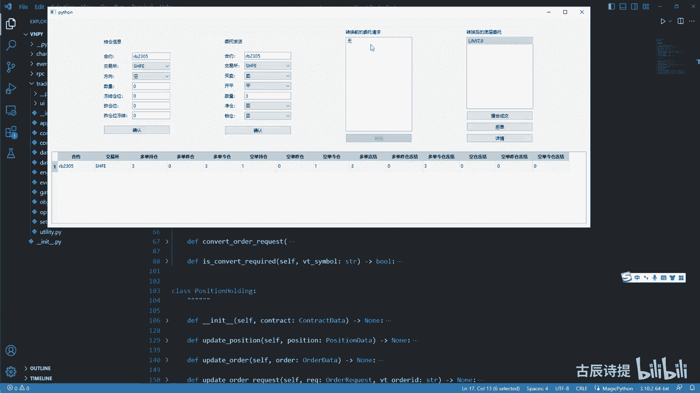

咱们可以看一下，就说这个咱们写的这个代码啊，就是这其实是代码，这个里边呢转换器，我是还是用的这个VNPY的这个转换器，只不过这个VNPY转换器呢里边有一些东西。

我给它删的，也就是他这个合约，你像他这个原本带的这个转换器。

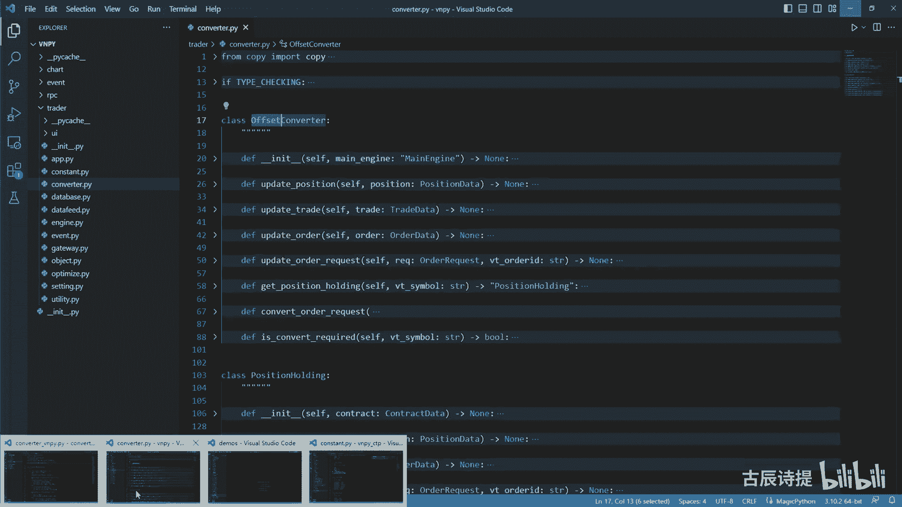

里边是有contract的，但是咱们为了演示方便，这constructor咱们就没有去要啊，另外一个呢像这个all offset commander，它继承了一个best en。

这个best convent，我是为了统一接口的，它里边你必须得有update order，Update trade，Update position，这个是咱们昨天在讲my engine的时候讲过吧。

他在o m s engine里边必须得去得去更新的是吧，update order其实最主要是更新frozen，就是你的这个冻结仓位，update trade是更新你的持仓是吧。

以及把那个冻结的仓位给解出来，就是你这个委托冻结了，然后如果说它成交了，他是不是就没有这么多冻结仓位了是吧，当然你的持仓也减少了或者增多了，对不对，好。

update trade不是up update position是做什么的，就是及时的把你的这个持仓的准确性，去进行更新，这肯定得有的吧，咱们昨天唯一看到的一个它的转换是什么。

Convorder request，就是把你的委托请求进行一个转换啊，就是这个你必须得去实现的对吧，比而且名字也是一样的，因为咱们最终得写出来，就是说咱们也能在这个界面里边去跑，是不是。

所以说这个你得保持一致，所以说它也它给它规范了统一的接口，我是用这个继承自这个啊，呃ABC就是abstract method class，然后同时呢。

他们用这个abstract method给它进行装饰，好下面这个best holding，这个holding也就是在咱们这个COMMENTER下面，它具体在里边记录了这个类啊。

叫post holding啊，其实of of这个offset commenter它是一个壳啊，咱们可以看一下这个他也我也给他做了，就是一定的改变，他也继承了一个东西，因为它这里边存储的。

你像locals啊，Long yesterday，Long day，其实是不是就是咱们刚才看的那个，下面具体显示的是你持有多少仓位是吧，然后冻结的仓位是不是都在这儿呢。

这个是具体保存你每一个合约的实时数据的吧，是吧啊，我把它写成了这种，就是这个样子，他是为了做什么呀，啊我把它写成写成这样，就是他继承了一个best holding啊，这个best holding呢。

因为我在写这个界面的时候，他的这个下面的这个界面啊，必须得有这些东西，所以说我要给它固定住这些变量，所以说我给他写了一个这个best commenter，这个里边它给它已经实现了。

这就是这些变量必须得显示的，就是你一旦继承了beholding这些变量就都有了，这样是为了也是为了有界面的统一性，我才这么去操作的好，那就是咱们下面就需要去写是吧，就写这个COMMENTER啊。

在这个写的时候，我新建一个fire cn v RT r converter，比如说呃点PY，点PY，我就写个my computer，点PY吧，这个咱们就来具体来写，import这个这个贝斯哎。

还有一个那个base holding吧，我得有两个类吧，第一个比如说cos my sn v RT r my comment，我继承自这个best comment，你像你像这种写的方式，你一定自己要会啊。

就是在统一接口的时候啊，你要自己会怎么去写好吧，我第二个类是什么呀，嗯第二个类是class这个my这个pose holding，O l d my post holding。

然后他继承自这个base holding，对吧就是这两个写了，但是呢他这个就是里面规定规定了一些方法，我必须得去实现的，我把它可以粘过来啊，这个就这个这三个方法，我必须得去实现它的是吧，好我给它粘到这。

我把这个method给他给删掉，然后我导入一下这个就是这些数据类型啊，我从from qt call import信号啊，啊我把它都放在这个QQQ里面了，包括这个PYSI的一些东西，最好不要这么学我呀。

我这样是图这个方便啊，好咱们首先说一下，就是咱们第一步是做了什么呀，就是update position吧，update position你肯定得去做的。

因为一开始连接上了之后就update position吧，up to the position就是更新持仓，更新持仓，咱们是不是每一个合约来了之后啊，每一个合约来了之后。

咱们是不是得获取他的这个就是my position holding，然后再去让他去具体去更新这个持仓，所以说咱们在这做的，你得获取这个合约是吧，那就是咱们写cfd holding holdings。

等于它应该是是个什么类型的，它应该是字典类型吧，然后这里边存放的STR，然后就是还有这个my position holding，因为它是写在下面的，你也可以给它加个引号啊，都可以啊，然后等于一个字典。

这个里边是存储的，就是我每一个合约过来，我给它进行一个实例化啊，其实从这儿呢你有两个选择，第一个选择是通过vt simple啊，Very simple，然后这边是你的这个holle holding。

也就是这个类型，还有一个呢是v t simple，加上一个什么呀，Direction，比如说direction，Long direction，Short，然后这边后边加上一个holding都可以的是吧。

你自己想想都可以的吧，啊只不过你用那种方式的话，他这个holdings会多一点，这个holding会多一点，是不是第一步咱们一般会去使用的，就是get it holding啊，Get holding。

你get holding就是怎么去找啊，Get holding，你肯定是得通过，咱们就用这个very simple来吧，STR啊。

very simple来用very simple作为这个key就是一个合约，它只有一个这个my position holding啊，那就是四点holdings点git，然后这个key是吧。

Very simple，然后如果找不到的话，我返回个NN值，如果一分啊，我给他一个一下值啊，这个hold等于如果if not hold，如果没有的话。

我hold是不是等于这个my position holding，然后给它传参，把这个v simple给它传进去啊，我给它新建一个是吧，然后这个时候我获取到了，我再把这个get holding给他返回去。

把这hold给他返回去，这就是找你这个my position holding对应着的，因为这是具体存储的，你这个多单空单呀，多单动静啊，空单同学都在这呢，首先你得找到它是不是找到它。

所以说咱们在update position，这首先cf点啊，Get it holding，然后把这个position点very simple给它传过去，然后用hold来接一下是吧，这个hold是什么呀。

是这个my position holding吧，然后把就找到他了之后，这肯定会找到是吧，如果没有的话，他会新建一个新建一个呢，我给他保存一下吧，C holdings，这which is simple。

等于这个hold吧啊给它保存进去是吧，这一步不要忘了啊，然后我找了之后，我做什么呀，我是不是得带它具体的去DNF这个update position，Pos i t i o n。

然后具体的逻辑我放到这儿是吧，P o s i t i o，Position data，具体的逻辑我具体的，我给他传传到这儿来进行处理，所以说咱们在这儿要做的是什么呀。

就是hold点update the position，然后把position给他传过去，是不是就可以了呀，具体怎么更新，这个很容易写吧，就是你你得看他的这个position方向吧。

if position点direction等于等于direction点long，如果是多单的话，我是不是得更新什么呀，咱们向右拆分一下啊，咱们把这个bass commenter。

因为这里边写了它具体的这些就是相关的，咱们是不是把多单相关的都得给它进行更新啊，好CTRLCCTRLV好，咱们要把多单进行更新，在下面还有多单吗，long啊，Frozen，这也得给它进行更新吧。

好咱们翻过来啊，啊CTRLS一下翻过来好，咱们来捋捋捋一下这个逻辑啊，这个cf点long pose，我把这个都给删了啊，好四点，long pose就是你的持有持有的这个多仓，如果它的方向是long的话。

那position点这个position啊，就是这个volume就可以了吧，就是它整个的这个多单的持有，然后这个long yesterday就是position点y d volume是吧。

然后long today，你position点TD它是没有的吧，就是没有进仓的吧，但是你没有经仓，你这个cf点能TD应该是等于什么呀，C点long pose减去cf点。

long yd就是他的TD了吧是吧，是这个逻辑吧，好下面这个你还有这个long post frozen，咱们应该是等于什么呀，就是说这个position点这个frozen吧，啊这个frozen，然后呢。

YD这个frozen就是position点y d frozen诶，这个没有yd frozen是吧，它只有一个frozen，你有你的就是浊仓动机，你怎么去进行更新啊，这儿呢就需要注意一下了。

你要知道这个逻辑啊，实际上呢咱们是不更新它的这个冻结的，因为什么呢，你想一想，如果咱们这个程序运行的时候，你去发送委托啊什么的，这个是能，就是说基本上能够确定是你发送的这个限价单，对不对。

是你发送的限价单，但是啊如果说你接上服务器端口，比如说你是早上十点去接上的，然后你更新了这个frozen，这个frozen是不是有可能是你昨天晚上，或者是你在别的这个平台上。

或者在九点多的时候进行发送的，所以说你就不应该去更新这个frozen，这个frozen呢有可能跟你这个程序没有关系，能理解我的意思吗，就是有可能跟你跟你这个程序运行着的，这个没有关系。

所以说你没必要更新它，你只需要确保在我的这个整个的这个量化策略，运行的过程中，我这个frozen是对的就可以了，如果说你在外部挂了一些委托什么的，那是一些其他的因素导致的，如果说你考虑的越来越多的话。

那会有问题的，就是你这个代码就没法去写了，所以说这个frozen，咱们只考虑咱们去发送出去的一些委托，咱们不考虑别的情况下，比如说你在别的平台上去进行了一些操作，去发送了，所以说咱们就不更新它了啊。

好一幅，那air1position点direction等于等于direction点shirt，你可以用一个ELS来表示啊，但是我还是希望把它给写全了啊，这里边更新的是什么。

self sht pose等于position点啊，这个volume，然后cf点shirt one day，就是昨天的就是position点y d volume，然后C点SHTTD就应该等于什么呀。

还有这个C点sht pose减去cf点shirt y d啊，这你要注意了啊，不管是你只有空仓和多层，在这都是正数，你千万不要被city template里边给影响了，它有可能出现负数的情况。

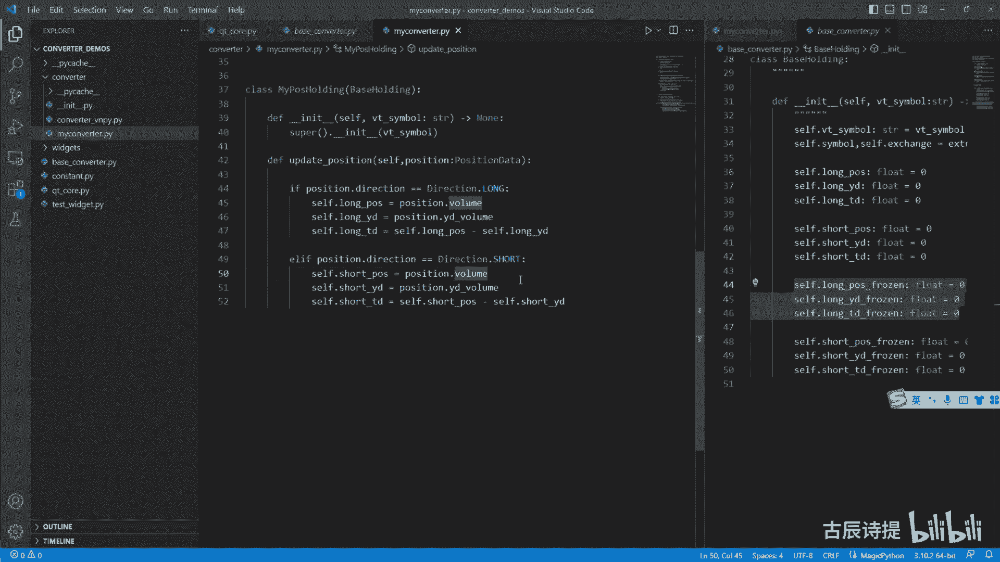

负数就是代表空仓吗，但是在咱们这是分开表示的，它它都是正数，包括刚才咱们看其实这个持仓是空仓吧，但是他给你的是还是正数吧。

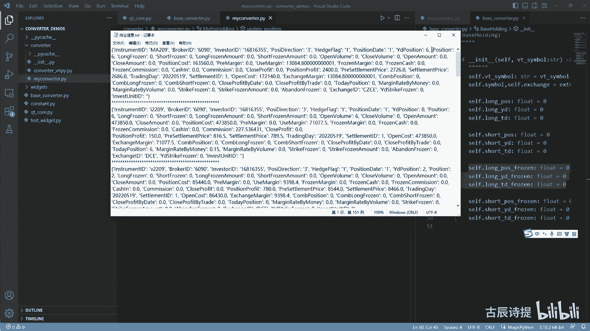

啊这个要记住了啊，这个一定要知道了啊，好咱们这节课呢就暂时先到这。

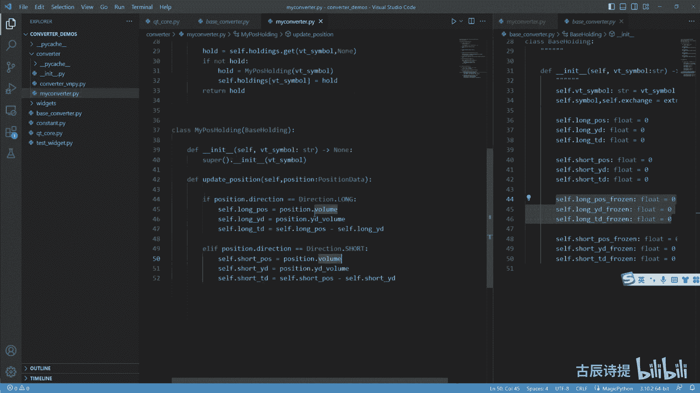