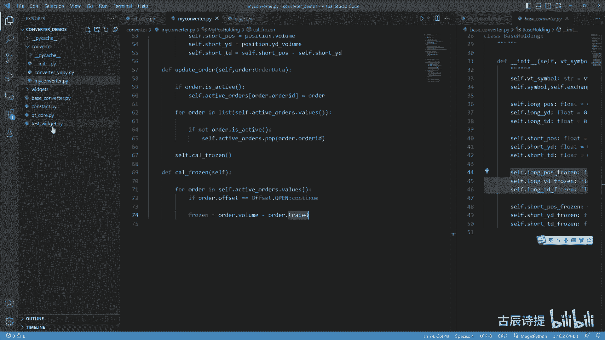
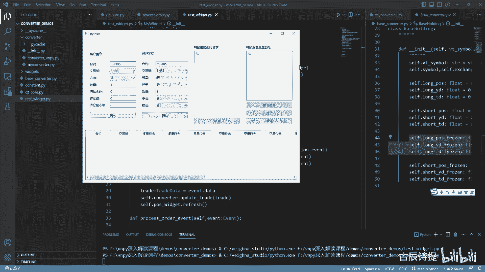
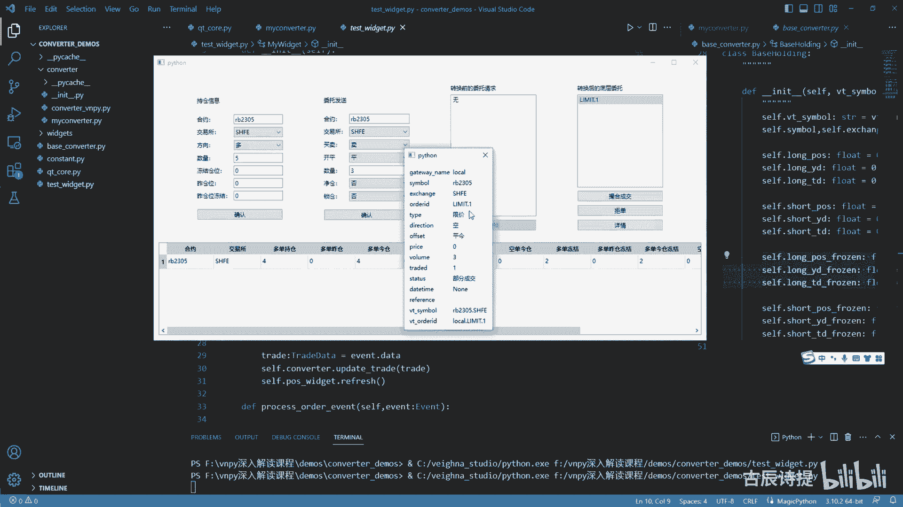
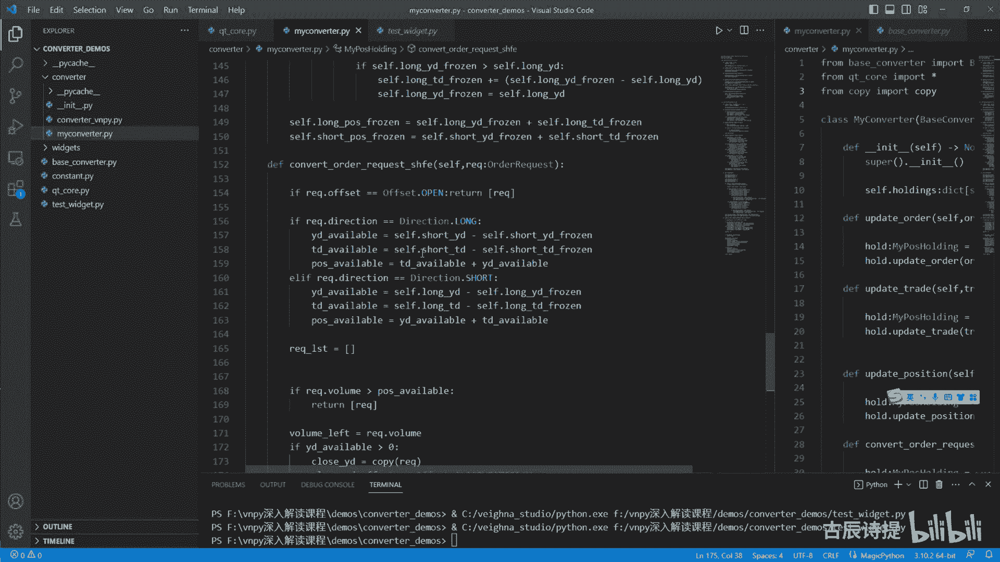

# 第28节课 转换器的实现(2) - P1 - 古辰诗提 - BV14z421D7UH

欢迎大家来到从零开始量化系列课程，VMPI课程的第28节课，上一节课咱们说到了这个update position，然后也说到了它并不更新这个frozen是吧，当然啦。

有些呃情况如果说你想去更新这个frozen的话，可能会遇到一些情况啊，比如说你在夜盘的最后一根K线，你你发出去了一笔现价单委托，比如说是止盈啊，还是还是开仓，这个这个限价单委托发出去之后。

肯定会被冻结住，对不对啊，咱们一会讲这个order的时候，会讲到会被冻结住之后呢，可能啊比如说他是这样的，就碰了一下这个价格，但是他并没有成交呃，你像这个在夜盘的时候。

你的这个委托是会保存到第二天的白天的，因为他这个委托单在这个期货公司呃，不是在这个呃，期货服务器里边会保存一个交易日啊，一整个交易日，那这个时候你就是是不是得去更新它是吧，因为这个是属于你。

你这个程序量化程序发送的这个委托对吧，你可能会遇到这种那种情况，但是呢如果说你想这么去更新的话，你必须得匹配什么呀，就是你既然这么去更去更新了，你必须得匹配，就是说这个active orders。

同时的这个你第二天早上开盘的时候，你必须得更新这个active orders，因为你一开盘你是整个程序的重启，那个里边并不会存在这个active orders，是不是既然不存在的话。

你需要给它把这个就是是哪个委托给他发，发过去的，你必须把这个委托给保存下来，保保存下来之后，然后再去第二天早上再去进行读取，这样的话才能进行顺利的回调，不然的话你在这个C那个CTAN件里边。

你根本就调不到这个order，那就调不到你这个这个策略本身，那个on order这个里边去啊，on order或者on tra的这个里边去，你调不到这个里边去，你这个你的这个本身的这个策略。

这个pose并不会进行一个它的一个自增自减嗯，就会出现这种仓位的呃错误吧，算是所以这一点你要注意，一定要把逻思维捋顺了，捋顺了之后，按照你的需求再去进行调整，而并不是说我能给你一个完整的什么东西啊。

我能给你完整的一个什么东西，可能将来会有完整的东西，但是那个肯定会牺牲掉一部分，比如说我参考MC的态度，就是它的一种就是运作方式，MC里边它并没有撤单，就是cancel order这一说。

就是在每一根K线都发送委托单，然后再下一根K线，就是说开始的时候，他就会把前面的委托单全部给撤销掉，你的这个委托在这根K线里边，如果承销不了的话，就会被撤销掉，你就是属于是什么呀，你牺牲了一些东西。

然后去获得了一个统一的标准嘛，是不是啊，你最好是能自己能够去把这个思维给捋顺了，其实并不复杂，但是你要把它给捋顺了，可能里边有一些绕，好吧好，那咱们就接着想按照逻辑来说。

你update position之后，你就应该做什么呀，应该是update order吧，就是你需要更新这个委托，因为如果说满足条件之后，他是先发送委托，是不是，当然了。

发送委托他会就是应该去先啊转换啊，Comment order request，咱们就先不讲这个，咱们先说这个更新，如果委托成功地发送到了服务器之后，他会给你一个回馈，就是告诉你这个委托发送成功了。

然后他的这个委托的这个状态是这个呃，就是这个submitting是吧，就是咱们指的这个委托都是指的是限价单啊，而并不是说有停止单单，因为你停止单最终也会转成限价单，最终的转换是转换成现价单之后，停止单。

转换成现价单之后，然后再通过你的这个转换器转到服务器里边去，好吧好，那update order其实你要这么去写的话就简单了是吧，就是holder啊，还是这个my post holding。

等于cf点get it holding，然后这里边把order点v t simple啊，v t simple啊，给他给传过去，然后你获取到holder，然后再去holder啊。

这个update order把order给他放过去啊，咱们这个update order没去实现呢，对不对好，咱们从这去实现一下这个DF，order cf把这个order给他传过来。

它是一个order data啊，那它这里边需要做什么工作呀，需要做什么工作，咱们之前说过吧，order其实最主要的是来计算这个frozen的，就是计算你的这个冻结的这个仓位的，对不对。

但是你每次去进行计算的时候啊，你update order，然后你去因为order有些order过来之后，他是就是告诉你成交了，有些是来告诉你，就是说我委托发送成功了。

然后有些是来告诉你我这个order还没有成交，是不是你如果顺着这个思路一条一条去捋，是不是很复杂，就是说你得考虑哎，我这个委托是不是成交了的委托，还是呃就是说不是成交了委托，他是一个呃。

就是说刚刚发送过去的委托或者被拒单的委托，是不是很复杂，所以说这呢最好咱们写一个什么呀，叫cf点什么active，orders它是一个字典啊，这个字典里边存放的是什么，是通过这个VTODID啊。

是通过呃这个VTR代替，然后存储的是什么呀，是他的这个呃就是这个后边是这个order data是吧，把每一个活跃着的这个order，给他存放到这个active orders。

所以说咱们这个order过来，我第一步做什么呀，order点就是说is active，因为这个order data本身呢，它是可以去判定它是不是活跃的状态，它活跃的状态分为几种啊。

就是submitting提交中，NO trait就是还没有成交，part trait就是部分成交，是不是这个三种状态是说明它是活跃的，这个active是吧，其他的被拒单了也好，完全成交了也好。

他属于是不活跃的这个状态啊，如果说这个order还是一个处于活跃的状态的话，我这个self点啊往上写啊，cf点active orders，然后这个key key我是用什么呀，order点。

比如我用VTO的id啊，等于呃用VTUL来id啊，就用vtuo i id吧，呃等于什么呀，等于这个呃这个order是吧，给他给传过去吧，我还是用order id吧。

这个VNPY里边好像是用的vtuo id，因为我这VTO的id呃，因为你前面得加上一个gateway，这个older i d和VTO大D，就是前面有没有这个gateway啊。

我这用这个这个order id吧，然后我从这还可以做一个什么工作呀，是不是我可以把它挨个的去看一下，这个里边这个委托单，就是有没有已经是不活跃的了，如果说不活跃的了，我可以，我是不是把它从我这给他删掉。

是不是啊，我for order in这个self点active orders，点values，这样我进行遍历一下，然后前面我加一个list，为什么加这个list，咱们前面着重去讲过。

是不是if order点studio呃，if order点儿is active，如果说啊如果说他已经不活跃了，If not active，我就把它cf点active orders点pop。

通过这个order点order AD吧，给他去把它给删掉是吧，然后我下面要做的工作，就是去计算他的这个冻结的这个情况，计算冻结的情况呀，咱们可以单独给他去做一个方法。

calculate frozen r o z f r o啊，z n self可以单独给他取一个方法来去实现它啊，偏先pass一下，从这儿呢我调用一下啊，self点c a l frozen。

是不是这样就可以了啊，这个calculator frozen是计算它的，整个它的这个冻结的情况啊，我确保这个里边都是活跃的合约了是吧，for这个order in cf点active orders。

点values啊，确保它是都是活跃的，合约之后，我可以如果说啊去确定他的这个冻结情况，但是冻结是什么呀，你平仓的时候才会冻结吧，开仓的时候并不会去冻结吧。

所以说order点这个offset等于这个offset，offset啊，点open，如果说他是开仓的话，我直接给他略过去，就是continue，是不是啊，下面如果说这个程序接着往下走的话。

说明它是一个平仓的啊，他是一个平仓，那这个平仓咱们得知道这个order的，他的这个已经发送到底层，他这个平仓啊，他这个冻结的数量是多少，可能有些老板会说他的冻结数量就是order点WU，不对呀。

这个order点他有可能比如我同时去成交了呃，我发送十笔委托平仓委托，他有可能是一笔一笔给你成交的，所以说你这个额冻结的这个数量啊，应该是什么呀。

应该是frozen f r o f r o z in frozen，应该是等于是这个order点volume哎，order点volume减去什么呀，它里边有一个order点traded啊。

order点traded，order点traded，就是他已经成交了部分，那剩余的部分是不是你去需要冻结的啊，这个能理解吧，这个一定别忘了啊，你不要以为就是说我冻结的那个数量，就是应该是他的。

就是说这个就是应该是它的整个的这个数量啊，咱们还可以去看一下这个test wit。

比如说我持有多仓是吧，然后我呃我持有多仓五首吧，确认我持有，然后我卖平啊，卖平卖平三首，确认它进行转换的时候，你像他冻结的多单冻结是三首吧，然后我撮合成交，我有可能是成交一手。

你这个多单冻结你要变成两手啊是吧，所以说多单冻结应该是什么呀，应该是你这个limit，你看这个limit order，这这个traded就变成一了吧，就是他已经部分成交了吧，变成一了吧。

你应该用它这个3-1吧啊，就变成二了啊，这个你一定要，知道啊，不然的话会出问题的，好这个frozen有了之后，咱们就应该具体的去更新，就是就是这个已有的。

你像这个long post frozen和这个short post frozen了吧，你想啊，咱们这个是准备去挨个去便利的，所以说我之前应该把这个整个所有的，全部给它归零吧，对不对啊。

我应该整个的所有的把它归零，因为我后边是挨个去给它去便利这个order，所以说前面呢统一的把它去归零啊，我把它整个的这个float可以给给他去删掉啊，整个的给它归下零，后边咱们就应该去具体去判定了啊。

if order点direction就是它的这个方向，如果说等于direction点多啊，它是多的方向，也就是买，咱们可以看一下啊，if order点offset it等于offset点。

比如说它是clothes，Yesterday，如果他是平的啊，他要平的是着仓，那我这个cf点你平仓，首先这有一个默认条件是什么，是平仓，因为开仓已经略过去了，平仓平仓平的是什么，它是多方向。

那就是平的是空挡吧，是不是，所以说我这个short应该是y d frozen，就是昨天的冻结仓位应该加等于这个frozen吧，FROZEN能理解这个逻辑吗，就是前面的开仓已经略过去了。

那你这个offset必然是平仓是吧，要么是平精，要么是平左，要么就是一个close，它后边有三个选择吗，是不是，然后你又是多的方向，如果说我是平的，是着仓方向还是多的话，他就是凭攻他平那个空挡吧。

是买进平仓吧，所以说我应该是把这个空单的着仓给他冻结，数量给加上，对不对啊，同样的L，if if这个order点offset等于等于offset点close today，如果是平的是经仓。

我self点SHT啊，t d frozen应该是加等于frozen，f r o z in的嘛，加等于frozen嘛，对不对，好有一个啊。

l if order点offset等于office se点close，如果它只有一个close的话，这个你就需要甄别了，只有一个close的话，那他究竟是冻结昨仓还是冻结金仓呢，咱们通常情况下啊。

就是一般情况下，就是除了上汽所和这个上汽能源，别的交易所都是优先平左，所以说咱们是不是应该是优先的，让他冻结住着仓，self f点short post frozen啊，应该是y d frozen是吧。

然后加啊，加等于加等于这个frozen，我先让他优先冻结着仓，我先把他这个着仓给加起来，但是啊如果说if发cf点short，我冻结住的这个昨仓，已经比我昨仓的持有这个shut pose要大了，什么意思。

就是我这边就加上了吧，比如说我这个呃平仓我是平十首，我昨仓有五首金仓，有五首我平时守的话，我冻结昨仓，我这个shut y d frozen是不是就变成十了，十是不是已经比它的持有仓位大了。

那就说明有问题，你应该是什么呀，应该是呃锁呃，就是这个冻结昨仓无首，冻结经仓无首，对不对啊，所以比它大，那就是有问题，所以说你应该要把它改成什么呀，self点这个short t d frozen。

一定会冻结部分的金仓，是不是应该是加等于什么呀，就是我加一个括号啊，这个里边应该是cf点shut post frozen，然后减去shift点shut pose吧，就是把它的剩余的部分给他。

放到金仓来进行冻结，然后把他的cf点这个short y d啊，y d frozen给它更新成y d frozen，应该等于cf点shut pose，就说明它昨仓整个的已经全部给冻结住了。

然后剩余的部分来冻结金仓是不是好，咱们再看一下啊，我昨仓是五首，金仓是两手的话，我平七手，我评骑手，我先更新了一下这个卓仓的，卓仓的frozen已经变成七了，然后它比五要大，就触发下面这个代码了吧。

比五要大，那我经仓先进行更新，用我昨仓的冻结有是七减去我这个昨仓的持仓，也就是二，我金仓冻结就是二，然后我把昨仓的冻结更新为就是着仓的持仓，把它变成了五，这是不是就对了。

说明就是我昨仓已经全部被冻结住了，然后我剩余的我就冻结金仓，对不对啊，就是优先平昨仓嘛，咱们就是把它和这个什么呀，就是说就是别的交易所统一起来，是不是好好这个能理解吧，那就是下面的就是AIF。

就是order点direction等于等于direction点试试，shut就是空方向的是吧，空方向的你自然要更新什么呀，我平仓，而且我是空方向的，那我就是其实就是卖嘛，就是卖平啊。

卖平那就是我持有多单，我应该冻结多单是吧，if order点offset it等于等于often sit点close，yesterday1啊，yesterday就是cf点long post呃。

long y d frozen加等于frozen吗，啊这个但凡是指定这个的啊，肯定是上汽所和上汽能源，对不对啊，肯定是上汽所和上汽能源啊，好l if f。

l if order点offset it等于等于offset点close对，那我冻结的肯定是呃，今天的这个多单t d frozen加等于frozen吗，FROZN啊啊然后我A2f cf点啊。

这个order点direction等于等于offset it点close，如果只有一个close的话，那我是不是先优先着仓嘛，cf点long y d frozen，然后加等于frozen好。

再进行一下判定是吧，if cf点这个lg啊，这个y d frozen大于千万不要是等于啊，不要带等于啊，cf点long y d这个持仓啊，这个应该不是这个shut pose啊。

应该是这个应该是大于这个shut post frozen，大于应该是sht y d frozen是吧，左仓yd frozen大于这个SHTYD，然后应该是这个SHTYD。

frozen等于shut y d是吧，应该是这个，对不对啊，啊long啊，SHTYD啊，好如果是大于昨天的这个持仓的话，那我这个cf点啊，Long，这个t d frozen就是经常应该加等于啊cf点。

这应该是不是这个short pose，应该是short yd frozen，是不是，然后减去shut yd吧，这个不能写错了啊，写错了会问你再看一下啊，Shut y d frozen。

shut y d啊，shut这个是shut t d是吧，这一样的，扔这个y d y d frozen减去cf点long yd啊，加等于，然后再把这个cf点啊，龙YYD，然后更新成y d frozen啊。

Frozen，然后更新层shift点long yd，是吧啊，这个就是它的整个的这个up，这个calculate frozen嘛，对不对，calculate frozen啊。

calculate frozen说完了之后，这个应该能理解吧，啊calculator frozen说完之后委托发送出去了，是不是就应该什么update trade了吧，好update tra了吧。

这个里边我看一下啊，更新咱们还得更新一下什么呀，就是这个long post frozen和shut post frozen嘛，因为你这都更新了long id和这个sht y id，是不是啊。

这个下面这个就好说了啊，就是等他把这个循环做完了之后，咱们应该更新一下cf点，long post frozen等于cf点啊，Long yd frozen，加上一个cf点。

long t t frozen嘛，然后serve点short post frozen，等于self点sht y d frozen，然后加上self点shut，T d frozen。

这个把这个long post frozen，就是它整个的冻结的仓位，也给它去进行一下更新，对不对啊，这个就把这个update order这块说完了，update order说完了。

咱们下面就应该写这个update trade了吧，在写update trad之前呢，你需要明白一个东西，就是update trade，我更新了，我这个就是这个成交信息之后。

我这个合约就是order是不是要更新啊，这个咱们在之前写的时候，你应该知道就是在成交信息发过来之前，他会先给发这个什么呀，order就是委托信息，然后告诉你这个order完全成交了。

咱们在写这个back testing的时候，那个引擎的时候，他是不是也是就是先是把这个order完全成交了，放到这个in engine里面去，然后再放那个trad，所以说这个你不用去考虑它好吧。

那咱们只需要考虑就是更新，通过这个trad来了之后，咱们更新这个本身咱们的实际持仓就可以了，所以说那这样的话就简单了，对不对，try着点，如果说TRA了点offset等于等于offset点open。

同样的咱们先从这个开仓来说，开仓来说，因为它是最简单的嘛，是不是，那你这个呃得判定if啊，这个triad点direction等于等于direction点long，如果说它是多方向的话，而且多开的话。

那cf点这个long t d，哎怎么没有提示了，啊不是啊，不应该是从这个里边去进行更新，是不是啊，我先把它删掉，还是应该就是跟咱们之前一样，应该是hold的啊，就是my post holding啊。

My post holding，然后等于cf点get it holding，然后这个tread点这个vt simple，然后找到它啊，然后咱们再下面就是hold点update triad。

然后把这个tread给它放进去，是不是把这个trad给它放进去吧，在下面咱们来实现这个update trade啊，Df update trad，然后cf把这个trad给它放进去。

它是一个trade data，是不是啊，然后我把刚才写的这个粘过来，如果啊self点long pose，就应该是long pose，long t d pose吧，啊。

long t d就是应该是加等于这个trad点volume吗，为什么是TD，因为你开仓肯定是经仓啊，是不是啊，TT后边最终再去更新这个整体的long pose，对不对啊。

好呃l if try点direction等于等于direction点SHT，如果是空方向的话，我是不是self点SHTTD加等于trad点volume，对不对啊，然后这是开仓开仓就是这个情况吧。

是不是AF咱们看平仓平仓复杂一点，揣着点offset it等于等于offset it点close，咱们先说简单的吧，就是close yesterday啊，如果是平昨仓的话，好，同样的。

if you tried点direction等于等于direction，点这个浪就是多方向我平左我平左多方向，你想想啊，我平左多方向是不是我的空单就是被平掉了，是不是，所以说我应该是什么。

self点SHTTD减等于tread点volume吧，这个你一定要捋清楚啊，我的方向是买，然后我还是平左就是买平嘛，我的空单减少嘛，是吧啊，else然后就是呃我还是写l if吧。

就是TRA点direction等于等于direction点shut，如果说我是平仓，然后方向是空，我其实就是卖平嘛，那我就是long td减等于trad点volume吧，是不是啊，这需要注意一下。

可能有些人会说，如果说我的持仓就是我的这个long td，没有这个trad volum的，你没有long td，这个你的这个long td就是今今天的持仓，没有这个trade warm。

就是你的成交额大，你都过不去那个委托那一关是吧，你委托那一关要么就给你出问题了，要么就给你转了，对吧啊，所以说这个是不需要去考虑的好。

l f tread点offset it等于等于offset it点close today，就是平均仓，同样的啊，If tra，try的点direction等于等于点direction，点long。

同样的啊，cf点应该是short td简等于try的点volume吧，然后air if tra点direction等于等于，direction点shut，那我就cf点long t d。

就是经常啊减等于trad点volume吧，l if tread点offset it等于等于offset it点close，那这个也是也是需要单独的去甄别的吧，就是如果说只有平仓的话。

if trade的点direction等于等于direction点long，就是凭空仓，凭空仓我应该优先减谁呀，凭空仓我应该优先平卒吧，平卒，那我就是这个shirt额YD。

减等于就是TRA点volume吧，优先平左，我先把它减了，减了是不是有可能出现负数啊，如果说没有出现负数的话，就说明着仓已经够平了是吧，如果说cf点short t d小于零，如果说它已经小于零了。

就是昨仓它不够平，那我是不是就应该平均仓，是不是，所以说就应该是cf点，TD然后加等于self点SHT啊，这应该是YD啊是吧，C就是YD如果着仓小于零了，那就说明着仓不够平，那我就是应该是平均仓了吧。

所以说应该是加等于SHT这个TD，然后呢再把这个self点SHTYD，然后给它变成零左仓，平完了嘛，对不对啊，这个是和上面那个逻辑，就是那个order那个逻辑挺呃挺相似的啊，这个应该能理解吧啊好。

同样的这个l if f l if trad点，direction等于等于direction点，如果说是空方向我平仓的话，那就是平的是多单嘛，是不是，然后优先平足那cf点这个SHTYD啊。

不是long yd啊，拼拼多单啊，long yd应该是减等于这个trad点volume，如果说这个它大于零没有问题，如果说这个long y d它已经小于零了，说明它不够减，就是它的着仓是不够的。

所以说我就需要平金仓，所以说就是这个shirt t d，然后加啊，然后哎，需要TD啊，加等于什么呀，就是self点这个long yd吧，啊如果说你的座舱已经是小于零了，我就让它加等于TD啊。

就是这个long t d是吧啊，long td不要写错了啊，这个应该是long td，就是你的这个呃金仓的这个多单，我要加等于就是这个负数，是说明就把这个金仓给平掉了，然后同时还要一个值，不要忘了啊。

就是cf点long y d就是左仓，我应该等于零，比较绕一些啊，希望去把它去理解一下啊，这个就是close close，yesterday和close这个today是吧，都都有了，最后不要忘了做什么呀。

就是self点long post应该是等于C点，这个long y d加上cf点long t d，然后cf点short pose等于cf点shirt y d，加上cf点shirt t d，对不对啊。

最后你别忘了去把他的这个什么更新一下，就是long post和shut pose进行下更新啊，到这就是这个tried up after tried，是不是也就说完了是吧，后边就应该什么呀。

就应该说咱们比较难以去做的事啊，convor order request就是去转换，就是什么呀，你的这个委托请求啊，委托请求一样的，咱们先找到这个hold，就是my position holding。

等于self点get it holding，然后把这个IEQ点vit simple给它放进去，找到了这个hold之后，我是不是就应该咱们先做什么呀，就说没有net，没有lock，就是我不锁上我。

我也不进仓，我单独的转换这个上期锁啊，这样的一个方式是不是这个是最简单的嘛对吧，If not net and not luck，就是hold交给他处理吧，cn v r converter就是个REQ。

order i e q吧，order i e q呃，Request r e q u e s t，request s h f e吧，就是把这个IEQ给他传过去啊，为什么写SHF。

因为它是针对上汽所和上汽能源嘛，你是上汽能源，它本质上是属于上汽所的是吧，好咱们把它写到哪呢，写到这吧，DEFCTRLV啊，然后self接收到的是一个IQ，它是一个order request吧。

好咳咱们先所先捋一下这个逻辑啊，首先是不是如果说你是开仓的话，我就不管了，因为开仓只有一个open，是不是if i e q点，这个offset等于等于offset点open，我直接就return一个吧。

一个列表，然后里边把IEQ给他放过去，因为这个得配合就是它最终会是一个列表，是不是好，如果说是它不是这个开仓，不是开仓的话，那就说明代码会往下走，说明它就是平仓平仓，咱们捋一下这个逻辑啊，平仓你想想啊。

平仓的话，如果说我要平十首，我昨仓持有七首，金仓，持有三首，那昨仓七首金仓呃，金仓三首的话，我去评这个十首的话，是不是平七首浊仓，然后再评三首金仓，就是要平的，先把左仓平了，哎，他还剩三首要平的。

然后再平金仓刚好够了，但是啊如果说我平五手的话，他着仓就够了吧，所以说这个得看你的逻辑了，你可以先评金仓，也可以先评昨仓，这是你自己来指定的，因为上汽所和上汽能源你指定好了，他就怎么给你去操作，对不对。

那咱们就跟别的交易所一样，先评左仓，这需要考虑一个什么问题呢，可能你之你之前发的委托，他被冻结住了，那这个被冻结住了，你能用的仓位就是四手了吧，对不对，你能用仓位就是四手了吧，那你还有一手需要评。

假如说我需要拼五手的话，还有一手需要评，我就得在金仓里边去评了的话去评吧，那经商有没有可能被冻结，是不是也有可能被冻结，被冻结一手，当然不可能出现这种情况啊，你如果说是优先平左。

它应该优先冻结的是昨仓对吧，但是你也得考虑进仓啊，比如说我平两手，那我之前可能说昨仓全部给冻结了，我金仓又冻结了一手，那就剩两手，你是不是得在金仓里边去拼，对不对啊。

所以说咱们得先找到昨仓能用的和金仓能用的，这个仓位数量是吧，那这个仓位数量咱们是不是得分，你是凭的是多单还是空单，对不对，if i e q点direction等于等于direction点long。

这个方向是多，然后你是平仓，那就说明你是平的，是空挡吧，那self点shirt，你得看这个shut y d available吧，AVALLABLE就是我昨仓能用的，就是昨的就是空仓着仓能用的数量。

是不是，那就是cf点shirt这个YD，然后减去cf点sht y d frozen吧，然后shut shwatt，SHTTDVABLEAVALLABLE等于cf点。

SHTTD减去cf点shut t d frozen嘛，是不是，然后l if i e q点，direction等于等于direction点shut，如果说是空方向，就说就说明是平多单嘛是吧。

那我就是long y d available，AVALABLE等于cf点，long这个YD减去cf点long yd frozen吧，然后shift点YD啊。

不是这个long t d available a v a，还有ABAE等于cf点long t d减去4S点，long t d frozen吧，应该是这样吧，对不对啊，应该是这样的，是不是。

那咱们来进行就是平仓的话，if i e q点direction等于等于direction点long啊，如果是说是进行多单啊，这个多方向的平仓也就是空瓶空瓶，比如我持有空仓是五手，然后我可用的啊。

我可用的这个空仓啊，我持有的空仓金仓是五首，佐仓是七首，我可用的呢就是五首和七首，比如我要评十首，我就优先指定他评错，这是自己指定的啊，你可以去让他优先平精，那我是不是我要评的是十首，然后我先平了。

这个七首如果说评完之后10-7，如果说这个还剩余的话，还剩余我是不是就得平精了是吧，你是不是这样，就是先是平，昨我昨仓平完之后，我再看看我剩余还要平多少，如果说还要平，比如说还有这个要需要评的数量。

我是不是就让他去评精确，你有这样一种递进的这个逻辑吧，是不是如果说我平12首，我剩余的五首就都平了，如果我评13首，剩余的六首我就比他多了，那说明你这个委托发送的有问题，是不是你委托发送的有问题吧。

因为你前面的委托可能把你的仓位给占掉了，那这样的话，如果说我是不是前面得先进行一个判定，先进行一个判定，如果说我的平仓量超过我的可用的金仓，加上佐仓，那就我就比我就比如说我原路返回，是不是。

或者我报个错都可以的吧，我这写一个pose or valuable a v a LLA b l e啊，当然是shut了啊，Shut pose variable。

是不是等于我这个shut t d variable，加上这个shut y d valuable啊，然后同样的我这个long pose variable，LABLE啊。

等于这个long y d available，加上，t d valuable是吧，我先进行一下判定啊，从这我先进行一下判定。

if i e q点volume大于我这个short post available，我直接我就return了吧，我我让他把这个IEQ给原路返回，因为本身是有问题的，是不是啊，但是如果说没有大于的话。

就说明可以去平，我这儿呢我volume啊，left我就剩余需要平的这个数量，我就等于这个REQ点volume啊，然后我先平左就是close什么呀，close y d我等于我copy一下啊。

我copy一下就是from copy import copy，我之前已经导入了啊，copy一下，然后把这个REQ给他直接copy过来，因为这里边还有价格呀什么一些东西的是吧，我我需要转变的是什么呀。

就是close y d点，他的这个平offset它肯定是clothes嘛是吧，我把它改成什么呀，offset at点close yesterday吧，对不对好，然后这个数量数量咱们想一下啊，我需要评。

比如说我昨仓有五首，然后我需要评七首，我是不是我昨仓只能评五首是吧，但是我昨仓有五首，我需要评三首，我是不是左仓左仓平三首就可以了，是不是取这俩两个之间的较小值啊，对不对，取它们之间的较小值啊。

我这个平的这个VN应该是等于什么呀，较小值应该是VN left和这个就是shut，这个yd就是着仓，他们取一个较小值是吧，然后我把close y d点volume变成我这个volume，就是平的数量。

然后我这个volume left是不是应该等于等于什么呀，应该是等于我这个就是volume left，减去这个我已经平掉的这个volume吧，或者我直接简等于volume就可以了吧。

简等于volume吧，是不是，当然我往回返的时候，我是属于这个就是昨仓已经平了啊，这不是，至于我volume left有没有剩，咱们一会再说，我是不是得从这我写一个什么呀。

就是说这个i e q list u s t等于一个列表，然后我把这个i q list我先放到这个里边去，这个i q list点append这个close，Yesterday。

但是这呢你还需要注意一点就是什么呀，就是我有没有做仓啊，我有没有左仓，如果说我没有左仓呢，你这就是左仓就是零嘛，零然后你平仓是零，你看啊零就是放过来，你肯定是volume是零嘛，你平仓是零。

你这叫什么委托呀，所以说你还得判定一下，if这个short y d available大于零，你才能进行下面这个操作呢吧，对不对，是吧好下面如果说你这个if volume left还剩余的话，大于零。

就是昨仓平了，还没平完，我是不是就应该平精仓了，Close t d，应该是等于copy这个IEQ好，然后我把这个close t d，这个点offset给它变成什么呀。

offset点closed today吧，好，然后这个volume，volume是不是就应该和这个volume left是一样了，volume就应该等于volume left了吧。

就是你不可能就是说这个你昨仓评完之后，金仓还不够平，因为什么呀，前面已经咱们过滤过了，如果说你这个整个的这个需要评的这个数量，大于就是我整个的这个佐仓和金仓，就是就是总数量的话，它就返回了。

如果说接着往下走，说明它没有大于，就是它是小于我这个呃这个涡轮，这个这个IQ需要平的是小于我这个short，Videavailable，加上我这个shirt t d available的。

就是金仓和座仓总共的数量，我是大于或者等于我这个整个的这个volume的，是不是这我就可以等于这个volume left了，所以说我就直接就是close t d点。

volume不就等于这个volume left吧，是不是啊，就等于VOLUMLEFT，然后呢，我就这个i q list就可以append这个close t d了吧，对不对，就可以close t d了吧。

然后我把整个的这个什么呀，就是说这个他跑完之后，我再把这个整个的这个i q list再给他返回出去，它本身就是个列表吧，好一样的道理，l if l if r e q点。

direction等于等于direction点short，shut还是一个，如果说if r e q点volume大于这个short，这个long post available，我就直接让它返回去。

因为这是有问题的，是不是return i q，IQ啊，如果没有的话，说明我的可用的仓位够平，是不是，然后咱们还得进行下判判定，If long pose variable，然后大于零。

扔应该是y d available是吧，y d available就是座舱，如果可以用的话啊，有有着仓的话，我close y d就等于copy这个IQ是不是，然后我把close y d。

点offset等于等于啊，不是等于等于啊，是等于offset，点close yesterday，然后我再把这个volume进行复制一下，volume是不是等于main。

然后volume left它需要一个volume left，volume left是不是在这volume l l e f t left，等于REQ点volume，然后我比一下这个volume left。

然后和我的这个long y d available比一下啊，取一个较小值，取一个较小值，平完之后，我是不是应该把这个close yd点volume，变成我的这个volume wm。

然后我i e q list点append这个close y d，然后我把volume left，减等于这个volume吧，是不是，然后如果说if volume left他还大于零，如果还需要平的话哇。

close t d等于copy i e q，然后我把close t d点offset，然后等于offset点close t d吧，然后close t d点volume应该就等于volume left。

是不是，然后我这个r e q list点append，然后这个close td，然后嗯我再把整个的这个给return出去，return r e q list是不是就可以了啊，是是对吧，但是你会发现啊。

这两段代码一个浪一个shut里边，除了这个short post available，这个shshort vid available，就是和这个有区别。

这个long post available和long y点AVARIABLE，别的是不是都是一样的呀，包括它的赋值啊，什么都是一样的，对不对，那我是不是就可以把这个这个这个什么呀。

赋值的时候我直接把它变为这个y d available啊，然后这个t d available，然后post available是吧，然后t d available给他。

把这个short和long给它全部给删除掉啊，浪从这啊删掉，然后就是这个y d available，T d of variable，我在下面呢，我就不去去判定它是long还是shut了是吧。

我把下面整个全部给它删掉，我啊整个全部给它删掉，然后我直接从这我往前进一个tap，然后如果说它大于post available，然后我就用昨天的可用的仓位，然后给他改一下是吧，昨天可用的仓位。

从这是不是就是一样的道理了，是不是这两个两段代码就是分为多空方向的，两段代码是不是可以合并成一段代码，对吧好，这个就是你专门针对这个，上期所进行的一个转换。

