# 第29节课 转换器的实现(3) - P1 - 古辰诗提 - BV1aZ42177TG

欢迎大家来到从零开始量化系列课程，BPY课程的第29节课，上一节课咱们讲了，如何给这个上期所的这个进行转换，咱们可以先测试一下，测试之前呢，咱们需要改一下代码，在这咱们需要一个return返回值。

因为这个order request过来转换的时候，咱们是需要返回一个列表的，对吧啊，是需要返回一个列表的，呃另外呢上节课有一处错误，就是在这他应该不是双等，于是应该单等于对吧，咱们要把这个咱们写的。

就是说替代掉这个converter v m p i，咱们从这去把它这个改一下，因为什么呀，咱们在写写界面的时候，我都是从q t q import星，都是从这里边导入的。

这里边导入的是从convent import和post holding，它其实是把这个convent作为一个包，然后进行导入，导入的时候，他肯定是从这个INITPY文件里面去导入的。

所以说咱们只要把这改一下就可以了啊，名字得保持一致啊，from第二，My comment import，My comment，应该as，COMMENTER是吧，然后from f2。

From my converter，import这个my post holding as，holding吧，这样就一致了吧，你从这导入的时候，它就是一致的了吧，好咱们运行一下啊。

在这个text visitor里面运行一下。

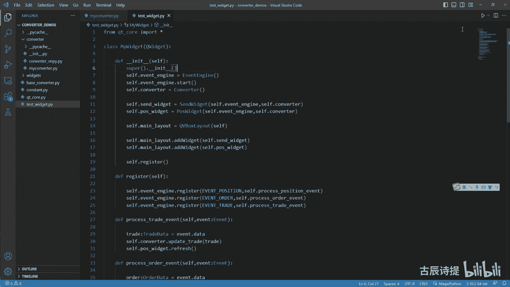

好咱们测试一下，先进行这个更新，比如说我螺纹2305，我持有多仓两手，然后佐仓冻结一手，确定一下，这这就有了吧，这个没问题是吧，好然后我委托发送我2B23005，我要什么呀，我要卖平，就是平多仓平两手。

确定这个进仓和锁仓，咱们还没有写的吗，这个时候转换，就是对这个上西索和上新能源进行转换吧，看它就变成两个了吧，第一个就是平仄吧，然后第二个是平均，因为代码里边咱们先平卒再平均。

如果说你需要先先平均再平仄的话，你可以自己去改一下对吧，这个应该就没有问题了，但是如果说我这改成CCCE，然后我确定当然没有这个IB2305，CE这个品种啊，我就假设我这个时候再卖平啊。

我把这个先巨大先去大，是我这个时候再卖屏的话，我再去进行转换，他也是能转换的是吧，也是平左也是瓶颈，这是不是有问题啊，因为咱们没有进行过滤，是不是没有进行过滤吧。

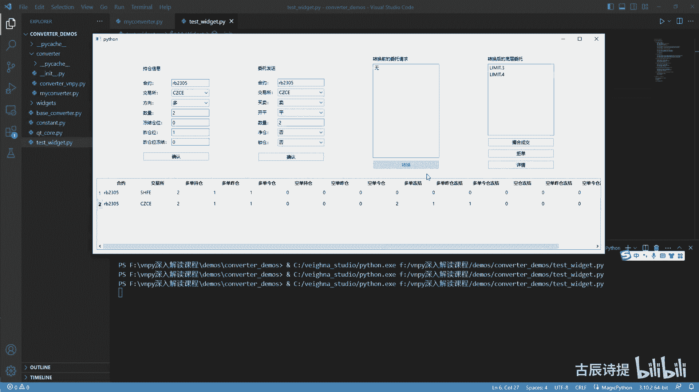

所以说咱们要从这儿进行过滤一下，就在这个my commenter这进行一下过滤，在这and and什么呀，and这个REQ点exchange in这个exchange点SHFE吧。

还有exchange it，exchange点RNE吧，这样进行过滤一下，它就不会出现这样的操作，但是会报错是吧，所以说咱们在最后先给它返回一个return一个，如果说是其他的情况。

我先把这个IQ给它做，用一个列表给返回回去，这样的话是不是就没有问题了，我再进行一下运行。

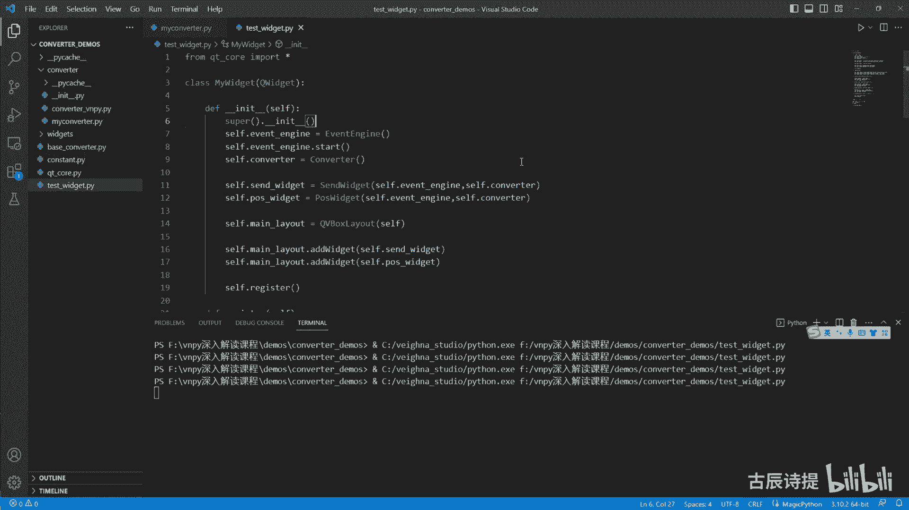

然后同样的，比如说我这个用我这我这别的就不改了啊，左仓位移手，然后确认。

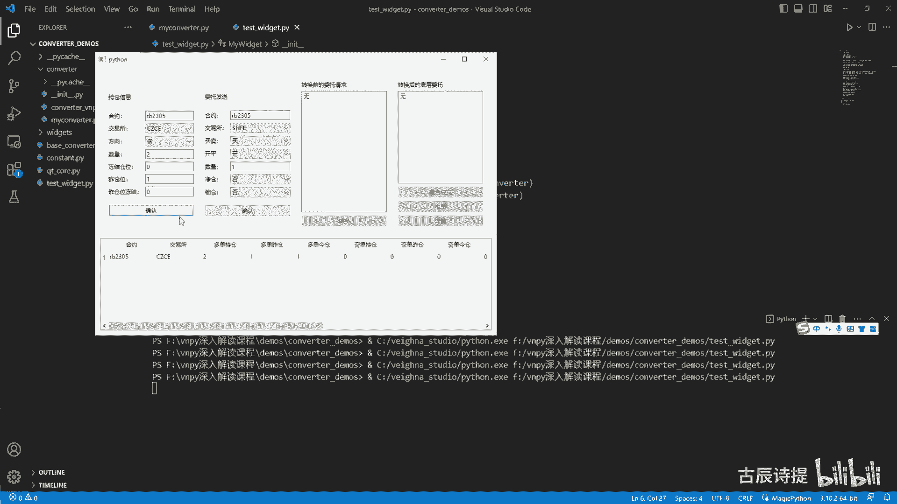

他是不是就是说这个没有问题，然后CZZE然后卖平两手吧，点击下确认转换，它就会转换成一个是吧，空瓶两手他就不会跟上期所那样去进行转换。

因为我这写的是正上锁是吧，这就是上节课咱们写的没有什么大问题啊，那下面咱们就讲接着往下讲，讲什么呢，讲这个如果说是进仓模式的话，就是net等于true，一副net等于true啊。

或者就直接if nt是吧，然后return一个什么呀，hold第2swing swing v e RT computer order request nate，就是进仓模式啊，这给个IQ。

然后咱们给它复制放到这儿来写，我DEF一下粘过来，首先把cf给它传进去，然后IQ它是一个REQ这个order request好，咱们来写，首先咱们捋一下这个逻辑啊，进仓是什么概念啊。

进仓其实就是忽略开屏，忽略开屏，忽略of sat，然后呢去只是关注多与空，国外有一些他这个金融产品，它是什么呀，就是说我没有评的这个指令，也没有开的这个指令只有什么呀，比如说我去买还是卖买就是浪卖。

就是shut啊，如果说就是他不管你是开还是平，就是只有这两个买和卖啊，这样会更加简洁一些，但是中国为了就是方便咱们，或者说是就是说为了保护一些，你可能会出现失误啊什么的，可能就是基于种种考量吧。

就指定了必须得有开屏这样的一个就是方向，那进仓模式咱们理解的它是怎么回事，咱们再想一下啊，如果说咱们去考量它如何去进行转换的话，其实就是秉承着一个原则，就是先平再开吧，就是先平仓，然后再开仓再开仓。

绝对不会让它出现什么呀，我既持有五首多单，也只有五呃，五手空单的这种情况出来是吧，比如说如果说我是买开的话，比如说初始仓位是零，如果我是买开的话，就是比如说买开五五手就变成五，如果说我要迈开。

我要开空仓的话，我是不是就把它给无数给平掉，变成零啊对吧，是这样的一个逻辑吧，所以说应该是先平仓再开仓是吧，如果说够平了就不用再去开了，其实你转换的就是这个offset at开屏的转换嘛。

所以说他这个在维纳平台它自带的这种，他就是说这个是offset comment，对不对，那这个怎么来写呢，其实逻辑很简单啊，就是先开不先平再开，咱们啊再开，咱们分开就是考量一下，如果说我是呃买开的话。

就是先是买开买开就是你这个方向是浪对吧，然后是open的，是不是买开的话，我是不是得考量一下买开它的这个是浪是吧，咱们先看一下是不是持有这个空仓，如果持有空仓的话，是不是得把先把空仓给平掉。

如果说你买开的数量比这个持有空仓的，这个数量大的话，那是不是，然后再进行把剩余的再进行开仓，对不对，所以说你第一步是需要考量什么呀，就是说你持有多少空仓，如果说是买开是浪的话是吧，但如果说是卖平。

啊卖平卖出平仓卖出平仓就是是什么呀，是设置方向是吧，设置方向咱们一会儿考虑啊，我应该是买平，如果是买平的话啊，买平的话他也是买嘛对吧，也是浪买平说明什么呀，我也是有这个空仓是吧，有空仓。

如果说空仓够的话，我就把空仓给平掉，如果说空仓不够的话，我是不是在考虑开仓的问题，同样的你就是说这个脉开头的也是不是也一样，比如迈开迈开其实是卖它是shirt方向，是不是shirt方向迈开。

是不是你得考量是不是有多单，如果有多单的话，先评多单，如果没有多单的话，直接开空仓，同样的卖品麦屏也是这个说明你持有多仓，然后你给他卖平掉，但如果说你实际仓位里边没有躲藏，是不是直接给他反手开空仓。

这个就是进仓的这个方法嘛，对不对，那按照这个逻辑，咱们是不是首先需要判定一下一副IQ点，direction等于这direction点浪，咱们是不是就得考量他这个post available。

Poa variable，应该是应该是什么呀，应该是AVALLABLE是吧，Pose available，这个你如果是多方向，咱们是不是考虑空单是吧，self short pose减去四点shirt。

Post frozen，你必须得把冻结的给剪掉啊，当然这个前提你得是什么呀，就是说这不是上期所和上期能源吧，上期所和上期能源的转换，你得单独的指定。

就是说这个它是close day还是close yesterday，是不是，当然他这个你整个的这个持仓，那咱们先说不是上氢能源的情况，咱们先加个条件啊，一副就是REQ点，Exchange not in。

这个exchange调SHF1，然后exchange，Exchange i e，如果不是这个不是这个的话，咱们再就是把它给放在下面啊，如果说不是这个情况，咱们只需要考虑开屏的转换就可以了是吧。

好然后这个这个啊PVAILABLE就这个吧，AF这个IEQ点direction等于等于direction点SHT，咱们刚才说过，如果说是这个的话，那post available应该是等于什么呀。

cf点long pose减去C点long post就是freeze，就是你可以平仓的，就是就是这个post available是吧，如果说你是多方向的，就是买买开也好，买平也好，我先看能不能平仓是吧。

然后剩余的部分，然后我再进行开场，对不对好，那这个就是参照咱们之前写的就是一个阶梯，一个阶梯来，所以说我这个volume left应该等于什么呀，应该等于9REQ点volume吧。

是不是应该等于IQ点volume，volume left应该等于IEQ点volume，首先第一步，如果说if post avariable，如果说你有这个呃，就是有仓位，不管是多也好，就是就是买也好。

卖也好，你有对应着的仓位，我是不是先得平仓，也就是close i e q，我copy一下啊，copy一下，然后把这个IEQ进行复制一下，然后我把它的这个close i e q，我是不是点offset。

应该等于offset it点close，是不是我先去平仓，对不对，然后这个close volume啊，IQ点volume应该是等于什么呀，等于这个pose variable吧。

也不是post avariable，就是说我平仓的话，就看你是post available小还是VN left小是吧，如果平仓我能够直接给评完了呢是吧，这跟之前讲的那是一样吗，所以说我得找一个MIN。

然后post available，然后这这个VN left对不对好，然后找到了之后，就是这个把这个volume数量给改变了之后，是不是我这个同样的，我需要一个iq list。

IEQUST等于一个这个是吧，然后我这iq list pen了吧，R e q list append，然后把这个close i e q给他放进去吧，同时我还得更新一下这个volume left。

应该还是减等于这个什么呀，就是我的这个close i e q点过了吧，是不是啊，就是减等于close i q点过了，就是我平仓，我平去了多少，是不是好，这一步如果说我有这个就是可以平的仓位吧。

呃有可以平的仓位的话，我先给它平掉，然后把我剩余的仓位放到后边开仓来进行操作，是不是，然后开仓来进行操作，咱们得判定一下if wm left，然后大于零，就是你剩余的部分你得大于零。

就是你还需要再进行开仓，咱们才能进行操作呢是吧，就是open iq等于copy，把这个IQ给放进去，然后把他的这个close不是这个open r e q点什么呀，就是offset等于offset。

叫open吧，是不是，然后把它的数量就是open iq，第2volume应该就等于这个volume left吧，就是剩余多少就是不够平的啊，就是评完之后还需要再开多少仓位的。

我就直接把它放到开仓里边去了，是不是啊，然后在这个r e q list叫append，把这个open r e q给它放进去，然后最终完事之后给他去蹭一个什么呀，这个r e q list吧。

是不是这个就可以了，这就是在不考虑，就是有上期所和上期能源这个情况下，因为只需要整，就是指定它是close就行了，其实就是close和这个open的一个转换，对不对，如果考虑到是上期所和上期能源的话。

这有个ELS啊，ELS如果他是上期所和上期能源的话，咱们是不是得考虑平仄平仄，然后再开仓，就是你把平仓的部分拆成了平仄和平精，对不对，那你是不是得有什么呀，就是说得有就是说呃座座舱可用仓位。

经仓可用仓位是吧，所以说我把这粘一下啊，粘一下我其实不用，就是说我整体的就是说一共多少仓位，我是要的什么呀，就是说pose y d a b a LLA b a a valuable。

就是座舱可用的这个仓位是吧，我先得把它平了呀，因为咱们之前都是U型篇，就是这个优先平左嘛，是不是应该等于C啊，cf点龙YD减去C点，Long yd frozen，然后还有这个pose。

TD就是经常可评这个ABALLABLE是吧，等于cf点呃，这个什么呀，应该是long，这不是冷，是shut shut，第一个应该是shut shut，同样的是shirt什么呀。

就是应该是TD减去cf点shirt t d frozen，对不对，就是你先平卒，然后再平均对吧，如果说是你是多方向的话，不管是买开还是买平是吧，你先得把这个空仓给平了呀，对吧好，同样的下面这个也是吧。

就是你这个pose y d available，这应该等于是cf点lg y d减去cf点lyd frozen，好，Pose t d available。

然后等于C点long td减去cf点ltd frozen吗，是不是，那比这个其实就是多一个步骤，咱们先平座舱是吧，volume left等于REQ5点VLOG，第一步先平座舱啊。

if就是pose y d available，就是你座舱有可以平的地方，然后我close y d就是先平左啊，等于copy一下，我把这个IQ啊copy一下，然后改一下close点IQ应该是等于什么呀。

点它的这个offset啊，不是IQYD是吧，YD点offset应该等于offset，点close yesterday吧，是不是，然后把这个close y d volume。

然后就是pose yd available和咱们的这个volume left，对吧啊，做一个对比，如果说座舱能给平，把它给平掉，就满足他的需求，是不是就可以了，对不对好。

然后咱们r e q list append，把这个close y d给它过去，然后我这个volume left是不是应该减等于什么呀，应该减等于这个close y d点volume吧是吧。

它其实就是里边的一个较小值吧，是不是啊，里边一个较小值好，第二个if你不能写air if啊，因为它得顺序的执行下来，如果没有左仓的话，就是第二个就是来执行经仓嘛是吧，小点t d available。

同样的close，等于copy r e q，然后呢把这个close t d点offset应该是等于什么呀，offset第2close today吧，就是我平均仓嘛。

然后close t d点val应该是等于什么，同样的还是应该等于MIN，然后pose td available和这个volume left吧，然后ie q list点end就是close，today吧。

然后再把这个volume left减等于什么呀，就是close t d点vol，如果说你有经仓可平的话，我就把经仓也平掉，对不对，然后再看if volume left，最终看一下他是不是。

还有就是说需要再去转换成开仓的部分，是不是，如果有的话，我open iq等于copy，I q，然后open i q点offset，应该是不是等于就是offset点open吧，是不是。

然后open ie q点volume等于什么呀，等于应该还是这个命令volume left啊，当然这不这个不需要取了，因为你最终剩多少，我就直接给他，直接全部就是转成开仓，是不是就可以了。

然后iq list append，然后这个open i e q，最终我在return一个什么呀，return一个这个ie q list吧，是不是这个就是如果说你是上期所的话。

他要做的就是其实就把平仓拆成两块，一一块是平座舱，一块是平均仓，对不对，好，同样的，咱们去给它就是运行一下，如果说它是进藏模式的话，咱们可以给他换成进藏模式是吧，好test register，运行一下。

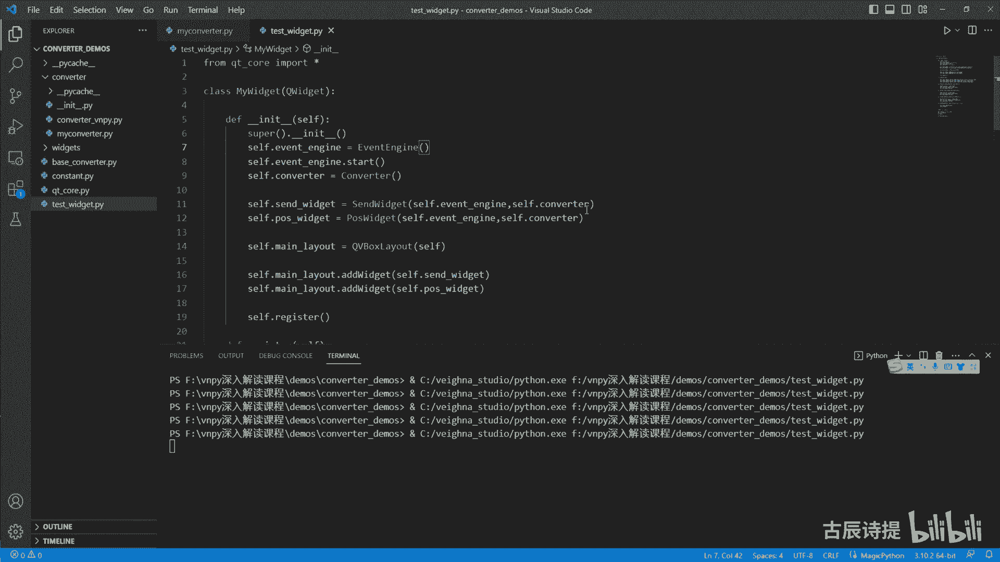

好比如说我持有的仓位，然后做冻结仓位呢，呃冻结仓位就是数量是五首仓位，然后佐仓是三首啊，座舱是三首，我放进去五首三首是吧，然后经仓是两首，然后呢我要平仓啊，比如说我要卖麦开麦开仓麦是shirt吗。

开仓卖开仓，比如说我要卖开仓五手，卖开仓五手，我采用的是进仓模式，我如果说不采用进仓模式的话，咱们可以看一下啊，它转换成什么呀，转化了之后它就是空开吧，对不对，好，我给他拒单，如果我采用进仓模式呢。

咱们看一下，装一下它，它是不是就是两个了，咱们捋一下啊，迈开仓进仓模式是应该什么啊，应该是先平左是吧，再平均，是不是我再给他先拒绝了啊，如果说我迈开仓六手，是不是就是先平左，然后还不够，再平均还是不够。

还剩一手，还要开一手多大啊，不是再迈开一手对吧，好我进行一下转换啊，啊我先把这个先去单了，转换它是不是就应该成三个了，第一个应该是平足，第二个应该是平均两首还差一首，然后再空开一首吧，是不是。

那就说明这个没有问题了吧，包括他的这个仓位的冻结也也有了吧，多仓冻结啊是吧，多就是多单冻结五手都被冻上了，对不对，是不是这个就没有什么问题了。

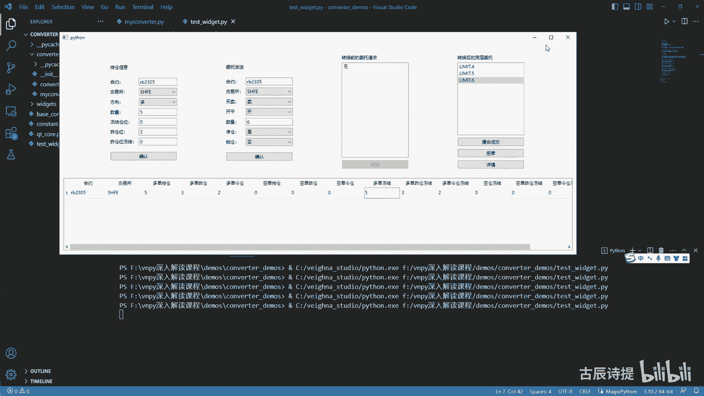

好那咱们下面就应该讲什么了，锁仓，首先咱们需要说一下这个锁仓他是为了做什么，锁仓，其实它就是为了避免平均惩罚，对不对，就是如果说有一些品种呃，平均仓他的手续费比较高的话，你平均仓就不划算了。

比如说像中金所的一些品种，那你避免平定惩罚就是不平均就可以了，对不对，就是不要凭经仓，那你就是平仓，只能是平座舱，要么是开进仓，对不对，要么是开进仓，要么是平左仓，那肯定是优先平左仓，把左仓给平掉。

佐仓平掉之后，然后不够的部分再开进仓是不是就可以了，它其实和NT是呃有本质上的区别的吧，NT就是进仓模式就是我不管你是开还是平，我就是最终我是按照我现有我现有的持仓，然后进行操作。

然后不管是平左还是平均啊，然后还是开仓，它是按你的进场进行操作的，但是锁仓的意思是什么，我避免平津就是永不平静不平津仓对吧，然后我做的平仓只能是平座舱和开机舱，那这个里边其实需要转换的是什么。

就是把平静的仓位，然后把它去转成平仄和开镜仓的仓位，是不是就可以了，其实还是主要的是改这个offset嘛，是不是好，那有这个逻辑，其实咱们写就简单了，之前有这些经验的话，咱们再往下写就简单了。

那从这需要注意的啊，就是说这个呃它的一个优先级，你像这就是咱们是if not net and not lock and是吧，这个是在这个里面的，其实如果说是进仓的话，进仓是不是优先级在它上面。

如果是进仓操作的话，你就没必要去考量什么了呀，就没必要去考量这个，他是不是在这个上期所和上新能源了，因为咱们进仓操作里边，是不是给他单独去处理了上期所和上汽能源啊，就是说这个放在前面。

然后这呢可以给它加上AE，然后这个这个return这一块我就可以把它删掉了，同样的，我这个锁仓锁仓，是不是它的优先级要比进仓要高一些，就是如果说我是锁仓的话，我就可以不用去考虑进仓的问题了。

因为我这我这个锁仓里边，也肯定得必须得单独考虑，这个上汽所和上汽能源的这个他的这个呃，这个平仓的规则，对不对啊，所以说它的优先级就应该这样的，就是先判定lock，如果说不它不锁仓，然后也不是进仓。

然后最后再看看他是不是在这个LEF啊，然后再看看他是不是在上新能源和这个，上期所里边啊，就是说如果还不是的话，就是最后就是蹭一个，就是这个IEQ直接给他返回去，是不是就可以了。

比如说你像有一些你既不是锁仓，又也不是进藏模式，然后比如说我要呃，也不是在上新能源和这个上汽所里边，是不是我直接就把他这个IQ给他，返回回去就可以了，是不是啊，好同样的hold点什么呀。

就是converter com v呀，We are luck，把这个IEQ给他传过去吧，同样的把它复制一下，到它这个下面来，我去实现一下他的这个方法，先给他拉下来，我就给他收起来啊。

这样对齐不会出问题啊，这写上DF，然后这self iq是什么呀，Order request，那第一步应该是做什么呀，咱们是不是判定他就是说他做仓可用仓位啊，咱们得得到它座舱可用仓位是吧。

所以说咱们得看一下IQ点，direction等于等于direction点浪，如果说是这个多方向的话，多方向你开仓其实就是你还是得把它转成，就是先把佐仓先平掉，我开仓是多，那就是转的话。

我是不是就是把空仓平了呀，所以说你得看他，就是说yd就是昨日的可用仓位是吧，variable av AI o AI o av21val应该是等于多少，cf点YD呃。

这个shirt y d减去cf点shirt y d frozen吧，这是佐仓可用吧，然后AEIQ点direction等于等于direction点shirt，如果说你是空方向，不管你是平仓还是开仓。

是不是我应该先把就是说这个多仓给平掉了，是不是就是昨天的多仓，也就是lg y d减去cf点lyd frozen，这个就是佐仓可用啊对吧，然后佐仓可用，然后就可以先去优先平座舱，如果座舱不够的话。

咱们再反过头来再开机舱，是不是就可以了，同样的我也还有一个volu left，等于什么呀，IQ点volume好，IQ点volume，然后呢我先平仓平仓，第一个我要平的肯定就是做仓。

那我还是就是一副这个y d available大于零，如果座舱可用的仓位有的话，然后我这个平的仓位是多少啊，volume等于这个应该是取个小小值吧，就是y d available和我的这个IQ。

或或者说我的这个volume left就是取一个较小值，就是我的佐仓可用，和我的就是说这个需要平的仓位取一个较小值，然后呢我这个close呃，IQ应该是等于copy一下这个IQ。

然后把这个close iq点，它是什么呀，这个offset等于我给他改一下吧，等于如果说他的这个offset，如果说它不是上期所和上新能源的，我是不是给他直接就close就可以了，是不是啊。

直接就close就可以了吧，啊如果说是上新能源的话，就是说呃AI就是这个一副呃，这个close iq点这个exchange not in这个列表里边。

这个exchange第2SHFE和这个exchange点RNE对吧，如果说不是的话，就是如果说是这个上期能源和上期所里边，它是不是应该是改成offset点close啊。

不是这个clothes yesterday，对不对啊，是这么个逻辑吧，这个代码我觉得没有问题啊，没有问题，然后close iq点volume应该是等于这个volume吧，对不对，这个你一定要捋清楚了啊。

你想想如果他这个不管，你是就是说比如说我本来是开场，然后开多单开多单，我先看看就是说佐仓的这个空单是不是有，因为你开多单，我先把这个空单给平掉嘛，所以说我还是得是先是先平，如果说我座舱没有的话。

我下面是不是直接就开仓了，是不是啊，然后我这个在前面是不是得有一个这个iq list啊，我给他写一下啊，IEQUST等于写全了吧，UST等于一个这个，然后这个我需要改的一个是它的这个数量。

一个是它的这个offset direction，就是它的这个方向，我不用管吧，因为这个上面我已经就是辨别了，如果说它是多，我就用这个空档，如果说它是空空方向，我就用多胆。

是不是这个逻辑一定要好好捋一捋啊，然后我把ie q list点IPAD，把这个什么呀，把这个close iq给它给放进去，然后呢，我同时要更新一下这个volume left。

volume left应该是减等于什么呀，减等于我的这个volume，减等于波浪吧，就是我评了多少，就是我先得把它减等于它，然后我再进行判定1volume left，如果大于零的话。

还是就是之前左仓平的不够，那我就得去用金仓来开，是不是，那这个volume其实就是说你最后的这个volume left，我都得放到这个开仓里边，所以说iq open iq等于copy一下。

把这个IEQ给它放进去啊，然后open ie q点offset等于这个offset，就直接是点open了吧，直接就是开仓了吧对吧，然后open这个IQ点volume应该是等于什么呀。

应该是等于volume left吧啊然后ie q list append什么呀，就是说这个open iq open iq，然后我最终我return一个这个呃iq list吧。

啊这个两个if你不能把它改成air if啊，因为if如果说if和AF连用的话，它只会执行其中一个啊，它只会执行其中一个，这个是Python技术，它只会执行其中一个，你像我这种写法是什么呀。

你有可能执行第一个，你也你也有可能执行第二个，你也有可能执行完第一个之后再执行第二个啊，它是一个顺序往下走的这么一个逻辑，但是如果说你用了AREF，你就像这个他只会要么执行上面，要么执行下面。

要么就是都不满足条件，两个都不执行啊，你一定要把这个其实Python基础很重要，虽然很多时候你学这个Python技术，好像就是呃就是很枯燥，但是它其实很重要的，好吧好。

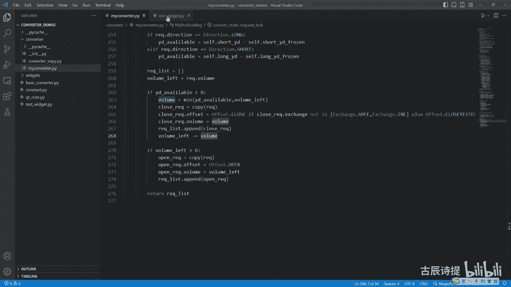

那咱们就再来去演示一下，好同志。

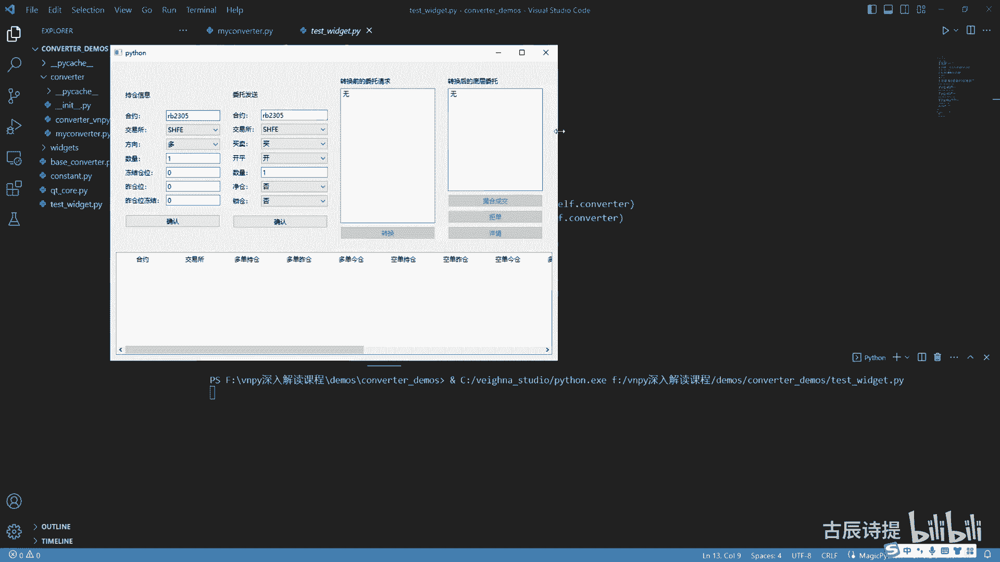

咱们同样的啊，就是它是一个呃，比如说因为咱们要测他的这个锁仓嘛是吧，我就持有多仓三手，然后佐仓呢我给他写成两首，我给他就是发过来，就是多仓三首座舱是有两首啊，两首呃，多仓这个金仓是有一手。

这个时候呢我要什么呀，比如迈开迈开30，迈开三首，我用什么呀，锁仓模式点击确定，然后转换一下它就是两个了吧，从咱们逻辑来说，应该是先平佐仓，佐仓是两手平掉之后，我再开京仓的一首多一首空仓是吧，你锁仓嘛。

我迈开嘛是吧，就是说我卖开三，首先凭两手座仓，因为那个手续费便宜，然后再开一手经舱的啊，这个空仓我不能平静仓，是不是，所以说你第一个应该是什么呀，应该是平左是吧，平左，然后呢你第二个应该是什么呀。

就是空开吧，空开一首是不是好，我把它给锯单锯掉啊，去掉，这个时候呢我换一个交易所，比如换成CCCE啊，这个然后呢我把这个也换成CCCE，然后我同样的是迈开散手，就是进行了转换，它也是两个是吧。

第一个是空瓶两手吧，其实这个平的就是座舱，是不是啊，然后这个就是说空开是经常虽然平仓，你像这个别的交易所没有指定，我非得平左什么的，但是它默认的是什么呀。

这些交易所他没有指定你直接一个close过去之后，它默认是优先平左，就是先评老的仓位，是不是，这样的话是不是就没有问题了，但是这有个问题啊，你会发现他这个呃单子没有冻结，你按说你单子发过来。

我这就是说两手多单，我应该冻结这个多单是吧，我记我应该把这个冻结两手多单，把佐仓给冻结住，是不是啊。

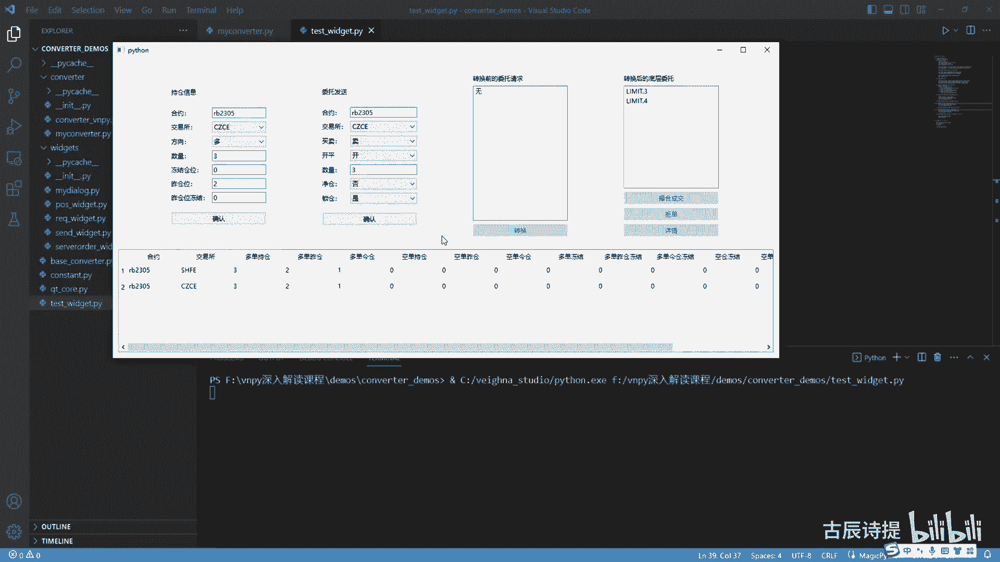

这个原因呢，是之前咱们写的这个代码里边有错误，有什么错误呢，就是在这看见没有，就是order的direction等于offseat clothes。

应该把O的点offset等于这个offset点close。

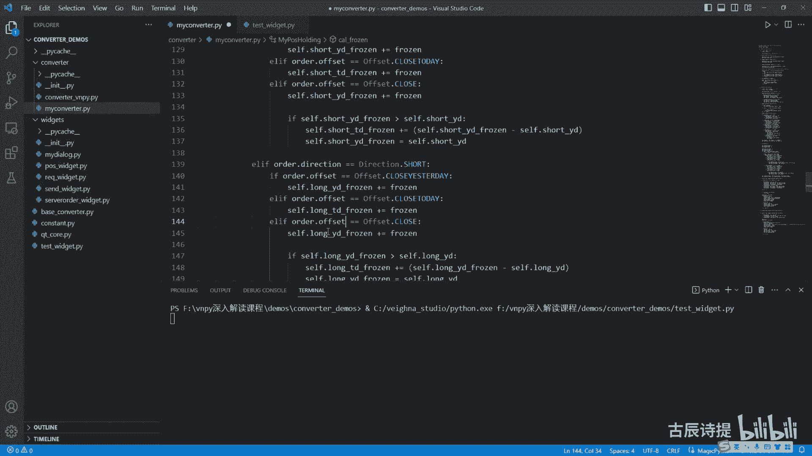

如果这样的话，咱们记住这个咱们说的是CCC是吧。

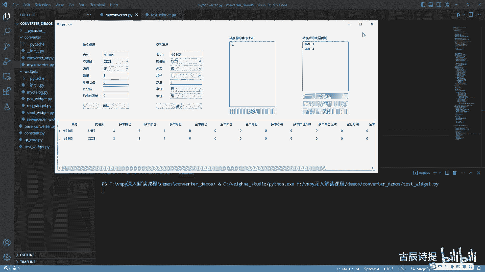

咱们把它给关了，关了之后呢，咱们再给打开。

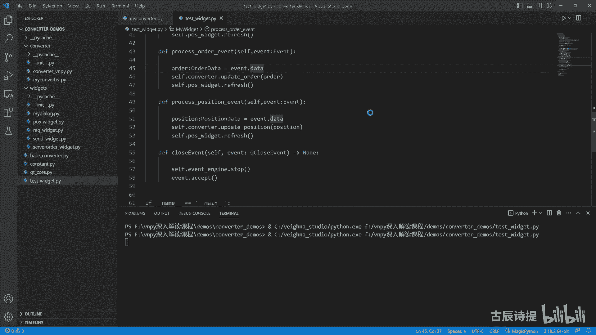

打开之后同样的咱们是因为没有这个品种啊，CCC咱们就是演示嘛，比如说数量三座舱是二啊，C s c e，然后应该是麦开麦开三手，咱们用锁仓锁仓，先点击这个多仓三手多单佐仓两手多单一手。

然后点击确定它是不是要进行转换呀，是不是转换成两个，第一个就是平嘛，就是空瓶两手其实是是平的，是佐仓嘛，然后第二个呢是开空，开一手就是开的是金仓，你想这个时候就会出现这个多单冻结，两手也是冻结的是佐仓。

多单座舱冻结，对不对啊。

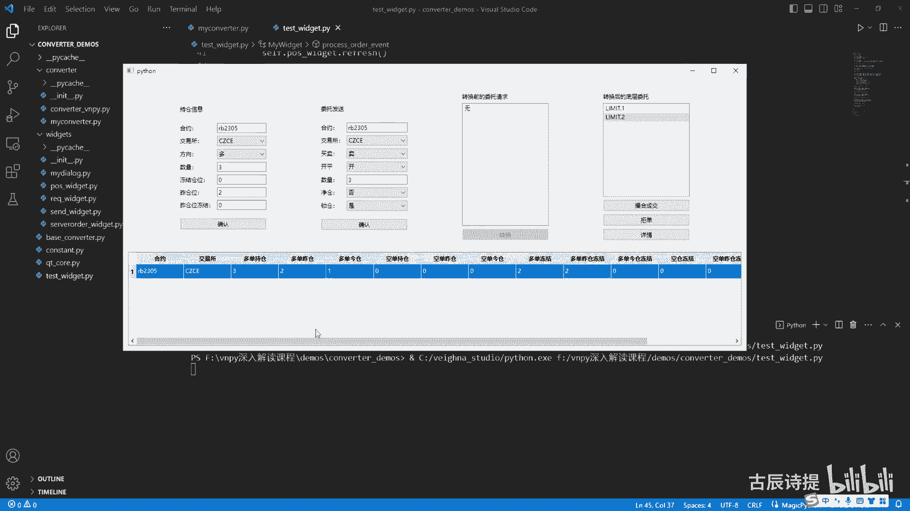

这个呢就是锁仓，那这个转换器呢，咱们就基本上到这为止就讲完了，这个里面可能也会有一些其他的错误啊，就是说我会把这个源码给大家呃，最关键的是你要理解它，就是很多时候你自己单纯的去自己去看。

这个东西好像显得很复杂，但是其实把逻辑给理清就理清了之后，你会发现很简单，咱们最后再写这个lock的时候，锁仓的时候，你会发现很容易可能在前面刚开始写的时候，你像这个转换上期所的时候还简单一点是吧。

因为它只是需要把它平仓转换成平仄和平精，你会觉得可能不是特别能理解，但是到写完咱们的进仓模式，进仓写完之后再写锁仓，你会发现锁仓啊就没有那么难了，你只需要知道它最终是为了要什么，然后你把它给嗯。

就是这个逻辑进行不断的去转换啊，然后挑一个就是相对比较简明扼要的逻辑，去把它给写出来，一开始你想不到没问题啊，因为我一开始在写的时候，我没有看源码，然后我在想转换器如果是我自己来写的写的话。

应该怎么去写，就是一开始捋的时候也捋的不太清楚，但是你慢慢的再根据他的这个源码，然后你再去捋，你会发现呃，这个文档这个平台的确是，他把这个源码还是写的相对比较简单的好吧，那这节课呢咱们就先到这儿。

下一节课咱们看一下伟大平台，这个转换器究竟是一个什么样子的。

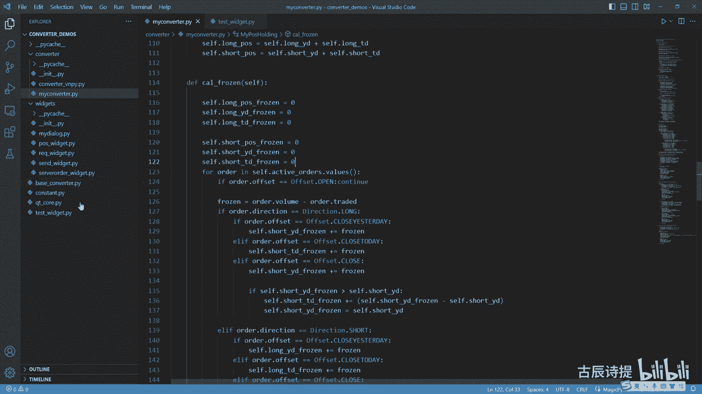