# 第2节课 脚本语法及行情走势图 - P1 - 古辰诗提 - BV1Ai421D7ZD

欢迎大家来到从零开始量化系列课程，MC课程的第二节课，上节课呢给大家简单介绍了一下，这个MC这个软件的基本使用，一定要去熟悉，其其实里面的内容还是特别多的，你要慢慢的去摸索，咱们最多的。

最重要的给大家讲的，还是如何去写咱们的这个策略对吧，如何去写代码，这边呢有一个就是课件，这个后边呢就是后面每一节课，我都会接着往下写，最后也会给大家打开这个课件的。

这个就是就是方式呢我是用的这个type a，就是它是点MDMD就表示就是markdown，其实就是笔记的意思啊，TPA是一个软件，现在好像是收费了，我这有一个就是应该是可以就是安装不收费的。

当然可能就是里边的某些应用被阉割掉了，呃，不完全保证啊，如果有需要的话，可以问我要一下，这个课件也会给大家，如果有需要的话，也跟我要一下好吧，然后咱们上一节课呢做了一些简单的介绍，就是使用时间的。

没有说一个月行情数据呢应该是5年分钟数据，10年日线数据，一年tick数据啊。

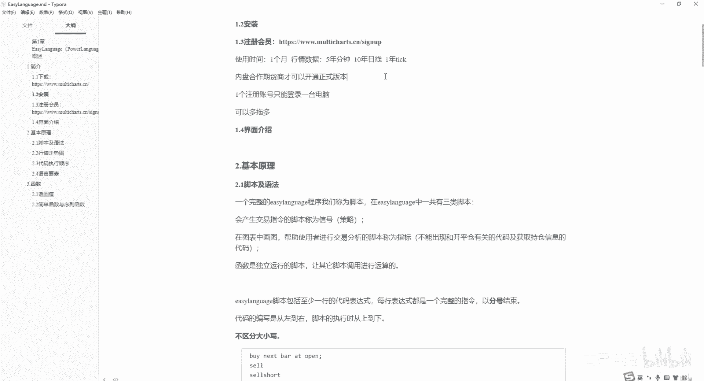

这个里边也是可以去加载这个数据的，咱们设置商品，这然后把这个一日改成etc啊，然后咱们把时间把时间设短一点啊。

从11月吧，也是这也是有七个数据的。

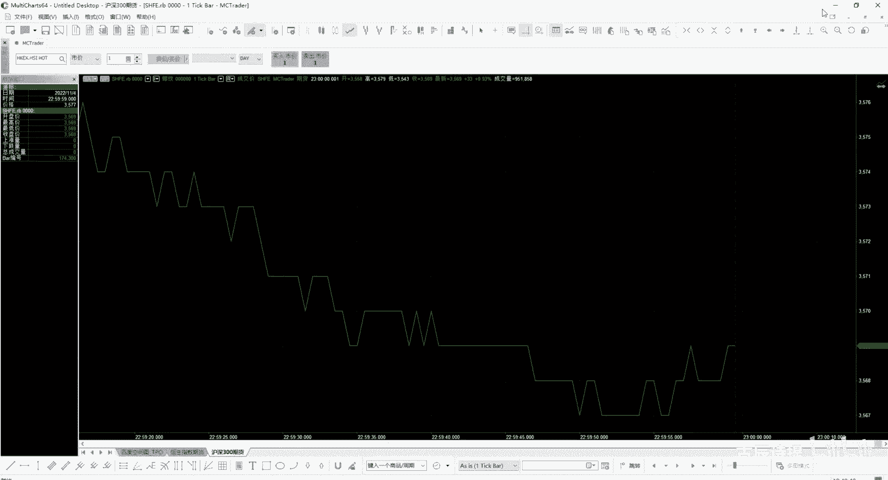

不一定准确啊，以前我觉得好像是比这个长，但是因为为了要讲MC课嘛，然后我这几天也看了看，我发现这个分钟数据没有我想象的那么长啊，大家可以去看一下，去拉一下有没有这么多，但是这几年的数据其实也够了。

另外一个内盘合作期货商才可以开通正式版，这个上节课跟大家说了，你一定要注意你的期货商，他是不是就是说跟他合作的一个内盘期货商啊，然后一个注册账号只能登录一台电脑，也说过可以多多多，什么意思呢。

就是说如果说你开通正式账户的话，你可以要求我这一台电脑上，就是或者说我一个账户下面可以挂多个账户，就是在一起显示，当你点击这个交易总管的时候，可以把所有的每个账户的持持仓。

以及它的这个资金情况都会显示出来啊，功能还是非常强大的，包括咱们再用这个投资组合交易的时候，你也可以，就是说每个策略都可以单独设置，它运行的这个账户啊，但是如果说你多拖多了，就是挂在一起了之后。

你就是别的账户还是不能在别的电脑上去登录，因为它默认就是你这个几个就合一了，嗯就是嗯我们曾经也想过，我多开几个账户，然后挂在一起，然后另外多出来的账户我就可以去进行回测呀，模拟交易啊什么的。

嗯还是不行啊，后来我们迫不得已又开了一个账户，他要求是一个月，你最少有一笔交易，就他就不会给你注销掉，就是只要一个月有一笔交易就可以，他的收费我们是开的这种最基础版本的。

就是只能是一个电脑去登录一个账户，然后他的收费是你交易的时候，多交20%的，这个手就是这个手续费吧，上节课好像也跟也跟大家说过，如果说你一手螺纹是三块钱，可能得交三块六呃，就是多交六毛钱给这个MC啊。

这就不多说了，基本介绍也给大家做了一些简单的介绍，经常用的也说了，咱们接着往下走啊，基本原理，脚本及语法，一个完整的easy limit程序，我们称之为脚本，就是咱们给大家演示的这个公式编辑器里边。

其实不管是函数指标还是信号，它都被称之为一个脚本，比如说一个这个它就是一个脚本，哪怕里面只有一行啊，当然这个比较少，一行一行我就不找了，肯定是有一行的代码的，它也被称之为一个脚本，脚本呢一共分为三类。

就是会产生交易指令的脚本，称之为信号，就是交易指令，在这里边就是说有哪些呢，就是这个信号里边它会有这个buy sell，还有by to cover，还有这个sell shot，就这个是交易指令。

当然是在期货里边啊，在期货里边就是by啊，这个这个下面有啊，就是这几个就是by sell sea shirt，bite cover by买入sell平多仓，sea short就是卖空。

然后bt cover就是凭空仓，你在这个信号里边就是有这几个，它就被称之为一个信号脚本嗯，第二个是这个指标脚本就是在图表中画图，帮助使用者进行交易分析的脚本，称之为指标，指标里边是绝对不能出现信号类的。

包括这里边有这个market position，Market position，就这个是来获取持仓的market position啊，你像这样的，是不能在现在这个指标里边去出去出现的。

同样的在信号里边是不能出现什么呀，像这个plot就是这个是用来画图的，像咱们在这个指标里面，因为指标主要是用来画图的嘛，随便打开一个，他肯定是有这个plot，Plot1，它就是用来画画图的，画图的。

这个是不是不能相互出现的，你先有这个印象好吧，你先有这个印象，我想把它给删掉啊，前有这个印象函数就不多说了，它是一个独立运行的脚本，如果说你有一对函数可能会被经常用到，比如说浮动止盈啊。

浮动止损啊什么的是吧，你像这样的函数，你可以给它单独写一个函数，就是然后你方便你调用啊，方便调用easy language脚本，包括至少一行的代码表达式，每行代码表达式都是一个完整的指令，以分号结束。

这加了这个重点，一定要以分号结束啊，比如说我写个代码啊，就从这儿就是用这个上面写的，By next，But open，另外它是不区分大小写的，代码编写是从左到右，脚本执行是从上到下啊。

By next bat open，其实咱们也很也很好理解是吧，买入在下一根K线bar就是K线的意思啊，把线嘛咱们被称为next bat open，就是在开盘的时候啊，在开盘的时候。

或者就是用他的这个开盘价，咱们可以把它复制粘贴过来，如果说这没有说没有这个封号的话，它编译是可以通过的，编译成功，因为你这个只有一行代码，你有没有封号没有问题，但是只要是你有两行代码。

比如说我从这儿没有写，我sl next bat close，哦漏了，先别先别管它是什么意思，咱们编译的话它是有错误的啊，有错误的，这个时候你需要加上这个封号，你再编译一下，它就编译成功了，为什么要编译。

跟大家解释一下，就是你写的这个代码，虽然跟咱们人类的这个语语言，尤其是英语很贴近对吧，By nebute open snebuclothes or lower，很通俗易懂，但是计算机的底层它是零和一啊。

他是不懂你这个代码的，你需要有一个翻译诶，给它翻译成底层，懂的代码就是编译，就是给它翻译过去啊，编译这也说明他是一个编译型的语言，像Python它是一个解释性的语言啊，你这需要一个编译器。

然后Python它是需要一个解释器，解释型语言啊，就是把你的代码解释给底给这个计算机，你这个是把它编译，就等于说我有本书，我直接把它全部给翻译过来，就是中文的翻译成英文，然后那个英文的就能读懂了。

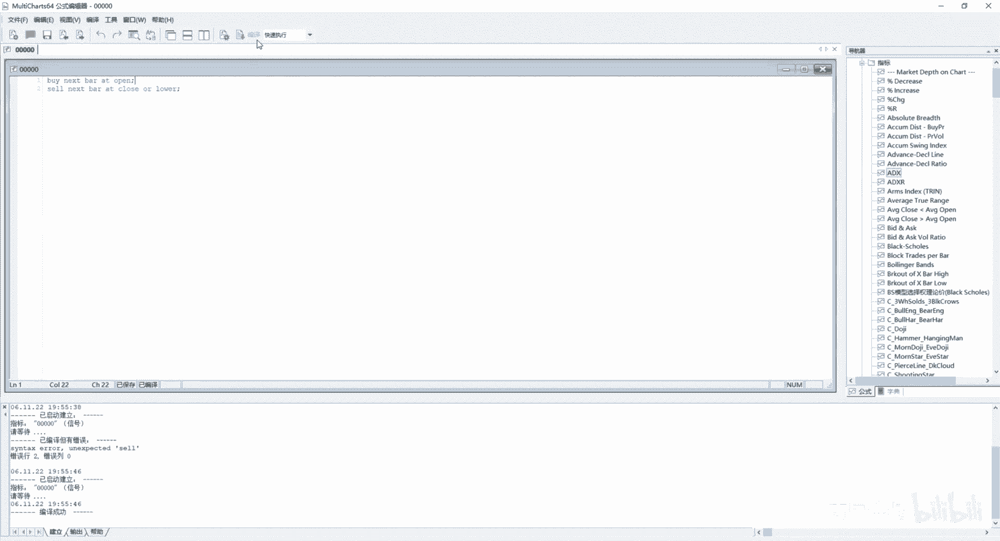

对吧好，这是编译的意思，咱们再再接着往下看。

不区分大小写啊，这一定要注意要注意行情走势图，一个价格序列包含一群特定周期，按照时间顺序所组成的价格点位，这个为什么要给大家讲这个东西啊，行情走势图，如果说你是做期货或者股票。

你对行情走势图肯定特别熟悉。

但是很多人他没有一个概念，这个行情走势图，我把它先设置一下商品啊。

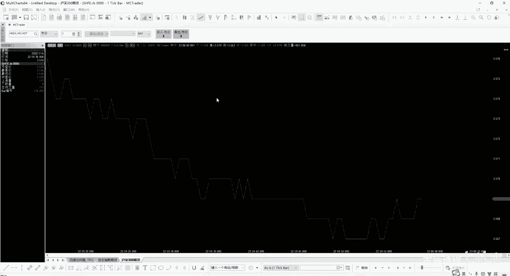

右击啊，都是右击，我还是把它设置成一日，很很多人对这个商品走势图，他就是理解的不深刻。

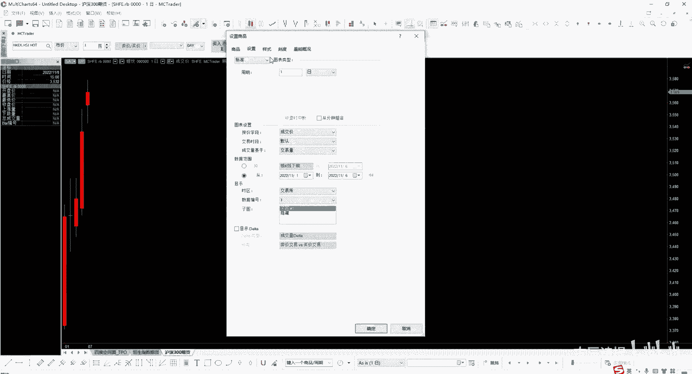

我在这给大家解释一下，就是30吧，就是30根跟大家解释一下，你每一根这个行情走势图，咱们来做量化的话，你一定要有这个意识，每一根都是计算机给你画出来的，就是给你画出来的，他通过什么来画呢。

就是它的数据来画高开低收，左边这高开低收，它里边还含着什么数据呢，日期时间就是这个价格价格，还有这个总成交量大的编号上涨量啊，这个里边其实就存储着一堆的数据，你一定要理解这个一堆的数据啊。

每一根都是不一样的数据对吧，它是怎么来执行的呢，就是这个咱们就是从上到下。

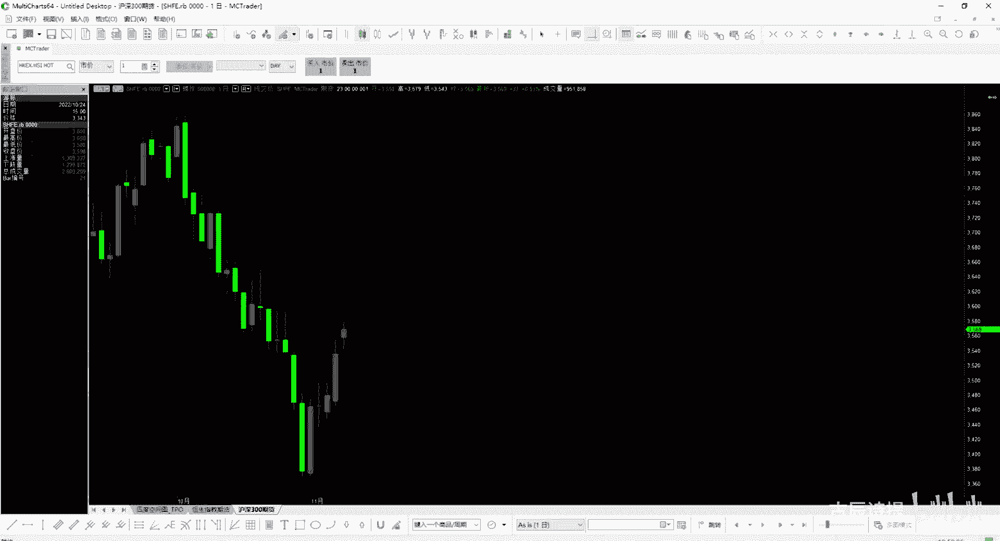

从左到右啊。

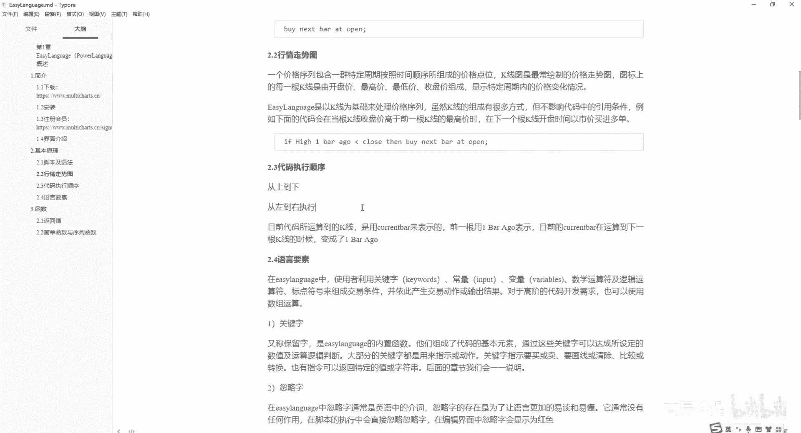

就是这个需要跟大家解释一下，你像咱们写的这个代码。

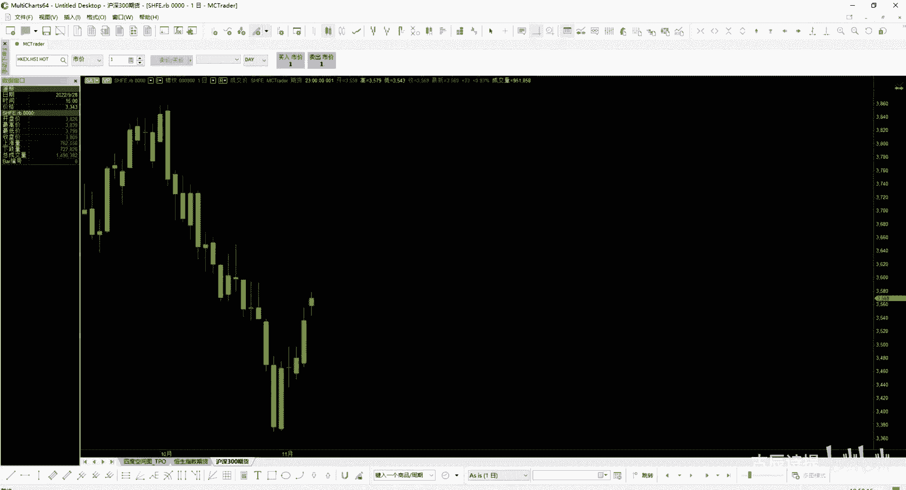

其实就算是一个信号了对吧，你里边有开平仓，然后你也编译成功了。

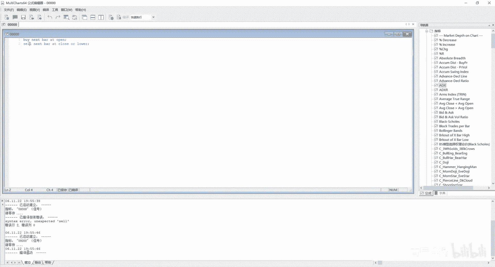

其实就可以加载到咱们这个图表上了啊，咱们可以插入。

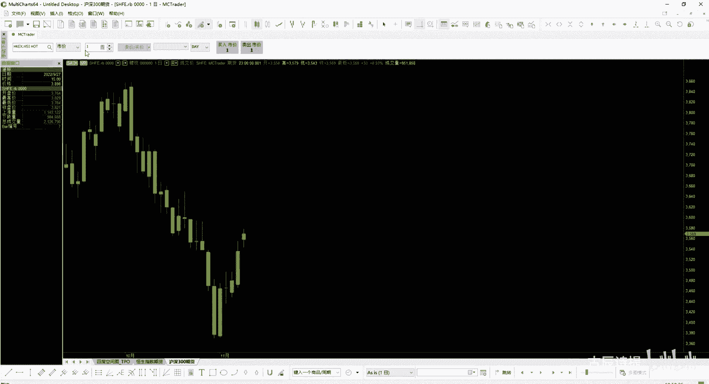

从这插入应该是信号对吧，它是一个信号，编译过了，它的名字是几个零。

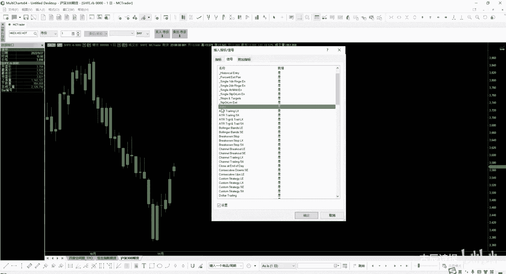

是吧，我点击确定，然后加载进来，我close你会发现它没有反应。

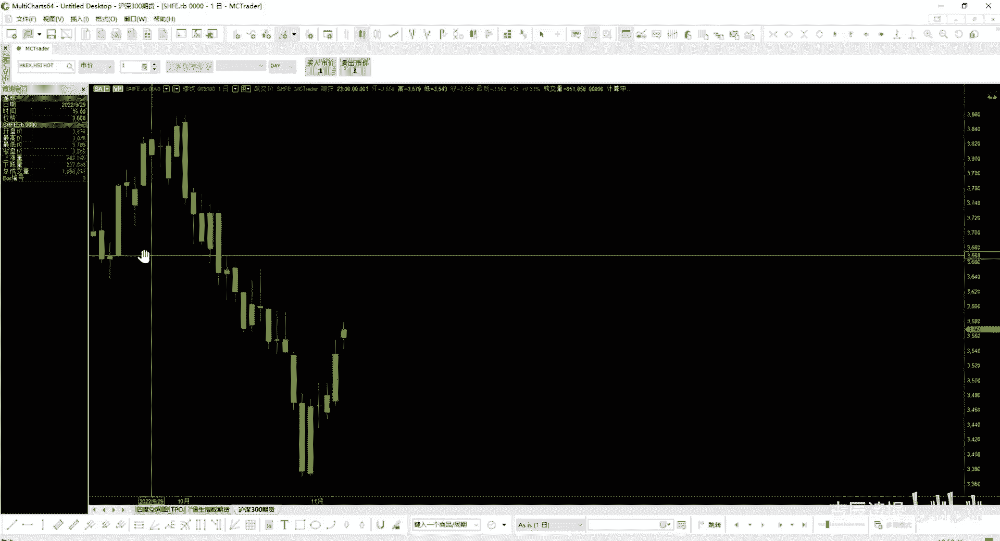

对不对，因为是这个是这个咱们这个数据太少了，你这个时候需要设置一下信号，然后从这点击一下属性啊，这个里边会有一个指标运算参考的最大bus数量，这是什么意思啊，它默认是50，咱们这总共也没有50根K线。

所以说它不会有交易的这个参考吧，是个什么意思，就是当你去计算，比如说我的指标需要计算30日的均线，你最起码得有30日的这个数值啊，对不对，你只有有了前面30根K线，你到第30根的时候。

你才能计算出第一个30的这个均线，然后到第二根的时候，到第31根的时候，我就把最前面那一根给舍弃掉了，然后计算第二根到第31根的这个均线对吧，你最起码得有29根参考爸爸，对不对，或者30根参考爸爸。

这样的话你才能进行计算呀，这个参考吧就是来干这个的，如果说我把它设成十的话，你会发现前十个参考吧。

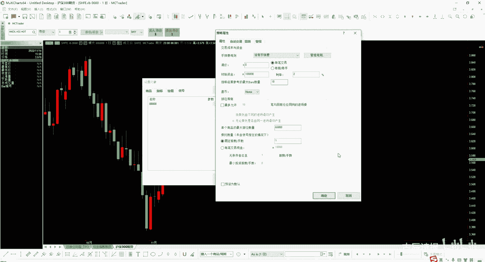

它是没有这个thereby的，对不对是吧。

如果说我设置这个信号，我把这个属性这个参考吧设置成五的话。

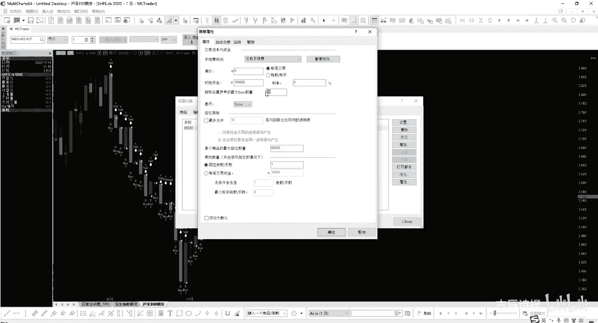

你会发现它是前五根，12345啊，前五根是没有的，到第六根的时候，它开始运行我的这个信号。

开始运行我的这个信号，它每一根它会执行一遍。

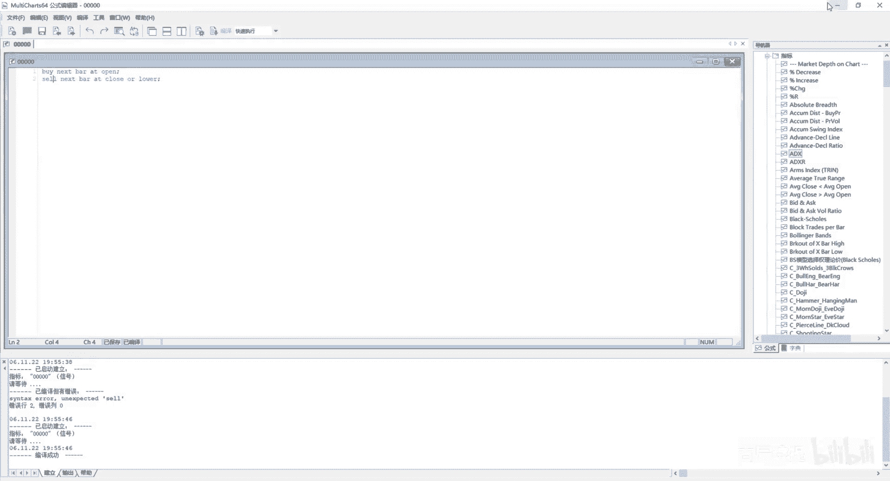

你写的这个代码，你看啊，到了第六位的时候。

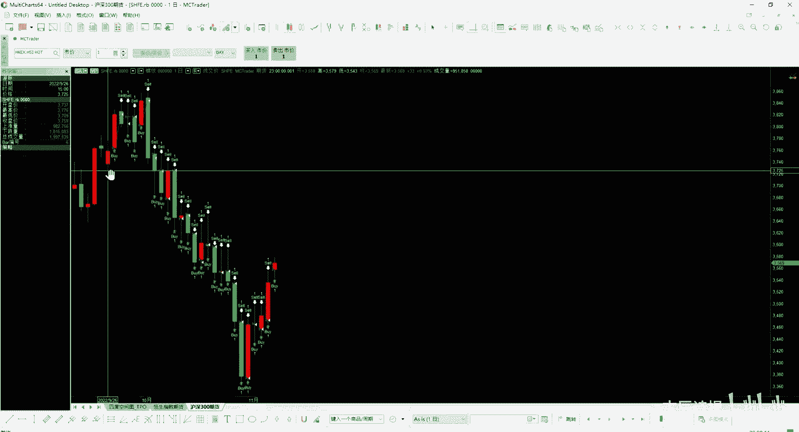

他执行了代码里面写了什么，By next by open，什么意思，就是在下一根K线开盘的时候我买入，或者说用开盘价买入啊，或者在开盘的时候买入，你会发现他在下一根他买入了吧，对不对啊。

然后他还有个什么呀，就是see next bat clothes or lol，什么意思，就是我从下一根K线我给它平掉，At clothes，就是用我的收盘价或者比他低的价格来平仓。

你看咱们到我把它给拉长一点啊。

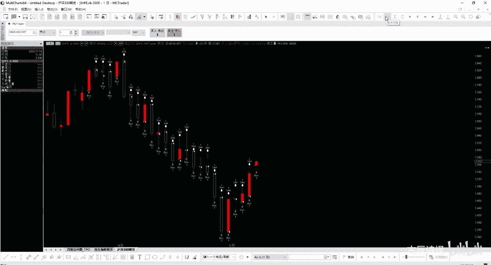

咱们到123456，第六根到这一根，因为前面五根是参考八，到第六根才真正的运行，我这个代码呢到这时候他从下一根开仓是吧，我买入买了吧，他从下一根平仓，为什么没有平呢，他说下一根平仓是以我的这个收盘价。

它的收盘价是在最上面吧是吧，收盘价咱们这有啊，是这个三七啊，咱们看一下是3759是吧，在这是3759，用3759的价格或者比他更低的价格，咱们看一下这根K线的最低价是3764，你可以看一下啊。

这根K线的最低价左边3764，因为我一动的话，它就那个什么他就嗯没有了啊，3764，他最最低价也没有达到他的这个开盘价吧，所以说他从这根它是平不了的，只有从这根平，对不对，只有从这根平啊。

然后这他没有开仓，因为有持仓了嘛对吧，他默认有持仓，它就不会再开仓了啊，默认有持仓，他就没有再开仓，然后从这一根，然后他又就是去buy sl，你看这个它就有了一个by excel是吧。

从这一个by excel，然后到这他就只有败了，为什么呢，因为它的收盘价是在这它的最低价没有比，它就是跟它相等，或者比它要更低。

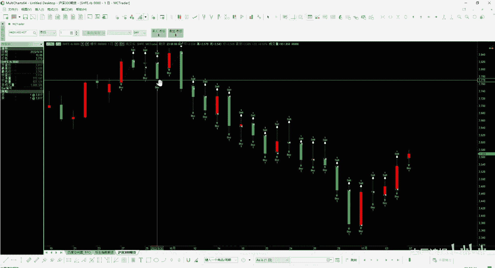

看这个逻辑都是很通畅的啊，很通畅的，它就是每一根K线它都执行一遍这个代码，每一根K线它都会执行。

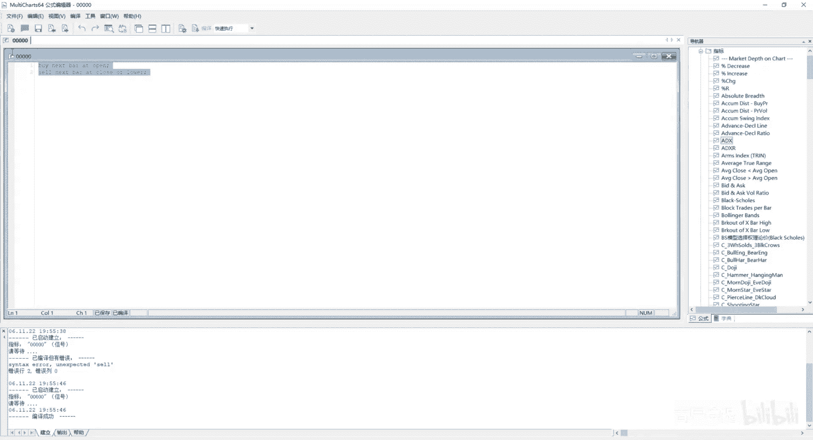

这边就是执行一遍这个代码的好吧，你一定要知道这个它的这个其实就是数据处理，即便你不是做期货的，你听了这个课，你做这个期权也好，你做股票也好，我相信你都能就是能写出来你的策略是吧。

当然策略和策略是不一样的，你做期货的策略肯定不适合做股票，对吧啊好这是很重要啊，这一点很重要，它的执行逻辑。

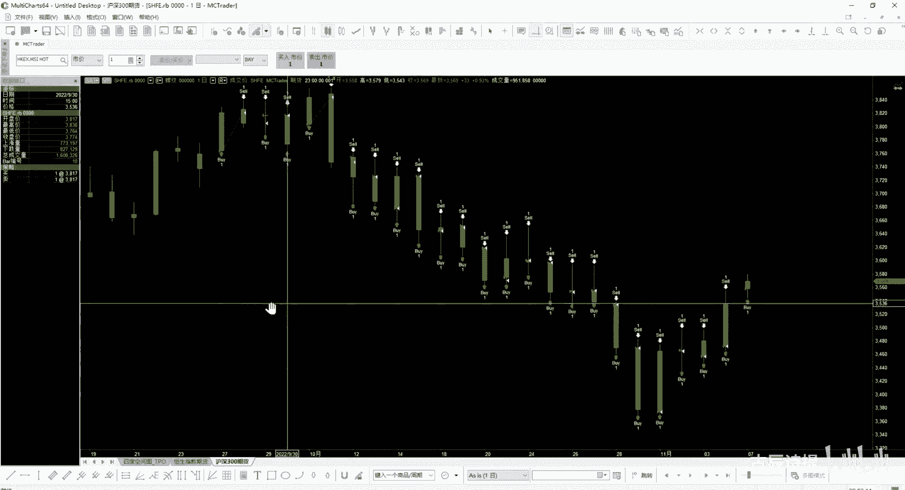

每根K线都会执行一遍，这个代码，所以说从你这个代码里边。

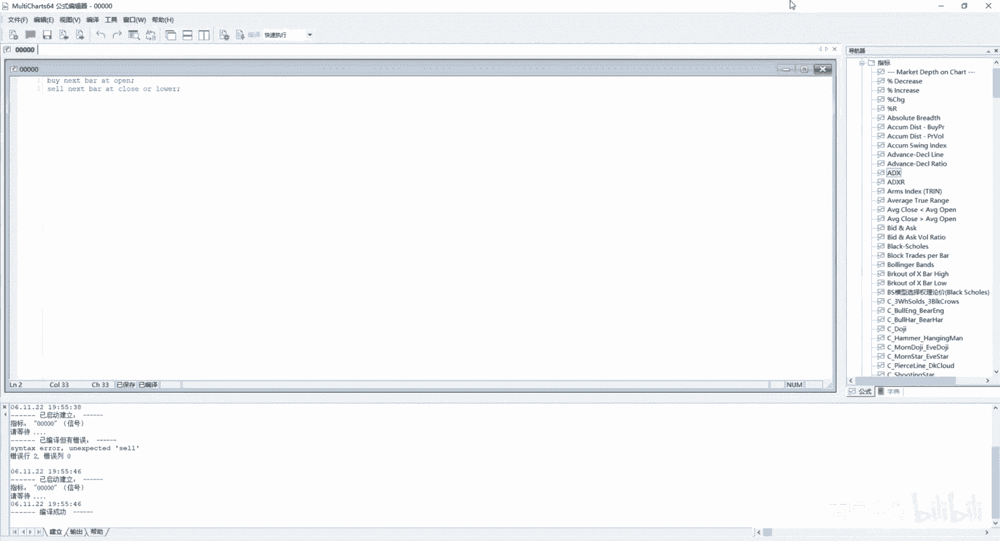

你一定要有这个意识，我每一根的时候我执行一遍。

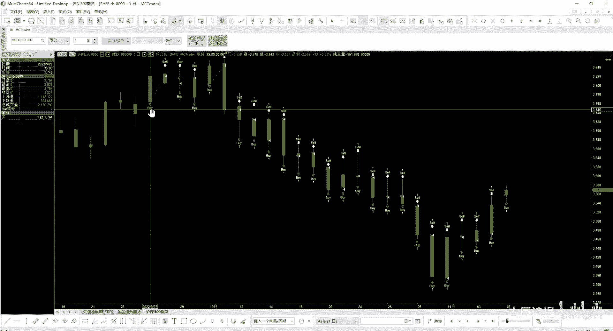

到这一根，它会有一个color bar，就是咱们这会提到的，就是就是目前代码所运算的K线，是用current8来表示的，一前一根用one bago表示，目前的color bar。

在运算到下一个的时候会变成one bago啊。

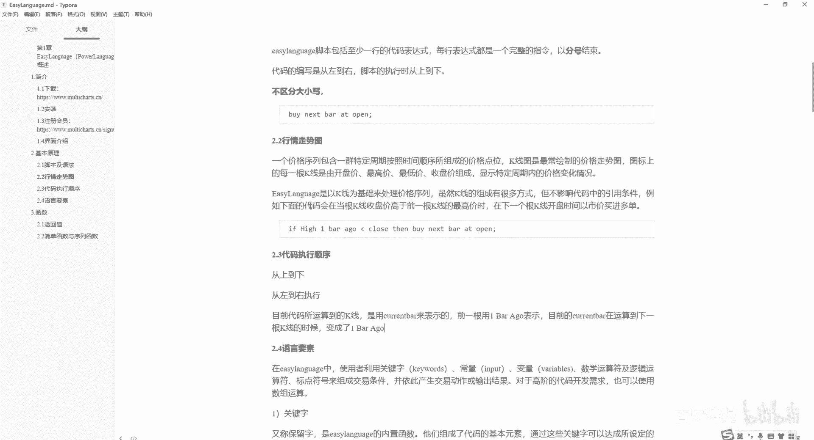

就是什么意思，就是我代码在运行的时候。

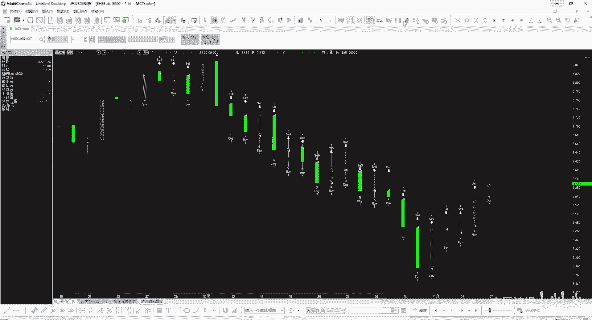

当我执行到这儿的时候，这是我当前K线，当前K线，然后这个就是他前一根K线，你如果说想获取他的这个收盘价，或者他的一些数据信息，你需要用那个one bago。

或者说用什么呢，这次也提到了用这个什么呀，用这个一个中括号啊，这没写到，就是用一个中括号加上你的这个偏移量，比如说偏一根或者偏移两根儿啊，就是什么意思，可以给大家演示一下，我先把这个代码先给注释一下。

他这个注释是用大括号，就是两边加一个大括号就注释了啊，我从这写什么呢，print print什么意思，输出的意思，我输出什么呢，Kn bar，我第一个参数我写color bar，Current bar。

然后里边输出的内容我加个冒号，里面输出的内容就是current b，这个是编号你第几根K线的意思，然后第二个呢我输出一个就是high，就是当前的这个K线的高点呃，我也给他注释一下啊，hi冒号。

然后当前K线的这个高点我直接用high来表示，然后之前一根K线的高点，hi王BGO，然后从这儿我也加上一个冒号吧，然后从这儿写，从从这写上什么呢，就是这个加上一个逗号hi，然后装扮阿狗。

或者说你直接用这个偏移的方式，就是中括号偏移加一，这样就可以了，给大家做一下这个演示啊，直接print这么几个数值，我进行一下编译，啊这个里边出了个逗号是吧，应该逗号放在这，诶不对，嗨啊。

这边引号这边少了个逗号，这边还得有个逗号，这个时候我再编译看一下啊。

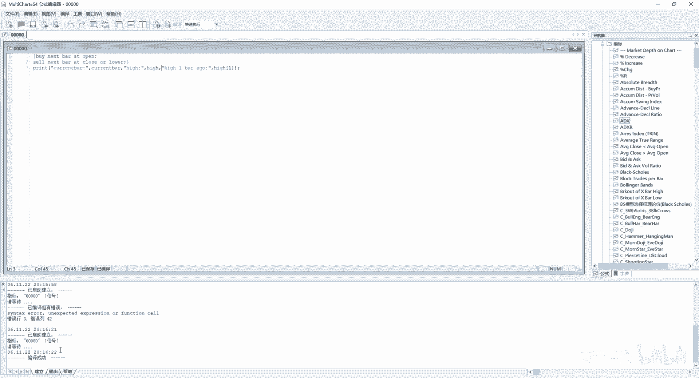

这个编译就没问题了啊，这个时候呢我用这个图表我运行一下，设置信号状态开启了，已经他应该就有输出了。

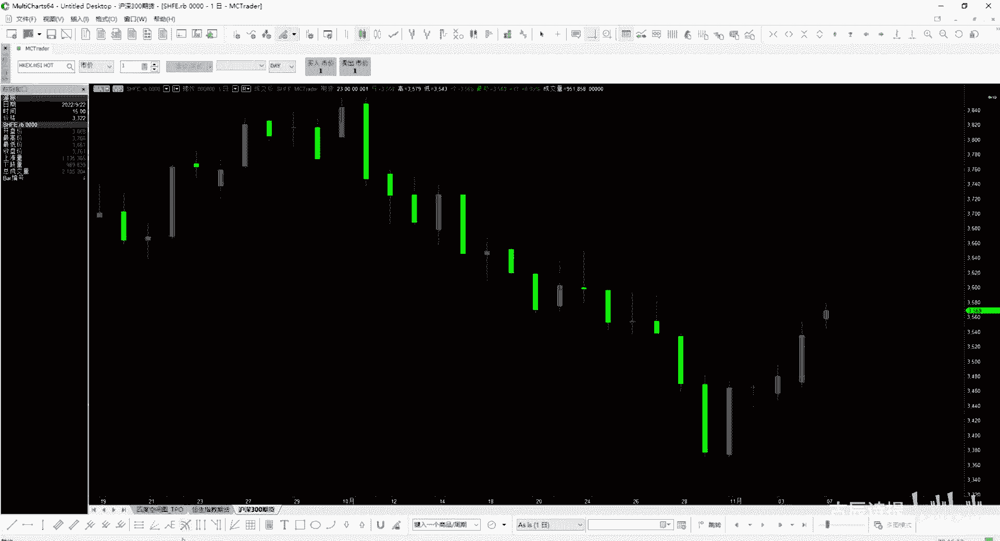

已经啊从这点击一下输出，你会发现就有了啊，COLOMBIA1啊，一它是1。00，也是代表1hi3776。

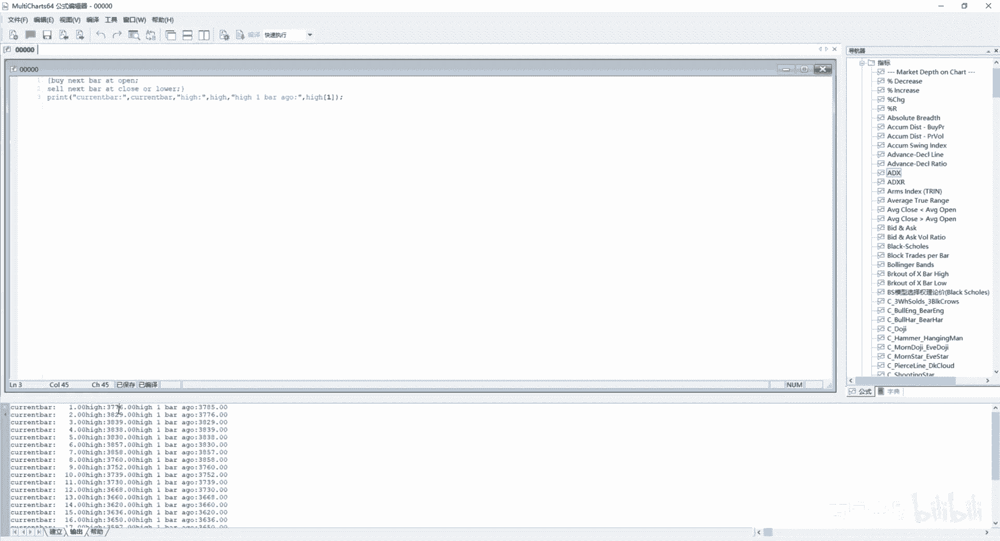

咱们之前说过他是从哪开始运行的，从12345，从第六根，它的当前K线的这个高点就是咱们看一下啊，他的这个最高价是3709，当前K线的是编码是13709。

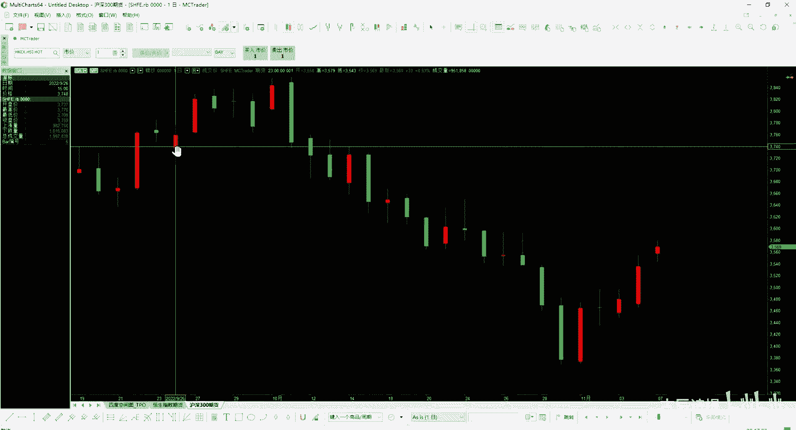

咱们可以看一下啊，3776，第一根K线是3776。

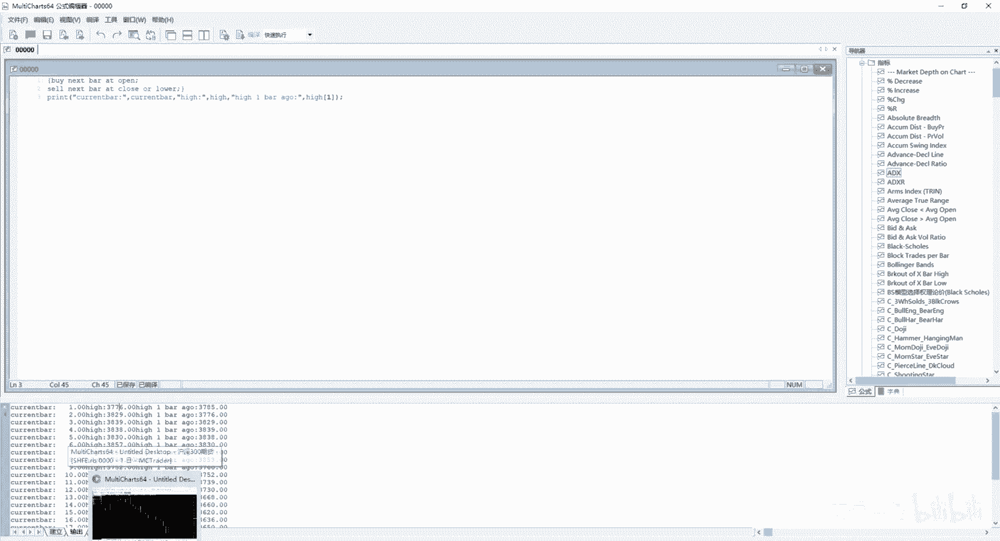

12345，3776，最高价是3776吧，最低价是3709是吧，你看一下这个左边啊，最高价是3776，最低价是3709，他的前一根K线的最高价是3785。

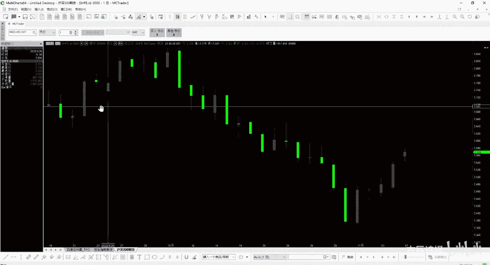

咱们可以看一下是吧，hi wbgo是3785，当然这个可能看的不太清楚啊，咱们给他当你从这加的话，你还得加个逗号啊，这个双引号，然后用空格给他空开，哎把这个复制一下看看吧，然后这个hi然后从这儿是吧。

给它粘过来，然后再从啊，这样就可以了，再进行一下编译，它就会输出出来，这样了是吧，KB这个是high，这是前一根K线，你看啊这个hi从你到第二根的时候，他high就变成3829了。

但是前一根是3776是跟这一样的，3829是跟这一样的是吧。

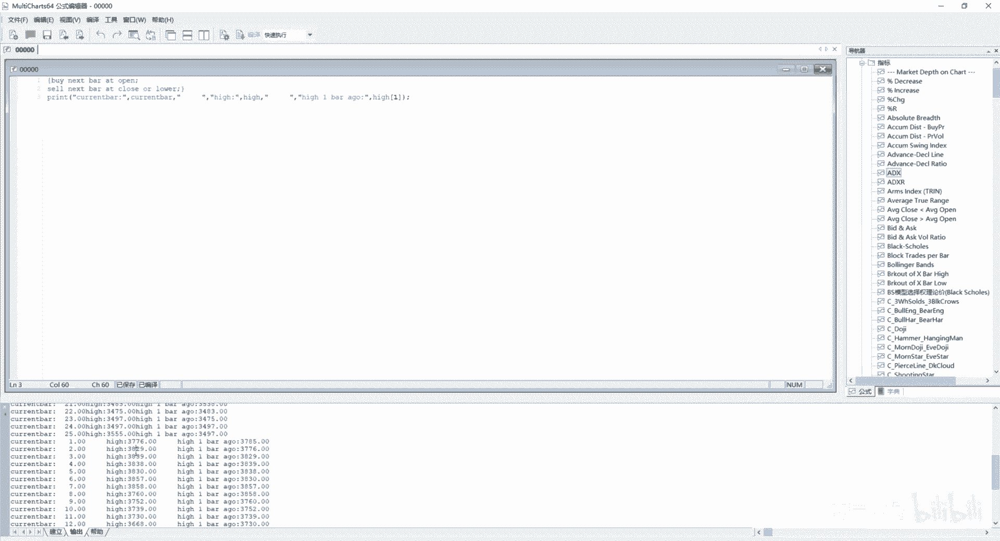

3839是跟这一样的，所以说它的运行的逻辑就是到当前K线，然后我这儿啊我到第六根执行一遍，第七根执行一遍，第八根执行一遍，就是每一根K线它都执行一遍这个代码。

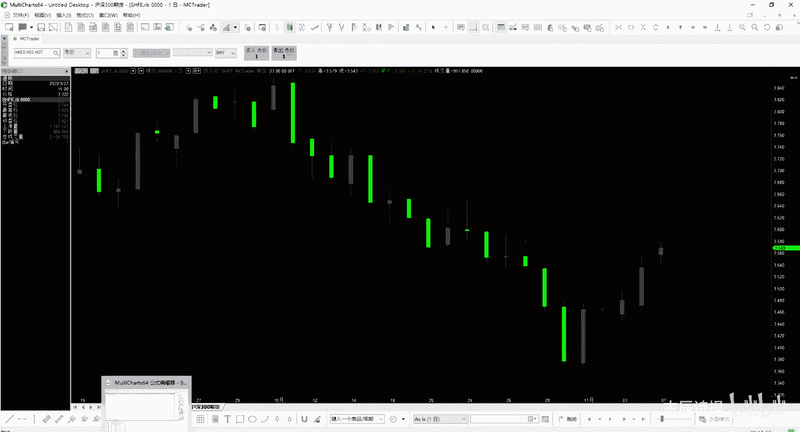

这就是它的一个运行的逻辑，你一定要清楚，咱们再看看咱们的这个markdown里边写了什么，行情走势图，每日K线由开盘价，最高价，最低价，收盘价组成，分别是开盘价是open，这都知道吧。

也可以用O来表示啊，O来表示，包括这个最高价，Hi，然后也可以用H来表示啊，包括咱们这儿，比如说我给大家演示一下，就是啊就是不要high了，就是H啊，包括这写上去前一格它你再进行编译一下。

它就会自个儿来运行，就会有了，是一样的啊，最低价就是low是low，也可以用这个L来表示，大小写都可以啊，收盘价是close，然后也可以用C来表示啊，EZ是以K线为基础来处理价格序列的。

虽然K线组成方式很多，但不影响代码中的应用条件，例如下面这个代码会在单根K线收盘价，高于前一根K线的最高价值，在下一根K线开盘价是以市价买进多单。

就是if hone bgo小于close them by next by at open，会在下一个K线开盘时间以市价买进多单，就是不管你是什么价格，他就买进去了。

就是咱们也可以看一下这个one bago hi one bgo，看看它是不是一样的，首先看编译是吧，编译成功输出也是一样的，他又输出了一遍啊，就是咱们可以把它右击清除全部，然后括号然后再回车。

然后保存一下，再点一下，它还是会输出的，one bar go和你那个中括号偏移是一个意思，是一个意思，代码执行顺序从上到下，从左到右，目前代码所运算到的K线是用CBA来表示的，咱们刚才也给大家演示过。

就是这个卡bu是吧，就是当前代码就是这个K线的这个编号，从一开始的一前面还是有这个参考八的啊，一定要知道一前面是有这个参考霸的，目前的CBA在运行到下一个K线的时候，变成了王8go，这个应该能理解啊。

后边说一下这个语言要素在easy limit中使用啊，这利用关键字keywords常量，input变量，Variables，数学运算符及逻辑运算符，标点符号来组成交易条件，并依此产生交易动作或输出结果。

对于高阶的代码开发需求，也可以使用数组运算，数组运算是一个坎，如果说你能把数组运算弄明白了，其实很大程度上，就是你这个就已经学的差不多了，别的就是你知道与不知道的问题，有很多的就是说你知道就可以了。

尤尤其是很多的单词是什么，你知道就可以了，但是数组运算这是一个坎，你一定要把它就是说给搞明白了，数组是个什么东西，首先说第一个关键字又称保留字，是easy lambg的内置函数。

它们组成了代码的基本元素，通过这些关键字，可以达成所设定的数值及逻辑判断，大部分关键词都是用来指示或动作，关键字只是要买或卖，要划线或清除，其实关键字就是什么呀，就是你可以把它理解为就是呈蓝色的字。

它都是关键字，包括比如说by，我写个by，它是蓝色吧是吧，我再写个cl，它是蓝色，Cr shot s e l l s h o r t sea short，它也是蓝色吧，by cover是吧。

它会有代码提示，包括print呃，还有什么呀，plot是吧，它也是关键字，就是代码呈蓝色的，你可以把它理解为关键字好吧，我把它用大括号给注释掉，忽略字在easy language中就其实就是介词。

然后它会显示为红色，就是有它和没有它其实是一样的，这个a n at by当然就是只要是显示红色的，它就是忽略字，咱们可以看一下之前写的这个代码，就是其实也是有这个红色的啊，我先把它先给注释一下。

注释除了要用大括号，还可以用这个呃，双斜线可以注视你，这个时候at有at和may at其实是一样的，都可以的啊，我把at给删掉，咱们编译一下，也可以编译成功的，同时加载的这也是一样的是吧。

就是只要是显示红色的，它都是关键字，就是为了加强你的这个理解的，加强你的这个理解的，比如说我把艾特给放进来，就是at就是在这个收盘开盘的时候，At close。

就是用这个close这个价格或比它更低的价格啊，这个这个其实没什么太多的好讲的好吧，就是忽略子，只要是显示是红是红色的，它就是忽略子数据类型比较重要的一点，easy levage中一共有三种数据类型。

可以使用数值字符串和布尔数字，数值字符串和布尔定义成数值类型或变量，或者参数啊，可以直接进行赋值操作，这是什么意思，就是数值咱们理解的12345或者一点几，二点几是吧，就是小数和整数就是数值，字符串。

就是咱们刚才其实也用到了字符串，就是双引号引住的就是字符串，你像这个color bar，它就是字符串，包括比如说我print一个simple name，它也是一个字符串，我把它们都给注释一下啊。

比如我从这儿我print一个symbol，就是输出当前的这个数据的，它的这个名字，合约名称，咱们可以编译一下，看一下啊，输出往下翻，你会发现SHERB000，这个就是字符串，字符串必须得用双引号引住啊。

引入数值类型其实就是这个嗯，像23。00啊什么的，就是数值类型，还有个布尔类型，布尔类型就是true或者false，就是真或者假，你逻辑为真啊，或者逻辑为假啊，就是就是布尔类型。

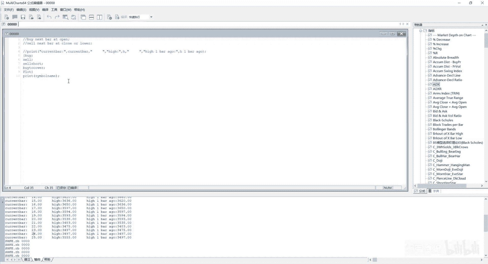

它其实本质上还是零和一，后边具体怎么运用，咱们会具体去讲的。

这个时候你先记住它的数据类型，就是三种数值字符串和布尔啊，就是一般咱们定义参数类型的时候会用到这个，就是这几种啊，这几种时间和日期在EZ lam中，时间是以这个三个Y就是年是三个数字。

月两个日期日是两个啊，其中Y是从1900年起算的，这个年数M是月份，dd是日期啊，不是日志，这个可以给大家输出一下，看一下，应该是从这两个我print，一个就是它这里边有date有有date啊。

有date就是日期，我直接输出日期，咱们编一下，编译过去之后，你会发现22年9月26号，22年9月27号，他这前面为什么是一啊，如果说前面直接为零的话，他就没法输出了是吧，他就不能实现三个数字了。

因为零，你前面你如果说想输出成像这种零，00000这种形式的，就是022这种形式，你必须得是字符串，他这个输出出来它是这个什么呀，它是数字数字，你前面必须得有数的，不然的话你加上零。

它就是字符串格式了啊，所以说如果是零，它默认会把它转成122年092，622年0927，他是这样的，然后包括我把这个再注再注释一下啊，包括print一个，T，好我清空一下啊，清除全部，然后点击一下编译。

它都是什么呀，1500。00就是下午三点就是15点，其实是它，但是它会显示一千五一千五，他还有一个time下划线S啊，就是咱们再清除一下，再编一下，他会1500又多加了两个零，就是15时啊。

零零分后边其实加了零零秒嗯。

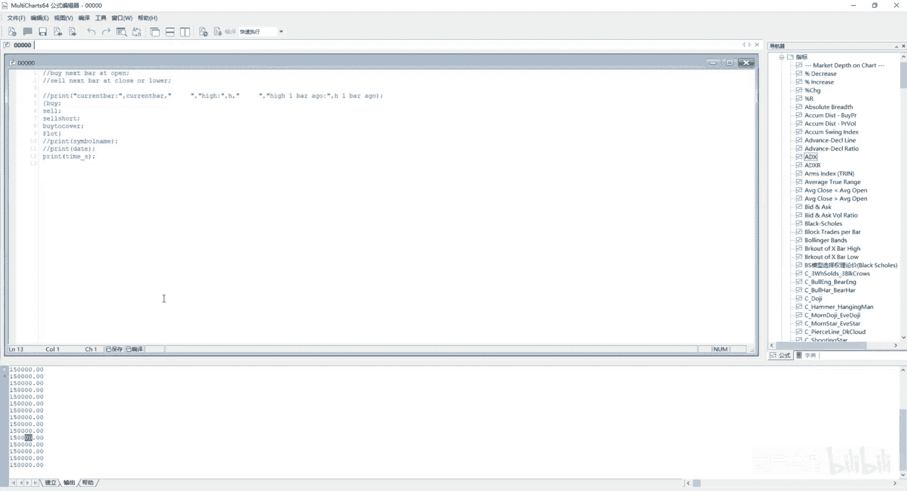

咱们可以把它换成就是说设置商品，把它换成5分钟周期的，可以给大家看一下，好吧。

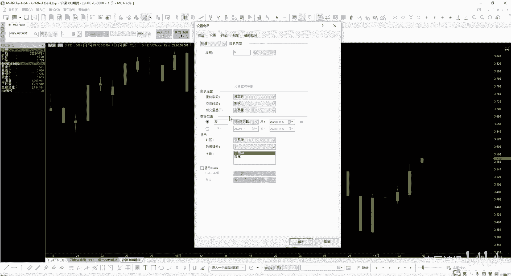

啊就就这样吧，后边看啊就有了，就是2140002，14500215000对吧，就是他就换成这个呃更加的详细了，就是time下划线S就是更加详细详细了，如果说你只有time的话。

它会只是就是到分钟就是22452250。

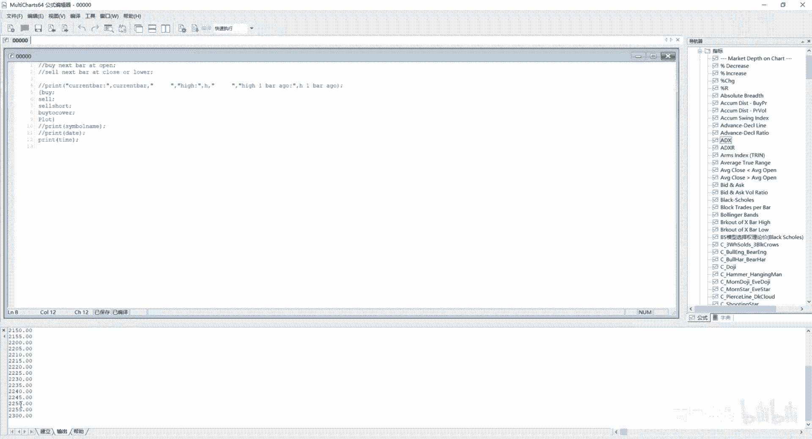

它是后置的啊，后置的就是它代表这根K线的时间。

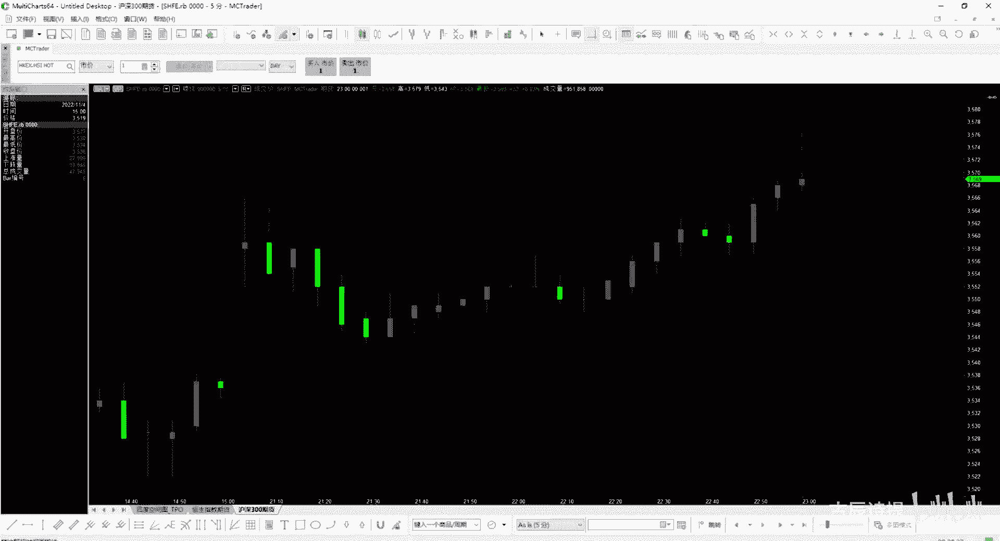

是它的结束时间啊，就是它的时间，如果说标识为22。50的话，咱们看左边啊，如果时间标志标识为22。50的话，它就默认它是22：45分开始，到22：50分结束，它是以末尾时间来做标识的。

跟咱们维纳那个平台是不太一样的，维纳平台上是以其开始时间作为标识的，就是它会以22：45分这个来表示，就是这根K线是有区别的，所以说你要从本质上来理解它，就是说你会发现各个平台和各个平台的区别，是有的。

就是他的你像它的标识时间对吧，包括他时间的合成。

你像如果说我把它设置商品，然后把它换成一小时的话。

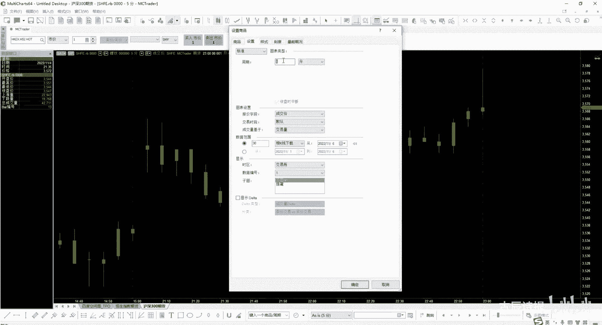

它时间合成也是不一样的，咱们可以看一下啊。

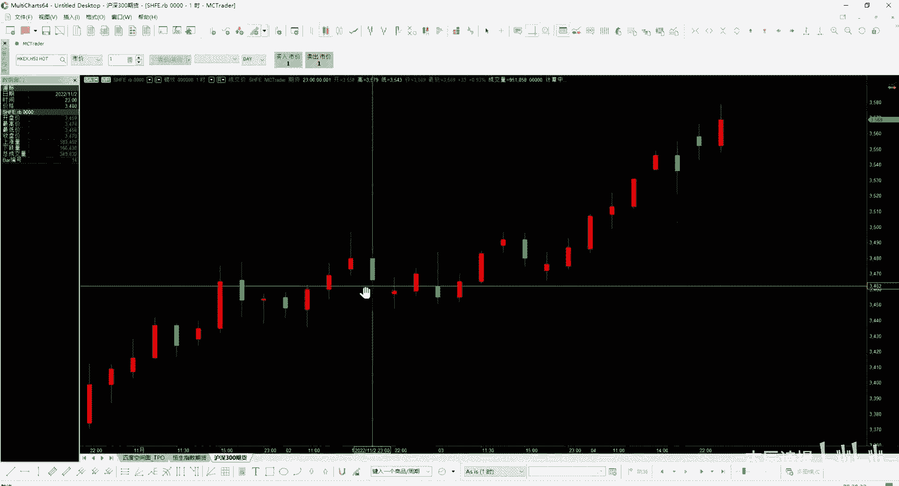

你会发现他下午三点是吧，晚上九点啊，这个没什么区别，就是15点他没有夜啊，应该是有夜盘的呀，11点啊，十点看啊，十点表示一根K线，11点表示一根K线，然后11：30表示一根K线。

他就是我不管你中间走了多长时间，反正到了一个整点，我就表示一根K线，11：30 11点半以后就没有了对吧，他两点表示一根K线，他半个小时他也表示一根K线对吧，包括45分钟，因为早上10：15分到10：

30是休息的，所以他也把它表示成一个K线，但是有一些平台上，比如你看文华或者博弈大师，他的这个合成是不一样的，这就是各个平台它如何去操作的问题，包括你像这种000这种指标的合成。

很多老板问我怎么去合成这个000指标，因为我们那个群里面是给大家送数据的，就是每个合约的分钟数据都会给大家10年的，很多老板就说指标怎么合成，其实指标合成很简单，关键是你如何去合成。

文化上面可能和博弈大师上面的指标，就是自己来定的，比如说我主力合约我占70%，我其他的我去分，或者按照成交量是吧，按照成交量的比例，我来就是分他们的这个就是占比，然后形成这个指数型的合约。

但你得自己去确定啊，包括你像MC上和这个别的平台，主力合约的切换也是不一样的，有的平台是看成交量，有的平台是看持仓量，有的平台是既得看成交量，又得看持仓量，这个都是自己设定的，就是这个期货就是这个券商。

他只是给你提供了这个数据，后边你的数据怎么去操作，那是你自己的事情啊，所以说你从MC上写代码，同样的代码你可能去这个tb上去跑，他可能结果就有些不太一样，那问题出在哪呢。

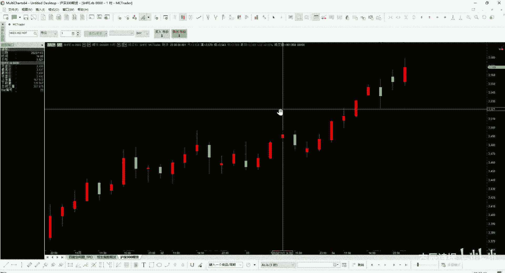

就是这个K线合成上面它是有区别的，好吧，这一点大家一定要清楚啊。

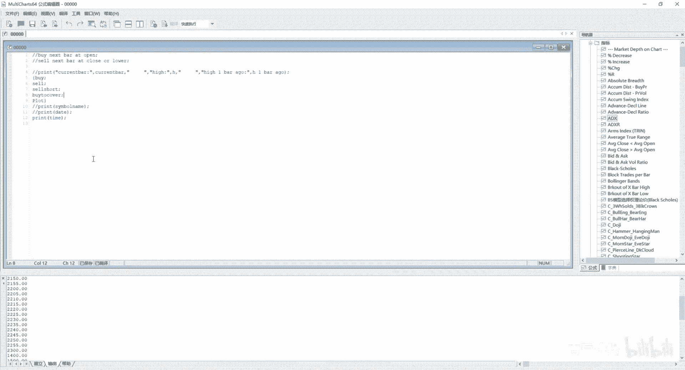