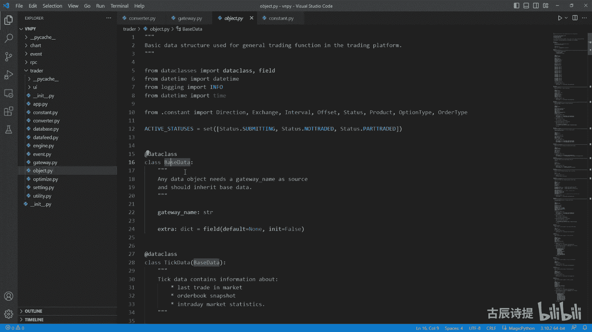

# 第30节课 veighna自带转换器讲解 - P1 - 古辰诗提 - BV1QH4y1377d

欢迎大家来到从零开始量化系列课程，VMPI课程的第三节课，这节课咱们说一下这个伟大平台，它自带的这个COMMENTER，也就是这个转换器，它里边的这个内容还是一样的啊。

它有一个外壳就是offset commenter，为什么是叫offset，因为它主要转换的就是这个开屏是吧，然后下面是个position holding，也就是说这个它这里边主要的存储的。

就是你的这个呃，每一个合约它就是实际的一个持仓，咱们看看下这个导包啊，这上面不用看，这有一个这个东西，就是if type chicken这个，然后去import一个my engine。

而且这my engine加了个引号，这是有什么作用啊，其实咱们可以看一下这个tai chicken，它是false，你会发现它只是一个布尔值是吧，它是一个布尔类型，它有什么作用啊。

呃给大家演示一下它的作用是什么，就是这个问题，可能你在写代码写多了之后，你会发现呃他有这样的一个问题，比如说我这写一个类，写一个PY文件叫person，然后我再写一个。

放点PY就是咱们以前在写代码的时候，肯定是会涉及到类的穿插，比如说我这定义一个这个person类啊，person类我初始化一下，然后我从这里边呢我需要一个cf点phone，我们每个人都有一个手机。

是不是这个phone呢，我初始初始化的这个呃，初始化这个值就是这个NN值，我从这个from typing点VIP typing呃，import一个optional，Optional。

应该知道是什么意思了是吧，他就是就是你这个里边可以是optional，也可以是不是可以是浪值也可以，另外是一个指定的一个数据类型，就是在这两个类型里面去进行切换，比如说我这里边呢它这个数据类型呢。

它是一个缝类型，这个phone呢我没有定义呢，我从这给它定义一下啊，就是我要定一个r class p h o n e phone，然后我先pass一下这个里边先什么都不写。

然后我从呢从这个phone里边p h o n e from，啊啊p h o n e phone import，撇除文以缝，是不是这样就可以了是吧，我先给它初始化一个浪值吗，然后呢同样在这个缝。

这我在初始化的时候，DEF刚刚in it，然后这里面呢我也写一个什么呢，叫set pop r或者owner，Ow o w n e r owner，比如说它是一个person类型的。

它是一个person类型的，同样的from typing import一个optional，然后这个owner它是一个什么类型的呢，它也是一个optional，然后它是一个这个person类型的啊。

这个person类型的person是什么，person类型的就是from person import一个person，是不是这样写，很正常啊，后边你再去调用这个四点owner，比如说他有一个这个C点。

owner点这个缝是吧，就是你就会有你就会有这个代码提示，对不对啊，包括你这里边实现的方法，你这样写代码会就会很方便，但是呢你如果这样去使用的话，比如说我在别的，比如在一个MAPY文件里边。

我from person p r s o n from person，import一个person，我在实例化的时候，比如P1等于person，我再去实例化它的时候会出现什么问题啊。

循环导入吧啊这个是在Python里面都是有的是吧，Most likely due to a circle import，就是循环导入，因为你在呃在person里边。

不在这个form里面导入了person，然后再在这个呃person里边也导入了这个form，你加载这段代码的时候，它会从这个person里边来加载这段代码，然后呢你加载这个代码的时候，你又倒回到自己了。

它它是不是就形成了一个循环导入了，这个时候如果说你解决方式有什么呀，你可以不写这个，我可以不要这个，但是不要这个的话，这等于N值没写啊，但是不要这个的话，你也可以这样不写，不写它就没有问题了，对不对。

不写他肯定就不，他就不会出出错了吧，是不是，但是不写的话，你在真正写代码的时候，你这会很别扭，因为你无法去标记它，标记它，你这个方法就没法去调用它，就会出现这个这个白色的cf点owner。

点PHONEF是吧，就是白色的，它没有代码提示，就是很不方便，然后呢以前的时候呢都是第一啊，能避免就避免，如果避免不了呢，就是先把它导入，就是先导入进来之后，代码提示完了之后，我再把这个导入给删掉呃。

这样你再看源码的时候也不太方便，这呢就从这个from这个tap里边呃，引入了一个什么呀，叫typing t啊，type啊，Type chicken，你可以怎么做呢，就是if啊，Type chicken。

然后from，php h o n e from phone啊，不是这个person是吧，P s p e r s o n from for a person，Import person。

这个时候呢我再给他加入一个叫这个optional，就是这个代码提示，然后呢把它引上啊，当然你不赢也行啊，把这个person给它放进去啊，person给他放进去，这个时候呢你再去呃，运行的时候。

你看他是不是没有报错，我我我再运行一遍，没有它是没有报错的吧对吧，这就是为了方便你写代码以及这个代码提示，没有什么太复杂的，所以说不要把它想的多么的就是高大上啊，好这是这个需要跟大家说的。

你以后写的写代码你就可以，这么来写啊，你也可以这么来写好吧，这个引号再说一下啊，引号有些时候当这个类，比如说我返回的是，我本身就是经常会在什么地方用用呢，比如说我定一个方法DEF。

比如说这个呃return my是吧，然后呢它的返回值呢它就是一个风，有这种可能性吧，我返回是我本身还不行吗是吧，但是呢这个时候你代码提示你是没法做提示的，但是你可以加一个引号，它就可以做提示了啊。

这就是当这个类还没有的时候，还没有出现的时候，你可以给它加引号，好好吧，包括你有时候比如说这个phone这个类写在上面的，我下面这个类写person啊。

然后这个phone里面要用到这个person这个类，但是它在下面啊，就是你代码运行逻辑是从上往下，对不对，但是如果说你这个类在下面，你需要去导入的话，你也可以加上这个引号，如果说它出现没有这个类啊。

就是说就是识别不了这类的话，你可以给它加个引号就可以了，好吧，这是首先需要跟大家讲的好，那咱们就简单来看一下它的这个这个，这个两个类里边都实现哪些东西，主要是看一看他和咱们自己写的那个，有哪些区别。

这个offset commenter就是转换器，它是个壳嘛，它这里边咱们有个没有的，就是说这个叫get contract，Get constructor，就是通过这个contract合约来规范。

就是就是就是首先你这个合约信息来了之后，先看一看他是不是在我的这个合约列表里吧，就是从main engine里面去get constructor是吧，如果说没有的话，它就不进行后边操作，如果有的话。

他才进行操作的啊，这是get control，然后这里边一样的，Update position，Optic tried，update order是吧，它这个里边都第一步是什么呀。

先看一下is commentrequired，他是在这呢，他这是做什么呀，首先还是进行这个判定，后边呢如果说没有就返回false，如果说这个constructor是nt position。

这个什么叫nt position呢，就是你看这个construct data里面，它是有这个类型的啊，Simple exchange，Name product，这个前面这三个没这个没问题吧。

name就是他这个比如说你是罗文，他这是什么螺纹钢，他的这个名字2305product是期货还是期权是吧，呃这个product点比如说这个future啊，它就是啊期货如果说是optional啊。

这个这个option它就是期权啊，这是做一个标识，Size，就是它的这个呃一个点代表，其实就是一手代表多少的这个计量单位，比如说一首代表10吨，一首代表1500克什么的啊，这个就是science。

它是单独规定的，Plastic，就是最小的这个波波动值，然后这个product id是什么呀，就是你螺纹2305，它就是那个RBR305，这个RB就是他这个product id啊，这个有吗，应该啊。

有的啊，我之前也也添加过这个，因为我需要把这个construct data，和我的这个整个的这个合约信息，contract合约信息啊，在我的就是说这个理解里边给大家写写一下啊，就是合约是什么呢。

合约就是你得有月份的，比如说螺纹2B2305，这是合约品种是什么呀，品种就是螺纹，它就是一个品种是吧，他们之他们之间有共通的地方，我都习惯于就是说在本地会存储上，这个品种的信息。

因为你在就是说去存储数据的时候，你需要它的这个时间吗，品种呃，合约属于哪个品种，那它的就是就是开盘的时间什么的，包括它的这个大小啊，它的最小波动值是不是都一样。

我习惯于把品种的信息给它单独的一个JSON文件，保存下来，然后去核实这个品种啊，这个是product id，然后这个mini vlo就是最小的，这个这个这个这个可以开仓的这个手术啊，一般都是一嘛。

然后stop就是是不是支持这个停止答案，nt position是不是就是进仓的这种呃，就是交易方式他跟咱们那个busier shcover，那后边那个NT不一样啊，那个是咱们主动采取哪种模式。

这个呢是本身交易所，它是不是支持进仓的这种模式啊，这个国内的一般啊不支持啊，国内一般不支持，大部分不支持啊，不能说什么绝对，然后这个history data就是有没有历史数据，有一些就是这个金融产品。

它是这个交易所是给你提供历史数据的啊，就是如果可以提供历史数据，你就没必要去自己去找历史数据了，对吧啊，这个是这个option，跟这个option有关的，都是跟期权有关的啊，跟期权有关的。

这我就不多说了好吧，然后他这就是看是你有没有这个合约，然后他是不是这个进仓的，这个模式本身就是清仓的模式，如果这两个都过滤掉的话，就返回true啊，这个没什么好说的，他一般这个里边都会有。

先判定一下is convent required的啊是吧，都有这个，你看这个它其实后边就是找到了这个holding啊，啊position holding。

它是通过get position holding，咱们是通过get holding是吧，他代码是一样的，如果说没有的话，他会给你建一个这个position holding这个类，去进行实例化一个。

然后添加到这个C点holdings里面啊，一样的道理，然后同样的都是去调用这个update position是吧，它这个holding本身的这个update position。

update trade和这个update order啊，这个就没什么好说的了，这个update order request，就是当你去在发送到底层之前去进行转换的。

同样的他是去addorder request啊，你这么看代码是不是就很简单了，前面都是这个找到holding，然后update order request是吧。

然后这是get position holding，就是获取到咱们之间就是讲过就是这个嘛是吧，就没什么了，然后convent order request就是转化请求啊。

这个就是啊这个update order requests咱们刚才说错了，就是在你的这个呃，就是说你的这个请求进行处理的时候，就是发送到底层之前进行转换的。

然后这个是convent order request，它是干啥的，它是从这就是咱们在那写的，就是你是不是需要转换成，就是根据你的需求来进行这个转换，是锁仓模式还是进仓模式啊。

还是只是去给这个上期所的这个平仓close，把它变为close day和yesterday做一些调整，你想他这个就是呃，就是就这四个它只能运行一次，要么是luck，要么是NT。

要么是你这个exchange in，就是你什么都不是啊，或者说最终给你返回一个，直接把它加一个这个呃，把它作为一个列表给你返回去啊，这是所以说你lock为true，net为true。

它其实实际上是只是去执行lock是吧，因为他这个两个本身的本质的逻辑是不一样的，好了，lock的逻辑是什么呀，我不评精彩是吧，我就是免去平行惩罚，然后这个NT的逻辑是什么呀，我不管你是呃开仓平仓。

我首先我得确保我的这个就是不要出现，既持有多仓又也持有空仓是吧，然后这个呢主要是把上期所的这个呃offset点，close转换成close，yest呃，这个today和close yesterday。

是不是啊，这个逻辑就很简单了是吧，好那咱们再看一下下面这个position holding，然后这个前面也没什么好说的，这个里边需要有active orders，对不对，好。

at update position啊，这个它其实就是更新嘛，就是把这个都重新赋一下值，这个里边同样没有这个frozen，就是冻结仓位啊，你也可以把它给填上啊，冻结仓位有冻结仓位。

就这样的话会更完善一些，但是从这儿呢就是伟大这个平台，我个人认为它考量到的是什么呀，你可能会在别的平台上进行操作，如果把这个frozen给更新上了，他并不是你本身这个程序给你发的。

因为你本身程序要给你发的话，你这个frozen肯定会被更新的，是不是，因为你的这个order会传递到这个呃，这个转换器里边来，他会给你去更新这个frozen。

你本身这个order委托并不是在我这个系统里边的，所以说你去更新它的这个frozen，也没有什么任何的意义，对不对，deposition update order啊，他的他把这个就是说去删除它。

不活跃的合约放在这了啊，就是咱们也是放在这，然后他去计算了一个calculate frozen啊，这个也是挨个的去计算嘛是吧，这个里边也没什么的，就是开仓就是嗯就直接就略过了，如果说你是平仓的话。

他会去锁定你的仓位啊，这个就是咱们也讲过了，但是它这里边有一个什么叫sample frozen，咱们看一下这个是来干什么的啊，他说ltd frozen它是什么呀。

把这个ltd frozen和cf点ltd，然后取一个最小值，它其实就是为了防止在这个写程序运行过程中，出现，你的这个比如说经仓的冻结仓位，比你这个精仓的持仓要多，是不是他是为了避免这个的吧对吧。

它取一个就是就是就是较小值嘛，包括这个座舱的冻结和佐仓的持仓，你佐仓冻结不可能比佐仓持仓要高的，对不对，咱们之前没写，是因为什么呀，就是按照正常的逻辑来说，你不会出现这种情况，他这给写上了。

就怕有啊这种特殊的情况是吧，或者说程序运行里面出现了，咱们不是说那这个代码的这个bug是逻辑上的，可能考虑不周的地方，他用这个做一下这个过滤是不是。

然后再把这个lg post frozen和short propost frozen，进行一下，就是说更新啊，其实这个是有作用的是吧，因为你这个之前都是在这个ltd和long yd，里边做这个更改。

但是你这个lg post frozen和long short prison of posters，就是总的冻结仓位一直没有去做，这只是加一个过滤是吧，就是防止你这个冻结仓位超出了你的持持仓啊。

他就是做了这么一个工作好吧，你知道就行，加上更保险一些啊，这个后边三个就是这个去转换这个上期所的，咱们看一下啊，如果说开仓的话，它就返回了是吧，同样的如果说是方向是多。

然后他这个post available是等于什么，拿这个因为你是多仓，不管你是开还是平，它首先是呃就是你得把他这个空仓啊，也不是不能说不管是开还是平啊，就是说因为开它直接返回了，平的话就说他肯定是先平。

而且先把这个空仓平掉嘛，平空仓你多方向你平仓的话肯定是平空仓，是不是他来更新这个空仓，看这个就是你的持仓有多少可以用，然后你经仓有多少可以用，是不是啊，然后就是做完这个之后呢。

他会如果说IQ点volume就是你请求的这个volume，比这个你的这个pose available，就是你能够平仓的这个仓位要大的话，它直接返回为空的，这是什么意思呢，就是如果说你的平仓请求手术。

大于你的这个持仓持仓量，它就会认为是有问题的，他就只不再给你往下去撮合了，然后就给你返回了一个空的啊，呃在咱们那个代码里面没写是吧，但是在咱们那个演示的那个界面里边。

咱们有这个这一块的这个它会弹出一个窗口，对吧啊，还记得吗，好下面的逻辑是什么，IQ的volume小于等于TD点valuable，就是你的这个请求的这个池呃，请求量小于你就是说经常的这个可用数量啊。

然后呢就把它给平调，就是close today，然后就直接把这个就返回去了，如果说你的平仓量超过清仓的这个持仓量了，然后你把第一部分用金仓去给它平掉，是不是就是就是说这个TD就是这个IQ的TD。

就是金仓的这个平仓呃，就把它给平掉，然后呢再把剩余的用佐仓给它去平掉是吧，这有个IQ点volume减去TD点available啊，他是这么一个逻辑，其实是一样的道理，是不是呃就是先评京仓再评左仓。

咱们那个写的是什么，先评佐仓再评，经常有些不一样的地方啊，咱们写的是因为咱们为了跟这个上期所啊，大场所啊，啊这个大场所呀啊，不是咱们为了跟大商所郑商所呃一样啊，就是咱们是先评优先平锁，然后再平静。

但是他这上期所转换的时候，他是优先平均再平卒，这看你自己的逻辑啊，都可以的好吧，都可以的，因为它必须得指定你是close close，Yesterday，你说优先平均就优先平均，你说优先平左就优先平左。

我给大家演示的那个，我是为了跟这个大场所和正常，所以及这个中金所是一样的，我就优先偏左了，对吧啊，这个是当你什么也不转换的时候，你必须得把上期锁来进行转换，如果说你是锁仓的时候，咱们看一下啊，同样的啊。

他这逻辑可能也不太一样，它叫什么t d volume，就是有经仓啊，就是已经有经仓，就是把这个京仓的仓位就是给获取出来，然后佐仓的available就是可用仓位。

然后他这是close yesterday exchanges，就是把这个上期所和上汽能源单独用一个，这个sat是什么呀，集合吧，单独用一个集合把它放在一块儿，然后他首先做了个判定。

就是如果说就是有经仓了，而且这个交易所呢没有在，就是说这个呃就是说平座仓的这个exchange，这个就是说这个不是这两个交易所，他就直接啊就是把这个转换成开仓就出去了，他的逻辑是什么意思啊。

就是说如果说你已经开了进仓了，那就说明你之前的已经拼完了，能理解这个意思吗，就是如果说你还持有佐仓的锁仓的是吧，一个五一个负，你首先比如说不管清仓，你是开仓还是平仓。

你肯定就是说先把前面的这个给平给平掉吧，对吧，给消耗掉，如果说你已经清仓已经有了，就说明你前面已经消耗完了是吧，他就直接就返回了，能理解这个意思吧，啊他就是这个逻逻辑，可能是减少代码的运行量是吧。

然后下面是什么呀，就close volume，open volume就是先平再开嘛，一看这个就能呃了解是吧，先停再开，然后如果说是昨昨天有持仓啊，如果说昨天有持仓呃，然后呢他copy一下。

然后如果说这个exchange也是在这个，是这个上厕所和上汽能源，它就它就是close yesterday，如果说不是上期所和上汽能源，它就是直接就平仓了，就close，对不对啊，他评的其实还是佐仓嘛。

外地而valuable，对不对啊，如果说他把这个就是等于这个，然后open volume，Open volume，它这个是在前面都已经给他定好了，就是close volume，平仓量和这个开仓量。

开仓量它是什么呀，就是max，就是用这个你的请求的这个数量，减去你的佐仓量，当然有可能是大于零，也有可能等于零，也有可能是小于零，但是它最少就是最小取到零，他这再加一个判定，这个就相当于这个什么。

它就是一幅，它不等于零，对不对，那就是零是否嘛是吧啊，然后他就在开场，然后最后给它添加到这个pd这个里边去，再返回啊，其实是一样的，对不对啊，其实是一样的，这就是锁仓，锁仓就是不不平精仓。

只不过在他这儿呢，他加了一个限制条件，就是如果说我看到你有经仓这个持仓了，那就说明你就是说已经把之前的给平给平掉了，他就是强调一个呃，就是优先平左啊，先把佐仓平掉啊。

好咱们再看最后一个就是comment order request，就是进藏模式，他这个post available，就是你整个的你的持仓是多少是吧，能够用的，必须得把这个这个这个冻结图的给剪掉。

然后TD和YD，因为这个里边你肯定得单独考虑这个商机，所和上和上汽能源还是一样的逻辑，就是先平再开是吧，先平再开，所以说它会给它拆分成两块，一个是有没有经仓啊，如果说没有经仓的话。

然后呢他就呃就是说呃就是啊有没有进仓，如果有进仓的话就行，就是发一个平均仓的委托啊，然后呢有没有座舱，有有座舱的话，就发一个平座舱的委托，你看他是优先平均啊，就是这个上期所和上汽能源为纳。

咱们这个平台上他是优先平精的，咱们写的那个叫优先平左是吧啊，希儿咱们是先平左仓再平精装，他是先平经仓再平左仓，然后最后如果还有剩余的就转成开仓，对不对，然后再把这个返回回去啊，这个他这个加了个else。

就是把这个上期所上新能源，和你的其他交易所分开啊，这个也是一样的，就是这个就不用进仓佐仓了，因为它不需要单独指定是close today还是close yesterday。

所以说他就直接你能用多少仓位啊，就是说还有多少仓位，就是给它先平掉，然后再开开就变成两个，从这儿呢你可以发现其实像这个IQS，也就是这个呃order request list，就是你返回的这个列表。

它有可能是三个，对不对，它有可能是三个，但是应该是最多就是三个吧，也有可能是一个，有可能是两个，有可能是三个啊，三个一般都是出现在这个上汽所和上汽能源，你平仓再开仓是吧，你采用这种进仓模式。

或者说你采用这个锁仓模式，尤尤其是你采用进仓模式的时候，它可能是先平精再拼左，或者先平左再平静，这是你自己来指定的啊，然后再开仓，对不对，好，这个就是整个的一个converter的一个讲解。

你想这个时候咱们来讲，就会觉得它很简单了对吧，因为咱们敲过这个代码，你就知道它是什么意思，所以说代码一定要自个儿去敲好吧，下面咱们再把这个整个的这个VNPY，这个里边的这些文件啊，就是再给大家捋一下。

就是这个里边嗯，咱们从这个最核心的这几个组件给大家看一下，这个app这个APP里边是什么呀，这个咱们之前讲过，它是把它整个包装成一个APP，里面包含了这个包括它显示的名字呀，engine class呀。

包括app这个model啊，pass就是路径啊，包括它的这个图标啊，这个更多的其实是为界面服务的，咱们反复说过，在main engine里边它at这个N件啊，你只需要把这个engine类给他传过去。

他就会给你进行实呃，这个实例化对吧啊，这个是APP，他这个unit里边没东西啊，然后constant常量是吧，里面定义了一个不光是在期货里边，在其他平台上也是通用的一部分，它都是定义在这儿的。

就是通用部分，它都是定义在这个VNPY这个里边，这个文件里边的啊，包括这个状态，这个studio啊，这个studio你一定要知道它其实也是在什么呀，在咱们就是说程序里面进行转换的。

而并不是说在底层进行转换的，底层他其实给你传过来的还是字典，然后里边就是说包括他的状态啊什么的，大部分都是用这个就是12345来标识的，当然了，他那个12345是字符串类型的。

而并不是说这个int或者float类型的啊，需要在底层进行转换是吧啊，这个应该是知道的啊，一定要跟那个stop呃，这个studio，就是你那个停止单的这个状态进行区分开来，这个是对于限价单的啊。

然后product就是股票期货，这个用的不多是吧，order type虽然写了这么多，包括FAKFKRIE这个RFQ询价什么的，但是基本上不怎么用，咱们用的是这个stop单和limit单。

market单呃，没有去实现它嗯，在我的第一堂课就是B站上那个免费的课，这个试驾单你可以自己去实现的啊，包括呢再给大家写一个包括什么市价出价单，TTOUCH就是这个touch。

就是你碰到这个价格我才去进行开仓，你想试驾的话，直接给他转成这个涨跌停价，或者说是你转成比如说第几个点啊，或者什么的，这个都你自己去定，自己来定这个框架，而而不是说我给你确定好了的是吧，一旦给确定了。

你肯定会丧失一些就是他的这个活动的空间，或者说他的这个可更改性肯定会丧失掉一些，所以说这个是你自己咱们辛辛苦苦来学这个，其实就是为了能构建自己熟悉，或者自己能够用起来顺手的一套。

就是说这种就是交易体系是吧，或者说你的这个软件的一个体系啊，这个你自己来定，你自己可以去实现market，也可以去实现，我刚才说的这个touch啊，包括这个S啊，FAKFK你都可以自己去了解一下。

这个FAK是什么呀，就是feel and kill f k是FQ，就是呃委托发出去之后，要么全部成交，要么全部撤销啊，要么是部分成交完了，其他的可以可以撤销回来，主要是用在这个高频。

或者说是你价差套利的时候会用到啊，这个你可以自己去也去研究一下好吧，这个option是跟期权有关的啊，call是看涨不看跌，这个没什么说的，exchange就不说了，他说他都是枚举类型啊。

包括这个currency就是货币啊，Interval，interval就是你的这个周期分钟小时，daily daily就直接是D啊，它并没有E，包括wink啊，包括tick，它没有E。

只有our和minute，它有一啊来标识的啊，这个你要注意一下，咱们大部分用的都是这个minute是吧，包括在咱们这个合成器里边啊，因为我这堂课我们讲包括什么消失的一根K线，就是是上午10：

15分到10：30的时候，他这个15分钟是休啊，是这个休息嘛，休息的时候你在合成10分钟K线的时候，你可能会丢失掉一根呃，那是因为这个它整个的这个合成机制的问题，你如果说想去研究的话。

你看一下我之前那堂课讲那个八建筑特的啊，好吧，这是常量，constant常量，然后converter转换器，然后然后这个database呢它是一个接口，就是规范接口的，你一看到这个三段。

你就知道它是一个抽象类啊，抽象类抽象类，它这里边儿啊，这个是做这个什么呀，做这个时区转换的，咱们就不说了，直接讲过你像这个bar overview讲这个是什么呀，这个呢它是做什么用的。

就是你数据库里边你存储了，比如说螺纹啊，他的这个数据是从哪天到哪天呢，它有一个概览啊，就是一个告诉你它存储的这个数据里边，它有专门的一个表格，就就是更新，比如说我螺纹啊，2305从哪天到哪一天。

一共有多少条，这个是用是用来存储这个的啊，是用来存储这个的，然后真正的存储这个数据的，是在另外一张表上面啊，这个呢就是这个8overview，它是一个概览啊概览。

然后这个tick overview是和8view是一样的是吧，这是实现不同类型对象接口的统一，就是你这个几个数据类型，尤其是sq sq，就是这个包括这个my circle sillie是吧。

还有这个progreso Sol，就是维纳它和集成的这几个数据库啊，它都必须来继承自这个best database啊，然后就是当然内核是他自己来进行，就是单独去写的，但是这个里边有有一个那个数据库啊。

叫MONGODB啊，MONGODB那个跟这个SQL数据库有些不太一样啊，我建议啊，因为咱们用的这个对数据库你就会用就行了，你就用SQL简单方便，对不对，还好迁移，你用这个别的你还得折腾它。

咱们毕竟不是说做这个专业，做这个程序开发的，你也没必要说你再给他去，我用LINUX还是CENTOS，我个人认为没有这个必要好吧，本来花这么大精力，咱们学这个Python。

其实就想就是构建自己的这么一个平台啊，让自己用着舒服，如果说你越学越多，越学越多，最终你把这个它不不去研究策略了，天天研究这个代码数据库，包括这个不同的这个这个操这个操作系统，它有哪些区别。

感觉就有点偏了对吧，他这里面规定了你必须实现的sbdc tic data，Load by data，load tic data是吧，还有删除delete data，你看他这个删除啊。

都是整个的都全删了的啊，他并没有去规定时间和日期，整个的都全删了，它就是个sybox change和interval，就是你合约哪个周期的，他一删就全部给删了，包括这个嗯。

这个delete tic data也是一样的啊，这是get by varial，就是看获取这个这个，这个你的这个8000的一个情况吗，包括get overview，之前咱们也讲过了。

这个这个是很重要的是吧，就是这个get database，get database这个database呃，咱们之前给大家演示过，用这个单例模式对我再写一下啊，单例例子啊。

单例模式这个你从网上一查就能查到呃，如果说你这个数据库想被多个呃进程啊，或者线程去同时去使用的话，你要注意你要么是单例模式啊，你要么就是说给它创建一个连接池，去给它连接啊。

当然单例模式你如果同时在同一个时刻既去读，也去取的话，或者说呃你就说并发操作有可能会有一些问题，偶尔情况下会出现一些问题，所以说这个还是值得去研究一下的，是不是好吧，这个是数据库的，它是一个基本的类啊。

咱们就不多说了，下面你想包括这个这个data feed，它也是一个基本类啊，但是他没有用这个这个obstruct method去装饰，因为什么呀，因为这个这个维纳上面他只集成了一个ACCORDATE。

它并没有集成别的，所以说他有些东西它可能别的也不太一样是吧，或者说有别的之后，他再用这个进行装饰是一样的，但是现在只有一个，他只是为了实现接口的统一，他从这写了一个，然后继承自他啊。

然后去获取这个GD呃feed，你从这里能看到啊，就是说啊，就是咱们通通常一启动那个呃界面的时候，他会说找不到数据服务驱动啊，默认使用这个EQDA，数据服务都会说出这段话是吧啊。

嗯这个是data feed，就不就不多讲了，如果说你已经开通了这个阿Q数据的话，你可以看看这个阿Q数据它的这个API接口啊，那里边其实可以调用的东西更多一些啊，这个N件咱们讲过，主要是这几个。

就是说你启动这个程序，它必须得会用到的main engine，Bus engine，Log engine，o m s engine是吧，这个email engine就不说了。

event咱们第一节课就讲过这个getaway，它也是定义了这个接口是吧，同时呢把这个event engine给他结合进去了，包括own mon tik，On tik。

其实就是把它这个这个这个这个你的提个数据，放到你这个engine里面嘛是吧，包括on trade也是一样的，只不过他这有两个这种模式啊，第一个就是try，但是后边还有个try加try点。

Bt simple，就是通过这个VISIMPLE在单独的去识别，从这里可以看出来，为什么你像这个china后边都你想这些，后边都会有个点啊，就是用于就是如果说你加上try的点vt simple。

比如2B2305点SHE，就是你分割的时候，你可以通过点来分割是吧，这样更加方便一些，这就是为什么啊，这个里边这个后边都会带个点好吧，然后下面的这个engine啊，这个invent啊。

这个不是咱们之前写的那个invent engine啊，这个只是定义了一些，就是这个常量，其实就是常量啊，就是你属于是哪种传递的数据类型啊，所以说你导包的时候你要分清楚。

如果说是用的是咱们那个engine里面有现成的那个，你应该是是怎么导啊，应该是从这个VMPYVNPYDR里面去导吧，对不对啊，我给大家写一下啊，就是这个VNPYVMPY。

应该是点MIT里边去导那个mg码，包括咱们这个MIT这个类对吧，但如果说你要导这个数据类型啊，比如说这个mage contract event position应该是什么啊。

因为呃VP i trader是吧，点让我去导入这个啊，各种各样的counter什么的，能理解这个意思吧，好吧好，这个是这个MIT，然后就就gateway也说了，然后object就是对象嘛。

他都是用这个这个data class去给他呃，就是装饰的啊，装饰的这个呢，这个里边其实这个你都能理解是吧，用用它作为装饰器就省的，你像咱们定义那个的时候，咱们可以看一下这个from这个从这从这from。

V n p y，from VN py点，然后import in me，你像我定义这个event的时候，你是不是需要还是什么杠杠it，对不对，然后你去初始化的时候，你必须得给他传这个参数。

然后还需要true，还需要还需要这个杠杆INIT呃，但是呢如果说你用at data class，去给它进行一下封装的话，就是在咱们这个object里边去进行封装的话。

这样的话他就不用去给他去放这个初始值，是不是，然后直接给他标注一下数据，数据类型就可以了，到时候直接可以去调用，另外呢它还有一些其他的就是更加简便的，用哪些方法。

这个你可以自己去查一下啊，咱们用的最多的，比如说我去导入一个我在这我from啊。

from这个VNPY点TD点object import，比如这个bar data，你像这个bar data我直接定义，比如说这个比一等于八，我直接去实例化它是吧。

这个gateway name等于什么什么什么等于，比如说lock l o c a l啊，Lock，然后然后后边还有什么呀，就是这个symbol exchange下，它有的有初始值，有有的没有吧。

会就是在这个维纳里边，咱们也会经常看到它会调用什么呀，杠杠啊，dict什么的，就是会调用的很方便，包括他还有一些其他的用法，你可以自己去搜一下，就是呃被这个at data class去，就是装饰啊。

它有一定的好处，后面要说的是这个field field是干什么的，就是你得知道，一旦这个比如说这个tick data被实例化之后，它后边这个数据类型都是不可变的，数据类型啊，都是不可变的数据类型。

你像put in it，它是什么呢，就是说你只要把这些就是该填的给填上了，比如说你像这个几个啊，不是这个前三个它是没有去放这个默认数据的，给填上之后，它会给你自己生成这个cf点。

bit simple这个变量，那这个field是干什么的，它就是针对可变数据类型的，可变数据类型有哪些啊，比如说列表是吧，比如说字典就这样可变数据类型，它这里边可以去进行操作的。

就是比如说我去添加那个OLEDID是吧，这个VT的id，就是我从我的这个上层去发送委托，发送了一个stop委托，然后我出发之后trick之后，然后它会转换成比如说转换成三个委托，三个委托。

你就需要给它放到咱们这个order data啊，咱们这个这个这个order data呃，啊这个里边他没有去放是吧，就是举几个例子啊，就是它这里边，比如说我需要放几个可以变化着的，什么意思啊。

在咱们那个在stop order里边，我从这导入一下看看啊，VMPY点trade啊，不是trader了，VNPY下划线c t a strange点呃，Base b a c e base。

咱们看看这个类啊，这个里边的这个stop order啊，Stop order，你像这个stop order里边这个video id，它就有这个field吧。

这个是就是说你stop order转换成了多多个委托，因为你到底层之后，你可能最最多会转换成三个委托，三个委托，你需要把它添加到这个veto order id这个里边。

你想它默认default factory就是默认的这个工厂，它是一个列表，你看list它就会你添加，就直接可以用append给它添加进去啊，它就是这么个意思。

就是field后边填充的呢都是一个可变的数据类型，然后他这有个extra，extra是什么呀，就是额外其他，如果说你有别的需要，在这个数据类型里面添加了一些东西，你可以用这个extra。

你想他也是个field，然后default nin it force，就是你如果说in it等于true，它会给你，就是说把这个变量给你自己给出来是吧，但是如果说你没有别的要添加的。

你就可以不去初始化INIT，初始化的意思吗啊对不对，然后你可以给他把这个default给它改掉，如果说比如说我想添加一个，比如说本地的这个local time，是不是，我当然我可以不用这个field。

我可以用这个the time这个类型，这个其实就是额外的一个就是对象，就是如果说你有别的需要添加的话，你可以自己去添加它，当然咱们一般也不这么写了，咱们直接需要添加什么就去往后添加什么了，对不对啊。

这个还有什么好说的，比如说你额外添加，我需要添加两个，你是不是可以把它这个default改成dict字典，然后在这个里边用这个字典去表示它是吧啊，这样如果说你在和维维纳这个平台。

再去整体的去把这个在接下来的时候，它不会产生问题是吧，因为我是在额外的这个extra，这个对象里面去添加的，是不是啊，这个后边呢就没什么要需要太多的了，就是这个这个order data啊是吧。

这个create cancer order request，他自己有个方法，就是就是呃就是自己创建一个撤销的请求啊，就是它还是一个数据类型嘛，对不对啊，try data嗯，position data啊。

这个position data啊，他这有个cf点vt session id，这是什么呀，就是get away name with simple，加上direction点value，这是什么呀。

就是这个very simple啊，就是你这个这个ction value在咱们这个offset里边，刚才没给大家提到啊，这个offset呃，就是在这他创建的时候，咱们看一下啊，就是get post啊。

这个get position holding，咱们看一下啊，他这个如果说啊他这还是用这个contract，还是用这个very simple作为这个key值是吧，但是好像之前的还是最新的这个版本呢。

它是用什么来做这个体制的，它是用这个very simple，这是very simple，然后这是direction啊，t I/O n direction就是direction。

它来做这个这个他是一个tube啊，它是一个元组，元组是不可变数据类型的，他用这个元组来作为这个key值的，就是等于说是把这个整个的，比如说我这个2B2305啊，2305，然后多啊。

它作为一个就是它的唯一标识，然后2B2305空，它作为一个为表示它是为了契合什么呀，契合这个你的position data过来之后，他如果说你既有多仓有空仓，他会给你发两发两发两次，对不对啊。

他会给你发两次啊，这个好像他还是用了这个very simple啊，都是一样的好吧，如果说你看到它是一个CHER，也是一样的，只不过他多了一些这个什么呀。

这个这个这个这个这个position holding，Position holding，好，给大家提一下，好像在后边的这个PEACCOUNT，就是这个本地的仿真交易里边。

他是用的那个就是一个top来做一个元组，作为一个key值的好object，里边还有什么account data，Com data，你需要去自己去实践一下啊，account data啊。

我不是说这个是需要自己去，你想接到count data的话，你自己去实现一下，实现也很简单嘛，其实就在这个main engine里边去get，去get account吧是吧。

因为就是去接收一下这个account data这个事件，就是MACCOUNT去接收一下，然后你想在哪用，你就放哪用就行，对不对，因为这个在底层，像这个TC这个CTP这个接口里边。

它会把这个account data放到那个invent engine里面去，所以说你要去调用的话，你就直接可以在，不管是在你的这个CT引擎里边，还是在my engine这个引擎里边都可以。

你放一个接收这个事件的这个方法就可以了啊，这个有兴趣的话可以看我的第一那第一套课，关于这个账户信息如何去获取，需要填哪些内容啊，你去看一下，我个人认为啊，如果说你把这个之前的课都听明白了。

这个都不需要讲了，你就知道怎么去接了啊，这个optimize这个咱们之前也讲过了是吧，可能没有讲的那么全，咱们说过这个这个sitting，他是做这个限制条件来用的啊，就是规范这个什么的规范。

你这个就是你往里输入的这个参数啊，是不是就是起始的比开始的要小啊，还是什么的，然后这个generation settings，它是最终来获取你整个的这个settings的，作为一个列表啊。

不不是作为一个字典，对不对啊，是列表还是字典啊，列表啊，然后这边呢是啊，检查我的这个sitting，然后就是然后你去跑是吧，这个咱们都讲过吧啊这个GA是遗传的，你可以去看一下啊，你可以去看一下。

自己去研究一下它迭代了多少代是吧，咱们最主要的就是这个穷举好吧，sitting啊，这个没什么好说的，唯一要注意的是他这有个是SETINGS叫update，就是这个字典啊，它是一个dictum字典。

他自己去更新，通过什么更新啊，就是load JSON这个vd sitting，也就是在咱们C盘下面的administrator，或者这个liner下面这个点VTA里边。

这个vt sitting这个点JSON文件里边内容，它会给它就是载进来之后，然后更新把这个字典更新掉，这也是这个Python基础里边这个字典直接update是吧啊，这个这个用的不多啊。

就是这个get settings好吧，就是还是去输出啊，这个是什么呀，就是说你前缀有哪些，咱们之前好像提过是吧，因为你像他这个这个这个这个database，你看都是放在一起的。

DATABFEED也是放在一起的，email也是放在一起的，如果说你用这个database作为这个前缀，它能找到关于他的所有的就是在这个setting里边，所有的这个它的这个设置啊，就这么个意思。

unity啊就不说了，咱们之前这个作为一个重点去讲的，一定不要忽略它前面的这些方法，这些方法其实挺有用的，尤其是这个是吧SYS点pass点panda啊，这个是挺重要的吧，对吧啊，就是后边就没什么了好吧。

那这节课呢咱们就到这儿啊，整体的整个的这个呃，就是说这个CTA这一块咱们就讲完了，讲完了之后呢，像这个这个上面的RRBC，在我的免费的课里边有，我再给大家讲一下里面最核心的内容啊，包括这个invent。

这是invent engine吧，是吧，哦在这呢这个ent engine在这呢是吧，然后这个chart这个图表咱们就不讲了，后边如果别的课会讲到界面的话，咱们会给大家讲好吧。

然后后边呢咱们就很快速的去讲一部分呃，不是讲一部分，就把就是说比如像那个PEACCOUNT啊，包括这个RPC啊，包括这个呃一些其他的，就是说咱们能讲到的就给大家讲到啊，但是会讲的快一些。

只要你把这个30节课的内容都吸收了，我觉得你的这个写代码的能力，肯定会往上涨一大截，包括对这个VNPY整体框架的理解，我觉得会上升很多好吧，希望大家反复看看这前30节课好。

