# 第30节课 类6 - P1 - 古辰诗提 - BV1dC411h7U7

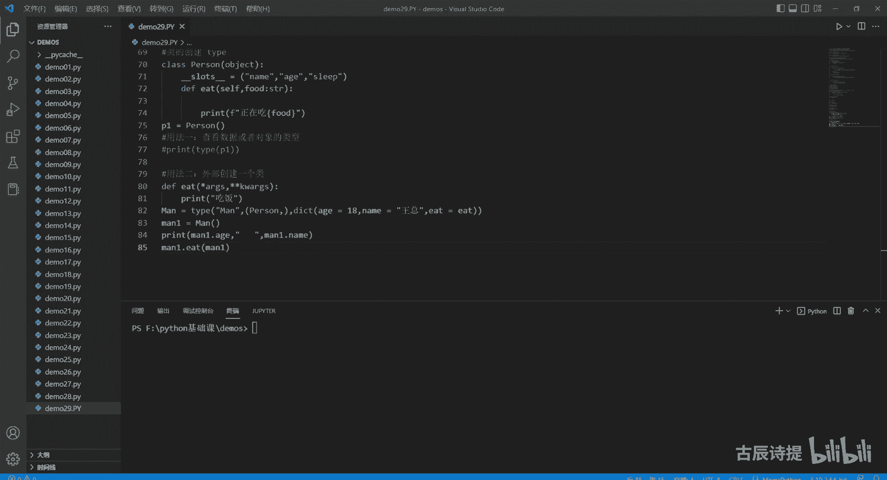

欢迎大家来到从零开始量化系列课程，Python基础课的第30课，这节课呢咱们接着上一节课的内容给大家讲。

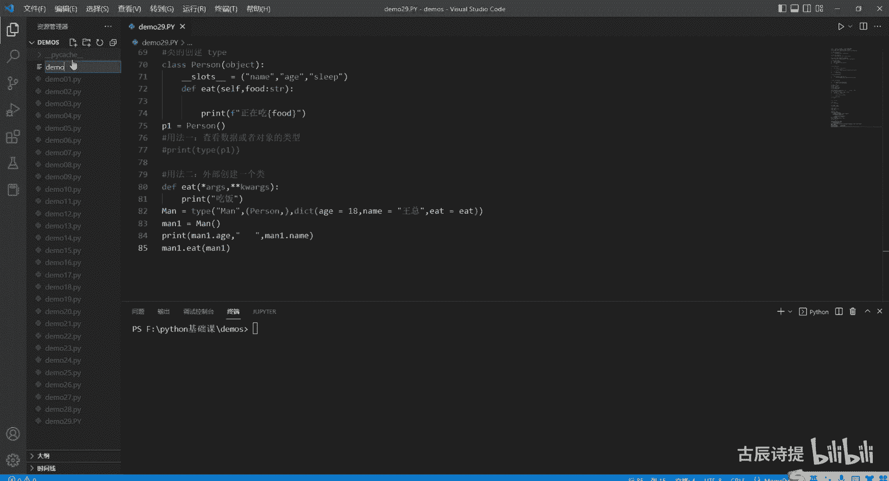

上一节课的最后呢给大家提到了。

就是如何在外部去创建类，用咱们经常用到的这个tap。

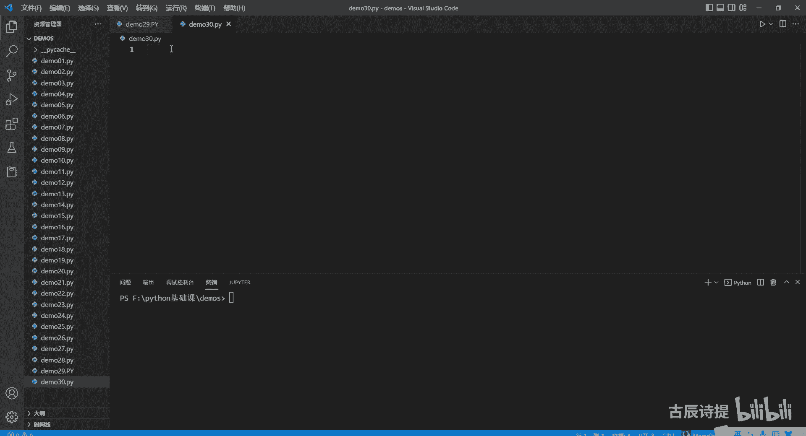

之前咱们用type都是查看这个数据的数据类型，然后这一次呢，这个tap由于里边传入的这个参数不一样，它是来在外部灵活的去生成一个类啊，这个它这里边有三个参数，第一个参数呢就是类名，那这个类名可以改的。

不一定是需要跟这个变量是一样的。

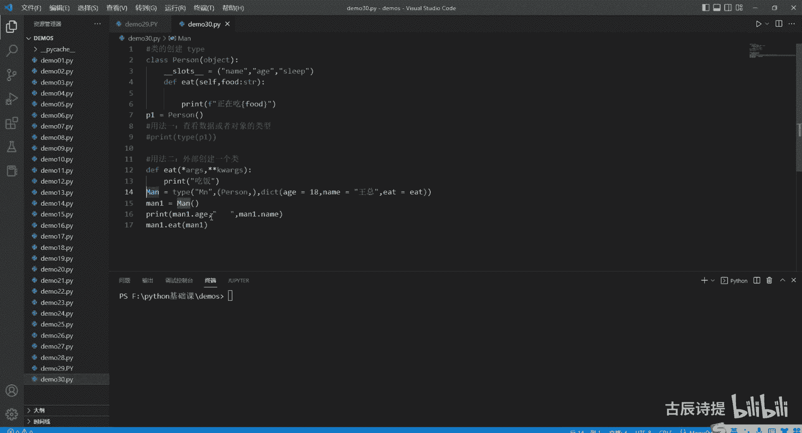

比如说我把它改成MN，这个时候我输出一下print慢点。

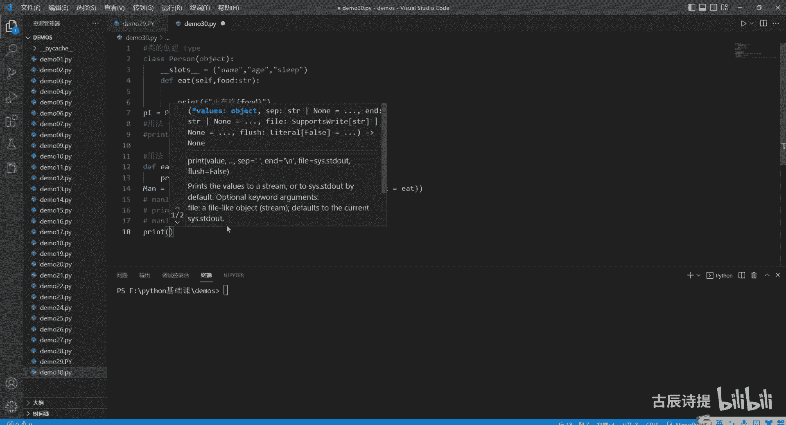

刚刚name他也是可以的，这是没有问题的啊，第二个呢是它的这个负累，这是一个top，也就是个元组，然后元组里边呢如果说你只有一个值，你必须得用逗号分开，当然你也可以不写它，不写它，咱们可以查看一下。

就是这个慢的，他的这个父类。

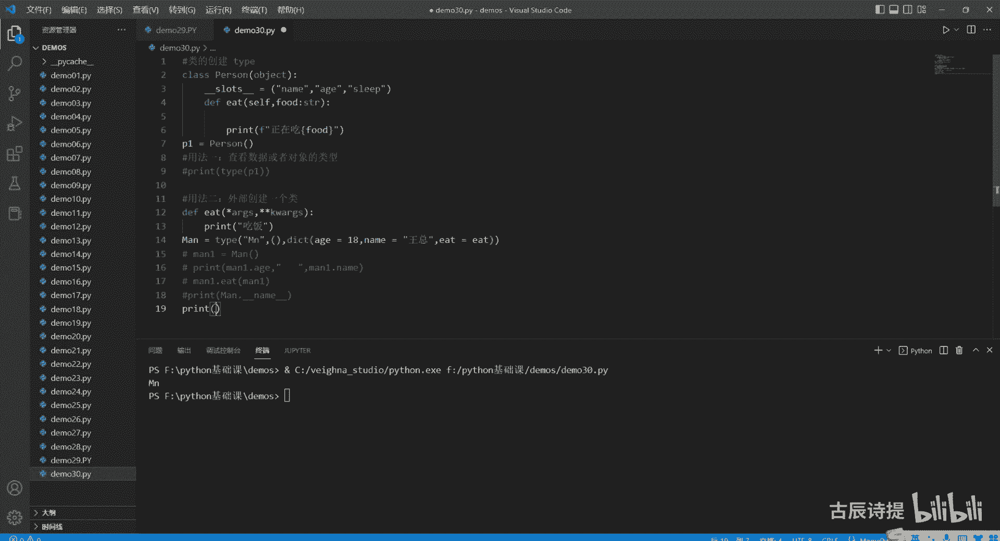

咱们之前说过查看父类用什么呢，点这个杠杠bees或者bass都可以是吧。

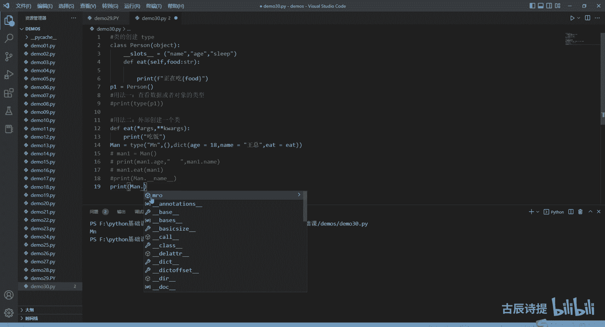

咱们可以看一下它的父类就是object，如果你没有写，它默认都是用object，都是继承自object是吧，其实到这儿咱们可以想一下啊。

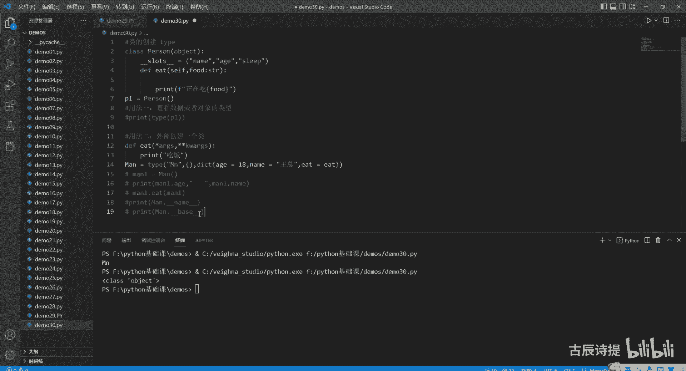

如果说咱们可以看一下这个print，一个这个tap的tap。

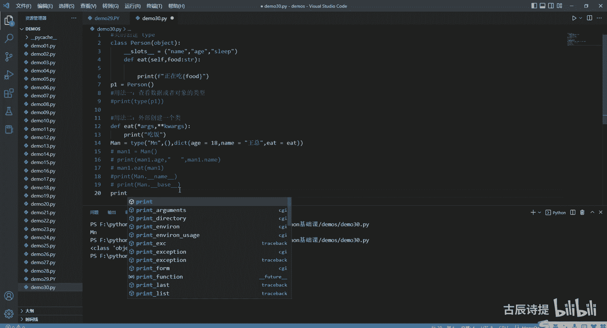

它本身是一个类嘛，它是绿色的，然后括号其实就是进行实例化，它本身就是一个类，那tap它的父类是谁呢，点杠杠base，咱可以看一下type的父类，它也是object。

那有object其实是就是这个type其实是object的子类，对不对。

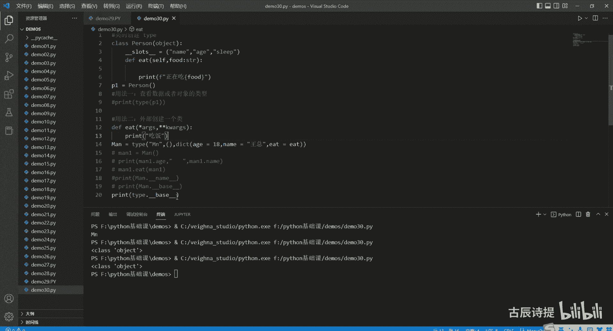

那咱们可以查看一下这个object数据类型是什么呀，Tap。

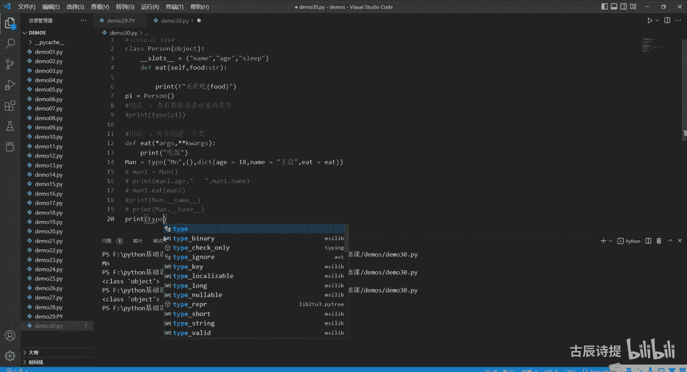

object查看一下object这个数据类型，你会发现它的数据类型是tab，就是这个object和type啊，它你可以把它理解为这两个类，是这个Python里边两个猿类，两个猿类源是来源的源啊。

源来源就是这个猿类，基本上所有的不能说基本上啊，就是所有的数据类型，包括你创建的在里边写的代码，所有的它归根结底，它的数据类型就是它的最顶端，肯定是这个type数据类型，它的如果说你写的这个类。

或者说比如像咱们list这个类啊，包括STR这个类啊，它的顶端肯定是object，好吧，这个跟大家讲一下，这是两个Python里边的猿类，后边一个比较重要的就是dict。

这个里边其实是存放着你定义的这个类的属性，以及它的变量和方法是吧，属性和变量咱们能够理解，其实从这儿你定你定义的这个类方法，在调用的时候是需要注意的，咱们上节课也给大家看了。

就是在这你定义的这个it方法，当然这是重写了这个它父类里面的这个方法了，当然现在把父类给删了，这个你在实例化之后要进行调用的时候，你必须得把你的这个就是实力，本身得给他传进去啊，这个一定要记住。

当然一般情况下也不这么去定义是吧，咱们之前讲过的一般都是怎么定义啊，都是先把它给注释了啊，都是我实例化之后。

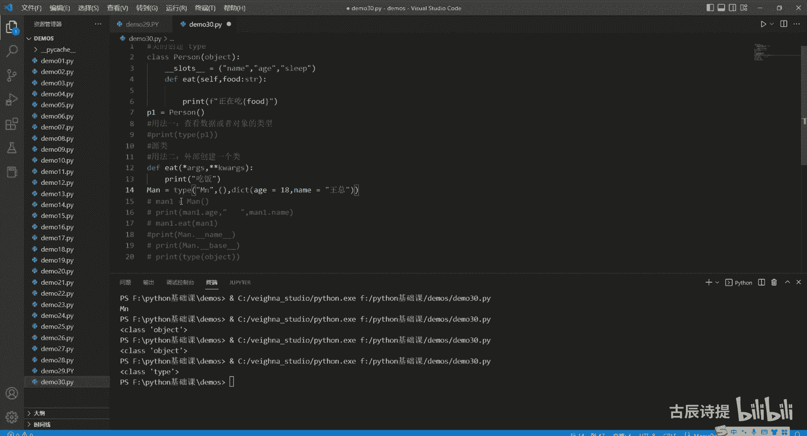

比如说这万一我实例化了，然后慢一点。

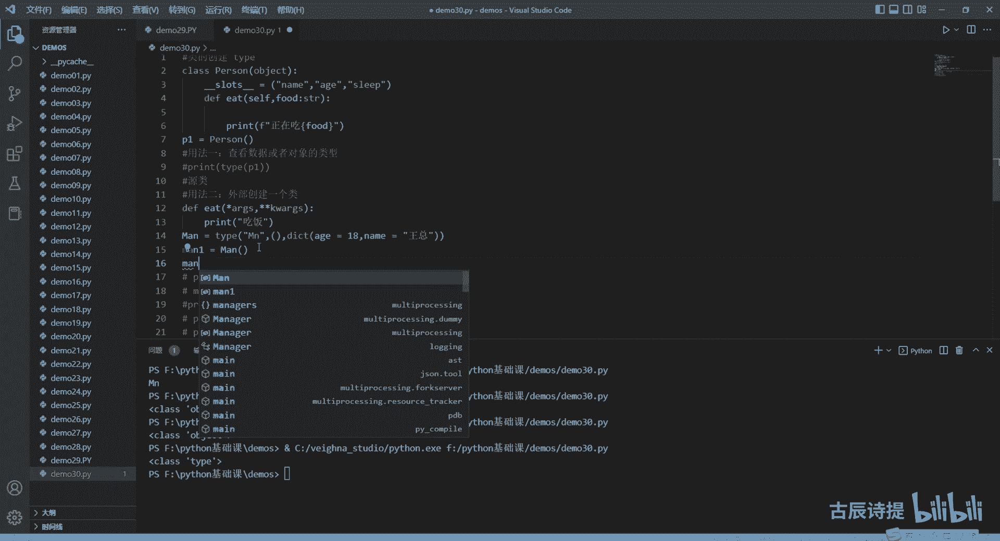

it我等于it，你从外部定义一般都是这么定义，这个时候你慢一点，it就可以直接调用了。

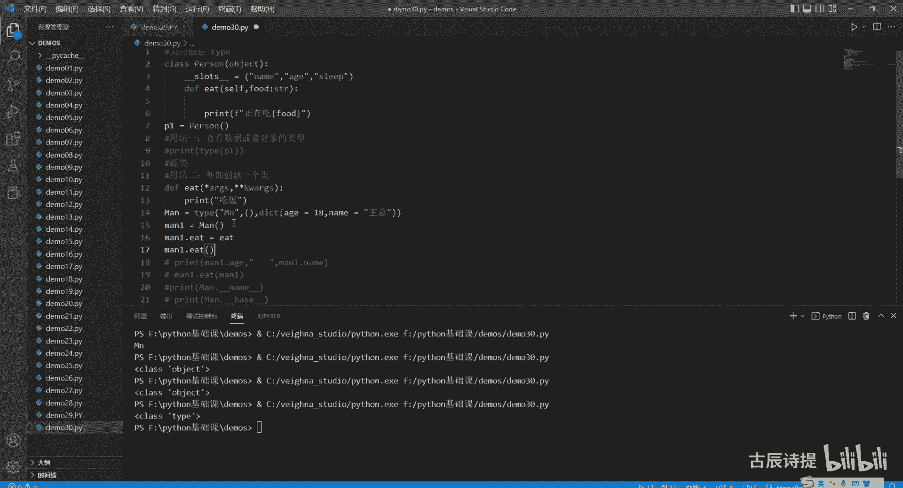

这个时候并不需要传任何的东西，比如说我把它给删掉了，这样的话它就正常了，你从外部定义这个类里边的这个方法，一般是实例化之后去定义，如果说你非得从这个里边定义，你一定要注意就是。

当他在实例化的时候把这个给给除掉啊，当它在实例化的时候。

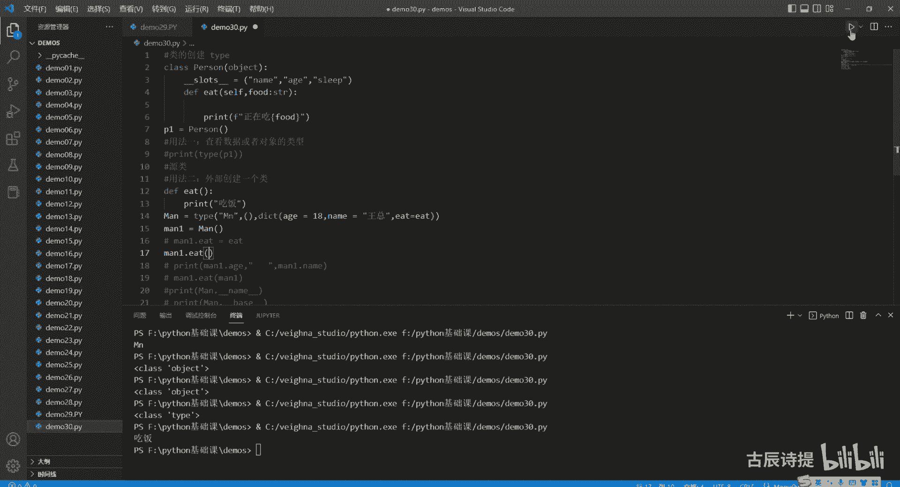

它会出现问题的，所以说你一定要从这儿给它传参，传参呢你可以把你的这个实力给他传进去，比如说我这就写个随便写一个value。

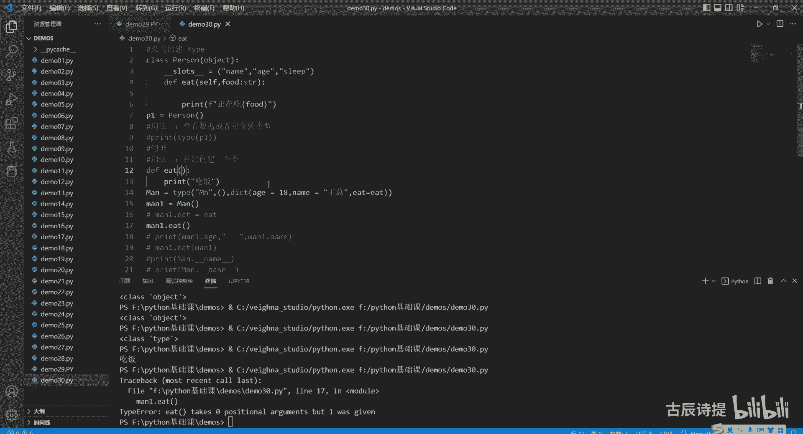

我给它传进去之后，你只要不调用这个value它也可以，但是通常情况下，你不知道就是说会有多少参数参数传进去吗，会用这个新ARJS和这个星星KWARGS，然后往里传，如果说这些参数你用不上的话。

如果咱们再往后延伸一下，如果说我里边想用参数呢，我里边我就这种调用方式，我如何享用参数，首先你第一个你肯定得把这个慢点，这个一给他传过去是吧，传过去你没有东西接，当然你可以先写一个去接的。

比如说你就是他的这个实力，但是有可能你这个it是被别的，这个在别的代码里边被调用了对吧，所以说你这个当调用它的时候，你传进去，它的第一个参数肯定是到这个AR，GS这个里边，因为它是个tube。

咱们之前讲过这个它是一个dict是吧，如果说你想比如说传一个名字过去。

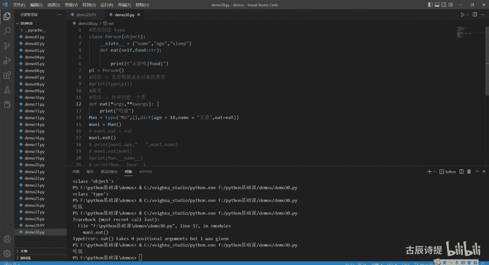

传一个名字过去，比如说我就传这个把这个name。

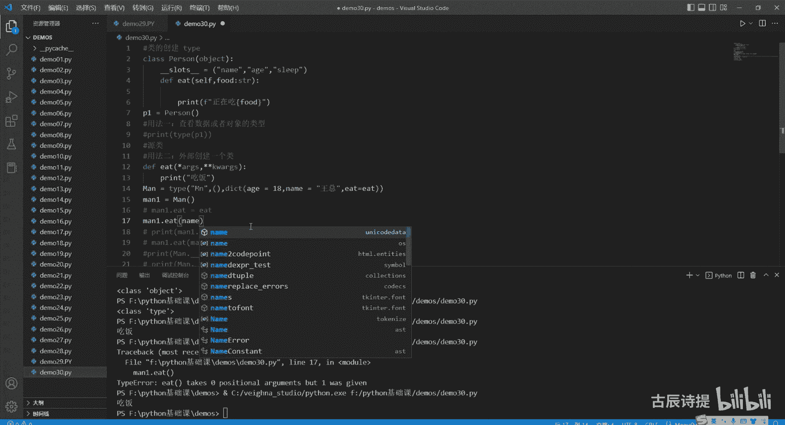

就是这个慢点name给他传进去，就是这个王总给他传给他放进去，那这个就属于是第二个参数传进去的，而且它是一个位置变了位置参数，所以说它也会放到这个ARGS里边，所以所以当你去调用的时候。

你肯定是这样的一幅，A就是呃name等于ARGS杠就是应该是一，因为你是排的是第二个嘛对吧，就是说它是这个就是一是吧，当然你得进行一下判断，如果说只传了一个参数，这会报错的，当然为了简单。

咱们就写了啊name，然后就这个时候你print一个，直接print一个name f在吃饭吧。

你这么去传他也是可以的，王总在吃饭，当然你也可以通过，就是咱们方法里边用关键字参数，比如说name等于嗯，这个时候他就会传到这个KWARGS里边，KWARGS里边。

你怎么去获取呢，通常情况下会判断一下一副KWARGS。

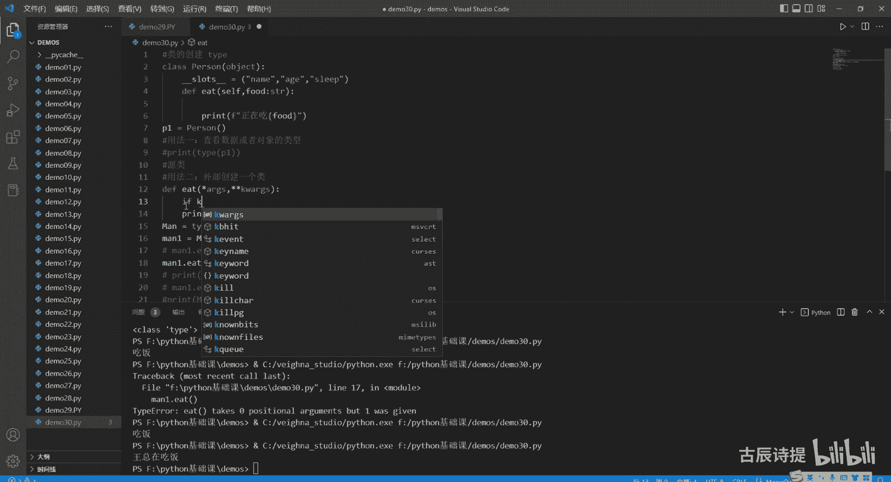

因为它是个字典嘛，点git这个name它有没有。

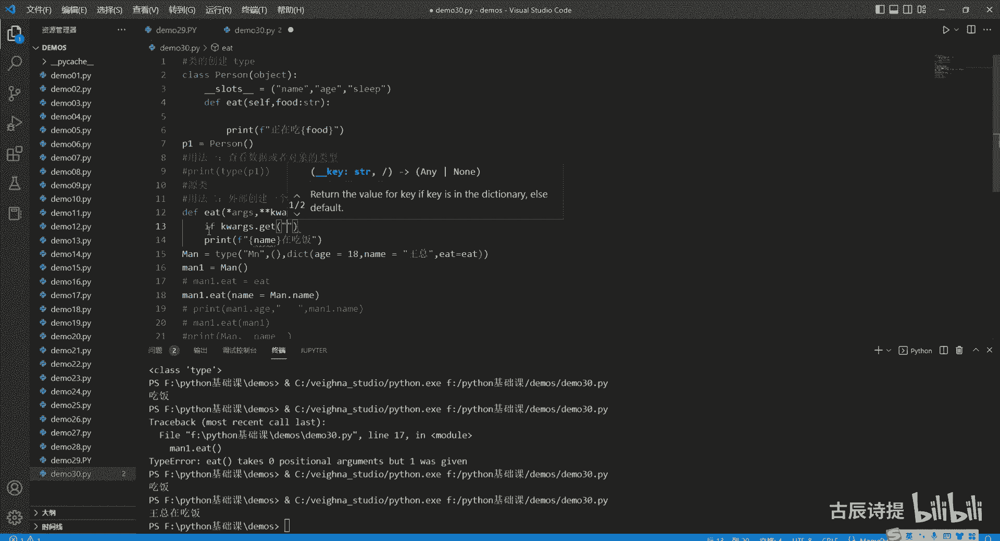

如果没有的话，我给他传出来一个NN，当然这个NN也可以不写，他会自己呃也会默认的，如果没有就会传回去一个NN是吧，如果说如果没有的话，if not我就不写这个谁在吃饭了。

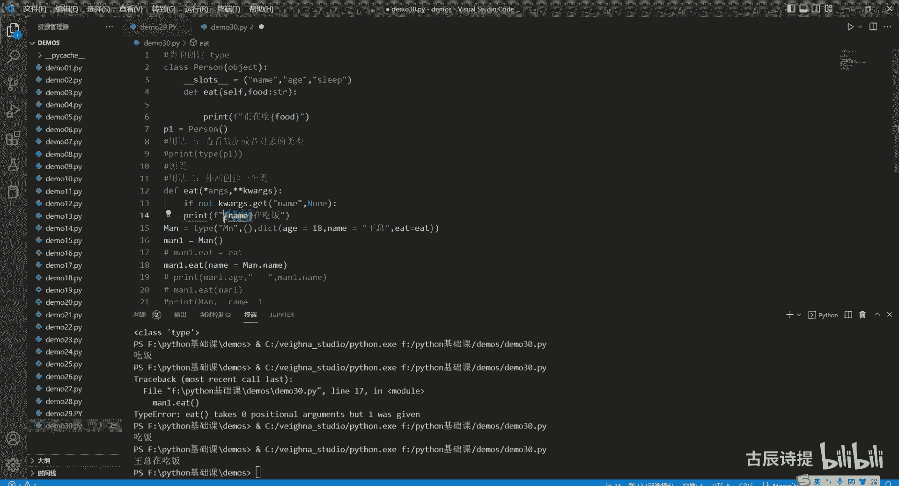

对不对，然后说如果有的话，Else。

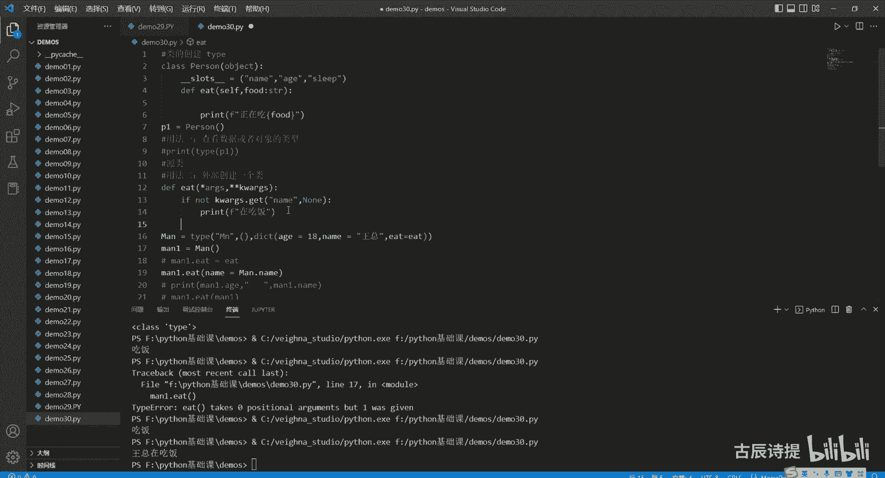

ELS如果有，然后就print这个呃冒号。

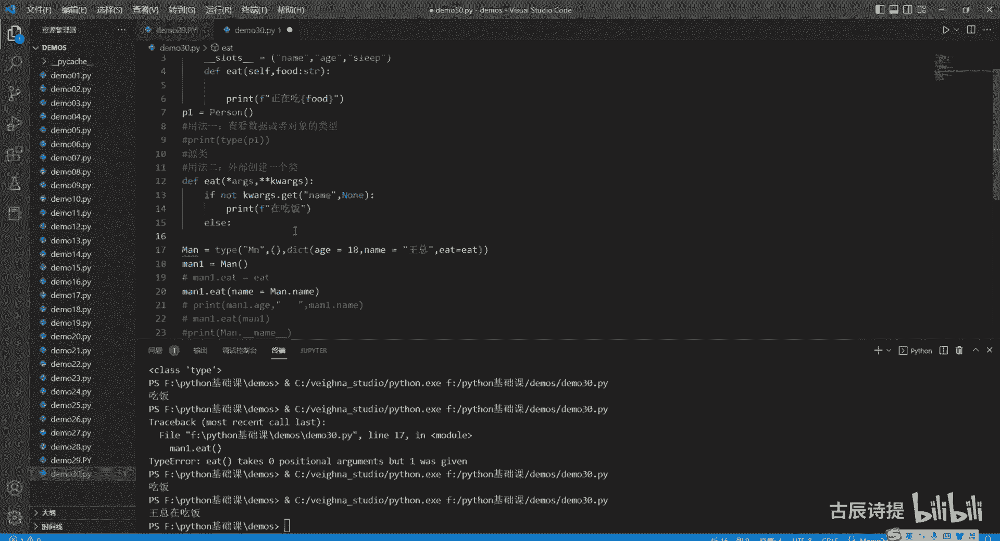

这个有在吃饭。

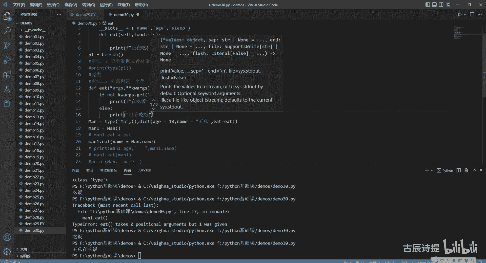

点format后边放上这个KWARGS。

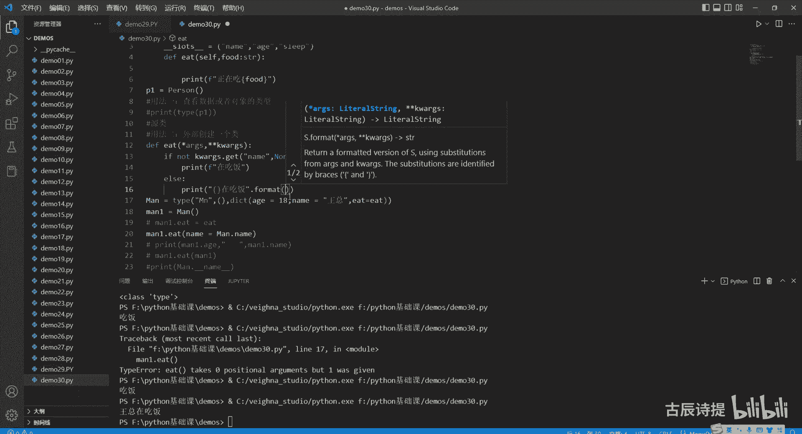

然后就写一个name对吧。

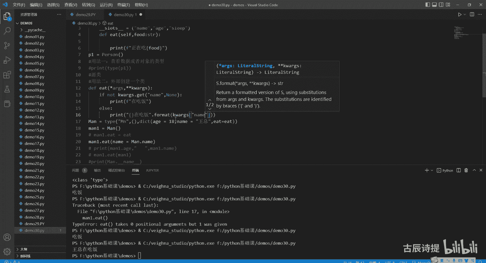

然后这个时候你去运行王总在吃饭也是可以的，当然这个肯定一般写代码不会这么写啊，很容易出错误。

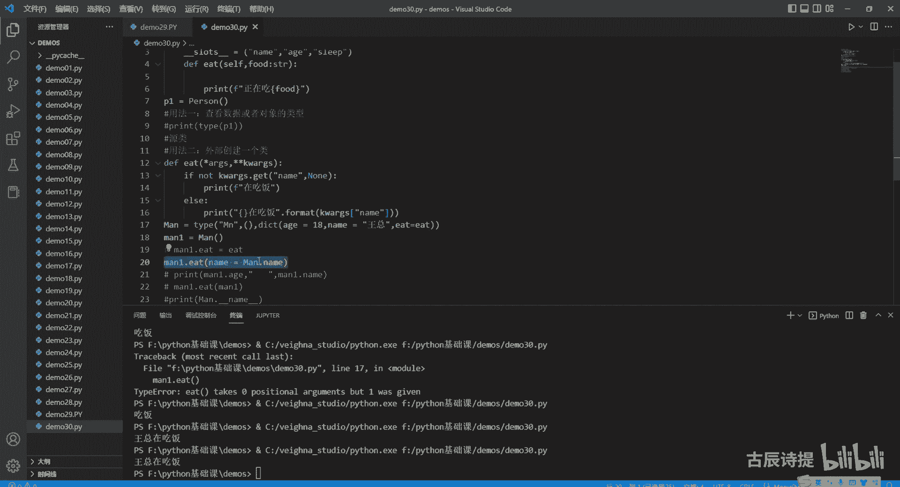

但是你得理解它里边的调用关系好吧。

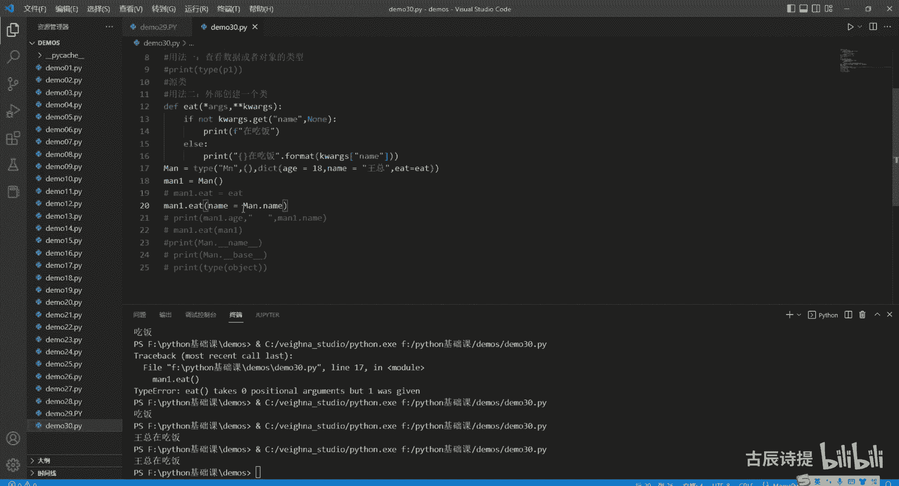

这个呢就跟大家讲到这，这种type的这种创建类的方式呢。

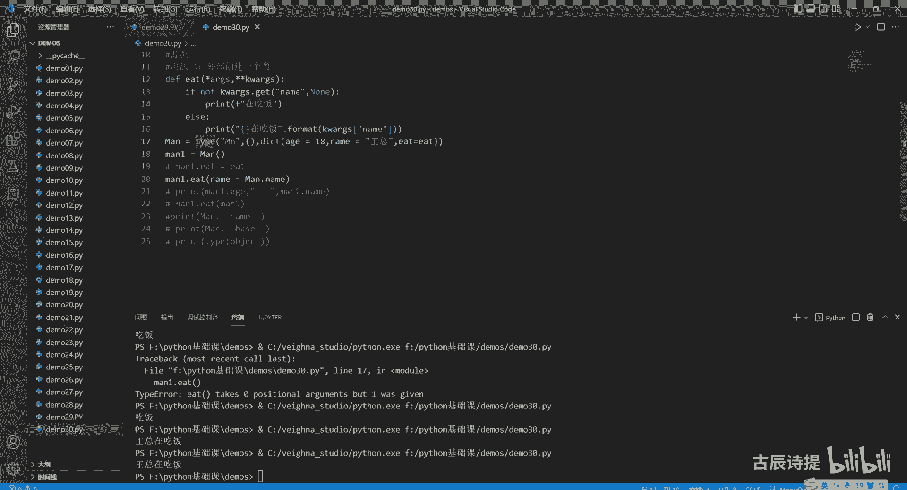

基本上不怎么用，但是你看到这个你需要自己去能看明白啊。

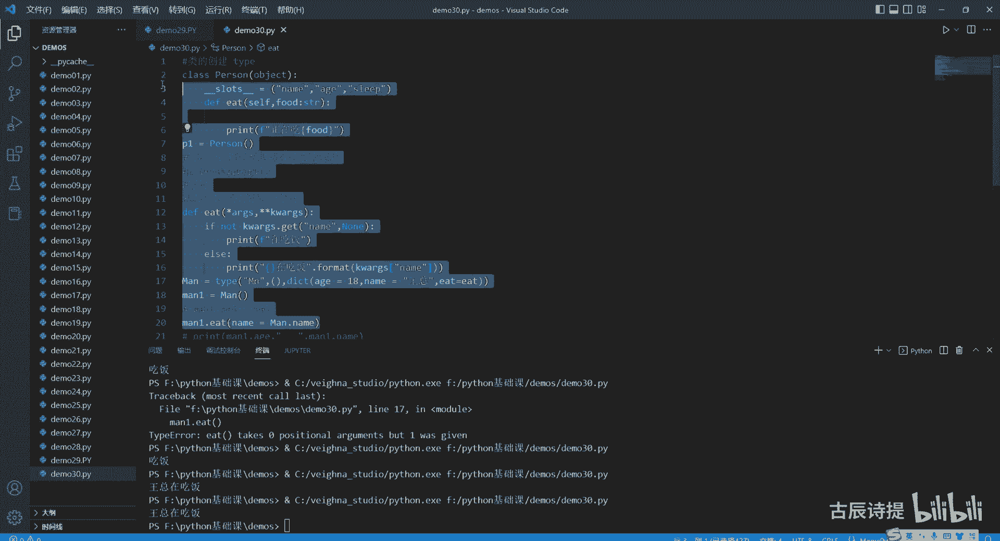

能看明白好，今天要给大家讲的内容呢是猿类，猿类猿类咱们刚才说过这个猿类，人类啊，人类这个是我自己定义的啊，一个是tap，一个是object，Type，是所有数据类型的JECT啊，是说是所有数据类型的。

就是最顶层的，然后object是所有类的最顶层的那个超类，就是父类的父类，父类就是反正你找到最后所有的父类都往上找，就会找到它，你所有的类型往上找都会找到它啊，这个猿类呢是Python里边。

就是说大家形成的这种定义，说的是这个tap啊，说的是tap也可以自己去创建一个圆类，只是在tap用tap这个呃类，然后生成就是说实例化一个子类，然后去进行一些操作，满足什么呢。

满足在类的继承中实现不了的一些需求，就比如说我创建了一个类，比如叫person，这个类，我在实例化的时候，我必须要求它实例化的那个类名，必须都是首字母为大写的P开始的，不然的话我就报错了。

你像这样的一个需求，你是用这个类的继承是写不了的，或者就算能实现也会很复杂，对不对，那这个怎么去实现呢，在讲人类之前，咱们先要说一个杠杠INIT，不是不是刚刚刚刚new，刚刚六。

咱们同样的先定义一个class person。

先定一个class person，然后咱们写一下这个杠杠INIT。

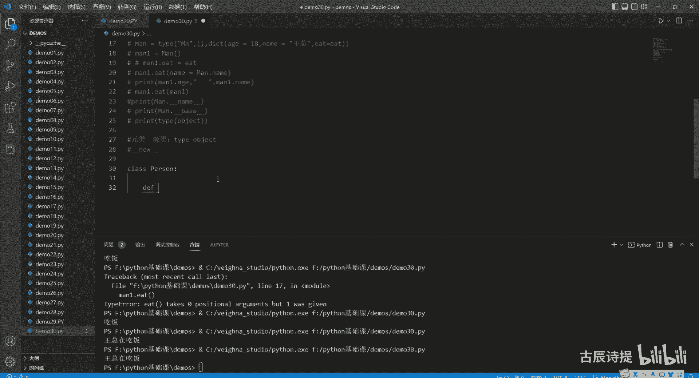

在这我print一个构造函数执行。

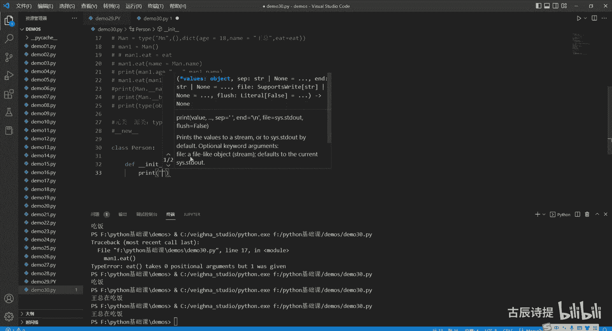

咱们以前说过，当在实例化的时候。

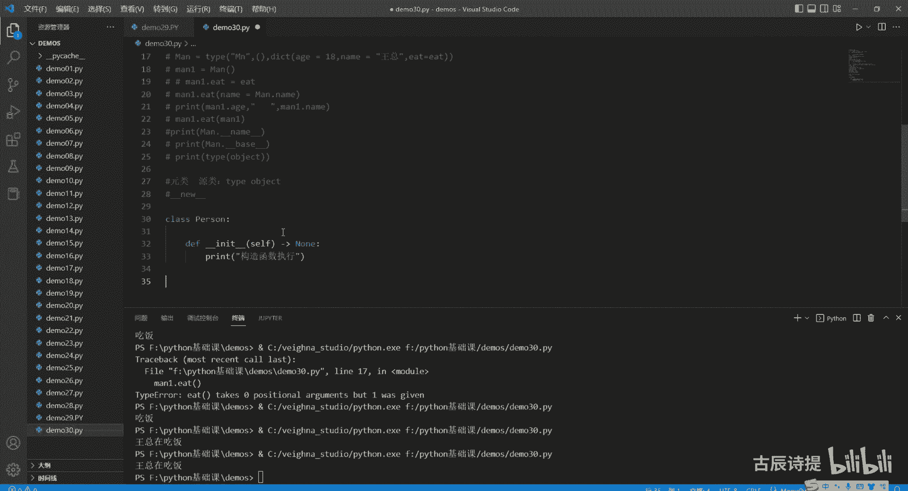

比如说P1，我等于person。

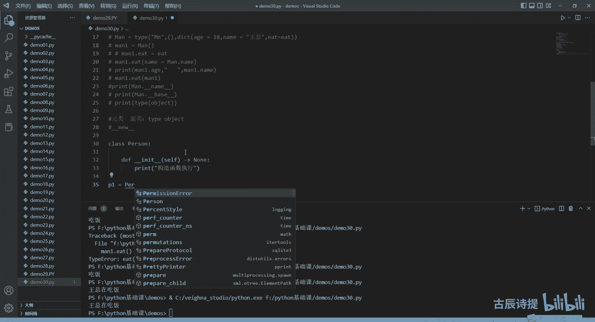

我在实例化的时候，他自己会主动的去执行这个杠杠emit啊。

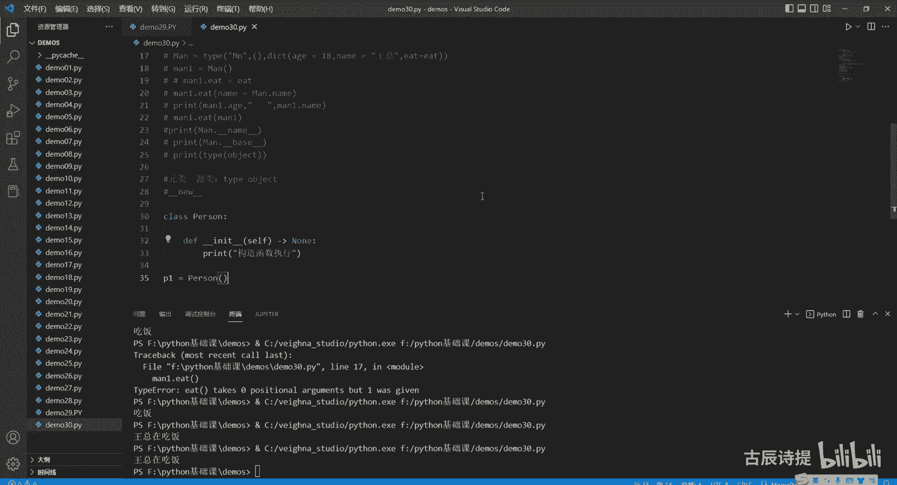

会执行构造函数，正在执行，他会自己去执行，那就是说在实例化一个类，他做的第一件事就是我去弄这个，就是创建这个构造函数吗，执行这个构造函数嘛，肯定是不是的，当你有这个类了，这个类在计算机底层。

它是在一块空间里边去存储的，当我去实例化的时候，你的这个实力是需要单独一块空间去存放的，对不对，所以说第一步是你这个类去向内存，去给我的这个实力P去申请一块内存空间，它执行的就是DF，刚刚new杠杠六。

可能有一些老板们可能也听过，比如说像C加加的时候呃，需要申请内存，因为C加加是可以直接和这个计算机底层，去打交道的语言嘛，有一部分的内存，这个程序员是可以自己来控制的。

当他想把这个就是说数据存储在它可以控制的，这一部分内存里边，它可以什么呀，嗯就是MLOCK，或者说new一个啊，new1块空间啊，new一个新的类，就是这个new在Python里边啊。

这个也是类里边他自己去执行的这么一个方法，而且是第一个执行的，这个它是一个类方法，你看CLS它是一个类方法，然后这个里边tap是self，其实是什么呢，就是说其实就是这个类的。

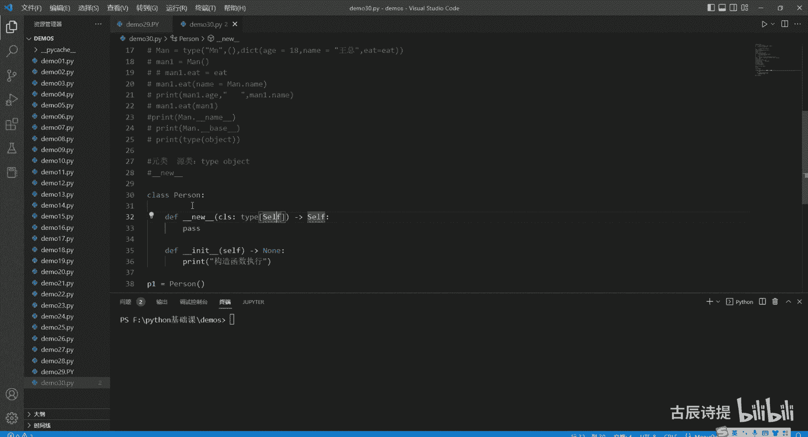

本身就是实例化之后的，但是他还没有进行实例化呢，或者创建的对吧，所以说它传回的这个应该是本身，对不对，那本身的话，比如说咱们应该给他写成这个person好吧，返回的呢也是一个本身它是有返回值的啊。

也是本身，但是他还没有创建呢，你就在里边写了，这就涉及到一个鸡生蛋和蛋生鸡的问题了，呃当然这个是这俩都是代码注释注释啊，完全可以把它删掉对吧，代码注释有个单独的这个词汇啊，它叫PYTHIN。

应该是这么写啊，这个有兴趣的话，咱们可以在后边的就是讲库或者三方库的时候，给大家讲这个Python hint，他其实对写代码，尤其是写的比较多的代码的时候，会有很大的帮助啊，这个时候你怎么去解决它呢。

就是直接就加上一个双引号，就解决了这个问题了。

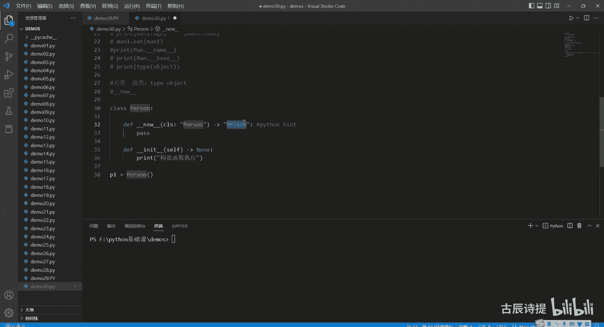

好好在这里面做什么动作呢，咱们就print一个new方法啊。

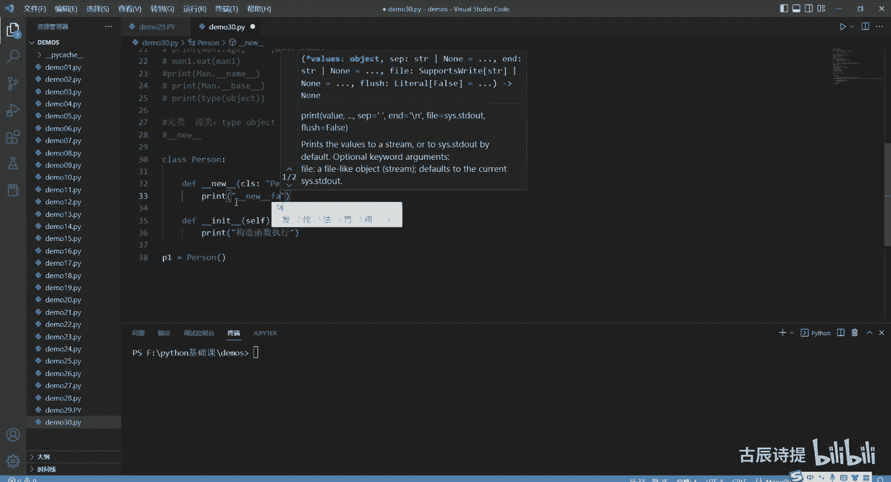

函数吧，执行咱们看一看他先执行哪个。

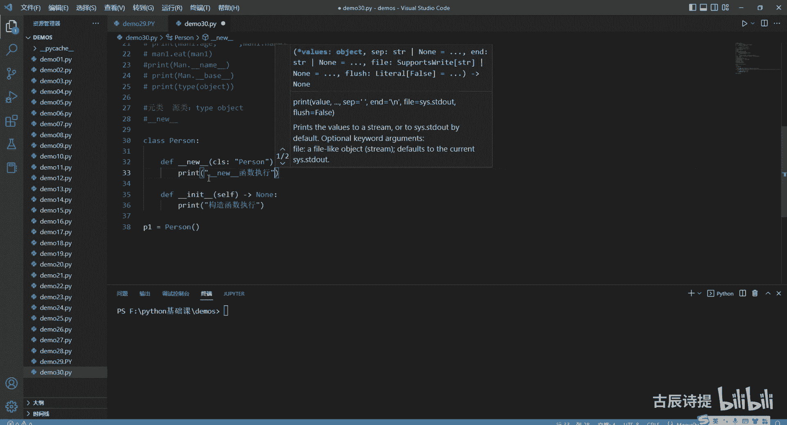

因为它有返回值，所以说你一定要给他写完整了，他是return，然后用super括号点杠杠new啊，括号里面把cl s就是这个类本身给它传进去好，我实例化的时候，咱们可以看一下。

他执行的是先执行刚刚new函数，然后再执行构造函数，在执行构造函数，通常情况下，咱们不用去重写这个刚刚new为了传参，咱们很多时候会重写这个刚刚unit，你是为了传参嘛，然后再把这个传过来的参数。

变成我类自己的参数，其实杠杠new里边也可以去定义一些东西的，但是一般就是大家形成了一个共识，不在刚刚new里边去操作，因为刚刚new他可能做的事情更加的重要，去跟底层去打交道的对吧。

呃啊但是有一种情况啊，很多时候会用到这个刚刚new就是什么情况呢，就是单例模式，单例模式是什么意思，就是我这个类只允许有一个实例化对象，只允许有一个实例化对象，如果他还要被实例化。

我就把我之前实例化的那个对象传给他，就是返回给那个变量，能理解我的意思吗。

就是比如说我这P2，我还要实例化一个。

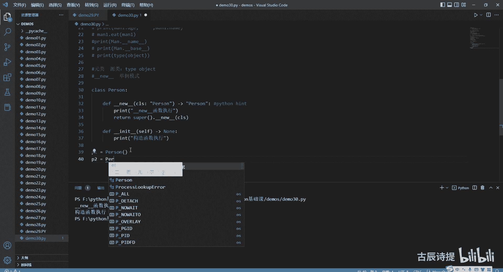

实例化之后呢，这俩是P1和P2指向的是同一块内存，他俩是完全相等的，这个第二个的实例化，只不过是接收了前面一个这个它的一个地址，这个有什么作用呢，就比如说咱们在做这个量化的时候。

咱们需要跟行情服务器和这个交易服务器，气相连接，行情服务器呢是来获取行情的，交易服务器是完成委托他的发送啊，撮合呀，以及它回调，就是他呃委托成功了或者拒拒单了，会给你回调。

回调你代码里边的一些方法和函数，需要跟这两个服务器去相连接，行情服务器呢你连接多少应该问题都不大，它没有限制，但是交易服务器一般都会有限制，比如连四个或者连六个，你要连连的再多，他就不让你登了。

那这个时候比如说我还想着有一个，就是说我可以在我本地我登一个，我看看现在我的持仓啊什么的，看看他的就是账户的行情对吧，我另外一个呢我还想录录录一录我的这个数据，我还有一个呢我想执行我的这个程序化代码。

但是呢我的这个策略又比较多，我得分几个就是进程让他单独跑，这个时候你就会发现不够用了，所以说你得严格控制，我的一个程序里边只运行一个跟这个呃，说就是跟这个交易服务器去连接，但是代码很多对吧。

因为你里边得完成很多的东西，所以说就很容易你又实例化了一个，这个时候呢如果说你在实例化，它就会把之前已经实例化好的，那个就是给你直接复制过来，因为你到时候你得这个行情服务器这个接口，你得来回传是吧。

它一般用在这儿，再比如你像服务，像这个数据库，我连接我只需要连接一次就行，然后我实例化我只要实例化一个就行，以后不管是存还是存，还是这个区还是增还是改，就是说还是删，我都用那一个就是实例化对象就可以了。

就完全满足条件了啊，这个时候是单例模式的，它的一个应用场景怎么来操作呢，怎么来写呢，其实很简单，就是他做一下判断，If not has a d t r。

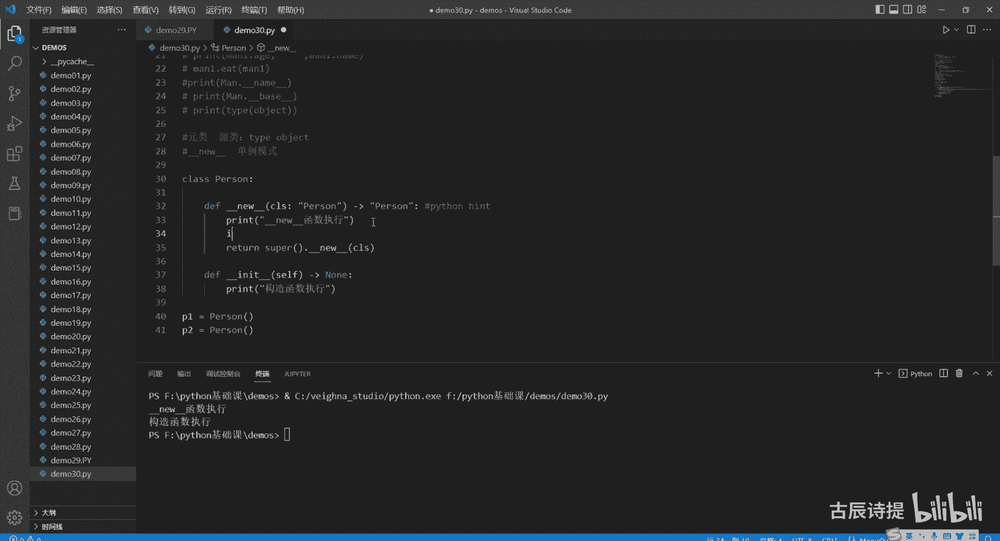

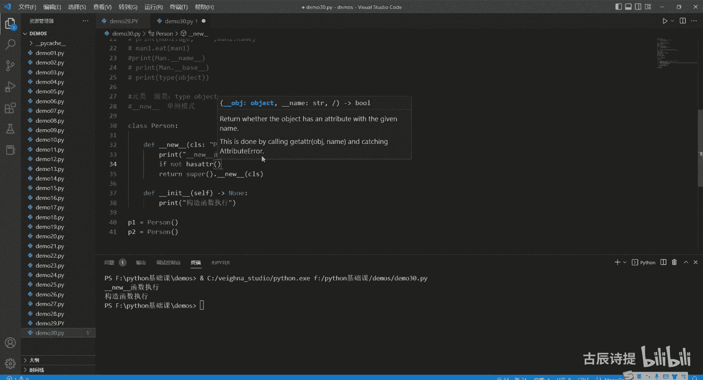

就是1has AD d r，你从它字面上就能理解有没有这个属性值，就第一个是这个object，就是这个对象，然后后边呢用用这个就是字符串的格式，写上你的这个属性，其实也就是变量啊，就是说就是变量名。

比如说它是instance s t a NC e，有没有这个变量，如果说他没有的话，没有的话，我就当前C1定是跟他一样的啊，instance就等于什么呢，我不是这个instance。

我是C就是这个类的这个instance，我就等于其实就做这个，我去执行这个实例化的啊，不是杠杠new的这个操作去给我开辟空间去。

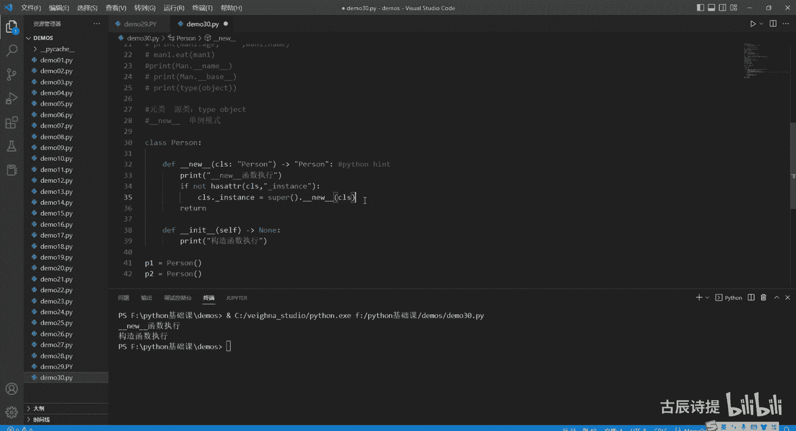

然后最后呢我把这个cs点。

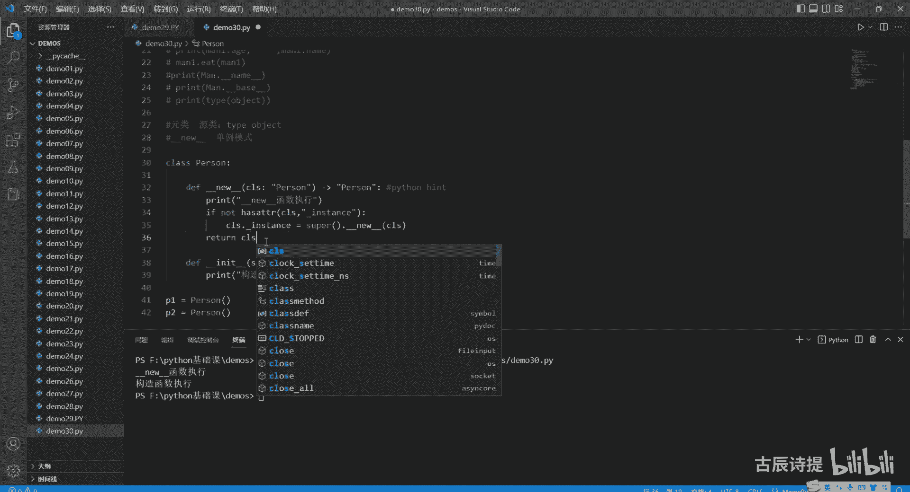

instance给他返回出去，这样就实现了一个就是说单例其实很简单啊，就是has a，has a t t r和这个SATTR和这个GATTR，就是这个是它返回的是一个布尔值，然后如果说是GATTR。

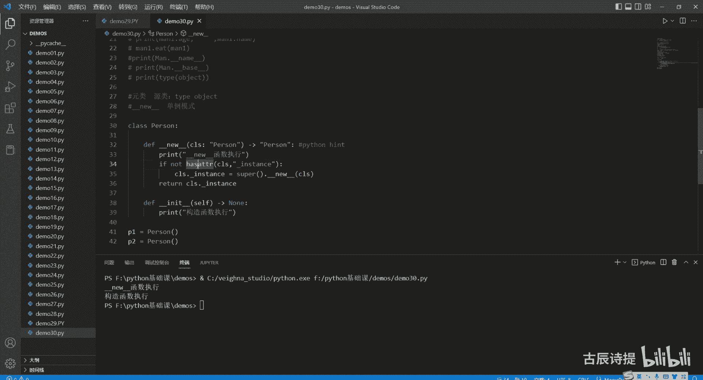

就是去获取它返回的是一个。

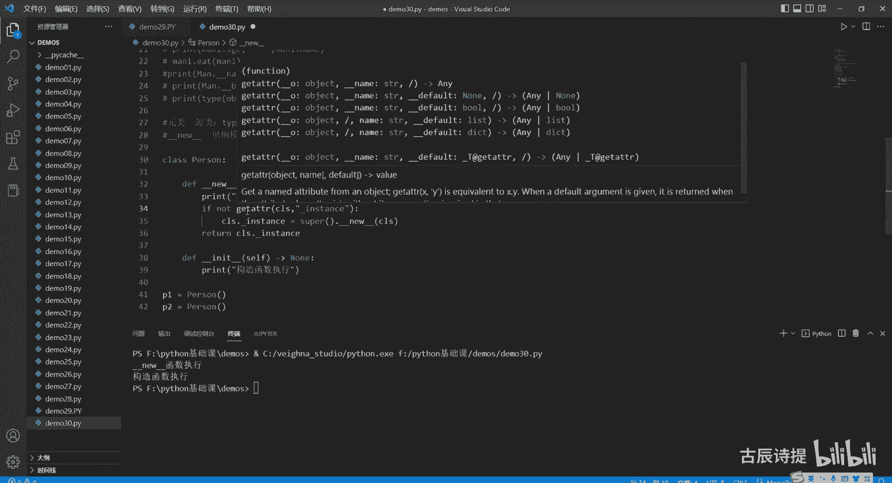

就是你的那个属性的值啊，然后sat a t t r就是SET，就是去设置你那个属性的值，这个很容易理解啊，这三个内置的这个函数啊，这个时候咱们可以去验证一下是吧。

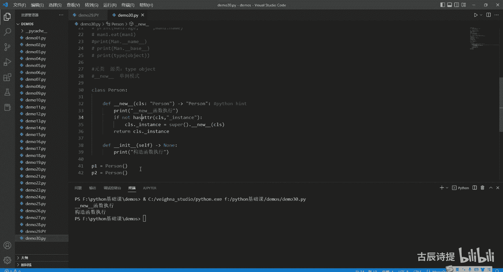

它实例化了两个，我这个时候可以print一下P1是不是等于P2，P r n t，是吧，true它是完全相等的啊。

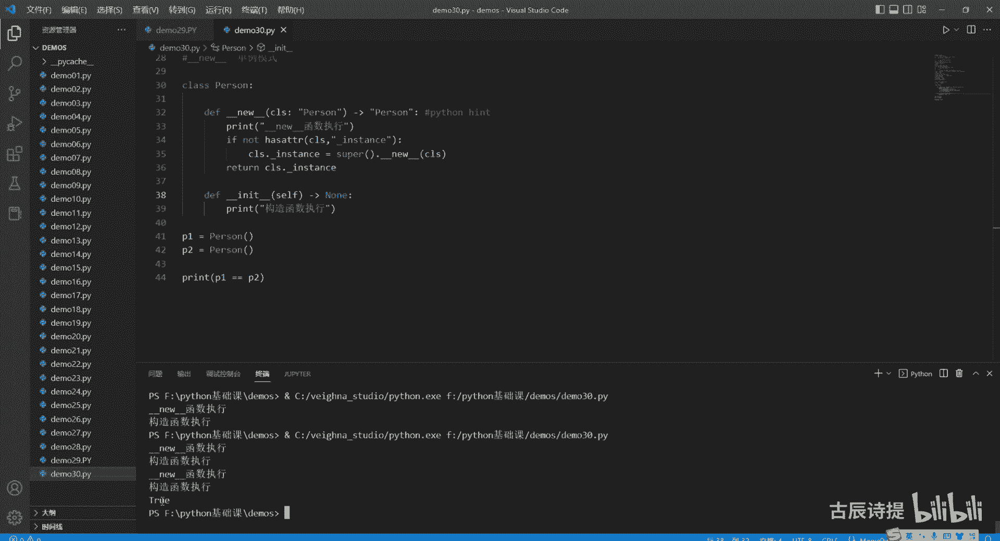

咱们也可以看一下，print一下DP。

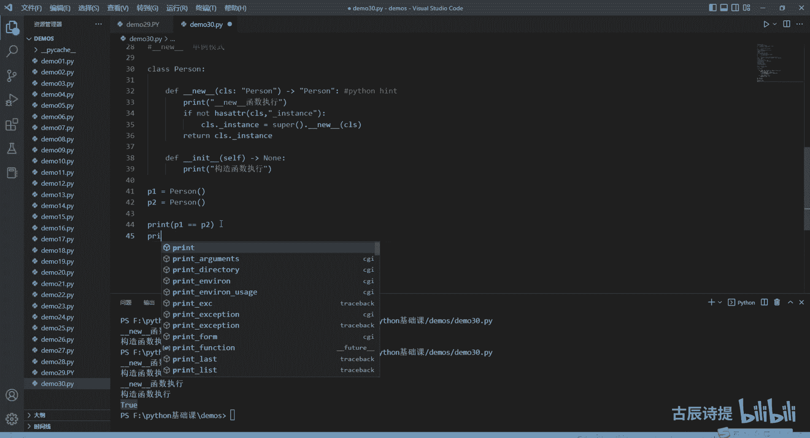

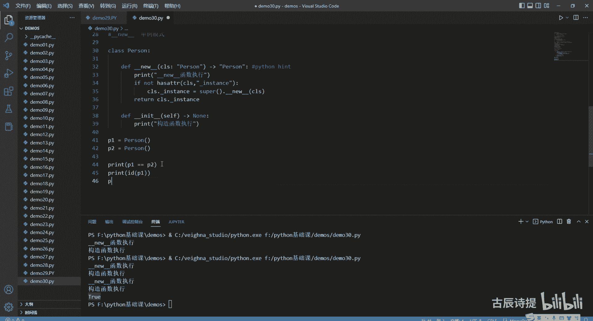

print下IDPR啊，它是完全相等的。


完全相等的，当然你这么写，就这个单例模式还不完全，因为如果说是传参的话，咱们在INIT里面有个name。


传参是很正常的呀，类一般都会传参的，对不对，在实际应用过程中。


这个时候就会报错的，就会报错的，所以说这个里边后边你还得加上新ARGS，然后星星ARGSKWARGS。


好从这儿呢再给添上他们的这个参数是吧，小明，小红，这时候咱们可以去再运行一下。


你会发现这俩是一模一样的，然后也没有问题了啊。


这个就是单例模式，同样的咱们可以print一下这个P1点name，还有print一下P2点name再输出。


再看一下，你会发现两个输出的都是小红啊，因为当他执行完这个杠六六之后，就是杠杠六之后，它会执行杠杠，在执行第二遍的时候，它会把它这个值又会又给复成了这个小红啊，然后他俩都是一样的。

所以P点name和P2点name都是小红了啊。


这就是单例模式，为什么要给大家讲这个刚刚new呢。


因为咱们用的这个猿类就是一般使用的场景。


都是在这个刚刚new里边儿去做一些工作。


去做一些工作好，咱们开始说。


就是说之前咱们说过的这个我的一个需求，就是我必须要求我的这个比如说person类，它的子类的名字必须都以大写的P开头。


不然的话就报错，这样的方式怎么去写呢，首先我定义一个person类。


他继承自object。


然后我DNF刚刚init debt cf。


点name等于name，我传入一个name。


好看来df send，然后这边我就只有一个C吧。


然后就print。


cf点name正在唱歌。


就是这样的一个类，它的子类我必须要求子类的这个类名，必须是以大写的P开头的，如何去完成这个就需要咱们的这个就是meta class，就是这个m e t a meta class。

meta class呢我从这我自己定义一个就是my m e t，My ma，它继承自什么呢，tape继承自这个tap，继承自这个type，这个tab肯定是用它不是查看数据类型的功能啊。

肯定是用它创建类的这个功能，在他创建的过程中，我去做一些工作，对不对，好，那这个这个写好之后。


他应该写什么呢，应该是杠杠六，就是我去申请内存线，就CRS传入的是我这个my meta本身，我既然继承自tap，我后边这个参数肯定是要符合tap的，这个参数的，也就是那个三个类型，第一个是name。

就是STR就是类的类名，第二个就是bees就是什么呀，就是一个tuple里面存放的是它的父类，然后第三个是什么呢，第三个就是我的setting，c e t t setting就是一个支点，我传进去之后。

我正常的应该是return一个，就是这个super括号点杠杠嗯。


那我把cs给他传过去，然后同样的我还需要把name给他传过去。


bases传过去，然后sitting给他传过去呃。


这个写的就等于是没写，因为我返回了一个用tap，然后去new一个空间，然后然后接受这些参数对吧，就写了等于没有写，是不是，所以你可以做工作的，就是在中间，就是在中间你需要去做什么工作呢。


就是你看啊这个我传了这个name，咱们咱们之前也看过，就是说也知道你传入了这个name。


它是你的这个名字，就是你的这个子类的这个名字。


对不对，所以说我就可以通过这个name来判断，If not name，点start with大写的P，我就直接rise一个value。


Error，然后里面写上该类补的名称。


不是以，这个P开头的，是吧。


直接这么写就可以了，那我怎就是怎么作用在这个类上呢。


我把这个类放下来，当然你写在上面也可以好，我就给它放下来，这个里边添上一个，咱们刚才写的就是这个meta class。


m e ta meta class等于c l a s s matter。


class等于这个my matter好。


这个时候我再尝试去，比如说我定一个类。


就是class man，我继承自我的这个person。


然后我直接写个空位啊，这个时候我实例化这个man1等于M。


需要传入东西吗，传入一个name是吧，就是小张是吧。

这是我man一点sin。

它是有这个方法的，调用一下，咱们看一下，它就会报错，Value error，该类的名称不是以P开头的是吧，是不是就执行到这了，如果说我把它呃用这个P开头呢，填一个P。


cs一下你会发现他没有问题。


小张正在唱歌是吧，那它是怎么个原理呢。


其实啊就是说我把这个打开，我把这个先给关掉。


其实他的操作是不是就是一样的，就是说我定一个类，就是我去定义一个类，我用这个matter class，我不能把这个给注销掉啊，我。


把它给注销掉吧，其实我就是定义一个这个person。


PRSN定义一个这个person。


然后我这个person我这个是用什么呢，之前咱们是用这个tap对吧，但是MEMYMATA是它的子类，所以说我就用my meta直接去这么来写，他的这个名称。


我就用来代替是吧，用person写的跟这个变量是一样的就可以了，然后它的父类咱们是继承自什么object，当然不写也可以啊，O b j e c t object。

然后它的设置里边呢我就直接写一个dict。

name等于。


小张我就直接给他去赋值上了，这个时候person它是一个类吧，然后它是继承自object。


然后经过my meta，就是它的原类进行处理的这么一个类。

这个时候我用p man，然后继承自我的这个person。


我先把最后一个行给注释了啊，因为没有，就是说从里边复制这个就是定义它的这个方法，这个时候如果说他的手就是首字母。


不是大写的P，咱们再看一下，它也会跑错的，该类的名称不是以P开头的，但是如果说我这写上这个P，然后我实例化之后。


我再从这我定义一个方法，就是这个S然后歌曲名啊。


我就从这给他粘一下吧。


DFC正在唱歌的这个里边儿啊，就别写歌曲名了是吧，好print，这个里边放个name name，然后这个name正在唱歌。


这个时候呢咱们可以用main一点。


sin等于这个sin是吧，然后man一点直接调用这个信。


然后里边传入这个name，传说这个name，当然这个name呃。


这个本身的属性里边是有的，咱们就可以main一点。


name m a n慢一点点好。


咱们执行一下，Takes no arguments，啊这个里边没有了是吧，这样好。


小张正在唱歌，这个也就实现了。


他其实这个就是从外部创建了一个这个类。


通过my meta，只不过是把以前这个tap改成了这个my meta。


但是my meta它里边是有这个别的操作的。


从这里边进行了限制。


但是通常不这么写啊，这个这么写，你从外部定义方法的时候也比较麻烦，所以说一般情况下是采取这种写法，用这个matt class等于my meta，这个时候你再就是说去给他去。

就是说做继承的时候或者做派生类的时候。

他就会就是说去执行这个里边的，他的一些判定条件啊。

什么的，你想想这个可以应用在哪啊，其实咱们想想，如果说咱们有一堆策略，或者说是不能说是一堆策略，一个策略，然后有很多个合约，你很多个合约需要通过这个sitting，去把里边的这个参数给改掉。

然后它就形成了很多个的这样的一个策略，对不对，然后你启动的时候是一个一个去启动它嘛，那你白天启动没有问题，都启动没有问题，但是你晚上如果去启动它是不是就有问题了，因为有一些是没有夜盘的，比如像鸡蛋。

比如像苹果，它是没有夜盘的，你在晚上启动的时候，如果说从这对他的这个时间加以判定，比如说找到这个simple是吧，在这个setting里面找到very simple。

然后通过very simple进行一个判断，如果说他不是晚上它没有夜盘的品种，我就不让他去启动了是吧，然后我去就是直接呃就是发起一个这个错误，然后从外部我踹我去接受这个错误，然后我就不启动它了。

这样也是可以的对吧，当然有些复杂了，画蛇键添添足了，你既然能从这个里面去判断，你完全可以从这个CTA引擎里边去给它进行，判断是吧，看他是不是这个有没有夜盘的，这个它是不是也盘的合约。

然后用不用需要启动它，你没必要说再去实例化的时候，或者创建这个类的时候给它加以判断，对不对。


好一般情况下不怎么会用到这些啊。


做一个了解。

