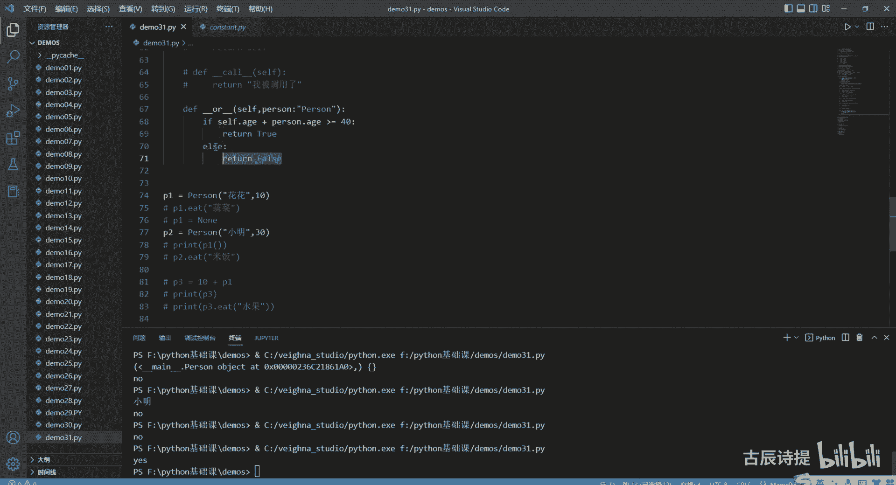

# 第31节课 类7 - P1 - 古辰诗提 - BV1wm411R7We

欢迎大家来到从零开始量化系列课程，Python基础课的第31课，上一节课咱们讲了猿类的使用，可能比较难一点，也比较抽象一些，尽可能的去理解吧，如果实在理解不了也没事，其实跟咱们量化的关系也不是特别大。

只不过是从一个更深层次的角度，给大家说了一下这个类，它从计算机的底层是怎么去创建的，以及在里边演示的如何去调用啊，如果说你能够把这些给捋清楚，我相信在类的构造以及以后方法的调用啊。

继承啊这一块肯定是会更加的透彻啊，如果万一出现问题的话，你大概能知道问题在哪，好这节课呢咱们首先第一个要讲的是枚举类，枚举类，咱们以前接触过，就是LST，等于咱们快速生成一个用列表推导式吧。

哎for i in range100，这是一个列表，咱们当时用的时候，如果说你去便利的话，比如说for value in HT，你去便利它可以输出出来是吧，print这个value，这个很简单。

但是如果说你想获取这个里边它的索引值，你就需要加个括号，然后这边加一个EU啊，emate mate是吧，英语不是特别好，这个时候呢你前面就要加一个index，或者你用其他的这个参数来接一下。

这样的话你就可以把这个index也输出出来，然后我中间再加一个，中间加一个冒号吧，这样的话就可以连着它的前面的索引，和后边的这个数字一起给输给输出出来，这个是咱们之前就是使用过的。

今天咱们要讲的这个枚举类呢是一个类，你像这个是内置的一个类，咱们今天要讲的是经常使用的，是需要从外边去引用的，from这import，是主要是讲的这个类，其实枚举，你不要把它想的太复杂。

他其实简单来说就是呃，它的就是一个有限个数元素的，这样的一个常量类型，你能这么理解就可以了，就是有限个数，个数的有限个数元素的个数据集，就是他其实就是给他把所有的都全罗列出来，比如说一周有七天。

第一天是叫星期一，第二天是叫星期二，第三天是叫星期三，然后一年有四季，然后这个呃一年有12个月，就是这些是一些，就是说你可以有限个数给他罗列出来的，当然如果说你在使用的时候。

比如说咱们的交易所是有五个起，五个期货交易所的，马上就是六个期货交易所了，就是你这个几个期货交易所，它就是是有限个数的，但是呢你在使用过程中，比如你发委托，你肯定得需要用到这个exchange。

你需要定义它，如果说你单纯的用字符串去来回传的话，很容易出问题，这个时候你定义成一个枚举类，这样就会显得很方便，比如说我定义一个class exchange，然后他继承自这个，继承职责。

然后直接可以从下面写他的这个类的这个属性，比如SHFE一般都习惯使用这个大写，因为大写代表的是常量嘛，在Python里边嗯，就是其实这个都是一个一呃，有有限个常量的一个集合。

他就是代表的SHFE这个字符串是DCE，DCE的字符串CZC1，还有安妮上汽能源，还有一个CFFEX，你就直接这样写就可以了就可以了，这个里边它的元素它是不可以更改的，它是不可以更改的。

比如说我想给他改一下，就是exchange点这个SHF等于SH，你运你运行一下，它会是会去报错的，但是如果说你给他重新去赋值，他是不会报错的，但是一般情况下不会去给它重新去复制。

因为你固定的东西你就没必要去改它是吧，这个里边比较常用的，还有一个就是它的一个叫下划线，下划线你可以输出一下，它是一个字典，字典里边会给你把这个里边的类属性，和这个他的这个名字。

就是给你都全都全罗列出来，S h i f e，这是key，然后后边就是这个DCECDCE都会给你罗，都会给你罗列出来，后边是一个exchange，它的类里边点INE啊，其实就是如果你需要它相互转换的话。

比如说从这个字符串我转换成exchange点SHFE，从exchange点SHFE转换成这个字符串的格式，它是怎么操作呢，就是exchange d s h f e，这个时候你要转换的话。

就直接用这个value就可以了，这个咱们可以print一下，他就是这个SHFE啊，呃它是字符串，咱们可以看一下他这个tap，啊也可以你输出的时候，比如说r e pr用这个它会给你输出成字符串啊。

用IPR，IPR是代表着可以给这个就是转换成解释器，能读懂的这个语言，然后STR是基本上转换成咱们更偏向于，就是咱们人去读懂的这样的一个语言，RAPR是给解释器的，好下一个就是print一下。

把这个SHFE字符串格式给它，转换成这个用这个类，然后属性点属性的这个方式就是直接exchange，然后里面加上SHB，然后咱们可以看一下这个就exchange点SHF1，咱们也可以看一下他的这个ta。

它是一个exchange枚举类的里边exchange的这个类型啊，如果说咱们再稍微讲多点，如果说我有一个比如说跟他一模一样的，比如说我就是写错了，SH等于SHF这样是可以的吗，我看看啊。

然后咱们可以看一下，print一个这个exchange点members，杠杠members，他这个也是没有问题的对吧，他这个SH然后就等于这个啊，这个这种方式，如果说你想让它里边。

就是说后边的值保持一致的话，你前面不能一样啊，你前面如果是SHF1，如果前面是一样，它会报错的，就是这个变量名是一样，它会报错的，但如果后面的这个值它它是一样是可以的，如果说你不想让它一样。

你就可以在导入一个就是呃叫unique，应该是独一无二的意思，你可以给它加上一个装饰器啊，这这个时候咱们可以看一下，它就会报错的，因为两个的值都一样了是吧，但是如果说我把这个给注释了，它就没有问题啊。

这个是确保，确保枚举类中枚举类中的，value值是独一无二的，啊就是这个就是它的这个用法，咱们可以看一下，其实在咱们VMPY里边，很多地方用到了这个枚举值，它主要主要集中在那个cos。

就是那个常量的那个模块里边，就是那个PY文件里面，咱们可以看一下，说VNPY点trader点constant，就这个里边咱们直接转到定义，可以去看一眼，它这里边主要就是用枚举值来定义的，包括咱们的方向。

开屏平均平足是因为上期所有单独的要求，你必须得指定平静平足，不然仓位拼不出去啊，状态提交中未成交啊，这个product就是你的产品，因为这个维纳是一个多接口，就是实用度很高的一个平台嘛，基本上都可以啊。

old type就是你的这个就是发委托的这个类型啊，是吧，都是用这个枚举类去定义的，没有说那么傻乎乎的，你写个字典啊，或者写个列表啊，嗯或者写个元组啊，你到时候定义也不太好定义。

然后那个你去查找也不太好查找，所以说一般都会使用这个枚举类去定义，去定义很多的常量，好吧，这是枚举，就讲这么多，然后后面咱们接着讲，就是Python的魔术方法，这个它叫magic function。

就是这么直译过来的，是叫魔术方法，其实也就是那个双下划线，比如说咱们这个new就是其中的一种，包括INIT也是其中的一种，咱们之前讲过这俩，别的好像还没说过，今天咱们就好好说一下其他的。

像这样就是双下划线这样的一些方法，他是来做什么的，呃这个讲完了之后，你会对这个类有一个，更加就是透彻的一个了解吧，首先我先定义一个类，还是咱们这个person自成继承自object。

我定义一个dnf in it，然后我从里面传入一个名字，name name啊，这边传参啊，再定义一个就是还是it吧，Self，然后负的STR，然后print一个，正在吃饭，吃的是里边，那是负的，好吧。

这是一个类，就定义完了，这个new咱们之前介绍过了，他是在创建类的时候使用的INIT，咱们也是反复的在用，它是在就是初始化的时候去使用的，咱们下一个就是要讲的是什么呢。

就是这个delete杠杠DL讲这个这个是什么呢，就是类在销毁的时候，被调用，就是在内存被释放的时候，或者被销毁的时候，它会被调用，怎么去实现它呢，咱们就是定义一个DL，当然如果说你不主动销毁的话。

你程序进行结束之后，这个Python的底层它也会自己把它给销毁掉，当然手动销毁有些时候更好啊，当然有些时候也会产生一些问题，所以说你得慎重吧，从这print一下，执行DEL方法好，我在，Super。

加杠杠解压写一下啊，好这个时候咱们来就是说测试一下，P1等于person，name name还是花花P2等于person，小明好，我P1调用it这个蔬菜和pr调用it这个米饭好，我去运行一下。

咱们看看他什么时候去，只去调用到这个杠杠DELDEL啊，没有这个就不用写这个了，你会发现它是在最后，就是说我这个程序运行完了之后，它会被调用，如果说我在之前，比如说我把它放到，把它放到这儿。

我这个时候呢给P1赋值一个浪值，或者我就DELL删除这个实例化对象，咱们可以看一下啊，它会在它之前它就会被删除掉，就会来调用这个方法啊，同样的，如果说我P1等于一个NN值，我给他付了个空值。

就是没有这个变量在指向我这个person里边，传入这个花花这个object了，这个时候他也会自己给释放掉，咱们可以看一下是吧，在它上面就是说在他创建这个，就是在吃米饭的时候之前，它就会被释放掉了。

这个就是在就是这个类，它在就是说被销毁的时候，它会调用的这么一个方法，刚才写错了，千万不要传super啊，因为super里边object里边并没有主动去实现这个方法，好给它注销一下，好第二个方法写一下。

第二个方法呢就是这个下划线，下划线ADD，这个方法就是相加的时候就是重载运算符，什么意思，如果说我单纯的两个这个两个P1和P2，我是没法去相加的对吧，P1加上pr，这个时候他肯定会报错的。

你看这个时候哎，这是小P，他会去报错的对吧，就是这两种类型是不能够进行相加的，但是如果说我想让它相加，怎么来处理，比如说我这里边再传入一个A级A级，cf点等于age，哦我从这一个十岁一个。

30岁我想让它相加的话，我就可以定义成这个下划线，下划线ADD定义这个方法，然后你后边肯定有一个相加的一个这样的变量，因为就是加号，后边它会就是把后边这个对象会给你传进去，但是你能加什么，不能加什么。

这个是你自己定义，比如说你必须得是一样的类型，也可以，比如说我就加一样的，就是说我往里传一样的类型，就是person，这个person，当然这个咱们之前说过这样一个下划线呃，加上这个引号。

我在返回的时候，我也返回一个person，就是我也返回一个，就是这个类，我把这个类给返回出来，这样的话我就写一下，就是说我就让里边的这个年龄相加，然后重新生成一个这个person，好吧，就是怎么写。

就是cf，就是age等于self点age加上就是这个person点age，然后因为你要传入的是一个A级，还有个name name，就等于我写个名字，就是小张，这个时候我return一个就是person。

然后这个里边传入name，把name给传进去，然后再把A级给传进去啊，这个时候你得出来的这个P3，比如我就给它命名成P3，这个时候咱们可以看一下print这个type p3。

它应该还是这个person类型，那样的话你就可以直接调用P3点减，他就是40，就是10+30吗，包括你里面调用它的方法呀，都是可以的啊，包括P3。1ATE，然后吃水果，啊小张正在吃饭，吃的是水果啊。

这个当然是你print它是没有返回值的，所以这个是你自己来定义的，但是你得记住，这个传入的值是你后边这个你想返回什么，你自己去定义，比如说我想返回一个数也可以，你就把这个年龄相加给他返回出来。

然后它就是一个数对吧，就是你想访问什么，这个里边是由你自己来定义的，但是你记住这个P1它是一个主体，然后P2是在后边传过来的啊，是在后边传过来的，当然这两个因为都是一样的。

所以说谁在前谁在后就都无所谓了，但是如果说我给他复制一份，我给他再粘过来，然后我这里边它不是一个person，比如说count他是一个int类型，我返回去的呢也是一个int类型的。

就是这个age self age，直接加上这个count，然后我这个也不用去写它了，然后我就直接乘一个A级，把A级直接返回出去，这个时候你相加的话，当然这个也也不能这么写了，你相加的话。

咱们可以print一下这个P3，看一下啊，p int加上person p2，这样的话你P2P1加P2啊，不是加上P210，因为Hope它是一个int再传过来他就是个20嘛，但是如果说你用十加上P1啊。

咱们先说说刚才这个这个时会被传到这儿，然后它会你内部定义的它如何进行这个相加，然后返回值是什么，但是如果说你把十放在前面，比如说，十加上这个你看它就会有问题的，那这样的方式如何去解决呢。

你就得重新的去写一个叫，啊这个时候你再运行一下，咱们可以看一下，就没有问题了啊，就是我这个本身这个这个我自己这个实力啊，我是在右边的right吗，是在右边的，这个是默认是在左边的啊。

如果说你这样两个都写上，它就是放在左边和放在右边，那就没有问题了，咱们之前也讲过，还有一个叫什么自增，就是加等于这种，比如说我P1加等于十个行不行，我再print一个P1点，你看它就会有问题了。

这个自增你去怎么来处理它呢，你还是得重新写一个叫什么呢，就是这个I自增，然后你这个最好这个返回啊，就是说你返回的是你本身这个person类，因为你自己给自己就是加嘛PS。

那你不能就是说你返回的就变成一个数值了，对吧，如果说我返回一个person类，这样不是就是说就是挺完美的嘛，对不对，所以说我就cf点age加等于一个count，让我返回，我把self给返回出来。

把cf给放出来，这个时候你再输出一个P1点A键，它就等于20了，咱们也可以看一下print这个P1这个type，P1，也是就是还是这个person，因为你返回的是你自己吗，把C给返回出来了嘛。

这就是这个三个相加相加好，这个我给它注释掉，这个一个是正常的，我本身是在左边相加，一个是我本身是在右边，然后另外一个就是在左边里边，至于能加什么东西，是需要你在里边自己去填写的。

你可能可以加各种各样的东西，但是你得就是说给它定义出来，这个就其实就是说，这个是这个加号运算符的一个重载啊，然后这个I就是说自增，然后你你也得自己给它去定义出来，不然的话他也会报错的。

就是至于哪里边怎么加，怎么实现，你哪怕就是返回一个N值，或者返回一个零都是可以，这就看你自己怎么去实现了啊，这个就是刚刚来的，还有这个，写一下这个，Add，还有一个这个i ADD好。

这是实现的第二个方法，其实你发现我在调用的时候，就是我在比如我用这个加号的时候，它会自己来调用里边的这个ADD，如果你没有实现这个功能，它就会报错对吧，那就是其实你在比如说我这个方法，我点一个点。

比如说就是P1点，就是这个也应该是里面调用的，包括比如说我括号它也是调，那这个时候括号肯定会有问题，这个时候括号肯定会有问题的，但是如果说这个括号的调用方式我去实现了，是不是就没有问题了，对吧啊。

所以说咱们第三个就是说就给大家讲一下，这个括号，括后边再讲那个点那个啊call就是被调用的时候，执行的这个方法，比如说我从这我就DEF刚刚靠被调用了，被调用了，我做什么呢，我就蹭一个STR。

就是我被调用了，那这个时候P1我print一下这个P1，它会有返回值的吗，他P1被调了，之前是报错的，这个时候我PRT一下，你会发现我被调用了，就是这个call就是call，其实这个括号嘛。

从这儿你可以发现，其实这个person这个类，它本身这个括号其实也是调用的，这个刚刚靠包括你方法的调用，你方法就是说咱们定义一个方法，你后边加个括号，其实也是他实现了这个杠杆，就是下划线，下划线。

靠这个功能啊，啊这是就是刚刚靠好，后边还有这个，其实这个应该是放后边讲的啊，就提前讲了，咱们再写一个叫什么井号键，还有个杠杠or，就是在就是有货，就是这个东西的时候，执行的代码就是什么什么意思啊。

就是我再把这两个给注释掉，比如说我在定义定义一个DF杠杠二，我直接return一个return一个嗯，force吧，force好，我做一下判断，if p1或者或者P2，print一个yes，Else。

Print no，咱们看一下啊，就是person text，一个就是argument，但是给了两个说明，这个他是有这个传参的，如果说咱们不知道这个参数是什么，咱们可以用这个新ARGS和这个星星。

KWARG去给他输出一下，我看他能给我传过来什么东西，是不是啊，这个时候咱们可ARGS和星星，和这个KWARGS，咱们可以看一下他给我传出来什么东西，我先把这个force给大家给删掉是吧，你会发现慢点。

position object at啊，那就是他其实应该是把后边这个P2，这个给传过来了，咱们可以把他这个这个他在这个ARGUS里边，零点name给他输出一下，那个后边这个我就不用输出了。

可以看一下他是零吗，D0格J啊，他传过来的是这个小明，小明，咱们是P2吗，P2是放在后边的对吧，所以说它是有参数，如果说你在写一些，比如说用别人累的时候，你不知道他给你传令会回传什么东西。

这个时候你就可以用这样的参数来接一下，然后看看里边ARJS和这个KW，ARGS里面有没有东西，这个是什么东西，通过tap啊，或者一些其他方式去查看了一下，当你知道它是个什么对象的时候。

你就知道如何去调用它的，对不对，那给你传过来的是这个P2，那就说明是他后边的这个内容，假设它就是P2的话，好，我person，我用person来接一下，然后也是这个冒号person。

这个时候我就可以进行一个判断了，在里边做我自己想做的内容，对不对，一幅，比如说我就判定他们俩，如果说岁数加起来大于30，大于40啊，他们就返回就true，如果说不大于40，我就返回就false。

这样可不可以，这样也是个逻辑吧，If self，加上person点age大于40，我就return true，else我就return force，然后咱们这个时候可以看一下他print是什么，No。

他是return force的，因为两个加起来就是等于40，等于40，如果说我加一个等号呢，它会是yes是吧。

