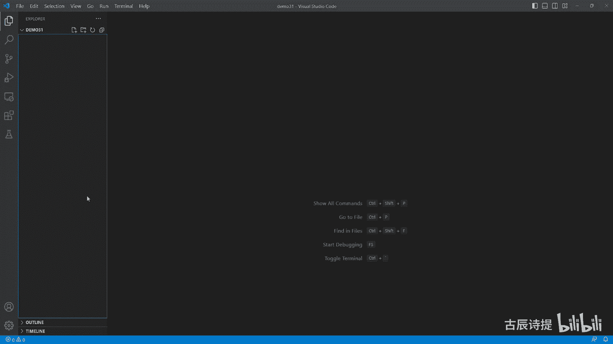
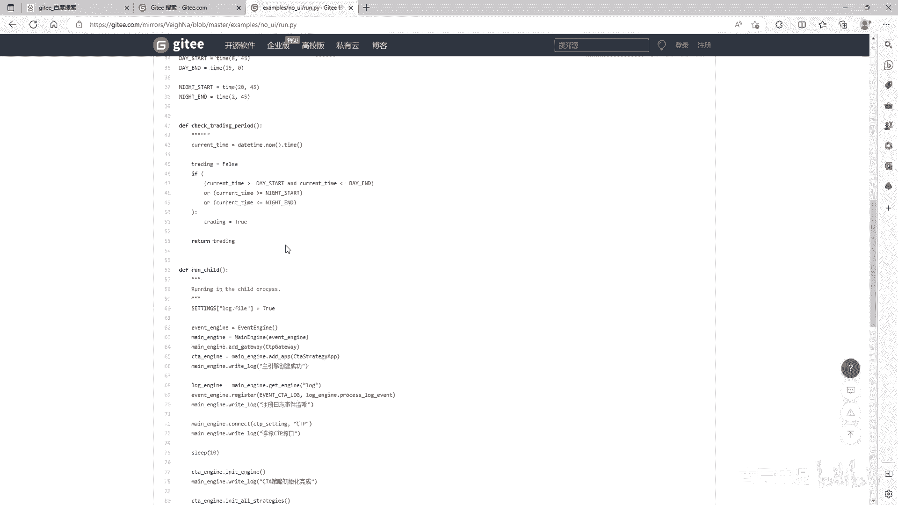
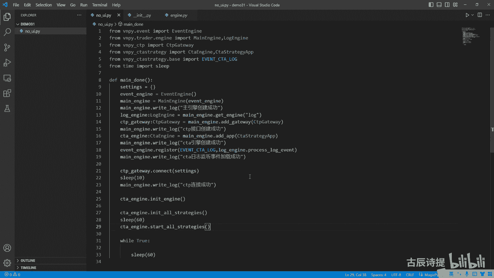
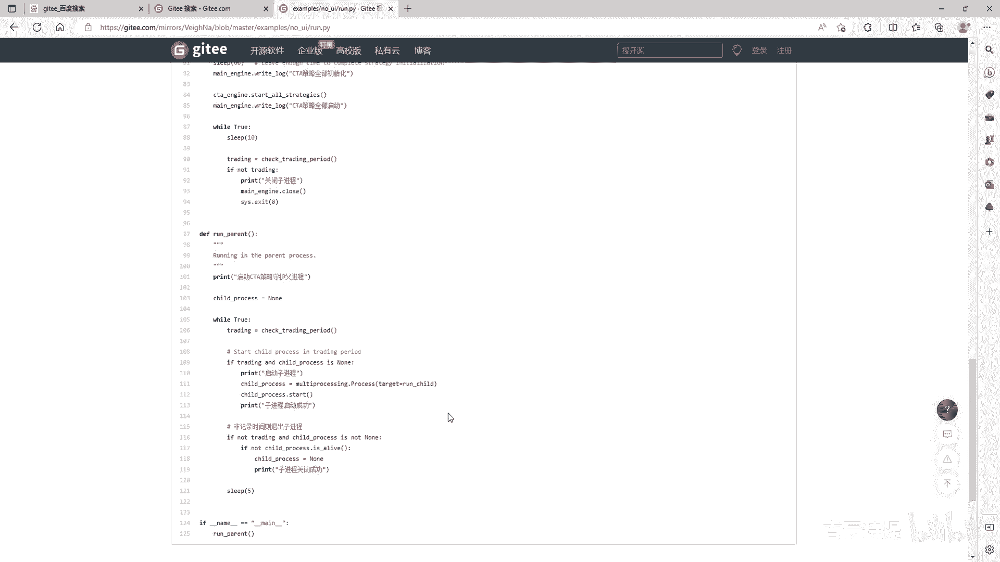
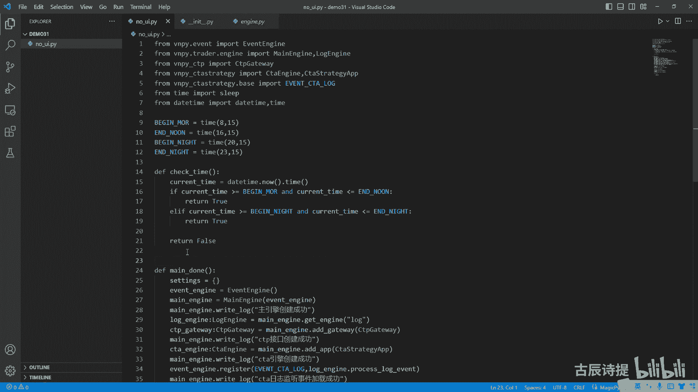
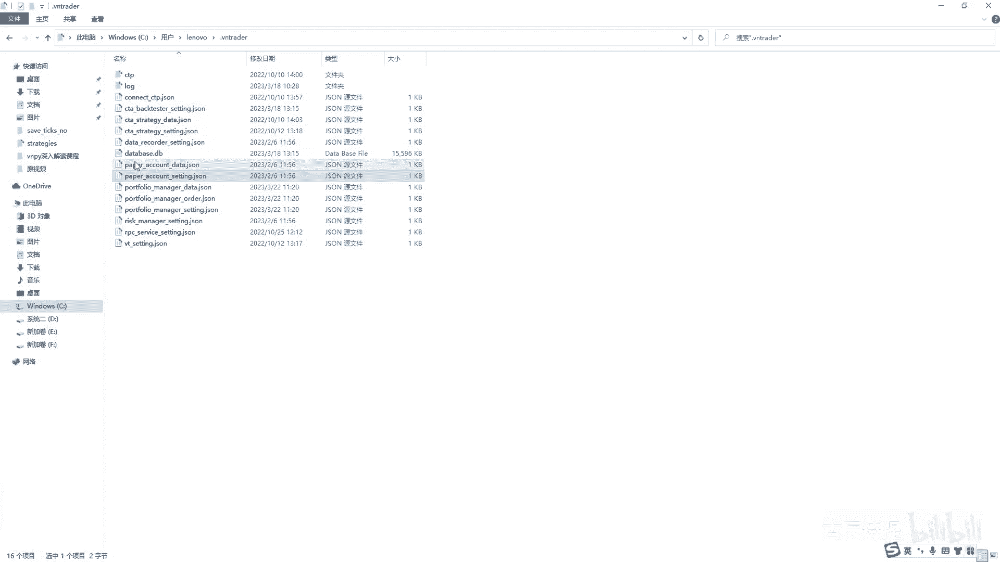
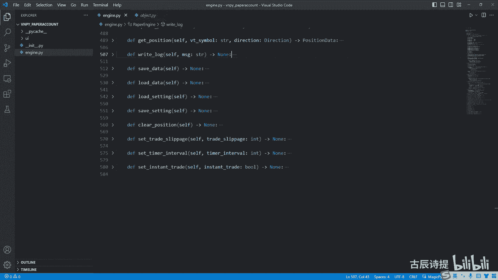

# 第31节课 模拟交易讲解 - P1 - 古辰诗提 - BV1rz421U7Et

欢迎大家来到从零开始量化系列课程，VNPI课程的第31节课，前30节课给大家主要讲了这个CTA策略，它的整个的这个框架，以及它的这个两个引擎，一个是实盘引擎，一个是回测引擎。

尽可能的都给大家敲了一下这个代码，然后到这儿呢，其实你对整个的VPI框架应该很了解了对吧，咱们再给大家说一下它的整个框架是什么呀，就是invent engine作为一个数据流。

就是它是一个核心的部分对吧，当然框架的主体是什么呀，主体还是main engine，对不对，my engine里边封装了很多的这个方法，这个方法是它是连接它的上游的。

比如说这个gateway和你下游的这个app对吧，然后这个app里边呢分为很多的引擎，比如说你这个CTA引擎啊，就是说实盘引擎或者这个CCTABTESTING引擎，包括你打开维纳，它里边有很多的。

比如说你这个策啊策略组合的嗯，包括这个paper cut啊什么的，呃这个呢其实就是整个维纳的一个大的框架，你了解这个其实你就可以做很多的事情了，包括你可以去看维纳他其他的这个app，我相信你都能看懂。

只要你把主要的结构都明白了，后边啊，比如说你像他的这个策略组，无非就是给这个就是说这个每一个策略，它后边会有哪些的这个合约加上一个标记，对不对啊，另外呢你要知道他这个整个的这个结构啊。

它连接的它可以连接，不就是不止超过一个这个呃，这个gateway它可以连接多个gateway，它也可以连接多个app啊，这个你理解这个框架之后，其实你就可以看它里边的东西了，就是其其他的内容了。

另外呢你也可以自己去做改变了，比如说你不满足现有的这个维纳平台的，他的这些组件，比如说你如果说要模拟交易，你觉得太慢，那你完全可以自己去生产tick，比如说你有一个基准价，然后因为自己生产体格很快嘛。

你没必要说一天一天的，专门去等着看你的策略有没有问题，对不对，你可以呃，就是可能半个小时你就生产出来了，一天的这个tick，然后让这个你的策略去走，当然你这个呃生产tick，你也可以加上自己的算法。

就比如说我就是在某几天是吧，或者某两天或者某三天，某四天，某一天你可以给他做个random嘛，对吧啊一天，然后涨跌啊，就说这一天我规定就是它是涨还是跌，这个你也可以random啊，或者横盘是吧。

你在里边设个概率啊，然后呢就是说你每一笔tick，比如说一个点是大概率，就是一个price，就是最小波动是大概率，然后你也可以有有这么小概率，比如说是两个plastic。

或者说是你有更小的概率是三个plastic，然后开盘的时候跳空，你也可以用random，完全可以嘛，对不对，你可以自己去看你这个策略有有没有什么问题，你就可以来写这些，你想要完成的这些就是说模块对吧。

依托这个维纳的这个框架，就是到现在如果说你前面的都能跟上，或者说是你都能写出来，包括Python基础呢，你也一定有一定的了解到，这个时候呢你就能发现其实编程就是打积木啊，就是编程就是搭积木是吧。

你是一块一块的给拼装起来的，这些积木本身有你对这个编程的理解，以及它的这个基础知识，以及Python里边有很多的这个模块哪来可以用，那既然你都学会了这些了，其实必然得去需要使用这些内容。

比如说举个简单例子，它就是这个NO ui，就是你用界面，以前你刚开始学的时候，可能是用界面来操作，但是界面比较麻烦一些，因为你得开你得关，包括早上你打开，下午你得关掉，然后晚上你再打开。

如果说你不开不关的话，可能会出现一些问题，你就希望有这样的一个程序去自己来启动，去连接柜台，然后到了时间你定点给它关掉，这个才是程序化的最大的好处嘛，你没必要时时刻刻的去盯盘是吧。

但是呃你像这样的呢，其实你可以完全就去写了，写的时候一开始可能没有思路，但是你尽可能的自己先把思路捋一捋，然后尝试着去写，你像这样的案例，其实这个VNPY上面是有的，就是伟大平台上面是有的是吧。

你从百度里面搜这个j i t t e git，就是JTTE啊，git git就有点像这个什么呀，这个咱们的这个get up啊，你从这儿搜这个维纳，他有这个极速下载啊，这个维纳你在这里面他有这个AMS。

就是这个呃举例嘛，你看他这有这个nooi NO啊，No ui，你看这就这里边的内容还是比较呃简单的。

你像你完全这个就可以自己去捋一捋啊，然后咱们给大家做一下演示，也算是这个什么呀，就是说你学了这么多东西，你得会运用起来对吧，那这个运用的思路在哪，那首先你要做一个NOVA i，你肯定有什么呀。

你肯定有这个invent engine，然后有main engine吗，咱们先导入啊，From vn py，第2invent import invent engine。

然后肯定有my engine from v py，点trade engine import，首先你要捋一下，这个就是说你实际的这个整个的这个，就是说这个实际上需要做的，就是你的主要任务是什么。

主要任务就是呃把这个框架搭起来，然后把策略导入进来，然后就是去加载策略，然后跑起来，对不对，就是这些吧，是不是，那就是说你后边那个时间咱们可以放到后边，那首先你捋一下这个逻辑。

首先肯定得有engine吧，等于invent engine实例化一个，然后main engine也是得有的吧，my engine等于my engine。

然后这里面需要把image engine给他放进去，这个两个引擎，基本上你其他的类都需要，这两个引擎作为参数吧对吧，那有了这两个引擎之后，你下一步去做什么，就是去加这个你的gateway后呃。

那边加你的这个app，你get away，比如说咱们就是这个加这个CDPCDP，咱们导入一下from v m p y cctp，import这个c t c TP gateway。

这个应该咱们是加载它的这个呃CDPKV啊，就get away，就是后边的这个你这个操就是应用采用app的，比如像这个CTA它才是app对吧，好main engine ADD gateway。

然后把这个c TP gateway直接给放进去，是不是就可以了，他这会有个返回值，只会把你这个给退位给你返回回来对吧，所以说咱们可以用这个c TP get away gateway，来接一下。

然后这个c TP gateway，它也是c TP gateway这个类型吧，是不是，然后把这个c TP gateway加载进去之后，咱们先别启动它了，因为这个CD p gateway你肯定得去连接。

对不对，咱们先不连接呢，咱们先把框架先搭起来，然后你app层面我肯定是需要加，就是加这个C这个CTANG吧，对不对，c c t engine它肯定是这个c t engine类型的。

from这个VN p i c t a strange，然后import这个ccta engine，但是咱们加载的时候，咱们说了，你不要去直接加载这个引擎，你加载这个c t strange app啊。

然后它会有个返回值是c t a engine吧对吧，等于main engine at the main engine，点at app吧，Add app，然后这个里边你把这个c t a strange。

app给它放进去，然后它的返回值是什么呀，它是返回一个engine吧，best engine是吧，它其实就是把t engine给你反馈回来啊，然后这个里边呢你c t engine呃。

就是就是这个里边它有一个内容啊，从这进不去，咱们从这进一下啊，就是CTNT可能之前讲没有太重视它，从这啊就是c t engine里边，因为它连接的是所有的策略对吧，包括就是你加载策略。

策略类以及你的这个策略初始化呀什么的，都在这个里边，它这里边它有一个right log，咱们看一下他的这个right log，W r i t a w r i t right。

然后它定义的这个red log，定义的这个red log，你发现它的这个type都是invent city log是吧，但是咱们这个my engine里边啊。

my engine里边它这个它有这个log engine，但是日志引擎呢它都是什么呀，它注册好了的是这个REGISTEVENT，它注册的是event log，所以说CTA引擎里边的日志输出。

你需要单独给他注册一下，注册到咱们的这个log engine里边去，那咱们也知道，就是说在这创建main engine的时候，他已经给你创建了o m email log。

这就是这三个引擎已经给你创建好了，所以说咱们的这个log engine，咱们直接从main engine里面去找就可以了是吧，就是log engine lock n减，从这咱们导入一下。

就是my engine，Lock engine，Lock engine，它等于什么呀，他应该等于main engine，点git engine吧，它有这个方法吧，那它的名字是什么，它的名字就是log。

因为在这个咱们这个main engine里边就是at engine，这up就是在这个初始化引擎的时候，就是init engines，这它初始化的时候是at engine是吧，At engine。

然后它这里边是把这个engine class放进来了，然后它存放在了这个engines这个字典里边，通过什么呢，就是engine engine，Engine engine name。

log engine name是什么呀，就是就是log engine的，它的这个engine name是什么呀，你看他往往里传的时候，他是继承自这个best engine吧，你看他这传了一个log。

这个best engine里边是有engine name的啊，这个best engine里面是有engine name的，你看my engine，image engine和engine name。

所以说他的这个engine name就是log，所以说你在这个去找这个engine的时候，你是通过这个名字，就是这个key log去找的，获取到这个log engine。

然后你在这你注册的时候怎么注册呀，就是mage engine点register，然后你需要这个它的类型，也就是invent city log，image city log在哪啊。

在这个VN p y c t a strange点bass bass，咱们之前讲过吧，就是这个base里面有单单独制定的，他就是给T策略的这个这个stop order是吧，还有一些其他的啊，从这里边呃。

import这个invent city log，然后把这个invent c t a log放进去，然后后边的这个方法用什么呀，方法其实就是它和就是说这个普通的日志。

除了这个event log和mc t a log的区别，其实别的都是一样的吧，所以说咱们就把close log in mt给它放进去，是不是就可以了，他获取的是获取它的data，并没有获取它的type。

对不对，因为就是他这两个唯一的区别，就是这个type的区别吧，所以说咱们把这个log engine process，log event给他这个方法给它放进去，是不是这就完成了这个注这个注册了，对不对。

当然了，从这个里边整个的这个里边啊，就是你可以挨个的去添加，比如说image engine，这你是不能添加，就是说我invent engine创建成功的，因为你这个你只能是print。

因为你这你还没有可以写的地方呢，你看my engine，有了my engine之后，你就可以写了，因为my engine里面有right log对吧，manager里面有red log。

然后你就可以写了，就是说主引擎创建成功，啊然后这个cp gateway，咱们这儿也可以来写是吧，my engine点red log，叫什么呀，叫这个是CDP接口创建成功啊，这些都是创建成功。

你并没有去进行连接的对吧，包括CCT引擎，这你也可以，Main engine，点right，点right log，这叫CCTA引擎创建成功，创建成功好吧，这你可以写一个main engine。

第2right log叫什么呀，日志啊，CTA呃，日志监听事件加载成功对吧，就这么写嘛，是不是，然后给自己一个提示到哪一步了，如果万一有问题，你可以去哪一步去找，那后边这你就应该去连接了吧。

就是这个CTP给啊，这个get away点connect了吧，当然这个里面需要放这个sitting sseting，你可以自己去啊，加载一下对吧，我这就不写了，我就直接写一个这个呃字典就可以了。

啊啊你就可以去连接了吧，连接是需要时间的吧，你需要休休休息，比如说我停十秒钟，我从这from from this time啊，不是from time import sleep是吧。

然后你从这可以写这个man engine right log是吧，这个就是CDP连接成功啊，当然你也可以加上判定啊，就是说你看他这个嗯就是这个状态，connect的那个状态是不是连接成功了。

那连接完了之后，我是不是就应该对我这个CTA引擎里边的内，容进行操作了呀是吧，首先你CTA引擎里边去需要做什么呀，应该是INIT，这个咱们可以看一下这个，再看一下这个C这个CT引擎啊，过不去啊。

它提示有些他可能是就是深了一点，咱们从这你这个CTA引擎，你首先要做的是init engine吧，你需要去init data feed loading class，是不是先做这一步对吧啊。

init engine是吧，GI啊，这个时候他就提示了是吧，然后unit engine你还可以说这个right log我就不写了，init engine完了之后你就应该什么呀。

c t a engine应该是叫init or strange了吧，是不是就是去初始化各个策略，那你这是不是因为它初始化策略呃，咱们从这直接过去看啊，啊过得去啊，它初始化策略呃，就是INIT。

就是它需要是去self interstrange strange，它需要就是它是一个线程，它虽然是线是线程池，这个线程池里边最最大的这个工作量，只有一个县城是吧，它需要挨个的去in test简介。

包括这里面需要下载数据什么的，它也是需要时间的吧，是不是你这就可以给它停，比如停个60秒，这个看你到时候匹配是个什么情况，比如说你有30个策略，策略比较多，那也可以时间长一些。

当然咱们之前在讲这个CT引擎的时候，你也完全可以就是给他，因为他是县城县城工作去初始化的时候，你可以给他计数的吧，不对吧，他比如说一共有三有30个策略，他每做完一个策略，你就给他记一个数。

每做完一个策略就给他记一个数，是不是到了30就意味着他都做完了，他都做完了，你是不是就可以把invent engine里边去放一个内容，就是说你这个初始化已经完成，你就不你就不用去就是去sleep了。

这样稍微有点傻，对不对啊，这个得你自己去改，当然就是你在从实用的角度上来说，这个也是可以的啊对吧，你就把后边就是等的时间等一等嘛，对不对，等的时间你可以去匹配一下啊，你十个策略大概等30秒是吧。

一一个策略等三秒，你看一下你策略加载完之后，你是不是就应该c t a engine start all stranges了吧，这个里边这个不需要什么时间，但是你要记住了，这个你如果说在一个进程里边也好。

在一个县城里边去操作也好，你是不是，你不能让这个进程或者线程给停止运行，你必须让它一直跑着，所以说你需要一个y u true，它一个死循环嘛对吧，比如说s l e e p sleep。

比如说是60秒是吧，你必须得让这个进程或线程一直跑着，你不能让这个主进程或者主线程给它停掉它，不然里边去接受tick啊什么的，他会调用不到的是吧，或者说你这个就就跑完了，就是你连接也连接上了。

然后你启动也启动上了，但是呢你这个进程没有阻塞住，你这个主进程结束了，你主进程结束，里边有一些资源就被释放掉了是吧，你可以从这加一个DF，比如说这个man，当然我把他这个是不是。

就成了一个整个的一个方法，对不对，你可以把它包装到一个类里边。

或者说你就用咱们这个上面，他直接用两个方法啊，一个是主啊，一个是副进城，一个是紫禁城，其实就是一个是主进程，主进程控制着紫禁城的开关啊，控制紫禁城的开关，主进程主要就一就一个动作。

就是来判定当前的时间，那判定当前的时间就很简单了，对不对，咱们从这from this time，import这个DETAB，还有这个ta你你判定当前时间还不简单吗，就是比如说我check time。

check time啊，然后在前面我再定义一个，比如说begin b EG i n begin morning啊，等于啊这个tab比如说早上的08：15分启动，然后noon就是下午的这个是4。

1刻结束是吧，然后begin night就是晚上的这个，比如说是20：15分开始，20：15分开始，然后end Knight，比如说我就是在晚上，比如说23：15分结束是吧，我就是我检查这个。

我就挨个去检查呗，我先看一下当前的时间，就是c o r int current time是不是等于DTIME，now the time获取它的时间，然后时间做一个对啊，对比吧是吧。

if curtime大于等于begin morning，and current time小于等于noon，它是不是就是是白盘的时间段就return true，Return true。

然后air if akt大于等于begin night，and can t小于等于NNE，然后也是女通true啊，如果是其他情况的话，我在外边我加一个return force吧，是不是让我再去检查。

我再写一个方法，就是作为一个附近城，然后不断的去检查时间是吧，如果说时间检查的没问题哎，在交易时间段之内，但是还没有启动过，我就来执行这个这个逻辑就就很顺畅了对吧，这些你能写出这些，自己能写出这些。

而且能理解它，建立的前提是，你对这个整体的框架和里边的一些细节，你都了解啊，都了解，所以说啊就是说这个呃还是一步一步的去学，你会发现其实这些内容不少的啊，不少的你得一点一点去看好吧。

然后NOVI呢给大家讲，就讲这么一点啊，就是主要是给大家捋一下，就是这个它整个的框架的一个搭建，那这节课剩下的时间呢咱们说一下，就是说这个PAPERCUT，因为PEACCOUNT咱们之前一直在提。

包括咱们之前写city bantesting的时候，其实你这个PAPERCUT咱们就能够自己能写出来了，对不对，嗯就是我就不给大家，就是说现场去敲了，就给大家看一下这个维纳这个平台。

它的这个就是它的这个源码啊，大概的看一下，其实你自己想的话，它和回测唯一的区别是什么，它会接接收实盘的这个tick嘛，对不对，另外呢它需要操作就是说去撮合模拟撮合嘛，那模拟撮合还是看这个价格，对不对。

还是看价格跟你这个一分钟K线，和你这个1T的K线区别大吗，其实并不大，只是按照你的逻辑来进行撮合，维纳呢也是就说他为了就是说为了方便，比如说多个接口，然后一些就是就是它的这个框架的这个，容纳度更大。

可能里边有很多为了适应，比如说多接口啊，多app的这样的一个操作，其实本质上它还是比如说你的委托过来了啊，就是说本来是应该到这个这个CDP接口那的，我给他转向了，转到我写的这个模拟交易。

也就是PAPERCUT这个类里边来，是不是，然后呢我得把这个委托存储上，然后我得跟tick进行对比是吧，看他是不是满足撮合的条件，然后如果说没满足撮撮合的条件，我就告诉这个策略啊，你这个已经提交过来了。

状态是submitting，但是他还没有成交是吧，如果说满和满足撮合的条件，我是不是得看他的这个手术，是不是跟我现有的持仓是个什么情况，是不是就是这些逻辑嘛，你这逻辑就一点一点去捋。

然后模拟着就是真正的这个CDP接口，它给你发送的东西，比如说你一连上之后，C这个CDB接口他肯定给你发Ctrl d Ctrl data，发完之后肯定会给你发position data。

那你在这个你的这个模模拟里边，是不是你contractor不用发，因为你可以从这个CP接口里面去来接，但是你这个position data是不是得发，你position data是从哪儿来啊。

你肯定是保存在本地的是吧，同样的是在这个这个下面。

你看paper cot data，paper cositting是不是就是放在这个里边。

你肯定得有，比如说你的持仓信息是吧，我是得发的吧是吧，你持仓信息发完之后就说你如果说有撮合了，你持仓有变化了是吧，模拟成交无非就是这些逻辑啊，你自己看，我个人觉得就是说前面没有问题的话。

你一定能看明白好吧，咱们给大家简单的说一下，里边可能有一些就是呃，就是说可能有些以前没讲到的，咱们简单提一下啊，同样的它是在这个VNPYPAPERCUT啊，PAPERCUT这是吧。

它为什么叫PAPERCUT啊，这个你知道papercut account是账户的意思，paper就是纸面上的是吧，其实就是纸面上的一个嗯就是账户的变化嘛，对不对啊，然后他这UI咋不说啊。

这个INIT它还是把它给包装成了一个app，这个app里面有这个ion，就是你的图片，你的VIETNAM是吧，就是你的这个呃窗口的名称啊，Engine class，Ange class。

就是这个paper engine，也就是这个engine，这个engine里面只有一个类，就是paper engine，你看这些写的这些大部分咱们都应该很熟啊。

包括registic minor啊啊这个process contract，Event，processing event是吧，Process time event calculate pl。

你肯定得去计计算它的这个呃，就是持仓的这个仓位的，他的这个盈利情况是吧，包括呃subscribe就是申请合约，你想申请合约，他肯定还是去他的这个原本的这个get away，那去连接。

就是去它原本的服务器去连接吧，对不对，你看他这里边代码是什么，Original gateway name，就是它的原本的这个gateway啊，然后从这里边找到他原本的GTAV。

然后去subscribe啊，去sub去subscribe对吧，就是说这个你肯定都能大概猜到是什么意思，你看这个query history，咱们一想就是咱们原本的这个gateway name。

里边就没有这个query history，所以说他这个query history里肯定是为了匹配它，有一些金融品种，它是可以获取历历史数据的，对吧啊，这是可以获取历史数据的，你看他这写了这个。

如果说有这个original，就是这个get away name，然后return，然后去query history，是不是啊，然后SORDERSORDER，他肯定不会再去发送给别的这个gateway。

他肯定就在这去进行处理了，你看它这个有一些这个逻辑性的代码是吧，他肯定就会给他去处理了，对不对啊，然后你想如果说呃他不活跃了，就把这个active orders给pp掉，对不对啊，这个应该都很熟了是吧。

然后呃order发送过来了，符合了他有什么呀，把这个啊对一下这个MIT就是把这个interposition，然后发到这个int engine里边去是吧，然后就是告诉我就是说什么仓位有变化了呀，什么的。

是不是啊，就是就是这些内容，所以说你自己去看一下，我觉得应该看明白的，唯一可能存在的情况是什么呀，他这有这各种这个会涉及到这种get away name，他这呢还是为了匹配一个什么呀，叫多底层。

他怕你就说连接了多个这个gateway啊，连接了多个gateway，因为有一些可能你会做这个价差嘛，价差可能在不一样的平台，比如说这是CDP，比如说这是呃，这是另外一个啊啊这是另外一个。

然后呢同样用main engine给它包住对吧，呃你这是一个C是一个c t a engine，那你就说他们俩肯定都会去发，比如这个contract data就是合约信息，合约信息发过来之后。

肯定带着他们各自的这个get to a name，然后你从这儿你去发送委托的时候，你肯定得找到对应的contract，这个contract包括了他的这个gateway name。

然后通过这个main engine找到对应的这个gateway，这个name去发吧，对不对啊，这也是为了匹配这个就是可能有多个gateway啊，所以说显得复杂一些，但是你把这些全部抛开来。

它本质上它还是什么呀，就是模拟模拟，就是说你呃委托发送成功了啊，你像他这个上来就用这个tick tick，然后cross order，cross order熟悉吗，熟悉吧，他就是为了去撮合嘛对吧。

去撮合他这里边你想它有market limit stop嗯，你像这样的委托，他是为了匹匹配什么呀，匹配一些别的，这个就是说这个这个gateway，他可能也接受这些委托是吧。

你像这个market他肯定就是立刻就成交了啊，你看就是这个try这个try price等于这个ask price，加上这个一看就是这个有滑点是吧，看看有没有滑点，然后这个这个limit它是没有滑点的。

limit跟stop，这个咱们应该很熟了，他肯定是反着来的，你看这order the price大于等于ticket ask price1，你看这是个这个stop。

就是这个点us price1大于等于order点price，是不是就是跟咱们理解的是一样，对不对啊，理解的是一样，你看如果说if cha price就是if trader price。

就说明有成交了是吧，他有了tra price之后，他先把这个event order，把这个order给它放进去是吧，然后再模拟这个trad成交了吗，然后再把这个trade再放进去，然后再更新一下持仓。

对啊对吧，就是这个update position嘛，就更新一下持仓嘛，对不对啊，所以说嗯没什么，就是基本上跟咱们之前讲过的都很类似啊，咱们就看一下它的这个整个的一个框架，他这一个是setting。

File name，就是paper count setting，然后data file name就是paper count data，这个sitting肯定是设置是吧，设置它主要是保存哪些内容啊。

咱们可以直接从这儿放进去，然后去搜一下，看看他在哪用了是吧，你像他这load sitting是载入这个sitting，是不是啊，然后一呃这个if sitting，然后这里边是try这个sleep。

他肯定是这个你的滑点是什么啊，你这time timer interval呃，这是个什么东西，然后instant tread是吧，你如果说想了解的，你就看它是从哪用的，比如说我从这儿。

比如说我看一下这个timer interval，它会从哪用是吧，你看if timer count小于self time interval就return了，哎那就说明是什么呀。

就是说你就说在这个invent engine里边，它是有这个timer这个invent的，是不是，然后他这就是一个计数吧，你小于几个，他就直接去蹭了啊，如果说呃大于他了之后。

他会把这个去calculate pl，和这个把这个event position，这个就是去更新持仓吧，是不是啊，他是来控制，就是说你多长时间我去查看一下，或许或者去更新一下持仓吧，是不是。

然后他还有哪儿啊，四是在这儿啊，就是说啊这个是一个设定啊，一个设定就是保存呃，Sasitting，然后这是设置sit time interval，这个你就知你就知道了。

他是因为本身invent engine里边，它是有这个timer的啊，timer它是好像是一两秒就一次啊，就是因为timer就是在本身的这个CTA引擎，而不是这个CTP。

这get away里边它是什么呀，呃这个时间我去看一下，这个就是我去获取一下account data，然后再过一个这个时间让我去获取一下，这个叫什么叫这个position data，它是这个来做这个的。

其实就是image engine里面的这个时时间的一个节点，对吧，同样的你想看这个你可以去是吧，往里边一放，这个他是看就是它是干什么的，你得看它从哪去用是吧啊。

If self instant trade and order order studio，它是状态不等于reject是吧，然后咱们再看看他前面用在哪了啊，他这是默认是false，就是一个布尔值是吧啊。

如果说是他的话，还不等于这个reject，然后tick啊去获取这个tick了，然后去撮合这个class order啊，去撮合他，那这个它就是一个布尔值，那它控制什么呢，就是是不是模拟成交对吧。

因为你别的地方你没有再用到了啊，这就是保存了，对不对啊，保他就是保存了吧，这就是说因为它是在什么里边，sto order这个里边在SORDER里边，你像这个如果是否的话，这根本就不会有，对不对。

但是你close order你会正常的去cross order，Close order，就是有这个new tick的时候，他会去给你这个close order吧，对不对啊，这个new tick啊。

Processing event，这个他会给你去撮合啊，就是tick过来，就是他会给你挨个撮合，你从这你能看出他是什么意思啊，就是当你委托发过来的时候，他是不是去撮合，就是说呃当前的这笔题。

可就是来撮合当前的这笔TK，什么意思，就是你委托发送过来的时候，可能当前这笔TK是触发这个委托的啊，当前这笔TK可能是触发这个委托的，那这个当前这笔TK，他是不是需要检查一下，这个委托是不是能成交啊。

就是这么个意思对吧，因为它只从这儿有代码啊，是不是只从这有代码，它控制的就是什么，就是你当前tick，因为SORDER在发过来，在调用的那一瞬间，他从这去找这个tick是吧。

就是肯定是把tick放到这个cf tx这个里边吧，对不对，然后他来去找来撮合，你看cross order把order和tick啊给它翻过来了，看就是当前这笔触发的tick是不是进行撮合啊。

就是这个意思嘛，对吧啊，呃所以说你如果说想知道它存放了什么，你像这个setting里边肯定就存放着，就是这些内容是吧啊，然后你可以看到这个data data里面存放什么内容。

那data里面肯定是存放着你的持仓啊是吧，你的这个呃账户的资金啊，肯定是这些内容，你像他这个U啊存放的地方就是这个CFD啊，CD啊，就是data来存放，你看这是他的这个存放的内容。

Visimple volume price direction，对不对啊，就是这个very simple，你的这个合约数量价格方向啊，这然后他把他给存储起来是吧啊啊存储起来。

这个我就啊不细讲了啊啊不细讲了嗯，然后咱们再往下看啊，他的这个INIT里边它其实是设置了什么呀，就是一些存放的active orders啊是吧，这个gateway map。

gateway map是什么呀，你像这个map就是配对啊，就是配对的意思，还是就是说去对应着的，去找你这个底层的这个getaway嘛是吧，他就是把里边存存放进去了一个映射，其实就是个对照表嘛，是不是。

然后这个cf这个TX，这里边肯定是存放着最近一笔的这个tick，对不对，咱们可以看一下啊，你看这个processing是不是，然后cf点TX，然后TXTVSIMO等于tick，就是这个里面始终存放着。

最新一笔的这个tick啊，呃这个没什么好说的，你看这就是他把一部分去发送到底层委托的，给截留到这个类里边来了是吧，包括这个合约的订阅，他用了这个cf点下划线subscribe。

然后把它代替了main engine，their subscribe是吧，包括query history，把它代替了这个main engine这个query history啊。

然后你这个main engine subscribe等于self subscribe啊是吧，然后main engine点create history等于C点。

这create history就是就是因为你去去发送委托的时候，你是不是会就是说去这个my engine里边去send order，这个subscribe对吧，然后他现在告诉你，我这个是到了这了啊。

就是到了我这个类里面就变成cf点这个subscribe了，这你看啊cf点subscribe等于my engine点subscribe。

然后呢这my engine subscribe等于cf点这个subscribe，他做了一个什么工作啊，其实你合约订阅还是得去底层去订阅的吧，他做了个什么呀。

他先去获取这个original gateway，然后在C点这个下划线subscribe，这个C点下划线subscribe是什么呀，其实还是my engine点subscribe，他转了个圈。

他还是去卖engine subscriber吧，是对吧，他只是来去找一下底层的那个gateway，不过来找一下底层的就get away啊，这种就是方法，咱们以前一直在说啊。

你要知道load setting，Load data，Regim，load setting就是下载它的设置是吧，load data就是下载数据，然后reject event就是注册这个event。

这个你肯定都能想到他，这个reject event里边肯定有contract event，合约信息肯定有有这个tick event，是不是他还有个什么呀，还有个就是说这个timer event对吧啊。

Timer invent，就是咱们刚才之之之前说的那个timer，那个设定啊，timer那个设定是吧，他是过了几个这个timer节点他才去啊，怎么样的，是不是啊。

然后这是process contract event，这个这个还是说一下吧，他获取这个合约信息，它会根据这个对照表，就是get就get way map是吧，通过made simple。

然后去对照这个contract点，get这个get name，就是说白了就是给你一个对照表，然后你从这个底层再去往回去，发送一些东西的时候，它会先去找到这个通过这个cf点gateway map。

找到这个这个gateway对吧，然后这个process contract invent，这里边还有什么呀，就是说这咱们之前提到过，这需要给大家说一下的，咱们在转换器里边直接是very simple。

然后后边他是这个那个holding是吧，呃就是里边的这个持仓情况，这呢它是个什么情况，你看啊key是什么呀，Contract with desimple。

加上direction direction是什么呀，就是多空还有个进仓是吧，就是那个因为它是direction in direction嘛，它有多空还有进仓，它其实就是以这个TUA。

TUA是个不可变的这个数据类型吧，你要作为这个字典里边key就是key，一定是不可变数据类型啊，一定是不可变数据类型，你不能用这个呃字典或者用列表作为它的key，这是不行的，你看他是tube。

这个里面是CONTROVERSIMPLE和direction作为这个key，然后后面value是什么呀，就是这个position data啊，它是以这样的一种方呃方式，咱们之前提到过啊。

来就是说去把这个position放到了这个，咱们的这个event engine里面去，对吧啊，去把这个position放进去了啊，然后他把它存储到了这个cf点，positions这个里边啊。

因为你肯定得模仿底层这个CCTP，那个呃，会定时的去把这个拍这个position data去进行更新，是吧，好这是contract，然后processing这个里边更多的是撮合嘛对吧，撮合。

然后他会把这个CP点TX保，就是把这个最新的tick，保存在这个C点TX里面，一方面是为了满足你，比如说我当前触发的这一笔即可，我需要去进行合约的撮合，另外一方面呢就是有些时候啊。

有些合约他可能不是说一秒两笔提高的，他成交不活跃，它可能就是一秒可能没有提，或者三四秒没有提啊，为了方便可能会调用一些，就是说他的这个最最近的一笔tick，它可能需要他就给他存放进来了。

好然后这个active orders是吧，然后就是进行close order吧，对吧啊，close order这个quarter咱们就不说了啊，这是跟期权相关的，你看这是呃process timer。

这process time invent里边主要是做了什么事情啊，主要就是去做了这个calculate pl啊，然后更新这个event position吧，对吧啊。

这calculate pl就是计算就是当前合约的，就是当前持仓的这个利润嘛，你这个position data这里边是有这个PL的啊，你要给它计算出来，然后给它更新是吧，position点pa啊，对不对。

计算完了之后，他才可以把它放到这个音节里边，然后进行更新嘛是吧，这个subscribe咱们说了，Query histories，咱们就不说了，这个SORDER就是委托的发送。

这个咱们之前在讲btesting engine的时候，包括city engines，这个SORDER咱们是讲的最多的对吧，讲啊讲的是最多的，所以说这咱们就前面没什么好说的啊，这有个copy。

咱们需要讲一下，这个copy就是深copy和浅copy的一个意思，咱们在这个就是因为在engine里边，咱们说是往里边去放数据对吧，它实际上往里边放数据吗，实际上在电脑底层运行，它不是往里边放数据啊。

比如说我这个它是一个order data，我创我创建好了，这个我就是这个order data，它在底层啊，假设在这这是个内存，就是放在这儿了，它是有一个id的啊，就是内存地址嘛。

他其实把这个这个这个order需要进行传递的时候，它放到这个int engine里边来，他放的是这个order id，不是这个ID，如果说你在这个过过程中被好几个方法调用了。

你的这个本身的这个order是不是会被修改，会被修改，它实际上是通过这个id找到了这个内存地址，然后对它进行修改，这整个的都会被进行修改的啊，他这把它放到这个int engine里边去。

为什么需要copy一下，他就怕比如说我这个order现在的状态是啊，Submitting，就是在申请中，在你就是说做这些操作的时候，它可能有的新TIK过来之后，他就触发了，它变成了已触发的状态。

那就是说在这个里边的这个数据流，里边的这个order，它的这个状态有也会跟着去变，因为它是E它它是一个内存地址啊，所以说你需要copy一下，copy一下就解决了，就是说如果说在这个中间。

我就说这个order有变化的话，它不会影响到原本的这个order对吧，当然了，这个是浅copy，你浅copy解决不了什么问题啊，解决不了，比如说我这一块内存地址啊，它是个类是吧，class它是个类。

这个里边它还有这个可变数据类型，如果说这个可变数据类型变化了的话，你浅copy它是解决不了的啊，这个就是Python基础了，咱们就不多说了，好吧啊，然后这个也没什么好讲的是吧，就是处理这个order嘛。

把它放到这个active order，然后去进行撮合，如果说是有什么问题了，就会去进行拒单啊什么的对吧，比如说你的这个申请的量，比这个你持仓量以及就是减去你的那个冻结量，然后他也就会被巨大啊。

当然那个是这个是什么呀，是这个close order cross order，这里边肯定是有的，就是你的这个申请量超过了他的这个什么，它就会被拒单诶，是在这里边吧，啊不是在这里边啊。

cos的不是在这里边啊，在这里边应该是check order value的啊，求order value的，你看他这个是吧，if order vol大于available，available是什么呀。

就是short position volume减去short position点，Frozen，就是可用的这个空单数量减去这个被动解除的，是吧啊，一个意思啊，一个意思。

order肯定是这里边比较复杂的一块内容，但是我个人认为，咱们之前order已经讲的非常多了啊，就是也给大家专门做了个界面，看看这个order是怎么转换的对吧，这个就是模拟那最底层的好吧。

cross order就是这个模拟撮合，这个你看这个名字都很熟悉是吧，嗯就是咱们也不说了啊，cross这个update position，就是更新这个你的持仓信息嘛是吧。

然后这个这个这个get position就是去获取这个呃，这个你的这个position嘛，是在这个set positions里边去获取，是不是他的key还是这个VIDEMBOL和direction。

对吧啊，这个reg log这个呃也没什么，他是用这个event log，这个就不用去单独的去，你再写了是吧，就是比如那个event city log呀。

这没有说是event papercut log是吧，save data这个后边就没有什么load data，load sitting和sap sitting啊，好吧。

