# 第32节课 RPC模块讲解(1) - P1 - 古辰诗提 - BV1Xz421m7AC

欢迎大家来到从零开始量化系列课程，VMPI课程的第32节课，这节课呢咱们讲这个RPC，RPC呢，在我免费的课上也给大家介绍过如何去使用它，但是没有去深究这个代码嗯，在这呢给大家讲一下。

因为这个讲RPC的话，就是你必你必然得讲到叫什么叫这个socket，套接字，它是咱们网络传输，一个就是肯定会用到的一个东西，就是咱们网络传输啊，你也不要把它想的就是说很高大上，它其实就是什么呀。

首先你从本质上理解啊，他其实就是一个就是电流的一个传输嘛，电流它代表着比如说弱电是零啊，强电是一，他其实还是最底层的，还是零一的传输，所以说计算机它最牛的地方在哪啊，就是快，因为它传输是光速嘛。

天下武功唯快不破啊，咱们要讲RPC呢，想让大家听明白，咱们必须得讲这个socket套接字，我先写一下啊，server点p y s e r s e r v e r socket套接字，它是什么东西啊。

就是先认识一下socket套接，它叫套接字啊，这个呢呃不跟大家细讲，因为这是单独的一个模块嘛，咱们只是给大家演示一下，引入一下，就是另外一个就是类叫ZMQ，ZMQ呢是封装好了的，就是一个类。

就是就是zero mq啊，也是一个数据传输的，比这个so就是你直接用soc套接字要方便很多，但是呢如果说我不引入这个socket，咱们就没办法讲这个ZMQ，没办法讲ZMQ呢，咱们就没办法讲那个源码。

所以说咱们必须得说一下这个socket，这呢写了个server，因为你数据交互你必然是有一个server，还有个什么client client啊，第2PY就是server，就相当于是服务端。

比如说你就说什么百度啊，阿里啊，他肯定得存放很多的服务器，存储很多的数据，包括你打游戏，比如说这个LOL是吧，或者说是这个其他的一些游戏，它本质上其实是什么呢，就是说他并不是说我这个电脑。

直接跟你这个电脑进行交互，比如说我砍了你一刀，你血条就少了一点，不是这么回事，它中间必然是有个服务器的，我这有一个操作，比如说我砍了你的英雄一刀，然后呢在服务器上呢，他就会接收到这个讯息。

然后再反馈给你，然后你血条就变少了，包括你聊天也是这样的，你发微信，你微信并不是说直接发到他，那并不是这样的，是你从你这儿发，然后发送给服务器，然后服务器再给他转发过去，是这样的一个流程。

所以说必然会有一个服务器，一个服务器可以连接多个客户端对吧，应该是这样的一个流程，那这个socket咱们就给大家演示一下，首先咱们from socket import一个信号，一般不建议大家这么去导入。

但是socket里边东西比较多，咱们就这么导入就可以了啊，然后首先咱们得创建一个叫TCP，server s e r v e RT cp啊，还有一个什么UDP，还有当然还有其他的一些传输协议。

这些都是传输协议啊，TCP是比较安全的，就是它呃如果说网络不稳定的话，他得确保你收到了这个消息，但是UDP呢只管给你发，不管你有没有收到，像咱们的QQ，它其实就是通过这个UDP开发的啊。

这个TCP server我怎我怎么去创建的，就是这个socket socket后边你需要两个参数呃，第一个是af in it，第二个是什么呀，sock这个stream。

socket stream就指定了，它是一个TCP，一个server，如果说你后边是soccer，它还有什么叫soccer dream啊，第二就是这个东西它是UDP啊。

但是咱们这儿呢用socket stream，你可以有时间去这个B站上，或者哪儿去听一听这样这个socket这个课啊，他为什么这么设置，然后第二个呢，第二步呢咱们要设置一下，set一下这个socket。

sit一下这个socket怎么设置呢，这个里边也是有两个参数，一个是Sol，然后socket啊，然后第二个呢是这个呃，soo reuse就是重复使用啊，然后后边放一个一，这个我就不解释了啊。

你自己如果说想去尝试的话，你就这么去用就好了，因为咱们一般不会用到socket的，就是socket，以Python这个编程语言的特性，肯定有很多的类去封装这个socket对吧，然后给咱们就是暴露接口。

然后咱们可以去更加方便的去使用，所以说咱们就不讲太多了，Tcp server，然后你设定好了之后，我需要bind bind绑定，绑定什么呢，绑定我的一个端口，就是咱们这每台电脑上其实有好几万个端口呃。

所以说你不能把电脑简单的理解为，就是说它是数据传输的时候，你不能简单的理解我这个电脑是一个房子，然后你那边是一个房子，然后咱们之前打电话或者服务器是一个房子，咱们之间打打这个电话，其实不是那么回事。

你可以把电脑呢理解为是一栋楼，它有很多的这个门啊，它有很多的这个门，所以说你得指定一个门是吧，指定你把这个信息传输到我哪个门里边，我绑定的时候呢，第一个是填这个呃，这个这个这个什么，这个是这个IP地址。

第一个是IP地址啊，第二个是端口，一般他们是用元组啊，你放在元组里边，这个IP地址呢可以不传不传，就代表的是本机啊，你也可以传上那个是127。0。0。1啊，也可以，你也可以不传，就代表的是本机啊。

然后后边这个端口呢，比如说我写一个80918091，我可以把它设成一个叫这个port等于8091啊，然后我这直接写上port p o RT是吧，这个就绑定了这个端口，绑定了之后，下一步要做什么呢。

就是监听叫lesson啊，Lesson lesson，就是我得就是看有没有这个客户端来连接，我得等着等着，后边呢你需要填一个，就是一共可以监听多少个啊，我比如说我写一个也是一个，就是说这个常量呃。

black log是吧，比如说我等于128，一般都填128BRACK啊，Black clock，我监听这么多，让我监听完了之后呢，我就得去接，如果说有人跟我连上了我TCP server。

这个不是TCP server了啊，就是TCP client c r e n t TCP client socket，就是会有一个服，就是客户端的套接字跟我来连，当然它也有它的地址是吧。

我直接可以什么TCP server点accept，就是接受接受它的连接，它会返回两个啊，一个呢是这个TCP client socket，也就是咱们这个就是跟这个是一个类。

还有一个address address，就是这个元祖就是它的这个IP地址和端口，因为你就是说相互连接，我得知道你的这个地址对吧，和你的这个门牌号，然后我才能去给你发信息呢。

这个TCP这个client socket就相当于就是一个对象嘛，是吧，给谁啊，你的接收人，然后这个address呢就相当于地址，就是说你是哪个街道啊，然后哪个楼，然后当然这里面也包含了这个门牌号。

也就是咱们这个port啊，这个就是accept，就是我接受啊，就是你的连接请求好吧，这个时候呢我可以print一下，print什么呢，就是客户端连接建立啊，然后客户端套接字都把这个叫套接字啊。

都叫套接字，它为什么叫套接字，这个我也不太清楚，我也不太清楚，这个client socket咱们可以输，可以输出一下，然后呢这个客户端的IP啊，这个IP地址，然后把这个ADDR可以给他。

就是咱们输出来看一下，连接上之后就应该进行通话了是吧，比如说我先去接收呃这个信息啊，message我等于这个啊，我先给他一个先定义一下，然后while true，我进行一个死循环啊。

While true，当然进行死循环不太好，你得必须得就是说我能建立，我就能断开是吧，比如说我receive message，它不等于这个NO的时候，就是啊那就代表着我我不跟你交流了，我要断开了啊。

然后呢receive message我加一个下划线，等于这个TCP这个client socket i CV，ICV是receive的意思吗，receive的意思，它后边接收呢需要放一个参数啊。

这个参数是放什么呢，就是一次性接收多少个字节啊，一次性接收多少个字节，比如说我b u f f buffer size，f f e r buffer size是吧，等于1024啊。

10241024就是一个千字节是吧，然后receive啊，把分size，然后我接收到这个消息，但是这个消息呢它是自己类型的，就是就是这个bytes类型，你你学这个Python基础的时候。

肯定也学过这个bytes类型啊，然后呢我需要给他转换一下，就是RECV这个message啊，它应该是一个STR类型，等于什么呀，应该是receive这个message点解码吧，decode吧。

然后用UTF杠八给他解一下这个码，它就变成了这个receive message吧，然后我可以print一下这个客户端啊，客户端发来消息，这个消息是什么呢，就是我就把这个呃receive message。

RECV这个message放在后边，就是你就知道客户端发来什么消息了是吧，客户端发来消息之后，我需要把这个消息给他返回回去，就是新的嗯，message它是STR类型，我给他返回什么呢。

我就把receive message叫apple，我给的就是把它就是直接变成大写啊，然后呢我就给他返回去，然后send这个message下划线，它应该转成一个base类型吧。

应该是等于这个send message点encode吧，就是编码是吧，用用这个UTF杠八，UTF杠八进行编码，然后呢，我这个呃用这个咱们的这个服务端给他去发货，发过去就是TCP server啊。

然后怎么去发呢，我TCP server我去给他发，我发给谁呢，我是不是应该发给就是说这个client是不是，然后应该是client，就是发给这个client socket。

这client socket呢它它是一个什么呀，它也是一个套接字吧，我直接可以给他发send啊，然后呢把这个RECV这个message给他发过去，确保它是一个BIES的这个类型，对不对啊。

这个就完成了一个交互嘛，然后就是ELS，我这加一个ELS，如果说它不等于NO，如果说它是等于NO的话，我TCP这个client socket点了close，就是关闭掉是吧，然后我print一下客户端。

连接关闭，然后呢我再把我自己的这个TCP server close在关闭掉，然后print一下是吧，服务端，服务端关闭是不是这样的一个流程，就是我接收过来之后，然后我再给它把它变成大写，然后发回去啊。

这就是一个服务端的一个代码，咱们再看一下这个客户端的代码，客户端代码其实就相对服务端要简单一些了，socket import型号，同样的PORT这个port啊，咱们得设成一样的，就是8091。

就是得确保跟服务端是一样的，我想有拆分一下啊，啊8091啊，这个得是一致的啊，然后这个你还得有一个是吧，这个比如IPADDR就是我的就是这个地址啊，就是这个地址地址，我就写上127。0。0。1。

就是代表的是本机嘛，就是自个儿跟自个儿玩是吧，Buffer size b u f f e r，buffer size就是他的这个一次接收的这个大小，我一样是接收1024个，一次接收。

你在socket里边好像最多是接收八个千字节吧，好像是这样的啊，你可以去查一下，然后TCP client client socket，我的就是说客户端的这个套接字，我是不是可以直接socket。

然后这个里边一样的啊，AFINIT啊，然后后边是什么呀，Soc，然后stream是代表着它是一个TCP的一个服务协议，然后呢我创建好了之后，我是不是就可以直接连接了，Connect connect。

我连接的是一个元组，这个元组里边是IPADDR和这个port，我连接的其实是什么呀，其实是这个服务端的，所以说这个你要跟服务端是一致的啊，就这俩你要跟服务端是一致的，千万不要写成你自己的。

因为我连的是要连接服务端的，同样的我新的啊，Message，我send message，我先给它等于一个空的字符串，然后呢我while比如说我send message好，不等于这个NO啊，不等于NO。

然后我s message我等于一个什么呢，我等于咱们自己输吧，Input，然后里边提示请输入啊，英文吧好吧，因为它是大小写嘛啊大小写，然后我这给他这个strip一下，就是把空格给它去掉是吧。

然后s message这个应该是等于什么呀，我send message进行一个编码吧，对不对，编码吧，应该是encode是吧，然后里边用这个UTFUTF杠八，然后给他转成这个字节类型的，字节类型的之后。

我就可以给他发了吧，然后TCP client socket send呃，就是当然也可以send or啊，都可以，Send message，一定要给他发字节类型的，然后我发完之后我就去收了吧。

receive message应该是等于什么呀，应该是等于TCP client socket点r e CV receive receive，这个咱们还是buffer size是吧。

这个它是一个字节类型的啊，它是一个字节类型的，它是一个bytes类型的这个base类型，咱们需要给它转成啊ECV啊，message应该是等于什么呀。

r e CV message点decode是解码一样的，用UTF杠八去给他把这个码给解开，然后我就可以输出一下print，收到服务器发来消息啊，它是什么呢，他就说他就是这个旅行message下划线是吧。

就是解码好的啊，如果说else，如果说呃我这个发送的是NO的话，我就TCP client socket clothes把这个关闭掉，把它关闭掉，然后print一下这个结束，和服务端和服务端的对话。

这个就是一个简单的一个server，一个client啊。

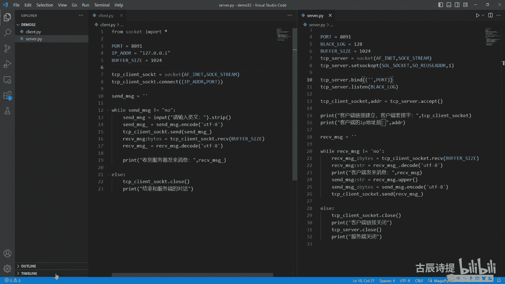

这个时候呢咱们可以看一下，在这个32里面咱们运行一下试一下啊，在此处打开power shell窗口啊。

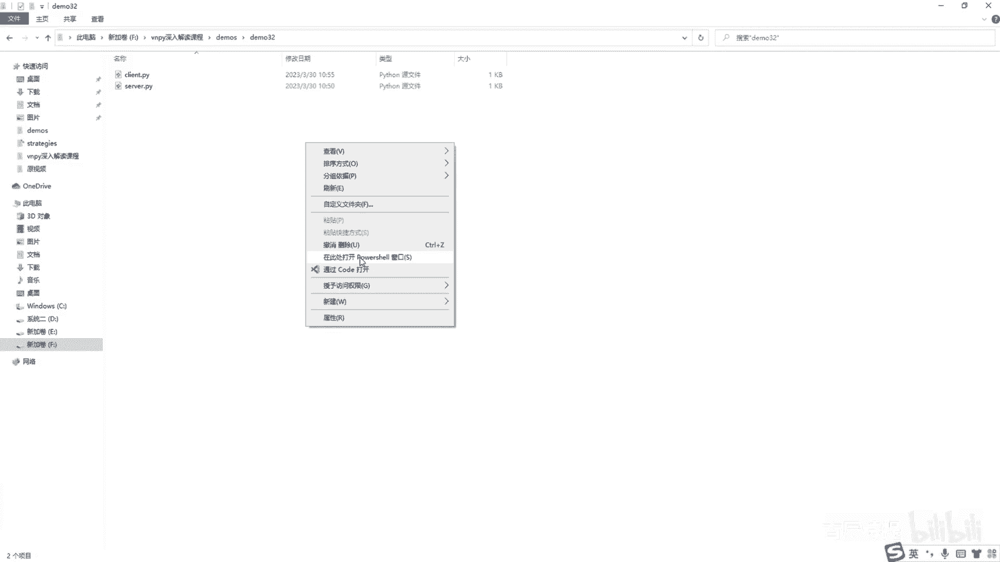

然后呢我Python我先把服务端给启动了。

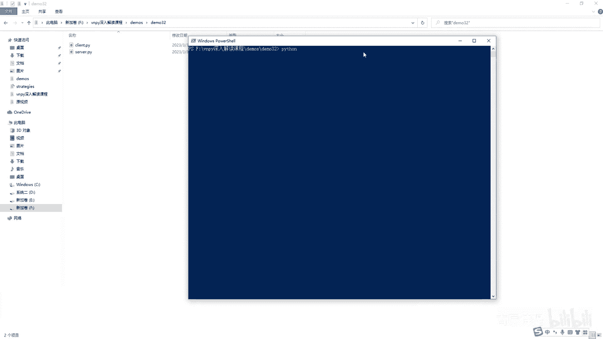

tap一下，服务端启动之后呢，我再启动一下一个客户端。

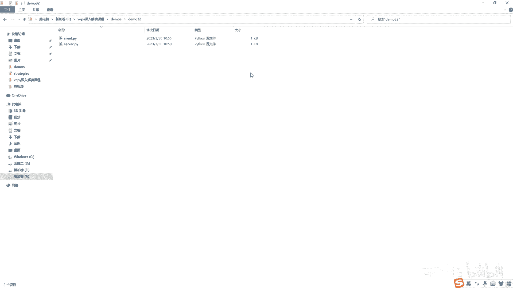

在此处打开power shell窗口，然后我再tan。

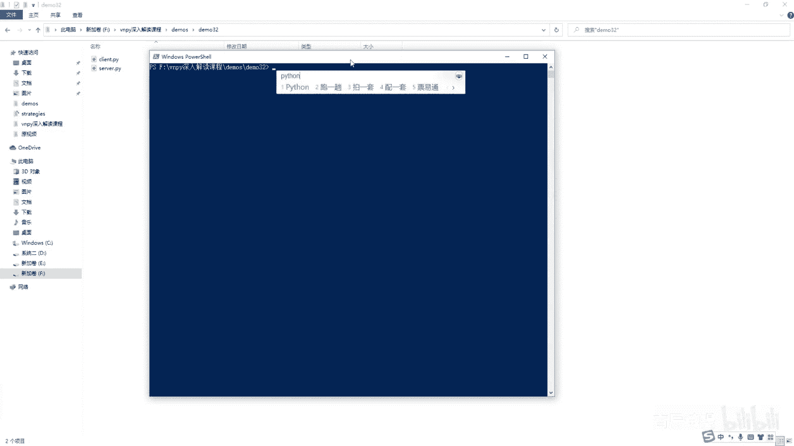

然后client type一下好，这个时候输出英文。

我把这个打开啊，服务端的这个你看它就有了吧，就是客户端套接字建立已经成功了是吧，客户端套接字是什么啊，然后他这个ADDR是什么，就是127。0。0，就是8091啊，这个RADDR好，这是客户端的是吧。

这是服务端的，你像这客户端的IP地址是49525，就是这个端口嘛是吧，这个时候我输入一个英文，比如说h e l l hello是吧，它返回的啊，他没有进行up吗，我看一下啊。

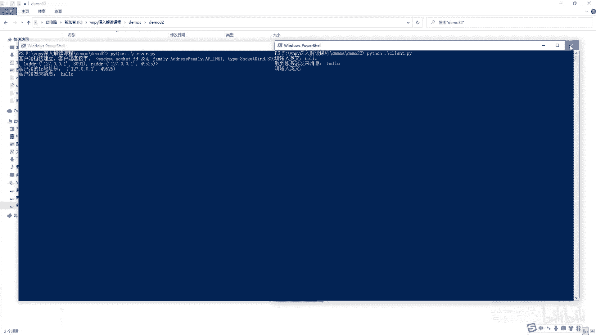

啊receive就是client server up or send message，Send message，in co ut f8S啊，这个是receive message了是吧。

我应该是用新的message给他发过去啊，CINEMESSAGE好。

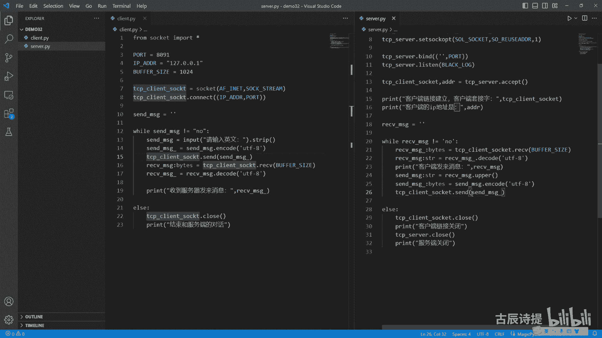

这个时候我再给它进行启动一下。

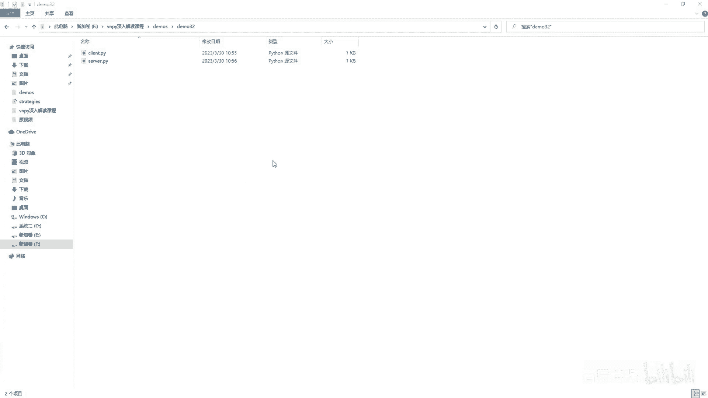

这个是server先启动，然后client再启动，我把server也给他放出来啊，有连接了，这个时候是49547，这是他的port是吧，HEL啊是吧，它就变成大写了吧，你好是吧，如果说我发送中文的话。

你好他还是这个，因为它没法给中文进行大写，这个就是一个连接啊，就是是在同一台电脑上是去演示的，你可以呢给它放到，比如说你有个服务器呃，当然那个服务器啊，你得给他设置好了，就是可以进行TCP通呃。

就是通信啊，就是说这个就是一个网络通信这么一个代码。

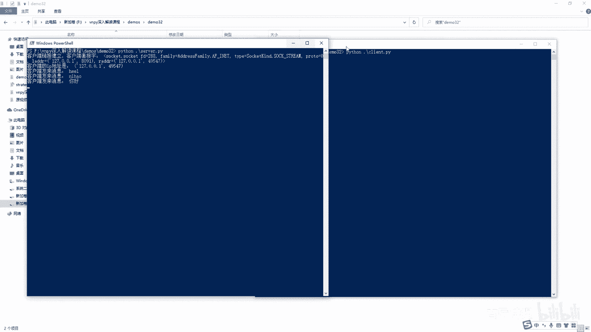

但是呢这个里边会有很多的问题，包括什么问题呢，比如说包括他们的县域啊，比如粘包啊，粘包唉，粘就是那个粘贴的那个粘啊，粘着啊，就是粘包啊，或者说是年包啊，这个都可以啊，包啊包括你需要这个多线程。

你你不能只跟你一个客户端进行通信啊，你得跟多个进行通信是吧，包括它的这个通信的方式，你像咱们这个已经给他写好了，就是一问一答嘛是吧，我发一个什么，他给我回个什么，我发一个什么，他给我回个什么。

但是有的情况下，比如说我接受tick，我不需要这样，我只需要去接收就可以了，对不对，所以呢就涉及到了用什么呢，用这个ZMQZMQ呢，它是一个已经包装好了的一个套接字啊，已经包装好了的一个。

就是说咱们这么一个模块可以去直接使用，他们一样先建两个PY文件，一个是server，它是ZMQ点PY，第二个是client client z m q点PY，这个ZMQ啊，它是封装的比较好的。

它解决了就是说你用直接用这个套接，就是这个这个套接字，它会产生一些问题，比如说这个粘包啊，比如说这个多线程的问题，另外呢还有一个方式啊，就是说你是采用什么样的方式吗，就是这你是采用这个一对一一问一答。

还是你只采用这个指示去发送信息，然后那边客户端只是去接去接收信息的方式，ZMQ呢这里边的方式可以跟大家介绍一下，它有3~4种，但是咱们在这只说两种哎，就是咱们伟大平台上用到的这个方式。

第一种方式呢叫请求回复，也就是一对一的这个模式，请求回复的模式，你这你在服务端，你得写上他的这个方式是什么呢，就是这个REP就是reply，然后客户端的是REQ啊，就是就是这个就是一对一。

他是先接收客户端给你发来的这个请求，比如说请求数据啊，或者获取一些信息啊什么的，然后你去给他回复，第二个方式是什么呢，就是订阅模式，订阅模式呢服务端负责就是推送，就是pub，就是publish嘛啊。

负责去进行推送，然后呃这个客户端呢只负责接收和申请啊，订阅，那这个就是sub subscribe嘛，咱们之前在讲这个咱们这个city engine也好，或者讲这个cp gateway的时候都涉及到对吧。

就这两种模式，另外呢，它代码要比咱们的这个直接用这个套接字来写，要简单得多，怎么写，首先导包啊，import这个ZMQ包导进来之后呢，你首先第一件事就是说ZMQ，它第一件事都是创建一个context。

SUOTEXT等于ZMQ点context context，这个一定要是大写的啊，小写的呢它也有这个类，但是那就是不一样啊，咱们就用大写的就可以了，这个context创建好了之后呢。

context点socket，这个socket里边就涉及到了这个socket type了吧，咱们先给大家演示一下这个订阅，订阅直接ZMQ点这个服务端用什么PUB啊，publish是吧，它会有一个返回值。

返回值呢咱们用这个用一个来接一下，还是用socket这个变量来接一下，这个socket和这和这个咱们这儿的这个socket啊，是不一样的啊，是不一样的，它的功能肯定要比那个socket要强大得多啊。

这个socket接上了之后呢，咱们在这儿他需要就是确定它是用什么样的，这个传输协议，你想这个是代表的是什么呀，是这个TCP协议，然后UDP咱们也给大家看过是什么样的，这儿呢你直接就什么呀。

就是socket点bug，BG里边呢它传入的是一个字符串，字符串呢，首先第一个它这就是你用什么协议来进行传输，比如说TCP是吧，两个啊，就是两个就是斜线，然后后边呢需要你的这个地址。

也就是这个ADDR地址呢，咱们就用星号就表示本机啊，然后冒号后边再跟上你的这个port就是你的端口，比如说我8900，然后这个绑定了之后，你就可以去发送信息了，比如说我同样写一个死循环。

while true啊，这这个message等于什么呀，就是input input，然后这个里边啊请输入消息是吧，请输入消息，然后message，就是说你输入了肯定是一个字符串类型的，字符串类型。

咱们要传输的话，必须得把它转成这个就是字节形式的，对不对，所以说你message啊，b y t byte等于什么呀，message点，这应该是编码吧是吧，Encode，然后这里边写上UTF杠杠八啊。

这个你就可以去进行发送了，发送怎么发送就直接socket点send send，然后这个里边把message by给他发过去啊，这个就可以了，这个就是一个服务端，是不是比咱们就是这个来写要简单得多。

对不对，简单的多，咱们可以先把它给启动起来啊。

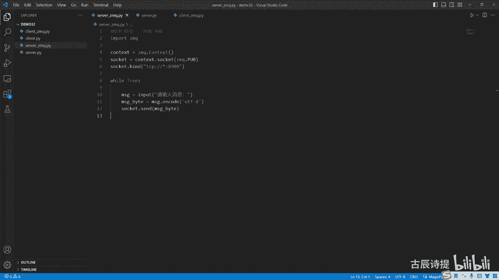

然后写窗口，然后Python Python这个server s e r v e r server AC，We are server，这个ZMQZMQ啊，tap下好。

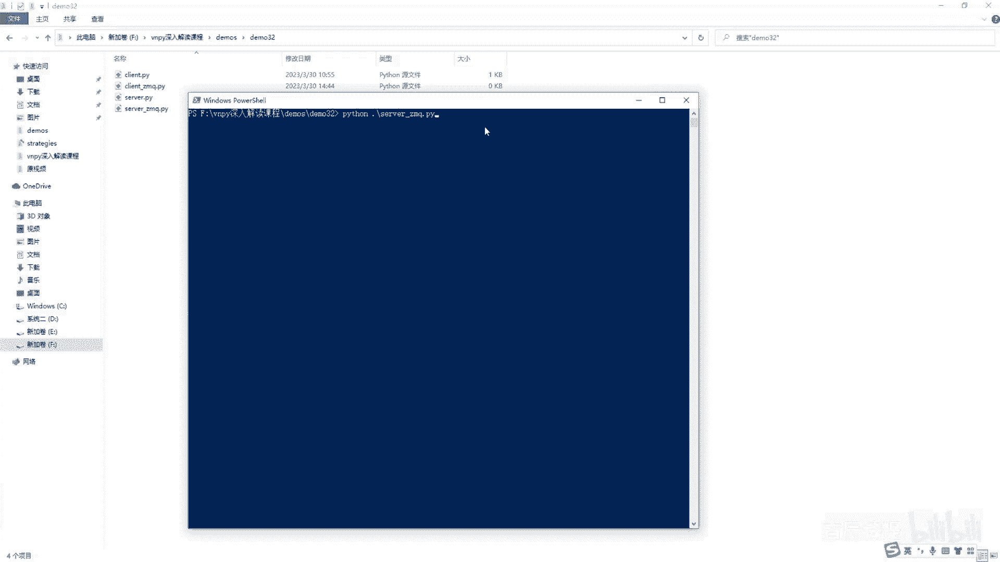

我给它启动起来，我先不去那个给他。

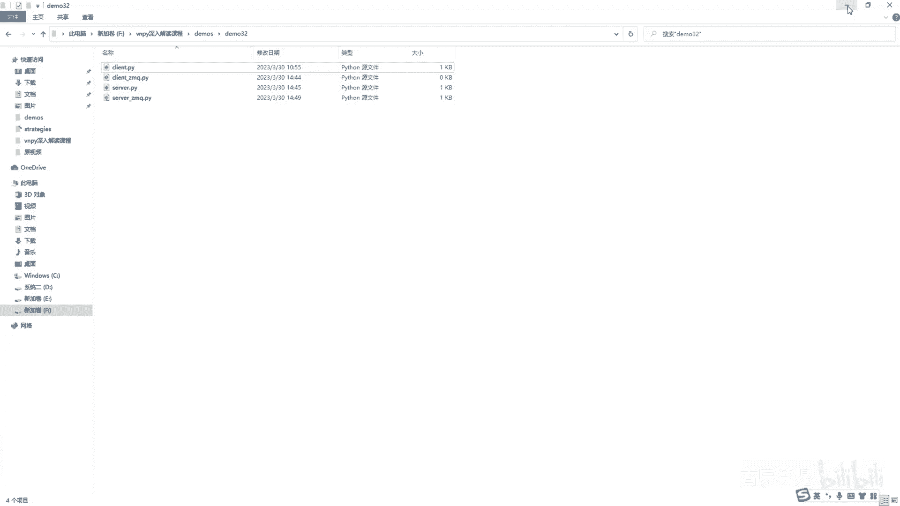

就是说写这个信息呢，咱们再写一下这个客服，就是这个客户端，客户端呢我直接可以把它给粘过去啊，粘过去需要改的东西在哪儿呢，就是首先咱们说过他的这个你PUB，你对应的这个客户端应该是什么呀。

用sub就是这个subscribe嘛对吧，就用sub就可以了，然后咱们之前在这个客户端写过，就是这你就不是by的了，你应该是connect去连接对吧，这也是一样的。

就是connect c o n e c t connect connect，这儿呢你就不能用星号了，比如说我用ca local host也可以用这个呃，比如说咱们用这个一呃幺二啊，不是这个192。0。

0。1啊，用这个也行啊，用这个是这个192。0。01吧，还是用这个LOCALHOST吧，HOST啊啊LOVEHOST去连接，连接上了之后呢，这你不是去发信息，你直接去来收信息就行了吧。

收拾它是一个字节的形式吧，啊b y t e b y t message bi，等于这个呃socket点RECV吧，IECV这个里边也不用说是呃，让他一次性去接收多少了，直接就收就行。

它是一个BT的类型是吧，BOTES啊，BIS的类型，这个说完之后，我是不是给他进行一个转换呀，就是这个message bt点应该是解码吧，Decode，然后这里边是UTF杠八。

然后这个message这写一下啊，message msg等于我就可以去进行一个print这个message了吧，对吧，你这个运行起来，能不能就是能不能去发送信息呢，它是不能的。

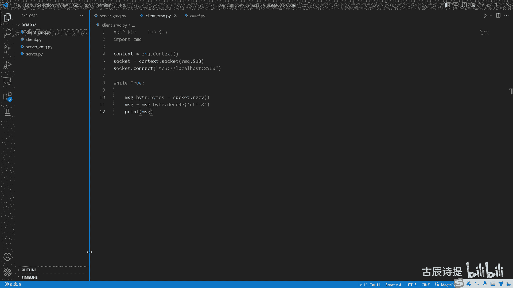

他还缺一个东西，咱们可以给大家演示一下啊，在这这个client。

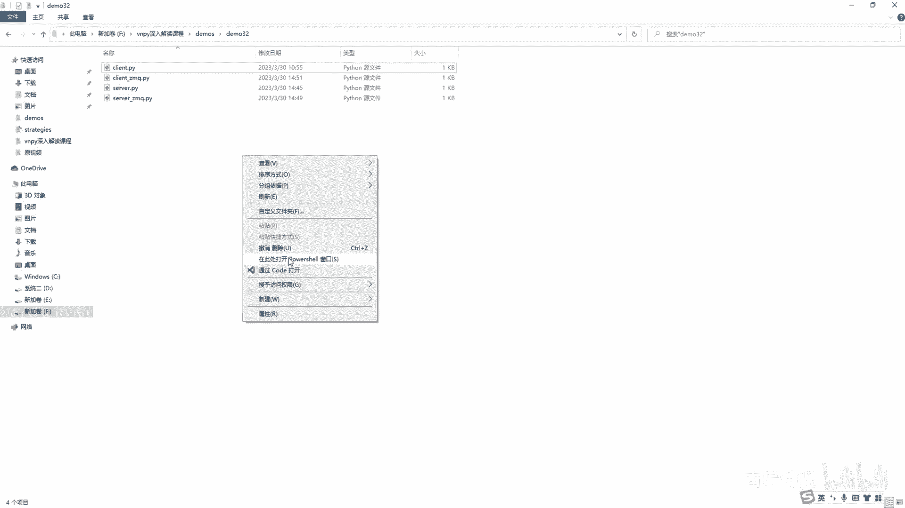

client Python呃，这个c o i n t client z m q tap一下，这个时候你看它是运行起来了，但是咱们从这输入消息。

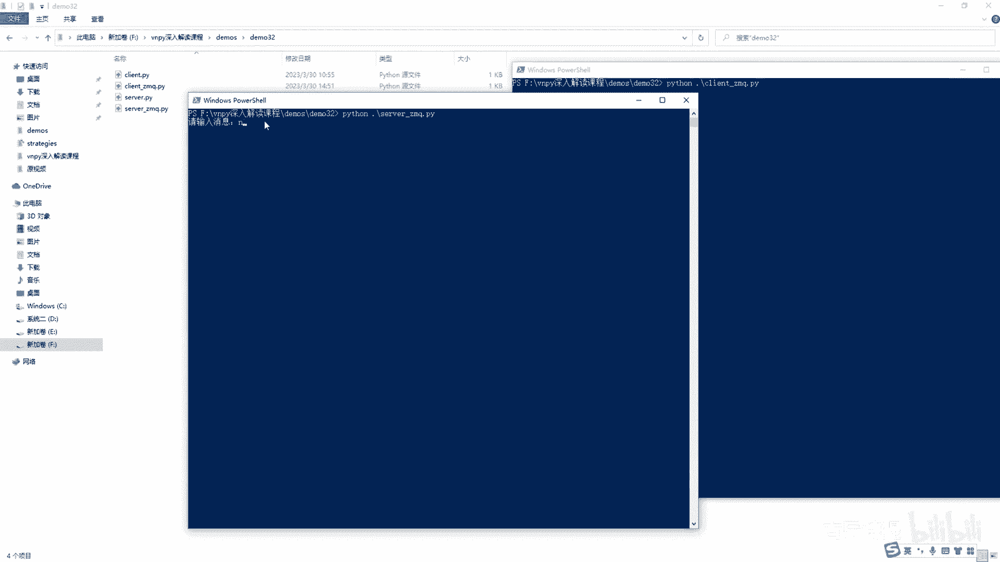

你好，这是接收不到的，这接收不到怎么办呢。

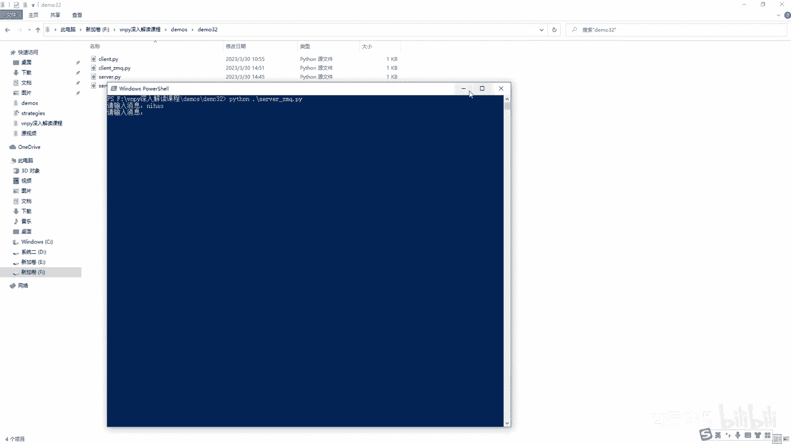

他缺一个叫什么呢，叫过滤过滤，就是这个socket点，Sat socket o p t，这个在咱们在这儿啊，不是在这个server这啊，咱们也设置过啊，也设也设置过是吧，但是它是一个方法。

但是在这呢它好像就是一个变量是吧，也有可能是私有属性，对不对，然后这个里边你怎么写呢，就是ZMQ点subs u b subscribe，然后后边加一个过滤的条件，这个过滤条件你如果这么来写。

就是一个空字符串，然后它应该是就是解码解码，就是encode这个UTF杠八，UTF杠八，这个呢是代表着接收所有的这个信息啊。

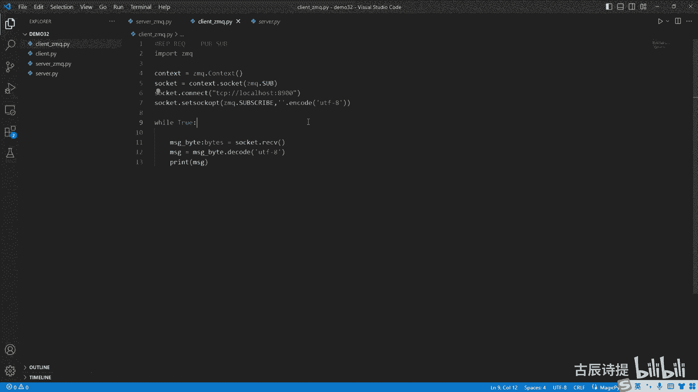

比如说这个时候我给它去运行起来啊。

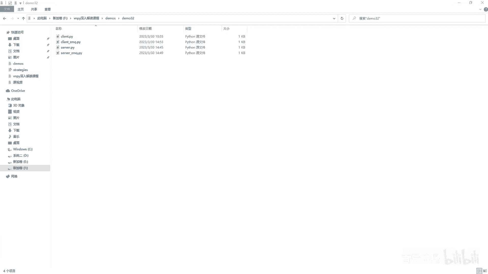

啊同样这个ZMQ啊，运行起来。

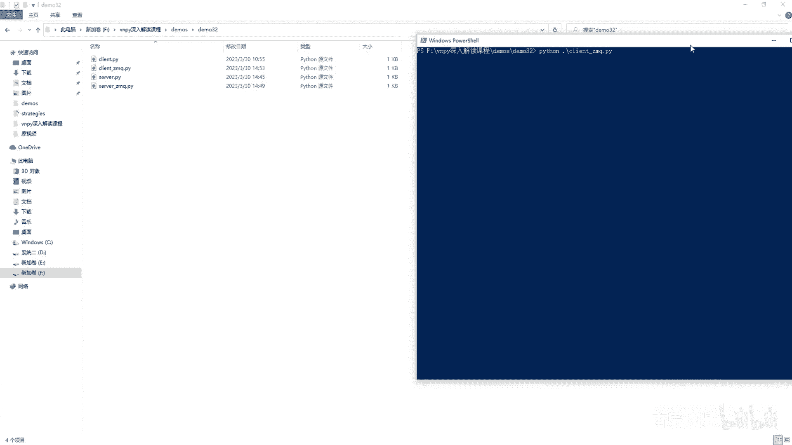

然后我在输入，你好，他是不是就有了呀，Hello，是不是也有了。

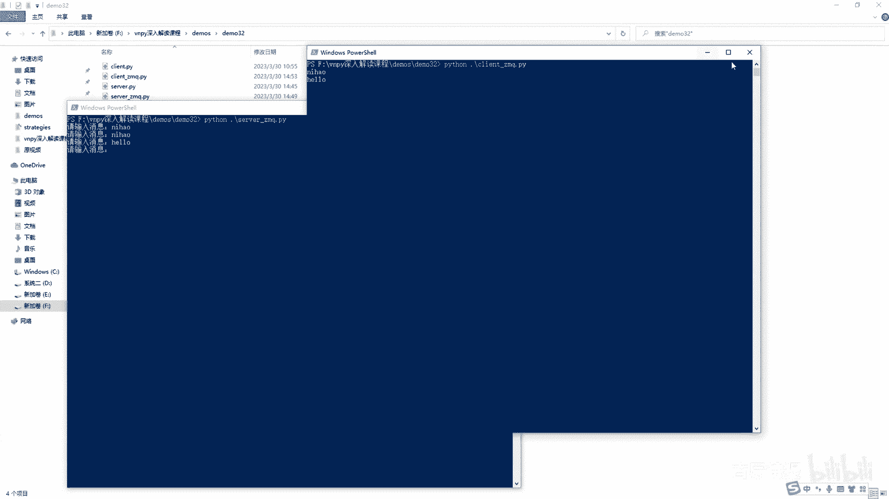

就是这呢它承担着一个过滤的作用，比如说我过滤它什么呢，我就是说必须以A开头，我这写个A它必须以A开头。

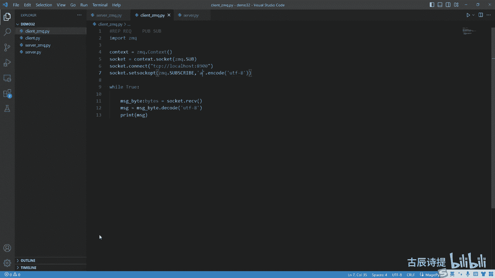

我这个时候我在运行它。

这client zq你看一下啊。

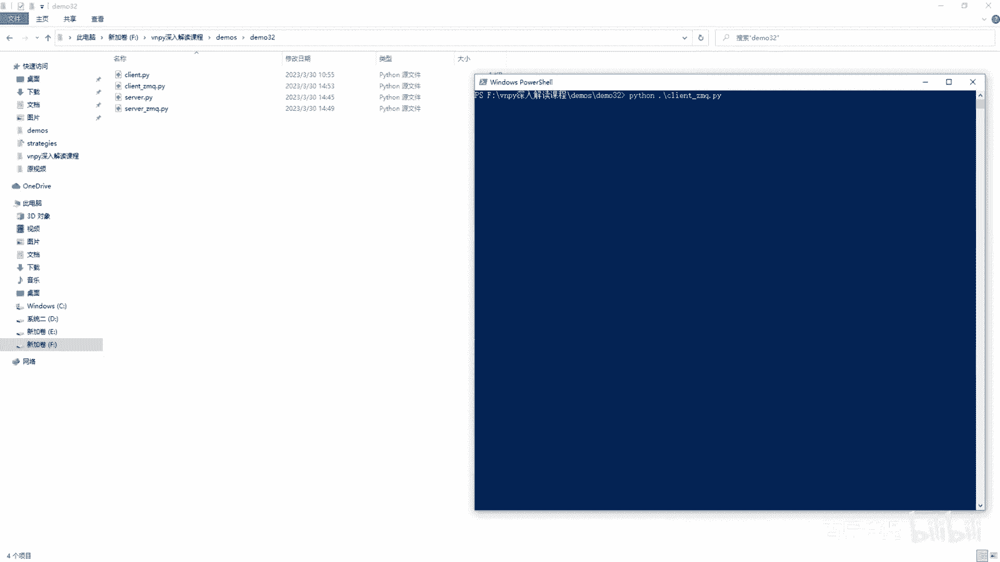

我从这儿写，就是比如说hello h e l他就接不到了吧，但是如果说我以A开头，我一个空格h e l hello，它就有了吧是吧，但是我S没有吧，但是我A反馈它就是有了啊。

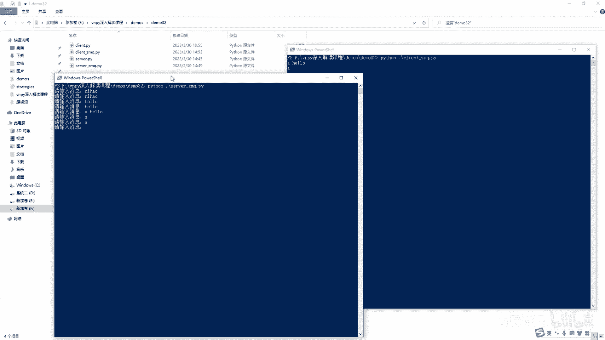

这个就是用ZMQ来进行。

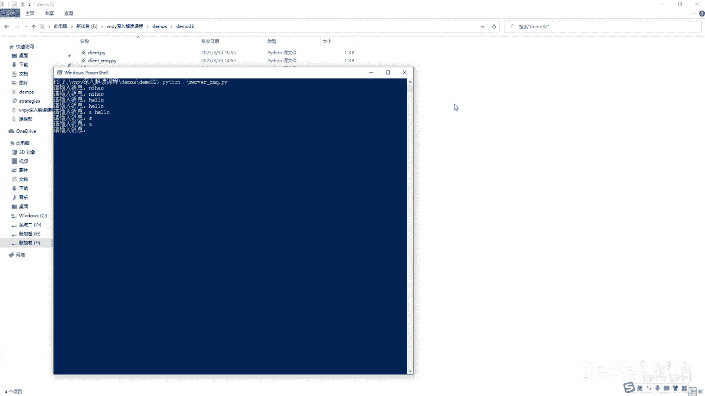

就是说封装的啊，咱们还没有给大家演示，我再给它启动起来啊，Client z m q，我启动一个，然后我再启动一个ZMQ啊，Client z m q，这个时候就两个客户端了吧，两个客户端了。

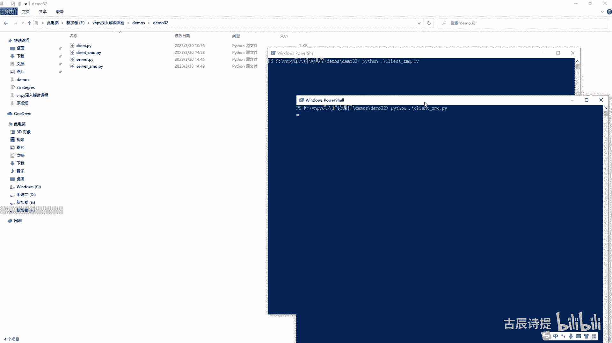

两个客户端呢，我这我再去发送，当然我得发送A他们才能受是吧，A比如说S啊，这个时候咱们把它给是吧，AS都收到了吧是吧，但是我输别的，我里边没有A啊，他就收不到吧，但是如果说我是以A开头的AS啊。

这个他这就可以收到了吧对吧。

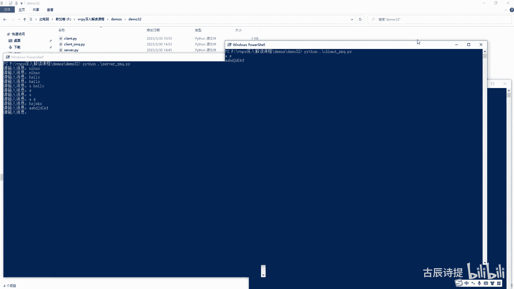

这也是可以收到的吧，啊这个就是它既解决了一个多线程的问题。

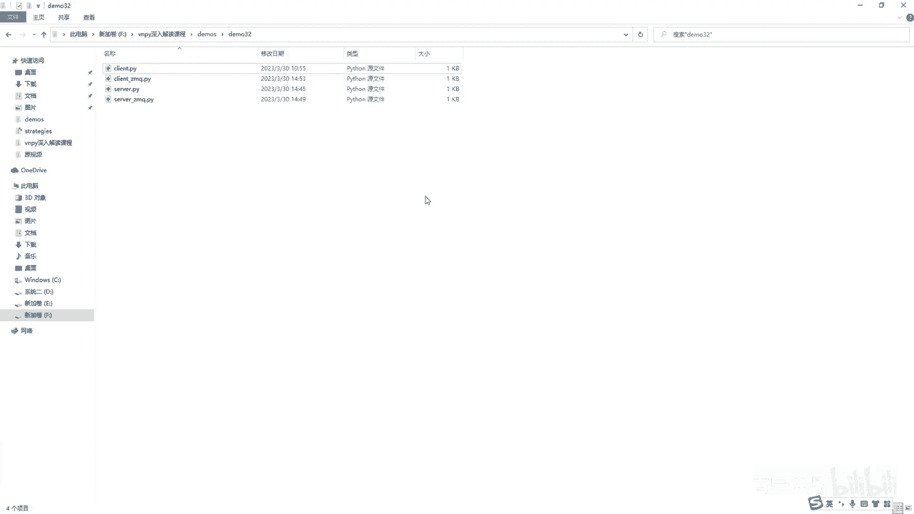

而且也解决了一个就是方式和方法的问题啊，这个IP和IQ咱们呃也给大家演示一遍吧，就是其实是一样的，只不过IP和IQ就是一问一答，一问一答，我先把它关了，我再建两个嗯。

再建两个就是s e r v r server z m q，比如1。2PY，然后这个再新建一个c client z m q一点PY啊，咱们再给大家再演示一下，这个演示呢就是肯定是跟前面有不太一样的。

首先就是它的这个方式，第二个是什么呢，还需要引入一个就是咱们之前在讲这个server也好，讲client直接用套接字的也好，还是在讲咱们这个server zq，它发送的都是什么呀。

他发送的都是就是这个BS，就是字节类型的数据ZMQ，既然他给封装了，那他能不能直接发送叫Python的数据类型的，可以的，它能直接发送Python的这个数据类型啊，比如说咱们给大家来进行一下演示。

你就是咱们再敲一下啊，Import z m q，我服务端我先创建一个context是吧，context等于ZMQ点，context它一定要是大写的，创建好了之后，我socket应该是等于什么呀。

他的这个应该context点什么呀，点这个socket啊，然后这个里边的服务器的方式是ZMQ点，咱们说了，他是应该是在服务器里边，是应该是reply是吧，应该是REP啊，Ip reply。

然后socket2点这个bind，我绑定一个这个里边首先得TCP，然后冒号告诉他是什么一个协议，然后呢我的地址我就用新号来代替，就表示本机，然后冒号后边根据呃就是那个端点呃，端口号我8900。

然后完事之后，我是不是就可以就是while true去进行去发送了，对吧，它既然是一问一答，你这个是作为这个应答方，那作为应答方，我是不是就是说我只需要先接收东西，是不是接收东西。

比如说我这个是data等于接收东西，我怎么去接受呢，socket点之前咱们是IECV是吧，I e c v i e c v，我直接接收py object啊，我直接接收py object。

就是P就是Python对象嘛对吧，我接收过来这个py object，我把这个data呢，我data等于一个呃，比如说我用个元组把data放进去啊，元组你必须得加逗号啊，把data放进去之后啊。

我这儿呢我接收过来，我先输出一下这个data啊，我先输出一下这个data，然后我接过来之后，我把这个data换成一个元组，元组是咱们Python里边的这个数据类型吧是吧，我再给他发回去，我再给他发回去。

也就是socket点send py object，然后把这个data给他给发回去啊。

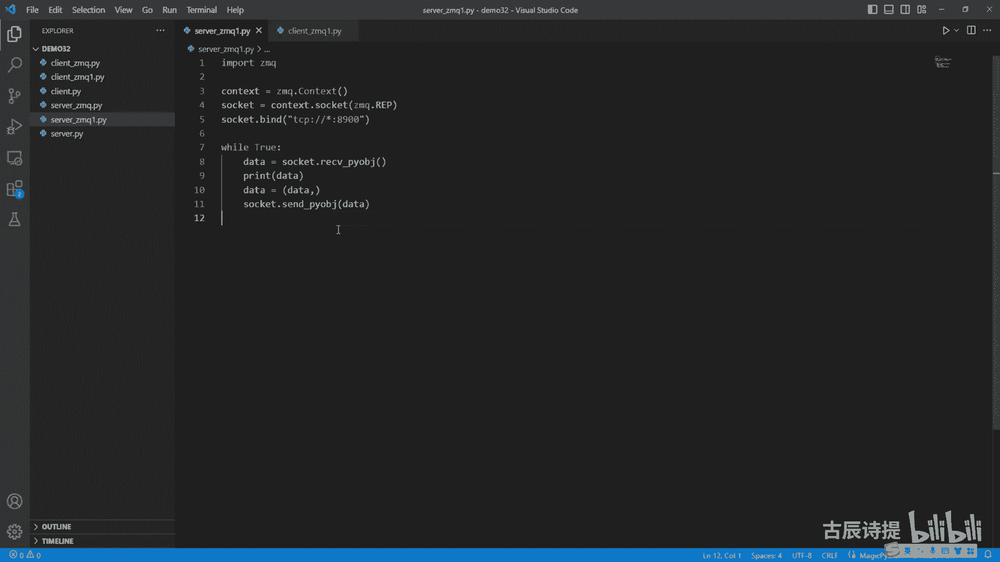

这个就是咱们的服务端啊，咱们可以把服务端启动起来。

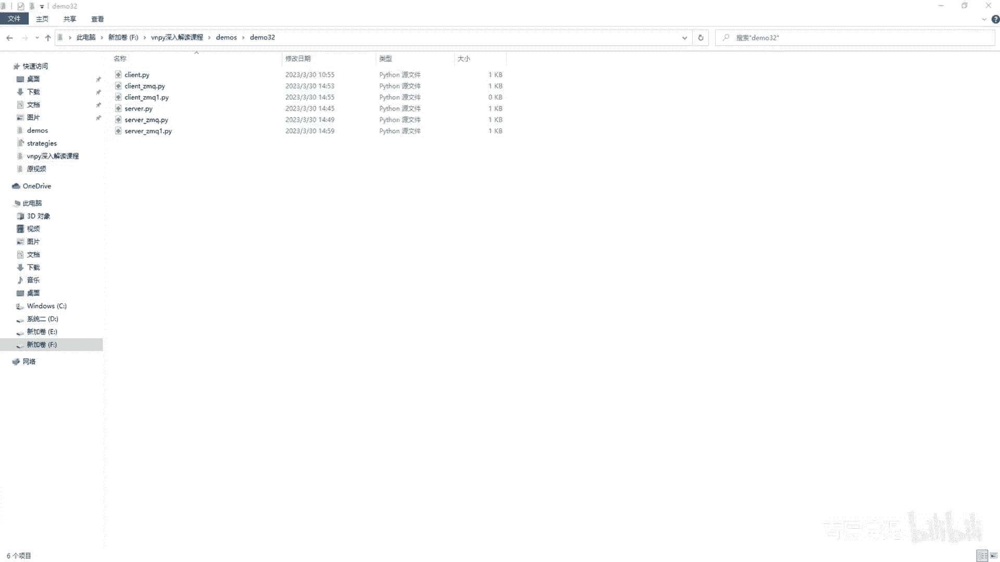

这个啊一样的Python这个s e r e r server z m Q1啊。

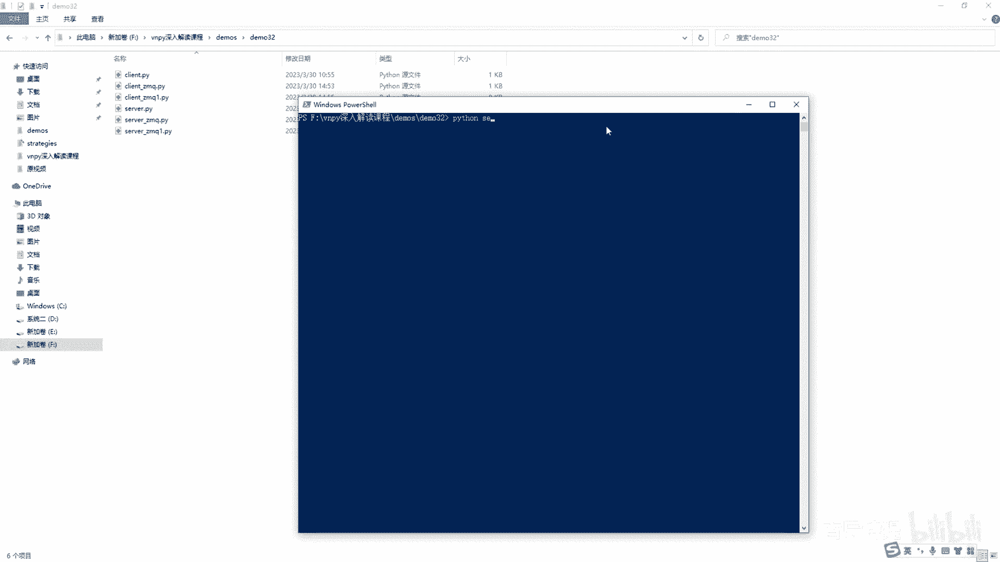

我tap下好进行运行，他得等着。

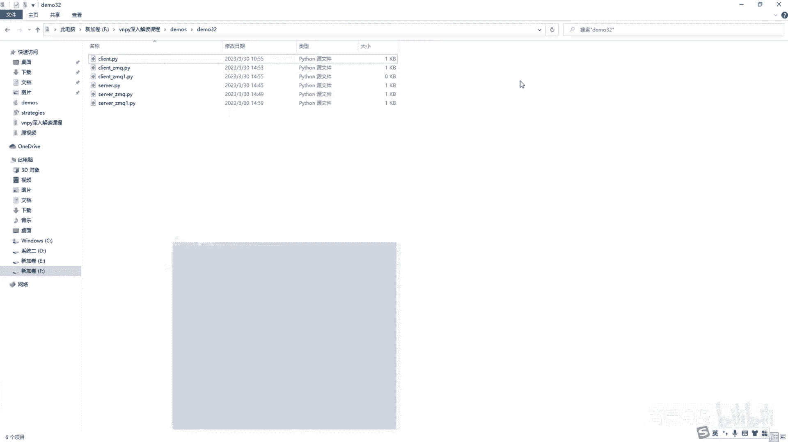

就是说这个呃客户端来进行访问啊，然后来提出要求是吧，然后我把这个客户端呢，我把它一样的给它粘过去，给它粘过去，首先你要改的是什么呀，这个应该是REQ吧，是request，是由请求是吧。

这呢改成就是说这个lcl local host，Local host，然后不是bin了，应该是connect是吧，connect我连接它，连接了之后，我首先第一步应该叫sin object啊。

Single object，比如single object呢，我这应该是这个呃，message message等于input input呃，请输入信息啊，加上一个冒号，然后message有了呢。

我直接就syle object，咱们之前还需要去进行转换是吧，这我就不用进行转换了，因为你输入的它也是STR类型的，对不对，STR类型之后，我给他发送过去之后，然后我再去进行接，是不是就可以了呀。

就是这个RECV吧，R e c v，然后我把它给接过来，然后这个data我给它复制成是吧，这个data，然后我print一个data。

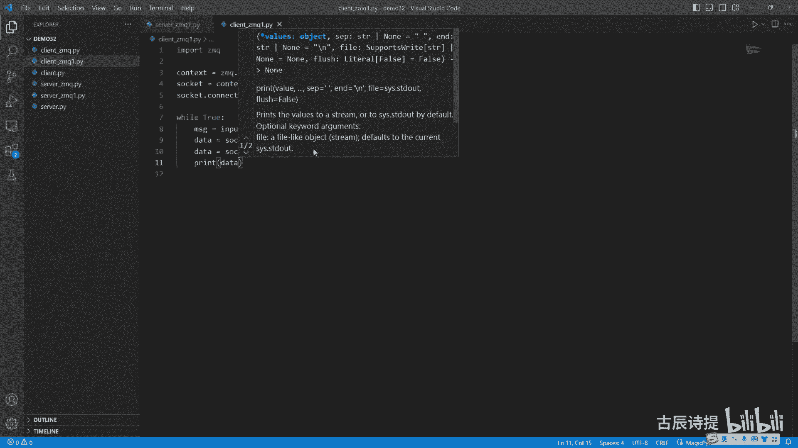

是不是这样就可以了，然后我去进行一下运行啊，再次打开泡泡小窗口。

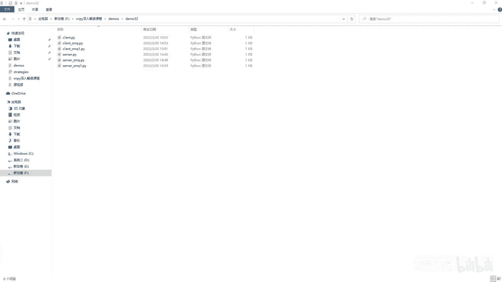

然后从这啊Python这个这个c o i n t client，CLI int client type一下啊，ZQ我找这个ZQ1，请输入信息啊，你啊这个然后我收回来的信息，还是这个加了个元组吧对吧。

啊这个是他，你看这是他的这个这是服务端的信息是吧，他给他做了一个就是改变嘛，比如说我还是把这个发过去，直接就回来了吧，是不是你就随便发是吧，他直接就回来了吧，给你转成一个元组，是不是就回来了。

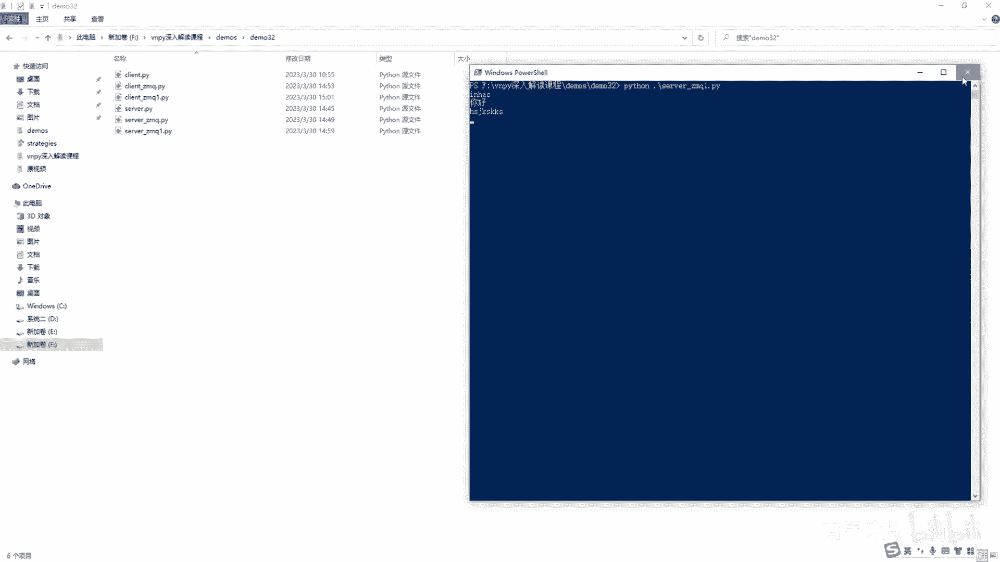

很方便嘛，而且这就是你发现它也不需要跟这个，咱们之前似的了，就是说你需要做一个，就说这个叫什么筛选还是什么的啊，这就没有了，直接这么写就可以了，那既然有这个，咱们的目的是为了进行这个RPC吧。

RPC的这个代码的这个写吧，RPC其实就是说我一个主机上，我上面负责，比如说接收行情，然后他有这个main engine对吧，然后有main engine，然后我接收行情。

然后就是说呃就是说这个给这个get away，也在这个里边，我跟这个呃就是TDAPI，也就是这个底层也去连接，然后我这边有电脑，比如说下面有几个员工是吧，也有电脑，然后需要跟他进行连接啊。

登录其实是登录的是什么呀，是就说连接上这个主机，连接上这个主机之后呢，这就是可以根据需求，比如说接收行情数据，或者说是去发送委托对吧，或者说是接受这个持持仓信息，或者说是获取历史数据总归。

首先你肯定就是说得需要去订阅是吧，这个pub呃，就是说你肯定是需要去订阅行情的，也就是你这需要有sub和pub，另外还得有一问一答，比如说我想获取一个信息啊，是不是你肯定也是也需要从服务端来获取吧。

对吧，那服务端怎么来获取信息呢，就比如说我这儿呃，我定义一个类，class person是吧，我定一个类，然后这个里边呢我初始化一下啊，这样self，然后这个里边呢我写上self their name。

比如说等于小红，然后cf点age我等于18啊，然后我定了几个方法，DF就是说呃gate name，cf will return这个self name是吧。

dnf gage f or return self点，四点age吧，然后我在df get什么呀，比如说change change name cr说这需要一个new name吧，对不对。

然后我这个cf点这个name等于new name，然后DF全接age cf，然后new，age sage等于new age吧，那我有这个类，比如说我给他进行实例化了，P1等于这个person。

我给它进行实例化了，然后比如说我这是一个服务器，我现在另外一些服务器，当然我这就是改变里边的数值了啊，我现在要求我能从客户端去改去获取他的姓名，获取他的年龄，而且可以去改变他的这个呃名字。

也可以改变他的这个年龄，是不是我从客户端那边需要去调用，比如说change change name和get it，就是说这get a呃，这个name是不是是不是需要去客，去客户端那儿来调用。

那从客户端怎么去调用，客户端只能去进行一些数据的传递，对不对，能只能进行一些数据的传递吧是吧，哎我把这个写到这个客户端这来了啊，我把它写到这个服务服务端里边去，好吧啊，好我给他写到这个服务端里边去啊。

好我服务端我要求就是说客户端我连上之后，能根据我的需求去改变这个类里边的某些内容，或者是来获取这个类里边的某些内容，那你那你应该怎么去做呀，咱们通常来调用的时候，比如我先把它给注释了。

你调的时候是不是P1点age是吧，或者P1点啊，GAGE对不对，它会有个返回值吧是吧，IS等于这个是吧，那是不是还有一种就是说这个gtr get a t t r，然后这个object是什么呀。

object是这个咱们的P1吧，然后你这个后边是不是字符串，比如说这个git name，然后你这个IES我直接实例化一下，就是它返回的是一个方法吧是吧，因为你get name它本身是一个方法呀。

是不是它返回的是一个方法，我括号是不是就是去调用，然后比如IES1等于这个，然后我print一个IES1，哎这个是应该是EXIT啊，我CLS一下，然后我运行它一下，是不是就是小红，就是你得知道啊。

我这get AD t r，我这get name，它是这里边的一个方法，然后我这个IES是不是就相当于什么呀，它是不是就相当于这个P1点这个g name，对不对，然后我再给他加一个括号。

是不是就是进行调用了呀，然后我print一个这个IESE，是不是就是它的这个结果呀，你看这是能够根据他的这个名字来进行调用的，对不对是吧，get AD d r对不对，其实咱们这儿如果进行传递的话。

是不是可以就是直接用get AD t r或者SDTR，对不对，这是第一种思路啊，这是第一种思路，第二种思路是咱们是不是可以给他，比如说我这写上functions，functions等于啊它是一个字典。

然后呢我functions这个key是什么呢，比如说这个git name等于这个P1点get name，然后functions这个GAGE是不是等于P1点GAGE，然后functions同样的啊。

这个里边这个change name是不是等于P1点change name，这个functions这个change，是不是等于P1点，chang age是吧，我在进行传递的时候传递过来。

当然里面有一部分还有参数对吧，我传递过来的时候，比如我receive这个哦py object的时候，我是不是可以让它默认传递的是什么呀，默认比如说它传递的就是一个列表，列表里面第一个是名字name。

这个name是什么呢，是get name还是get age还是change name还是change age，然后第二个是什么呢，传参数参数呢，咱们一般的啊就是这个星啊，就是这个ARJS它是个元组。

然后你放进去的时候，就说你给他去进行去调用的时候，你前面加一个星号，是不是就是解引用对吧，这都是基础知识啊，还有个KWARTS，就是这个是个字典吧，这是个字典，然后你再放到那个参数调用啊。

不是你在进行传参的时候，你是不是加两个新呃，加两个信号就可以了，对不对啊，这个是位置参数，这个是关键字参数，这个是Python基数里边的，然后你是不是传这个三个参数就可以了。

然后你再根据这个字典找到对应的这个方法，然后给它括号，括号后边，把这个ARGS和KWIGS给它传进去，是不是就可以了，对不对好，我这个data就是默认是这样的，所以说我什么呀，我这个name就可以呃。

还有这个ARGSARJS和KWARJS，就等于这个data data，它是一个传过来的，是元组也好，是列表也好啊，咱们就说它是元组吧，top啊，它传过来的是一个元组，元组可以直接进行传递吧。

因为它是Python的数据类型啊，对不对啊，他接收到了这个呃py object是吧，然后我就把name a r g s和KWARGS，是不是就都有了。

那都有了的话啊啊if就是说name in functions，如果说这个name在这个function这个字典里边，或者你加一个kiss都可以啊，在它这个里边。

我是不是FUNC这个function就等于这个funk啊，这个functions它的这个key啊啊不是这个name，这个是不是就是一个COLLAB，就是它是一个可回调的方法。

然后可回调的方法我是不是function，然后直接用括号进行调用，然后把ARGS和KWALGS给它传递进去，但是你记住传进去一定要加一个星号，然后后边加两个星号给它放进去对吧，你空字典它就是空字典嘛。

对不对，这个时候他如果有返回值，我是不是可以接一下对吧，然后我是不是有了这个，如果说这个名字在这里边，说明就是说你服务端是可以进行调用的，那我的这个就是这个IIIS啊，比如说reply，就是我的回复。

是不是就应该是比如说我也用个元组，这个元组呢我第一个放什么true是吧，就说明我服务端有这一项服务或者功能，可以进行调用对吧，然后这个true放到里边，第二个是什么，放RES吧，放它的这个结果吧对吧。

如果说他没有返回值，你像这种没有返回值的，它就是浪值嘛，对不对啊，else如果说他这里边没有print啊，你可以输出一下服务端没有这个方法调用，或者没有这个接口是吧，我把这个比如说点format。

然后把这个name给它放进去，对不对啊，把这name给它放进去，然后我i e s reply应该是等于什么呀，也是个元组啊，应该是false是吧，然后后边比如说我再传一个这个，空的东西过去啊。

空的东西过去，或者里边写个ROR就error，有错误，对不对，有错误，这个时候我在socket点send py object，然后把这个IE这个reply给他发过去，是不是就可以了对吧，咱们对应着的啊。

咱们对应着的呃，把这个看这个向右拆分一下spring light，咱们来进行发送的时候，发送的时候你是不是得首先得得先去输入名字，对不对啊，就是说这个比如说这个name啊，请输入就是说方法吧。

就是调用的方法吧是吧，请输入方法啊，name第二个就是这个参数ARJS啊，JS等于什么input啊，就是请输入，请输入是这个参数啊，参数请输入参数呃，这个参数呢它是一个字符串类型的。

当然咱们还得去改变一下，因为字符串类型的呃，如果说你写你名字的话，可以是吧，但是如果说你是要去改这个A解，是不是就不对了呀，所以说咱们得从这进行判定一下1ARGS啊。

ARJS等于等于比如说这个change加啊name啊，这个change name，然后RJS就等于就是因为他接收到的啊，他接收到的它这个ARGS它应该是个元组，我就把这个ARJS给它放到里边。

作为一个元组，我把这个ARJS就是重新，就是就是更新成一个元组，不然的话你到这边你进行接应用的时候，你就没得解了，对不对啊，air if这个ARGS，然后等于等于这个千接age a g e啊。

前期age等于年龄的话，我这个ARGS是不是应该就等于这个同样的，也是一个元组啊，但是我必须得是int类型的是吧，应该这个ARGS，然后他它是一个元祖啊元祖，然后我就不输入这个字典了。

因为咱们这儿用不到，只有一个参数是吧，而且它是一个位置参数啊，位置参数，然后这个KWKWARGS，我就等于直接等于一个空字点，是不是，然后我这个T啊等于他是一个tutor，里面存放的是首先是name。

然后后边是ARGS，然后在后边是什么呀，是这个KWARGS，然后我就可以把这个T直接给发送过去对吧，把这个T直接给发送过去吧，也就是socket点send py object，然后把这个T直接发送过去。

发送过去之后，我socket点等着来接收吧，就是IECV这个p a p y object啊，py object接收到了之后啊，他这个返回值也是一个top是吧，也是个tube，比如data我接收一下。

它是一个tube类型啊，TOPLE啊啊表示好了啊，小写的啊，它是个cube类型，然后这个里边就是嗯，咱们就直接进行输出吧是吧，直接进行输出，做一下演示就可以了，好这个时候我把它给运行起来啊。

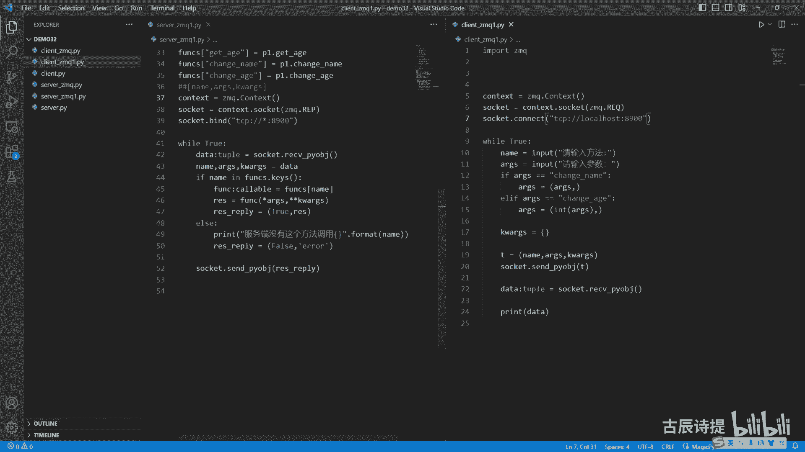

运行起来。

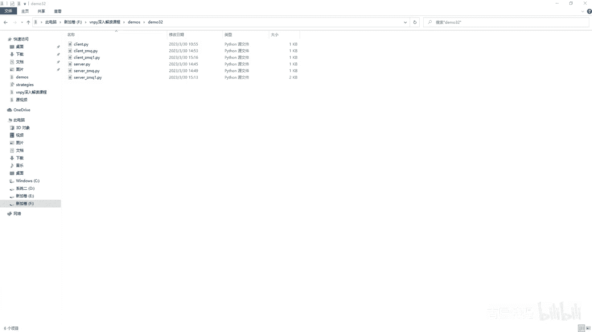

然后我这个them啊。

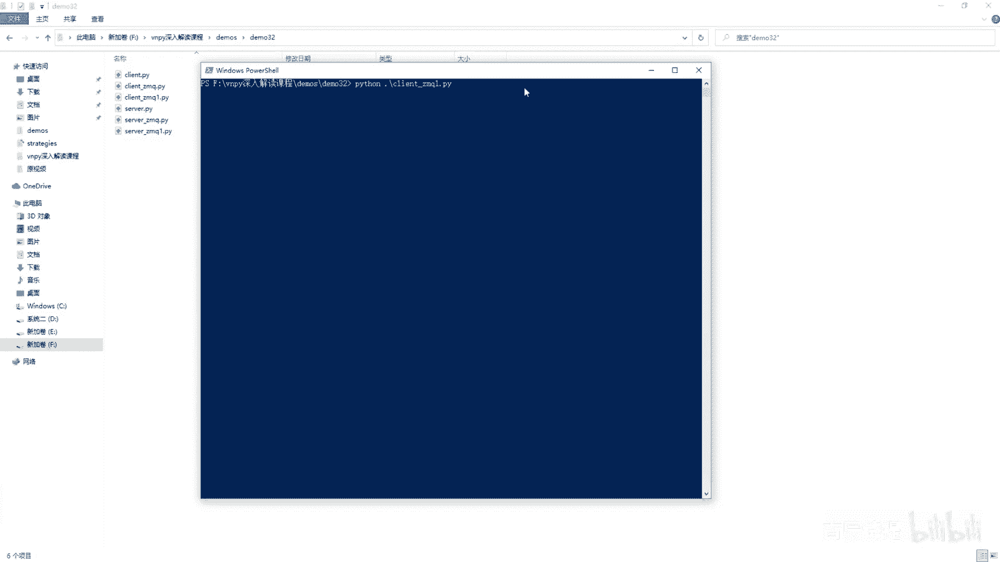

这是client server zq，一好，我再把client在运行起来。

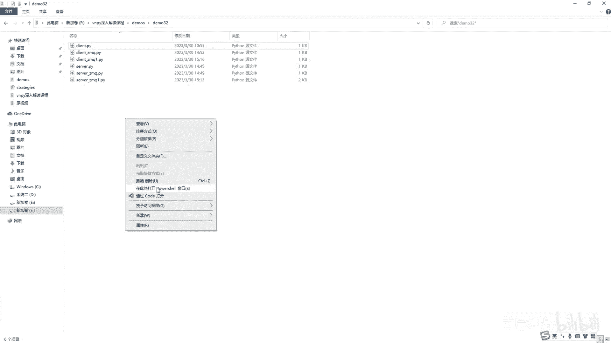

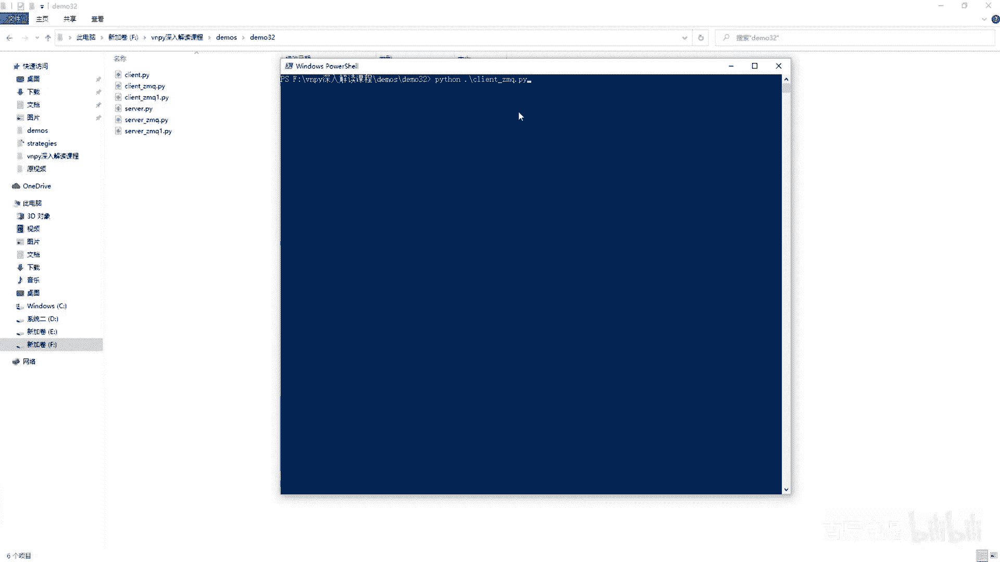

client zq1好，请输入方法好。

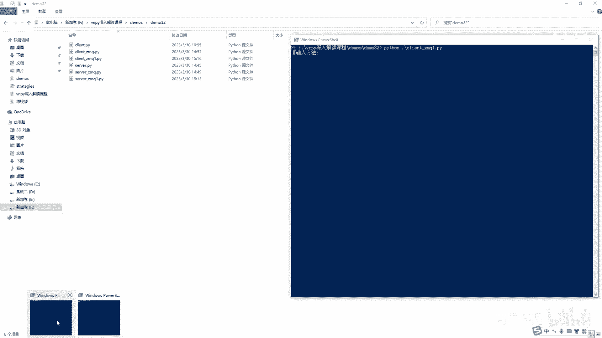

这是客户端，这是服务端是吧，请输入方法，比如说我的方法就是G，然后请输入参数啊，我这个就一个空格啊。

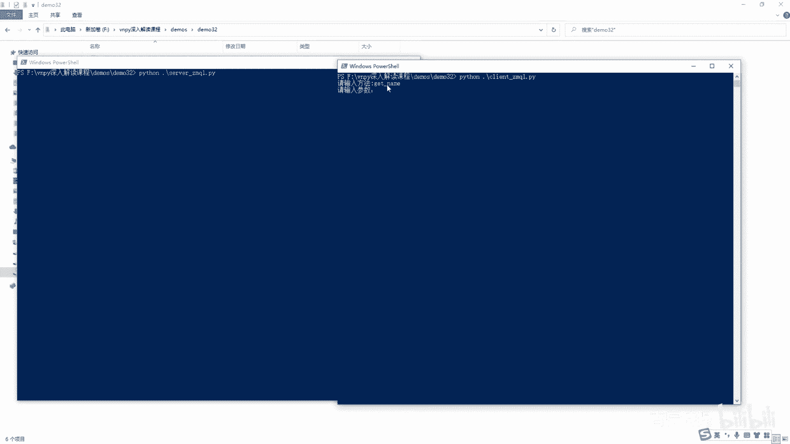

没有没有参数，这有问题，因为我是一个空格对吧，我给了两个参数。

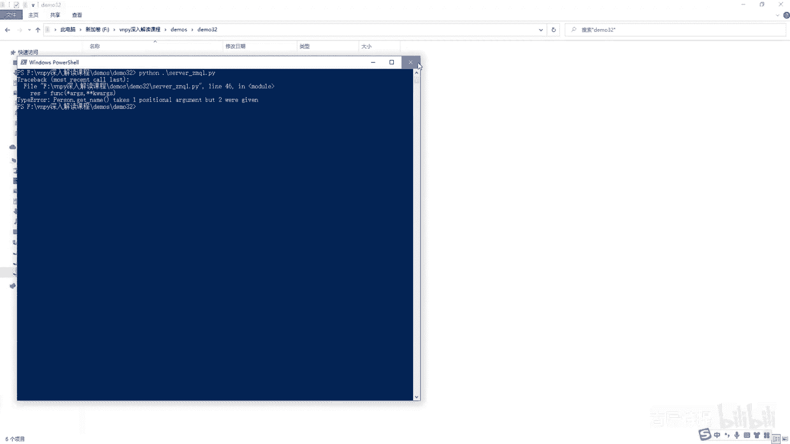

给了两个参数，这就不对，所以说我这需要什么呀，STR啊，我给忘了，应该把这个参数直接给他，就是说这个那个什么的给它，就直接把它给删掉的是吧，然后我再去进行运行一下啊。

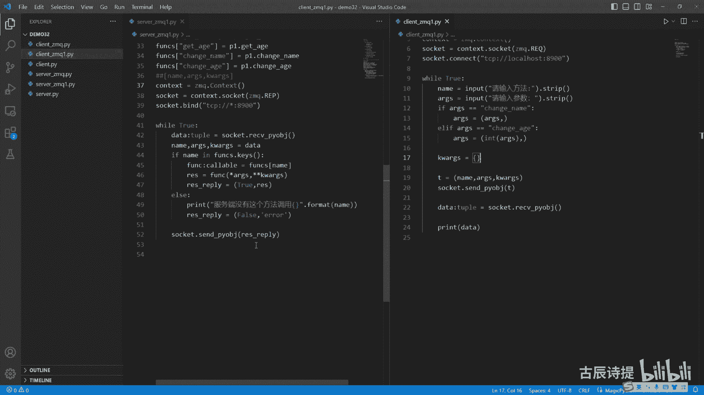

我再去进行运行一下，Server zq e，然后再打开窗口。

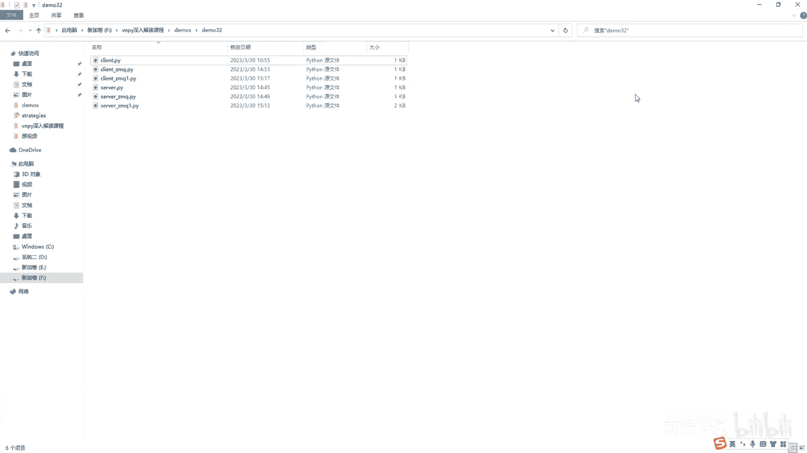

client zq1输入方法啊。

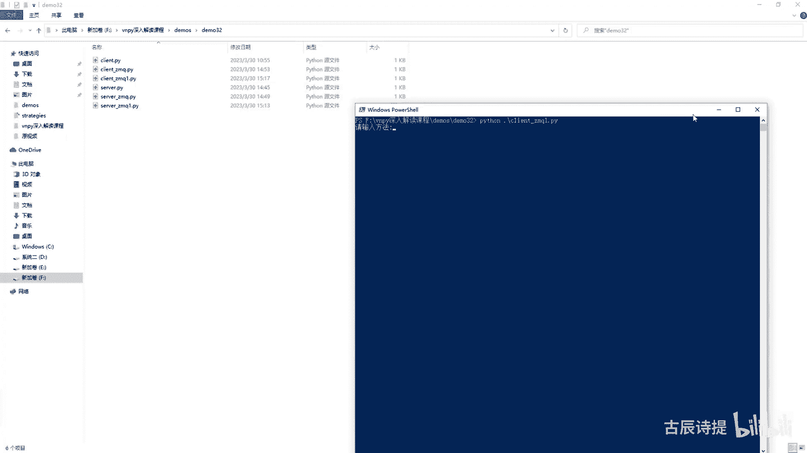

咱们把它放就放在这输入方法，比如说我change name，我change name啊，Change name，然后输入参数，比如说我叫ALEX啊。

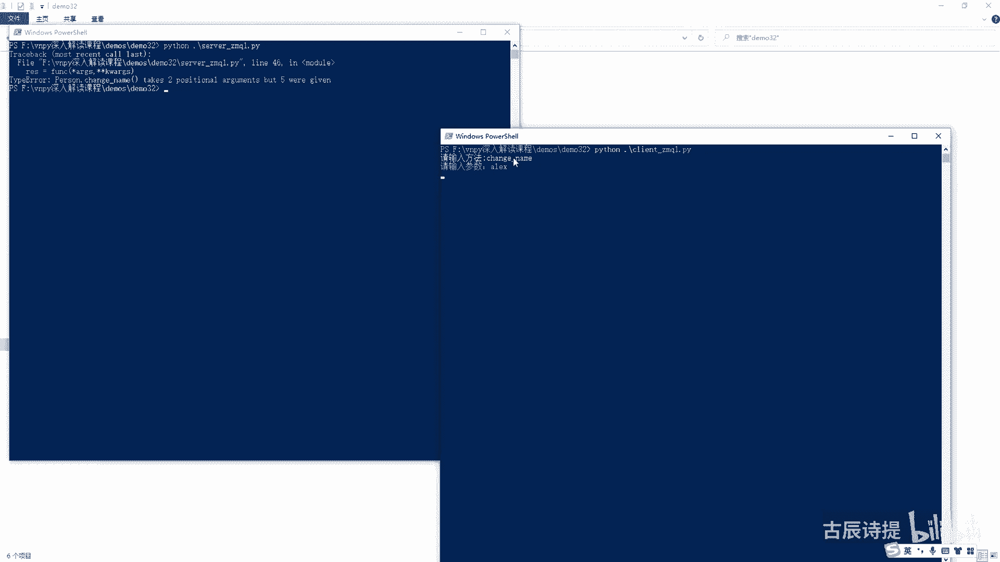

啊这个还是有问题啊，还是有问题，咱们再看一下这是不是有错误，这边应该是name吧，name等于change name是吧，elf name等于change age，应该是这样才可以吧是吧。

应该就是说我的方法等于是个什么，我下面的这个参数就应该等于什么。

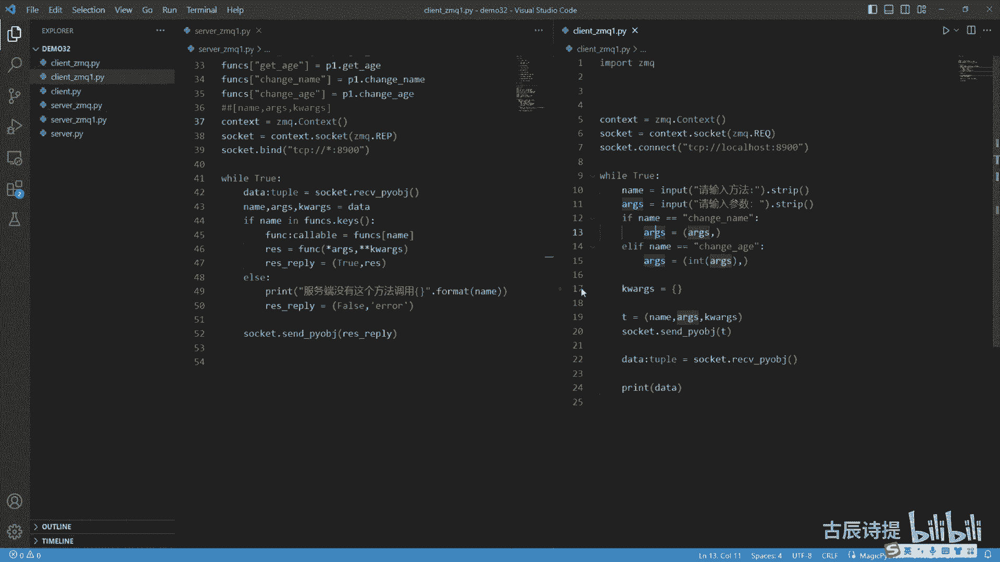

对不对，好再启动一下啊，再启动一下啊，有问题很正常啊，server mq1好，咱们再试一下power窗口。

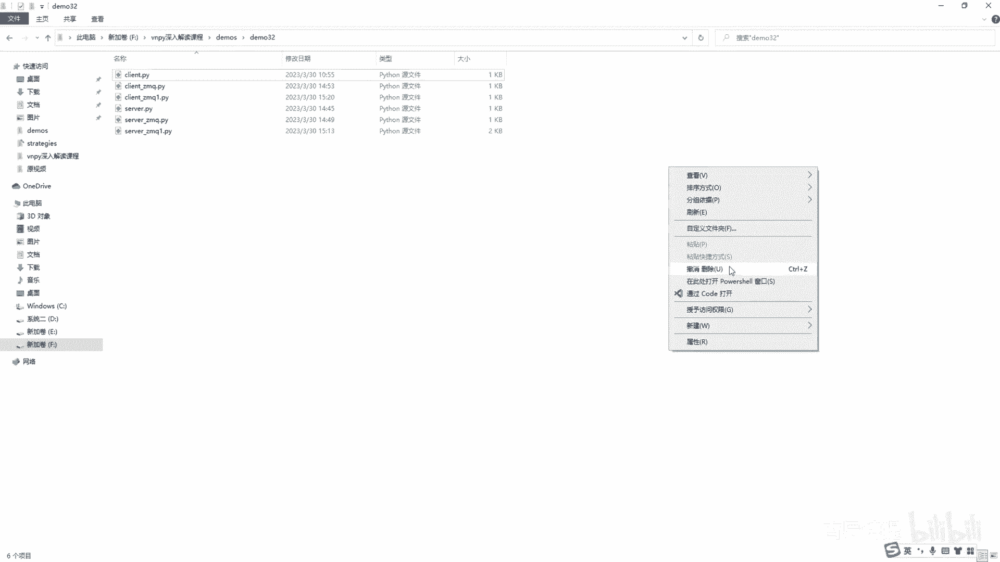

然后这个client输入方法，比如说这个change name啊，参数参数呢比如ALEXALEX是吧，True，但是它没有返回值，然后呢我再去获取一个叫什么git name，我名字不是改过了吗，对不对。

然后我参数没有，然后我是不是获取到了true alex了吧，对不对，我刚才改了吧，我刚才改的吧。

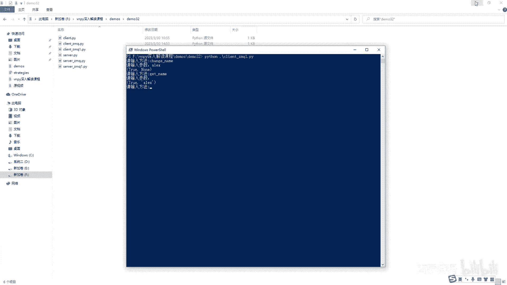

因为本身咱们的这个名字是什么呀，是这个是什么呀，是写的是小红对吧，这个就是其实就是维纳平台那个RPC，他做的事情一边是订阅，一边呢是这个一问一答，比如说我在写一个get name。

get我get age是吧，然后我没有参数，然后是18岁吧，我change age age，然后我参数比如100，然后我这个时候我在GAGE参数我没有，是不是就是100。

比如说我获取一个比如HHH这个没有是吧，然后false error吧，对吧啊，那咱们剩下的下节课再讲，咱们来解析一下这个VNPI这个维纳平台，它那个RPC是如何去写的。

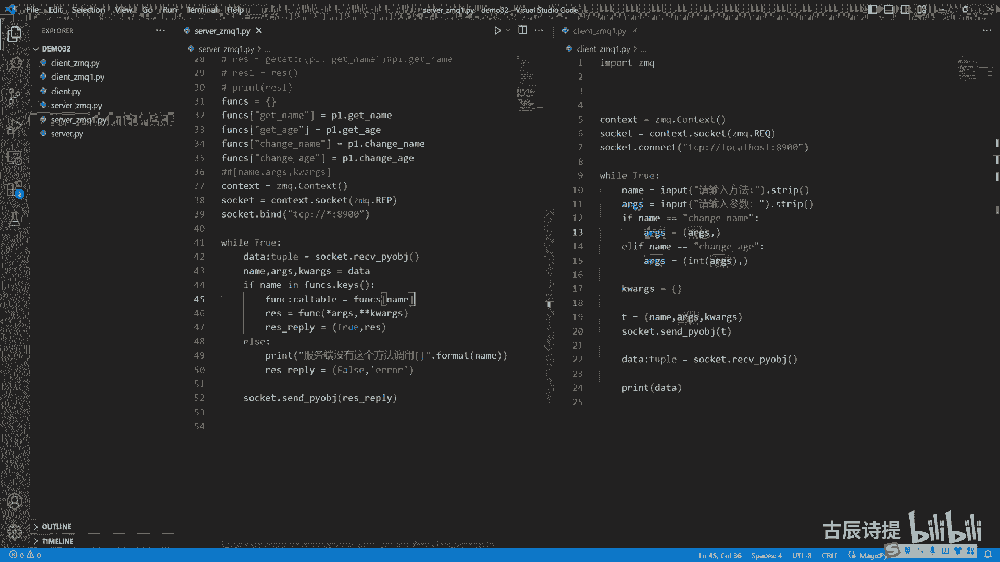