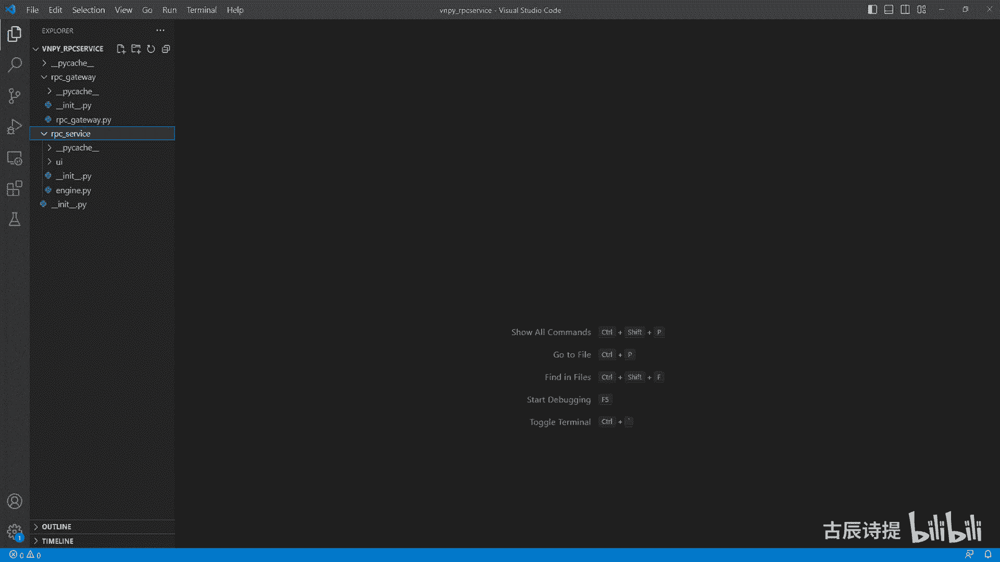
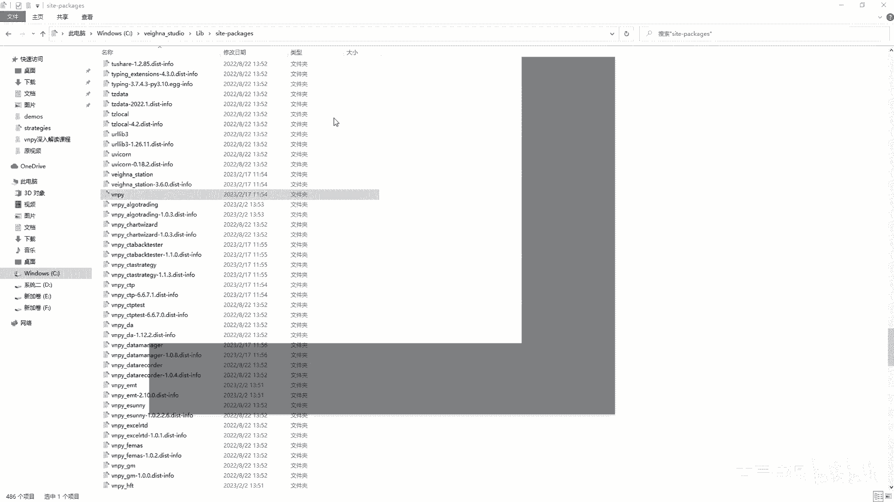
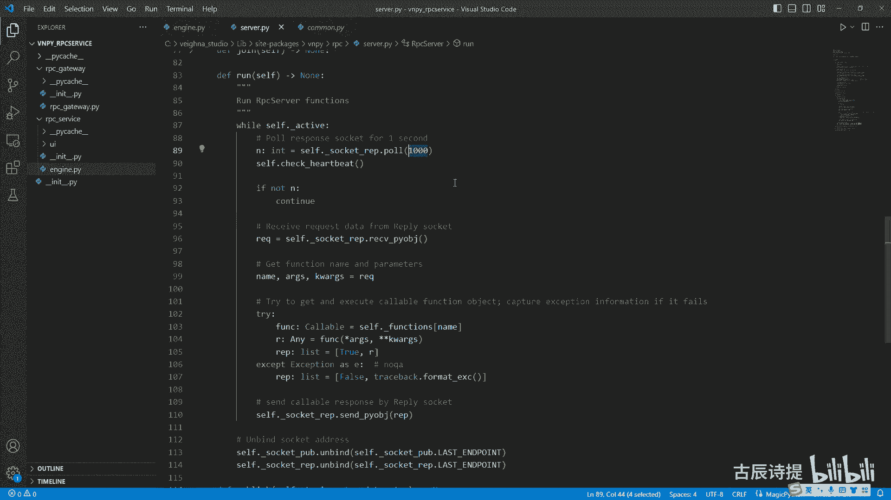
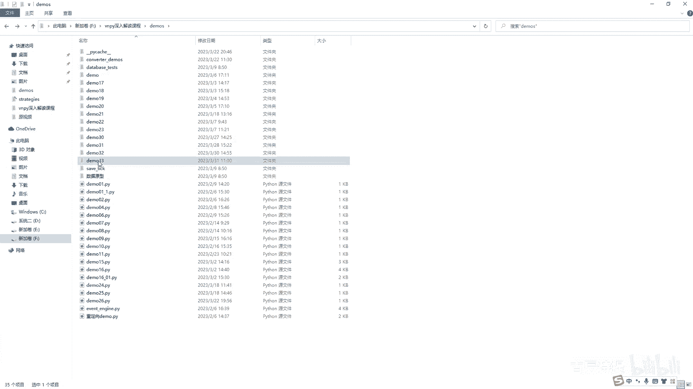
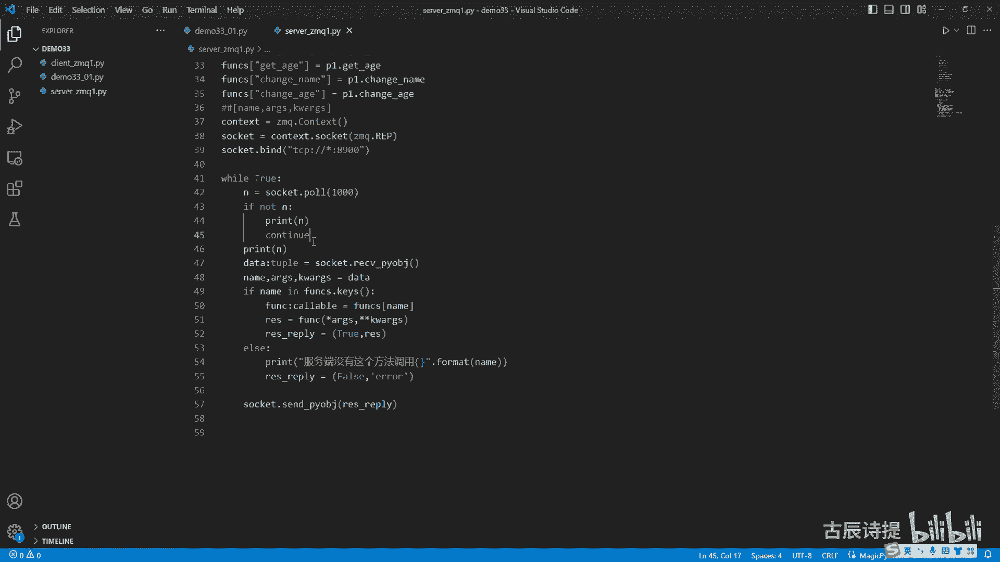
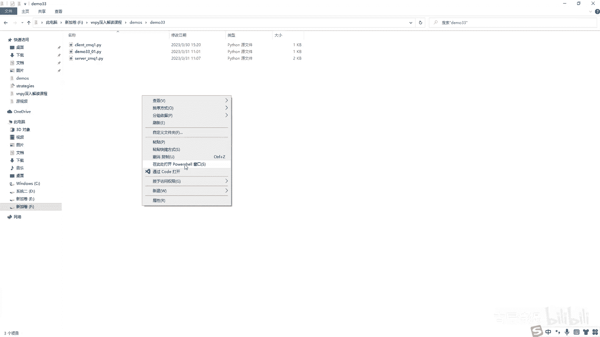
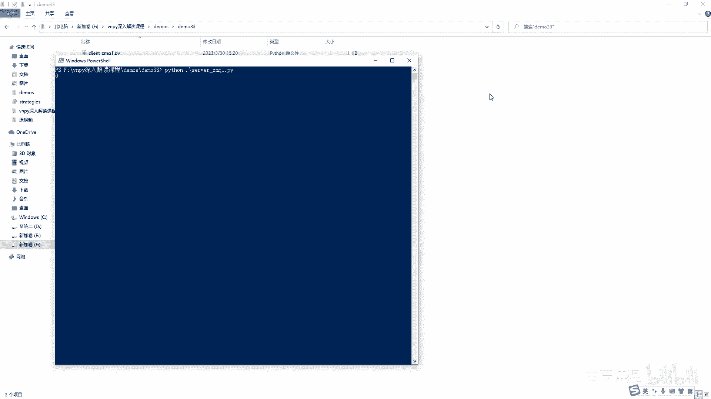
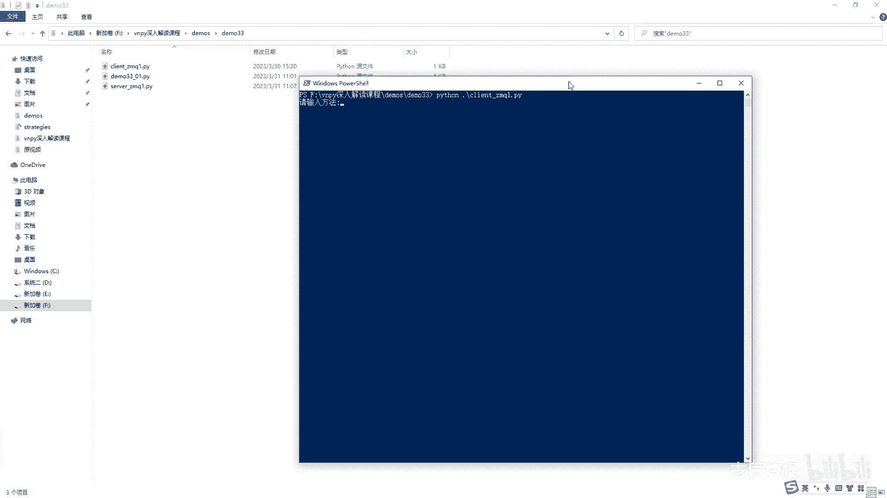
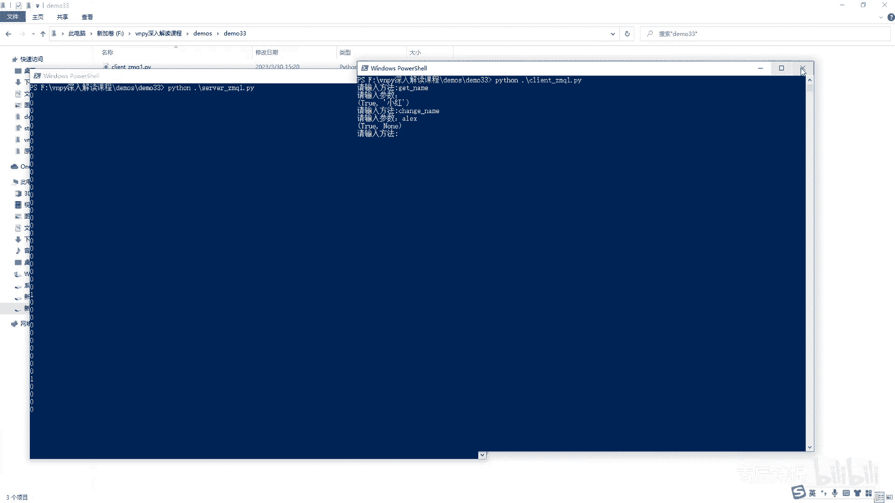
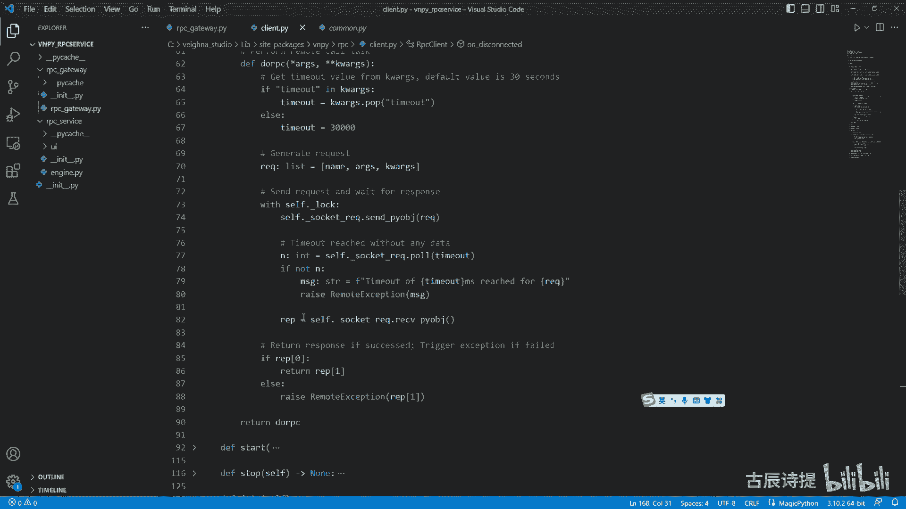

# 第33节课 RPC模块讲解(2) - P1 - 古辰诗提 - BV1RS411F7pf

欢迎大家来到从零开始量化系列课程，BMPI课程的第33节课，这节课呢咱们就说一下这个VNPY，他这个r p c service啊，他这个rpc service这个文件夹里边呢有两个文件啊。

不是有两个文件夹，一个是rpc gateway，一个是RPC这个service，咱们先得说一下它整体的这个叫什么呀，它的一个逻辑，如果说你是多个客户端呃，和一个这个服务端的话，比如这是服务端。

比如说这是客户端是吧，这也是客户端，这是C1啊，这是C2，那你服务端应该是做什么事啊，你应该去接接口吧，就是这个gateway及，或者说是去接多个接口吧，G1G2G三对吧，是去接这个gateway。

然后你这里边肯定还是得有invent engine吧，对不对，因为engine是得有的吧，包括你的man engine是得有的吧，是不是my engine有，那你这个里边o m s engine。

包括你的这个log engine，还有email engine都得有吧，对不对，但是呢你这边呢是不去接这个什么的，不去接这个app，它的上层的这个app是吧，也就是咱们那个什么c t engine啊。

btesting engine啊等等等等，包括PAPERCUT是吧，那个engine也没有，那这个客户端呢，你这边去接各种各样的这个app对吧，各种各样的app啊去接。

就是根据你的需要接各种各样的app，但是呢你没有get away，就是你没有数据的这个接口，你没有底层，是不是，所以说你这个客户端里面同样是有invent engine啊。

不是所以说啊就是你客户端里面同样是有engine，my engine一样是得有的吧，是啊对吧，你需要通过my engine，把这个你的就是说比如我app里边需要调用my engine，里边的。

比如SORDER，咱们之前讲过SORDER也好，cancel order也好，他是不是去mage里边找它对应的那个get away，然后去发送委托，然后去取消委托等等等等一些功能，对不对。

你看app里边需要调用这些功能的时候，他得通过咱们上节课讲的那种ZQ包装好了的，就是这个就是传输模块去跟服务端去交互吧，所以说他这边肯定得有一个嵌套的client，是不是。

所以说呢但是在这个整个的架构里边，他其实就充当了gateway的角色，所以说咱们看这个r p c gateway啊，其实它应该是client客户端端口对吧，同样的你像这个service他既然没有app。

那他这个跑这个程序的意义在哪呢，它这边是不是得也得需要嵌入一个叫这个，咱们上节课讲的server是吧，server client嘛，对不对，server就是服务端这样的一个接口，就是来充当。

就是说就是说跟这个各种app和这个上层联系的，这么一个媒介，对不对啊，这还有什么好处呢，就是它们对接的，比如说我这app这我找方法，比如说我get tick有吧，有有这个方法吧。

或者get contract，通过这个咱们的这个client，就是这个客户端发送给服务端，服务端直接去跟my engine去申请，去执行这个方法，是不是确保了这个my engine，如果是一样的。

my engine从my engine这发送出来的一些，你的这个方法的调用到这儿一样能够调用，然后再把调取的结果，然后通过这个服务端传输给这个客户端，然后同样的客户端。

这再把这个结果放到image engine里面去，就事件引擎里边去再供这个APP来进行调用，能理解这个意思吗，是吧，咱们就算作为一个整体的话，它也是什么呀，就是说就是说我获取。

比如说我get position data，或者我去看这个SORDERSORDER，他是不是不会直接从底层给你反馈，因为它得撮合嘛，就是撮合完了之后，他会就是order有变化了。

它会给它放到engine里面去，然后供你去进行调用，当然有一些，比如说get tick呀，get contract呀，是直接能获取的，是不是可以直接从main按键里边获取到它的数据。

然后再返回给这个客户端是吧，所以这个里边咱们的这个服务端它必然会有，就是服务端也好，客户端也好啊，他必然会有两个方式，就是ZMQ里边咱们上节课讲到的，第一个是订阅订阅，一个是PUB。

订阅是主要是针对什么呀，TIK行情吧，对不对，提个行情啊，订阅是肯定有的，然后另外一个还有什么呀，就是一问一答，这边是r e p reply，然后这边是r e q request，必须得有这两个模式吧。

对不对，所以说他们应该是运用到两个端口对吧好，那理解了这个你就应该知道这个rpc gateway，它其实是客户端，对不对，然后这个r p c service它应该是服务端，可能会有一些老板问问啊。

咱们在这个C盘下面的这个维纳里边啊。

维纳斯studio lib side packages这个里边，然后它也有一个VNPY，在VNPY里边啊，就是在VMPY里边，咱们打开看一下啊，在VNPY里边他会有一个RPC是吧。

咱们以前调用的时候，都是调用这个trade里面的一些东西，或者调用这个invent是吧，然后RPC里边它也有client server诶，这个可能就会有疑问。

为什么在这它也有client和server呢，咱们先看一下这个server啊，咱们通常先看服务端是吧，咱们看一下这个server，这个server里边你看啊z m q contest有吧。

包括这个上面你也很熟悉吧，self functions跟咱们之前那节课讲的，把所有的就是说这个可调的方法，是不是以这个方法名和这个它的这个方法，就是说这个就是所在的，这个就是方法的名字和方法。

就是不调用那个就是只有个黄色的，不加括号的那个给它放在一个字典里边对吧，是不是采用了这种方法，然后context是先创建一个ZQ，去实例化一个context吧。

然后这边socket这边是不是有REPPUB对吧，这个是不是应该是这个整个服务端的一个核心，是吧，核心是在这儿呢，因为这跟咱们之前写的代码是不是很像，咱们之前是拆开来写的，这只不过是把它写到了一块对吧。

包括客户端client，你看它这也是是吧，Context，然后REQSUB是不是，所以说这在这个VNPY下边，写的这个RPC呢，它是一个核心的代码，核心的代码啊，然后在咱们这个这个VNPYRPC呃。

这个r p c service，这个单独开发了这个文件模块里边呢，它其实是给他加了个包装，咱们之前分析的时候说过这个IP c getaway，应该是client，是不是在他这儿，你看他是吧。

去实例化了吧，self client等于rpc client，对不对，然后呢在这个客户端这啊，客户端这你看他这个在这个这是吧，set server等于rp c server，Rp c server。

就是咱们刚才从这个VPRIPC里边，看到这个r p c server，所以说呢就是说他的传负责传输的核心部分，其实是ipc server和ipc client。

然后他这边rpc engine他继承了这个best engine，它其实是放在就是说去这个作为服务端，它的一个啊外包装啊，就是把这个rp c server进行了一下包装。

然后去呃契合就是说咱们的VMPY这个框架，你看它又继承自这个best engine，best engine里面有什么呀，My engine engine，还有什么engine name吧是吧。

Man engine，Engine engine，还有engine name嘛，对不对啊，他是来契合整个VNPY的一个框架的，包括r b c gateway也是他继承了是这个BGATEWAY。

BGATEWAY里边有什么呀，best getaway里边是不是给你确定了几个方法，是不是，然后它有default name，因为engine是吧，get away name对吧啊。

这个就是为了契合维纳整个的这个框架平台，从这里从这里看出来，主动啊请求地址和推送订阅地址，这是两个不一样的，这是两个地址，主动请求是什么呀，我服务呃，我客户端去跟服务端去要一些数据。

或者请求一些东西的时候，使用的这个端口推送，就是我订阅行情的那个端口，对吧好，那咱们要来解析它整个的源码的话，咱们是不是应该从最核心的部分去给他解析，也就是它的服务端和他的这个客户端。

咱们先来看他的这个服务端啊，也就是这个代码，我直接从这儿就进来了啊，咱们方便看好，咱们看这个代码啊，首先看初始化这个cf点下划线functions，你已经知道它的作用是什么了，就是方法名称和方法。

就是调用它给它存储在一个这个字典里边，对不对，到时候你从客户端发来的方法调用，是不是直接可以就是在这里边去找，然后直接进行调用对吧，然后这个context就不说了是吧，实例化，然后确定两个。

一个是RAP，一个是PUB是吧，这边呢它有一个C点active，这已经很熟了，他是判定这个，你这个是不是一个活跃的状态是吧，肯定是县城有没有打开是吧，这它有个单独的线程。

这边有个县城所线程锁是干什么用的，就是在同一个进程里边，在某一刻这个时间只要他上锁了，就是这个CPU只运行这一个程序啊，只运行一个程序，它是确保了数据的安全性啊，这是一个Python基础。

里边这个有一个啊C点heartbeat，咱们先看这个名字啊，叫heartbeat心跳，这个用来做什么用的呢，跟大家解释一下，就是你像咱们正常的去接收行情，比如中午11：30到下午的01：30。

中间是没有数据传输的对吧，这个时候呢他这个如果说你用ZQ，如果长时间不跟服务器进行，就是说数据交换的话，它容易它有可能会丢失啊，有可能会丢失，之前好像谁做过一个实验，就是如果说你长时间不跟服务器。

就是沟通的话，如果隔一天就是24小时，八九十%吧，它会断掉，就是服务器在发消息的时候，他会收不到的啊，这个就是说这个是heartbeat的作用，heartbeat它是为了做什么呢。

就是说隔一段时间跟服务器发个消息，就是沟通一下啊，说明我还在，我还跟你连接着啊，这就是heartbeat啊，这个它的作用一会儿咱们有这个代码的时候，咱们就是分析一下啊。

这is active就就是看看它有没有启动是吧，咱们看一下这个start就是启动启动，他做他做了什么，他传了两个参数，一个是IP dress，一个是pop dress啊，这个你可以自己传。

如果说你自己试着玩的话，或者说你试验的话，你就直接可以传这个，咱们说说这个就是这个engine里边，它默认的这个REPH，还是和和这个pob address吧对吧，然后bind是绑定嘛对吧。

然后把这个C点active变为true，然后把这个线程，它的线程运行的这个方法是这个run方法，咱们一会看这个run方法给它启动起来，咱们看这个cf点，had beat它是什么，Time。

time是它是from time，用time吧，这个time是一个时间戳啊，是个时间戳，并不是说那个时间that time里边那个tom才是时间，咱们可以给大家演示一下啊。

demon这个33杠零一点PY啊，就是如果说你from date time啊，Daytime import，就这个哎跳M这个time是代表着时间，比如说呃早上的09：15分啊什么的。

如果说你from time，这个塔它是一个时间戳啊，时间戳时间戳是什么，就是全是整数，它代表的是多少秒，看见它代表的是多少秒，诶，这边怎么会有个Y呢，y print print time啊。

就是他就是代表着就是多少秒啊，咱们就看一下，他还是有个弯，我从这写什么东西了吗，还是我直接把这个time的time，啊没有啊，好咱们不管了，他就是这个时间就是运行一下他啊，现在没有了啊。

这就是这这个它的一个时间戳代表的是秒钟啊，秒钟从什么时候，好像是从1970年还是从一九啥时候，反正就是到目前就是已经走了多少秒啊，走了多少秒，这个它是一个时间戳，时间戳。

时间戳加上这个heartbeat interval，这个是什么呀，这个是在那个咱们刚才看到的，他一个是这个呃这个rpc client，一个是rpc servers，它中间还有个rpc common。

就是这个common这个里边有这个什么heartbeat topic啊，这个是主题一个常量啊，咱们一会儿说，然后这呢是啊，heartbeat interval十十它是什么意思啊，就是我当前的这个描述。

再加上十秒钟，从这你就有一个猜测，就是他大概是十秒钟跟这个呃，就是说服务端会发个信息到客户端是吧，确保有没有进，就是在连接对吧啊，你猜词就是一般都是这个情况对吧，咱们一会儿可以看代码。

然后看这个stop就是停止的意思，它其实就是把这个self active变成false，self active变成force，它这就是说就while就从while给跳出来了吧，对吧，这里有个JOE。

JOE是做什么用的呀，其实这个县城里边的john就是插队的意思，他是干什么的，你虽然我这就说这个while，已经等于这个这个force的这个ACTIVFD，它跳出这个循环。

但是你也得等他这个把这个run代码执行完了呀，对吧，他你看这下面还有代码呢，就on by，这还有代码呢，或者说他刚执行到啊，这啊或者这是吧，你得让他执行完了呀，就是就是插队的意思啊，就是在停止的时候。

你看它这个下面有close啊，唉这没有close啊，在这个就是在这个engine里边肯定是有close，它一般都是先进行stop，然后再进行join，这个是一个Python基础的内容，好吧。

这也没什么好说的，这个run啊，咱们放在最后说啊，然后这个publish publish就是发送信息啊，去推送内容，你看就是with self lock，就是self lock，是县城所吧。

把县城给锁定了之后，然后这呃这个推送就是订阅的这个socket，然后seepy object吧，记住了，这是一个列表，这里边有topic和data这个topic。

你可以把它理解为就像咱们invent里面，它有个tap对吧，它有个tap可能是做一些标识来使用的，你记住它发送的是topic和data，这个data它会发送什么呀，Publish，你推送的时候。

data这个data会发送什么呀，这个data会发送invent，会把整个event给他发送过去，为什么这么去说啊，咱们一会儿就是讲到的时候再给大家说好吧，你记住了，这边是发送的是一个列表。

里边是topic和data，这个是public register是什么呀，注册咱们之前在EMT那个REGIST是什么呀，Mit type，还有你这个function是吧，这是什么呀。

SAFUNCTIONS里边funk就是下划线，name就是这个，就是function的，也就是这个方法的名字，等于这个function本身它并没有进行调用吧对吧，其实这个其实就代表着就是地址啊地址。

然后去进行调用的时候，就直接一个括号就运行那个方法了对吧，他把这个存储在了这个self function这个字典里边对吧，然后这边呢是check beat a heartbeat。

这个check heartbeat就是来检查就是他的这个心跳，检查心跳就是如果人死了，是不是就没有心跳了，我看看他死没死，对不对，然后这边now是等于这个time就是当前的时间戳。

如果当前的时间戳大于等于四点，Heartbeat，咱们刚才说到了sa heartbeat等于当前的时间戳，加了一个十秒钟吧，是吧啊，加了一个十秒钟，然后他来检查一下，如果大于它了。

我就publish是吧，然后这边有个heartbeat topic，这个topic是什么呀，就是heartbeat吧，它只是一个标识吧，对不对，然后now now是什么，就是当前的时间戳吧。

然后把它就是推送给客户端吧，然后再把这个self点heartbeat，这个时间戳就是下一次再进行心跳检测的时候，now加上一个has bet对吧，这个interval咱们刚才看过是十是十秒钟吧。

你记住在客户端的时候，它是每十秒会给你发一个这个推送，一个呃列表对吧，呃对推送一个列表就是这个publish吧，推送一个列表，这个列表里面有这个topic，也就是这个heartbeat。

然后这个data呢是这个now，他给你发了一个时间，这是检查心跳的啊，这是检查心跳的，后边在这个这个里边肯定会用到对吧，咱们先给大家解释一下好，这个JIN咱们说完了stop说完了，然后咱们主来说呃。

这个这个start也说完了是吧，咱们主要来说这个run这个run函数，这个run呢它是什么呀，While self active，然后呢N等于四点socket IP点破这1000，你看他这上面解释啊。

Poor response socket for one signal，就是1000，这1000代表一秒钟啊，它是毫秒的，你像咱们那个from time import sleep。

那个sleep后边跟着的一是一秒钟，这1000也代表一秒钟，然后这个破是干什么用的呢。

其实解释起来比较费劲啊，咱们就直接给大家演示一下，咱们上节课那个代码，就是在这个深入解读课这个demo里面，咱们32节课这里边这个ZQ是吧，server zq呃，往上走一个。

然后在33里边我给它粘过来啊。

我粘过来粘过来之后呢，咱们先把这个代码改一下，就是咱们同样的在这个服务端这啊，在这在服务端这我也写上，就是说N等于N等于什么呀，这个socket点poor，然后后边加上1000啊。

然后呢if not n我print一个N啊，if not n or print一个N，但是如果说有了N之后，就是如果说呃我这个后边加上一个continue啊，就是循环我就到这儿就停止，如果N没有东西的。

我到这就停止了对吧，然后如果有东西的话，我再print一个N，就是我把N都凭着出来看一看对吧。

这个时候我把它给启动起来啊，启动起来先启动这个服务端。

服务端Python server s e r tap一下好，启动起来之后呢，咱们再启动这个客户端。

int啊，tap一下好。

请输入方法是吧，咱们看一下这个服务端，你看它会输出零吧，隔一秒钟输一个零，隔一秒钟输个零，然后我比如说我从这输入方法啊，get name是吧，然后参数我没有参数，然后他就小号，你看它就变了个一了吧。

有一个一了吧，我再输入方法啊，比如change啊，name是吧，Train name，比如说ALEX是吧，然后true，那你看它又有一个一了吧啊，它这个呢就跟什么有点像呢。

就跟咱们那个MIT engine，你还记得那MIT engine吗，From w py，点这个event啊，Import event engine，咱们可以看一下他这个invent engine啊。

它这里边这也有一个就是说来获取这个git git，你看它有这个time out，Time out，一是代表着一秒对吧，同样的在这个咱们的这个这这个poor，你看啊它其实这也是time out是吧。

也是time out，就是但这是1000是代表着1000ms，代表着一秒，它其实就在等呃，我等一秒钟，我看看就是这些跟我连接的这些这个客户端，有没有消息啊，没有消息的话，我就不等了啊。

但是咱们这个程序又写的是什么呢，就是不等了之后呢，就是说我检查一下这个心跳，这个check had beat嘛，就等于是往就是客户端就是推送一个心跳是吧，然后检查完心跳之后呢，然后我再过来，我在等啊。

我再接着等，这个有什么好处呢，好像看似没用是吧，咱们昨天写的那个，或者不不是昨天就上一节课写的那个，好像就是我直接就等着不就行了吗，这个里边涉及到就是他资源优化的一个问题，他这里边有一个叫多路复用。

给大家简单介绍一下多路复用啊，多啊多路复用多路复用，这涉及到你像端口的重复使用啊，端口重复使用，包括缓存的一些机制什么的，你就记住啊，一般你写的话，你也这么去写就行了，然后我就去等一秒钟啊。

等一秒钟是吧，然后看看它有没有东西啊，有没有能接受的东西，如果接收不到，我再接着打是吧，好然后如果说接收到东西了，我就去接收了吧，receive py object了吧，然后你看这个手吗。

Name augus，KKWARGS就是KW2，等于这个IEQ熟吧，他肯定是发过来的，要么是元素，要么是列表对吧，然后他来这么去呃，等于你就知道就是说肯定是方法名，后边是一个，你像阿格斯。

它肯定是一个位置参数啊，KW2个字他肯定是这个关键字参数，它是作为一个字典，这个是作为一个元组，这个是是这个STR类型的，就是string肯定是一个方法的名称是吧，你看他就try。

然后function去self function去获取这个名字，这用了一个try except，咱们那是咱们写的这个demo33，这啊哎啊这咱们是什么呀，咱们先去判定一下吧，就是在不在这个里边。

如果不在这个里边，我就直接告诉他有错误对吧，但是这呢直接用了try except啊，这个显得更加的优雅，对不对，然后就是来获取这个方法，然后这个方法呢再把你这个ARGS和KW，A r g s。

然后进行解引用，然后给它放进去，然后其实就是来指来调用这个方法对吧，把参数给它传进去嘛，你这个千万不要少了这个星号和这两个星号啊，你少了这个星号和这两个信号，你传进去的是一个元组和字典是会出问题的。

你这个叫解引用，就是你可以这么理解，就是把元祖外边的这个括号给它拔掉了，然后把字典里边的这个括号给它拔掉了，然后把里边的那个冒号给它改成等于号了，就变成了这个关键字参数，这个叫位置参数啊。

这是Python基础里边的解引用，其实跟这个C加加的这个机制有关系啊，因为这个python1开始底层是C加加写的嘛，C加加里面最重要的一个就是引用代替了，就是C语言里面的指针是吧。

好这个function去调用，然后调用完了之后就是有结果的话啊，当然肯定是有结果的，你没有结果就是浪值嘛对吧，然后呢它这个IP就是返回的是什么，是一个列表，列表是一个你看true和这个你的结果。

Q就是如果说有这个方法，我就返回true，然后跟着就跟着这个结果，如果说出问题了啊，出问题了，他就返回一个什么呀，Force，然后把你这个出错的这个就是这个文档啊。

用这个trans back format，这个ex c，然后把它作为这个就是第二个，它的这个列表的元素给它放进去，给传送给你的这个客户端，对吧啊，传送给你的客户端啊，就告诉你就是说呃这个你的这个服务端。

它调用不到这个方法，原因出在哪啊，连这个原因都告诉你了是吧，然后呢seethe object把这IP给他发过去好吧，最后两个就是当你循环结束的时候，他unbind就是你一开始bug的。

你这有个unbind是吧啊，unbind这就没啥好说的了啊，没啥好说的了，这个就是run，这就是整个服务端的啊这么一个逻辑啊，这么个逻辑，其实就是说服务端把方法都提供好了，包括去怎么去发送消息是吧。

都可以，就是提呃呃怎么来接收回复消息，都给方法都给提供好了是吧，然后在这个服务端这个就是engine，这它是不是就会怎么做呀，他就会就是说给他进行一下包装，然后具体的怎么给它填充。

那个那个cf点functions是吧，怎么给他就是说启动，然后关闭啊，怎么去给他做一些，就是说外边的这个装饰把它给封满了是吧，好，那咱们就看这个具体的这个server就是r p c engine啊。

r pc engine它继承自best engine，继承自best engine，它肯定有man engine，因为engine是吧，还有这个engine name啊，这个r e p dress。

p o p dress是肯定得有的是吧，这个需要点server啊，需要点server，你看optional rpc server，这个是一个标准写法，因为你这个是一个N值嘛是吧。

就是代表的就是可能是none值，也可能是i pc server是吧，然后你看咱们看他的这个初始化这啊，首先它in it server，In it server，它里边做了什么事啊。

Sd server register，register还记得是什么意思吗，就是在咱们这register就注册的意思吧，它其实就是这个把这个方法的，就是说这个刚刚name就是它的这个名字作为呃。

就是这个方法的名字作为他的这个key啊，然后他的这个你像这个方法作为他的这个value，进行存储到这个cf点呃，这个下划线functions这个里边吧对吧，方便进行调用吧，这都是来做这些的啊。

你像这个他是这个my engine里边就有的这个方法，这个是什么呀，my engine里边其实是用OMS给它替代了的，就是说给他来实现的这些方法，这些都是获取吧。

就是get it get all get tri是吧，然后这边都是就是说你必须得有的，Subscribe sor cancelled create history。

create history是为了匹配什么呀，为了匹配，就是说这个你可以直接下载数据的啊，这么一个就是说金融产品是吧啊，当然你也可以自己去实现是吧，我自己存储的数据，或者说我自己就是说可以直接连接到。

米框的数据，我也可以去实去实现，manager里边去实现这个query嘛对吧，框架都是由你自己来搭建的，对不对，好，这个也是unit server，第二个是什么，Load sitting。

Load sitting，这是读取配置文件吗，它最主要的是读取你的这个IP dress和，p o p dress嘛是吧，如果说你把这个呃设置在了，就是说自己的机子上，其实你是不用去变的啊。

如果说你这有些别的操作，比如说你在你的服务器上啊什么的，你可以自己去给它设置，一般都是不用变的，都是都是设置在本机上，或者你把端口编一编，可可能某个端口有可能被你经常用的一个，软件被占用了啊。

也有这种可能性啊，你可以就是说换个端口什么的对吧，这个load sitting就没什么好说的了，你看下一个reject event，reject event肯定得去注册事件嘛。

因为这engine里边肯定得去注册事件嘛是吧，我得把比如说接收到的tick，我发送给这个说我的客户端，对不对，我接收到的我接收到的这个position data，我得发送给客户端，对不对啊。

你你register invit，那你就得注意了，你他是不是整个的都是把什么event log呀，什么event position啊，都全注册呀，不需要，就是在咱们invent engine里面。

你还记得吗，有一个register jo，就是把所有的都全全盘给你啊，就是都全全盘接收过来，就在这使用到了就是reject，你看register general，然后所有的数据都到这来。

就是process，但是这里面唯独有一个叫MITTEM，在咱们客户端里边是不是必然也会有image tea，客户端，就是它也是有简单，它也会有名才timer。

所以说image timer他就不需要了是吧，别的他就直接cf点server，点publish，他这个你还记得publish是需要什么吗，topic和你的这个data吧是吧。

topic它直接是一个空的啊，字符串，然后这个data它就是这个mt看见没有，就是除了你这个heartbeat topic，有这个就是呃有这个字符，别的都没有啊。

heartbeat那个topic它是发送的一个time对吧，一个时间戳，但是呢其他的这些事件都是没有标识的，然后放了一个事件，就是MIT事件，这个推送过去到这个客户端。

它肯定会放到客户端的那个invent engine里面去，对不对啊，这个process invent啊，这个跟它是连起来的，就是register invent对吧，好吧啊，这个是他初始化做的事情啊。

初始化做啊做的事情，那咱们再看看他这个咱们还没有讲到的，这个方法，load js啊，load setting讲过了这个cf sitting，就是你配置的这个，你比如说改了你的这个RPC。

dress和pob dress了，你需要把它保存下来，同样的是在那个C盘下面，那个LV，或者呃那个administrator下面，那个点win trader里边啊，点VTA里边。

然后这个停止这个这个start啊，咱们就是顺着往下说吧，启动如果说你的这个server is active，这个executive还记得吗，刚才是这个server里边返回的是那个就是下划线。

哪个active吧，是吧啊，如果说is active了，它就是RBC服务运行中，如果说呃他还没有启动，你看cf点IP address等于这个。

就是你得传过来这个IP address和pop dress嘛是吧，然后传过来之后，他给他重新复上值，然后try他去尝试着去启动，把这个IP address和pop dress给他是吧，如果说出问题了。

他就会告诉你IIPC起呃，这个启动失败，如果说没问题，他save sitting savisitting，就是把你新赋值的两个给保存起来吧对吧，然后告诉你启动成功了啊，这就是启动。

其实还是启动这个咱们的核心的那个server是吧，他那个线程嘛对吧，然后停止咱们刚才看过了啊，就是先stop，然后再join，对不对啊，然后然后告诉你已经停止了是吧。

然后close就是serve stop，就是调用这个方法嘛一样的啊，然后register event这也说了，process invent也说这有个right lock，Right log。

他是做什么呀，日志输出嘛，它单独有一个叫immrpc log，然后给他放到了这个invent engine里边去啊，这个是invent r p c log好吧。

这个就是他跟那个event那个c t a log是一样的，对不对，因为这c t a log是就是一个类型，所以说在这个服务端，像这个r pc engine其实就有点类似于你想C啊。

c t a engine呀是吧，只不过承担的功能不一样，这个RBCN键是承担了一个通信功能是吧，这个r p c engine以及它的这个就是服务端，咱们就讲完了，等于说是啊，就是并不复杂是吧。

它其实就是过来进行一个就是方法的调用嘛，就是方法全部都是在这儿呢是吧，这呢它存储在了那个functions那个里边，我相信这个很容易理解，上节课如果说你那个代码自己能写出来的话，我这就很容易理解了好吧。

那咱们就开始看这个client了啊，开始看看client了，client就是在rpc gateway里面啊，r pc gateway里边，咱们先看这个rpc client，Rpc client。

Rpc client，这有个什么remote except exception，它是继承自CEPTION，就是就是抛出一个错误啊，咱们这儿呢先不看这个，咱们先看下面啊，他建立一个context。

然后REQSUB啊，这个就就不说了，然后他这for socket in self，就是这两个so啊，socket的做了一个设定，一个是TCP keep alive，一个是TCP keep alidl。

这个呢他是做了一个设置，就是让他保持连接啊，就是让它保持连接就行了，就是是一个设置好吧，那个如果说你想深入研究，因为这个不太好解释啊，我也翻了很多资料，那么我也不太好解释，这个他就是让为了保持连接。

它这里边设置的内容很多啊，还有很多别的设置啊，你可以去自己去查一查看一下，就是为了保持一个连接好吧，长时间的连接，然后他这同样的有个self active等于false c点，three的。

还有一个cf lock，就是线程线程锁，还有你这个active标识，这有一个cf点，last received ping他这个time等于UTC点，now就是这time点，那咱们知道吧。

就是当前的时间对吧，这个UTC呢就是标准时间，就是咱们这个时间减去八个小时啊，咱们可以看一下，From the time import detail，然后print一个did time。

点u t c now，啊03：22分啊，3。22分，这是夜里3。22分，说明现在大概是11点，我现在不是这个夜里夜里边儿啊，咱们可以啊，哎CTRLV啊，那么可以输出一个now，啊差了八个小时啊。

差了八个小时，这个就是就是标准时间啊，这个来做什么用的，它其实就是来记录，就是我上一次接收到这个服务端的，那个heartbeat的时间对吧，Had builder。

这个时间这个这个get AD t r是一个核心的啊，咱们一会再说，这个很熟悉吧，这个是把这个数据保存在缓存里边对吧，咱们在讲那个back testing的时候讲过，然后这是一个start，就是启动嘛。

它connect连接，然后把这个线程单独跑这个run对不对，然后线程启动，然后last received ping啊，它赋一下值，就是等于这个u t c now，这个跟那个server是不是很相似。

它也是一个线程，然后去启动，同样的是跑的这个是个run的这个方法对吧，然后这启动这个停止咱们就不说了啊，包括这个john是吧，停止完了之后再加个JIN，主要看这个run方法。

这个run方法是什么P这个什么什么TORRENCY，然后等于heartbeat什么什么，这个咱们看一下啊，也是在common里边，它是等于30，发现没有，它是等于30，30×1000。

就代表着这个它是放到这个里边吧，放到这个POR里边吧，这个POR里边他等待的是301000，就是等待30秒，对不对，等待30秒，如果他还没有这个接收到，你想咱们之前试验过吧。

如果一旦有客户端发送消息了什么的，它会有一个返回值吧，你看它这个not就说明它是一直为零，一直为零，就说明在30秒之内，这个客户端没有发送消息，然后他会报一个什么呀。

Own disconnect on disconnected，它就会输出一段信息，什么rpc server has NO response over，什么什么SIONS，这个是30吧啊，30秒。

就是已经有30秒，没有跟你客户端进行联系了啊，然后那个是不是你这个连接有问题是吧，Please check your connection，因为服务端，它是每十秒钟会给客户端发一个信息吧。

你30秒都没接到消息了，说明你通讯是不是中断了，或者你哪有问题了，对不对啊，他就是为了来做这个的，但是这个ZQ它有重连机制啊，他有他有重连机制，然后他如果没有连上的话，他会接着continue。

就是接着去破，对吧啊，然后这边topic data去receive object啊，这个flex是NO block，就是不阻塞，那就是阻塞与不阻塞，这也是Python技术里面的内容啊。

你自己可以就是去看一下，这个没法去解释，它只是一个设置对吧，然后接收这个object就是py object嘛，然后topic data吧是吧，咱们刚才在讲服务端的时候，服务端还会给你发两种。

第一种是topic为一个空的字符串，然后data是MIT，是不是，第二个是什么topic会给你发那个heartbeat topic，然后那个data会给你发这个时间对吧，就是那个时间戳啊。

不是时间是时间戳，然后你看if topic等于heartbeat topic，tslot received ping是不是等于data，那个data是什么呀，是时间嘛，对不对啊，不是时间戳吧，是吧啊。

然后else如果说不是不是就有可能不是，有可能他肯定是那个了吧，对不对，他这需要点call back topic，Data，这call back topic过来，data过来，这俩也没用。

直接rise了，一个就是他直接抛出了一个错误，这是不是就有问题了，你按说咱们的逻辑是什么呀，应该是就是说我给你发送事件了，那个event了，你应该给他放到。

就是说这个你客户端的那个invent engine里面去，对不对，那为什么这会call back呢，所以说这啊，这肯定是为了就是在你写这个client的时候，你给他指向了一个call back。

你在这个你的gateway里边，肯定会把这个call back会指向到别的地方，你看shift client点call back指向到了别的地方对吧，指向到了别人为什么这么来写啊。

因为你这个client里边是没有image engine的，对不对，里边是没有invent engine的啊，而你又没地方给他放对吧，但是呢你到这个r p c getaway，我就可以直接让他去指向了。

因为他用MENGINE啊，对不对，直接让它指向这个call back是吧，你看啊，如果说mis none，然后print一个NMENT，然后return是吧，然后data等于IMMD点。

data就是获取了他的这个data嘛是吧，if has a t t r这个来做什么用的，就是你这个data里边一般传输的什么position data呀，什么什么什么tick data呀是吧。

bar data呀，都往这里边传，order data try的data，一般里面都有这个get这个gateway name吧是吧，他就怕你就是说没有给这gateway name赋值。

它会data点get away name等于cf点gateway name，就是你这个cf点get a name，会给他重新给他这个event事件打上一个标签，诶，是从哪个接口过来的啊，这个有什么用呢。

其实你如果说服务器端你只有一个RPC，或者说只有一个get away，其实用处不大，但如果说你有多你有多个get away的话，它就会有用了是吧，因为get away name它其实是来标识。

就是你的数据是从哪接收到的，你返回回去的这个order啊，或者一些请求啊，你到底层的时候，你对应的找到那个gateway是吧，这个咱们反复的讲过，然后soft raining put event了吧啊。

为什么这client这没有直接去指出来，因为什么呀，你就你这个客户端比较的单纯单一，这里边就来实现一些数据的，就是说接收，然后交互的他并没有invent engine。

如果说你把invent engine放到这里边，你怎么说呢，就像也可以是吧，但是不是那么特别的，他直接重新去指向一下不就好了嘛，对不对啊，这是常用的写代码这种手法啊，同样的这个县城一直在去检查。

有没有给我发消息是吧，然后有没有链接有没有中断啊，第一个是检查有没有中断，第二个是如果说有消息了，我去接收是吧，然后呃对不一样的消息我采取哪些处理啊是吧，如果说你有一些别的模块的添加。

像这个topic其实是可以进行呃调整的吧，比如说我别的，比如说我发一些别的，可能不是伟大框架里边的啊，这个topic过来是吧，我在接收啊，完全也是可以的，最后如果说脱离了这个active了。

就是脱离了这个循环了之后，这是关闭掉吗，把这两个socket给关掉对吧，这call back咱们讲过了，他会被重新的去呃进行指向，这边有个subscribe topic啊，就是这个是干什么用的呢。

就是呃他的这个用啊，咱们在这里边好像没有发现是吧，其实它有什么用啊，这熟悉呗，咱们这个socks socket sub的时候，咱们在第一次写这个订阅的时候，就是上就是上一节课写订阅的时候。

咱们有个SSOCKETOPT，但是没有写这个这个这个string对吧，咱们是为了做过滤用的，还给大家演示，如果是一个空的字符串的话，然后它就是代表着所有的文，就是字符都接收是吧，如果说你以A开头的。

它是代表着接收所有的A开头的这个字符，你看他这也是一样的，ZQ点subscribe这topic是吧，这是来过滤用的啊，过滤用的是吧啊，你是接收什么样的topic，对不对啊，接收什么样的topic啊。

这个当然啊好像也没用上啊，然后own disconnect，咱们也讲完了好吧，那这节课呢咱们就先讲到这儿，咱们就剩一个这个get a t t r没讲了，这个呢呃咱们需要做一个最核心的内容。

咱们下节课讲好。