# 第34节课 RPC模块讲解(3) - P1 - 古辰诗提 - BV1NT421X7FF

欢迎大家来到从零开始量化系列课程，VPY课程的第34节课，咱们上一节课说到了这个client，也就是这个RPC这个gateway里边呃，他的这个最核心的也就是这个就是这个client。

Rpc client，也就是这个是吧，其他的都讲完了都好理解，那这个就是get a t t r这块，这个get AD t r呢，咱们先把它里边的这个方法先给他给先关掉。

然后它里边的结构这个就不用说了是吧，是保存在缓存里边，如果说你相同的那个就是你的请求过来的话，他会直接把数据给你返回来，对不对，然后你看他啊，Get，首先咱们得知道GDTR是什么东西。

这GATTR在Python基础里边，大家都应该学过这个get a t t r和get tribute，还有sat a t t r这个魔术方法嘛，属于是这个在Python基础里边算。

是不是那么特别好理解的是吧，咱们可以给大家演示一下啊，好这个get get a t t啊，它做什么用呢，咱们主要是结合就是咱们这个客户端这块，他用到的是吧，比如说咱们定一个类叫person啊。

DF刚刚in it，然后这个里边cf点name，cf点name等于小吧，然后cf点cf点age等于啊，比如20啊，然后如果说这个时候呢我进行一个实例化，等于一个person实例化。

咱们正常的P1点没有问题吧对吧，P点name也是没有问题的吧，那如果说咱们换一种写法叫get a t t r p1，这个把这个name作为这个字符串传进去，这个也能获取到吧，这个会用吧是吧。

那这种调用如果说我P1点，比如说啊这个sex是性别，我用sex来表示了是吧，一旦你这么进行调用的话，它是不是会出错，对不对，没有这个对象，但是啊这个里边如果说我定义了这个下划线，gate呃。

这个attribute呢，咱们先啊咱们不说它，因为咱们不是主要讲这个某种方法的，咱们就说这个GDTR，如果说我定义了get AD t啊，咱们看一下啊，我print一下这个下划线。

下划线name就是它这里边的这个参数啊，然后我我不这么来，就是我别的工作我不做了，这个就是跟return nn是一样的吧对吧，我有这行代码和没这行代码，我这个方法其实它最终是成了一个N值吧，对不对。

这个时候我调用点这个P点six，你看一下啊，他不会有错的，而且他输出了一个这个你调的这个名字是吧，比如说我P点嗯，杠杠name，我也没有这个方法吧，对不对，我这个时候来进行调用。

你看刚刚name输入出来了吧是吧，比如说height h e i g HT h e i直接去，应该是诶诶诶吃了，大概要1978white吧，你来调用这些方法的时候，你会发现它传过来的是这个名字。

对不对啊，是这个名字吧，他就不会报错了吧，如果说我不管别的，我就称一个，比如说啊cf点age，那我print一下这个让我们看一下啊，print一下这个，你会发现他就把edge给你返回回来了。

这个例子你能理解了吗，就说是如果说我点也好，或者说我get AD t r也好，get a t t r也好啊，比如说我P1啊，这个里边是一个未知的，比如说我就是一个SP啊，SP你来获取出来的。

你会发现它还是这个SP啊，然后当然我没有输出，这个没有print是吧，他给你的还是cf点AJ什么意思呢，就是刚才看到的是DF这个杠杠，Gate tribute，这P这个里边你不能这么写啊。

你不能这么pass，应该是return super suo p e r super括号点杠杠，Get to built，Get ribute，然后把这个刚刚name给他，把刚刚name。

我这把这个AI给它给删掉，print一下，print一下，这个里边叫杠杠，GATTRIBUT是吧，Get to built，你会发现啊，我来运行它的时候，你看get to built。

Get to built，就是它会什么呢，就是说当你get a t t r也好，或者P1点什么也好，它首先会就是说这个会执行这个方法，就是get built，如果说在这个里边找不着，他会去。

如果说你实现了get a t t r，他会去get a t t r里边去找呃，如果说你有你只要是去写了这个方法，就是不管你有没有返回值，你最起码有个N值，对不对啊，这个就是gd tr的作用啊。

这个是魔术方法里边的啊，这个算是Python基础了，如果说你的Python基础一直都不太好，你可以听我的这个Python基础课，所以说这个name是什么呀，就是当你这个类啊。

就是rpc client里边被调用到一些里面，没有实现的方法的时候，他就会找到这个get a t t r，比如说咱们这个gateway里边。

你看cancer order sorder subscribe，你在这个类里面根本就没有去实现呀对吧，他就会把你的这个SORDER作为这个参数来去调用，这个get AD t r好。

咱们再来看这个GDADTR，具体里边是，它其实返回的这个在Python基础里面叫什么，叫闭包是吧，他给你把这个方法里边的方法，然后作为一个对象给你返回回来了，然后你这个方法你返回回来之后。

它再加一个括号，是不是就调用了对吧，里边传入参数，这个参数是不是传到这个里边，叫新lg和星星kw l g对不对，所以说它最终这调用来执行的是什么，其实就是那个drop啊，ROPA是吧。

里边r e q gateway，对不对是吧，其实你最终执行的是这个方法，只要是这个里边没有实现的方法，就是说他会找到这儿，找到这儿呢，他就会来执行这个方法，好这个这一步能理解吧，这一步理解了之后。

咱们再看这个这个里边他究竟做了什么啊，你看啊，如果说if time out in啊，这个KWARJS，然后他就这个time out等于这个什么呀，就把这个KWIGS给pop掉了。

就是他来判定就是time out的啊，time out如果不是的话，他就是3万3万，是咱们在这个，就是这个咱们在这两这两节课讲的，这个是代表什么，其实就是等待的时间嘛，这个3万其实是30秒，对不对啊。

其实是30秒，就是一个time out，然后这呢有个IQIQ等于什么，它是个列表，Name a r g s k w a l g s，这个是不是很熟悉啊，AJS和KWLJS就承载了你的船参对吧。

这个列表后边的这个传参参数啊，然后name是什么呀，name是你调的这个方法，那这个里边其实就是比如说我SORDER的话，Sorder，那这个name就应该是什么呀，SORDER吧，这应该是下划线啊。

是SORDER吧，然后这个air js就是里面传的参数吧，就是这个IEQ和gateway name吧，对不对，IQ和get为name吧，就是这个ARGSARGS它是个元组，对不对，应该是这样是吧对吧。

然后KWAIGS它没有就是空的吧，是这样的一个形式吧，对不对，这就是REQ，这个REQ是干什么用的呢，去send the py object啊，他这有一个线程锁锁住了。

然后去新的py object就是把它给发送出去了，然后呢他等着等着，这个就是time out，Time out，就是刚才你里面规定了时间，就用规定时间，没有规定时间，我就用这个30秒钟。

我在这等有没有给我回复啊，我在这一直等着，有没有给我回复，如果说过了30秒没有给我回复的话，我就是time out是吧，33万毫秒就是说就是for这个请求，就是说白了就是把他把我这个请求。

以这样的方式给发过去，这跟咱们上上节课讲的那个请求的发送，是不是很熟悉，对不对对吧，然后这呢就等着他给我回复，等着给我回复，如果没有回复的话，我就输出一个message，对不对，然后报一个错。

这个错呢是他这自定义的，其实没什么东西，里边就是继承了这个exception，exception里边呢就是这个value就是个错误吧，他传进去的就是这个message嘛对吧。

就这个message message就是这个嘛，对不对啊，然后如果说有回复了，就是IP去接收是吧，接收咱们都知道接收的是什么呀，咱们上节课讲的这个就是这个这个service这个里边。

它的接收是接收什么呀，接收他的是接收一个在哪个里边是接受一个start，start是在咱们这个server service这个里边吧，应该是啊，所以在这个run这里边是吧，他接收是接收什么呀。

他的IP是一个列表，第一个是一个布尔值true或false，第二个是你这个结果吧，或者说是你就是说没找着，给你把这个问题给你返回回去，对不对对吧，然后在这他接收到了这个列表，然后你看啊。

if IP00是那个true force吧，如果说是有结果了，他就把这个结果IPE给返回回去，如果说没有结果的话，他就抛出一个异常，然后把这个异常的问题啊给你刨出来，能理解这个吧。

首先你得理解get AD t r啊，理解了get AD t r你就理解了，就是说这个里边其实是把咱们上上节课，讲那个ZMQ模块的时候，给他给做了一个封装是吧，这里边可能你有些地方不是特别能理解。

比如这个锁为什么需要这个锁啊，你记住一般有线程锁的地方啊，有这个县城锁的这个地方一般都是来做什么的，防止你的这个就是在这个线程运行的时候，防止你这个就是里边的数据被更改，就是出现了数据错误，你像在这儿。

比如说我如果没有线程锁的话，因为没有现场所的话，我发一个请求就给你发过去了，再发一个请求就给发过去了，但是他的回复可能是需要时间的，比如过了三秒五秒，可能是后边这个先给了回复，后边先给了回复。

那你究竟接哪一个，对不对啊，究竟接哪一个，所以说这是个问题，包括那个server里边，这个服务器里面也有这个线程锁，你就记住最关键一点，线程锁是在这个代码执行的时候，防止这里边的数据。

这里边的数据信息被串呃，被改掉啊，被改掉，就是你就是记住这个就行了，因为不知道你在去接的时候，你还会做哪些动作对吧，不知道你还会去做哪些动作啊，好这个就是get AD t r啊。

这个我觉得写的比较巧妙啊，也有可能是我见识浅薄，反正就是我觉得这个它是一个很好的，如果说你把这个伟大的这个平台搞明白了，我觉得你Python肯定是写，解决一般的问题是没有问题。

如果说你能把维娜维娜的那个界面啊，都能弄通透了的话，我觉得你用Python写一般的程序，小中小程序问题都不大啊，那个界面有机会的话，咱们给大家讲这个界面课，因为你跟用户就是这个交互。

你没有界面还是很不方便的，对吧好，那这个最核心的部分咱们讲完之后，咱们就开始说这个rpc gateway，就是它其实是在这个rpc client加了个外包装是吧，它初始化的时候呢。

他这有个sd simple geway map，这个是来做做什么呀，Simple gateway，map map是配对的意思吧是吧，匹配的意思，然后simple和gateway说白了就是啊。

就是说你的这个这个你的服务端，它可能连了不止一个接口，G 1g2 g 1g2，对不对，然后客户端呢从这儿呢，比如说我收到了这个，比如说lower甲醇是吧，他究竟是哪个，你的哪个。

这个就是说这个get away给你的这个数据，所以说它传递过来的时候，他这这个client客户端这给你做了一个映射表，就比如说我螺纹2305，然后它是这个G1的啊，我甲醇二三啊，零七它是G2的。

当你螺纹有一些请求的时候，比如说order啊，还是cancel order啊，你往回返的时候，你能够真正的找到这个G1是吧，甲醇能够找到G2，他是为了来做这个匹配，其实还是为了匹配多个接口啊。

connect就是连接的意思啊，连接连接它是什么呀，就是说啊就是这个啊这个这个这个，然后他这用了一个subscribe这个topic啊，就是咱们在这个client里面讲过。

就是subscribe这个topic topic，它是做什么用的啊，咱们之前讲过是吧，它只不过它是这个是字符串，咱们没有这个嘛，对不对，它其实是过滤用的啊，这个其实就是你什么数据都接收啊。

什么数据都接收好吧，然后这个start就是启动嘛，是不red log，你看他这有个query or query，二是做什么的，咱们可以看一下他这个query or，QUERER他是做什么呀，你看啊。

首先contract contract呢，它是去client里边去获取，Get all contracts，就是获取所有的合约，在my engine里边。

它就是你服务端get all contracts，肯定是也会转换到这个呃，不是你客户端去get all contracts，也会转换到服务端里边去get all contracts吧。

是跟那个my engine去获取的吧，就是获取所有的合约信息，然后for contract in contracts，然后呢挨个的去跟你去匹配，看见没有匹配。

然后contract点get way name，就等于self get way name啊，然后con tract on contract，这是做什么呢，self on contract它是做什么的。

他这个是不是给你放到那个什么里边去，就是在它是这个on contract，是在这个BASKETV里边吧，它是给你放到这个event engine里边去吧是吧，这个它其实都是在模仿。

当你刚接触这个服务器的时候，服务器给你发的东西，首先给你发合约对吧，合约发完了给你发账户信息啊，账户信息发完了给你发什么呀，给你发这个position data，持仓信息。

持仓信息发完了之后给你发委托信息，order data哈，order信息给你发了，发这个这个这个这个trans啊，这个成交信息，就是说他把这些都是按顺序给你去获取出来。

然后给你放到image engine里面去，其实是为你做这个整个的，就是说你的账户情况，以及你能接收到的合约情况，给你做一个基础性的准备，对吧啊，技术性的准备，这是query out这个啊。

工作这个subscribe就是行情的订阅，这个subscribe你最终还是client subscribe对吧，但是这强调了一个叫gateway name，还是为了匹配多个gateway。

是不是SORDER也是一样的嘛对吧，他这里边就是self simple gateway map配对啊，匹配用的cancel word也是一样的啊，query count是吧，他就没有去实去实去实现它。

Query count，你可以自己去实现吗，可以啊，我就去这个什么里边去query count就行了嘛对吧，就是我直接save client，然后query count嘛。

然后他就会发到服务端的那个那个my engine里边，找那个QUERCOT，只要你服务端去实现了，是不是你就有了对吧，然后query position他也没有去实现query history，当然了。

就是它没有实现，是因为什么呢，就是你的这个账户信息和持仓信息，你在服务端服务端它有那个invent engine，Invent engine，它会按时就是给你去把这个这个position data。

和和这个account data给获取出来对吧，因为那个image engine里面有那个那个timer event，就是每隔一秒钟吧是吧，还是两三秒钟去给你获取一遍，获取一遍之后。

它放到了这个服务端的这个image engine里边，服务端的image engine里面所有的数据除了那个什么呀，因为timer是不是都会放到客户端来对吧。

因为你咱们讲的那个register register jo吧，对不对，他会全部放到你的客户端来，所以说这个你就不需要去获取，它就会有对吧，当然如果说你想去实现这个方法，也可以去实现啊。

直接就是QUERQUERY，history里是查询历史数据一样的道理啊，好这是close就没了吧，先stop在JUNE，然后最后就是client call back，这个咱们也讲过。

所以说这个整个的这个RPC的代码，咱们就讲完了，那如何去使用，咱们给大家做一个demo好吧，咱们把它先最小化啊，然后咱们找到咱们这个demo好，我从这儿呢我新建一个文件夹叫rpc demo。

Rpc demo，从这里边新建一个new fire，然后这写上什么呢，比如这个server s e r v r server demo点PY好，在设在这个服务端，咱们需要做什么呀。

咱们还是用维纳这个框架啊，在服务端我需要连接这个gateway是吧，我需要invent engine，我需要main engine，所以说from VN py点try的。

点这个engine import一个什么呀，invent engine对吧啊，这个应该是import maine main engine，然后把invent engine也直接倒过来写进来吧。

当然这么导不太好啊，好我先实例化一个invent engine，也就是MIT engine等于invent engine实例化一个，然后my engine等于什么，这个这个应该是main engine。

等于这个main engine，然后把这个event engine给它放进去，这两个是不是就是进行实例化了，我肯定得需要我的这个gateway吧，from VN p y呃。

这个c TP c TP import一个c TP gateway吧，对不对，然后我这个c TP gateway，我应该是在main engine点了，ADD get away吧。

at the gateway里边，直接把这个c TP gateway给它放进去，是不是，然后它会返回一个C这个BGATEWAY吧，其实就是c TP gateway吧，对不对。

他这个名字他这个名字我没放啊，它会自己获取那个default name是吧，我这就是CTP啊，Get away，g a t gateway就等于它，然后我给他进行一下标识。

也就是这个c TP get away啊，这个咱们之前都讲过了啊，C d b getaway，连接上了之后，我是不是得有这个呃，就是这个server那个r p c service是吧。

From v n p y，这个r p c service是不是import一个RPC这个service app啊，对吧，那个service这个gateway是应该在客户端使用吧。

这个是应该在咱们这个服务端来使用嘛，对不对，所以说咱们这个man engine点at这个engine，at a p p是吧，Ada p p，然后这个里边应该是什么呀。

这个RPC这个get a service app，然后它返回的是个什么engine吧，所以说咱们把这个RPC呃，这个service应该是这个我给它导入进来啊，from这个VNPY。

这个r p c service点应该是这个rpc service，import这个rpc engine吧，它返回的是这个rpc engine嘛，对不对啊。

rpc engine等于我给它就是标示一下rpc engine是吧，这个r pc engine也有了吧，我首先第一步我应该是什么呀，我应该是其实应该是第一步应该是启动ent engine。

但是因为engine在my engine里边给启动了吧，它初始化的时候就直接给你给你start了，所以说我下一步应该是连接CDP，对不对，连接CDB，但是这里边有个log的问题啊。

log就是你这就是说咱们都说这个rpc service，就是rpc engine这里边出现的这个right log都是什么呀，mr p c log吧，对不对，Mrp c log。

所以说咱们把这个invent r p c r p c log诶，在这里边没有吗，在pc servers import看一下啊，rpc service啊，在这里边没有，在这里边没有。

咱们上这个还得上这个什么呀，From，from VN py下划线rpc service，点rpc service，第二这个engine啊，import这个RPC，我直接从这导入吧。

然后in vent这个rpc log吧，我把这个信给删了，好这个我需要注册一下这个invent log，注册到这个main engine的这个log engine里边吧，对不对。

my engine里面有log engine吗，所以说我log engine我先给他找出来啊，这个log engine等于这个main engine gate engine是吧，然后这里边把log给他。

把这个log给它放进去，那这个log engine就应该是我从这导入一下啊，Log engine，然后这给他标识一下，标识一下这个log engine，我给他注册一下吧，从这是不是注册一下吧。

这个呃mt engine里register，然后invent这个r p c log，然后这个里边需要这个log engine，点processed log event吧，这个咱们之前也讲过是吧。

之前叫event那个ccta log，对不对，好这个框架都搭建好了之后，我是不是该连接先连接CDP接口吧对吧，CDP接口连接吧，C d p getaway，第2connect c o n e c t。

然后这个里面需要有这个setting，这个sitting从哪来呢，咱们是不是可以直接去load，去from VN py点treasure their utility，import这个load JSON。

然后我这个sitting s i t t，i n g sitting等于这个load JSON。

然后需要一个file name，就这个是连接CDP用的，对不对，他应该就是在C盘下面LV，然后点treasure就connect cdp。

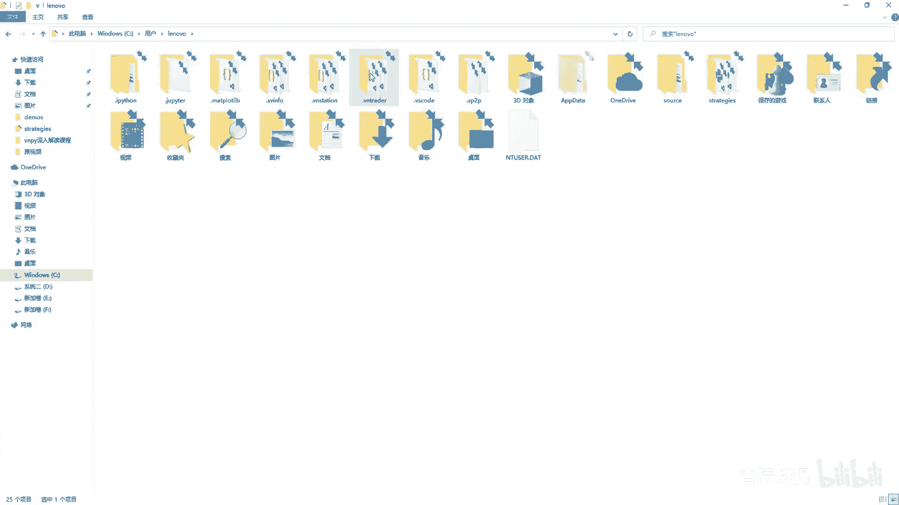

点JASON吧对吧，所以说我把c o n connect c TP点JS就连接上，然后获取到这个sitting，然后我connect的时候，这个里边需要传入这个setting对吧，SE啊。

city传进去，然后它连接的时候是不是需要时间呀，我就让他歇一下啊，from这个time import sp sleep啊，我sleep s l e e p sleep几秒啊，sleep比如说五秒钟啊。

然后这if c TP get away，当然他没有这个connect那个studio，当然你可以改一下啊，当然这个里边你这个CD p getaway，这个它有这个叫TDAPI是吧。

第2connect studio啊，就是他有这个状态的，咱们之前讲过这个CDPICWAY，他的状态如果是true是吧，end当然这也就可以不写了是吧，然后如果说你要看看他的是不是连接上了啊。

就是说你就从这儿写一下啊，当然你连接上了，如果连接不上呢，你还得就是说最好是给他写个循环，让它反复的去连接对吧，这咱们就不写了，就省略了，这个时候我就是my engine点right log。

就是说呃CCTP接口连接成功，连接成功之后，我是不是就应该连接RPC这个engine了，对不对，这个r pc engine应该点start吧，对不对，启动这个r pc engine吧。

所以说my engine right log，就是说这个呃r pc engine开始启动啊，RPC呃，启动这个这个他这个这个这个start，它是有返回值的吧，我这用一个RES过来接一下。

是不是我这儿呢SLEP我sleep一个两秒钟，然后啊if i e s e r e s，然后这我就输，我就输出一下啊，main engine right log啊，就是这个RPC启启动成功了对吧。

启动成功啊，启动成功，如果说没有启动成功呢，啊当然这个你写不写都行啊，我import一个SYS就可以，从这SYS就是ELS的话啊，ELSSYS点e x i t exceed就是跳出去了，对不对。

好这个RPC连接成功之后，你就应该做什么，其实如果说咱们服务端的话，其实到这就做完了，对不对，你可以给他写一个死循环嘛，while you true是吧，While true。

然后从这sleep sp呃，60秒就是你就让他一直停在这就好了嘛对吧，当然咱们为了看的直观一些呢，我先从这儿啊，我先从这写一个方法，DF写一个方法。

Df process tick event e v e n t invent，然后这写上这个invent，这应该是从这儿写一下是吧，这engine里边应该是导入这个event event。

然后这process嗯，Tick event，咱们就输出tick event吧，然后tick等于这个event点data，然后print一个tick啊，Print1 tick。

然后这呢我你要输出tick，我先给它注册进去是吧，Invent engine register，这个里边是invent tick对吧，然后把这个process timit给他给注册进去。

我向右拆分一下啊，向右拆分一下，然后呢我把这个in metick导入一下，From vn py，点tread，点invent import event tick，对不对好，我给他注册进去之后。

你注册进去了这个因为engine里面现在有tick了吗，他没有tick了吗，你没有去进行申请吧是吧，就是订阅呗是吧，所以说我们需要去订阅一下，就是这个man engine点subscribe。

Subscribe，里边需要一个REQREQ，就是subscribe request，咱们导入一下啊，from VN py点trade点object import这个subscribe request。

咱们这个REQ应该是等于subscribe request，然后这个里边simple是什么呀，simple应该是等于比如说RB2310是吧。

然后这个exchange exchange等于exchange，等于应该是大写的exchange，这个里边比如说我SHFE对不对，然后我导入一下这个exchange from VN py。

点trader点constant import这个exchange，对不对，然后这就是一个REQ吧，然后这个里边你要填入的不光是这个REQ，还有一个就是这个gateway。

那我这个getaway我直接填什么呀，我应该它的默认的这个gateway吧，这个gateway是在哪，应该是这个c TP gateway，这个c TP getaway，点default name吧。

我直接给他这样写是可以的吧，他这个default name其实就是这个CTP嘛，对不对啊，Mei，我申请一个，这个时候他就应该按说有这个什么了吧，有这个有这个什么呀，有这个他的这个tick数据了。

也就是螺纹的是吧，但是这咱们运行起来可能看不到那个什么呀，他的这个event log就是说日志，所以说我从这儿我再写一个event log行不行，def process这个唉就不写了吧。

咱们就这么去来运行一下好吧，啊这个里边报错了报错了错的问题啊，一个是我这个contract data里边出现了一个product id，product id可能跟这个底层的。

这个可能是我讲课的时候给他加了一个啊，加了一个，另外一个我连接的时候连接这个RPCN呃，这个engine点start的时候，我这里边是不是缺了个东西，也就是这个RE。

就是这个r e p address和这个p u b address，对不对，呃，我可以把这两个写一下，这两个我直接用它默认的就可以是吧，这个默认的在哪呢。

是不是在RPC这个RPC这个rpc engine点default，就是我直接用这个rpc engine点default，df a u LT default啊。

不是这个r e r e p address和这个r p c engine，点这个p u b address对吧啊，这个忘了是不是，然后这个时候我再去运行一下啊，再去运行一下，我把它先关了，先关了。

先关了之后，咱们去TML是吧，然后行情服务器连接成功，交易服务器连接成功，然后行情服务器登录成功，交易服务器授权验证成功是吧，呃这还是有问题，key有一些这个问题啊。

这个应该是你看这个tick是不是就收到tick了，他就一笔一笔的就收到tick了，对不对啊，tick咱们收到了没有问题，我把它直接给关掉，那我服务端那就应该就是没什么问题了，对吧啊。

服务端就没什么问题了，你要知道他是怎么回事啊，怎么回事好吧，然后咱咱们就来看这个客户端啊，客户端新建这个c o i n t client demo，点PY啊，客户端客户端咱们应该怎么去写。

同样的你还是需要这个my engine是吧，因为这engine都需要有，所以说我把这呢，上面我给它整个的全部给复制过来一下啊，复制过来一下，首先我需要一个这个invent engine对吧。

invent engine等于invent engine，我实例化一个main engine，my engine等于my engine，然后我把这个invent engine给它传进去啊。

那你的主引擎有了invent engine，有了有了之后，你是不是应该我去把这个RPC这个client，给他给呃添加进来，对不对，r p c client呢，我从这直接啊。

from VN p y这个RPCRPC还是这个service吧，点这个rpc gateway，import这个rpc gateway吧，对不对，import这个rpc gateway。

这个rpc gateway里边它有这个right log吗，咱们先看一下他们没有right log吧，这个right log就是C点right log，它是在这个就是说这个base gateway里边。

他还是给放到了这个event engine里边去吧，这个on log对吧，UNLOG是干什么呀，own invent吗，还是放到了，所以说这个咱们就不需要单独去进行注册了吧。

因为它本身因为他本身他就那个，你my engine里面就有这个log engine，这个log engine它已经是注册了那个event log了吧，对吧好，所以说这个我就不需要把它给单独抽出来了。

是不是好，咱们这my engine点应该是at the gateway吧，at the gateway吧，咱们要把这个r p c gateway给它放进来，对不对，r p c gateway给它放进来。

然后它这呢后边还是有个get a name，咱们就不写了，他有个默认的这个get a name，对不对，默认get away，它有一个返回值，就是这个getaway，是不是，所以说咱们这RPC啊。

Get away，就等于这个他应该是这个r pc gateway吧对吧，它同样是需要启动的吧，就是rpc getaway点start，rpc getaway点start吧。

S t a r t s start，它没有这个启动吗，咱们看一下啊，r p c getaway里边啊，应该是connect连接是吧，它不是啊，不是start，咱们应该是connect连接它啊。

connect呃，点connect cn e c t connect connect里边它需要一个sitting，sitting是什么呀，sitting还是这个主动请求呃，这个地址还有这个推送地址。

它其实是一个字典吧，字典咱们就直接用这个不就行了吗，对不对啊，直接用这个default setting，咱们就呃r p c getaway，R pc getaway，点default setting。

是不是就去连接上了啊，去连接上了吧，比如说我从这我sleep一个S2P，sleep一个五秒钟啊，我连接上了之后，我这个image engine也启动了，main engine也启动了。

但是我这没有去给他接这个c t a engine是吧，CTAN减，我只需要看他能不能接收到我那个提个数据，对不对，能不能接收到我那个提个数据，那我这个提个数据，我是不是得写一个方法DEF啊。

我从上面定义吧，Df process，这个是event吧，它是一个invent类型对吧，然后invent这个tick等于这个invent点data吧，然后我print一个这个tick吧。

我把tick直接输出出来啊，直接进行输出出来，然后呢我从这儿呢我注册一下，也就是这个invent engine register，然后叫event tick。

然后把这个process tick invent给他放进去，他是不是就可以实现tick的输出了，对不对，就可以实现tick的输出了吧，这好像就可以了。

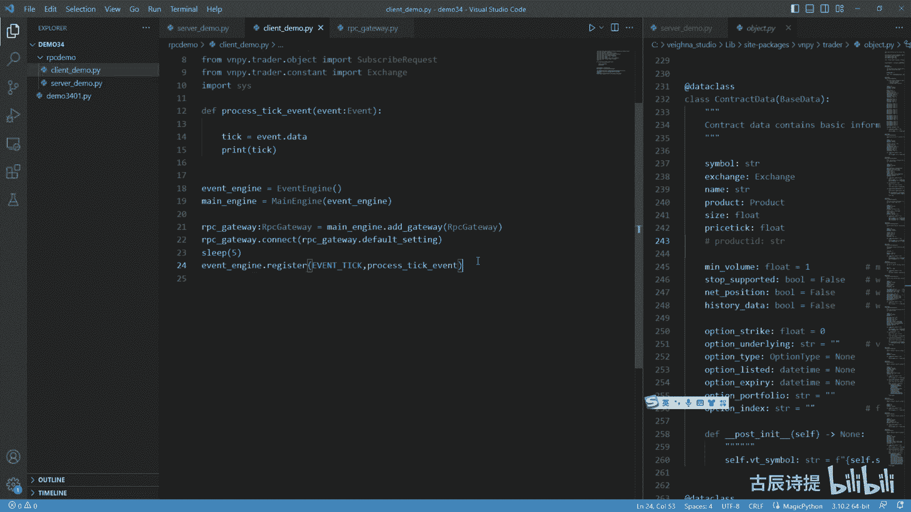

对不对好，那咱们去运行一下啊，在这个F盘啊，深入解读课，然后在这个demons是吧，34节课好，咱们r p c demo里面打开，然后先把这个服务端先运行起来啊。

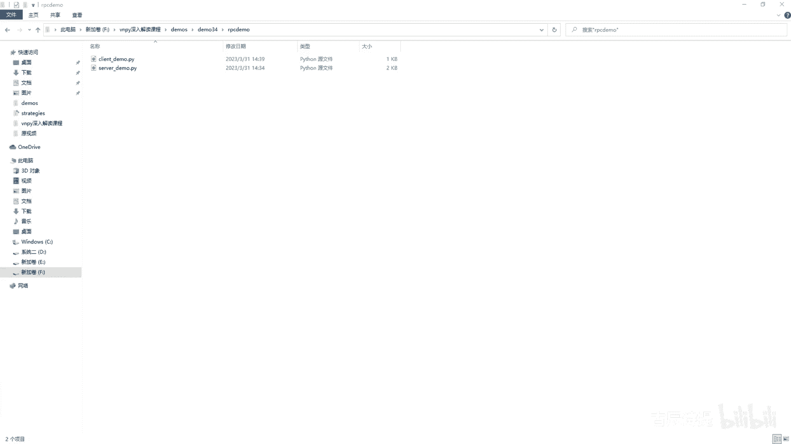

这个Python这个server好，运行起来好。

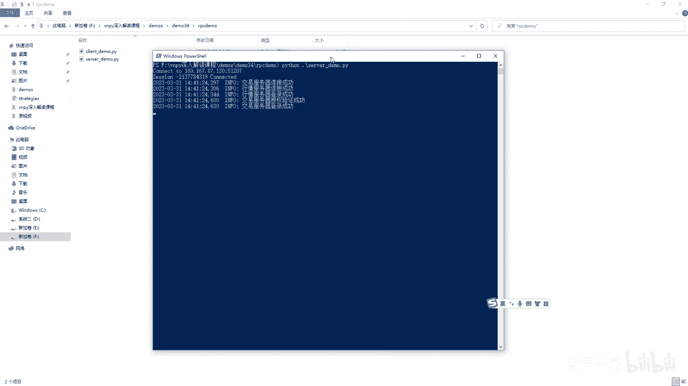

连接没有问题好，咱们在运行这个客户端啊。

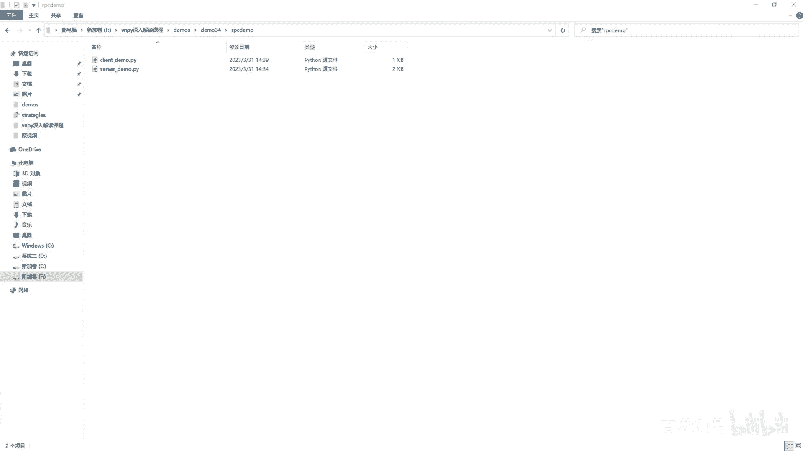

咱们在运行客户端，Python client type，好，诶，是不是有了服务器连接成功，开始查询初始化这个data是不是有了呀，对不对。

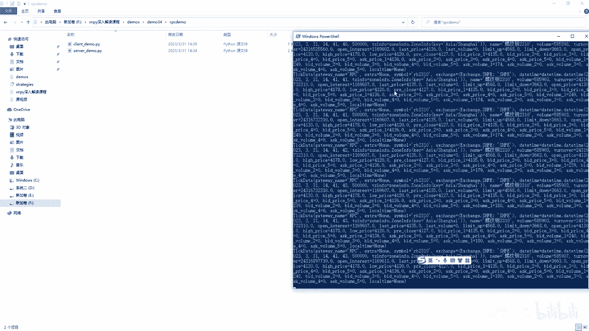

有了有了吧，这边当然是一样进行输出啊，如果说我给他加一个订阅呢，我从这给他加一个订阅，现在只有螺纹钢的吧对吧，我给他加一个订阅啊，嗯我给他加一个订阅，订阅我还是需要那个subscribe。

也就是在咱们这个呃main engine点subscribe，My engine，点subscribe，这个就是还是这个REQREQ等于ie request，它是叫什么来着呃，subscribe是吧。

Subscribe request，然后这个symbol我给它等于一个，比如说焦炭2310啊，然后他的这个exchange exchange等于exchange session。

exchange里边这个应该是这个DCE是吧，exchange DC e是这么写的啊，咱们看看啊，EXCHANG啊，这么写啊，D c e，然后这我给他发送过去，就是REQ。

然后我就get to name，我直接写个CTP是不是就行了对吧，我直接写个CTP吧，我看看能不能订阅上啊，能不能订阅上我subscribe，你想想啊，我subscribe，我去申请的时候。

我CDP有这个接口吗，我是不是应该给他写成RPC呀，啊应该写成RPC啊，Rpc，因为我这个里边的接口at这个ipc gateway，他的这个default应该是RPC，对不对啊，应该是RPC。

然后我去申请的时候，我应该这给它写成RPC对吧，应该写成RPC，因为my engine这个里边现在只有一个gateway，就是这个RPC是不是，然后他再去申请的时候没案件，找到这个get away。

然后把这个RQ给他。

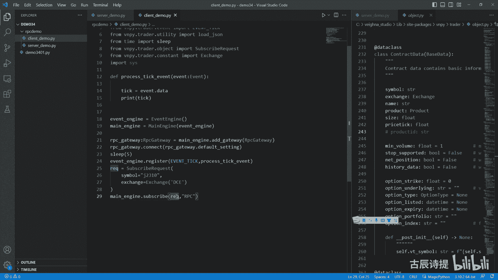

对吧好，我再进行一下这个运行好吧，哎呦打开错了啊。

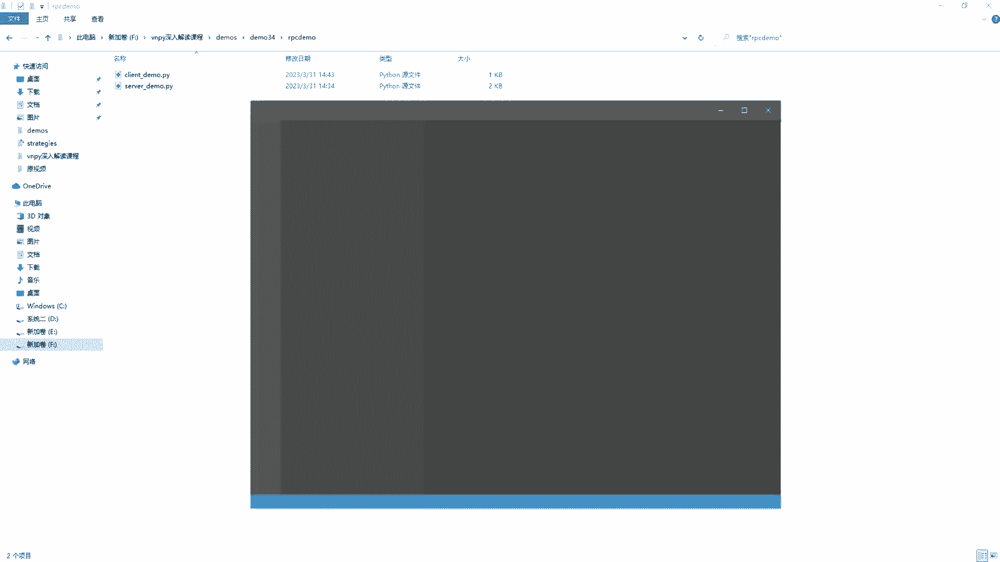

再次入打开。

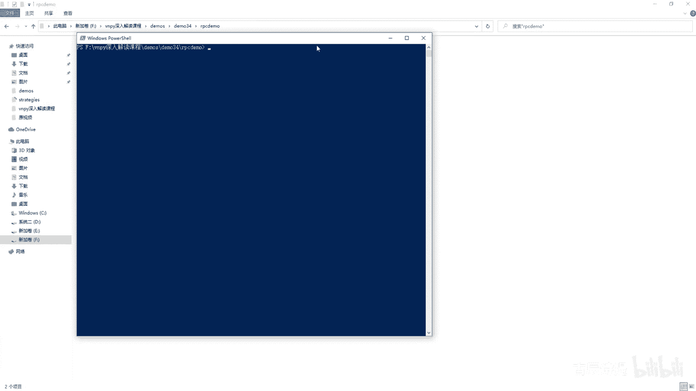

server好，然后在此处打开power系。

client好，RPC启动成功了吧，这个是一些我这个账户里面有成交啊。

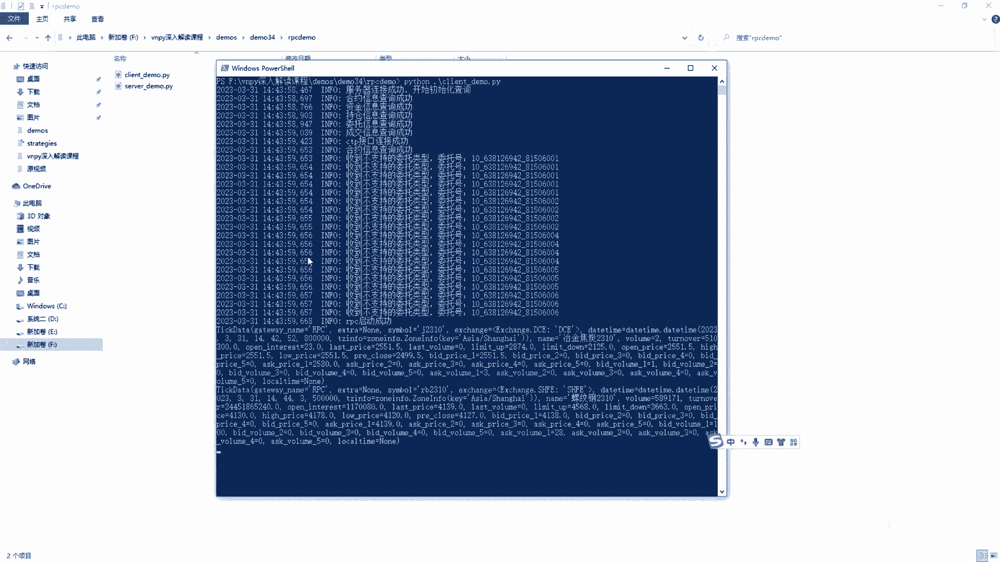

RPC螺纹有焦炭吗，看看没有焦炭是吧，咱们看一下它为什么没有焦炭啊，啊有了啊，我刚才检查了一下，没有什么错误，就是刚才是这焦炭，它这个tick比较少，成交不是很活跃，这一定是用RPC啊。

然后我给他换成了一个铝螺纹，铝就有了吧是吧，铝就有了吧，啊铝是吧，好这个连接就没有问题了啊，你也可以用这个服务器去尝试一下服务器，尝试一下。

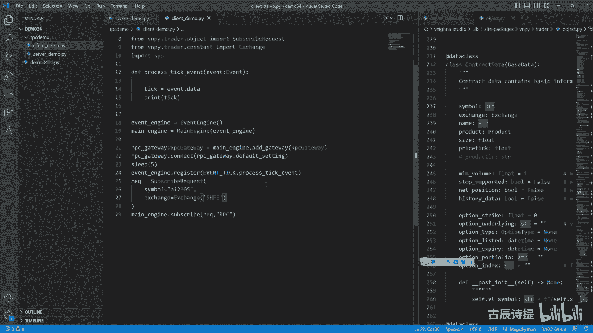

我在我的B站上有这个那个课程啊，叫这个就是应该是多账户的那个课程，就是在B站就是这个多账户演示课，这里边也有这个rpc demon啊，当时我用了这个服务器演示过。

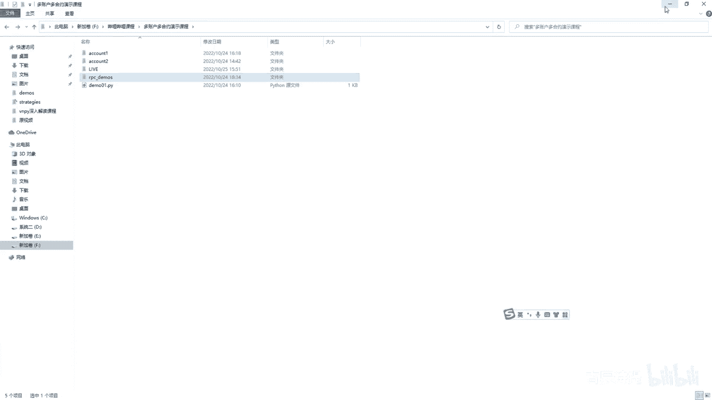

你如果有兴趣的话，可以去看一下，那整个的这个RPC这块呢，咱们就讲完成了这个client，这呢我并没有去连接那个什么，就是说这个这个T那个app是吧，就是这个策略的，你可以自己去试一下啊。

逻辑就是这个逻辑已经讲的很通透了，然后我刚才又看了一下，在这个所有的代码里边，好像还涉及到一个东西没讲啊，就是在咱们讲这个什么这个server啊，这个rpc client的时候呢。

在这个commons这个里边，commons这个里边有一个这个东西是吧，就是这个东西没讲，就是别的代码都应该是讲到了，这个东西是个什么呀，其实很简单啊，也给大家演示一下，在这里边算了，我新建一个吧。

demon3402点PY，好这个东西是干什么的呢，比如说我就是呃，From time import sleep，然后我DEF呃，我不DF了。

就直接y w h i l e y a true s l e e p，sleep睡觉啊，就我就是这个代码，然后我运行起来它是它是不是就是个死循环呀，对吧，我如果想让它停了，我CTRL加C它是不能停。

但是他会报个错，叫keyboard呃，什么什么什么错误，如果说我把这行代码给它放进去，这我import一下signal，Import s i g n a l，我input加signal。

咱们可以看一下啊，它是个什么情况，我我把它跑起来是吧，然后我再CTRL加C，它不报错了啊，他报错了啊，就是这个这个你说呃讲怎么讲，这个也没啥好讲的对吧，它就是什么呀，他其实这个也说的很清楚。

就是achieve Ctrl c呃，这个就是接受这个你CTRLC去中断它啊。

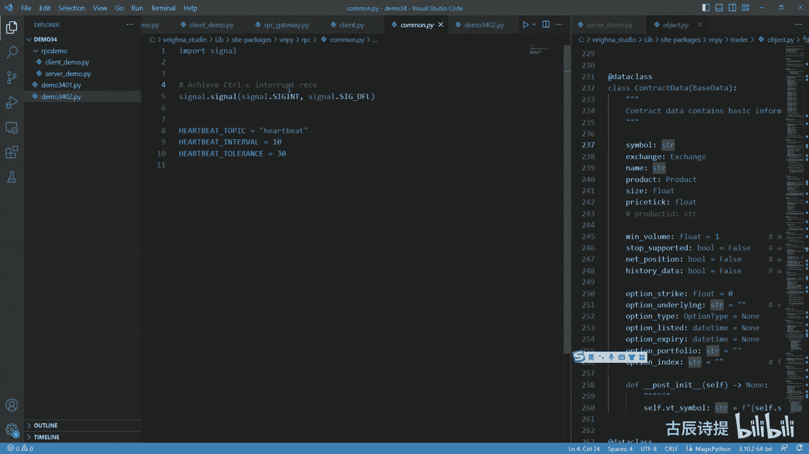

就这么个意思，好吧好。