# 第35节课 策略模板的编写2 - P1 - 古辰诗提 - BV1Y1421S7pE

欢迎大家来到从零开始量化系列课程，Python基础课的第35课，这节课咱们接着上一节课的内容，接着往下讲，上一节课咱们获取到了这个实例化之后的。

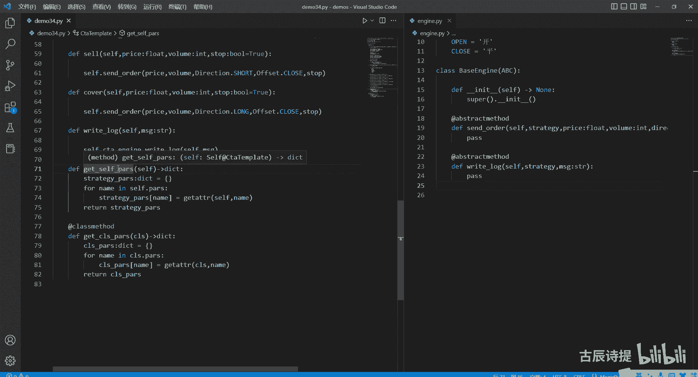

它的一个参数列表和，就是你继承了这个模板类。

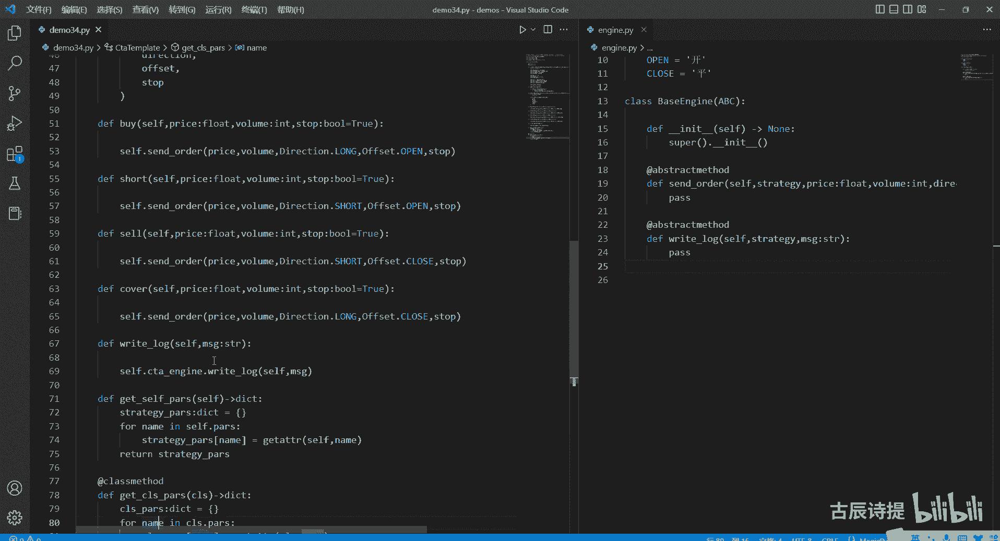

它的里边的G就是原本设置的参数，那既然能获得获得到这个参数，同样的咱们也可以去获得到它的变量，实例化的变量，好它的返回值也是一个dict，dict给他返回出来，同样的这个t t strange vs。

等于标注一个等于一个空的字典，for name in c点V2，Strange vars，它的key就是name等于git a t t r就获取self，然后name去获取它的这个变量值是吧。

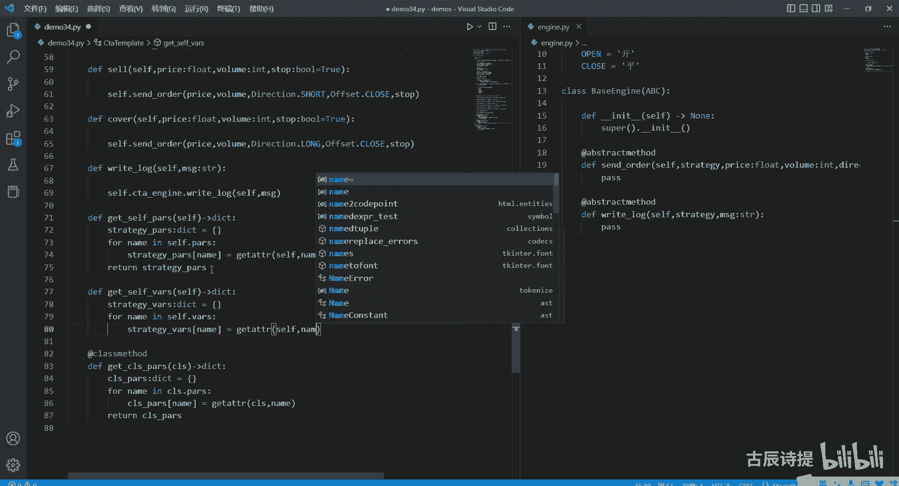

然后return一个，return一个strange vs。

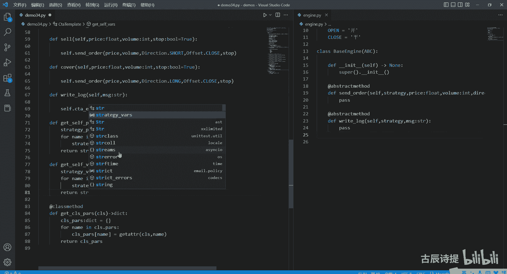

这样就可以了，既然能获取到变量和参数的这个它的这个值，那咱们就可以获取到它的整个的，我这个实力的这个策略的这个信息了对吧，Gate strange，将t strange data。

self返回的还是一个dict好，Dd d i c，默认它是DICT等于一个，这个它里边就直接在里面写吧，它里面有什么呢，你首先你得就是他的strange name。

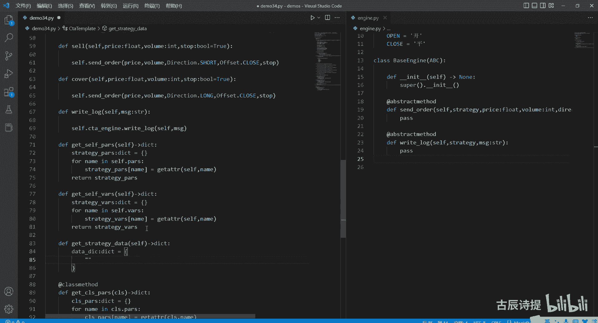

就是独一无二的那个名字，咱们一开始给他传进来的是吧。

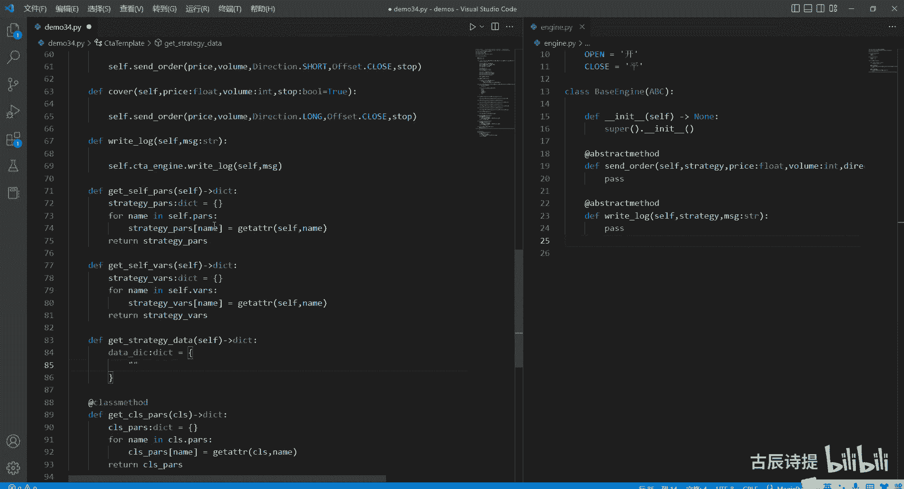

因为你得标识它呀，strange name就是self点strange name，第二个你的wait simple，你是肯定有的，你在什么合约上去用对吧，V simple，第三个呃。

就是你的这个变量参数吧，先写参数pc gate呃，cf点PS，就是我去获取这个我实例化的这个里边，这个参数内容，然后还有vs self，Digit，Self vs，你获取出来之后。

其实这个就能反映你整个我实例化出来的，这个策略。

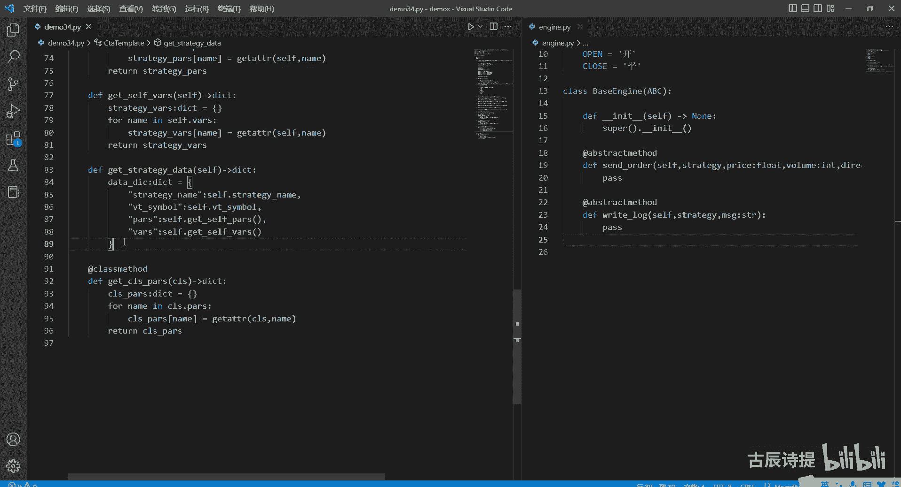

他的这个一个整体的情况，把它返回出去。

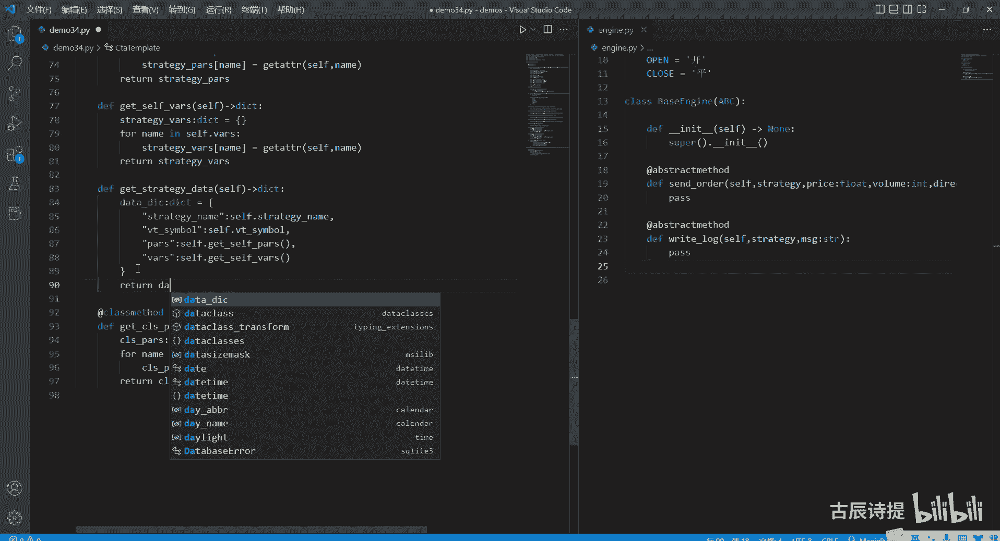

什么时候用，其实如果说你用脚本来运行你的这个策略，当然有很多个多很多品种多策略的去跑的话，你需要看一下，就是说他的状态是吧，你或者通过web就是这个呃web接口，或者通过GOI界面去展示你的这个信息。

看看他的情况，甚至于你可能在GI界面里边，也可以去获取到这个历史数据，然后看看他什么时候可以进场，把里边一些关键的这个变量值用线给画出来，这个时候就是你肯定得实现一个功能。

就是我能够获取这个策略实例化的策略，它里边的一些基础信息是吧啊，这个它是应用在这样的场景上的啊。

好这个写完之后，咱们看一看这个委托发送，委托发送，咱们实现了，既然委托发送了。

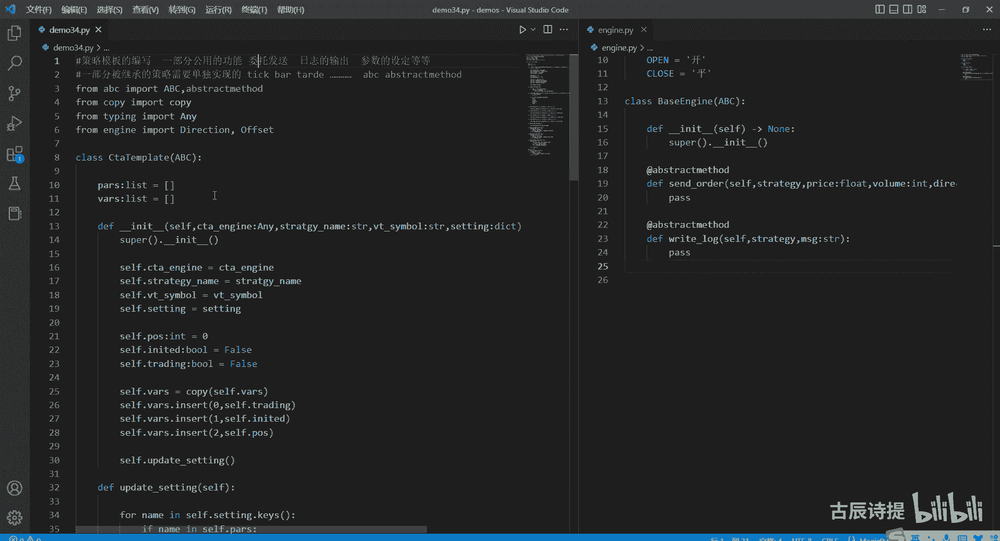

那肯定得有撤销，对不对，所以说咱们在这写一下撤销吧。

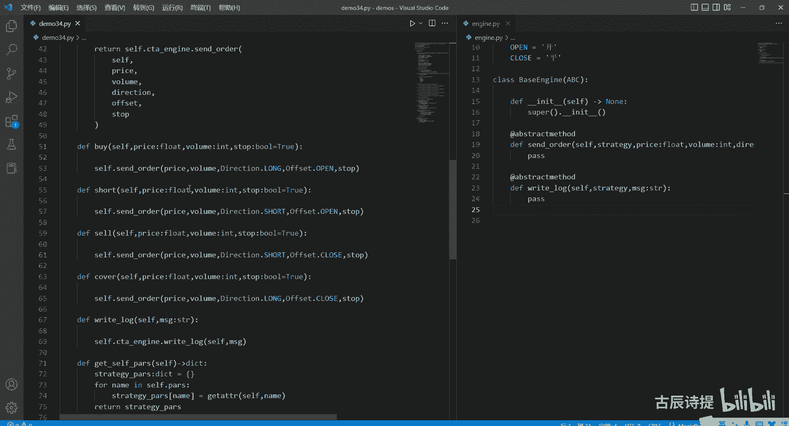

从这从这写df cancer order，这是单个合约的撤销，把cf给传递过去，你这个合约咱们用v t order i d，就是用这个你的这个就是发送委托的，给你返回的。

他的这个就是你合约的这个编号是吧，它一个标识等于是嗯你肯定在模板里边，你是实现不了这个去撤单的。

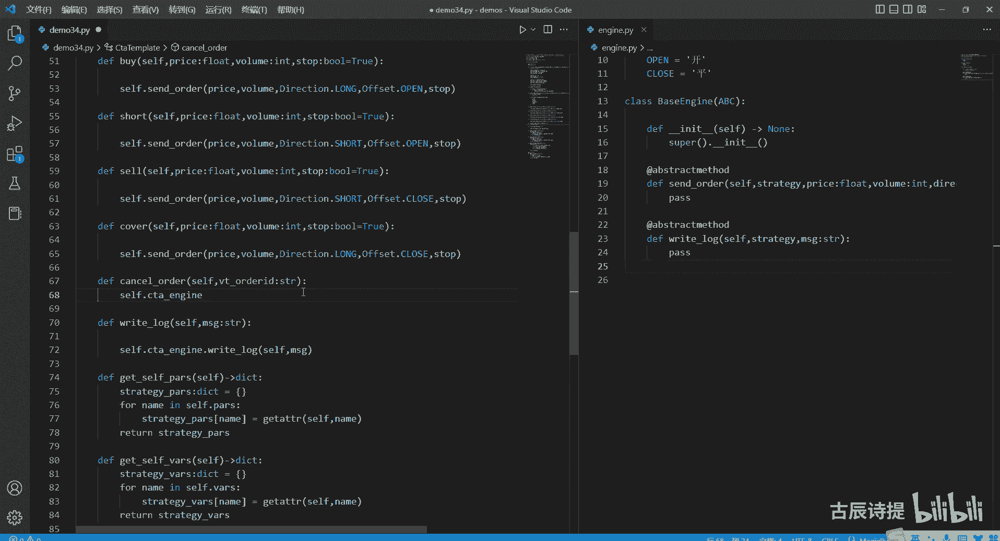

因为呃如果说你的委托单发到底层的话，他肯定是你需要向底层服务器去申请撤销，如果是是保留在你的CTA引擎里边的话，他肯定会要在这个CT引擎里边去处理，所以说你直接就可以把这个功能去扔给这个。

CCTA引擎里面去是吧，你直接cancer order把这个vt order i d给它传进去，但是一定要把cf，就把你的这个实例对象给他传进去，因为你实例对象给传进去之后。

这个city引擎就能通过实例对象，他独一无二的名字去知道你是哪个实例对象，对不对，他肯定就说你因为不是一个策略嘛，你肯定很多策略在跑，很多策略在跑，他肯定会通过你的这个这些个策略的名字，来标识你的策略。

为什么这个要求你的策略名字是独一无二的，标识你的策略之后，它会就是说找到你的策略，然后找到你策略里边的，就是说现在目前它存放的委托单，然后去给他进行撤销是吧，这个是后续的操作了啊。

这个时候你一定要把这个cf给他传过去，就是实例本身给他传过去啊，再把VTODAD给他传过去，对应的咱们在这就需要去实现一下，就是他的一个就是抽象的这个cancer的，Alt d t r pass。

那抽象的这个cancel order实现了之后，你肯定得实现一个撤销所有，你上面这个是针对一个就是委托单号去撤销的，那你就是你可以撤一个，那你肯定得实现一个接口，就是撤销所有是吧，TRATGY接的时候。

一定要把这个strange给接过来啊，这个时候你撤销所有就接一个strange就可以了。

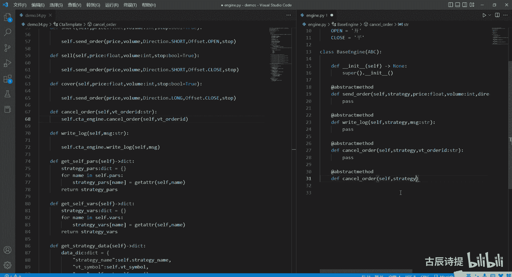

pass同样的我在这边再去实现一下DF，现在这个下面df cancel or，就是撤销我这个呃，委托的我这个策略的所有委托啊，cf点city engine，点cancel，把cf给他传过去，好吧嗯。

cf一定要知道是什么，就是我这个是我这个实力本身，它本身也是个对象嘛，肯定是可以作为参数传递的，包括咱们的这个方法也可以，只要你不加括号，把这个方法名可以作为这个参数去传递啊。

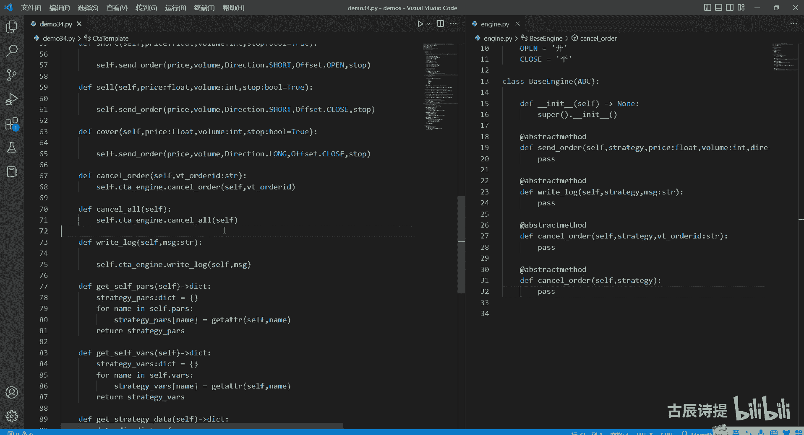

这两个实现了之后，咱们看一看还有没有别的。

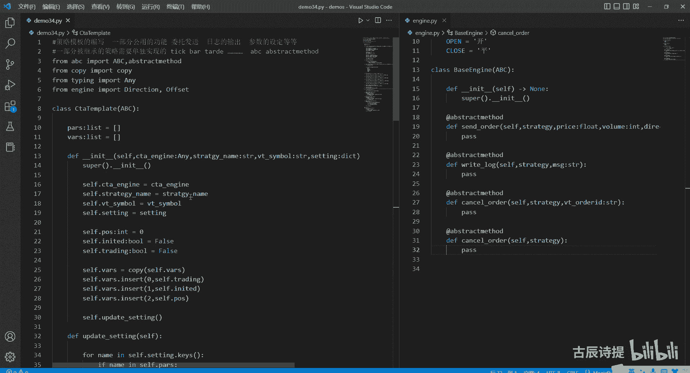

基本上应该是啊，还有个统一数据，就是数据保存也实现一下啊。

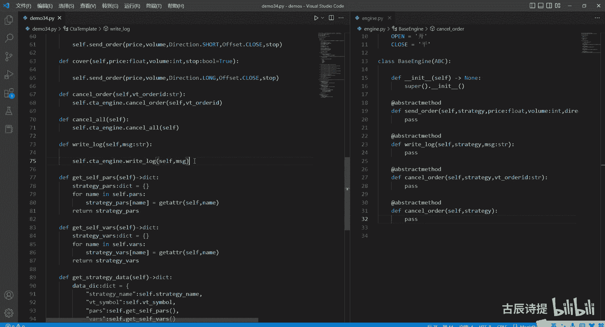

数据保存你的逻辑是什么，就是尤其是我的变量数据和我的这个，当然参数设定是你一开始就设定好了的，这个保不保存的就放在一边，你的变量数据肯定是得保存的，比如说你的仓位，你的仓位不一定和你实际仓位能对得上。

就这个单个策略而言，因为你可能是多策略嘛，所以说你肯定得保存你的变量的，你保存变量，你不可能单个合约就是你单个这个策略去保存，肯定是通过CTA引擎，把整个的你在呃执行这个量化的所有的策略。

它用一个字典保存成一个文件，下一次读取的时候更加的方便对吧，所以你直接就可以甩给city engine，这个你就不要把这个cf给传过去了啊，当然你也可以就是说只做更新，我自己的。

就是说单个策略的内容当然也是可以的，就是你去实现这样的话，可能在你很多个策略里边一起去跑的时候，你这个会执行很多遍，是不是，就是你比如说我在，就是这个所有的策略都停止的时候，每个策略停止它都执行一遍。

每个策略停止它都执行一遍，可能会有一些就是浪费资源啊，在这同样咱们去实现一下咳，Pass。

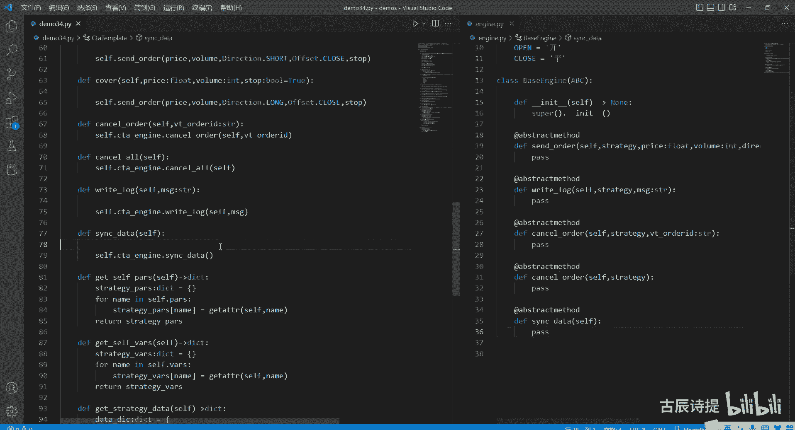

好数据保存嗯，写完之后就是你这个公用的功能。

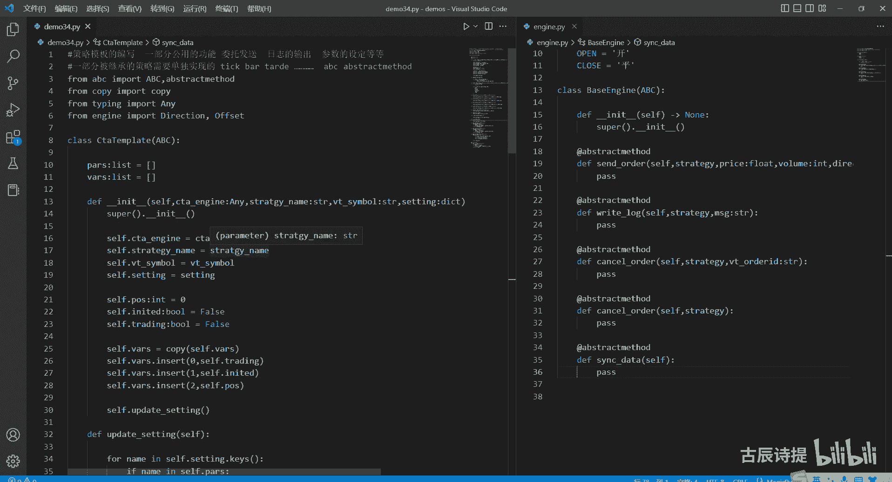

我觉得已经差不多了，当然你有别的，你可以再往里填对吧，如果说你想再实现一些别的功能嗯。

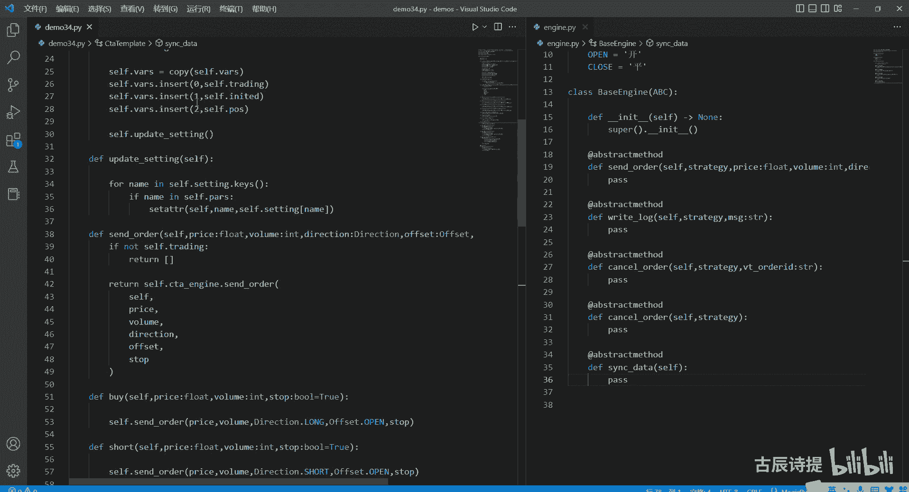

都可以都可以往里去填，并没有想象的。

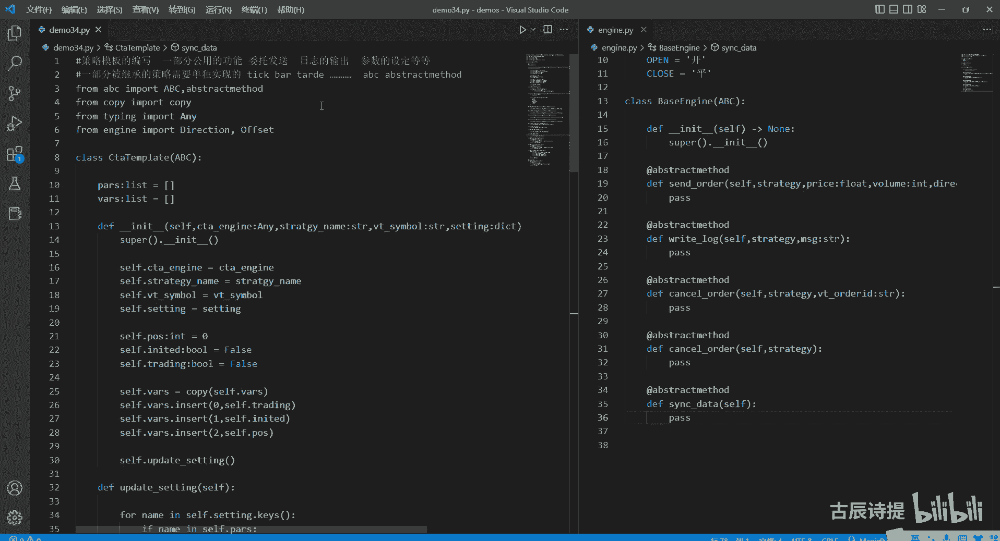

那么就是说不可更改啊什么的，包括你比如说我想再做一些，比如by market，我想再做这个by touch，就是试驾单和这个出价单，你完全可以去写，比如说我是我，我写一个by market。

然后我就做试驾单，买的时候我就直接用这个呃涨停价去买，发最高价，确保它立马成交，这个price你都可以不用让这个，你再去继承它的时候去写了。

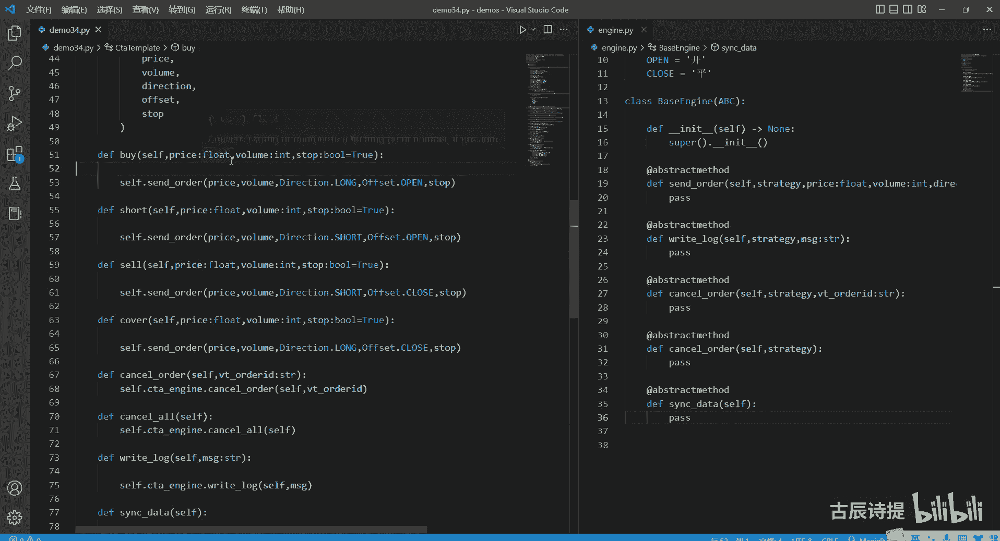

我就直接用涨跌停价是吧，这样都是可以的，好吧嗯嗯那咱们就开始写一部分被继承的策略。

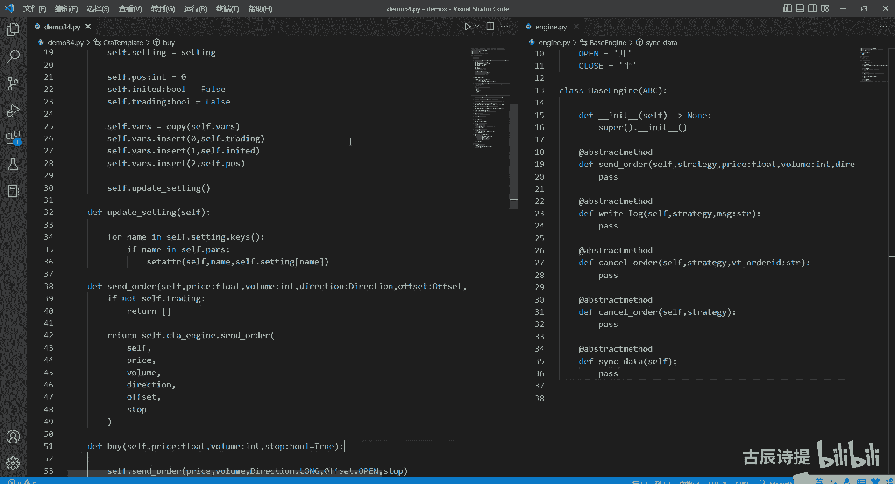

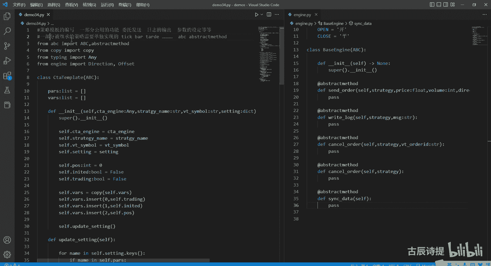

需要单独实现的，这个内容当然也是跟这个是类似的一样的。

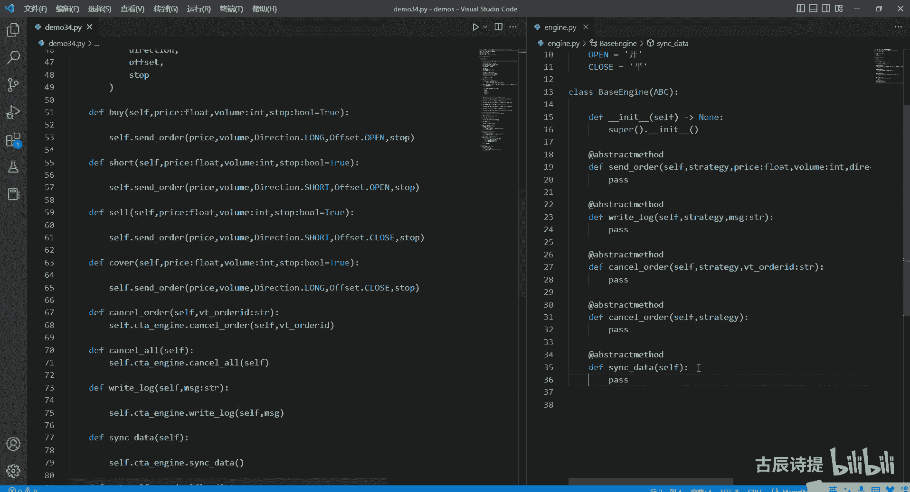

就是你不用去具体的去实现它，你只要把它写在里边就好了。

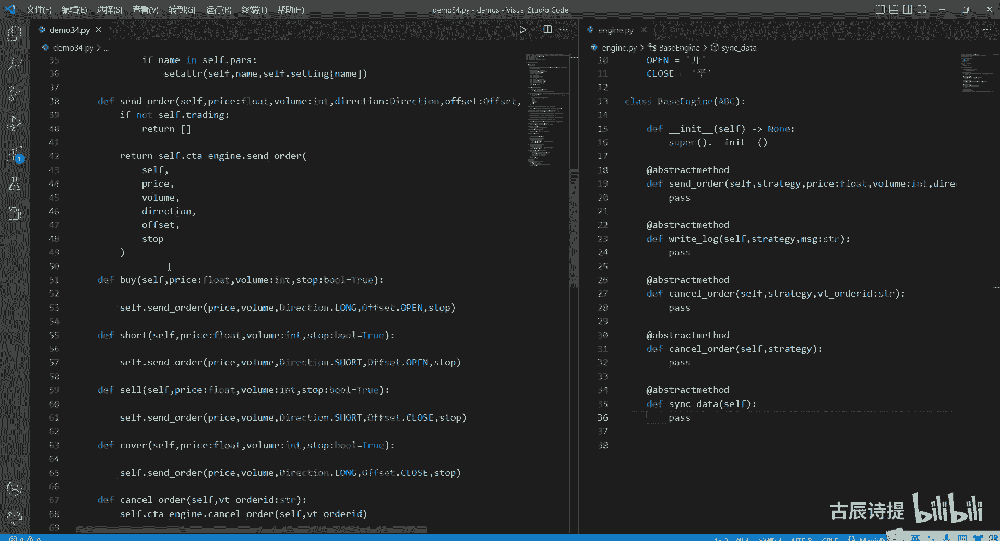

写在里边就好了，如果说继承你的这个子类，没有去实现这些功能会报错，必须实现哪些功能，功能有哪些，你首先一个你得初始化是吧，就是on in it，你这个初始化，其实就是下载你的这个参考数据嗯。

咱们之前也说过，你30日均线，你最起码有30日的数据啊，然后今天的行情数据来的时候，你再去更新你这个里边的这个数据，所以说你最起码也有30的，就是数据在你的这个，你就是哪个变量里边去保存着。

然后再根据30的数据去计算，很多的就是你的指标啊什么的，所以说这肯定得提前下载这个工作，就放在初始化的时候去完成，完成这个初始化了，你肯定得告诉这个就是我这个策策略，这啊我这已经完成初始化了。

你可以去启动了是吧，所以说你这边肯定得有个df on start。

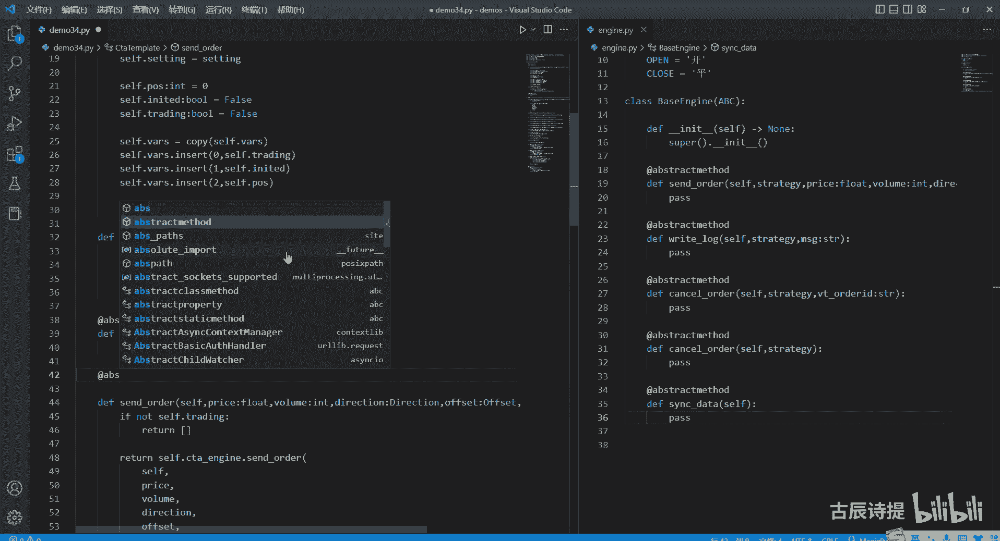

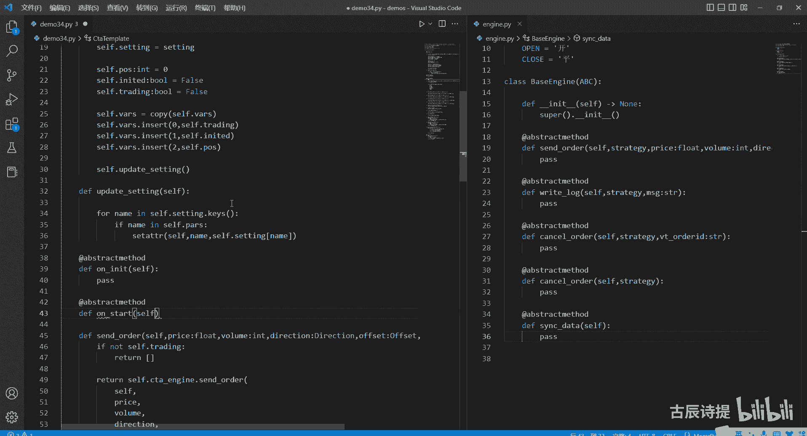

其实在这个on start里边，你去实现的其实就是告诉这个状态。

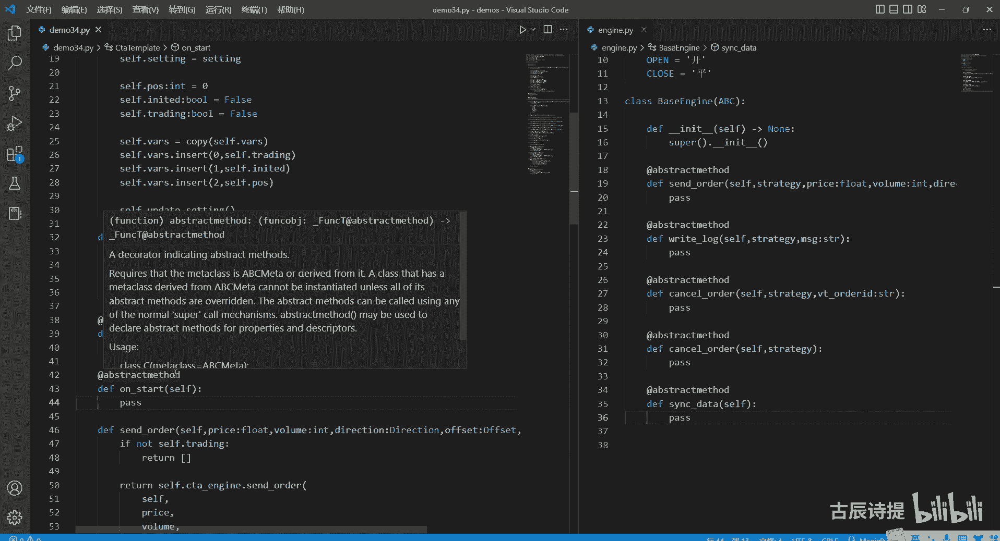

你这个策略可以启动了嗯，你也可以去把这个shift training放在这个里边，当然你得去具体实现的时候，在子类里面去写，把self training，然后变成true，对不对。

当然咱们维纳平台它是cf点trading，就是每一个策略，TCF点training是在CCTA引擎里面去控制的，既然有开始，肯定得有结束。

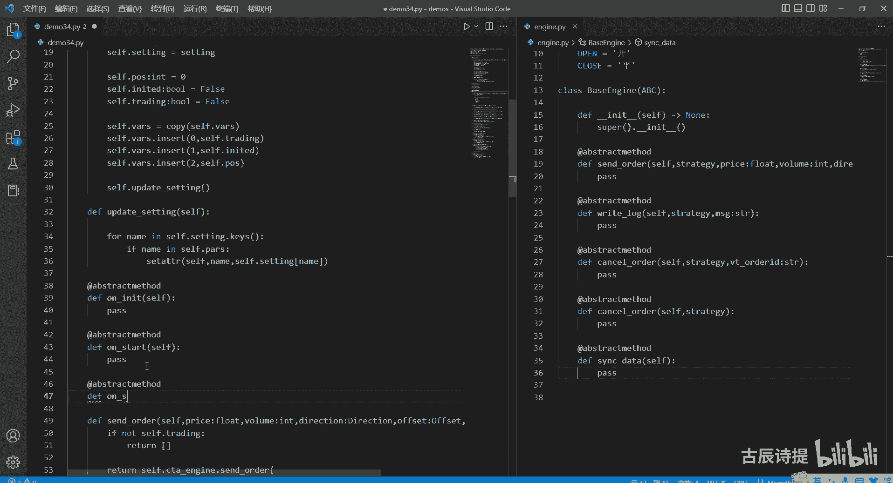

结束里边一般就是保存数据嘛。

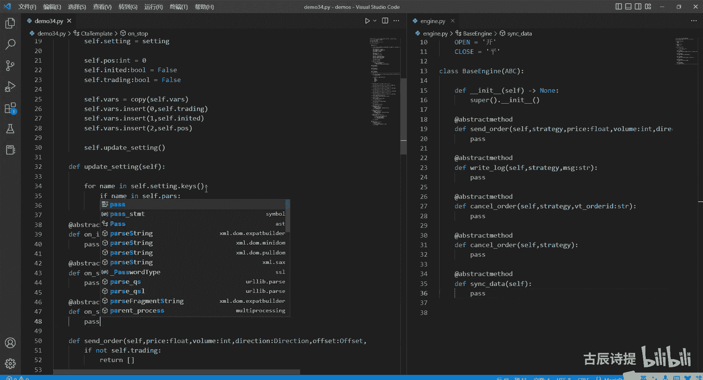

咱们刚刚去实现的去保存数据，然后还有其实这个三个还有一个功能，就是告知你QY界面也好啊，或者你的web界面也好呀，告知你这个界面我已经初始化好了，我已经准备好了，然后我已经停止了啊。

那后边就是你肯定得实现on tick，就是当有tick数据过来的时候，你肯定得传递给我的这个实例里边。

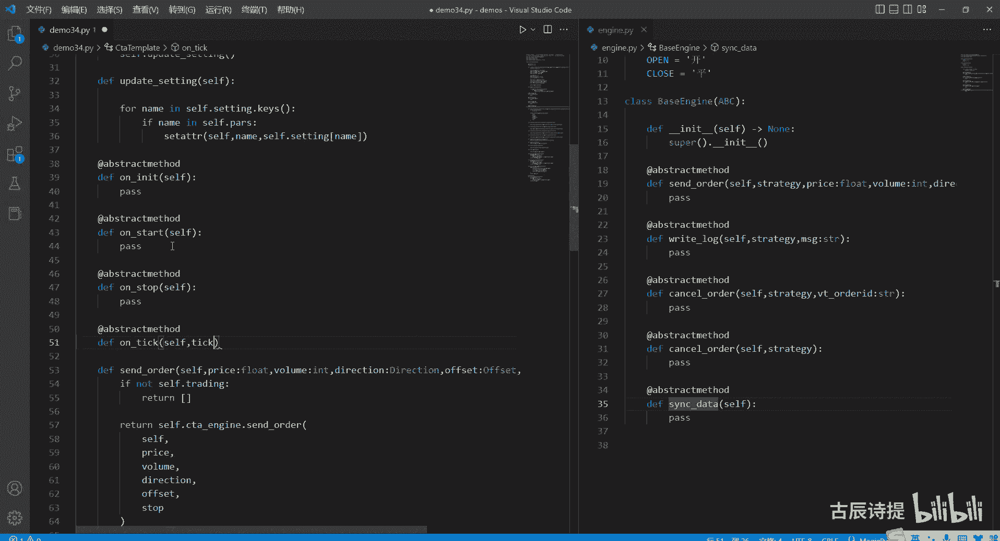

然后我进行处理呃。

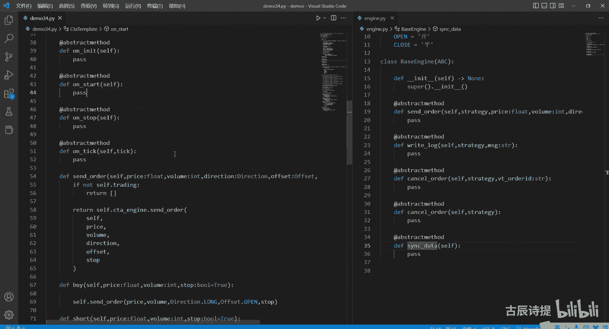

用tick来合成K线，或者在tick里边去实现一些功能对吧，在tick里边去实现一些功能，比如说把这个就是之前没有成交的委托单，比如早上九点的时候，我第一笔即可去发出去啊。

从从这我给添加了一个if not self training，就return一个空的这个列表啊，这个应该是我后边填进去的，这个是什么意思。

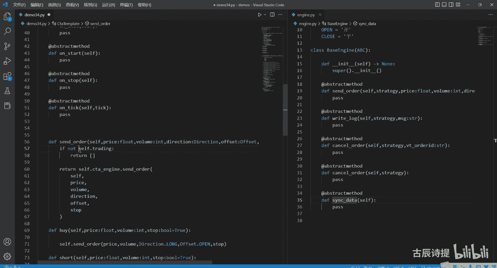

就是当我在on init的时候，你他也会去send order，所以说这个时候你不能把这个在呃获取参考吧，历史数据它完成了一些信号，你发送给这个CT引擎。

所以说呃这个shift training它的作用就在这呢，就是当你去获取历史数据或者参考八的时候，你还不进行真正的去发送委托呢，另外你真正发送委托，如果说你保留在本地的还行，如果说你保留在服务器的。

一般都是提前开这个策略嘛，发出去也没用对吧，所以说这个其实虽然两行代码很关键的，从这给加进去的，这个就是cf点training的作用啊，好下面咱们该写这个on tick，完了之后就是on bar。

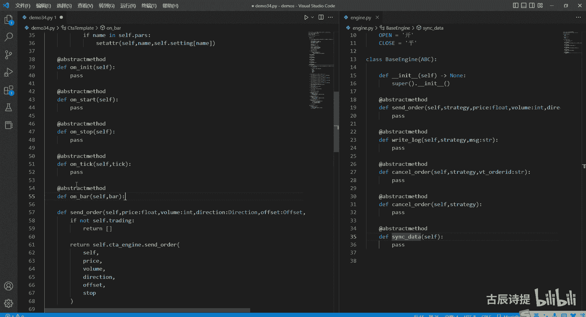

on bar是干什么的，就是这个你肯定得去合成八线，当然有一些策略你可以从这里边去去做，但是大部分CCTA策略，你还是到这个八仙那边去做的嗯，你先去合成一分钟八线。

然后再根据一分钟八线去合成你自己需要的，这个周期的这个K线，所以说欧巴是你合成被别的K线的一个基础，对不对，所以说OTC一般是从OTIC里边，然后那个去调用on霸在实盘的时候，但是呢回测的时候。

大部分给你的是分钟级别的数据，分钟级别的数据你就可以直接用它来调用，这个欧霸就不用走TK了，因为走TK也没有任何的意义啊。

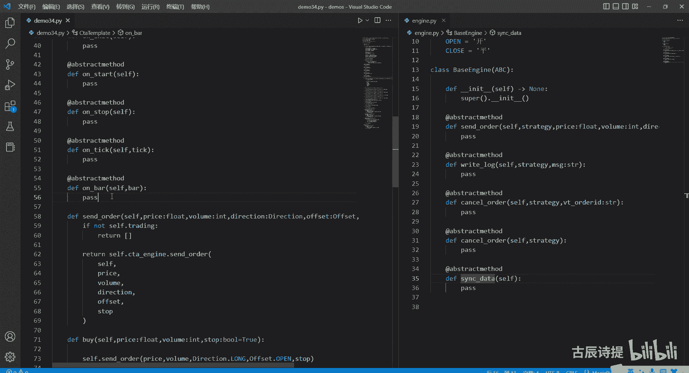

所以说欧巴肯定还得去实现的。

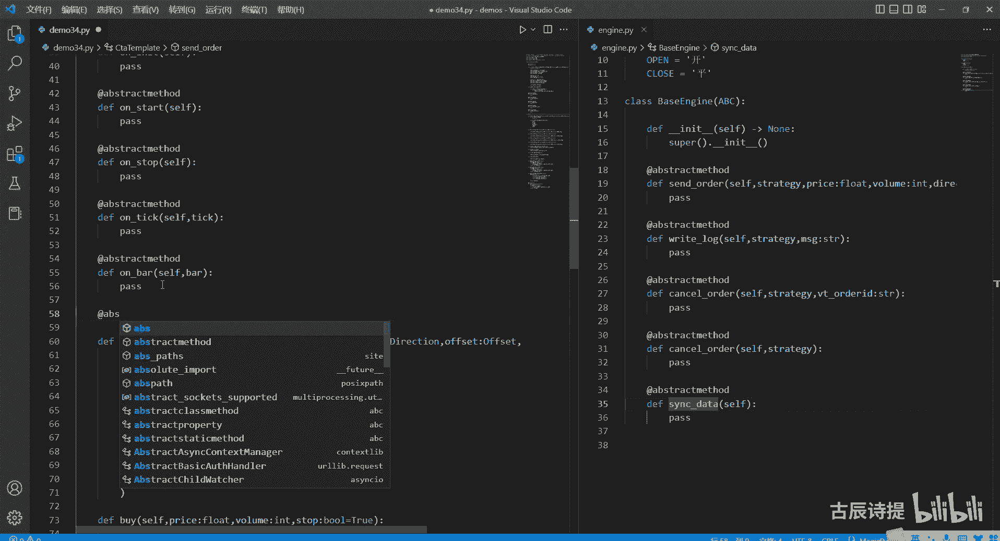

然后欧巴在里边，你实现了你的就是说指标的计算呀，或者说一些其他的就是信号的发出啊，这个时候就会有委托你on order肯定是得有的，你委托发送出去了呃，然后你肯定他比如说委托有变化了，他被触发了是吧。

然后他被拒单了，然后还是怎么着，他肯定得回调到你的这个呃策略里边，然后你再里边去实现你的功能，如果说被触发了该怎么做，被撤单了，该被怎该该去怎么操作，然后被这个呃巨大了，该去怎么操作是吧。

你既然是这个on order有了，就是说它针对的是这个限价单，就是从服务器给你返回回来的，那你肯定还得有on stop order，就是，Stop order，它的逻辑是保留在我的这个。

CTA引擎里边是吧，但是它也会被触发呀。

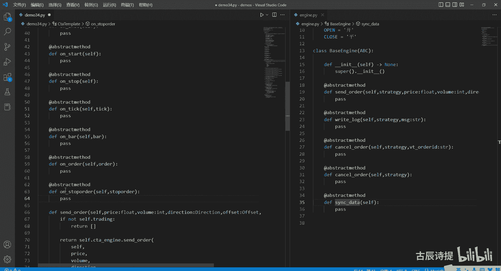

被触发了之后，你肯定得告知我的这个呃就是说实例化的策略，然后我这个是被触发了还是被撤销了，还是在等待对吧，当你状态有改变的时候，你必须得能够回调到咱们的这个实例里边的，这个方法。

所以说必须得去让他去实现啊，On stop order，完了之后就是trader了，T d on tri，就是这就是成交之后，你应该就是说有成交来就毁掉这个函数。

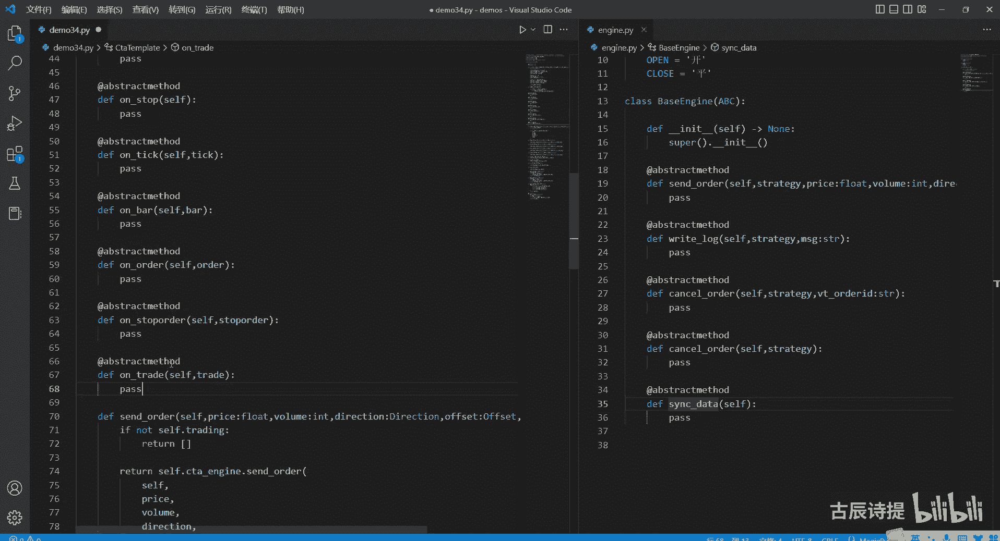

然后你从这里边可以计算你的这个止盈，止损呀是吧，然后或者再做一些其他的事情，这个才是最准确的，就是说你去计算止盈止损的这个呃点位价格，因为try的传过来的肯定是从服务器传过来的，准确的成交信息嘛。

这个准确的就是成交信息，你计算出来的指令，比如说我就10%止盈，但是如果说你在就是说只是在我买完之后，我设一个止盈，因为买了它有撮合机制嘛，他不一定会成交，这样就会产生bug。

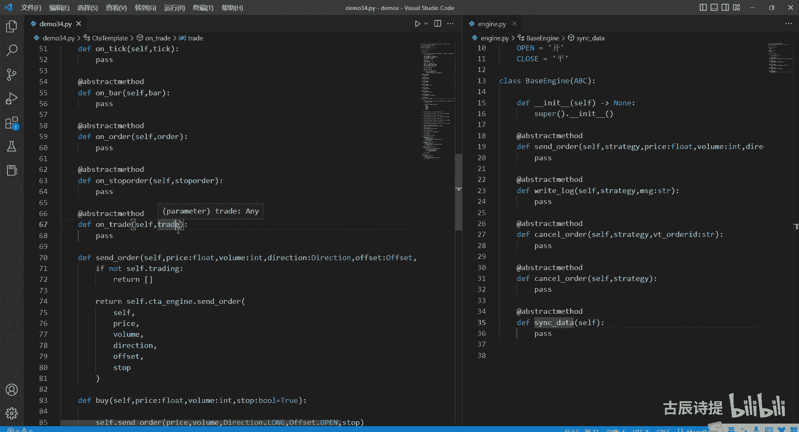

所以说on try是得去实现的，3456789。

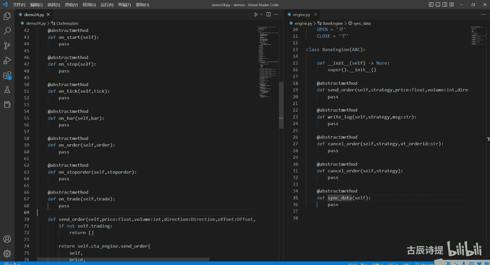

大概就是这么几个，如果还有别的，你可以继续去添加是吧。

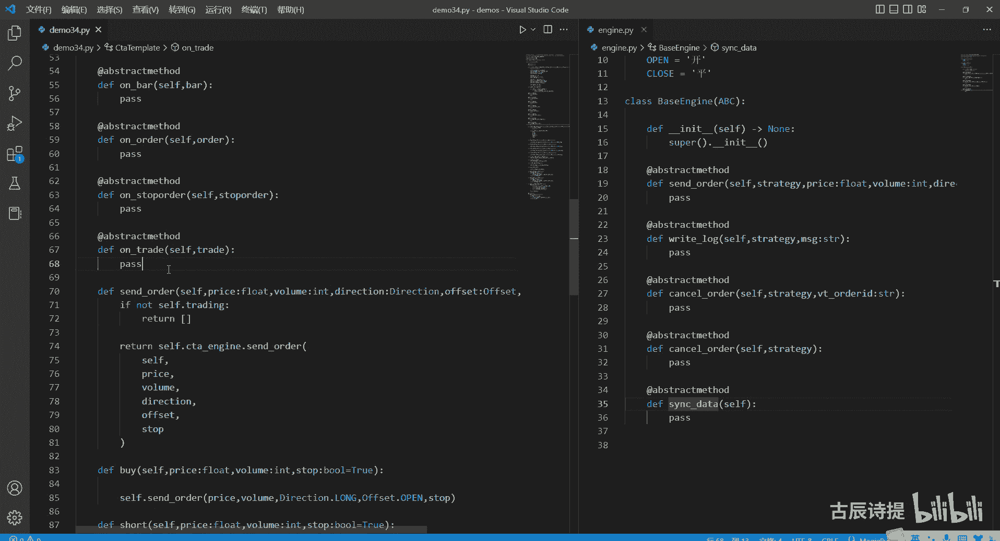

咱们看看就是说还有什么别的需要去实现的。

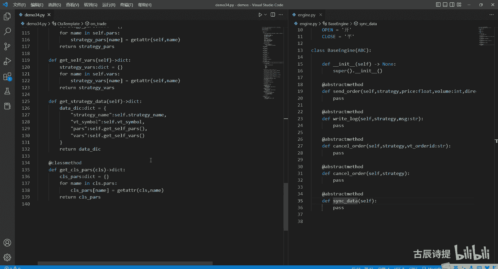

其实这呢还有一个load bar，因为你in it的时候。

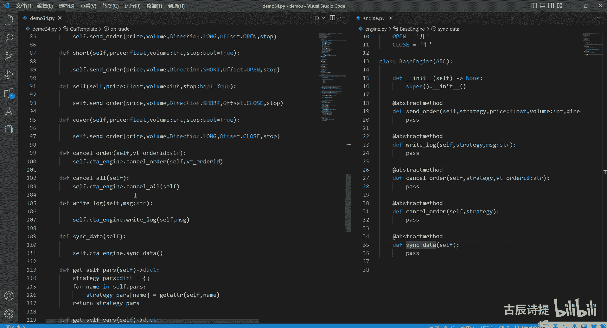

肯定需要去下载这个参考数据啊，就是调用on init。

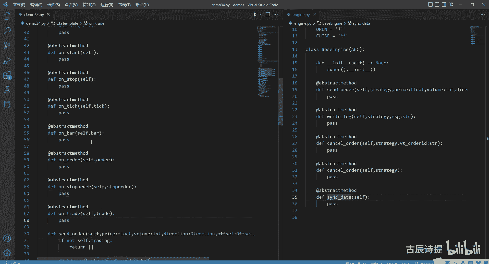

你肯定是从里面去下载这个参考数据的，这个如何去写啊，咱们可以去实现一下，捋一捋这个逻辑load吧，我这说的只是这个load，这个一分钟就是就是load8线的数据啊。

当然你也可以去实现一个load tick，在这我就不给大家去实现了，其实都一样的，你参考数据，你肯定是一个就是就是下载多少天的是吧，你没必要去传，我需要就是说呃从哪一天到哪一天呢，就是你就告诉他。

我需要下载多少天的就可以了是吧，然后你得告诉他我的这个数据类型，Interval，Interval interval。

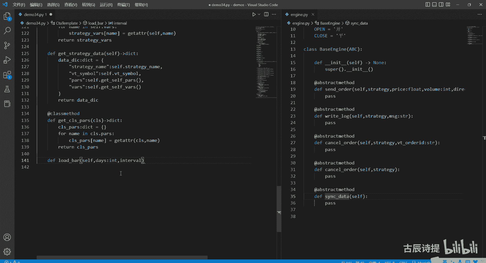

你可以定义一个这个数据类型啊，从这。

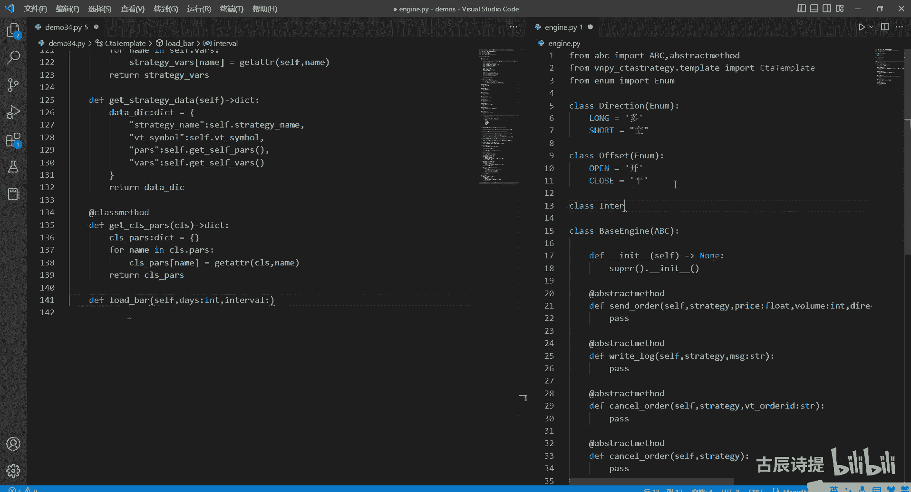

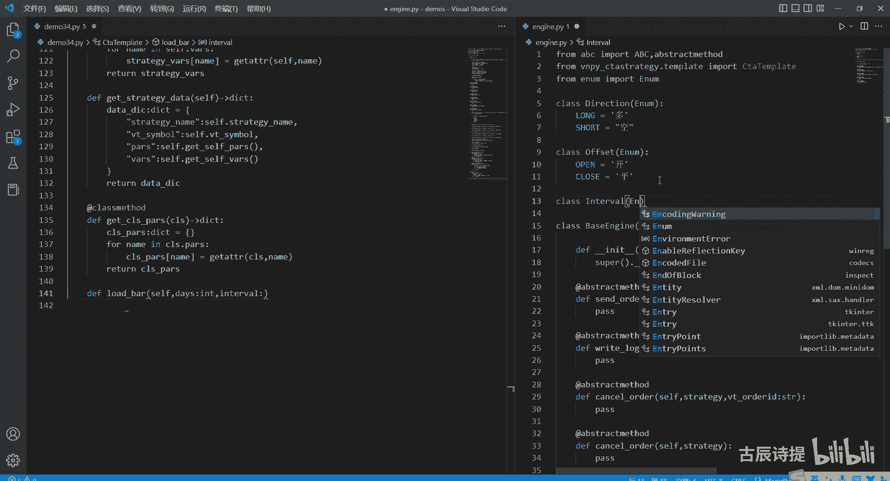

interval里面有哪些呢，比如说就是tick，就是一笔数据嘛对吧，当然你也可以直接写tick啊。

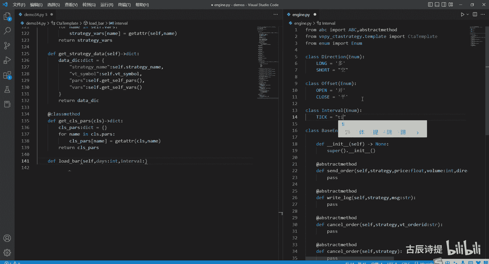

都一样啊，Tik minute mi ut。

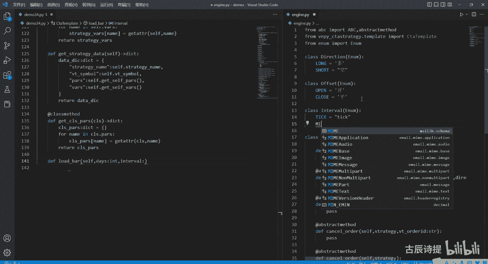

然后our，小时小时周期，还有day。

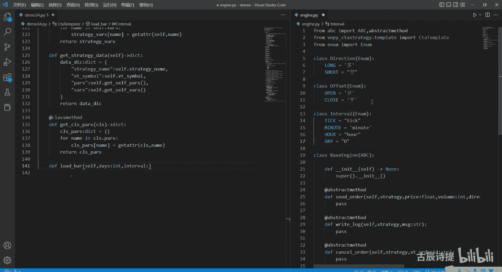

啊然后我从前面给他导入一下。

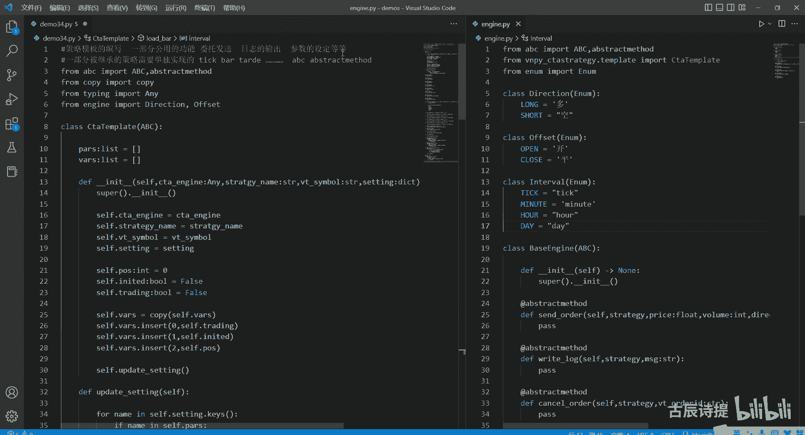

那么从这你就可以去标注一下。


然后你可以给他一个默认值，比如说我就默认就是interval min。


因为我这个是low的霸嘛，肯定是就是一般情况下就霸线，是分钟级别的对吧，当然更多的是一分钟级别，因为他是个基础嘛，你从这你也给的可以给他附附一个默认值，就是我就下载这个十天的啊。

我就下载这个十十天的这个数据，当然你还得告诉他，就是说你的这个vt simple啊，我是我是下载哪个合约的，当然后面还有什么呀，就是你可以给他再加一个是否用这个数据库，Use database。

还是我用我的这个服务的，这个服务商的这个这个数据是吧啊。


这个是一个布尔类型，啊你默认给它一个show，就是我默认就用我本地的这个数据库好。


这个你就喜欢，当然你可以把它往下，这样啊。


也不太好看，你可以挨个给他。


啊啊当然你这个下载数据，你在本地肯定是做不了的。


所以说一样的给它传到这个T引擎里边，然后low的把，data吧，Cf，然后你得告诉他是哪个实例化的策略。


需要去下载，然后把这个vt simple也告诉他。


然后告诉他days，然后搞interval。


搞use database是吧。


然后你从这需要去实现一下，Obstruct method df，Load b dcf，这个里边可以把它给你粘过来，当然你千万别忘了这边还有个strange呢啊。


这个是专辑嗯，然后你这个数据下载下来，你肯定是有这个bars给返回来的，对不对，然后他是一个list list里边放的，肯定是就是你的这个霸县的这个数据嘛。


一条一条的对吧，你返回来之后。


你应该去做什么呢，你应该就去，如果说if bus。


我应该就去毁掉我那个on b是吧，我毁掉我这个里边的这个欧霸。


所以说你这里边你还要加上一个参数啊，就是这个欧巴，就是这是一个horrible，就是CPB，就是你可以去回调的一个方法。


其实说白了就是一个函数啊，默认它等于N。


默认它等于N啊，如果说if bus啊，你从这还得写一下，If。


欧巴如果说你没有传我这个方法的话，我这个欧巴就默认等于cf点M8。


我就默认回调这个一分钟的，你也可以传，比如说你是呃30分钟的数据过来的，你可以就是在实例化里边，定一个30分钟的这个方法，然后你就可以把这个数据去直接调用，这个30分钟的。

这样就可以让你的数据更加的多元化，不一定非得是一分钟的对吧，当然它可以默认是一分钟的数据啊，on版，这个去调用就是if bus for bin bus。


就是我挨个的去把这个霸线，然后去调用这个弓吧，把这个B给他放进去啊，为什么不直接写这个，那就是为了增加它的实用性啊，你如果直接写这个的话，你欧吧，就是你从这儿就是说你必须得传一个，如果说你不传的话。

它就会出问题对吧，另外一个如果说你直接用4。58，然后后边括号里边八你就适配不了，就是说其他周期的数据了，所以说这一点你得注意了，他这个写法啊。


bus好，基本上这个就讲完了，你可以。


当然可能里面还会有一些问题，咱们看一看，就是委托单发送SORDER。


这填上了你cancel order。


其实呃cancel order，用这个except de c就是training吗。


Except training，你必须得在交易时间段之内，你才能去撤销委托对吧，当然如果说你发不了委托，你如何去撤呢啊，就是但是如果说有历史的遗留委托，就比就比如说你像那个限价单委托，它会持续一天吗。

或者说你中间那个你这个程序给断掉了，你如果说连连上之后，你从这个on order里边接收到了这个委托单的单号，你需要去撤销它啊，你就是你得判定他是不是在交易时间段之内啊，这个你也可以去加上。

这个就根据逻辑来了啊，根据逻辑来。


另外一个还要说的，一定不要忘了该传sf一定要传出去啊，好这个时候呢我可以从from。


这个engine import。


Best engine，然后我把它标注成best engine。


咱们看一看，就是SORDER。


没问题，这个cancel cancel or还有问题，这本cancel or是没有啊，这写成一样了是吧，pencil去实现一下它。


嗯可以了是吧啊，这个也没问题啊。


这样load by data是吧，就没有白色的了，那说明就是说就可以了啊。


你可以拿着这个跟咱们那个维纳的那个，t template做一下对比。


虽然基本上都是一样的，但是为什么要写一遍。


其实他算是一个呃，它和CCTA引擎和你的这个策略，就是一个中间的一个桥梁，从这个编程里边，你会发现真的是就是说面向对象很重要，就是很多东西我可以在我的这个逻辑里边，比如我这个是c t tom类型。

我可以在我这个逻辑里边先不实现，我甩给它应该实现的那个类对吧，这样的话一级一级我会很清晰，包括你必须得实现的这种多态，因为你会有很多的就是说这个引擎嘛，但是你得实现它必须的统一的功能。

这样的话我的这个就是这个模板才能起作用，对吧，他算是一个你了解了它，其实你就知道这个T引擎里边实盘引擎，回测引擎还是模拟引擎里边，需要实现哪些东西了是吧，包括你的这个实例化之后。

这个类啊里边呃呃不是实例化之后。


就是你继承了这个template，你这个里边需要去实现哪些东西啊。


这是一个整个的一个逻辑好吧，这个里边现在还缺一个什么呀，就是说在这些比如说on order啊，On stop order，on trader啊，这个里边我没有去实现他的，这个就是就是就是这个标注。

这个标注呢我没写啊，这是为什么呢，就是因为呃我需要跟大家引入一个。


咱们的这个另外的一个就是库。


引入一个库就是from data classes，Import data class。


还有一个field，这个库是干什么的，咱们看这个库名就是data classes，其实就是数据类。


它是来管理数据的，因为咱们这个里边不管是tick也好啊，还是by也好啊，它都是属于这个数据嘛，你不可能说用一个字典来传，就是类似于这样的是吧，然后里边传就是last surprise啊。

然后等于比如说5000点，然后里边还有好多好多高开低收，听课里边就更多了，还要买一家卖一架呀什么的是吧，还有涨跌停价什么的就更麻烦了，你这么去存储你这个数据来传递，你调用的时候会很麻烦，很麻烦。

是不是因为你都得通过字典去获取嘛，当然也会有一些别的方式，比如说说server collections import，这个name chopper就是元组命名的元祖，你可以实现像类那样去点。

就是比如说P点什么去调用，但是它适合就是说比较呃也不是特别方便吧，会有很多的问题，有兴趣的可以去搜一下，这就引进这个咱们的这个就是data class is这个类，这个类咱们可以先给大家演示一下啊。

比如说我爸，我把data啊不能是这样CR，这是我我定义我定义了一个就是我8data类，正常咱们写就是杠杠INIT是吧，然后里边需要传入的你的这个参数，比如说我这个呃which it simple啊。

就是不是就是simple合约是吧，然后X千G啊，C h exchange，还有你的这个last price啊，然后你的这个呃hi open等等等等，你需要插入很多，然后你从这去对它进行赋值对吧。

然后你这样就显得就是他说会比较麻烦，不是那么特别的方便，虽然你最终也能够通过这个呃霸，就是比如说我实例化，它用一个点去调用，但是不是很方便，这个就是data classes呢。

它其实就是来解决这个问题的，你只要装上一，就是加上一个装饰器，你就可以直接从这儿去写，写他的就是相当于是类属性啊，但是它会有一个语法糖给你自动去实现，你的构造函数就是杠杠INIT，然后你直接写。

比如说我的这个simple，等于啊你可以都不写，等于就是你给它必须得标注一个类型，你你不标注类型是有问题的啊，你给他标注一个类型simple，比如说我就是呃STR格式的，然后我exchange。

exchange g exchange exchange解，当然你得把它的这个类型呃也从这写一下，我从这为了简单，我还是写STR格式的啊，exchange接啊，有这个呃。

last price就是上一笔的这个成交价，是吧，就是float啊，然后open再写一个open吧，open然后float你这样去写，就是它会很方便，然后你再去赋值的时候，你可以比如说八等于8data。

然后直接可以去传入我的这个simple，比如说RB205，然后exchange就给它传入SHF1，然后last price就给它传入，比如说5000啊，open5000啊，这样就就可以了。

这个时候你就可以把点open，就直接可以这么去调用，而且它还支持嵌套，就比如我再写一个，就是说别的数据，我也可以把它直接这这个，写成这个数据的这个类型，它还可以写默就是默认值，比如说默认等于NN值。

你这可以就不传是吧，它也可以从里边去实现一个方法，比如说叫它叫pos p s TP s t post in it，应该是这个消音下划线post，下完下划线还是一个POSTNT，应该是这样的。

中间应该是一个空格，这样put it这个方法它可以直接定义你，比如说我的这个有symbol，有exchange，然后我svt simple，我就直接给他可以连一下吧，这样就是simple啊。

这个得下点simple，然后这加个点，然后这写上cf点，Vt simple，cf点exchange啊，这个时候你给它赋完值之后，咱们可以可以查看一下。


print一下八点呃，这个杠杠dict吧。


你会发现这个里边的属性simple exchange，Last price open，连vt simple都有了啊，就是我如果有两个数据去合成一个数据，你可以写这个方法。

posting it会比较方便啊，这个是用来做数据管理的，其实是它的一个呃，还有一个就是就是field field是来做什么的，就是当你里边需要存放，比如说VT的id，它是一个list u s t。


如果说你定义的话，你定义成这样啊，它会有问题，它会报错的，比如说我把这个给打开是吧，它会报错的，他就告诉你，就是说呃需要用这个default factory，这是什么意思呢。

其实你这个list这个数据类型，它是可变数据类型是吧，你像这个float string是不可变数据类型，Python的六大基础数据类型里边像像字典，像列表，像top呃，都是可变的嘛，像这个字符串啊。

int类型啊，flag类型啊，它它都是不可变的，所以它这个可变与不可变，并不是说我给它复制成一个变量，你看我这个变量可以重新赋值，它其实底层意思你可以这么理解，比如说我呃一个变量A等于100。

我把这个100它是放在一个内存地址里边的，当然如果说你这个变量可以重新去复制对吧。


你可以把这个，比如这个内存地址指向一个变量名，比如说这个是A，你可以把这个变量重新去复制成一个新的，但是它会创建一块新的内存地址，所以说它是不可变的，因为这个单独的这个唯一的地地址。

它是不可以在里面做更改的，当然这个list它是可以做更改的，所以说它里边有append是吧，包括删除啊，包括remove啊是吧。


都会有，所以说它是一个可变的类型，可变的类型，你从这儿呢你就要写这个field。


然后里边default factory。


我等于一个list啊，这样他就不会有问题了啊，他就不会有问题了，它会有一个呃这个空列表是吧，空列表放在里边，然后你这个列表里边你可以给它添加东西，比如说把加这个v ta dd pd，我添加一个。

比如说你这个时候你再输出一下，这里边就有东西了啊，这叫data class啊，data class一般现在用数据管理，基本上都会用这个data这个data class is呃。

这个时候你就可以把所有的这个把data order data啊，进行这种定义，包括这里边还可以他自己形成方法是吧，也也都可以往里边去写，比如说我这个把data或者我这个order data里边。

我创建一个符合底层需求的这个委托请求啊，通过这个我old data就可以去直接去实现。


然后你可以直接从bar这去调用啊，会非常的方便好吧。

