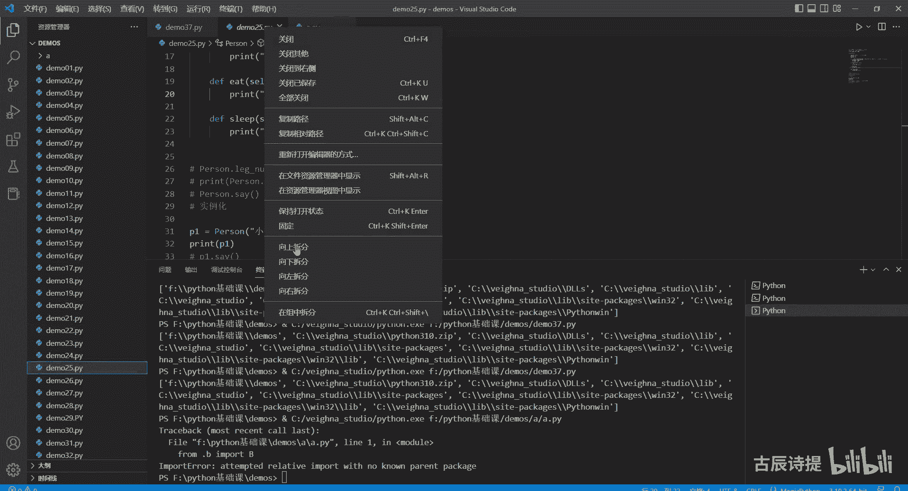
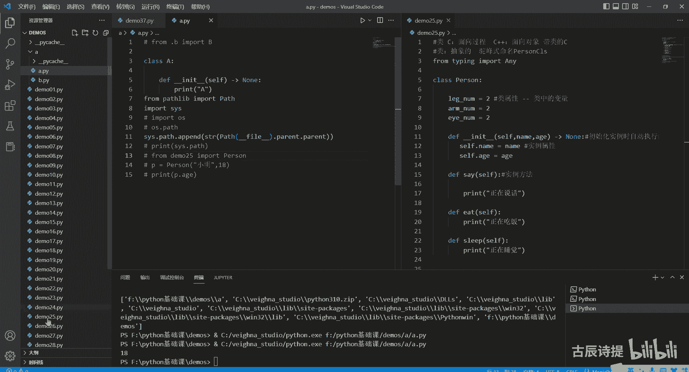
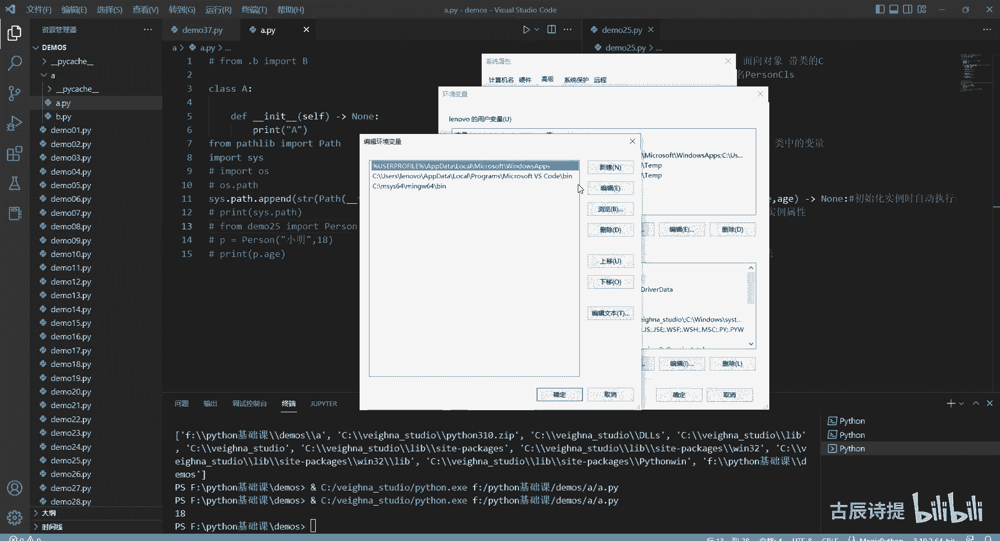
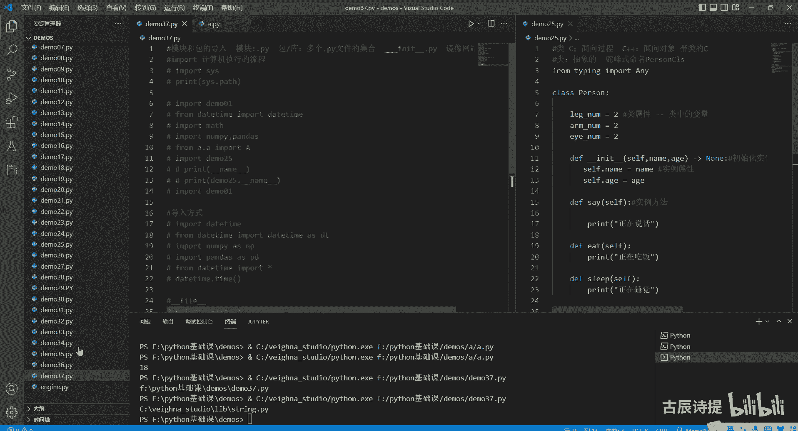
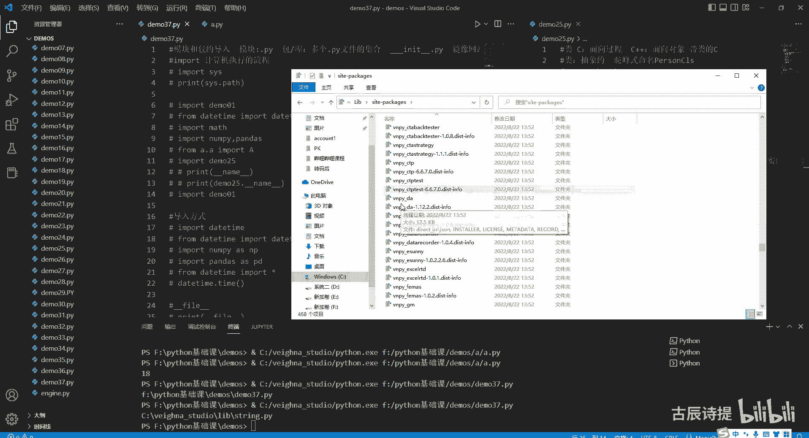
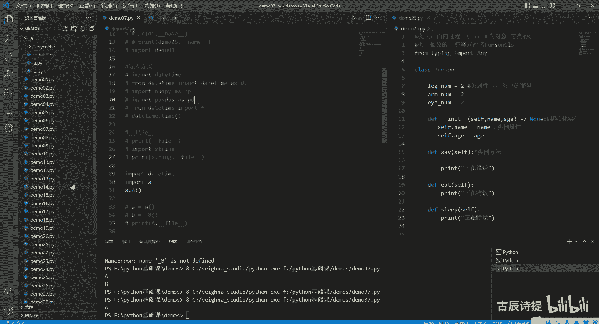

# 第37节课 模块导入 - P1 - 古辰诗提 - BV1Ux4y127Jb

欢迎大家来到从零开始量化系列课程，Python基础课的第37课，这节课咱们讲一下模块和包的导入，咱们在写代码的时候，尤其是在写量化的时候，最先做的事肯定就是导入模块啊，就是导入各种各样的数据类型，对吧。

呃一般情况下不会出现什么问题，但是如果说你自己去完成一个，哪怕是一个比较小的项目，需要写多个文件夹，尤其是文件夹里面涵盖文件夹，需要去来回去导包的时候，可能会发生一些导入的错误，这时候就会很恼涨。

因为咱们经常用的这个出现的错误，你就更不知道它的问题在哪了，所以说这节课给大家讲一下，在讲之前呢，首先跟大家说说一下这个模块和包的这个定义，模块模块呢，你可以直接把它理解为就是点PY文件。

比如说我们导入一个模块，import demo01是吧，其实就是把这个文件导入进来了啊，就是模块就会把它理解为点PY文件，包呢包或者库，你可以把它理解为多个点PY文件的集合，当然也可以不是点PY文件。

或者比如说你用这个C语言写成的是吧，嗯或者C加加写写成的，但是它就是多个模块的一个集合，同时里边实现了下划线下划线一列特点，PY这样的一个文件，哪怕这个文件是空的，这个解释器会也会默认它是一个包啊。

然后这个酷啊，就是咱们经常会听说的，就是说呃三方库啊，包括一些咱们用到的内置库啊，或者标准库啊，它都是什么区别啊，内置库，比如说你像int它是一个内置的一个类型对吧，你也可以把它理解为是内置的库。

你不需要去import导入的，然后标准库比如说咱们用到的from the time，The time，import the time是吧，这个就是一个内置库。

就是Python在安装的时候也不需要你进行手动安装，然后他就会给你自带的这样的库，包括import这个max，它也是内置库啊，当然内置库还有很多，你可以百度一下查看，就是Python内置库的一些列表。

还有呢就是三方库，比如说non pie，import一个non pie是吧，或者pandas，这个呢是三方库，三方库不是内置的，现在能导入，是因为安装好了，或者你在安装维纳这个就是量化框架的时候。

他已经给你安装好了这些三方库了，如果说你没有安装好的话，你是调用不到的，你需要去安装一下，就是pip install，这个就是安装，然后加上这个库名，比如说NPD回车就可以了，呃一般情况下。

这样的方式呢，是到这个国外的原网站上去下载安装包，然后再进行安装，速度会比较慢一点，后面你可以加个杠I，然后加上一个网址，国内也有镜像网址，镜像网址你只要去百度一下，去搜一下，就是镜像网址。

就是Python，就是呃镜像安装网址，它会给你一个很多的网站，比如豆瓣的呀，比如清华的呀，或者哪儿的，然后你只要把那个链接就是放在后边，它会相对的速度会比较快一点啊，这个咱们不具体讲好吧。

嗯好这个是一个简单的介绍，了解了模块和包的区别之后，咱们再讲一下导入的，导入这个动作就是引入或者import，就是计算机或者解释器，计算机执行的流程，这个是比较重要的，当你知道它的执行流程之后。

当出现一些问题的时候，你就知道他为什么会有这样的问题，就比如说举个简单例子，我从这我新建一个文件叫A，然后呢我新建一个文件夹，我从文件夹下面呢写入这个一个也写个A点，PY就是PY文件啊。

然后我再新建一个B点PY，B点PY，然后我从这个A里边呢，我定义一个class，一个也就是A吧，然后小文小文in it，In it，然后就print一个A1个大写的A，好好这样就可以了。

我同样的我定义一个B，然后我就给他一个构造函数INIT，然后print一个B，好我这样的两个文件，我这个时候呢我从这个这我导入一下from b import，这个B这个没有问题吧。

你去执行起来肯定是没有错误的对吧，但是我如果从demo37里边from a点b import，比A点b import啊不行，应该是A点AA点A，然后import a咱们再来运行一下，你会发现它就报错了。

报错的点在哪呢，就是from b import b，就是这个呃这个文件里边from b import b，它就出现问题了，但是你实际上从这运行的时候，他是没有问题的对吧，那这个原因在哪呢。

这个就是导包的一个错误，他会呃model not found error，会给你报这个包，找不着的这个模块，找不着的这个问题啊，这个你就需要了解计算机执行的，它这个流程是什么，执行流程呢。

就是咱们一开始也说过计算机，它不是说就是那么智能的，他很多的，比如你点个查看呀什么的，他这些东西都是别人给你设定好了的是吧，别人开发好的软件，每一个步骤都是在人家考虑范围之内的。

当然你import你写下这个代码，他也是就是会有一个固定的执行流程，执行流程是什么呢，他会去某一个地方去找到路径，然后去这个路径下面这个文件夹里边去找这个，你需要import的这个模块名或者包名。

找到了就给你返回这个模块，然后并进行加载，其实就是加载到你的这个当前内存里边去，如果说没有找到的话，它就会报错，他是这样的一个流程，首先第一步它是得找模块，它是根据一个路径或者多个路径来找的。

这个路径是什么呢，咱们需要import一下一个s y s system，它的路径就是print s y s点pass，它是它会根据这个计算机的路径，也就是这个列表有点乱啊。

会根据这个列表去挨个的路径下面去找去，就在路径就是这层里边，就是demons里边，你看他第一个就是demons对吧，他会下面来找，如果说你有demo01诶，他就给你把demo01给你返回来。

然后并加载进当前的内存里边来，如果第一个没有，他就去第二个找，然后去第三个找，如果都没有的话，他就会报错，这个是它的一个流程，是它的一个流程，然后这个就为什么说咱们在写代码，尤其是刚学的时候很容易。

比如说我今天学了一个that time，然后我就在这写了个DETA点PY，当你在导播的时候，我需要from the time，The time，他就会优先找第一个。

你当前这个执行文件的这个文件夹里边去找，然后卡给找着了，所以说他就不会再往后去找你的这个，你所需导入的这个the time了，所以说就会产生问题，这就是为什么让你命名的时候一定要注意对吧。

这就是原因就是在导入的时候它会被覆盖掉，这个一定要记住它是从这个里边来找的，而且是根据你的执行文件来的，就是你从哪运行来的，其实刚才那个错误，就是因为什么我在导入的时候，就是刚才是什么呀，A是吧。

然后有个B，然后我在等我在运行这个A的时候，我运行它，它from b取import这个大B，这个是没有问题的，因为他当前的文件夹是在A，他能从A里面找到B，对不对，因为他是执行文件吗，他是主文件。

它是运行文件，它就能找到B，所以说没有报错，但是我到这儿来执行的时候，这样来执行的时候，from a点a import a，我去把这个，首先我从A点A我是能找到这个A的。

然后import a把这个里边的文件加载进来，但是加载进来的时候，它这里边有了一个什么呀，就是从b import b，那你从b input b，因为我执行的是这个demo37的这个PY文件。

他的这个第一个是也就是这个demons，但是你这个demons里边要去执行b import b，你就找不着这个B对吧，因为这个B是在A的文件夹下面的，你一定要把这个逻辑捋清楚了好吧。

这个时候如果说你把它加一个点，比点是代表什么呀，点是代表着它上一级，你两个点是代表着再上一级对吧，你加上一个点B，然后去input b，这个时候你从这就它就不会出现问题的，它就不会出现问题的。

因为什么呀，我就是把这个A加载进来的时候，我通过点B也就是我这个这个这个demons点A，然后点B为什么呢，因为它点表示它的上一级的上一级是A嘛，对不对，然后就是它运行的时候。

它运行这个的时候其实就是A，然后就是这个demons a，然后点B它就能找到这个B文件夹啊，B文件了，能理解这个意思吗，你要加上一个点，从这儿是不会报错的，但是你从这来直接运行它的时候，它会报错的。

因为你点B代表它的就是这个上一集，上一集它就识别不了了，因为上一集他就没有这个B这个文件了，能理解这个意思吗，就是跟A同级的目录，因为点就是它的上一级就是A嘛，跟A同级的目录里面没有B啊。

一定要理解这个啊，当然就算是有他也导入不进来，这个就涉及到就是说呃，一些就是说别的问题了啊，别的问题了，所以说这个就是问题所在，你得知道它的执行流程，他找到找到这个文件之后，比如说在这个demo里边。

他找到了这个文件，比如说是这个啊零一他找到之后，他做什么呢，他做的其实就是把这个demo，零一加载到内存里边去，说直白一点，用大白话说，他其实就是执行了一遍demo01为什么这么说。

比如说我挑一个25向右拆分。

把这清空一下，从这个文件我没有去运行它，但是它后面有个实例化，Person print p，Print p，然后呢，我从这儿去导入一下，我这个先等会啊，我从这去导入一下import，Demo25。

然后我只是导入了一下这个demo25，咱们运行一下，你会发现它有demo25点object，at它是在一个内存里边，它有这个object，但是我这什么都没执行，他这却运行了。

他就是证明它把它加载了一遍啊，加载了一遍，那怎么避免这个问题呢，就是你从这加上if，下文下文件man，等于等于下一下关键内，把它加一个判定条件，这个时候他就不会去执行的。

为什么咱们可以print一下下文下文献name，从这print这个name你可以理解为就是model name，你也可以理解为就是print什么呀，就是比如说你想别的这个model，你想二二十五。

它是个模块啊，你要输入他的这个model，输出就是他的这个model就是下文下划线name啊，你直接这么校园校园内就是输入当前这个model name。

咱们看一下当前这个model name是校园下文件man对吧，但是被我导入进来的这个模块，它的这个模块它的这个名字是demo25，就是这个名字嘛，对不对，所以说他进到这来运行的时候，它会进行判定。

因为在他这这个name它是25啊，Demo25，然后呢这个它不等于这个下划线外卖，所以说它下面就不会去执行了啊，下面就不会去执行了啊，这是它的一个逻辑，另外呢你在导入的时候，Import demo25。

咱们先看一下，这它会有一个这个PY啊这样的一个文件夹，然后下面有demo25点c Python，然后后边就以这个PYC为结尾的，这样的一个文件，这是一个二进制文件，它有什么作用呢，就是你在导入的时候。

它会生成一个这样的文件，然后别人再导入这个包的时候，它可以加快速度，就直接把这个就返回回去了，能理解这个意思吗，比如说我import demo01，我运行一下，你看就有了吧，Demo01。

这就充分说明了它其实就是执行了一遍，你这个模块代码说高大上一点，就是把它加载进内存里边好吧，一定要了解这个流程，要了解这个流程，好流程说完了，咱们开始说具体的方式了，导入方式是吧。

导入方式一般说的是三种，第一个就是直接import import the time，第二种是from the time，Import your deta，然后第三种是from the time。

星号是吧，当然你从这里还是给可以给他写一个简写，比如说SDT，咱们以前都习惯from n啊，对就是这个import non pie s n p，那import pandas as pd是吧。

这个后边可以添加这个，然后作为这个模块的它的一个简写啊，作为它的一个简写，你后边就直接可以用这个简写，来替代这个模块了啊，这个是导入的方式推荐啊，用不推荐用这个就是剩下的你可以去进行使用。

因为你把这个全部导入进来之后，就是会加载很多的东西，这样的话速度会讲的很慢，另外一个就是说你不知道你的有没有重名，对不对，就是咱们在命名的时候可以的，就是导入模块，你在这个就是最大的好处是什么。

就是我这个里边我的变量名和这个里边变呃，这个变量名可以重合，但是你从这给导入进来了，这就很麻烦了对吧，就是因为你调用的时候就可以，直接就是那么去调用啊，比如说我就直接调用这个time了。

就是如果说你这里边定义了一个塔，它就会产生冲突啊，如果说你这样的，比如import time，这样import进来，你前面必须得加上模块名，你才能调用这个time啊，你才能调用这个time。

当然这个是不是里边是有这个，把它都给注释一下，你必须得加上这个模块名，你才能调用这个time对吧，这样的话不会跟当前或者别的文件里边的，这个同样的这个变量名产生冲突啊，推荐啊，你不使用这样的一个方式啊。

前面的都可以啊，前面的都可以好，这是导入的方式，导入方式讲完之后，咱们就回到之前那个内容，就是如果说我想从这个就是这个这就是去导入，比如说我从这儿这个文件里边，我想导入，比如说demon25。

就是导入我的demo25，我如何去导入，咱们之前说过，你从这加一个点，它会识别为它的一个就是负极目录对吧，但是你可能会想，比如说我从这导入，我从这儿吧，from点一个点代表了是这个A文件夹是吧。

我再加一个点就代表着这个demo了，哎我到demo我就可以去找这个demo25了是吧，然后import这个person了，这个ID能给你识别出来，因为这两个点就其实就是代表这个demons。

它的上两级demo25去，但是实际上它是导入不了的啊，这样的方式是不可以的，是不可以的，尽量也少用类似于这种两个点的这样的方式，你可以一个点一个点，就是你倒就是点B时候导入对吧。

他就是说你当前运行的时候啊，这可能是这样运行的这个问题啊，这样导入你看这个是有问题的啊，这个是有问题，之前报错可能是报到这，因为我当前文件来运行的话，我应该把这个给点儿给删掉，刚才反复说过这个问题对吧。

你你像这样也是有问题的，如果说我就想从这个文件里边去导入到，我这个demo25，需要如何去操作呢，其实也很简单，就是按照咱们这里边讲的，他这个流程，它流程既然去我那个SYS点pass里边。

就这个里边找找不着我这个A这个目录啊，不是找不着我这个demons这个目录，那我是不是可以把这个目录直接给它添加进去，这样不就可以了吗，我都不用点点了，我就是直接from这个demo25。

import这个person对吧，这个时候是报错的，那我怎么来操作呢，啊我可以怎么来操作，Import from passleep，import一个pass，当然我这写的不规范啊。

按说你所有的import应该是在顶部来写的啊，然后这个pass里边也是一个三方，也是一个标准库，然后这里边pass就是来一般是做这个路径处理的，以前都是用这个什么import os。

然后用OS点pass来操来操作，但是现在这个PASSLEEP其实更加的方便啊，有兴趣的可以去研究研究，或者等我这个就是这些三方库，或者就是一些其他模块的课程出来之后，可以听一听。

我先得获取这个demons对吧，就是这个目录路这个路径嘛，或者这个就是就是他的这个这个，这个整个的这个绝对路径，我怎么来获取呢，就是用pass笑一笑，好像fire这个fire是代表着什么呢。

pass fire是代表着当前这个点PY文件的，这个文件路径，咱们可以看一下print，这个我先注释一下，不然会报错的是当前这个A点PY对吧，然后他的这个上一级目录是A，我就点parent。

就是它的负极目录，它就会是A，然后我要找demons，就点parent，它可以进行链式调用，这个时候就有这个demons了，对不对，然后我有这个demo之后呢，我把它添加到我这个SYS里面。

import s y s就是soy s点pass里边啊，SOS点pass点IPAD，它是一个列表对吧，你添加这个不行，它的类型是这个pass是这个类型，所以说你要把它转成字符串的类型，我添加进去。

这个时候我可以print一下这个SYS点pass，你可以看一下，它就会添加进去了啊，这个A啊，包括这个他在最后呢对吧，基础课DEON就它就放进去了，放进去之后呢，我这个时候再来，我把它给注释掉。

我from demo25，Import person，它就没有问题了，它就没有问题了，咱们可以就是就是实例化一下是吧，他是不是还得传一个名字和A姐，我就不实例化了啊，这肯定是可以的，是要把实例化一下吧。

小明A1下是吧，然后print p点对吧，这个是肯定是没有问题的，你就通过这种方式给他从这个路径里边，这个XYS点pass里面，临时去添加我需要的这个路径，当然了，你也可以从这个咱们之前应该是讲过。

有没有讲过，就是从这个哎呀，等会啊。

从这个环境变量里边编辑环境变量，然后环境变量里边儿这个是用户的变量设置，这个是系统的变量设置，你可以从pass里边把这个路径给它添加进去。

这个我就不演示了，也不推荐大家这么做，因为你这么做了，写呃，比如说你今天写了一个添加进去，明写了一个问题，我添加进去了，命名你在是都命就命名成一样的，都命名成这个demo，到时候就乱套了，对吧啊。

不推荐大家那么去做，当然你非要从这个它的这个文件里面，导入到它的上层，就是说文件，然后你就用这种方式就可以了，好吧好，这个是啊，这个如何从这个里边儿往，就是导入它上上层的这样的文件，好这个讲完了。

其实导入这一块需要注意的事项，最大的坑已经给大家讲了，其实别的也没什么，就是说要讲的了，下面给大家讲一下，就是经常用到的，就是说他的这种跟路径相关的，就是这种方法吧，第一个就是刚刚fire。

这个刚刚发呀，咱们可以直接print一下啊，刚刚发呀，它其实就是代表着你当前这个文件的路径是吧，demo37啊，你也可以，比如说我一个，A s t r i n g string。

然后print一个string，点下划线下划线下fire啊，他也可以给你直接输出这个你的这个呃，这个模块的，它的这个路径是在这个维纳studio lib string，这个点PY文件里面啊。

这个忘了说了，就是大部分的这个三方库，不是大部分，一般的这个库都是安装在这个这个列表，然后下面有个site package，Site packages lib。

就是一般比如这个C盘，维纳下面一般都是这个立本，然后有个site packages，然后这个里边都是安装的，用到的一些三方库，基本上都是安装在这个里面的啊是吧，包括维纳一些集成的东西。

也都全放在这个里边的。

是以VMPY开头的，这个是一个，另外这个要说一下啊，不是所有的这个你导入进来的模块，都会都可以去实现这个小外小文件fire的，只有这个模块它实现了这个功能，你才能返回，好吧。

这个我相信你学过那个咱们前几节课，这个魔魔术方法你都会知道，就是说呃哪怕是你一个字符串去调用，比如说A等于这一个字符串，你A点各种各样的方法，其实是STR这个类是吧。

这个父类它给实现了好多的方法在里边写的啊，我相信你这个能理解，如果说你想你写的这个也能够去实现，比如下完下完fire，我就从这个A文件里边去给大家演示一下，比如就是这个A类，我想实现下划线。

下划线fire无非就是最简单的方法是什么呢，从这我类属性，这就是校园校园，像fire等于下往下往下翻呀，这个能理解吗，就是说前面这个是类变量，它叫小圆，小圆发芽，然后我这个呢是当前的这个呃。

文件所在的这个目录就是给它赋值了，然后我就直接可以啊，from a点a import大A，然后print大A点下下下，是吧，这就可以了，这个就算是实现了，当然你要是用魔术方法来实现的话，你该怎么去实现。

咱们之前讲过，你首先把它实现一下啊，你把它定义成一个哎，你把它定义成一个先定义成一个，就是那个私有方法对吧，私有方法return一个就是向往向往下翻，私有方法是用是用什么来定义的。

就是at property来定义它，它就会从这个呃黄色的变成这个蓝色的，我这个是这个解释器，可能文件太多了，它加载起来有点慢，而且是用的这个笔记本给大家录录的，所以说它会有点慢啊。

你看他这个时候就没有了，它就会变成这个蓝色的对吧，所以说这个时候我在来输出的时候，但是你得先实例化，你得先把它实例化了，因为它是实例化之后的一个属性，实例属性，你这个直接调用它会调不出来。

你必须得什么A等于A等于大于大爷，实例化它，然后我来调用A的这个fire，你会发现它就有了，对不对，它就有了如何就是像这样的方式来调用呢，你可以再给它加一个类属性，因为你要把它变成类属性嘛是吧。

类属性这个装饰器是class method的，我给它装饰一下对吧，然后这个时候我再来进行一个调用，我就不用去实例化它了，然后直接调用这个大A点fire，咱们可以去运行一下，你看这就有了吧。

虽然你前面这些内容都学过了，装饰器也学过了吧，这个类方法和私有属性都学过吧，但是你能自己把它写出来吗，啊这个就是你如何去运用的问题了，好吧，这就讲多了，主要是讲这个下文下文件fire的啊。

后边需要跟大家讲的一个就是下完下完下or呃，先讲下文下文doc吧，这以前跟大家提过这个相关相关DOC，它是做什么用的呀，其实就是如果说你有说明文档啊，就是这样，比如说这是一个测试的类。

我如果说我不知道他是个什么东西的话，我可以先，print一下这个大A点校园下线doc，我看一下他就会这是一个测试的类啊，这是一个也算是魔术，也算是魔术方法吧，再讲一个跟咱们导入相关的。

就是or想问下or呢，你是如何要取呃，实现它呢，我从这儿啊，我再写一个s class，比如说我就写个B，然后DEF消一下关键INIT，CRC怎么变成delete了，然后print一个B是吧。

我定义了这个两个类，如果说我从这儿写一下下文，下文二等于它一般是个列表啊，只写一个A然后呢我从这儿呢，我不我不导入A了，我import一个新号，这个时候我可以比如说A调一下A，然后B等于调用下一个B。

你会发现它会报错的，你会发现它会报错的啊是吧，B is not defined，但是你如果说直接把A和B，你给导入进来也是可以的，他他就不会报错了，他这个只针对你这样导入导入信号的时候。

他会把B给屏蔽掉，当然你如果说直接把他写成一个下划线B，它也会导入不到啊，这个信号它也会导入不到，他也会额就是应该是下划线比是吧，嗯一一样的，Is not defined，这个跟类里边很像。

这就像类里边那个私有属性对吧，想但是呢你如果是直接导入一个A1个下划线，B嗯，他这个也是可以的，也是可以的啊，这就是下文下文or最后跟大家说一下，这个多个就是说这个PY文件变成一个包。

一般在这个里面会定一个相关文件，Init d py，这个里边一般是做什么做啊，就是当你在比如说我当没有这个unit的时候，删除它的时候，我从这儿我直接import a，import a然后咱们看一下啊。

它运行没有问题，但是你import这个A之后，你你调用A点什么呀，A点A点大A是吧，A点大A这个显然是是是行不通的，你再调用A点A点打A这样来调对不对。

如果说你想就跟呃比如说这个import daytime似的，这样daytime，然后呢你直接能调用a daytime，点the time，这样的方式就是说我导入这个包名。

然后我就把里边的东西给导入进来了，这样的话你必须得加上一个，当然一般情况下都建议大家把这个INIT，int点PY给实现出来啊，实验出来了，你可以从这个比如说from a import什么呀。

import大A啊，这你要记住是点A对吧，你从这运行的时候会出问题，没有点从这运行的时候不会出问题，但是你真正的导包的时候，它会出问题的，所以说你这要加上点A啊，然后呢我直接导入的时候我就可以啊。

就是from a import a对吧，这样的话你就省了点，再点一个A了啊，这个就是包包的导入好吧，你也可以呃，Import a，然后A点A对吧，去实例化一下，去实例化一下。

这个运行肯定是没有问题的好吧。

