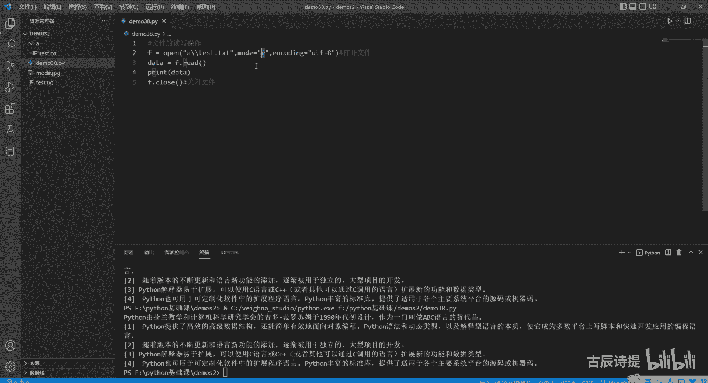
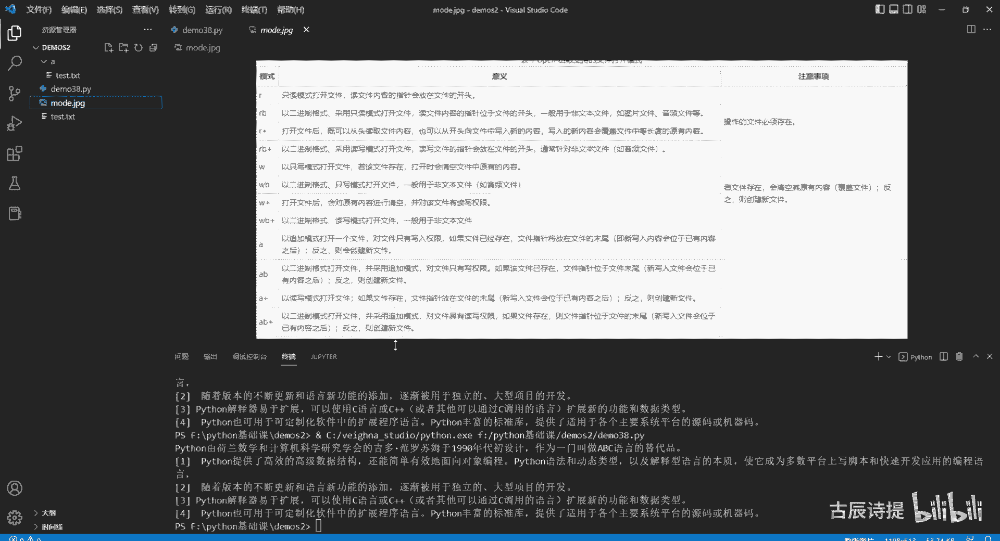
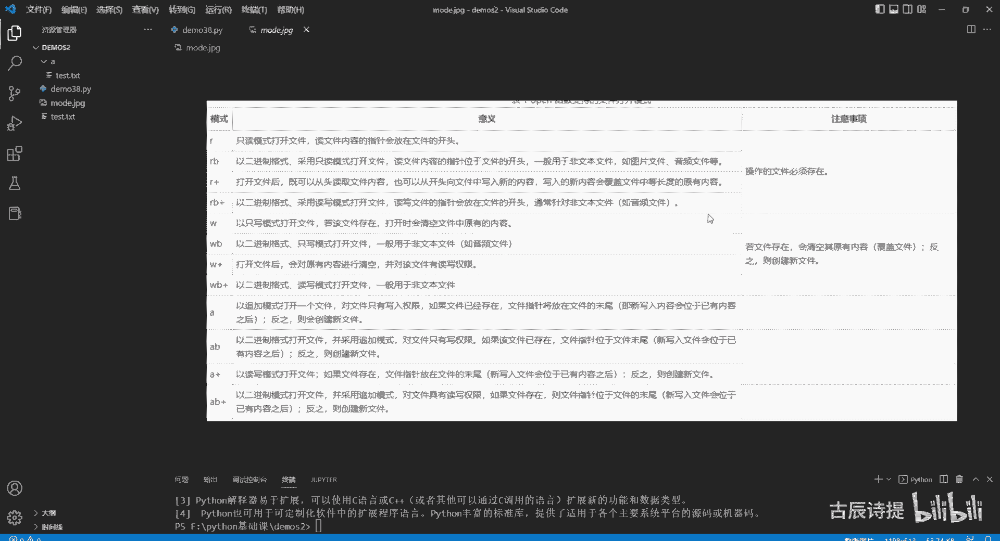
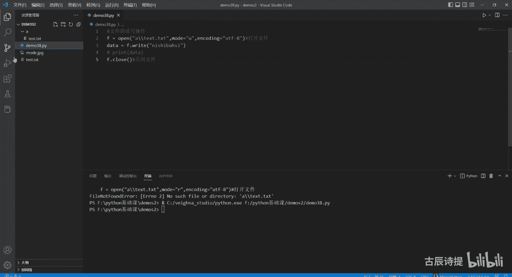
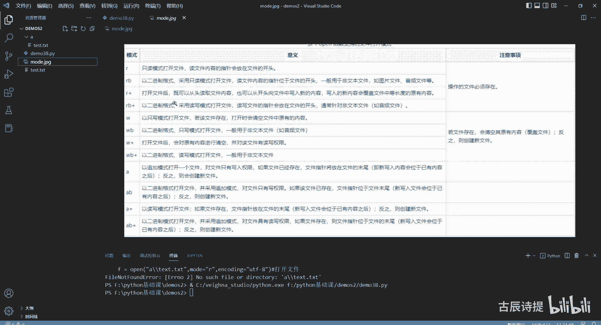
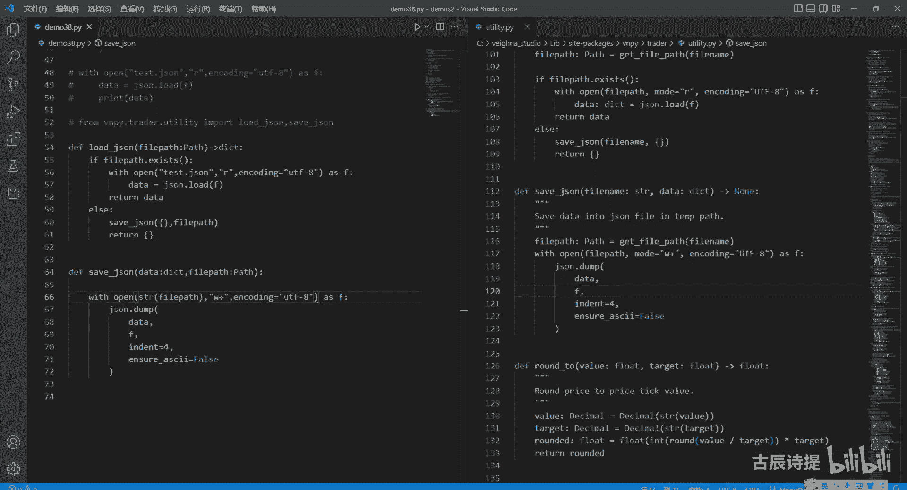

# 第38节课 文件的读写操作 - P1 - 古辰诗提 - BV1ZD421L7vk

欢迎大家来到从零开始量化系列课程，Python基础课的第38课，这节课咱们讲一下这个文件的读写操作，这个内容肯定是在咱们写代码的时候，会经常用到的，去读一些内容，去写一些内容对吧。

因为它用作这个持久化存储嘛，因为在你程序运行过程中，你的内存是有一部分是分配给你的程序的，你的变量也好啊，或者你里面存储的东西也好，它会存在，但是一旦程序运行结束，那你的这个东西就丢失掉了。

所以说你需要把它存储到D盘，E盘F盘对吧，包括咱们量化里边也会用到，因为柜台会中断，你的程序不会一直在运行，尤其是下午三点以后或者晚上02：30以后，你需要把一些变量或者一些参数。

以及你的持仓情况保存到本地来，第二天早上或者当天晚上在开盘的时候，你再把它给读取出来对吧，那这个操作这个读写的这个操作怎么去写啊，首先你需要一个F等于open打开一个文件。

比如说我这有一个test这个文件就是点TXT的，这个文件，你需要把它以字符串的格式就是TXTTXT啊，写进去，一定要把后缀也给加上，然后第二个它的这个参数呢是mod，这个呢咱们先写个R。

一会给大家具体解释，R的意思呢就是只读的意思，就是只可以去读，第三个呢你必须得写的是encoding，就是这个编码格式对吧，一个encode decode，所以说你这要写上UTF8。

好这个打开的这个文件呢，它作为一个对象赋值给了这个变量F，这个时候你可以对F进行操作，比如F点read，因为它是只读模式，读取这个数据之后把它赋值给data，然后我再print把data输入出来。

然后一定要记得把close给关掉，这时候咱们去运行一下，你会发现就是就有内容了，然后这个里面存放的是Python，就是一个介绍，基本上就是读写操作都是这几个步骤，第一步是打开嗯文件。

当然这个文件可以是别的文件啊，也可以是音频，可以是视频，但是你这个model你得改一下，只有打开的方式，第二步呢就是你要进行的操作，然后最后一步呢必须得是关闭文件，在这个C语言和C加加里边。

就是你去设置的一些变量，就是如果说是程序员自己去申请的空间，你最后是需要把这个变量去，就是这个内存给清理掉的，但是在Python里面呢是不需要的，它有个自动回收机制，它会记录我这个变量被引用的次数。

如果被引用的次数为零，它就会释放掉，但是呢Python里面对于这种打开这种文件，他自己是是释放不了的，所以说你一定要记得把它关闭掉，好咱们再说一下这个open这个函数，内置函数里边这几个参数。

第一个参数呢是这个你的文件名，也可以是一个具体的路径，比如说我从这我新建一个文件加A，然后我把这个TXC复制一下，然后放到这个下面去啊，这个时候A下面就有这个文件了，然后我从这儿呢给他写一个路径。

很多老板可能就写着A点test，这样是不行的啊，这个不是一个路径，可能上一节课学的导播是吧，你一定是要反斜杠，反斜杠，前面加个R，因为这个就是反斜杠T它是个转义字符对吧，是一个那个制表符。

所以说你要加上一个R给它表示出来，这样的话你去运行的话它就有了啊，也可以说你加上一个再加一个反斜杠啊，这样也是可以的对吧，我就告诉他我需要去怎么去做，就是我不需要转移啊，呃这样也是可以的。

这个也可以是个路径啊，呃这个windows里边都是反斜杠，然后OS和Mac就是那个Mac，OS以及这个LINUX里边都是斜杠啊，这个记录一下就可以了，第二个这个model。

你可以把它理解为就是它的这个打开的模式，这里边字符串R是代表着只读模式。

我这边呢有一张图，这个里边介绍了一下。

就是说可以写进去的这个模式，第一个是只读模式，就是从开头开始读，第二个呢RB是以二进制的格式，采用了只读模式，打开这个B你可以把它理解为BYT，就是字节的格式啊，二进制的模式吗，而加打开文件后。

既可以从头读取文件内容，也可以从头向文件中写入新的内容，写入的新内容会覆盖文件中等长度的原有内容，什么意思啊，就是用R加模式打开，可以读也可以写，但是写进去的内容会覆盖掉相同长度的。

从这个文件开头开始的这个文件内容啊，RB加就其实就是多了个B嘛，它就是二进制的，这个既可以读也可以写，同样的也会在这个开始的时候写，然后覆盖掉原有的内容啊，W咱们很好理解是right的意思。

但是在这呢一定要注意点W，如果说文件存在的话，它会清空文件中所有的内容，然后再进行写，如果说是R开头，或者只有一个R的操作的文件是必须存在的。

你不存在的话，它会报错啊，就比如说我这儿比如写一个没有的，写一个TXT，他这个会报错的是吧，没有这个file or dictionary，就是A下面这个就是它是不存在，但是如果说你你把它写成这个W。

他这个是没有问题的，你可以往里写东西，比如说我这个内容我就写上啊，我就随便敲一敲啊，这个data就不用去输出了是吧，这个时候我把它运行一下，你会发现就多了一个是吧，多了一个，然后里边是我写的内容。

就是这个意思好。

咱们再往下看，后边这个W加还有WB加，其实嗯跟上面类似的，只要有加号，就是既可以读，也可以写，W和R的最大区别就是R必须得有，就是这个操作文件，然后W呢如果说没有的话，它会兴建，如果有的话，它会清空。

最后呢还有个AA开头，或者只有一个A的A可以理解为append，就是那个咱们那个列表list p啊，A他是追加模式，就是它不清空，会在呃这个文件的末尾去添加，如果说你没有这个文件的话。

会创建新的文件ABA加AB加，那相应的就能理解了对吧，这个呢可能不太好记，在这教大家一个记的方法，首先你打开一个文件，你是用open去打开它，打开完之后，你肯定就是你得知道你这个文件要操作什么。

如果是只读的话，只是读的话，你就用R对吧，如果说你是只写的话，你就又得判断一下我是清空文件，我还是不用清空文件，如果说需要清空文件的话，你用W如果不需要清空文件的话，你用a append后面追加。

如果说你既想读又想写的话，你这下面同样得进行一下判断，首先你得判断的是你是需不需要清空，如果说是需要清空的话，你肯定是W加，对不对啊，如果说你不需要清空的话，你还得需要进行一下判断。

你是从头开始写去进行覆盖，那么就是R加，如果说你是从尾巴开始写，从最后开始添加，你是A加啊，这样的话方便记一下，如果是二进制，比如说像这个视频或者音频文件内容，你可以就是在后边加上B就可以了。

就是其实计算机底层的这个存储，它都是以二进制存储的嘛对吧，所以说只不过呃有一些文本内容，咱们人是能够直接打开来看的，就是能看懂，但是你像有一些比如像视频啊什么，你必须得以指定的这个视频格式去传输。

这样你才能通过相应的解码器去打开，很多时候咱们在看视频的时候，什么这个解码，那个解码的就是它的就是这个编码，可它就是你需要在进行解码，然后才能去播放，但它传输他肯定还是以二进制传输的吧。

这个时候你要对它进行修改的话，或者下载呀，或者复制啊什么的，你必须打开它这个文件。

然后用这个二进制的方式去读一写，对不对好吧，这就是这个model encoding，咱们就不说了，之前讲过好，那咱们就给大家做一下演示，比如我我还是先读再写，我要读从我这个TEST里边读取这个内容。

然后我把它再写到，就是说我这个就是新建一个，就是说比如说A点TST这个文件里面去，那怎么来写呢，应该是先读对吧，data等于这个read啊，这个时候咱们用这个是R就可以了，只读嘛。

然后读完之后我把这个文件关掉之后，我再打开一个写的这个文件啊，然后因为我没有这个文件，所以说我就直接用A点TXT来表示，然后让他新建一个对吧，然后我的mod我写肯定是只写嘛，W而且你得新建就用W。

当然也可以用A啊，也可以用AA，只不过是追加这个W模式，就是我每次他都把之前的给删掉，如果这个文件存在的话，encoding还是用UTF杠八，啊这个时候我进行一个操作，F点right。

然后这里边写上data，然后F点close是吧，是这么来操作吧对吧，然后咱们去运行一下，你会发现它就有了A点TXT，然后里边就是这个内容，其实你如果了解这个，你会知道一般的文件的复制与粘贴。

其实就是差不多的意思，就是都是文件的读与写啊，都是文件的读写，它的底层是这样去实现的啊，好这个给大家就是说最基础的介绍完了，就是肯定有很多人会觉得这个很麻烦，因为你还得就是打开它，然后还得关闭它。

从这儿呢有个简单的方式叫with这个关键字with open，然后把这个上面的给它粘过去，比这个还是这个吧，转过来with open as f，这个时候你F进行一个操作啊，进行操作，比如说read是吧。

因为这个你只读啊，然后f read我给他辅成一个data，等于啊我print一下这个data，然后运行是吧就可以了，就用with就可以了，with它会自己去关闭，当你下面的程序运行完了之后。

它会自己去执行关闭的，直接用with就可以了，F就相当于把它打开之后赋值给这个F，就是as后边的就是赋值给F啊，然后你再对F进行操作，这样就可以了，就是个简便的写法，一般都是就是这么来使用的啊。

这个位置是一个关键字啊，咱们之前讲过这个类的，这个就是魔术方法嘛，其实你会发现很多的操作，包括练呢，包括STR啊，这些操作其实都是这个类内部已经实现了，相对应的就是它的魔术方法，对不对。

那这个with这个方法是怎么去实现的呢，with这个方法其实它在类里边它只要实现什么呀，就是with在类中它实现下文下文enter，就是进入这个方法和实现相关，exceed就是就是出来啊。

就是退出这两个方法，它就可以被with进行调用，咱们可以写一下class，比如说我就写个demo，然后df in it，我这里定义一个小点name吧，name等于北京。

然后我定一个下下面enter in tr，消音下划线，Int e n t e r，然后这个括号里边他这个是没有，就是不用传参的啊，就是当然你不懂的话，还是之前那个方法。

用新ALGS和星星ALGS去接一下啊，这个呢进入之后呢，我直接给大家对turn一个什么呀，就是说cf点name，咱们一般用with都是用as来接的，as其实后边就是接返回值的。

这个时候咱们用这个as后面接这个self点name哈，然后你如果又实现了下划线下文件点，ex i t小一小一下，这个里边是需要接收返回值的，如果有兴趣，你可以去查一下这个返回值。

其实如果说他这个出了错误的话，ALGS啊，它返回的会返回到这个这个里边来啊，然后这个里边直接写个pass就可以了，这个时候你就可以用with，with来调用它。

比如我实实例化一个A等于demo实例化一个，然后with a s f，然后我可以print一下这个FF，其实它是一个返回值，它是一个返回值，然后咱们运行一下，你会发现北京对吧，他有病，你接过来了这个。

但是如果说你没有这两个东西，你肯定是不能调用这个with的，它会报错的是吧，你看它而且build error就是没有调用这个enter，就是没有这个呃这个属性，校园校园下enter，所以说with。

它其实就是类里边去实现了这两个方法啊，as with和as连，用as后边的变量去是去接收这个效应，下面enter它的一个返回值，返回值好吧，这个就是读一写，一般即便是这样的方式。

咱们在量化里面用的也不多，咱们一般都是用这个JASON，好吧就是下面就给大家讲一下这个JASON，JASON呢一般是进行这个数据交互去使用的，它是一个轻量级的数据交换这么一个工具吧。

呃其他语言也用的特别多，尤其是在这个前后端进行交互的时候，有JASON用的也特别的多，咱们一般使用的都会用它这几个方法，四个第一个是lows，第二个呢是这个load，第三个是dump，Dumps。

第四个是dump，这几个分别是什么意思呢，lows其实可以lows就是载入的意思，它其实是什么，把JSON对象，把JSON对象转换为Python对象，就是对于咱们写Python来说。

那不就是你把JSON对象换成我这个了，不就是载入嘛对吧，然后dumps呢是反过来把这个Python对象，转换为这个JSON对象，当你用Python进行前后端交互的时候。

你完全可以就是先把它转成这个JSON对象，然后传给前端，然后再让前端把它变为这个，用这个lows把它变为Python对象，然后再进行调用，然后再往回传是吧，呃这个是loads和dumps。

咱们用的不是特别多，咱们用的最多的是load和dump，load呢就是读取，读取文件并实现这个lows的功能，什么意思，就是如果我这有一个JSON文件，然后我用load读取它。

然后再把它转换成Python对象啊，他是这么一个方式，然后dump呢是就是实现，dumps功能，功能并保存到文件，它其实就比这个DMS多了一个，就是保存到文件的功能好吧，怎么用。

咱们一般比如说我有data等于一个字典，然后里边是A10啊，比如说它是100，然后ma20，他的这个是200，然后我还有一个pose，然后它是比如说我现在哪有30这个仓位是吧。

我需要把这个数据保存到本地，先保存，咱们再读取，首先你第一步还是得去读取，读取呢就是还是with open，然后这个里边还是写这个fire fire，就是我就新建一个吧，就是先写进去好吧。

然后就写上这个TEST点JASON，这个一定是JSON结尾的这个文件格式啊，然后model咱们写这个写的话，写用过W加就既可以写也可以读嗯，然后但是它会如果你已有文件，它会给你先清空对吧。

然后encoding等于UTF杠八，好这个后边as f好，这个时候呢调用JASON，当然它会自己就给导入进来了啊，JASON点应该用什么呀，Dump，dump里面有参数，第一个就是你你需要保存的对象。

object object是咱们这个是，然后第二个是FP，就是你保存的地方，咱们就用F，因为这个已经打开了啊，第三个呢它还有一个什么呀，叫indent，这个是就是前面空不空格啊。

然后还有一个ensure阿斯玛，他是不是以阿斯克码为输出的，你把它改成force就可以了啊，咱们先保存一下，运行一下，这就有了是吧，这个他前面空了四个格，如果说你没有，这就是你没有这个的话。

咱们再运行一下，你会发现它是这么来保存的啊，就是这个的作用INDE作用啊，好保存完了之后，咱们就该去读取了，对不对，然后把它给注释一下，咱们去把它给读取出来，读取其实是一样的，同样的你需要打开这个文件。

只不过这个时候咱们是read对吧，只读的模式，然后直接啊这个JASON点load，咱们是用load吧对吧，把这个F给它传进去啊，然后就可以了就可以了，然后咱们可以用一个data过来接一下。

然后print一个data啊，print data来，咱们看一下，它就是一个字典的格式对吧，字段格式对吧，咱们这个维纳的框架里边，其实是实现了这个什么的。

实现了这个它的这个方法的一个叫load jackson，一个叫save jackson啊，他是怎么写的呢，就是定义一个方法嗯，我先把它这样啊，定义一个，咱们先载入JSON文件。

这个里边我必须得传入一个pass，就是路径啊，就是file path，我必须得要求它是，比如说我必须得要求他是这个就是pass格式的，From passleep import，对吧。

我必须得要求它是这个格式的，因为是路径嘛，其实就是文件的路径，首先我得判定一下这个fire pass是否存在，或者说它是不是一个文件，对不对，怎么判定啊，if file path点呃，它是不是存在。

is不是1S对，用这个是吧，如果它存在的话，我可以去读取它，我可以去读取它，读取怎么写啊，就是用这个load吧，是不是load，空格直接就去load f，但是如果说他不存在的话。

这个时候比如说我要求他返回是个字典啊，从这我必须得给他把字典返回出去对吧，就称data啊，如果说它不存在的话，不存在ELS，我是不是对称一个空字典，对不对，这样就可以了啊，然后我在诶DICT好。

我再定义一个DFCJSON，这个里边儿肯定你需要存储的这个数据，我把它标示为就是字典格式的，然后呢你还要有保存的路径，File path，然后我要求他是这个pass路径对吧。

它这个里边要做的就你就不用去判断了，因为我用我想用这个W加，如果说他没有的话，他会自己去新建一个，等于是一个就是新建一个，然后然后再把这个数据保存过去对吧，所以这个你就不用进行判断了，直接这样啊。

这样是不是就可以了，对不对，是是不是是不是就可以了啊，当然你open你得把这个一个写成STR，然后把这个pass flower path写到这里边来是吧，通过这个路径就是打开它，通过W加的方式。

然后sf然后再把这个数据给他写进去，当然你也可以，比如说我return一个空字点，然后我给他save jason，然后给它传入一个空的字典，然后后边呢就把这个fire path给它传进去啊，给它传进去。

这样也是可以的对吧也是可以的，这样的话如果说他去就是说去获取数据的时候，没有获取到，通过这个路径没有获取到这个JSON数据，他就会给它创建一个空的字典，一个空的一个JS文件，一个空的JS文件好吧。

这个就是写的就是你如果说把这个写好了之后，然后就是就可以把它放在一个地方，然后供你的项目进行去调用，其实这个在咱们伟大框架里边也是写好了的，咱们可以去看一下啊。

他是在from v m p y点trader点utility里面，Import load jackson，还有save jackson啊，咱们可以去看一下啊，你现在把这个给注释了啊。

不然的话它就会被它给覆盖掉了，load JSON向右拆分一下，把这个关掉，把它关掉好，咱们把它给注释掉，然后再把这给打开，咱们可以看一下，就是这个它也是load jackson，然后它是传入的。

只不过是fire name，是一个字符串类型的，然后它fire path，然后他返回的也是pass类型对吧，然后open它也是fire pass是吧，基本上是一致的return。

然后这边也是个save jackson啊，这边save jackson他也是就是说先去获取了一下路径，它传入的是一个STR类型的字符串类型的，然后去打开，然后存储啊。

你要理解这个里边就是说它为什么会多一个else，因为你用这种方式去打开的话，如果没有这个文件，它会报错的，所以说得先进行判定，但是这是不需要的，因为它是用的W加，它会自己去新建，对吧好。

