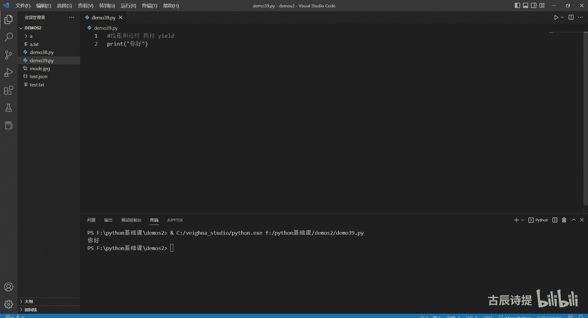
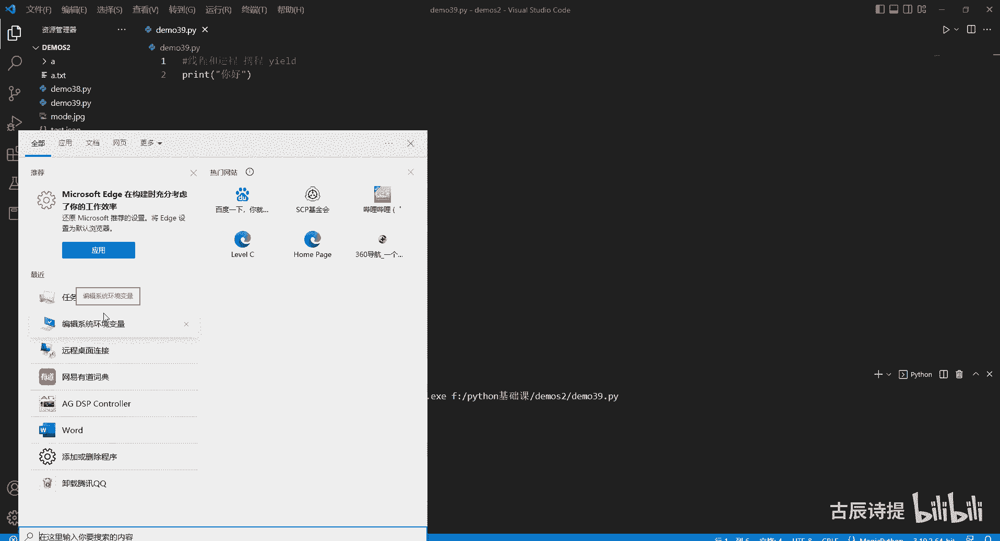
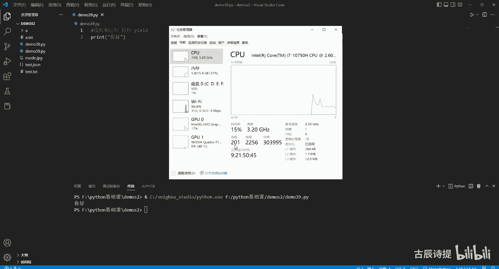
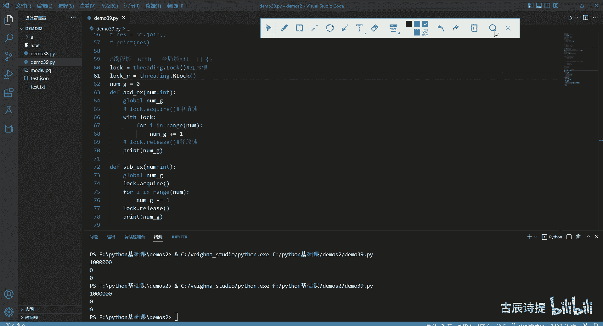

# 第39节课 线程和进程 - P1 - 古辰诗提 - BV1du4m1T7Xn

欢迎大家来到从零开始量化系列课程，Python基础课的第39课，这节课咱们讲一下线程和进程，先介绍一下这个线程和进程，当咱们在执行一段代码的时候，比如说我print一个就是很简单的，你好。

我在运行它的时候，计算机的底层或者咱们这个操作系统，windows的底层它是怎么做的呢，它会在这个计算机的内存里边创建一个进程，然后这个进程创建完了之后呢，会在进程里面再创建一个线程。

然后由这个线程来执行你的这些指令，县城也被称为就是计算机，或者这就是咱们这个操作系统能够调度的，最小的一个单元，最小单元，但是呢Python里边它还有一个叫携程，它是通过咱们之前学这个生成器。

学过这个yd来实现的，但是这个呢在物理层面其实不存在的，在物理层层面是真正存在的。

线程和进程都是存在着的，就比如说咱们去搜一下咱们这个任务管理器。

在这咱们看一下这个性能，你会发现这有多少个进程，有多少个县城，有多少个句柄对吧，就是进城和县城是真正的存在着的，比如2000多个县城，200个进程。

那就说明一个县城里边基本上不是一个进程，里边基本上会分配十个县城啊，当然这个线程是根据你的需求去分配的，原则上说一般一个进程里边有个呃，几百个县城也是能够去执行的，但是县城并不是越多越好啊。

携程呢它是通过year的生成器，咱们之前讲这个代码的时候，你也能知道，就是它能够把这个咱们定义的，那个就是方法给他，就是执行一半到了叶的这它就会停住，而且还能把这个值给你返回回去对吧。

它通过这样的一个机制呢，它可以让就是说比如说你多个，就是这个函数或者方法在执行的时候，让他人为地从哪一部分给中断下来，然后再去执行另外一个任务，从这个任务中断了再去执行另外一个任务。

这样就是一个并发达到一个并发的一个情况，但是实际上他肯定不是在并行的，并发和并行就是一个任务，咱们可以同时启动，比如我一个人干两个活，但是这两个活儿不可能同时在干，因为我只有一个人。

由于电脑的执行速度很快，很容易让你产生并行的这种错觉，因为他执行很快嘛，中间耽误的时间可能你并感受不到，就包括你比如说呃，他就比如说我看电视和看平板，你可能这两个上面的内容你都能吸收进来。

但是其实不可能在同一个时间段，在同一个时间节点，你既看电视又看电脑，对不对啊，这就是一个携程啊，这个咱们在量化里边一般不会怎么去用到，所以说也不会去讲好吧，因为如果说涉及到携程呃。

就算就是可能比如说你网络编程的时候，需要去等待，就是这个服务器响应，这个时候CPU是不做工作的，你为了就是提高这个CPU的执行效率，你可能去写携程，好吧好现成的这个咱们先说县城啊。

现成的这个英文单词thread，所以你如果说要创建子线程的话，为什么叫子线程，就是你的程序在运行的时候，就像刚才这个print一样，这个你执行你的主文件，这是肯定是一个主线程。

然后如果说你想同时执行多个任务，然后再把一个任务再开启起来，实现任务的并发，那你就必须再创建一个子线程好吧，你执行的这个任务的这个代码本身，这个顺序它是主线程啊，比如说我如果说需要创建子线程的话。

你需要导入包from reading import这个大写的thread，也可以直接import threading，Import threading，当时建议就是写下面这种啊，写下面这种。

比如说我有两个任务，Df task，一，Print，任务一开始执行，下面呢我就sleep一个，比如说一秒钟from time import，Import sleep，把这个删掉，sleep1秒。

然后war print一个任务一，执行完成好，我在执行个任务二，定一个task2，然后我sleep两秒是任务二，开始执行任务一开始执行，通常情况下，咱们之前在写代码的时候，都是task1括号调用它。

然后task2括号来调用它啊，咱们可以看一下它这个时间啊，用这个ta这个tom是计算这个时间戳的start，我计算一下tom啊，时间戳计算时间戳它是从1900年，应该是从1900年到现在为止的。

这个描述就是你这一小时一分钟是60秒吗，一小时就是3600秒，你一天你再乘以24是7万多秒，就是从1900年到现在应该是1900年啊，到现在的这个描述，它是以这个呃float的这个形式展现出来的。

从从float这个形式展现出来，这样的话你就直接能进行加减对吧，end等于time，然后我print一个执行，执行了多少秒掉format，然后用N减去start是吧，好我现在来执行一下，不出意外。

应该是三秒钟是吧，执行了三秒钟啊，如果说我在执行任务一的时候，我也想让任务二同时执行的话，我就需要怎么去做呢，就是我需要用一个变量T代表一个子线程，然后threading thread是吧。

就是threading thread，然后括号里边你要给它传入这个你的任务任务，有target target这个参数，比如说我让他执行task1，Task1，Task25，就是我就让主线程来执行啊。

你在执行task1，你一定要让它启动一下start啊，这是子线程启动，一定要让它启动一下，这样的话你在代码在执行逻辑是什么，这么往下走，往下走之后，A这个主线程创建了一个子线程对象。

然后把这个子线程对象去启动起来，启动了他就不管了，主线程接着往下走，开始执行task2，然后一直到最后，这个时候咱们来运行一下，按照逻辑来说，应该是执行了两秒对吧两秒，但是如果说我从这执行一个两秒。

从下面执行一个一秒，咱们可以看一下啊，他会给你输出，执行了一秒钟，原因是什么呢，你会发现任务一执行完成是在这个之后，就是这个主线程代码到最后他才给你输出的，是因为什么呢，它代码到这儿的时候。

创建了一个子线程，然后启动子线程，启动子线程，主线程就不管紫禁城啊，子线程去了，子线程你就自己玩，然后主线程就开始执行task2，task2他就执行了一秒钟，他就执行完了，然后他就开始接着往下走。

所以说他就走到了这一块，然后他才是一秒钟，然后等过了一秒钟，子线程的任务结束了，然后他才输出这个任务一已经完成了，如果说你想从这儿给他，让他等待一下，就是说我的我这个任务二执行完了之后。

我想让他等着任务1task1执行完，我再接着往下走，你需要引入一个方法叫T点JOE，可以把它理解为等待，如果专业点说就是阻塞，阻塞主就在这等着等着他执行完，然后再往下走，这个时候你运行一下任务一。

开始任啊，任务二先结束的，因为它只有一秒钟，然后过了一秒钟，任务一又执行完成了，然后再往下走，这个john是等待会经常用到的啊，会经常用到的，如果说你还想往子线程里边去传参数。

比如说我这边需要一个name，同样的这name，我给它传进去，那你创建子线程的时候，你应该怎么传呢，应该这有个ARGS等于传入一个元组啊，咱们以前经常说的，你这个里边传入，比如说吃饭元祖的话。

你必须得加上逗号才能告诉解释器，我这个传说是一个元组，这个时候你再运行一下任务，吃饭开始任务二，开始执行任务二执行完成，然后任务吃饭执行完成，对吧好，这个里边还有个参数。

有可能会用到的就是da demon，Demon demon，如果说你等于false的话，不是先等于true吧，这个叫什么叫守护守护线程啊，守护守护县城什么意思，守护线程就是如果说你等于true的话。

它就是守护线程，它就是守护线程，他在主线程执行完成之后，这个子敬啊，子线程不管执行到什么程度，它就会立马去结束掉啊，咱们这个时候来运行一下呢，你会发现任务二啊开始执行，然后任务执行完成。

任务吃饭也执行了，他并没有，就是说结果子线子线程执行结束，它并没有立马断，其实是断了的，因为你从这儿进行等待了对吧，如果说我这不等待的话，它是一个守护线程，咱们再来看一下任务二，执行完成了。

它就耗费了一秒钟对吧，你没有看见任务吃饭执行完成，就是当如果是守护线程的话，主线程执行完毕，子县城，执行完毕，不管子线程的，不论子线程的任务，是否，执行完毕，紫禁城应该是关闭子县城立即关闭或者销毁啊。

这个就是这个这个参数的作用，当然这个参数你还可以从这来设T点，cat这样的方式，然后这个里边也是传入一个布尔值，比如说我传入一个force，这个也是可以的，但是现在也不推荐这么去使用。

同时你还可以从这T点cat name给它设置名称，给它设置名称，比如说我就设置成线程一啊，或者子线程一，子线程一啊，这是设置线程名称啊，这是设置是否为守护线程，另外如果说你想看你在运行的时候。

你这个同时有多少个线程在运行，你可以从这print一个，呃这个threading，第二这个咱们之前学过就是枚举方法，调用它的枚举方法，调用它的枚举方法，咱们可以看一下，你会发现它是有两个线程对吧。

一个是man thad，就是主线程，一个是thread，就是子线程啊，task1执行的是task1对吧啊这个就是查看，当前进程中的现场情况，如果说你想查看它的个数，就在它前面加一个LAN。

就是就是这个L这个也没问题啊，就是这个它的方法啊，这个是基本上它常用的功能如何创建，里边用到的这几个参数，基本上有这参数就够用了，这个一定要是你的任务名啊，千万不要是方法加括号，那样肯定是不行的。

如果说我这有返回值的话，比如我一个name，我把name给返回回来，我如何去接呢，T这个T它是一个three的，它并不会给你返回这个name大，所以说你要接这个返回值的话，你有两个方法，因为你返回值。

无非就是需要把它的返回值给存储在，这个主线程，或者当前进程里边的这个某一个地方，对不对，你可以设置公用变量，就是用公用变量来接，比如说我在这我就设一个names等于一个列表，然后他执行完了之后。

我把这个name添加到这个names里边，然后我再去获取不就行了吗，但这样的方式呢不建议去用，因为什么，如果说你在执行的时候，你在调用这个公用变量的话，是不是容易对它里边的数据造成影响。

比如说我这个name存进去了，如果说还有别的线程把这个name又进行调用了，又进行改变了，是不是会污染咱们的这个数据，所以说不建议这样，那如何来做呢，你可以用类的继承来做啊，这个是线程类的继承。

这个怎么来写，我要把它给注释一下，把这两个任务给留下来啊，首先肯定定一个类class，比如说my th继承肯定是threading thread是吧，继承它之后，你需要定一个，首先in it。

你最好不要这样，就是说直接调用他自己这个回车的，这个这样的话你容易看不懂对吧，你这个时候就cf，然后里边参数是name，你要给它写进去，然后呢你从下面就是super。

咱们继承的时候说过下划线下划线INIT，然后括号对吧，然后把这个C点name等于name给它传进来啊，给他传进来，然后DF你要实现一下里边的这个run方法，这个里面是有run方法的。

当他执行这个start的时候，其实就是执行这个run方法啊，这个你一定要知道，就是线程调用，就是执行线程类中的run方法啊，其实就是来执行他，你这个里边比如说我就执行一个task1。

当然你也可以把逻辑写在这个里边，我从这儿我就执行一个task1，然后括号把cf点name给它传进来，我从这儿接是为了传给他对吧，如果说它有返回值的话，这个时候咱们就可以运行它了啊。

比如说my mt等于my three，然后这个里边传入一个name，就是还是吃饭吧，睡睡觉吧睡觉，然后这个时候我mt点start，咱们可以运行一下任务，睡觉开始啊，然后任务睡觉执行完成对吧。

如果说你想有返回值的话，你肯定从这一个有一个cf点，你自己定义的一个东西过来接一下，比如说下划线result，就shift r e s吧，你自己过来把它接上，然后从哪进行返回呢。

因为子线程的执行是需要耗费时间的，你不能说我执行完了，我就从哪过来接一下，你一定得等他执行完成对吧，在县城里边等待执行完成的这个方法是什么呀，john所以说你就重写一下JOE就可以了。

john你重写一下它，然后self你先运行super，就是父类的这个join函数是吧，运行完了之后，我return一个CDIESIES，这样不就可以了吗，你从这去接一下。

比如说RES等于这个mt点join，这样你就能接到这个IES了，当然你的这个主线程会从这被阻塞，你会等着他就执行完成，给你返回这样的返回值，咱们可以print一下这个RES。

print r e s睡觉是吧，就把这个name给你返回出来了，这个你一定要知道，就如果说他有返回值，这个任务有返回值，你又想接到的话，你最好不要用刚才说的这种第一种方法，用一个公用变量。

你最好是用这样的方式去继承它，然后等它有返回值，当然这种方式咱们也不常用，后边咱们会讲一个线程池，这个线程池里边它会有返回值，好吧，这个是这个如何去继承这个现成的这个类县城，这个类。

后边还要讲的呢就是这个县城锁了县城所，县城所是个什么东西，就是咱们刚才这个比如说这两个任务，或者你有很多的任务，当我要使用到公共变量的时候，它是不是会产生对公共变量的一个污染，这是什么意思呢。

我可以先把这个都先注释一下啊，我重新写两个方法，比如说ADD ex啊，比如number int for i in range，比如说number，然后我在这设一个公共变量，就是number g啊。

等于零，就是global的意思吗，我要改变公共变量，我是不是先得去呃，声明一下这个number g它是一个公共变量呢对吧，这个是之前在函数里面学的，就是它的一个作用域对吧。

这个时候我number g加等于一自增啊，然后我再定义一个就是我给他复制过来，定一个sub就是减自检，减等于一好，这个时候我定义两个线程T1等于threading thread。

然后target等于这个ADD先加再减，然后a august august等于我用一个元组是吧，ADD ex啊啊，不是元祖，应该是比如说100万好这样，然后我这个T2等于，也是这个是吧。

target等于sub e x，然后ARGS等于还是100万，一个圆柱的形式给它去传进去，然后我T1点start，然后T2点start，这个它的这个结果咱们输出一下，就是这个NG一般得是零对吧。

但是你会发现它输出结果不对，是28533，这个是为什么呢，因为你主线程执行完了之后，你的这个子线程不一定执行完了，对不对，所以说你这必须得加上T点转对吧，你一定不要认为这好像是他们在加减的时候。

把我这个这个给污染了，因为你这没有john，所以说他执行完了，就是说主线程执行完了，这个这个进程会等待着紫禁子线程去执行完毕，但是你从这输出的，它不是它的一个结果对吧，你如果说加上这。

你会发现它就会变成零了，但是其实在你在用这个变量的时候，是不是有可能会发生这种公共资源的这个污染，他为什么会有这个污染啊，就是你在执行两个任务，比如说这是任务一，这是任务二，这是一个公共变量。

就是这个number吗，当他执行减一的时候，比如他现在值是100，我把它取过来的时候，100-1就变成99了，对不对，但是你这个还没执行完呢，这又把它给取过来了，就是100+1，它就变成101了。

然后他可能是先给它就执行，完成这个赋值之后呢，它变成99，然后这边呢又执行完成了，它就又变成101了，这个其实就不对了对吧，你应该是这个剪完之后，这个数给用完之后，然后你再给他用。

这样才能确保它的准确性，就跟买票似的，你加减数是吧，你可能在演示的时候，它不会产生影响，但是如果说我这有一张票是吧，我这本来还剩还剩两张票，他退了一张，他从这退了一张，应该是2+1的。

他同时呢又买了一张，然后就是2-1了，他执行完了之后，把三把三给他之后，他执行完了呢，把一给他了，那最终他就会认为这个值是一，但是其实不对呀，一个退了一张票，一个买了一张票，那不应该是还是两张票吗。

这就会对你的公共的这个数据产生污染，虽然从咱们这演示啊是很难掩饰的，但是前两年是可以的，但是随着Python不断去网上的就是迭代，它从这儿给做了优化，咱们很难就是说用这样的方式再演示出来。

他的这个问题了，但是你得从理论上知道他有这样的问题的，所以说你要进行对公共变量的变化的时候，你最好是加上线程锁，线程锁是什么呢，就是你可以先定一个lock，等于threading luck。

一定要实例化一下，然后你从这给他加一把锁，你从这给他加一把锁，确保它的这个准确性，另外就是咱们在就是之前跟大家提的时候，咱们你顺序的往下执行代码，这个叫串行，就跟糖葫芦似的，一个吃完了我再吃另外一个。

这叫串行，当你用现成的时候，是其实是可以形成并发的，并发并发是什么意思，我两个任务一起执行，就说我这俩糖葫芦，我这儿也咬一口，那也咬一口，这叫并发，能不能实现并行呢。

现成的并行在Python里边很难很难去实现并行，并行什么意思，就是说我同时一个时刻我吃着两个糖葫芦很难，就是他可能我这咬一口，这咬一口，这叫并发，两个任务就是同步开始了，就是一同给发出去了。

但是只有一个人，他可能就会执执行的，就是说就是说我先就是说吃一口，这个吃一口那个啊，他是这样的方式来运行的，只不过它比较快，你反应不过来，就是说你好像觉得他在并行。

咱们可以print一下这个呃number g啊，然后再从这来print一下这个number g，它在运行的时候，因为有john，所以说等他执行完成之后，他才会往下走，对不对，他才会输出最后一个啊。

这个时候咱们可以看一下，你执行完第一个的时候，他是77万多，你要是说串行的话，他会先执行完一个，他会先是100万，然后变成零，对吧啊，但是他从这第二个它才会变成零，这个一开始他是77万多，它不是100。

说明啊就是说这个CPU是这执行一下，这执行一下啊，这执行一下，这执行一下，他是这样来操作的好吧，线程锁怎么去加呢，就是枷锁嘛，你首先你要去申请锁lock，点这个acquire就是申请锁锁，申请到了。

你就就是就锁住了，等于就把这个CPU给锁住了，等执行完了，你这块用的这个公共变量或者公共资源这一块，你再把这个锁给释放掉，就释放锁，然后这个时候呢，你的这个CPU就可以被别人去使用了。

同样的你在这也可以lock点acquire，然后申请锁，然后从这lock点release，就是释放锁，这个时候你再一执行，虽然你用了两个线程，但是呢他会先执行，先申请到锁的那个会把它都执行完了。

然后再把锁给释放出来，然后再让你去执行别的啊，这个时候咱们来运行一下，你会发现是100万00了对吧，这就是申请所当在用到有公共变量，你要去对它进行处置的时候，你一定要确保别的线程不使用这个公共变量。

不然一不小心它会造成污染的啊，会造成污染，这就是线程锁的使用，当然了，有一个申请所有一个释放锁，你会发现它和这个咱们之前讲过的那个，文件的管理。

with as就是你写一个那个with什么什么open什么什么，然后as什么什么嗯，咱们当时说过，你with的这个部分是有返回值的，它就会赋值给F，如果你没有返回值，其实就可以直接with对吧。

所以从这咱们也可以写成什么呀，就是直接with，Block，然后你去执行下面这一段啊，这样其实是一样的，也是1000000with lock，这样用起来会更方便，以前呢在以前的这个就是很多的教程里边呢。

把它称之为互斥锁，就是一个程序里边或者一个县城里边，或者一个你的这个方法里边，你只能有一把锁，一把锁呃，还有还有一个是递归锁，递归锁是这个，等于四零点r lock，它会有个递归锁。

但是现在呢这个不是很明显了，就是这个好像是也能就是去，就是说在一段代码里边出现多把这样的锁啊，当然咱们用的也不是特别多，最常用的你用用一把锁是吧，给他用with lock其实就可以了。

咱们那个维纳平台里边也有用VLOG的，但是他当时用的是进程锁，进程里边锁嗯，也是这个lock，当然它是会改成进程锁啊，好既然咱们在写代码的时候会出现这种情况，当时在做这个县城，就是说这个程序开发的时候。

开发人员肯定也想到这个问题了，你这个Python就是说这个速度啊，他肯定不能优先于你的这个数据的准确对吧，数据准确肯定是第一要务的，数据准确是第一要务呢，所以说他呢弄了个东西叫全局锁啊。

全局锁就是这个gear，咱们会经常听到的全局锁，这个全局锁其实就是开发过程中，为了维护这个数据的准确，咱们这只是做了个演示，用了一个int类型或者这个float类型，当然咱们用的是int类型对吧。

但是这个Python里面一切皆对象啊，但是对象的本质其实在电脑里面存储的，它就是数据，对不对，它就是数据，你变化来变化去，其其实就是数据的变化，或者说哪怕是你视频啊，视频文件还是说你文件的这个文件。

它在电脑的底层，它还是二进制，它跟你的这个变量在电脑的底层存储，其实没有什么太大的区别，它都是二进制啊，你必须得保证数据的稳呃准确性，所以说他创建了一个全局锁，然后再需要改变一些数据的时候呢。

在有一些地方它会加上这个全局锁，我的猜测啊，并不是说那个就是呃绝对的，就是以前这样去演示的时候，它会出现错误的，就是这个number global它会被污染的，现在没有被污染，那可能就是在赋值。

或者在这个实行这个全局变量加减的时候，他加上了这个全局，所以前好像在这个list里边，这个append insert啊，这个它就这样容易放在全局变量里面，使用的这样的这个数据，包括字典dict。

以前是光在这里边加了全局锁了，但是现在好像这个你也掩饰，就是试验不出他的错误了，应该是也是加了全局锁了，不确定啊，这只是我的猜测，全局所呢现在是Python最让人最为诟病的一个东西，很多开发人员。

尤其是一些大佬，特别想把这个群居所给拿掉，它是限制Python运行的一个桎梏，就是限制了他的一个就是更大的发展吧，现在老说这个Python man，那是因为有一部分，一部分是因为它是解释型语言嘛。

就是咱们开始讲，有一部分也是因为这个gal它不能实现，完全的就是多线程并行的这种情况，你用C加加它可以去实现并行的情况的，如果说你有多个CPU，多个核，它是可以去实现并行的，但是在Python里边。

你用线程它是很难，基本上做不到真正的并行，真正意义上的这个并行，就是也就是县城基本上不能使用多个核，只有单进程在运行，当然这样的问题可以用多进程来解决好。

