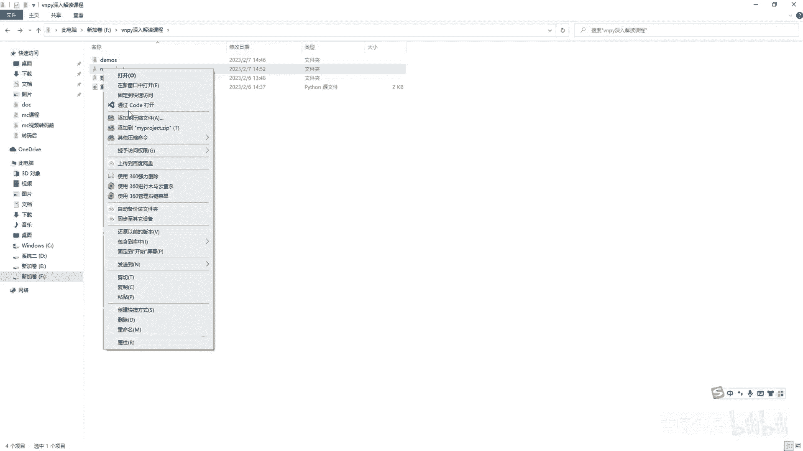
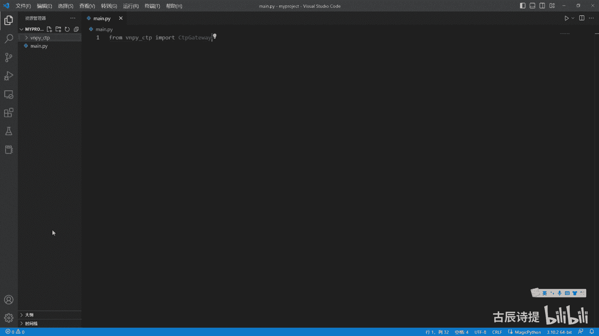
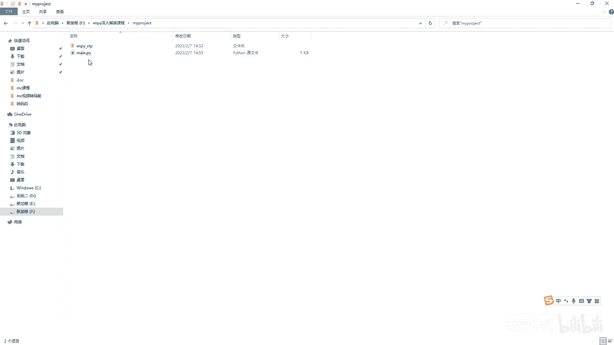
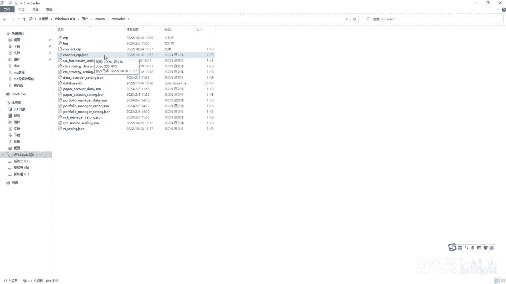
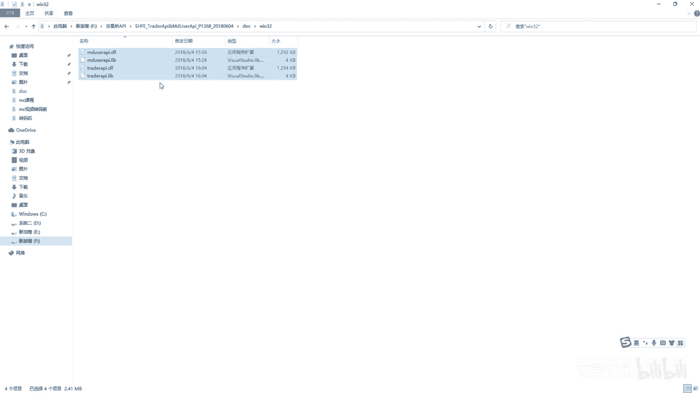
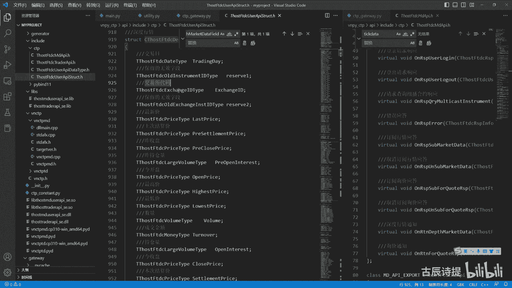
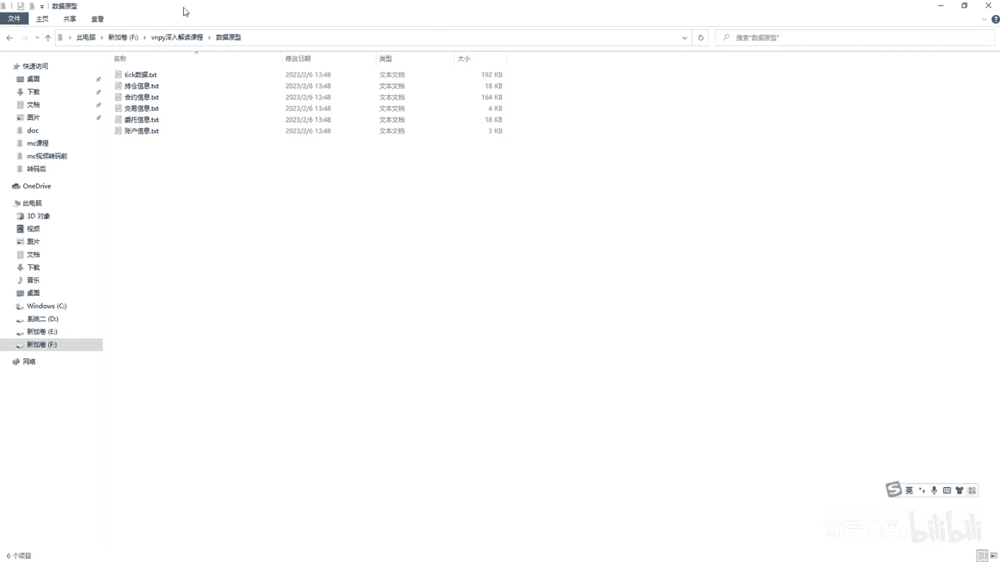
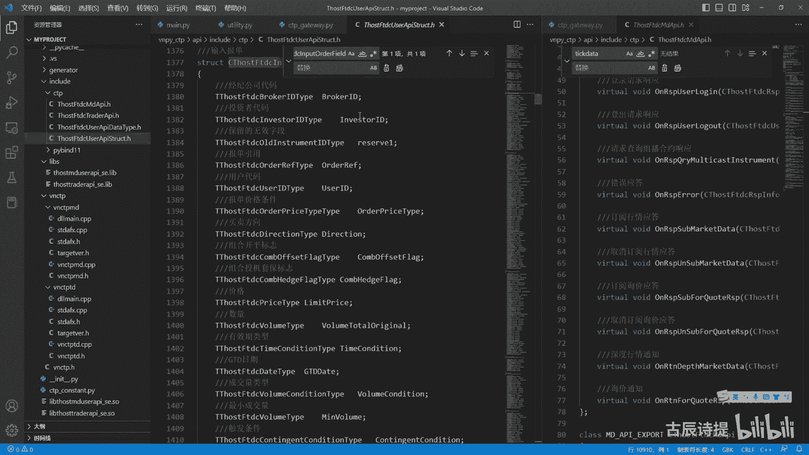
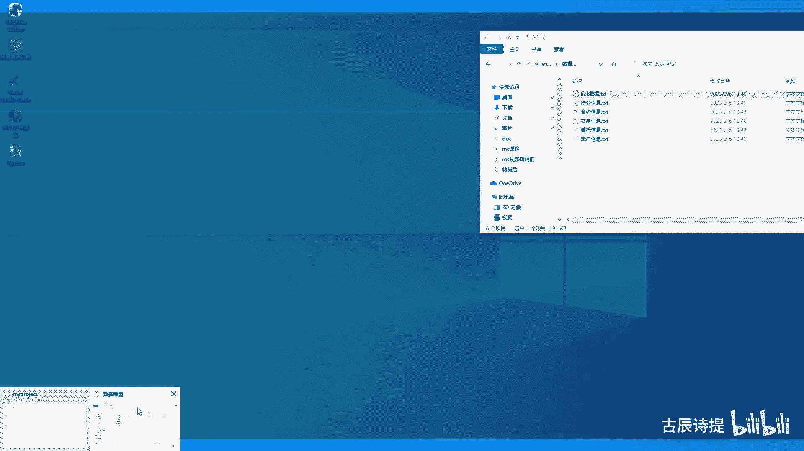
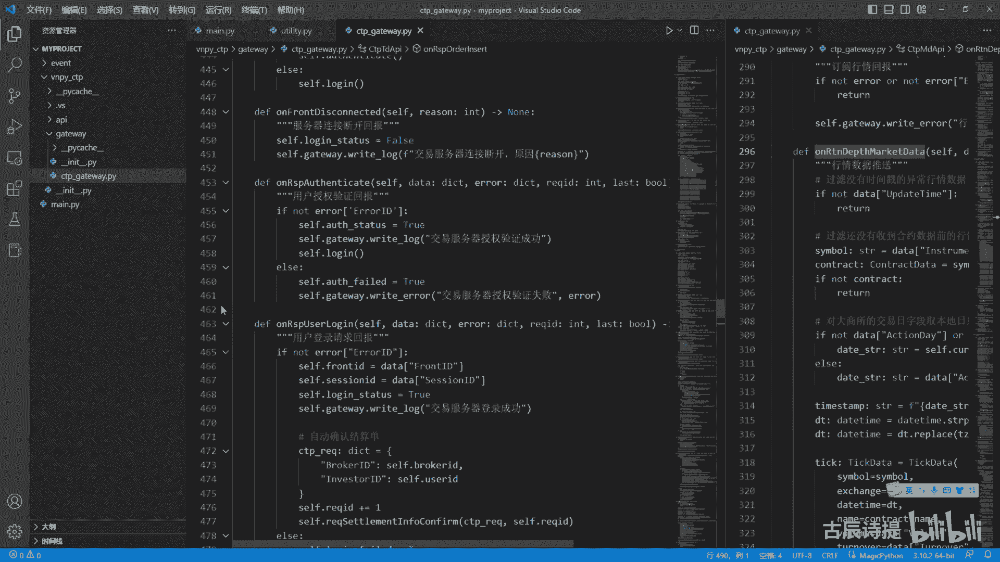

# 第3节课 CtpGateway - P1 - 古辰诗提 - BV1iM4m1X7JJ

欢迎大家来到从零开始两款系列课程，VMPI课程的第三节课，上一节课呢咱们讲这个MENGINE，给大家讲的很详细，因为这ending呢其实总结下来你需要注意三点，第一点就是它通常情况下是在一个程序里边。

它是最先启动大部分情况啊，以及它是最后结束的，这一点你要注意，如果说中间你把它提前结束了，它可能会产生一定的问题，因为它是整个的纽带，你会发现VP里边大部分类里面都会有，这个MENGINE。

另外一个类似什么呢，Man engine，My engine，是一个总的这么一个铜管性质的这么一个模块，但是engine是一个数据的传送带啊，这是第一个，第二个，当你的类比较多的时候。

你一定要注意注册进去的时候，你可以在任意时间注册进这个IMMENG，哪怕是它没有启动的，只要有这个类，你就可以去进行注册，但是在取消的时候，你一定要注意了，一定不要忘记取消，当你这个类不用了，注销了。

取消的时候，一定要把它取消掉啊，这是第二个，第三个image engine，它本身里边存在的是这个线程，它可以进行改造，它原本的这个VNPY里面它有三个线程啊，两个线程你也可以加线程是吧。

你可以加更多的线程，但是呢它其实本质上用的还是一个CPU，它并不会在真正意义上，给你带来速度的这个加快，但是如果说你碰见读写比较多的时候，等待时间比较长的时候，你多加线程是会就是大幅的增加效率的。

但是你一定要把这个代码给吃透了啊，另外呢因为这engine记得就是关，就是当你程序结束的时候，你一定要把它关掉，不然他并不是这个Python里边的这个守护线程吗，你的别的程序关了，它没关。

这个程序就会一直在这呆着啊，好这是你们engine啊，给大家做了一个总结，第一节课咱们给大家说了，就是image engine，相当于是一个传送带呃，一边往里塞出去，一边往外取数据，然后进行数据的处理。

咱们也说过，咱们第一个要给大家讲的就是c t a strange，就是这个自动交易的那个模块，自动交易模块谁来给放数据呢，那肯定是服务器是吧，咱们用这个C，用这个CDP来给大家做这个演示啊。

那第一步呢赶在现在还有点时间，还没有完全的收盘，咱们可以给大家先做个演示啊，这个是在这个维纳下面，lib site packages里边这个VNPY，这个CTP这个跟其他接口的很像，一个gateway。

一个APIAPI，其实里边主要内容是用C加加写的一些内容，把数据跟服务器给连接上啊，把本地的跟服务器给连接上，连接上之后呢就是数据传送，然后通过一个桥梁是py band的11。

PYB还是bin的11这么一个模块，然后把它与这个呃Python给连接起来，连接起来呢也就是到这个c t b get away里面，所以说这个是数据的一个接口啊，这个是数据的一个接口。

那咱们肯定要给大家演示，如何去把数据给接出来，把数据给接出来了，你才能真正的去做一些其他的操作，对吧好呃，先给大家演示一下啊，我把这个VPICTP给复制，你千万不要剪切啊，我只是给大家做演示。

我把它给复制出来，我从这儿呢新建一个，比如说my project，好然后我把它粘在这个里边啊，站在这个里边，然后咱们把它打开啊。

通过code来打开它，咱们先简单的看一下这个gateway里边，他就说需要什么东西能把它给启动起来啊，你像这个初始化的时候，它首先需要的就是engine对吧。

所以说咱们第一个是去讲了后边这个gateway name，它只是一个标识标识，这个标识可能大家在研究的时候发现哪都有它，包括什么这个数据里边都有它，为什么哪儿都得有它呢，咱们可以看一下这个这个数据啊。

啊这个数据里边儿向右拆分一下啊，这个数据里面你会发现它继承了一个base data，就是所有的这个base data里面都有一个get with name，很多老板们就觉得他可能会比较烦。

为什么哪儿都有它对吧，其实呢它只是一个标识，咱们平时在做量化的时候啊，你刚接触到Python的时候，可能只需要一个数据的接口，那这个时候呢你get to这个这个get to name。

这个标识就显得不是很重要的，因为独一无二嘛对吧，但是如果当你不断的去深入了之后，你会发现get to name是很有必要的，比如说如果你研究过这个RPC模块，2PC模块里边get name至关重要。

为什么呢，因为他得去找到它的这个数据的来源，为什么得找到数据的来源，因为咱们的这个get away，它不仅仅是给你派发数据啊，你还得有回复呢，回复派发的比如说是tick是吧，是这个order。

那你回复的是什么呀，我从哪儿去发送委托，我发送委托，这是你的回复啊，这是有有来有回的呢是吧，所以说你得把这个门的名字告诉就是告诉我，我才能就是说找到就是他的这个归路啊，对不对，所以说你如果以后。

包括比如说我既开通了CTB的这个呃服务，也开通了这个飞马，我想两边我做这个价差，那你必须得弄清楚了，就是说你从CCTB这边接到的数据反馈，一定要反反馈给这个CDB，然后呃CTP啊。

然后从飞马这接到的数据你一定要反馈，可以这个飞马你发送委托的时候对吧，这是需要甄别的，所以说这个gateway啊name很重要，那既然知道这好，那咱们我从这新建一个，比如说man点PY，从最外层啊。

从最外层我新建一个慢点PY，然后我先导入啊，我从我自己的这个VPY下划线CCTP，然后import gateway，C t p gateway，我给它导入进来是吧。

当然咱们还需要这个invent engine，Invent engine。

咱们既然研究透了，我是不是也可以把这个invent engine粘过来呢，完全是可以的啊，我就把整个的这个MIT我复制啊，一定要复制啊，你别剪切剪切到时候就没法弄了。

好啊，粘贴好，我粘过来之后，我是不是可以直接from这个INVINPUT这个invent engine，然后再把这个event给导入进来好，然后呢我1main，等于刚刚name。

我先创建创建一个MIT engine，我先实例化一个engine，这个里边不需要传入参数是吧，它有默认参数，我创建好了这个image engine之后呢，我就要实例化一个CDP，get away啊。

就比如说我get away等于CTP给退，然后从这给它传入这个invent engine啊，给他给传进去，当然你从前面啊，你可以把invent engine给启动起来，start给启动一下。

先让它这个齿轮先转起来是吧啊，先让他齿轮先转起来，然后这个传递的英文engine，你别忘了后边还有个getaway，虽然现阶段它显得有些泪水，但是它很重要啊，然后这个时候你首先你做的第一步。

那就得是连接服务器对吧，我get away啊，他肯定是有这个接口的，get away点connect，然后这个里边传入的是sitting，sitting呃，对这个有研究的啊。

肯定就知就知道他是在咱们C盘下边，或者说你有看过一些简单课程的，在这the NOVA或者用户下边有个点win trader，然后有个connect cdp点JASON啊，当然这个上面是有问题的啊。

啊这个没有这个后缀，就connect cdp点JASON，这个里面存放着的是你连接服务器的里边的。

账户密码呀，什么id啊什么的都在里边，所以说你需要把它给读取出来，读取出来呢呃在这个点from VN py，点trader点utility里边，它有一个import load jason。

还有个load jason，就是这个JASON文件啊，就是去载入JSON文件啊，那我是不是就可以读啊，s e t t sitting等于load jackson，这个详细的咱们后边说啊。

现在只是给大家做个演示，主要是让他让大家知道是可以，你自己来写模块的，你完全可以把里面的东西，全部从VNPY这个里边给做成自己的，因为你既然学这个VMPY这个深入解析课程。

肯定你是想在很多方面是给他做改变，然后形成自己的一个交易系统对吧，然后是方便使使用的，所以说你接入数据肯定是呃，仅次于就是说你这个事件引擎的第二部啊，第二部好，Lut jason，他的名字是什么。

就是file name，就是connect c TP，一定要记得点JASON嗯，嗯这样JS然后读进来之后呢，我connect一下是吧，我把这个sitting啊传进去传进去啊。

传进去呢其实这个时候就连接上了是吧，但是呢你会发现这个这个GTA这个里边，它有很多这个cf点SELF的right log是吧，它有很多这个right log，RT right vlog啊，它有很多啊。

Get away，不是self right log，它有很多，你看这个行情服务器连接成功啊，包括这个行情服务器连接断开啊，包括啊行情服务器登录成功啊，这些内容它会从哪输出呢。

咱们就需要看一下这个right log，它是get away right log，咱们看一下啊，转到定义啊，就是这个是啊，这个咱们一会儿讲了，他其实是把这个就是日志的输出呢，也作为一个事件。

然后放进了这个image engine里面，因为on log嘛，con log就是own invent，on invent就是invent log，把log放进去，own invent是什么呀。

就是就是因为engine点put啊，咱们一会详细去讲，这个是为了让大家知道，你想要就是咱们人的认知容易接受的，就是你需要实时的输出对吧，所以说你从这儿呢，你必须你得注册一个，你得写一个什么呀。

就是啊out，就是这么一个方法，然后呢这个里边呢你揭露的是event这个event，event这个这个data是什么呢，是log log log log data呢，咱们可以从哪去导入一下呢。

from VN py点trader，点这个data都是在object里边对吧，import log data啊，它等于invent点data啊，然后这个log data里面它有个message。

MSG等于log点message，这个才是真正的信息，然后我需要把它给输出出来，message啊，Message，然后呢我image engine我有了之后呢，我就给他注册上。

就是image engine，点register，就是注册注册什么呢，应该是invent log event log，这个event log呢咱们同样的是需要导入一下的。

from from VN py点trader啊，点invent import，这个咱们一会再详细介绍啊，register一下这个it log，然后把这个方法啊，把这个函数作为它的这个函数名。

作为一个对象啊，这个是output是吧，Output，Out，然后给它传进去啊，你只要给它传进去之后，一旦有这个信息，然后他就给放到那个管道里边了，然后放到管道里边经过处理。

然后就会用这个output进行实例化，然后就会进行输出是吧，这个逻辑就很通畅了吧，你现在就能理解为什么很多时候，比如你写的那个五脚本里边，他做的很多的东西，就是必须得在外部写一个这个呃日志的显示。

不然的话日志是出不来的啊，当然日志啊就是一日志，日志一般是由本地记录的，当然这个呃算不上完全的日志啊，只是一个信息的输出，信息的输出，然后这边是output，你一定要register一下。

然后我连接CDP啊，然后我进行connect连接，这个时候呢咱们s l e p sleep一个五秒钟，咱们可以看一下啊，From time import sleep sleep。

然后咱们进行一下操作看一下啊，你会发现连接成功了吧是吧，交易服务器连接成功，行情服务器连接成功啊，行情服务器登录成功是吧，都查询成功了吧，对不对啊，这个是合约信息查询成功啊。

当然这个字有一些不太那个什么呀，就是有一些这个显示不太出来，可能是我这个呃这个显示有些问题啊，好我先把它关了，你会发现服务器已经连接上了，对不对，那这个时候你只需要什么呀。

就是说我我比如说我再定义一个DF，就是tick out，然后invent，E v e n t take out，然后呃tick等于in win EV int vent点data。

然后print一下tick，我把tick给他输出来，我是不是就可以把这个tick通过这个函数啊，给接出来了，给print了，对不对对吧好，咱们再试一下啊，比如说我sleep sleep five。

然后我从这我注册的时候啊，Invent engine register，然后这个invent tick啊，然后这是这个tick out，take out啊，我导入一下这个in winter切开啊。

因为check好，就是这个时候你往外接，你能不能接出来呢，啊其实是接不出来的，因为什么你还没有订阅行情行情，你是得申请的，所以说你第一步应该是订阅行情啊，你得跟这个服务器说，我要哪些数据啊。

我要哪些数据啊，我要哪些数据，我要哪些数据呢，咱们就应该用这个getaway来订阅一下啊，Get away，点subscribe，subscribe是订阅行情的意思，它需要的这个是一个REQ。

REQ是一个subscribe request啊，就是这个REQ等于，从哪儿还是从这sub spring request，然后INGIEQ等于sub request，然后simple simple。

比如说我就写呃，现在这个点零六分零六分3。06，这个中金所它还没有就是那个国债是吧，国债还没有那个什么呢，呃看一下啊，国债是这个什么呀，是T吧，T吧，Symbol t。

然后这个exchange我在啊算了，我也忘了那个是什么，就咱们就订阅一个RB2305吧，数据可能因为收盘之后就没有数据了嘛，但是可能会接收到一笔他的收盘价的题，可啊好这个RB2305，2b2305。

它的这个exchange exchanges是SHFE嘛，但是呢你你不能直接写这个SHFE啊，因为他要的是一个change类型的，所以说咱们得导入一下这个exchange这个常量。

因为交易所这个是个常量吗，还是得tread点constant，constant里面import exchange exchange，然后我从这应该是我给他转成exchange类型的。

就在前面加一个exchange是吧，change我订阅一下这个REQ，我订阅了之后，他是不是就开始把tick，往我这个invent engine里边去放了是吧，怎么放的，咱们后边说啊，他就开始往里放了。

然后我这通过这个take out就可以进行输出了，对吧啊，那咱们还是把它换成这个T吧，2303看看能不能接上来，然后这个是CFFEX是吧，好咱们去来运行一下啊，连接上了好阶段性，已确认成功，是吧。

这个这个data就有了吧，对不对啊，忽略那个中间发的一些那个那是文字编码，不太对啊，对不对，他说一笔一笔tick就有了吧，好咱们把它给关掉啊，那既然我能从外部给接出来。

虽然我这里边有很多是从VPYTRIUTILITY，里面去导入的，你想想这个low的杰森，我是不是可以把它直接粘过来，里面用到的我直接粘过来，然后我给它粘到这里边，对不对。

因为cdp gateway我已经粘过来了，我用的这个c TP gateway就是我粘过来的，这个是不是我可以完全脱离，VPY或者维纳的这个框架，或者说是他的这个呃环境，然后我自己来形成我自己的这个。

代码块和模块是吧，对不对啊，这个你一定就是如果说想要做一些自己的，交易系统或者交易自己的一个小软件的话，你必须得学会把它自己给接出来啊，自己给给接出来，然后这个里边所有的包括一些方法什么的，都可以。

我自己建文件夹是吧，我自己往里存，往里放，包括界面我也可以自己去写，当然是需要耗费你巨大的精力和时间的啊，这个给大家做了演示，就是说你能够自己去把它接出来好，下一步咱们就说它是如何去接的啊。

这也涉及到了这个invent engine的这个使用，In the engine，还是那句话，一定要掌握牢固了，那咱们就主要来看这个CDP这个gateway好，咱们看一下这个cp gateway。

再说这个具体说这个c TP gateway之前啊，咱们得先说一个常识，其实咱们每次在跟服务器去连接的时候啊，咱们其实是连接了两个服务器，并不是一个服务器呃，这两个服务器呢一个是行情服务器。

一个是交易服务器，行情服务器呢就是只只管去发送行情的，就是这个market data啊，就是一般是用market来表示，就是行情服务器，交易服务器呢一般是用try来表示。

所以说在咱们这个cctp gateway这个类里边，他创建了两个类，一个是这个是这个行情类，一个是这个交易类，就是在INIT这，你会发现它是cf点TDAPI和cf点MDAPI，对吧啊。

其实可以连接无数个，就是比如说我要录制行情啊什么的，你可以连接很多个这个行情API，但是这个交易API呢连接的数量是有限的啊，一般是4~8个吧，好像是这个你可以具体的去问一问啊。

好嗯前面就是一些模块的导入，没什么说的，但是这个是需要说一下的，from点点API import，就是从这个API接口里边，它导入了一个MDPITDAAPI，呃，其实整个这个两个其实也是类。

它只不过是这个C加加里面的类，这两个类啊，是就是就是你的这个题课数据，是从这个MDAPI里边出来的，然后你的这个这个委托的发送啊，成交额以及你的持仓账户信息的获取，是从这个TDAPI出来的。

咱们如果说只是Python的话，你最多就是追溯到就是cctp gate位置，然后再往上呢就涉及到这个C加加的内容了，我给大家简单的介绍一下，就是如果你以后你去呃去增加一些别的功能。

就比如说我银行转账其实也是可以的，但是你需要去这个API里面去感觉啊，这个API是用这个C加加写的，呃，其实更多的，比如说我这个这个这个tick数据出来了，我想去找一下这个这个数据。

它里面究竟有哪些东西，其实你也可以，哪怕是不懂这个C加加，你也可以去查一下这个T的数据，它的这个原始数据过来究竟是个什么东西，比如说这个就就这个方法，它这个data过来你只知道是个dict。

那他这个原始数据究竟包含了哪些东西，当然第一种方法就是直接把这个dict，直接就进行输出啊，我从这我print，或者我从哪save是吧，但是你这是在有行情的时候，更多咱们在写代码去研究的时候。

更多可能是在周末，你想去看一下这个data里面究竟有哪些内容，你可以去往回去翻一翻，就是再往它的底层去翻，这个就需要找到这个MDAPI和这个TDAPI。

比如说我这个on return depth Mark data，On return demark data，其实他就是来传输这个啊这个数据的，我想看一看这个data里面究竟有哪些东西，怎么看好。

它是从点点API点一个点是上一层，两个点就上两层，然后API是吧，就是上两层其实就是VMPI下划线CDP，然后这个API然后里边去找这个MDAPI和TDAPI，这里边没有，对不对。

但是呢这个里边有个下划线下划线INIT，这个里边它就有了是吧，就是点VNCDPMD，import md API和VNCDP这个TDPTDAAPI，这个是在哪呢，这两个东西是在哪呢，这两个东西啊。

咱们看一下，从这唉从这你会发现VNCTPMD，V n c t b，T d m d，是肯定是表示这个market t d是表示这个try的，然后这个行情的呢肯定是在MD里边，是不是MD里边。

它是自动生成的，就是自动生成的，那最主要的是这个VMCD，PMD是这个东西啊，点CPP，点CPP就是PP就是就是plus plus就是加号嘛，这个是C加加文件，然后点H呢一般是head就是头文件啊。

就是在C加加里边，你写的时候一般是一个C加加文件，对应一个头文件的，头文件是定义一些你的这个方法的名字啊，函数的名字呀，就是给它定义出来，然后具体的实现是在C加加里面实现啊，当然这个不是绝对的啊。

简单跟大家说一下，你可以诶点击一下他去他这里边来找啊，去他这里边来找，咱们可以往上翻一翻，你会发现特别特别多对吧，而且这个是乱码，乱码是因为什么呢，是因为你用的是UTF8。

这儿呢你得换一个这个识别的方式，我这个编码得重新编码一下，比如说我选GBK他重新编码一下，它就出来了啊，这个呢是这个就是说Python它在往上走，C加加的它的一个底层，其实你也不难发现啊。

你看这个是个类啊，这个就是它的方法，这个大括号里面就是方法的，就是说里面具体的实现，然后你想task就是任务嘛是吧，然后this啊，task queen点push，就往这个Q里边，就是队列里边去。

把这个呃数据去放到这里边去对吧，这个就是简单的看一下，也能了解个7788啊，如果说你有这个三方平台的，比如像这个文华，他这个就是文化酒，他这个编程你会发现语言很像，只不过就是在很多就是细节方面啊。

是有很大差异的，但是文华他其实是有点类似加加语言的啊，你从这儿呢我去找一下这个a deep Mark data，我刚才复制了一下，你会发现这个类在这呢，对不对，立立在这呢。

它是通过就是这边的这个代码的运行啊，然后最后呢他走到了这个什么呀，你看这个是什么呀，这个是这个啊，Protest target，就是我处理跟咱们就是Python里边per呃。

process什么这个event有些类似吧，对不对啊，然后就是你想这个是它具体的这个数据，来了之后，唉，我他进行了处理，看data啊，我去哪儿去，这个是to u t f，就是把它转成UTF格式的。

就这么一个方法啊，你像这个呃training day啊，包括这个exchange id啊，To ut f，因为它是一个就是呃就是字符串类型的吧，你需要转一下，你像就是说就是这个风就是浮点型类型的。

它就不需要转了对吧，你看最后又放到这个里边了，然后this然后去运行这个，然后你会发现它会往下走诶，这个是什么呢，这个你往上走啊，这个也是一个类是吧，咱们不去细究它，你想它到最后到这了。

这个就是C加加和这个Python连接的，这个类叫py ban的，还是bind11啊，就是py by这个有兴趣的话，你可以去尝试一下，去试试去使用这个就是说呃模块。

然后把这个C加加和这个Python给连接起来啊，Python给连接起来，现在目前为止应该是这个类，这个模块是最好用的，就是他们俩之间最好的桥梁，你看它定义的时候是什么呀。

就是说就是Python里边on return gts market data，就是到这个这个是引用啊，这个MDAPI就是这个C加加里边，这个类这个方法啊，这个方法其实你就是它回调的时候。

它调用的时候它就是一层一层往上调，当然这个tick它是从从这个底层往上走嘛，就是到这了，然后它就掉到这了啊，能理解这个意思吧。

就是这个简单跟大家说一下，就就是一直到这，如果说你想去做一些别的改变，你有这个C加加的这个基础的话，比如说我想把这个转账啊什么的啊，你也可以从这里边来写它，再往就是底层跟服务器连接呃，你是看不到的啊。

他这里边应该是在这个什么里边的这个lips啊，应该是在这个里边啊，还有这个include这个CTP啊，这个是一个这个include的这个CTP，里边是给你的看的一个东西，就是呃你想都是头文件吗。

比如说他这个API啊，你看这个我再给他TF杠8GBK重新打开一下啊，你会发现它这里边你看都是定义了方法啊，只有方法它没有具体的实现过程，他没有具体的实现过程，它真正的实现过程呢给你做成了一个链接库啊。

给你做成了一个链接库，就是就是这个东西应该是啊，就是这个四个四个好像是啊这个链接库啊，你可以其实是可以从网上去下载到的，就是你搜这个什么呀，搜这个，就是上期所啊，咱们搜一下上期所，上期所官网。

你从上期所里边去这个技术啊，技术，然后技术规范及下载，这个里边你能给下载下来这个API程序包，这API程序包你可以把它给下载下来，下载下来呢咱们可以看一下啊。

API这个程序包我在这个F盘应该有交易所API，你下载下来呢是这个东西，这个是上期所，你看这个include里面它就是是是这个四个啊，它是头文件点H是头文件给你看的，就是里边有哪些数据。

然后会又给你暴露了哪些接口啊，然后这个这个你想win32里面是这四个吗，DLL和这个lib是他的这个应用程序扩展，其实就是链接库在C加加里面的链接库。

然后你最终调用是到这里边，但是你这个里边代码是看不了的啊，你如果说想看他暴露了哪些接口，你可以从这里边来找，你像这个MDPI就是MD里边，你像包括错误应答呀，包括询价呀，登陆啊啊你想这是询价嘛是吧啊。

他都给你这个写的很详细啊，就是写的很详细，如果说你想看数据的话，比如说咱们刚才就是看的这个MDCPP里边，找到了这个呃昵称呃，on这个就是deep market，就是这个数据嘛是吧。

好咱们看一下tick数据，它的这个数据其实是这个是吧，是这个这个market data field，是这个这个呢你可以在他这个data type，应该是在这个里面STRUCT里面啊。

这就是在STRUCT里边再看一下啊，这个有TF8编码，重新打开一下GBK啊，你看这个是它的这个深度行情啊，就是他的这个STRUCT啊，在这个C加加里边是结构体啊，是结构体，一般的数据都会用结构体来封装。

你要Python里边是用那个它的装饰器，这个at data class是吧，但是在C加加里边，就它有单独的就是这个STRUCT呃，去封装这个，如果说你这里边只有这个数据的话。

他会用这个STRUCT给你封装起来，你像这个就是呃这个你的这个就是tick数据，它最原始的，如果说你有一些东西不知道这个tick，它传过来的是什么东西，你就可以看这它每一个都给你做了这个标注了。

咱们可以对照着什么呢，以前在一些课上也给大家看过，就是咱们这个就是数据原型啊。

数据原型比如说咱们看一下这个tick数据啊，你会发现你像第一个training day吧是吧，第二个就是呃保留无效字段啊，当然这个是啊，你看这个exchange id是吧，exchange id啊。

这是instrument啊，这个它可以改成了instrument了是吧，他不是无效字段，你想这是instrument嘛是吧啊，然后第三个是这个交易所啊啊第三个是这个exchange。

第四个是这个保留字段，像exchange这个id保留字段啊，第五个是最新价了，price对吧，然后最后一个是action day啊，圣物叫哎不对，这个上代价下代价是吧，这个你可以看他给你传过来的数据。

究竟是哪些啊，你可以到这来进行对比，这个action day是在，是在哪，是在这吧，应该是GTA啊，就是action day，是在这呢，下面就可能就是说像上代价，下代价可能是这个期权的一些内容了啊。

就是它的这个数据就是在这啊，你可以过来找，包括你想old data，咱们再找一个试试啊，就是从这个咱们Python里边这个，比如说这个，o r o d order data啊。

这个order data是on啊，IE就是i s p order insert，好，咱们来这个哪个里边找的，这应该是在TD里边去找是吧，TDCPP里边，然后咱们去找他，不改它了啊。

你想是在这他的这个数据类型，你像是这个对吧，他这个方法后边肯定是他的这个呃，STRUCT就是这个数据类型嘛是吧，好咱们再去这个structure lever来找，嘿你找着了吧，好咱们把它这个UTF杠八。

再通过编码再改一下GBK是吧，看是在这里边经纪公司代码什么的，就是咱们那个broke id是吧。

咱们可以对照着打开，就是咱们这个数据原型。

然后这个是order data，应该是委托信息啊是吧，那就是BD，然后这个呃这是什么呀，这是投资者代码啊，就是账户信息嘛，然后这个是呃instrument其实就是你的这个合约。

然后order i e f就是报单应用啊什么的，你看这就是它的对应的数据类型啊，你最终找呢其实是找到这个你的这个lib库啊，就是这个lib库啊，然后别的其实就不用看了。

你像这个py bin他是一个就是就是三方模块嘛，这个INCLUINCLUDE其实就是依赖的这个库啊，就是它依赖的苦力本啊啊啊立本它是一个两个，就是这个是user API和这个trader。

就是md user API和try的API，这个就是你如果说想追根溯源，就这么一点点的往上追溯，你到最最里边肯定是到这个API里边，但是如何去跟服务器去连接，它是没有给你暴露的，他只是给你暴露了接口啊。

这个呃就是了解一下，有就是我觉得最大的作用就是去查询，就是究竟给你传过来的这个数据类型，它代表的是什么东西啊，它代表的是什么东西，你可以去查出来好吧，那这一节课呢咱们先到这下一节课。

