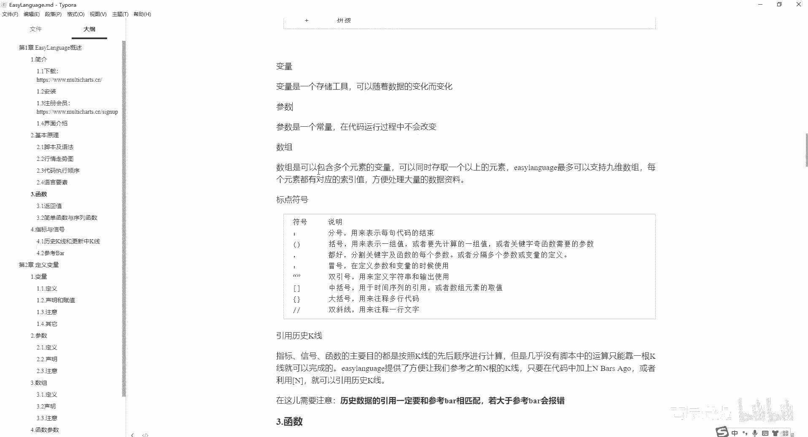
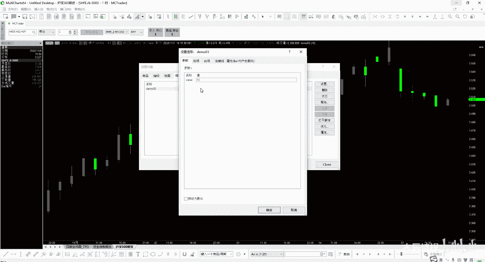
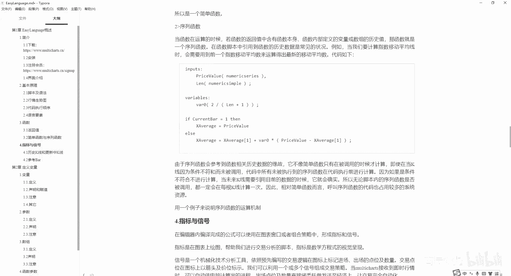

# 第3节课 数据类型、运算符介绍、变量和参数 - P1 - 古辰诗提 - BV1tr421j75q

欢迎大家来到从零开始量化系列课程，MC课程的第三课，上一节课呢，咱们讲到了这个语言要素里边的数据类型和，日期和时间这些，当然在后边咱们会经常会用到的，尤其是这个数据类型，肯定你要写代码离不开数据类型。

你不管是你去呃填写参数还是复制变量，还是做一些条件判断，他肯定都需要对于数据类型进行定义的对吧，这个里边数据类型咱们讲到它有三个，第一个是数值，第二个是字符串，第三个是布尔。

上一节课呢咱们没有提到这个浮点数，其实在Python里边，咱们呃不是，其实在这个MC里边，咱们之前给大家试验的时候，不管它是整数还是小数，它都会以这种小数的方式给大家表现出来对吧。

但是一般你可能看一些解释的时候啊，他都会说就是咱们用的是浮点数，为什么会用成浮点数，这个需要跟大家解释一下，加深大家对于这个的理解，浮点数其实从字面理解的话，就是浮浮动的意思吗，点你可以把它理解为小数。

点数值为什么会叫浮点数呢，是这样的，就是，数值在计算机的底层的存储，它其实就是零和一对吧，他就是一个一个的小格子啊，为什么就是说像现在这个芯片技术，为什么说芯片要做到越好越小。

因为你底层存储零和一的这个基本单位越小，那一块这么大的芯片里边，它是不是存储的内容会越多，对不对，就是零和一的表示，就是说没有通电或者通弱电呢，它就是零，如果通了电呢，它就是表示一。

它就是表示一你底层存储的时候，比如说给一个数值，它的存储的这个长度，比如说是32格这样的小格子，咱们正常来存储这个整数的话，可以存储二的32次方减一个，当然它最最开始的那个，他得标示为正数还是负数啊。

它的限制就会在这就是最大数值的限制，当然你还可以通过我再给它赋予它更多的格子，对吧，呃但是一般情况下，比如说你在就是说像C语言里边，或者C加加里边，你来定义一个那个short s o RT。

这它的一个数据类型的时候，它就是给你四个字节，四个字节，一个字节里面有八个bit，也就是32个空格给你来存放这些数值啊，数值当你这个有限额之后，当然这个数是比较大的，当然它也有上限的，对不对。

但是如果说我现在又加上小数的存储，那是不是我得分出一部分的格子给小数，那比如说我分出一半来给他，那是不是就代表着它的整数的限制，就是二的16次方减一就这么大了，就是上限会变得比较低了对吧。

它存储小数是利用什么呀，就是降低了你的这个数值的上限来进行存储的，那这个就会产生一些问题，再比如说我存储的本来就不大，我整数里边二的16次方呃，用不上这么大，我只是用比如说只有100以下的。

但是我对精度要求会比较高，那你就需要就是说把很多的一部分给这个小数，对吧，当你一刀切的时候，我就是前16个格子放整数，后56个格子放小数，那它就叫定点，对不对，那如果说我可以来回浮动。

就这样既可以兼顾就是这个数值的上下限，也可以兼顾一些小数的精度，只不过如果说数值太大的时候，可能小数的精度会有所下降，对不对，所以说这个就叫浮点啊，就是因为这样的一个逻辑的这样的一个发明。

当然它里边的东西会特别多啊，好几本书呢逻辑的发明运用，获得了当年的诺贝尔奖，所以说这是在计算机发展史上，是一个很重要的一个发明，就是浮点数啊，为什么就是说不叫小数啊，浮点数就是代表着浮动的这个点数。

在计算机里面，计算机是有一种天生的缺陷的，就是在这个计算方面，比如说咱们理解的0。1这个很好存储，但是你如果把它转变成二进制以后，它是一个无限循环的二进制，就这样的话，你存储在电脑里边，你像0。

1这个正常的输出来，它后边会有好多零，然后在后边再加个一啊，或者几个，就是精度会有一些问题，当然对咱对于咱们来说影响会特别小，它都是很多零以后会加几个数啊，就是电脑的天生缺陷，就是因为它底层的存储。

它是零和一的存储嘛啊，字符串咱们很好理解，就是双引号引住的就是这个字符串，当然在咱们的这个MC上面，是不能输出这个汉字的，我觉得这是MC最不方便的地方，最不方便的地方标，包括一些你写完代码之后。

很多的注释你都不能用英文来写啊，是比较不方便的，布尔布尔这个可能以前大家听的很少啊，布尔它其实就是一个true天，就代表着你的这个逻辑是成立的，或者说你的这个是为真啊，就是就比如说我给它赋一个值。

比如说VL等于，比如说这个30日均线大于我的收盘价，如果这个条件成立的话，就为真，如果条件不成立的话，就为假，就是false f a l s e啊，这个布尔值里边只有这两个，一个true。

一个false，好吧，这个可以给大家演示一下，看一下啊，我再新建一个新号吧，这是第三节课，我就新建一个demo03，比如说我从这儿我判定一个条件，我先定义一个变量啊，VR这个怎么定义的。

咱们后面会详细说，我先定义上，因为要给大家做演示，比如说我一个value，我给它定义成force，就是它的初始值是为假的，然后我这个value等于我value等于什么呢，一大于一小于五吧。

然后我print一个value，哎这个我编译一下啊，这个是编译成功了啊，编译成功了，这是什么意思，就是我value，它是一个存储真和假布尔值的这样一个变量，然后我变量赋值成什么呢，一小于五。

它是一个逻辑判断对吧，一小于五是成立的，其实这个就应该赋值为true啊，咱们可以运行一下，看一下，咱们在这个里边插入信号，找到demo03，然后这里边什么也不用写，然后咱们可以看一下他的这个输出。

你会发现全是true对吧，我清空了，我再把它重新啊，当然这少了少了少了一个分号啊，我再把它进行一下编译好，他还是输出为true，当然如果说我把它改成大于，这就是为否的，然后我把它一开始赋值改为true。

我进行一下编译，它输出的肯定是force啊，就是这么一个很简单，不要把它想得很复杂好吧，这个是对布尔他的一个演示啊，时间日期咱们昨天也说过了，就是它有两个，一个是time，一个time下划线S对吧。

好后边呢咱们开始讲这个运算符，四种运算符呢分别是数学运算符，关系运算符和逻辑运算符以及字符串运算符啊，咱们挨个去讲数学运算符，咱们很好，能理解啊，就是加减乘除括号，数学运算符只能针对于数值啊。

另外你除法的除数不能为零，就是数学运算符只能针对于数值，另外这个加号啊，就是它不一定就是包括这些，在其他语言里边，他可能也可以对别的这个数据类型进行运算，但是在MC上除了加号，就是你像减号。

尤其是减号乘号除号括号当然用的会比较多，但是在数值运算里边，它如果被认定为是这个数学运算符的话，它只能是运用在数值上面，好吧，这是数学运算符啊，这个就不多说了，除数不能为零，这个一定要注意关系。

运算符就是他们俩之间，两个对象之间的一个关系，就是小于大于小于等于大于等于等于，这个就没得说，这个等于是单等于啊，千万不要写成双，等于在很多别的语言上都会有双等于，但是在这是单等于不等于要注意啊。

它是两个，就是一个小于号，一个大于号，它表示不等于逻辑运算符，and和or就是我这个条件加上我这个条件都成立，就是且嘛对吧，or的话就是我这个条件成立，或者另外一个条件成立。

就是or就是或这个我相信也都能理解啊，字符串运算符就是一个加号，它是一个拼接，就是我一个字符串加上另外一个字符串，它就成了一个新的字符串，就比如说我把这给注释一下啊，就是我一个我定义一个字符串。

VRSTR下划线一，然后这个字符串我给它赋一个初始值，就是A啊，然后我再定义一个字符串STR2，然后给它附一个初始值，就是B是吧，好然后我print这个STR1啊，加上STR2。

我编一下建立是没有问题的是吧，这个时候哎我让他直接从这输出一下，看一下，就是AB嘛，他就是简单的拼接啊，好，下面咱们说变量，变量其实之前在演示的时候一直在给大家写，变量是存储工具。

可以随着数据的变化而变化，咱们在这写的这个STR下划线一，它就是变量，STR下划线二，它就是变量啊，这两个它就是变量变量，你可以它为什么叫变量，因为它是会随时变化的，就是在这个程序的运行过程中。

它的值会变化，比如说咱们定义一个均线的值，你随着行情的发展，这个均线的值它会一直会变化的对吧，这叫变量跟它对应的呢叫常量啊，在MC里边咱们叫参数，就是下面这个参数参数是一个常量。

在代码运行过程中不会改变，这个在一开始理解的时候，可能老板们会有些懵，就是咱们如果说定一条均线，这个均线呢是30日均线，他这个30其实就是参数是一个常量，它是不能变化的，但是我说的这个变化是。

在计算机执行这个代码语言的时候，这个30不能变化，很多时候咱们会啊，我要回车的时候，我可以把30改成40啊，那为什么就它就是个常量的，它指的是指在计算机运行过程中，就是在代码运行过程中不会被改变的。

这叫常量，你改的那个只不过是你人为把它改掉了，然后再运行，但是在运行过程中是不能变化的，这个就是常量，在MC里边咱们被被称之为这个参数，参数的设定一般都用input，就是一般会在第一个输入input。

input或者inputs都可以啊，不分大小写，比如说我我定义一个value，这个里边附一个初始值十啊，这个就是定义了一个参数啊，你如果说去改变这个参数的值会出问题的，会出问题的，我把它先给注释掉。

我比如说value，等于100，我给它赋一个值啊，然后再进行编译一下错误列，你看valuable or refinal expect，它是有错误的，但是如果说我没有这个复制的话，它编译肯定是没有问题的。

你不能对你的参数进行复制，因为它是不可变化的，好吧啊，就是在代码内是不可变化的，先简单了解一下，后边也会详细讲，数组数组是可以包含多个元素的变量，可以同时存取一个以上的元素。

easy language最多可以支持九维数组啊，每个元素都有对应的索引值，方便大家处理大量数据，这个先进行一下了解啊，在这我要说一下这个变量啊，变量它其实就是什么，在计算机底层里边。

还是咱们刚刚的那句话，比如说这个一段它里边赋的值，我给它定义好了，就是数值型的，数值型只能是赋值整数或者小数，但是它表现出来都是小数对吧，但是我怎么去从计算机里边把这个数值，我已经给他放好了。

就在这儿呢，那我怎么去给他取出来用呢，你必须得有个代号吧，对不对，所以说我把他这个，你可以把它理解为就是一个房间，这个房间它的名字呢，比如说我给它命名为value，我我把他的这个地址。

就是这个名字的地址指向他，每当我调用value的时候，就是这里面存储的内容啊，你要有这样的一个概念，就是变量它是个什么东西，其实参数就是常量是什么呢，其实也是在内存里边儿有一块空间。

这个里面存储的是一个常量，然后它的这个房间名，比如说我刚才就是命名一个V吧，我这个房间名他给规定好了，我这个房间房间名里边的东西不能变啊，就是我这个只能唯一指向于他，其实这就是常量或者叫参数。

在代码运行过程中是不会改变的，可能有很多老板会说了啊，既然他这个常量我是100，我就直接写100不就得了吗，我干嘛非得用一个名字去代替它呀，是你是100，你容易去写，比如说我这个里边赋值的是一段话呢。

对不对，就是英文的一段话，一段语句呢是吧，我不能每回我在写代码的时候，我就把这段话我再写一遍吧，如果说我给他复制成一个A，我每回来调用的时候，我是不是会很方便，另外一个。

你代码里面写了很多很多地方用到了这段话，那我想改这段话，我是不是直接改一下，我这个A里面这个值就可以了，对不对啊，我没必要再去哎，就是逐行逐行的去改吧啊这样会很方便啊。

其实在计算机底层里边来执行代码的时候，它你虽然是命名成了A给他，他其实来执行的时候，还是把你这段字符串给放到那个，源代码里边去了，但是对于咱们写代码来说，这样会更加的方便，会更加的方便。

而且你在在这个整个MC的配套里边。

就是你在就是从这儿来设置信号的时候，比如说这有个设置，它会把你这个参数你可以随时进行调整是吧，比如说我想试一试几个参数。

我从这儿来调整就可以了，如果说你写到里面去了，你还得把它打开，然后打开完了之后，你还是吧，可能会有多个地方用了这个常量，你还得去就是说去修改这个，挨个去修改这个参数，万一有哪个漏掉了，这样好很不保险。

对不对啊，这个就是为什么会有常量这个东西好吧，数组咱们后边说数组是一个坎，咱们之前也提过啊，它是它其实从底层表现出来的还是比较简单的，就是我这个代表着，比如说我这个存储了一一个数值。

那我就说给它划分100个，这个就是这样的块是吧，存储的都是相同类型的数，数值划分的大小都是一样的，然后给它统一命，就是命名成一个就是A，这样你通过比如说我通过一个索引索引，以一种方式啊。

它的方式就是中括号后边我取上五，我就是把它的编号为五的这一块内存，给它给取出来，里边只给取出来对吧，这样理解的话就非常容易去理解啊，好后面会详细说啊，标点符号啊，封号是用来表示每句代码的结束。

括号用来表示一组数值啊，一一组值或者要先计算哪一组值，或者关键字函数需要的参数啊，关键字函数需要的参数啊，这个咱们后边会说讲到函数的时候会说，当然他在数学里边其实就是优先级最高的嘛。

我先计算括号里面的内容，对吧啊，当然他在这个这个括号啊，在这个编程里面会应用的特别多，尤其是你学到C，学到Python的时候，和括号很重要，当然在MC里边，括号也可以被用于函数的调用。

然后里面进行传参逗号，分割关键字解函数，解分割关键字函数的每一个参数没有几，或者分割多个参数或变量的定义，就是你在定义变量的时候，你像这是用逗号来分割的，包括你传参的时候也是用逗号来分割的啊。

冒号就是在定义参数和变量的时候使用双引号，用定义这个字符串和输出的时候，使用定义字符串，咱们演示过，输出就是用print，咱们也演示过，记住一定是双引号，而且是得在这个英文半角下的啊。

这个应该是中文版下的，应该是在英文半角下的啊，中括号就是用于时间序列的引用，或者数组元素的取值，时间序列的引用就是咱们也之前也演示过，其实就是偏移，其实就是偏移，写一下啊，就是我当前的K线。

我想取前面的历史数据的某一根数值是吧，就是你可以用中括号往左偏移多少，你不能往右偏移啊，往右你就是当前K线，你往右不就是属于是有问题了吗，对吧，你是在做这个未来函数呢，MC上也存在一些未来函数。

可以给大家写一下，就是从这儿吧，就提一嘴这个未来函数，未来函数是比较要命的，就是就比如说有一些可能很不经意间存在的，这个，比如说我如果收盘价小于100或者小于1000，我就在收盘价的时候平仓。

这个其实就涉及到未来函数了，就是收盘价它还没有完成的时候，你是不知道收盘价的，因为收盘价5分钟也好，10分钟也好，在最后一个tick没有来到的时候，你根本就不知道收盘价是多少。

但是如果说你知道了收盘价是多少的时候，你根本就不可能在这根K线去进行交易了，对不对，那就是其实在不经意间就使用到了，这个未来函数了啊，就是提一嘴，未来函数，是咱们在量化里边需要极力避免的一个东西啊。

未来函数写出来的策呃，那个策略都特别的好，但是一跑实盘特别拉胯，大括号是用来注释多行的，双斜线是用来注释一行文字的啊，引用历史K线指标，信号函数等啊，的主要目的都是按照K线的先后顺序进行计算。

但是几乎没有脚本中的运算，只能靠一根K线就可以完成的，EZLAMAGE中提供了方便，让我们参考之前N根K线的这样的一个方式，只要在代码中加上n bus go，或者说是用这个中括号的这个N。

就可以立时引用历史K线了，你也可以把它说成是偏移啊，在这儿需要注意的，历史数据的引用一定要和参考霸相匹配，若大于参考霸就会报错，什么意思，之前一直在给大家提这个参考罢对吧，一直在提这个说过这个参考吧。

也说过为什么要有参考吧，就是这个历史数据的引用，也跟这个参考吧是有关系的，比如说我print一个close，这个close是代表着当前这个坑，就是当前K线的收盘价，我如果说让他往右偏移六根，这个很好。

就是很能就是很很容易理去理解啊，就是往右偏移六根，其实就是引用了倒数第六格的这个历史数据，对吧，我编译一下，它编译肯定是没有问题的，但是他会出一个错误，刚才听到叮一声啊，但是我这是两个屏的，大家没看到。

就是我把它这个信号他现在自己就关闭掉了，我把它状态再打开，我再关闭了，你还会听见丁医生，当然这个是在我另外一个屏幕上，你看不见啊，它会报错是因为什么呢，我的这个信号你看它又自己来关闭掉了，是因为什么。

我这个里边设置的指标呃，这个指标运算的参考最大bug的数量是五，如果说我把它改成十，他就没有问题，他就能能输出啊，这个时候他就会有输出内容了，哎我再让它运行一下，Paint close，六设置信号状态。

我开启一下，这个时候就不会报错了，然后他就会有输出内容了，刚才如果说我给它设置成五，设置信号属性，我把它改成五，五是比六小的是吧，所以说他的参考吧有问题，他就引用不了前面第六个。

他最多引用能引用前五个啊，他会报错，你想他会自己会自己会关闭掉，就是出了问题了，然后这儿呢也不会再有输出，这个是之前输出的啊，之前可以把它清除全部，然后我再把它打开一下，设置信号状态。

close叮一声还是会报错，然后从这儿它不会有输出值啊，一定要注意这个你能往前引用多少，跟你的参考吧有很大的关系啊，若大于参考吧，会报错，好吧好，下面咱们再讲一下这个函数，函数由我们自行定义。

可以让其他脚本调用，并且可以可以有返回值的一个脚本，函数的返回值可以是数值字符串或者布尔值，返回值是什么呀，就是我运行一段代码，比如说我计算它们相加相乘，或者计算一个任务是吧，计算完了之后。

他会给我一个结果啊，录一段代码在多个脚本中被调用，建议可以将其单独写成一个函数，方便使用和和这个后期的维护，例如啊，这有一个经常就是进行加总的，这么一个东西是吧，就是加总这个逻辑很简单，它是一个循环。

for value1就是这是一个变量从零啊，链是我输入，我就是可能是不是可能啊，就是我的一个变量或者一个参数链简易，比如说我把这个参数传递进去是十，就是0~9是吧，012356789。

begin就是开始，end就是结束，然后中间它做什么呢，我这个V20它也是一个变量，V20等于V20，加上我这个就是说我需要所加的这个值啊，他这个是在往左偏移吗，price value就是往左偏移。

你可以把它设成close open什么的，它其实就是一个加总，但是呢你可以把这个加总写成一个函数啊，这个some Mission啊，其实就是some some就是加总的意思嘛，咱们可以看一下。

就是some Mission，它这样的一个函数，打开函数，你看这就是它的一个逻辑啊，就是它会有一个返回值，就是这个some machine，然后你可以进行给它进行赋值啊。

比如说我value1等于some Mission啊，多少加上多少，里边填进去这个参数啊，这个咱们后面会详细去讲好吧，在这就给大家看一下，先熟悉一下好代码，变得简洁，可读性高，就是未来也可以做到模块化。

这个咱们之前反复说过，返回值在MC里边函数有且只有一个返回值，代表着运算结果，返回值的类型啊，是在函数代码中预先定义的，这个咱们后边会说，你记住在MC上返回值只可以有一个，但是在别的语言里边。

函数的返回值是可以有多个的啊，在别的语言里面，函数的返回值是可以有多个的，而且在MC上也可以通过别的方式来实现，它多个的返回值啊，然后这个是比较重要的一个，就是简单函数与序列函数。

这个需要跟大家好好的去捋一捋这一节课，这个算是一个很重点的东西，函数根据是否引用到历史数据，区分为简单函数和序列函数，大部分的函数是简单函数，代码回调函数或并取得返回值啊，单有这些就是单有这些蛋啊。

这应该是蛋不是蛋啊，但有些时候函数计算时会需要参考到函数本身，记住第一个函数本身，第二个函数内定义的变量或数组的历史数据，函数内定义的变量或数组的历史数据啊，这个很重要，这一类的函数我们称之为序列函数。

落在新增函数的时候啊，在函数存储设定的地方设为自动则，easy language会按照是否引用历史数据进，就是进行定义什么意思，就是当你的这个里边儿，比如说我这代码里边调用到了历史数据对吧。

这个中括号六它是引用的历史数据啊，它是就是往前数六根啊，对不对，调用到历史数据的时候，它就是一个序列函数啊，当然我这个不是函数啊，我这个是个信号，但是我写到函数里面去，它就是一个序列函数。

但如果说我函数只是简单进行加减乘除，比如说我像我这个some man就是这个SAM啊，我打开里边，这个里边没有用到这个历史值啊，当然这里面也用到了，你看啊，这可是这个这个有这个偏移了。

因为你这个里边存就是传入的，肯定是close open啊之类的，有偏移的，这个还不是就是一个简单的函数，我看看啊，能不能给大家找一个就是简单函数，啊你像这样的函数，它就是一个就是简单函数。

当然这里面也标明了啊，这就是这个参数，这个是一个呃就是simple啊，它就是一个简单函数，就是这个里边没有没有这个引用函数，本身就是这个c do g啊，这个函数本身以及呃没有引用到历史数据。

它就是个简单函数，如果说你像这样的函数引用到历史数据了，包括咱们刚才写的这个里边有这个六了，当然这个是个信号，它不是一个函数，它就表明是序列函数，MC会自动的去识别它的，去识别它简单函数和序列函数的。

你如果说看定义的话，可能会比较绕啊，在运算简单函数的时候，函数并不会引用函数本身，函数内部定义的变量及数组的历史值，但是可以引用参数的历史值啊，可以引用参数的历史值，简单函数的返回值。

内部的变量及数组是跟随K线存储的，只有当脚本调用的函数时才会计算，因此简单函数会使用较少的资源，同时计算速度比序列函数来得更快，其实说白了就是当我执行代码的时候，我简单函数才会来执行啊。

比如说我就是这我写一个value2等于二加，就是这个比如说我就字符串A吧，然后加上这个STRE，说白了就是我执行完一根K线，就是一根K线走完了，它才会调用这个代码，它才会它才会执行这个Y62等于什么。

它才会进行复制，如果说我加上判定条件，就是说他满足什么条件的时候，他才回，它才会有这个操作对吧，但是序列函数它会什么呢，它每次在更新的时候，就是哪怕就是说你有条件，他没有执行相应的代码。

它里边的序列值也会跟着更新，就像这个close，它本身就是一个序列函数，对不对，你什么时候调用，你可以给他做这个历史数据的调用是吧，他肯定是得把close挨个的在你代码运行的时候。

把你挨个的去给你存储在这个底层里边，方便你随时去调用历史数据啊，方便你随时去调历史数据的，它存储的时候肯定不可能只存储了一个close，往右偏，就是往往左偏移六个，他肯定把所有的close啊。

就是所有K线呢，就是咱们那个图表上所有的K线制，close都存储下来了，都存储在底层了，然后你在调用的时候就会很方便，当然这个存储的量是多少，就是你存储的这个参考吧，参考吧就是你设定的这个参考吧。

它会给你单独的把这个序列函数里边的，就是说函数也好啊，就是说你的这个变量也好啊，它会存一个序列出来多长，就是你参考吧设定的那个长度啊，简单函数就是不用我执行到了我才运行的，我执行不到，我也不用行啊。

咱们看一下他的这个解释啊，你看简单函数range high减low是吧，因为我没有调用到它的这个历史值，所以说它就简单的进行存储，但是序列函数呢，当函数在运算的时候，若函数的返回值中含有函数本身。

函数的返回值含有函数本身，如果你高中数学还学的可以的话，你就会知道那是个递归函数啊，那是个递归函数，就是函数的返回值，还有本身这个咱们就不细究了啊，就是函数内部定义的变量或数组的历史值。

它一定要是历史值啊，就满足这两个条件，那函数就是一个序列，函数在函数脚本中引用到历史啊，引用到函数的历史数据是常见状况啊，例如我们要计算这个移动平均线的时候，就是这个应该是指数移动平均线啊。

就会需要用到前一个指数平均数来运算，得到新的这个移动平均数，你想这个是移动平均线的那个源码，就是x average，咱们可以在这个里边给大家看一下，就是X不是减啊。

这个x average咱们可以右击打开函数看一眼，你会发现它的返回值就是这个average，等于x average，往左偏一个加上V201个什么东西是吧，这就是引用了函数的本身。

他其实他的逻辑就是什么呀，就是说我当前这一根K线的x average，或者叫指数平均值啊，指数平均值，那它就等于我前一个的指数平均值加上啊，链就是你设定的这个长度啊，一般放个十，就是11分之2×1个。

当前的这个收盘价也好啊，就是说这个或者开盘价也好，你用这个价格减去一个之前的这个XM理解啊，其实就是这么个逻辑，但是它会引用到本身好吧。

