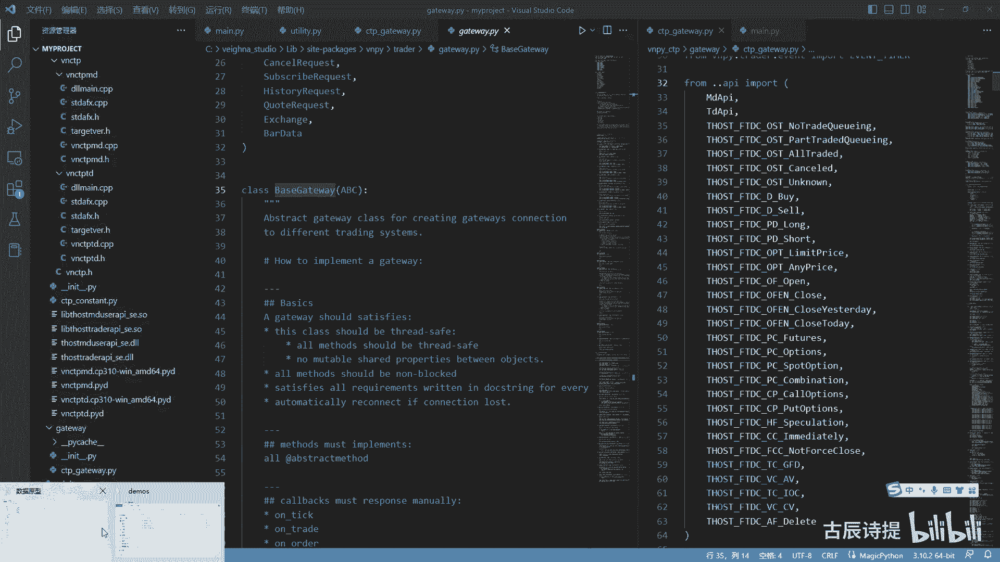
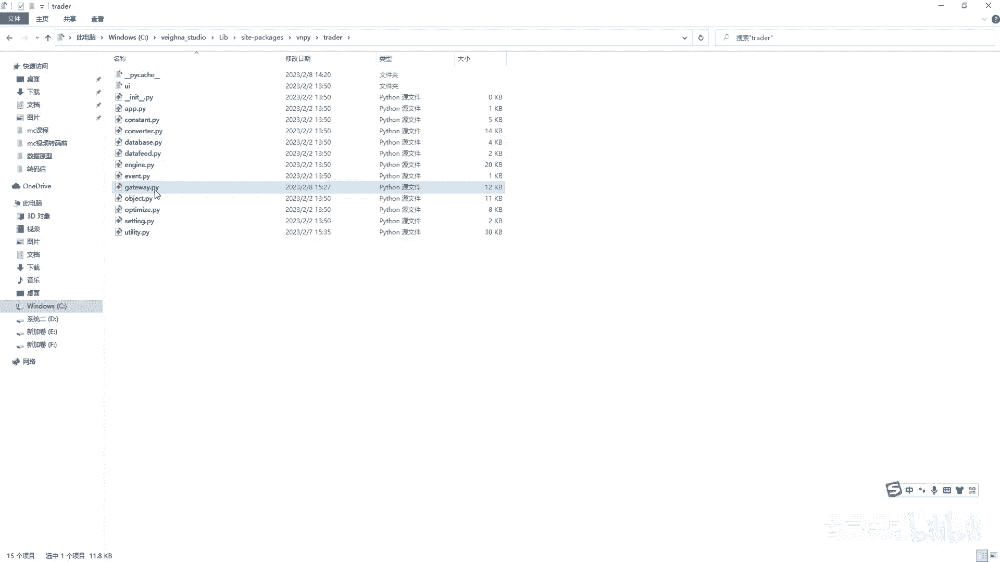
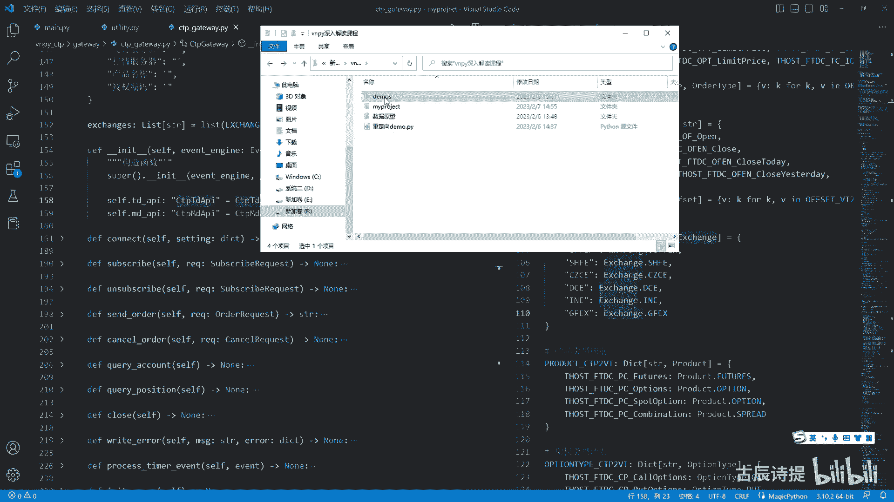
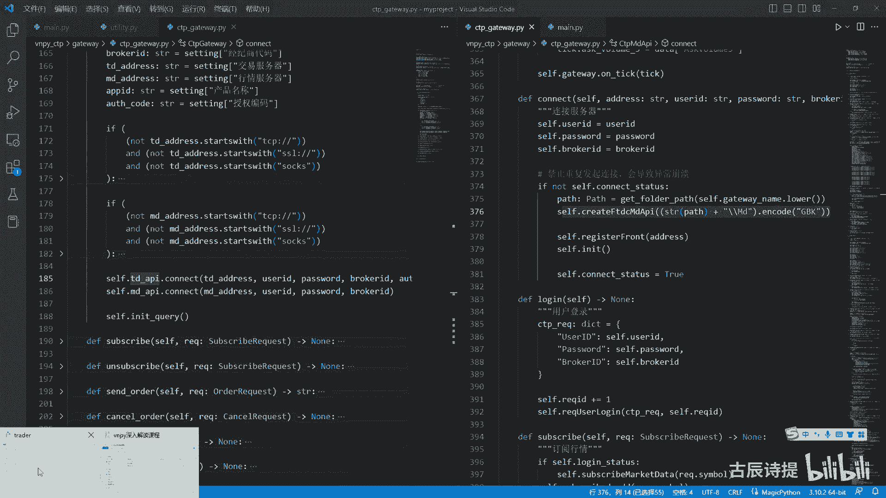
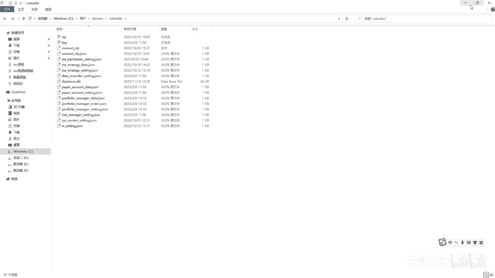
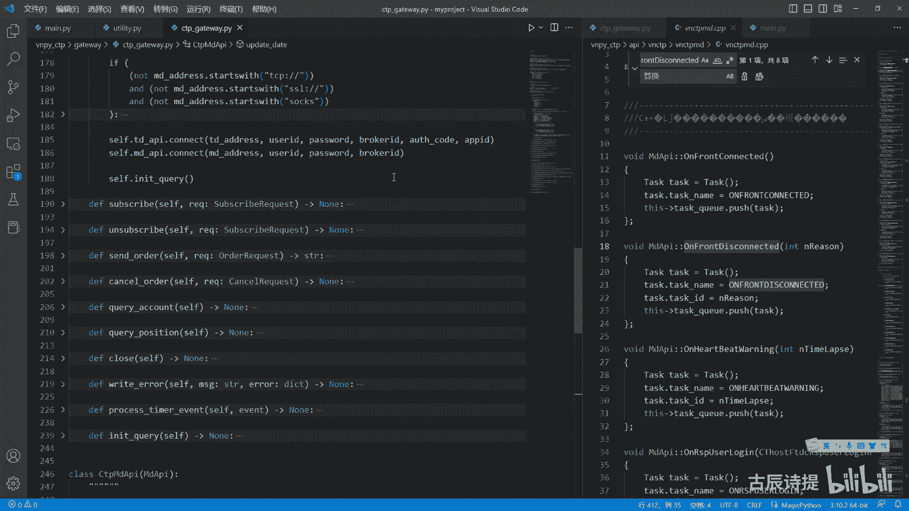
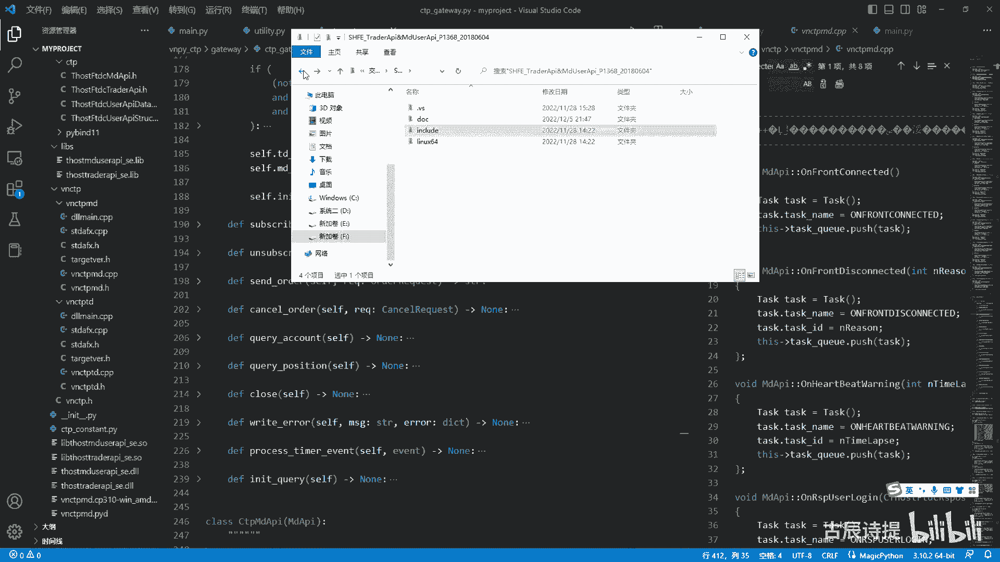
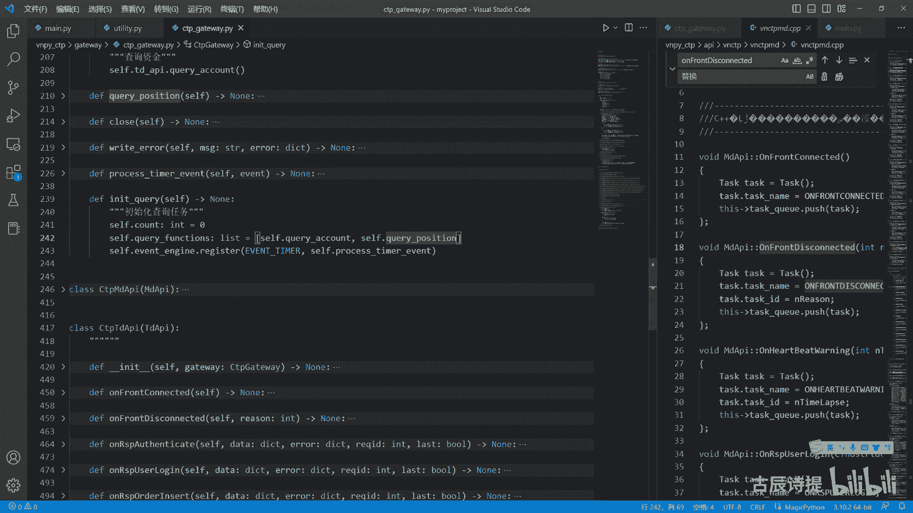

# 第4节课 CtpGateway(2) - P1 - 古辰诗提 - BV1vx421D7CK

那咱们就来看这个cp gateway呃，这个cdp gateway呢，你如果说把这个底层捋清出来，其实这就很简单了，就是没你想象的那么复杂啊，那咱们具体来看一下CTRLKCTRL0啊，先把它收起来。

前面的这些导包啊，包括这些字典啊，是吧，这些都是字典吗，咱们先等会儿看，就是涉及到了之后，咱们再看包括定义的这个常量啊，还有这个什么缓存啊，咱们就等会看。

先看咱们这个c TP k v city gateway里边，它继承了什么呀，Baskeway，咱们先看一下biscuit way，BGATEWAY呢，它继承自ABC这个AABC。

不是那个ABCD的那个AABC，它是abstract method class啊，abstract呢它是就是这个object object是抽象的意思，为什么要继承制自这个object。

因为它这个规定了统一的接口，因为咱们用的是这个CDP接口，你还有一些别的接口吗，你像这个gateway啊，这个best gateway，它所在的地方都不是说在你这个里边了。

他是在统一的这个咱们C盘下面的这个呃。

Lib site packages，在那个VNPY里边，在这个VNPY里边，就是这个啊p c china invent china，在china里边，这个应该是base，啊这个应该是gateway啊。

这个是在这里边啊。

它是gateway嘛是吧，这个就是gateway嘛，是在那个里边的，那就说明他是一个给规范好了的，统一的一个接口，你别的接口就是飞马的也好，CDP的也好，或者就是一些别的接口，你都得继承自他。

那它规定了哪些，你必须去实现那些东西呢，就是这个用at object method的装饰的，这样的一些方法，你必须得在你的子类里面重写它，你如果不重写的话，会出问题的，会报错啊。

你像包括connect close subscribe sorder cancelled，你像这些是必须得有的，对不对啊，这个就是他为什么需要继承它，但是它这里边呢又不是一个纯粹的一个抽象类。

它还给你实现了一些功能，最主要的功能就是这个own invent啊，最主要功能就是own invent，这个all in meter是干什么的，其实就是往这个cf点engine。

就是事件引擎里边去放数据，就是往里边放数据，然后on tick你想调的是on event，On trade，调用的是on event，只不过呢他就他从这儿呢写了两个是吧。

一个是咱们通常认识到的这个int tick，它是一个标识啊，然后这是tick的数据是吧，然后放到那个engine里边，这呢他又加上了这个这个DIVISIMPLE，就类似于这样啊，这是我后来写的。

就是因为这个etc它是带点号的，你没发现他这都带点号嘛，是吧啊，点号他是为了干什么，到时候你分割的时候特别好分割，你用这个STR点split，这个里边一个点号就就可以把它分割成一个。

就是就是一个元祖对吧，它就会就是分成三块，按点来分是吧，你特别容易分割，所以说它给你很贴心的加了一个点啊，很细致，然后这tick呃，加上这贴个点very simple。

这样的话你再去注册事件的时候往这个呃，因为硬件里边去注册方法的时候，是不是可以更加精细化，比如说我的策略我只用了这个2B2304，2305，我就只用注册啊。

就是因为这个加上这点very simple不就可以了吗，是吧啊，它是起到这么一个作用，这个你理解了你们engine的作用之后，这个其实就很好理解了，这个也不难看出来，咱们之前一直在讲的。

就是因为engine就相当于一个传送带，里边放着的全是一个个的数据，你可以理解为一个个的包裹，那在这个接口，这就是gateway，这你更多的是往里去放对吧，等咱们说到了这个CTA引擎。

咱们具体去处理这些这个数据啊，order数据啊，然后去来再返回头去发送委托的时候，这里就应该是去接收了，那接收之前你是需要去region，就是去注册，然后用相应的方法放进去，然后来处理这些数据对吧。

这是他的这个呃BASKEWAY，他做的事情啊，BGATEWAY做的事情，这个你得知道啊，好然后呢，就是这个就是这个类属性，里边其实没什么东西啊，default name就是CCTP。

然后这个defaulting啊，就是给你写了这么一个字典，当然咱们在连在连接的时候，肯定得是自己往里传的对吧，exchanges啊，你看一下exchanges它是什么呀。

list这个字典的values这个字典是什么呀，看一下这个字典，其实就是这个嘛是吧，他只不过是把这个字符串变成了一个对象啊，这是一个类嘛，类里边的一个对象嘛是吧，如果说这加上一个value value。

他就完全是跟他一模一样了啊，但是你你这样的话，它就是一个被exchange包装好了的一个对象，对吧啊，所以说没什么太复杂的啊，没什么太复杂的，看似好像就是又是映射，又是什么呢，其实没什么。

只不过他这就是一个list里边放了，就是就是哎呀放了这样的数据类型，然后把这个六个都放进去了啊，好咱们看他的这个INIT构造函数，构造函数里边没做别的事，就是就是创建了两个类，这两类都是继承自啊。

都是继承字，就是咱们这个底层嘛，就是这个MDAPI和TDAPI对吧啊，这两类都是集成自制的，但是CD p get away，不是集成自制的啊，它就像是一个外壳，然后下面包含了两个类，你具体的去呃。

就是说往回去调用去实现操作的，还是这个两个类来操作，这儿呢你也可以把它理解为就是一个分发，我要订阅行情，我就找这个MDAPI，我要发送委托，我就用TDAPI是吧，这可能大家有些疑惑的。

为什么会有一个双引号啊，为什么会有个双引号，咱们我从这再打开一个。

通过code打开一下啊，嗯其实这涉及到了一个什么呀，就是哦比如说我定义一个类person啊，然后我就写一个pass吧啊啊，然后下面一个类比如说呃，哎哎我上面一个类吧，比如说man man。

然后我继承自呃，我不继承自什么啊，然后我这DEF下划下划线INIT的时候，我需要比如说这个P1等于person，啊什么什么什么，然后这我标识一下，然后这是个person，当然他在他的这个下边是吧。

他在他的下面或者说是什么，就是说man说哎我卖一吧，我卖一啊，然后我标识一下man，然后等于啊就是比如说我一个就是一啊，我这个卖一它是一个man类型的，但这个man它还没有被创建出来呢。

就是他还没有这个呢，就是你从这加一个双引号啊，是比较合适的啊，是比较合适的，比如说我传过来的嗯，这个还是不是特别贴切啊，就是当我这个类不存在的时候，我需要往里边传一个东西，比如说我传一个man。

它是一个man类型的，你这个时候是不是不存在的，这个man是吧，因为我还没写出来呢，对吧是吧，这个时候你就可以加一个双引号啊，就是加一个双引号啊，其实这个也是这么个意思，就是加上双引号。

就是这个CCDP，这个TDAPI还他还没有呢啊，他还没有呢是吧，因为他在下边嘛对吧，C这个他在下面还没加载到呢啊，双引号就是这么个作用，其实更多的是为了标识你，你就把他删了，他也没它也没事是吧。

你连这个帽子后边一起删了也没事啊，好就是咱们在就是就是去连接服务器的时候，就是通常情况下是什么呀，就是咱们调用的时候就调一个connect是吧，但是实际上比如说我要去登录我的呃，网易邮箱的时候。

你首先你得去连接那个服务器啊，你你就是先得把这个网页打开呀，然后再输入账号密码呀，所以说你必然有一个连接的过程，就是不知道大家有没有发现，你在每次连接的时候，他先是给你发送行情服务器连接成功。

然后在这个登录成功对吧，所以说你先得去连接你像连接呢，它也是连接两个这个呃，就是一个是行情服务器，一个是这个交易服务器啊，它连接的时候他做什么呢，这connect啊。

它连接的时候你会发现它它会往底层掉是吧，往底层掉，这呢它有一个路径路径传给了底层，然后还加上了MD，这是做什么呢，其实是什么呀，就是咱们在你在每回去创建的时候啊。

你在C盘下面就是在这个用户啊，这个LV或者这个那个那个那个什么里边，它会有个点wintry，这个里边他会创建一个CDP是吧，然后这里边有一些MDTD的一些东西啊，它其实就是把这个路径给他传过去啊。

你像这个get float pass啊，这个咱们后面再讲，其实就找那个点VTA的这个路径，然后他encode g bk啊，这个还是往底层去掉啊，当你就是说行情啊，不是这个服务器连上了，连上之后呢。

它会给你反馈的啊，就是连上之后会给你反馈反馈呢，它是用什么呢，用这个呃，On front connected，就是服务器连接成功回报连接上了，也就是登上了，登上了之后呢，他会告诉你行情服务器连接成功。

然后你再去登录登录，你是需要就是说输入用户名密码对吧，然后再传到底层去登录是吧，就是这个逻辑嘛，可能有很多就是这个朋友们看了啊，为什么connect还有个log呃，这个这个这个login是吧啊。

这其实就是先连上诶，然后再登录，其实就是这么个意思啊，这个咱们就不去过多深究了，因为你最底层的代码你也看不见，对不对，好呃，它不是一个就是说立马就会有消息的，就是跟咱们这个方法调用式的。

有没有返回值立马就出来，不是这么回事的，你去连接服务器，你得等它响应啊，响应完了之后，它会如果连上了，他会给你发一个这个连接成功，然后你再进行登录，这个逻辑没问题吧，也非常容易理解，如果连接不上啊。

他会给你发这个行情服务器连接断开，原因是什么啊，说到这个原因啊，有很多老板都问，为什么会有4097这个问题，其实你还是去底层去找，去哪呢，去这个数据里边去不去这个接口里面去找，比如说我从这儿啊。

然后这个，给我再给他把这个换一下，换一下JP错误在这呢啊，看on这个from disconnected，当然你查找的时候，你可能一步查不到，这就是说你可能会从哪儿啊，就是说从这个比如说MD哎。

咱们是打开的是这个MD是吧，你你可能会从MD这去找，就是这个MD这CPP啊，然后这个连接错误的原因是吧，就是你会on from disconnected啊，找然后诶从这儿我找一下找啊啊。

就是这其实确实还是这个int n reason，是不是啊，Int n reason，你最终你找到的还是这样啊，n reason是就是个什么东西啊，就是on from disconnected嘛是吧。

就这样嘛是吧，到这来，你看这个是他的错误啊，什么0X1001，这个是什么呀，这个是二进制吧，咱们直接给他输出一下，咱们可以看一下啊，就是print一个直接用十进制的给它给输出出来，你会发现它就是什么呀。

4097吧哈它就是4097，所以很多老板们问为什么4097出现问题，它的原因是什么，原因是什么，网络读失败，那究竟怎么产生这个原因，其实呃你得看底层是吧，你是没连上啊，还是柜台瓜类啊什么的。

但是就是解释的原因就是网络毒失败，这个是比他多一个就是4098，这个不是二进制啊，这个不是二进制，就是4098，4098，4098，就是那就是网络写失败啊，网络写失败，ox是16进制吗，还是几进制啊。

查一下这个就可以了啊啊这个是吧，就是很多时候都不知道你的原因是什么，就是这个原因你得自己找啊，好这是连接，连接完了之后，就是你必须对我的就是subscribe，就是订阅行情，不然的话你是不会有数据的啊。

它一样的还是往底层去走对吧，一样的还是往底层去走啊，你subscribe完了之后，这个是咱们自己写的是吧，你close close，这他就直接自己self dex it了。

这个也是这个C加加底层的这个MDAPI，它有一个方法是exist啊，就是退出去了啊，这个update date就是就是当前的这个时间嘛，以这样的格式给这个赋值给C点。

CODATE为什么要更新当前的这个日期啊，就是有些地方他需要用到啊，有些地方需要用到，为什么会用到，其实就是数据处理，因为你接收的是几个交易所的这个数据啊。

几个交易所的数据数据你从这个什么能看出来，就是这个什么most lost，不是那些马是吧，但是咱们下载下来的就是说这个API，交易所API你会发现它它的这个是什么呀，win32啊。

为为什么它分win32和这个LINUX，就是LINUX就是放在点O就是放在这个就是这个LINUX，包括这个苹果系统上的这个链接库嘛，然后你windows的话都是放在这个win32。

就是为什么是win32，不是win64，因为64可以兼容32，但是32不能被64啊，不能把64给兼容了对吧，然后你看这个，它就是就是直接就是这个user API是吧，然后他给你的这个解释是FTD是吧。

他没有lost，这其实就加了个OST，就是这些，但这个呃就是是指的，当然他没有写SHFE就是上期所的啊。

但是里边的东西都是一样的啊，都是一样的好吧，这个连接完了之后，订阅行情啊什么的，咱们刚才忘了说了一个，就是在最后它还有个这个query啊，Intequery，INTEQUERY是来做什么的。

咱们这节课把它解析完了之后就结束下一节课，咱们再讲这些数数据方面的处理啊，就是他收到了tick order，什么是如何去处理的，你it query它是做什么的，你会发现这个是sell count等于零。

Save count，数数嘛，一看就是计数的意思，然后save the query functions，这是一个list，它是个列表，里边放了这个什么呢。

self query count和self query power position，query一般是申请的意思吗，什么query account是什么呢，就是TD点。

query account其实就是资金查询，然后你查到之后呢，他会给你包装成一个account data，然后给你就是返回来count在哪呢，T d account，我的query account。

在这呢和这个query position，它其实就是去底层去查询资金啊，然后呃去底层去查询这个持仓，然后查到了之后，它会一个on response或者on return，你看这个资金查询回报。

你向他申请了诶，然后他给你返回来，你有这个数据了，就来调用这个方法，然后查到了之后呢，就给你包装成一个com data，然后给你放到on account，放到那个image engine里边去。

你有需要的话就去取，包括这个position也是一样的，是吧啊，然后他会给你进行一下处理，给你包装成这个position data啊，position data其实你会发现。

不管是position data也好，order data也好，它传过来的都是对吧，这个data都是dict，其实都是对DICTT的一个处理，只不过这些你想跟instrument有关的。

一般都是合约代码是吧，这个pull up这个是什么pose，direction就是direction是方向的意思吗，是不是就是一般都是这些，就是包括这个嗯，就是这个tick数据的一些啊。

包括try的数据，都是给你把它打包成跟triad是吧，他给你打包成一个try data，然后再给你放到那个事件引擎里边去，其实没有什么复杂的，都是把字典转换成咱们定义好的，在object里边。

这样的一个数据类型是吧，这样的话呃不会就是说因为你拼错了呀什么的，产生问题，你如果说你单纯呢还是用字典去传也行，但是就显得很不方便对吧啊，这个就是query count和query position。

就是获取账户信息和持仓信息，获取账户信息有什么用啊，获取账户信息就是如果说你去做个界面啊，就是是吧，你需要实时看到你的账户信息啊是吧，但是呢其实在CT引擎里边，或者在main engine里边。

他并没有去接这个cod啊，并没有去接com data，如果说你想去接account data，你就需要自己去写一下，这个也就容易了对吧，呃你接到cod，你去根据它来计算你的仓位，什么都可以啊。

query position是来干什么的，你去发送一个委托出去，发送一个委托出去之后，你当前就是在你底层啊，在你这个顶层的这个策略，你就需要给他系上是吧，我发送一个委托啊。

然后呃就是呃比如说委托再返回来成交了，成交了，那我就得给他系上，比如说成交三首，我有三手持仓，万一比如说你是多策略的，单合约的这么一个程序，那就是来来回回的把这个持仓给弄乱了呢。

你是不是要你是不是需要就是不断的去调整它，对吧，这个query position就是这个作用，就是获取当前的持仓信息，像这两个都是需要你主动申请去查的，而并不是说服务器会给你主动发的，服务器主动给你发。

是在一开始的时候，你连接到服务器，服务器会给你发可交易的合约，所有的可交易的合约啊，以及你的这个就是以及很就是以及你的持仓，还有什么tick，这个会主就是会主动给你发。

一个就是这个可交易的合约和你的这个持持仓，另外的那个就是你的这个tick他是一直在发的，但是你正常在运行着的时候，他不可能主动给你发，只有你申请了，他才会给你发啊，申请了才会给你去发的啊。

然后你发过来就是你你得不断的去申请啊，不断的去调整是吧，然后他就会啊他从这invent engine这注册了一下，因为timer因为timer还记得吗，就是如果就是你没有往engine里面传入参数的话。

它是每一秒钟它会发一个timer事件，到这个engine里边吧对吧，然后这process tember event就是接收到了这个event timer之后，他就会来处理这个timer event。

你会发现传过来之后，他根本就没用这个event是吧，因为它只是一个就是信号，就是来了，我要进行处理了，他做什么事呢，self count加等于一，你看这就是计数的啊，如果说self count小于二。

他就return就是下面就不知就不执行了，你得等到呃两秒对吧，第一秒发过来不行哎，第二秒它会往下走，第一步就给你归零，然后第二步function这个是function啊。

function1看到这个就代表着它是函数，Squery functions，pop0pop列表pop它会有返回值，会把pop掉的那个给你返回出来是吧，返回出来之后它反它这个pop是零。

就是你的这个第一个，然后你给pop出去了，这里边就剩这一个了吧，然后pop出去了之后呢，他function调用其实就是执行这个函数里边，代码其实就是主动去查询账户信息，查询完了之后，你发送了查询的请求。

他查询完了会把那个放到就是给你返回来，返回回来它又会放到engine里面去对吧，你不就有了吗，然后当然他这个不是立马的回调啊，不会立马有返回值，它得等着服务器响应，我发出这个请求了，他可能0。

005秒给你一个响应，或者0。001秒的响应，是响应了，它就回调了，它就自然而然放到了那个，你那个invent engine里边去了啊，然后呢他就哎又把这个列表添加，把这个方法名也就是这个地址啊。

这个这个这个B包是吧，给你又添加进去了，就是这个一开始取取出来，只执行了一下这个代码诶，然后又给你放到后面去了是吧，又给放到这儿来了，然后你下一次再过两秒钟，不是你这不是归零了吗是吧。

然后唉再过两秒钟哎，就是先一个不行，然后第二个哎行了，然后就执行这个了，你泡不出来的就是这个了对吧，它是交替着的，这么先查account data，然后然后又查position data。

然后再查account data，它中间的间隔是多少啊，是两秒吧对吧，然后这还有个update，就是这个update date，就是更新这个日期嘛啊更新这个日日期是吧。

Md api update date，就是更新一下这个日期啊，其实这个就做了这个就是他这个timer，就是invent timer，在这个c c TP gateway，这个接口里边就做了什么呀，就做了。

就是出去反复的呃，循环着的去查询account data和position data，然后放到这个event engine里边去，好吧好。

