# 第4节课 简单函数和序列函数、指标和信号的执行区别 - P1 - 古辰诗提 - BV1h1421B7T4

欢迎大家来到从零开始量化系列课程，MC课程的第四课，上一节课咱们讲到了这个简单函数和序列函数，函数这一块，你一定要先理解一下函数，其实它就是形成了模块化的一段代码。

它的调用呢比如说像这个x average，上一节课的这个演示是需要用括号来调用的，里边需要有传入值，当然有一些函数是不需要有传入值的，你像这个XAVERAGE，你首先给它传入是price value。

其实就是给他传入一组数据，比如说我给他传入这个close，或者你直接写一个C也是可以的是吧，后边就是一个line，就是长度，我比如说计算十根K线的这样的一个值，冒号return就是它的返回值。

它也是number吧，它返回的也是一个数值，就调用它会有一个返回值，返回值我用一个变量来进行接一下，比如说我这个变量我给他设成这个VR，我就可以用VR我来接这个值啊。

这个就是调用了这个x average这个函数啊，这个里边称之为就是参数啊，这个参数，然后他其实就是执行了这段代码，然后把那两个值分别传进来，然后运行这段代码好吧，后边咱们也会详细去说。

你一定要知道函数是个什么东西呃，现在讲的可能比较慢，一点因为得让大家从一些根本上去理解一下，就是说这些东西它究竟是个什么东西，可能写的就是大家乍一看比较难以理解，就像那个浮点数。

浮点数和小数究竟有什么区别，对于小白来说，或者对于咱们就是不是从事这个，计算机专业来说，很难理解，他其实很简单，只不过起了个名字而已，好吧，当然如果说你从本质上来了解他的话。

你会发现这个事他肯定是有原因的，他为什么会这么命名啊，上一节课最后给大家讲到了，简单函数和序列函数，简单来说简单函数它的就是说你在运算的时候，不管就是说你代码是什么样子的，当能执行到那块代码的时候。

他才去进行运算呢，然后在底层存储的时候呢，它可能只是存储当前运算的这么一个变量值，但是序列函数不管你就是说能不能运行到它，它有些东西它这个序列是在更新的，以方便你之后的调用，上一节课说到这个close。

你可以把它理解为这个是个序列函数，这个话不对啊不对，我只是给大家做这么一个演示，其实close它是一个，你可以把它理解为一个容器，里面存储着当前K线的值，当然如果说你后边加一个这个中括号。

它引用了前面的值，就是它也存储了前面的值对吧，当你没有引用的时候，它可能这段代码它就会就是没有引用，这个之前的值的话，它只会存储当前的值，如果说你有他可能会把前面的值都存储下来，至于存储多少。

就跟那个参考吧有关系啊，这个是咱们反复来讲的好吧，先做一下理解啊，做一下理解，后边讲到了这个指标和这个信号，这也是咱们在前面演示在反复说的，为什么从这儿需要提一下指标和信号呢，因为他们俩有一些不一样。

说这些不一样之前呢，咱们先说一下这个嗯，就是有几个专有名词，其实就两个，第一个叫历史K线，第二个叫更新中的K线。

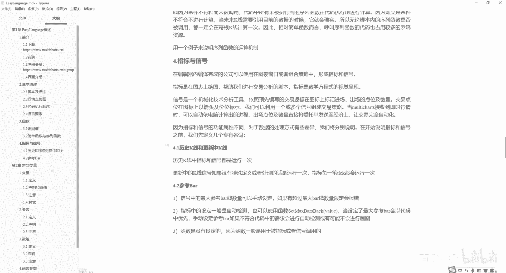

历史K线就是什么呀，就是这个K线咱们现在还在盘内啊，它还在动，这个叫更新中的K线，它这个之前的就是不再更新了这些数据，这叫历史K线。

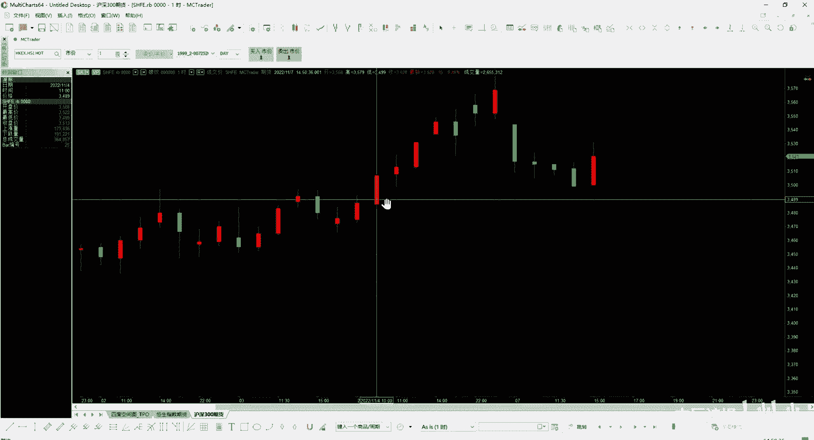

在这个信号中，就是咱们的信号中，如果说你不做特殊定义的话，就是更新K线啊，更新中的K线信号如果没有特殊定义的话，或处理的话，它只会运行一次，而且是在什么时候，是在你这个K线更新完了之后，它会运行一次。

在K线更新完成去运行一次，但是指标呢每一笔tick都会运行一次啊，历史K线指标和信号都是运行一次的，但是在更新中的K线就是信号只会运行一次，而且是在它更新完了之后，指标呢每一笔即可都会运行一次。

咱们给大家做一次这个演示，好吧，就是先从咱们先从这儿先新建一个信号啊，Demo04，然后从这里边我就简单的输出print clothes啊，我进行一下编译。

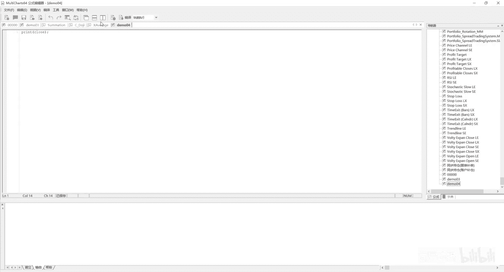

然后我把它加载到这个这个。

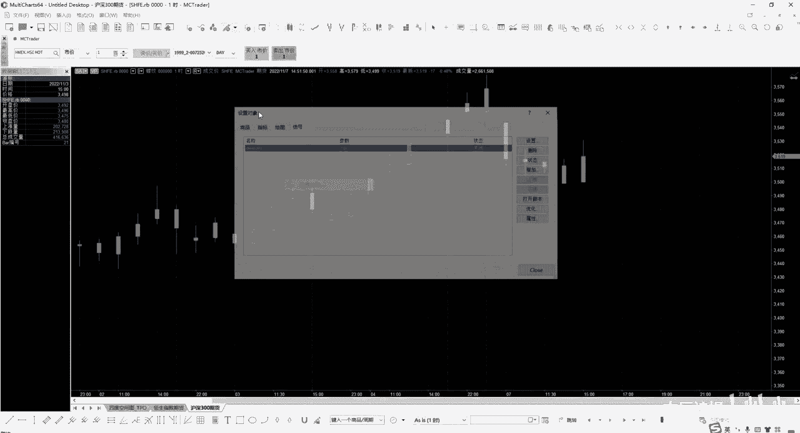

咱们这个图表信号里边去，把之前这个先删掉，然后增加一个DEM04close。

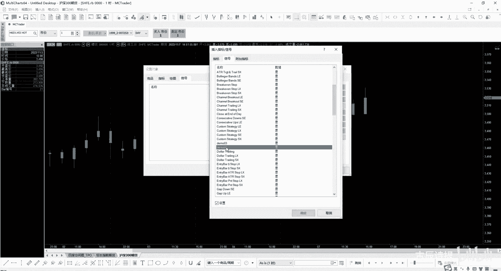

然后咱们看一看这个输出，你会发现它最后一个输出的是3499。

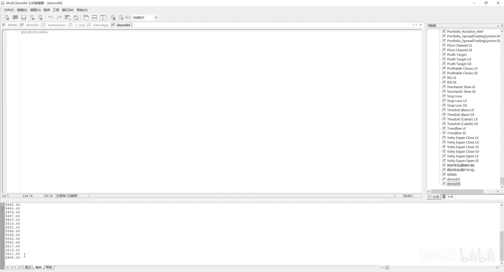

这是输出的哪个值呢，它输出的这个因为咱们这是一个小时线啊，小时线它输出的是这个，咱们看最左边它的收盘价是3499，它并没有更新这个啊，这是因为他还没有完，等他完了到了下午三点的时候，现在是02：52分。

到了下午三点的时候，他会输，就是再输出一次。

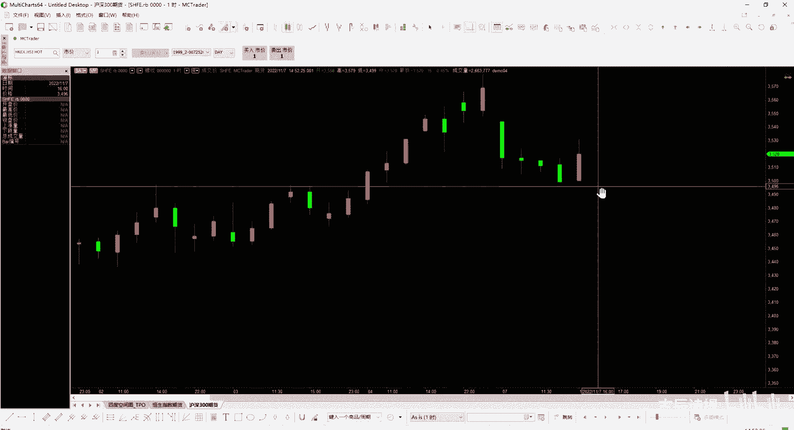

但是指标咱们可以看一下啊，我再新建一个新建一个指标，然后也写上一个名字叫demo04，这个可以重名呢，因为指标和信号它并不是放在一个地方的，我把这个删掉，然后同样在这print一个close。

然后我点击一下编译。

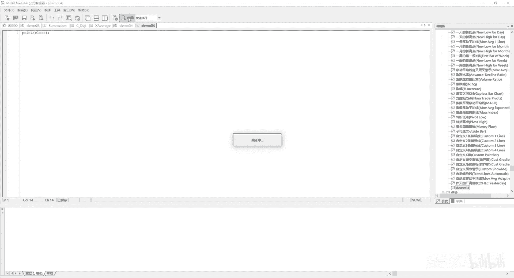

然后把它加载到设置信号啊，就是在指标这个增加一个指标，然后把demo04给它放进去，然后close诶，添加进来了吗，指标我怎么添加到信号里边来了，Signal，这个是信号，哎呀把那个删了。

我把这个删了吧，我把这俩都删了吧行吧，然后我再从这插入一个指标，把这个demo04啊。

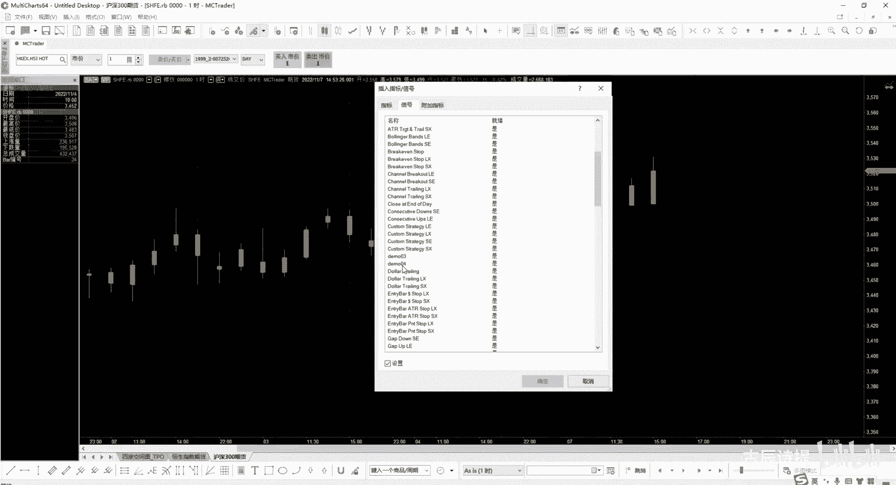

我插入的是一个信号是吧，插入指标。

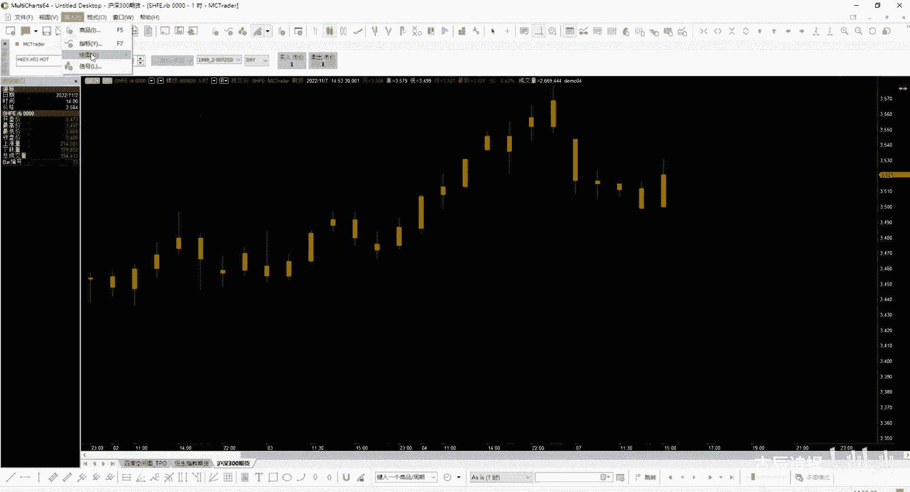

然后在指标里边找这个demo04，然后给它放进去，然后我就在子图一吧，这个咱们后面会介绍啊，我先点击一下确定。

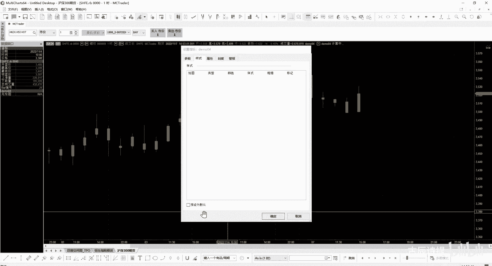

主要是给大家进行一下演示，你会发现3499是在这儿呢，是在这儿呢啊，是在哎呀，我都找这儿呢，但是呢他后边你看他在不断的进行更新，如果说我把它这个指标前面再放一个the time啊，不用点time。

就用time吧，下划线S，然后从这弄上一个空格，我再进行一下编译，咱们再看一下，你会发现，啊你看他是一直在进行更新的啊，一直在进行更新的是吧，但是他显示的这个时间都是三点，但是现在还没有到三点呢。

它是一直在进行更新的，这个就是指标和信号的一个区别，就是信号如果说你没有经过特殊处理，它只会运行一次，在更新中的K线也是这样的，如果说你这个K线还没更新完呢，他会等着等着你更新完了去运行一次。

但是这个指标它每一笔即可都会运行一次，为什么，因为信号你如果说反复更新的话，就是其实就是反复运行这个代码的话，是不是你开平仓什么的，会造成影响对吧，会有问题，你反复的开平仓，但是指标的话。

如果说你不反复更新，比如说我在实盘里边，我需要在我的图上标明我有没有持仓，持仓，我前一秒可能还没有呢，我这一秒就有了，你如果更新不出来，会不会造成误判，对吧啊。

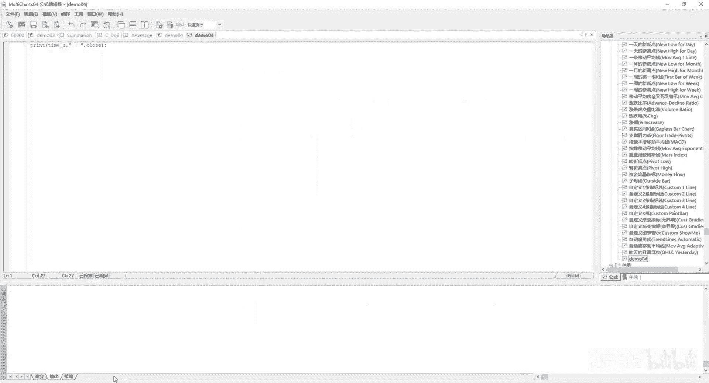

其实你这么一想，就这个东西就很容易去理解了是吧，我把这个指标先给删掉啊，先给删掉。

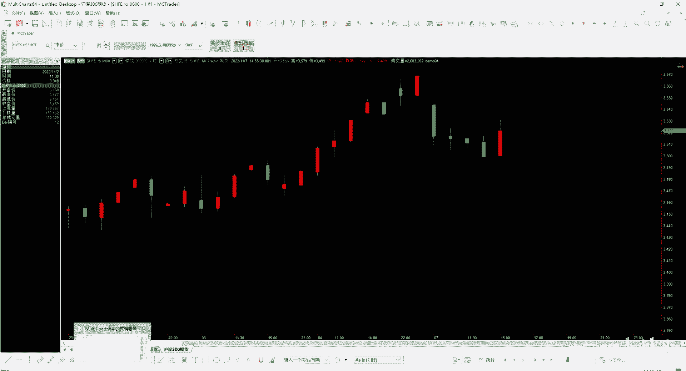

好这个是需要注意的，另外还有个参考吧，信号中的最大参考吧，数量可以手动设定，这个咱们之前演示过，就是改那个参考吧，如果有超过最大发现数量，或者说这个历史数据的调用数量的，历史数据的调用汇报错。

咱们之前也演示过，这个没有问题，但是指标是不一样的，指标中的设定一般是自动检测的，也可以使用函数smax bus back后边存放一个value，就是这个value不能是负数啊。

就是你设定的最最大的max bars back，就是最大的参考B，你可以自己来设定，当设定了最大参考吧，会以代码中优先手动设定的参考吧，如果不符合代码中的需求，会进行自动检测，或者有可能不会进行画图。

这个什么意思啊，咱们同样的在这给大家去演示一下，这个信号之中，他这个如果说你历史数据的引用，超过了最大参考八的这个限定，它会报错，这个咱们就不用说了，咱们来说一说这个指标中它会是一个什么情况，好吧。

我就直接调用一个，比如说啊value1，呃我就不用Y61了，我直接plot1，然后里边画一个什么呢，close我调用前六根的这个收盘价进行画图，就是最后一根往前数倒数第六根啊。

我进行plot是画图的意思，然后我进行一下编译，建立编译成功了。

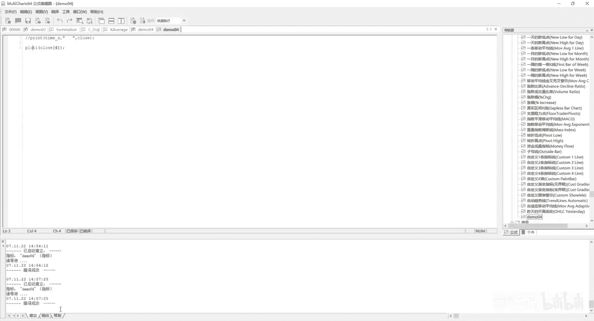

没有问题，然后我从这啊我插入信号啊，不是插入指标。

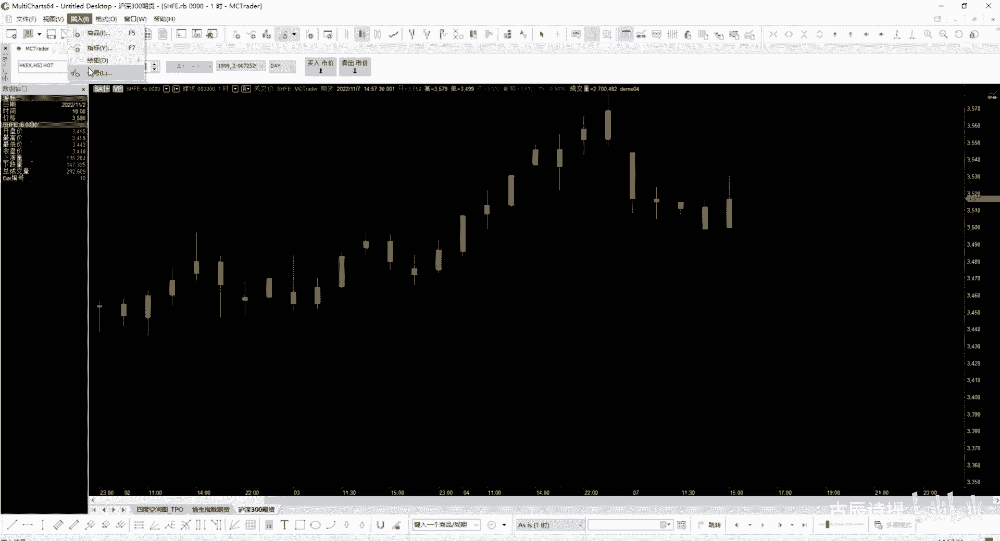

一定要是指标啊，在指标里边找到demon04，然后这个里边呢它也有属性，你会发现第一个是自动检测，第二个是用户是指定对吧，好，我在子图一显示啊。

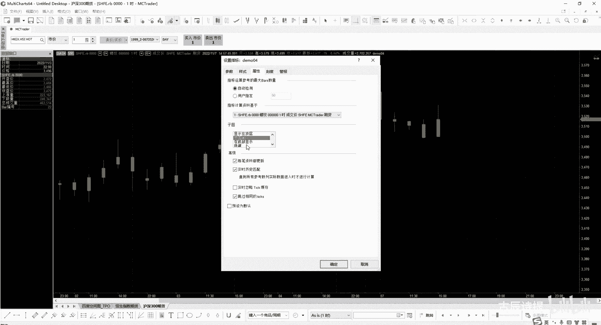

我不在底部，如果说你在底部显示，它就会是这样的，我再设置一下指标，然后设置一下我在子图一子图一，就这个上面这个图，然后我刻度和商品相同就可以了啊。

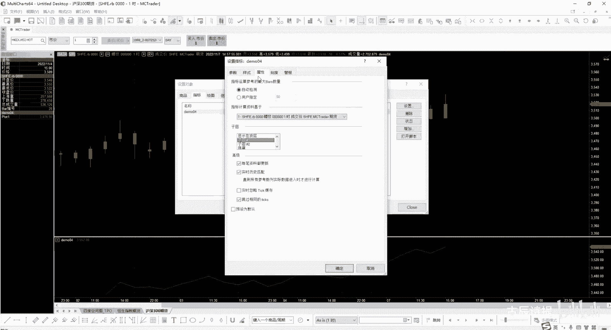

你会发现它是从第几个呢。

我给它切换到背景，拖动123456789十十一，第，从第12个开始的对吧，这其实是自动检测的吧。

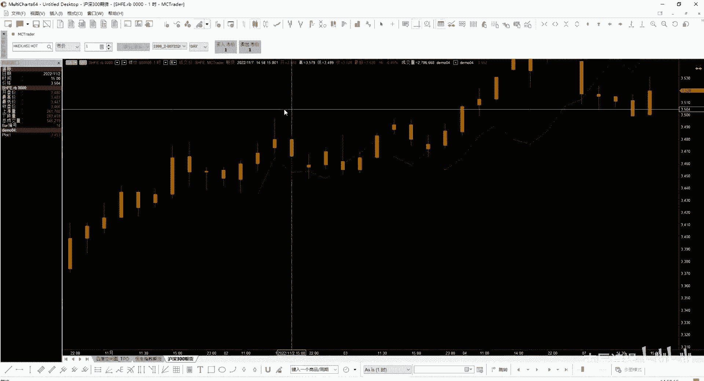

我没有设置它的这个参考吧，啊属性这是自动检测的，如果说我用户指定我指定。

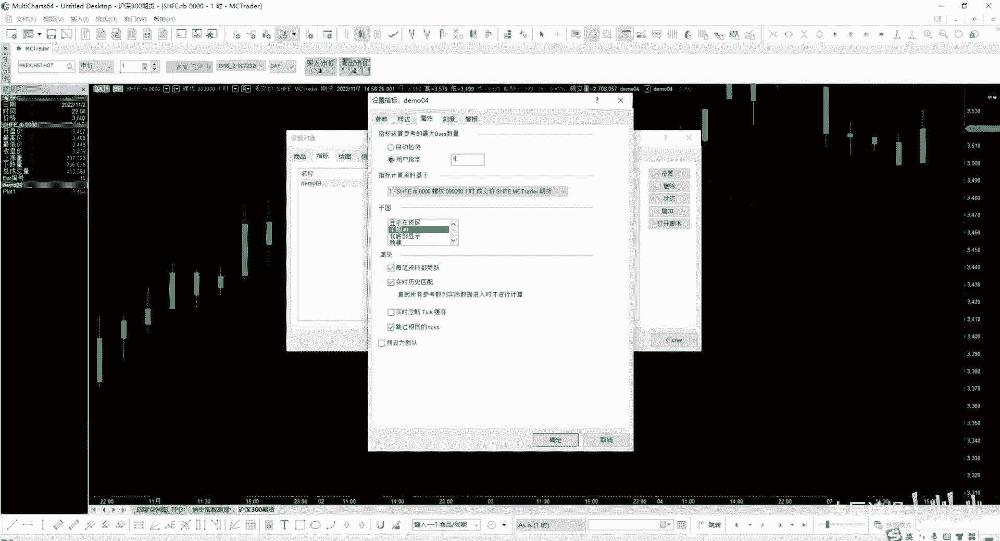

比如说七个，你会发现它往前移了吧，1234567，从第八个开始画的啊。

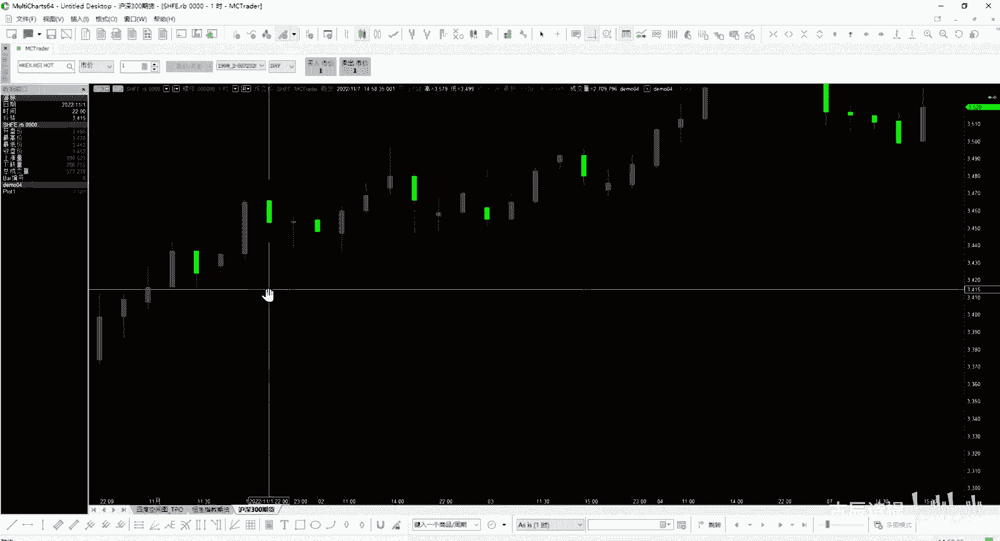

如果说我设置这个指标，然后设置我把它指定为四，这个咱们之前验证过，在这个信号中它会报错的。

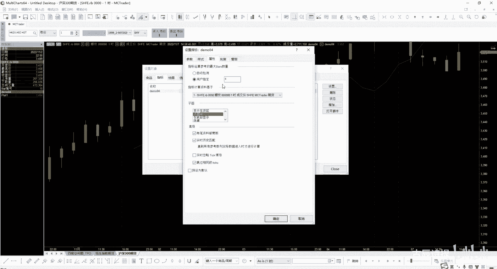

但是在咱们指标中它不会报错的，你看它又从123456789十十一，其实还是从这个咱们一开始说的，那个自动检测的那个开始设定。

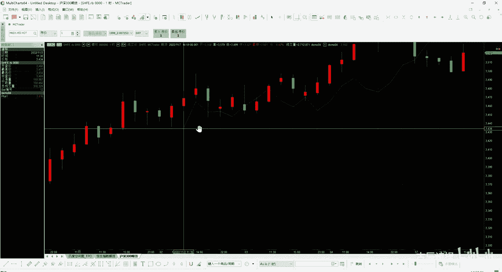

对不对，如果说我代码里面写上什么代码呢，s max bus back里边填上，比如我填上七，然后我进行一下编译。

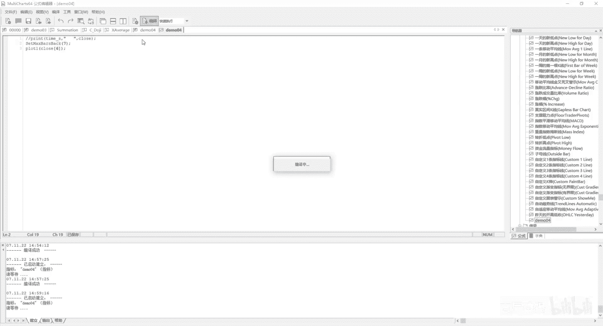

然后你会发现移不动了啊，他是从第八个147，第八个开始进行。

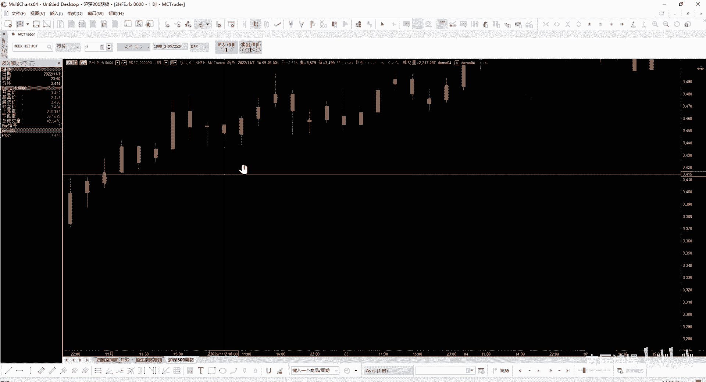

就是画图的啊，这个就是它的一个逻辑，如果说你没有设定的话，它会自动检测，如果你设定了能够满足他的这个条件，它会按照你的设定来，如果不满足这个条件，它会再进行自动检测。

当然所有的一切都是就是优先于你代码中写的，这个set max bus back，肯定有老板会问，如果说我set max bus就是back，我给它设置成四。

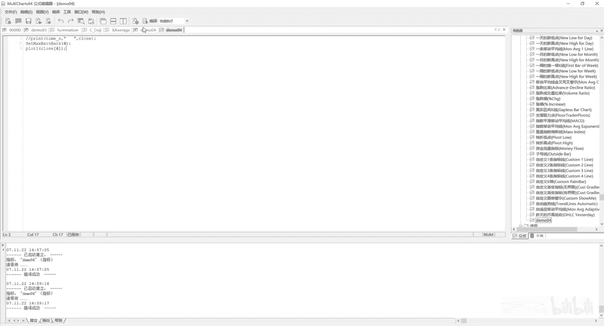

它会怎么样呢，咱们会看一下，你看它没有了啊。

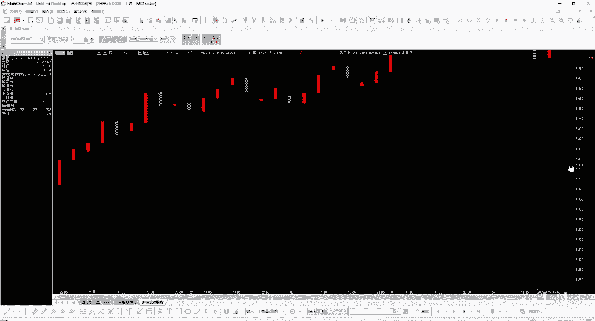

它没有了，就是有可能他会这个线会画不出来。

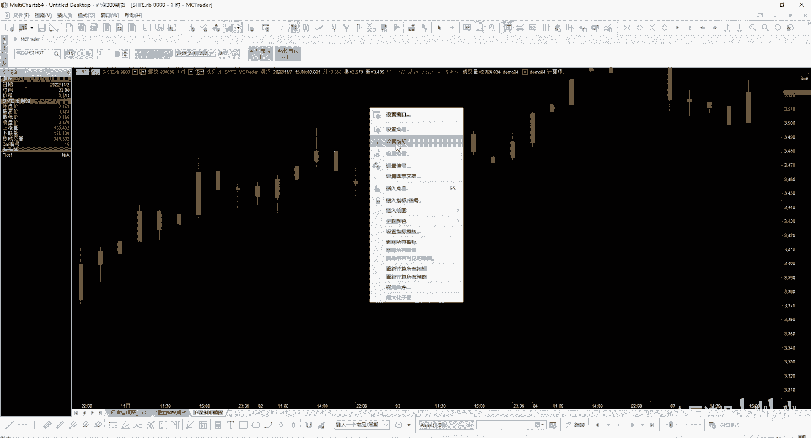

如果我从这儿我再给它设置一下，我给它改成十。

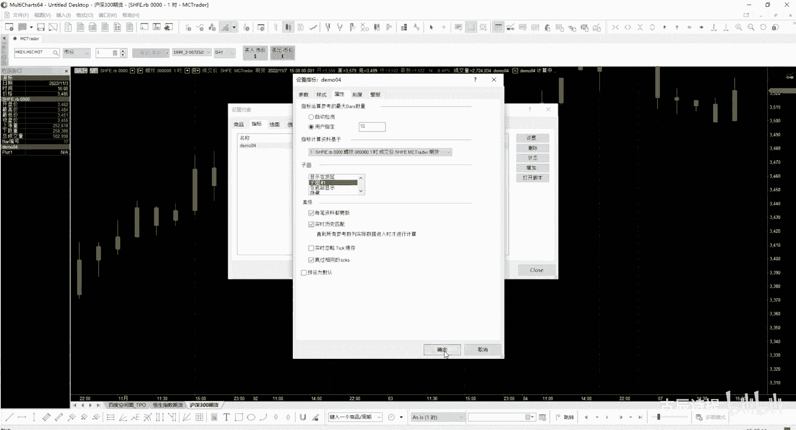

close他还是没有对吧，有可能会画不出来，这个是咱们是需要注意的，我把它还是给它重新编一下，设置成十啊，是吧，这个就有就有了吧，所以这一定要注意，可以这么去用，但是不建议啊。

不建议你最好是设定成自动检测，因为咱们回测一般都是大量数据的回测，你自动检测可能它会前面的这个八线会多一点，但是其实是无所谓的啊，好吧，但是如果说你用到的时候，你要会用，包括在源码里边，你看到这个东西。

set max bus back啊，你是得知道的，这个啊不能放在信号里边儿啊，不能放在信号里边，比如说我在信号里边，我从这个这个弹幕零四里边，我set max这个set max buzz back。

哪怕就剩100，我编译我都编译不过去，你看错误行，零错误行，我编译我都编译不过去啊，这个你要注你要注意了啊，好吧，函数啊，信号指标咱们都说了，函数是没有设定的，因为什么呀。

它是一般是被你信号和指标进行调用的，对不对，你信它会跟着你信号和指标上面的来，如果说你是用在信号里边，函数往回引用的要多的话，它会报错，如果你用在指标里边，它会自动检测对吧，不建议大家用这个代码啊。

set max bus back啊。

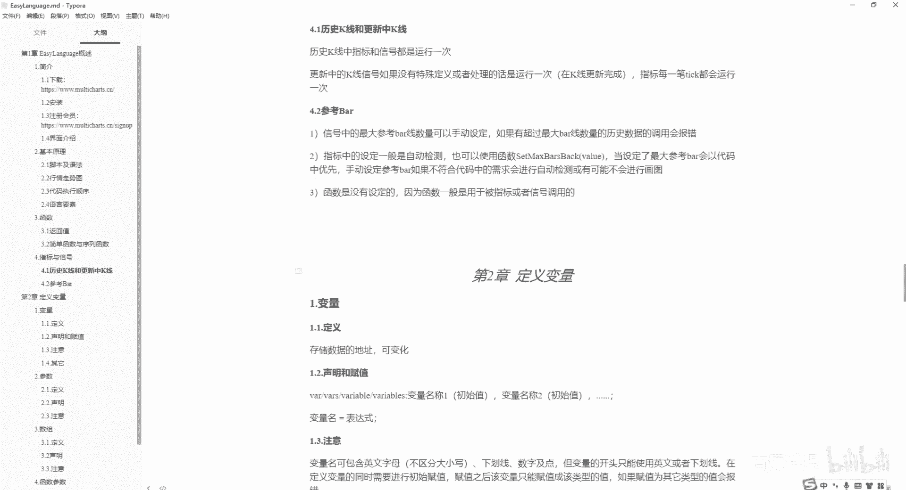

因为你既然可以在这个图表上进行设置，你为啥要用这个代码呢，关于这些设置的内容啊，咱们后边具体讲这个函数啊什么的。

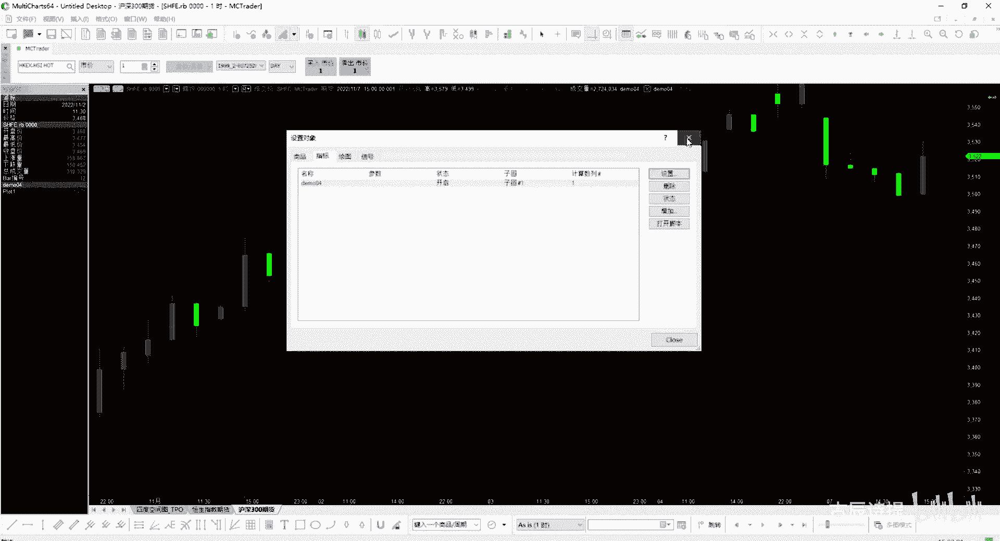

会给大家具体说，如果能手动设置，你能理解的，你就手动设置你代码里边，当然有些东西你可以放代码里边去写，但是我个人感觉没必要，咱们也不是专门的程序员，没必要说把代码写的高大上，而且用MC这个平台。

咱们代码也写不了多少，百八十行就算挺多的了啊，所以说你不要怕什么，你考量到我的这个速度啊，速率啊什么的，这个不是咱们现在考量的东西，好吧好，那咱们下面就开始讲这个定义变量好吧。

讲第二章变量是在咱们写代码的时候，最经常用的一个东西，你一定要知道它是个什么东西，它其实就是给一块内存地址命了一个名字，比如说我这一块内存地址，你不管里面存储的什么，如果说我给它命名为A1。

就是你在调用A1的时候，就其实就是获取这个内存地址里边的这个内容，它也可以就是把这个内存地址里面的值，换成别的，一定要是相同类型的啊，一定要是相同类型的，如果说是不一样类型。

你一开始里面存的是这个float f l o t呃，f l a o t float的话就是浮点型的，就是数值型的，如果一开始存储的是浮点型的数据，你后边换成了字符串类型的，它会报错的啊。

但是如果说你是同样类型的数值，你可以进行更换，另外一个呢，你也可以把它指向另外一块内存地址，当然这一块内存地址也必须得是同类型的，为什么啊，为什么非得是同类型的，因为不同类型的这个呃就是这个数据类型。

它就是这个系统，给他分配的内存空间是不一样的啊，给他分给他分配的内存空间是不一样的，所以说它一定要是同类型的，咱们把这种就是对于类型要求很严格的，编程语言，称之为强类型语言，强类型语言，强类型语言。

像C加加，C语言都是强类型语言，但是像Python就是弱类型，它既可以复制成字符串，也可以复制成其他的各种各样的类型啊，你要从本质上去理解它，就是存储数据的地址可变化好。

下面就是咱们的语法声明和赋值声明，有四个其实都是variables，有它的缩写，VR VR variables和variables，可以给大家看一下。

VR VR VR variables和VR variables啊，这几个都是可以的，一般都是用第一个，因为就是单词最少，后边是变量名称还和它的初始值，一定要加括号，而且是必须得是英文半角的啊。

可以连续声明多个，然后以逗号隔开，必须以分号结尾啊，必须以分号结尾好吧，就比如说我声明A1括号里边我复制成零，然后逗号A2，然后括号里边复制成一个赋值的，是它的初始值啊，这个是它的初始值，你编译。

因为上面有这个这两行，我给它注释掉，这个时候你诶哦这边少了一个括号，这时候你编译肯定是没有问题的对吧，一定要以分号结尾啊，要封号结尾，同样的你需要注意什么呢，就是说变量名可包含英文字母，不区分大小。

写下划线，数字及点号，但变量的开头只能是英文和下划线，什么意思，就是你这个变量名前面这个叫变量名，变量名可以是数字下划线，比如说我下面加一个下划线啊，也这个也是可以的，就是我编译肯定是没有问题的。

包括你加上点号，这我加一个点号，我再编译也肯定是没有问题的，但是你数字不能放在前面，你点号也不能放在前面，你看你一放前面它就变化了是吧，这是不允许的，就是前面必须得以下划线和数字开头啊。

和这个英文字母开头，它不区分大小写，他不区分大小写，你从这写A2啊，也是给它赋值，赋值成100，用用封号给结束，你看它两个它是其实是一样的啊，你看A2就变红了，如果说你用一个其他的这个变量来接它。

是灰色的，是灰色的A2，就说明这两个就是它已经被定义了，而且不区分大小写的这个就叫赋值等号，就是赋赋值，左边是变量，右边是你需要给这个变量赋值的内容，有很多老板可能分不清，比如说像这样的。

我这个比如说呃就是我重新定义一个，重新定义一个，这还需要给大家演示一下，比如说我给它复制成false，FALSE是吧，我给他复制成force，它会报错的，报的内容就是tapes are not。

后边这个应该是不匹配的，意思就是你给他付的初值是数值型的，你后边一定要给他，就是说在变化的时候，一定要还是就是相同类型的，比如说我这个是true是吧，我再给它复制成false，那这个就没有问题。

但是如果说你这个是数值型，或者是这个字符串类型的啊，你要给它复制成布尔类型的，那就不可以，那就不可以啊，这一点是需要注意的，另外有很多老板肯定说分不清，比如说我写个A3，这写个true啊。

我A3等于等于什么呢，我这个value1大于大于等于value99啊，这个东西它编译是没有问题的，但是很多老板不理解为什么会这么写，给大家解释一下，Y61到Y699，这是MC给咱们定义好了的。

就是数值型的变量，你不需要给他声明变量，你可以直接拿来去用，它的初始值是零，可以拿来去用，但是不能超过Y699啊，比如说我199它就不行，它就变灰了啊，这一个一定要注意，这是数值型的。

你不能给它赋值成value1等于false，这个也会报那个type有问题是吧，tapes are not啊，这个不匹配这个一定要注意啊，就是这样的方式啊，这个Y699是Y61到Y699。

是直接就是MC给复制成了这个数值类型的，也就是你理解为整数或者字符串或者叫负啊，没有字符串啊，就是整数或者小数或者是浮点类型啊，浮点类型就是一般用FLO，a t float来表示浮点类型啊，浮是什么。

是浮点类型，上一节课咱们讲过，你像A3给它赋值，因为A3是布尔类型的，然后value1大于等于V699，他们可以直接拿过来用，他们的初始值是零，零是大于等于零的，所以说它是true。

其实A3就给复制成了true print a3，编译一下输出，true是吧，全是true，我先把它清除掉啊，然后我空格一下，我再编一下，它重新输出就是true啊，如果说我变成了大于，那就不成立了对吧。

我再编一下它就是false了，你一定要理解这个意思，这块是一个判断式，然后传值给A3，然后A3是一个变量，而且是一个布尔类型的变量，它接收的是后边的这个传值啊，赋值不能说全职啊，是副职。

同样的有value1到V699作为数值类型的，这样的变量可以直接调用，还有什么呀，肯定一到condition99也可以直接来进行调用的，1~99，这是布尔类型的啊，这是布尔类型的，我先把上面给注释掉。

布尔类型的，我给它复制成100肯定是不行的，肯定还会报这个TP错误，这是布尔类型的，但是我给它赋值成true啊，它就没有问题，有没有问题，咱们也可以看一下，print一下CONDICTION。

比如十它的初始值是false，初始值是fossil，把它清除掉啊，初始值是false，咱们可以看一下false，因为我对connection10没有进行，就是在里边进行重新的赋值。

它的初始值输出的就是false啊，这个要知道就是变量名啊，可包含英文下划线数字几点号，这个是命名的时候要注意的，其他方面，为了方便使用，Easy limit，预先定义好了。

99个数值变量和99个布尔变量，一个是value，一到value99，一个是connection，一到connection，九九可以不需要定义，直接进行调用，复制等操作，就跟普通变量一样。

拿来用就可以了，另外直接定义的变量会在K线完成之后，进行对应值的更新，这个咱们之前讲过，就是你在信号里边，你直接定义的变量，会在K线完成之后进行对应值的更新，如果需要按照tick来更新数据。

则可以在变量声明的时候添加intro bar persist，这个咱们后面再讲，就是你如果需要在你的策略里边，接收tick数据的话，然后你需要在声明的时候用这个intro bar persist。

然后变量进行声明，具体怎么调用，它是如何执行的，咱们下来再讲吧，或者下节课或者以后讲，因为现在不是开盘的时候也演示不了啊，在回测中它是不起作用的，在实时行情中才能起作用啊，在实时行情中才能起作用。

若在代码中，变量引用到历史数据或者序列数据，会自动将该变量作为序列变量，这是什么意思，咱们之前讲过，就是序列函数和就是简单函数，变量其实也是一样的，如果说变量代码中，变量引用到历史数据了或者序列数据了。

它就会自动变为序列变量，它会自己来变，比如说我这个变量里边儿，比如说这个呃connection1等于啊，不是connection1了啊，我把这个value16等于close，然后中括号里面会放上。

比如说一这个时候这个肯定是16，它就会变成了序列变量，你也可以对，肯定是这个Y66进行偏移取值啊，进行偏移取值，比如说我print这个value16偏移，我偏移一个是吧，我这个对来进行偏移一个。

然后我把这两个先给它注释掉好吧，好然后我编译一下肯定是没有问题的，然后我输出你看它是也是有数值的，而且这个数值是偏移的，就等于说我当前这根K线，既获取了收盘价前一根，然后又输出了前一根的前一根。

就是前两根嘛啊就这么个意思就偏移啊，它就会变成了序列变量好吧，好第二个说参数跟这个变量对应着的，其实是常量，就是咱们刚才说可以去变化，对不对，就是在内存里边可以去变化，我这个A1我就指向这块内存。

然后这个里边值可以变化，同时它指向的还可以去变化成另外一块内存，跟它对应着的，因为它可以去变嘛，跟它对应着的叫常量，在MC里边呢咱们叫参数啊，叫参数，常量是不可以进行变化的，这个变化指的是。

在代码运行过程中是不可变化的，这个之前我记得就是讲过啊，就是在代码运行中不可变化，而不是说我可以改变它的值，那是你在写代码的过程中，在代码运行过程中，它是不可以变化的，比如说咱们从这儿写一个。

常量在MC中叫参数，参数的定义，用input或者inputs，就是后面加个S，这都是可以的，比如说我定义一个value，然后初始值给它赋成十，这是我定义的一个常量或者叫参数，然后value我再给它复复。

制成100，咱们可以看一下编译，它会报错的，你不能给它进行赋值，在代码的运行过程中，你不能给它进行赋值，至于你在代码不运行的时候，我给他改一下，改成15，这个是你手动改的，它代码并没有去运行。

一旦就是代码要开始运行了，你这个值肯定是不能变化的啊，你说为什么咱们在写代码的时候，为什么要把这个呃常量复制成一个，就是把它变成一个参数呢，你在实际调用过程中。

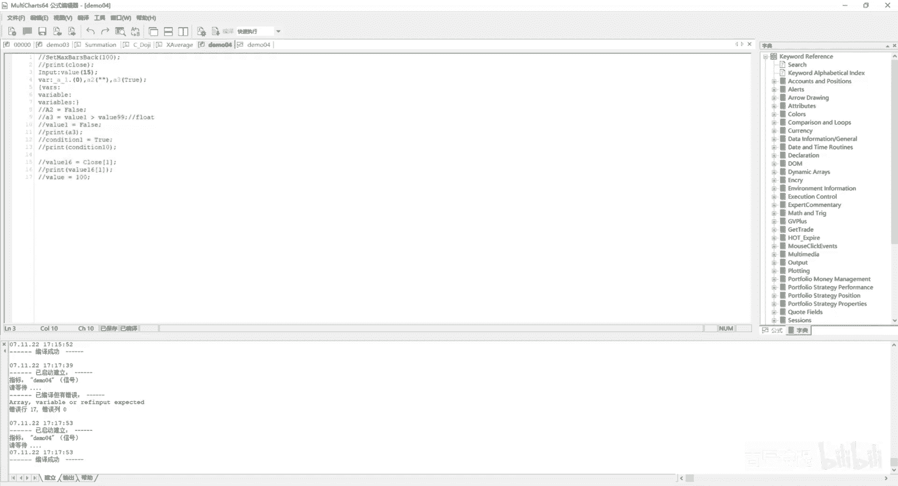

比如说我这设置信号，比如说我要回测哪个策略。

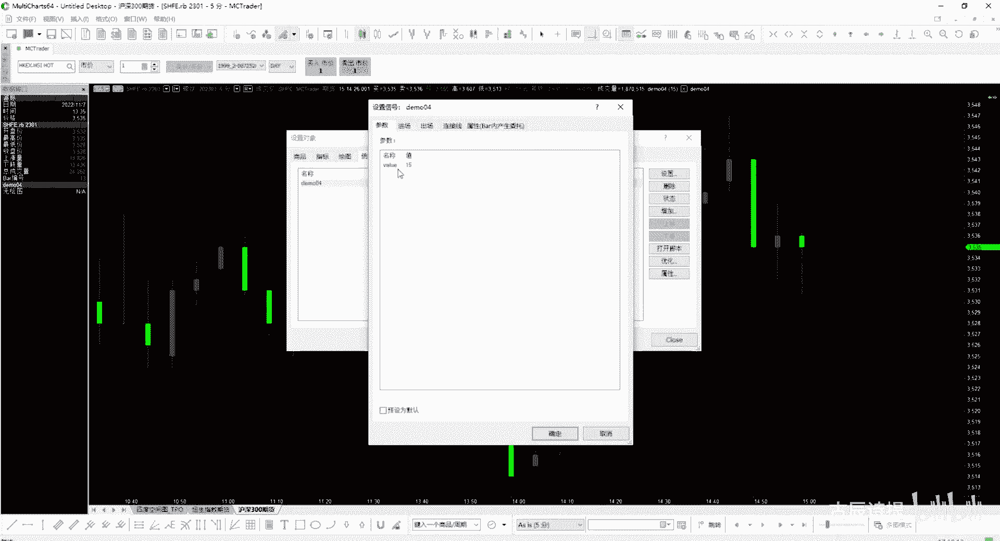

我可以从这直接来改，另外一个就是你在写代码的时候。

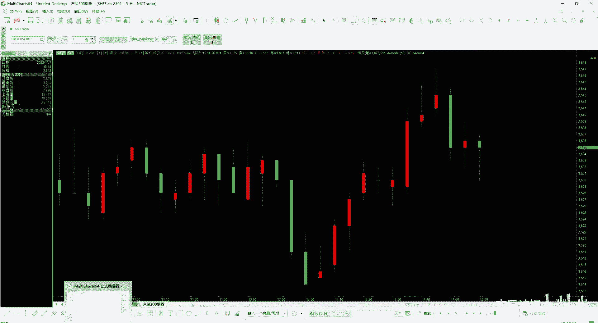

它是一个数值，那好说，但是他如果是一些其他乱七八糟的，比如说一段话是吧，你到时候你就没法弄，就是如果说写错了呢，另外你这段话要变化的话，你还得去代码块里边去改，那样会很不方便，咱们之前也讲过好吧。

这是常量，在代码运行过程中不可变化，声明input input都可以，参数名称一名称二，这个和变量是一样的，注意啊，就是这个是一样的，你命名的时候跟这个变量命名是一样的，其实它在底层。

它也就是说我把这个变量，其实原本的变量给固定住了，我这个变量必须得指向这块内存，然后这块内存里面的值也不能变化对吧，你这样理解，我想想就很好，能理解了啊，另外参数设定的值也可以是一个序列啊。

也可以是一个序列，比如说close open high volume啊，这个是什么意思，给大家演示一下，就是我在这我可以给它改成close value啊，然后我print一个value啊。

这个是完全是可以的，完全是可以的，然后包括咱们在运行代码的时候设置信号。

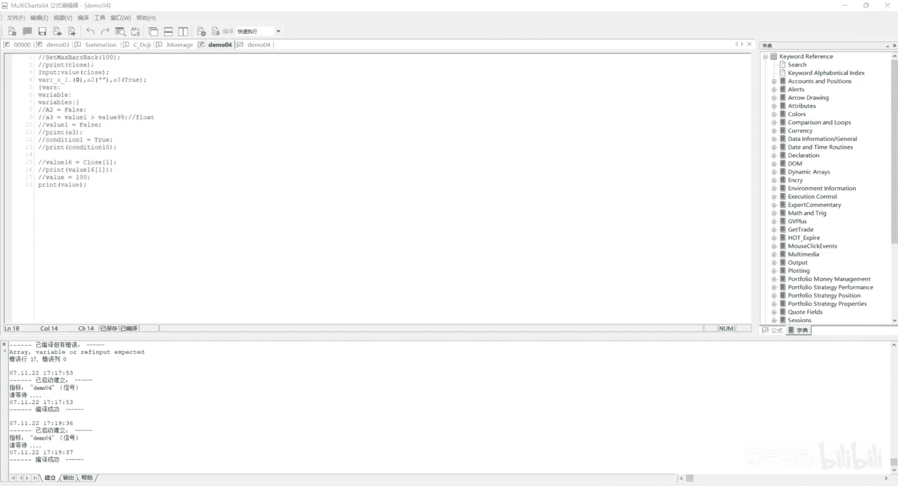

我给它改成呃。

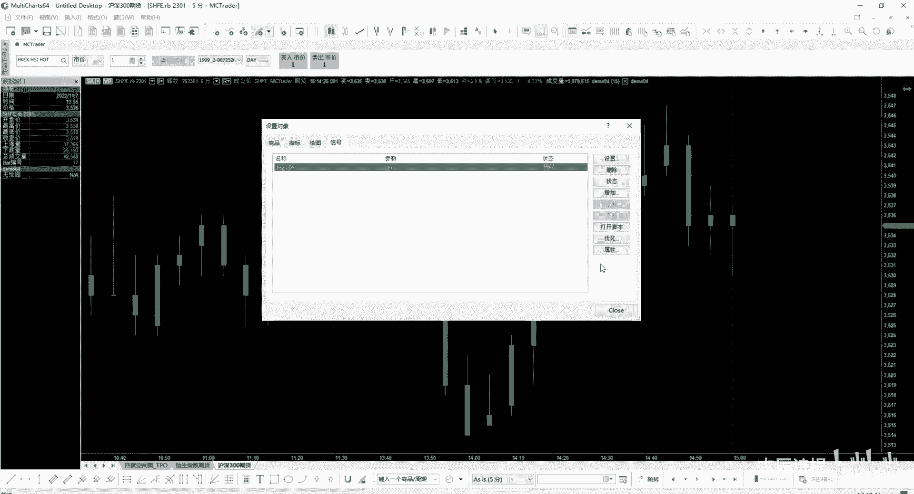

我这个是是戴蒙斯吗，是戴萌4Y66是吧。

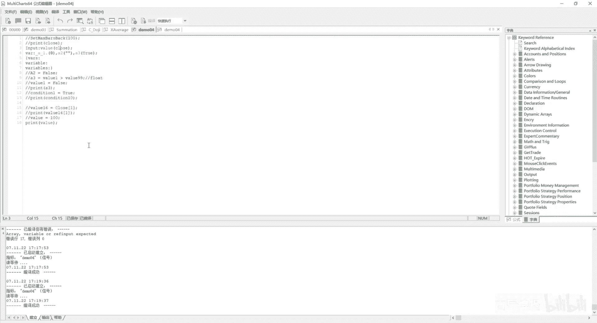

我得给他重新设置一下信号，进行一下加载状态状态，哎呀我是不是得删除掉，然后再增加一下，然后demo04是吧，这个你也可以改改成high也是可以的啊。

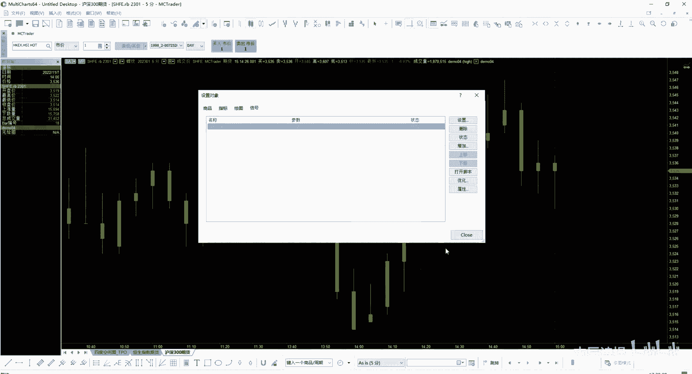

确定，然后close这个也是可以的啊，就是它也会有输出值啊，没有任何问题的，你可以把它也可以，就是说复制成一个序列的啊，一个序列的一个数值好吧，第三个参数和变量都可以进行多次声明和定义。

但还是建议在脚本最开始的时候，进行声明和定义，这个是什么意思，就是我从这儿我进行过这个参数的声明呃，和这个变量的声明和定义了吧，我在这我还可以再添加VR，如果我又想起来了，我再定义一个。

比如说呃max对吧，max杠一，然后括号里边复制个零啊，我再添加一个，它是肯定是没有问题的啊，就是能编译成功，就是你可以进行多次的声明和这个定义啊，第三个是数组，数组是可以同时存储多个值的变量嗯。

这个咱们也讲过啊，而且在这咱们不详细讲，就简单先有个印象就可以，最多是九维，最多是九维数组呃，可以通过索引来取值或者是赋值，它的声明的方式就是用额外额外呃，它的颜色也会不太一样。

比如说我arrive一个ARRAYAY，一个额外一个什么呢，比如说呃CLO啊，就是day就是我声明一个，就是说这个close day就是日线的啊，这个他的这个一个数组，然后呢它是一个一维数组。

然后初始值是零啊，然后封号去这么一填，写一下它的命名方式，rise rise都可以，数组名称，然后加一个中括号，里边放的是维度啊，放的是维度，然后再选择再选择在里边再放上一个初始值。

初始值我从这我进行一下编译，是没是没有问题的，这里边也没有放维度啊，因为这是一个默认是一维的，你需要给它设定大小，这个后面咱们会详细讲啊。

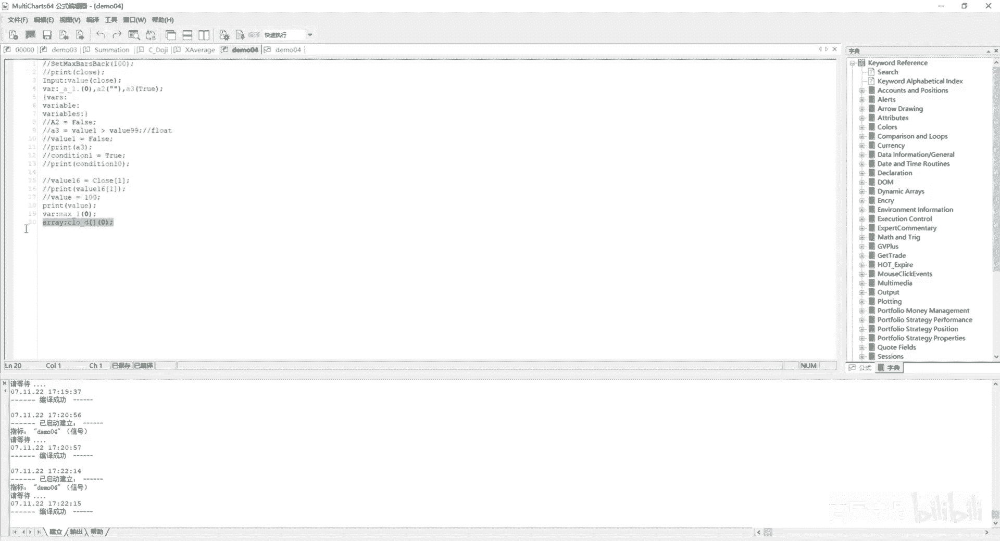

它是颜色是不一样的，颜色是不一样的。

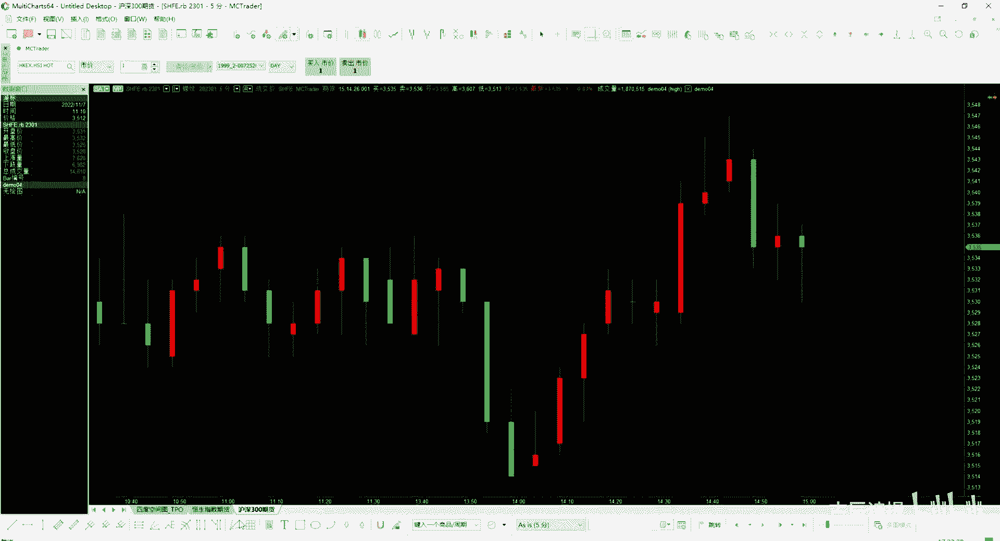

最高是九维啊，并不限制每个维度的最大值，也可以定义成动态数组，一维的一般是动态数组，超过一维的，它不能是动态数组啊，但是动态数组只能是一尾，定义之后可以在代码中使用额外set max index。

重新设置数组的大小，这个咱们后面详细讲啊，呃注意数组的索引值是从零开始的，这个它就是就是你从这定义，比如说我定义了一个八，就是咱们好像理解，就是这个数组里边是一维的嘛，因为它是一维的。

你就可以把它理解为这样哎，它是有八个格子啊，当然不一定是八个啊，但是它其实是九个，它是从零开始的，然后到八它的编号是这样的，你去来获取的时候，就是获取索引的时候，你也得注意它是从零开始的。

多维就是说这个是一个就是不太好理解的啊，多为你要把它理解为是一个轴，就有X轴，有Y轴，有X轴，有Y轴，如果是二维的话啊，他不会说，比如说我定义了一个就是二二或者四四，它其实里边有多少个数啊。

都是从零开始的嘛，如果是2×2的话，它是不对的，你如果说定义成一个二二，你应该是什么呀，3×3它里边有九个数啊，里边有九个数，因为是从零开始的，如果说你定成四和四，这样它里边应该是25个数啊。

25个数就是咱们后面再详细去讲吧，有一些不是很好理解，而且你这个数组的使用必须跟着就是循环啊，必须得跟着循环来用，不然的话你取值也会比较麻烦啊，当然简单的使用我给它赋了值都是零了。

我可以print一下这个呃，就是CLO这个did的它的第零个值是吧，第零个值或者第一个值，第二个值，当然我这里边还没给它赋值呢，啊咱们可以看一下输出啊，你看都是零啊，因为这个是上面的这个一个啊。

这哎我这怎么会有3537的这样一个输出呢，啊这print一个value了是吧，就是它下面这个输出是零，都是零，先简单的知道一下数组是个什么东西啊，多维数组是立体的，不是平面的，所以一定要理解。

在平常使用中，不建议使用超过二维的数组，建议使用一维数组更加灵活方便，因为一维数组可以是个动态数组，二维的你必须定就是定义多少，你就它就是多少啊，数组数组的取值不能超过最大索引，不然会报错。

比如说我从这儿我取一个九，我编一下，他就会叮一声，当然咱们看不见啊，就它就会显示这个是指标错误啊，然后这个数组溢出错误的索引，错误的索引为九索引值的问题，这是啊好吧。

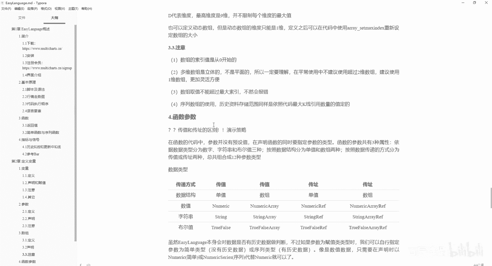