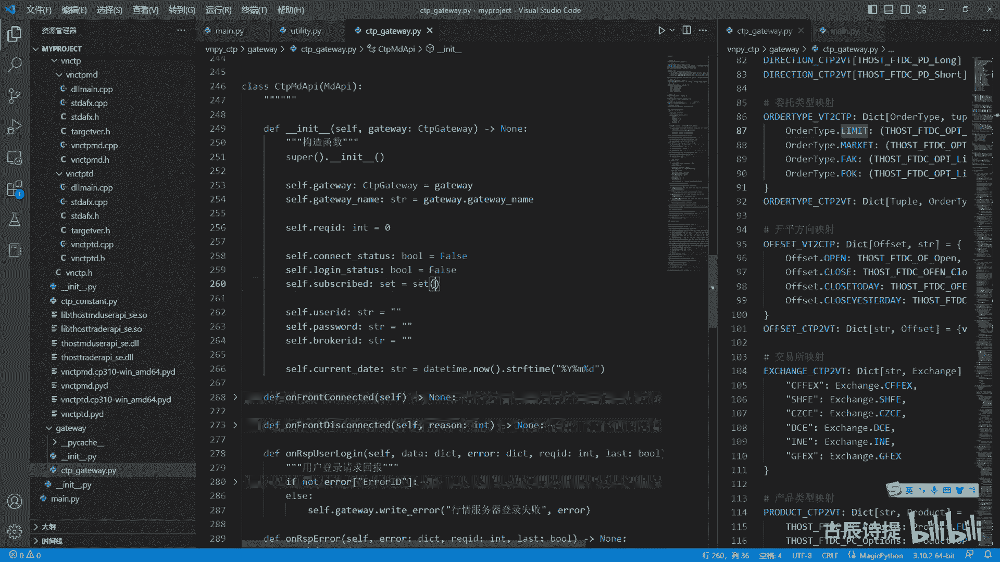
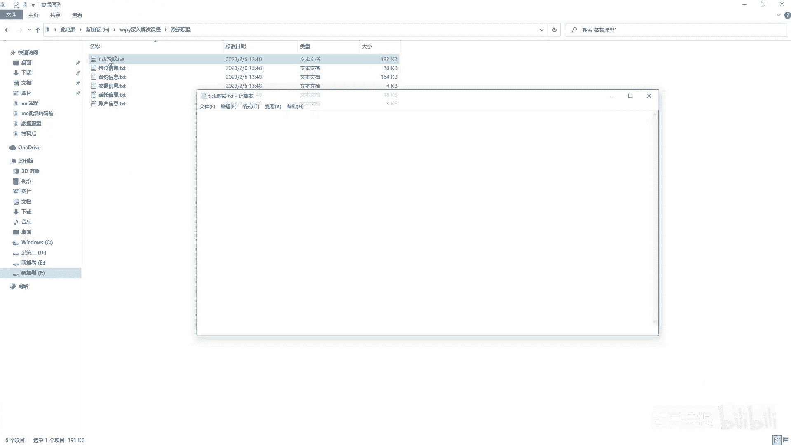
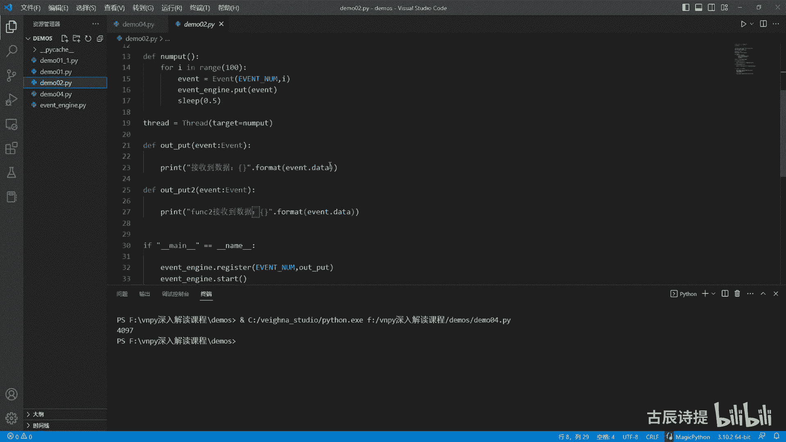
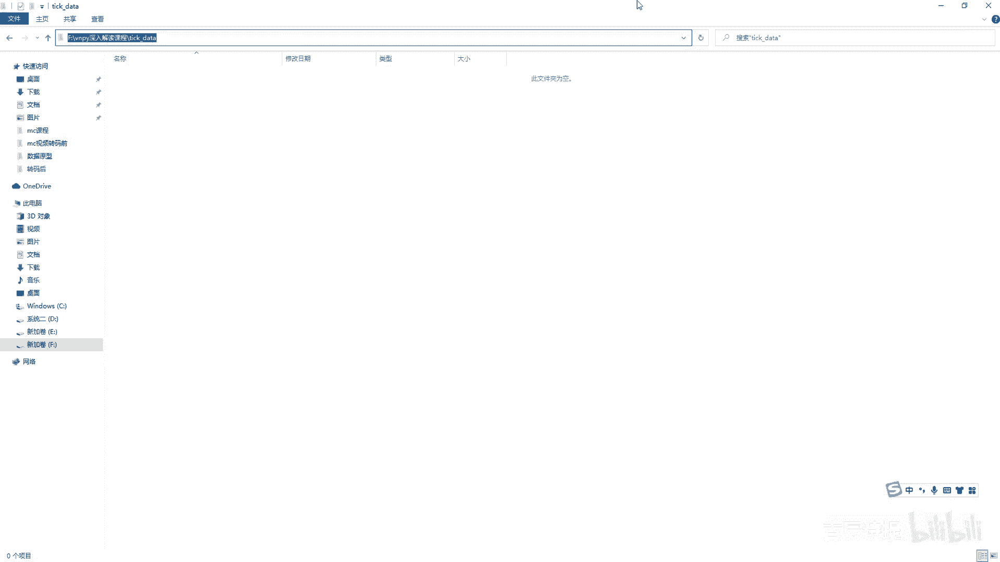
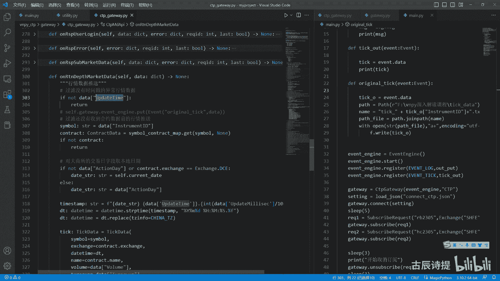
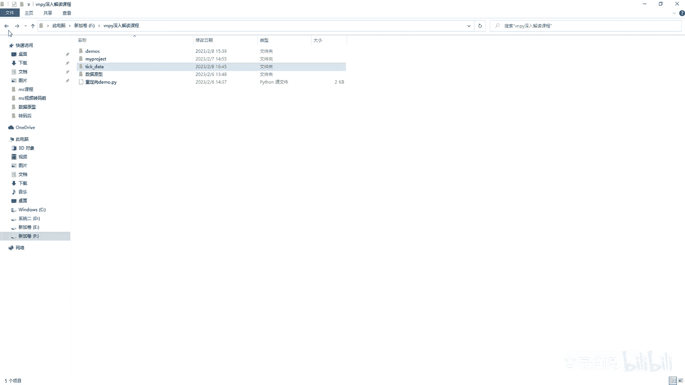
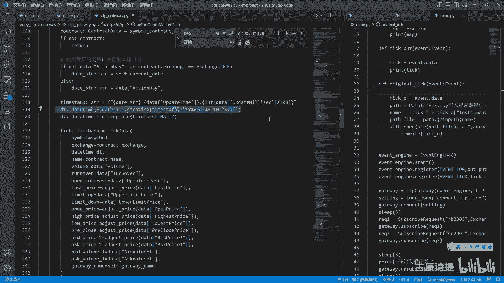

# 第5节课 CtpGateway(3) - P1 - 古辰诗提 - BV1Q1421U7JT

欢迎大家来到从零开始量化系列课程，VPI课程的第五节课，上一节课咱们讲到了cp gateway，然后他的这个链接connect，最后做了一个就是query count和query position。

也就是query这么一个操作，是别的这个里边像这个subscribe on subscribe，这个是咱们自己填的，就已经没什么东西了，还有一个要讲的就是这个order send order到了底层啊。

这个SORDER它是接收的是order requ，这么一个数据类型，order request这么一个数据类型，它是个什么呢，咱们先看看这个数据类型啊，就是从顶层把这个委托发过来了。

发过来呢肯定需要给你转换成order request，然后这是order request symbox，change direction type啊，说到这个tab的时候，咱们注意一下啊，咱们注意一下。

就是他这里边有个order，这个type这么一个字典，这个order type在这你会发现它是有limit，market f和folk，这两个是询价用的啊，咱们就不说了，然后这两个是一个是limit。

一个是market对吧，它只有这么两个类型，但是如果说你用过VNPY的，你知道VMPY它在CTA引擎里边，它并没有给你实现这个market order，它只有一个stop order。

stop order呢它只是在本地留存的一个委托单，最终如果说这个价格触发了之后呢，他还会转成这个limit order给发过来，它会转成limit order给发过来。

所以说到了这个cdp gateway，这个最底层的时候呢，他接收的是limit order，这并不代表所有交易所，他只能接受限价委托，每个交易所和每个交易所都有一些区别。

包括后边发生的一些数据也有一些区别，但是他能接受的这个委托呢，有的可能也能接收这个max order，但是最终统一的就都能够接受的，就是这个limit order。

所以说它的底层只是给发了这个limit order啊，最终都得转换为limit order，这个你记住了，volume是数量，price是价格啊，offset offset就是这个你是开还是平。

direction是方向是吧，就是多还是空啊，就是开屏和多空组成了，其实就是你四个方向嘛，对吧啊，这个post in it，这个就是这个data class，data class这个基础了。

就是你在它其实是一个数据呃，就是一个其实你自定义的一个数据类嘛，里面存放的都是一些数据啊，然后他只要是你把这些数据你新建了一个之后，它就会给你自动生成一个very simple啊。

这个very simple呃也不说了啊，这个vt simple都是加了这个就是这个exchange啊，然后呢他这有个方法叫create order data。

为什么会有create order data呢，就是因为它是order request，它是发送请求对吧，发送完请求之后，他需要再把这个请求转换成一个order data。

然后发送到咱们这个engine里边去，然后到了image engine里边去，你才可以被其他的接收，这个order data的这样的一个就是需要接受他的，就是这个方法来处理它。

它所以说需要转成word data，从最顶层你的策略发下来的时候，它就是一个呃，就是其实就是SORDER，就是那个template里边就是八中的SORDER，然后一层一层的。

然后最终转换成了一个order request，但是返回去的这个order data就是放在这个image engine里面，order data都是啊，就是放在mage engine里面。

这个order都是order data类型的好吧，这个就是他为什么要有一个create order data，因为它发送之后，他需要把这个order request转换成一个order data。

然后给你提交到好吧，给你放到int engine里面去，而且order data你创建的时候，它的这个studio就是状态啊，他就是这个submitting啊，就是在提交的这个submitting。

所以说你要分清楚了这个order你从你的策略啊，比如说我的C是代表策略，然后G是代表底层，你从C这发送出来的这个order啊，发送出来这个order肯定是一个方法，一个方法来调用啊。

就是你到这个呃这个c t a engine了啊，他就是这个SORDER是吧，然后这里边需要你填很多的这个呃，就是这个这个这个数值啊，这个参数，然后再往一层一层的往下走，往下走，走到了gateway。

这啊，他就必须转换成这个request order request，然后你委托发送给服务器之后呢，他会给你生成一个order order data，Order data。

然后给你放到这个invent engine里面去，然后再进行处理，明白这个意思吧，就是从上往下的时候，它是都是这个方法的调用，就是一级一级的往回调，然后一直到这个gateway，然后往回返的时候。

从下往上走的时候，它就直接放到event engine里边，直接往回传了啊，但是它必须得是一个order data是吧，好好咱们看一下这个order就是SORDER发过来之后，他做了什么啊。

他其实是这个到这个TD啊，就是这个trade这去来SORDER，它这呢其实是什么呀，他就是把你的这个order request里面的数据转成啊，这个字典的数据，然后给给你发送到这个就是这个MDAPI。

这个TDAPI，就是调用C加加里边的这个方法，然后给你发送到服务器，这其实就是字典的一个是吧，转换嘛，只不过是从这啊，先看你的offset是这个开屏啊，选择开屏方向就是这个开平方向。

就是涉及到前面咱们一开始给忽略掉的这些字，就是这些字典字典就是K键，就是K值和value值的对应嘛，它其实就是把呃K值去给你转换成这个value值，你像这个TP就是用order type啊。

VT2T二C2c TP two，这个二是什么意思啊，就是v t to CD p啊，就是VT到CDP哈哈啊，你想把这个open改成，就是说底层的这个C加，加它定义好的这么一个啊，其实就是比如一代表买。

二代表卖啊，是一代表开，二代表平，咱们可以看一下啊，啊零啊，零是代表这个什么呀，open然后close啊，转到定义一是代表close是吧，你不可能传说我传一个SL还是传一个by，还是传一个。

就是不是这个开还是传个屏啊，还是传1close，还是传一个open，你没有这样一和二来的简单呀，对吧，这样也少很多的数据传输，对不对啊，你看这个应该是三是吧，三啊，明白了吧啊。

其实这个就是给它做一个转换，然后当然前面这是一个筛选啊，看你的这个开屏方向对不对，看你的这个委托类型对不对，但是咱们的委托类型过来都是limit委托啊，然后这个SORDERIEF1看这个就是计数的啊。

你看这个就是计数的这个技术有啥用，最后给你得给你生成一个，就是说这个委托的这个order id啊，对不对啊，TP呢他全给你转转成了这个order tap v t two。

这个CD b order type，在哪呢，order type vt呃，这是v t two cdp，就是你的这个order limit啊，就是如果说你是里面单的话，唉他会给你转成这三个一个元组。

然后他用三个来接收一下是吧，然后就给你把这三个放到它该有的这个，兼职队里边去是吧啊，这个这个是呃，这个这个是这个你的这个对象转成字典，我觉得没什么好说的，看似很复杂。

其实就是把你的这个数据自自定义的数据类型，转换成字典，就是这个字典呢必须得是让C加加底层，可以接收的这样的一个字典啊，然后这个N啊它会有个返回值是吧，然后这个N如果说这个有N的话，就说明委托发送失败了。

然后他把这个原因告诉你啊，就是给你输出一下right log嘛对吧，然后如果说嗯有问题的话，他从这就return了，对不对，如果没有问题的话，他就会给你创，就是创建一个order id啊。

这里边你看刚才这个order i e f是在下划线，这呢这个C证D啊，这个呃front i d这个你可以查一查啊，它究竟是个什么东西，这个session好像就是一个整数啊，查怎么查。

咱们上节课前两节课也反复说了，你去那个对他类型里面去查去是吧，然后把你的如果发送就是他你他没有返回，错误的话，就说明发送成功了，他在给他转换成把这个request。

就order request请求转换成一个叫什么叫order data是吧，create order data它的返回值，咱们看一下它的返回值是order data吧，对吧啊。

然后再给它放到这个image engine里面去，然后一般就是咱们的这个，在这个咱们的策略里边，on order里边是可以接收到的，这个时候你就可以做判断了啊，发送成功了对吧。

他会给你一个返回值是v t order，ID这个v t order id啊，是你的这个order data它自己创建的，其实就是加了一个就是这个get为name，就是old i d，你知道是什么了是吧。

VTO的id就是给你加了一个gateway name啊，gateway name点O的id，咱们刚才说了，他是这儿呢是吧，就是通过这些给组成起来的，这个是个计数器嘛，是不是啊。

然后这个VTO的AD就是在前面加了一个小，Getaway name，gateway name是什么呀，就是CTP嘛，对不对啊，好这是order data。

order data呃啊咱们也说一下这个order data吧，都是用这个at data class给装饰的，这个best data里边他继承的都是best data。

这个best data里边就有一个这个gateway name，然后还有个extra，extra是个dict啊，它是个字典啊。

然后这个order data里边你像simple exchange order id，这不用说tap，你想它默认的是这个limit direction，就是方向，offset是开屏，price价格。

volume是成交量，Tra did traded，这个traded是用来干什么的，有可能你在撮合的时候，它会部分成交啊，有可能会部分成交，当你部分成交的时候，这个trait的就是已经成交的数量。

已经存在了数量，这个是studio就是它的状态，你看默认是申请的是申请，因为什么呢，我从这只要是他返回的没有错误，就就说明我发到服务器发送成功了，那他就会把这个order data给你返回来。

那默认就是申请中，如果成交了或者被拒绝了啊，咱们一会再说，他会给你调整这个studio的这个状态啊，这个状态这个studio啊它有哪些啊，就是提交中未成交部分成交，全部成交，已撤销取代是吧。

就是这些状态它会根据情况给你去调整的啊，daytime就是这个时间嘛是吧，呃reference就是关联，这个就是做标记用的啊，你像post init，咱们说了，只要是你创建了一个order data。

然后里边输入了这些参数啊，就是他这就会给你自己创建一个cf点，vt vt simple和cf点v t o i d is active，它是不是活跃的状态，这个活跃的状态是根据这个studio来判定的。

这个studio你想想哪些是活跃的状态，submitting肯定是活跃的吧，未成交，NO trait肯定是回的吧，部分成交是回的吧，当你全部成交了或撤销了或巨大了，就不活跃了吧，对不对啊。

然后你想他这个是一个看一下啊，它是一个sat，是一个就是集合，对不对，然后是吧，submitting提提交中，NO trade未成交，它TRA是部分成交啊，这个没什么复杂的东西，一定不要你把它拆解下来。

你会发现它所有东西都是Python基础里面的，所有的东西都是Python基础里面的，你想这不就是自定义的一个方法吗，就是create cancer request，就是我这个。

我这个一般情况下都是配合is active来使用的是吧，如果说我这个还在活跃状态中，然后我可以去cancel这个request，就是我去创建一个去这个啊，去取消委托单的这么一个请求是吧。

这个也是发给服务器的对吧，这个很容易理解啊，好这个就是你发送委托，主动的去发送委托，如果委托发送完了之后，是不是应该就是有反馈啊，对不对啊，是成交了呀，还是就是没有成交啊，还是怎么着的。

你看如果说成成交了啊，他说on return RT n就是return on return order，就是委托更新推送啊，就是有委托，他可能定时给你更新一下是吧，给你发送推送，看看他的状态是什么啊。

这个呃就是他会来调用这个方法，其实这个你想都是dict，往你这个order data里边去转换，对不对，就是这个是dict one word data里边去转换吧，然后再放到这个呃引这个引擎里边去嘛。

是不是，当然这它也有一个这个字典给存放了，这个就是说这个order AD啊，有个字典给存放了一个order AD，就是到时候找的时候好找，方便是吧，查你现在有有哪些委托啊，就是在这个服务器里边儿啊。

你可以通过这个去查，是对吧，你无非就是这些作用，你转换成O的id，你这个里边都是去转换嘛，用字典来转换，这是older type to，这个order type c这个c c t b to这个VT呃。

VT就是维纳吗，还是什么呀，就是反正就是转换嘛，这也是个字，这也是个字典嘛，就是order type，看一下啊，order type c DP two啊，VT它就是一个字字典。

然后里边啊就是v k for k v in这个items啊，这个这个里边是吧，给区进行转换，是转换成这个类型是LIMIDA还是market单啊，其实都是这LIMID，然后direction是方向。

这个我就不说了，都是字典都是进行转换用的，其实就是从从什么呀，从这个字典转换成咱们自定义的数据类型，还是从咱们自定义的数据类型往字典去转换啊，就是这么一个内容，你像这个就是这个呃。

MD就是这个market，这个行情，他肯定是就是因为你大部分都是传输嘛，是不是都是从从这个字典往这个，往这个咱们自定义的数据类型里面去转换，但是这个TD它就有个交互的问题了是吧，你去发送一个。

然后他给你一个回执，发送一个给你一个回执，然后有问题了，比如说他成交了会给你回调，那他就是呃就是说既有从这个字典往这个呃，自定义数据类型的转换，也有从自定义数据类型往字典去转换，因为你得交互嘛。

你得符合两边，Python这边是自定义这个数据类型，然后C加加或者服务器那边，它也有它的这个定义的这个STRUCT，就是结构体数据类型，它才能进行传输啊，对吧啊，你看这个就没有什么复杂的东西。

至于这里边代表什么东西，咱们一直在说，你可以去底层去查，也就是去咱们的这个呃VNCDP，这个VNCDP是这个VN团队自己写的啊，VNPI团队就是自己写的啊，前面这些你像这个是就是一个。

就是咱们可以下载出来的，你像这个是属于是PYBI呢，是属于是依赖的库啊，依依赖的库，这个是动态链，就是链接库啊，这个是动态链接啊，也不是动态链接，就是链接库，然后这个是自己写的。

当然这里边好多东西都是生成的，你查去哪查呀，去这个里面查，就是你要查这个数据类型啊，就是啊比如说这个就是我的这个tick啊，就是就是就是这个就是多个数据类型组合成的，一个结构体。

或者咱们就类似于这个data class，这个装饰的就是这样的一个类，就是它是一个组合体，你就去这个STRUCT结构体里面去查，如果说单个的，比如说我要查，那是整形的还是字符串，还是这个字符。

你去这个里边去查是吧，type data type这个是STRUCT结构体的意思啊，很容易理解这些，我觉得就没必要去说了，好吧，这是on return，就是委托的更新推送，如果说你有问题。

比如你的这个order有问题，他会给你从这弓啊，Response order insert，就是委托下单失败的回报啊，他这呢还是给你创建了一个啊，就是这个order data啊。

就是这个order data，然后这个order data，他也会也会给你放到这个invent engine里面去，但是它会给你把这个状态studio变成reject，Reject，就是巨单嘛对吧。

会把这个状态给你变成reject拒单啊，这个是SORDER和cancer order cancelder是其实是一样的，它有个cancel request这个数据类型，咱们讲一下啊。

cancel request就没有什么东西了，就older啊，就是咱们在讲这个，就是这个VMPI基础的时候，就是我的第一套课里边就是细颗粒的，就是细密度的，就是控制这个委托单的发送。

你都用需要用到video的id是吧，你看这个是O的id啊，Cancel request simple，然后exchange就是这个就是就这三个比较简单，然后cancel order就是TDAPI里面。

cancel order就是咱们去看一下啊，cancel的它是有哪些工作，首先呢他去给你就是啊front i d随身，i d order i f进行了一个切割是吧，然后呢然后就是CDBIQ。

就是这个request就是底层它能够接收到的这个字典，就是instrument id excite，包括这个这个这个一块给你去发送过去啊，发送到这个底层，唉。

这个request order action啊，就去底层去申请是吧，如果说你取消成功了，还是没有取消成功，他还是会以这个order这个形式给你返回来对吧。

就是return order里边就是委托更新推送嘛是吧，如果说你这个有变化了，他还会给你返回来啊，其实就是这个没什么跟order有关的，就没什么了，当然order是非常重要的。

就是其实很多逻辑如果弄不通顺的话，大部分都在order这order这，你想如果说委托撤单失败时，到这事到这就是on response order action，就是委托撤单失败时，他就到这儿啊。

这个就是你想逻辑其实不复杂啊，咱们这个c DP gateway里边呢就是，基本上就没东西了是吧，就没东西了，这些还有个writer error，就是输出这个错误信息嘛，输出错误信息，当有问题的时候。

他就输出这个错误信息是吧，一般他都是用在这个行情接口错误是吧，就RERROR，然后这个行情服务器登录失败啊什么的，都是用这个right error去给他给写出来啊。

他其实最终还是掉了这个CD red log，它只不过是把这个你的这个信息的这个id啊，和message啊，给你就是重新组合一下，然后组成一个message，然后red log啊，这个也没什么好。

那咱们就看一下这个这两个类里边，还有一些哪些东西，咱们是需要去说的好吧，就是你像他这个在实例化的时候，他都把cf给传进去了，就是他自己给传进去了，所以说他们两个类需要往外输出内容的时候。

直接可以调用这个这个类里边的这个，right log或者RERROR，对吧啊，你记住啊，这是把自己给传过去了，就是这个类给给传到了这两个类里边啊，这个unit他做了什么呢。

Gateway gateway name，这个没什么啊，就这gateway就是就是上面传的自己嘛，就是接过来嘛，gateway name就是这个名字嘛是吧，这也没什么东西啊。

然后呃IQID这个INIT是零啊，connect studio就是你连接的状态啊，包括log studio是否给登录上了，这是登录，这是连接，这是subscript。

这个MD就是market里面比较简单啊，subscribe就是你的这个就是订阅的合约啊，它是用的集合集集合有什么特点啊，就是不会重复是吧，你可能在很多时候你可能会订阅两次。

比如说我在界面上我需要订阅螺纹2305，我在这个策略里边，我还是需要订阅2305，那就是会订阅两次，这儿呢不会继续进行重复。

因为字典自带了不会重复的这样一个特性是吧，这个cf点uuser id啊，password broke id啊，都是都是登录的时候去使用的这个cf点，current date啊。

这个呃就是获取当前的这个时间和日期，这个有什么用呢，咱们后面会讲这个有什么用，就是说到这儿呢，我就说一下，讲到这，你其实可以自己去什么呀，把比如说这个数据就是原始的数据啊，你可以自己去输出出来了。

比如说我就录一天的，我看一看，就是每个交易所的tick，和每个交易所的tick有什么区别，就是一些交易比较频繁的，比如像螺纹啊，比如像这个PTA啊，就是交易交易量比较大的，是个什么情况。

他是是严格按照每一秒发送两笔即可吗，它发送过来的数据有哪些区别，然后交易量不活跃的，比如说线材呀，比如说这个就是说什么板材啊，这些东西他发送了tick，每隔多长时间发育会TK。

每个交易所究竟是个什么情况，很多的问题啊，各位老板们问就是问的问题，比如说我在合成K线的时候，最后总会出现15：01分的，或者15：10分的这样的K线，或者说早上有08：59分的K线。

晚盘开盘的时候有20：59分的K线，还有20：55分的K线，这是为什么你连最基础的这个数据你都没看过，你怎么能找原因呢，对不对，你只有说把这一整天的数据，包括集合竞价的数据都全看一遍，然后去分析总结。

然后你才能写出符合你自己的这个BGATOR，为什么VMPI这个generator，会相对比较简单一些，因为什么它得适用于各个接口，以及各个就是这种就是金融交易的这种品种，对吧。

但期货它有它期货的这个严格的这个呃规则，所以说你得自己去先看一下数据类型是吧，这个就是我指的这个数据类型，不是这个tick data啊，我指的是什么呀，就是说你像这给你发送过来的这个tick。

就是on return deep啊，Depth mark data，这个里边你是不是可以把直接把这个DIGT，我直接输入出来，就跟之前一直给你们看的，就这个数据原型，你能不能把它给。

尤其是这个数据你能不能输入出来。

然后自己去分析，自己去看，然后你就能找出，为什么我8generator合成的时候会有问题是吧，或者我输入出来的，我合成了一分钟的K线，开盘价老是和就是说比如我看的文华呀，博弈大师的开盘价不一样。

为什么呢，因为文华的也好，博弈大师也好，大部分的三方软件的开盘价，他得就说是有效开盘价，比如我这一分钟开始，如果说我这笔tick和上一笔tick就是相比，就是没有再成交，就是它的成交量没有上涨的话。

他这笔T可会被过滤掉的，对吧，你这样的话，你如果说你没有过滤掉这个，如果说你用了这个VNPY，你会研究这个bug，你会发现它里面并没有说前一笔提和后一笔提，他的这个成交量有变化了。

它才会即即为有效的这个数据，他没有，你没有的话，你开盘价就很容易就是跟上一个的收盘价一样，对不对，但是三方软件里边或者你用MC也好，你用这个就是说就是tb也好，你会发现VMPY跑出来的。

就是说这个交易总和这个三方软件跑出来，交易有些不一样，这个就是细节，对吧啊，你就是你学到这儿，你就可以自己去尝试去输出了，这还不简单吗是吧。

比如说我从这个on return tive market data，这个是tick data是吧，就是每一笔TIK给你发过来的，我就直接把这个data dict，我直接就输出来，我输出来。

我不是说我看你看是看不过来的，你得什么呀，保存到本地，保存到本地是什么呀，我直接比如说我从这儿，我先我把下面的全部先这个注释掉，我就从这儿啊，我就从这儿就是我怎么弄呢。

我就从这我就写就是cf点SECFM啊，就是gateway，就是因为父类里边就是啊不是父类啊，就是这个CD b gateway是他传过来的嘛，对吧就是就是这个gateway吗。

就是这个嘛就是这个cdp gateway嘛，他给传过来的，就是这个就是刚才说过把server给传过来，他是有这个invent engine的，event engine是从他这是有的，虽然他这没有写。

但是他的这个父类里面，BASKETVITY是把这个image engine变成了self self event engine是吧，你就可以self get away mengine，然后点put。

我可以直接给他放吧，然后我就用一个你可以自己定义一个，或者说是直接写一个original omg n a l吧，original有I吗啊。

original original tick就是原始的tick是吧，然后从这然后我把这个data直接给放进去，然后我在就是说咱们之前写的这个啊，里边这零二吧啊不是这个啊。

就是这是吧，我输出的时候，我就我再定义一个DEF，就是ORIGINALORIGINOTIC，然后直接这个event啊，当然我得把它啊，这就是一个了是吧，我得把它包装成一个MIT对吧，我不能直接这么放。

我包装成一个invent，当然这没有就是导入啊，没有导入这个页面才可以给他导入一下，不要怕改啊，不要怕改，就是只要你不直接去发送委托，其实怎么着都行啊，比如这event，EVENT是吧。

我接收过来就是这个tick original tk o吧，等于invent，第2data，我是不是可以直接比如说with open，比如说一个就是fire，就是我先弄个路径。

比如说pass等于呃找一个路径是吧，演示一下啊，就是简单演示一下，比如说我新建一个这几个data好，然后进来我把这个路径是C。

然后路径哎CTRLV这样是吧，我直接把这个路径，然后我取个名字啊，pass就是来了之后，这个name等于这个tick点，也别tick点了，就是因为这个tick它是没有点的，因为它是原始数据嘛。

我可以O这个它的这个数据是什么呀，就是simple，这这个这个data啊，simple等于simple了，呃，这个simple我就直接写他的这个啊，叫simple。

就是这个instrument id是吧，这不是simple嘛是吧，instrument id取名字啊，然后name再加上DRTXT，这是保存保存成这个TXT文件，然后我再写上这个就是with open。

它得是一个fire吧，我导入一下这个from passlib import path是吧，这个该死，我就给他含一下，就这样大写的pass啊，然后我这个再写一个pacifier。

等于拼pass点joe pass啊，这写上这个name是吧，就是这个name就是它的这个合约的这个名称嘛，加上点点TXT嘛，是不是，然后也可以在前面再加上一个，比如说就是tick啊，下划线。

然后加上是吧，当然你也可以用什么JUNE啊，都可以，with open s t r这个pass fire啊，PSFIRE它这个open它是个路径吗，fire吗，我为了确保。

因为这个你是这个这个这个pass这个对象嘛，这个类型嘛是吧，然后我把它转换成字符串的，然后打开它，然后模模式写个什么啊，一加啊，然后这个后边encoding等于UTF杠八，是吧，然后这就as f。

然后F点right right，I t write，直接把这个tick o给写进去不就可以了吗，对不对，这个就是Python基础里面学的呀，就是写入这个文件吗，那我在接收的时候我就这么写吗。

是不是我存一天，就我执行一天，然后就是可能夜夜盘之前打开一下，然后那个第二天早上嗯嗯你把它关了，再开一下，这一天呢不就录下来了吗，然后你去看这个里边数据究竟有哪些东西，你只有看了这些就是内容。

你才能知道就是这个代码为什么会这样写，你连这个最基础的内容，就是你这个tick原型你都不看，你怎么知道代码怎么写啊，那是不可能的事啊，对吧，你像这个就是这个MD。

这个里边就是这个我们这个connected，咱们就不用讲了，Disconnected，咱们说过了，Use the login，这个就是登录请求回报，如果有问题的话，就是登录失败，如果没问题的话。

就登录成功，这个也不用说了，这都是涉及到底层的error，就是就是请请求报错是吧，这个啊就是这个订阅行情回报，就是当订阅成功了啊，就是就也就没啥了，如果说有问题，他就会行情订阅失败。

就是你在订阅行情的时候，它会有回报，就是会回调你这个函数是吧，Connect login，这也没啥可说的，就是subscribe和on subscribe，还有clothes。

还有还有这个update date，这个也没啥好说的，其实最主要的就是说这个就是tick data，就是return deep deep market data，就这个那这个里边它有很多的代码。

你不看你不看这个呃，就是这个它给你从底层传过来的这个字典，你不知道他为什么会这么写，你想update time就是它更新的时间啊，更新的时间咱们可以对照一下啊。

就是说这个不是这个tik data数据原型。

这个数据，这个update tom就这个它是更新的时间，你看它还有毫秒对吧，这个时间和毫秒这个都是字符串类型的，因为是放在字典里边的，时间和毫秒是拆开来的是吧，首先你看他做了什么。

如果说没有更新时间就直接return，因为你连更新时间都没有，我就没必要要你的这个数据是吧，然后第二个呢就是去呃找他的这个simple啊。

如果说这个simple不是在这个contract contractor，是合约信息，当你连接上服务器的时候，它会给你就是发送所有的可交易合约的信息啊，这个时候呃可交易合约的信息呢它会存下来。

存在这个simple contract map里面去，会存到这里面去啊，你如果说这个里面可以看一下，你看dict是吧，这个是个字典嘛啊里里边是STR，STR肯定就是说什么2B2305。

然后这个control data就是它创建起来的，这个control的数据类型，然后这里边给你记录着这个合约的，他的一些内容是吧，你想他肯定是在这个它是从哪，它是从这个。

啊不是这个理论他每回都会经过一个，你看合约查询回报，就是当你连接上服务器的时候，他会给你一个就是把可交易合约都传给你，然后传过来呢之后呢，它会保存在这个simple contract map里边。

然后每回有tick来的时候，他都会给你进行一个甄别，是不是在这些可交易合约里边啊，他就是来干这个的啊，咱们再找到这个啊，这儿呢是吧好，这是就是这个代码就是去找就是有没有存进去，因为一开始连接上的时候。

他就会给你发，就包括比如说早上你八点，比如08：30，你连线上的，他就立马给你发了，他不会等到九点才给你发，九点是准时给你发TK，当然他前面有这个集合竞价也会给你发TK啊，然后你会进行判定。

如果说有的话啊，就是说他会给你往往后走，如果说没有的话，他会诶不是这咱们到这个，tips是吧，到这儿你看contract它会给你去找啊，如果没有的话，他就直接去return了对吧，如果有的话，你看啊。

对大商所交易日期字段区本地日期，这是什么意思啊，就是这个action day，action day其实就是action，就是行动时间嘛都会有这个action day。

但是他这个大商所的这个action day，尤其是在夜盘的时候，白盘没有什么问题，夜盘的时候大商所的action day，比如说今天是18号，今天夜盘的action day它会算到明天去。

所以说你得给他纠正过来，就是你得算到今天，你看啊，如果说没有，或者说是他的这个交易的这个exchange，就是它的交易所是大上锁，他会给你换到今天来啊，如果说是别的交易所所的话。

它还是这个action类别的交易所，在夜盘的时候会还会算到，就是当就是当天的这个日期，能理解我这个意思吧，所以说这个你只有看到了就是原始的数据，你才知道为什么会有这个代码，这是有区别的。

尤其是你在保存数据的时候，记录数据的时候，夜盘数据你如果说没有这一步，你数据可能就会有偏差对吧，你数据库可能有偏差啊，然后这个下面是一个对于时间的一个处理啊，对于时间的一个处理。

这个他们呃这个他们tom tape，就是其实就是一个字符串，它是什么呀，用data字符串和这个和这个呃时间啊，这个是日期时间加毫秒啊，就给你拼一块，拼一块之后呢，他在用这个DTOSTR。

就是把它转换成就是STRP，就是从这个字符串转换成time s t i f，是从这个呃这个daytime转换成字符串对吧，这些都是些基础的内容，你像它它这个格式不就是这个格式吗。

因为这个data str它是这个action day，Action day，它的格式是这样的对吧，所以说它的这个格式得是这样，然后这个update time，update time它的格式是这样的。

所以说它的格式得这么来写，然后最后一个点，然后加上这个它的这个update，这个就是毫秒级别的，你看他的这个毫秒它是怎么来处理的啊，他除以了一个100啊，这个是除以100，就是变成小数嘛对吧。

然后再进行下一个int，应该是除以1000对吧，才是多少毫秒，但是它除以100是因为什么它是小数点后边，对不对，它小数点后边，然后取了个整啊，就是比如说我300ms，然后我除以呃，就是1000。

应该是0。3秒，对不对，0。3秒，但是他是在小数点后边的，所以说它除以100，它变成三，那不就是就是说点三秒嘛，是吧啊，那这节课呢咱们就先讲到这儿。

