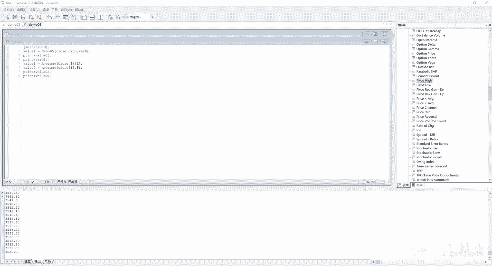
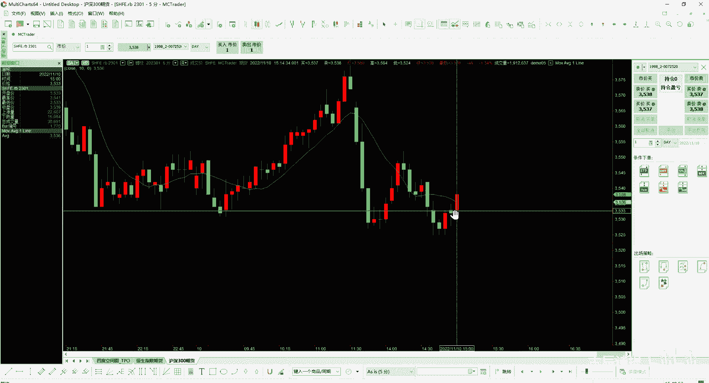
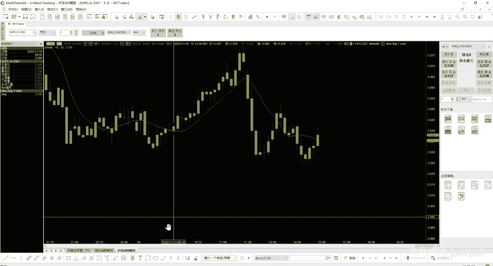
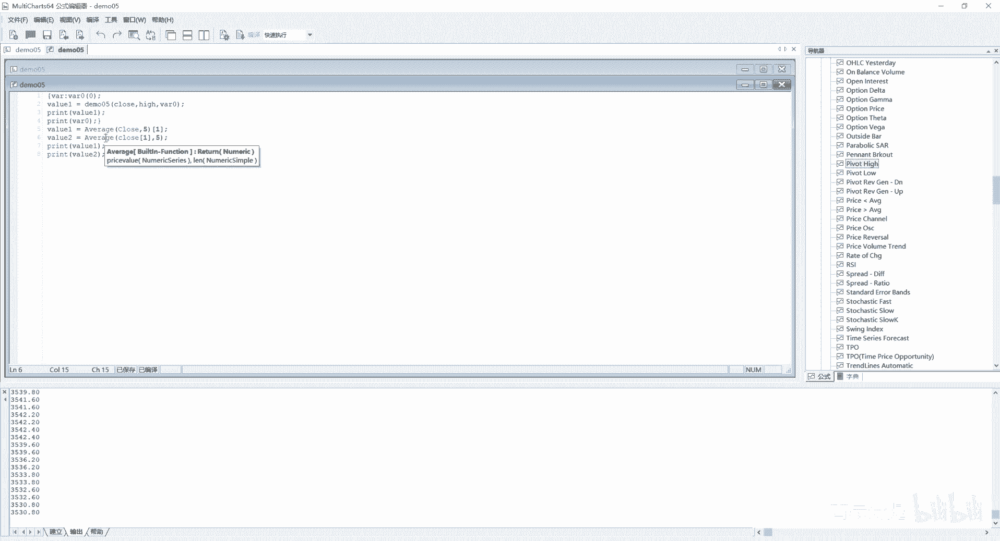

# 第5节课 函数参数、引用函数的历史值 - P1 - 古辰诗提 - BV1MU411f7PN

欢迎大家来到从零开始量化系列课程，MC课程的第五课，这节课呢咱们接着上一节课的讲，上一节课咱们说到了这个数组数组，后边等讲到循环的时候，会单独的再把数组好好的讲一遍，现在你有一个大概的印象。

它就是用arrive或者用ARRISE，然后来进行定义后边一个中括号，中括号里边定义它的维度呃，有几个值，它就是几个维度的，然后在后边括号里边放上一个值啊，这里边的这个值呢是他的一个初始的赋值呃。

建议大家用一维的，多维的，你一定要捋清楚，咱们上节课跟大家讲过，二维的是这样的，它就相当于一个表是吧，你有一个X轴和一个Y轴，然后你里边可以存放很多的数据啊，这样他可以直接通过。

比如说我是就是说这X轴的第一个，Y轴的第一个，你选中的就是这对吧，然后它其实是一个平面的，如果说你再加上一个D3，它其实就是个三维的里边存储的数据，它并不是说咱们可能更容易理解什么呀。

比如说我有三行是吧，三行这个不是三维的，这个它只是算是一个二维的，二维的，比如说是三行五列，三行五列，你定义的时候就是什么呀，Arrive，比如说我A1，然后这里边应该是什么二四。

然后给它赋一个初始值零，这样来定义，因为它是从零开始的嘛，就是这个其实就代表着012，他有这个三组数，然后这个是01234，他有四五组五组数，所以说你一定要捋清楚，这个同样的你再加一个维度。

就是你可以把它理解为是一个长方体，就是加一个就是宽是吧，或者这个高如果说是四维的话，就是你可能就是咱们现实中，就很难有东西能够比喻了，比如你再加上一个时间轴，然后五维的话就是再加上一个空间轴啊。

就是很难去，就是跟咱们直观的认知它不太一样，另外一个你数组定义了之后，你只能就是如果是多维数组的话，你这后边这个一定要写上，就是比如说A1，你后边这个一定要写上，而且这个里边写的不能是变量啊。

括号里边一定要给它赋上值，如果是一维的话，你可以比如说A1这样后边不写，我给他空出来，然后我再进行重新给它进行这个赋值，给它的这个长度就是一个就是比较方便一些啊，后边会跟大家详细介绍。

尤其是等到学到了这个for循环的时候，好，咱们接着往下走啊，就是函数的参数，在讲函数参数之前呢，咱们得先讲一讲函数的使用，如果有一些其他代码编程的经验的话，大家可能对函数并不陌生，因为在每个代码里边。

函数是肯定是最经常使用的一种工具，那在咱们的这个MC里边，它是如何来使用的呢，咱们打开咱们的公式编辑器，好新建一个，比如说我新建一个函数，你想这就有选择返回类型，数值true false还是这个字符串。

就是布尔型还是字符串，这边是自动数值还是数列，咱们这就选上自动，如果说你的返回值是布尔的话，你一定要选第二个啊，然后是字符串的话，你就选第三个好，咱们写上demon05，比如说我要传进来两个值。

然后我求这两个值的中间值，就是其实就是相加除以二嘛对吧，你可以定义一个，比如说input，我传进来的这个参数，我第一个是传进来什么呀，应该是比如说price value1，然后这个括号里边你给它。

写这个初始值吗，肯定不能写初始值啊，那我应该在括号里面写什么呢，咱们就写，NUMERA其实就是数值的意思啊，然后第二个咱们的这个值，比如说price value2，然后里边传什么呢。

咱们也传numeric也是一个数值，numeric就代表着你传的是数值啊，传的是数值，然后我返回值是怎么返回呢，其他的语言里边可能有这个return是吧，但是在咱们这个里边，在MC里边是没有的。

咱们就只需要什么呢，用这个用他的名字demo05等于括号啊，Price value1，然后在里边加上price value2，再除以二，这我进行一下编译，你看这就编译成功了，就是传进来的两个值。

这两个值的类型是什么，NUMERA其实就是数值的意思，然后我给它除以二，然后这个时候你又一定要用这个名字，等于啊一定要名字等于，这个时候我在指标里边，或者信号里边进行调用的时候。

比如说我再新建一个信号啊信号，然后我还是命名demo05，然后我从里边进行调用，比如说我value1等于demo05，括号里边需要传两个值，比如说我传入十，然后一个20括号。

这样我输出一个print y61好吧，我编译一下没有问题的，没有问题，那我就从这我插入信号，然后把这个demo05给他放进去close掉，然后从这输出点输出，你会发现它就有了它。

每一次每一根K线他都过来计算一遍，所以说输出的都是15对吧，这个是一个函数的简单的使用，在这里边你需要注意这个input的这个price value，它后边的这个数据类型啊。

一定要就是括号里边这个就不是赋值了，是你在告诉它它的数据类型是什么啊，你也可以从这写numeric simple，就是简单的数值型啊，simple简单的数值型，这样肯定也是没有问题的啊。

然后我在demo05，我在那，比如说我给它再进行一下编译，也都是失误，这是numerous simple，但是比如说我想这个里边传入的是什么呢，我的这个序列类型，咱们之前说过什么是序列类型。

比如像open clothes high，包括volume是吧，就是成交量嘛，它都是序列类型，你可以调用历史数据的，对不对，那我这里边想传入序列类型，你应该怎么写呢。

我这里边就写上numerical arran，虽然啊他也能自己来识别，比如说我不写，我就写这个写上这个numeric，然后清除一下，咱们之前讲过这个MC，它是能够自己来识别的，那我从这我给他传。

比如说我传close，然后这边传price呃，Hi，我再输出一个Y61，咱们可以看一下，也是可以的对吧，也是可以的，包括我比如说我把这个我输出一个value1，它的前一个序列值就是他的历史数据。

它也是可以的，虽然他可以自己判定，但是如果说你写函数的话，你一定要从这写清楚了，最好是写清楚了，我就传进来的是一个numerical arri，他传进来的是一个啊，当然arrive是一个数组啊。

数组应该是什么呀，是serious，就是它是一个序列啊，serious它是一个序列，这个时候我再进行一下编译啊，也是编译成功的，这个serious呢在Python里边。

它在这个一个三方库里边就是经常会用到的，它其实是代表着一个序列啊，序列的意思，然后你从这这样给他传，当你用到这个demo05这个函数的时候，它后边给提示，你就知道需要给他传一个序列啊。

最好是这么来写好吧，那从这儿咱们可以看见他，这后边里边是可以存放，就是你想要传递什么，包括存放数组也是可以的，当然咱们数组还没有就是去介绍对吧，当然存放数组也是可以的，只就是你想传进来什么东西。

你就就是在这写啊，在这写它有哪几种序列呢，咱们给大家看一下，像他是就是依照这个数据类型呢，分为数字字符串和布尔值三种，按照数据结构分为单值和数组两种，按照数据传输D的方式，分为传值和传指两种两种啊。

总共有12种参数类型，传值和传址呢咱们先等一会儿再跟大家介绍，除了船只和船只，你会发现它有numeric，就是数值，然后numerical arri包括string string外。

true force和true force，surly numeric和numeric，那个simple就是简单传值嘛，就是说啊还有这个numeric simple啊，就是简单的序列的。

这是numeric serious啊，简单传值你就用simple，然后那个序列传值你就用serious，你给它定义的时候，你要注意了啊，当然最好不要用这种单独的这个numeric，让他自己去识别。

你最好写清楚了，我是传的是单值还是传的是这一个序列啊，包括arrive也是可以的啊，你把这个ARRI传进去，它就可以在这个函数里边，以ARRI的方式来进行调用啊，这咱们就不演示了。

因为而外咱们还没有去细讲，true force就是布尔值啊，你也可以就是去传进去的，传进去就是传这个true false，咱们可以看一下啊，To force，你就直接这么来串啊，直接这么来传。

这个我相信大家都能理解好吧，但是你从这你会发现啊，单独的一个函数，它只能有一个返回值，因为你demo05就是他的这个你起的这个名字，它是什么名字，就是你从这儿接收的就是什么名字，但是在很多时候。

比如说我需要传递多个，传递多个这个返回值的时候，比如说我计算一个指标，就是比如计算高低点，比如说计算高低点，咱们的K线是这样的，你从这是一个高点，从这是一个高点，你再往回回溯去计算的时候。

你肯定想知道是吧，这个高低点比如说我前面啊前面是十根，然后后边是两根，然后只要比中间这个值，满足前十根的收盘价比它低，然后两根的收盘价比的低，就是我认定的一个高低点啊，一个高点对吧。

我想把这个高点传回来的时候，我想知道就是说我当前就是传回来，就是那根K线，它的这个K线的收盘价，假设有这样的一种需求啊，你传递的值不止一个，你需要传两个，你既需要这个高点的啊，这个值你也需要这个。

因为你肯定是在这儿嘛，他已经往下走了两根，你才就是说他才能形成一个高点，如果说你不往下走两根的话，你单独的就一直往上涨，它还不能形成一个，就是说这个高点嘛对吧，它只是可能就是说如果说它这么涨呢对吧。

你需要传递的值会超过一个，那这样咱们怎么来解决它，这就是咱们讲义上涉及到的，就是说传值和传址的区别，它的作用就是什么，突破一个函数只能有一个返回值的限制啊，突破一个函数只能有一个返回值的限制。

那要说这个咱们得首先说一下传值和传址啊，在不管是学Python还是学这个C加加，你都会涉及到这个传值和传址，在咱们这呢其实在函数里边用到这个传旨，你只需要你只需要理解一下就可以了。

咱们之前没有跟大家详细去说，就是说这个内存这一块只是在加强理解的时候，跟大家提过内存地址对吧，就是我一个变量，它其实就是对于这块地址的这个指向，它的一个别名，对不对啊，就是我在赋值的时候。

比如说我把里边存储的内容复制给我变量A1，那我你不能是变量A啊，因为在MC里边A是一个忽略词或者忽略字，对不对啊，你是一个A1A1，你复制给他的时候，其实你调用A1，其实就是来取这个一块内存的地址。

咱们之前也说过，这个你像指标和这个呃信号里边的这个参数，也就是跟那个变量相对应的常量对吧，它是不可以改变的，当时跟大家提过，其实就是什么呀，我这个变量指向了这块内存。

不管是我的这个变量名字和它的指向关系，还是说这个内存里边东西都是不能改变的，都是不能改变的，所以说你不能给这个其实它也是个变量嘛，你不能给这个变量来赋值啊，或者说不能给这个常量来赋值。

它只不过是不能变的一个变量啊，不你不能给它重新赋值，你不能改变它的指向的内存地址，所以说那个就是参数和变量，或者说常量和变量的一个区别对吧，是实际上它是什么呢，它其实就是这个我这个变量名指向的这一块。

内存地址不能去改变，就是它的指向关系是不能进行改变的，内存地址里面的值呢其实是可以改变的，比如说像在C加加里边，像内存地址里边的值是可以进行改变的，呃，它有什么指针，常量常量指针这系列东西呃。

指针他就是来获取内存地址里边值的，但是在咱们这个MC这个easy lavage这个里边，它是没法，你去直接去改变一块内存地址里边儿值，而不通过它这个变量来操作的，能理解我这意思吗，就是说其实就是。

就算你能改变这块内存地址的内容，那你怎么去改变它呢，对不对，你那你怎么去改变它呢，因为你的这个变量跟这个指向，是不是它是不能变化的啊，所以说就是如果说你想突破，就是返回一个值这样的一个限定的话。

你可以用什么呢，地址传递，地址传递就是我把这块地址我传递给你啊，我把这块地址传递给你，你这么理解就可以了啊，地址传递是用到什么呢，就是咱们在这个讲义里边写的就是传旨啊，传旨用这个REFREF啊。

R e f，比如说我从这我再写一个price，然后这个里边写上呃numeric，然后REF哈，Numeric i e f，然后呢我那我这个price我等于什么呢，啊我price等于。

比如说就是他们俩加起来，我除以个十，啊除以个十好吧，我编译一下是可以编译成功的，是可以编译成功的，那我怎么来接它呢，我从demo05这我给他传递的时候，我比如说我定义一个VA20吧，啊VA2VA20。

这里边我赋一个初始值是零，我定义了一个变量对吧，我变量里边我在调用这个函数的时候，我把这个变量VA20给他放进去，其实就等于用V20这个变量来接，就是说从这个demo05里边这个地址，把他的地址接过来。

那其实就是V20，就指向了这个price这个参数了啊，就指向了price这个参数了，它因为它这是REF，它代表着地址传递，它就可以进行传递的啊，可以进行传递的，你像这样的就是值传递。

就是我就是把值给传递过来了，这个是把地址传递过来了啊，就是其实就是传递回来了，然后用V20来接住啊，这个时候我可以啊，print一个V20啊，print一个VA20，编译好，咱们看一看输出一有了对吧。

3539它是除以二，这个是除以十对吧，基本上是它的五倍啊，基本上是它的五倍，这样你就可以突破，只能往回传一个值的这样的一个限制，你得用到传旨啊，你得用到传旨啊，你理解就可以了，然后具体怎么使用。

就是你想去进行调用的时候，你从这儿写上一个，你调了这个参数在input里边，然后里边写上你要传递出来了，就是说数值的类型啊，就是然后一定要加上REF，然后你在使用的时候，一定要用个变量来接接住它之后。

然后你这个就是变量里边的内容，就是它的一个内容，在这里边它是可以进行赋值的啊，是可以进行赋值的好吧，这个是传值和传址的这样的一个就是概念啊，一定要注意啊，一定要注意，这当然使用的时候啊。

你会使用就可以了，当你再去看一个别的函数的时候，你这样就能会看得很清楚，比如说呃咱们刚才提到的就是这个枢纽，其实就是高低点的定义在这个函数里边，或者在这个指标里边也是有的，它是这个P开头啊。

OB9P就是呃PIVOT啊，就是这个你想这个是high就是高点啊，它这个是调用的这个这个函数，这个函数呃都是简单传值，他调用了这个函数，咱们可以把这个函数打开，你会发现它这里边是可以传指的是吧。

是可以传指的啊，呃你一定要清楚这个你一定要清楚这个好吧，就是你以后尤其是在可能自己写的时候，不一定写这样的代码，但是你在看一些源代码的时候，它这里边有源代码吗，你看一些源代码去理解的时候，你能很好理解。

包括去使用的时候，你会知道他后边需要的这个，如果是一个REF的话，你需要用一个变量来接一下啊，就这么个意思好哎，这个引用参数值咱们这个就就不用说了吧，就是参数这个值可以被引用的，就是在函数里边啊。

就是我把这个先关了啊，就是在这个函数里边，参数值可以直接被调用嘛，然后进行操作对吧，然后你可以是个简单值，也可以是个序列值，甚至是一个数组，你都可以传递进来，然后进行操作和使用啊。

然后主要要说的就是下面这个，引用函数的历史值，也就是偏移值，历史值，咱们在指标和信号里边儿，其实咱们已经演示了很多，其实中括号加一或者呃N8go是吧，一般都用中括号加一啊，你可以看看这两个。

就是这两个啊，咱们这个给他复制一下，还放到咱们的这个信号里边，来把这个给注释一下啊，加个中加个分号啊，这个一定要加分号，然后进行一下编译，编译没有问题，然后咱们看一下输出，清除全部啊。

然后我从这给他进行一下设，设置一下状态属性，给他设置一下50啊，50应该没问题，这个没有输出啊，我说怎么没有值的呢，Y61啊，print一个value，二好进行一下编译。

然后你会发现它们的值啊是一样的啊，它们的值是一样的是吧，值是一样的，但是他们俩代表的意思其实是有差异的，就是你一定要清楚，就是这个average，就是你也可以直接去来用这个偏移，来调用它的历史数据。

就是我计算出来的这个均线，比如我在图上我画一个均线啊。

就是插入应该是均线是指标嘛，指标里边我找这个mo移动average online啊，我就length，我就用十吧，这个是咱们经常用到的这个指标，就是均线指标嘛，我从这计算出来这个均线我找一个这个线啊。

从这儿进计算出来，就是这个如果是当前拔线的话，再给大一点啊，嗯这个如果是当前拔线的话，我往左偏移一根，其实就是找到这个值是吧，对应着的这个只是在左上角，它是有这个显示的，3536，对不对啊。

3536它是这么一个逻辑，就是我先把这个均线值全部给计算出来，然后它是一个序列值，然后我可以偏移调用。

这样的话就是我可以调用它前一个，而第二个第二行这样的计算，它的意思是什么，我close1就是我这个close的序列偏移了。

就是我直接在这的时候，我计算的是什么呢，前一个的，然后就是close把整个close往左偏一个，其实就是不算当前这一根，然后再来计算他们的这个均线啊，均线他这么一呃。

他这么一个意思就是计算五根嘛，均线这个其实是偏移的，就是close的这个序列值，然后这个是偏移的average，average就是平均已经计算下来的这个值啊，这个你一定要分清楚了。

如果说是在代码计算的时候，尤其是咱们在指标进行计算的时候，就是从哪儿进行偏移，你要想清楚了，如如果说这个函数的脚本比较复杂啊，就是说而且代码中参考到了前面的历史数据，就是虽然在咱们这个这个演示里边。

他没有，就是说这个呃结果的出入，但是如果说是代码比较复杂，你偏移的东西还比较多，然后经常会用到，可能会引起这个差异还是比较大的，所以说你逻辑一定要捋清楚了，为什么反复跟大家介绍。

我是想把它讲的很详细一些，你能理解它，包括船只和船只，其实我完全可以没没必要告诉你，因为如果说刚接触代码的话，你传值和传址你会很晕很绕，但是如果说你理解了你以后在函数调用的时候，包括你写代码的时候。

你就会更加的熟人，就是你一看就是它的数据类型，因为它总归有提示嘛，你在写代码的时候，它会有一个提示，就是这个average呃，就是average，它后边是嗯嗯嗯，你看他这个price value是吧。

a number serious和就是两个一个number呃，一个是这个序列值，后边是一个简单值对吧，你这样就会显得怎么很自信，就是我就这么去写就可以了对吧，不会出现任何问题。

因为我是按照他这个参数来传值的，对不对啊。

