# 第6节课 商品基本数据 - P1 - 古辰诗提 - BV1Js421P77N

欢迎大家来到从零开始量化系列课程，MC课程的第六课，上上几节课呢，咱们讲了前两章，主要是让大家先认识一下这个MC，以及这个MC里边很重要的三块内容，第一块就是函数函数，咱们之前讲的比较多。

尤其是上一节课讲的传值和传址，也就是值传递和地址传递，其实在别的语言里边都会用到，如果说你能理解它最好，如果说理解不了的话，你就知道怎么用就可以了，它能突破一个函数，只能有一个返回值的限制。

包括上一节课给大家演示函数是怎么写的，那个名字一定要跟你的命名是一样的啊，他返回值就通过那个名字，然后后边括号传参，然后进行调用的，第二个呢就是呃这个指标就是用来画图的，咱们还没有跟大家具体介绍。

第三个呢就是信号，就是用来进行交易的或者策略回测的啊，然后这就是你想要进行画图或者进行策略回测，你肯定得需要获取什么东西呢，就是获取一些基础的信息。

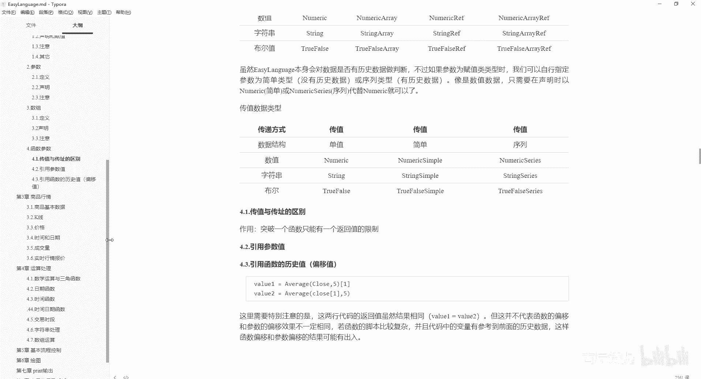

这些基础信息是哪些信息呢，也就是咱们第一节课跟大家讲过，比如说我这边是加载了一些K线，其实每一个K线它代表的都是一串信息，或者一串数据，这一串数据有哪些东西呢，看就是左边的这个数据窗口里边有日期时间。

价格包括SHF一点RB点2301，这个其实是交易所和你的这个合约名称对吧，开盘价这个高开低收以及上涨量，下跌量和总成交量，还有个八仙编号，以及其实你想要显示，比如说这些高开低收是显示的时间也是显示的。

但是你像成交量它是没有显示的对吧，其实你可以把它加载进来，就是插入你这个加载的这个，咱们之前以前你用一些别的看盘软件，它可能给你就呃你像这个均线啊什么的，就给你加载好了，其实它是一个指标。

他还是通过这些基础数据给你画出来的图，对不对，所以说你从这要添加指标，一定要是指标啊，average或者均线呀，或者成交量，成交量一般用volume来表示，你添加这个volume就可以了。

它会弹出一个这样的窗口，你参数没有设定，然后这个volume你用什么呢，比如说我用这个白色的线的话，我用粗一点来表示啊，后边在底部显示就可以了，你不要再显示在顶层。

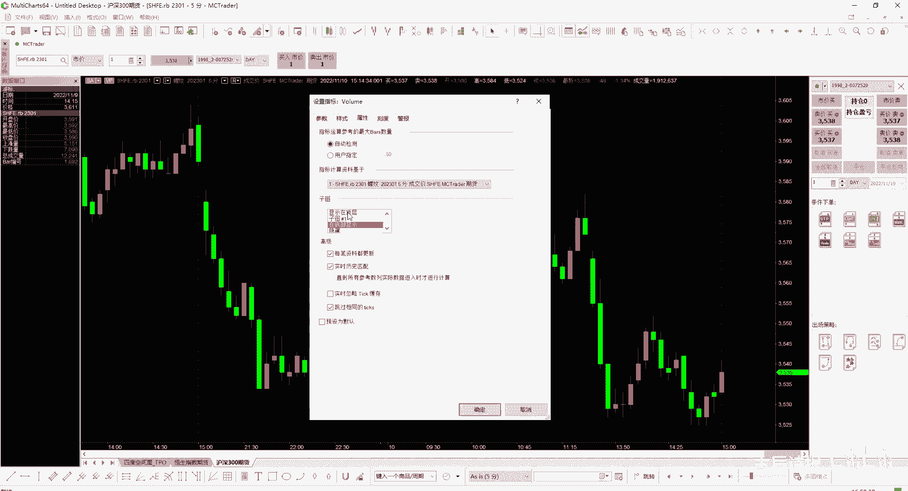

当然也可以显示在顶层是吧，显显示顶层就是这样来显示，但是这样不符合咱们的这个做法啊，不符合咱们的做法，咱们把这个指标再重新设置一下。

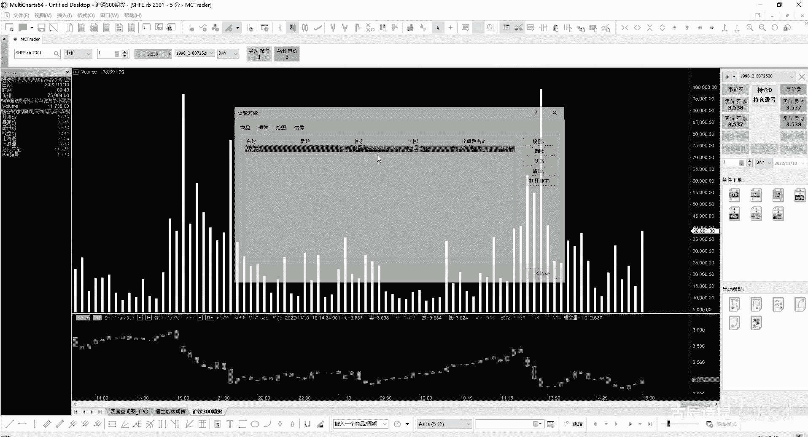

让它显示在底部，显示在底部。

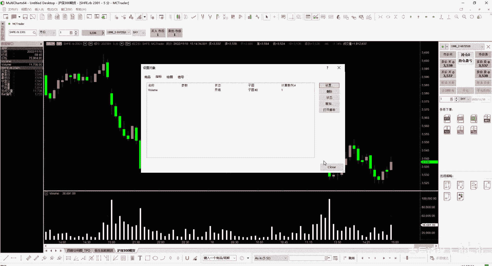

这样就可以了，这个就是一张图啊，显示在底部对吧，其实你要做量化，也是对这些基础数据或者基础指标，的这样一些处理，所以说你首先第一步，如何在代码里边获取它的，这些本身就带着的这些信息，高开低收时间日期。

交易所名称以及你的商品名称是吧，还有你的这个八线编号什么什么的，它自带的这些信息你如何去获取，也就是咱们今天要讲的什么呢，就是商品行情啊，商品的基本数据是第一个。

商品的基本数据呢都是存储在报价管理器中的，叫QM，它的全称呢是叫这个qu t o t e manager啊，就是管理的意思，应该是数据管理的意思啊，当然咱们从第一节课给就给大家介绍过，这个叫报价管理器。

咱们可以打开看一看，这个里边，并不是说把这些数据都存储在这个里边了，只不过这些数据的基础信息在这个里边啊，基础信息在这个里边，比如说你像期货里边，咱们内盘里边的像SHFE是吧，包括CZCE啊。

你都可以能找到它的基础信息，你可以双击一个看一看商品名称，商品源描述，保证金到期日啊，到期规则，到期状态什么的，都是放在这个里边的，这就跟咱们第一课讲过，你下载数据的时候，他那边有个合约设定档。

其实就是来更新这个里边的报价管理器，里边的数据，说白了就是这个软件打开来，它会跟服务器进行交互，包括数据下载啊是吧，包括一些信息的获取啊，你交互，比如说我想获取一个合约的这个数据，你这个合约。

可能你这个软件有好长时间没用过了，你在打开的时候，你这个报价管理器里边都没有，这个合约的基础信息，你怎么跟服务器进行交互啊，你跟服务器交互，你得告诉服务器，我需要获取哪个商品的数据信息。

从哪天到哪一天的，对不对，你都没有这些数据，你都没有这个商品的名称，你怎么去交互呢，所以说这个啊，报价管理器里边也可以自己去添加的，你想如果出现没有数据的情况，需要在报价管理器中进行添加啊。

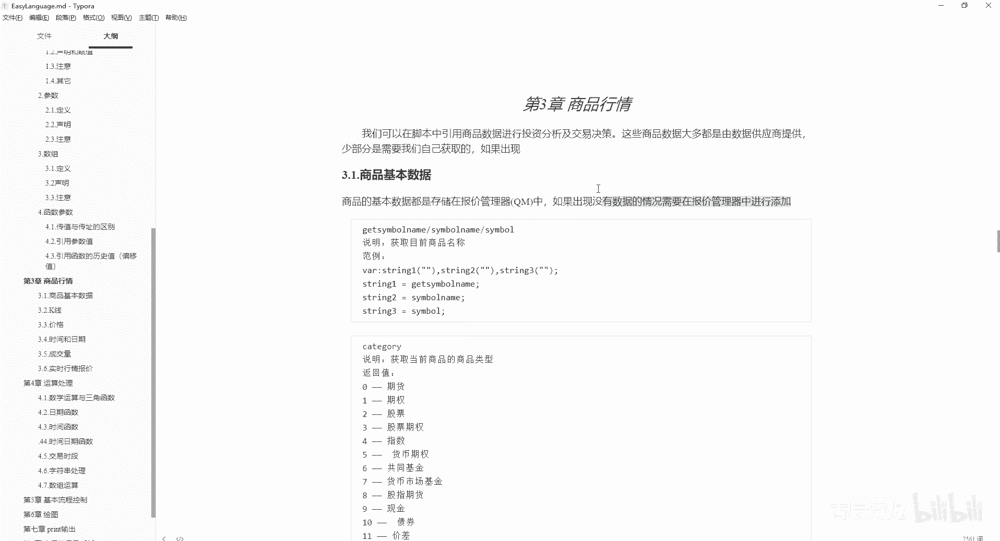

进行添加，另外我要说一下的，咱们这个一般都是用期货数据来做演示，为什么呢，比如说我从这我想获取别的数据，比如说股票数据啊，股票数据，比如说这个是吧，然后我设置一下哎，我就用5分钟的。

然后我从哪一年到哪一年啊，比如说二零呃，21年吧，我就获取时间短一点，5分钟的，你会发现它建立连接，然后无数据啊，你再看一下别的嗯，就是包括指数啊，就是工业指数他也没有数据，他有的能够咱们用到的。

也就是呃这个期货啊，比如说SHF1啊，在期货里边，比如这个白银啊，我来获取数据，然后设置我把它设置成2022吧，时间短一点对吧啊，一样也是有的啊，包括你你获取一些再往前面，你在获取靠前的数数据的时候。

比如说我SHFB点2B我要获取二，比如这个，2010就是2020年的10月数据，你一定要注意设置这个日期啊，你如果说从30日这去下载的话，它是没有的，因为你日期不对，你日期不对。

因为你这个日期是从2022年11月10号，也就是今天往前倒的，你一定要设置一下这个日期啊，这个日期要符合他这个2010啊，就是二零十月的这个合约的20年10月，这个合约的这个日期。

所以说你要把它比比如调成一九呃，就是2019啊，2020192019年。

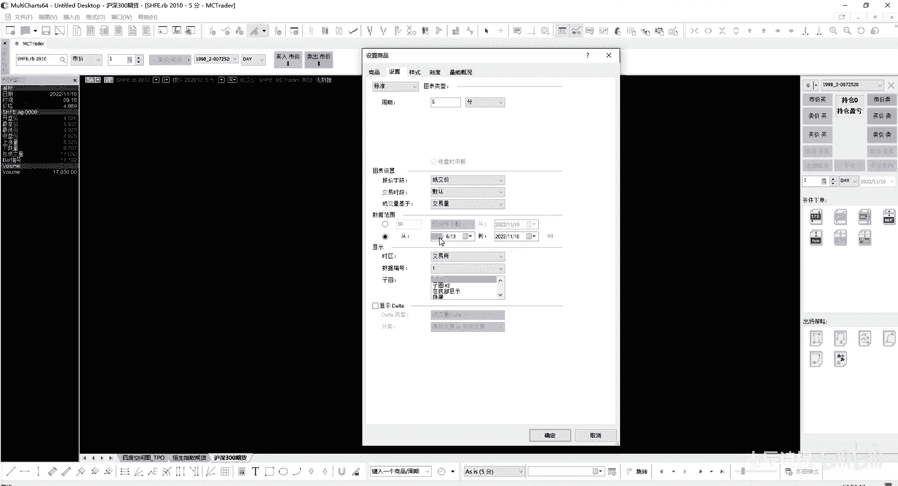

这个时候你建立连接它才能有数据。

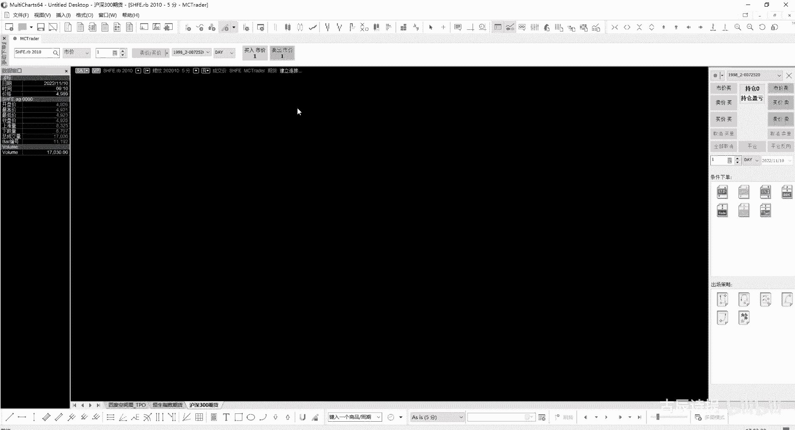

你得在他这个合约的这个期限之内，对不对啊，我再把它调过来啊，商品然后还是再去F1，额点AG吧，我就用白银吧，然后设置我为了给大家演示，我就还是用白银吧，啊好这个基本的情况跟大家说过之后。

咱们就要先来获取，第一个就是商品的基本数据，也就是咱们刚才看到的左边栏的那些数据，包括你的商品名称，第一个要获取的就是商品名称，商品名称呢它有三个关键字，这关键字字是什么意思啊，就是在咱们写代码的时候。

它呈现蓝色的那个代码，它其实就是关键字啊，咱们新建一个信号叫demo06，就是在写代码的时候，比如print啊，这个呈现这个蓝色的字的时候，它就是这个关键字啊，然后咱们第一个获取商品名称。

咱们可以把它粘过来看一下，给大家演示一下，然后我print一个STIN，这个你输出是可以用逗号分隔出来，然后进行输出的，可以输出多个内容，然后进行一下编译，编译完了之后没有问题的话，我需要在图表上插入。

然后指标是吧，呃不是指标是信号啊，信号因为咱们编辑的是信号，然后找到demo06，然后这个就不需要进行设置了，参考吧，也不需要，因为咱们这个没有什么实在的东西，只不过是给大家做演示。

然后输出你会看见他们都是一样的对吧，SHFE点AG000啊，SHF一点AG空格零零啊，其实他们三个的内容是一样的，Symbol，包括在咱们维纳那个平台里边，symbol也是来表示这个咱们具体的这个商品。

合约的，商品合约的这个就没什么太多好讲的了啊，这个呃可能会用到啊，可能会用到，包括我之前的课，就是在哔哩哔哩上那个免费的课，给大家做过演示，就是用symbol来对比啊，这个呃热门月合约，然后来确定。

你就是当你这个合约成为主力合约的时候，然后那个再进行交易是吧，是可是能够去用到的，包括如果说你有一些限制，比如说我这个我这个策略，我只能是在哪些品种上进行交易，你可以用simple name来进行设定。

你不能在哪些品种，比如说不太好的品种上，比如像豆油啊什么的，那些波动会特别剧烈的这样的品种，比如像白糖特别的妖是吧，我不在这些品种上进行交易，你可以从这儿进行设定啊，第二个用的不多。

就是说明当前商品的商品类型，因为MC它是一个综合平台，刚才给大家看了，其实是可以获取到各种各样的数据的，只不过有些是需要你成为高级会员或者付费啊，他这个获取呢是用这个单词，可以直接给大家输出来看一下。

咱们只能是在这个呃期货上去演示一下，我先把它给注释掉，注释是用什么，是用大括号或者双双斜杠啊，就是来注释这个要知道啊，我print一个把它给粘进来，清空一下，然后再进行一下编译，它会自己来运行的。

你看都是零啊，0。00，因为在这个里边都是输出的是float，就是浮点类型，咱们之前也讲过，为什么是浮点类型，它其实就是零嘛表示的啊，只不过你输入出来都是0。00啊，这个就没什么好说的。

零是代表期货好吧，下一个就是description，它的英文的意思其实也是描述的意思，描述的意思，咱们可以也给它把它粘过来，print一下，演示一下，你在注释，用双斜线双斜杠就可以进行这种单行注释是吧。

把它粘过来，然后封号，然后进行一下编译，它会给你输出叫白银啊，0000为什么会输出，这个你像咱们呃一开始就说过，他中文是输出不了呃，是输入不了的，你从这比如说我切换一个中文半角，然后比如说数据。

你根本就没没没法往里边去敲对吧，它是从哪儿来的呢，它是从这个还是咱们这个报价管理器里边呃，咱们这个SHFSHF1在这白银000，它是是在这个描述这一栏里边有白银这么多零，是把这个给你输出出来了。

把这个给你输入出来了啊，当然这个你说我改一改行不行，你别嗯就是你你改它干啥呀对吧，没有任何的意义啊，没有任何的意义是吧，这个只是告诉你它是一个描述啊，然后若描述栏为空白，会返回空字符串好吧。

这个下面显示这个Python不用管啊，是我自己往里写的，当然也可以不写，就是把它给删掉，因为这个是用这个代码块写的，代码块是是这个，比如说我从右击插入啊，可以插入代码块，我得找一个那个什么呢。

咳因为下面全是代码块，比如我从这儿这儿右击插入，它会有代码块，它就会直接给你插入代码块的啊，好这是description，然后下一个就是获取，就是get exchange name。

exchange一般是表示这个咱们的这个交易所的名称啊，你get exchange name就是获取交易交易所的名字吗，包括exchange list啊，Exchange list it。

后边这个应该是一般有Q开头的，就是咱们一般都不怎么用啊，这个可以给大家演示一下好吧，艾特还是把它先给注释掉，Print gate exchanging name，还有一个什么呀。

Print ex change，这个表示exchange，然后listed就是列表，list是列表的意思吗，list在Python里边是一个很重要的数据类型啊，list listed就是把它给列出来啊。

exchange列listed，然后这咱们可以输入，看看全是SHFE就代表着是上其锁，对吧啊，这是它的英文表示，你这个中金锁是CFFEX啊，你要知道啊，CFFEX包括CCCE，还有RNEDCE啊。

这些你得知道你做量化，你这个不知道，那就没法弄了啊，这个就是到期日返回脚本所在图表中，商品的到期日，这也是在QM中，QM中，QM就是那个商品就是管理器是吧，就是QUOTE那个manager啊。

也是在这里边设置的，这个就不多说了，其实就是这个到期日2038年1月1号，因为这个它是指标类的函数吗，啊指标类的这个数据，你比如说我这个你想他到期日就给设好了对吧，当然有一些他也没有设好啊。

比如说这个啊，你想这个还是209还是二零381月1号啊，如果说不准确的话，你就看看这你就看看这好吧，这个一般也不会怎么去用到，除非你是判定在到期日之前或者多少天嗯，还剩多少天到期，我得把它平仓是吧。

你就用这个，我就不给大家演示了，好后边讲这个price skill，这是返回一个数值，代表价格精度的倒数，这个价格精度咱们一定要注意啊，价格精度啧，价格精度是什么，比如说咱们这个白银白银。

他一他价格精度其实就是多少，其实就是一嘛对吧，因为它只有整数，但是你像这个IF它的价格精度是0。1，包括还有一些其他的品种，像这个应该是那个期指啊，股指期货什么的，它的价格精度也有所不一样。

但是如果说你是小数的话，一位小数你是0。1，比如说你像债券类型的，好像能到0。001吧是吧，就是这个是它的价格精度啊，你要搞清楚了，价格精度的倒数，你像这个IF倒数就是十嘛，这个就是1000嘛，对吧啊。

这个一定要知道价格精度的倒数啊，一会再统一给大家演示吧，你看价格精度的倒数，它等于big point value除以point value啊，big point value是什么。

point value是什么，咱们就是下面讲啊，point和points它代表的等于价格精度嗯，就是，就是比如1point就是代表着0。18，point为八，这个需要你注意的，它是可以直接进行使用的。

但是如果说你直接print一个point，它是不行的啊，比如说我这个我print一个point，你编译都编译不过去，它会有错误的，但是你如果说print一个e point，你会发现他是可以的。

输出值是多少啊，1。0啊，就是一嘛，咱们用的是这个白银嘛是吧，这个你要分清楚了啊，这个point它是其实是可以直接使用的，就是当数字去使用的，只不过它这个数字它不一样，它是在这个QM里边给设定好了的啊。

QM里边给设给设定好了的，咱们可以看一下他的这个point，啊point不在这里边，你有兴趣你去找找吧，我就不给大家翻了啊，他肯定是在哪给设给给设置好了啊，这个是point和points都可以。

它是代表的就是一个啊，就是说这个精度啊，比如说股指是0。1价格精度啊，不是它的就是波动值啊，比如说那个股指，你像他是一跳是0。2，这个是0。1，它是一个单位的价格精度啊。

然后你会从这发现mini move乘以1point，就是返回当前图表窗口的一跳，为什么mini move是什么，咱们后边会说啊，big point value和q big point value。

返回脚本所在图表商品的整点价值是什么意思，就是价值就是比如说像螺纹它是10吨，然后它波动一个点是代表十块钱，对不对，然后你像白银他是多少啊，白银咱可以输出看一下啊，就是这个print你别1point的。

就是big point value，好清空一下，然后进行一下编译，应该也是啊，他是15，它是15kg，好像是吧，是还是还是多少，它是15啊，15它是big point value，就代表着一个点啊。

一个点它代表的这个价格价值啊，啊你像这个呃，就是股指是300一个点代表300块钱，然后白糖一个点代表十块钱对吧，mini move就是返回一个数值，表明图表中数据的价格变动的最小单位，只能设置为整数。

这个你一定要知道啊，讲股指的mini move是二，但是它波动一跳其实是0。2，那就为什么上面说这个商品的一跳，你得用mini move乘以1point point是价格精度。

move就是这个mini move是代表着整数的，它的一跳啊，一跳啊，这个一定要知道啊，就是你得乘以e point，它是表情表示他的这个商品的一跳好吧，mini move就是这个意思啊。

嗯mini move乘以point value，表示返回当前一跳对应的价值是吧，point value就是它的一个价格精度表示的价值有point嘛，你理解point了。

你point value就好理解了，point point value是最后一个对吧，就是point是代表一个价格精度，point value就是代表着它的价值是吧。

股指的point value其实就是0。1300嘛，对不对，然后point value等于big point value除以这个price skill，price scr是价格精度的倒数啊。

其实这就是big point value乘以甲壳精度，对不对，因为它是倒数嘛，除以倒数不就是乘以，就是这个就是它本身嘛，就是除以它的倒数，就是乘以它本身嘛，对不对，其实就是乘以就是那个价格精度啊。

好咱们从这给大家演示一下这几个比较绕，所以说咱们把它放在一块去演示好吧，就是放在一块去演示，咱们把它清除全部好，print一个嗯，咱们第一个啊，Price scale，CALE应该是这么拼啊。

Price scale，冒号price skill，然后第二个咱们用一个空格来给它间隔一下吧，第二个用point，用point吧，Point，但是你这个输出的时候你不能输出point，对不对。

你要输出什么呀，e point对吧，刚才输输出过给大家看过啊，然后空两格，然后还有什么啊，Point value，逗号point value，Point value。

后边咱们还有bigger point value是吧，Big point value，好哎，冒号老忘了，然后big point value，Big point value。

后边咱们要输出mini move是吧，就是它的波动的整数值啊，对不对，这个你一定要理解啊，他有时候解释还还不太好解释对吧，mini more还有吗，Mini mo point value。

Big point value，看一眼啊，point value mini more big啊，big point value还有个point price scare啊，基本上就这几个对吧，好。

我编一下，Exception print insects，看一下啊啊，这个里边有个，冒号写外边了对吧，好编译成功了，咱们看一下输出，price scare就是它的价格精度是一对吧。

point就是它的也是一个点的这个价格精度嘛是吧，也是1point value啊，是代表的是15，就是一个价格精度，它的这个价值15啊，big point value啊，就是因为它的价格精度是一。

所以说big point value和point value是一样的，mini move是一，就是他的波动值，但是它只能是整数对吧，你你mini mo乘以一个e point，其实就是他的一跳对吧。

它的一个最小波动就是那个一跳嘛，是不是呃，从这给大家介绍一个什么呀，就是如何获取数据，二就是我在图标里边，比如说我想进行一下对比，然后我要用一个别的，比如说我用一个IF就是同时输出，然后进行一下对比。

我怎么来来操作呢，就是of data to就可以了啊，of data to就可以，但是这个里边有个问题啊，你对这个1point不能offdid to啊，不然他会报错的，可以给大家看一下。

Of data to，你从这编译，你有这个e point，它是编译不过去的，所以说我需要把这个e point给它删掉，好吧啊，1point给它删掉，然后我直接编译编译呢。

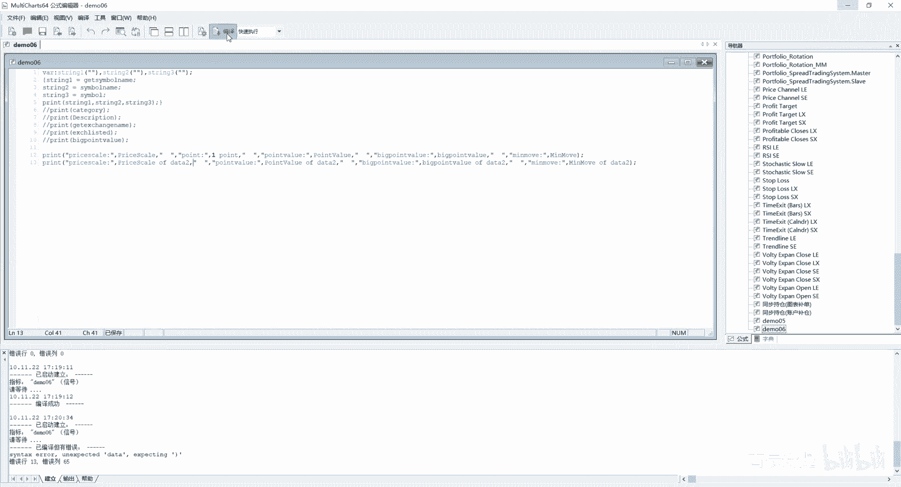

它会报错啊，就是指标错误，就是你在图标里边，你是没有图表二的，我先把这个volume给删掉啊，我从这啊设置商品啊，商品啊，不这么添加了，就直接插入一个商品吧，插入商品呢。

我可以比如说这个CFFEX中证500吧。

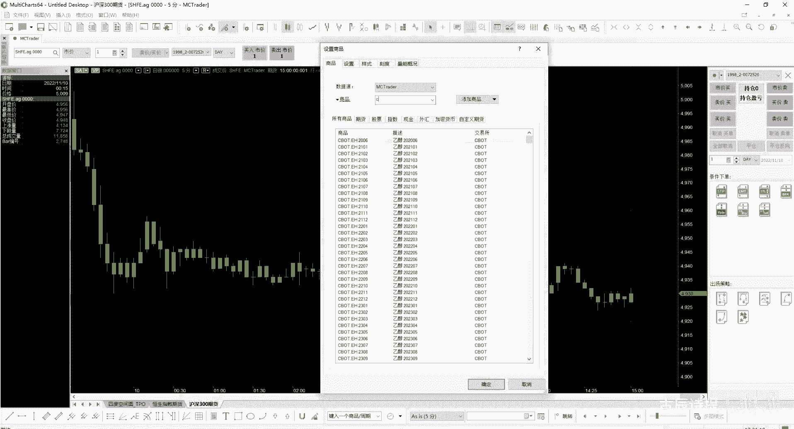

然后我点击确定，它会放到就是图表二里边来，这个就是代表着是data to啊，是代表的是data to，这个你一定要理解它是啥意思，它是代表着data to。

然后你从这个代码里边获取的就是data to啊，data to他这个数据怎么少啊，中证500我重新设置一下吧，用IF吧，点IF沪深300吧，沪深300 036，啊哦这个白银他是夜里边有盘的。

所以说差着呢啊差着把这个白银哎呀算了。

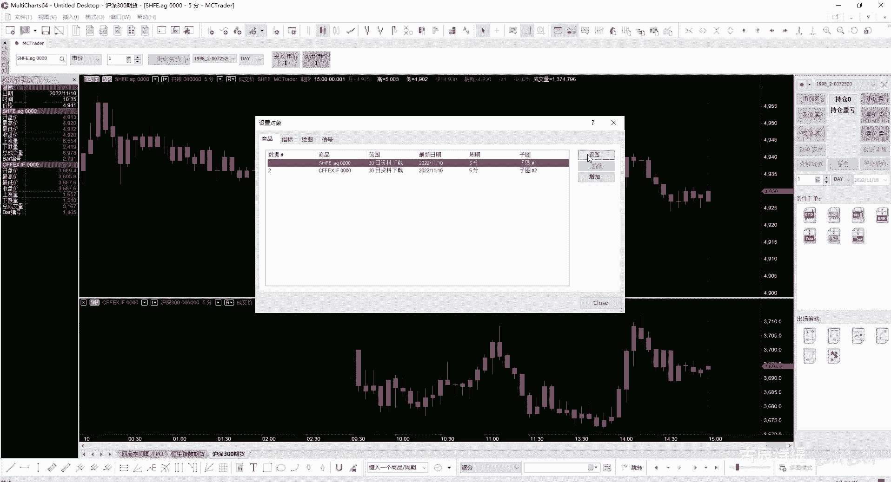

就这么着吧，好咱们看看他的输出，好吧啧，这个还没有呢，因为那个被关闭掉了，然后我把它在设置信号。

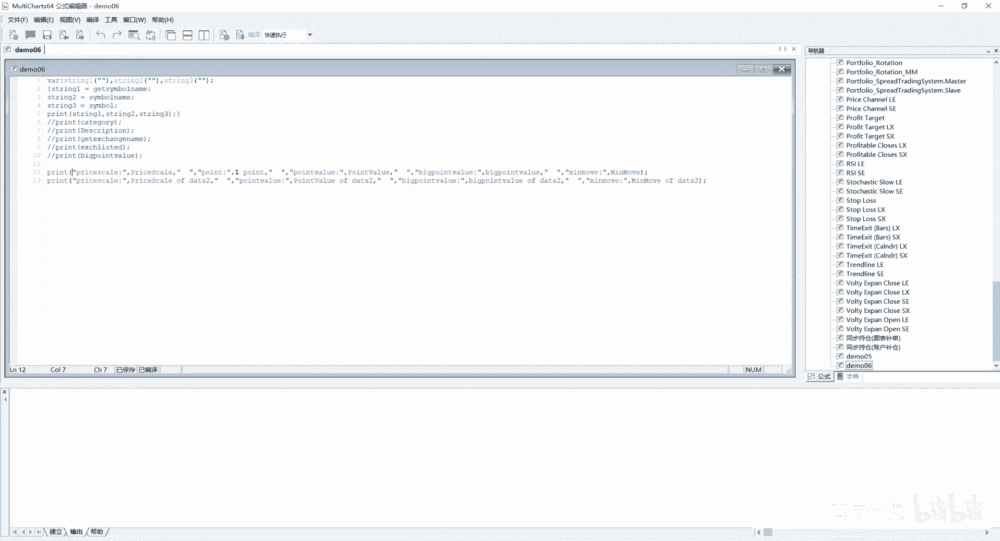

然后状态开启。

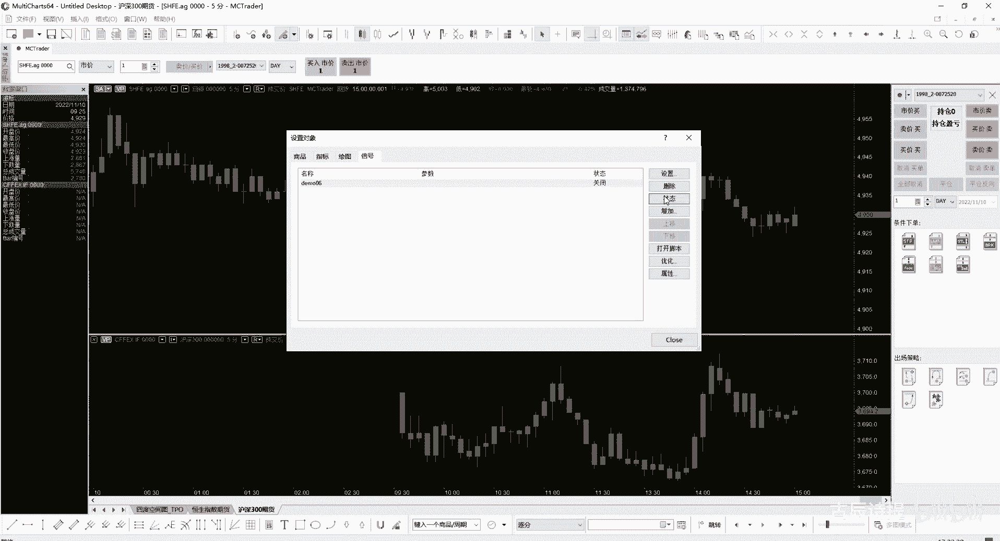

然后close啊，因为刚才出错了嘛，出错了，所以说他会被关掉，因为没有图标，二你再给他打开的时候，他就会输出了是吧，这个你像这个i if它的price scare，它的这个精度的倒数是十嘛，这没有问题。

point value是30，就是一个精度代表的价值，它一个点代表300是吧，big point value没有问题，但是它的一个精度就是0。1×300，就是代表30。

然后mini move就是最小的波动值，它其实应该是0。2，但是由于它不能是小数，只能是整数，所以说它是二，所以你要获取它的最小波动，就是一跳那个波动，你得拿mini move乘以e point啊。

e point你要理解它好吧，这个是比较容易混淆的这个几个，尤其是当你比如说我想根据我的资金情况，来设置我的仓位，你这个时候是得需要进行计算的，你那个clothes收盘价只不过是一个价格对吧。

你得乘以什么呀，它的big point value，就是它一个点就是代表着多少的价值，你才能计算出合约的价值，对不对，然后你用合约的价值再跟你的这个资金，然后比如我用三倍杠杆，我就拿我的资金乘以三。

然后除以我的这个合约价值，这是一种计算，就是仓位的方式和方法，另外还有什么呀，比如说我这一次最大止盈是2%，然后我就是每次，就是说就是我最大止盈是2%，比如说我每次亏损我就亏损1%，然后我来去计算。

就是说我能开多少手，是不是也可以这么去算，你都需要通用到这个big point value啊，或者一些其他的东西啊，所以说这个你一定要捋一捋啊，就是它代表的是什么point value。

尤其是这个point返回的价格精度一定是精度啊，要理解清楚了好，咱们快速说说一下这个K线K线里边的内容，K线呢它表示一个时间周期的行情基本信息，这个好说了是吧，包含了高开低收成交量，持仓量。

商品合约交易所交易信息啊，交额交易时间等信息，它这里边有个cn b cn bar，咱们之前一直演示过，它是代表着当前的这个就是什么呀，当前的这个呃K线的这个编号，但是呢它不能既不能包含就是参考罢啊。

就是这个max8back是吧，咱们之前给大家介绍过max8back，就是不包含这个啊，就是参考八的这个编号是过了参考八，开始计算的，过了参考吧，开始计算的print一个COLUMBU，看吧。

好吧就是到了2700，因为这是额。

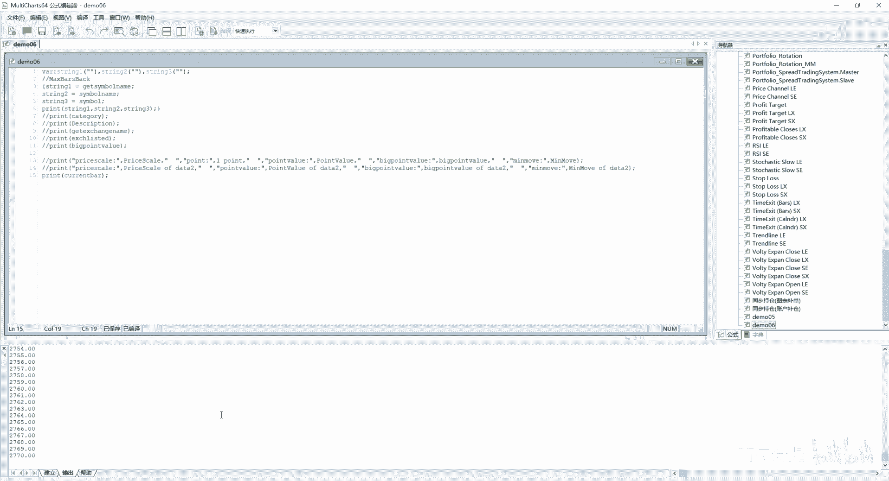

就是这个是分钟呃，5分钟的，如果说我把它设置成比如说日线的啊，设置，一日是吧，然后30天的，30天的。

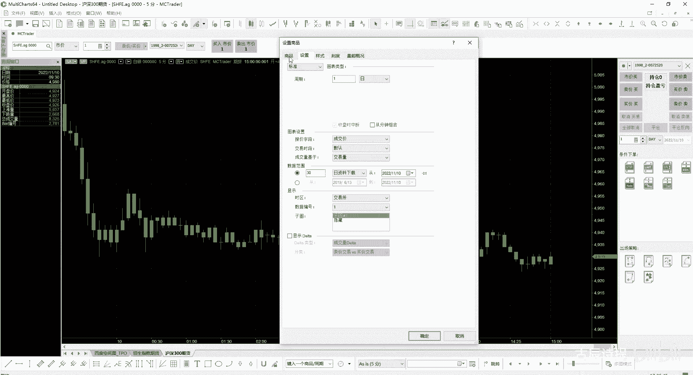

然后我点击确定，他这个就少了是吧，我设置信号，我设置它的参考罢啊，就是属性里边设置属性里边设置参考八，我设置成十啊，我再让他哎从这来运行一下，你会发现它输出到最后是20，很明显这是不包含就是参考bug。

对不对啊，不包含参考bug，好。

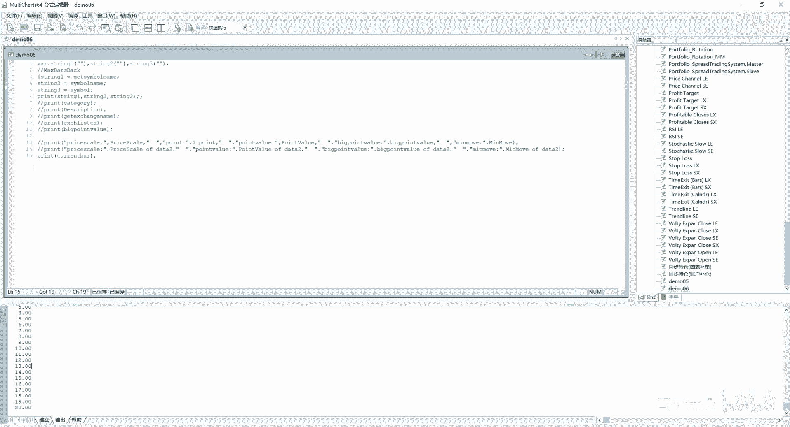