# 第6节课 CtpGateway(4) - P1 - 古辰诗提 - BV14f421o7Fa

欢迎大家来到从零开始量化系列课程，VNPY课程的第六节课，上节课咱们讲到了，这这个是时间的设置，下面这个呢是给时间设定时区，因为本身你这个时间是没有时区的嘛，嗯VMPY这个它的接口。

可以接入很多外盘的这个品种，嗯就是你接入外盘的，你就需要进行时区的转换是吧，所以说他加上了时区，当然对于咱们来说，如果说你只做国内品种，或者说只做期货的话，这个完全没有必要，你可以完全把它给删掉。

勇敢的去删，勇敢的去做，因为咱们已经把VNPY，这个CD给复给复制出来了，就算有问题，大不了我再复制一份，对不对，哪怕你是在源码上面改的，大不了我把它卸了，我再重装一个，那不就可以了吗啊。

所以说一定要去尝试好吧，那咱们来看一看这个时区是怎么设置的。

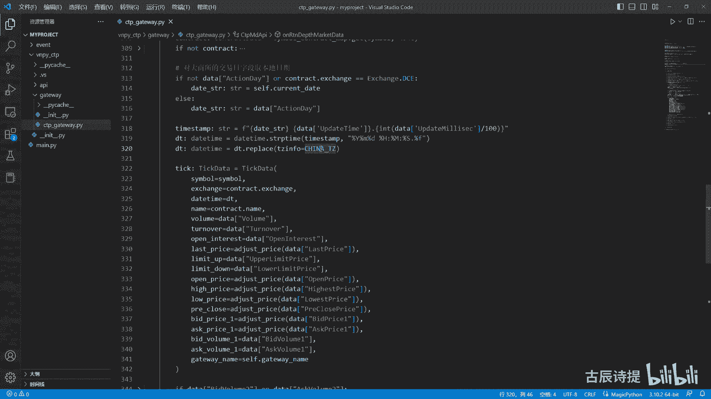

它就是一个low info呃，这个ZO就是一般是time zzinfo，就是哎就是这个亚洲上海一般设置时区。

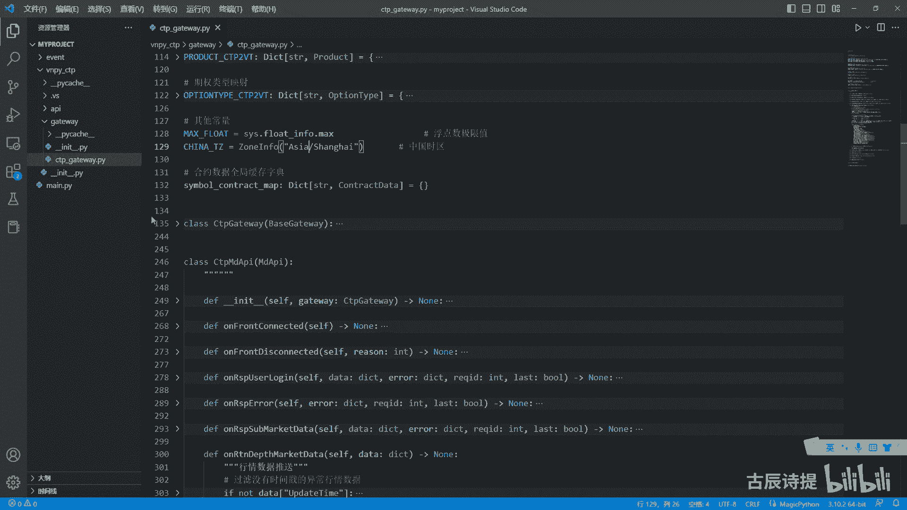

咱们会涉及到两个类啊，demon06。2PY一个类呢就是刚才那个from，info前面这个是小写的，后面这个是大写的ZINFO，还有一个呢是import tz local tz就是time zone。

然后local就是本地的意思啊，呃这个也用到了，在这个VNPY里边，好像是在from VN py下划线，Ccta strange，Import ccta engine。

应该是在这个CTA引擎里面是用到了啊，咱们找一下这个CT引擎，是这这这倒过来的是吧，然后它导入的时候你看from tc local，所以啊这两个你最好掌握一下，特别简单啊，一般是怎么用啊。

就是比如说我TZ我要获取本地，就是我本机的这个时区信息的话，我直接就是tz locker，然后点gate a local zone，然后咱们可以print一下这个TZ输出一下是吧，上海AA啊。

嗯就是这个特别坏啊，他他不弄北京，因为北京才是咱们的这个首都嘛，他给你偏偏弄个上海啊，然后如果你就这样去按照，就是说咱们这个源码里边去做的话，这样会有问题的啊，会有问题的什么问题，咱们可以演示一下。

比如说我DT等于我从这导入一个，from the time import dt dt等于date time点now啊，这个DT他肯定是没有失去的对吧，是没有失去的啊，然后如果说你想给它加上时区DT。

然后等于DT点replace，按照他那个写法，就是tz info，Tz info，TZ就是time zone，Info，就是info Mission嘛是吧，等于这个啊，Though info。

然后把这个上面这个TZ放进去啊，这样会有问题的，会报错的，因为什么，因为它的类型不对，你这个TZ它不是STR类型，咱们可以看一下tap，先把下面给注释掉，然后运行一下，它不是STR类型。

所以说你想要它是STR类型，就是你这加上一个name，他这个时候就是STR类型了是吧，然后这个时候你再把这个打开好，咱们可以看一下，最后没有输出这个什么，你会发现就有这个时区了吧，就是就是80区嘛是吧。

就是这个一般都是这么去使用它的，使用它的，当然你可以呃，比如说TZDT点as啊，As time zone，然后这个TZ呃你在放的时候，你就需要放呃，你像第一个咱们试一试啊，咱们就是刚才那个来试的。

就发现他有问题啊，这个时候你你这个get local tz啊，然后我再给他printed tz，你看这个就没问题了啊，这个你注意使用，就是如果说你这个用这个though info。

然后后边一定是字符串类型的，如果说你不用这个ZINFO，你用这个tz locker，你这就是dt dt s time zone，后边加上这个TZ就可以了好吧，只是我觉得你能掌握这么多就可以了啊。

这个时区设置我还是建议大家如果用不着，可以把它全删了啊，然后下面呢就是这个tick data，它从这个字典转换为咱们这个tick data数据类型。

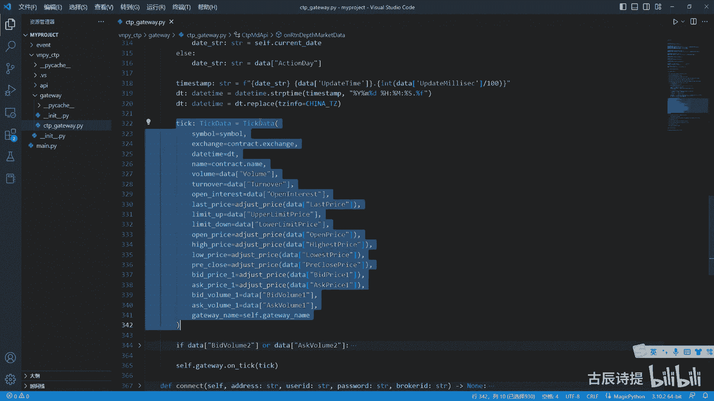

这个里边没有什么好说的嗯，要说的就是这个adjust price。

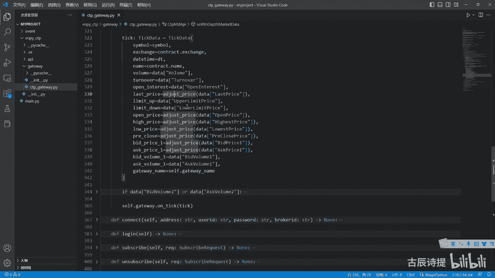

这个adjust price是在这是在最后，而且不是在这个类里边对吧，他是做了什么呢，如果说1price等于max float，然后price就等于零，然后return price。

其实就是如果说它的价格等于max float。

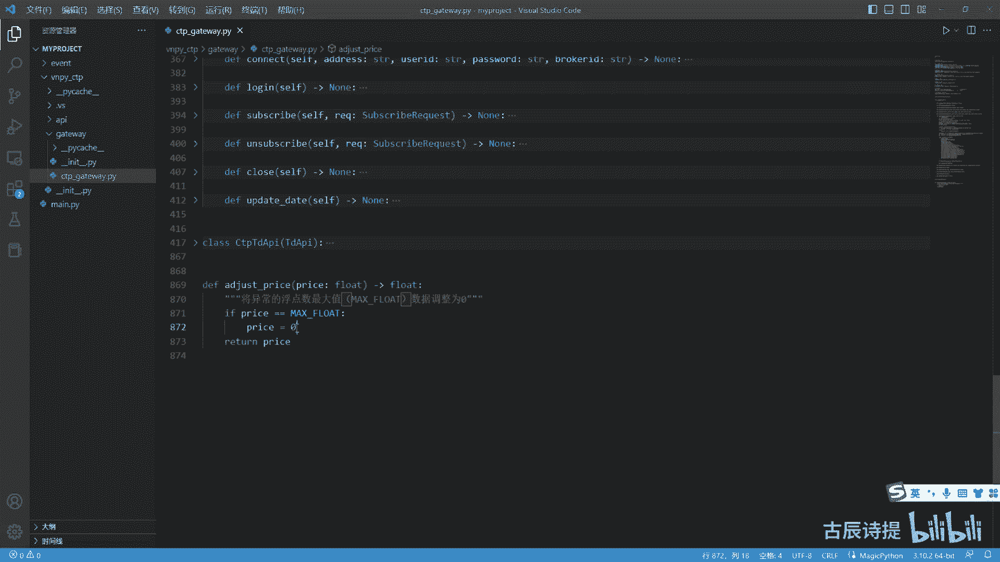

它就是return0，对不对，这个max float是什么呀，就是SYSSYS是system的意思，就是你的这个操作系统的它的这么一个类，然后float info float是浮点。

info是information点max，这是什么意思啊，这其实就是你的计算机的最大值啊。

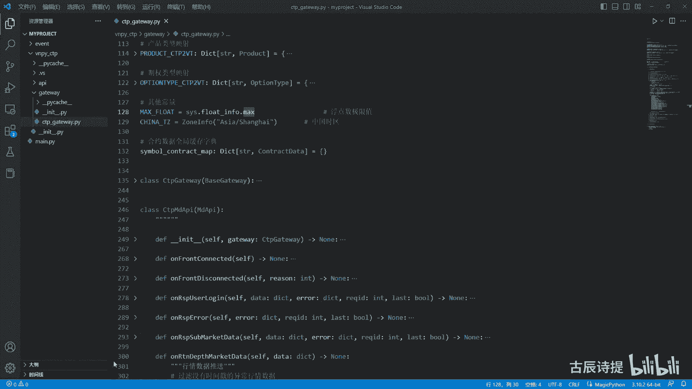

比如说我把上面都给注释了，然后import一个SYS，让直接print一个SYS点，float info点max，你可以看一下啊，它的值是1。79769啊等等等，然后E的就是十的308次方。

很大的一个数字。

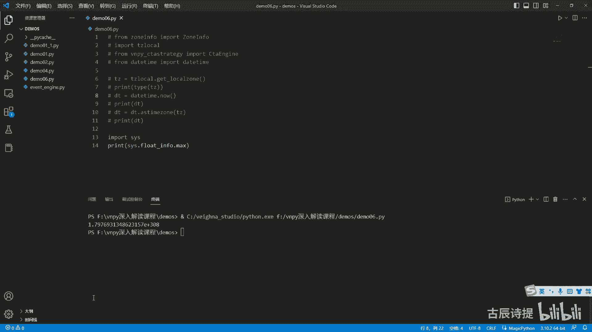

记住这个数，咱们可以看一下数据原型，这个tick里边你会发现啊。

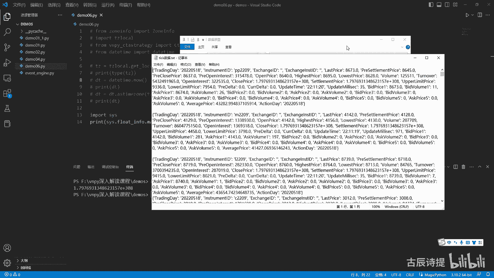

这个是不是跟他这个数是一样的，包括后边这个跟他数是一样的，呃，这个交易所啊就是说给你发过来的，你看这个close price，他虽然是在这个数据给你发的，他的意思是什么，是当天这一天的这个收盘价。

你在盘中的时候，你并没有这个close price，对不对，所以说他给你发了一个极大值，就是告诉你这是个无效的数字，但是有的交易所给会给你发零啊，但是他这是发极大值，有的会给你发几大。

只包括这个setment price，这个是什么意思啊，就是结算价，你计算价只有在收盘以后才进行结算的，对吧啊，这个时候如果没有的话，他就给你发一个极大值，但是有的交易所啊给你发的是零，所以说不一样哦。

不太一样，而且你会发现上期所应该，上期能源也是给你发过来的，这个数字它很多都带好多零是吧。

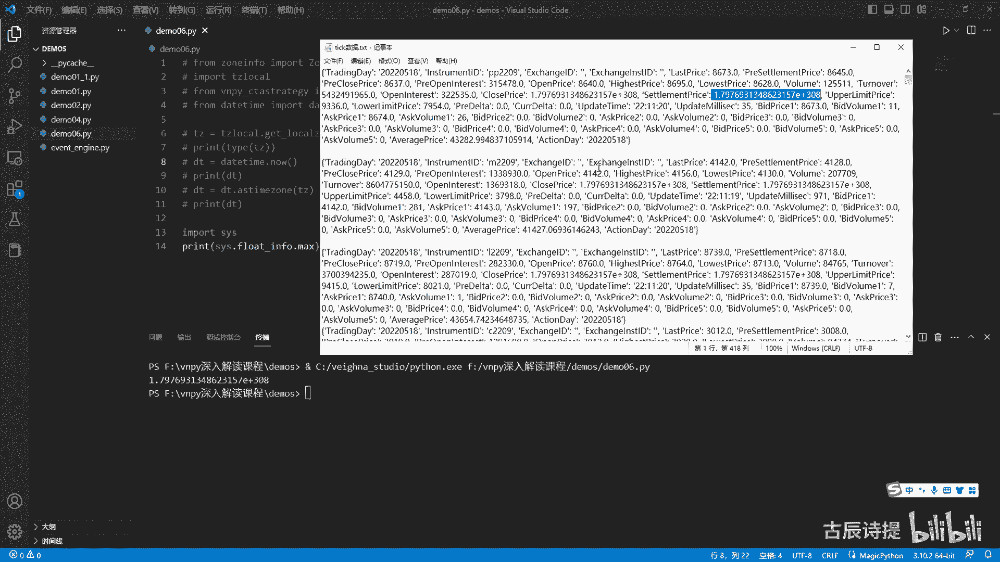

很多都带好多零，比如说类似于这样，比如说3651。0000好多零，然后最后放一个一或者放一个五，这个是怎么回事呢，就是这个是说明啊给你传递过来的，他是这个这就是的浮点类型的数值。

因为计算机这是计算机基础了啊，在创建的时候，它在存储的时候，就是因为它是二进制的，它转换成十进制，有一些数是转不进的啊，这个为什么叫浮点，这个浮嘛是浮动的意思吗，就是简单说一下啊。

就是你存整数的时候没有问题，就是转换成二进制，你存小数的时候就会存在问题，那这个点点在哪，对不对，你是点在前面，还是点在后边，还是点在中间，点在中间，它有什么问题，就是你的极大值会受很大的影响，对不对。

呃就有一个发明是什么呢，当你的这个整数值比较小的时候，诶我就往左边点一点啊，这边放整数，这边放小数，精确度高一点，当你的整数值大的时候，我就往右边点一点，然后呃这边放整数，这个这边就牺牲一定的精度。

当然牺牲的也不多啊，就是咱们完全是够用了，这个就叫浮动，所以说叫浮点，而不是叫小数点啊，这个就是你得知道它本身计算机天生的缺陷啊，这是天生的缺陷，它是有问题的啊，有问题的，所以说它叫浮浮点数。

那就说明你从这能看出来，就是上期所给你发过来的，它不是字符串类型的，它是这个浮点类型的，好吧啊，这一点希望大家知道，当然你想对它进行处理也也比较简单对吧好。

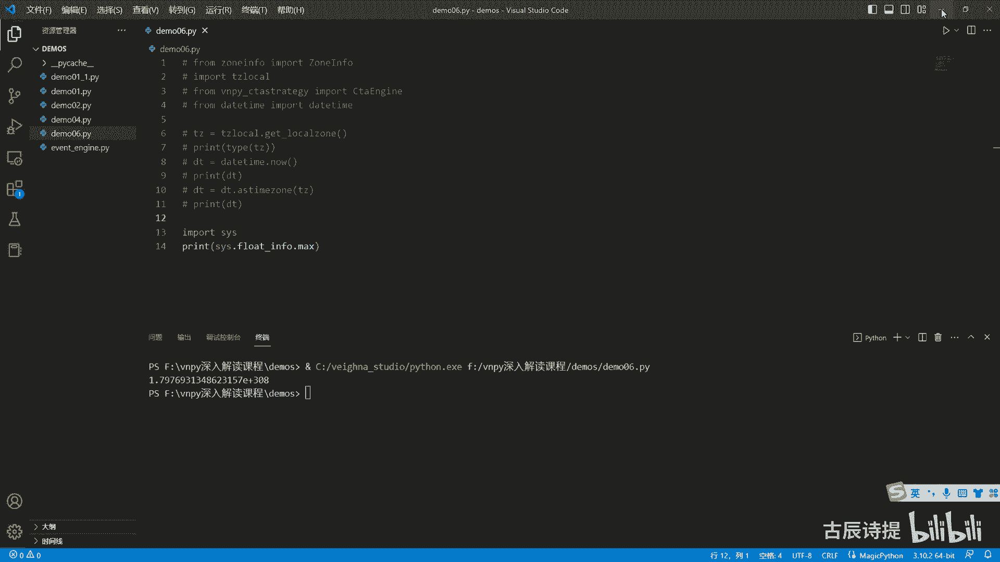

那咱们再往后说。

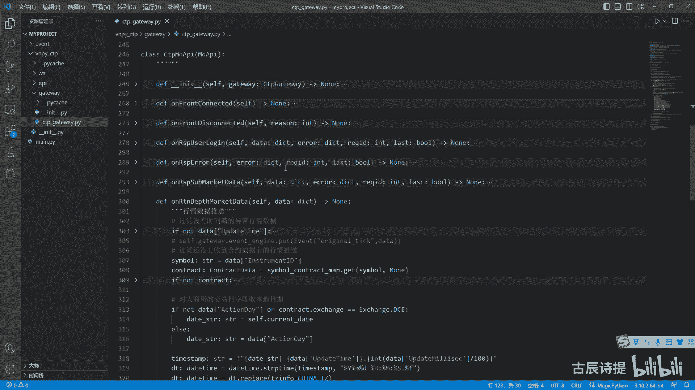

就是如果说比如说你就单纯的你想写一个系统，就做全市场全行情的这么一个录制，我指的是期货啊，你完全不需要用这个买一架买一架啊，一直到就是我就是啊买五价卖五价是吧，你可以直接把它删了，有一些不需要的内容。

你就可以把它删了，其实以前这个VMPY这个里边是没有这个，turn over的，turn over是什么呀，成交额的意思啊，成交额为什么需要成交额，就是你得知道啊，这个成交额你有了成交额你就能算出来。

就是有了成交额和成交量，你就能算出来，在再就是哪个价位，他成交了多少手，对吧啊，成交额一般是来这么使用的好吧，不然的话你你就是单看成交量就可以了，当然这个tick里边还是那句话。

大家输入出来看里面很多的东西，包括之前讲的action day啊，包括讲的这个你极大值啊，还有很多，比如说你开盘的时候，集合竞价，交易所和交易所都是有区别的，集合竞价你想好像是大场所还是哪个交易所。

它从8。55分到8。59分，他只要有人去竞价，他就会发送一笔tick，有人竞价他他就会发送一笔TK，但是呢有的交易所它是什么，到8。59分，然后零零秒啊，零零分零零秒就给你发送一笔TK。

就等于说是前面集合竞价的一个总的一个概况，然后他就确定了这个收盘价，很多人他在合成K线，用VMPI自带的这个8000流水的时候，遇到很多问题，比如说合成的一分钟K线，比如说开盘价不一样。

就是每天的第一根的开盘价不一样，为什么呢，因为通常意义上来说，开盘价是集合竞价的那个价格，而不是说你第一笔tick传过来的那个价格，但是由于VMPY这个8G的支持，就是K线合成器。

它得兼容很多其他交易所的一些内容，所以说不可能给你做的那么详细，你想要做量化数据是基础数据是从哪来的，是从tick来的对吧，所以说你只有把它输入出来，你才知道里边有哪些问题，就是有哪些不一样的地方。

比如说咱们说到这个turn over，你像这个大上锁还是正上锁的turn over，他呢像咱们理解的同over是用价格乘以这个价值，然后就是你这一手是多少吨是吧，你得一点的价值，比如螺纹一个点是十块钱。

价格乘以价值，然后再乘以手术那个才对是吧，但是好像是打上锁啊，好像是大场所，它没有乘以价值，他就直接拿价格乘以你的这个手术给你算出来，这个turn over，就比你跟三方平台上对应着这个软软件。

你看就会比如说一手10吨的那样的品种，它就会少个零，所以这些你都需要自己去看的，而不是说我从这我讲给你，我告诉你啊，然后那个我再给你写出来，然后你去用那这个代码那么多行代码是吧。

你一个VMPY里边多少行代码，多少代码，你哪一点出了一点小问题，他都会报错，他都运行不了，所以说你一定要自己去研究输出出来啊，一般咱们去录制行情，都录制分钟级别的，你全市场全行情tick就没法录了。

tick呃，我输出过几天，就是基本上一天都得达到十个G的这个数据啊，我还是存在了那个TXT里边呃，教大家一个方法，你想自己写一个拔尖的这事儿，你先录两天的行情，比如说二十二十个G的行情。

然后呢你再把这把这些给读出来，读出来之后，然后再用你的这个八建筑设去合成，发现没有问题了，你再去实盘，也不是说实盘你再用，就是说链接的这个实时数据，然后去合成去看好吧，呃很多很多啊，有很多问题。

包括之前说过的就是他的tick，你就是你的这个K现在有效T可无效即可，你像890这事，咱们VP里边它就是他没有过滤那个无效即可，就是这笔T和前面提可完全是一样的，成交量没有变化的这种题，可他是不要的啊。

很多平台上都是不要的，你从这个三方平台上你划线，然后做策略或者从MC上做策略，然后做的挺好，结果发现到了这个VNPY上面，总发现你成交的时候差这么一两个点，总发现你这个AT2计算的时候。

或者均线计算的时候差这么零点几。

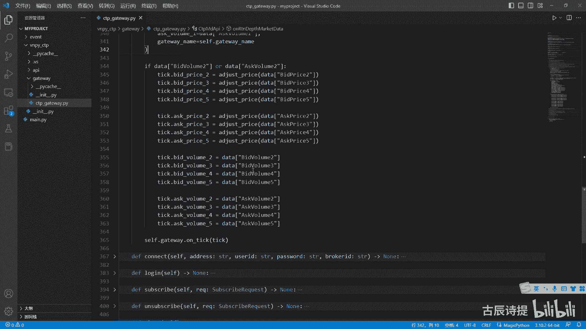

为什么这个出在哪了啊，这个你得自己去研究。

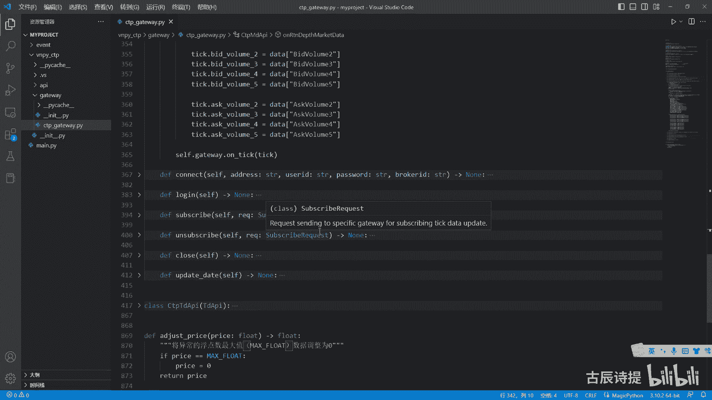

去琢磨好吧，好这个MDAAPI基本上没有什么别的东西了是吧，就是这个update它就是update date，这个是用在哪的，咱们也说了，是action day，它得需要这个date是吧。

他得需要这个日期，好好，咱们就来讲这个CDBTDAPI啊，这个TDAPI里边承担的最起码得有，你看这个行情的呃，不是行情啊，就是你的这个持仓信息是吧，成交信息，委托信息最起码得有这三个吧，对不对。

你这样的话你才能去做你的这个策略啊是吧，你才能完整的知道你的现在这个呃，就是策略的情况啊是吧，所以说它必然会有呃哈就是说这个持仓信息，你的这个嗯，成交信息和这个委托信息的这个推送。

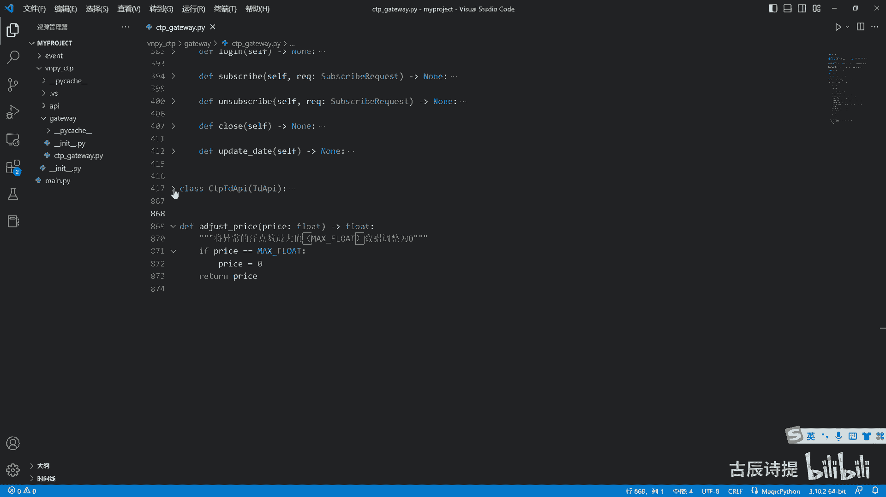

当然它首先第一个就是就是。

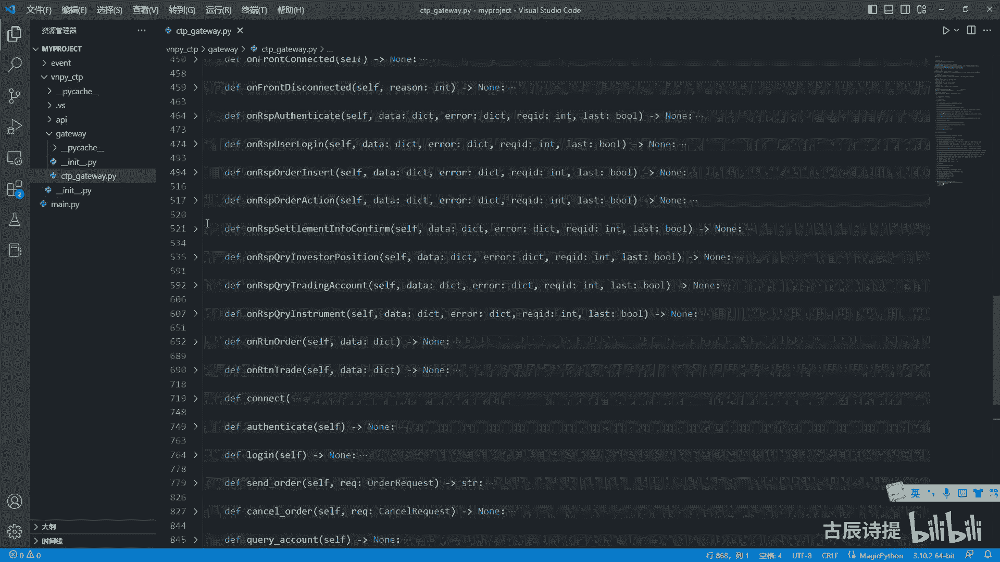

第一个要处理的信息是什么，其实是可交易合约。

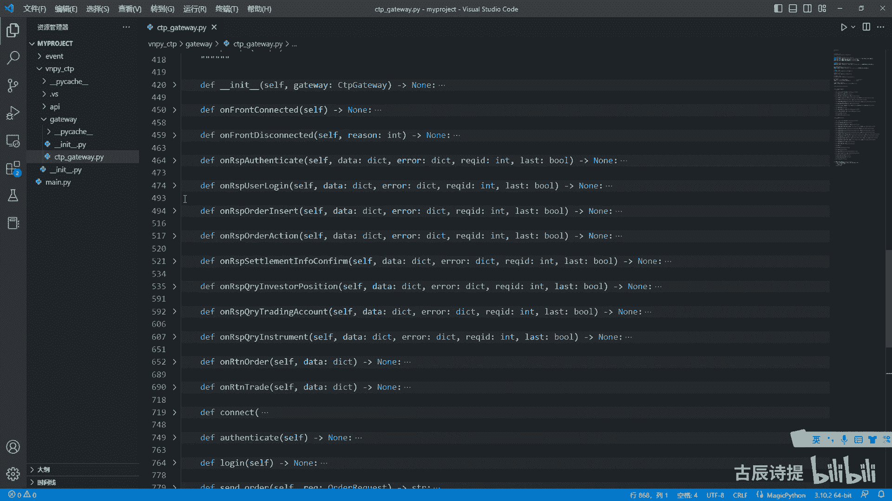

咱们在上面去分析这个on这个，这个这个Mark data的时候。

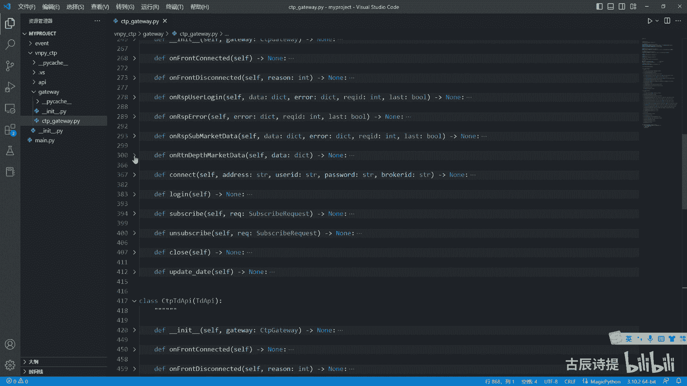

你会发现它会在前面找什么呀，contract contract是合约的意思啊，然后他如果找不到合约的话，if not constructor就直接就return了。

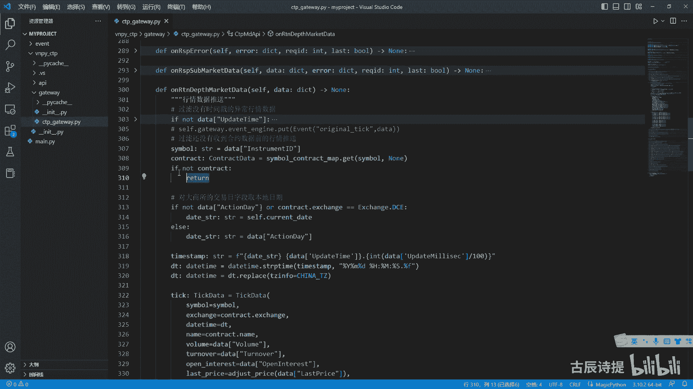

所以说合约肯定是你行情连接上之后，第一个要接收的，当然一般你连接上行情之后，不会说你主动去申请，他才给你发，连，接上之后，你的这个合约就是可交易合约的这个数据，以及你的这个呃就是这个这个成交数据。

还有你的持仓数据以及你的委托数据，这个委托是指还没有撤单的那种，还未成交的那种啊，都会给你发啊，都会给你发，因为什么呀，你就是说你这个成交你肯定得给你发，我今天成交了多少，成交了多少是吧，肯定得给你发。

然后你你这个委托委托，如果说你一直挂着单呢，你像咱们都知道啊，委托是能，就是说吃就是在一个交易日内是有效的，什么叫一个交易日内是有效的，就是你晚上叶叶凡发呃，发了个委托，第二天他一样给你挂着。

之前就有人问过，我说，为什么我晚上就是有的委托会成交两回，那有可能就是因为你晚上挂了，他没成交，然后呢你第二天早上因为中间柜台断了嘛，你第二天因为没成交，你就得发委托嘛，是不是。

然后你就造造成了两个委托是重复的了，你再发的是个限价单是吧，就很有可能就会成交两回，因为中间会断断了之后你这个委托没没成交，如果你在写了代码，然后第二天早上再发出去，是不是就成交了。

但是委托是在一个交易日内是有效的，但是如果说过了一个交易日有了结算价之后，他就没有效了，所以说他必然会给你发委托情况是吧啊。

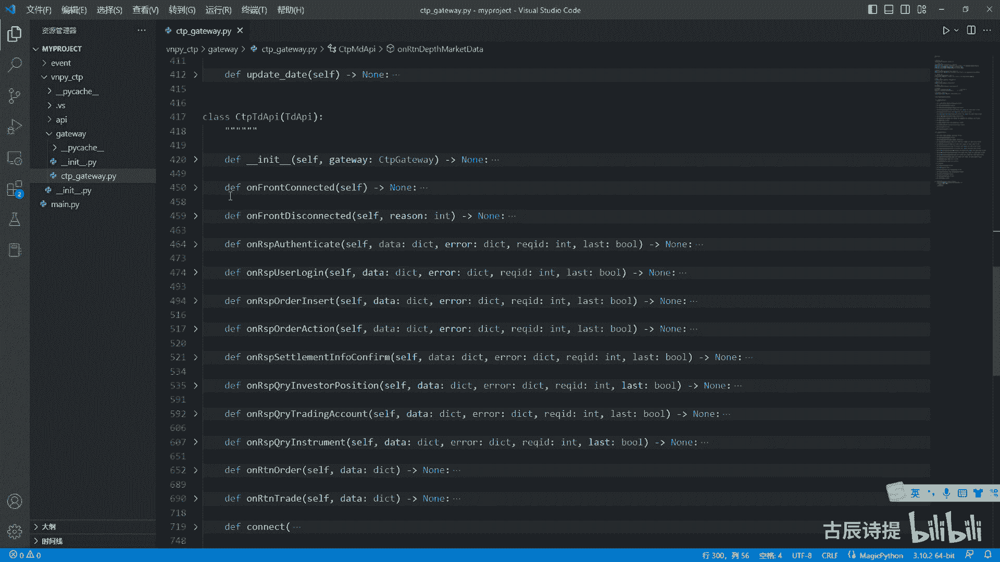

所以说这些是肯定有的，但是前提啊他都是得先知道合约。

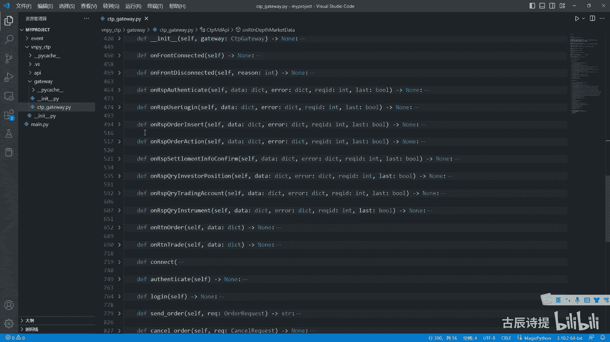

就是可交易合约，也就是那个contract的那个情况。

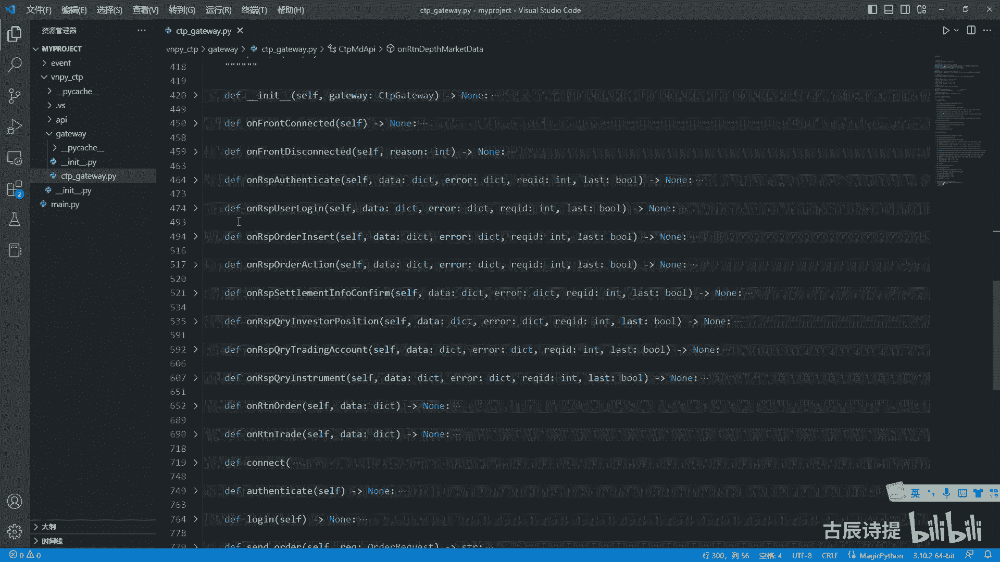

你像比如说你这个on return order，就是这个order是吧，他肯定来找这个contract，对不对，你看if not contract init，INIT是初始化的意思。

If not contract init，然后他就return了啊，当然他中间先把这个委托呃，添加到了这个这个这个这个列表里边来，包括你这个try的，你看一样的啊，就是他可能服务器给你发的时候。

不一定就是说先发可交易费，他可能一起给你发，但是你在接收的时候呢，就是如果说contract他没有接收权了，他会给你先存在一个列表里边。

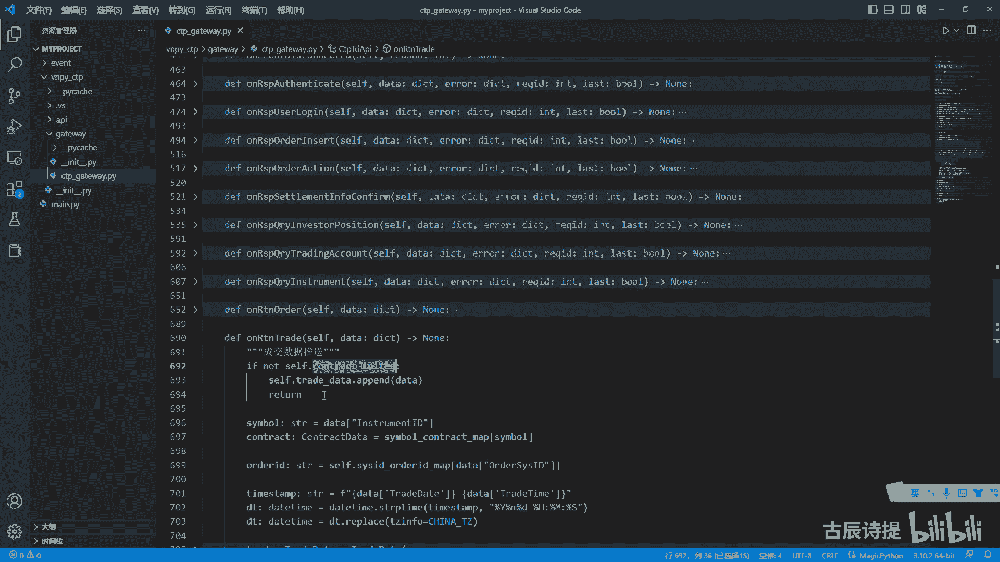

然后后面再进行处理。

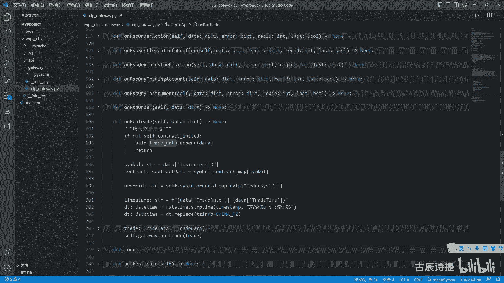

后边再进行处理，因为后边都需要用到contract，为什么呢。

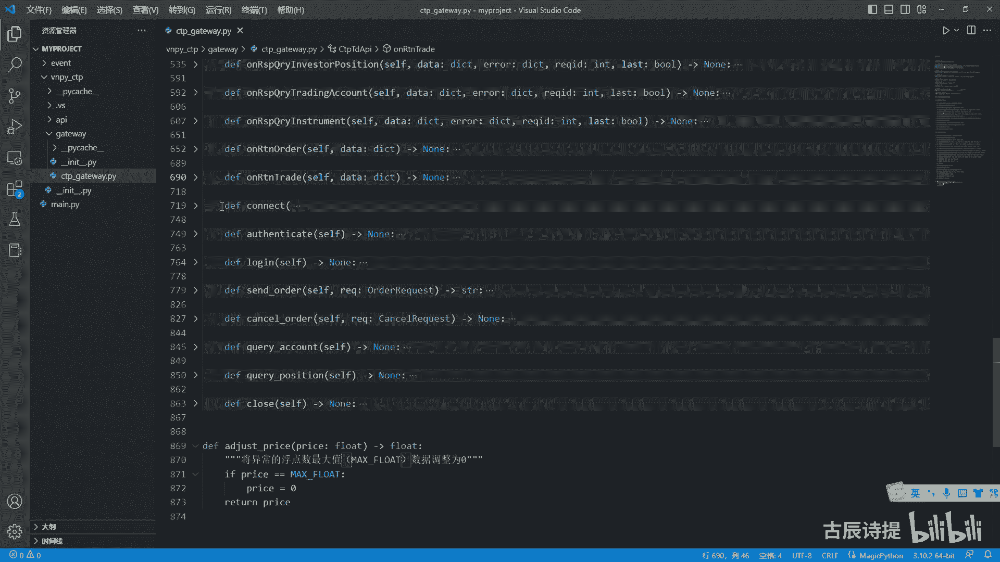

为什么都需要用到contract，contract是合约的信息啊，咱们可以看一下这个contract data。

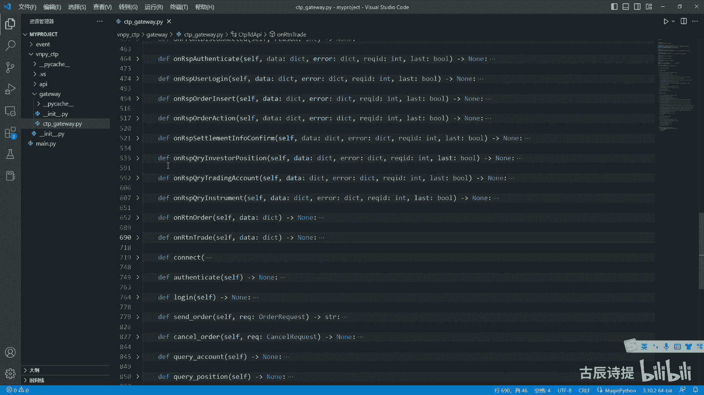

它的这个里面有哪些东西啊，就是simple exchange，咱们就不用说了，product是代表是期权还是这个期货是吧，你size是什么呀，就是一个点的价值吗，一就是一个点的价值。

螺纹一个点是十是十块钱，像焦炭焦焦炭一个点是100块钱是吧，你在计算，比如说你计算你的这个合约价值，就是持仓合约价值的时候，你是不是得用到这个size，包括这个你看这个price是什么呀。

就是说最小波动值，比如你这个焦炭它波动是0。5，你像有一些像国债类的呀，就是那个都是0。00几是吧，你像这样的委托，如果说你要去发送的话，你不应该先调整这个价格吗，因为你的指标计算出来是什么呀。

比如说还带小数，然后是一个不规整的数，比如说你去交易的时候，比如说那个你像这个橡胶，应该哎香香蕉是五个点还是两个点，就是需要有这种整点的时候，你是不是应该把这个价格给它，规范成那个整点的价格，对不对。

所以说你得用到price，所以说这个是首先就是说会接收到的啊，哪怕服务器不是先给他发的，他也会首先来处理它好吧，当然你可以去给他改啊，可以去给他改，因为这些信息里边还夹杂着期权的一些信息。

你可以把它删了，然后再加上比如说一些其他的信息，例如啊开盘收盘是吧，有没有中间的那个呃休息的阶段，有没有夜盘，这样的话，你在合成K线的时候就更加容易处理了，对吧，呃。

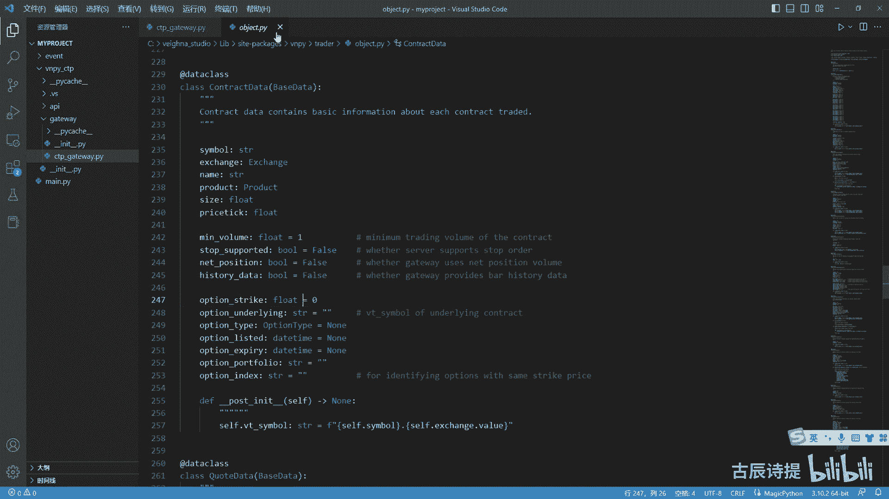

咱们可以先看一下这个就是啊这个instrument。

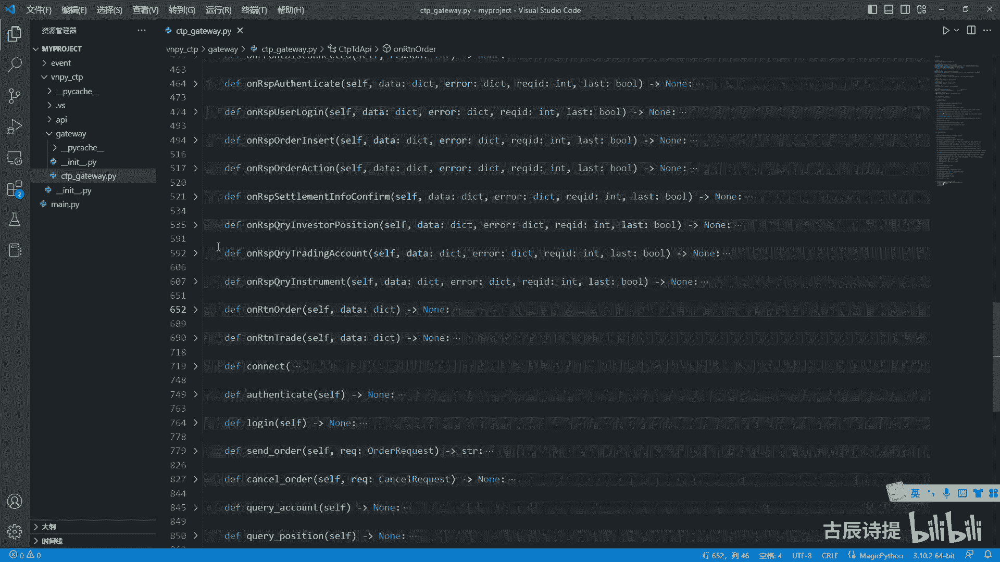

也就是contract，这个他接收的这个回调了这个函数啊，其实还是那个字典往这个咱们的这个contract data，自定义的这个数据类型里面去转换啊，这个里边有一个转换的这个就是字典。

就是exchange。

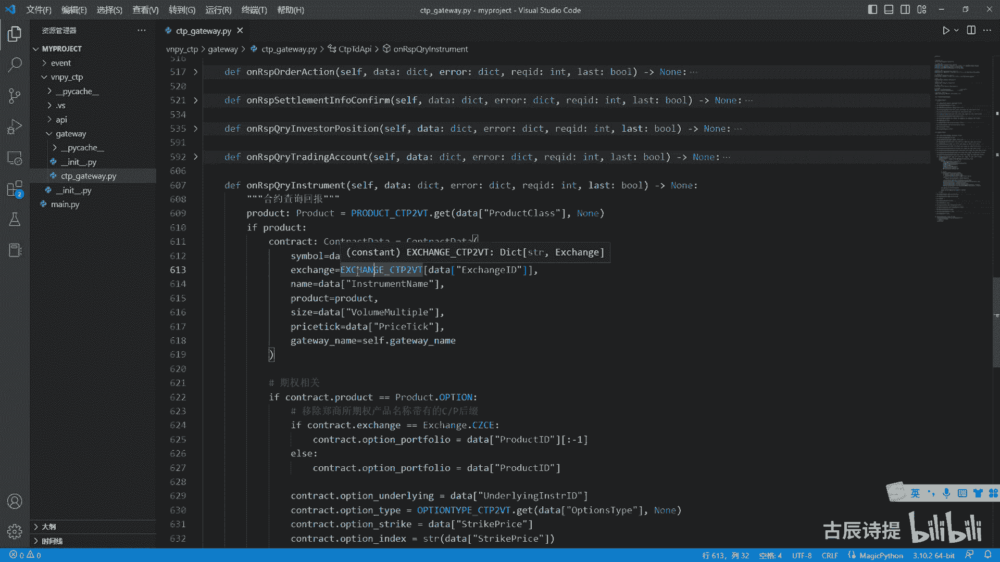

就是交易所他给你发过来的呢，就是这个字符串啊，CFFEXRS去啊，就是SHFE啊，你你需要给它转换成exchange这样的类型啊，这个没什么啊，太多好讲的是吧，然后期权相关，如果说你只交易期货的话。

你可以把下面期权全删了啊，你可以把下面期期权全部给删掉啊，呃删掉之后你可以怎么来调整啊，比如说我if if product这个里边还有几个呀，就是product转换的时候它有几个，他有futures。

Futures，就是这个期货option就是期权啊，你想这个也是期权option，然后这个是spread，是代表这个价差套利的那种是吧，一般咱们如果说你只交易期货或者期权的话，你就挑一个就是你你专一的。

比如说期货是吧，你可以从这1product等于啊p l product，点FUTURES是吧，这样你哥你就直接可以，就是只接收期货的这个contract，我期权的我不要，你就可以把下面全部给删掉了啊。

当然就是一直到这，这你不能删on contract是吧，给它放到这个，因为NG里面去，你想他给你保存到哪了，Symbol contract map，而且这个还不是还不是就是说他累的。

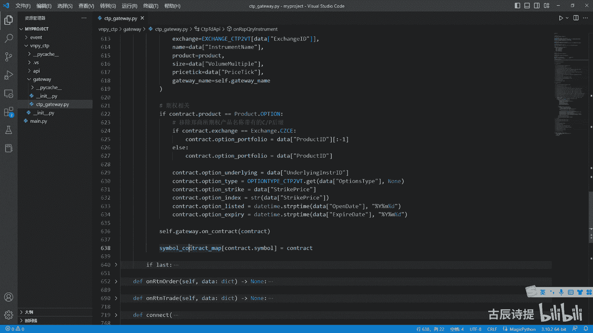

这个就是存放在这个类里边。

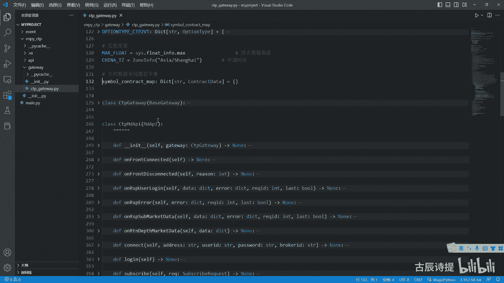

是存放在了这个外边，对吧啊，这个它给存进去了啊，这是保存下来了，然后这边呢有一个if last，If last，他会告诉你是不是给你传了最后一个哎，如果是if last了，是最后一个了，他会把这个cs。

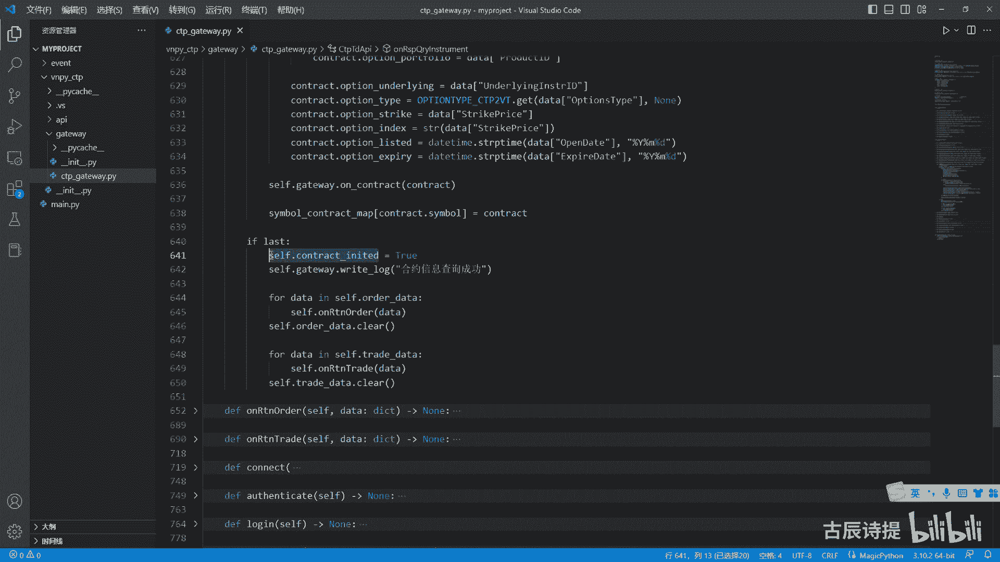

就是改成true，那就是on return的，你像前面的这个就可以过了对吧，然后告诉你合约信息查询成功，然后他再来去便利old data和trade data。

然后再去调用on return order啊，然后on return trade。

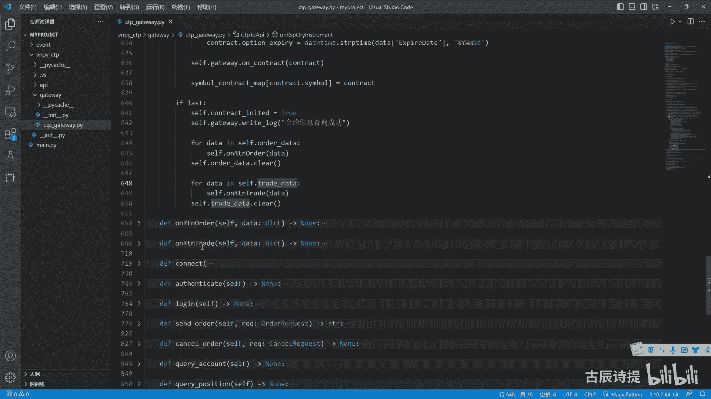

然后就可以跳过这一步了，因为他已经能true了。

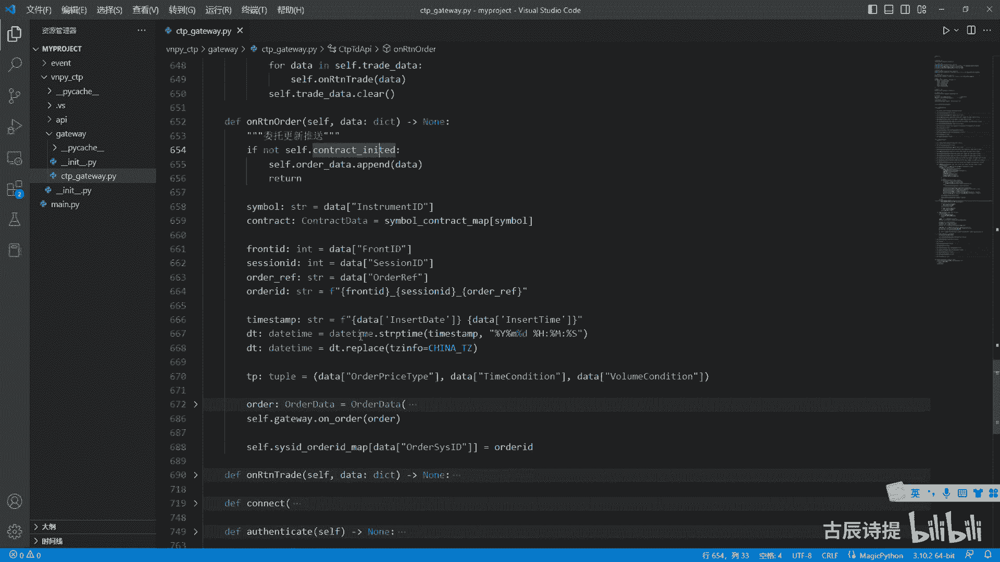

就可以往下走了对吧，所以说从这儿的代码你能看出来什么呀，你能看出来基本上这个order data和trader data啊。

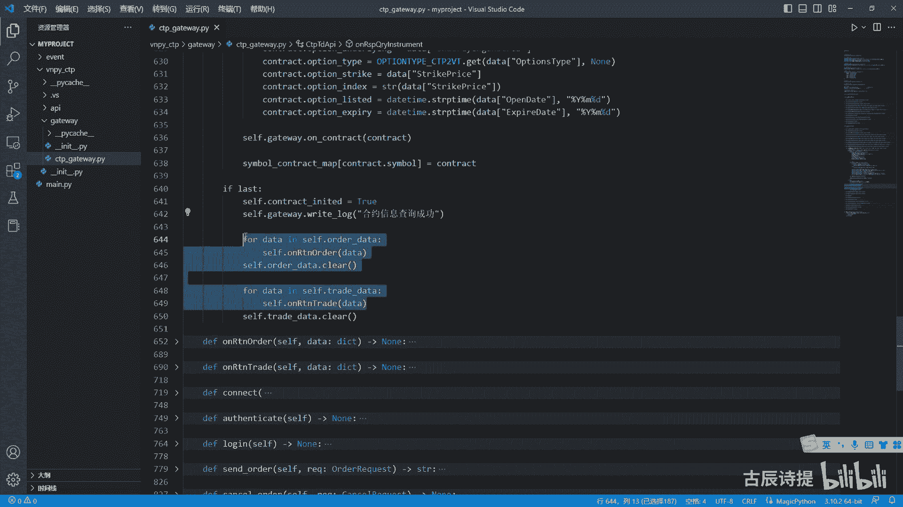

order data和trader data和这个合约就是instrument，这个data或者construct这个data，这三个是一起给你发的那个position data啊。

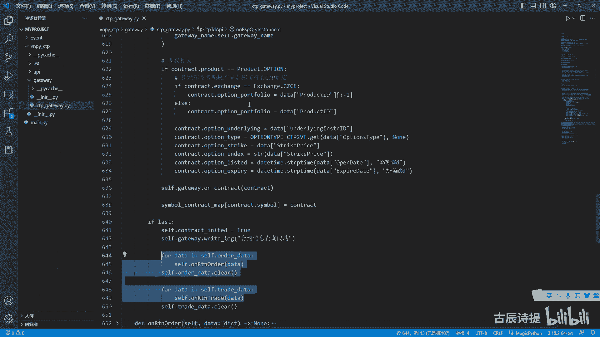

就是就是持仓信息呃，是得去申请的对吧，是得去申请的。

咱们之前讲过就是query position嘛，是不是啊，这个order data和trader data啊，和这个contract data他会一起给你发。

然后如果说这个Ctrl data还没有接收全的话，他会先把这个older data和try data，你存储在这个累的这个字典里边去，对吧啊，这个就没什么了啊。

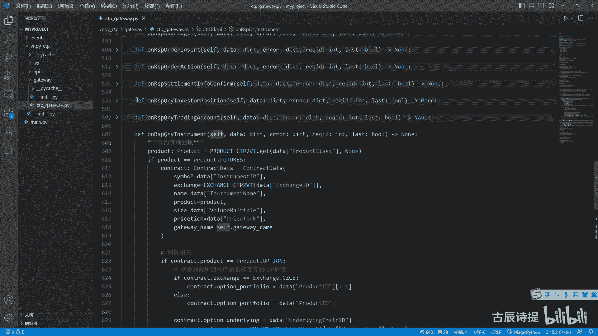

嗯好那咱们再看从上往下吧，这个on这个on front connect，还有disconnected，这个也没啥好说的，这个啊这个是什么呀，这个是验证服务器验证，也就是就是授权验证。

就是类似于密码什么的。

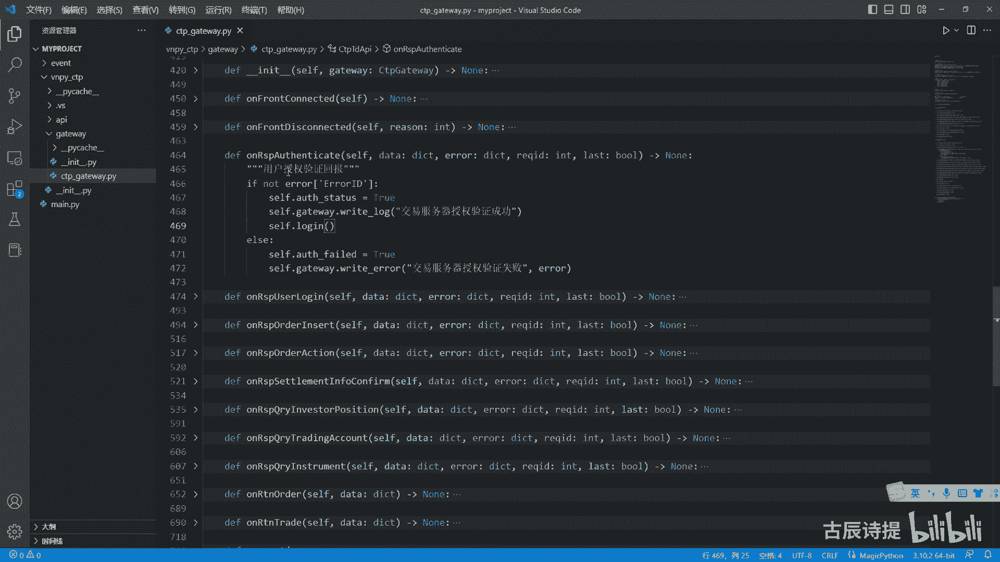

这个没什么好说的啊，然后下面这个user login就是登录嘛。

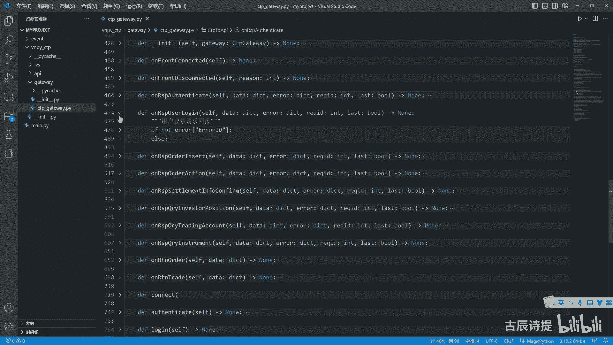

就是你把密码什么发过去，下面有一个自动确认结算单，自动确认结算单，这个刚开始做期货的时候好像有过，如果说你不确认那个结算单的话，你交易不了对吧，一般平台啊什么的，他都会给你。

就是默认的点上一个自动确认这个结算单啊，这个他给你做了是吧啊。

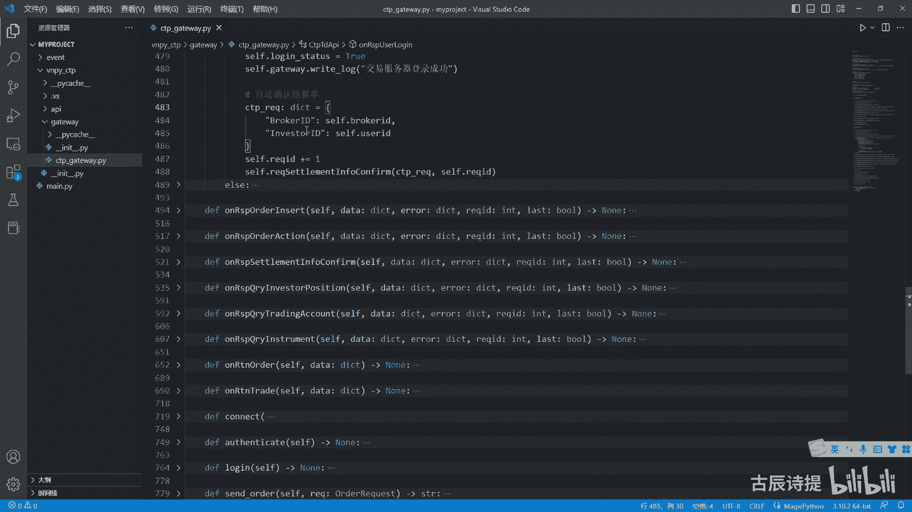

他给你做了，这个没什么好说的。

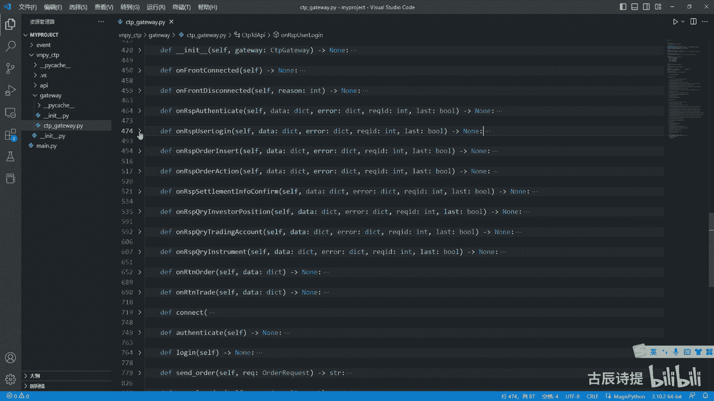

就是登录嘛，Or insert，就是委托下单失败了，然后告诉你一下。

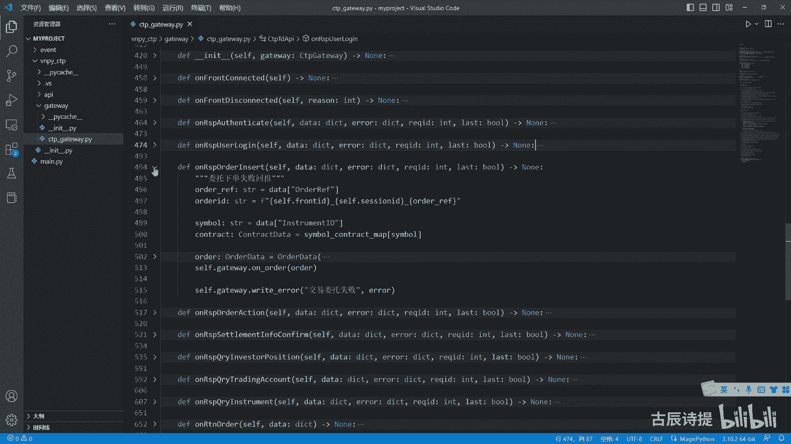

然后你会把这个调成呃，这个studio调成reject，就是被拒单了。

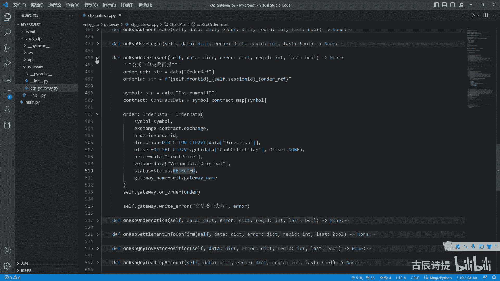

然后on response oraction是什么意思，就是你撤单失败了，然后告诉你一下，撤单失败了啊，委托撤单失败，然后这个on response这个confirm就是结算结算单，你去确认了之后。

它会有回报，然后这有个循环啊，就是可能首次确认的时候会失败，然后他会用个循环，每隔一秒钟去确认一回，每隔一秒钟确认一会，一直确认到什么时候呢，确认到已经确认过了就行了啊，这个也没啥好说的。

然后这个position就是持仓查询回报。

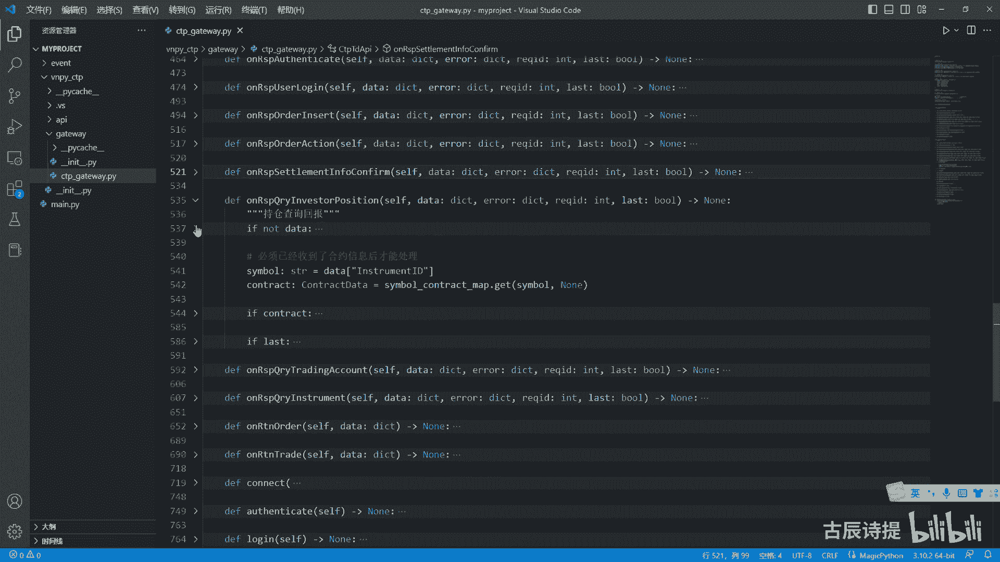

持仓查询回报咱们看一下啊。

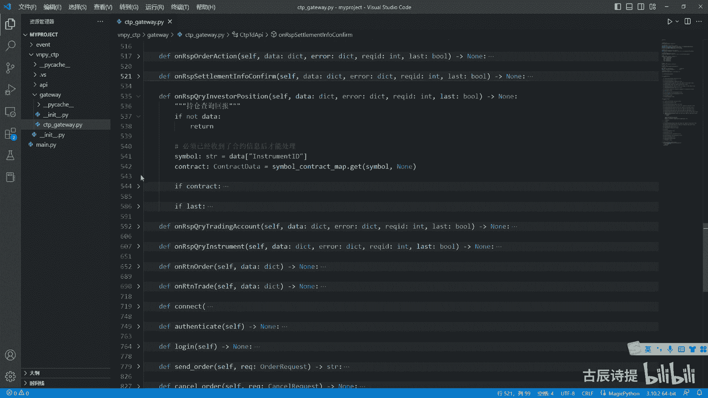

那他也是必须是收到合约信息后才能处理是吧，然后他是什么呀，就是持仓查询，就是为什么会有持仓查询啊，因为什么呀，你这个仓位如果说你是单品种，单策略或者就是多品种单策略，这个没有问题，就是策略是有多少持仓。

你实际的持仓也是多少对吧，但是如果说你的一个品种里边有多个策略，比如说有两个策略，一个持有多单，一个持有空单，这是有这种可能性的，当这种情况的时候，你的实际持仓就是可能是两首。

但是呢你的这两个就是策略的持持仓啊，它可能是一个呃多五手，一个空三手对吧，所以说这个时候你的持仓就是本地的持仓，和你实际的持仓就得进行调整，然后但是可能因为你的这个成交是有撮合的。

有些委托没成交或者一些耦合的情况，你的这个持仓错了，就是你实际持仓和你本地应该有的持仓，对不上了，那这个时候你就需要去进行调整，不断的去更新，对啊，这个是为什么他有这个position。

就是持仓查询的一个回报，包括我的第一堂课就是免费那个课，其实讲VMPY讲的挺细的，只不过跟咱们现在版本又有一些比较大的差异，那个里边一直保留到现在的，你像那个转换器，它是有的，转换器其实就是什么。

为了就是说你这个单品种多策略，这样的一个模式，它就是为了什么呀，就是你的比如说你本身有五手多单，然后现在呢你另外一个策略要开三手，那开三手空单的话，你说最最好的方式是平平三手多单对吧。

所以说你就要进行转换，这个转换就需要用到持仓信息，对不对啊，跟你的就是说策略的信息，只是呃跟你策略的持仓信息，跟你实际的持仓信息做一个加减的运算，你像那个转换器里边都是这种加减的运算，但是逻辑比较麻烦。

尤其你像这个里边还有什么，对于上期所座舱需要特殊处理，这个是什么意思呢，就是上期所你发送指令的时候，必须得指定座仓还是清仓，不然他平不了，你只告诉他平仓不行，你得给他告诉他是平座舱还是平均仓。

所以说这个也需要在转换器里边去转换，就是比如说你上厕所的，就是你经仓有三首，左仓有五有五首，你程序化的时候其实评哪科都可以，但是你总得给总得给他一个规则，就是我先评哪个再评哪个，对不对。

所以说你需要进行转换，所以说委托一般就是回来的是一个呃，那个order id就是那个列表里面，但是有时候也会有两个啊，有时候也会有两个order i d，如果说你涉及到上期所了。

你是不是还可能给他拆分的更多对吧，有这种可能性嘛，对吧啊，这个其实也没什么，就是拆分一下，就是把左座舱和经仓啊，然后进行一下，就是这个调整好，这是上期所和上期能源是吧啊，这是计算佐仓的仓位啊。

交易所计算佐仓的仓位，因为上期所有佐仓了，你别的交易所，就是自己也制定了一个座舱和机舱，其实对于别的交易所来说呃，影响不是特别大，他可能默认先拼哪个仓位，然后再评那个仓位好啊。

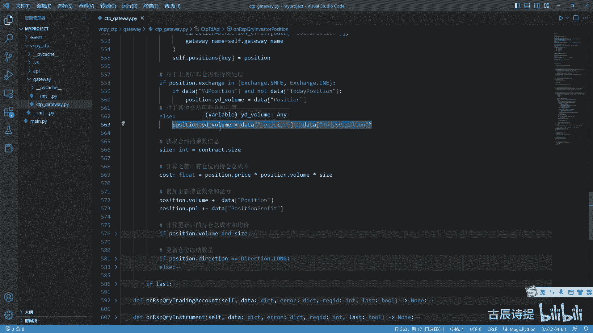

这个也就没啥了，然后获取合约的成熟信息。

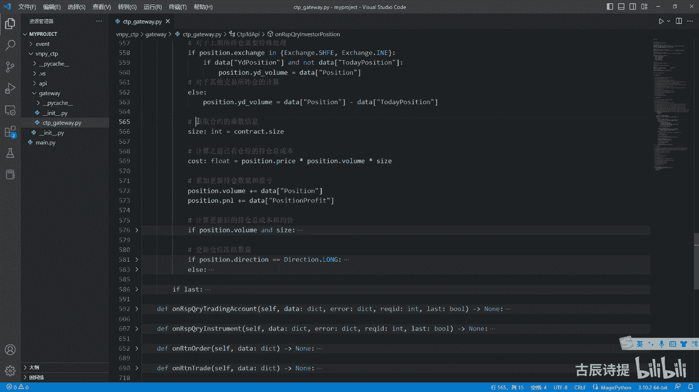

然后嗯计算之前已有仓位的持持仓总成本，这个什么position price，就是你的这个持仓的价格乘以你的持仓的数量，然后再乘以这个size，就是你的这个嗯一个点多少钱，他这应该是合约价值吧对吧。

然后这边是累加更新持仓数量和盈亏啊。

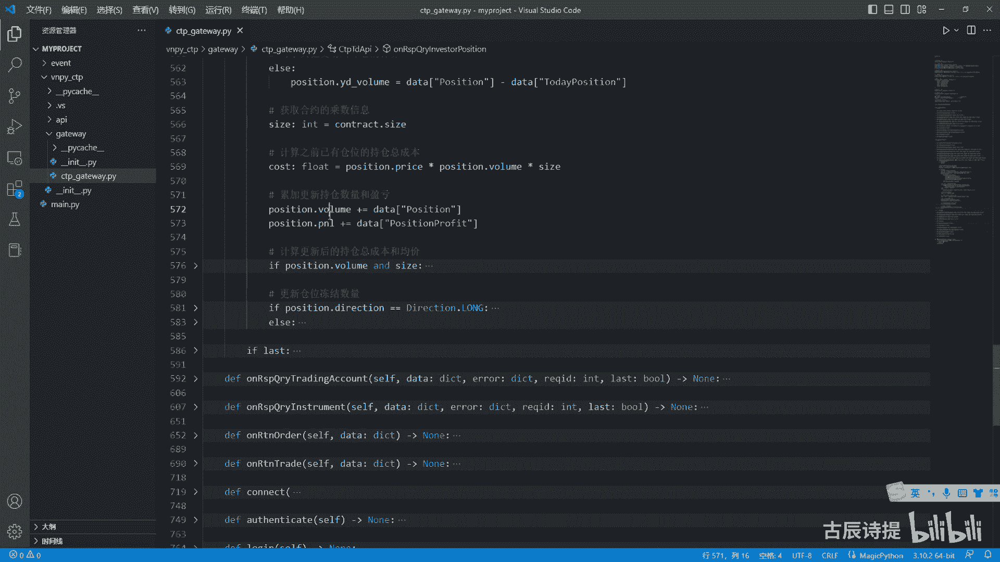

就是我更新一下持仓数量，然后这边是盈亏盈亏，他也会在tick里边去进行更新，你涨了跌了，它会有一个实时的这么一个计算，后面会讲到啊，这是计算更新后的持仓总成本和均价。

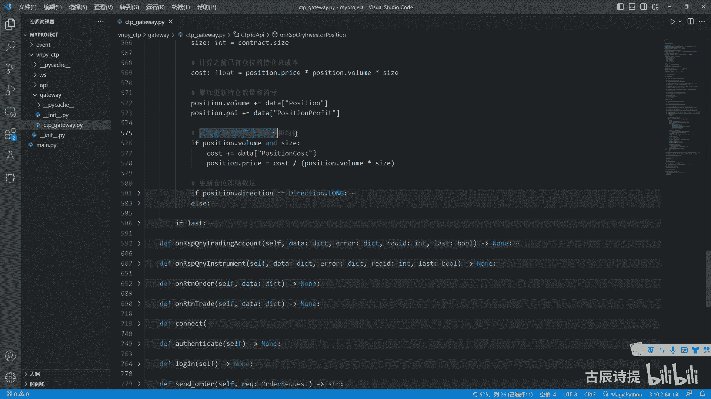

这个也没啥说的，更新仓位冻结数量，什么叫冻结数量啊，当你去发送一个委托的时候，就是到底层啊，你不是在本地啊，发送委托就是发现甲弹到底层的时候，你这个委托如果暂时成交不了的话，你这个仓位会被冻结住。

就比如说你有五手多单，你发送了一个委托，比如说要平三手，然后比如说平的位置离现在的位置比较远，他一直没拼了，这个三手会被冻结住，然后如果说你又发了个委托，离现在比较近的这个价格，你说先评四手。

你就平不了这个四，平不了这个四手啊，你在VMPY上面，他会给你用转换器转成什么呀，平两手，然后再开两手空单就给你对冲掉了，能理解我这个意思吗，所以说它必须得有这个冻结数量。

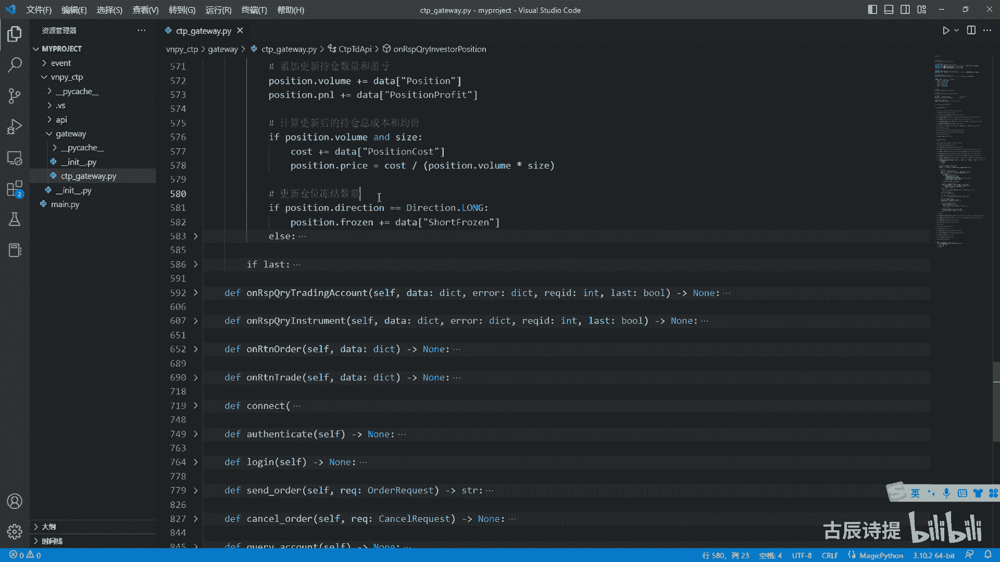

这也跟咱们写策略的时候，这个什么呀，就是说这个你的这个限价单还是停止单的使用，有很大的关系，一般就是限价单用在止盈上面，停止单用在止损上面，你不能用反了，用反了就会出问题，会立马成交。

但是呢你限价单如果说老早就是你一有持仓了，你就挂上这个止盈单，止盈单离得很远呀，比如300%分之五10%那种止盈单，就把你这个仓位给锁住了，你再比如说我这个K线满足了走的这个形态了，该出场了。

但是你只能挂着，你就平不了，你就容易造成锁仓，明白吗，因为它转换器会给你转，如果说你多单平不了，被锁住了，他会给你默认开一手空仓对冲掉啊，就是就是这么个意思，所以说他得需要。

就是说冻结住的仓位有哪些是吧，空单冻结，多单冻结啊，这些都是一个属性的一个赋值，好吧啊，好他会把这个存放在这个self depositions里边，然后到最后的时候if last啊。

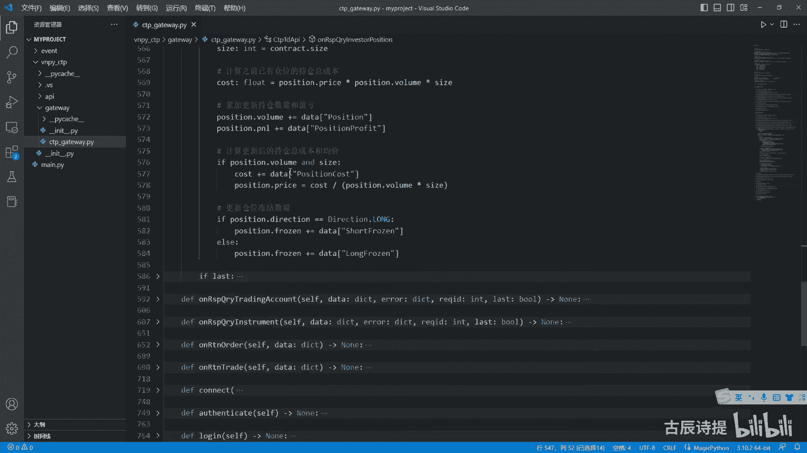

到最后的时候它会循环一下，然后给放到MIT engine里边去啊。

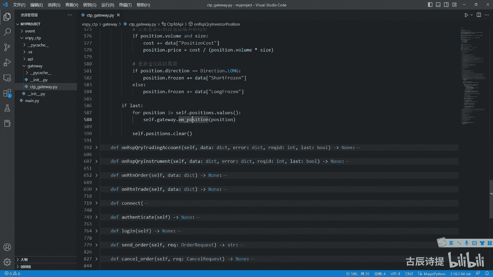

就是这个他就是这么一个操作，也没什么别的太复杂的对吧，好，这个trading account就是资金查询。

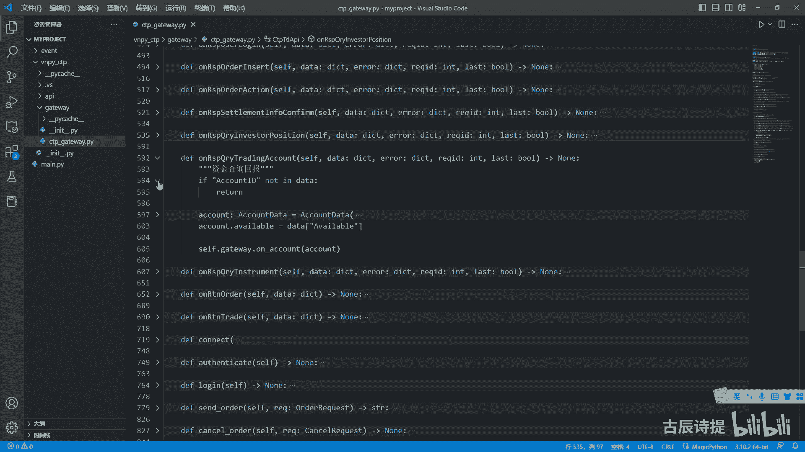

就这个就没啥好说的了啊，就是就没啥好说的了，就是完就是完全的一个赋值啊，然后冻结的啊，这个frozen就是data frozen，margarine cash和Mission commission。

commission是什么，是手是手续费吧是吧，这个你可以自己去看看是吧，查一查这个传过来的这个data里边，这个数据类型有哪些。

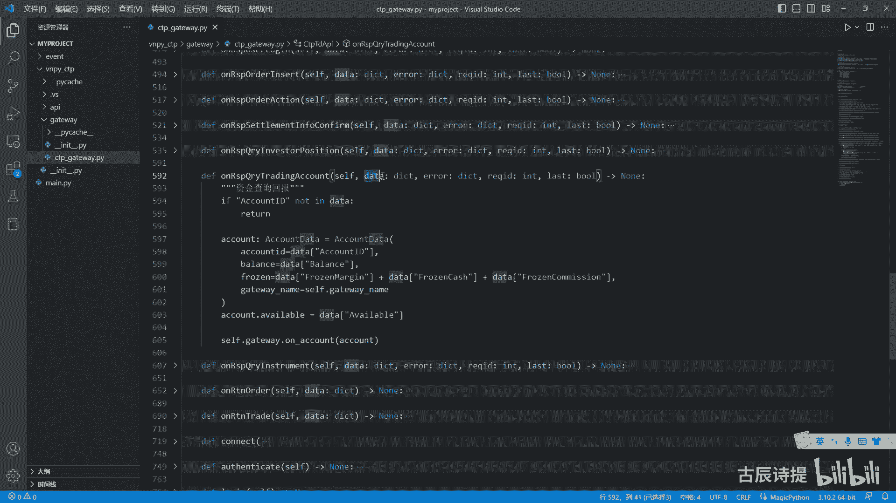

然后这个instrument啊，咱们说过了。

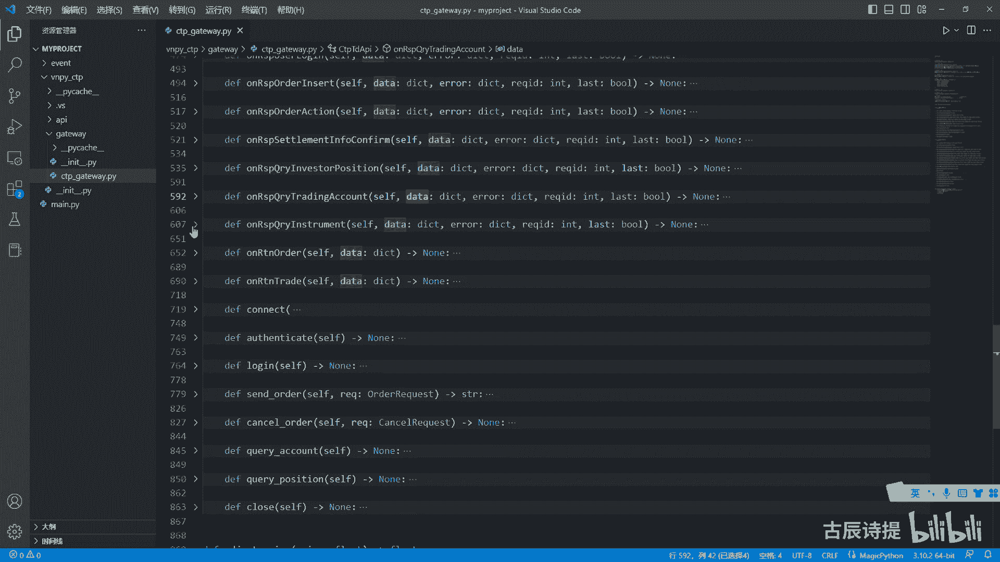

然后on return order就是委托的这个更新推送这个旅程，Order，这个咱们捋一下这个委托单，你从顶层到底层，然后你发给底层之后，咱们之前好像讲过sal order吧是吧。

讲过这个SCORDER吧，SORDER他有个这个order id，这叫order id，这个order id，其实你会发现是自己给拼凑起来的对吧，然后这个front id这个session i d。

这个front i d应该是什么前置编号，这个session i d什么绘画编号啊，这个c order i e f是这个自增的，就是一个计数器，是你自己给拼起来的这么一个order是吧，你发过去之后。

如果说他没给你报错的话，这个int如果说就说没给你，就是说有这个返回值的话，1N如果说返回值非零非零的话，说明有问题，对不对，说明有问题，如果说发送成功了，就是你是在这个在这。

它并不是服务器给你发的这个委托，就是这个O的id是你自己就是创建了一个order data，然后放到了这个，就是说这个呃引擎里边来了，你这个own return order它是干什么呀，是当你委托。

比如说触发了或者部分成交了或者被拒单了，他会给你on return order来调用这个方法，对吧啊，这个逻辑你得清楚啊，当就是这个数据过来之后，肯定是肯定是首先进行的转换，你想想咱们刚才说了。

这个你的这个order id是自己拼出来的，而且在SORDER这它并没有进行保存，对不对，并没有进行保存吧，那你委托发过去之后，肯定服务器上他会给你这个委托定一个编号吧，这肯定是必然的，对不对。

然后这个编号有了这个编号之后啊，不是这个定好这个编号，他给你返回来的时候，你怎么找到对应的这个O的id啊，因为你本你服务器的O的id，你必须得找到本地的这个O的id，你不然的话你怎么通过这个底层。

然后一就是一层一层往回返，或者放到这个engine里边去，然后让你的这个策略里边这个own order去去掉呢，对吧，你得找到对应的这个order啊是吧，这个order可能就是说这个呃委托。

因为里边有很多东西，它可能是放在这个CTA引擎里边去了，或者保存在man引擎里边去了，那你这个你得找到这个order id啊。

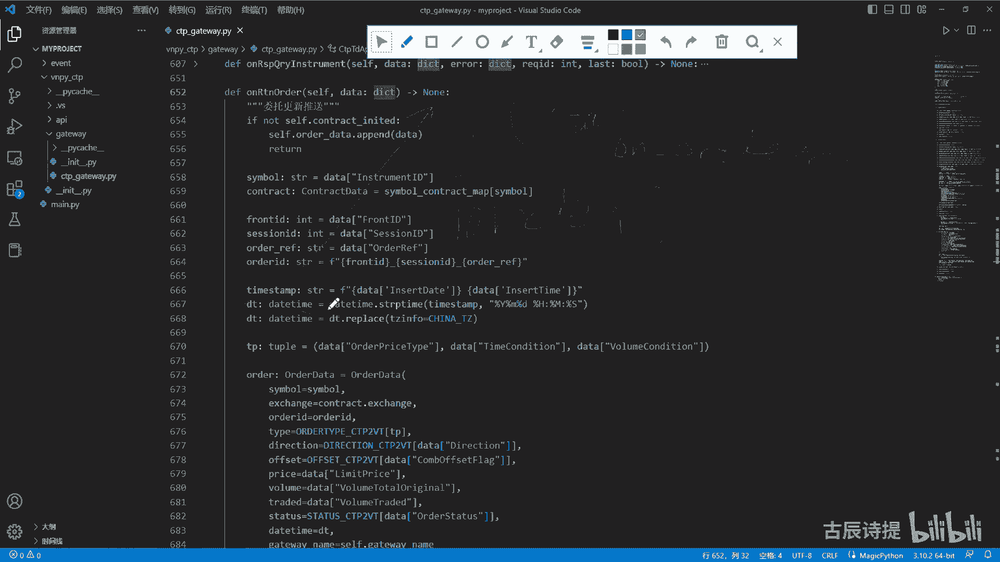

就是它的唯一的标识啊，对不对啊，这个唯一唯一的标识在哪啊，就是咱们之前没有细说的，就是说这个是什么呀，这个就是这个，order这个s y s d order id map，我发现啊。

这个里边你像在服务器上，这个order s y s i d和你这个order id，它是用一个字典来存储着的对吧，这样的话他能找到，然后咱们可以看一下他这个都用在哪了。

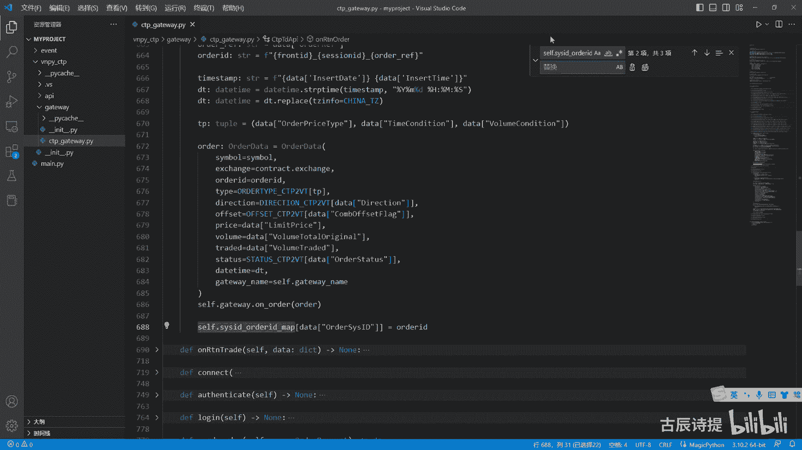

好看一下就是三个地方，一个是初始这个初始初始化的时候，一个是什么，On return order，这个order来了之后啊，order来了之后，他找到了这个order i e f order。

然后拼凑出来了这个order i d对吧，然后呢就是就是给他给存起来了，用这个order就是这个system id，然后等于这个O的id，然后还有一个用在了own return trader。

因为这个成交啊是由你的这个委托引起的是吧，而且成交它有可能是部分成交，有可能是呃全部成交，对不对，所以说他肯定得去更改这个order里面状态，而且你这个order发出来的，咱们刚才说了，有可能被拆分。

就是被转换你一个order发出来，比如到上期锁着他，可他可能给你拆成俩，一个是凭着单，一个是平金蛋对吧，你拆分了之后，你这个order就是说这个你要你要找到这个，就是从成交找到你的这个order id。

然后去改变这个order的这个状态吧是吧，这个order data这个状态里边肯定是有的呀，你像这个这个studio肯定是有部分成交了，咱们之前也看了是吧，包括你像这个trade就成交了多少首。

你像这个WM是发生，你就是这个委托一共需要成交多少首，然后这个trait是已经成交了多少首，对不对啊，你得去更改这个order data的这个状态啊对吧，所以说你得就是说找到这个order data。

你最起码得找到这个order i d，然后再去相应的去找那个order，是不是，那这个你想在这个，它只在这三个地方有这个存储的这个东西，那你SORDER的时候没有记录吗，你SORDER的时候你没有记录。

你怎么找到你像咱们呃如果看过基础课的话，你细密度的就是细致的去控制委托的时候，那个O是VTO的，DVTO的id是根据O的id给合成的，只不过前面加了一个gateway name，还记得吗啊。

是根据O的id出来的，你这这个order id不准确，那怎么就是说去对照着去找到你那个order啊，你你看一下啊，这个跟以前跟以前版本是不太一样的，你像这这的这个order id啊。

order id它的拼凑是用这个是由这个self点front session，然后order i e f，Order i e f，你会发现啊，他在发送委托，把它转换成dict的时候。

这边也有一个order i e f对吧，那就说明你的这个order i e f，也就是这个数值计数器嘛，你是可以作为信息传递给底层的，那底层给你反馈回来的，咱们看一下啊。

你看这个order i e if only on china了，这是这个order i e f，是不是DORDERIF，你是能获取到这个order i f的，所以说你像这个front d和CGD。

它是确定的吧，你这俩确定了，这个也确定了，那你的order id是不是就没有丢，他就没必要再存在，就是在存储到这个嗯，就是说这个字典里边去了，但是他从这存储了是为了来做什么的。

你会发现这两行代码一个是存，一个是取是吧，一个是存id，一个是取id，它的媒介都是order system id，因为成交给你发送过来的时候，比如说你发送就是委托成交十首。

他有可能就是一首一首的给你去撮合的对吧，你成交如果不活跃的话，它必须得告诉你这个try data里面必须得告诉你，就是说我的这个成交是由哪个委托促成的，对不对，比如说成交了一首啊。

那个委委托的那个呃那个系统的单号是什么，就是order system，所以说从这个委托和成交，这个就是这个字典是用来确定这个O的，ID的啊，是用来确定这个OD的，所以说这个你一定要清楚好吧。

当然别的就没什么好说的了啊，别的就没什么好说的了，它都是进行转换，你看这是一个元组TUP是吧，TUATUA是要进行来转换的，咱们之前咱们之前也看过，有一个转换是一个就是期权产品映射。

是一个三个的转换是吧。

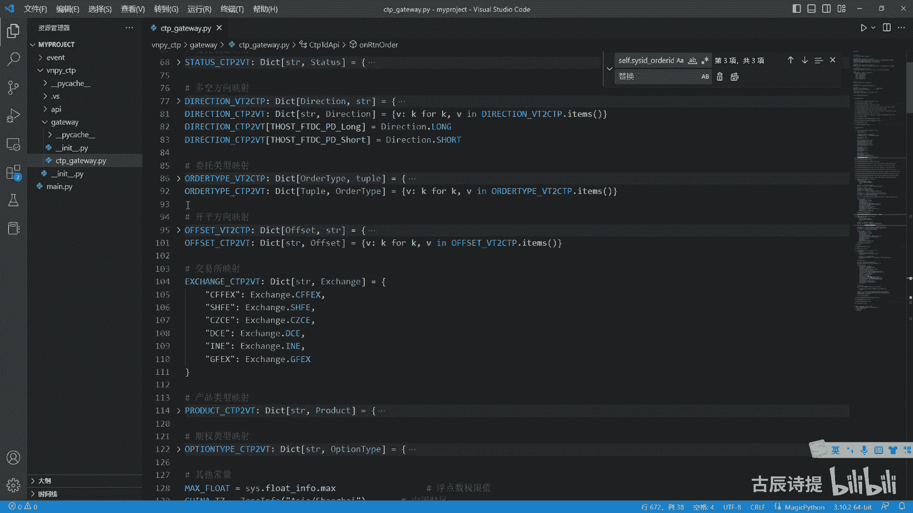

super studio诶，不是这个，order是吧，你看这是个元组嘛，对不对，他进行这样的转换好，这个就不再多说了，你像这个only ten tread，这个也没什么太多的，要说的其实都一样。

symbol contract or id啊，找到这个就是相对应的old的D啊，然后你再去创建一个try的data是吧，这个try的data，然后这个状态这里边这个状态try to data啊。

这个trial data里面是没有状态的，try的过来它可能成交一手，他就是完全成交了，但是这个order data里面是有状态的，而且这个状态是从底层就给你了。

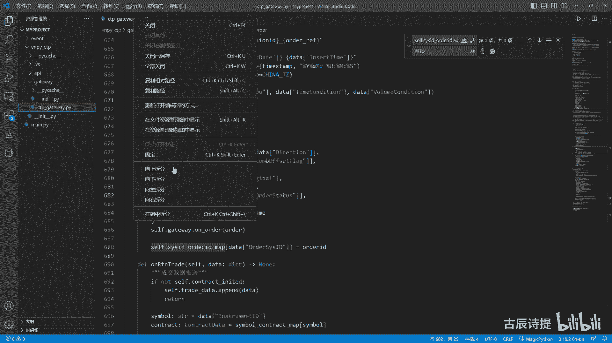

而不是你自己现在去定义的，它从底层就有，这个是全部成交啊，还是部分成交啊什么的啊，这一点知道就可以，这样准确性更高，你自己去定义难免会出错是吧，try的也没什么好说的啊。

这个connect连接也没什么好说的，这个是验证发起授权验证，这个也没什么，就是验证嘛，就跟登录类似的这种你就不用去管它了，SORDER咱们之前好像讲过，就是发送委托单。

其实也就是从这个order request，往这个DICTOR就是字典去转换嘛，cancel去取消委托单是吧，如果取消失败了，他会给你一个反馈啊，其实委托单取消失败，其实你可以把那个失败委托单取消失败。

那个你可以把它输出一下，这里边的这个数据究竟有哪些，然后呢你你也可以把它放到这个引擎里边去啊，你想委托单撤单失败，你可以输出一下啊，或者说它有哪些东西，可不可以放到这个引擎里边去。

可不可以找到对应的是哪个委托单，撤销失败对吧，你可以进行一下尝试，好吧，呃login啊，别的也没什么了，那基本上这个c TP gateway就已经讲完了，cp gateway讲完了之后。

我希望大家就是去写一下，就是说把这个你的这个tick全部给输入出来，来看一看究竟有哪些东西，你的这个contract data，就是你的合约信息也全输入出来，然后你的这个委托order data。

Trade data，Order data，你注意啊。

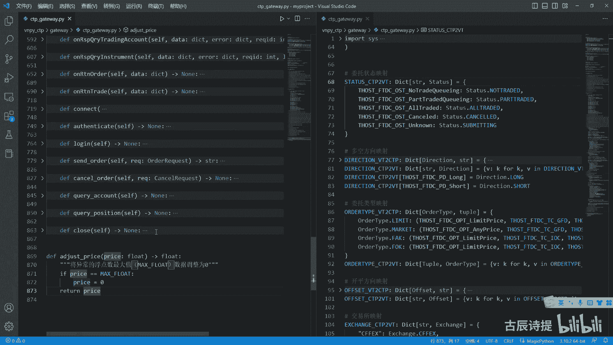

这个order data你要看信息的时候，你要从这个VPY上这儿去发，因为你如果不从VPY这发，这个这个里边的这个内容，就是这个order i e f就是reference嘛，其实就是他的关联。

这个是不是还有啊，这个是有待验证的，你可以去验证一下，如果从别的平台上去发，他是不是有这个啊，你从这个VPY，然后用这个比如说用写好了一个委托，然后去发里边附上这个order i f啊。

这个你自己研究一下好吧，然后那咱们这个CD p gateway就讲完了。

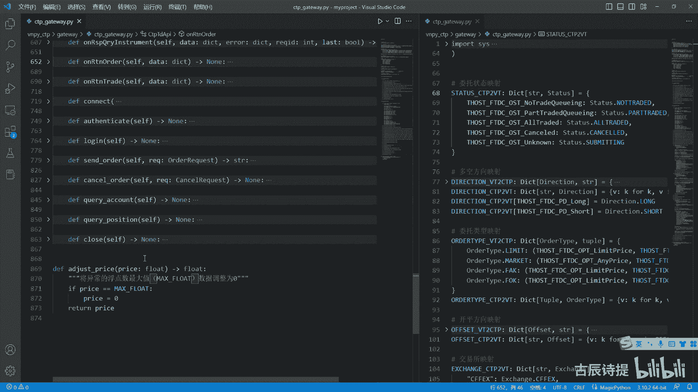