# 第7节课 K线、价格、时间和日期相关关键字 - P1 - 古辰诗提 - BV1kt421K7Xa

欢迎大家来到从零开始量化系列课程，MC课程的第七课，上一节课呢咱们讲到了kn bug，color b呢是表示当前八线的编号，但是它是相对于把这个max，把back也就是你的参考bug给剪掉了。

之后的这个就是这个编号，也就是相对编号，那你既然有相对编号，肯定有绝对编号，绝对编号一般都是在前面加上这个simple，也就是这个合约以后，还有类似的前面加symbol的，你要记住它都是绝对的编号啊。

或者说绝对的就是不考虑max8back的那个数值，就是从头开始的，咱们可以给大家看一下，新建一个信号，咱们是demo，零七好，我print一个就是current8，这样吧，Current8，这样啊。

看着吧写一个看看吧，然后这边有括号好，这边写这个SYMBO，看八，还是少了这个冒号是吧，逗号嗯，好咱们可以输出来看一下。

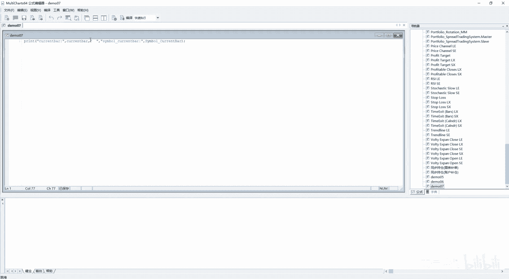

先进行一下编译，从这添加啊。

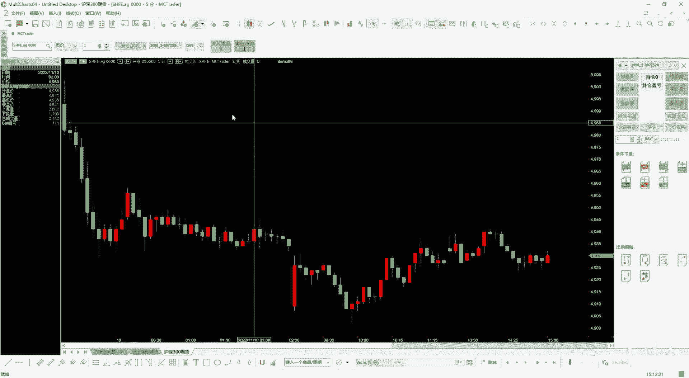

还是插入信号，demo07哎呦，零六了，这个删除删除增加一个demo07，设一下它的参考八是十是吧。

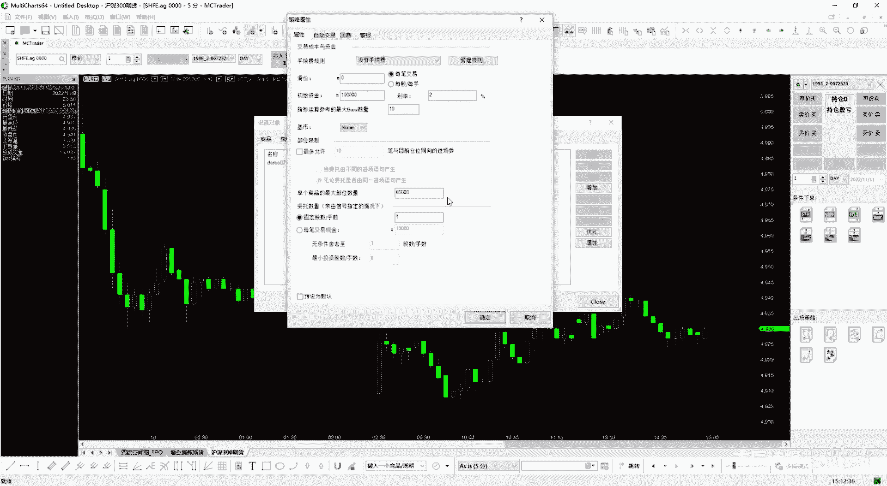

这个时候咱们可以看一下他的这个输出，你会发现就是这个simple，看人坝比看日坝要多十个对吧，多十个，咱们学学习了，已经学习了不少，像这样蓝色显示的这个关键字。

之前咱们用过的这个max buzz back，它可它也是一个关键字，你也是可以把它输出出来的，对不对，输出出来的你会发现它是十，所以说simple currenn bar其实就等于column bar。

加上这个max8back对吧，是这么写吧，对不对，你要这样的话，他俩应该是相同的啊，他俩应该是相同的对吧，这样的话它的值就一样了，所以说max8buzz back，其实是就是他们俩之间的区别。

另外你要知道max buzz back它是蓝色字，显示它代表着它也是一个关键字，你可以获取到的啊，你可以获取到的，包括之前咱们没在讲这些关键字的时候，给大家详细介绍过这个max buzz back。

你手动设置上面，和你比如这个代码里边自己去写，在指标和这个信号里边，它有什么区别啊，这个希望大家记住了，在指标里边他是实时会更新的，根据tick来更新，在这个信号里边，它是每一根B去更新一次。

然后max bus back呢，你在信号里边你必须得自己设，它默认是50啊，如果说你里边的参数有比它更多的，它会报错，但是你放到这个指标里边，你一般都把它设置为自检自测，让他自己根据需要去获取。

当然你也可以自己设置呃，当然你自己设置的和你在那个界面上设置的，一定不要冲突啊，一定不要冲突好吧，呃一般都是设置成自检啊。

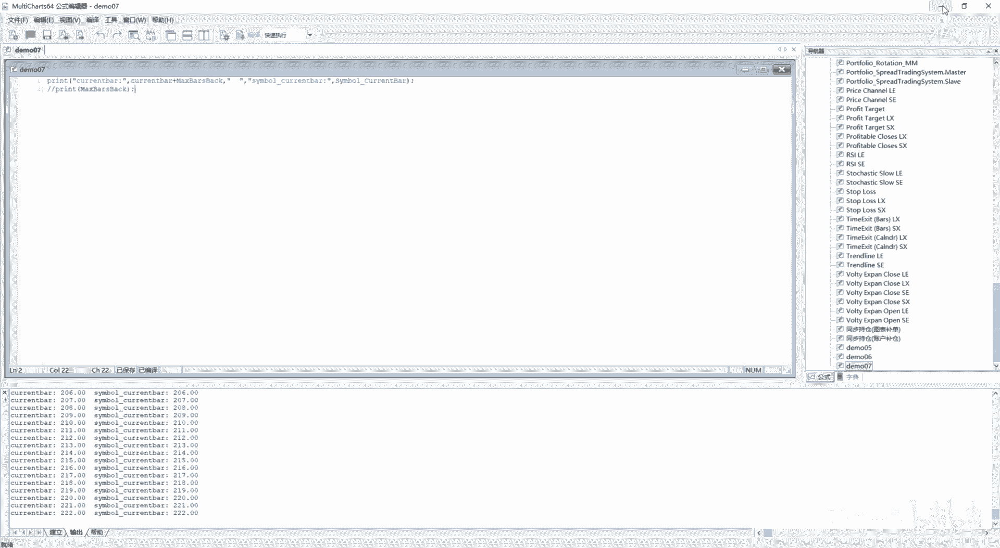

就是在信号啊，在指标上面啊，这是max8back哈。

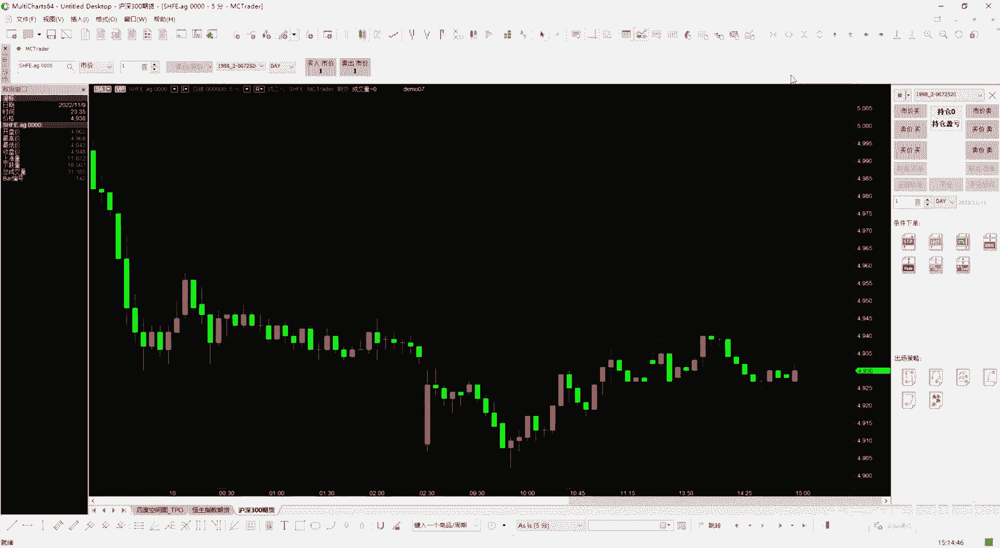

max8字back simple curry bar，这个就没什么好说的，但是有一点咱们是需要注意的是什么呀，比如说我print一个，就是比如说我从这我value1等于看B我回调。

比如说我调前十根的这个编号编译一下，看看它也能够编译成功，我print一下这个value1啊，print一下这个value1，咱们可以看一看它会输出什么啊，能编译成功，但是输出的是什么值呢。

咱们看一下啊，他还是212吧，咱们刚才给大家演示的，它结束的还是212吧，就这个二二是因为它加上这个max bus back了嘛，你像他这还是就是这个212，所以说你像这样的语法其实是不对的。

或者你把它改成20啊，编译一下它还是212对吧，这样写你是不对的啊，你是不对的，当然这么写也很少啊，也很少跟他相对应的，还有一个它的关键字叫8number。

8number就是返回相对最大参考坝的K线编号，8number其实和current bar是一样的，但是啊这个8number就是他可以去进行回调的，就是可以去进行回调的。

比如说我写一个8number y62等于8number，然后我print一个，咱们可以看一下他的这个函数啊，8number就是前一个加一，你想它是一个序列函数，你发现没有。

就是序列函数肯定是可以进行回调的，对不对，它8number等于8number加一，对不对，它是一个序列函数，因为它后边调用到自己了嘛，所以说他肯定是可以进行回调的啊，比如说我从这我输出一个print。

这个我8number我往前偏移20根啊，Print value2，然后我这边清空掉。

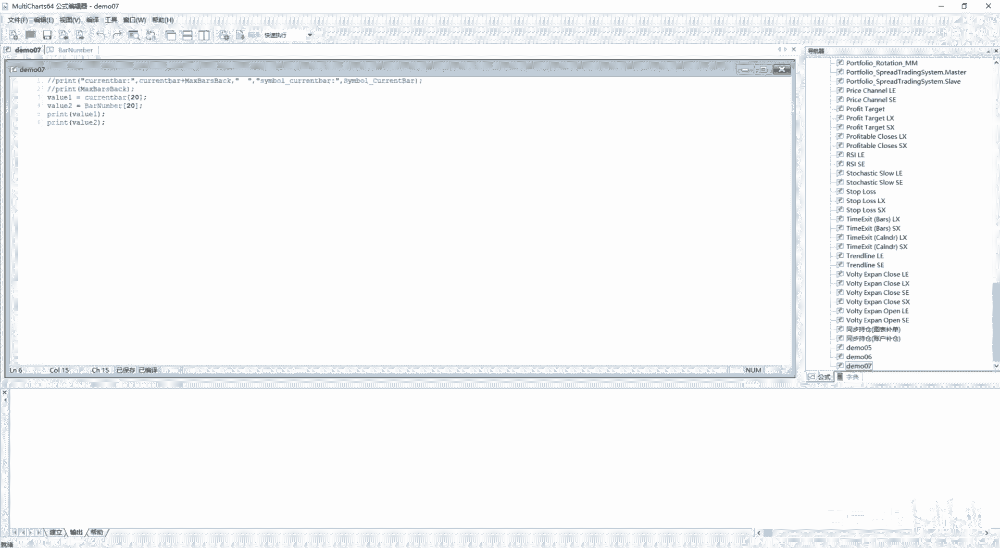

啊这个它会显示一个错误，就是你最大参考霸是吧。

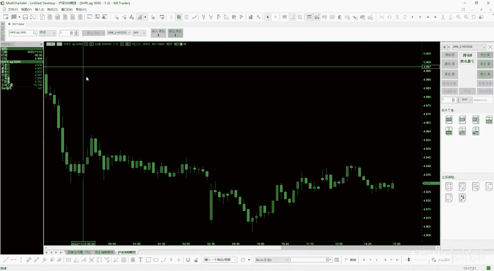

这是最大参考坝出现问题了，哎我把最大参考八设置成30啊。

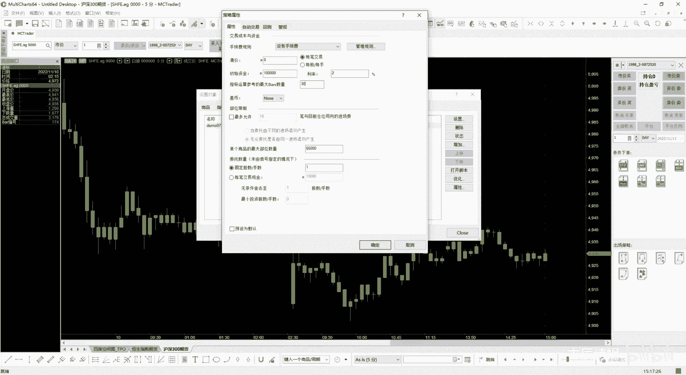

然后再把他状态打开啊。

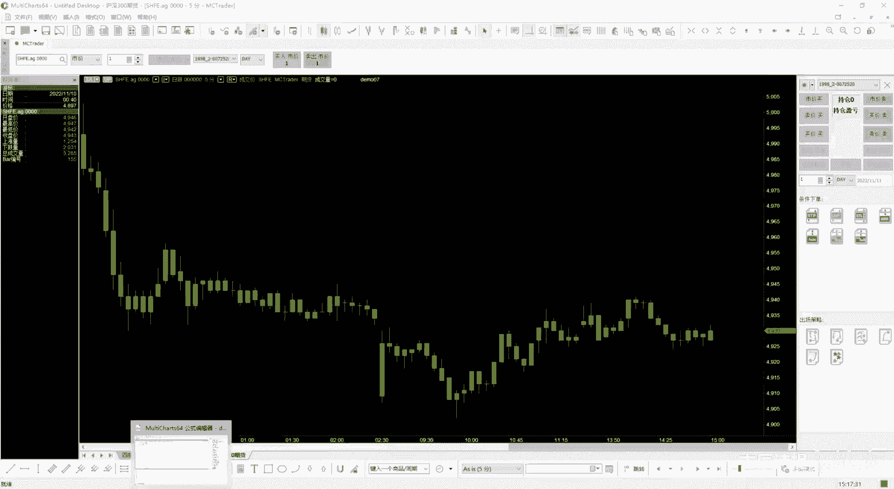

这个时候他就有了，你会发现他们俩是相差20对吧，虽然后边都写了偏移20，但是真正偏移的是这个8number啊，把number本好吧，这个是8number，它的一个作用，你会发现它的颜色是红色。

它是一个函数啊，它是一个函数啊，如果你想知道它怎么用，你后边的场景呃，肯定会用到的，一般会在绘图里边儿去用到啊，一般会在绘图绘图里边去用到啊，然后下面一个是这个8interval interval。

这个咱们要注意了，在这个维纳平台里边，interval也是代表周期的意思，就是K线周期啊，K线，限周期，这个interval就是周期的意思啊，表示这个在图表上的这个周期数值，咱们可以看一下。

直接演示一下8interval好，从这儿给它大括号括起来，直接print一个叫8type是吧，哦8into8into嗯，好给他清空一下，然后进行一下编译，你会发现它都是五，返回值是五，五是代表什么呀。

咱们可以看一下啊，五是代表就是说你这个是5分钟的嘛，对不对，因为咱们这个周期是5分钟的，所以说它返回的是五，那我只返回五，我不知道就是他是一个什么，就是说它究竟是分钟啊，还是是什么呀，你可以用tap。

你可以用type给它输出出来啊，用type给它输出出来，我再输出一个8type interval呃，加个空格吧，8type，然后再进行一下编译输出的8type是一啊，8type是一呃。

当然这个8tab也可以用data这个这个来表示啊，一是表示日内是吧，你会发现还是比较的粗糙，就是你不知道他是什么时候，你从这可以用8type下划线，ex ex是拓展的意思吗，ex是拓展的意思啊。

这个时候你就可以给它输入成二二，其实就是什么呀，就是分钟的类型啊，就是这个8type和这个8interval，interval其实是代表周期，它是5分钟还是10分钟呢，其实也可以说是中间的间距对吧。

把线之间的间距，然后8tap呢可以就是返回出也是一个数值，当然它每个数值代表的意思是不一样的，但是它比较粗糙，尤其是在日内这一块庙级别的，还是分钟级别的，还是小时级别的，他肯定显示不出来呃。

当然它可以显示卡机图啊，专线图啊什么的啊，然后如果说你想显示日内的，你可以用8type下划线呃，ex就是它的拓展啊，就是这几个的用法，中间漏了一个叫8studio studio。

这个嗯在这个维纳里边也有啊，也有，基本上这样的定义都是大同小异的，就是K线状态，studio一般表示状态的意思，在维纳平台里边，它一般用在哪儿，比如说你这个委托单呃，是被触发了呀，还是成交了呀。

还是被拒单了呀，有这个studio这个状态，它这个里边状态是怎么是什么意思呢，就是返回一个数值，表示指定的数据当中，but的最近一个tick的状态，如果返回值是零，是表示开盘tick，如果是一的话。

表示坝内的一个tick，如果是二的话，它是表示B的收盘提克，就是当然这个里边传入的是你的数据几啊，如果不传入的话，是表示当前图表的数据，如果是传入一个二或或或者三的话，是表示这个数据三数据二。

你像上一节课咱们演示过这个呃多数据对吧，就是你可以用data2或者data3给它添加进去，这样的话就会有多个数据了，你这个里边后边是就是这个括号里边放的，就是你的哪一种数据类型啊，哪一种数据类型。

从这儿肯定有很多老板会有个疑问，咱们之前一直在讲什么呀，就是说你信号里边你一个K线他的这个状态，因为信号里边它是你一根K线完成了，他才会就是说执行一遍信号对吧，当然绘图指标里边咱们可以先不讨论。

因他那个是你可以去判定，当前的八线状态你可以来绘图对吧，这个肯定是可以用到的，但是信号里边怎么去用它呢，因为它只执行一遍呀，对不对，你接收不接收不到你的这个tick呀，这个怎么来处理呢。

它在信号里边怎么去用呢，这个啊就是咱们之前其实漏讲了一个什么呀，叫呃intro bar intro persist，就是在定义变量的那一块，就是在我看一看啊，变量定义这一块儿。

变量定义声明和赋值这一块儿，这个intro bar persist咱们是没有讲的啊，今天呢给大家讲一下这个intro bar persist，它究竟是如何来使用的哈，就是咱们之前一直在讲就是信号。

它每就是一根K线，执行完了会调用一遍代码，但是一直在加这个先决条件，就是你没有经过一些处理的时候，他是不会去调用的，那在什么情况下，它允许你能调用到这个tick呢，好咱们给大家先也是一个案例。

比如说我定义了一个呃，我定义两个变量，这个两个变量呢一个叫ADD1，然后初始值我给它赋成零，然后一个叫ADD下划线二，我初始值给他复制成零，然后呢我把这个ADD1啊。

我在这定义的时候写上intro8persist，然后ADD下划线一，我这么来定义，你看这样也是没有问题的啊，一个里前面加了一个intro bar persist，然后一个没有加。

我给他们做一个什么动作呢，就是ADD下划线一等于ADD下划线一，加上一，然后ADD下划线二等于ADD下划线二，然后加上一，然后print一个ADD下划线一，然后这样ADD下划线一啊，然后加上一个空格。

然后ADD下划线二，然后在a ADD下划线二，这能理解吧，这就是一个输出嘛对吧，他其实就是一个自增，你想想他会做什么动作呢，就是每一次就是来执行的时候，就是有一根K线完成了，他们都会自增一是吧。

有一根K线完成了，他们都会自增一好，我给他编译一下，咱们看一下输出好吧，好进行一下编译嗯，你会发现他们现在的输出是一样的，192，他们现在的输出是一样的，192啊，如果说我从前面加上一个什么呀。

也是这个开头的intro i n t r a intro order generation，等于一个true，写在这个方括号里边，咱们再看一下他的这个运行结果，你会发现就不一样了，不一样了。

基本上ADD1是ADD2的五倍对吧，这是192，这是767额，基本上唉没有五倍，三点几倍吧，那为什么会产生这样的一个结果呢，啊为什么会产生这样的一件一个结果呢，如果说我把这个代码里边设置信号。

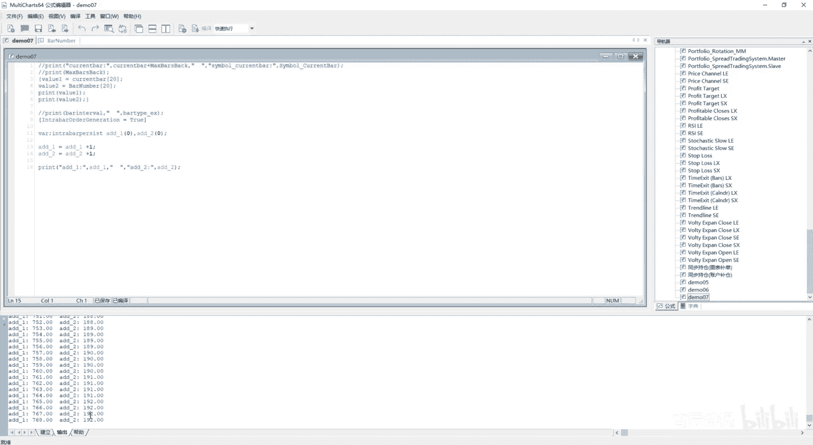

我在在属性里边，在回测这个里边在使用精气资料，就是主笔tick啊，同时忽略相同价格的TX，就是忽略相同价格的这个呃一笔啊，然后就说如果是相同价格就比它好给忽略掉，然后我点击一下确定。

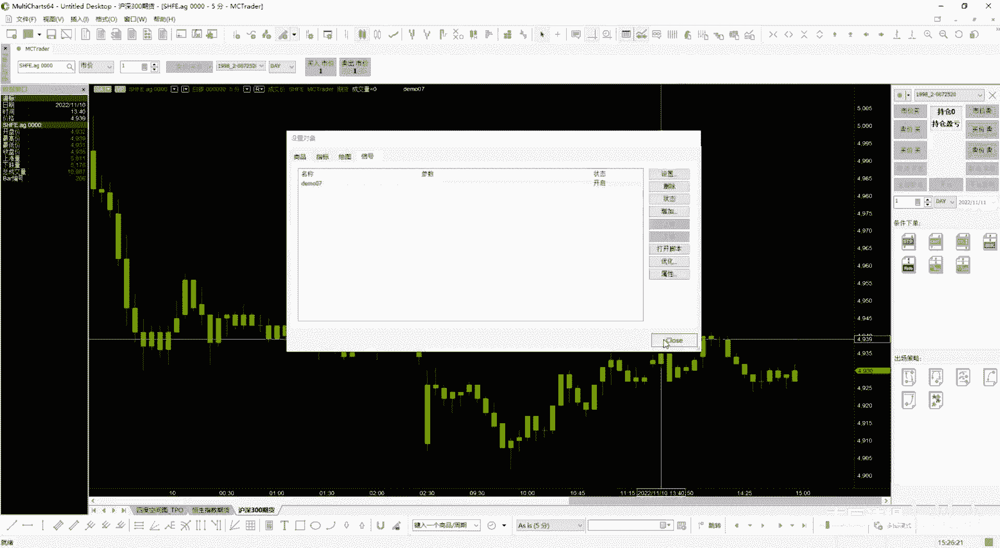

点击一下close，然后咱们再看一下它的结果啊，咱们再看一下它的结果，你会发现输出了很多，你会发现他是说是1万8000多，他也是192，基本上是十倍啊，100倍100倍，你像它是5分钟周期的。

你100倍，我相当于在一根K线里边，他运行了100次，它运行了一次对吧，运行100次，5分钟的话，它平均每一每一分钟运行20次，那其实还是不太能理解是吧。

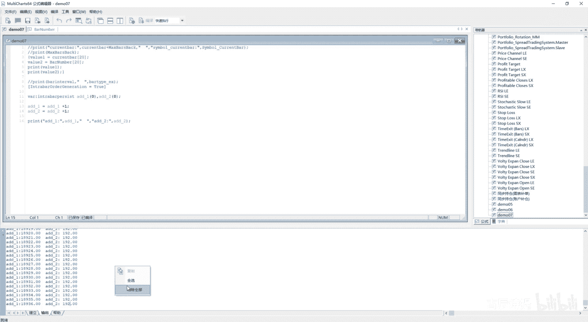

但是刚才在设置的时候，相信大家有注意到我是忽略相同价格的TX，如果说我把这个给勾选掉。

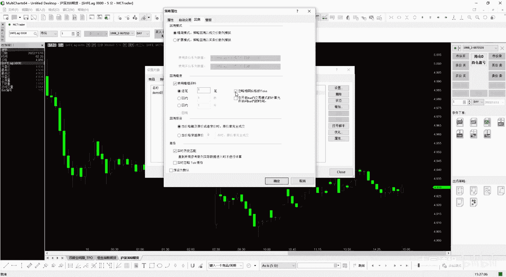

我再点击确定啊，我再点击确定，这个要稍微等一会儿，它时间是长一些，你看点现在都点不开，所以说要稍微等一下。

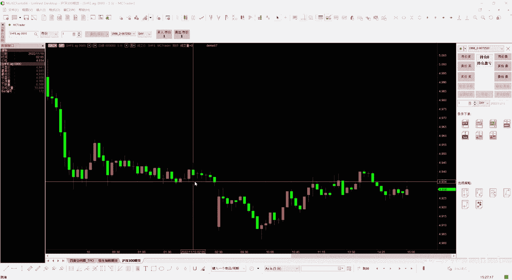

因为他是主笔tick在进行回测的，主笔tick在进行运行的，你会发现ADD下划线一是求9万5000多，基本上也是刚才的五倍，你会发现基本上现在一分钟，就是你用这个除以这个就是一分钟呃。

就是一根K线里边会运行多少呃，100倍500倍500倍的话，一根K线里边大概会运行100次，一个tick是500ms，就是一分钟大概是120比，tick是不是跟这个挺贴近的，对不对，所以道理就在这呢。

如果说你把intro border generation给打开，同时呢你在定义的时候定义了这样的一个变量，这个变量啊会来接收就是tick的数据啊，他会来接收tick的数据的。

这一点你要注意什么时间会使用，就是当你策略就是逻辑比较复杂的时候，尤其涉及到这个tick的，就是说记录啊是吧，比如说我在做一个行情的时候，就是我选择进场的点位，我会挑，比如说前十比tick里边呃。

这个居中的价格，或者价格往上排名第一的那个价格，用这个价格去发委托，是不是成交的概率也挺大的对吧，而且就是说把你的进场优势给展现出来了，因为往往就是分钟级别的，就是你如果仔细观察的话。

每一次这一分钟也好，5分钟也好，当然特殊分钟除外，比如说像像2分钟4分钟是吧，这个用的周期比较少的，但是哪怕是一分钟周期，它这个尤其是这个周期切换的时候，这个时候交易量是相对其他时间段是比较高的。

如果说我挑选一个价格，然后我可以给他挂一个，我不用这个就是一般用的这个收盘价是吧，我给他挂一个，比如说前十前十比tick里边较高价，然后我进行做空，我是不是进场就有优势了，对不对。

因为很多时候他都会就是到，就是到了这个时间点，他那个tick就往下就往上拉一下，或者说往下拉一下，一般都是往上拉啊，因为你在这个进场，比如他是一个下跌状态的，这个时候你做空做空就是卖出去嘛。

就是说做空你的这个会比较多，或者在这个时间节点，一般就是说大家都会在这个时间节点，比如说我看它我认为它是一个低点了啊，我觉得它会涨，都从这个时候来做多是吧，你可以烫个十秒钟，或者腾个十个tick5秒钟。

然后挂一个比较好的价位是不是就可以了对吧，用处是在这呢，但是这个在回测里边啊，嗯因为咱们这个用的这个时间很短。

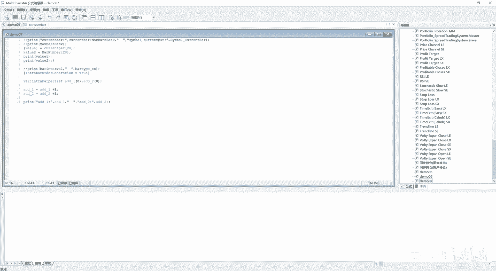

就两天的时间啊。

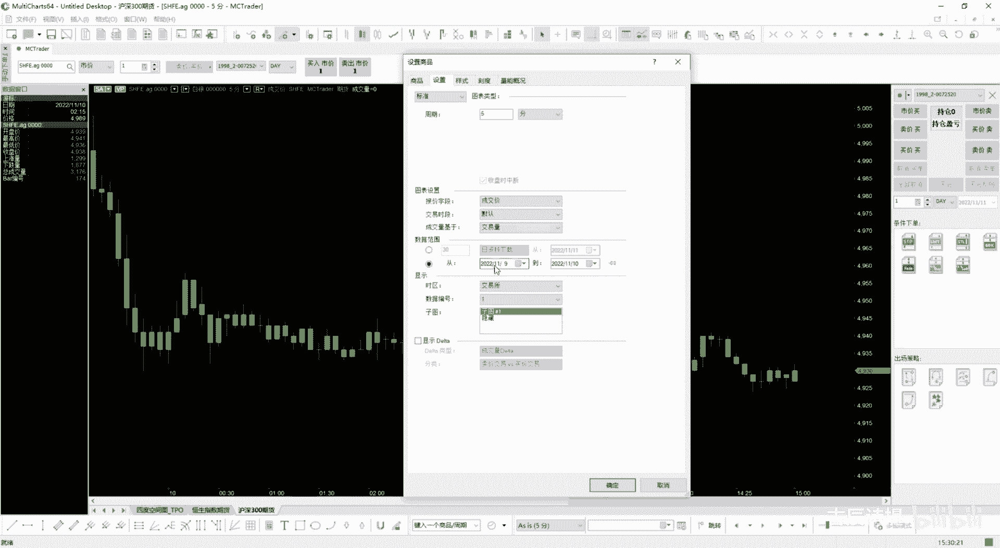

就两呃两天的时间，9号和10号，如果你时间长了，这个对计算机对你的电脑这个负荷是很大的啊，一般不这么去使用呃，这属于是很精准的，或者很精细的来控制你的这个委托单什么的啊。

你像他的这个关键字也是写着intro bar，就是B内order，order是委托的意思，generation你可以把它理解为管理嘛是吧，或者或者说他的这个这个一些别的，这个就是。

反正就是允许在K线之内进行委托的发送啊，在K线之内进行委托的发送好吧，这一点你一定要理解，并不是说信号是一成不变的，如果说他是一成不变的，它如何取进行更好的去进行优化呢，对不对。

就是更好的去适应更多人的这种需求，这个是intro bar presist这个关键字的作用啊，如果你感兴趣的话，可以在有实时行情的时候可以来进行调用它，然后调用它看看它就说是如何进行，就是说这个赋值的。

因为你定义的变量，这个变量肯定是跟tick有关的啊，肯定是跟tick有关的，就是你这个ADD下划线一等于一个clothes，这个价格，这个clothes肯定是根据每一笔tick在变的。

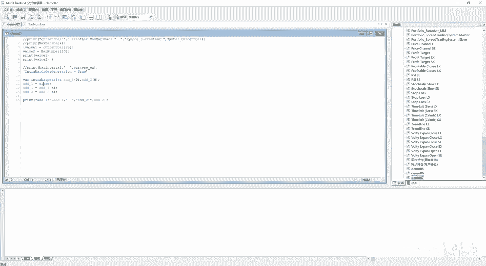

因为MC里边你这个tick如果还没完成的话，你当前这个拔线调用clothes，就是他的最后一笔tick的这个clothes啊。

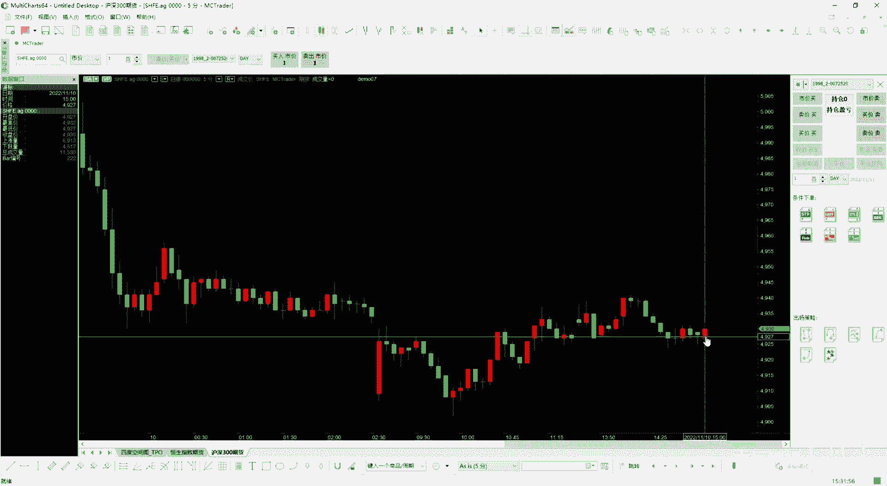

这个你要知道这个都是你知道与不知道的问题，不要觉得他有多么的高大上啊，好吧，这个是为什么之前没有跟大家讲，因为涉及的东西还不多，可能一下子跟大家讲，又说信号它是可以啊，它是你这个K线完成了执行一遍。

然后我再跟你讲，Entrobar persist，它其实可以根据tick来进行更新的，就怕你乱了好吧，所以说这个时候bus这个studio啊在哪呢。

interval bus studio它其实就起作用了，你去调用这个，你去进行判断的时候，比如下委托的时候啊，就说你可以去调用它对吧，bus studio就是K线的状态，他当前处于一个什么状态，好吧。

这个是8studio8type和8type ex好，这个K线里边包含的一些就是东西，还其实还有价格，价格咱们就不说了啊，就是open high close low是吧。

还有这个就是后边会讲什么WILLIAM什么的，咱们后边再讲啊，后边再讲volume，它也有好几个单词不太一样啊，好下面一个就是时间和日期，MC的这个K线，时间呢是以K线的结束时间为准的。

这个咱们之之前提提到过，就是你的这个tick，因为它里边很就是带着的是你的这个数据嘛，那他数据肯定得有个时间或者日期时间，那日期时间呢你是怎么去定它，你因为它是一个时间段，它并不是单纯的一个时间。

那他这里边带着的这个时间，他没有开始没有结束啊，没有开始没有结束，它只它只有一个时间节点，那他这个时间节点是哪个时间节点呢，就是就是它的结束这个时间节点，但是像维纳平台是它开始的那个时间节点啊。

这是不一样的，这也是平台自己定的啊，就是一般咱们都习惯于用它的结束时间节点，来表示，就是这一根K线的时间，不管你是看文华还是看一些其他的，就是咱们看盘软件都是这么来表示的。

一般最后一根K线当然是指期货啊，大部分的品种除了这个FIC，一般都是下午三点是最后一根对吧，但是你像下午三点，他最后一根，你默认的就是以结束时间为他的，这个时间基点的。

你实际上通过这个服务器给你传递过来的，实时行情，有个别的交易所都没有三点，就是也就是下午15：00分的，这笔tick都没有的，应该是正常锁吧，他最晚的一笔tic，可是14：59：59。

然后就是说他会给你传两笔tic，可根本就没有三点这一笔tick对吧啊，这个你要知道啊，你要知道呃，咱们之前也说过，就是如果说你的时间，比如说这个date啊，就是说它是从这个1900年至今的啊。

就是这个MM表示月DD表示日，然后前面年呢是三位数啊，是三位数，但是你注意了，如果说1999年就是2000年之前的，它返回的这个年是两位数，到了2000年之后，它返回的年是三位数啊，它返回的年是三位数。

因为如果说你返回两两位数的话，它前面都是零了，对不对啊，就是会会很麻烦，就是会标记不清，如果说你把零改成一，你像又到了201几年的时候，你就跟前面的零几年就会产生冲突，所以说他又加了一位数。

这个没有那么复杂，你理解它就行了，不要认为好像啊，为什么他2000年之前是两位数这个年份，但是到了2000年之后，它变成三位数了，这不是找找事呢嘛，对不对，其实没有这么一说，只不过是什么呢。

它伴随着你时间往后去走，他不好去给他，你说前面是零，它本身呢，为什么它是一个数值型的，因为它可以直接进行大小的判断，比如说我print print一个，就是比如说这个我value1等于date啊。

你别value1了，用condition1吧啊，直接用Y61得了，Y61等于date啊，减去100，然后print一个value1，咱们可以进行一下编译，啊有了啊，你会发现他是直接可以进行操作的是吧。

就是22年这个呃，这个10月份10号，因为你直接减了100嘛，减了100嘛，当前是11月份啊，11月份你直接减了100，所以说它是一个数值，你直接可以进行运算的，直接可以进行运算的。

如果说你前面不要一的话，你这样来表示它只能表示成字符串，因为你字符这么来表示是不行的对吧，更增加了很多的别的的问题，因为你前面添个零，这是个啥意思啊是吧，一般都前面不要零的，对不对。

所以说你这个时候就会产生困扰，所以说他直接给他加了一位数，这样就方便咱们去使用它啊，你理解它这个MC里边，因为它叫easy language嘛，它本身的这个时间格式一般都叫e l date。

其实就是easy language啊来表示的来表示的，同样的它还有symbol date，就是它不受这个max buzz back这个设定啊，他可以返回这个呃，所有K线里边的任何八的日期。

当然这个是不能返回在这个就是max bus back以内的，这个拔线的日期的啊，包括time哈，就是它有会有一个加S，这个含有秒下划线S你就代表他有秒精确到秒，这个是只是精确到分钟，简单的演示一下啊。

好，Print date，啊然后print一个time，当然也可以用D和T来表示啊，print一个time加S好，清空一下，然后进行一下编译，啊现在都是有些卡顿，可能是刚才调用这个tick的锅啊。

调用这个tick的锅，所以说他会比较慢一点。

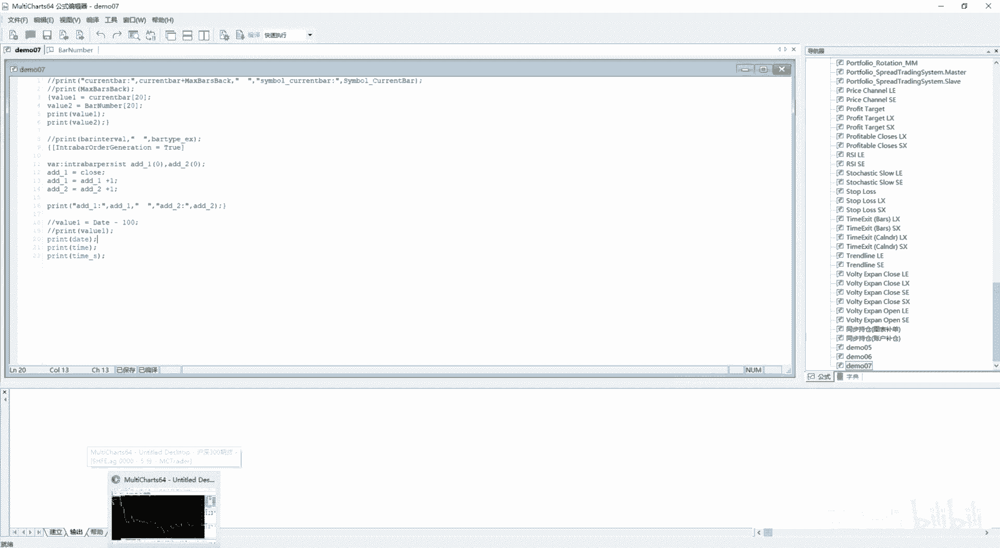

好了出来了，这是调用tick的锅。

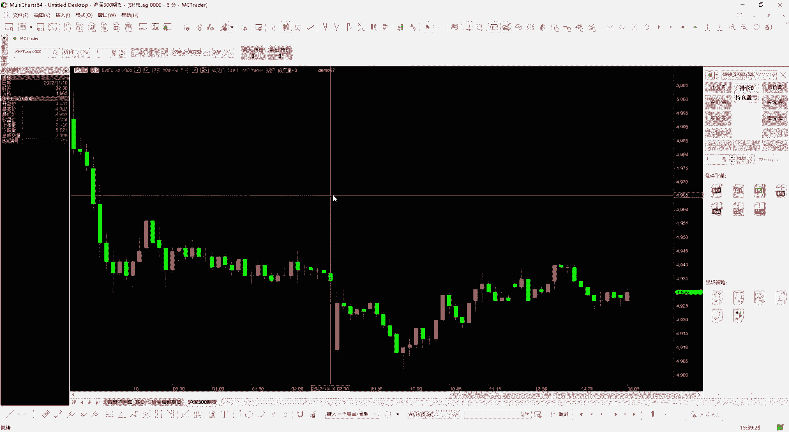

应该是把这个设置信号，然后把属性提个关掉，你想这两天他都会变得很慢很慢。

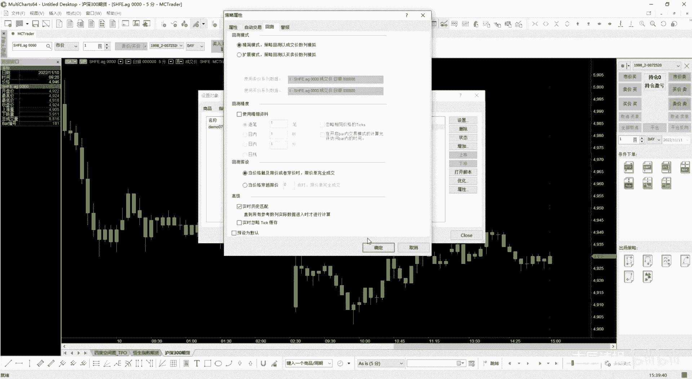

所以说一般不建议你去使用这个精细回测，你会发现1500其实就是下午三点嘛，然后你这个秒的话，它是一五，后边会多两个零啊，然后你日期是11月10号啊，11月10号啊，这个就没什么可说的。

他都是输入值类型的，它就是方便计算，但是从这你还不能进行，比如说我要返回前十天的前十天，你当前日期没有问题，它会返回到一号，但是你直接用数值进行加减的话，它会有问题的，对不对。

因为他不是就是这个十进制的呀，你一个月，比如说我要返回30天之前的，你减30，那不对呀，对不对，因为它返回的直接是这个数值啊，直接是数值，所以说这个后边会有别的一个方式，来解决这样的问题好吧。

它只能目前只能是进行大小比对，你不能进行数学的运算，它虽然是数值，当然你强制性的进行数数学运算也是可以的啊，但是你会造成各种各样的问题。

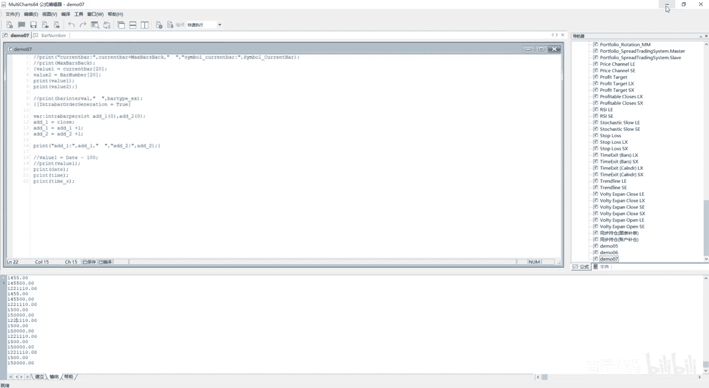

对吧啊啊。