# 第7节课 CtpEngine讲解 - P1 - 古辰诗提 - BV1Uq421F7NQ

欢迎大家来到从零开始量化系列课程，VPY课程的第七课，上一节课咱们讲了这个CCTA的这个底层的逻辑，其实并不复杂，只要你去好好的去研究，然后把这个C加加的再简单的看一看，呃也不需要看懂。

因为它其实和Python有很多共通的地方，大部分的其实你一眼就能看明白，他大概是什么意思对吧，那讲完了这个底层呃，也讲了这个limit engine，那咱们就应该去讲CCTA策略的。

他的这个就是获取到tick之后如何去进行处理，然后再把对应的order去返回回来是吧，所以咱们第二个就不是第三步，应该最主要是讲的这个c t a engine engine，就是CTA的这个引擎。

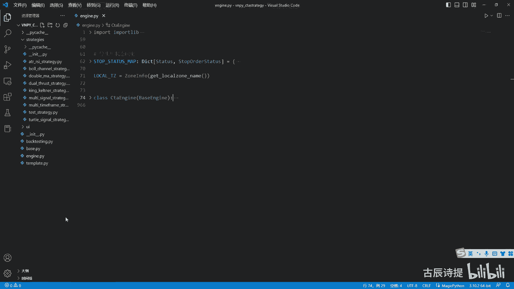

这个CTA引擎它是在哪呢，就是在这个C盘下面，维纳斯studio这个lib和到这个site packages，Site packages，然后在这里边找到WPY开头的，这个c t a strange。

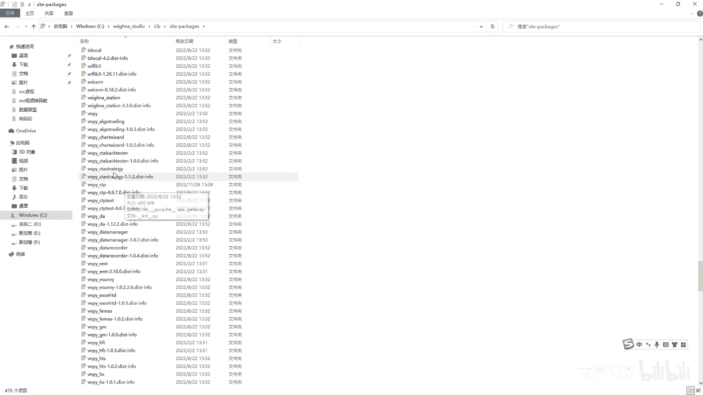

在这个里边这里边有个engine，然后这个你打开之后呢，它会有一个UI界面，然后有一个圈子这个文件夹，这个strange是放着的，是VNPY或者维纳这个内置的一些策略的，这个案例。

他都是继承自这个city template呃，然后下面会有一个INIT，INIT呢，这边有个c t change app，这个呢需要跟大家讲一下，就是在这个维纳这个平台或者软件里边，底层接口接收数据。

或者说是你去SORDER，然后去发委托单，或者接收一些比如on track，嗯这个你的这个合约信息啊，什么contract信息什么的，这个它的底层呢叫gateway是吧，这个gateway其实有很多嘛。

也不光是有CTP，包括非买啊什么的，他都是基本上都是大同小异的啊，都统一把它封装成了这个gateway，然后呢中间传递的呢是engine对吧，然后他后边把这个比如说CTA，就是这个实盘的。

就是这个策略呢，它通常把它封装成一个一个一个的APP啊，这个app比如说是CTA的，然后这个APP啊，比如说是RPC的啊，这个app比如说是这个算法的啊，他都会把它封装成app。

你可以把它理解为其实你像咱们用手机的话，这个网络或者说是应用系统或者数据来源，它就把它封装为是gateway，然后这个它的一个一个的应用，就用APP来表示，所以说它导入的时候，通常就是说。

如果说你不是自己来写维纳这个平台，它是通过这个c t a strange app，然后来进行导入的啊。

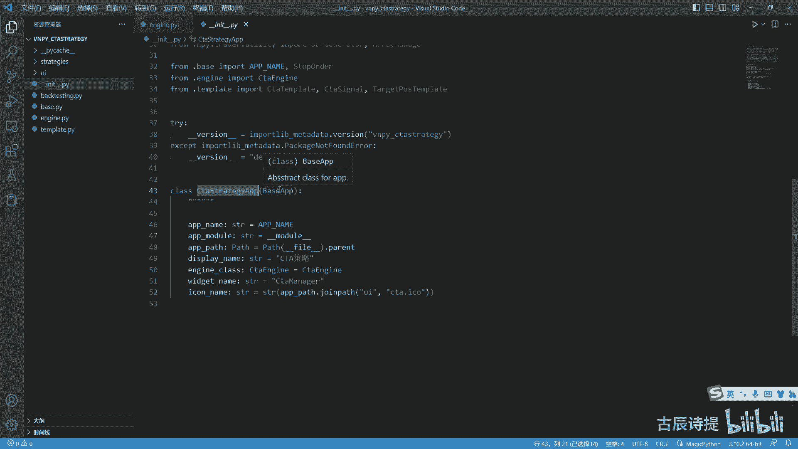

咱们可以看一下他的这个一个在git上啊，B i。

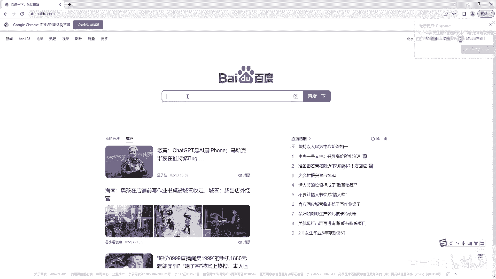

V e i g h n，咱们搜一下北大，然后进来这有个仓库，git相当于国外的GITHUB呃，以前没有get it的时候，你国外的GITHUB其实不是特别方便，因为对于咱们来说连上去比较费劲一些。

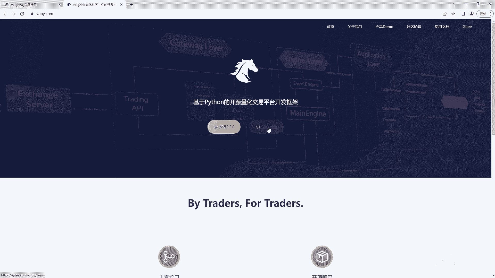

但是有了git之后，这个速度就快多了，咱们点进git里面去，你可以搜一下这个伟大啊，就是说这个维纳可以去搜一下，然后在这个极速下载维纳，这你可以点进去，然后这些呢是韦纳的源文件，是伟是这个伟大的源文件。

咱们可以看一下它这个里面有这个Emo，这个VNPY是它里边的，就是说源文件，但这个里边啊没有，它就是封装好了，比如说这个数据库的文件啊什么的，但它这里边有一个exams，就是案例案例里边有很多啊。

比如说这个candle chart是这个蜡烛图是吧，然后CSV呃，呃不是就就就就就这个client server，它是一个就是RPC的，就是说服务端对吧。

然后CTABTESTING是这个CCTA的回测啊，这么一个演示啊，这都有啊，下面有个NO u i，就是你没有界面的话，就是用脚本来运行，就是你通过维纳的这些写好了的各种类啊，你自己来运行的话。

不用它的界面，你会发现就是说这也有这个案例，其实这个很简单啊，很简单，咱们可以直接看他的这个if啊，相当相当name等于相位相位，慢着它直接是run parent，Ruparent。

它其实是一个方法对吧，里面做的最主要的事情，就是启动子程序和关闭的这个紫禁城啊，启动紫禁城和关闭紫禁城，那所以说这个最重要的这个程序，是在这个紫禁城，也就是这个run child是吧。

这个process就是一个单独的进程嘛，run child就是在这个里边去执行的，那这个里边它其实也是一个死循环，就在下面玩true是吧，这个死循环他做的第一步是什么呀。

就是sitting这个log fire true，这是什么意思呢，就是把你的这个log file，是不是保存在这个文件里边，就是你的日志输出是不是保存在文件里边，通常咱们保存的话会在这个C盘下面。

用户administrator或者the nol里边，这个点win china，就是这个log里边，如果说你等于false，就没有这个日志输出了，但是你true它就会有，所以说建议大家把这个打开。

你每天你在记录的时候，你可以有据可查对吧，然后先啊创建的是image engine，咱们第一个也是讲limit engine，后边呢创建的是一个my engine。

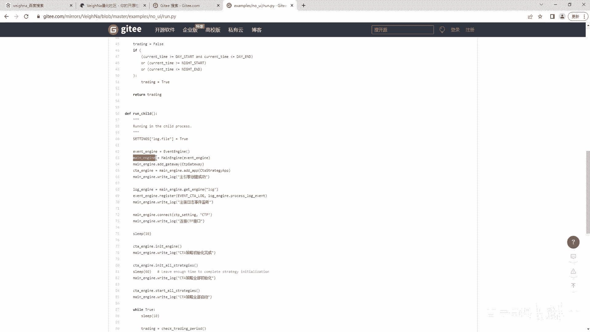

My engine，它是一个主引擎，咱们可以看一下manager manager。

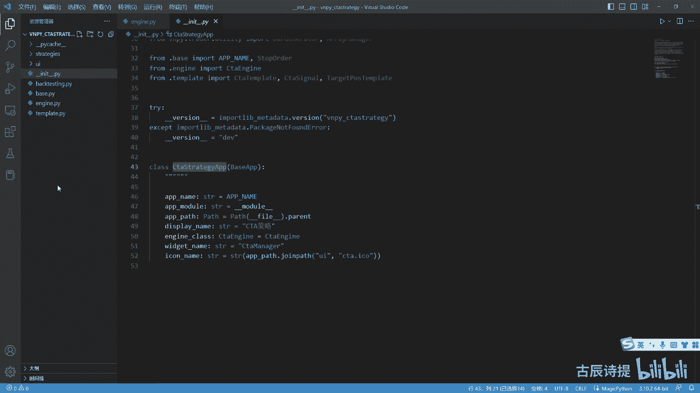

后边咱们可能会讲到F盘。

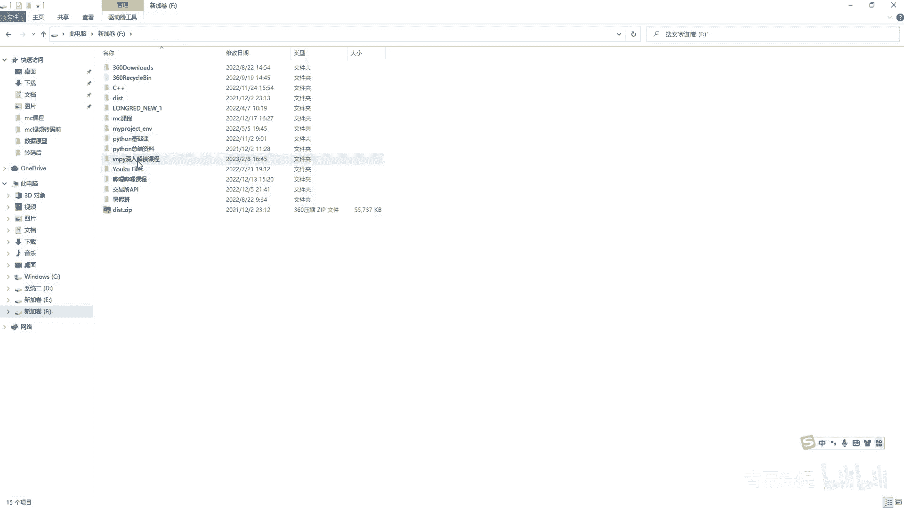

好新新建一个demon07点py my是在哪呢，是在这个from wpy点trader engine，import一个my engine，咱们可以看一下这个my engine，My engine。

它其实是一个呃统一的管理引擎，当然这里边还有个OMS引擎，也是跟manager，它是在它下面的，是在这的，这不是这是白色按键，这不是这是这是o m s engine。

o s o m s engine大部分做的呢，它是在统一它的这个方法调用，就是统一管理，my engine主要是做了什么呢，my engine就相当于一个容器，你可以这么理解，它就相当于一个容器。

这是my engine，my engine呢里边先把因为这N件给添加进来，然后呢再把gateway给添加进来，就是你的这个接口给给添加进来，再把你需要处理的，比如说就说这个CCTA引擎啊。

应该是这么再把CTA引擎给它添加进来，然后再通过CTA引擎把那个策略导入进来，my engine是一个主引擎，但是它其实里边更多的是做一些综合性的，或者说是一个集成性的呃，它实际上的操作没有太多啊。

你会发现它比如它的里边大部分都是什么呀，比如说这个at engine，At gateway，At app in it engine，right log是吧，Get get away。

get engine啊，Get default setting，你看都是一些比较上层的操作，我这个没有褒义词，贬义词的意思就是他就是给你暴露了接口对吧。

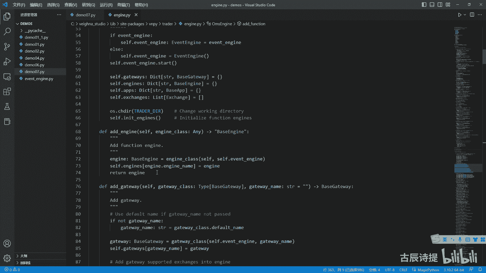

咱们可以看一下他的这个后边他是怎么做的，My engine at gateway，你会发现它是CD p gateway，就把这个gateway给填进来了。

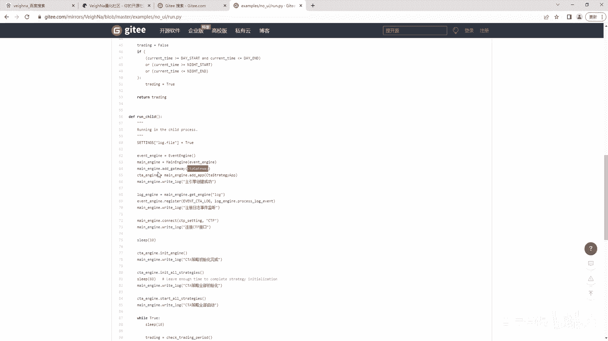

就把接口给填进来了，那他这个gateway他做了什么东西呢，它其实就是啊他艾特的，就是他这个参数是这个类，它并不是一个实例化，它是一个类，他把类添加呃，就是把这个类作为对象传递过来之后呢。

它会给它进行实例化，添加进来之后，它其实就是做了一个实实例化，你看这个v class，然后括号括号不就是实例化吗，然后里面传了参数，咱们之前讲过这个这个CD p gateway的时候。

就是把engine和gateway name给它传进去是吧，然后他再把这个gateway添加进这个gateway里边，所以说这个get away还是很重要的，如果说你有多个接口。

都添加进这个self点GEWAYS里边，你再去发送委托的时候，你要知道往哪去发，所以说你得通过这个get with name来进行标识对吧，后边呢是把这个交易所就是做了一些添加。

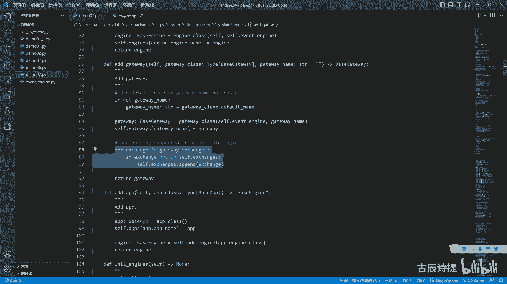

就没有东西了啊，简单的说一下，然后后边这个CT引擎等于main engine at啊，这这个ADD a p这个app，你会发现它是c t strange app，它并不是说直接添加了这个T引擎。

它是把这个t stretch app给它添加进去了对吧，那这个CT卷起app。

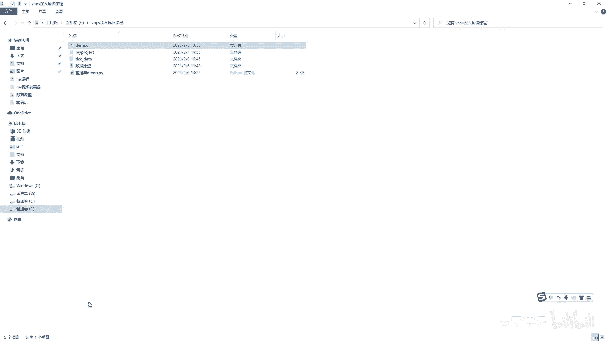

它做了什么呢，at the app啊，这个是c t strange app，他进来之后，咱们再看一眼这个c t a strange app，还是在这个INIT文件里边的。

他这里边其实就定义了一些数据是吧，这个app name吧，然后p model啊，然后呃呃这个app pass啊，就是它的路径啊，display name嘛，然后engine class。

你看这engine class是city engine是吧，包括他的这个VEGETNAME，就是他的这个就是这个就是图形化界面，它的名字，然后icon name是呃，就是找这个。

其实就是说它的这个图标的这个路径啊，就是这个是集成好了的，其实最主要的是把这个里边的CT引擎，给他给导入进来。

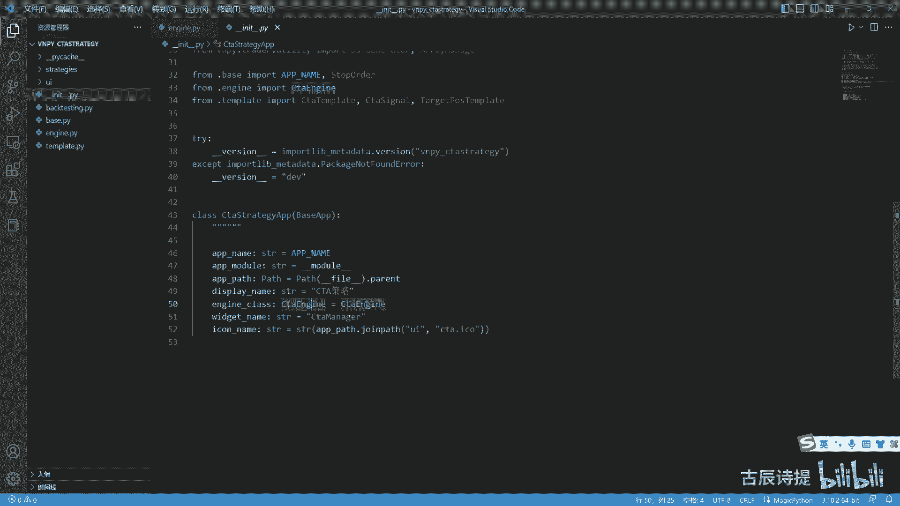

给他给导入进来，咱们可以就是呃它添加了这个app name。

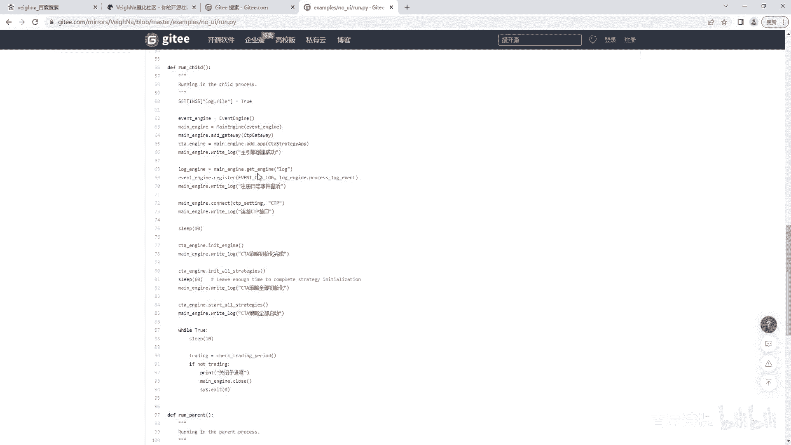

咱们再看一下这个这是爱的app，它其实就是什么app，就等于app这个class p class是你传进来的那类，他把类给实例化了是吧，然后呢，把这个实例化的类呢添加进了cf点，APPS里边。

其实它也是一个就是字字典嘛，然后把它给添加那个这个字典里边，然后就是单独获取了这个engine engine呢，它是用at engine来获取，at engine是在这呢。

at engine它是做了个什么呢，你这个c t a engine过来之后，你会发现他是个at engine，他是做了什么t engine过来之后，他把这个engine进行了实例化。

把self self其实就是这个my engine嘛，这是my engine是吧，把main engine传递给他，然后把server invent engine传递给他。

其实就是把CT引擎进行了实例化，对吧啊，CT引擎进行了实例化，你看传递的参数，一个是main engine，一个是engine，对不对啊，进行实例化实例化，它就执行的是这个in it这个动作嘛。

就是初始化的动作嘛，或者叫构造函数是吧啊，这个里边其实就定义了一些，就是嗯字典或者说是这个集合，定义这些有什么用啊，其实大家不要就是看着这就是这么多，好像乱，其实并不乱，你想想这个CTA引擎。

比如这是CTA引擎，这是gateway，然后中间是in engine是吧，这个是gateway，然后这个是CTA引擎，他就是从gateway tick传递过来之后，CT引擎肯定要进行啊处理。

当然这个处理不是说合成啊，因为C这个CT引擎里边肯定，比如说你像有这个stop委托单，对不对，stop委托单你停留在就停留在这个里边的，你得就是每一笔贴过来，你得进行区分，是不是。

所以说你区分那你怎么去嘛，无非就是便利嘛，所以说你肯定得存储着，就是说这个stop维多弹，所以说肯定得有这个strange name是吧，然后后边哎来个列表或者来个集合，就是这样的数据类型。

把这个stop单独放在里边，然后有对应着的，比如这个vt simple，就是这个相对应的vt simple这个T过来了，他挨个的去便利，对不对，这个是个很容易理解的吧，就包括你这肯定得存储什么呀。

就是说你对应着的这个，比如说这个你的这个vt simple啊，然后对应着的这个什么呀，就是说这个STRANGES，比如说我螺纹这个就这个合约，然后他肯定对应着的这个旋解子，比如说你最少得一个吧，对不对。

因为你的策略当然就是，这就是你做螺纹的情况下啊，也有可能你是对的，一对多，你肯定得把卷解S1S2给放到这个里边，当它对应着的这个tick过来，你肯定得去调用，挨个去调用它的这个own tick。

才能传到这个city template里边对吧，包括呃这个stop委托，你还有这个呃这个限价单的委托，你也也得在这儿也有保存，因为什么呀，你得从这儿进行转换，咱们之前说过，你像上期说的。

你必须得转换成比如说是平均还是平足，你得从这个CTA引擎这过来转换吧是吧，当这边有回馈的时候，他进行他要做的是进行就回调，就是把这个order什么的进行回调对吧，然后再去你到这儿再去进行处理。

然后处理完了之后，再传递给这个你的上层的这个策略，它是这样的一个逻辑，所以说这边必然会有很多这样的这个字典啊，他必须得去从这个CT引擎这给保存下来，因为他直接对着的可能对这个很呃，对着很多个的这个策略。

他得能就是快速的去找到这些策略，然后进行其实还是数据的呃解析，然后整合和传递嘛，对吧啊，那咱们挨个看一下啊，第一个是self distrange city，这一看就是设置strange setting。

你策略初始化之后，你肯定得设置啊，比如说你是用30均线和10日均线，进行这个策略的话，那肯定得有30和十这样的参数嘛，肯定是参数的设定呃，这个是strange data，它是做什么的呢，它是就是嗯。

因为每天的交易他都会有这个收盘和开盘，然后会有这个连接服务器和断开连接服务器，也就是呃gateway，它会中断，中断之后你有一些数据是不是得保存下来，比如说你应该在最后一根K线进行开仓的。

但是他已经收了盘了，那你只有等到晚上去开仓，那这样的数据你肯定得保存下来，到晚上的时候再给发送出去对吧，所以说你提前，你得把它就是在初始化的时候得读取进来，对不对啊，然后包括这个CP点啊。

这个classes1看就是他的，就是你的这个所有的这个嗯strange class，这个类都存放在这个里边，包括这个strange，就是你用到的所有的这个专辑，都是放在这个里边对吧。

这个类啊肯定会都存上，因为什么在界面应用的时候，它有一个你选择策略的，这么就这么一个过程，你只有把策略全存放着，你才可能让他去选择对吧，你不然的话怎么展现出来啊。

啊你像这个呃simple string map，你看这个map是就是map在Python基础里边会有，就是单独的这个讲解，但是这个map是一般都是代表筛选的意思嘛是吧，map就是或者配对的意思啊。

配对的意思，Simple strange map，一看就是symbol，就是你的这个合约和你的策略进行配对嗯，他是这个一个default，咱们之前讲过，后面放的是list。

肯定是va symbol和这个strange list，我刚才说了，你这个very symbol，后边存着对应的这个策略的列表，这样方便就是有同一个，比如说有一笔TK过来，他就直接便利一下。

就把tick直接去调全集里里边的，这个own tk了，对不对啊，这样是方便调用order id，String map，你看这就是order id和专辑来进行配对。

strange order id map就是strange和order id进行配对，其实它都是为了方便去寻找它上层的这个策略，因为这个CT引擎和你的策略，它是一对多嘛对吧。

这个是self stop oraccount，一看这就是个计数器呃，如果你用过那个伟大的界面的话，你肯定会发现它发出的stop单都是STOPE，S t o p2，这个一看就是他在CT引擎里。

把自己给写出来的对吧，当然到了这个gateway底层，他这个order id他也是自己拼出来的，对不对，这个一看就是用来计数的，然后用来拼凑那个你的这个哦，就是stop order那个标识的。

其实就是stop order id啊，他的那个标识的啊，这个是self distop orders，它是一个字典，它一看就是用来干什么呀，用来就是去判定啊，就说什么时候出发的，他是来在这个接收眉笔。

这个时候进行判定的是吧，这个呢它是一个线程池，但这个线程池里边只有只可以，最多是允许一个线程啊，这个是用来做什么的呢，咱们后边讲它是什么，你你初始化策略的时候，你必然需要这个就是你百分之就是你做T策略。

你一般都是需要这个历史数据的，为什么呀，比如说你30日均线，你最起码这个你得有30日的这个值吧，都存放在这个底层吧，因为呃比如说你是呃5分钟的K线，你得把这个30根K线就是全部放到这，你才能计算出来。

就是你的这个均线值呢，如果说你没有这个历史数据，那你来填充的时候，你得通过实时数据合成之后填充，那你一开盘之后你就交易不了，因为他还没满呢，你怎么计算呀，所以说你得有有这些数据之后。

来了一根就是一个新数据，它会整体的往后挪一个，然后把最后一个挪出来是吧，然后再去计算一遍它的值，你你的这个均线值不就出来了吗，所以说必然会有历史数据，那必然会有历史数据，你就得去获取历史数据。

要么是从你的这个米框服务啊，或者其他的就是三方服务，要么是从你的数据库里边，那你就得去读取，读取是一个比较耗时间的过程，所以说你得最起码得有一个单独的线程，来去执行它对吧，那这呢它是用了一个线程池。

一个线程池呢其实线程池很方便做的，就是说它会有这个就是就是直接添加什么呀，就是你做完了之后，我再让你做一个动作，或者说你做之前就是你这个线程开启之前，你去执行一个额函数或者方法，什么意思。

比如说我这个线程要开启，我可以给它添加，应该是叫这个at当爱的什么啊，当function吧，就可以给它添加一个，这个在Python基础课里边我也给讲过，就是仔细的讲过诶。

当function就是当一个线程执行完了之后，他可以去再执行一个代码，或者说是呃应该是有一个INIT呃，什么什么什么，就是这样一个方法，然后可以在初始化之前去执行一个方法，这些都是可以的。

比较方便和灵活，比较方便和灵活，另外一个他省去了什么呀，就是我得挨个便利啊什么的，就是你如果说你是一个单独的线程，你肯定得看这个线程做完了之后，我再做下一个怎么着，这个直接可以什么呀。

因为它线程池结束之后，他会把这个线程直接放回到这个线程池里边，然后再进行下一个操作，这样就会很省事对吧啊，因为你有很多个策略嘛，你得需要很多个不一样的数据啊，然后这个是aq simple哈。

这个一看就是跟这个echo data去进行啊，就是操作的是吧，Ao symps，然后这个是self divt trade ideas哈，这个就是呃就是保存这个呃已成交的。

这个就是这个这个成交的这个单号啊，这个比较重要，这是一个转换器，就是如何把这个呃，这个是比如说上期所的你的这个委托，转换成一个商机所可以接受的委托，或者说你多策略单合约的这样的委托。

你必须得从这儿去转换一下，因为如果说你有持仓的话，你可能需要比如再开仓呃，如果说是呃有持仓是多单，如果说你在开仓是空单，你最好的方式其实不是锁仓，其实应该是什么呀，就是说应该是先把五首先平了三首对吧。

但是当然了，你说不转换也可以，我开五手多开三首空，但是这样会浪费保证金，因为期货里边是单边保证金只多是吧，就是你五手会收你五手的保证金啊，这样资金利用率就下来了啊，这个在我的第一套课里边就是哔哩。

就是B站上免费的课里边，把这个其实讲的很很清楚，单独的一节课，专门讲这个转换器里边，涉及到的其实就是逻辑上的一些设定呃，计算方法都是一些简单的加减啊，就是来同步啊，但是还算是呃，这就是是比较复杂一些。

你先你先去呃，你先需要去理解，然后你才能看得懂那个代码啊，转换器，这是这两个呢，一个是数据库啊，就是get database，然后一个是DATABFEED，就是你的这个三方数据服务嗯。

就是这个咱们可以简单看一眼啊，你看这个data就是get database，他是什么呀，他是去导入它的数据库，它首先得获取去这个setting里面，获取database这个name这个名字。

这个settings啊，就是说是咱们在这个C盘下面。

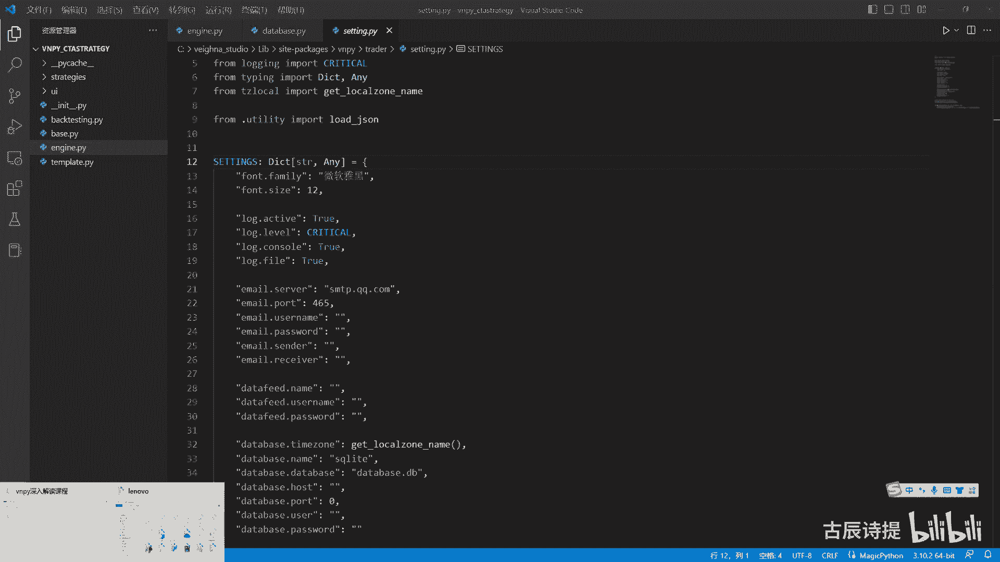

这个用户啊，the NOVA或者the ministrator devine trader，这个里边来进行，就是这个vt setting里面进行设置的。

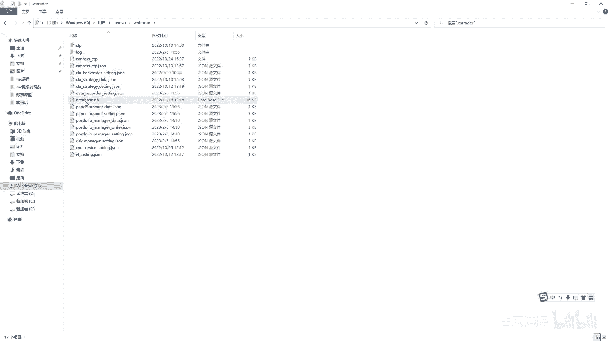

我就我就不打开了，因为有里边有密码什么的，然后这个里边涉及到数据库的这一块，就是啊就是在这嘛，如果你没填的话，它会默认是GL啊，如果你填了的话，比如说是什么PUGSQL，或者说是MONGODB啊。

这边可能会涉及到账号密码什么的啊，所以说都是在这儿啊来获取的呃，他这边如果说你这嗯如果说你写了啊，这边给设置了，它会通过这个VNPY下划线，然后来进行导入，这是个动态导入，咱们一会儿要重点讲这个。

因为这个策略咱们也需要动态导入进来，对吧啊，为什么给大家提一会儿需要重点讲，导入进来之后，如果没有的话，它会默认使用这个SLIE是吧，其实就这么简单，没有什么别的东西啊，不是什么复杂的。

就是主要的是那个动态导入，然后就get data feed，咱们可以看一下一样的，如果说你设置了这个defeat，然后他就会VNPY下划线去导入，如果说没导入到这边，是获取错误吗，你没找到。

不就是会会产生一个错误嘛，然后这他会给你输出一下，找不到，然后默认使用这个IPAD数据服务，他就会这个model去使用这个aq data啊，其实就这么简单啊。

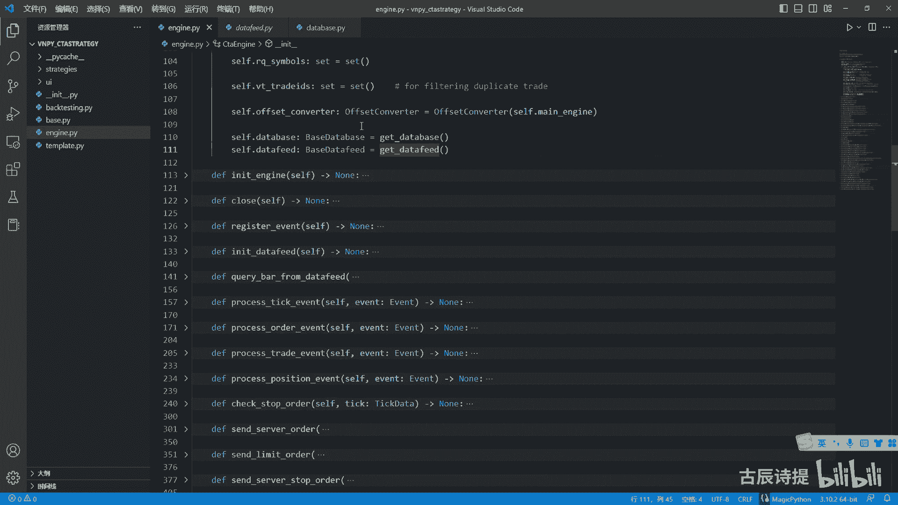

好那初始化完了之后，咱们可以看一下他的下一步做的是什么啊，他首先做的啊，就是当然是这个连接CDB是吧，然后呃注册这个日志监听，就是把你的这个日志呃，就是这个啊log n键给你获取出来。

这个log engine是my engine，他自己来获取的啊，他自己也会my engine，里边会生成log g o m s n g和email engine。

所以说能直接从这个manager里边去获取到，然后再进行注册一下，这样就可以把日志输出来了啊，这个没什么好讲的，然后连接CDB啊，这也没什么，然后你看他下一步是什么CT引擎，点engine啊。

下一步做的是这个就是init engine。

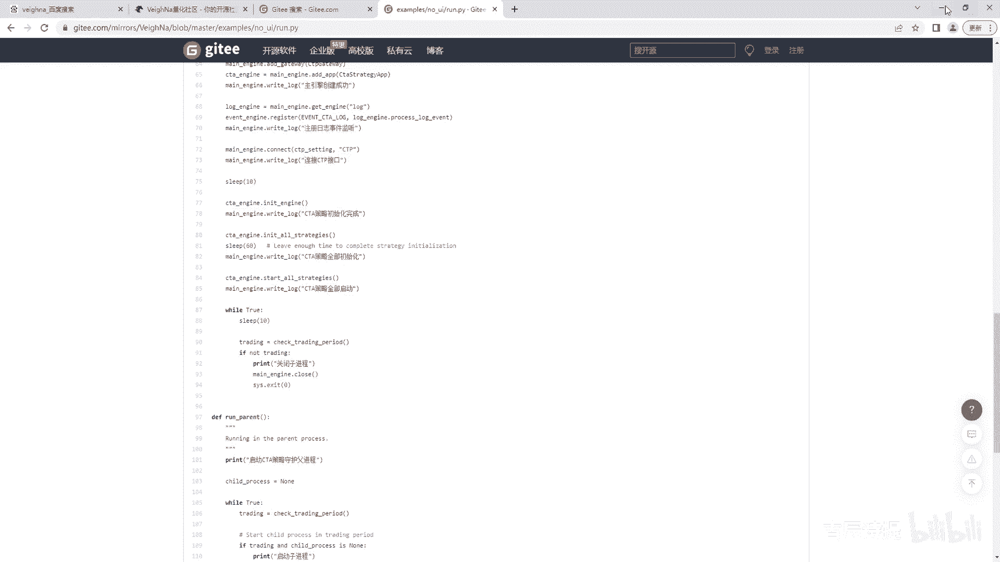

是他首先要做的就是初始化引擎，初始化引擎，它第一步做的是MIT data feed indefeat，其实没什么，就是就是把这个如果说你有数据服务的话，它就会进行初始化啊，这个defeat MIT是吧。

这个也没什么好说的，其实啊这个echo date可以自己去研究一下，或者其他的一些三方的这个数据服务，你可以自己去研究一下，你像阿QDA，它并不是说只能获取这个你的历史数据，它还可以获取。

比如说主力合约啊，就是每一天的主力合约的名字啊，以及可交易的合约什么的，包括阿QDA，它是限制好像每天只能使用一个G的流量啊，你可以去仔细研究一下，去看一下iq data的时候，他那个API。

然后自己去用一下好吧，最主要的是这个load strange class，Load strange class，lotus诶，Load strange class。

在这呢load strange class，你会发现呢它这个一层一层的往下就是比较多，你看load rage class里边有load rage class from fla啊。

然后这个里面还有这个uh load jy class from model，这个呃，他主要做的是什么呢，就是导入策略的类，你看它是两个路径，一个路径呢是就是这样的这个STRANGES。

另外一个路径呢就是这个C盘下面。

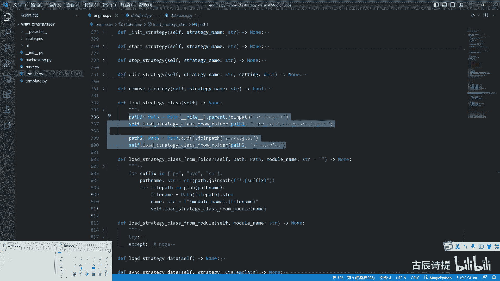

就是这个用户administrator，下面跟这个点VTR同级的这个strangers，如果没有的话，你需要去新建一个strange，然后从这来导入你的策略。

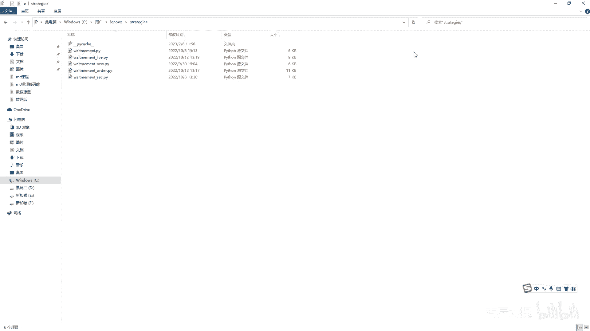

你像这个是涉及到动态导入，动态导入肯定是要用到lib是吧，put lib就是这个import import lib呃，咱们可以想一下啊，就是说首先第一个问题，计算机在执行的时候，比如说咱们可以去啊。

你想啊，From daytime import the time，为什么能够这么去导入，为什么，因为咱们用的这个Python就是这个解释器，它首先它会去他的这个嗯。

首先会去这就是你的这个demo下面来找，如果找不着，他会去这个这。

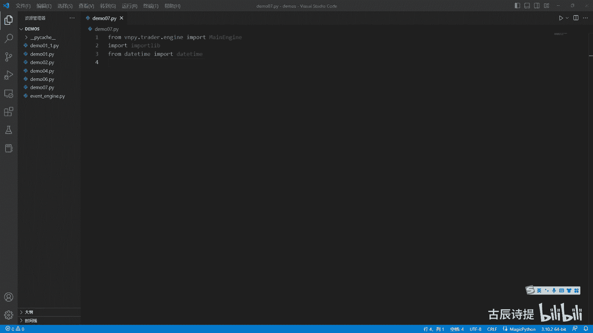

就是这个我从这哎对这就是环境变量。

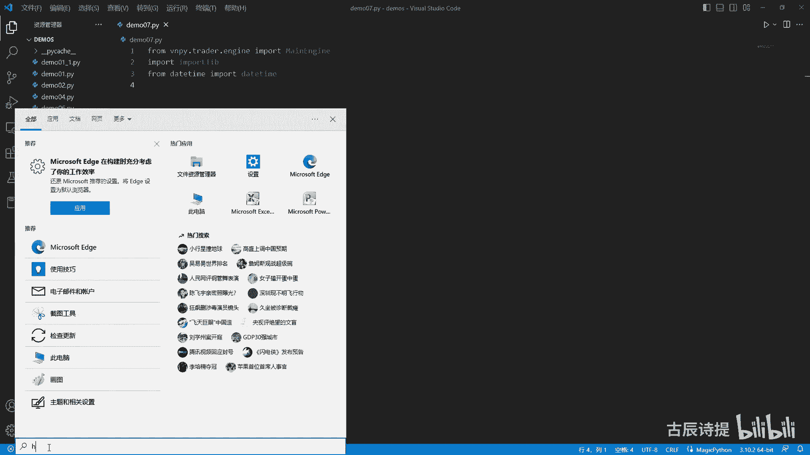

你输入一下这个环境变量是在这让环境变量啊，这个里边它有这个pass，还有下面这个pass，你想这里边有维纳斯studio是吧，这个还有这个呃scripts里面去找，如果还找不到的话。

他会去这个Python他的这个库里边。

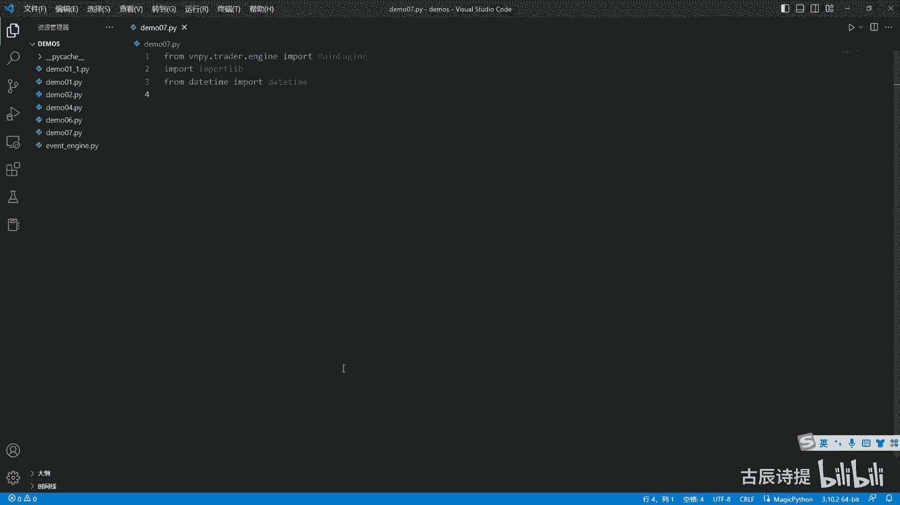

就是这个咱们老去找的C盘啊，via studio这个lib这个site packages里面去找，这个是你的解释器，这个set packages就是是默认的会去里边去找的啊。

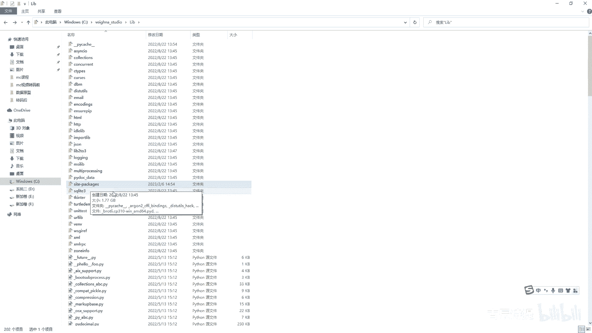

你像就是说咱们去导入v from呃，这个VNPY，这个下划线都是在这个set package里面去找是吧，那如何去看，就是他会去哪些里边去找啊，而且它的顺序是什么呢，就是你可以import一个SYS。

然后print一个SYS就是系统的它的这个路径，系统它这个路径咱们可以进行输出一下啊，你会发现第一个就是demo就是这对吧，所以说呢就是很多时候，尤其你学这个Python基础的时候，很多人会告诉你。

就是说你不要把这个，这比如说我起个名字叫dead time，这样的话你就导入不了，就是说你的这个site packages，就是你用pip install装的那个daytime了，为什么呀。

因为他第一个找的就是这个demo，如果找到了，他后面就不找了啊，所以说你命名不能一样，不然的话他没法去这个set packages里面去找，你看他第二个就是就是这个这个维纳斯studio。

这个lib是吧，然后第三个就是这个set packages，咱们刚才说的，后边还有呃，这个这个这个这个这个咱们设置好了的，也就是说这个在这个环境变量里边啊，设置好了的，所以说他会挨个的往这里边取去找。

而并不是说你好像觉得这个计算机底层，它有多么智能似的，所以说你动态导入呢需要去呃用到这个东西，为什么，比如说我从这我写一个，我直接可以导入，但是如果说我在一个别的地方，比如说我就在这吧。

我就在这个圈里边啊，新建文件这个demo01啊，然后demo03了，重命名demo01，然后点PY，然后这个里边我写一个啊，class person好，我这里边，初始化一下。

初始化里边就四点name等于说ALEX，然后这个cf点等于1000岁，我这儿写个类，我想导入这个类，我如何去导入呢，啊就是你得用到这个，因为这个里边现在没有去这个啊，当然有啊。

就是这个site packages里面，咱们不用，咱们就把它当成就是没有这个路径，如果说没有这个路径的话，咱们如何去导入呢，啊首先咱们得把这个路径给它找出来是吧。

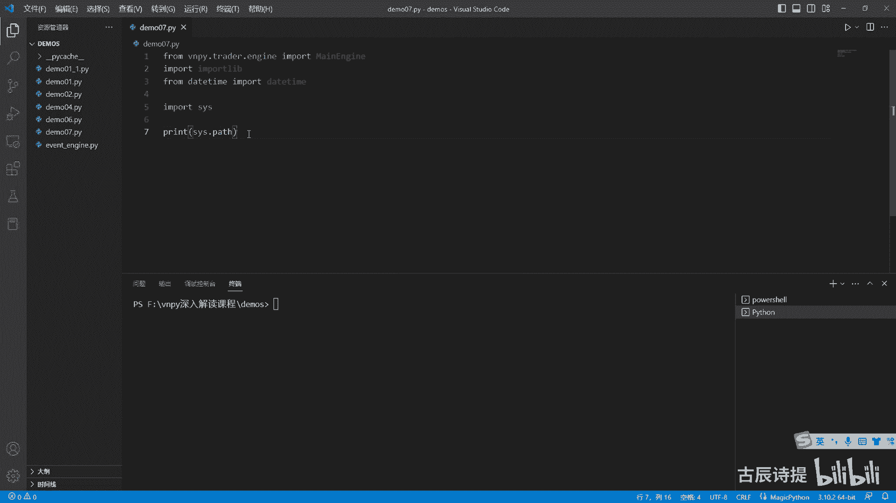

就在这个set packages里边，这个VNPYVMPY，这个呃c t a strange里边。

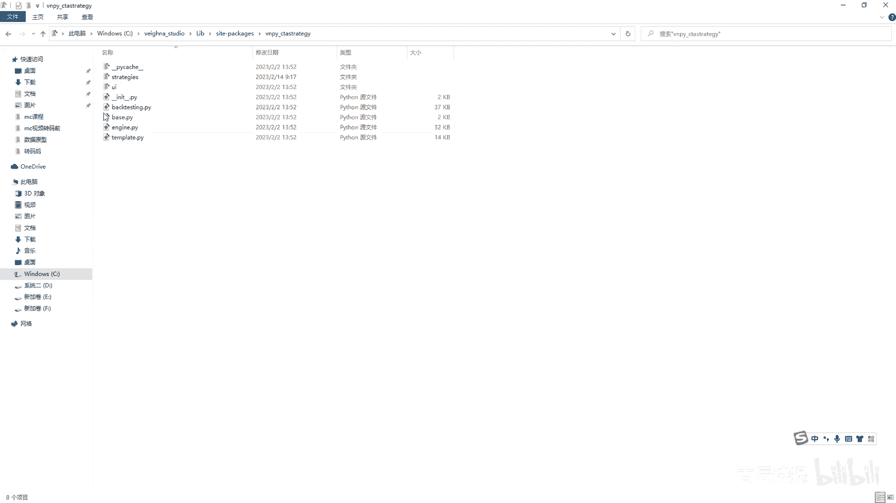

这个啊这个strange里面，咱们可以把这个路径直接给它进行粘过去，我从这导入一个from passlab，import path好，这个这个应该是float fl f o l d e r吧。

food就是文件夹路径，FPATH等于pass好，然后我需要前面加个R进行一下强转啊，不要让它进行转移是吧，不是强转啊，就是不要让它进行转移，然后我把这个路径啊，我我把这个路径添加进我的这个SYS点。

pass里边，pass点end或者insert都可以啊，你插入，比如插入第一个或者添加到最后一个都可以，这注意了啊，你一定要把它STR，因为这是一个类嘛，对不对啊，这是一个类。

所以说你要把它进行STR进行一下转换，Flow，Pass，这个时候咱们再输出一下这个SYS点pass，你会发现它就会添加进去了，就在就是最后一个，所以说这个时候你要去进行去导入的时候。

你就可以直接去找了对吧，直接去找了啊，当然这个你得用到动态导入，你不能说直接从这儿，比如说我import一个这个呃，比如说我from demon01啊，import啊，当然这你用demo音不太好是吧。

我从这把它这个demo01重命名一下，我就demo011吧好吧，我from demo011import一个啊，咱们可以运行一下啊，啊也行是吧，他不报错，但是你这样看着，如果说我这个路径给改变了。

那就是怎么办，是不是你需要一个动态的吗，为什么它是动态导入，你这么来操作，咱们可以看一下啊，实例化一下，然后我P我print一下这个P点P点啊，Name，咱们可以看一下ALEX，这是可以的吧是吧。

但是你这个代码看着稍微有点嗯呢，就是这hello给你报错，所以说你动态导入的话，你用这个import lib和这个import model，如何去进行导入呢，我是不是可以。

便利一下这个路径下面的文件是吧，然后我再从文件里边，或者我直接把文件导入进来，因为咱们你看啊，我不知道大家有没有这个一就这个疑问，就是刚开始学的时候，比如说我引爆这个the time。

你在使用的时候你会什么，The time the time，它会有两个daytime，为什么会有这个东西呢，为什么会有两个这个daytime呢，因为什么呀，你import这个daytime。

它其实是一个它是一个PY文件，里边会有很多的类是吧，你真正的就是说the time the time，它是一个就是他点后边那个daytime，它是一个类，对不对啊。

所以说你可以把整个的这个model给导入进来是吧，所以说咱们可以先遍历一下便利，怎么便利啊，就是flow f o l d flow price。

第2global group后边有个这个pattern patta是可以匹配，比如说我匹配一个星号点PY，就是我只我只去便利这个信号点，P点PY这个文件，比如说我这叫fires或者叫models。

我就叫fires好，咱们可以print一下这个fires，咱们可以看一下啊，这是个便利啊，会把里边都给读出来啊，当然得去得去便利一下啊，for m o u d l e s啊，for fire吧。

In fires，它是个生成器，你必须得给它举编译出来是吧，然后print一个fire，只有都有了吧，里边你看ATR是吧，布偶就是demo011，这就对了，这个时候我要什么呀。

我要他的这个名字就是demo011，因为这个时候我直接可以从string截子里边找，找到这个demo011了，对不对，我要这个名字，这个名字怎么样，就是怎么来呀，这个名字你可以直接点steam啊。

steam还是steam，我再进行一下print，咱们可以看一下啊，是不是全是这个名字了是吧，也没有后缀，也没有前面的，那你有了这个，你有了这个我是不是就可以直接进行导入了呀。

就是用什么import lip，点import model，然后把这个name给放进去对吧，把这个name给放进去，就是这个，那就直接把它全部给导入进来，你想想导入进来之后，它其实是有很多模块的。

里边会有很多模块是吧，那么有DLES等于models，咱们可以看一下这个print models，看一下这个DR吧，就查一下他的这个，电压你会发现这里边会有很多的模块是吧。

Armanage by data，因为从这里边它会导入ARMANAGE是吧，导入8data，所以说它会有很多这样的模块，那咱们进行这个模块的判断，因为我要找的是person是吧。

比如说我在这写一个s name，就是这个person，我要找的是这个，这个时候呢我可以进行一下判定啊，if这个sm in这个models啊，它这里边返回的都是这个就是这个这个呃。

不是这个in dr models，就是咱们刚才看的这个DR，返回的都是这个列表啊，它都是列表是吧，List，然后里边是street，所以说这是可以找的是吧，如果说他在里边的话，我就break啊。

然后我要保存下来这个models，但是这是在这个里边的是吧，在这个里边最好我从外边我也写个models，等于NN是吧，然后他这样可以防止它这个循环做完了之后，他就把这个models给释放掉了啊。

我给它保存下来是吧，这个models有了之后哎，如果说if models找到了这个models，咱们可以先print一下这个models啊，看一下能不能找到，找到了吧，demo011就就找到他了是吧。

找到他之后，咱们可以获取什么呀，获取它的这个它是一个模块，咱们要获取它的里边的属性啊，或者对象啊什么的，应该你应该用什么，应该用git htr是吧，然后object是models。

然后后边这个name咱们就是s name是吧，然后把这个给这个就是返回一个对象，那这个对象呢我用比如说S我来接一下，我来接一下，那这个对象是不是就是那个person类，是不是。

那我这个person类是不是可以直接进行实例化，比如说我P1等于S括号是吧，然后我再输出一下print这个P1点name是不是，然后我再print一个点P1点AG对不对，咱们可以看一下啊。

来运行运行一下是吧，Alex1000，这个你得搞清楚了啊，咱们再捋一下，首先我把我这个路径放到了这个s y s pass，它是一个临时的啊，它并不会永久的放进去，放进去之后呢。

它其实就可以直接从这个strangers去导入了，咱们也演示了，直接from这个demo011里边去import person，但是那个代码写的不是很好，而且如果说你这个路径变了会报错对吧。

所以咱们呢先去便利了一下这个fires，就是把里边的这个文件全遍历一下，这个点P文件去编辑一下，编辑完了之后呢，咱们挨个去这个呃导入一下，导入一下，然后看看里边有哪些东西是吧，有哪些对象。

然后咱们DR一下，然后如果说这个咱们需要的这个S在里边，我就直接break，就确认这个PY文件是咱们要的PY文件啊，但这个PY文件已经导入进来了，导入进来之后。

因为你这个import model已经导入进来，导入进来之后，然后我获取它里边的，就是说这个属性有没有这个s name啊，当然前面已经判定了，有有这个有这个s name，我就直接给它导入进来。

导入进来之后啊，也不是导入进来，是获取到，获取到之后，我给它进行一个实例化对吧，这个P1其实这个S就代表着那个person类，对不对，实例实例化完了之后，然后就是给他输出嘛是吧，就这么一个逻辑啊。

当然你从这也可以加以判断是吧，它是不是一个类，有可能它会导入，比如说咱们刚才看到的8data tic data，它是一个呃，也是一个类，但是它是一个数据类是吧，如果说你给他判定一下。

他是不是继承自c t template呀，是不是也可以，就是怎么判定，他看看是不是这个city template子类嘛是吧，是不是有这个is subclass，对不对。

然后你这个类比如说我这个是value1这个类，然后不知道我这个是value这个类，后，后边这个类比如说是c t template，我是不是可以进行判定。

这样就能找到所有继承自ccta template的这样的，你的这个策略了吧，对啊，这个其实就是咱们要说的这个CT引擎里边，他这个做的load strange class，是把所有的。

不管是你这个下面的strange字，还是你C盘用户下面那个选择，这里边所有的继承自CTA策略的，啊不啊，不继承自c t a template，这个模板的类给全部给导入进来，然后放到哪呢。

放到这个呃c t class is这个里边去啊，city classes这里边去，你看这有CD classes，大家可以先看一下这个就是它的整个逻辑，咱们下节课给大家再讲一下。

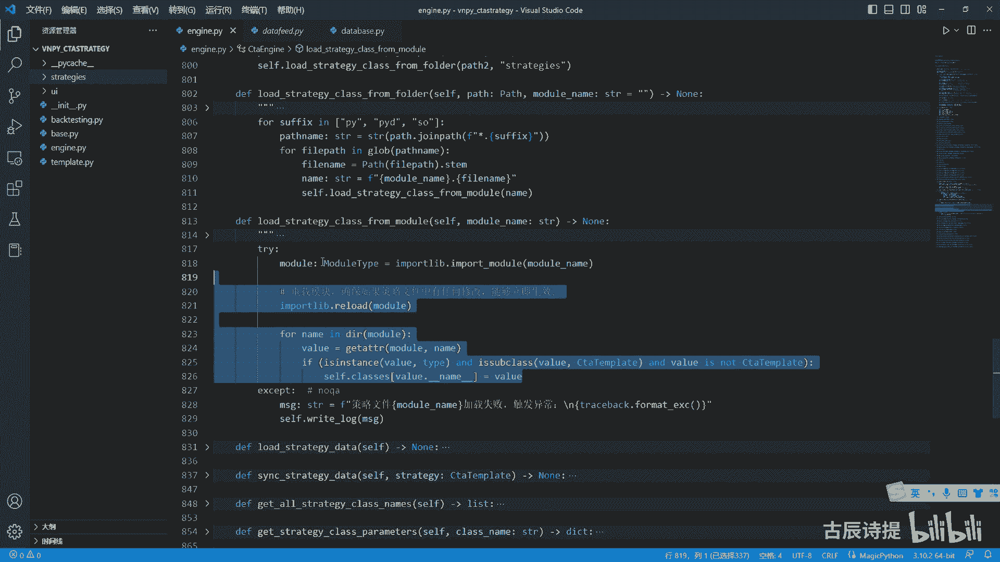