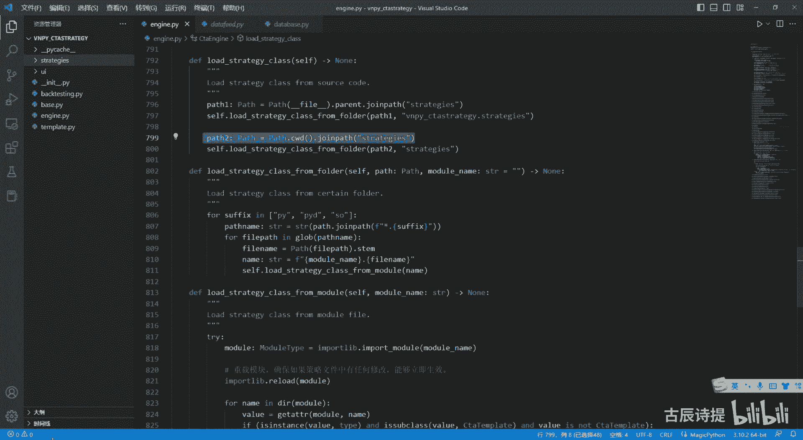
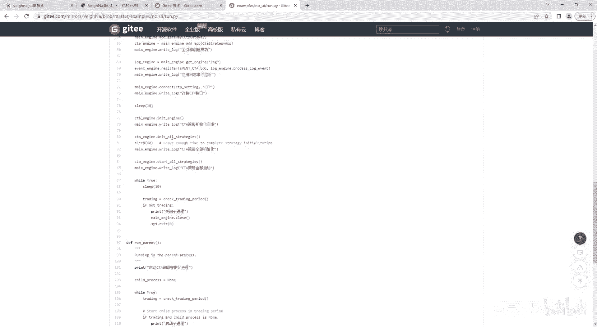
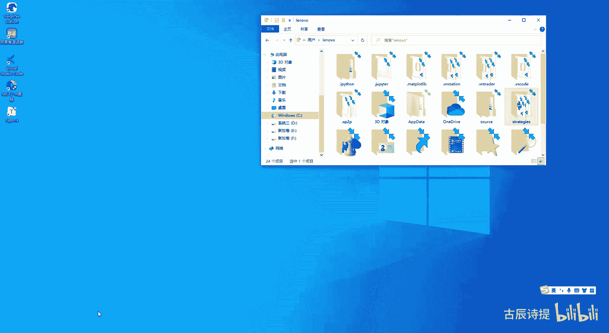
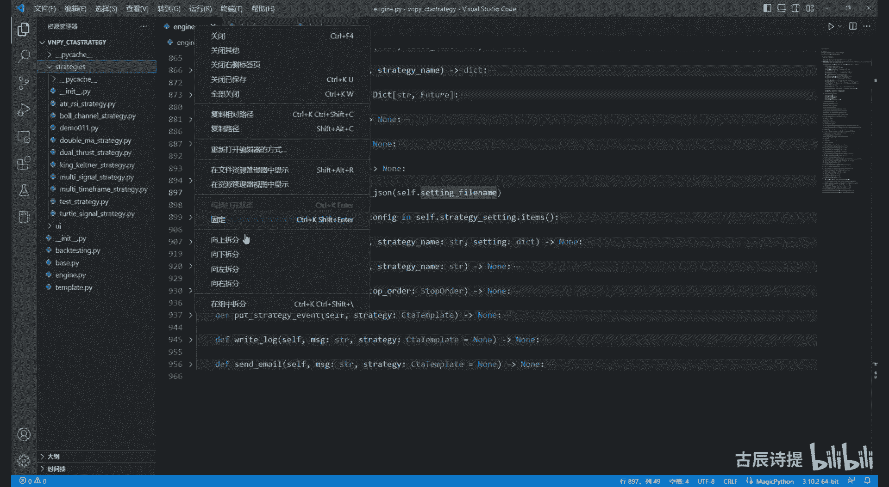
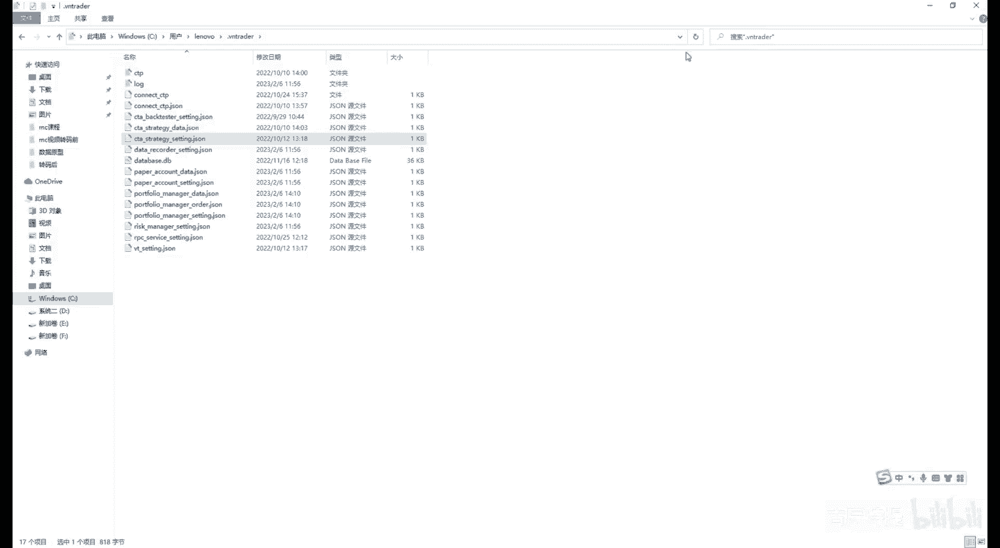
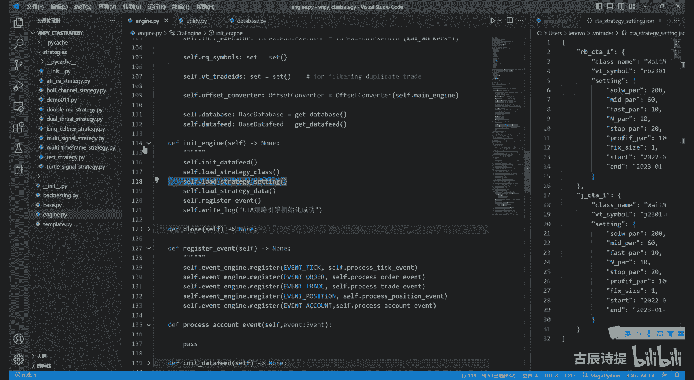
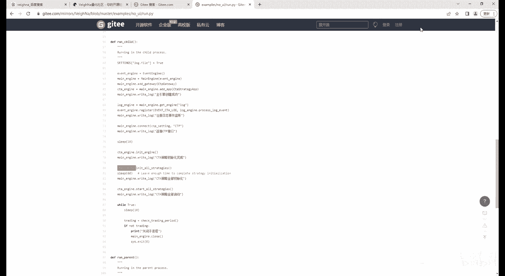
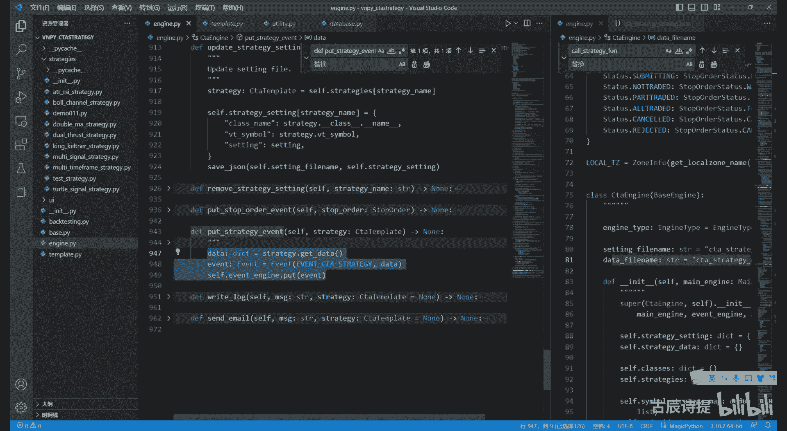

# 第8节课 CtpEngine讲解(2) - P1 - 古辰诗提 - BV1Bx4y1Y7WX

欢迎大家来到从零开始量化系列课程，VMPI课程的第八节课，上一节给大家演示了一下如何动态导入，那咱们现在去看一下，就是这个BMPY里面，它是如何进行动态导入的。

首先呢它是load strange class，咱们之前说过，他有两个存放STRANGES的这个路径，第一个呢是在这个就是这个CTA这个里边，然后他有个strange里面存放，另外一个呢是这个C盘。

下面就是administrator，那个下面有一个strangers对吧，所以说它它匹配的肯定是两个路径啊，第一个路径就是pass，刚刚file这个pass刚刚发表，其实就是获取这个文件的路径啊。

咱们可以给大家演示一下，08DNP了，好咱们进行下输出是吧，就是demo08吧，这个就是它本身的就是这个文件所在的路径，他点parent，parent就是它的上一级，它的上一级是什么呀。

就是VPICTA卷解，就这个文件加吧对吧，这个文件夹点joe pass jjs不就找到了，这对不对好，这是他第一个路径，咱们看第二个路径，第二个路径是什么，pass点CWD，pass点CW是呃。

CWD是什么呀，就是其实是获取这个就是这个文件这个model啊啊，不是这个floor，就是获取这个文件test c w d啊，进行输出是吧，就这个demons对不对，那问题来了。

他passage c w d，就是这个DE是这个VP y c t a strange，应该是这个是吧，但是得joe pass strange不是找到的还是这个吗，那他为什么会找到这个C盘下面呢。

好啊咱们需要看一下它的这个主引擎。

因为从这个里面看，它是来就是先创建主引擎的。

对不对，先初始化主引擎的好，那咱们看一下主引擎from这个VNPY点点engine，Import main engine，咱们先看一下这个主引擎，主引擎在初始化的时候，他做了一个动作。

就是os change dir tradr，这个是用来干啥的呢，好如果说咱们演示一下，给它添加一个啊，首先先print一个past c w d，然后OS点change c h a n g啊。

change dir好，这个里边呢咱们写一个pass home，pass home是什么呀，Pass home，咱们可以先print一下这个pass home，第一个是CWD，第二个是home。

home是什么UC盘，users就是用户下面这个the NOVA或者the ministrator，所以说你直接给他就是OS系统，Change dir，就是转换这个他的这个路径。

你这个时候再prompt一下这个pass，点CWD看一下啊，它就变成了这个C盘users lv了吧，对不对，他就转到这来了，所以说为什么从这能找到C盘下面，就是因为这个啊。

就是因为这个这个CWD可能有很多老板会问。

他是转到C盘下面吗。

咱们可以看一下，就是这个my engine里边他这个try dr try dr啊，当然这个一会儿咱们再讲这个吧，他转到的肯定是那个C盘下面好吧，肯定是这个C盘，下面咱们注意一下他的这个什么呀。

下面这个SYS点pass append，这个咱们之前讲过吧，也是这个try dl吧是吧，end这个try dre好，咱们一会儿会提到这好，咱们接着看这个好，这两个路径找到了之后的第二步是什么。

Load strange class from fla，FLA是什么意思，就是文件夹的意思啊，就是从这个就是文件夹里边啊，来载入这个strange class，就是这个策略类好，他是做了呃。

就是循环的嵌套，for suffer就是surface啊，这个怎么读啊，suffering啊，英PYPYD和SO这个三个呢，一看就是后缀名PY文件，咱们都知道PYD，咱们在之前讲的那个就是C加加那块。

给大家看的时候，他其实就是Python去继承，并不是继承C加加里边，而是继继继承的，他那个C加加生成的PYD文件啊，他其实是就是PY文件的这个二进制文件，然后这个SO呢它应该是这个嗯。

就是OS系统上面的这个就是这个PID文件啊，应该是啊，应该是，然后呢他这有个pass name，pass name其实就把这个传进来了，这个pass这个pass咱们说了是两个STRANGES是吧。

然后点joe pass这边有个星号，然后呢这个后边是他的这个就是说这个后缀名，然后这个globe globe咱们上节课演示过了，其实就是便利嘛，后边其实它是一个匹配是吧，匹配其实就是匹配两个路径下面的。

所有的以PYP，YD和SO结尾的这样的文件啊，都是来匹配的，这个好吧，这个应该能理解，上节课咱们演示过了啊，然后匹配完了之后，咱们获取到了这个steam，就是获取那个文件名。

其实这个时候这个file name就是获取到的，比如说这个a t r s i s strange是吧，或者说这个bd channels strange就是这个模块名是吧，有了这个模块名之后呢。

他后面又写了个name，就是把这个model name，model name是什么呀，传进来的，第二个参数，你想第一个传进来的是VMPY，这个c t s changes是吧，后边是这个呃。

再把这个名字给填上去，然后下面这个呢就是直接点，就是添就添加进去了吧是吧，这个name呢为什么要这样呢，因为什么呢，咱们上一节课讲的，咱们是先把这个呃SYS点pass里面去，添加的路径是吧。

但是从这咱们并没有看见它添加路径，那他动态导入是是如何去动态导入的，因为你没有添加路径啊，你得知道这个site package啊，咱们可以先输出一下这个demo，零八好。

import一个soy print，一个s y s path好，咱们进行输出本身啊，这个site packages就在这个pass里边呢，所以说他就能找到这个set packages是吧。

找到site packages，然后你向它是从v m p i c t s strange，点strange，然后再点一个这个file name，也就是说这个他是不是就能够通过这个路径。

能找到这个模块对吧好第二个他为什么呢，他为什么没有，就是说就是前面填一些东西，因为它不需要呃，它本身呢这个这个pass home，那个路径已经被添加进去了啊，什么时候添加到。

你从这儿看看不到哪个path home是吧，看不到path home，但是啊在这个咱们刚才看到这个utility，就是这个咱们看这就是XYS点，pass pastr trade de这个try的DL。

它其实就是那个pass Hope那个路径，它从这就添加进来了，呃它本身是写在了这个外部嘛，整个文件的外部，所以说你在导入这个稳健的，就是导入这个文件的时候，它会自己去运行这个代码。

所以说他就自己来导入进来了，如果说我从这啊from v m p y点，Trader utility，我import一个，我直接import一个load JSON，我都不需要使用这个方法。

我这个时候我再输出一个print s y s点pass，咱们看一下啊，你会发现，立本在这，你看最后一个它就有了吧，就是C盘下面users lnuver，我没导入它的时候，你会发现没有。

但是我一导入它就有了，因为什么呀，这些都是Python基础是吧，就是在utility里边，它你在导入的时候，它就执行了这个代码了，这个就是为什么很多咱们需要那个一下划线，下划线。

man等于下划线下划线name，这是为什么会有这个，因为你没有这个它导入的时候，它会执行这个代码的好吧，这个是Python接入，所以说他没必要再去把那个Python。

就是那个其实这个为什么叫path home，就是就是在那个LINUX这个系统里边，它是有根目录的，但是在windows里边，大家弱化了根目录的这么一个东西，但是呢嗯根目录它其实就是指的那个目录。

就是呃那个administrator啊，那个就是其实就是windows下面的根目录好吧，所以说他就没去，没必要去导入了，其实他已经导入进来了，对吧啊，已经导入进来了，好吧好。

那第三步就是load strange class from model，这个就是动态导入了嘛，只不过他加了一个就是错误，就是这个try except是吧，就怕有问题吗，好导入进来之后呢。

他reload了一下，这边有重载模块，如果说策略文件中有任何的修改，它会立即生效，然后这你看for name in d i r model value等于get a t t r。

其实这个value就是获取的里边的这个，具体的这个模块，就咱们之前给大家演示过，你daytime里面可能有还有DETA，还有date，还有time，对吧啊，还有这个time delete是吧。

都有就是挨个的去获取这个模块啊，然后进行一下什么判定呢，这不注呀，is instance它是不是啊，你这个是不是属于tape这个类，是不是属于type这个类，这个tap它是一个什么呀，咱们可以理解。

比如后面改成一个list或者这个dict，或者说你自定义的一个雷，都能理解这个tab是个什么东西啊，啊tap这个也是Python基础，所以建议大家听听那个Python基础课好吧，这个咱们一般定义的。

比如说那个咱们上节课定义的那个person类，person类后面没有写继承，但是他会继承什么呀，他会继承object吧，对不对啊，就是我从这儿我定义了一个类，比如说我就定义了一个process。

然后我没有继承，那我这个person它其实默认的继承的是object，这个类，对不对，你没写，它是默认就这样继承的，但是我问一下这个object，就是刚才写的这个object它是属于什么类型的。

咱们可以看一下，用tap进行输出一下，就是这个object object它是属于TAPI啊，object它是属于TAPI，所以说比如说我这个person啊。

我这个person如果说我print一下is instance，然后这个这个person是吧，然后是不是这个属于这个O呃，不是object type这个类true吧，所以说他的第一个判定的是什么呀。

他是不是一个类啊，它是不是一个类，因为只要是一个类的话，他就说他网上找不管你去继承什么，它的最顶上的那个类型还是太累，对吧啊，这个要知道type和object是一个互为object。

是就是type继承自object，然后呃tape继承自object，type是object的这个什么类型啊，这个你一定要知道啊，他们就是一个是先有鸡还是先有蛋的问题好吧。

然后这个是is subclass，就是是不是c t template的子类，其实就是有没有继承c t template，and这个value不是city template。

就是不是c t template本身对吧，其实就是判定你这个是不是一个类，然后他是不是继承的c t template一个类，而且是不是继承自c t a template。

且不是c t AC t a template本身的这么一个类，如果是的话，就给添加剂，咱们的这个通过这个value点下外纤维name啊，等于value这个相位，相位name是可以获取到这个类名的。

对吧啊，比如说我我print一个这个啊，person第二消费消防员，那，他是不是就是个person呀对吧，是可以获取类名的吧，这一点你也记住了，所以说为什么你写策略的时候，类名不能一样。

因为类名在这个cf点class is里边，它是唯一的一个标识啊，这就是为什么反复讲你的类名不就是不能一样，因为你类名一样的，它存放到字字典里边就是会被替代掉是吧，就是后边的会被会把前面的给代替掉啊。

这个就是呃这个原油啊，如果说有问题的话，他会给你输，给你输出一个策略文件，加载失败啊，触发异常，这个就是它的第一步就是载入策略，好前面那个unit engine是不是还没说完呢。

就是载入策略完了之后还有load strange sitting，这个就是加载这个参数，然后load strange data，其实就是加载呃变量的这个值对吧，这个其实就很好理解了。

就是往去读一个load jason cf点sitting by your name，self sitting fire name是指什么呢，我向右差分享。

Serve sitting file name，就是这个c t s strange sitting，就是当你去运行一遍呃，这个VNPY的时候，如果说你新建了一个策略，一般情况下都会在这个就是C盘下面。

用户这个点，vin china里面都会有这个c t s strange city是吧，而且他的这个。

格式是什么呀，就这个东西就这个是吧，你写的策略，这个是策略名啊，然后就是策略的啊，不是这个是你的策略实力的名字，这个是策略的名字啊，然后你所运行的这个合约vt simple。

然后下面是你的一些参数的设定，对吧啊，然后这个呢是data file name，就是city data，就是你的这个变量名，变量名就这个嘛也可以看一下啊，当然这里面没有啊，那就不看了啊。

Load jason，从这儿呢给大家讲一下吧，啊当然就是下面就是for strange name，Strange configure，然后in self点，因为它是个字典嘛，然后去。

Strange configure name，然后啊就是at strange，咱们再说一下啊，At strate，At at strange，就是for strange name。

Self distranges，如果说呃，就是如果说这个strange name在这个self jjj了，就是创建策略史失败存在重名，就是你那个名字就是唯一标识，你不能一样啊，就是这个东西啊。

这个东西就是就这个就是啊不是这个诶，诶刚才不是有了吗，cos没有，哦这是btester sexy city是吧，弄错了，应该是strange city啊，就这个东西RB啊，CTAE啊，焦炭CCTAE啊。

这个名字你不能重复了啊，然后如果说是他没有重复啊，这个他的这个strange class就是他的策略是什么呢，就是去这个classes里面去通过这个class name。

就是通过这个这个名字去找到这个策略，如果存在的话就没问题，如果不存在的话，就说这个创建策略失败啊，找不到策略类是吧啊，如果说这个点没有在这个vd simple里边，他也说创建策略失败。

因为这个vd simple你肯定得有点是不是啊，好，然后去获取到这个exchange这个STR，就是你的交易所的这个名称和你的这个simple，这个名字，当然只用这个下划线替代的，就是后面用不着是吧。

如果说这个exchange s t r not in exchange members，这个exchange members就是代表这个exchange这个数据类型，这个枚举类型里边所有的这个枚举值啊。

你可以去演示一下，我就我就我就不演示了，如果说这个交易所名称没有在这个枚举值里边，他就创建策略失败，本地交易所代码的后缀不正确，然后给你做了strange等于strange class啊。

就是说这个你找到了这个策略类，然后进行实例化，往后面传递这个参数对吧，这个也没什么好说，也没什么好说的啊，这个sitting啊是传递过来的，这个sitting sitting就是你在这个load啊。

string sitting的时候，你这个嗯就是生成的东西啊，对啊，At strange，这个是CLASSNAME，然后strange name，Strange configure。

就是这个合约的这个名称嘛，然后这边还有个setting，setting就是这个嘛对吧啊，给他给传递进来，就是进行实例化了啊，进行进行实例化了，然后其实后边就没什么了。

就把这个strange strange给它添加进去是吧啊，这个strange strange name等于strange啊，然后STRANGES他是个list啊。

就是这个存放到这个simple专辑map里边，就是放到这个vt simple里面去啊，这个这就涉及到了一个什么呀，就是就是这个数据类型它的一个存储，比如像这个你就是就是深copy和浅copy啊。

这涉及到这个就不多说不多说了，也也是这个Python基础里边的，然后在update strange sitting和strange event。

这个update strange sitting就是更新这个你的这个，就是你的这个策略里边的这个参数，就是策略既然已经加载好了，已经初始化成功了，他需要去把你的参数变成你这记录了。

这个参数其实就是update string呃，这个这个这个更新一下嘛，你可能你这个写的策略里边，比如说这个slop啊，是写了100是吧，但是你用你用在这个螺纹里面，你必须得用200。

所以说你得更新一下啊，就这个意思嗯，他这个update stress city啊，他这其实没有进行更新，更新是这个c t template里边自己更新的，这只不过是把它又重新啊。

弄了一份就是strange sitting，然后等于什么什么什么，然后save jason去保存了啊，他并没有从这儿更新啊，刚才说说错了，真正的更新是在这个c t template，它一个实例化之后。

它就update setting了对吧，他就自己来了啊，这个这个是你在界面上，如果说你把它参数给改了之后，他这有cf JSON到这，其实就是说策略就加载结束了对吧，策略就加载结束了啊。

这就是跟大家讲一下这个save JSON load jason啊，这个是CJON，一个是load JSON是吧，这两个给大家讲一下cf js，你想就是说这个咱们都知都知道，是创建一个什么呀。

就是就是去读一个JS文件嘛是吧，然后这边呢是dump，一个就是是去保存一个JSON文件，咱们主要是看他这个什么呀，这个JSON文件也是一些基础嘛，先判定它存不存在啊，然后如果呃不存在的话。

它就会直接创建一个空的JSON文件啊，创建一个空的JSON文件save JSON，然后这个file name这个file name是你传递过来的是吧，去会去创建一个空的这个JS文件。

所以说如果是没有这个JS文件，你可以直接就是说去搂了一下，然后他就会创建一个新的，最主要的是这个就是git fire path，get fire pass就是获取路径，路径存储很重要。

咱们都知道这个路径存储啊，都是存储在了这个点，Vin china，就是咱们那个呃administrator，下面这个点rain trader里边了对吧。

那这个get fire pass它就是什么turn tap dr joe pass，其实最主要的还是这个TRADR和tap dr啊，就是要知道try dr和tab跌啊。

你就得知道这个下划线get踹着跌啊，好咱们看这个好，咱们看一下它的逻辑，CWD就是passage c w d这个这个CWD啊，咱们应该就知道了嗯，就是如果说他没有进行os change dr的话。

它就cw da应该是这个这是吧，应该是这吧啊不是整这个文件不在这个里边，应该是那个VMPY是吧，咱们是从那个VMPY呃，点trader，点utility啊，就应该是那个就那个那个那个trainer。

那个文件夹对吧，但是呢他转过来之后呢，其实这个就成了这个pass home，对不对啊，就成了这个pass home了对吧，好这个time pass等于就是说这个cw d点joe pass。

点tap name，这个time name是什么呀，你看这get trade deal是点being trader，其实这个路径就变成了，就是说那个咱们的这个路径了吧，嗯就是这个路径了吧对吧。

咱们可以给它写到这就变成了这个路径了吧，是对不对啊，如果说这个他们D就是就这个路径存在的话，它就返回cw d和TP就把这个给返回了，那其实就是try的DA就是try的DR，就是这个是是吧。

然后这个tap dr就是这个对不对，又返回了啊，但是如果不存在的话啊，如果不存在的话，不存在的话，它就做什么呢，就是home pass呢就等于pass home，其实还是这个是不是。

如果说呃呃就等于这个，然后他们pass呢就还是等于这个是吧，然后如果说这个不存在的话，就是这个路径不存在的话，它会Mac dr就是创建一个文件夹嘛，就自己就给你创建点别china了是吧，然后再唱。

那他为什么需要会需要加前面这个，那他为什么会需要加前面这个代码啊，前面这个代码其实是给你做什么用的呢，就是说如果说你要就是就是多个策略啊，多个这个接口的话，你想把它分开来。

就是不放在呃这个这个这个就这个路径下面，或者说我想自己来，比如说我从这个F盘，这我从这儿我想新建一个，比如说这个就是trade啊，G a d trade，然后呃重命名一个trading吧。

就是正在交易啊，就是我的一个train文件夹，我想把呃这个，把我所有交易都放在这个文件夹下面，然后呢，比如说我新建一个账户，比如说账户一，啊账户一，然后呢新建一个，那你账户账户是吧，上面那个写错了。

我就不改了，然后我就把它放在这两个下面是吧，我账户一我放这，然后我从这我新建一个文件夹，然后这边找点win china，点win trader啊，然后我从这个下面呢，我页新建一个文件夹。

点win trade，是不是我如果在它下面，如果说我通过这个代码，你像这个CWD，如果说我在这儿的话，我找的这个CWD就这个路径吗，我不给他转啊，我我先不给他转这个OS前几DR呢，我不给他转之后。

我从这就是说来去获取的话，它的CWD就是这个路径嘛对吧，这个路径之后，然后他会去找是吧，去找去找去找什么呢，去找这个，比如说我是这个路径了啊，啊写写字吧，我变成了这个路径，我变成这个路径。

你看CWD点就pass，是不是把这个点win china，它也过来了是吧，他找这个诶，他找这个路径如果存在的话，这个点问出了，如果存在的话，就return了这个和这个是不是return这个就是这个东西。

然后后边这个就是这一整个的对吧，这样的话其实就可以实现啊，就是说你把这个账户分开，然后不是只是固定在这个pass home那个路径下面，比如说这个你有两个账户，你就完全可以隔离开对吧。

你所有的load JSON呢，包括这个get fire pass save jason啊，你的路径都会取到，这都都会取到这是吧，这样的话就成了一个，就是多账户的这么一个操作啊，多账户的这个操作。

这个在我的这个就是Python，就呃就是哔哩哔哩那个课也讲到过，详细的讲过，这呢给大家提一下，所以说这个以前不是这样的，以前就是只能去那个C盘下面啊，现在是加以改进，但是你这你这如果说你想把它。

就是按照我刚才说的，就是就是就是这么来操作的话，一定要注意你my engine里边你不要给它去OS点，can you dr啊，一定要记住这一点，好吧啊，这个是很有用的，你一开始做的时候。

你可以这样来写啊，当然更建议大家用这个RPC，就是那个就是RPC服来做这样的操作啊，好咱们再看后边，Load strange data，其实就是载入这个就是策略的这个变量是吧，好这边是strange嗯。

就直接它是一个self distring data，然后这个node jason他没有现在去加载好，这个就是啊，还有个register，Mit regiment，咱们之前讲过。

就是你在就是gateway这一段肯定多是put，就往里边去放数据，那你到了这个CTA这个引擎这段，你肯定是去注册是吧，Register，然后去接收数据，更多的是这个啊。

Take order trade position，你会发现这里边没有account啊，如果说你想去接受com data的话，你可以在这下面写个什么呀，Their image engine。

Their register invent account，C c o u n t account，你需要导入一下，导入一下之后，嗯就这，然后你需要写个策略，就是cf点啊，不是要写个方法。

Self process process，account event是吧，然后你还需要定一个df process account event，你接收的是一个event event是吧。

然后啊我就不写了啊，这个怎么处理，就是你你如果说想获取你的这个com data的话，你需要从这儿来接收一下啊，接收一下，然后再传到这个那顶层去，就是这个c t template，就是这个你的策略里边啊。

这个注册也没什么好说的，那这个就说完了，in engine里边比较麻烦一点的，就是这个load strange class是吧，load strength sitting其实不复杂好。

那咱们再看一下它这个init engine完了之后啊，这又来了啊，C t a t all strangers。

In it，all strangers就是初始化所有的策略，咱们可以看一下啊，Init all strangers，i need to defeat在哪，这it strange in it。

All stranges，这呢是吧，一定是all stranges，他是什么呀，For strange name，Self their strange kiss，就是所有所有的这个策略去编辑一下。

然后futures啊，strange name等于self init strange啊，就是又掉了这个方法，咱们再看看这个方法，转到定义，现在不是特别的好使，In its strange，In it。

strange在这呢是吧，它返回一个是调用了这个线程池，然后submit其实就是线程去执行这个INIT，Strange，就是下划线，init strange这样的一个方法啊，就是主要操作是在这个里边的。

咱们可以看一下啊，就是看看它里边究竟做了什么，首先strange找到啊，这个策略是吧，先找到策略，如果说strange已经初始化了，它会告诉你已经完成初始化了，禁止重复操作，然后就return了。

如果没有进行初始化，然后他会告诉你CD log开始执行初始化了，就是这个策略名字开始执行初始化了，它会啊。

cos strange function就是cost strange function是做什么呀，咱们从这儿来吧，老是过不去，Cos function，就是其实就是回调策略的里边的方法。

这儿呢CORE strange function它也是一个就是try except，就这样的一个方式写出来的，你看它的参数啊，第一个是这个呃，这个strange就是t template。

第二个呢是这个function就是COLLAB，这个咱们反复讲的就是可回调的，第三个呢它是一个参数，然后就是复制为N，如果说有这个参数的话，它会function是吧，如果没有的话，就直接进行回调啊。

直接进行回调，如果说出问题的话，就是strange training force，the force就是触发异常已停止对吧，但是这个不影响别的策略的运行，它其实就是你想这个strange。

就是它的这个策略名啊，就是这不是不是策略平衡，就是它的策略，然后strange on in it，就是在这个时候调用了你的strange里边，on init这个方法。

这个方法在INIT里边大家一般都做什么呀，大家一般都会下载数据吧是吧，就是这个city template，就是on init，这里边一般都会去下载数据吧，对不对，你肯定得写的啊，你得下载数据了啊。

这个city tt咱们后边还节课给大家讲一下，好data等于self strange data，点get strange name，然后啊if data其实这个是什么呀，是在这个咱们刚才已经载入好的。

那个strange data里边，去获取这个属于这个类的这个数据，就是这个变量的数据，然后如果说有这个数数据的话，它会遍历，然后这边是负值，CATTR是负值吧，全解啊。

name value就是这个对象里面啊，这个属性复制成这个呃value值对吧，这个是data get去获取，这个，就是有没有这个就说这个对象或者这个属性嘛，啊这个属性其实这个没什么好说的。

就是挨个去给这个你的策略的这个变量，这个属性去赋值啊赋值，所以说如果说你在INIT去load data，就是下载数据，然后呢数据加载这个后，就是咱们讲city template的时候。

肯定会反复给大家讲，on init会下载数据，就是load data，然后去载入数据之后呢，它会便利你的那个on b，或者说你需要去便利的这个什么，就是你的这个在策略里边的这个方法。

那个时候其实你的变量已经有值了，然后从这儿呢又重新给赋了值啊，这个就会产生问题，如果说你的策略没有实事，比如说我今天开了，不是我昨天没开，今天要开的话，你这样来运行的话，其实你加载的那个变量。

其实还是昨天的变量是吧，只有当你运行了，比如说你把尾部的那根K线好，我再给他打，我再给大家讲一遍啊，一般情况下咱们会在own init里面去下载数据。

你像咱们看这个template init里面去下载数据，下载完数据就是一般都是load by data，Load by data，就是load data，这个里边有load data。

啊就是这个load bload bar，咱们先不仔细看，最后呢会for buying bus，call back bug啊，call back吧，call back是什么，self on bar是吧。

如果没有call back的话，其实会毁掉你策略欧巴，你这个时候呢，你的这个参数里边，不是你的这个变量里边已经有值了，这个时候你再给它重新赋值，会把前面的值覆盖掉，这个会造成什么影响。

比如说我原来啊我昨天没开，前天开了，比如说我这个是一个这个30日K线，我前天开了，昨天没开，那昨天呢你记录在这个strange data里面，因为它是留留存在本地的嘛，并没有更新。

然后你在这就是在策略里面进行操作的时候呢，已经把这个值，比如说它是130K，现在它的值是100，然后你从这又复制了一下，比如说你记录的是98，然后他会给你把这个100给你覆盖掉。

这个时候你呢其实这个变量是不准确的对吧，变量不准确，那你在打开程序去运行的时候，除非就是这个有更新了，因为这个里面存储着的这个30日K线，他的这个比如说收盘价是在这里边，只有你把就是呃。

第一根就会就是最末尾那一根给替换掉了，它才会重新计算，它才会更新，如果说你是日线的话，你永远就是呃你当天是更新不过来的，你只有当天保存完了之后，第二天啊，就是下一个交易日你才能更新成正确的。

所以说这一点你是需要注意的，最简单的解决方法，如果说你中间有一天没开，最简单的解决方法就是你把那个就是t strange，就这个文件给删掉，就是这个文件给删掉，然后让它重新的去生成最简单的解决方法啊。

那为什么会出现这种情况，代码其实就在这儿啊，好contract就是获取这个contract信息啊，咱们这个就不用说了是吧，如果说有这个contract，你看它会订阅订阅行情。

就是你这里边有哪些就是这个wait simple啊，他会去订阅去是吧，从哪订阅啊，就是订阅的这个要求IQ从哪订阅，就是contractor gateway name。

你看gateway name就很重要了吧，对吧啊，这是订阅行情，因为你得把这个行情给截过来啊，slog行情订阅失败，如果说没有这个contract的话，它会报一个错，就是给你输出一个航行订阅失败啊。

下面就是strange点unit，就是初始化已经完成了，然后小点put strange，Invent right log，这个put strange MIT，它是什么意思啊，这个怎么弄，过不去了。

有可能是开机时间长了，好这个put it strange event，它是什么呢，就是data就是strange点get data，这个get data就是其实是获取这个strange的。

一个整体的信息，你的策略了整体的信息，然后把它作为一个in事件，然后放到一件里面去，他这是做什么的，其实是最主要是为了更新这个界面的，就是你strange已经输入了成功了。

那个界面上会给你更新一下输入法成功了啊，就是干这个用的好吧。

包括他的right log，他也会把它放到这个呃，cf点image engine里面去，放到事件引擎里边去，他最后这个red log是从哪去接啊，就是用那个log engine来接啊。

log engine可以同时在这个界面输出，然后啊还有这个日志保存啊，可以一起好吧。