# 第8节课 成交量相关关键字、实时行情报价 - P1 - 古辰诗提 - BV1WT421i75M

欢迎大家来到从零开始量化系列课程，MC课程的第八课，这节课呢咱们接着讲关键字，商品行情里边的关键字啊，该讲到这个成交量了，MC里边的这个成交量，他为了适应各种各样的合约以及品种呃。

他设计的相对复杂一些啊，就是他的计算成交量的方式呢有两种，第一个是交易量，第二个是成交的比数，这个应该比较好理解，交易量，他的意思就是说我从这儿，比如说我开了一手多单，然后对方开了一手空单。

这个期货是零和博弈对吧，他肯定是你有一手多单，肯定必然会有一手空单跟你对应着的啊，所以说期货里边挣钱，就相当于从别人口袋里边去抢钱啊，所以说他会比较残酷，那这样的话我的交易量就是什么呀，我这边加一。

然后那边也加一，整体的这个交易量应该是加二对吧，它是一个双边计算啊，如果说我这边开了两手多单，那边开了两手空单对吧，然后我这边交易量应该是加二，然后那边交易量是加二，那整体的交易量应该是加四。

这个很好理解吧，啊这就是交易量，不管那边是开的还是平的仓位，不管我这边是开的是平的仓位，只要有动作，我就增加相应的手数啊，当然我们俩假设被撮合了的话，他那边是空仓，我这边是多仓是吧，额这样不就撮合了吗。

撮合的话我这边交易笔数其实是一笔，那边也是一笔，这样的话交易笔数应该是加二啊，这个很好理解吧，你说它有什么用，咱们一般都是用交易量来进行做这个成就，是这个成交量的计算方式，当然也有用这个成交笔数的。

就比如说我在看呃，比如说我做的是股票啊，如果说有人从市场上买了1000股，假设这1000股比较多啊，当然在实际上它呃不算多对吧，从十个人手里买的买的100股是吧，是就是说每一个人里边是100股。

那这边的就是说这个呃，就是这个成交笔数是一比，然后这边的成交笔数是十比，当然你看他的总成交笔数11比，这个好像没什么太大的作用，但是如果说我把它分开来，因为这边股票嘛你只能是额就是单边的。

这边肯定是开的是吧，是开仓，然后这边是平仓，如果说我开仓量是一，平仓量是十，那就说明要么是公司在回购股票，然后让股票这个价格稳定，要么是有大的，就是机构或者大的这个呃资方，来进行这样的操作对吧。

因为你是一对多嘛，这样就能看出一些东西出来，对不对啊，这是我的理解啊，所以说这个里边也涉及到了一个叫开仓量。

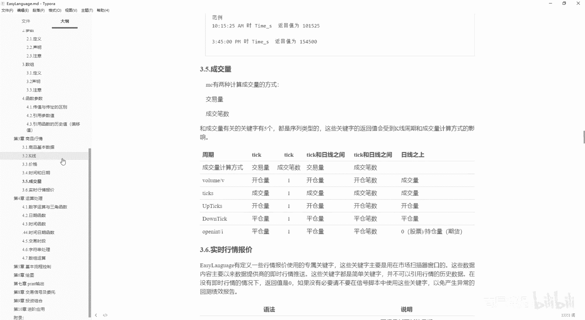

还有一个叫平仓量啊，在咱们之前看这些啊，就说这个数据的时候，就是看左边的数据的时候，其实日期时间看左边啊，日期时间价格包括SHF1。2B零零，这些咱们都能理解，包括下面的开高低收，咱们也能理解。

总成交量罢限编号也能理解，但是上涨量和下跌量，是不是就是一直不太理解它究竟是个什么东西，对吧，就这个上涨量和下跌量，你仔细看它啊，上涨量和下跌量和总成交量是个什么关系啊。

上涨量加上下跌量就等于总的成交量，在这上涨量你可以理解为期货里边，不管是啊别的里边你可以理解为是什么呢，就是开仓量，啊就是开仓量，下跌量就是什么呀，平仓量，当然把它用在期货里边，可能不是那么特别的贴切。

这个名字命名呢不是特别的贴切，如果在股票里边，你如果开仓量比较多的话，它有它大概率它会上涨对吧，这只股票开仓量多就说明买的人很多，然后这个平仓量如果多的话，它大概率会下跌，因为大家都不太看好它对吧。

但是在期货里边呢，这个开仓量和平仓量，它这里边就涉及到你开仓是开多呀，是开空啊，开多层啊，还是开空仓啊对吧，你应该是这两个数值的相加，平仓量呢就是平多和凭空的一个，相加对吧。

你把开仓量和平仓量一加起来就是开多仓，开空仓加上平多仓，平空仓，不就是所有期货里边的操作吗，其实就是成交量嘛对吧，这个你要捋一捋啊，开仓量平仓量你就把它理就是这个上涨量，下跌量。

你就把它理解为开仓量和平仓量，这个理解方式不是说他官方这么定的，因为你去查这个几个相关的，跟成交量相关的这个词，里边，没有对于上涨量和下跌量的一个详细的描述，这是我自己总结归纳的。

当然我也查了很多的资料，这样的总结和归纳，我觉得是最贴近的啊，最贴近的当然不能保证百分之百的准确，只是为了让大家来理解好吧，来理解再说一遍，开仓量就是开多仓和开空仓的呃一个总和。

然后平仓量就是平多仓和平空仓的一个总和，如果说你非得去计算一下的话，你会发现开多仓其实就是买开，咱们正常里边去理解的啊，开空仓就是迈开对吧，麦开，然后平多仓就是平多仓，就说明我有多仓，其实就是卖平。

就是把东西给卖出去卖平对吧，然后呃凭空仓啊，凭空仓，那么它就是什么呀，我有空仓，然后我再买进来，其实就是买平对吧，你这里边相加其实就是最终是什么嗯，买开加卖开加上卖平加买平，其实就是买开和买平。

加上卖开和卖平，买开和买平其实就是买，咱们一般都用浪，如果说你用那个用过委委纳的话，就是买就是浪是吧，然后如果是卖的话，就是short s h o RT啊，其实就是买量和卖量，买量和卖量相加。

它不是就是成交量吗，对不对，买量而且和卖量肯定是相等的，因为一开始说过，咱们期货里边它是零和博弈，买量和卖量肯定是相等的，你既然能买到，肯定是有人卖给你啊，这个你捋一下，不要乱在这里边。

上涨量和下跌量就表示的是开仓量和平仓量啊，开仓量和平仓量，因为他俩是不相等的，他俩是不相等的，然后总成交量是他们的相加，你不要把它和买量和卖量给混淆了，因为如果说你很直观的去理解期货的话。

期货里边不考虑开平的话，完全就用买和卖就能解释它对吧，你这个开多仓其实就是买买东西，你这个开空仓其实就是卖东西，然后你平多仓我是有这个东西，然后卖出去也是卖，然后凭空仓是我是要把东西买回来对吧。

然后也是买啊，凭空仓就是我原本开的这个空仓，我现在要把这个空仓给填上，然后就是买回来吗，对吧嗯这个希望你理理解了啊，理解了这个咱们后边这个才好说好吧，才好说这个几个呃。

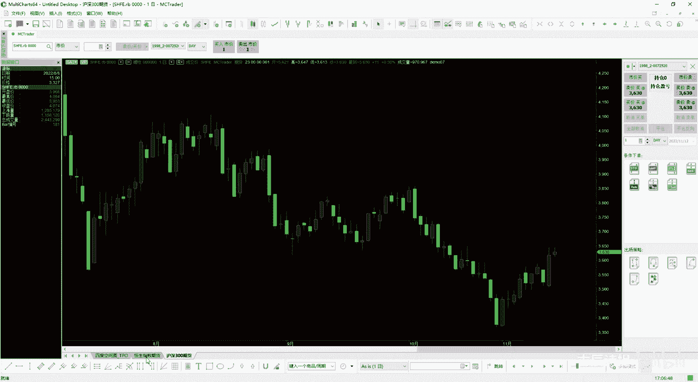

跟这个成交量相关的这个关键字啊。

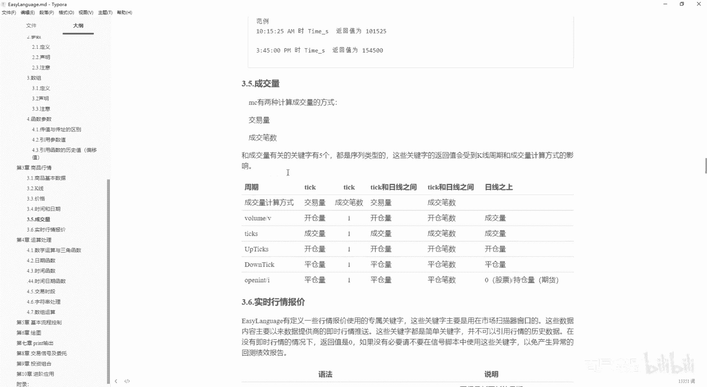

才好说呃，刚才给大家演示过他这个什么了吗。

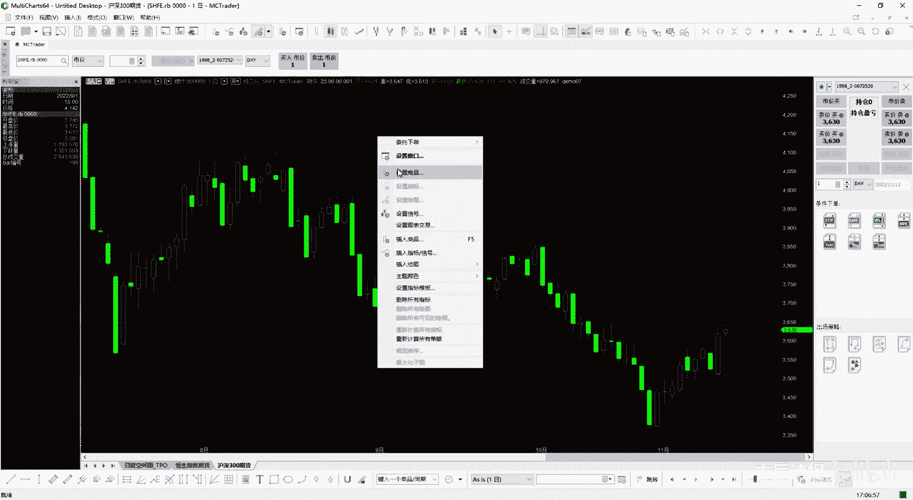

就是在这个商品里边，他成交量基于交易量和成交比数啊。

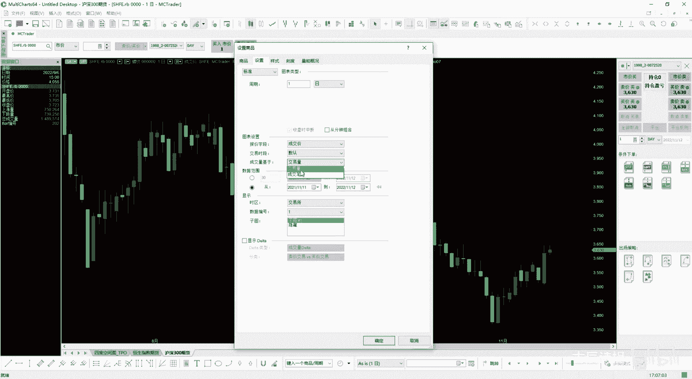

一般咱们都有交易量啊，哦然后跟这个相关的这个关键字有五个，这个volume tics optics和DOTX，还有open in it，Open in it，建议大家呢用TX。

因为TX不管是在哪个周期里边，不管是基于成交量还是成交笔数，它都是代表着这个成交量啊，都是代表着成交量，当然TX如果说是在这个用成交笔数的话，它会在tick里边会返回是一啊，会返回是一呃。

当然一般咱们不用成交笔数，所以说成交笔数你就可以不看了啊，TX不管是在TIK周期还是在其他周期，所有周期上，它都表示的是成交量啊，成交量咱们不看这个成交笔数啊，都是表示的成交量啊，但是如果说你用别的。

尤其是咱们如果用过维纳平台的，就知道，一般都会用volume来表示这个成交量，但是volume在日线之上啊，包括日线，它和这个TX是一样的，代表成交量，但是在日线之下，它是代表的是开仓量，开仓量啊。

volume是代表开仓量，然后optics呢是表示开仓量，就跟咱们那个上涨量啊是一样的。

就是上涨量，就是这儿的这个啊上涨量是一样的啊。

表示上涨量，然后当TX呢是表示呃就是平仓量，也就是那个下跌量是一样的，如果说你想理解这个up和down呢，你就把它比作为股票，如果说开仓的人多了，那就说明这个股票要涨，如果说平仓的人多了。

就说明这个股票要跌，因为他是一个单边的，但是你不能去完全理解期货上面，因为期货上你这个涨与跌你得看什么呀是吧，你还得看凭空和平多的这个量呢，对不对啊，一般如果说是啊，放量上涨，说明大家都看好。

就是说这个就是说这个品种会往上走是吧，如果放量下跌，会看好这个品种会往下走啊，然后open unit呢，然后它跟下面这个open interest，Open interest，你去查一查这个单词。

它其实代表持仓量的意思，在日线上啊，在日线上他是代表持仓量的，就是日线或者季线什么的，至上的月线，周线它是代表这个持仓量的，但是在日线之下这个小周期里边它是代表的，它是和平仓量一样的，它不代表平仓量。

但是它跟平仓量的值是一样的啊，然后这个volume在这个日线以下这些级别，它是和开仓量的值是一样的，你怎么理解呢，就是volume如果说是用股票单边的话，你这个开仓量其实啊。

就是代表着你这个持仓量的一个变化嘛，对吧啊，就是代表着我持仓量的一个变化，我开仓了嘛，然后如果说我平仓量，就是你代表着我就是持有仓位，只有我有仓位了，我才能往外平啊对吧，就是他持有仓位啊。

其实就是平仓量，它的这个值是一样的，只有在日线上，它能其实能代表咱们理解的这个意思，在日线之下，你就用TX就可以了好吧，你就用TX就可以了，好咱们做一下这个演示给大家看一下啊，我新建一个信号。

然后demo08好，我print print什么呀，第一个是这个volume是吧，word冒号啊，然后逗号word a，Voll，然后加上空格，然后第二个是TX，第三个是up，Optics。

然后第四个是呃DTX，还有个个open int是吧，好咱们分别在几个周期里边看一下啊，我先编译一下啊。

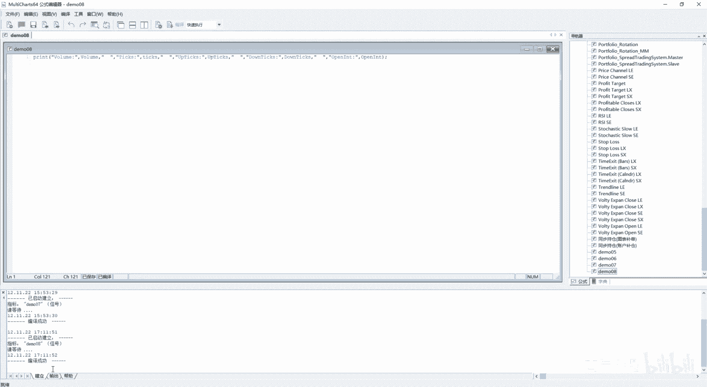

编译成功了，然后我在这我先设置信号，我把之前的这个零七删掉，然后增加demo08，然后给他的属性设成十啊。

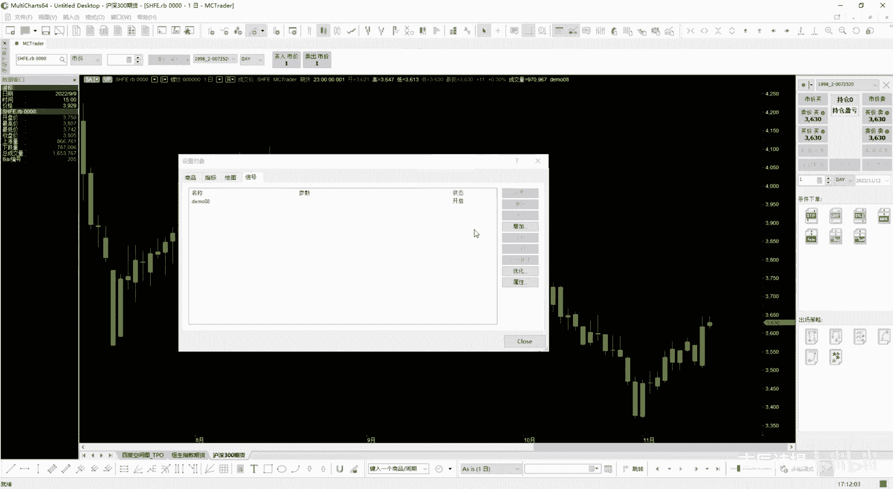

没有问题，然后这个是一日的日线周期的啊。

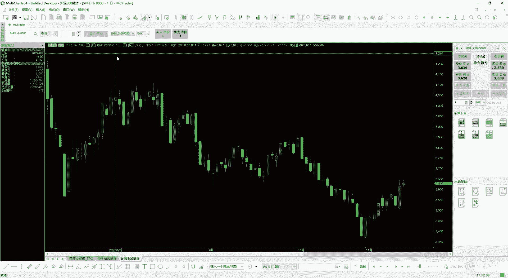

日线周期咱们看一下输出的他这个volume330，这个是吧，应该是跟这个tick是一样的啊，应该是跟TX是一样的，open int其实代表的是持仓量，在日线级这个级别以上，它不跟当TX。

也就是这个平仓量和这个up tics，以及就开仓量俩都不一样对吧，optics加上当TX就是开仓量和平仓量相加，应该等于持仓量，你看一下啊，它的尾数6+2，其实是等于八的是吧，这个没有问题啊。

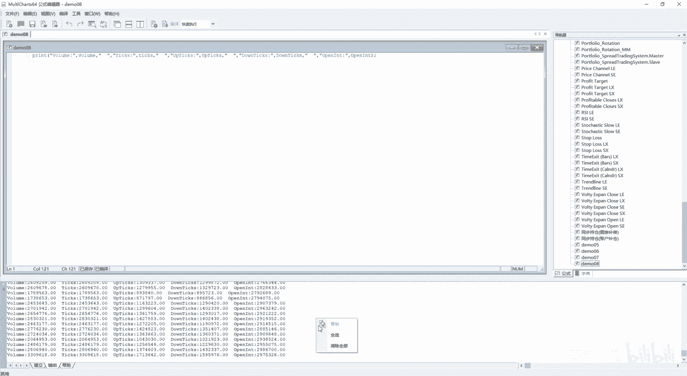

好咱们再设置一下商品，咱们先看一个tick，一笔tick，要看一笔tick的话，咱们就把时间设短一点。

11月啊，这个可能时间还就是一天两天嘛，两天啊，他在回补，咱们可以等一下，这个时候你不要去点它，你点它你也点不开来啊，你点它你也点不开来，因为tick的数据量它会比较大一些啊。

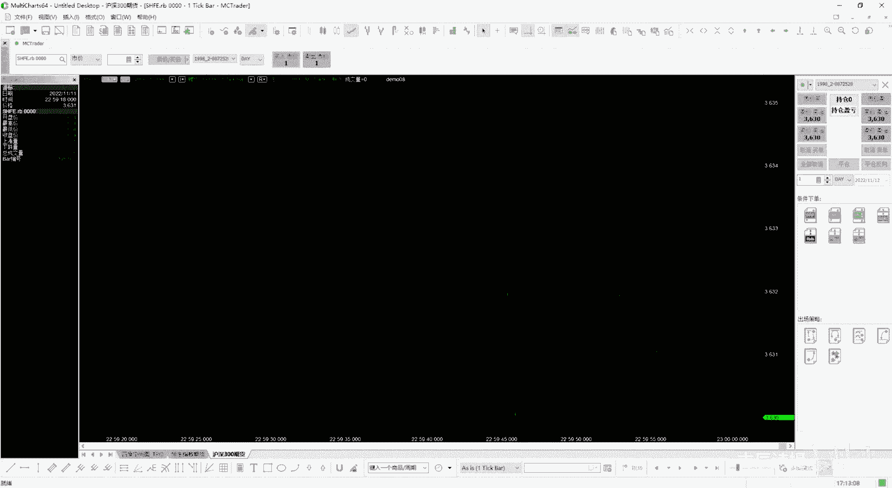

tick数据量会比较大一些，好了等了一会儿，然后我又给他换了个合约，因为这个数据不太好获取，可能这个数据量比较大。

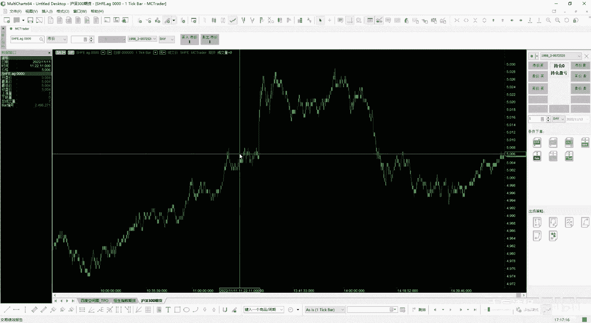

然后我就用了一天的体格数据，然后我再把这个信号打开一下啊，状态开启一下。

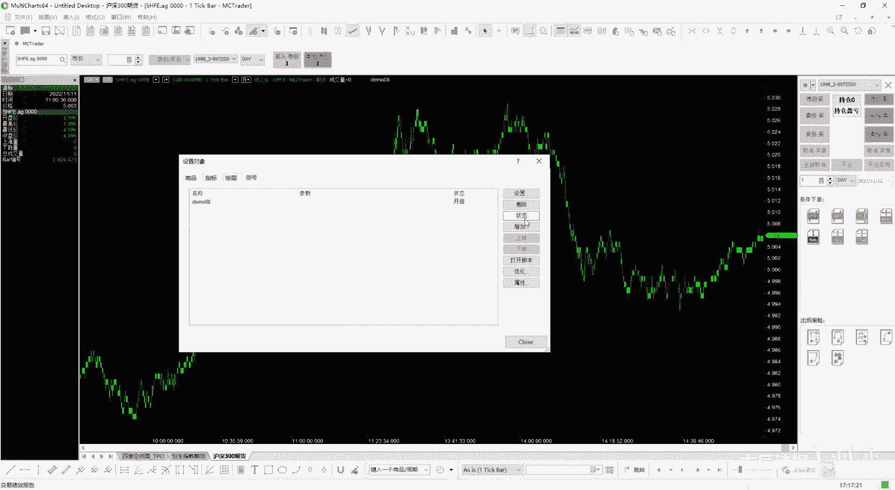

然后咱们可以这个时候你点开你又点不开它了。

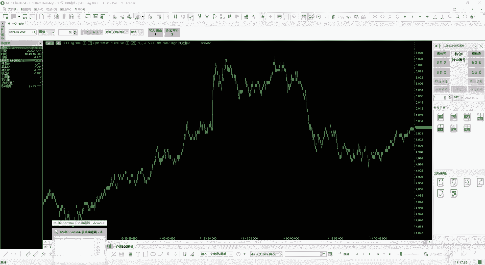

它在计算啊，还得稍微等一下好了，现在有了数据了。

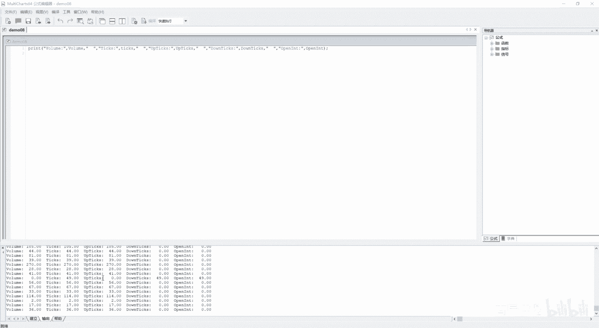

可能是我这个笔记本的过，它运行起来速度不算快，这是tick的。

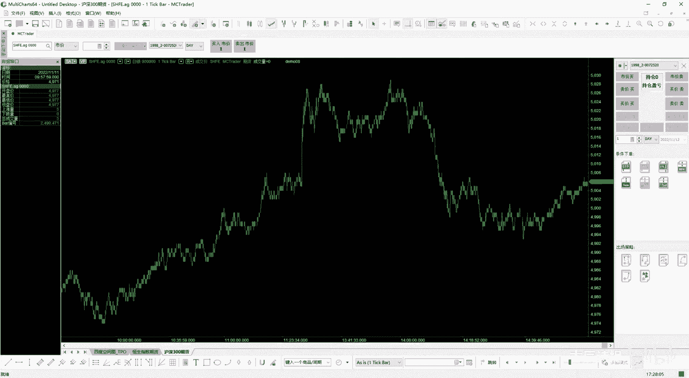

然后咱们可以看一下他的这个volume，和这个ticks啊，它是一样的，但是呢他也跟up tics是一样的，嗯就是其实他这个volume是指向的这个optics，然后open init是指向的DOTX。

你会发现这是吧，是一样的DOTX，然后volume是指向的这个optics，然后这个TX呢是其实是等于OPTIX，加上当TX啊，但是他是零嘛啊好了，日线和T克级别的。

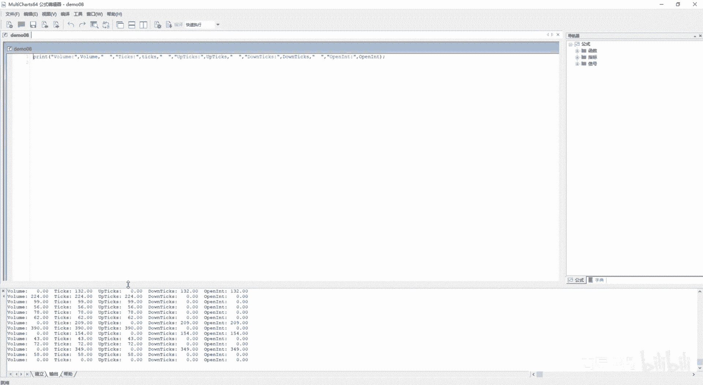

咱们看过了，咱们再看一下他的这个分钟级别的，就是tick和日线之间的，我还是给他设成5分钟吧，然后30日。

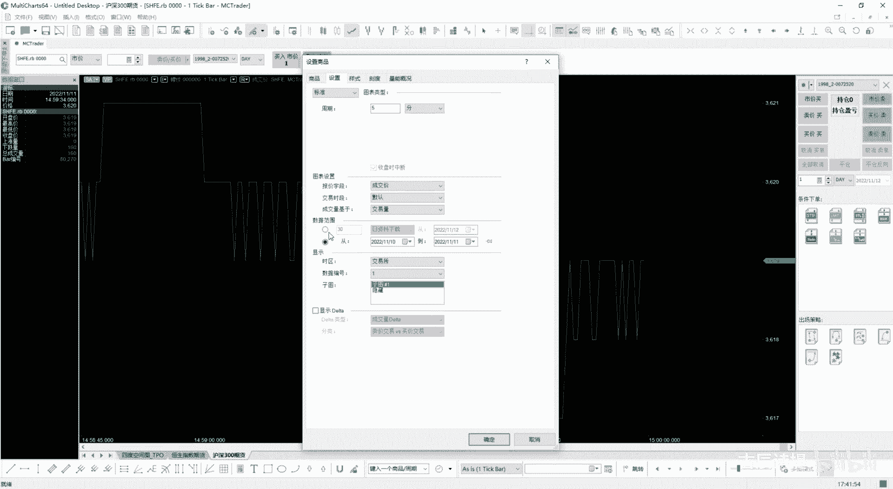

好，这个时候咱们咱们看一下，他的这个volume是22933，它指向的呢其实是optics，它和optics是一样的，也就是开仓量R933，然后当TX啊，就是20047。

它是和open init是一样的，他20047，然后TX呢是成交量，代表着optics加上当TX，33+47是80是吧，这是42980，这个是没有问题的啊，你一定要理解这个啊。

就是记住如果说你理解不了的话，你就记住它记住什么呢，就是说这个如果说你想用成交量，你就用基于交易量，然后用TX就可以了啊，然后optics和当TX也就是指向的。

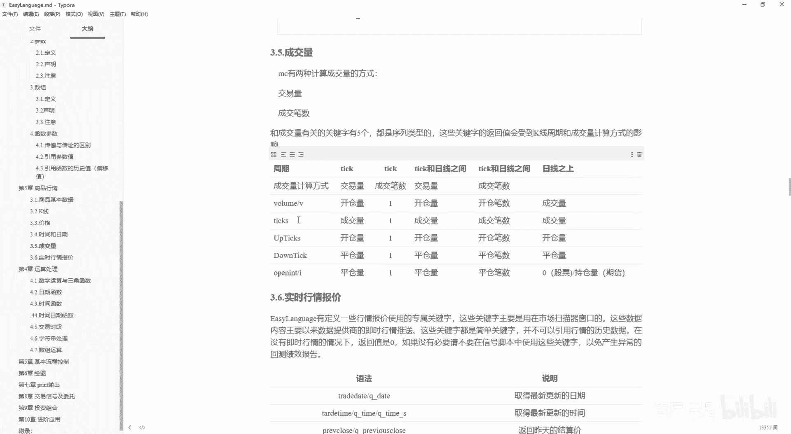

就是咱们这个里边，它左边的这个上涨量和下跌量啊，你看咱们最后一个如果还有印象的话，就是20047，229333 13加四十七八十对吧，它就是指向的一个开仓量和一个平仓量，它们俩相加就是这个总的成交量啊。

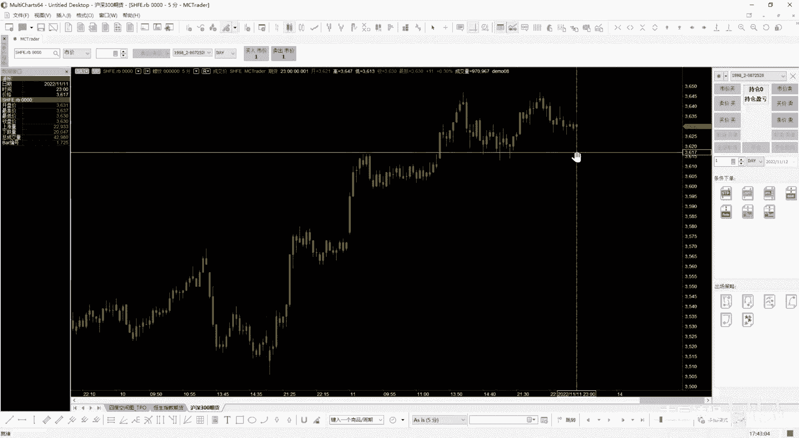

一般用的不是特别多啊，你就用TX就可以了，给大家解释这么多，就是告诉大家呃，就是它这里边几个你不要弄混了，TX和volume啊，你在日线及日线以上可以用volume。

在日线及日线以下volume就不准确了，包括持仓量也是这样的，open int啊，也是这样的好吧，后边咱们讲这个实时行情报价，实时行情报价是什么意思。

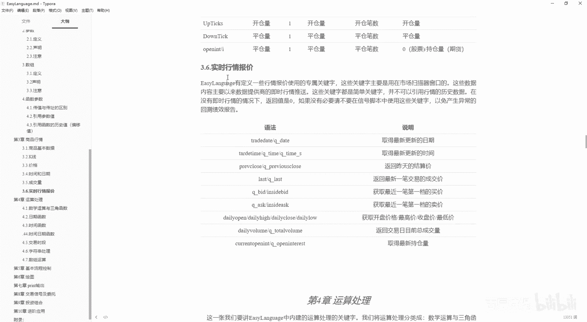

其实咱们这个它并不是实时行情啊，并不是实时行情呃，就是说这个已经是走完了的，走完了的，包括咱们在信号里边去运行这个脚本信号，如果说你没有特殊的设置的话，它会在K线完成之后，然后运行一遍那个代码对吧啊。

这个你之前咱们反复在讲的啊，逻辑你一定要先捋清楚了，那实时行情报价其实就是tick，是就是服务器实时传输过来的tick对吧。

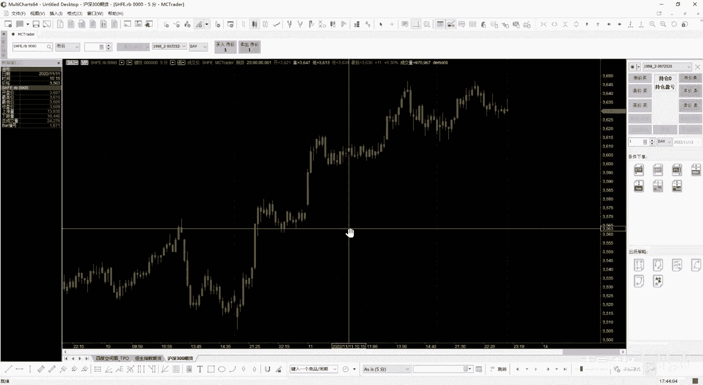

你需要获取tick里边的一些内容，它就是实时行情报价啊，这些关键字呢主要是用在市场扫描器窗口的，这个市场扫描器，它是个什么东西啊，它其实呃我先不更新它啊，你不要就是被这个名字给吓唬住了。

它其实就是你实时价格。

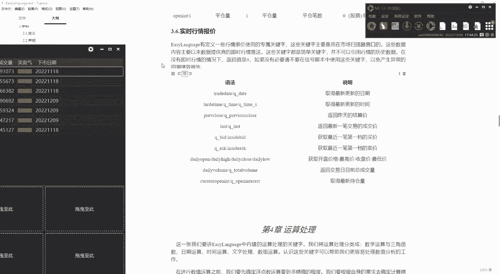

就是它以一种文字的形态啊，数字的形态给你展现出来啊，你可以把它拉到这来啊，然后进行从这买进卖出啊，买进卖出嗯也是可以的，他其实就是给你展现的是实时的价格涨跌。

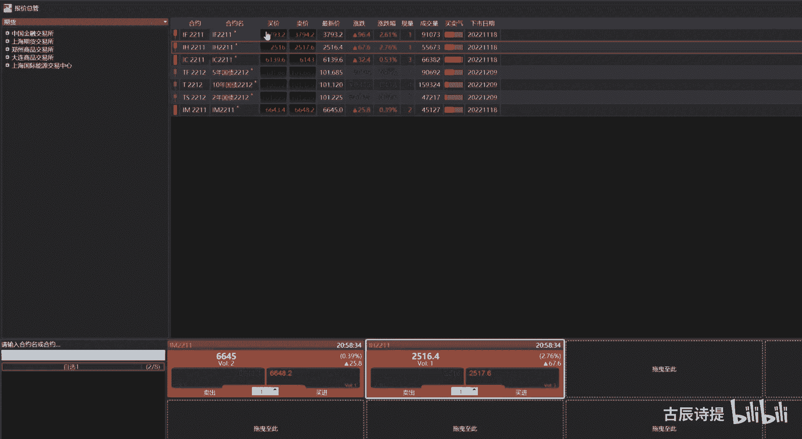

涨跌幅啊什么的，然后呢实时价格给你就是说从这获取到。

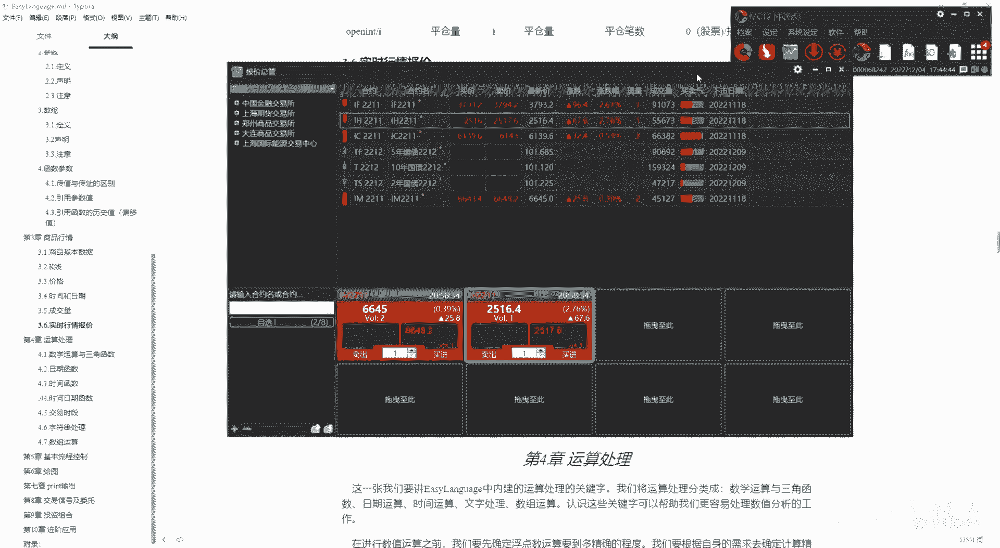

你也可以从代码里边去获取到这些代码啊，你千万不要用到回测里边去呃，因为一般的就是返回值是零，就算有返回值它也不准确啊，有返回值它也不准确啊，这个你知道就行了，包括里边的时间和返回昨日的结算价。

包括最新一笔交易的成交价啊，还有这个呃买价和卖价就是Q币的q ask，这个时候这个可能会用到啊，咱们上一节课给大家讲了那个intro b，然后persist就是你这个代码里边，这个行情是可以跟着。

就是咱们这个tick来进行更新的，对不对，就是里边有一些变量，是可以根据tick来进行更新的，如果说你想买卖价格呃，在一个合适的价格去买卖，你可以把变量复制成这个呃Q呃。

这个bid和q ask就是买价和卖价，你用它去发委托啊，也是可以的，这个具体的啊，他的脚本执行的逻辑，咱们后边去讲好吧，这个你先知道一下，你先知道一下它的返回值，有可能有返回值，但是返回值不一定准确。

比如说咱们去演示一个这个open interest吧，q open interest好吧，我先给他给注释掉，print一个q open interest好，然后进行一下编译，它是有数据的。

你会发现但是它数据全都一样对吧，你再往上拉，你再往上拉，你会发现它全都是一样的啊，全都是一样的，他这个应该是最后一笔，他的这个数据包括Q币的啊，我再进行一下编译啊，你看他就是没有数据的啊。

这个你在回测里边千万不要去使用它啊，千万不要去使用它，你记住啊，你像这个里边q interest，Q open interest，其实就是持仓量啊，就是total volume，就是目前总的成交量。

包括day open day，High day，close day呃，这个漏啊，他都是就是交易日的，就是开盘价最高价收盘价和最低价q ask，你可以ask ask把它理解为就是我要卖，我得喊呀。

ask就是卖家Q币的，它是B开头的，你可以把它理解为by就是买嘛，这就是买一价和卖一价啊，然后还可有昨日的结算价，其实这些数据啊是tick里边，每一笔tick里边都会带这些数据。

我可以给大家看一下数据原型，这个数据原型是我从这个维纳平台它的底层，然后给接触出来呃，给接出来的输出出来的当然是呃很久以前的啊，就是22年55月18号的，当时就为了看它底层接收过来的这个体格数据。

究竟有哪些东西，你会发现它这里边有什么呀，有这个呃，pre close price其实就是这个前一天的这个收盘价嘛，就是昨天的这个收盘价对吧。

pre open interest就是前一日的就是这个持仓量啊，持仓量还是前一根持仓量啊，open price就是tick里边也是有open price的哈，就是当然。

这个open price是代表着当天的这个最高价啊，这个开盘价和当个交易日的最高价，highest啊和rowest price，还有volume，volume是持仓量嘛对吧。

是不是不是不是不是持不是持仓量啊，是这个成交量啊，成交量，open interest是代表的这个持仓量啊，包括他还有买一价卖一价啊，open interest是在这呢是代表着持仓量，好吧啊。

这个close price啊，还有这个啊，就是这些是他的原型数据啊，原型数据，所以这些数据都是从tick里边传输过来，tick里边来获取到的啊，不要觉得他有多么的就是高大上，后边咱们回测的数据也好。

包括咱们也用的这个回测的TIK数据也好，其实都是对你原型数据进行的一个处理啊，都是对你原型数据进行了一个处理，所以说你不要认为呃，好像就说我这个就是这个里边数据。

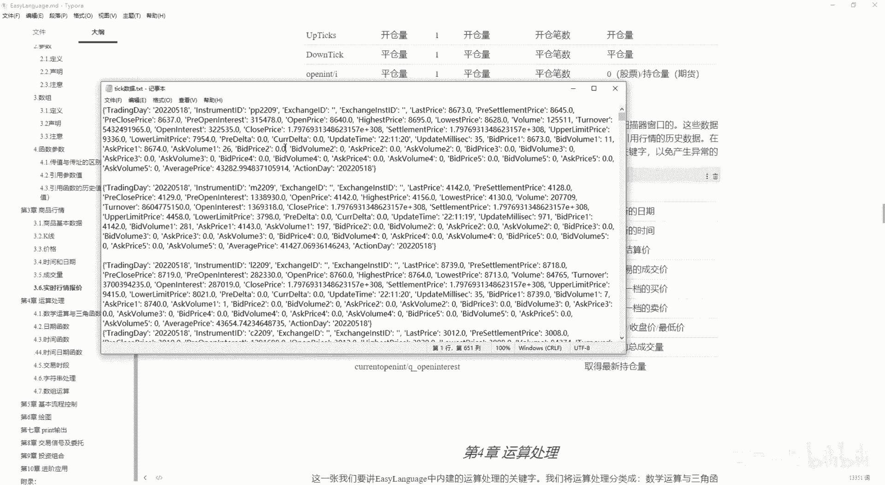

就和我这个呃圆形数据是。

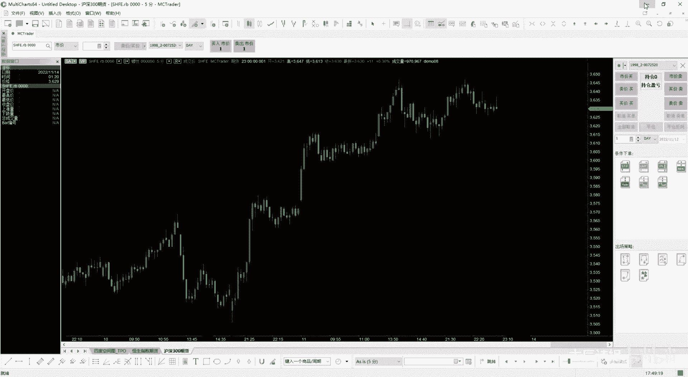

就说有就是一模一样啊什么的，其实不是都是经过处理过的，比如说举个简单的例子，就是有些时候啊等我先把这个关掉啊，有些时候就是你日线的日K线的，这个最高价和最低价，和你分钟K线的最高价和最低价是不一样的。

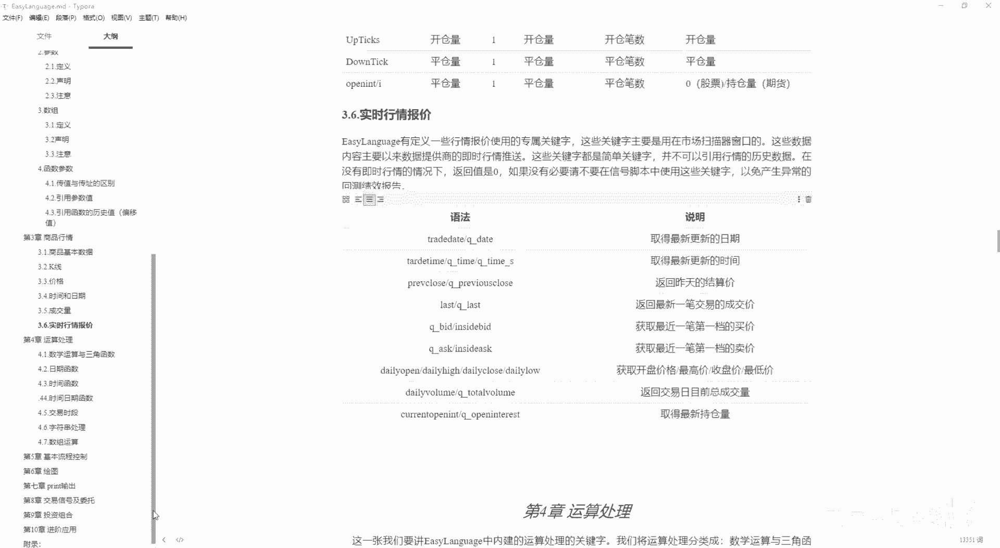

咱们在设置商品的时候，你也可能有时候会会发现啊，就是比如说我用日呃，我用这个日线，我一旦把它标示为日线，它是会有个从分中组合的，从分中组合啊，从分数组，这是什么意思。

就是有可能你的这个分钟组合成的这个日线。

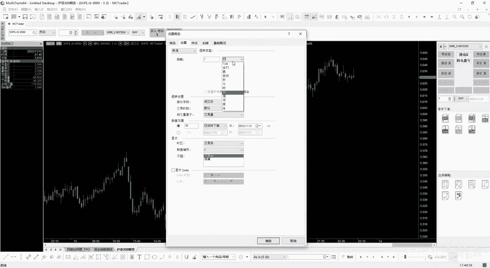

跟你的实际上的这个日线它是有差异的，为什么会有这个差异，咱们从这给大家讲一下，其实不管是讲MC的课还是讲维纳平台的课呃，都会讲到这方面内容，这方面容其实很重要，你们一定要去理解它啊。

就是咱们在交易的时候啊，其实这个交易是一直在进行的，你从这买，你从这卖都是给这个服务器对吧，去传输数据，这个中国内盘的这个交易所，一般是一秒钟给你发两笔tick的数据过来。

这个tick数据不是说比如说我从这儿发一笔，从这儿发一笔，中间相隔的是500ms，因为一秒钟两笔嘛，一秒钟是1000ms嘛，就是你这个发过来的这个数据，并不是说我这个tick中所有的这个内容。

它只是一个接盖，就把这个盖子给你接回，就是揭开，你看一下现在里边是个什么状态，里边的东西可能一直在动，然后你就是揭盖儿，然后拍一个快照，然后就是他当前的一个状态，所以说tick给你传输过来的持仓量。

都是在持续的上升的啊，然后他会给你传前一笔的持仓量，和现一笔的持仓量，你一相减，你就知道就是当前这个500ms里边儿，就是说在这500ms里边，持仓量啊发生了一个什么变化对吧，它是这么来计算出来的。

而并不是说他会告知你这个持仓量啊，在500ms里边增减了多少，它其实就是一个揭盖的行为，就是一个快照，就是我它运行到这个状态，我就拍个照片给你发过去，拍个照片给你发过去，拍个照片给你发过去。

所以你这个分钟级别的，和你日线级别的是有区别的，因为tick里边，他会带当天的开盘价和这个收盘价呃，可带这个当天的开盘价，最高价和这个最低价对吧，这些价格都是带着的，但是呢如果说你是由分钟去合成的K线。

这个分钟的线是由tick线来合成的，tick线一般咱们都用tick的，就是last price，就是上一笔的成交价，上一笔成交价是什么东西，就是在我拍快照之前，这个拍拍照的这个瞬间成交的这一笔。

或者他之前那个刹那成交的那一笔单子，他的这个成交价会传输给你，当然这一笔成交价，你会认为它是一个最小单位的，它其实不是一个最小单位的，然后你就会把他的这个提可价格，就是上一笔的成交价赋值给你的呃。

就是说这个呃霸线的高开低收是吧，就是当然就是这个开盘价，就是就是这根霸线的开盘价，是在他就是说时间进行切换的时候，比如说我从9。01分切换到了9。02分，那个就是09：02分第一笔即可出现。

跟他的这个分钟数已经是二了，然后它就代表着这根K线的第一根第一笔tick，其实就是开盘价嘛，都是用这个tick就是上一笔的这个成交价啊，就是咱们看到的这个什么呀，就是，呃last price啊。

open price high就是low list，我看看啊，open运行close price，然后加上这个还在在这呢，就是这个last price，其实都是用它用它这个价格。

然后你去合成的这个呃分中线，然后再用分中线去合成日线，但是很有可能你这个你这个分中线合成的。

跟日线合成的它的最高价最低价是有差异的啊，是有差异的，因为在你整个过程中，你在这个500ms之间，就是这他会给你传输一个数据，这给你传输一个数据，在这500ms之间，它可能出现了一个很激烈的行情。

出现了特别高的一个价格，或者特别低的一个价格，但是你反馈到如果说用梯可合成分钟，再用合成分钟合成那个日线，跟你如果说直接就是最后一笔tick，你最后一笔tick，也是也是可以成为一根日K线的对吧。

因为它涵盖了它的开盘收盘，然后它的这个最低价和最高价，以及它的这个成交量以及持仓量都是有的啊，就是最后一笔tick，也你你也可以把它单独的去绘出一根日K线，如果说你这个K线是从分中的。

那可能跟你就是说最后一笔即可，它形成的这个日K线它是不一样的，它是不一样的，你一定要理解这个啊，好吧，这个就是实时行情，他就是说给你获取的是每一笔tick的，它的一个数据啊，每一笔提个它的一个数据。

这个就跟咱们前面讲的open啊，不是那个intro bar persist，它的作用究竟在哪，你就可以这么去用它来进行，这个你那个变量的复制，当然这里边还有一些需要关注的东西啊。

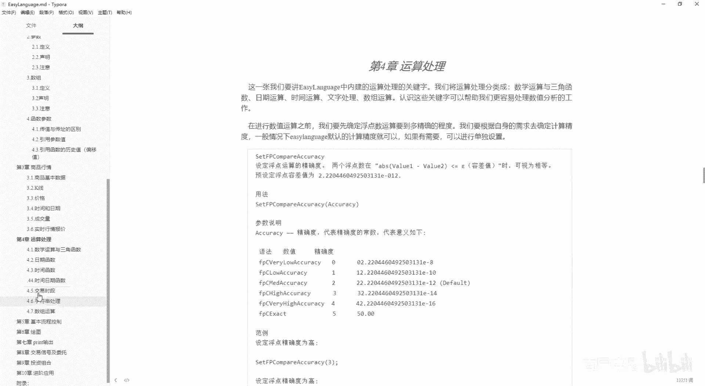