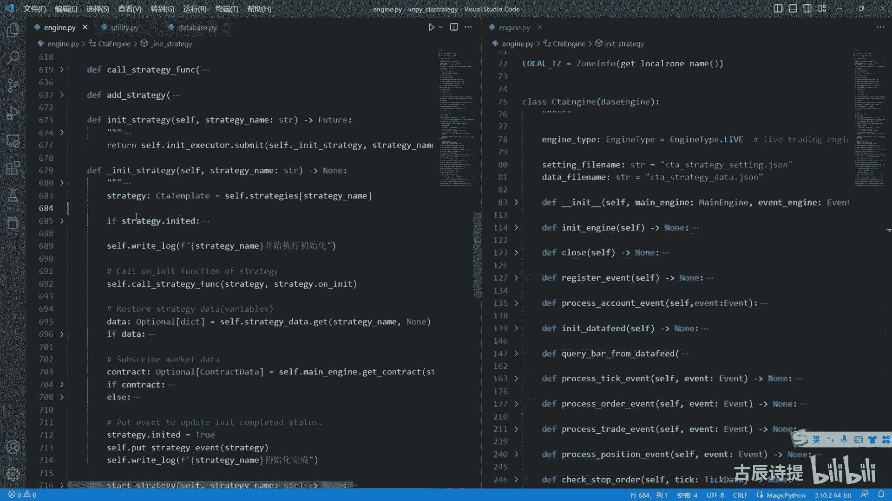
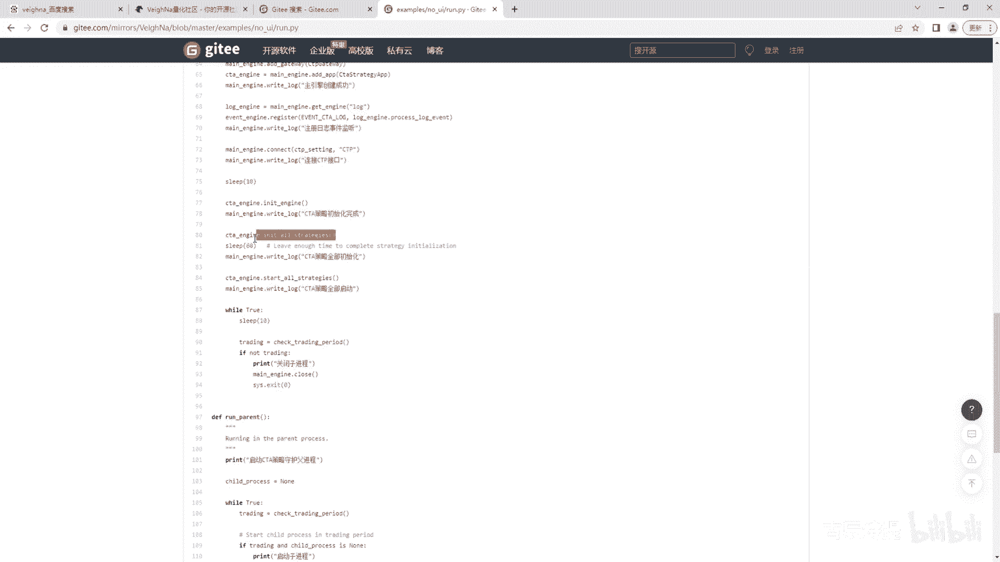
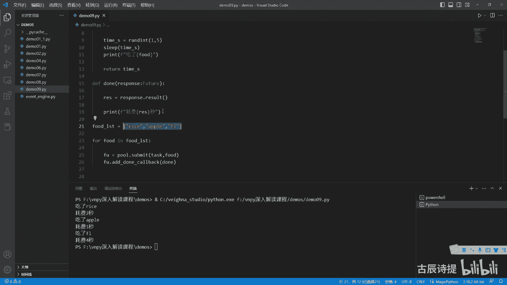
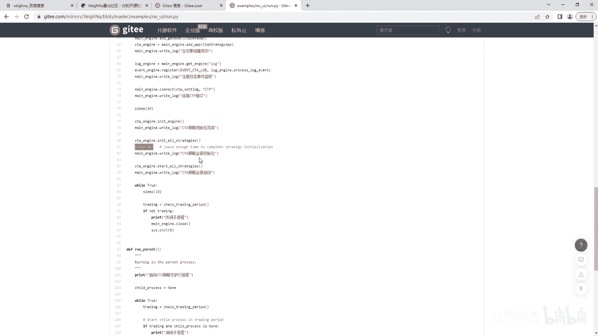
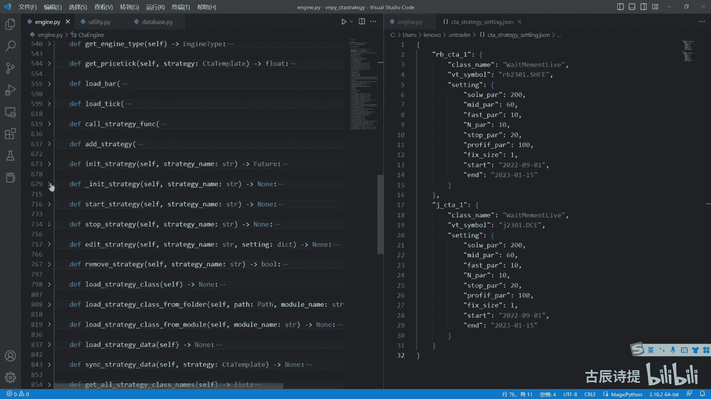
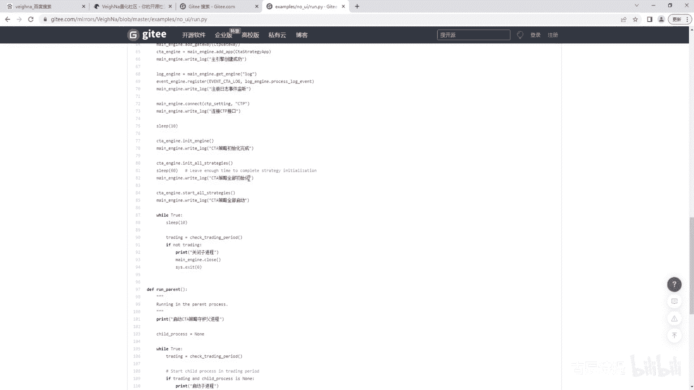
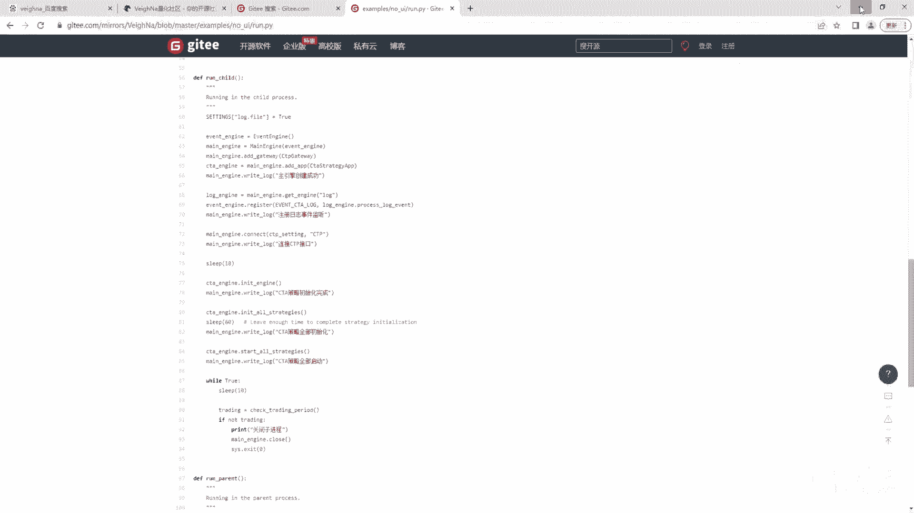
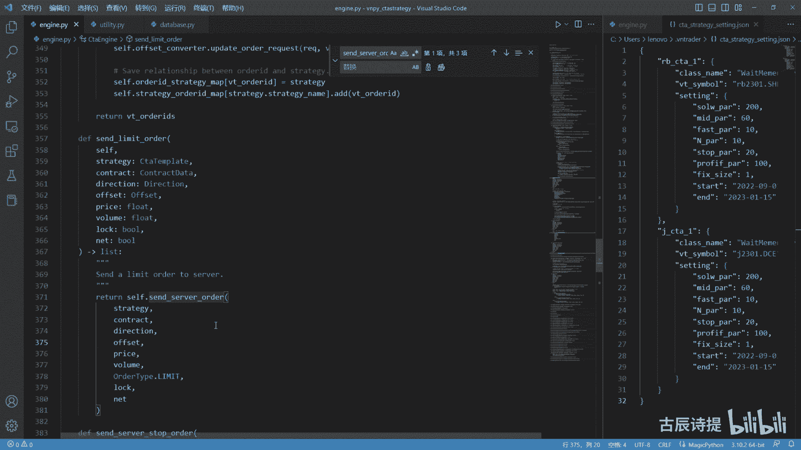

# 第9节课 CtpEngine讲解(3) - P1 - 古辰诗提 - BV1ZC411V7Z6

欢迎大家来到从零开始两款系列课程，VNPI课程，第九节课，这节课呢咱们把这个CTA引擎说完，其实最麻烦可能不太好理解的部分，咱们之前已经讲完了，已经讲完了之后呢，就是昨天讲到了这个it strange。

在这个init strange呃，这个里边咱们也说了，就是啊它是通过线程池来进行运行的是吧，线程池那就属于是单另的一个县城呃，也不是说一个县城，因为这个线程池它的里边只有一个线程，向我拆分一下。

这个线程池里边它里边只有一个线程，所以说它是就是是单独的线程吗，那这个时候呢你就不太好控制，就是就是他去下载数据，然后去初始化这个咱们的策略，它的时间不是太好控制。

所以说在这个里边你需要去歇一段时间啊，就是休息了60秒，就是等待他把所有的策略都给初始化了。

当然你也可以把它去改变一下，就是有一些别的方式去解决，我就不从上面改了，我单另一个这个就是demo文件给大家演示一下，好吧，线程池大家在学的时候，我不知道有没有学过，它。

其实是可以就是说在运行结束之后去，就是就是这个线程运行结束了，它可以去重新添加一个事件，就运行结束之后再去执行一个方法，现在的这个线程池咱们一般都是通过这个模块，就是concurrent。

Concurrent futures import，这个是吧，这个是线程池，线程池他其实可以是在做完他自己的任务，然后再去执行一个东西，比如说他的任务是task task呃。

我这就写这个写写上一个参数吧，比如说这个food s t r好，这个，From time import sleep now from random import random int。

好就是这个times等于render int，这个里边就是1~5秒，我就随机一个整数，就是它的这个耗费的时间呃，我不是sleep一下，然后time s再print一下这个正在吃啊，吃了什么东西。

耗费了几秒钟啊是吧，好前面我加上一个F，这写上吃了负的耗费了他们死是吧，就是这个我就是执行一个任务，你可以就是类比于呃，为他就是说那个去初始化策略了啊，因为咱们也不知道它初始化策略是多长时间。

然后这边呢我写个down response，p o n s e response好，这里边写什么呢，就是这个IES啊，IES等于response点result，这个没有提示，其实咱可以给他写一个类型啊。

from啊，Concurrent futures base，import这个f u t u r e future，它其实是一个这么一个类型，应该是这么个类型啊，就是当做完了之后。

它会自动执行这个down啊，R s result，这个result它是一个结果，你做完这个任务，你的结果是什么呀，其实这个是return对吧，就是默认如果没有return值的话，它是return。

那我如果说return一个爱情啊，return一个，我把这个TM给他return回来呃，我从这儿呢我不写这个耗费多长时间，我等他把这个任务执行完了，我从这个这写一个print一下。

这个耗费了这个多长时间啊，耗费了IS秒啊，前面那个F是吧，F就是format的意思嘛，就是这个是都要执行的，执行完了之后呢，我在就是它有个返回值，我从这儿接过来，然后就是再去执行这个。

就是说这个呃就是这个down，那怎么写呢，比如说我要同时去执行三个啊，咱们就用一个来演示吧，因为咱们这个CT引擎里面它就是一个嘛是吧，好，我这写一个pr，POOA等于pr等于这个形成尺。

然后里边写个max workers，等一啊，我现在呢要执行这个三遍这个任务，比如说我food list，等于这个是rice米饭啊，然后这个是水啊，Apple a p p l e，还有一个是什么呀。

嗯chicken不是就写一个flute吧，怎么写FLUTE啊，不是这个啊，就是F就是FL吧，假设我需要吃三个，这个是吧，吃这个三个，那我就for负的in flist，然后呢我把它交给这个线程池。

就是去申请做这个任务，那这个submit，那就是把这个task放到这个里边是吧，来做它后边放的呢，你像这个星号ARGS，如果说没有信号的话，通常情况下后边会放一个元组，然后这个里边放这个参数。

就是前面这个，函数的这个函数名的这个参数，但是如果说咱们一般看这个什么呀，看他的这个提示，后边如果说是这个呃是星号，这个lg a刚才这个信号重新写一下啊，task他这个后边是星号L7S星号。

咱们一起就是Python技术里边讲信号，其实就是给他把衣服给脱了，脱一件两个星号是脱两件，如果说你是列表的话，就给你把这个那个中括号给脱掉，所以说后边你就不用呃用元组的形式了，你就用什么呀。

就是挨个往后写，所以说你可以把food放到这里边来啊，然后呢它呢其实是可以有返回值的啊，其实可以有返回值的，FU就FU吧，FU等于他这个其实是可以有返回值的。

然后你这个可以直接FU点addle back，然后把这个这个函数名给他放进去，他就自己执行完了之后，他就会自己去addle bag，就是去做这个down了啊，好咱们来运行一下，运行一下，哦这是写成1。

5了是吧，应该是一和五啊，写成1。5了，好他已经开始运行了是吧，耗费两秒吃了这个apple耗费了一秒，然后最后吃了这个fl，耗费四秒是吧，它都是执行完了之后，然后来执行这个大。

所以说你把它类比到这个策略里边，这其实是可以是你的这个所有的，就是咱们在从这个从这个下载下来的，你的这个strange sitting啊，就是就是这个strange setting里边。

就是从这个里边下载下来，这个里边你存放了多少，就是就是就是这个里边有多少组，那就说明你有多少个这个策略对吧，这个还记得吗，就是给大家看一下啊，不是盖章了，C盘用户lb点VTA。

然后这个里边是这个c t a strange city，这个里边你像这个它是有两组，就是其实是这个字典里边，当然它是JSON文件啊，如果你load JSON之后，它是个字典，字典里面有两个元素的话。

它是不是代表着你是有两个策略，如果有十个元素，那就代表着你有十个策略是吧，那我类比到这儿，我可以把它全部添加到这个，就是这可以列一个字典，然后我在初我在初始化的时候，我就挨个的给它传进去是吧。

然后等它做结束，比如说我从这儿写一个计数器啊，然后它的就是记得这个数目呢，就是这个它的这个长度，如果说这个计数器到了这个长度了，并且执行完了。

是不是就可以确定它的初始化就完成了，就可以替代掉。

就是说这儿的就是说sleep这个60秒，如果说你策略越多，或者你的数据越长，你不知道会下载到多长时间对吧，那如果说你想改变它的话。

不去这么就是傻傻的去等的话，你是不是可以采用就是采用这种方式来做，就是把初始化放到这样的结构里边对吧，大家可以去试一下啊，这个呢其实也是Python基数，所以说你给拆解下来之后。

你会发现这个这个所有的很复杂的代码，你看这个写了这么多的方法，其实每一个拆分下来，它都是Python基础的东西，对不对啊，当他完了之后，他要做的就是肯定就是这初始化完成就start呗。

对不对，就是从这儿啊，就是INIT完了之后，你看他这初始化全部完成了。

然后就start austranges，这个start off专辑，其实就呃里边就没做什么太多的东西了，Studistranges，STUDISTRANGES肯定是循环，start all在哪啊。

搜一下啊，start all这哪啊，它就是什么还是便利，就是for string name，Insert the stranges，点kiss，你看它就是一个呃字典嘛，他的kiss呃。

然后self start strange，这个挨个的去start strange，他做了什么呢，嗯先看就是如果说还没有初始化呢，他会告诉你启动失败，因为这就是先让你去初始化去啊。

如果说他的这个training已经是true了，他就告诉你已经启动了，所以说你像这个c t a template里边，就是这个template里面它有两个属性啊，或者类的这个属性，一个是unity的。

一个是training是吧，一开始定义它都是false，然后如果说你初始化完成了，它就把它变成true，如果说你已经就是启动的交易，就把它改成true对吧，都是从这儿他替你去，就是说去去做了去做了啊。

你看这个就是一个判定嘛是吧，然后如果说都是没有问题，等于true，然后training等于force，然后他就往下走，Cos gt function，就是还是去调用，挨个去调用它的这个strange。

就是你的策略下面will start是吧，On start，然后调用完了之后，它会把你的这个strange training改成true是吧，从这改成true，然后把它的状态放到这个。

因为engine里边去，其实这个咱们之前说过，最主要的还是让界面做这个变化，同样的那个INIT专辑里边，你看SELINIT等于true是吧，他还会去改变，其实你把它拆分下来。

很容易去理解对吧，很容易去理解啊，后边他就没有了吧，它就变成了一个死循环，死循环就是其实就维持这个进程在运转啊，维持这个进程在运转，然后查看这个时间什么的是吧，就没什么东西了。

这个就是一个NO you i，其实你分解下来它很简单对吧，很简单没有那么复杂呃如果说你很吃力的话。

那说明你对基础啊还是掌握不太好，就是很多东西你光是这就是你光是知道个大概，或者说别人在用的时候，你根本就不懂，就比如说你像这个东西，就是它其实就是一个你返回值的一个提示啊，返回值的一个提示。

你如果没有返回值，你这可以解就是就是写个NN值，这个提示里面代表什么呢，就是列表里面存放的都是把data类型的数据啊，提示里边不管是什么就是什么提示，一般都是用中括号，一般都是用中括号，你像这个都是。

其实也是相相对于就是就是比较基础的体式嘛，是吧啊，然后这些都是基础，所以说如果说你很多东西看不明白，你还是就是好好的去把基础好好，就是掌握一下，一定自己多编写，就刚才说到的这个线程池呃。

你一定自己去写一写这个代码，你理解它了，你就知道怎么回事，这个里边还有一个，就是这是结束的时候来执行的代码，其实还可以，就是说在做这个任务之前来做一做一个方法，就是来执行一个方法都是可以的。

嗯就是这些都是你必须得掌握的东西，等你用到的时候，你就知道怎么用了，哪怕就是说你掌握的不是很牢固，但是最起码你得知道对吧，就是说你可以随时去查嘛是吧，但是最起码你得知道好，那这个说完了之后呢。

其实还有一个就是咱们需要重点去说的，就是这个order的这个流程啊，这个order的这个流程，order流程讲完了之后，咱们再把其他没讲的这个方法带一下就可以了，order呢其实咱们在策略里边写by。

SER是cover的时候呢，呃就是他会从这个template来，就是从这个template就是里边去掉，其实你你调用by的时候，它其实就是什么啊，SORDER是吧，就是SL什么都是SORDER啊。

都是SORDER，只不过你是买还是卖是吧，它会由这个就是就是这个direction，就是这个多空和这个offset和开屏来决定，只不过把这个变量给给改掉了啊，所以说咱们只要看这个SORDER就可以了。

SORDER这呃就是这个是template里边啊，因为咱们从这个顶层，就是从咱们策略里边去发送委托嘛，是啊，SORDER里边呢其实他做了个什么事呢，If self training。

他看一看你这个策略是不是已经启动了，对吧，你要完成启动，你前面得有一个初始化，然后再进行再把这个在start all stranges，然后这个self training才会变成true呢。

如果说你已经启动了他这个v t order i d，它其实是个返回值，你看他这个list返回值一定要记住，这个order的返回值都是一个列表，哪怕里面只有一个元素，为什么要给你返回一个列表。

咱们之前讲过，就算你发现价单，你也有可能被拆成两个单子，就算啊你的这个就是是单策略单品种，你也有可能被拆成两个单子，就比如说上期所它得拆成是平静还是平左，对吧啊，这个你一定要知道。

就是返回的这个就是单号，它肯定是一个列表啊，然后C点c t engine sorder，其实就是调用这个CTA引擎里边的，这个send order是吧，所以说咱们循着这个咱们来看啊，SORDER好。

先看这个啊，SORDERSORDER你一定要记住他是把这个什么，就是把这个strange给传过来了，你看在template里边，他传的第一个参数是self，self是代表的你这个类实例化的本身。

也就是说你这个策略实例化之后，它作为整体的一个对象给传递过来了，就是self你一定要知道啊，这个self和这接收起来的这个self是不一样的，那个self对应的是这个strange，能理解这个意思吗。

这个self是CTA引擎实例化之后的那个对象，这个也是Python里面最基础的就是类啊，这个那个就是实例化类和类是吧，上面还有类方法，实例化方法什么的，其实也是基础，你一定要记住它传过来。

第一个参数必定是那个你的那个就是策略啊，就是它是t template嘛是吧，后边就是方向开屏价格啊，这个还有个就是不是进仓，其实你像这个NT啊，其实咱们是可以把它删掉的，就是整个在咱们这个CT引擎里边。

是可以把它删掉的，因为什么呀，就是国内的这些本就是肯定是没有进仓，进仓是什么意思呢，就是只有就是呃就是这个多核空，它没有开合屏这个概念，就是你如果没有持仓，你多啊，你要么开多单，要么开空单。

如果说你呃你要要平仓的话，你就直接就是说还是开就是开开空挡，然后把它给先给平掉，就是没有这开合屏概念，只有多和空的概念啊，那个叫静仓log，这个lock是锁仓还是可能会用到的，尤其是在布置期货上是吧啊。

这个CD template咱们后边会就是给大家讲一下啊，但是不是很复杂，包括我之前的课也讲过很多，就给大家带一下是吧，好咱们主要看这这是一样的是吧，首先去找这个contract。

而且是这个my engine里边去找这个去get contract，因为你像这个my engine，他会就是说是一个，就是整个的一个统一的管理引擎，所以说你像这种公共的资源。

你像contract他肯定会放在这个my engine里边，从逻辑上肯定是这样的对吧，所以说他去my engine里边去获取，如果说你这还有个其他的模块，RPC啊什么的，也是通过Mac按键来管理的。

你没必要去在CDA里引擎里边去获取，这个contracts，就是合约的信息，你只要就是在主引擎里面获取一次，你就可以就是说一起用了，对不对，如果说是找不到的话，他会告诉你找不到合约啊。

下面就是你看这个price round two，round two是做什么的呢，其实就是把你的这个价格跟这个这个constructor，里边还有一个price price，Ta，他是做什么用的呢。

plastic咱们之前也说过，size是代表，比如说棉花，比如说是呃，一首是10吨，然后焦炭一手是100吨，它是代表这个数字的，就是一个点代表多少价值，然后这个plastic呢你想焦炭是0。5啊。

它是0。5，他就会给你就是说把这个price调整到，比如说你的这个均线，算出来是3215。33，他会给你调整到3215。5，是这样的方式，所以说所以说这个round two很重要。

咱们看一下这个run to，知道这个round two在哪吗，round two还是在那个UTLITY里边啊，在这个utility里，他是做了个什么呢，他就是用你的这个呃就是value，就是你。

你你比如说他现在是3125。33啊，这个value除以这除以这个target除以这个target，比如说它是除以了0。5，然后他取了一个int取了个整，他这个取了整是多少呢，它其实就是6250对吧。

6250吧，那个点六六他就给呃删掉了，然后再除额再乘以一个0。5，它就是呃3125啊，3125，这样的话就符合什么呀，就是说它的它是一个就是跟他这个target呃，能够处境的这么一个关系，对不对。

能够处境这么一点关系啊，所以就是这个round two的作用主要就是在这呢，呃这个好好研究一下啊，你像这个round two也好啊，他的这个下面还有floor to，flow to是向是向下取。

c o two是向上取啊，get这个get的介词，它是来获取这个什么呀，就是跟E就是十的多少次方什么的有关系的，你可以仔细去研究一下，这这就是这几个方式好，然后呢这边涉及到了stop stop。

你看从这咱们就各位就可以看出来啊，就是说这个VNPY在在CTA引擎这块，它只有两种委托单，第一种就是stop等于force，它是一个就是非stop委托单，其实就是限价单啊，如果说是等于true的话。

它就是一个stop单stop单，你看他这做的是一个什么工作啊，其实可以把它删掉，他这写的是contract点stop呃，呃这个这个支持的意思嘛，就是支持支不支持storm，维多单就是不支持的是吧。

这个停止单一般都是不支持的，咱们所以说你可以把它给删掉，如果说他支持的话，他直接往这个底层去发了，但是咱们CTA引擎里边，底层并没有stop这个委托弹，所以这一步肯定是没有的，其实你可以把它整个删掉啊。

呃然后如果不支持的话，他就send the local stop order，send local stop order好，咱们记住一下，这是slocal stop，就是本地的停止单。

然后这是如果不是stop单，它就是限价单，然后是slimit order好，咱们先看一下slocal stop order，他做了点啥事，Send the local stop order。

他做了什么事呢，就是传过来之后啊，他是个self点stop oraccount，这个是个计数器嘛，它先把这个stop order id给你创建出来了，就是stop order prefix。

就是这个是前缀的意思啊，prefix好像还有那个suffer freaks，那个是后缀的意思嘛，对吧啊，后边加上了这个stop all count，其实就是那个大写的stop几top几。

那个这个这儿呢是吧，就是这个stop嘛，对吧啊，这个后面呢他就创建了一个stop order啊，stop order这个咱们注意一下，它是单独在这个里边，它会有个呃base。

因为这个stop order是在这个停止，答案是在这个CTA里边，算是他不会跟比如说你别的接口啊，或者国外的一些品种啊，因为国外的一般都会有利名单对吧，包括你别的，比如说这个啊外汇啊什么的。

一般都是有利民单的，这个是大家这个就是共性，然后stop呢，它为什么把它放在这儿，他就默认为是这个CTA引擎，单独给设定的一个数据类型，单独给设定的一个数据类型啊。

然后它这里边very simple direction of sat price volume，stop order id是吧，在这儿呢，然后string name啊。

the time lock nv v two old ideas啊，这个field啊，有兴趣的可以去研究一下，它，其实就是因为VT2的ID它是一个list嘛，list呃，它就算是一个可变的了。

在这里边就是一个可变的一个数据类型，所以说它需要用field给它去规定一下，然后default factory就是呃默认工厂啊，就是这个factory是工厂的意思嘛，它就是个list啊。

它会自己给你自动创建一个列表，列表属于是可变数据类型啊，这也是Python基础，有兴趣的可以去呃查一下这个field，就是这个data class的使用，这个field还是很重要的。

但就是当你的这个里边，是一个可变数据类型的时候，你一定要用这个field啊，这个是studio状态状态，它也单独的分了几个，一个是等待中，然后是已撤销，已触发这个三个啊，就简单说一下。

然后他把这个vt order id啊，这个wait simple啊什么的，这个都没问题，然后这边有个time，就the time点now，然后low这个local tz tz就是time zone。

咱们之前讲过啊，就是time zone呃，看一下他是low info，然后get local zot name，这个跟大家讲过吧，如果说没有这个name的吧，虽然它显示出来的是这样的，但是就是不能用。

就是你一定要把这个name加上，然后给它放到这个though info里边，然后放到他这个呃，诶刚才讲的是哪SLOGO啊，是这send order in the local stop order。

这是吧，然后这个其实就是设置时区的意思啊，设计师设置这个时区其实也没必要，可以把它删了，你可以把它精简成，就是你像这个就是就是这个我不是粘出来的啊，你要是跟之前一样，那个gateway是粘出来的。

你可以直接把它删掉，我从这我就不删了啊，就是删掉你不光删这一个，你别的地方也得删，就是你得做到统一是吧，这注意了，Cd stop orders，Save stop orders。

这是咱们之前讲的里边存放这个stop单，就是stop委托的这么一个字典，然后用stop order id，然后等于stop order，就整个把这个都存到了这个字典里边去，这个字典干什么用。

后后边咱们会讲到啊，挺重要的，v tr的id它是一个list啊，就是cf点strange old id map，然后strange这个这个是查找是吧，查找他的这个BTR的id啊。

让BT2的D点ADD stop ord啊，这个就是添加嘛，嗯这也没啥啊，然后这是cf点cos gg function，这个咱们也说过了，然后up the stop order MIT也也说过了。

然后return他给他做，给他做成了一个列表啊，给它做成了一个列表发出去，这这这两个啊就是这三个你要记住，就是因为咱们现在没法讲呃，等咱们把这个讲完之后，给大家捋一下流程，就是说这三个是呃挺重要的。

就是这个就是其实是俩嘛，一个属于是这个cfa strange ord map，其实你能看出来，strange ord就是通过strange来找这个ORD，对不对，通过啊。

通过strange来找这个O的id，然后找到了，因为你这个本地的这个停止它，你最终你得触发成限价单，发到底层去啊，然后这个cp gateway他有反馈的时候，比如你现在发过去了，如果说全部成交了。

他回来之后还得去找对应的这个策略，对不对，还得去找你对应的策略啊，找到对应的这个策略之后，然后查看这个策略里面有哪些委托单，他其实就是做的这个嘛，就是先找到这个这个策略，通过这个策略名找到这个策略。

它后边存储的这个他的这个委托单，他说是一个复数嘛，VTIO的id，然后把这个stop old d添加到这个VTOD里面去，啊是吧，就是通过这个策略来找到啊，这个就是这个策略。

现在所用的就是所存在的这些委托单，好吧啊，这个slocal stop order，它其实就是做的最主要的一个动作，就是把它存放到了这个CP点，stop orders这个字典里边去。

这个字典会在后边用到啊，好那咱们在咱们先不说这个LIMBDA了啊，咱们再看一下这个他这个存放之后，是从哪给触发的，触发的，它是从哪出发的呢，Processing event。

它这呢你看啊就是processing event，它是接收TK数据，它首先呃获取tick是吧，然后获取这个STRANGES就是simple strange map。

这个咱们之前讲过simple strange map，它是来对比什么的，simple strange map就是它是一个default list，就是very simple。

然后后边是一个strange list，就是我这个合约它有几个策略，对不对啊，我这合约它有几个策略啊，如果说没有这个策略的话，它就return就是tick，我就不用去进行处理了，他这有个四点。

Chicken stop orders，就就这个咱们最后说，然后如果有的话，它会遍历这个策略，然后看这个策略是否是unity，就是初始化成功的，然后如果是初始化成功的。

他就就是去调用每个策略的这个on tick对吧，这个就把这个tick，传递到了这个顶层的策略里边，它这里边有一个checker，这个stop order，咱们看一下啊。

check stop order他做什么了呢，就是first stop order in list cf，Stop order orders values。

刚才还记得在这个保存这个stop order的时候，它是通过什么呀，key value来表现的，key是什么呀，呃这个stop all d对吧。

就是刚才在这个S这个order s local stop order，它保存的时候是用什么呀，Stop word，然后把这个stop order就是这个数据类型放进去，然后他这便利的时候是便利的什么呀。

Values values，它是一个可迭代的对象啊，就是可迭代对象，它是它不是列表，它是又加了个list，其实加与不加其实都可以进行迭代的啊，都可以进行迭代的，就是虽然是可可迭代对象，不代表是列表啊。

这边是强转了一个列表，你像这个字典啊什么的都是可迭代对象，对不对啊，这个也是Python基础，如果说stop点VTID不等于t v simple，哎这不是这个v simple，如果说他的合约就是不相等。

它continue continue是什么意思呃，就是后边不执行了，然后再进行下一次循环，continue和return一定要记住啊，如果说这是return的话，就是整个的这个方法就不执行了呃。

你从这一定要用continue，因为这个stop orders存放的可能是你的所有的stop，委托单，所以说它的这个v simple不一定是相等的啊，不一定是相同的啊。

所以说这个continue一定要记住，continue和这个return以及break的区别，continue就是这次循环下面不执行了啊，然后他再看是不是跟这个tick是相等的啊。

不是这个tick点v simple有合约是相等的，如果是相等的，它这创建了两个，一个是long long trip，这个TRIPOR是什么意思，触发的意思就是多单触发和空单触发的意思啊。

它就是呃这个direction，就是你看如果说是呃多单触发的话，它的方向是多是吧，然后他的这个and这个点lot price，就是上一次的成交价格大于等于stop order点price。

他如果说是它的方向是多的话，而且当前的这个这个就是tick点，就是就是当前的这个tick的成交价，大于就是委托价，这个stop order price是不是就是触发了呀，比如我发送这个委委托单。

比如说在多在多单啊，网上的时候，然后就是买入或者卖出，你想这不就是说方向是多，然后大于它就是大于等于这个order price，就比你的这个委托价要高，如果是多方向，它就是比你委托价要高的时候。

它进行触发，你琢磨一下这个和限价单是不是相反，限价单它讲究什么呢，就是如果说我是买的话，呃这个这个这个这个我要做做多的话，就是你不管是你呃就是呃开多还是凭空，其实都是多的方向嘛是吧，开多凭空。

这个不都是多的，其实就是买进多单嘛对吧，那就是其实是买嘛，对不对，limit呢它是讲究呢买的越便宜越好，其实咱们平常也是啊在质量相等的通，记住就是这个情况下越便宜越好嘛，就是买的越便宜越好，这样不吃亏。

你像这个就是刚好相反，就是这个stop单和limit是相反着的，这个其实很好记啊，你只要记住开多，我也是就是买嘛，然后凭空其实我也是买买的越便宜越好，这是限价单跟他相反的，就是停止弹啊，就是停止单。

然后这边这个是这个空单，这个触发就是什么呀，就是说他的方向如果是呃空的话，然后就是价格小于等于price，然后他就触发，就是这两个其实就是呃，就是如果满足这里边条件的话，它就会变成true，对吧啊。

这是个布尔类型的，其实是你可以给他标一下啊，就是它是一个布尔类型的对吧啊，然后下面如果说if long track，就和or是如果说多单或者空单触发了，他就去找这个strange，就找这个策略。

通过这个self distranges啊，就是因为stop order里边它有这个strange name，刚才咱们看了啊，有strange name，通过这个string name找到这个策略。

然后呢下面是什么呢，If stop order direction，就是如果说你触发的啊，不是你的这个方向是呃，其实就是浪就是多嘛，其实就是买嘛对吧，如果说你的事触发的是买的话。

呃如果说他有这个if tt，因为tick里面它是带这个limit up和limit down，limit up和limit down是什么意思呢，就是它的涨跌停价他就转成这个，如果说是你买的话。

他立马就转成这个living up，就是涨停价，就是这个price就变成了涨停价，什么意思，一出发之后我买东西我就要立即成交的话，我就直接用涨停价去发是吧，我就啊。

我我报最高价是不是就是立马就成交了对吧，当然这有特殊情况，就是它在涨涨跌停板的时候，所以说你在写策略的时候要注意，就是说去给他控制一下，如果是在涨跌停板就不要进行交易了啊。

当然这是根据你的策略这个性质来的啊，如果说else就是他为这个设计的时候，如果有limit down啊，他就用这个跌停价来进行操作了，如果没有跌停价的话，他用price5，这是ask。

ask是就是买的意思吗，bit是卖的意思啊，ask你可以买买，我要我呃，我要买，其实你就记住B就行，B你可以把它理解为就是卖啊，卖物价是吧，这是买物价啊，这个咋理解啊，卖卖啊，呃就是你记住它就行啊。

就是他要么用这个涨跌停价，要么用这个其实一般都用涨跌停价，这个里面都有这个涨跌停价啊，然后他又获取了一个contract是吧，所以说这个contract肯定是得第一个先获取到的，就是你这个引擎一启动。

contractor是第一个去获取到的，咱们在这个CCTV那个gateway里面也讲了，对吧好，然后那个他就是VTORD啊，就是他给你转成了一个什么呀，就是把这个呃如果触发了。

他就给你转成这个slim order，是不是跟咱们刚才那个SORDER呃，如果说是他不是停止单的话，他就也也直接发了，这个就就是这个climit order了对吧。

所以说最后还是会转成slimit order，只不过呢他在转的时候，他把这个涨跌停价换成了，不是他把这个价格换成了涨跌停价啊，转接一下，然后去接收一下这个v to order id啊。

如果说接收了就是就说明发送成功了，他需要从这个self stop orders里边把这个stop ord，就是其实就把这个stop orders，从这个stop orders这个字典里边给去除掉。

因为你已经触发了嘛，你已经发到底层去了，就不用再去去，这个就是每次都在等了，因为已经触发了，是不是，然后呢，strange bt ord等于self distrange ord。

然后就是就是其实这个就是咱们刚才说的，你获取到这个strange video ideas，对吧啊，获取stra video，因为刚才他是把这个添加进去了吧。

就是self digorder map是添加进去了是吧，咱们可以看一下啊，在这个呃CLE我把它放到这，你看这吧，这是刚才讲的这个C啊，哎这是SSEVER的，不是这个。

这个是check stop order，是刚才说的这个pose order，好哎，咱们刚才说的是这个啊，Send the local stop order，你像一样的这个吧，他这个时候是给它添加吧。

对不对，添加他没有直接说是从这点这个ADD来添加，这个涉及到也是Python基础里边，就是在底层存储的时候，你这个字典啊，呃就是你给它获取出来之后啊，就是你再给它添加，其实是往这个字典整体里面去添加。

这个涉及到这个深copy和浅copy啊，这个也是基础里边的，我就不多说了啊，啊这个是这个stop order是吧，刚才是添加进去，现在是要把它给remove掉，给删除掉，这个没问题吧，好好啊。

然后这边呃stop all the studio，把状态改一下，变成这个trick就是已触发啊，然后stop order点VTORD等于这个VTOD啊，等于这个video2代啊，这个order id。

然后呢呃call这个strange function就是就是去调用，就是咱们这个顶层策略里边的这个boom，stop order去来调用这个方法，然后再把这个就是这个你的车。

就是这个这个这个stop order放到这个呃，invent engine里面去，这个是stable order MIT，它它就是还是把它放到这个诶，还是放到这个啊这个引擎里面去啊。

咱们可以看一下这个老转了，转不过去，这呢是吧，The stop，它就是mc t a stop order，然后他给他放进去啊，没什么，太多的东西啊，这个就是slocal order。

它和呃limit最终就是从咱们这个SORDER，这，最终他也是因为这个是咱们在期货里边，肯定是进不去的，要么是进这个，要么是进这个是吧，要么是进这个，要么是进进进这个。

咱们再看一下这个slimit order，哎呀这个老是过不去啊，好slimit order，Slimit order，他做了什么呢，就是其实也没别的，就是新的server order。

把他的这个就这个这个这个这个这个tap吧，就是改成了这个limit，就是发到底层的，全是这个LIMDCSOL，二，他做了什么呢，Csol order。

他他说他是做了这个一个是把它变成了一个request，就是original request，original是什么意思，原始的是吧，或者最最初的什么呢，request它是order request。

他给创建了一个request啊，他给创建了一个request，然后这reference就是相关的，相关是app name，App name，这是什么呀，只是这个CTA呃。

这个city strange是吧，是c t s strange，然后strange和strange name就是你的策略名，就是相关嘛，就是相关啊，然后iq list这儿有一个转换器。

就是DOS到这个往这个底层发之前，它会给它转换掉，就是把这个这个original request，就是order request，还有这个lock和NT就是放进去做一个参数，然后给它转换成一个列表。

其实就是把这个委托进行转换，这个转换器咱们也会找个时间给大家再讲一下，简单的提一下啊，在这我就呃不多说了，它返回的也是一个列表，因为你一个委托单进就是一个委托请求进去，它可能会转换成两个是吧。

或者或者说是更多啊，有啊他有这个可能性对吧，好然后呢转换完了之后，它是一个列表，然后这是VTOID，他先他先创建了一个空列表，然后他便利了这个就是呃列表，就是委托请求的这个列表，然后呢就是VTUI等。

然后用my engines sorder，然后这个去去这个主引擎里边去发送委托，主引擎里边去发送委托呃，主主引擎是怎么做的呢，主引擎其实很简单啊，咱们找一下那个主引擎，Man engine。

在这呢那个老转不过去，从这咱们找一下这个新的order是吧，他就是找到这个gateway，然后gateway di sorder，咱们也说了，Get away，就是咱们如果用my engine的话。

它是会ADD那个cdp gateway的，其实还是到底层用那个gateway，就是c TP gateway去发送委托嘛是吧，然后再到这个TDMDI就是去发送维度嘛。

就是CPKTV下面的那个就是管管交易的那个累，去发送委托啊，发送委托，如果说没有这个VTR的id就continue continue，咱们说了啊，如果说有这个VTID。

就是用v t r i d pv tail id对吧，然后再进行用转换器进行一下转换啊，就是把这个IEQ和VTID，然后进行一些转换，然后就是cf点order id strange map。

就是呃用以这个VTV，以这个VT的id为这个the key，然后strange作为这个value，然后给它进行存储，这样的话当你的这个委托成交之后，他再来进行回调的话，他就立马能找到这个strange。

对不对，然后呢这又是反过来的，Strange，old i d就是通过以这个strange name啊为这个key，然后这个以这个一个列表，他应该是个列表吧，咱们可以看一下。

就是strange old d点map啊，strange o d点map，它是default seat啊，就是集呃，就是集合是吧，它集合里边它会就是不重复不重复，User server order，啊。

他会就是能通过就是说这个stretch name，来找到这个微调大，这个咱们想想这个v til的id，是真正的底层的这个VT的id对吧，真正的底层的VTOID。

因为他这个直接会从这个manager seer，其实就是CD p gateway，就是cl的，虽然那个VTID呃，或者说那个order i d也是他自己，就是这个V就是这个伟大平台，他自己拼出来的。

咱们还记得吗，什么呃，那个front id，还有session id，还有他一个计数器拼起来的对吧，然后但是这个是从底层给发过来的，这个retail的id，然后他return一个retail id啊。

这个就是sa server，这个就是和底层去连接的，只不过它中间有一个my engine manager，是一个统一的管理引擎吗，还就是唯一可能大家不太理解的，就是说转换器的作用，其实你理解它就可以了。

你没必要说代码里边它它的这个代码啊，其实嗯也是比较麻烦，咱们这就是现在转不过去了，可能这个电脑呃就是有些问题，其实这个里边你去捋那个思路，其实就是加减很简单的加减法。

但是呢你只要知道他是为了把这个委托转换成，就是底层可以接受的委托就可以了，好吧，那咱们这节课没把这个T引擎讲完。

