# 第9节课 数学运算与三角函数、日期函数 - P1 - 古辰诗提 - BV1qz421a7A1

欢迎大家来到从零开始量化系列课程，MC课程的第九课，这节课呢咱们讲第四章运算处理，这章我们要讲EZLV几中，内建的运算处理的关键词啊，我们将它们分为呢数学运算，三角函数，日期运算，时间运算，文字处理。

数组运算啊这么几类，当然数学运算咱们是用的会比较多对吧，三角函数就看你能不能用上了，我是用的不太多啊，可能我对这个量化的理解还不深啊，日期运算和时间运算算算是用的会比较多的，嗯因为涉及到一个日期的。

就是说这个加减你一般不会给日期做这个乘除，是吧，但是一个是比较咱们之前说过，就是说这个IDILEMG里边，它的日期用数值来表示啊，前面的年份如果是2000年以前，它是两位数。

如果说2000年以后它的年份就会变成三位数，然后也说过他为什么会变成三位数啊，它会可以直接进行大小的比对对吧，但是呢咱们当时也说过，你不能进行直接的加减，这样会出问题的呃，因为有一些比如说我呃12年啊。

12年的，比如说我10月啊，30号你加30就变成10月60号了，但实际上没有这个日期，他就会出问题的啊，这个今天给大家说一下它如何进行加减，嗯你用到的地方其实也很多，比如说我一个策略，我就在止盈之后。

我歇30天是吧，我得把这个30天以后的这个日期记录下来，然后再进行对比，当我满足我日期当前日期大于这个，我当时记录下来这个日期了，我才可以进行，就说开仓对吧啊，嗯时间运算啊，这个也会讲到啊。

数组运算是比较重点的啊，这一章重点会讲这个数组运算，啊在这个进行数值运算之前呢，我们肯定先要确定浮点数运算要到多少精度，咱们之前说过，为什么它会叫浮点数，以及它的这个由来给大家简单的介绍过。

就说明这个是计算机的一个啊通用的bug，就是不管你是在哪个语言里边，你都避免不了这个bug，你只可以无限的去精去精确它，但是你不能做，就是不能做到百一%模一样，对不对，就是不能做到百分之百吗。

完全没有误差，只不过是误差可以做到，比如说很低很低，十的多少次方啊，以内是吧，这个精度呢你可以自己去设定啊，这边有这个方法，就是用这个sf p f p compare，compare是对比的意思吗。

这个OCCURRENCY就是代表就是精确度的意思，就是sf p它这个精确度，你后边呢这个精确度呢你可以填这个数字，012345也可以填这个关键字也可以的，咱们默认的呢是这个mid。

这个精确度是二是默认的，但是一般这个就够用了，他是22×10的-12次方，这是啥概念，就是在你这个22前面加十个零对吧，就到了这个精度嗯，就是到了这个精度，所以说我觉得已经够用了。

如果说你想精确度高的话，你可以填三，它是high就是高精度的，然后very high就是特别高精度的啊，你不能填最后一个啊，然后这个是啊value low，他还要到八呢，其实精确度已经可以了。

这个就不多讲，一般不会做调整的好吧，然后数学运算和这个三角函数，咱们快速的过一下，INTERPORTION就是返回数值的整数部分，包含正负号啊，呃负值它就会返回，就是说负值的这个整数部分啊。

这个你一定要记住它不是四舍五入啊，也不是就是说这个呃什么取这个大于它的整数，小于它的整数就返回它的整数部分啊，然后flank portion，就是就你像这个flank，其实是这个FLECTION的简写。

就是小数的简写单词portion就是这个部分嘛是吧，就是小数部分啊，就是包括正负号啊，这个也没什么好说，也没什么好说的，就是小数点后边嘛，round是指指定的小数位数，将数值四舍五入，它里边有两个参数。

第一个参数是你要呃用的那个值，第二个呢是就是你就是四舍五入到的，这个小数的位数啊，就是这个给大家演示一下吧，demo09啊，比如说我print，round啊，U n d round，就说1。

23456啊，加个括号，然后加括号，当然你这个后边你得加上他的这个精度，比如说我就一啊。

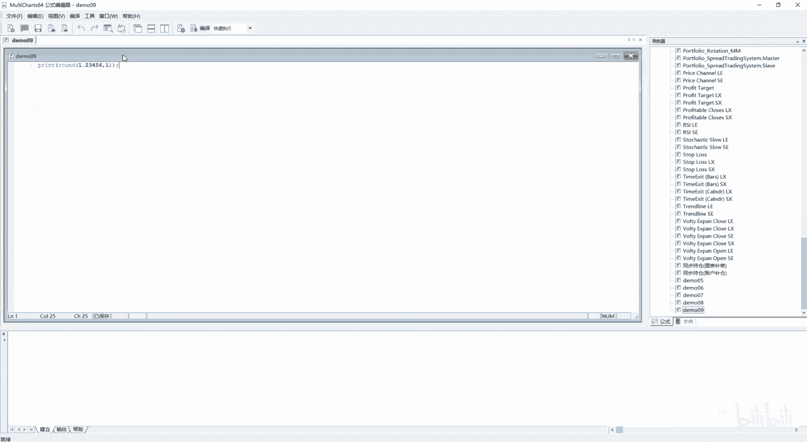

我就一，然后我进行一下编译，然后编译成功了，我在这个图标里边加上它啊，插入这个信号，然后demo09对吧，然后close别的也不用去设置了。

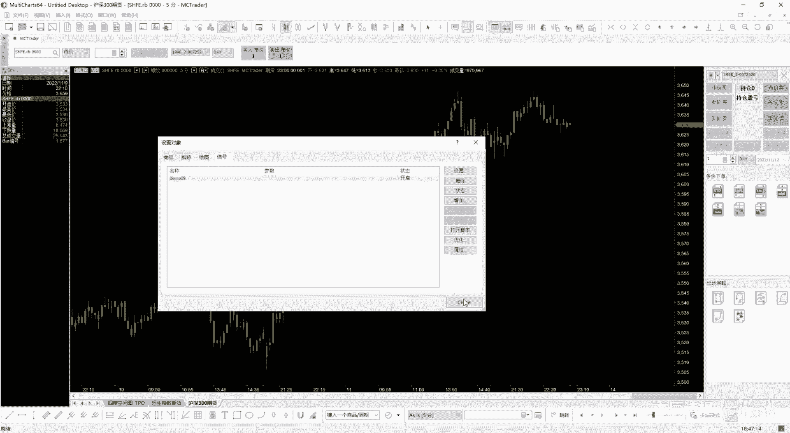

然后它就会输出1。20，后面有个零，当然不代表它精度到后边啊，只不过是他小数点后面保留了两位小数啊，这个如何保留位数多，咱们后边会讲啊，如果说你给他设成三的话，然后编译一下啊，它会变成1。24啊。

就是把这个因为它只保留了两位小数说一下吧，如何说你想把它保留的位数多呢，其实咱们可以看这个print f1，看一下这个print里边就可以就设置，就是你会发现C啊，他这个是参数嘛，C最少输出字符数。

D是小数位数，什么意思呢，就是说我你想这个一点多少个五，然后最总共输出六个字符，然后保留三位小数啊，就是小数点后面保留三位，但是呢小数点是算一个字符的，小数点是算一个字符的，所以说你可以从这比上。

比如说我要保留几位啊，四位，然后呢小数点算几位呢，算三位，那就是小数点后面三位啊，小数点后面两位吧，因为小数点还得算一个字符对吧啊，这个时候咱们再编译一下输出，啊两位就没有意思了是吧，跟之前一样了。

五是吧，三啊，这个你要设置对了啊，你不能就是不算小数点了是吧，这个就有了吧，他总共是输输出了五位，然后小数点后面是三位啊，当然如果说你设置了十位，他会怎么输出呢，咱们可以看一下啊。

他前面给你空了几个格子啊，给你空了几个格子好吧，就这么个意思哈，好这是round ceiling，Ceiling，在英语单词里边表示天花板的意思，它其实就是返回大于或者等于数值的最小整数。

这个正数咱们能理解，比如说9。1，它返回的数值是十，负数呢，就是很容易给搞错，一不小心就弄错了，你-2。85，你返回的数值是二，就是返回大于或者等于数值的最小整数，你返回这个负值的-2。85。

它的比它大的最小的整数是多少啊，是二啊，不是三啊，这是ceiling天花板的意思，F这个floor就是地板的意思，其实跟ceiling基本上就反过来了，就是反于返回小于或等于整数的最大整数啊。

返回小于或等于整数的最大整数，就是-2。85，比它小的最大整数是多少啊，是-39。1，比它小的最大整数是多少啊，是九啊，这个要理解清楚了，我就不给演示了啊，sin它其实是符号的意思嘛，就是返回符号。

如果正数的话是返回呃，正义就是一负数的话，会返回一零呢会返回额为零啊，abs value和POS这两个呢会经常用到，一般咱们推荐用这个abs value，它是返回数值的绝对值啊。

返回数的绝对值正数返回本身对吧，负就是这个负数返回它这个呃负号给去掉，这个也没什么好说的，那个他返回数值的负绝对值，正数返回，就是说前面加一个负号，负数是返回本身的啊，这是负绝对值，你要理解了。

就是它的七的绝对值是七，然后他的负数就是七嘛，mod取余啊，或者取模，就是取余数，或者取模，取模啊，在Python里边或者在其他语言里边也有啊，就是取余数取模什么意思，就是我10÷3应该是余几啊。

余一吧，好演示一下啊，print这个mod，然后13括号括号括号，然后编译，然后余一吧，好这有个问题，如果是3。3呢，3。3是余多少，可不可以取模也可以啊，它是取0。1是吧，就说会余0。1是等于三余0。

1吗，这又有个问题了，如果是十呢，十是余多少呢，十是余多少，咱们看一下啊，是-0。1，是-0。1，如果说是这个10÷-3。3呢，这个是有区别的啊，10÷-3。3，就余的还是0。1，还是0。1。

就是这个如果说这个取余的这个呃，这个两个数啊，有负号的话，你这个取余的这个结果，会根据你的这个被除数就是七，其实就是10÷-3。3，就是10÷-3。3嘛，这个括号是吧，等于三，然后余这是咱们以前学的0。

1对吧，但是他这个余数的这个正负号，跟你的这个除数是没有关系的，只跟被除数有关系，如果说它是十的话，它余数会是-0。1好，但是他如果是正式的话，它不会是-0。1的，只跟前面的这个被除数是有关系的，好吧。

这个你要理解了啊，再给大家演示一下，如果是十的话，他余数肯定是-0。1对吧，就是这个前面是3。3还是-3。3，对他没有影响，对他没有影响，对吧啊，好这是取模啊，exx p value就是返回E的乘方。

这个就没啥好说的了，就是E的2。3次方嘛啊就是EXP，你就大写的E你就理解为这个就是E就行了啊，log返回数值的自然数对数，自然数对数，这个也没什么好说的啊，也没什么好说的，然后啊如果不理解的。

你可以去查一查，这是高中的知识好吧，power是返回数值的沉密，结果就是你像啊power5和三就是五的三次方，五的三次方，square是数值的平方，其实就是power，就是如果说你是square5的话。

其实就是power5后边加个二，对不对啊，可以演示一下，就是print一个square sq square，就是比如说五的话，它应该是25吧，对不对，然后我再print一个power。

然后他应该是第一个是底五，然后第二个是它的多少次幂是吧，两次幂，其实这两个数出来的值应该是一样的啊是吧，都是25吧，额然后square root就是返回数值的平方根啊，这个也没什么好说的，对吧啊。

返回数值平额平方根，然后random，random是返回介于零到指定数之间的随机数啊，一定要记住是随机数，不是随机整数啊，比如说我从这儿演示一下，然后print一个random。

比如说就是0~10之间的啊，数值他输入出来的它肯定会保留两位小数对吧，因为你print如果没有经过设置的话，指定的话，他保留的默认是两位小数啊对吧，你看7。40啊，呃8。08呀啊。

就是如果说你比上一个就是比上一个十啊，然后比上一个后边的保留六位小数啊，前面就会应该是有俩空格对吧是吧，前面有两个空格，然后保留了六位小数啊，一定要知道这是呃，它返回的不不是说是这个随机整数。

它是随机的数值，之前写过就是一刚开始学习这个MC的时候写过，就是说取这个0~2之间的值，如果说啊就是他在一以上开多，在一以下开空，一天只开一次仓位啊，如果说是它是一和零的话，就是整数的话。

嗯就是就不开仓啊，就不开仓嗯，测的好，不考虑滑点和手续费的话，基本上大部分都是挣钱的啊，大部分都是挣钱的啧，好咱们接着往下看，some list就是返回数值的总和，some就是取和的意思吗，取和的意思。

它这个后边可以放N多个这个参数啊，就是它会一系列的这个数值，average avg是就是表示average嘛，average list就是求这个平均值啊，这个就没什么好讲的啊，没什么太多好讲的了。

max list就是里边也是多个参数，然后取出所有比较数值中的最大值啊，max list就是最大的意思嘛，max list two哈就是第二大的值啊，这个也没啥好说的是吧。

然后这边有个N次max list就是第N大的值，但是你这个N呢它是一个参数，你一定要放在第一个啊，后边就是去放你比较的这个数值啊，这个也很好理解啊，跟它对应的就是mini list。

mini list to和n mini list对吧，最后呢还有返回指定角度的三角函数的值，sin cos tan和COTAN，还有arc tan，这个是反函数是吧，反函数反反三角函数啊。

就是这个哎初中知识啊，这个一般我不怎么用得到啊，你们看一看，比如说这个sign30度，这个里边后边是角度啊，这个value值是角度，sin30度是12啊，好咱们讲四点2日期函数，日期函数其实呢是个重点。

咱们之前在说过日期啊，就是在这个easy language里边，你可以把它称之为e l date，它是返回的，就是说就是这样的一个格式对吧，他呢就是说可以直接进行大小对比。

但是呢你计算这个偏移的时候就很麻烦了，所以呢这个easy lemage给提供了一个日期格式，叫掳掠日，july day啊，叫掳掠日，他这个你可以把它理解为时间戳啊，时间戳就是在那个Python里边。

它是有时间戳的，包括在一些别的语言里边也都会有这个东西呃，Python里边时间戳呢就是从一九应该是70年吧，还是1900年，我记不太清了啊，就是你每过一秒他就会加一这个数值会加一啊。

然后你再就是说把这个数值转换成日期是吧，就会对应的日期，这样加减也方便啊，但是呢在easy language里边呢，它是每过一天数值加一，每过一天数值加一，他是从1900年1月1号开始的。

1900年1月1号的入列日为二啊，所以说1900年的1月2号的掳掠日是三，为什么这么定啊，你就不用去问了，就是这个他就这么定的，他就这么定的嗯，就像咱们就是说把这个期货呃叫什期货。

他为什么不叫未来货是吧，就是这个就是这么一个定义啊，额鲁列日的好处就是可以直接进行运算，当然他也会增添就是两道程序，就是当你的日期需要进行运算的时候，你比如说我这个1l date。

你需要先转换成july date对吧，然后再从july date然后进行运算，然后再从它这个就是获得的这个结果里边，然后再转换成e l date是吧，他这个转换肯定会涉及到就是e l date。

转换成july date，然后july date转换成e l date，还有因为这是数值转换吗，如果说你想显示一些东西，比如说从这个日志里边给输出出来，当然日志里边输出不了啊。

比如说从这个图像上是可以输出来，是可以写，是可以写字的，这个咱们后边会讲啊，包括你想输出一些print1些东西出来，你肯定得转换成日期啊，对不对，而且是得转换成字符串了啊是吧，字符串的话你怎么去转换。

那肯定会涉及到有这个july date往字符串去转换，然后由字符串往july i date去转换啊，这就会比较内容就会比较多一些，但是会比较有用啊，比较有用，第一个要学的就是current date。

咱们之前给大家说过这个date，date它是代表的就是你的这个K线的，他的这个日期对吧，然后如果说你想获取当前的这个日期呢，你得用current date print current date啊。

看着date就是当前的日期，它也是通过这个e l date给你输入出来是吧。

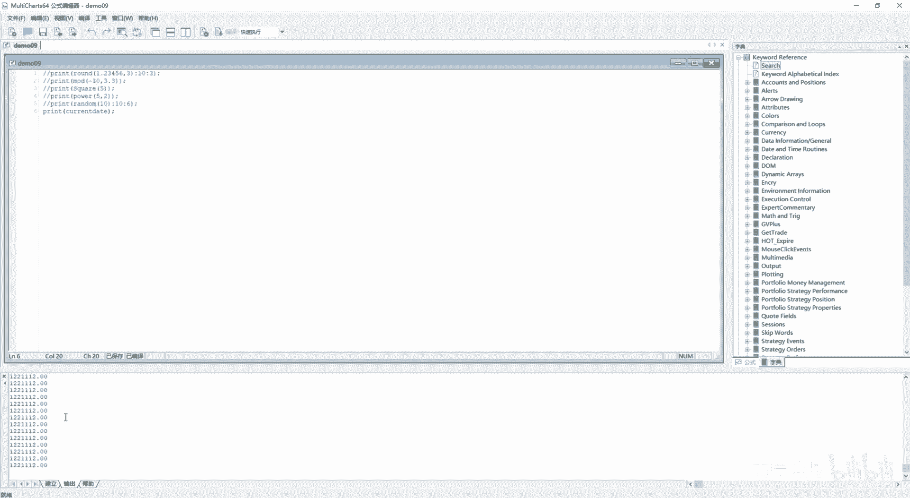

是22年的11月12号啊。

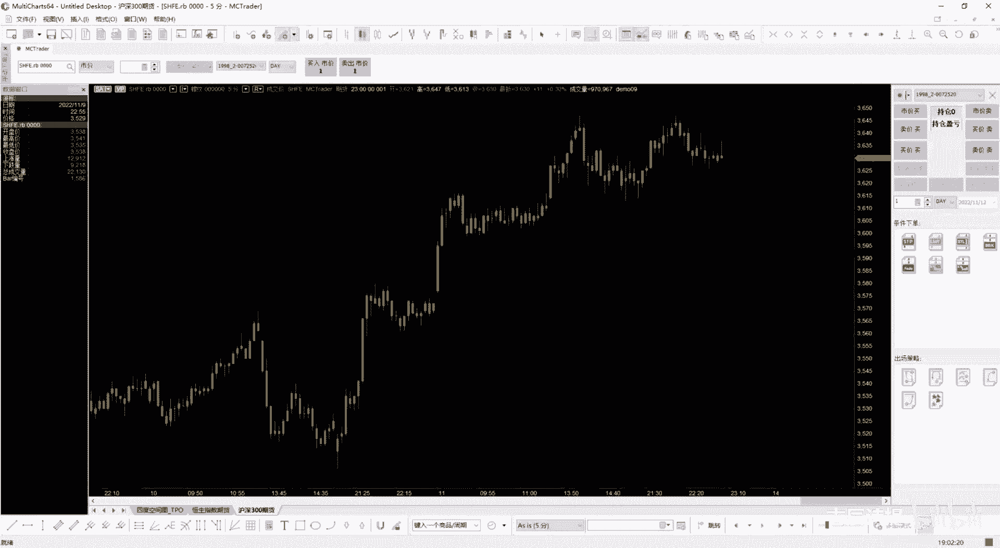

10月12号，这个就就是当前日期嘛，其实是以这个计算机本地时间为准的啊，然后last calculate，calculate就是咱们一看到这个就是这个单词，就是计算的意思。

计算date就是最后一个就是日期，猪其实就是柱状线的最后日期。

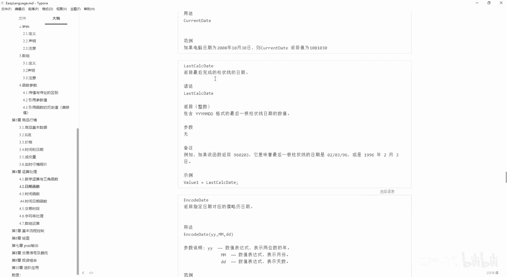

比如说咱们看这个图，它的最后日期是多少啊，就是啊11月11号，因为今天是周六啊，昨天是11月11号，那你可以从这输出一下嗯。

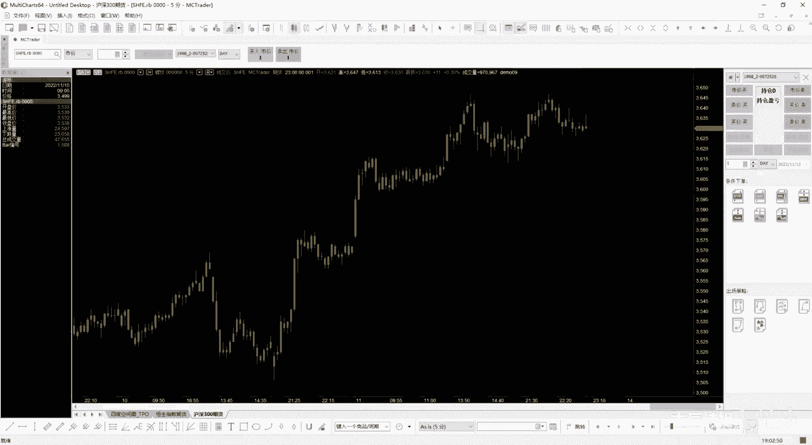

就是printer，last ca calculate date是吧，它虽然不是蓝色的啊，它虽然不是蓝色的，但是呢它也可以直接输入出来。

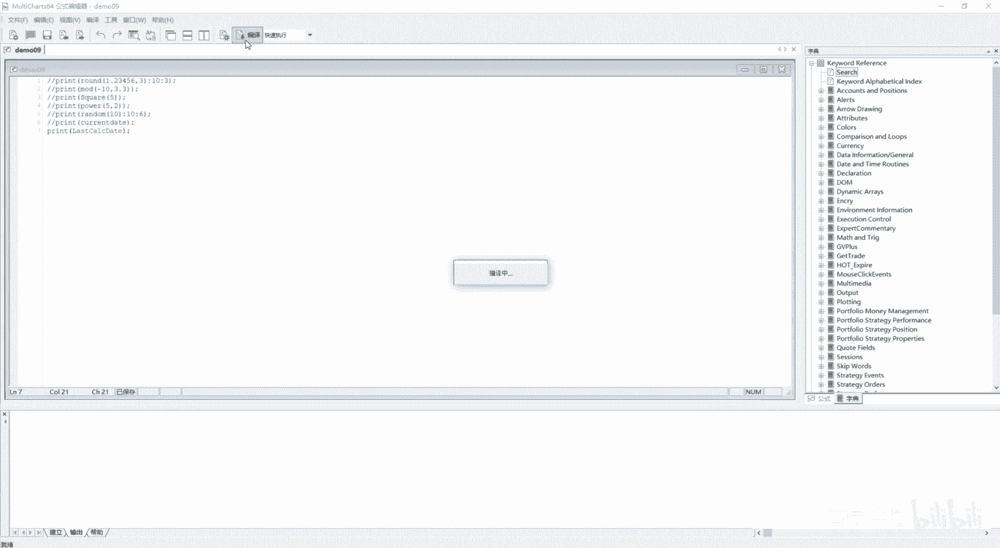

就是12月11号，如果说我把这个柱状图是商品，我给它改成啊，1010号的话。

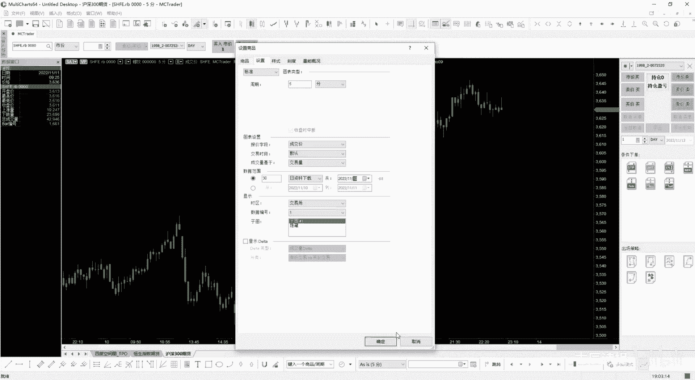

咱们可以看一下啊，咱们再输出一个一清除全部，然后再进行一下编译吧，编译啊你会发现他是12月。

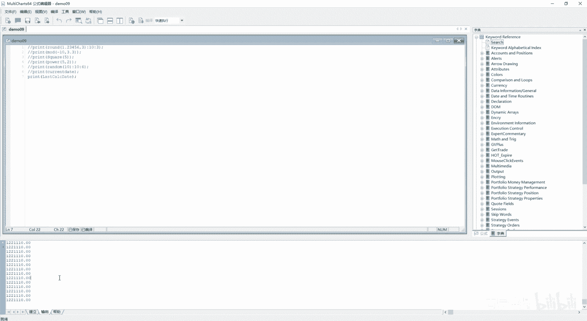

不是11月10号啊，就是柱状线这个图表上的他最后一根K线的。

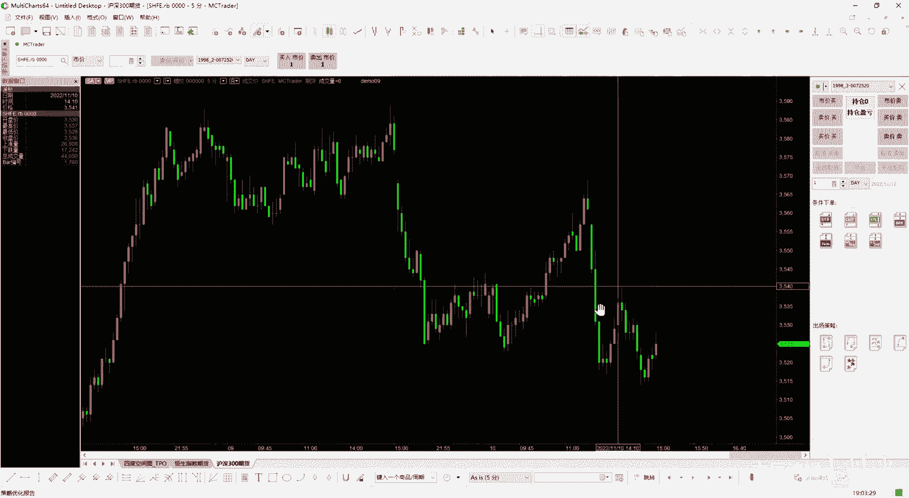

他的这个日期好吧好，后边一个是encode date，就是返回指定日期对应的掳掠日的日期啊，这个它后边这个参数你一定要注意，它是三个数值，第一个表示年份，第二个表示月份，第三个表示日期啊。

他写的YYMMDD，咱们可以去测试一下，好先给它注释掉，把值清空一下，然后print一个encode，这个在这个Python里边它是编码的意思啊，Encode encoding，它后边有三个参数。

第一个参数是年是吧，比如说是22年嗯，比如说10月1号是吧，当然如果按照他的标准的话，你应该写零一，对不对啊，这么来写，然后进行一下编译是吧，他就是44835啊，这个是它对应的。

就是从1900年到现在经历了多少天啊，当然他1900年，1月1号是代表着第二天对吧，然后但是如果这我写上零零呢，零零它是代表了什么，是代表1900年还是2000年呀，清除一下啊，咱们把它写成一啊。

这如果说写成一行不行啊，不写零一行不行也是可以的啊是吧，当然这个一看就看出来了，他是代表的是其实是00年的，就是3000啊，3万6000多天嘛，一年大概是360天，你是你100年就是3万6000天。

加上那个其余的数嘛是吧，所以说它是代表00年的，那如果说我想查看九几年的呢，前面加上一九嘛是吧，咱们可以测嘛，对不对啊，这个应该是表示第二天对吧，第二天没有问题吧，啊所以说这个后边的第一个是年啊。

第二个是这个月份，第三个是这个日期，你没必要说要写两个数啊，你只要表示出来就行，当然如果说写三个数行不行啊，比如说122122它是代表什么呢，咱们看一下啊，一二他就会给你输出零啊，给你会输出零。

但是你二二的话，它又代表的是22年，对吧啊，这个你一定要理解啊，理解就是一切为以这个测试为准，当你有一个词你不知道怎么用的时候，你就是去测试它。

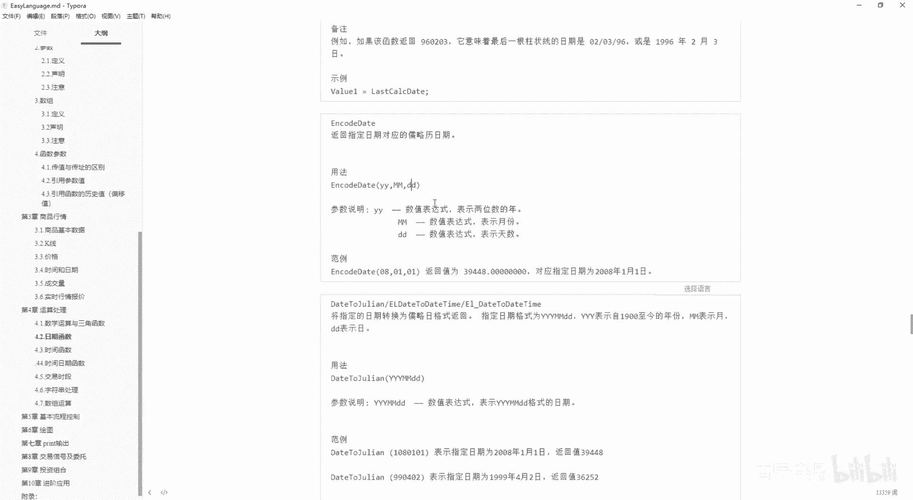

当然还有一个范儿啊，如果说你想找一个，就是你知你知道一个这个呃。

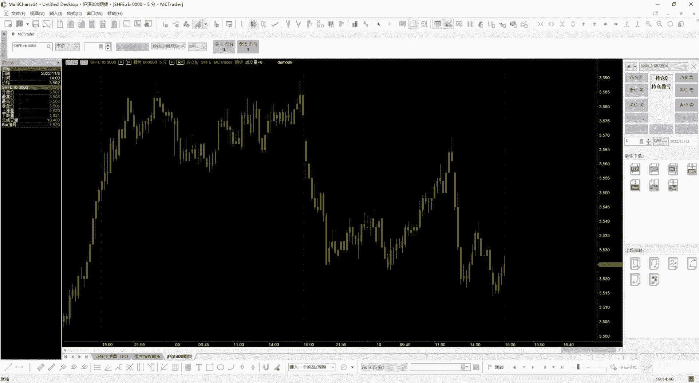

就是这个关键字你不知道怎么用了，就是你忘了这个词怎么拼了，你可以右边右边它有一个字典，看见没有公式，咱们一般情况下是这么来演示的，但是它其实你可以去点到字典的，然后这有个search。

search是查找的意思，你可以从这查找，比如说你输入内容，比如说我输入成交量，嘿一搜，然后从这儿就会有是吧啊，optics volume啊，当然这个里边只要是显示成成交量的词，它就会都有啊，都有。

当然你也可以搜这in co的啊，cod我不知道怎么它是个什么意思了，哎encode date是吧，就是这啊，其实这个课件就是这个，基本上都是从那里边复制粘贴过来的啊，都是复制复制粘贴过来的。

他的标准的示意啊，好后边咱们讲这个date to july，E l date to daytime，这个其实就很好理解了，Day to you to july，是什么意思，就是将指定日期的格式啊。

转换为掳掠日格式返回出来，你看e el date to daytime，就是e el date嘛，就是咱们这个easy language里边，它的这个日期的显示方式，然后转换成这个daytime。

就代表列日的这个日期显示方式啊，包括E2下划线date是吧，它有这样的三个，就是将日期EL的日期转换为掳掠日的格式，返回咱们刚才说的就是之间相互的转换，对吧好，我还是点到这了啊，我EL的日期。

比如说我嗯print一个，啊EL日期我还是用value1给赋一下值吧，比如说value1哎，就是用date吧，就是这个EL下划线这个date to daytime是吧，用这个。

然后第一个是e l date，我就用date来表示，这个date是代表着就是说呃，柱状线上面的它的日期对吧，柱状线上面的日期，然后我整体的给他print一下嗯，好进行下编译，然后输出是吧。

4487544875，咱们那个如果说你date这写上，我直接写是这个122年，就是今天是11月呃，12号啊，11月12号，然后我再进行一下编译，这后边就变成七七了啊，七七了对吧啊，额这个就就是转换嘛。

这个就没什么好说的了，后边你只要放一个数值进去就可以嗯，既然可以将ER的日期转换为入列日的，肯定可以把乳列日的日期转换为这个EL的，就是july to date，但这个它只有一个关键字啊。

July to date，后边就放你的july date，其实也是一个数值是吧，也是一个数值呃，它返回的也是E2形式的，同样的2000年以后的它是七位数啊，2000年之前的啊，它是这个啊，不是这个啊。

2000年之前的它是六位数是吧，六位数好吧好，这个我就不多讲了啊，Data tostring，就是把卤略日格式的日期啊，就整数部分啊，整数部分，因为咱们这一章讲的这一节讲的是日期啊，并没有讲时间。

就是把这个鲁列日格式的整数部分的，这个日期啊，然后转换成字符串格式返回，所以说你必然得需要一个字符串格式来接对吧，得需要字符串格式来接，当然就是你返回的字符串不是这样的啊。

这个可能是在就是别的地区的电脑的设置，是这样的，它就会转成这样，其实它跟你本身电脑设置有关系哈，但是咱们如果说给它输入出来的话，肯定是粘在前的好吧，咱们可以看一下，就是这个data tostring。

好data to string s t r痕迹，然后这个里边你应该存放这个是date对吧，而且是得是掳掠日的，掳掠日的，那咱们就先定义一个吧，Vr va20，然后这个里边新定义一个字符串类型的来接它。

对不对，然后掳掠日的我用value1等于这个掳掠日的话，我就这个date to july，然后把这个data给放进去，就是当前K线的这个日期，然后给这个day to you to your line。

让它转换成掳掠日的，然后再把它放到这个呃，就是date to string里边去，因为这个date to stin，他一定得是掳掠日日期的格式啊，这个daytime一定是掳掠日日期的格式，你看到。

但凡解释里边是daytime的话，一定是掳掠日日期啊，然后我用VA20来接一下是吧，因为我VA20，我定义的是字符串类型的，咱们反复说过EL就是easy language。

它的这个变量类型它是它是一种强类型语言，就是对这个你的这个变量类型要求的很严格，如果说你不是相对应的变量类型的话，它会报错的啊，这个时候我输我输出一下这个print这个V20，咱们可以进行一下编译是吧。

2022年11月10号，2022年10月10号，前面肯定还有9号八号是吧啊，这是可肯定会有的，然后如果说我不是字符串类型，我是一个零，它会报错的，你编译都编译不过去是吧，Tapes are not。

就是这个类型不匹配，所以说你一定得是字符串类型的啊，字符串类型的好，咱们接着看下一个，下一个就是string to date，既然你这个掳掠日能转换，能转换成字符串，那字符串肯定是能转换为掳掠日的对吧。

那这个是怎么转换呢，咱们直接看这个范例，String to date，就是你把你的这个就是字符串啊，写成写进去之后，然后他就会有对应的返回值，如果说我按照他这个来写会有问题吗，咱们可以看一下啊。

然后我print一个，好进行一下编译，然后咱们看一下输出是没有问题的，对吧，是没有问题的，但是如果说我把2008放在前面的，比如2022下划线，这样看看它有没有问题，你你会发现他也是没有问题的啊。

也是没有问题的，如果说我22年，是吧，都是一样的吧，对不对啊，所以说这个你要知道它怎么用啊，知道它怎么用就可以了。

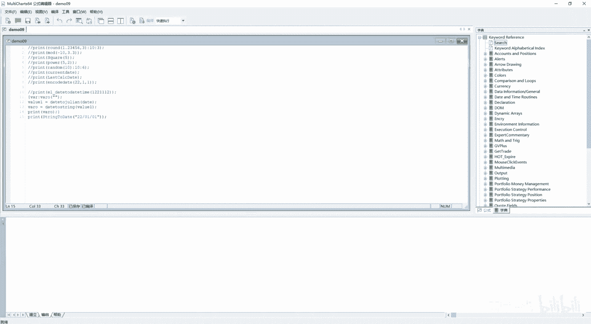