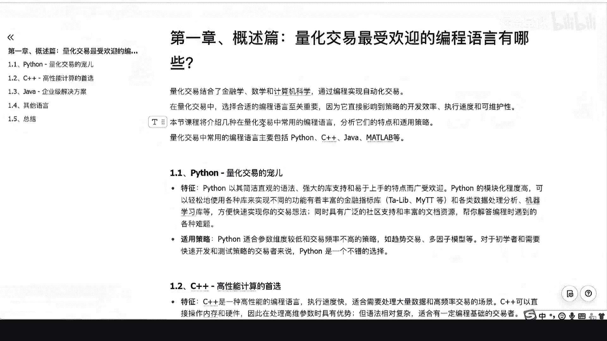
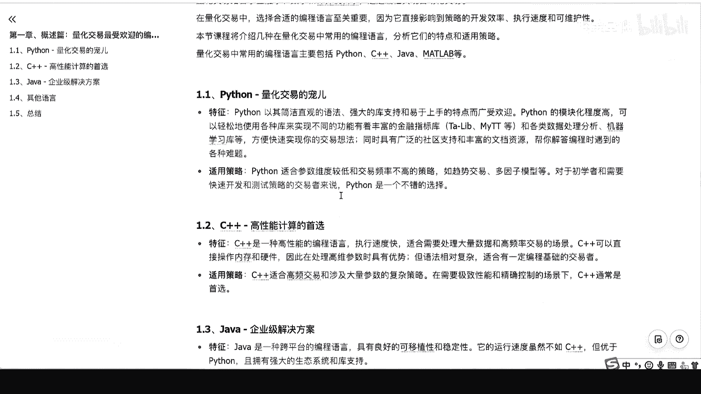
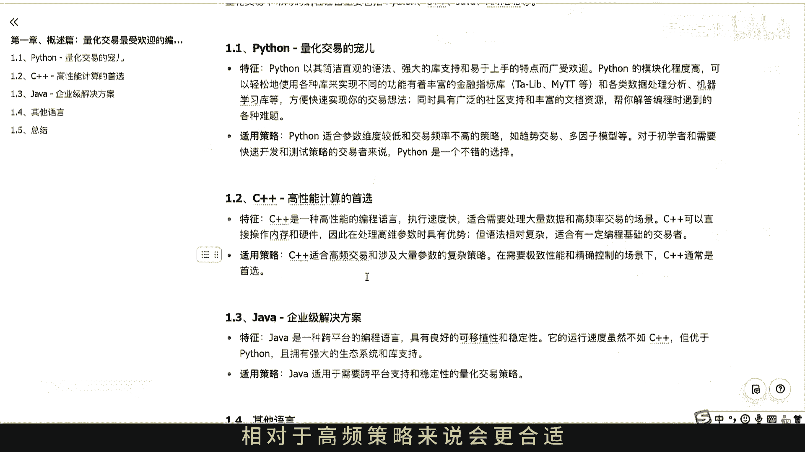
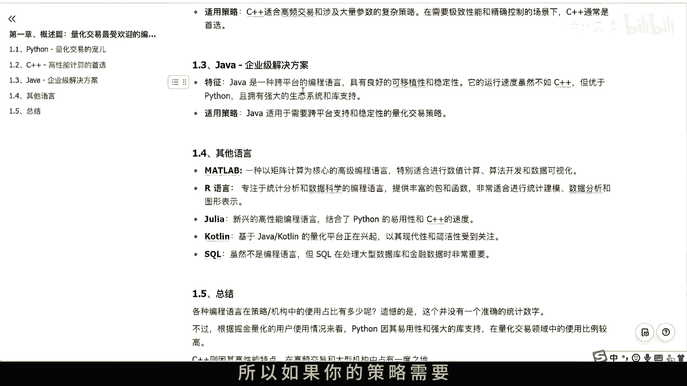
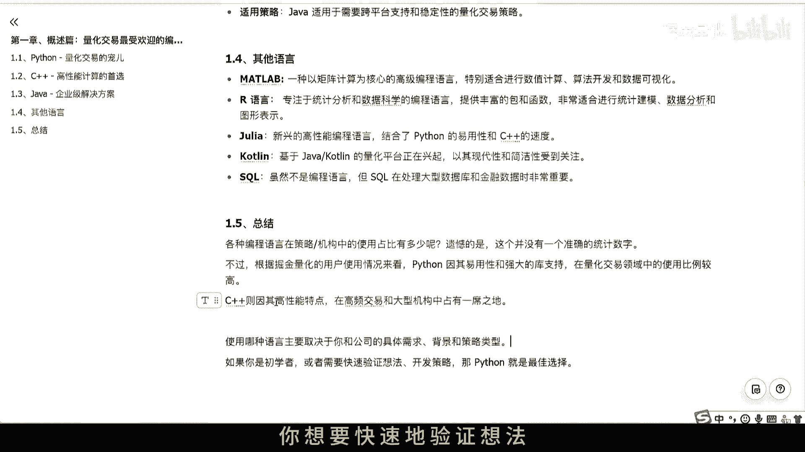

# 第一章：量化交易最受欢迎的编程语言有哪些？ - P1 - 掘金量化 - BV1MS421R7WS

大家好，欢迎来到零基础量化交易实训课程，这是第一章课程概述篇，量化交易中最受欢迎的编程语言有哪一些，如果你想要从事量化交易，那么编程肯定是绕不过去的一门槛啊，因为量化交易是结合了金融学，数学。

还有计算机科学，它是通过编程来实现自动化交易的，所以说编程其实是贯穿了量化交易的，一个全流程好，那选择一门合适的编程语言就很重要了，因为它会直接影响到你，你策略的开发效率，还有一些执行速度等等问题。

同时如果你刚开始的编程语言呃，没有选对，后面要重新去学习一门新的语言的话，那么是也是非常耗费时间和精力的一件事啊，那到底你适合哪一种语言呢，啊这里的话我们不妨先来了解一下。

在量化圈中流行的编程语言有哪一些，他们都有哪些特点和适用场景。

额好言归正传，那么说到编程，那么肯定可能就会有听说过Python啊，因为Python因为其简洁的呃语法，还有强大的库，字词容易上手等特点，最近几年是广受欢迎的，使用的人数是越来越多的。

而在量化行业当中的话，Python的呃第三方库这次是很丰富的，它比如说呃常用的MTT金融库指标，还有pandas，NPD数据处理第三方库，还有一些强大的机器学习库，这些库呢能够快捷的帮你实现交易想法。

同时呢由因为Python呢具有很广泛的社区支持，还有丰富的文档资源呢，它是能够帮你解答编程时遇到的各种问题的啊，这些特点，就当它成为了量化交易的一个宠儿了啊，当然了。

Python也不是十全十美的Python，因为他这些容易上手的特点呢，它的一个运行速度相对于C加加来说的话，并不是特别高的啊，所以呢Python它就适合哪一些策略呢，就适合这些额数据运行数据比较低的啊。

交易频率不是特别高的策略，比如说趋势交易，多因子模型等等，对于初学者来说，或者你想要快速的开发策略的人来说的话，Python是一个非常不错的选择，那么刚才我们有提到过C加加，那么C加加其实是一门啊性。

高性能的一个编程语言啊，它的执行速度是很快的，它能够处理大量的一些数据，还有啊高频交易的情况啊。

他的这个优势呢啊，就是就导致了它适合一些高频交易的策略，还有涉及大量参数的复杂策略啊，比如说我有一个精细的tick层的套利策略，那么套利策略其实对于价格的敏感性，是很高的啊。

策略这种策略就要求你对于呃时间的延迟性啊，很高，同时呢能够快速的运行起来啊，所以来说Python额相对于高频策略来说会更合适。

当然除了这两种编程语言呢，还有一些编程语言，比如说java，java呢是一门跨平台的编程语言，它具有非常好的一个可移植性，虽然它的运行速度啊不如C加加，但是它是远优于Python的啊。

同时呢它的一个生态系统也是很完整强大的，所以如果你的策略需要跨平台支持的话。

那么java肯定是首先首要的解决方案啊，同时呢市面上还有很多其他的编程语言，比如说在高校中比较流行的MATLAB，MATLAB呢是一种以矩阵计算为核心的编程语言呃，同时呢。

还有一些专注于统计分析和数据科学的R语言，还有最近几年兴起的JULIAN，还有cot line on语言好，还有SQL语句，虽然SQL语句不是一种编程语言的，但是SQL语句这种啊。

数据库查询语句呢在处理大型数据库啊，还有金融实际中非是比较重要的，因为我们的策略其实也往往会涉及到一些，数据库的这个查询和交互做的工作啊，啊那这么多种语言的话，其实在每不同的策略和不同的机构中。

多多少少都会有涉及到啊，但具体来说要说哪一种编程语言是最流行的，那可能并没有一个准确的统计数据啊，不过通过我们的一个经验来说的话啊，Python呢其实因为它强大的第三方固执值，还有易用性的特点啊。

在量化领域中是使用的频率是比较高的，另外C加加因为它高性能的特点，在高频交易，还有大型机构中是占有一席之地的啊，不过呢C加加因为它的上手难度是比较高的，所以呢这里的话建议有一定编程基础的。

用户朋友再去学习这个C加加，会比较方便一点啊，所以呢在这里你想要学习哪一种语言，适合哪一种语言啊，这可能取决于你和你公司他一个具体的需求，还有背景，还有策略的类型了，总体来说的话，如果你是初学者啊。

你想要快速的验证想法。

开发策略的话。