# 策略之光第 17 期 机器学习量化交易的艺术 目标函数的设计 - P1 - 量化老何 - BV1Rt42137Li

好时间差不多，周老师在吗，啊在的在的啊，OK啊那个我们今天的分享是有录制的啊，那如果错过的同学也可以看录播，然后非常荣幸，今天晚上我们策略之光活动第17期又能有呃，邀请到周老师跟我们分享，继续学习啊。

这量化交易方面的一些内容好那我就不多说了，剩下时间交给周老师，好的好的，啊大家晚上好，那个今天讲的题目是机器学习的目标的定义，当然的话我们这个场景是交易的场景，不是通常的这个机器学习。

或者说AI的这样一个场景啊，啊我们用量在这个呃，通常大家可能会比较关注这个，一般是关注的算法啊，比如说超参数的一些调仓啊，这些东西可能关注度会比较高，往往容易忽略两块，第一块的话就是这个特征工程。

第二块的话就是这个目标的定义，特种工程的话，我们上次其实是有有讲过的啊，上节课的那个也有录制的内容，就是感兴趣的朋友也可以去听一下啊，这次的话我们要讲的是，这个学习机器学习的目标是这样的一个定义。

那在量化交易里面的话，他这个目标的定义的话，跟通常的这个机器学习的这个目标定义，通常这个AI的这种目标的定义，可能会有所不一样啊，今天我们那个会给大家分享一下，这方面的一些相关的内容。

PPT大家参考一下就好了，有些内容的话可能不定是PPT上上有的，通常来讲的话，我们我们就是通常见的比较多的，这个在量化交易里面，积极学习目标的这个定义的话，一般是这个会从预测的角度。

就是监督学习的角度定义这个目标，比如说预测涨跌，预测涨跌多少，或者说这个预期预测这个排名的顺序啊，那就是监督学习的这样的一个角度，就是大家通常用的会比较多的，那实际上的话其实现在也会比较流行。

另外一种方式，就是这个半监督学习的这个强化强化学习，那强化学习的话，跟我们这个通常的这样的一个预测的，这样的一个目标的定义的话，其实会有一些不一样，因为其实大家都知道就是我们去比如说预测了。

比如说未来某某一段时间的这样一个，涨跌之后啊，实际上的话其实它还是不能形成一个完整的，这样的一个交易策略的，因为涨跌的话你可能有很多种交易的方式，我什么时候入场，什么时候出场。

那就是说后面其实还有一个执行策略的制定，和执行的这样一个动作啊，这样的话就是说我这个预测加这个策略的，执行落地，其实才能够形成一个完整的这样的一个，交易的这样的一个策略的路径啊，那那在这个里面的话。

就是我们这种呃监督学习的，这种目标的这个定义，这呃这个预测的这样的一个环节的话，实际上是在我们整个的交易的这个流程环节，中间的一部分，那从这个监那从这个强化学习来讲的话，它会有一些不一样。

它不一样在哪里，就是说它是直接的目标，就是直接就是这个交易的动作，交易的策略啊，它的不同会在这里，会会不会在这里，后面的内容的话会给大家去详细的分享，有的分享就是说这个强化学习。

我们和通常的这个预测的监督学习，到底会有什么区别，怎么样去融合，怎么样去组织他们之间的一些关系啊，后面会讲到一些相关的具体内容，中间有问题的话，大家随时可以在这个聊天屏幕里面提出来。

嗯这个大家看一下就好了啊，就是反正这个目的的话，课程对象的话就是对这个咱们这个机器学习，量化交易是比较有感兴趣的啊，受众的话也是我们这个金融科技的啊，从业者会比较啊，对这个投资领域感兴趣的一些人士。

那通过这个课程的话，就是我们会分，让大家就是去去获得三三个方面的一些东西，一个就是使用的技能，就是怎么去设计这样的一个啊，机器学习的这样一个目标，提升这个交易的策略的这样的一个有效性。

然后中间我们会分享一些案例和这个。

实操的体验，大概是这样的一个东西，那从这个具体的内容来讲的话，会有五块，第一个就是呃去呃分享一下，就是我们这个预测目标定义的这样的一个理解，和这个问题背景，第二个的话就是啊，对于这个呃监督学习来讲的话。

这个像标我们这个预测的目标，实际上就是标签，怎么去标记它标记的类型的这种生存的方式啊，第三块的话就是机器学习，应用应用这个标签的预测是怎么去做的，第四块的话就是会讲一下，就是当我们定义好这些目标的时候。

你会发现实际上有时候会出现这个，数据不平衡的情况，包括数据的一些多样多样性的一些情况啊，这个时候我们应该怎么去应对，第五块的话，会给大家分享一下这个一些相关的一些案例。

呃首先呃我们还是讲这个通常的监督学习的，这种预测目标，这样的一个定义，强化学习的我们会放在后面再去讲啊，因为他们之间实际上是有很强的关联性的。

那首先来讲的话就是呃，哎呀有几个，有几个，这个这个通常的这个交易的这样的一个概念，大家看一看就好了，这个我相信大家都是比较感兴趣的，应该就不需要我再去去讲这些基本的概念了，一些简单的介绍。

这个大家看一看就好了啊，实际上的话，就是对于我们这个交易场景来讲的话，因为这个市场的复杂性和这个决策的这样的，一个复杂程度啊，这样的话就是能给我们带来的，这样的话这个预测的目标这个定义的话。

就是预测目标定义的一个好与坏，会直接影响到我们这个最终的这个，决策的这样的一个质量啊，决策的一个质量，呃当然的话就是我们一般去定义这个目标的话，就最终肯定是追求这个收益的最大化。

然后在一定的风险控制条件去做这样的事情，那怎么样去定义这个目标，能够去比较吻合这两个要求，一个是收益，一个是这个风险的控制啊，风险的控制啊，那通常来讲的话，就是从这个预测的角度来讲的话。

我们会会去考量几个方向啊，几个几个几个大的方向，第一个方向就是时间的方向，第二个方向就是空间的方向啊，那个还有一些的话就是会结合这个时间和空，间的这样的一个组合，那从时间的方向来讲的话。

就比较其实是比较简单的，其实最简单的就是，比如说我预测未来一天或者未来半天，为了一个小时这样的一个场涨，跌的是社会涨还是跌啊，这是从时间的角度，我先把这个时间框框住，预测这个时间的力度。

当然的话这个时间力度可以预测短期，也可以预测中长期的啊，这是从时间的角度，另外的话是从空间的角度，从空间的角度来讲的话，就是我可能会预测它涨到未来的话，它可能最大涨到可能什么程度，好。

未来比如说一天之内可能会涨到什么样的程度，或者说那个它跌可能会跌到什么样的程度，这是空间的角度，那对于我们来讲的话，就是时间和空间，其实是我们整个所有目标定义里面，是要最关注的这样的一个对象啊。

为什么这样说呢，因为首先时间是我们收益的累积的，这样的一个一个一个呃啊，累积的这样的一个补偿的力度啊，时间越长的话，我们可能累计累计的收益可能会越大，但空间的话是，我们每一步可能获得这样的一个收益。

如果没有空间的话，你这个时间再长，那可能也没有这样的一个收益，所以所以的话其实我们通常去做的时候，会时间空间都会去考虑，为什么都都要去考虑，因为我们除了这个时间上累计收益之外。

另外的话我们还要考虑这个风险的情况啊，比如说我预测未来一天的这样一个涨跌，那中间它有可能我我现在是预测，未来它可能会涨，但是中间的话有可能会跌到跌到一定程度，那这个时候的话。

就要把这个时间和空间结合起来啊，空间和时间结合起来，结合起来的话，那其实就是我会把这个止盈止损可能会加进去，比如说我预测未来一天之内它可能是涨还是跌，然后在中间我可能会设定一定的那个，止损和止盈啊。

这样的话就是结合这样的空间的概念，时间和空间结合在一起，这是通常我们去设计目标的时候，会去考虑这样的一个东西，通常来讲的话，我们设计目标的时候还要考虑另外一个问题，就是我们通常做当然了，A股股。

A股市是比较特例，它只能做多，做多的话，实际上你会发现很多时间不动，其实你可能会更更合适，但是我们很大多数市场，尤其是比较相对比较公平的市场来讲的话，我们是同时可以做多和做空的，那这个时候的话。

我们设计的时候，就会考虑我们这个多空这样的一些对称性，多空的这样的一个对称性啊，我这边可以呃，可以就中间给大家看一下相关的一些例子。

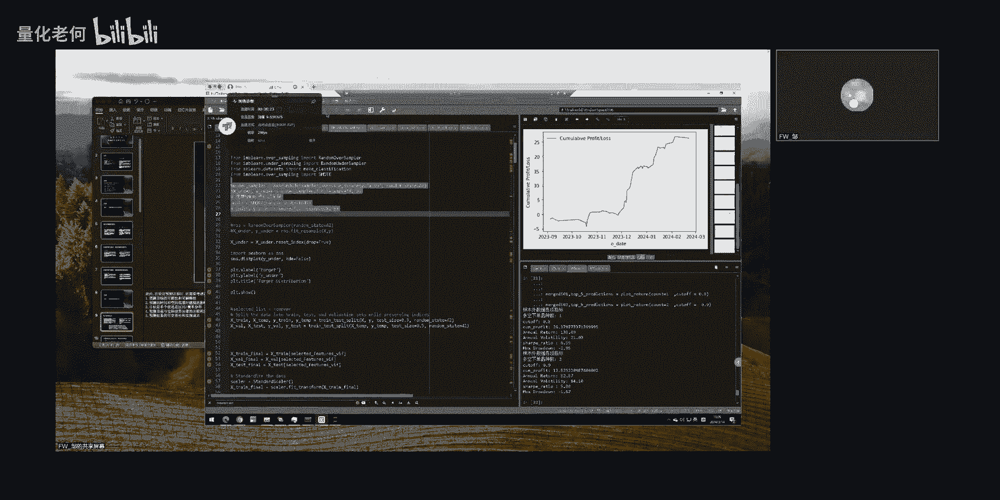

我这边有一些例子可以直接给大家看啊，稍等一下嗯，这边是对，这是我做的一些例子啊。

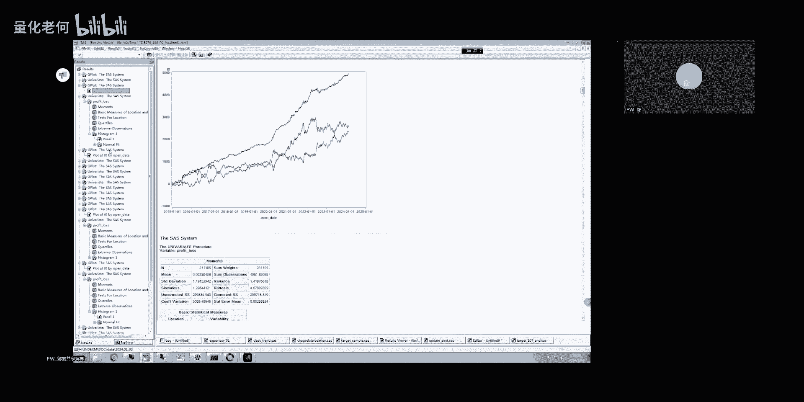

大家能看到这个图像图像吗，能看能看到的，给那个聊天里面给我发个信号，能不能看到，刚才我切换了这个窗口，切换了窗口，啊OK那我继续啊，呃首先的话就是这边的话，你看这这第一张图，这个上面是一个红色的。

是这个啊那个做多的这样一个曲线，这个蓝色是一个做空的这样一个曲线，呃，这个图有个非常非常呃，非常的一个有趣的一个特点，就是它其实是一个对称的，那这个的话就是可以看到。

就是我们上一期讲的那个因子工程设计的时候，里面会有一个预测未来，比如说一天他的这样的一个涨跌幅，那涨跌幅的话，就是说我同时我可以同时这个对于某个品种，同时做多和做空，那就会出现这样的一个情况。

就是我两边都做的话，那肯定合起来是这样的一个一个，一个基本上为零的，这样的一个平衡的这样的一个状态啊，那那那这样去做一个什么样的好处呢，就是说我们机器学习的话，在这种比如说这个在这个多上涨空间的话。

我们会尽量的让这个机器学习，他会选这样的一个路径，那在这个呃多下跌，然后空上涨的时候，我们会选择空这样的一个路径，然后然后在这个想反过来的话，就是我会尽量让这个通比如说做的越少越好啊，越越越少越好。

这样的话就是说对我们这样的一个设计的时候，会出现一个一个多，就是我在这个市场是做整个市场是往上走。

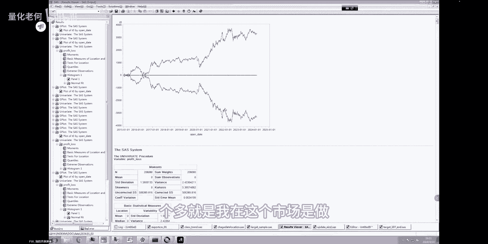

往上走，或者整个市场是往下跌的时候，基本上都可以去进行一个合理的交易的配比啊，交易的配比，那这是典型的这样的一个对称的，这样的一个情况，这样的一个设计就是，然后还有一种的话就是带有这个止盈止损的啊。

等一下啊，呃这个的话就是从这个收益的角度来讲的话，它就是一个典型的一个正态分布，两边的话多和空的这样的一个一个收益的情况，它就是一个典型的正态分布，两边都是这个完全对称的，完全对称的这样一个情况啊。

呃然后另外一种方式的话，就是考虑到止盈止损啊，这边是一个，这边是分享了一个典型的止盈止损的，这样的一个目标设定的一个情况，红色线也是多，那个蓝色线也是也是空这样的一个曲线啊，这边和这边这个绿色。

绿色的曲线的话是一个自然和，就是两两就是多空合成合起来的，这样的一个一个叠加的这样的一个曲线啊，当然的话这里是没考虑手续费的，就是做我设计这个目标的时候，先只是考虑这个完全多空。

没有考虑任何手续费的情况，下面它会自然成这样的一个曲线，这个时候你你们可以可以看到，我这个多上涨的时候。

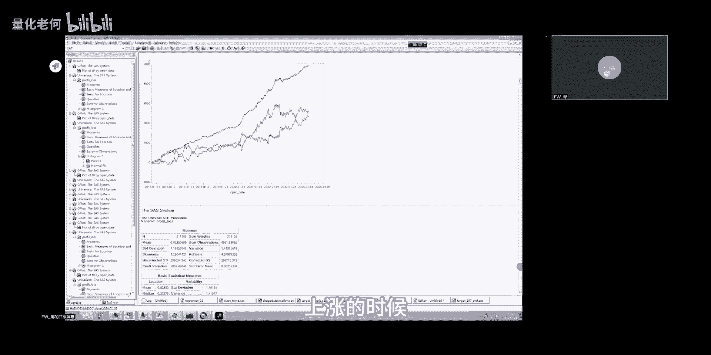

其实空可能是有啊，尽量是会有一些下跌，但是尽量会跌的比较少啊，那那那空那个空上上涨的时候。

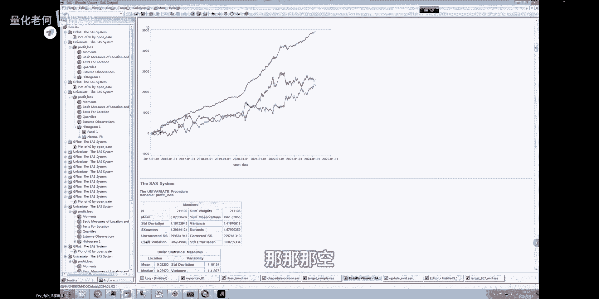

你看这边的话对应的是这个多是下跌的。

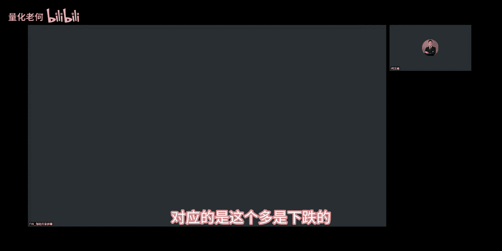

就是说我我不管这个市场是是多还是空，它总它合起来的话。

它总是可能会往上走，往上走就至少要保持这个往上走，或者说保持这个相对像前面第一个案例的话。

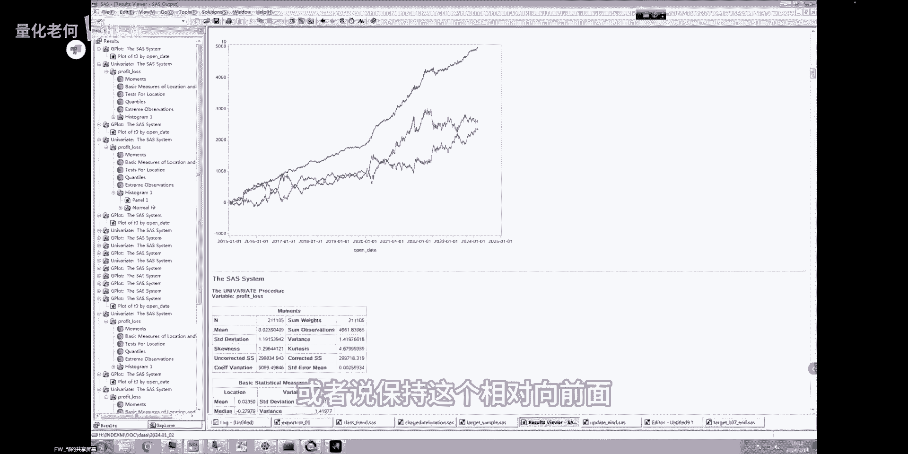

就保持在那个平衡，那这个的话是一个典型的这样的一个，一个小小止损大止盈的这样的一个一个案例，它的分布的话，就会跟刚才那个那个分布是不太一样的，我们可以看一下这个分布的情况，啊我们看一下这个分布的情况。

看看见没有，大家可以看一下这个图，这这个分布的话就会跟刚才不一样，刚才是一个典型的正态分布，这这个分布的话是一个一个典型的这样的，一个有偏的，这样的一个偏偏向于这个止损这一块的。

那就是小止损这一块的一个分布，因为小止小止损的话，就止损的这种次数相对会比较多一些啊，这个的话就是可能我们的样本里面，我们的样本里面到时候就会出现不平衡的情况，那这个大止盈的这一块的话，相对来讲的话。

它整个的样本样本量就会少一些，会少一些，但是从止盈止损的角度来讲的话，就是说我这个止盈可能空间会放的更大，止损的话空间会放的，相对来讲的话，就会受到一定的这样的一个控制啊，受到一定的这样控制。

那这这个的话这种设计出来的，这样的一个一个角度来讲的话，就是说他这个多空的样本，多空的样本它是不平衡的，前面那个是多空的样本是平衡的，是平衡的啊，这是两种两种不同的这种方式，不同的方式。

还有一些案例的话，就是可能会做一些截断的，这个大家都可以去参考嗯，看一下，这边直接给大家跑跑一下吧，这个是这个是在那个基础上做了一些改进的，做了一些阶段，也就是说他这个阶段的话，就是说我这个还是小止损。

小止损啊，但是呢我这个利润空间我是放开的，利润空间是放开的，就是我不止盈不止盈，你会发现比刚才的数值要大很多，刚才大概是6000的样子，现在的话基本上去到八千八千多。

这样的一个数值啊，这这也是我们通常做通常做交易的时候，会考虑的，就是我同我会有平时会有这个小的止损设，设，那个线设在那里，但是一旦这个趋势跑开的时候，我这个止盈这一块我就让他利润奔跑啊。

这也是一个通常的这样的一个设计的思路呃，截断这一块是什么意思呢，就是说呃我我会看一下，看一下下面这分布图，大家就可以可能会比较容易理解啊，你会发现这个，你看这个图跟刚才是不是有点不一样，有点不一样。

中间的话有一个缺口在这里，有个缺口在这里，那为什么会出现这样的一个情况呢。

就是说呃实际上的话就是呃你会发现，如果如果你这个止损太小的时候太小，比如说你那个止损可能就跑了个呃，呃一跳两跳三跳，如果太小的时候。

其实你那个利润空间其实也很难放大的，因为你总是碰到止损线，你这样的话就就会带来这样的一个，你未来那个那个那个利润空间的这样的，一个损失，那这个时候怎么去做，就我我就把这个止损我就做了一个一个阶段。

比如说我设了一个假设，要设立一个0。5%，我至少是有这个0。5这样空间的活动空间，允许他在这个空间去波动，那这个相对应的话，这个利润空间可能就会放得更大，那这个时候的话就在这个位置。

它就有一个大的这样的一个。

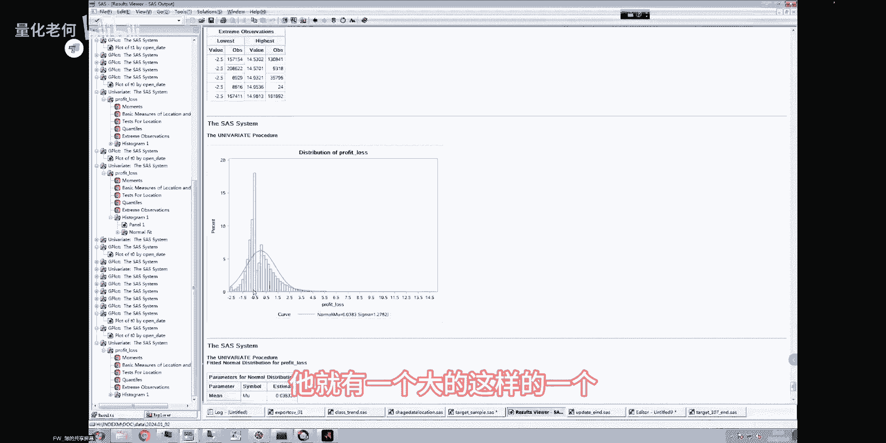

这边就是一个0。5，这个位置截断在这个位置的话，这个这个这个数值就会看起来会非常大，那中间的话这边的话就会变冷，就会变冷变小，就会有这样的一个空缺啊，然后两边的这样一个分布的话，就跟刚才是是比较一致的。

比较一致的啊，比较一致的，然后这边的话就是是是两端阶段，一个是最小的这样的一个一个止损阶段，另外的话是最大的这样的一个止损的阶段，这这边的话你看到最大，我就在2。5这个位置截断了。

截断了我就不让他这个损失再往往下面跑了，但是刚才那个是有点不一样的，看一下啊，嗯应该是，你看刚才这个的话，它就去到3。6是不是更多啊，也就是说这个损失有有可能，中间有某某几笔的损失，可能会去掉3。

6或者或者四，或者或者或者五个或者更多，那这个时候是没有控制这样的一个一个，最最大值啊，所以截断它其实就是说，我保证这样的一定的风险程度，它实际上是这样的一个概念，这样的一个概念啊，它是。

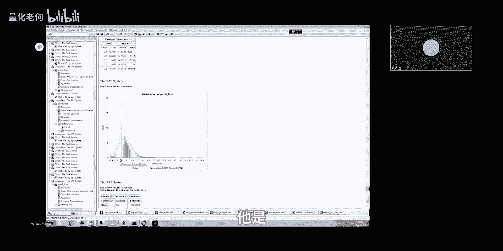

呃然后回到我们PPT啊，回到我们PPT这个。

嗯这个的话就是实际上刚才的话，就是也会结合这两大方向，去做这样的一个思考啊。

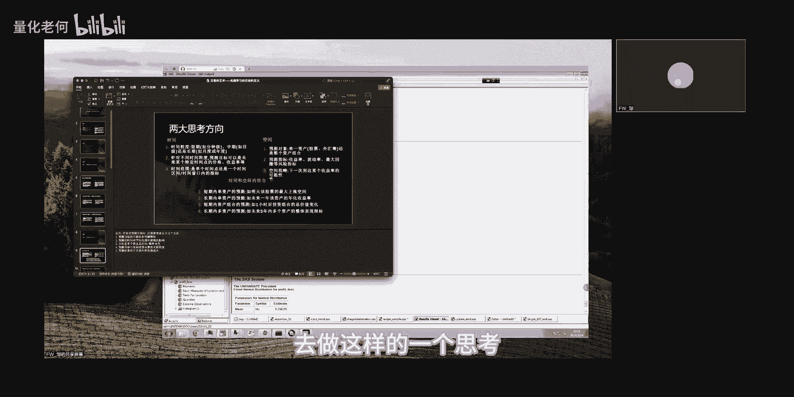

那归纳起来的话，就是它可能会有几个这样的一个一个啊，一个类型，第一个是回归类的，是这样那样的一个目标，回什么，为什么叫回归类的，比如说刚才的话，那个是从分布的情况来讲的话，它是连续的这样的一个序列数值。

那如果我们直接预测这个序列的数值的话，那就是做回归，那就是回归回归的目标，那还有一种方式的话，就是我把这个直接做成分类，我直接做成两类，上涨和下跌啊两类，这也是一种一种设计的方式啊，一种设计的方式啊。

啊然后另外另外一种方式的话，就是这个传统的这样一个，时间序列的一种方式啊，这里面就不详细去去给大家去讲了，呃当然的话还有一些其他的一些方式啊，比如说基于价格的变动啊，基于这个呃技术指标的方式啊，啊。

第三个比较有意思的，就是基于一些金融事件的这样的一个标准，生存的方式，这个其实在中国，我觉得还呃经常会有这样的一些事事情发生的，比如说突然那个某个那个什么内蒙古，那个煤矿突然又坍塌了哦，那这个时候的话。

第二天可能这个这个这个跟煤跟能源相关的，这些这些大宗商品的话，可能就会发生这样一个大的一个剧烈的变动啊，那那最典型的就是如像大家做机器学习，应该对这个内内存条应该是比较敏感。

那内存条的话经常是1~1到某个时间段，那个那个比如说韩国的某个什么生产，那个内存的三星的那个工厂，然后又着火了那个内存条，然后马上又涨价，这这种话就是典型的这种金融。

金融事件的这样的一个标签的这样的一个方式，当然的话这种这种方式的话，就是比呃比较难去用机器学习的方式去训练，因为它的数据来源相对来讲的话，就是不是那么比较规范化，比较规范化啊，它是这样的一个情况。

这个是举举的一些例子啊，实际上的话就是呃像第一种方式的话，就是我就预测这个嗯，未来一段时间内的这样的一个涨跌，这个就是典型的这样的一个基于时间的，这样的一个方向能去考虑的啊，然后第二个的话。

这个是呃基于这样的一个价格区间的，也就是说预测未来这个一个小时内，具体能够涨到这多多少的一个数值，这个是时间加空间的这样的一个方式。

第三种的话是时间序列了啊，这个也是一个通常采用的一些方式，呃有了前面的一些基础的话，我们下面的话来讲一下，这个机器学习，怎么去去去应用于这个标签的预测，因为我们最终还是要做这样的一个事情。

就是要把这个这个目标能够能够预测出来啊。

那当然的话，这边最典型的是这个监督学习的方法啊，监督学习的方法，那监督学习的方法的话，基本上呃那个概念的话，大家可以自己去看一看了，这里就不详细讲，这样的一个一个建筑学习方法的概念，我们通常的预测的话。

都是属于去这个监监督学习的方法，这样的一个一个范畴啊，基本上就是我有这样的一个目标设定在这里面，告诉大家这个目标怎么去去达成好，那从这个生成的流程来讲的话，这个也是一个通常的一个标准的流程啊。

标准的流程，那第二就是数据准备，第二个特征工程，第三个是模型训练，第四个是这个预测目标的这样的一个一个生成，生成啊，呃特种工程的话，我们上上上一次课程。

那个那个公开课程里面是有讲过的啊，这这个特种工程的话，我觉得我觉得在我们整个这样的一个机器学习。

就是在量化应用里面，最我我比较关注的两个东西，第一个就是目标设定，第二个就是特征工程啊，基本上这两个你做做好，到后面的话，其实模型训练相对来讲的话，你按正常流程来走，基本上都是算是比较OK的。

呃除了这个监督学习，那另外一种方式就是这个强化学习，强化学习，强化学习的话，就是那会跟监督学习会有一个比较大的不一样，就是他从这个训练的方式来讲的话，大家可以去去看一下，它有一个所谓的环境的这个概念。

还有一个智能体训练的概念，有个标签生成的概念啊，光看看这些概念来讲的话，是有点难去理解的啊，包括我带的一些一些博士生，他们有时候他们看看书，看看课本，总是不能理解这个强化学习到底是搞什么鬼啊。

但但是的话实际上的话就是这个强化学习，跟我们通常的这个这个监督学习，比如说这个预测其实是有很大的关联关系，很大的关联关系的啊，我我们回想一下，像这个呃做预测这样的一个建筑学习。

比如说我们做一些回归或者分类，目标分类的这样的一个预测啊，预测完之后，比如说我这个预测涨，预测这个未来它这个股票的涨涨与跌，预测出来之后啊，这个东西的话我要去，我要去形成这样的一个交易的逻辑。

交易策略的时候落地，它还要设计一个那个交易的一个逻辑的，那那比如说我这个要设计这个入场的时机啊，然后还要设计这个出厂的设计，然后中间可能还设计这个止盈止损，还是设计这个怎么去啊。

那个分批的那个出出厂的入场啊，这样的一个东西，那实际上的话这这个角度来讲的话，在在我们这个强化学习里面，它其实就是他的一个训练的目标，他的训练的目标就是我要怎么去啊。

形成这样一个比较UU的这样的一个动作系列，能够达成我这样的一个最最终的这样的一个，一个一个收益的最大化最大化啊。

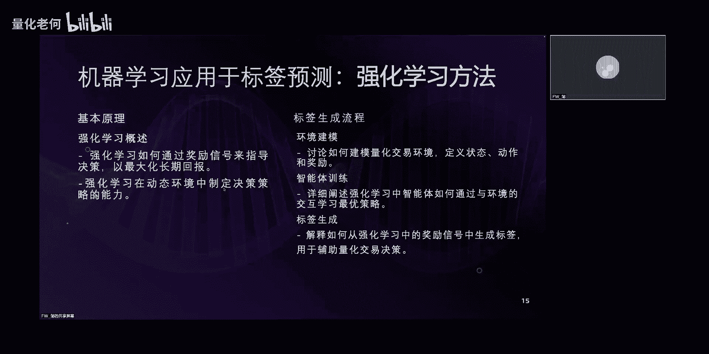

当然中间可能会加一些这个风险的，一些控制的指标在里面，那那你那这样去理解的话。

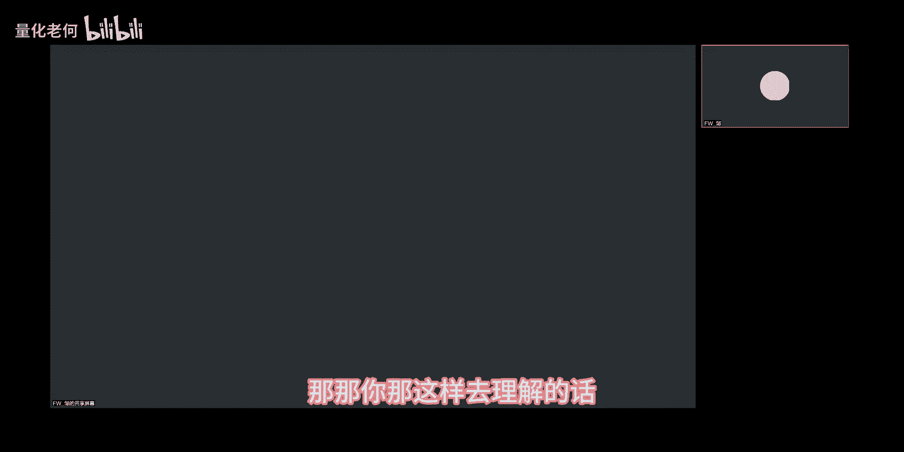

我们就会比较好去理解自己，就是说强化学习，其实是我们通常的这个这个预测，这个监督学习的一个一个呃，应该说啊，这个监督学习是强化学习中间的一个子集，我监督学习这个预测目标。

然后加上这个设定的这样一个呃策略落地环节，然后我不断的去做这样循环优化，我让这个设设计的这个策略，能够达到一个最优的结果，这个过程其实就是一个强化学习的过程啊，那这样来看的话，其实做这个预测。

其实只是我们这个强化学习中间的一部分，一部分啊，呃那个我看有同学在提问，要有同学在提问啊，呃那个我等下后面再给大家回答，给大家回答我，我我会讲一下我这边的一些一些理解，和和那个我的一些想法啊。

呃那这样的话，就是说如果我们这样去理解这个强化学习的话，就会比较容易去理解它，那强化学习他很多时候的话，它其实是可以跟我们通常的这些机器学习，可以也进行这样的一个融合的。

比如说他总要去逼近这样的一个一个，训练的目标，它逼近这个训练的目标，就可以采用一些像通常的一些监督学习的方式，比如说深度深度学习，比如说这个这个一些通常的这样的一个，逼近的一些策略，梯度逼近的一些方式。

它可以可以把这，比如说把深度学习签到里面去去的时候，那就是那就叫深度强化学习，那比如说你把卷积的这种方式，嵌入到里面去的时候，那可能就要卷积这样的一个强化学习，还可以，比如说把ASTM这种方式。

也可以可以切入进去，那实际上的话，这样的话实际上会会形成这样的一个强化学习，和通常的我们这机器学习这样的一个融合呃，现在我看他们有一些有一些这个做做科研的，写论文的，他们可能会就是用这两种方式进行。

这样的一些融合，一些融合呃，这个概念的话就是呃其实要讲的话，可能需要一个专门的一个课程来讲啊，这当然现在现在其实大家可以去看一下，市面上的这个量化学习，这样的一个招聘的一个方向呃，机器学习是一个方向。

另外的话强化学习是也是个方向，基本上这两块的话，可能机器学习可能大概占六六成或者多一点，强化学习可能占四成或者3×5的，这样这样子这样子啊，对所以所以来讲的话，就是说强化学习。

可能会是是一个比较好的一个解决方案啊，一个好的解决方案，因为其实大家现在都在去研究啊，然后那个呃，我看同学有提现提这样的一个问题啊，实际上我对强化学习的这个理解，他是这样的一个理解，就是呃我不知道。

因为大家可能可能在听的，大部分都是做这个机器学习的，做机器学习的，做机器学习往往可能会忽略一个东西，就是这个叫一些做主观判断的这样，比如说基于盘感做交易的这样的一些，一些能力啊，一些能力。

实际上其实大家有没有去想过，那些盘感比较强的人，他其实他本质上来讲的话，他就是一个人工的强化学习，他不断的去强化他自己做的比较好的动作，不断的去屏蔽掉自己做的比较差的动作啊。

我我们我们最近也在在那个详细的讨论，这一块怎么去操作，我我们现在的做法的话，就是把这个呃盘感比较好的人，他的一些这个经验的相关的东西，比如说他考虑可能有八个要素，九个要素。

那这个的话可能就会作为这样的一个状态空间，放在我们这里面去啊，作为这个强化学的一个状态空间啊，这个状态空间这个同学问的比较好，就是状态空间，你本质上来讲的话，如果你大的话，这个强化学习的这个训练的。

那个计算量会非常庞大。

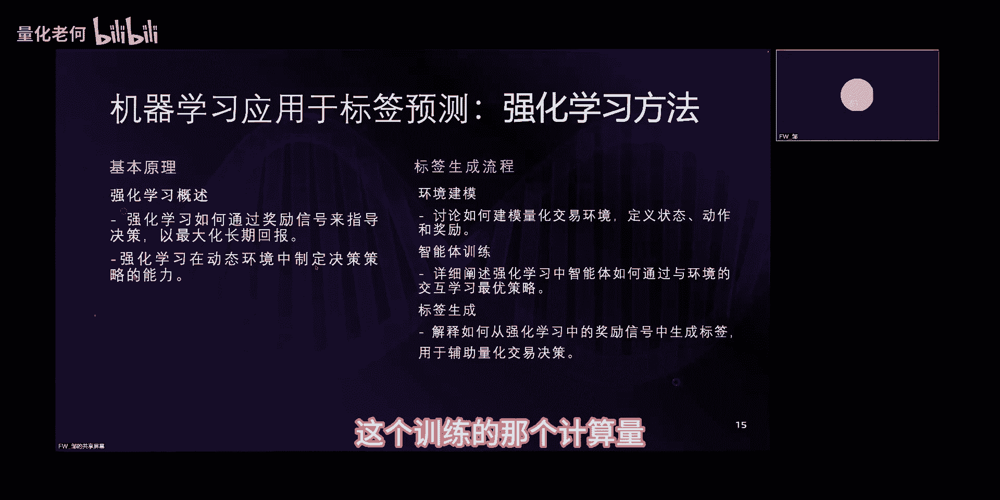

他这个跟通常的机器学习还不一样，因为它它是它是无数个这个机器学习的这样的，一个循环过程的这样一个一个一个集合，所以他的训练量会比通常的机器学习量，会非常大。

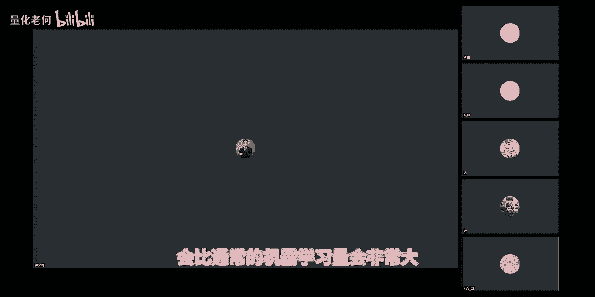

所以这个时候的话，一般的状态空间不宜设置的太大，设置的太大啊，设置太大呃，转的空间其实大家可以做另外一个理解啊，转的空间对应到我们这个机器，就是通常的这个这个机器学习，就是比如说这个这个监督学习里面。

它其实就是一个特征，它就是一个特征的集合，一个特征集合啊，这个特征集合在强化学里面它就叫状态空间，状态空间啊，从某种角度来讲的话，就是说你选选到一些比较合适的，强相关的这样的一些特征。

然后它相对是比较独立的，作为这样的一个状态空间啊，这才是一个比较优的这样的一个组合，优的这样的一个组合啊，这里是这边讲的有点多啊，就讲了强化学习，这个的话我觉得也是一个比较比较值得研究的。

这样的一个一个方向啊，这边其实刚刚刚有讲到过，强化学习和监督学习的异同点啊，大家这个文字性的东西，大家就自己去看看一下就好了啊，哦当然的话就是强化学习，最典型的就是你做对了我就奖你一颗糖。

做错了我就打你一巴掌，罚你的钱，它其实就是一个一个不断的通过这样的一个奖，励和惩罚的这样的一个方式，让你朝着这个设计的对的方向这样去去前进呃，强化学习训练打卡够吗，数据量有多大，多长时间啊。

这个的话就是说不能绝对的说单卡够不够啊，就是肯定是从那个训练的角度来讲，肯定是有多卡的话是最最好，单卡的话也不是说不能做啊，比如说你这个有3080或者4080，这种的话，其实也是可以做它数据量大的话。

大小其实有两块，你要去看这个事情啊，就是呃首先我们去我们自己去做强化学习的话，我们会不不直接把这个呃尽量多的这样的一个，一个一个状态空间的这样的一个特征，往里面去放。

因为这个的话会最终影响到这个计算的这样的，一个效率和性能，我们是呃，这个强化学习和这个预测是相结合的啊，相结合的，就状态空间里面，状态空间里面我们会第一个就是会有一个预测，有一个预测。

然后加上这个预测的这样一个，过去的这样的一个误差，然后再加上这个呃就是这种比较有盘感经验的，他们所考虑的一些因素，比如说七个八个因素，大概加起来不超过十个，这样的一个一个状态空间。

然后一般训练的话就是训练时间不能太长，就这个时间太长的话，这个这个这个训练量特别大特别大，所以这个大家要做一个平衡，做一个平衡，啊这个也是这样的一个强化学习和监督学习，这样的一个一个异同点啊。

大家可以去看一下就好了，啊稍等一下啊。

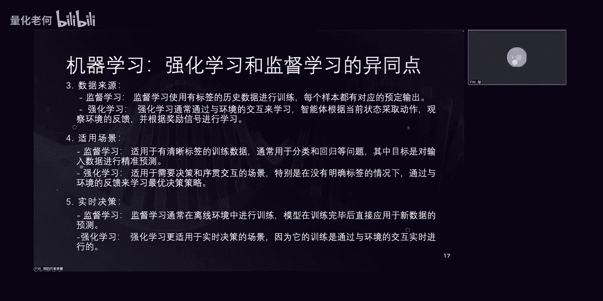

呃接下来的话就是讲这个应对数据的并不平衡，和多样性，这个其实是跟这个目标设定会有直接关系的，会有直接关系的，其实前面已经已经讲到，就是呃，前面大概只有两种类型的，这样一个目标设计的方式，一个是对称的。

一个是不对称的，对称的话其实数据基本上是平衡的，就多方是平衡的，那不对称的那个第二种方式的话，实际上这个数据是不不不平衡不平衡的，那另外的话从多元多样性的角度来讲的话，一种就是我我可以简单的作为这个呃。

嗯就是分类的这种方式，进行这样的一个目标设计，比如说涨涨上涨或者下跌，就两个类两个类别啊，那这样这样的话，其实实际上的话就把这个多样性，就化简成这样的一个类别的，这样的一个一个识别呃。

另外的话其实还有一种方式，就是可以用这个回归的方式，你看回归的方式来去做这样一个事情，那实际上的话他也是可以解决这样的一个，多样性的一个问题，当然的话就是这两种方式的话，其实大家要去考虑。

要考虑为什么就是说，当这个样本不平衡的时候，我们用去多样性，就是用这种回归的方式去做的时候，其实可能会有一些问题，有些问题就是这个他可能会去呃，因为我们从模型训练的角度来讲的话。

他可能会偏向这个数据比较多的这个方面，比如说这个我们这个止损的，这个这个虽然说是小止损，它，但是它的样本量比这个这个止盈这一，块的样本量是要多要多的时候，但这个时候模型它可能就会偏向这个这个呃。

那个负的样本，就是止损的这一块的样本，那这个时候的话就是说呃，不是说完全不能这样做啊，也是可以做，这个就就做的时候可能要要去注意啊，那另外一种方式的话，就是把它作为直接作为上涨下跌，上涨下跌这种方式。

上涨下跌的方式的话，它它有它的优势，它也有它的缺点，他的从缺点上来讲的话，他忽略了这种每个数据的这种，绝对值得大与小啊，就是比如说这个盈利三个点或者盈利一个点，那实际上是有差别的。

对于我们收益来讲的话哦，那三个点肯定是比一个点是要多，但是如果是从上涨和下跌的角度来讲的话，它就它可能都是上涨，或者说都是下跌呃，那那那它的优势在哪里呢，它的优势就是说我上涨和下跌变成两类的时候。

实际上它是对这个两类不同状态的，这样的一个信息进行加强，我所有的上涨的放在一起，或所有下跌的放在一起，那实际上就是我上涨的，通过这个放在一起，我是加强的，就是相当于我这个信息量在这边会进行加强。

那所有的这种这种比如说不上，那就下跌的放在一起，那我对这个下跌这一块，也是进行这样的信息加强，那从某种角度来讲的话，因为我们是尽量的要区分这个上涨和下跌，把它这个区分度区分的越越越越越越有效。

越好嘛是吧，那这个时候的话这种分类的方式，其实它也是在这一块，它其实是有它的优势的，他会把这个一些分散的这种这种信息量的东西，把它去进行这样的一个加强。

当然处理的方式啊，就处理这个不平衡的数据，其实其实这个方式其实也是，大家应该都都都有去做过的，比如说用这个欠欠采样的这样的技术，或者过采样的技术，那这个两个方式它其实会稍微有点不同，欠采样的话。

我就是炒这个呃样本少的方向，去进行这样的一个采样，让按照样样本少的这样的一个一个方向，进行这样的一个对齐，那郭采样的话，就是按照这个样本多的方式去进行对齐，那那Python里面这种采样的技术的话。

其实也相当成熟，有很多种方式可以去做这样的一个事情，做这样的事情，额数据多样性，其实这个刚才也有讲过，这边我想去讲的一个就是嗯阈值的设定，阈值的设定我为什么会讲一个阈值的设定。

就是说呃如果你按照整个模型设计上，比如说我就以这个上涨和下跌为例啊，如果按照模整个模型下来的话，通常来讲的话，如果说是这个回归的角度来讲的话，就是从您这边做一个预，就是呃有一个上涨下跌这个阈值嘛。

就是通常是这样子的，那如果说说说是你是用这个二级分类的话，就是0。5就是做一个风格嘛，但是你会发现一个问题没有，就是因为我们这个样本就是在在这个整个就是，这个呃多方向。

或者嗯这个呃盈利的样本和这个亏钱的样本啊，就在整个我这个，比如说我取了一年的这样一个样本，它其实在整个时间上的分布其实是不太均匀的，不太均匀的，但我们从交易的角度来讲的话。

我们是时间上基本上可能会相对来讲的话，会从时间的角度会再去考虑这个事情，也就是我尽量的希望每天能够能够有有交易，或者有持仓，能够保持我这样的一个收益的这样的，一个持续性。

但实际上你会发现发现它的一个预测，如果你整个样本是放在一个一个统统一的，一个呃一个时间区间段去做的时候，那那这个时候的话他肯定会偏向于，比如说我我这个如果是做多方向的话，肯定大多数偏向能够上涨这一块的。

上涨这一块的这样的一个一个时间段，你会发现的话，就是说你这样去，如果完全用零这样的一个阈值，去做这样一个设定的时候，或者0。5这样的阈值做设定的时候，你会发现有些时间段其实会效果会比较差的，比较差的。

所以这个时候有有几种解决的方式，第一种解决的方式，就是用阈值设定的方式来解决，我可能如果是零为基准的话，我可能会往上面去提，00100203，这个具体看一些数据的情况，0。5的。

如果是座位中间那个按分类的话，我可能会0。70。8往上面去看，这样子嗯，还这是这是一个就是最直接，我就是这个预测值预测的这个呃，呃值出来之后，就用这个阈值的方式来做这样的一个区，一个处理啊。

这是最直接的这样的一个方式，最直接的一个方式，还有一种方式的话就是说呃可能把目标设定，把目标设定这一个的话就是在每天之内，每天之内进行这样的一个一个一个标准化，也就是说我我不关注这个他过去的呃。

那个上涨下跌的绝对值，我只关注他每一天，它上涨下跌的这样一个顺序啊，这这也是一种方式，这也是一种方式啊，呃预制跟传统的策略的参数概念，本质上我觉得可以这样去理解啊，可以这样去理解，可以这样去理解的。

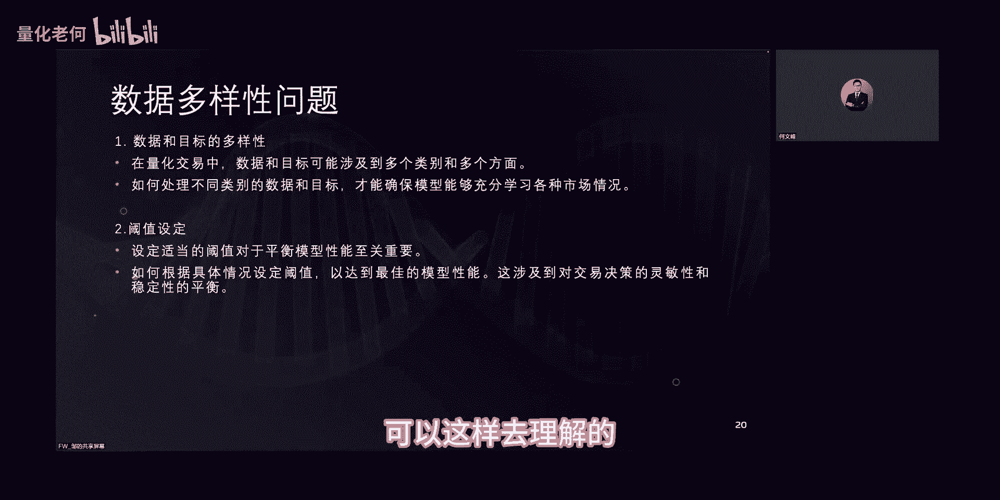

呃然后后面的话有一些案例给大家去看一下，一个是看一下他那个多空对称性，可能会会有什么样的一个效果，另外的话呢就是那个嗯多空不平衡，就是数据不平衡的时候一些处理的方式。

处理的方式。

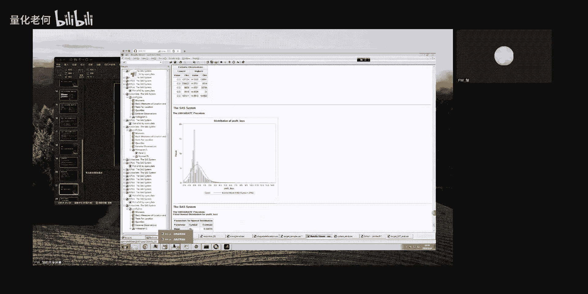

呃这边我们先看一下多空不平衡啊，其实多空不平衡处理方式其实非常多的，我这边是一个最简单的，这个就是用这个呃叫smoke这样的一个采样啊，这个这个是一个标准的方式啊，除了这种方式，还有很多像这个IOS的。

这也是一种常用的方式啊，嗯每种常用的方式可能稍稍会有一些区别，但大致还是比较比较类似的，我一般我一般我这边的话是采用过采样的方式，就是朝这个数据多的方向去做这样的一个对齐，做这样的一个对齐呃。

这个是呃就是那个不同的样本，采样的方式可以看一下，我这边没有嗯，然后的话就是那个关于对称性的设计这一块呃，这边是一个案例，一个案例大家可以看一下，这个是一个样本外的这样的一个数据嗯。

从去年大概9月份开始的这样的一个样本外，这个这个这个应该是橘红色，这个这个橘红色这个线的话是一个做空，这样一个收益曲线啊，这个绿色这条线的话是做多这样的一个曲线啊。

你你会发现单看某一条线的时候坑坑洼洼的，其实那个其实也那个效果就一般般，你看很多时候会坑坑洼洼，或者甚至可能是联络没有没有收益甚至负收益，那当我们去合起来去看的时候，就会发现会会比较有意思。

它合起来的时候，它会变成一个相对比较平滑的这样一个曲线，当然的话就是说不是每一个时间段，我们可以做到绝对的多空的这样的一个互补啊，啊你看这个时间段的话就就不是了，这个时间的话就会有回撤，有回撤嗯。

但大多数情况下面的话就是我要不就是多在涨，要不就是空在涨啊，大多数是这样的一个情况，这个是10月份，10月份因为有一段时间是没有交易的，就10月份放假了是吧，这段时间是没什么交易的。

那个也没什么信号出来，这个是这个是就是我们信号设计的时候，就是考虑的这样的一个方向，就是让它两，就是多空去进行这样的一个平衡和互补，然后得出一个相对比较，就是在大多数市场下面。

都可以去产生一个相对比较好的，盈利的这样一个情况，盈利的这样一个情况呃，今天的案例就大致是这些。

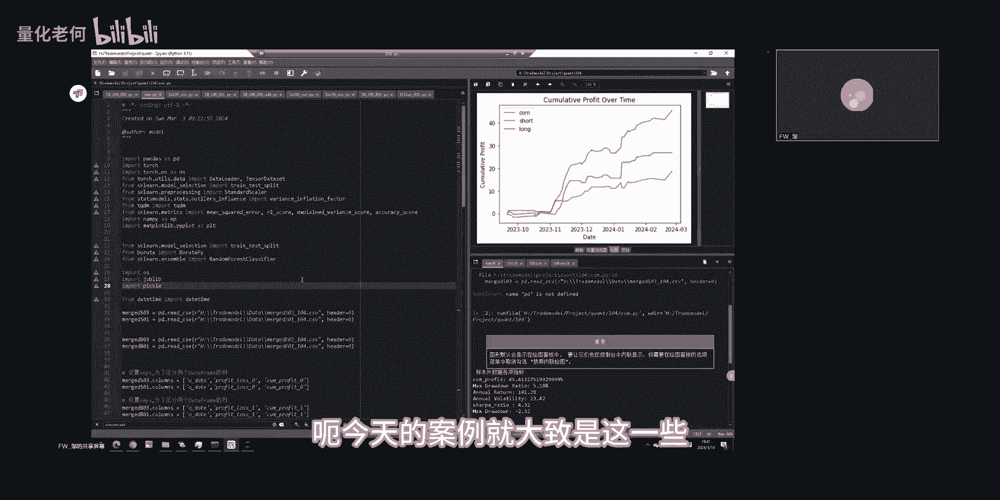

就是嗯然后那个，后面的内容就基本上没太多内容了，实际上我这边的一些案例的话，是基于上次我分享的那个数据库啊，那个那个因子数据库，来去做这样的一个事情的啊，做这样的一个事情的。

这个数据过去大家可以去用一下，现在这个大概有130多人，已经在做这个数据的这样的一个试用了，也有机构在用，也也有，大概有个有个几个，几个这个机构在在做这样的一些测试，基本上反馈的效果还可以的。

我有一个机构的话，他是那个呃有一个机构的话，他那个一个刚毕业没多久的小伙子，他在这个基础上很快能够训练出一个，相对还不错的一个一个一个模型，他最近最近模拟的话，模拟的有两周，效果还很不错的。

基本上就是没没就是在这个高效的因子库上面，你做这样一个训练的话，你这个效果就是这个这个呃，这个这个效率会提升，提升非常非常的大啊，这个大家可以去看一下看一下啊，然后大致的内容就基本上差不多啊。

这里还有一个东西，我觉得大家可以去参考一下，这个是当前的这样的一个我放大一下。

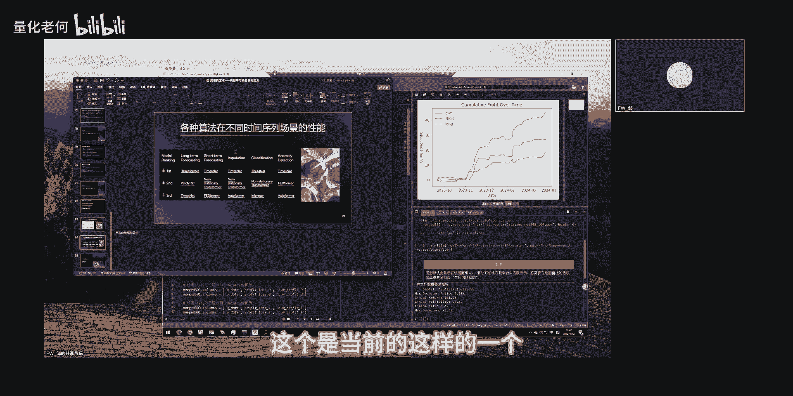

就是经经过这个呃公开测试的这样的几种算法。

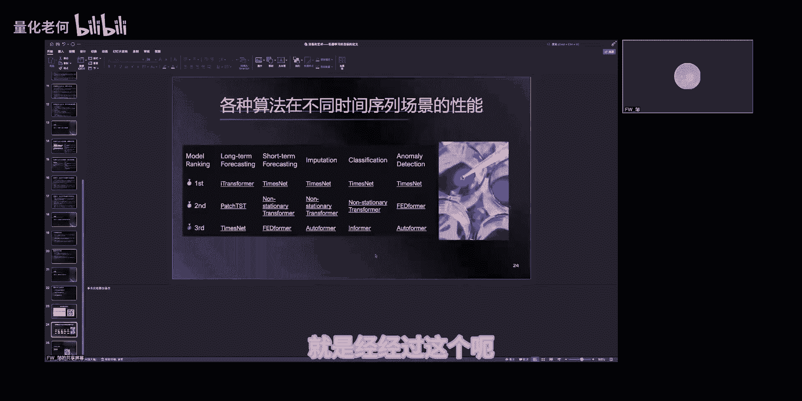

在时间序列上面的一些不同的一些场景，这样的一个一个性能情况，一个是长周期预测的，可以看一下排名的情况啊，排在最前面的是这个transformer，是transformer的一种变形。

transformer的一种变形啊啊啊，然后那个排在第三位是times later，times later的话，他这个主要是基于这个属于和频率变化的，这样的一个模型啊，那从短周期预测来讲的话。

是times later是效果是比较不错的啊，这几种模型就是i transformer，Times later，其实大家都可以去去去看一下，这个是有公开资料的，就是这个模型也相对比较成熟的。

大家可以去参考一下。

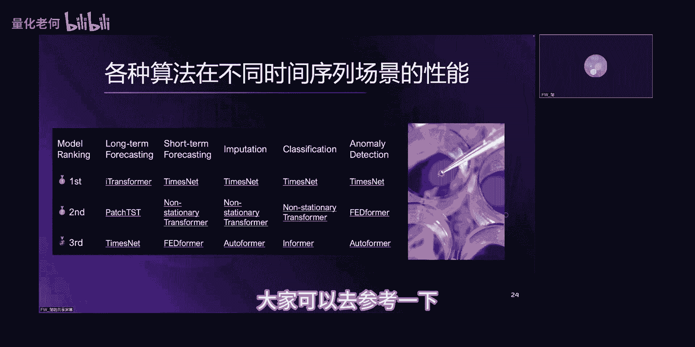

参考一下啊，参考一下嗯，那个数据库的分享地址，大家可以去记一下这个数据库分享的地址，可以记一下这个数据库的话，其实现在嗯反正效果还是可以的，然后我看一下这个同学在问，训练的目标是。

整个portfolio的sharp动作是加减仓呃，训练的目标并不一定完全只是看夏普率药，其实呃这个其实看你个人的一些偏好，就是有些人，他可能对夏普利可能并不是那么关注，他可能是就关关注这个收益回撤比啊。

或者说关注这个呃最大收益啊，这样的一些东西，就是这个东西就是根根据你的这个风险偏好，和你的这个你的策略的这样偏好，去进行设计就好了，进行设计好，不一定就是完全就是固化下来就是一个东西，这个不完全的嗯。

加减仓呃，加减仓的话就是它其实是一个是加减仓的动作，另外的话一个动作的时机，你在什么时候进行加减仓，进行加减仓，但是其实像有这两个东西在在里面的啊，所以所以这个就是做强化学习的话，就是你除了动作。

还有动作时机啊，这两个东西是需要去进行结合的，呃今天分享的内容就大致这么多，看看大家有什么问题，没有可能今天分享的有一些东西，可能大家接触的并不是那么多，尤其是强化学习这一块啊，可能接触的并不是那么多。

大家有什么问题可以随时提出来，好的周老师听到吗，听到听到听到好，那非常感谢周老师今天晚上给我们的分享呃，虽然就是内容是比较专业，但是我我今今晚参加了，朋友们热情还是比较高的。

然后我想问那个周老师几个问题，第一你说嗯，您说刚刚就说有一个小伙子，就是通过你的那个呃模型，就这个特征库嘛，就我想问的就是说哎如果想用这个特征库，应该怎么去用，这个他应该要具备什么前置知识。

就是就是拿到这个库之后应该怎么开始，你可以介绍一下吗，好的好的好的，我介绍一下吧，就是呃，首先这个特征库其实它的量是比较庞大的，可能对于一些刚入手的来讲的话，它会一下子觉得这个比较懵啊。

从来没有处理过这么大这个这个特征量的，这样的一个一个场景啊，大多数新手可能会一下子会比较懵呃，但是在我那个那个分享的资料库里面，会有去介绍啊，介介绍很多相关的一些东西，首先第一个的话就是说特征是肯定是。

你不可能我2万多个特征都扔到模型里面去的，这是不可能的啊，啊那个也也不一定说你2万多个人在里面去，这个效果就是一定是最好的，这肯定是有问题的，首先第一步就是进行筛选，筛选啊，那从筛选的角度来讲。

他就是筛除对我的这个设定的目标比较有利的，有利的这样的一些特征，比如筛选出来100个，200个或者500个或者1000个，这样的一个特征啊，作为我这个跟我这个目目标相，相关性比较高的啊。

或者说它的组合的相关性比较高的，这样的一个一个特征筛选，首先第一步就要做筛选，那在我的那个呃分享的数据库里面，我是有这个呃几种筛选的方式，那个代码源代码都有告诉大家的，包括我今天还上传了一份呃。

带有这个标签的这样的一个数据啊，可以直接拿着那个数据就进行筛选的，这样的一个练习啊，这这个可以直接自己用的，但是原始的那个数据的话是不带标签的，因为它只有这个这个这个特征，它只是因子啊，不带标签。

不带标签，大家可能一开始还觉得这个数据要去，连这个标签要去关联起来，可能一开始觉得操作起来感觉会有点困难，所以我就上传了一个这个带标签的，这样的一个数据，大家可以去看一下啊，啊对这个是筛选的方法的话。

就是我我我建议呢我我分享的有四种方法，但是我建议用两种方法就基本上OK了，第一种方法就是用相关性的筛选，其实大家做股票做的比较多的话，像i hi啊，这这就是一种筛选的方式。

那我里面的话就是有这个多种筛选方式，比如说有这个呃相关性的呃，有这个这个这个叫叫这个呃信信息值的啊，这样的一些一些一些筛选的方式啊，大家可以去看一下程序，那个程序里面都都有的啊。

可以就是大家可以很方便的，用那个程序就跑起来，跑起来的那个可能对大家那个机器要求，可能会稍微稍微要要要有点要求，就是一般的可能你要把那个2万个，2万个特征组在一起去筛的时候，可能就会有点复杂。

一开始你就塞一张表就好了，我一张表里面也是有那个标签的，那个关联起来的，一张表的话就是2000个变量，那个塞起来的话基本上是一般的笔记本，应该问题也不大的啊，但是2万个的话，那笔记本估计就只只不带消了。

我有一张4060，估计行不行啊，肯定行肯定行，4060肯定行，肯定行肯定行的，OK那我想问一下，还是还是一个小白问题，周老师那个输出就是训练之后输出的是什么，呃输出的话实际上怎么讲，就是刚才的话。

我们所有定义的目标，跟你这个目标是完全相关的，呃比如说呃比如说是分类目标，那输出来的话基本上就是一个我分在哪一类的，这样的一个概率，比如说是二分类的，比如说这个涨涨与跌二分类的，那就是我是上涨的概率。

或者下跌的概率是多少啊，那出来就是一个概率概率值，如果说你是回归，我直接去预测这个上上涨和下跌的，具体数值的时候啊，那这个时候的话，那那实际上他这个目标的话就是直接是预测，就是这样的一个数值了啊。

它数值的大与小，可能就是你这个上上涨的这个数值的大与小，这样的一个一个一个一个输出啊，他是这样的，对对对，好的啊，那同学们就是你们在听我提问的时候，你们也可以问问题好吧。

因为因为周老师回答完我的问题之后，就回答你们的问题呃，因为周老师平时也很忙的，所以就是说大家抓紧跟周老师交流的机会，那周老师我本身啊，你说啊啊啊啊啊你啊你你先回答吧，你先回答吧。

OKOK我看那个有个同学在问，就是B有时候B站上面很多机器学习的教学啊，B站上面的机器教学，它的场景应该通常跟我们这个场景不一样的呃，通常的场景那个怎么讲，就是通常的机器学习或者AI的场景。

跟我们交易场景它有一个最本质的区别，比如说通常有一些这个AI的场景，比如说这个做人脸识别啊，它是有限样本的，也就是说他这个空间它是有限的，我最那个最笨的方式，就是通过这个这个这个暴力的方式，搜索的方式。

就可以把这个最优的这个匹配找出来，但是我们交易的场景不一样啊，我举个举个对比的例子，比如说我们之前那个比较火的阿尔法go，这个围棋嘛，是不是，但是非常火嘛，围棋的话。

你那个虽然说他那个那个动作空间也是非常大，也是一个一个海，那个那个宇宙级的这样的一个数字，但是不管这个数字有多大，它是有限的，它是有限的，而且他的博弈他是那个两个人之间的博弈，那在我们交易的场景的话。

它其实是首先第一个，他这个这个状态空间它是无限的啊，第二个的话就是他不是两个人博弈，他是那个一群人，或者说那个整个交易的市场参与者，包括这个规则的制定者，他们所有人这样的一个群体性的博弈。

所以它的复杂程度会比那个会高很多，所以我们在这个机器学习里面，你会发现，我们会关注关注的那个那个一些相关的，一些东西，跟通常的机器学习是不太一样的，比如说我们会关注下频率，就是关注风险的一些东西。

那这个东西其实是很有意思，就是说我在通常机器学习里面，比如说我这个容错对错误的容忍度，其实会远远高于我们这样的一个场景，我们这个场景，像比如说那个，比如说这个某某些某些这个通常机器学习场景，和百分之呃。

那个那个80或者90%的，这个这个准确率可能会就OK了，我那个发生错误值10%，其实这个准确率就OK了，但是但是在我们这个交易场景，可能会有很大的问题，很大的问题在哪里，就是说比如说我们已经到了。

95%的准确度，你不要认为你这个预测95%的准确度，你这个策略出来可能就一定是OK的，那你那个5%的错误，5%的错误，如果你那5%的错误，是连续在一段时间内发生的时候，你这个整个交易系统就会崩溃了。

是这样子的啊，那那是在在其他的一些场景的话，这个5%的错误他可能就是天然是随机分，随机分布的，那在我们交易场景，很多时候错误就是连续的错误，就是连续的啊，这种这这这这是他们中间的一个一个呃。

其中一个一个本质的差别吧，当然还有一些其他一些差别啊啊啊，我大致讲这么多啊，又有一个问题，我一般IC大于多少因子，我先看前面那个，一般如何用不同的方式输出结果，构建交易策略。

呃这个问题应该是针对这个监督学习，预测这一块的啊，就是不同的方式，结果就可能意思是不是，比如说有有有几个模型诶，他的输出结果怎么并合起来做决策，可能是啊，其其实呃呃对我觉得就是说它也可以当当模型。

输出结果也可以做决策，然后的话通常来讲的话，我们做交易决策的话，我们会用多模型进行混合的，因为因为怎么讲呢，就是说这个呃就刚才也讲到，我们交易的场景的话，它其实随机性和这个这个整个的这个状态。

空间都是无限的，所以的话就是我们尽量的会让多样性，要做到多样性，做到这个这个啊策略的这样的一个多样性，让不同的模型进行这样的一些混合，通常我们会比如说有个超级boss，有个回归的啊。

有个这个这个R2分类的，可能进行这样的混合，只是举个例子啊，当然也不一定这样去混合啊，呃然后一般IC大于多少因子算比较有效的，I7的话，这个是通常我们做股票的时候会用的比较多啊。

一般的话就是我们通常不不会，只是看这样的一个一个数值啊，就是呃I7它有一个问题在哪里，就是它它是单变量的相关性，单变量的相关性，也就是说它只是能够把这个线性的关系，能够找出来啊，那那我我里面有两种方法。

就两种，第一种方法也是跟I7类似的，但是有多种类型类似的，I7这种很衡量的方式，就是说除了这个这个呃，它的一个呃单变量的相关性，就是多变量的这种多的相关性的组合，尽量找一些中间的一些差异的东西出来啊。

如果你用一个指标去衡量的时候，可能会漏掉一些东西啊，另外的话像你如果只是用I7的话，可能会把这个这个这个叫组合性，一个是组合的，另外非线性的这种关系的东西会去漏漏掉，所以我还有第二种方式。

就是基于这个超级boss这样的一个叫BLUA的，这样的一个变量的筛选方式，那它的筛选方式的话就可以可以考虑，除了这种相关性之外，它还会考虑另外一种，就是变量和变量之间的组合。

因为有些很弱的变量组合在一起的时候，他可能就会变成一个强的一个一个强力，这个信息含量这样一个一个组合特征，那这个时候的话，这个的话就跟通常我们用I7的这种，衡量的方式，它可能就会更更。

适合我们这种机器学习的方式啊，两种方式都可以用啊，不不是说那个那个那个绝对，哪一个就是绝对的好，是哪个绝对是因为可能足够多的这种线性关系，也可能去能够表达出来一个比较完整的，这样的一个概念啊。

不是说这个线性关系就不一定不定不不OK，不不能work，啊那个周老师，我再问个问题，喂啊你说你说啊是这样的，就是就是我我就是也是一个比较资深的CCTA，交易员嘛。

嗯那那但是我用的就是那种传统的技术指标的，那我们称自己为规则型的这个CTA加一元，那那规则型对应的就继续学习嘛，那那对我们来说其实交易很简单，这个其实文化指数有波动的时候，我们就赚钱，那他没有波动。

在横盘的时候，比如说去年就就就很一大部分时间在亏钱，这个我们就就我们的其实收益，是跟市场整体的波动性有很大关系的嘛，但是我我看您的做的策略里面，其实很大部分时间都在盈利。

我就不太理解为什么能你们你们能做到做到，其实就是波动小的时候，用机器学习的方式也是比较难去做隐秘的啊，就是比如说去年去年上半年其实是比较难做的，但去年上半年我们用的那个信息量没有这么大。

去年的话我们大概的那个用的信息量的数据，大概就是1万个没有进行筛选的，筛选出来估计就大概一两百个，这个我是筛选之后大概有2万个啊，但是不管不管怎么样，就是说我不管你这个信息量提取，提取的再怎么充分。

就是在这个播波动力枯竭的时候，没有空间的时候，其实是比较难做的，因为你你会发现没有，就是我们这个里面的话就是设计目标的时候，这个跟你设定目标也是有很强的关系啊，就是设定目标的时候，第一个我们会考虑时间。

第二个会考虑空间，空间就是波动嘛，如果没有空间的时候，其实你这个就没有目标了，就没有目标去训练和学习了啊，除非你用另外的方式来设计这个目标啊，嗯那那应该还是呃，跟规则型的c pa有一定的相似之处。

就是说咱们有没有波动的时候，其实也很难赚钱，对本质上我跟你讲，就是说不管这个方法多复杂或者多简单，它其实本质上的东西还是会接近的啊，我看同学又问了一些问题，好的那就很多朋友们对。

就是怎么呃入门这个机器学习，有就是说一个新手的学习路径，这一块有有比较大的一个呃，我呃其实怎么讲呢，就是有因因为我们做这个事情都是做工程化的，不是说那个做一下学术论文，然后那个在那个样本内。

你和一个什么比较好，这个M11这样的一个一个收敛的信息就OK了，但是我们这个工程化的话，那那那实际上会有很大的不一样，那最大的不一样的话，就是我们会在这个目标设定和这个特种工程，这一块。

会花很多时间和精力去做这样的一个东西啊，做这样的一个东西，那刚才有个同学说这个特征说明是怎么合成的，其实我们上期课程里面有讲了，大部分的这样一个原理啊，呃我这边也大致大致回应一下。

就是我这边特征生成的方式，我是结合现在的一些流行的这样的一个呃，AI的这种算法框架，里面的一些特征的提取的方式，比如说transform form里面可能有个五六种，比如说位置编码。

比如说这个多头注意力机制，然后卷积里面的那个卷积，神经网络里面的卷积的这样的一些方式，就大致融合了七八种，这样的一个一个特征的提取的方式，我不是呃，首先我要澄清一点，就是不是用它的框架去生成的。

让它自动去去去生成的，那个生成的话就是基本上就不知黑箱子，你不知道他在写逻辑是什么，我是把他的这个方式提取出来，然后用这个相对有监督的去把它去训练出来的，就是它我基本上就是通过加减乘除这样的方式。

来得出这样的一个一个特征的，只是说他这个这个方法，是借鉴了他们这些学习的一些框架的方法啊，是这样的一个东西，呃这个标签我那里面给出的标签很简单啊，就是就是这个呃今天早上开盘。

到第二天早上那个开盘的这样的一个涨，涨与跌的这样一个标签啊，就是我我给出的案例里面是比较简单的，大大大家就是可以简单这样去理解，你自己可以设设定自己的标签，这个也是那个可以去做了就可以去做的，呃。

然后哪哪里能包包教包会啊，那个我可以这样讲哦，如果是学机器学习，如果是在我这个因子工程的基础上去做的话，嗯你的学习的成功率会高很多啊，呃你你你你要看到市面上很多这种机器学习，在量化里面的应用。

很多那些文章都是都是那个那个没怎么讲呢，就是为了写文章而写文章呢，很多都是那种假的，比如说一个最简单的用AST，STM去预测这个价，那个比如说明天涨到多少人，那个价格绝对值和。

比如说那个从九块钱涨到涨到九块八啊，这样的一个东西，比如说然后他告诉你，然后误差A那个误差那个误差非常小，不会超过5%啊，其实其实这种这种里面就有很大的误导啊，你会发现我我我可以这样这样告诉你。

比如说我就我不需要任何的什么机器学习啊，任何的什么算法，我就告诉你那个那个我可以预测，未来这一年之内，这个比如说工商银行，它它的这个每天的这样的一个值，然后它的误差控制在10%之内啊，为什么能控制呢。

因为首先我们这个，如果从绝对值的角度来讲的话，他们我们每天只有这个上涨，下跌的这样的一个一个一个限制，就不会超过10%，然后我把这个空间再缩小，我那个每天就是与这个收盘价。

第二天这个这个收盘价就是这个加减5%，那我预测这个空间在这个误差在5%之内，我全年就以这个价格去预测，预测第二天的这个这个这个价格，实际上的话，你比他那个那个什么HTM预测出来还要还要准。

所以他这个有欺骗性在里面啊，因为我们那个预测这个绝对值，是没什么任何意义的，我们啊这个这个同学说的非常好，预测价格没有任何意义的，我们要预测这个空间，因为这个空间才是我们这个盈利的啊。

这个这个盈利的这样的一个根本，你没有空间的话，你这个盈利在哪里，是不是啊，这个同学说的非常好啊，对对对嗯，同学们都很专业啊，对的对的对的是的，呃看大家还有没有其他的问题啊，然后呃我我接下来一段时间。

给我们一起制作一些课程，然后各位同学对于课程有什么需求，或者有什么特别希望了解的地方，可以跟我们沟通，然后本次公开课呢我们也会上传到B站的量化，老何啊，就是我的频道上面，然后各位同学也可以上去看。

本次我们公开课的录播，或者是通过关注量化B站的量化脑合频道，来找到我的微信好吧，然后看看最后周老师还有没有什么补充呃，呃基本上要讲的也差不多了，今天要分享的内容，然后呃。

有什么问题可以在何老师那个群里面提啊，就是会会有什么问题都可以在那个群里面提的，嗯然后那个我那个数据的那些问题的话，也可以在那个群里面提啊，何老师那边也有，除了机器学习之外。

还有很多其他的一些非常优秀的一些课程，大家都可以去看一下的，嗯好的嗯，然后我最近也会去亲自见周老师一面，就是看看那个我们这个数据库，怎么能让我们社区的朋友能够用起来，能够试用起来。

或者呃有一些更有价值内容的，呃一些一些更有价值的一些内容，会继续的分享给大家好吧，那我们呃今天的公开课就到此结束，谢谢周老师，谢谢各位的好的。

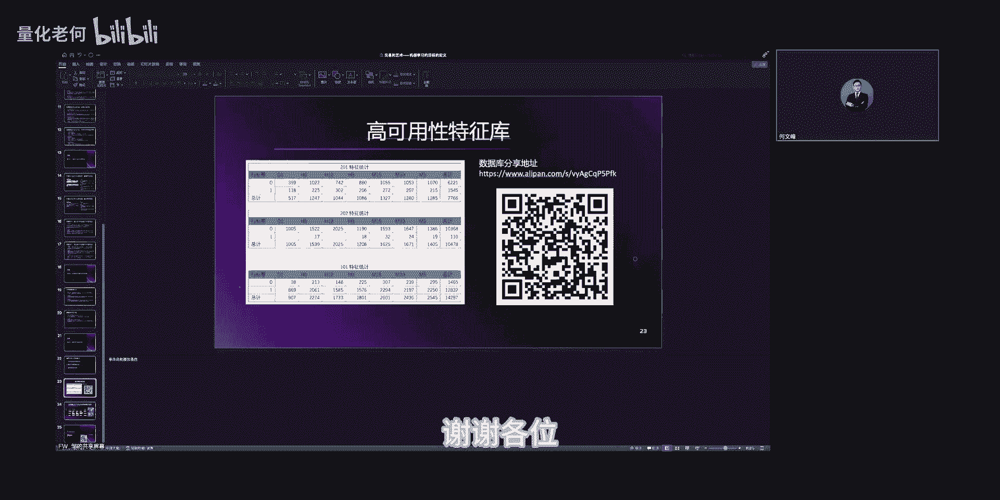