# 策略之光第 18期：免费用机器学习多因子库制作出牛逼的日内期货CTA策略 - P1：策略之光第 17 期：免费用机器学习多因子库制作出牛逼的日内期货CTA策略 - 量化老何 - BV1oA4m1A7o4

欢迎大家今天晚上抽时间啊，参加我们车内之光社区第17期啊，那我们今天晚上也是请到我们的啊，周老师给我们分享啊，从因子库到构建呃，卓越的交易策略的这么一个过程，那我们之前已经请周老师开过两次课了啊。

啊就是呃大家的兴趣也就大家都比较感兴趣，然后呢呃这一次呢我们就是比较落地一点，就是说从因子库，因为周老师之前有分享一个啊，能能够让大家目前免费使用的一个因子库吗，那怎么样用这个因子库到构建。

我们的交易策略啊，那今天呢就是呃我们讲解的一个主题啊，那我们首先就是请周老师做分享，那分享到后面的话，我们会有充足的一个答疑时间，OK好那剩下的就交给周老师，好的好的，那个大家晚上好。

那个呃又到我们这个公开课的时间了，呃前面刚才何老师也讲到，我们是做过两次分享的，两次分享的话，也是呃做这个AI的量化策略的一个基础的构成，一个是那个因子库啊，也就是我们通常所说的特征工程。

另外一个就是呃策略目标的一个设计啊，这也是我们整个整个策略设计的一个基础啊，这这两个的话是是呃相对会偏一些，这个呃跟策略的落地执行还会有一点点的距离，那这节课的话主要是把这两块串起来。

然后通过我们现场的这样的一个呃程序的实现，到最终的这个策略信号的生成，这样的一个过程给大家做一个分享，呃这个大家看一下就好了，反正这个现在大家都是对这个量化交易啊，机器学习都是比较感兴趣的。

希望通过这个课程的话，让大家能够去呃学习，如如何运用这样的一个机器学习，构建相关的一些交易策略，主要是对我们这样的一个海量因子库，能够操作起来，因为可能之前大家都没有用，用过这么大量的这样的一个因子。

我们这个因子的话，现在大概有2万这样的一个级别啊，而且这个因子的话，我们现在也在不断的在更更新和完善，可能将来会变得更多，那这么大量的一个因子的话，对我们那个呃那个实操来讲的话。

可能会有一定的这样的一个，呃有有有这样的一些难度，尤其是在工程方面的话，可能会存在一些难度那种，我们怎么样利用这样的一个海量因子库，去帮我们去啊，从目标设计到最后策略的这个设计执行，能够啊。

有一个比较好的这样的一个一个实操体验啊，今天我们主要的课程就是这些，呃今天今天的内容的话有三大块啊。

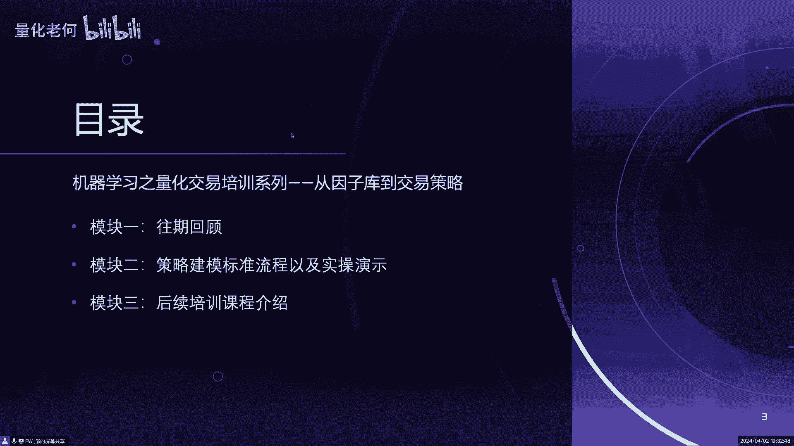

第一块的话就是我们回顾一下往期，就是两期的那个内容，因为这个是我们这这次这节课的这样的，一个基础，所以我会大大概回顾一下啊，那个大家有时间也可以去那个何老师，那个B站的那个主页去去看一下，呃。

有相关的这样的一个课程的内容，我看了一下那个热度还可以，那个浏览度，然后第二块的话就是主要是那个建模的这样的，一个实操演练啊，我们会以这个是从那个因子库开始，然后到目标设计到建模的流程。

到最后最后的策略的生成，信号的生成，整个一个过程我们会给大家做一次完整的演练，当然这当然的话，这个演练可能会稍微会精简一点，因为我们由于时间的关系，那个所有的变量全部跑起来的话。

那可能会花的时间会比较久，可能会选那个其中一张表，两张表，然后做一个这样的一个演练，可能效果没有那个所谓的十几张表，一起来做会那么好，但是基本上也能让大家体，体验到这样的一个过程啊，第三块的话。

就是我们后续的话还会有这个相关的培训的，这样的一系列的课程，我们会对相关的培训的课程，会做一个详细的介绍啊，大致是这样的一个情况，首先我们回顾一下这个啊，之前我们的这个课程。

第一个是海量因子库的这样的一个原理介绍，和这个呃一些简单的一些演示，第二个的话是那个策略目标设计呃，当时的话就是我们的因子库，介绍因子库的那个构建的基本原理，其实我们那个因子库构建基本原理。

会跟市面上的一些那个特征工程，会稍稍稍会有点区别啊，市面上的话有有两种构建因子的方式，一种构建因子的方式，就是利用一些传统的这样的一个经验的公式，会去构造一整套这样的一个特征体系，比如说像这个呃。

像像比如说信贷的，比如说信用卡的，他们他们是有自己一套这样的构建，这样一套体系啊，另外的话还有一套，还有还有一些的话，就是基于现在的一些机器学习的一些框架，比如说用深度学习神经网络，卷积神经网络这种啊。

去直接去用它的框架去提取特征啊，两者的话有它的优点都也有的缺点啊，尤其向后者的话，比如说用这个卷积神经网络，直接去提起特征的一种方式的话，它基本上就是个黑箱子的啊。

你不知道里面的这些因子到底是什么样的一个，一个东西，是是什么样的一个东西组成的，那你原理是什么，它里面的都是黑箱子啊，后续有问题的话就比较去很难去溯源，那我们的方式的话是集这两者的，这样的一个怎么讲呢。

就结合两者的优点吧，就是我们不会用这个像transform a s，TMCCN这样的一个啊，它的本身的框架的提取的方式，因为本身框架提取方式，刚才讲到有他这样的一个黑箱子的缺点。

我们是把它的这样的一个特征提取的方式，抽象出来好，抽象出来，我们用他的这样的一个理念，作为构建我们这因子库的一个基本的原理啊，我们是这样去做的啊，那那构建出来的话，就是说我们基本上这个因子。

其实就是使用一些统计方法，加减乘除，没有使用很复杂一些什么合成啊，又什么什么回归啊，这种东西没有的，基本上就是那个加减乘除啊，统计啊，然后是纵向对比，横向对比基本上就是这些东西。

然后利用这个像一些一些这种卷积的概念，在里面，还有这种传短周期的结合这种概念在里面呃，那那我们这个因子的输出的话，大概有近2万个因子，我们分了三类，但是基本上我觉得用幺零，幺幺那一类就就基本上足够了。

101那一类它涵盖的面相对是比较广的啊，每个因子之间它是具备相对的独立性，注意这里注意一下，就是相对的独立性，为什么是相对独立性呃，我是分了它的因子的那个那个呃最基础的结构。

它是由这个不同的时间框架汇总起来的啊，不同的时间框架之间的话，它是它是可能会具有一定的这种这种相关性的，但是是在同同同一个时间框架之内的话，它是那个呃相关信息做了这样的一个筛选的。

比如说超过60%的这样的相关度，我就只选了其中一个啊，啊为什么会在不同的时间框架之间，没有去做这样的一个呃，相关度的这样的一个一个门槛的设置，其实原因很简单，其实这个的话考虑到。

就是像我们这种长短周期啊，不同周期的组合这种东西，因为因为这个跟每个人的一些策略的，目标设计啊，这些也会有些关联关系，侧重点是关联关系，这个就类似于像全是form form里面的这种多头，注意机制。

你可能是偏偏重这个时间框架，也可能是偏偏重那个时间框架，有的偏长周期的偏短周期，所以在这个不同的时间框架之间的话，我们是没有去做这样的一个，相对独立性的检验的，但是那个时间框架之类的话。

我们是做了这样的一个检验的啊，然后的话我们是用了过去近9年的数据呃，9年的数据对这个因子进行了检验，从收益上来讲的话，这些银子都是具备一定的，这样的一个显著的显著，现在的表现了。

这个大家看那个第一课的那个第一，第一次课程里面有一个那个那个单因子检验的，这样的一些简单的举例，大家可以去看一下啊，单因子它就是具有明显的那种单调性的，大家可以去看到里面的这样的一个图。

那个代码大家也可以去跑一下呃，这是呃因子库这一块简单的回顾了一下，那在这个基础上，我们后来又做了第二次课程，就是目标设计，目标设计的话呃，当然中间我们讲了很多很多东西啊。

就是我觉得有有几点大家可以去去关注的，就是第一个就是啊时间和空间这两大维度，这样的一个一个思考的维度，这个大家要注意了，一般反正就是时间空间结合或者时间，要不就是时间，要不就空间啊。

这个这个这个也是我们设计的一些基本的，这样的一个考虑的这样的一个维度，第二个的话就是呃，因为我们我们现在这个这个因子库，是在这个嗯大宗商品的基础上，做了这样的一个因子库，就是说我们这个不像不像大A。

就是我们这个是多空两个方向都可以去做的，也就是说我们一般设计目标的时候，会去考虑这样的一个呃，多空的这样的一个对称性啊，会综合考虑这样的一个策略的稳定性，就是当多空。

就是说这个市场是涨或者市场是跌的时候，你都有这样的一个应对的方案策略，这样的话就是对整个车内的稳定性，会有有一定的帮助，另外呢我们后来又讲讲了一些，这个强化学习和监督学习的一些目标的区别。

这个大家可以回头去看一看，那个那个录播的这样的一个课程啊，这个其实也是蛮有意思的，这个这个当然今天我们主要讲的是，这个基于监督学习的这样的一个预期目标，这一块的啊，相关的内容强化学习的话。

这个以后有机会给大家讲呃，这是非常快速的回顾了一下，那个晚期的这样的一个内容，然后我们进入到第二个内容，哎呀我这边有点卡死呃，第二个内容的话，就是我们整个这样的一个实战的这样一个，过程的一个演示啊。

在演示之前的话，就是给大家大概就是介绍一下，一些基本的一些知识呃，有几个知识点可能大家去关注的，就是我们对于建模来讲的话，就是抛开这个量化交易来讲的话，通常建模来讲的话。

就是呃有几个时间窗口是要去注意的啊，第一个就是观测窗口，第二个预测窗口啊，第三个是滚动窗口啊，这个大家去去看一下，关掉窗口的话，就是我们用来提取这个时间序列特征，历史数据的这样的一个窗口的啊。

大小比如说一年两年啊，我我们英子库我们是做了9年的，当然的话我们建模的话，不一定用那么长的时间啊，可能用两年或者3年，可能就就基本上是OK的了啊，那个呃呃第二个的话预设窗口一般来讲的话。

这个预设窗口就是根据那个自己的这个，目标的设定会有关系，一般我们这边是做短，短期的这样的一个预测的啊，短期的预测的我们嗯基本上是日内加跨日，最多是跨日，跨日的话就是到比如说今天今天早上开盘。

到第二天早上开盘啊，当然不一定是完全是开盘那一个时间点，有可能是大概比如说09：30 9。35，大概这样的一个相对比较价格稳定的时间点啊，那这样的话我们这个是基本上做短期预测的，长期预测的话啊。

不是说不能做也能做啊，就是也能做，包括更短周期的也是能做啊，啊也是能做的，然后另外的话就是滚动滚动窗口，滚动窗口之前，何老师跟我特别提过这样的一个概念啊，也就是说训练的过程中间。

可能需要这个不停的移动这个窗口，去把这个这个这个观察窗口和这个预设窗口，不不断的去增加这样的一个训练的样本，通过这样的方式啊，那我们会后面课程里面也会讲到，这个相关的内容。

那今天内容可能时间的问题可能不会详细去讲，那第二个的话就是呃大家会比较关注的问题，就是这个过拟合欠拟合，当然的话，在我们用机器学习来做这个东西的时候，更多的时候可能会出现这个过拟合。

尤其是你看大家都比较比较害怕，用一些，比如说比如说神经网络这种黑箱子，这样的一些操作的方式，因为很很容易出现，一个是过拟合，另外的话出现过拟合的时候，也很难去发现里面到底是什么样的一些原因。

所以我们现在这个方式的话，就是把这个黑箱子的东西抽出来了，抽出来了，前置到这个特征工程里面去了，前置到特征工程里面去了，然后我们整个人礼盒的过程的话，会相对会用一些简单的网络，我们先比如说两层三层。

一般两层网络都会能有比较好的一些效果，然后用一些这个这个交叉验证的这种，比如说五折实则这样的一些一些方式，进行这样的一个稳定性的这样的一个加强啊，大概是这样的一个东西就可以呃。

去比较好的去避免这样的一些问题啊，当然欠拟合的话，这个就是特征工程里面做的不够，信息，量体体现的不够，提炼的不够啊，呃这是建模的一些基础知识，这个是需要去关注的啊，尤其第二点像过拟合这一块的话。

尤其是在我们做机器学习，做量化的时候，需要去去重点关注呃，然后的话这个建模的这样的一个标准流程啊，就是这个流程就是也不一定是这个量化交易，这个领域的，其实在其他领域也是这样的。

一个大概大致的这样的一个流程，就是数据准备，目标设计啊，特征工程啊，我们前面是目标设计的特种工程，这两个是有讲到了，那实际上这两个讲到的话，他基础也是数据准备，已经做了一些这样的一个储备的。

那今天的话主要是讲模型的训练，和这个预测信号的生成，好的那个嗯，大概的知识点我们就讲这么多，然后我们就看后续的这样的一个，实际的代码操作的过程，好像有人发言了，我稍微看一下啊啊啊，没事。

OK我我我我讲几句，就是有一些同学有些同学就不能进来会议室，因为我们这个限制100人的，但是我已经开了这个直播了，就不能进来腾讯会议的话，就去啊，点我的那个点我的那个呃头像啊，我微信的头像。

然后然后就是OK然后看，然后就是看一下直播就好了啊，嗯好的，那个我们呃有了前面的一些基础的知识，包括前面两节课程这个储备，我们就进入到下一个环节。

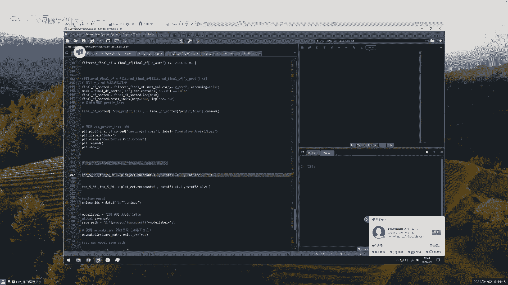

呃这个是我的一台机器啊，机器的这样的一个配置也带给大家大致看一下，大家应该能看到啊，呃我这个其实配置也不是很好，大概就是要上六，四十八四十八个线程能这样CPU，然后内存的话是128G啊，128G呃。

我们今天跑的话可能就跑两张表，两张表的这样的一个呃，特征的话，大概基础特征是三元千克的样子，大概的话呃我这边漏了两次，一个是多方向，一个空方向大概能用到28级的样子，可能会，然后我这里有张GPU。

但但是的话我们今天是没有用到GPU的，这个不用管它啊，基本上来讲的话，就在我这个因子库的基础上的话，就是用多线程的CPU和这个大概64G的内存，应该是可以比较好的这样的一个跑起来啊，这是硬件。

大概是这样的一个情况呃，首先那个嗯，首先我们这个搂一下数据，我们那个网盘里面数据，大家呃，我不知道有没有去注意看，就是，呃网盘里面我是有一个完整的历史数据，是2021年到2024年的这样的一个嗯。

3月应该是到了3月15号吧，这样的一个一个历史的书书啊，一个历史数据啊，这个是历史数据，应该是2024年3月15号之前，应该是2015年开始，到2024年3月15号，这样的一个历史数据啊。

大家这个这个2021~2024，这个这个这个目录大家可以去下下来，可以去用一下，这个数据，是可以做一个完整的这样的一个测试的啊，今天的话就是因为这个表示很多，如果全部搂起来的话。

可能那个跑的时间会比较长，可能整个演示过程可能就完成不了嗯，我们今年的话我们就露前面两张表就好了，就都两张表，我们那个比较随意的露两张表，这边的话看一下啊，呃这边是那个数据加载的过程。

这是刚才那个数据的目录啊，这边的话是取出那个所谓的那个文件，这边我是呃，如果如果正常的话，我就会把所有的表都出来，这边的话只是漏了两张表，嗯中间可能会稍微有一点时间，大家稍微耐心的等一下呃。

这个他跑的时间我大致讲一下中间的一些过程，那个除了这个呃，把这个基础的数据录进来，这个就是我们那个网盘上面的这个数据，还有一个就是要加载这样的一个呃，我目标目标设计的数据。

我们这边的目标设定的话其实非常简单，就是今天嗯，就是今天，比如说早上09：30到第二天早上09：30，就是这个时间区间没有做止盈止损，也没有做其他的一些操作，就在这个时间之内。

我预测这一天他的涨与跌的这样一个情况，涨与跌的这样的一个情况，大家稍微等一下啊，这个数据捞起来稍微有一点点啊，这数据已经加载完成了，然后然后的话就是这个呃目标数据，就是这个标签数据。

我们就是已经按照刚开始说这个今天开盘，到第二天开盘这样的一个标签的啊，做做了这样的一个预测的标签，那这个数据的话会进行加载，这个标签里面我是有这个多有空都有的啊，可以看一下它的一个情况。

我这边取的样本的区间是2020年9月，9月份之后的，在之前的话，我没有没有做，那个就是加入到这个表现窗口里面来，我们看一下这个这个原始的标，那个标记出来的数据是什么样的一个情况，呃大家可以看到这个图。

这个图看到了没有，这个呃能橙橙色的，橙色的是这个多方向的这样的一个呃，标记的这样一个一个累计收益情况嗯，这个蓝色的是这这个呃，那个空方向的这样的一个累积的，这样的一个情况呃。

可以看到有这个完全是完全对称的，因为这个就是我多空是同时去去操作的，这个是完全对称的，当然我我们之前那个目标设定的时候，也有那个部队不往前对称的，不完全对称的，就是比如说加入止盈止损的情况。

今天我们是讲最简单的，就不讲这个止盈止损的，不讲止盈止损，那这个一个有个什么好处，就是说他最坏的情况我就是两边打和两边打合，但是会损失手续费和和这个这个，这个交易的摩擦啊，那那在这个基础上。

就是我们把一些这种做错的一些交易，把它排除掉，这样的话他可能会得到相对一个比较好的，这样的一个曲线啊，他是这样的一个基本的原理啊，首先我们就做这个空方向的，这个是这个是已经跑了的，应该是空方向已经跑了。

然后，数据刚才这边已经加载完了，然后呃，然后数据里面我排除掉了一些一些品种啊，大家可以看到大家做商品的话，就应该知道这些品种基本上是没什么交易量的，就基本上是已经废掉的品种，这些品种我是排除掉排除掉啊。

然后这边的话这边这边的这个表现的行为，数据也是这个啊，同样的时间窗口，同样的时间窗口，然后这两个时两个数据合在一起，合在一起的时候，大家一定要注意，就是他那个呃时间一定要对齐啊，我在那个呃目标时。

在在因子库设计的那个那个那个课程里面，给大家讲过啊，就是这个一定要要注意，这个这个不要不要要偷窥未来的数据，一定要做到那个时间对齐，这里是已经做过对齐的，呀啊啊这个数据加载就已经已经完成了，已经完成了。

OK然后加载完成数据之后，第二步啊，然后第二步就是这个数据的这样一个筛选啊，特征的一个筛选，这个是非常重要的非常重要的一个步骤啊，这个也是整个整个这个呃，整个这样的一个一个模型。

这个成功的比较关键的这样的一个步骤，我这边有两种筛选方式，大家注意一下，有两种筛选方式呃，一种是用这个随机森林的这样的一个叫BLUT，这样的一个筛选方式，他这个主要是筛选这样的一个呃。

非线性的这样的一个一个组合，我先让他跑起来，我我接着跑的时候呃，大家一起开慢慢讲啊，这个先让它跑起来，可以看到这个CPU可能马上就上去了，可以看一下，哦不好意思，这边漏漏了一步，漏了一步。

因为数据加载完成之后，还有一个数据基本清理啊，不好意思，数据基本清理这一步忘忘记了呃，这边数据基本清理其实是比较简单的，就是因为中间可能会有一些缺失的数据，然后的话呃，还有一个就是那个。

因为我们交易的那个因子库里面的数额，是包括了这个指数的产品的，那指数的产品，它每一个每一手的这样的一个价格，跟我们这样的一个呃，大宗商品的价格是那个极极具不对称性啊，我就把那个指数产品是删除掉落的。

然后对于一些这个呃中间中间为零的，或者为空的这样的数据，我是做了两重限制，第一层限制这边是做了这样的一个缺失的，这样的一个限制级，也就是说缺失值如果大于8%的时候，你就把它删除掉了。

这个特征就把它删除掉了，另外的话就是他这个缺失呃，中间如果是那个小于8%的话，我会用那个他的这样的一个，前面30天的平均数值进行这样的一个填充，进行这样的一个填充，这边让他跑一下，把这个基本的数据处理。

这个应该比较快的，这个也不算什么，对这个应该很快的，啊这个已经出来了，好有了这一步这个基础数据处理之后，然后进行这样的一个筛选，进行筛选，这第一步就是刚才说的这个，用这个BT这样的方式呃。

筛选这个非线性的这样的一些关系的，相关的一些特征啊，那我这边筛选方式的话，除了这种方式，还有一个方式就是常规的筛选方式，常规的筛选方式就是像一些信息价值啊，信息争议啊，卡方啊，这样的一些一些一些呃。

检验单变量的这样的一个显著性的一些方法啊，这是一些常规的一些筛选的方法，但当然这种方法的话是比较偏偏单变量，这是第一个，第二个的话它是比较偏这个线性关系的，这种筛选啊，那所以我这里面的话是两重筛选。

一种是这个组合变量非线性，这是第一重，第二重的话是这个啊单变量啊，单变量偏线性的这种关系的筛选啊，然后两两种筛选出来之后，我们再进行这样的一个变量组合，也就是说我们兼顾了这个线性关系。

也兼顾了非线性关系，还兼顾了这样一个变量组合的关系啊，所以这个也是比较关键的啊，比较关键的就是，通常通常我们大部分建模的时候，可能会比较关注这个呃，线性关系多一些啊，线性关系多一些。

然后对于这种变量之间的组合，还有这个非线性关系，可能会关注度相对会比较少啊，这边的话就这个前面那个跑会有点慢了，你看这个CPU都是跑满了，CPU都是跑满了，这个CPU都是满，就是百分之百的满满掉了啊。

这边这个过程会有一点点慢，我后面就接着往后面讲，我这边让它自己跑起来，我看一下，让他也跑不起来，打完之后啊，大家一定要记得把它存起来，就是你筛选的过程，因为这个过程是相对比较长的。

一般的话我们就会存存起来存起来，然后再再把它捞出来，啊让他往这边继续跑，你看一下这个CPU的情况啊，CPU他那个后面的话，基本上我这边采采用的都是这个多线程，就是多CPU的这种方式啊。

这边大家可以注意一下，我代码里面呃，你看一下啊，这边是多线程的全部多线程的，这个就是把这个CPU全部用满，所有的所有的线程都去用嘛，啊，当然的话就是也可以用那个，GPU的加速的方式啊。

那个可能要改造一下代码，但是像我这这个方式的话，基本上你用多CPU的方式，就可以比较完美的跑起来，比较完美的跑起来，这个可能稍微要等一下，稍微要等一下，我这边就让他跑的过程，中间后面讲一下后面的代码呃。

首先我们看这个嗯，这个空方向的这样一个建模的过程啊，这边这边是我有一些其他代码，我把它隐藏起来，这是使用那个GPU的一种方法啊，这边还有一些贡献性检，其实贡献检查检查的话，其实在我们这个呃非线性。

然后多多呃呃多特征这样一个交叉组合的里面，其实并不一定是那么重要，这个东西的话，当然当然的话学术上它也是分两派，一派是认为是一定要做这种检查，你以另外另外另外11111火的话。

就是认为这个检查根本就没什么意义，大哥当然大家可以去试一下，试一下呃，从整个过程来讲，如果这边筛选完之后的话，我这边的话就会呃进行数据集的一个划分，这是建模这样的一个标准的标准的过程啊。

这边的话我也是标做标准划分啊，啊基本上就是我用七成的数据做这样的一个呃，做这样做训练做训练啊，然后那个30%拿出来做那个验证和测试，验证和测试，然后这边是采用这个呃，我们我后面采用的是简单的简单的网络。

可以看一下，前面你看有一些复杂的网络都没用，都没用，我就用一个简单的网络，简单的两层我就用这个嗯，对就用的是这个，然后中间的话就嗯加了一个一个这个jojoba，就是这个JOBT成这个。

这个的话是对鲁棒性那个是比较有帮助的，就是这个大家可以去用一下，当然有时候可能这个影响不是那么大，但是对很多时候他还是比较有用的，跑完了这个跑完了，这个跑完了跑完了，呃可以看一下那个变量，看看一下嗯。

对看一下塞了多少个出来，把塞了10961096做完，然后哦我还没存，然后这边这边进行这样的一个哦，进行一个数据集的划分，啊这边跑完了，等下训练的话可以看一下训练图形，我们就用这个这个两层的啊。

这边是这边是这个网络模型啊，最基础的这样一个神经网络模型，最基础的最简单的两层的，然后加了个九八的层，然后这边的话那个呃收敛验证的话，我们是用这个MS1这样的一个显示，是函数做的验证。

呃这个我是把这个训练的过程也记录下来，然后让他那个用图形画出来看一下，啊这个这个CPU占的还可以啊，这大概60%的样子的样子，呃因为这个那个量比较少，就一千一千来个变量，就筛选完之后1000来个变量。

这个训练速度其实还算是比较快的，用用我这个这个机器啊，嗯还没完成，稍稍等一下训练完之后，这边就会呃进行这样的一个加载的验证，这个主要是用那个呃验证的数据，进行这样的一个观察，我们主要是观察几个方面。

一个是这个呃，他这个损失的这样的一个一个数据，还有一些像阿发这样的一些数据，当然的话这个东西它不能说绝对代表什么，但是有一定的指向性啊，另外的话我们会看一个呃那个概率从高到低的。

他这样的一个累计收益的情况，看他是是不是那个排序能力会比较好啊，比较好，啊这边还没这边训练完成了呃，可以看到他是在181这边，提前完成了这样的一个终止这样的一个训练，因为他这个如果是用这个训练数据的话。

他这个这个损失的话会越变越小，越变越小，这样的话就会变得过拟合啊，但是从验证的角度来讲的话，到了这样的一个程度，他基本上就没没有什么这样的一个增加了，也就是说我们训练过程中间。

是要要提前做这样的一个中指，要不然这个就会产生过敏，因为你这个训练的话，他这个精度它会越来越高，越来越高啊，然后我们看一下验证的情况，验证的情况的话，因为他跟他是同时间窗口之类的话。

基本上应该都是效果是比较好的，但是一般我们不会以这个作为标准，但是可以参考一下呃，可以看到两个数字，一个数字是这个，呃啊这个这个这个评价的一些基本指标，像这个阿尔法2MS1啊这样的一个一个东西。

另外的话可以看到这个啊，累累计的这样一个收益曲线，这个是根据根据这个呃预测的概率从高到低，从高到低排序排序，然后呃那冲冲高的话，这个收益是一直累累加的，然后到了一定程度的话，他这个收益就是慢慢的往下降。

也就是说如果我选前面这一部分都去做做，按照我这个空方向去做的话，那就是收益是为正，如果是后面的话，我是按照这个反方向去做做多的话，那这个收益也是为正的，它一般来讲的话，就是说这个曲线。

它有这样的一个一个排序能力的时候，基本上这个是会有有一定的效果，然后我们看一下样本Y的这个是样本内容哦，刚才刚才没跟大家说，我们取了个样本类的数据是，呃这边有处理的啊，样本类。

我们是那个呃2023年9月1号之前的，9月1号之后是样本外的，啊这边弄一下这个样本外的数据进去，再看一下情况，这边有两个图给大家展示的嗯，大家可以看一下，这边有两个图，第一个图是这个预测的概率分布图。

基本上是在022端啊，这个是就大于零的，大于零的是他认为是那个能够做空的，小于零，还认为是做空是不行的，然后看一下这个图啊，这个是可以看到，就是它是有一定的排序的能力了啊，排序能力你看在前面这一段。

他随着这个啊，随着这个这个呃那个数量的增加，他这个收益增加还是比较顺序那个速呃，那个速度是比较高的，就是增长速度一般来讲的话，就是说当然这个不是最理想的情况，因为我们这个是随便拿了两张表啊。

然后最后面的话其实也是有一定的，这个代表性的，就是说这这一块的话，你看它下降是比较厉害的，比较厉害，也就是说这个方向是这个相反的方向，还有这样的一个一个幅度的话，就是相对来讲是有一定的这样的排序的力。

然后我们看一下这个，那个每天我们抽出一定的品种啊，比如说一个品种或者五个品种，然后做多或者做空，然后看一下收益的情况，这个是，样本外的大家可以看到是样本外的，9月我们那个样样本数据是9月啊。

9月1号之前的，这是样本外的，这是这是呃拿出那个概率排名在最前面的，最前面的，然后这边这边大家注意一下，我这边有两个cut啊，两个cut也就是说我这边是多和空都在做，多和空都在做，看见没有啊。

多和空是同时在做，这个是多和空合起来这样一个曲线情况，然后这边的话是有两个这样的，一个一个阈值的设定，这个阈值设定是什么意思，就是说虽然说你这边是有一定的排序能力，有一定的排序能力。

不一定说明你这个模型就一定好，为什么呢，他有可能这一段这一段虽然说都是赚钱的，他可能就只跑，只是把那几天都是那个整个整个大盘都是下，就是那个跌的很厉害的那几天的数据识别出来，然后中间那些那些那些跌的。

就是说不是那么厉害的，它识别不出来，如果这样的话，你只有这几天赚钱，那中间有很多很长一段时间肯定是不赚钱的，这个时候的话也是有问题的，我们是希望他每天他每天的这个多多空的，这样的一个排序。

就是上涨和下跌的排序，每天都是有这样的一个排序能力，而不是总体有一个排序，总当然首先总体要有一个排序能力，总体排序能力好的时候，并不一定意味着，你每天的排序能力都一定是好的啊。

也就是说啊也就是说这个这个曲线，这是第一个，第一第一点就是首先这个要总体排序，然后第二个的话，我们就去看那个每天都这样排序，那这个时候的话就是说，如果如果我们不能做到，每天这种绝对排序能力都会好。

因为这个是很正常的，因为有些时候的话，那个有些天数，他那个整个大盘的这样的一个上涨下跌，这个波动率比较小的时候啊，它这个区分度就会比较小，这个就是模型的一个天性，它它就是说对这种比较极端的。

就是波动比较大的，它的区分度就会比较好一些，对中间这个波动比较小，它驱动区分度就比较少，那这个时候我们就设定一定的阈值，设定的阈值来解决这样的问题，这样的话就把有些这种，有些天它是识别能力不是很好的。

这种天数把它去去掉，如果说你比如说我这边改成了那个绝对的零，两个，就是按照中间这个值啊，这个预测预测盖子从您这边直接一划开的话，这样去看的话，那效果肯定会差的，因为就出现就像刚才我说的那种情况。

就是你那个整体排序能力好，但是不一定是每天的排序能力好啊，当然也有有一定的排序能力啊，不是说完全没有，你看这个空方向其实还算过得去啊，那多方向就不太行了，不同方向多方向就不太行了啊，这个时候的话。

我们就把这个这个阈值这个东西加上去加上去，那这样的话它就会有一个，相对比较好的排序能力啊，大概是这样的一个情况啊，这边的话我是考虑了这个呃，首先考虑了这样的一个手续费，来回的手续费。

另外的话我还考虑了这样的一个交易的摩擦，大概是额手续费一份，手续费是来一份回一份，然后交易磨砂一份，大概考虑了三份，这样的一个一个整体的交易的损失，考虑在里面的，然后看一下这个选一一个品种。

就是多空各一个品种的情况，然后我们再看一下这个多空五个品种，这样的一个情况啊，呃这个就一般般啊，就反正看起来一般般啊，当然这边可以调一下这个阈值啊，看看能不能有变化，呃我们可以看一下这边有一个数字啊。

这个总体说16，然后这个夏普夏普夏普可能有一点点问题啊，因为中间有些天他如果没交易的时候，把那个天删掉了，看下能不能有变化，嗯变小了，就刚才刚才那个是变小了，因为之前我是调大致调过的，这个看一下。

啊这个也变小了没有，啊这个这个比刚才好一点，看七五，嗯比刚才那个差一点点，这个是最好的，这个还是最好的啊，当然的话这个是呃，这个是因为我们这个，首先我们是用了一个简单的网络模型，这是第一个。

第二套我们只是用了两张表，我们总共有11张表的特征啊，我们只用了大概3000，就是原始特征是3000来个的这样的一个特征啊，这样的一个表做的这样的一个一个，训练的情况啊，这是呃基于这样的情况。

大家有这样的一个效果啊，那在这个基础上，我们可以做一个简单的这样的一个呃一个提升，也就是说用交叉检验，用交叉检验的方式就是五我大概用了五折的，五折的这样的一个交叉检验的方式啊。

这个大家可以看一下这个过程，大家可以看一下，可能稍微有一点点时间久了呃，那个模型我也是用这个简单的，这还是同样的一个模型啊，同样的模型，然后的话我这边是用了五折，也可以用十折哦。

但是五折的话就基本上还算OK了，让他跑一下，这边是这个这个训练过程，就是比在刚才的基础上加了这样的一个五折的，这样的一个一个一个一个循环啊，其他的是一样的，其他是一样的，然后可以看一下呃。

反正按照我的经验，经过五折或者十折之后，那个效果会稳定，大概二三十%的样子吧，呃这边可能需要跑一点点时间，那个我们继续讲一下后面的相关的一些代码，老师你说的五折是什么，呃，五折交叉验证。

也就是说它是这样子的，它是呃我那个前面那个的话，就是我用了70%的做训练，30%做验证，是不是对对，那边的话我就是说说随机抽出，抽出1/5做验证，4/5做训练，然后随机抽抽五次，这五次是交叉过来的啊。

它不重叠的哦，明白了，随随机抽，随机抽是什么，对抽的时候是随机，但是这个随机数定下来之后，他抽的方式就定下来了啊，抽的方式就定下来，也就是说我会分成五份数据，五份数据每次抽中间四分进行训练。

其中一份进行验证啊，这样的话循环五次哦，所以说先给它分成十份，然后再无对你做实则的话，你就先分成十份啊啊OK明白对对对对，反正我看了一下，这个基本上做了这样的一个过程之后的话，这个呃稳定性会好好很多。

效果也会好一些嗯，但但这个我也没没特别特别清楚里面的原理，为什么会有那个效果会好，我是没有特别清楚，但是那个稳定性好，我觉得还是可以理解，因为它是对整个数据进行了这样的一个便利，然后的话进行这样用。

用不同数据进行的这种交叉验证，那是一种能力会强一点啊，对他这个是对泛化能力会有提升的，会有提升的，嗯好好嗯对呃，这个让他继续跑，然后的话就是我这边的话会，一般我会多空两个方向都会去弄弄一下的。

多空两个方向去弄一下的，那个多方向的话，我就不跑整个过程了，我把以前的那个训练过的这个五折的，我就直接调出来啊啊，对他这个过程在这里，这些这些训练过程一定要保存起来，要不然你训练完了之后就啥都没了啊。

保存的时候要保要保存几个东西，第一个就是那个前面的那个进行呃，那个那个填充那个零的那个值，那个要要保存起来，第二个的话就是这个选的特征，你要保存起来，然后第三个的话就是中间还有一个标准化。

我刚才漏了讲啊，就中间是做了标准化的，这个标准化的方法要保存起来，你这个标准化的方法，你只能用你这个训练的时候的，那个标准化的那个方法去去做，后面的那个数据是这样的一个推演，你不能说后面又搞出标准化。

那这个会有问题的，这样的话就是会有偷窥的，就是一定要严格的，所有的这些东西都是在训练训练集里面去进行，这样的一个一一个选选取啊，啊这是这这这几个东西要保决赛，然后然后的话就是这个呃训练的模型。

结果肯定是要保存保存下来的，还有一个就是训练的品种品种，这个一般我建议也会保存，因为我们这个品种，其实你发现国内这些品种变化也是，有时候很很很异常的，突然来来一个政策，就可能哪些品种就直接被打死了。

就一般的话这个品种你你要保存下来一下，你要不然你下次品种有变化，有增加或者减少的时候，你会发现诶怎么会跟原来对不上了，到时候会搞得很麻烦啊，我这边的话会把这个这个信息都露出来一下，这个是五折的。

五折的话它是有五个模型的，就不能直接漏模型了，它你要训练那个数据的时候，他会直接去漏的啊，这边是也是同样的，我是拿样本外的数据，然后这边的话是五折，它就是五个模型，当然还有一种方式。

他就是说这个五折里面他选最好的，我发现选最好的，有时候它会有一定的偶然性，所以我这边的话是五个直接做平均的啊，这两种方式各有优缺点吧，嗯各有优缺点吧，嗯然后这里做了一下平均，然后这边看一下这个效果呃。

这个曲线就比刚才的曲线要好看一些了，大家看见没有，就这边的一个上升的情况，这边到了150多，到了应该到了180最高点，然后这边尤其这边边的话，这个应该是偏偏空方向。

这边他这个是比较就有点就是比比比较陡吧，就是这边一般比较陡的话，就相对来讲是比较好的，当然这个也不是绝对的，就刚才我说的，他可能整体排序能力好，但每天的排序能力并不一定是好，然后这边看一下这个呃。

多空各一组这样的一个收益的情况啊，这个就这个是用用这个多方向的这个标签，来做的这样的一个结果，然后是五折的数据做的这样一个结果啊，五折的数据做的这样的结果是，9月份到大概3月15号的数据，3月15号啊。

然后中间的话就是刚才手续费和交易摩擦，我这边是考虑进去的，另外的话就是呃啊这个是没带杠杆，这相当于是多空两份就多一份空一份两份，那其实从某种意义上来讲的话，就是带了两倍杠杆。

大概是有40级的这样的一个收益啊，两倍的杠杆，40级的这样的一个收益，然后看一下这个选六组的时候情况，呃六组的时候的话，呃这个比较凑巧啊，这个这个夏普力算的是一样的，但是的话这个可能有点点误差。

从收益来讲的话，你看这边呃，它其实它不是绝对的1/6啊，你看见没有，如果乘六的话，大概去到64，也就是说六组的时候，他这个收益他是会下，就平均收益会平均收益率会下降，会下降的啊，会下降啊。

但是但是的话这个呃，他这个这个这个最大回撤同时同样也会下降的，我这边有个数据，这边没算，就是收益和回撤比就16比三，这个是16比三，大概五点几啊，这边是67766比一啊，这边是六比一，这边是五点几啊。

如果是从这个这个图前面这个图来看的话，其实他这个最大回撤能去到七啊，这个的话其实有两个问题啊，一个是它单品种，它首先它是单品种啊，当品种的话，他可能会一个品种做破的话，就基本上当天就做所有的就做错了。

这是第一个，然后第二个的话就是我这个本身来讲的话，我中间是没带止盈，任何止盈止损动作的啊，有可能会一个是跨晚上那个九点钟的跳空，另外一个是早上的九点钟的跳空啊，这两个跳空可能会造成这样的一些影响，呃。

我后面就是后面的课程里面会讲到，怎么把执行止损的东西加进去，今天时间关系就不讲，不讲这些了，然后我们看回头看一下这边跑的什么样子，才跑到四，第四份，还有一份，还有一份还没跑完啊，周老师。

我看有一些朋友在那个有问题是吧，好的好的，我先看一下啊，呃那个问题我看了有一个问题啊，就是他说那个交叉验证他这个所有未来函数啊，其实我这边所有的评估，不是用交叉验证来进行评估的。

所有的评估都是样本外的数据评估的，也就是说在这个训练和验证的这个样本之外啊，这个明不明白，我不是看那个验证的那个数据来做评估的，那个是没意义的，对我们来讲，我们都是以这个时间窗口之外的数据。

来做评估的啊，所以可以理解为先先分为1/2啊，对对对，先把数据先把数据窗口绝对的切开，我这一个做这个做评估的这个数据的话，我是不会再去碰到的，这个数据既不会做验证，也不会做这个呃，不会做训练啊。

就是在那个交叉验证集里面不会出现的啊，是这样子的，明白吧，然后下面哦呃设止盈止损，他业绩不一定改善，但是他那个他那个波动率可能会改善啊，波动率会可能会改善，嗯啊还有看那个同学问的是。

为什么不按时间前后划分，你按时间前后划分也是一种方式啊，啊这个时间划分也是一种方式，但这个这个我觉得时间划分也不一定是完全是，完全是OK的，因为有时候你按时间去划分的话，你比如说你用到前面很长时间的。

和后面很长时间去做互相验证的话，并不一定会有那个互相加增强了，最大回撤会小最大回撤啊，对最大回撤会变小，因为因为本身来讲的话，我就把那个回撤回撤这个嗯就是那个止损的，止损的那个条件加加进去了，加进去了。

呃我看一下这边跑是怎么样啊，这边跑完了，我看一下啊，这边注意哦，你看我这边所谓的这个，这个我们真正进行评估的，你看样本类的那个没什么意义的，那个曲线很很漂亮的，我都不看的，从来不看的嗯。

所以说我这边的话，你看我就直接都只看到样本外的，首先你样本外首先就是这个排序的曲线，有要要有这个排序能力，然后我们再去看它日内的排序能力，先看总体排序能力，然后看日内的排序能力啊，一定是两块的排序能力。

可以看到比刚才那个应该好一点啊，这边最大接近300了，刚才那个是，看一下啊，刚才那个是不到252，就曲线的样子是差不多的，但是它首先效果是提升了，另外的话那个其实稳定性也提升了。

你看到这个这个坑坑洼洼的，你看这边就没有那么坑坑洼洼的，是不是，然后后面这一条你看长了一些了，前面也没有那么多乱七八糟的尾巴了，效果比刚才是要好一点的啊，就是就是两方面都好了一点。

然后看一下这个看一下那个一组和六组的情况，这一组的情况，这个从收益上来讲是比刚才要好的，然后从这个最大回撤来讲，比刚才也好了，刚才是八点诶，刚才是多少了，我忘了，是不是接近八哦，我忘了。

然后看一下六组的情况，呃六组的也看起来好了一点，但前面这边还是有个坑啊，有个坑，这些坑基本上就是那些，因为是隔夜没有止盈止损，另外的话隔夜有跳空这种原因造成的啊，好像就最大回撤跟刚才差不太多。

我记得刚才好像是2。8几，也是收益，好像跟刚才差不太多，但前面这个一组的这个是效果是好了一些，效果好，对啊五折五折五组五组，对对对，这是这是用空的方向的，然后中间其实还有一些优化的手段啊。

其实就是说因为因为我是用空的空方向的标签，这是用空方向的标签来做这个模型，其实你会发现就是说有时候啊，比如说这个这个一组的时候，呃，这个这这个方向的话，就是这个空方向其实相对来讲比较好一些。

他这个呃呃多方向来讲的话，其实相对来讲就就差一些，也就是说你你你可以呃在这这个标签下面，我就选它的这个空方向的啊，空方向的，然后再另外这一这一组的话，我就选它的多方向的，它的多方向的，比如说刚才一看。

一是乘以跑一下，啊对啊，你看比刚才那个多方向是好一些的，这边去到20几，这样可以这样角色再组合一下，这样的话稳定性也会好一些，当然这种组合就会出现一种情况，也就是说他可能同一天的话，就是同一个品种。

可能会多空两个方向有可能会出现，当然这个出现概率不高，但是也有可能因为你是用两个不同的模型去跑，它就是有理论上是有这种出现的可能性的啊，这样的可能性呃，这是这是用两个呃两个数据表。

3000个特基础特征跑出来这样的一个情况，这样的一个情况呃，这一块基本上就内容就基本上到这边了。

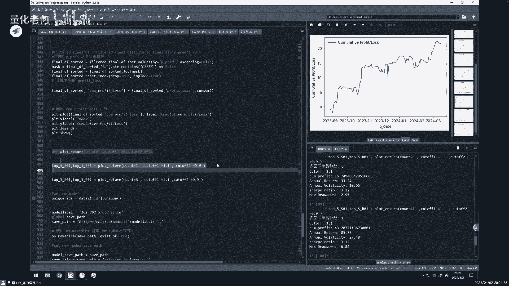

然后然后的话我这边有我自己跑，就是保存在那边跑的这个呃。

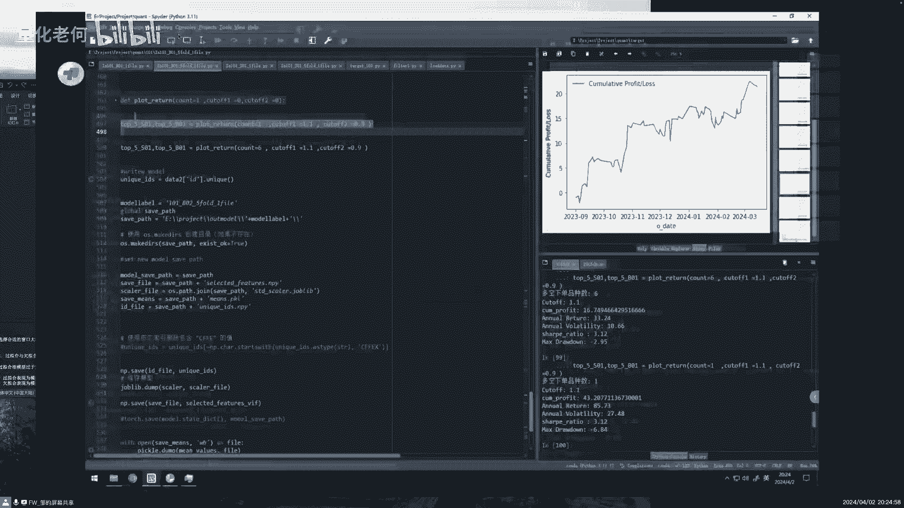

就是那个全面全量十一七十一张表，大家可以看一下，这个我就不跑，这个跑的太慢了啊，这是另一台机器，大家看一下嗯，直接跑一下，结果这个就不跑全过程了，诶，我记得好像是这里吧，对，我忘了是不是这里好像不太对。

不太对，不是这个不是这个模型，哦这个这个这个刚才那个那个模型不对啊，诶，这个好像有个对，看一下，哦对这个这个跟刚才有点不一样，他这个的话那个单独的效果不是很好，然后到三第三组。

三组以后社会效果会好一些啊，当然这个具体原因就很难讲的，像这个是六组六组的，就比刚才那个要好一些，比刚才那个要好一些，这个是这是啊，这是诶诶这是空方向，这是多方向，这多方向啊，这公安多方向。

然后那个样门外的那个排序能力可以看一下，可以看一下这个样本外的排泄能力，比刚才那个是不是，看起来整体排泄能力要好很多，好很多是吧，但是但是他在选第一组的时候，并不一定是比那个好，你看一下啊。

并不一定比那个好，这个就是说它总体排序能力非常好，但是每天的排序能力并不一定很好，他这个每天的排泄能力相对比较平均，就会出现他选绝对排在前面的时候，那个效果不是很好。

就前面第一个的时候反而选前面六个的时候，效果会好一些啊，啊当然这个这个过程应该可以优化的，就是我，但当大家知道这样一个原理之后，就可以去优化的，因为就是说首先我们原则上来讲的话。

第一就是整体排序序能力一定要好啊，这个多空上涨的大，它与小培训能力整体的一定要排序好啊啊，然后第二个的话就是说，我们是希望每天去做这个交易啊，有做做这个交易，能每天把这个上涨与下跌的这样的一个品种。

把它区分开来，那这个时候的话就是说我们去吧，在这个基础上，希望每天的排序能力也要比较好啊，所以所以所以先这边，像这个这个模型出来的结果，这个应该是没有做，那个没有做五折的，没有做五折的。

还有那个第一组的时候就不是很好，就排前面第一组的时候，我反而第六组的时候比刚才那个效果就要好，但是这样的一个情况呃，呃周老师不好意思，刚刚你那个那个前面几个图，有一个就是到后面一段就回撤比较大的。

我我没太懂，等下等一下等一下我回到刚才那个嗯。

就是也是这台机器嘛，就是你刚刚那个是刚才这台机器吗。

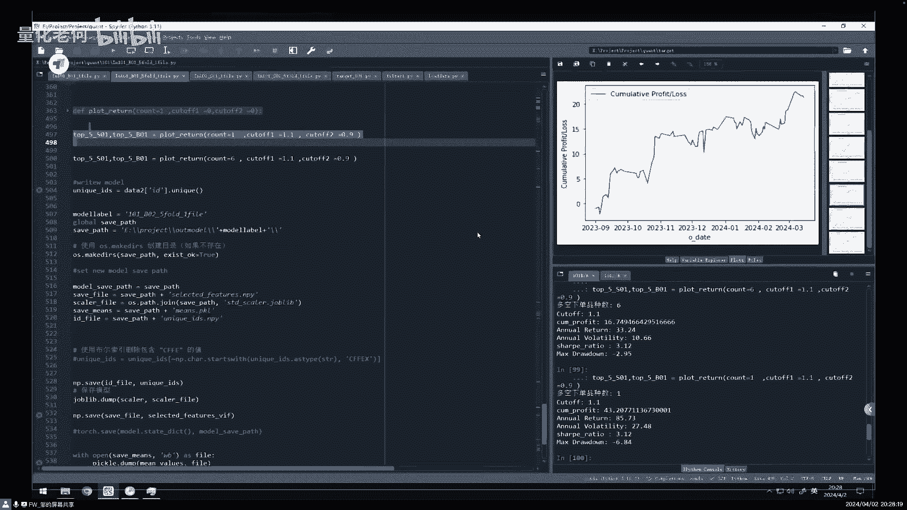

这个是吧，再往上这个是吧，还有一个哎停停停停过了，往下一点好呢，往下再往下一个这个吗，对对我不懂，就是后面哦，这个不是这个不是收益图，我知道我只是因为因为我没听懂这一块啊，OKOK这个不是收益曲线。

这个注意一下，这个是这样的，就是按照那个概率的从高到低的累计收益曲线，也就是说这个零这个位置是概率最高的，这个六弦这个位置是概率最低的啊，排列顺序之后这样的一个收益曲线，所以他这个概率排在后面呢。

他收益是减减少的，所以他这个曲线就往下走的，排在前面的那个收益是那个累计增加的啊，也就是说这个曲线越陡，如果这边越陡的话，我说明排在前面的那些平，排在前面的那些那些那些呃预测值，它的收益是好。

如果越陡的话，收益就越好啊，比如说这样的话肯定是比这个好，就比如说最最最高点去到五百六百，那肯定是比这个好啊，但是的话不可能就是出现那种那种，那种很完美的情况，像这个曲线已经算是比较比较好的。

这样的一个曲线了啊，因为它在前面就是说我这个概率在前面的话，基本上的收益都是都是在上涨，直到了后面这个位置才收益才开始往下跌啊，是这样的一个情况，他知道那个交易上面的含义是什么呢。

这个呃这个这个不在交易上面，这个不在交易上面，这个index是概率的，概率的排序，从高到低的排序，概率的排序是不是概率，我们概率排在最前面，我们因为去操作它嘛，就是因为是预测对了嘛。

那应该是收益是增加的嘛，这个是这个就是说检验我整个这样的一个，排序能力的啊，它是检验排序能力的，刚才我就说，就说你这个整个排序能力看起来还可以，但是的话到每天它不一定好，为什么。

因为他有可能这个整个排排的好的，都是那个跟我那个呃，比如说那个呃我这个是这个是啊，这个也是空方向，那整个比如说那个有几天，那个大盘整个都是下跌的，我把那个大盘下跌的那几天全部都预测对了。

把这个极端的都预测对了，那这个时候的话，他可能也会出现这样的一个曲线，但是的话对于那种大盘比较震荡的时候，他就区分不开来啊，区分不开了，所以这个的话就是说会出现这个情况。

为什么这个一组的时候就选那个排队，排在最前的时候不一定是最好的啊，因为就是说他那个很多，中间很多天并不是大涨大跌嘛，很多天不是大涨大跌，这个时候的话选出来这个一组的时候，就就效果会比较差。

但是的话它整体排序好，那一定是选择多的时候，排序能力还是可以的，他一定是这样子的啊，他会这样的这样的一个情况，嗯有有朋友问这个index是什么，就是概率吗，概率高到低。

但是我这边index这边写的有点不对啊，因为这个这个就是个序号了，嗯好我就这个问我这个问题会有点多，那个那个呃先周老师继续讲啊，基本上应该都差不多讲的差不多了，就是呃然后那个止盈止损的。

止盈止损的那个那个呃今天没放上来，那个那个调起来还有点麻烦，我下次下次的话，我们在那个课程里面再继续讲，然后然后我们回到那个这个演示过程，就基本上差不多了啊，然后我们看一下我们后续有什么样的一个。

那个内容。

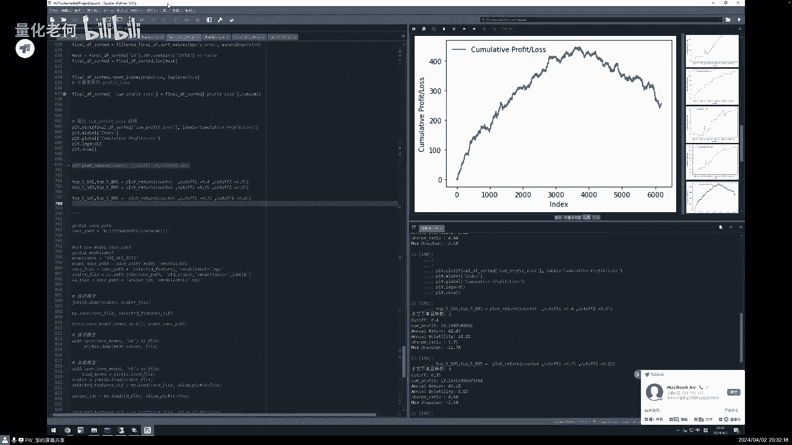

啊周老师那个不如你你这样子，你先花点时间那个讲解一下，我们啊课程里面就是啊对对对对对，稍等一下。

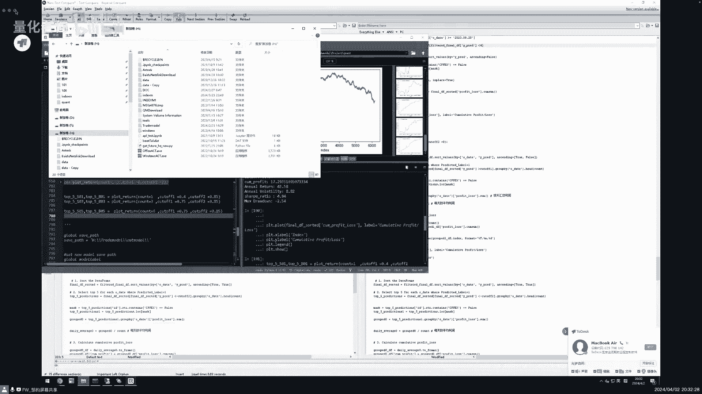

讲完这个之后，我们就针对我这边，因为我们总结问题还是比较多的，因为我有问题还是小白，好好的好的好的，我们快速的过一下课程内容啊，呃我们后续的课程内容的话会大概有六六次课，可能会压缩到五次课。

但是要看具体情况，学员的情况呃，第一次课的话，主要还是讲一下这个特征工程和机器学习的，一些基础知识，就怎么去构建特征工程，第二个的话就是讲这个量化策略的这样的，一个建模与优化，包括止盈止损的一些设计。

就刚才没有讲到的啊，一些一些这样的一些东西啊，而第三个的话我们会讲一套一个完整的，就是给大家讲一套完整的啊，特征工程这样的一个设计的一个方法啊，当然大家跑不跑得起来，这个不一定。

因为这个对对工程的这个方面的，一些一些要求还是比较高的，我们曾经辅导过那个一个团队去做，他们做了两个月做出来，反正效果一般般吧，然后第四个的话就是怎么去应用这个因子工程，进行这样的模型调优。

然后怎么样去防止一些过敏和一些量化学习，中间的这样的一些一些陷阱的方式，一些应对的情况啊，然后的话第五个的话会讲一下，就是模型训练好之后，你不可能一成不变嘛，那当然有新数据来的时候，你怎么去去评估。

去去什么时候再进行新的训练，怎么样去进行这样的一个呃训练，是用这呃迁移的方式还是用增量的方式，还是怎么样的方式啊，这个第五个第五个课程的这样一个内容，第六个的话就是啊，对前面整个课程的这样的一个全面的。

这样的一个一个整理和一个回顾，然后把这个信号呃，信号用这个交易自动化的交易框架，把它落地去进行这样的一个实实施啊。

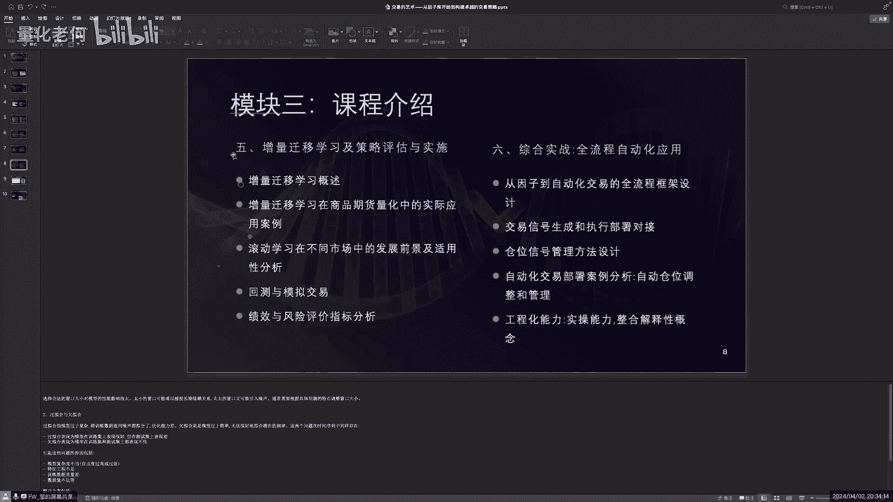

大概课程内容就是这么多啊，这个因子库的话，大家回头可以去看一下那个那个课程，在那个录播，在那个何老师那个B站B站里面。

大家可以看得到的啊，好吧啊，这个这个这个这个数据库的分享地址，大家也可以去看一下的，就是这个课程内容就大致这么多。

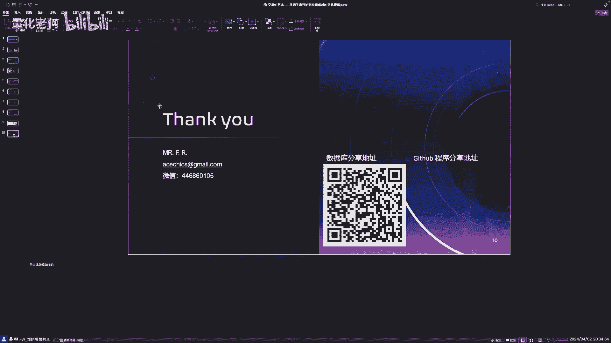

然后何老师看你那边是还有呃，什么样的问题是吧，呃有问题。

那那其实就是说我们呃就我们这边跟周老师辈，已经有课程了嘛，啊感兴趣的朋友呢呃就是说欢迎参加，然后因为课程的内容就比较多，因为老师在这一块也是前沿嘛，所以就是说这个这个知识架构这一块呢。

肯定课程要比公开课讲得比较清楚啊，然后就是感兴趣报名的啊，就欢迎联系我，现在我这边还有一些优惠价给到，大家好吧，然后呢我这边呃我这边问题还是挺多的，那个呃首先的话周老师，你能不能简单的归纳一下。

你今天晚上讲的整个流程，就是就是简单，其实回到这一页就，呃其实今天讲的是右边的这样的一个标准的，策略的这样的一个建模都是这样一个流程啊，中间有几个有几个东西我都都有讲到的，第一个数据准备是吧。

那个可以在网盘上面可以下载下来，那上面数据都有了啊，然后目标设计的话，这边的话我是用了一个简单的目标设计，就是那个那个今天那个开盘到第二天开盘，这样的一个时间段的。

这样的一个上涨和下跌的这样一个可能性啊，然后第三个特征工程这个因子库的这一块，就是因子库，大家可以从上面下来下来就可以用啊，然后第四个是我们今天重点讲的这个，母亲训练的这样的一个过程啊。

训练完了之后就是怎么生成信号，就是说刚才讲到的就是你整整体效果，那个排序效果好，但不并不一定意味着每天的排排序效果好，这个时候的话你要生成信号的时候，不能从那个绝对零那个那个值。

那个阈值那边进行这样的一个一个区分，那个是会有问题的，会会有很多时候会有问题的，这个时候的话就会有这样一个多空，有这样的一个阈值这个设定啊，刚才我们可以看到比如说零呃，0。8，0。9或者1。

0这样的一个预制的设定啊，所以所以今天主要的内容就是这么多啊，这么多，当然的话就是啊对，所以就就前提是那个先有周老师的数据，就我们刚刚那个二维码啊，在网盘上面下载了一个数据啊，那有了数据之后呢。

就按照这个流程就是可以一步一步的，就像我们公开课一样去进行操作，OK所以大概内容就在这里，大家先看一下啊，看一下有什么内有什么问题，我们后面可以再再聊啊，嗯然后我的第二个问题是啊。

我看我们英子库里面的因子很丰富嘛，但是老师在演示的时候，好像你只是演示了只用了两张表，只用了两张表，对对对对对，一个简单的模型是吗，对的对的对的，因为那个时间关系要跑所有表，那个时间会慢很多嗯。

所以就是说为了今晚的演示，所以就特意把它简化一下，但其实效果我们看到其实还是不错的啊，OK啊，然后后面后面的话就是说我们的策略是，其实针对多跟空，它是一个分开训练的，其实可以理解为两个策略。

或者说两个模型啊，对其实是分开训练的啊，分开训练的有呃，在我们这个多空对称的情况下，可能还不明显，如果说多空不对称的时候，你就肯定是要分开训练的啊，那分开训练的时候呢。

呃其实也会出现多空同时持仓的情况也会有，但是不多，我讲理论上会有的，理论上会有啊，OKOK嗯好的啊，所以就多空策略啊，嗯然后的话我就是比较不明白的一点，就是就是那个整体排序，整体排序。

就是说其实他肯定是，我理解是针对品种的排序吧，所有的品种它预测根据他预测的值，然后按照预测的那个值进行从高到低排序，然后对应到它的收益啊，是这样的一个情况下，就是我们后续的课程我们详细讲的时候。

我就把那个数据直接拿出来，大家对着数据看了也会更更清晰，因为没有做过这个过程的时候，可能理解起来稍微有一点点有一点点麻烦，OK明白明白，好好好嗯，然后的话就是我我后面还想问的问题。

就是说如果是嗯像像老师用的积谁最快，用的库是哪一个库是吧啊对啊，可以看一下这个其实用的怎么讲呢，不是很多啊，就简单的可以先熟悉一下潘达是啊。

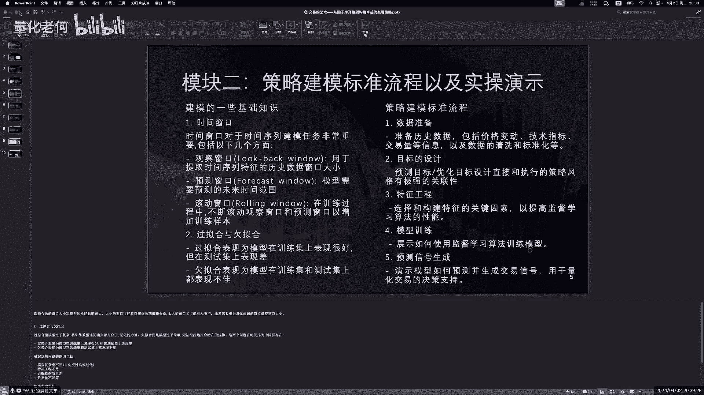

像像像南派啊这些啊啊pd派啊，这比较比较简单的，然后还有一些这个比如说那个嗯随机抽样啊，因为这个肯定是要用的嘛，SKLN那些是不是也用到touch啊，PTOUCH是吧，对。

有PTOUCH有用到可以用到就是大致这些，然后有画图吗，还有画图有用到自己明白嗯，嗯就就大概这么多吧，好的有朋友们预测出来的数据是什么，是价位吗，我理解的话，我先我先说我的理解啊，我我我话比较多啊。

呃首先呢就是说我们预测的值是呃，就是说今天到明天啊，今天的开盘价到明天的开盘价啊，它的一个呃就预测预测值嘛，啊，这个是我们可能设就就设置在目标函数里面了，对吧，然后就是说预测出来的话就不是价位了。

它是一个排序，那比如说我的做多的一个策略，它最后就会排序啊，12345啊，比如说第一名螺纹钢，第二名就转什么什么，就一个一个预测出来也是一个值，它也是一个值，这个值跟它对应的上涨空间或下跌空间。

这个值是对应的，只是说它不是绝对价格对，就一个排序嘛，就是输出的是一个列，是一个由大到小的一个一个列表啊，对啊，然后下一个问题就是说老师等一下，等一下我还补充一下，其实我今天讲的。

我今天讲的是直接是用回归的方式，今天没详细讲，就回归的方式，它是直接预测这个值的，就是这个上上涨和下跌值的，其实我还还有另外一种方式，就是预测上涨和下跌，是否也就是说说是把它归纳成这个呃。

上涨和下跌只有两个方向啊，就是这个用二元的这样的方式用预测，其实两种方式都各有优缺点吧，又有优缺点，我们后续课程会讲到的啊，后续课程会讲到今天只讲了一种方式，回归的方式。

然后另外一种方式就是只只看上涨和下跌，也是一种方式，OK好的嗯啊对，刚才那个那个to do开的，这回归和上涨下跌两种方式都可以做的，两种方式各有优缺点，两种方式各有优缺点，好OK那我们稍微休息一下。

好不好，休息一下，以后有问题也可以提出，我看一下这边，什么boss，大家能不能开麦，我设置一下啊，呃呃趁着这个空档，我可以简单的讲一下，他们的一些就是回归的方式，和那个二值的这种上涨。

下跌的方式的一些区别吧，就是回归的方式相对来讲的话，就是他会会就是跟这个这个上涨，下跌的绝对值会更加接近，也就是说用回归的方式，去把前面那个涨跌比较大的，就涨的大，后跌的比较大的，把它区分开来。

这个方式相对来讲会比较好一些，呃但是的话量多的时候，他可能这个区分度就不一定那么好，那那用那个二元二元的二值的方式做预测，就是上等下别方向做预测的话，他正好相反。

他就是说他对那个排在最前面的那个识别能力，可能不一定那么好，但是他对批量的这种上涨和下跌的，预测能力会好一些，也就是说他适合做比较资金大一些的，这样的一个方式啊，为什么会是这样，就是说你只分为两类了。

就是说把这个多复合可就涨涨和跌，这这两类它加强了啊，明白我意思吗，就是说我这个呃涨的放在一起了，跌的放在一起了，他这个涨和跌的属性，它就进行这样的一个互相的加强，那回归的时候它就具体的值。

它就没有这样的一个概念在里面，所以它会出现这样的一个情况，也就是说通常如果你资金量少的话，你就用这个回归的方式，我就坐最前面的那几个就好了，那那如果说之前比较大的话，用这个R语言的这种预测的方式。

他可能可以做到，比如说多功十组甚至更多都有可能啊，收益还可以啊，他会这样的一个情况嗯，OK那我看我有一位朋友说想那个语音交流，那个你现在啊可以解开一下哦，哦哦是吧，那我们等等啊，可以可以那个呃说一下。

OK哈喽老师好，能听到吗，好听到听到啊，老师刚才说的两种方式，就是一个是做分类，另外一个就是做回归是吧，今天讲的就是回归的这个内容是讲回归的哦，那刚才老师讲，就是说分那种方式会更适合大资金量啊。

我想没有太理解这个话呃，他是这样的，就是说呃你二语言的话，它是只分了两类嘛是吧，也就是说只是分成上涨和下跌这两类，是不是，那这个时候的话就是上涨和下跌，它这两个特性就进行了这样的一个加强啊。

我回归的时候都每个值都是独立的，是不是他每个字之间，可能就没有这样一个家庭的关系，那这样的话二元加强的时候，也就是说我把这个呃多与空的，这个它这个两个类别的这种区分度，把它分开了啊。

但是中间的一些特别的值，比如说涨的很多的和跌的很多的这种种植，它的识别能力反而就比减弱了，为什么减弱了，因为都变成两个了，两个类型的只是变成涨与跌了，是不是，就相当于就是平均掉这个这样一个属性了。

那这个时候的话就是说呃我之前量大的时候，我这样的话，我希望它这个相对平均一点，我这样的话希望品种时尚的品种能多一点，那这个时候用二元的方式的话，就可以把相对靠前面的一些品种都集中，这样的就抽出来。

你回归的方式，它相当于是回归的方式，相当于是一个一个，比如说你如果是上涨，下跌是绝对线性的话，就是一个线性的嘛，那就把最前面抽出来，这样的是这样一个道理哦，是不是可以理解，就是其实他们的权权重不太一样。

做的话可以这样理解的，OKOK老师，那可以做二元的那个分类，可以做多分类吗，那是不是可以算是可以的，但是我的我我自己做的，只是做了这个回归和二元的，我还没做多分类，理论上其实可以做三分类。

比如说那个上涨下跌和不涨不跌，是吧啊，你们啊，嗯就是收益率预测那个幅度比较小的那部分是，对对对对对对对哦，好的，谢谢老师哦，还有一个问题，就是刚刚前面有讲到有2万多个那个特征，这些特征是怎么生成的。

我们前面是有一个完整的课程讲这个事情的。

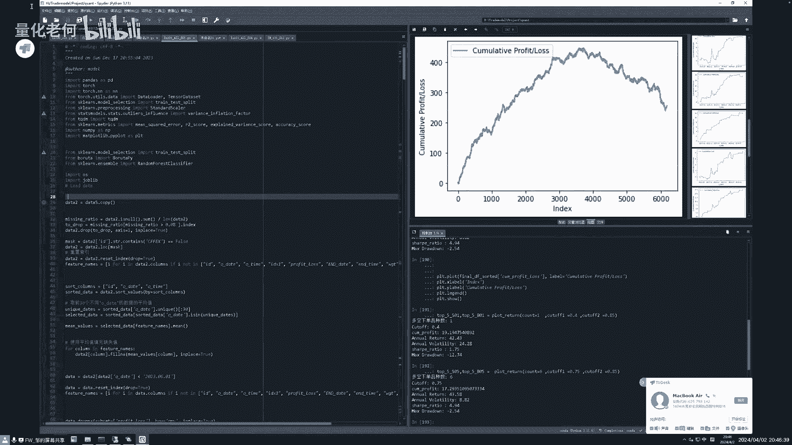

就有个完整的课程呢，刚才我们回顾的时候也大致有讲，有讲一下，这边大致可以看一下，好的啊，这里这里这里可以大致看一下的哦，其实主要还是算法是不是呃，对应，应该说是用现在这种比较流行的这种。

AI的一些框架里面特征提取的方式，我是用他的这个方法抽象出来的一个概念，不是用它的框架去直接去去生成的，因为直接用它的框架去生成的话，就你不知道它里面的逻辑是什么，不知道它规则是什么，就不清楚，老师。

您这边列的就是主要是还是使用一些神经网络，我想问是那个神经网络输出的最后的那个值吗，还是说不是用它这个框架去生成，我是用它这个概念，比如说这个CN里面的这个卷积的概念哦，哦哦啊。

比如说ANSTM的这个长短周期的概念，比如说像光美里面这个长长的概念，比如说他这个多头注意力机制的概念啊，是用用它这个概念，不是用它的框架，用框架你就不知道里面是什么逻辑，知道吧，黑箱子能理解。

这个就是有点类似于一个多网络的集成，是这样的啊，对对你这个理解是对的哦，哦哦大概明白了，那这个就是这个是把中间的输出的，比如说神经网络某一层的这个因子值提出来，做因子。

还是说最后的一个这个网络的一个预测结果，作为输出值的概念，比如说选集，选集的概念是什么呢，呃其实其实大家都知道我们做这个做技术的，都知道这个技术指标，技术指标就天然就是卷积，大家不理解这个东西。

所有技术指标，95%以上的技术指标都是卷积，它都是带权重的，移动平均，回想一下这个卷积是什么概念，回那卷积是不是这样子，一路滚过去的，对滑动窗口对对对，卷积不是新概念。

卷积这个信号处理是个很老的概念的哦，OK嗯OK好哦哦那我想补充再追问一下，如果用这些就是集成的神经网络，做这个构建因子哈，那这边的时候就是说你在设计这个网络，你训练肯定也得给那个就是预测目标嘛。

这个标签大概是会怎么去设计呃，就是设计因子的时候，我就用了三类，一类就是跨日的，一类是日内的，一类就是白天了，就大概设计了三类，所以刚才我说我们这个整个那个预测的目标，也就是能到跨日嘛。

就是那个时间没有做吗，哦好的，谢谢老师，就是还是收益率是作为预测标签，是不是啊，其实不完全，因为你如果完全用收益率的话，你就会忽略一些东西，就是构建因子的时候不是这样的，构建因子是考虑两个。

一个是相关性，一个是收益的情况，这两个东西都要考虑啊，哦说这情况是不是有点类似那个C型模型里面，那个IC的概念，这样对你理解对了，理解了理解对了，内测的概念，嗯嗯好的，谢谢老师，我暂时没有别的问题了。

好好好，这位同学是行家啊哈哈OK是的好，还有其他的同学需要语音吗，啊我看了，我看有个同学问那个表格没看懂是吧，我看一下，你稍等一下，我发一下PPT，这个是吧，这个就刚才讲到的，我是用三类标签。

这个101就是跨日的，201就是早上开盘到晚上收盘，就是十点钟收盘，202的话就是早上开盘到下午收盘，就是用这三个标签去进行，这个因子的这样一个一个区分啊，刚才那个同学，其实这个问答的时候。

就已经输那个问了这个事情了啊，好的还有没有其他的问题，LOSTM相当于什么技术指标，其实这个很好理解啊，长短周期吗，我们这个时间框架就是天然的长短周期啊，啊这个就是长短长短周期，这位同学理解了没有。

我们很多概念，很多概念都不是新的，像LSPM这种长短周期都不是新概念，卷积这都不是新概念，然后那个transform里面，它是这个所有特征提取的一个集大成的，它有5656种这种特征提取的方式啊。

表内特征命名的规则是什么，比如什么哪个东西，你看一下他说了哦，这个命名规则你完全看不懂，我跟你讲，你也我也看不懂，这个我是说你要通过血缘关系你才查得懂的，当然是有一定的规则的。

但是因为中间因为字段太长了，进行一些简化，所以你玩就是要从上面去看的话是比较难的，大致方式大致有几种方式啊，就是可以去查一下，不是擦一下，就是他组合的方式，一个是时间框架。

就是最底层的数据加工的时间框架，然后的话那个加工了一些那个那个卷积的一个，概念在里面，然后然后中间呢还有一些一些算法的组合，是什么，用什么统计算法，或者用什么横向对比，纵向对比啊。

或者是那个那个一些什么样的组合啊，这样的方式，我看还有没有其他问题，我我就周老师讲，快讲了一个多小时了，哇哈哈哈，时间过得好快，是是是你你一般的那种机器学习的课程，他都不会跟你讲这个什么卷积的。

到底是怎么回事，他就是告诉你这个在图片上滚过去，但这个东西就是你要从从它的基本原理，去理解它的时候，你会发现他根本就不是什么新东西啊，看来看来就是说对这概念虽然不行，但其实用好的人也不多啊。

所以要用的话，对这个东西要用的是是的是的是的，然后有有朋友问，就是说呃前置知识是先要学机器学习，深度学习吗，啊呃其实有拍成之后，我觉得这个机器学习和深度学习，我觉得本质上没区别的啊。

嗯就就跟着我们学就可以了啊，自己学深度学习的话，你机器学习怎么讲呢，深度学习你可以看作是机器学习的一种，只是说像深度学习是把这种网络啊，这种概念加进去了，那原原来最开始机器学习一般就是回归嘛。

然后统计嘛是吧，回归统计嘛，然后聚类啊这些一些基本的算法嘛，后来有了这个这个Python的时候，这个算法就加强了，有这个深度网络模型啊，图神经网络啊，然后现在有强化学习啊，这些很多东西进来了吧，O。

然后现在大家看到的就是说是周老师的，分享给大家的这个啊这个特征库啊，特征库，就原则上呢，大家今天晚上分享的公开课的内容呃，大家拿拿到了这个原始数据，可以自己去进行一些复现啊，所以就是无论报不报课程吧。

这个大家都可以，欢迎大家下载下来先用一下啊，或者说那个虽然不报课程，但是我想跟周老师交朋友也可以的，没问题，但是就对大多数朋友来说，真的要用好我们这个啊特征的数据，或者说用特征数据。

想让自己的交易策略更上一层楼，就最好就是说啊就参加我们的课程，因为我们课程有一个有老师，有师兄，有学习环境，有一些实用的心得体会，那还是非常适合大家来一起探讨的啊，OK如果是没什么问题的话。

要不我们今天晚上就先这样吧，好不好啊，再再再再等等，等个2分钟啊，等个2分钟都没问题，就先这样，好的诶，周老师，我看你那个课程分享当中，用transformer，这个这个这个这个算法好像用的比较多啊。

虽然我也是小白，我也不懂呃，全封了，其实我这个还没有完形成完整的一个策略，我再试啊，嗯呃其实其实那个诶，这现在今天这个图片里面没有啊，之前我有一张图片是分享，就是当当前这个呃。

有哪些算法是对不同的这种时间序列。

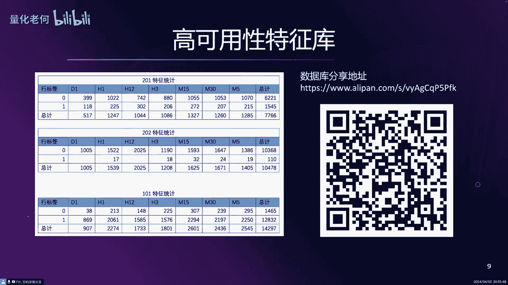

预测的效果是有一个排名排名的，大家可以看一下，虽然是前面课程的，稍等一下啊啊，这个这个这个是公开的一个排名的。

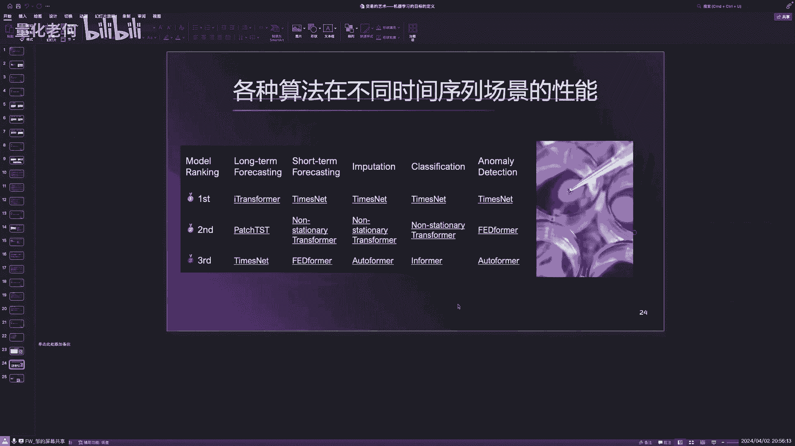

OK长短周期那个这是短长周期预测，短周期预测，然后这个分类这个是那个异常检测，异常检测其实这个应该是有用的啊，但是我现在还没用，然后像这个呃长周期i transformer。

它是transformer的一种变形，它是那个把那个好像是把那个时间编码，那个东西进行一个什么对齐，好像是这样的一个东西，然后这个times late是做这个短周期预测，是比较比较比较强的哈啊。

这这这些方法都是在给hub上面是公开的，所以刚才那位同学问那些代码，其实你看我们今天的代码都是最简单的，但我们那个代码离开我们那个数据库，其实你是没什么意义的，因为这简单的。

然后里面的所有的那个像筛选筛选的，最重要的就是筛选方式嘛，筛选方式是那个两种筛选方式。

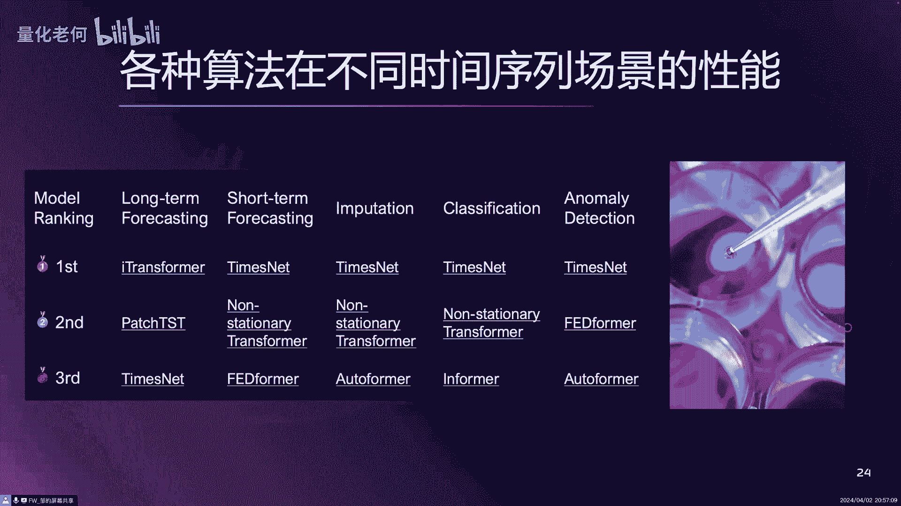

我在那个网盘里面都有分享的，都有代码分享的啊，然后那个模型其实很简单，今天我那个模型就是两层的，你那个大家对这个稍微对这个模型比较熟悉的，随便搞一搞都会比我这个搞得稍微复杂，可能更更更好的模型出来的啊。

所以他最基本的是筛选的方式，筛选方式，那个我是有代码分享的，在网盘里面是有的啊，OK所以有有特征也有示例，大家可以去看一下，对对对对，是的是的啊，啊那个周老师，我想放一个我的联系方式上去。

你可以先关闭一下，可以可以可以，你放一下，我退出来啊，你先退，我觉结束共享了啊，我分享一下，OK这个就是我的联系方式啊，大家可以可以就是扫一下啊，扫一下，这是我们的课程啊，我的课程啊，然后再想。

最后想了解一下这个一个前沿的领域啊，现在这个强化学习也也很火嘛，这个它在我们量化交易领域，会以后会有一些比较好的应用吗，呃确实就是最近我不知道大家有没有去关注，量化交易这一块的一个招聘啊，两大方向。

一个是机器学习方向，一个是那个强化学习的方向，强化学习那个招聘的那个，我看那个量一直在上涨，嗯嗯那个现在可能还没有这个机器学习多，但是看那个上涨趋势估计很快会持平的呃，那那强化学习的话。

他会因为我最近也在研究啊，强化学习，它可能会有跟跟跟这个，这个我们普通这个机器学习，会有一个根本的不同，就在哪，就是我们这个我们今天讲的这个学，是属于这个监督学习，监督学习都是做，首先他是做预测为主。

预测之之后你要形成策略，你还要有另外一层的东西去做的，比如说第一个那个信号的生成，我要用那个卡特夫认成信号，然后有信号之后，我可能要考虑这个中间的止盈止损啊啊，然后考虑这个执行智能怎么设置。

才会怎么设置，这些东西都考虑好了之后，你才能形成一个完整的策略，是不是这样子的，那强化学习的话，它是直接到执行的动作的，就直接是策略到策略的啊，那强化学习这是第一个跟他不同。

他不是做他他不是说只是做预测，他是直接到这个那个操操作的策略的动作的，他会直接仓位分配，什么时候下单，什么时候平常什么时候，这个这个这个怎么去去执行止损啊，这些动作的话。

直接形成他的一个一个行动的策略体系啊，这是这是他的它的它的最终结果，跟这个预我们这个机器学习的这个，预测的结果是不一样的，然后第二个的话，强化学习可以考虑更多的因素进去，可以把把这个很多很多。

比如说有个很强的盘感经验的啊，比如说那个什么盘感的经验的，这些东西可以加进去，作为他的一些一些这个状态空间加进去，你举个例子，比如说呃有些人他觉得这个这个他看盘，看这个曲。

看这个这个这个这个呃那个技术技术指标，看那个曲线，他看这个东西都是有很好的感觉，然后告诉我123，我123看什么，比如说看前面3分钟或者5分钟时，环境下里面最高和最低或者压力线，所所谓的压力线。

那个那个支撑位这些东西，这些东西都可以加到里面去的啊，明白吗，所以它可以可以把这个量化的东西，和传统的主观的盘感，经验的东西，就经验的东西可以嵌入进去啊，他可以做到这个啊，可以做到这个。

所以他这个跟我们这个通常的机器学习啊，做预测的这种机器学习，会有比较本质的这样的一个区别在里面，当然两者可以完完美的结合啊，两两者可以进行结合啊，OK嗯好啊，那反正今天晚上就是非常感谢周老师。

给我们花了一个半小时做分享啊，然后最后的话呢，我们课程是在那个20号开始啊，所以为期六周的一个网课啊，呃最后的话就是说想报名的，可以扫我的微信去了解我们课程的一些细化，好不好啊。

那今天晚上就非常感谢周老师呃的分享啊，也欢迎各位朋友的参与啊，我们今天公开课结束，谢谢大家再见啊，谢谢周老师听见啊。

