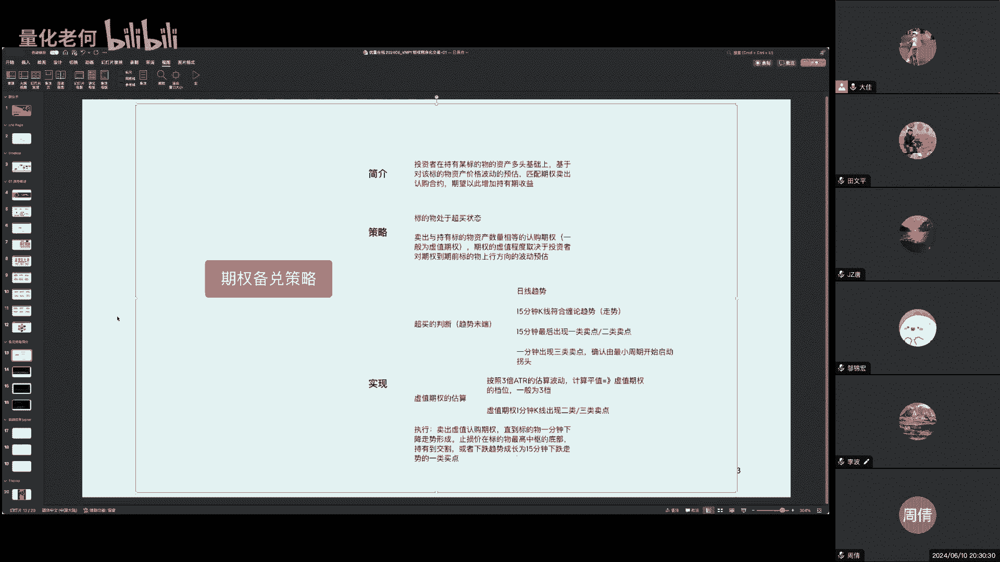
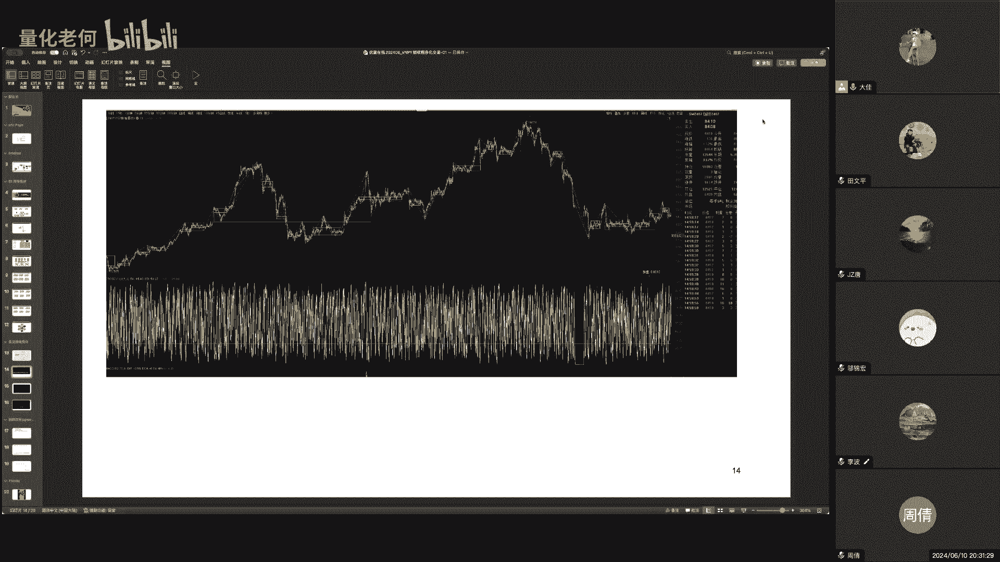
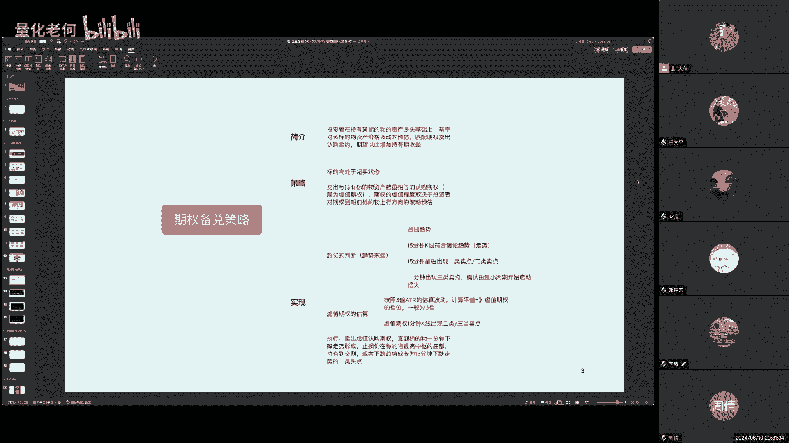
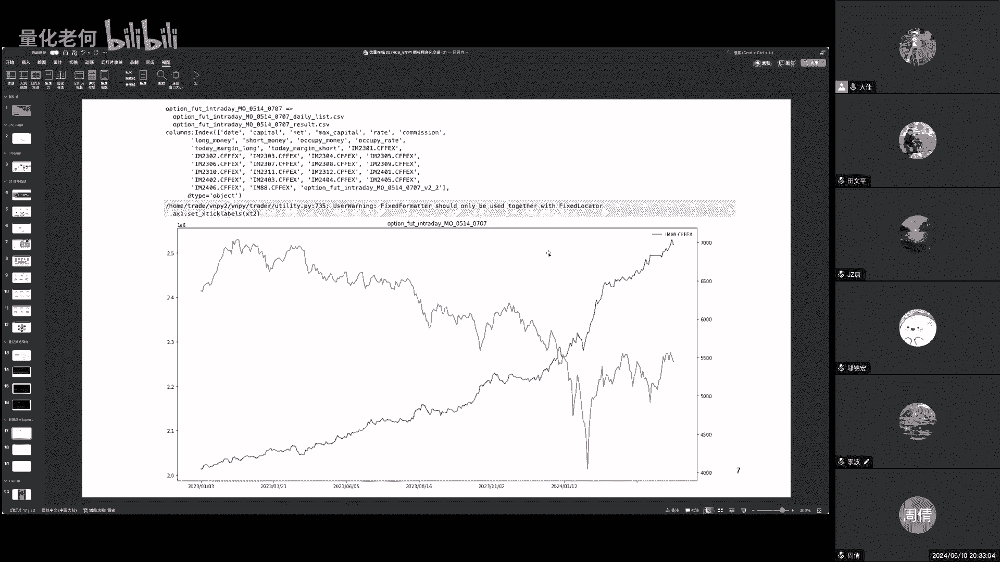
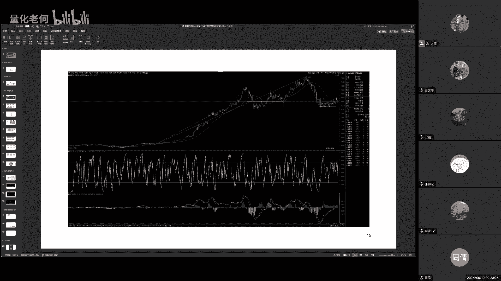
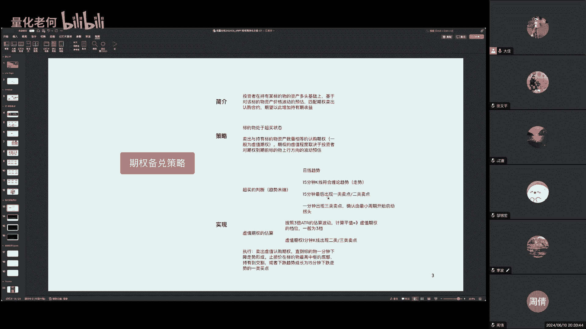
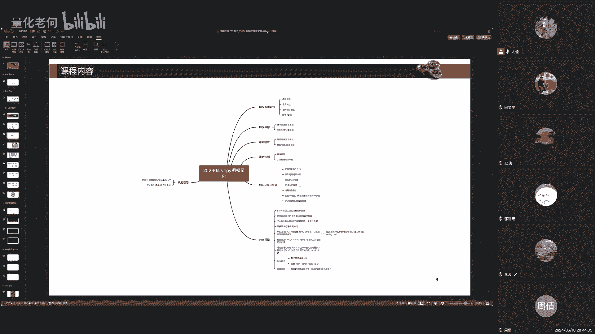

# 策略之光第20期 期权量化前沿策略分享会 - P1 - 量化老何 - BV1jm421L7vE

诶哈喽大家好大家好，那个啊我们八点钟开始啊，啊整个今呃今天一个小时的时间啊，哦我讲的大概就是内容呢就是稍微比较啊，嗯有一些犯哈，但是如果大家有什么想法啊，在在那个聊天室里面。

或者是呃在那个微信的那个沟通群里面，就大家提问一下都都OK的啊，那好我们呃开始。

如果那个听到听到看到画面和那个听到声音的，大家在聊天里面啊，回一下我啊，OK哦哦是这样的，那个呃我我我从那个腰呃，幺五年开始去学这个量化交易，然后到17年开始加入公司私募基金，在做这个量化啊。

19年就1819年开始做期权呃，到现在应该有啊，就是大概8年的这样的，一个量化的一个的历史吧，好的一个时间啊，我自己个人做的就是做的东西可能比较慢哈，就是大部分就是一所有的程序。

所有的这些东西都是我自己用过，实战过，包括策略啊啊才给到各位啊，那中间的很多的坑我也有额的奖励，就是成千上万个坑，我也踩过好，那齐全的，首先的话齐全的这样的一个程序化交易额。

它在区别于我们的这个呃期货或者是股票，它有它的一些特征啊，那我们我说这这个课程，我在20 22023年我推出过，然后也去东莞也有一个啊，有一次的一个现场的交流啊，那个啊今年的话。

因为我我其实从去年到今年，我我做这个网课的这样的一个时间就越来越少，因为公司的那个事情也比较多哈，我们也有一些侧重点，放在一些呃未来的一些技能上面，像这个机器学习啊等等这啊但坦率来说啊。

我就是觉得我自己个人比较慢哈，所以呃我又不太愿意把一些比较泛泛的概念的，一些机器学习的东西啊，做出来分享给各位就简，所以还是希望自己踩过坑之后才才分享啊，那期权这一边的话，呃啊我我今天大概跟大家讲一下。

就是说呃跟ASSAM就是说有这样的一个沟通啊，呃希望因为毕竟过了大概一年了嘛，那个呃有一些啊，我们过往在这个题卷里面做的还不够好的地方，或者是有一些呃加强的地方，那我也在这个课程里面跟啊诸位做一些补充。

就是在里面做一些说明好，其实整个VMPY从它1。0，我们就我就开始在这上面在不断的扩展嗯，那所有做的事情都是为了最终实现这个呃，无人值守的这样的一个呃程序化交易啊，这个是一个唯一的目标。

也是一直的目标啊，啊我希望是能够让他在啊不断的在自己运作，能够让我专注于做自己研研究的事情，那啊形成这样的一个研究啊，额上限呃，运维啊到这样的一个一个一个循环啊，所以啊包括推出这些课程都是真啊。

很多时候都是针对某一个一些个案，或者是某一些领域的东西啊，那呃这个东莞的这一次的课程啊，继承那个去年的，还是就解决一些齐全场景里面的一些痛点，然后啊再再跟大家展示一下，在这个增强框架的一些一些实现。

首先第一个就是说啊在啊，因为做期权这些是包含了在国内吧，主要是做国内的期权啊，国外的期权我还没有做啊，可能描述的还不是太准确，那个在国内的话，嗯我我我是在那个我们做的是主要是ETF的，而股指的那个期权。

还有额商品的一个期权，那现在额商品的期权也越来越多了，所以这方面也也得的量也不少啊，那我们整个公司自己的那个策策略的大头，还是ETF的期权嗯，所以我会在在整个整个实践的过程里面，我会对于这个啊他的低位。

我们又做了一些增强啊，呃主要原因是因为我们是一个比较大的，就是说规模稍微有那么一点点的一个私募啊，所以我们经常就是在不同的期货公司，或者是证券公司，开开通这个ETF期权的的那个交易交易嘛，程序化交易啊。

这里面其实主要涉及到一个产品，里面有很多个开开户的那个股东卡啊，那也涉也涉及这个嗯，也涉及一些额风控哈，要是主要是风控的要求啊，包括你可能市场在在在在，当天里面可能瞬间发生变化的时候。

我可我们可能在同一个标的物的这些集权上面，会出现反复的交易，而反复的交易就会造成一些嗯，嗯一些计算上面的，就是像什么成交持仓比啊等等的一些关键的KPI，就是那个他会判断你是不是恶意去操纵市场。

所以就会在这个KPI上面就会就会要去做一些啊，避免那还有一些自成交，他是他是惩他是惩罚的非常严的，就是说我在不同的账号呃，我在不我在上海呃，或者是在就是我单一个账号里面，我当然不能去做自成交了。

然后我还在同一个产品，在两家呃，两家这个呃证券公司，我发的单子，我可能在A下的买单，但是我在B下的卖单，那我就有可能造成自成交了，那这个也是有问题的，所以我们会做了很多这样的一个增强。

那确实是为我们自己生存而去做的好，那啊第二个呢就是我们做了一些额很多的那个，分布式的实例，因为一开始的时候，我们可能就是专门单单独的去做这一个账号，从这个三四百万开始做，那随着越来越多的时候。

可能就是说我很多策略哎，一般我们的做法就是复制一个策略，给到一个新的账号对吧，但是这样的话呢，这个策略都会说OK有相同的行情啊，相同的策略可能稍微配置的仓位不一样等等。

那后来就是发现当这个东西越来越越来越多，越来越多的时候，你可能你这个策略实力就是嗯，嗯这几十上百个这样的跑，那有时候你行情定位就变成重复了是吧，你的逻辑有可能是变成重复了。

所以呃到了后面我们就可能就是我们做法，就是啊基本上就是以分成两两批，那一批呢就是一批就是主策略的这做法啊，就有可能做三四个主账号，就分配不同的类型的策略啊，然后呢，那个剩下的几十个账号。

都是根据他自己的一些规则来去去做跟单啊，那这种跟单有一些快的跟单和一些慢的跟单，呃，快的跟单可能就是一些，就是说我可能下order的时候，那另外那边就跟着下order了是吧，就同时下，那我撤单的时候。

那边有个撤单，当然这中间会有一些差别，因为这个市场能不能给你那么多的成交，那第二个呢可能就是呃，第二个呢就是我会会做一些，我这边成交了结束之后，那上下面的账号才会再来去发单啊，只有这样的一个差别嗯。

这两种方式没有一个绝对的好坏，只能是说啊按照目前的常情况，我们就就就把它用上好，那额这个整这个啊，就盘中这个风控我们解决了之后呢，我们会呃这个回归到这个策略的一个呃根本，那我们要去做这个策略呃。

大家都知道以往去做策略，就是呃可能说是上一代的那个策略，就像tb啊，王华那些他们都是base在什么rule based对吧，就记住一些规则哈哈，可能就是哎哎统一这个时刻的MACD值，什么什么多少均线。

什么什么多少对吧，然后KDJ什么什么多少，然后或者是怎么怎么样啊，再加上一些condition好，那我就去发单了嗯，完了之后呢，我我到了什么情况，只有离场，基本上是这种逻辑啊。

这种逻辑的话呢就是当你越写越复杂，越写越复杂的时候，那就是你会发现你的可能就是条件，就是成千上百个这样的一个条件啊，就就就有可能就你的A条件跟B条件，其实是冲突的，有可能永远都达不到的。

或者是他有一些时间差是吧，那这样的话那我们就先得要做，把这把所有这些策略能够把它分拆下来啊，能够形成就是说行情就是行情啊，行情的一个初步的判断啊，嗯他的一个趋势上面的一些判断。

能够把这些公共的东西把它再沉淀下来的，那么我们就都可以做进来，那这样的话呢我就可以就是很简单的说，哎我可以知道说噢，这一分钟目前是上涨的趋势对吧，它有两个连续的中枢或怎么样的好。

那这样的话我我我就可以啊，我就我我策略就很简单，我就不用去再再去写，哎我怎么去判断这个东西是一个趋势策略，我就不需要去判断了，我就直接用就行了啊，那这样的话呢好处呢就是我们用增强的组件啊。

能够去达到辅助我们策略的一个判断，那其二的话呢，就是我们策略里面也有很多的一些要去实现，上面有一些比较，本身他的实现可能是稍微有一点点的，很复杂的逻辑是吧，他可能就是哎我这个时候我先观察。

我进到一个观察的区域好，我要可能要做了，但是我要寻找一个比较好的下单点啊，那我下完单之后，可能我还要再去做确认，他一定要达到一个什么样的状态啊，那才能够是说这个东西是成了是吧，这件事是成了啊。

那如果是说哎在这个若干个周期里面，他没有达到这样的状态，那有可能这事就不长了是吧，我举个例子，就是一个一一个简一个简单的呃，横盘的突破对吧，横盘的突破可能有很多很多的实现的方法啊。

也有可能是嗯啊就是你的那个支撑线啊，或者是啊阻力线被突破了对吧，或弹前通道被突破了，在这可能突破之后呢，他可能会会回抽啊，会下来啊，不能再下单，那再下单的话呢，你接到了接到了之后诶，他没有再突破对吧。

他没有他没有放量，或者是说在没有形成一个，他还是回归到一个震荡的状态，所以这样的话呢，你的策略逻辑，就是说你的策略的，它有一个从没有仓位到持有仓位，从持有仓位到他离场，是有这样的一个复杂的关系的。

那么我们就可以把这个策略模板做的，相对来说可以支撑很多很多的复杂的模型啊，这样的话呢就可以去去实现我们的策略逻辑了，嗯好那这在在这些策略模板复杂了之后呢，那就会其实还会我们我这边还做了一些简化。

就是说OK我把策略的模板做复杂，但是我会把交易做简单了，交易最简单，就是说我的策略呢，可能就是，而我这个时候要持有某一个标的物，或某一个期权啊，多少首是吧，那剩下的事情我就不管了。

那又交给他们去交给这个市场，或交给这个这个这个这个商城的这个引擎去，由他去发单，由他去自己测算，由他去追单是吧，那等等等等这样的一个逻辑，那这样的话呢我就可以把这个呃，把这些情况给给给剥离开了。

那然后呢我们会还会就是啊，但是最终执行下来的时候，我们在某一些策略的里面，可能就是有一些要求啊，我这个策略可能是有一些是我要去呃，一般的挂单，我要去分拆单子，我要去怎么怎么样。

那这些也是是去支撑它这些支出，基础组件也就支撑，那我可以用一些算法交易来去去下单好，那总的来说我们就把这个东西给分拆开呃，到最后的话就是一些会提供一些可视化的组件，可视化的组件主要是分成两类。

一类呢就是回撤的时候，我可以就是说OK我整个过程回撤完了哦，那我知道说哎我这我从什么时间点啊能够去呃，我从什么时间点去去做，进入某一个区间会进入某一个状态，然后什么时间点下单，什么时间点加仓对吧。

呃什么时间点去去嗯离场，那中间的这个判断是否准确，是否是否O那这个是一个回撤的一个领域，那第二个呢就是一个我我实盘的时候，我还得要看OK我这个东西准不准是吧，我当前的这个当前所观测的所有的K型。

所有的K线，所有的不同周期的或是不同标的物，不同期权的啊，这些K线O不OK，那我就是有一个实时的一个观测的东西啊，然后也会去看他诶，那我每一个策略他的他的表现情况怎么样啊，他有没有持续的盈利。

或者是它很糟糕啊，那这样的话呢我就会OK我，我就是用这做这些可视化的组件，来去来去把它实现了，好，那呃，整个所以整个里面就是基本上这呃，中间这些都是浓缩在啊，我这几年的不断不断的把它再去做额额积累。

和一个一个分享吧哈然后啊呃因为我是做我，我主确实是目前来说还是以交易为生啊，那啊这个也是我其实从从开始幺五年做的时候，就已达到这样的一个目的，而目前还是相对来说，还比较享受这样的一个一个过程，那这节课。

或者是说整个课程给大家带到什么东西呢，就是说OK你们用用啊，你们用了我这样的东西可以少走一些弯路啊，但确实是我这我做的这个东西，只我只代表我自己个人或者是我单位，我公司我们团队好去沉淀下来的这些事情啊。

这些这些有价值的东西，但确实是不代表整个行业的一个一个情况，因为现在啊，后面有不断的有其他的开源框架要做哈，那确实是我用起来的时候，因为呃还是有一点点的区别啊，呃并不是说OK我的速度不够快。

别人速度快我就好，额就会怎么样，因为我们这呃我们这里还是根据自己个人的过，是单位的一个情况来去做吧，啊好那整个课程的内容的话呢，也是啊，我考虑的情况还是考虑一些嗯，啊我我是我是考虑一些什么呢。

我是考虑一些呃那个呃由浅入深的一些方一，一些情况吧，因为第一个有可能有一些学嗯，呃同学他对整个齐全的那个东西，那个background不太熟，那么我我我会遵循着一些基本的一些信息。

会可以分享到给给各位啊，但是这个基本信息，其实在对于我们去做判断的时候，我们去做策略的时候还是很重要很重要的，因为这些基本信息错了，就是整个万丈高楼，从从打好地基开始开始嘛，啊，那这个东西。

这个这个就是要要求我们在做这个方面，就比较啊，要要需要谨慎的啊，那第二个呢就是我会跟大家介绍，我们我自我自己做的一个一个ccta option的引擎，这个跟VNPY的类似，就是类似呃。

就VMPY的一个啊，专门去做期权的一个引擎啊，嗯做期权的一个程序化交易的引擎啊，他呢就是专门就跑这些啊啊集权策略的能够啊，只能能能能够让让让我们就就按照CK策略的，这样的一个模式来去做。

那回撤也是就是回撤，也是根据我们实际的一个情况，因为我们又要看标的物，又要看期权对吧，所以是不同的呃，呃不同的合约啊啊那它怎么组合起来，怎么快速的去做啊啊所以就就做这几个，然后再在这个策略的示例方面。

我稍微调整了一下啊，我我我我这一节课，我那我这一唱课程，我会可能我讲一个背对的策略，还有那个呃日历差啊，这两个策略我们都有用，但是在这个啊，但但但这这个不是我们额基金的一个，主力策略哈，那我要去用它的。

我去展现它，主要是让大家去分给大家分享到这个东西呃，是一个什么样，他他他为什么要这样做啊，他主要是去用它来去回，讲到我们整个框架上面的，是怎么去兑现的啊，好那额，整个整个里面就是大家如果用过VNPY。

就比较熟悉或者了解我的就比较熟悉啊，那我们就是focus在这样的一个啊CCTA这个啊，option这样，Poportfolio，这一系列的这样的一个一个一个引擎啊啊，然后他也是就是说在gay v上面。

我们做了所有一系列的，像这个商品的，还有这个呃ETF的啊，ETF的啊，这些都是ETF的啊，在上面去做了一个啊API啊，就是那个gay way啊，然后我们有做风控啊，或还我们做一些更高级的风控。

我们要用策略来去做风控啊啊等等，我的一个结合，那是嗯这个就相对来说是已经是比较啊，比较最佳实践了哈啊，然后当然我们会可能比较复杂一点，我们会有一些啊REBECUE啊，能够做这一系列的。

包括要我们要要要克隆那些单子啊，啊要把这个算额交易和那个分开啊啊等等，那我们就稍微做的比较复杂一点，总的来说就是说啊，啊，我们做的这一系列，都是针对于我们这些交易所做的啊，好那个嗯主要痛点我简单讲嘛。

我就不细讲了，就是说啊因为我们要看不ETF的话，我们就是不在做不同的月份嘛，不同的标的就不同的期权，它有不同的一个月份啊，那昂做过ETF的同学都比较都知道啊，他说我做3月的期权，4月的齐全啊。

5月的期权，但是我的标的物可能就是对应沪深300是吧啊，五零对吧啊，创创业板嗯，但是那个那个那个标的物是没有什么问题的，但是标的物也有可能要复权，是这样啊，但是期权呢他是每个月每个月每个月的哈。

啊这个就是不同，那我们就中间涉及到要跨越，要要要要要交割哈，这样把这个东西给给处理了啊，然后呢这里面也有一个就是说啊行情的变化呀，然后一些杂差交易，杂差交易就是说我在交易所那里面，我今天的相同一个合约。

一个期权合约，我的call的合约我有空单和多单，但在盘盘后，交易所就自动帮我关闭掉了对吧，帮我对冲掉了，那如何来去应对这样的一个对冲哈，那也有可能是说我A策略是开多单的，B策略是开空单的。

那么我如何去把这个事情给嗯，把单子给当然可以做到这样的一个杂抄，就没有重复嘛哈等等，就就我我要去做一些杂差交易，这是一个上层的一个CD option引擎，要去做的一个事情啊，sorry好。

那嗯在这个商品齐全方面的话呢，就是它是怎么样呢，它是面对不同的商品啊，叫商品合约，他是大月份的，然后月份才对应月份的那个期权，好，他嗯就是说他的商品是每个月每个月都变的，他有一些是可能是主力。

有一些是可能是不是主力，但是就是也会有这样的一个情况啧，就是齐全的数量，可能有些时候focus在临近月，那有可能有些有些商品呢，它会focus在他的大部分的投资人。

focus在主力月份啊啊会有这样的一个情况啊，那啊那我们对于我们来说，我们就是相对来说要订阅不同的合约啊，啊不同的标的物啊啊啊把这个要切换啊啊啊，或者是要做跨越，我两个月都得做是吧等等等等。

那怎么样去把中间这些订阅呀，呃止汤啊啊，把所有这些东西都给都给都给一锅的，把它给搞好啊，那中间就涉及到这么一这么多东西，就是这些都是很fundamental的，很基础的一些事情，那盘中风控的话呢。

就是呃我这个大概讲讲，就是说好像那个成交持仓比对吧啊，然后你就要去去避免，那怎么去做次次成交的避免啊，呃你还他还他还并不是说我像我成交持仓比，他可能就是哎，他是base在一个标的物的那个范围里面。

那我做做的可能就是不同的期权合约，但是都归类到一个标的物，以标的物为范围的好等等，所以所以这些都是一个比较细节的地方，啊啊啊我们这就不接下来就不讲啊，回撤的话呢，主要是说我要去做一个啊。

跟以往的这个CCTA的那个回车是不一样的，以往的CCTA的回撤，那就是我测个15分钟对吧，那我就不我就是夯巴啷的，把那个15分钟的全部加载完了之后，就每根每根八的推嘛，但这个不是。

那这个呢就是说OK我要去做的时候，可能就是我回车一年，那我会先把这一年的这个交易日拿出来好，拿出来拿出来之后呢，我就每个交易日里面，这个交易日有哪些的标的物，那这些标的物对应的期权有哪些啊，啊再把它。

所以我是按天来去驱动的，那我可能就是我测二，我测1月2号测完，1月2号我再测1月3号再测1月4号这样，然后可能1月3号的合约呃，1月2号的合约在1月3号就没掉了，所以我就不会去加载1月，就那个的合约好。

或者然后呢我可能就这个程序，我根本就不订阅这个合约，那我就不会把它加载进来了啊，啊那那可能他这有持仓，他有持仓，我又得自动把它重新订阅了，就会就会去做这些的事情，那这个中间就是说一切的都是为为为交易所。

就是为我们程序，为我们策略交易所去驱动的啊，就他需要什么，我就给他什么好，所以这个就是我们变成什么呢，我们可以做到动态的去订阅我盘中对吧，我可以啊，我可以09：30订阅这个合约。

我可以十点钟订阅这个合约，我可以呃，我们就可以做到这样的一个效果啊，我只要我那个时候订阅了，我就能够在那个时候有拥有这样的一个数据，而不是说靠我提前那先预制好啊一个，那这这一点的话呢也是啊。

官方的VNPI目前所没有的，还有或者是说现在呃其他的像WTPY啊，这些都没有的这样的一个东西啊，他就没有能够做到这种动态的订阅和退订啊，这样的一个功能啊，那我们就是因为我们缺这个轮子，我们自己做这样。

嗯好哦哦那呃这个就是他的，好，那其实整个完整的里面，就是我会在整个课程里面，包括这个集权的这些数据啊是吧，然后那怎么去做啊，交易啊，怎么去做回撤，怎么做分析啊，风控策略，还有他的运维管理。

我我会按照这样的一个完整的体系，跟诸位去讲解啊，好那么嗯呃下来呢，像呃，我们大概跟大大举个例子来去稍微讲解一下，呃，有一个齐全的一个背对策略，背对策略可能大家都或多或少的有一些了解，就是说呢。

就是说我们在持有某一个标的物的，多头的基础上面，那么呃可我们会我们基于投资者的判断啊，会对这个波动有预估啊，觉得差不多到顶了是吧，但是到顶的时候又不舍，又不知道他未来可不可以还可以再突破。

那么我们呢就是可以去适当的卖出一些嗯，稍微虚一点的认购期权，然后又能增加我们持有的这样的收益，就是它往下掉的时候呢，我们这些就是相当于是稍微提前的去去呃，自去兑现。

或者就是锁定某一些的那个合约的那些收益哈，好那啊，整个策略它有一个状态就是标判，你要判断这个标的物，举是举个例子，我们要去做啊，卖call对吧，高位卖扩嘛，嗯以这个例子，高位卖扩。

那他必须是一个超买的状态，那你的怎么买对吧，那你程序怎么判断，对不对，你是你要去实现这样的一个可能就这么一句话，你要去实践很多事情啊，那这个时候呢我们要去再确定超买的时候，是不是我随便的去抄。

就是超买呢对吧，那可那可能它要回落回落，他有可能是一些假的回落啊，那如何判断出这个假和真的回落啊，我们是需要有一定的一个判断条件，那我们就可以卖出这些嗯，相同数量的认购期权哈。

呃这个可能就是会根据你的波动预估啊，那我们在实现上面，我们就可以我们分析下来哈，要实现这个策略，那么我们就是说你要去做一个超买的判断对吧，那首先它是一个日线级别的趋势，是不是日线级别的趋势。

大部分的概念可能就是说我均线发散呐对吧，乖离值嗯，那个呃背就是那个乖离率啊，好等等，那么我们也可以结合这个15分钟啊啊，它还可能可以符合缠论的一个趋势，因为他已经往上走啊。

那他也会在顶部出现一个一类或者二类卖点啊，啊然后呢再出现，那么我们再看小的时候，小的地方呢就是一个三类买点啊，他那买点茶其实就是有可能从缠论的角度，它就是一个从小的周期发生慢慢的拐头，才慢慢往下演变啊。

那这个这个期权的估算呢，我们一般也是可以根据什么三倍ATR的那个，波动估算去取这些虚值的档位啊，那他也会出现这些卖点的时候才下单啊，在执行的时候呢，我们就可以卖出之后呢，一直到他的那个走势完成啊。

然后嗯止损价在什么地方啊，然后啊或者是有一些提前止盈的地方哈，它因为它整个回下跌并不是那么一帆风顺的。

啊我们举这个例子，最近大家都比较熟悉的一个锰硅是吧，一个锰硅，一个锰硅，我这里放的是一个一分钟线哈，一分钟线，事实上啊在锰硅它的顶部是在这里头啊，那这边呢是一个15分钟的一个啊，一个一个一个顶背离啊。

一个顶背离是吧，15分钟的一个顶背离啊，那他这里出现一个三类卖点，就是在这个地方啊，三类卖点在这个地方，然后呢我们就是啊他有可能在这里啊，这里也会有一个，而这里还不是这里都不是这里有一个。

但这个这个就是还没有突破前高哈，就这里会出现一个三类卖点，那三类卖点的话呢，那个就是啊我们就可以去卖了啊，卖也能卖，就是卖1万对看涨期权啊。

然后一直到他交割。

啊在这里头，那他这个是15分钟，我们看到15分钟的一个啊背离啊，15分钟的一个背离，那也是个趋势啊，然后呢这里头的话呢是在这个位置啊，是在这个位置，所以从盈亏比的角度。

你可以算出来盈亏比就是说啊它的高位呢，它的高位在240是吧，那那这咳起他出现这个卖点的时候呢，应该是在一百一百八十到190左右，啊那就是你可以就是说我两百两百四，240就是大概亏60嘛。

啊一比三的盈亏比好就是盈利是盈利是三，要盈利是四啊，盈利是三，说错了，盈利是三，180~0啊，那亏损那就是啊60，那就是持有之后，那就等就就就让他OK了，就让他走，那也有可能在前面这里头哈。

前面这里卖也可以，可是你的盈亏比是够的，没问题，就是按照你当时集权的那个最高的位置，去止损就行了啊，算好盈亏比。

那一直拿到它啊，再下来啊。

所以像这个呃锰硅他有可能还会继续，但是他到了这个7月份，他已经收割了嘛，所以这个会掉的特别快，所以他到不了1万嘛，大不了1万，所以他就很快很好，所以是这样的一个呃一个一个策略。

那我们就是总结一下，这个说你你要去实现这些的话，相当于是我们有很多的一个基础组件，能够让我们能够快速的去做这样的一个，逻辑判断是吧，这样对你来说，你写的代码就是不需要去去单独为这些造轮子。

你就可以用了啊。

OK啊跟着的话呢。

我们可以就是说我们做一些测试，做一些回撤啊，这不是那个车那个策略啊，那我举这个例子呢，就是说啊，啊，我我我我这，我我是应该是去年这个课程结束之后，我后来又做啊，做了这个东西。

就是说我我用那个朱比特啊来去分析，来去查看所有的这些啊，那所有的这些那个嗯回撤啊，那这个是某一个回撤的案例了啊，那这个的话，那就是我会把这个是一个对应的那个标的物，像八八是主力合约哈。

但它其实是每一段自动的拼凑出来的，就是每一段的那个就是IM啊，就是商品就是他每一段的拼凑出来的，每一他有可能就是他每个月都，那个标的物都不同的，他会把它拼凑出来，那他出来的那个呃和那个合约的走势是这样。

那这个呢就是我们的那个资金曲线的那个走势，是这样哈，那最终的收益的呃是这样的情况，这样的话呢我们就可以判断出它呃，是不是能够应对这些啊场景，像什么震荡的场景啊，或者是一些一些一些异常的波动的场景啊。

一些大涨大跌的场景啊，像这些能不能够去适合他啊，好那跟着的话呢，这个是一个细节的，就是说我们可以针对某一笔的交易，那么我们可以把最赚钱的交易，或者容易亏钱的交易全部的给他啊，跑呃搜索出来是吧。

我整个回车里面啊，可能这些是赚钱的，这些是亏钱的，然后他交易的合约是什么，它发生的时间在哪里啊，啊然后呃这个情况嗯，他这个是一个齐全嘛，那下面就是它对应的这样的一个时间里面，他的那个标的物的行情是吧。

那我诶我们在这里都下了单子到这边走啊，是不是OK啊啊，这个就有助于我们的这样的一个判断咯啊，好那啊所以我我我我会啊跟诸位讲到啊，这一些啊，那在这这这个是一个一个一个一个总的，那看看各位啊有什么问题啊。

我我看一下啊，第一个问题就是为什么不用九九指数合约哦，OK99指数合约，它它不是那个因为呃我这个做期权，我不是做长期的，做期权注定了他是做短期的，哦当然当然，当然，这个指指数合约。

可能在某一些逻辑里面可能有用啊，啊，但是这个我们我们要，例如我们要做7月份的合约，那我肯定要看7月份的期权了，而对那个那个标的物啊，是吧啊，你说是不是我久久久要看，有可能啊，如果我我用日线的话。

那可能就是因为我7月份的日线没有那么多，对吧，那我可能我也要用到九九，就是说我久久合约我可能就focus是在日线，但是我主力合约像15分钟啊，一分钟我可能就是用具体的那个月份的合约，呃这边打断一下。

不好意思啊，我们下下周在东莞呃，和大老师合作，有一有一期期权量化的培训啊，如果大家有兴趣的话呢，欢迎参加啊，线下参加和线上参加都可以的啊，谢谢大老师，请继续啊啊，啊齐全的数据用天晴吗，呃是的啊。

我的下载和那个盘中的运行都是用天晴的，嗯数据的下载的话呢，呃，数据的下载额是这样，数据的下载我我啊齐全的数据的下载，是我是只下载一分钟，我我还没有去用那个ticket啊，啊或许是我目前用到的还不用还。

还或者是我们的策略还不需要用到tick级别呃，期货的和那个期货的会会有ticket啊，股票那些还是也是一分钟的，Ok，这是代码，这是代码，比去年的话啊。

是ccta light bar有一些update啊，ccta light bar的那个基础组件，在趋势方面会有一些update呃，说白了就是说能够让我啊，呃能够让我或我们去对于当前的行情。

会有一个更高一点level的一个逻辑判断吧，我会做一些啊逻辑，我们我会把我一些呃认为的逻辑，我把它写在那个k line里面，这样的话呢，你可能就是说OK，我可以知道目前的这个是一个下跌趋势对吧。

或者是说我知道目前的我这个状态是一个呃，之前是下跌趋势，当前是一个额上涨的一个调整啊，那我哦这样的话我都OK我都知道啊，那这样的话，你就可以针对每一种场景去做一些细化了。

那就是k line的这个update，第二个就是我的这个分析哈，分析会做一些啊，就是就那个JUPITER的这边就以往所没有的啊，看看还有没有其他的问题，对对对，JUPID有图形，JUPIT有图形。

因为是那个以前的那个以前的回撤，以前的回撤的回放呢是在windows的呃，是在windows呢，它并不是不好，而是我做了大量的那个呃，就是salary的那些回撤都是在LINUX里头，然后呢。

我的数据都得要从服务器下载到我的那个，windows的机器上面，所以我在我的windows才会啊在这个展现出来啊，这个就过程就比较慢哈，那所以我就写了这个朱比特，就直接在服务器可以呃。

看到服务器的东西啊，都不用我下载数据，这样的免去了我下载数据这样的一个过程呃，第二个的话呢，我丘比特的好处，就是说啊啊我可以根据一定的条件去筛选，我的交易的那个情况出来，举个例子。

我可以筛选出某一个时间段对吧，我把那个时间段的策略跟那个交易，我都我都每一笔交易我都打出来，我都展现出来，那我也可以根据某一种类型，我的交易来举个例子嗯，可能我一个策略里面有好几种入场的方式，对不对啊。

那我可能我可以把我A这一类的入场的方式，我都把它全全部啊找出来啊，其实是一个啊对于回撤结果数据的一个额，一个透视吧哈一个这样的分析，大家还有没有问题，积极提问，非常感谢大家。

今晚我看到也有那个五六十人在会议室里面，如果没有问题的话，要不今晚先这样，大老师好不好，可以啊，可以啊，就是说反正就就这个情况，我为大家做一个介绍喽，哈嗯OK啊，那同同学们后续有什么问题。

也可以在我们车队直管群上面找到大学老师呃，或者我一起来沟通好不好，嗯那今晚非常感谢大家老师，谢谢谢谢，嗯嗯嗯好嘞。

